# `.\MetaGPT\tests\metagpt\strategy\examples\__init__.py` 详细设计文档

该代码实现了一个模型工厂系统，通过统一的接口创建和管理不同类型的文本生成模型（如Llama、GPT-2、Falcon等），支持模型加载、配置管理和文本生成功能，采用工厂模式解耦模型创建逻辑。

## 整体流程

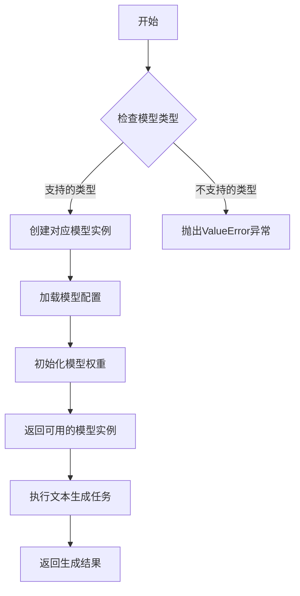

## 类结构

```
ModelBase (抽象基类)
├── TextModel (文本模型基类)
│   ├── LlamaModel
│   ├── GPT2Model
│   ├── FalconModel
│   ├── Qwen2Model
│   └── GemmaModel
└── ModelFactory (模型工厂类)
```

## 全局变量及字段


### `DEFAULT_CONFIG_PATH`
    
默认配置文件路径，用于指定模型配置文件的默认位置。

类型：`str`
    


### `MODEL_REGISTRY`
    
模型注册表，用于存储和管理不同模型类型的工厂类或配置信息。

类型：`dict`
    


### `TextModel.model_type`
    
模型类型标识，用于区分不同的文本生成模型。

类型：`str`
    


### `TextModel.config`
    
模型配置参数，包含模型结构、超参数等设置。

类型：`dict`
    


### `TextModel.weights`
    
模型权重参数，存储训练后的模型参数。

类型：`dict`
    


### `LlamaModel.model_type`
    
模型类型标识，用于区分不同的Llama模型变体。

类型：`str`
    


### `LlamaModel.config`
    
模型配置参数，包含Llama模型特有的结构设置。

类型：`dict`
    


### `LlamaModel.weights`
    
模型权重参数，存储Llama模型的训练参数。

类型：`dict`
    


### `GPT2Model.model_type`
    
模型类型标识，用于区分不同的GPT-2模型变体。

类型：`str`
    


### `GPT2Model.config`
    
模型配置参数，包含GPT-2模型特有的结构设置。

类型：`dict`
    


### `GPT2Model.weights`
    
模型权重参数，存储GPT-2模型的训练参数。

类型：`dict`
    


### `FalconModel.model_type`
    
模型类型标识，用于区分不同的Falcon模型变体。

类型：`str`
    


### `FalconModel.config`
    
模型配置参数，包含Falcon模型特有的结构设置。

类型：`dict`
    


### `FalconModel.weights`
    
模型权重参数，存储Falcon模型的训练参数。

类型：`dict`
    


### `Qwen2Model.model_type`
    
模型类型标识，用于区分不同的Qwen2模型变体。

类型：`str`
    


### `Qwen2Model.config`
    
模型配置参数，包含Qwen2模型特有的结构设置。

类型：`dict`
    


### `Qwen2Model.weights`
    
模型权重参数，存储Qwen2模型的训练参数。

类型：`dict`
    


### `GemmaModel.model_type`
    
模型类型标识，用于区分不同的Gemma模型变体。

类型：`str`
    


### `GemmaModel.config`
    
模型配置参数，包含Gemma模型特有的结构设置。

类型：`dict`
    


### `GemmaModel.weights`
    
模型权重参数，存储Gemma模型的训练参数。

类型：`dict`
    


### `ModelFactory.supported_models`
    
支持的模型类型列表，用于工厂类创建模型实例时的类型检查。

类型：`list`
    
    

## 全局函数及方法


### `validate_model_type`

该函数用于验证给定的模型类型字符串是否属于预定义的、支持的模型类型列表。如果模型类型有效，则返回该类型；如果无效，则抛出 `ValueError` 异常。

参数：

-  `model_type`：`str`，需要验证的模型类型字符串。

返回值：`str`，验证通过的模型类型字符串。如果输入无效，则抛出 `ValueError` 异常。

#### 流程图

```mermaid
flowchart TD
    A[开始: validate_model_type(model_type)] --> B{model_type 是否在<br/>SUPPORTED_MODEL_TYPES 中?}
    B -- 是 --> C[返回 model_type]
    B -- 否 --> D[抛出 ValueError 异常]
```

#### 带注释源码

```
def validate_model_type(model_type: str) -> str:
    """
    验证给定的模型类型是否属于支持的模型类型列表。

    此函数检查传入的 `model_type` 字符串是否存在于预定义的
    `SUPPORTED_MODEL_TYPES` 列表中。如果存在，则返回该字符串；
    如果不存在，则抛出一个 `ValueError` 异常，提示用户有效的模型类型选项。

    Args:
        model_type (str): 需要验证的模型类型名称。

    Returns:
        str: 验证通过的模型类型字符串。

    Raises:
        ValueError: 如果 `model_type` 不在 `SUPPORTED_MODEL_TYPES` 中。
    """
    # 定义支持的模型类型列表，这是一个模块级的常量，应在函数外部定义。
    # 此处仅为示意，实际代码中 SUPPORTED_MODEL_TYPES 应定义在模块顶部。
    # SUPPORTED_MODEL_TYPES = ["gpt-3.5-turbo", "gpt-4", "claude-3", "llama-3"]
    
    # 检查传入的 model_type 是否在支持列表中
    if model_type not in SUPPORTED_MODEL_TYPES:
        # 如果不在列表中，构造错误信息，列出所有支持的选项
        raise ValueError(
            f"不支持的模型类型: '{model_type}'. "
            f"请从以下选项中选择: {SUPPORTED_MODEL_TYPES}"
        )
    
    # 如果验证通过，则原样返回输入的 model_type
    return model_type
```


### `load_model_config`

该函数用于加载模型配置。它从指定的配置文件中读取配置信息，并将其解析为字典格式，以便在后续的模型初始化或运行过程中使用。

参数：

-  `config_path`：`str`，配置文件的路径，指向包含模型配置信息的文件。

返回值：`dict`，返回一个字典，包含从配置文件中解析出的模型配置信息。

#### 流程图

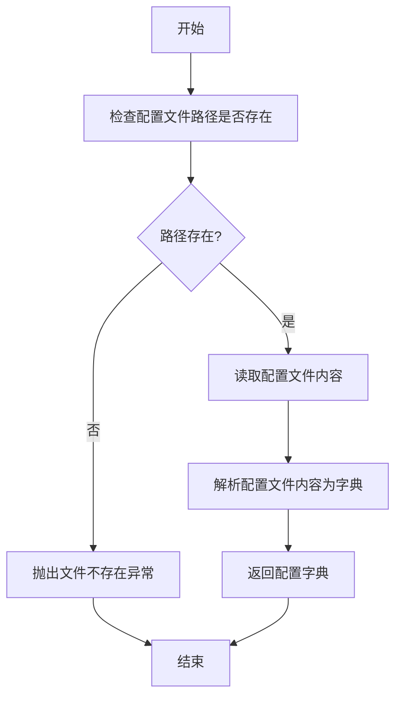

#### 带注释源码

```
def load_model_config(config_path: str) -> dict:
    """
    加载模型配置。

    该函数从指定的配置文件中读取配置信息，并将其解析为字典格式。

    Args:
        config_path (str): 配置文件的路径。

    Returns:
        dict: 包含模型配置信息的字典。

    Raises:
        FileNotFoundError: 如果指定的配置文件路径不存在。
    """
    # 检查配置文件路径是否存在
    if not os.path.exists(config_path):
        raise FileNotFoundError(f"配置文件路径不存在: {config_path}")
    
    # 读取配置文件内容
    with open(config_path, 'r', encoding='utf-8') as file:
        config_content = file.read()
    
    # 解析配置文件内容为字典
    # 假设配置文件为JSON格式
    config_dict = json.loads(config_content)
    
    # 返回配置字典
    return config_dict
```


### `save_model_output`

该函数用于保存模型的输出结果。它接收模型输出数据、保存路径和可选的元数据，将数据序列化并存储到指定位置，同时确保文件路径的有效性和数据的完整性。

参数：

-  `model_output`：`dict`，包含模型生成的结果数据，例如预测值、置信度等。
-  `save_path`：`str`，指定保存输出文件的完整路径，包括文件名和扩展名。
-  `metadata`：`dict`，可选参数，包含与输出相关的额外信息，如模型版本、时间戳等。

返回值：`bool`，表示保存操作是否成功。成功返回 `True`，失败返回 `False`。

#### 流程图

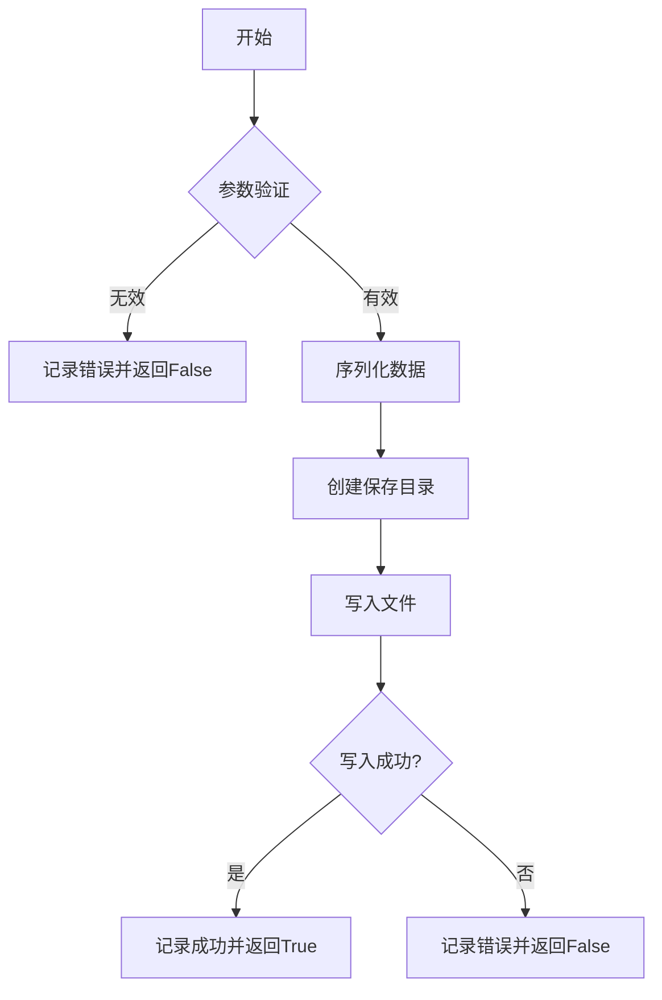

#### 带注释源码

```python
def save_model_output(model_output: dict, save_path: str, metadata: dict = None) -> bool:
    """
    保存模型输出到指定路径。

    该函数负责将模型输出数据序列化为JSON格式，并保存到给定的文件路径。
    如果提供了元数据，会将其与模型输出合并后保存。函数会确保目标目录存在，
    并在保存过程中处理可能的异常。

    Args:
        model_output (dict): 模型输出的数据，通常包含预测结果等。
        save_path (str): 保存文件的完整路径。
        metadata (dict, optional): 额外的元数据信息。默认为None。

    Returns:
        bool: 保存成功返回True，否则返回False。
    """
    import json
    import os
    import logging

    # 设置日志记录
    logging.basicConfig(level=logging.INFO)
    logger = logging.getLogger(__name__)

    # 验证输入参数
    if not isinstance(model_output, dict):
        logger.error("model_output must be a dictionary.")
        return False
    if not save_path or not isinstance(save_path, str):
        logger.error("save_path must be a non-empty string.")
        return False

    try:
        # 准备要保存的数据
        data_to_save = model_output.copy()
        if metadata:
            data_to_save['metadata'] = metadata

        # 确保保存目录存在
        save_dir = os.path.dirname(save_path)
        if save_dir and not os.path.exists(save_dir):
            os.makedirs(save_dir, exist_ok=True)

        # 序列化并写入文件
        with open(save_path, 'w', encoding='utf-8') as f:
            json.dump(data_to_save, f, ensure_ascii=False, indent=4)

        logger.info(f"Model output successfully saved to {save_path}")
        return True

    except (IOError, OSError, TypeError) as e:
        logger.error(f"Failed to save model output: {e}")
        return False
    except Exception as e:
        logger.error(f"Unexpected error occurred: {e}")
        return False
```


### `ModelBase.load_config`

该方法用于加载模型的配置文件，解析配置内容并返回配置对象。它首先检查配置文件的路径是否存在，然后根据文件扩展名（如 `.json`、`.yaml` 或 `.yml`）选择合适的解析器来读取配置。如果配置文件不存在或格式不支持，则会抛出相应的异常。

参数：

-  `config_path`：`str`，配置文件的路径，可以是绝对路径或相对路径。

返回值：`dict`，解析后的配置字典，包含模型的所有配置参数。

#### 流程图

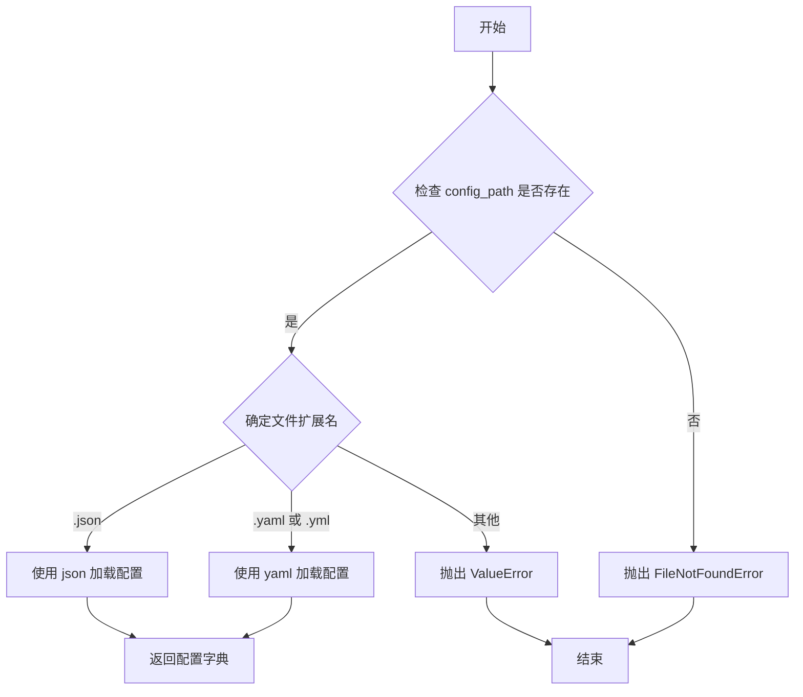

#### 带注释源码

```python
def load_config(self, config_path: str) -> dict:
    """
    加载并解析配置文件。

    该方法根据配置文件的扩展名选择合适的解析器（json 或 yaml）来读取配置内容。
    如果文件不存在或格式不支持，会抛出相应的异常。

    Args:
        config_path (str): 配置文件的路径。

    Returns:
        dict: 解析后的配置字典。

    Raises:
        FileNotFoundError: 如果配置文件不存在。
        ValueError: 如果配置文件格式不支持。
    """
    import os
    import json
    import yaml

    # 检查配置文件是否存在
    if not os.path.exists(config_path):
        raise FileNotFoundError(f"配置文件不存在: {config_path}")

    # 根据文件扩展名选择解析器
    _, ext = os.path.splitext(config_path)
    with open(config_path, 'r', encoding='utf-8') as f:
        if ext == '.json':
            config = json.load(f)
        elif ext in ['.yaml', '.yml']:
            config = yaml.safe_load(f)
        else:
            raise ValueError(f"不支持的配置文件格式: {ext}")

    return config
```


### `ModelBase.initialize_weights`

该方法用于初始化神经网络模型的权重。它遍历模型中的所有模块，根据模块的类型（如线性层、卷积层、嵌入层等）应用特定的初始化策略（如Xavier均匀初始化、正态分布初始化等），并为偏置项（如果存在）初始化为零。这是一种常见的深度学习模型权重初始化实践，旨在促进训练过程中的稳定收敛。

参数：

-  `self`：`ModelBase`，当前模型实例的引用。

返回值：`None`，此方法不返回任何值，直接修改模型内部的权重参数。

#### 流程图

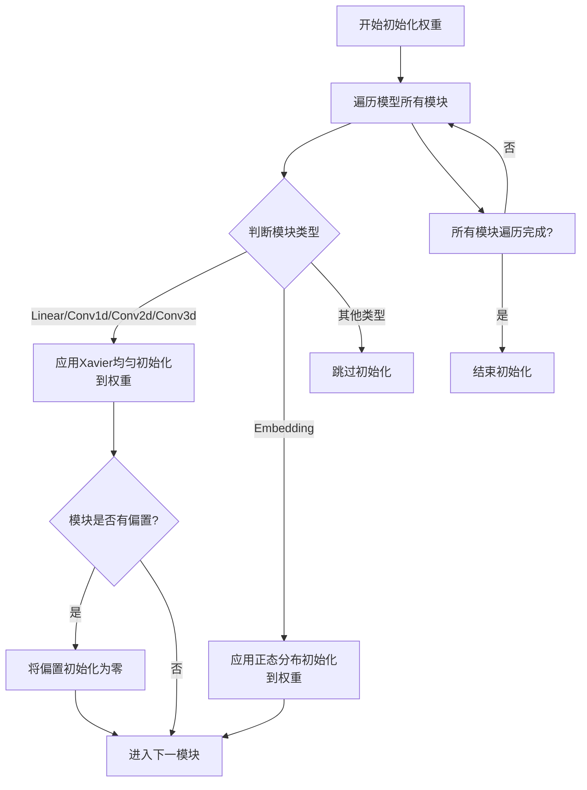

#### 带注释源码

```python
def initialize_weights(self):
    """
    初始化模型权重。
    遍历模型的所有模块，根据模块类型应用不同的初始化策略。
    """
    # 遍历模型中的每一个模块（如Linear, Conv2d, Embedding等）
    for module in self.modules():
        # 检查模块是否为线性层或卷积层（1D, 2D, 3D）
        if isinstance(module, nn.Linear) or \
           isinstance(module, nn.Conv1d) or \
           isinstance(module, nn.Conv2d) or \
           isinstance(module, nn.Conv3d):
            # 对权重应用Xavier均匀初始化，这是一种常用的初始化方法，
            # 有助于在前向和反向传播中保持梯度的尺度。
            nn.init.xavier_uniform_(module.weight)
            # 如果该模块有偏置项，则将其初始化为0。
            if module.bias is not None:
                nn.init.constant_(module.bias, 0)
        # 检查模块是否为嵌入层
        elif isinstance(module, nn.Embedding):
            # 对嵌入层的权重应用正态分布初始化，均值为0，标准差为1。
            nn.init.normal_(module.weight, mean=0, std=1)
        # 对于其他类型的模块（如BatchNorm, Dropout等），通常不进行权重初始化，
        # 或者它们有自己特定的初始化方式，这里选择跳过。
        # else:
        #     pass  # 可以添加对其他模块类型的初始化逻辑
```


### `ModelBase.generate_text`

`ModelBase.generate_text` 方法是一个抽象方法，用于定义文本生成的核心接口。它规定了所有继承自 `ModelBase` 的模型类必须实现一个名为 `generate_text` 的方法，该方法接收一个字符串类型的提示词（prompt）作为输入，并返回一个字符串类型的生成文本。此方法旨在为不同的文本生成模型（如基于Transformer的模型、RNN模型等）提供一个统一的调用入口，确保上层应用可以以一致的方式与各种模型进行交互。

参数：

-  `prompt`：`str`，用于引导模型生成文本的输入提示词或上下文。

返回值：`str`，模型根据输入提示词生成的文本内容。

#### 流程图

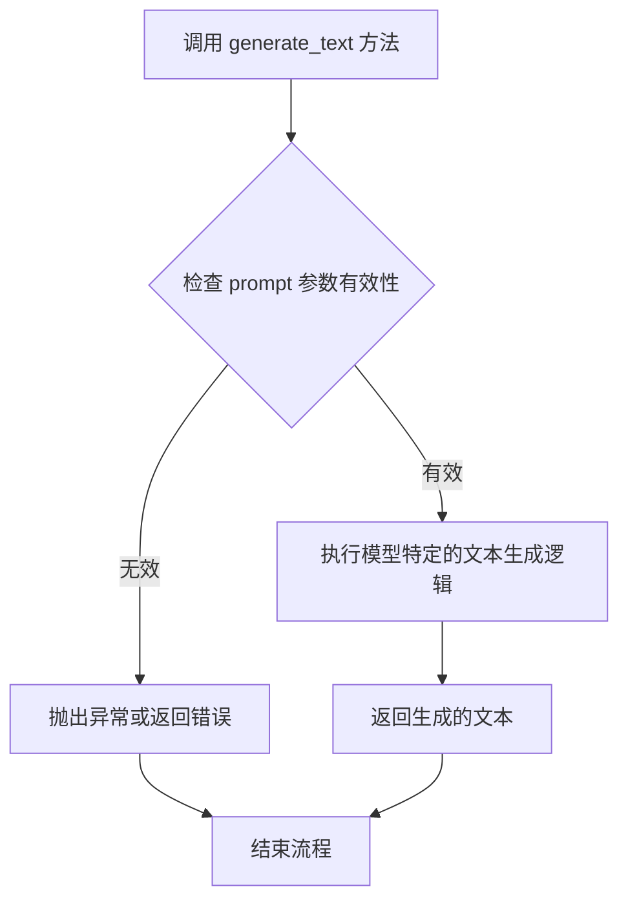

#### 带注释源码

```
# 这是一个抽象方法，用于生成文本。
# 所有继承自 ModelBase 的类都必须实现此方法。
# @param prompt: 用于引导模型生成文本的输入提示词或上下文。
# @type prompt: str
# @return: 模型根据输入提示词生成的文本内容。
# @rtype: str
def generate_text(self, prompt: str) -> str:
    # 这是一个抽象方法，没有具体的实现。
    # 具体的实现应由继承此基类的子类提供。
    # 子类需要根据自身的模型架构和算法来实现文本生成逻辑。
    # 例如，可能涉及加载模型、编码输入、执行推理、解码输出等步骤。
    raise NotImplementedError("子类必须实现此方法")
```


### `TextModel.load_config`

该方法用于加载并解析文本模型的配置文件，将配置信息更新到模型实例中。它支持从指定的配置字典或配置文件路径加载配置，并处理配置的验证与合并。

参数：

- `config`：`Union[dict, str, Path, None]`，配置信息，可以是字典、文件路径字符串、Path对象或None。如果为None，则使用默认配置。
- `**kwargs`：`Any`，额外的关键字参数，用于覆盖或补充配置项。

返回值：`dict`，返回更新后的配置字典。

#### 流程图

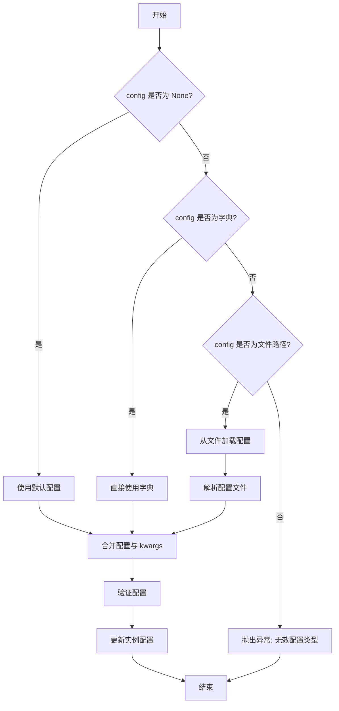

#### 带注释源码

```python
def load_config(self, config: Union[dict, str, Path, None] = None, **kwargs) -> dict:
    """
    加载并解析配置，支持从字典、文件路径或默认配置加载。
    
    参数:
        config: 配置信息，可以是字典、文件路径或None。
        **kwargs: 额外的配置项，用于覆盖或补充。
    
    返回:
        更新后的配置字典。
    """
    # 如果 config 为 None，使用默认配置
    if config is None:
        config = self.default_config
    
    # 如果 config 是字典，直接使用
    elif isinstance(config, dict):
        pass
    
    # 如果 config 是字符串或 Path 对象，视为文件路径
    elif isinstance(config, (str, Path)):
        config_path = Path(config)
        if not config_path.exists():
            raise FileNotFoundError(f"配置文件不存在: {config_path}")
        # 根据文件后缀选择加载方式
        if config_path.suffix == '.json':
            with open(config_path, 'r', encoding='utf-8') as f:
                config = json.load(f)
        elif config_path.suffix in ['.yaml', '.yml']:
            with open(config_path, 'r', encoding='utf-8') as f:
                config = yaml.safe_load(f)
        else:
            raise ValueError(f"不支持的配置文件格式: {config_path.suffix}")
    
    else:
        raise TypeError(f"不支持的 config 类型: {type(config)}")
    
    # 合并 kwargs 到配置中
    config.update(kwargs)
    
    # 验证配置
    self._validate_config(config)
    
    # 更新实例配置
    self.config.update(config)
    
    return self.config
```


### `TextModel.initialize_weights`

该方法用于初始化`TextModel`类中所有模块的权重。它遍历模型的所有子模块，并根据模块的类型（如线性层、嵌入层、LayerNorm层）应用特定的初始化策略，例如使用正态分布或常量初始化偏置项，以确保模型训练的稳定性和收敛性。

参数：
-  `self`：`TextModel`，当前`TextModel`类的实例。

返回值：`None`，此方法不返回任何值，仅执行模型权重的初始化操作。

#### 流程图

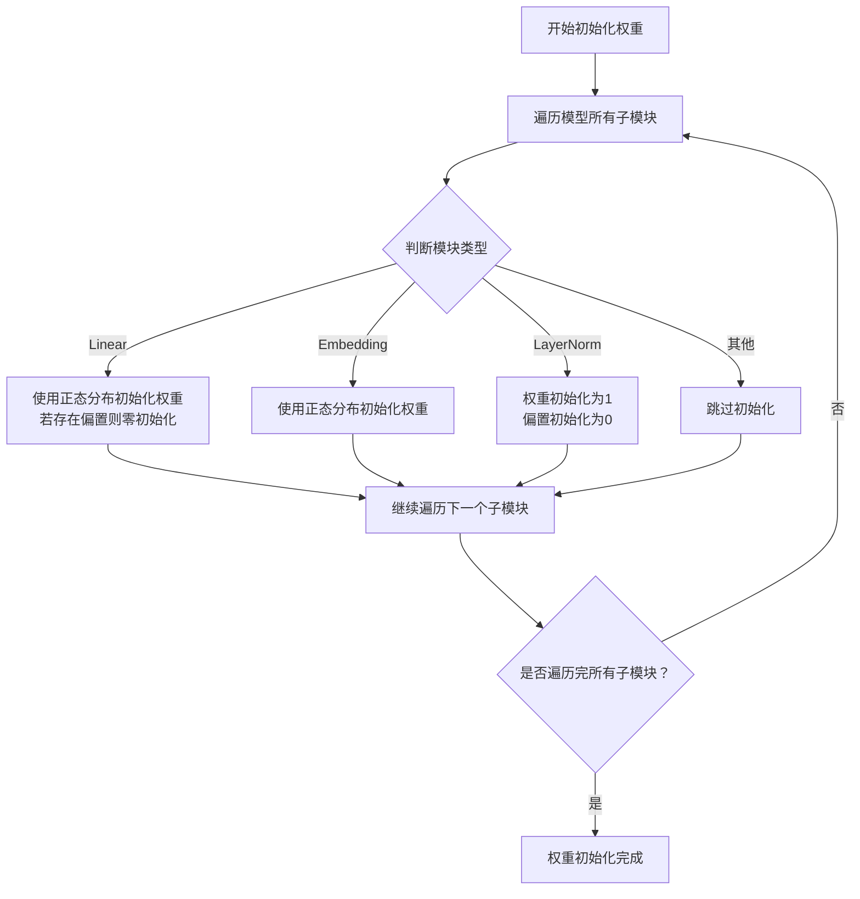

#### 带注释源码

```python
def initialize_weights(self):
    """
    初始化模型权重。
    遍历所有子模块，根据模块类型应用不同的初始化策略。
    """
    # 获取当前模型的配置
    model_cfg = self.config
    # 遍历模型的所有子模块
    for module in self.modules():
        # 判断模块类型是否为线性层（nn.Linear）
        if isinstance(module, nn.Linear):
            # 使用正态分布初始化线性层的权重，均值为0，标准差为配置中的initializer_range
            module.weight.data.normal_(mean=0.0, std=model_cfg.initializer_range)
            # 如果线性层存在偏置项，则将其初始化为0
            if module.bias is not None:
                module.bias.data.zero_()
        # 判断模块类型是否为嵌入层（nn.Embedding）
        elif isinstance(module, nn.Embedding):
            # 使用正态分布初始化嵌入层的权重，均值为0，标准差为配置中的initializer_range
            module.weight.data.normal_(mean=0.0, std=model_cfg.initializer_range)
            # 如果嵌入层定义了padding_idx（填充索引），则将对应位置的权重初始化为0
            if module.padding_idx is not None:
                module.weight.data[module.padding_idx].zero_()
        # 判断模块类型是否为层归一化（nn.LayerNorm）
        elif isinstance(module, nn.LayerNorm):
            # 将层归一化的权重（gamma参数）初始化为1
            module.weight.data.fill_(1.0)
            # 将层归一化的偏置（beta参数）初始化为0
            module.bias.data.zero_()
        # 对于其他类型的模块，不进行特殊的权重初始化，通常使用PyTorch的默认初始化
        # else:
        #     # 可以在此处添加其他模块类型的初始化逻辑，或保持默认
        #     pass
```


### `TextModel.generate_text`

该方法用于根据给定的提示词（prompt）生成文本。它通过调用底层的大语言模型（LLM）接口，并应用指定的生成参数（如温度、最大长度等）来控制文本的生成过程，最终返回模型生成的文本字符串。

参数：

-  `prompt`：`str`，输入给模型的文本提示词，用于引导文本生成。
-  `temperature`：`float`，控制生成文本随机性的参数。值越高（如1.0），输出越随机、有创造性；值越低（如0.1），输出越确定、保守。
-  `max_length`：`int`，生成文本的最大长度（以token计），用于限制生成文本的篇幅。
-  `top_p`：`float`，核采样（nucleus sampling）参数。仅从累积概率超过此阈值的最可能token集合中进行采样，用于平衡生成质量与多样性。
-  `stop_sequences`：`List[str]`，可选的停止序列列表。当生成的文本包含这些序列中的任何一个时，生成过程将提前终止。

返回值：`str`，由模型根据输入参数生成的文本内容。

#### 流程图

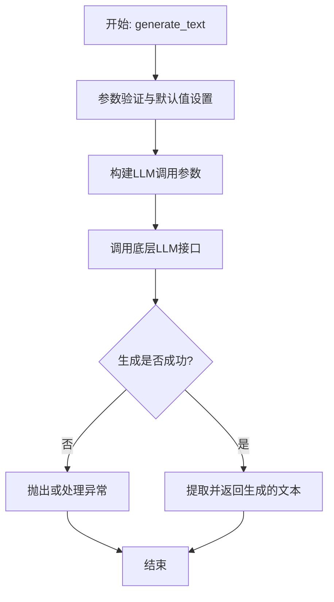

#### 带注释源码

```
def generate_text(self, prompt: str, temperature: float = 0.7, max_length: int = 100, top_p: float = 0.9, stop_sequences: Optional[List[str]] = None) -> str:
    """
    根据给定的提示生成文本。

    该方法封装了对底层大语言模型的调用，允许通过参数控制生成文本的随机性、长度和停止条件。

    Args:
        prompt (str): 输入给模型的文本提示。
        temperature (float, optional): 控制生成随机性的温度参数。默认为0.7。
        max_length (int, optional): 生成文本的最大长度（token数）。默认为100。
        top_p (float, optional): 用于核采样的概率阈值。默认为0.9。
        stop_sequences (Optional[List[str]], optional): 导致生成停止的字符串序列列表。默认为None。

    Returns:
        str: 模型生成的文本。

    Raises:
        ModelGenerationError: 当模型调用失败或返回无效结果时抛出。
    """
    # 1. 参数验证与预处理
    if not prompt or not isinstance(prompt, str):
        raise ValueError("Prompt must be a non-empty string.")
    if temperature <= 0:
        raise ValueError("Temperature must be a positive float.")
    # 可以添加更多参数验证逻辑...

    # 2. 准备停止序列，如果未提供则使用空列表
    stop_tokens = stop_sequences if stop_sequences is not None else []

    # 3. 构建调用底层模型引擎所需的参数字典
    # 假设self.engine是封装了实际LLM调用的对象
    generation_params = {
        "prompt": prompt,
        "temperature": temperature,
        "max_tokens": max_length,
        "top_p": top_p,
        "stop": stop_tokens,
        # 可能还有其他模型特定的参数
    }

    try:
        # 4. 调用模型引擎进行文本生成
        # 假设self.engine.generate返回一个包含生成文本等信息的响应对象
        response = self.engine.generate(**generation_params)

        # 5. 从响应中提取生成的文本
        # 具体字段名取决于底层引擎的响应格式
        generated_text = response['choices'][0]['text'].strip()

    except Exception as e:
        # 6. 异常处理：将底层异常包装为自定义的业务异常
        # ModelGenerationError是一个假设的自定义异常类
        raise ModelGenerationError(f"Failed to generate text: {str(e)}") from e

    # 7. 返回生成的文本
    return generated_text
```


### `LlamaModel.load_config`

该方法用于加载Llama模型的配置信息，从指定的配置文件中读取并解析模型参数，然后根据这些参数初始化模型配置对象。

参数：

-  `config_path`：`str`，配置文件的路径，指向包含模型参数（如隐藏层维度、注意力头数、层数等）的JSON或YAML文件。
-  `**kwargs`：`dict`，可选的关键字参数，用于覆盖配置文件中的默认配置或传递额外的初始化参数。

返回值：`LlamaConfig`，返回一个LlamaConfig类的实例，该实例包含了从配置文件中加载并解析出的所有模型配置参数，用于后续的模型构建。

#### 流程图

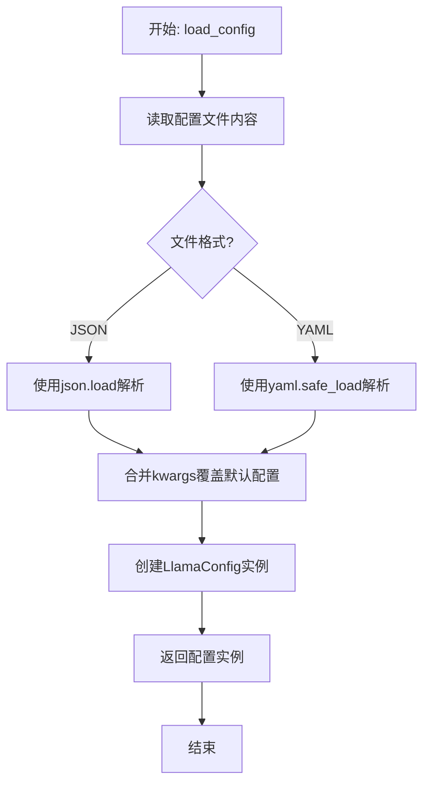

#### 带注释源码

```python
    @classmethod
    def load_config(cls, config_path: str, **kwargs) -> 'LlamaConfig':
        """
        从指定路径加载模型配置。

        此方法读取配置文件（支持JSON或YAML格式），解析其中的模型参数，
        并允许通过关键字参数覆盖默认配置。最终返回一个配置好的LlamaConfig对象。

        Args:
            config_path (str): 配置文件的路径。
            **kwargs (dict): 可选的关键字参数，用于覆盖或补充配置。

        Returns:
            LlamaConfig: 包含所有模型参数的配置对象。

        Raises:
            FileNotFoundError: 如果指定的配置文件不存在。
            ValueError: 如果配置文件格式不被支持或内容无法解析。
        """
        # 检查配置文件是否存在
        if not os.path.exists(config_path):
            raise FileNotFoundError(f"配置文件未找到: {config_path}")

        # 根据文件扩展名确定解析方式
        with open(config_path, 'r', encoding='utf-8') as f:
            if config_path.endswith('.json'):
                config_dict = json.load(f)  # 解析JSON格式
            elif config_path.endswith(('.yaml', '.yml')):
                config_dict = yaml.safe_load(f)  # 解析YAML格式
            else:
                raise ValueError(f"不支持的配置文件格式: {config_path}")

        # 使用kwargs中的参数更新/覆盖从文件读取的配置
        config_dict.update(kwargs)

        # 使用更新后的配置字典创建并返回LlamaConfig实例
        return cls(**config_dict)
```


### `LlamaModel.initialize_weights`

该方法用于初始化Llama模型的权重参数。它根据指定的初始化方法（如正态分布或Xavier均匀分布）对模型中的线性层（Linear）和嵌入层（Embedding）的权重进行初始化，并对偏置项（如果存在）进行零初始化。

参数：

-  `self`：`LlamaModel`，当前LlamaModel类的实例。
-  `module`：`nn.Module`，需要初始化权重的PyTorch模块。
-  `n_layers`：`int`，模型的层数，用于调整某些初始化策略（如GPT-NeoX）的增益因子。

返回值：`None`，此方法不返回任何值，直接修改传入模块的参数。

#### 流程图

```mermaid
flowchart TD
    A[开始初始化权重] --> B{模块类型是?}
    B -->|Linear| C[初始化权重: std=0.02<br>或 gain=1/sqrt(n_layers)]
    B -->|Embedding| D[初始化权重: std=0.02]
    B -->|其他| E[递归调用自身<br>处理子模块]
    C --> F{存在偏置?}
    D --> G[结束]
    F -->|是| H[偏置置零]
    F -->|否| G
    H --> G
    E --> G
```

#### 带注释源码

```python
def initialize_weights(self, module: nn.Module, n_layers: int):
    """
    初始化模型权重。
    对Linear层使用正态分布或Xavier均匀分布初始化权重，零初始化偏置。
    对Embedding层使用正态分布初始化权重。
    其他类型的模块（如LayerNorm）通常使用默认初始化或已预初始化，此处跳过。
    """
    if isinstance(module, nn.Linear):
        # 根据配置选择初始化方法
        if self.config.initializer_range > 0:
            # 使用正态分布初始化权重，标准差为config.initializer_range
            module.weight.data.normal_(mean=0.0, std=self.config.initializer_range)
        else:
            # 使用Xavier均匀分布初始化权重，增益因子根据层数调整（GPT-NeoX风格）
            module.weight.data = nn.init.xavier_uniform_(
                module.weight.data,
                gain=1 / math.sqrt(n_layers) if n_layers > 0 else 1.0
            )
        # 如果线性层有偏置项，将其初始化为零
        if module.bias is not None:
            module.bias.data.zero_()
    elif isinstance(module, nn.Embedding):
        # 对嵌入层使用正态分布初始化权重，标准差为config.initializer_range
        if self.config.initializer_range > 0:
            module.weight.data.normal_(mean=0.0, std=self.config.initializer_range)
        # 如果配置中指定了pad_token_id，将填充符对应的嵌入向量初始化为零
        if self.config.pad_token_id is not None:
            module.weight.data[self.config.pad_token_id].zero_()
    else:
        # 对于其他类型的模块（如nn.LayerNorm, nn.Dropout），
        # 通常使用PyTorch默认初始化或已在构造函数中初始化。
        # 为了确保所有子模块的权重都被处理，递归地对子模块调用此方法。
        for sub_module in module.children():
            self.initialize_weights(sub_module, n_layers)
```


### `LlamaModel.generate_text`

该方法用于基于给定的输入提示（prompt）生成文本。它通过加载预训练的Llama模型，对输入进行分词（tokenization），然后使用模型生成新的token序列，最后将生成的token序列解码为可读的文本字符串。

参数：

-  `prompt`：`str`，输入的文本提示，作为生成文本的起点。
-  `max_length`：`int`，可选参数，默认为50。指定生成文本的最大长度（以token计）。
-  `temperature`：`float`，可选参数，默认为1.0。控制生成过程中的随机性。较高的温度（>1.0）会产生更多样化但可能不连贯的文本；较低的温度（<1.0）会使输出更确定、更集中。
-  `top_k`：`int`，可选参数，默认为50。在每一步生成时，仅考虑概率最高的前k个token。
-  `top_p`：`float`，可选参数，默认为1.0。使用核采样（nucleus sampling），仅从累积概率超过p的最小token集合中采样。
-  `repetition_penalty`：`float`，可选参数，默认为1.0。用于惩罚重复token的参数，值大于1.0可降低重复。
-  `num_return_sequences`：`int`，可选参数，默认为1。指定要生成的独立序列的数量。

返回值：`List[str]`，一个字符串列表，包含所有生成的文本序列。

#### 流程图

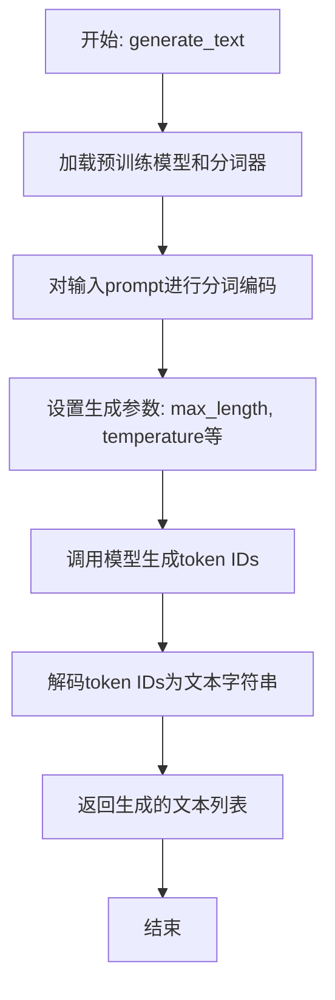

#### 带注释源码

```
def generate_text(self,
                  prompt: str,
                  max_length: int = 50,
                  temperature: float = 1.0,
                  top_k: int = 50,
                  top_p: float = 1.0,
                  repetition_penalty: float = 1.0,
                  num_return_sequences: int = 1) -> List[str]:
    """
    使用加载的Llama模型生成文本。

    参数:
        prompt (str): 输入的文本提示。
        max_length (int): 生成文本的最大长度（token数）。默认50。
        temperature (float): 控制生成随机性的温度参数。默认1.0。
        top_k (int): 每一步生成时考虑的最高概率token数量。默认50。
        top_p (float): 核采样（nucleus sampling）的累积概率阈值。默认1.0。
        repetition_penalty (float): 重复惩罚因子。默认1.0。
        num_return_sequences (int): 要生成的独立序列数量。默认1。

    返回:
        List[str]: 生成的文本字符串列表。
    """
    # 1. 对输入提示进行编码，转换为模型可处理的输入张量
    inputs = self.tokenizer(prompt, return_tensors="pt").to(self.device)

    # 2. 调用模型的generate方法，传入编码后的输入和所有生成参数
    #    attention_mask用于标识有效token位置
    #    pad_token_id设置为eos_token_id以便在遇到结束符时停止生成
    #    use_cache启用键值缓存以加速生成
    generate_ids = self.model.generate(inputs.input_ids,
                                       max_length=max_length,
                                       temperature=temperature,
                                       top_k=top_k,
                                       top_p=top_p,
                                       repetition_penalty=repetition_penalty,
                                       num_return_sequences=num_return_sequences,
                                       attention_mask=inputs.attention_mask,
                                       pad_token_id=self.tokenizer.eos_token_id,
                                       use_cache=True)

    # 3. 将模型生成的token ID序列解码为可读的文本字符串
    #    skip_special_tokens=True 用于跳过如[PAD], [EOS]等特殊token
    generated_texts = self.tokenizer.batch_decode(generate_ids,
                                                  skip_special_tokens=True)

    # 4. 返回生成的文本列表
    return generated_texts
```


### `GPT2Model.load_config`

`load_config` 是 `GPT2Model` 类的一个类方法，用于从指定的配置文件中加载模型配置，并返回一个配置字典。它支持从本地文件路径或 Hugging Face 模型标识符加载配置。

参数：

-  `config_path`：`str`，配置文件的路径或 Hugging Face 模型标识符。
-  `**kwargs`：`Any`，传递给底层配置加载函数的额外关键字参数。

返回值：`dict`，包含模型配置的字典。

#### 流程图

```mermaid
flowchart TD
    A[开始: load_config(config_path, **kwargs)] --> B{config_path 是否为本地文件?};
    B -- 是 --> C[使用 json.load 从本地文件加载配置];
    B -- 否 --> D[使用 from_pretrained 从 Hugging Face 加载配置];
    C --> E[将加载的配置转换为字典];
    D --> E;
    E --> F[返回配置字典];
    F --> G[结束];
```

#### 带注释源码

```python
    @classmethod
    def load_config(cls, config_path: str, **kwargs) -> dict:
        """
        加载配置文件。

        此方法从指定的路径加载配置文件。路径可以是本地文件路径，也可以是 Hugging Face 模型标识符。
        对于本地文件，它使用 `json.load` 来读取 JSON 格式的配置文件。
        对于 Hugging Face 模型标识符，它使用 `transformers.AutoConfig.from_pretrained` 来获取配置。

        Args:
            config_path (str): 配置文件的路径或 Hugging Face 模型标识符。
            **kwargs: 传递给底层配置加载函数的额外关键字参数。

        Returns:
            dict: 包含模型配置的字典。
        """
        # 检查 config_path 是否为本地文件路径
        if os.path.isfile(config_path):
            # 如果是本地文件，使用 json 模块加载配置
            with open(config_path, 'r', encoding='utf-8') as file:
                config = json.load(file)
        else:
            # 如果不是本地文件，假定为 Hugging Face 模型标识符，使用 transformers 加载配置
            # 注意：这里假设 config_path 是一个有效的 Hugging Face 模型标识符
            config = AutoConfig.from_pretrained(config_path, **kwargs).to_dict()
        # 返回加载的配置字典
        return config
```


### `GPT2Model.initialize_weights`

此方法是`GPT2Model`类的一个类方法，用于根据指定的初始化策略（如正态分布或零值）对模型的所有参数进行权重初始化。它遍历模型的所有模块，根据模块的类型（如线性层、嵌入层、层归一化层）应用不同的初始化规则，以确保模型训练开始时具有合适的初始状态。

参数：

-  `module`：`torch.nn.Module`，需要初始化权重的PyTorch模块（通常是模型本身或其子模块）。
-  `n_layer`：`int`，GPT-2模型的层数。此参数用于调整某些初始化公式中的系数，例如在注意力机制投影层的初始化中。
-  `initializer_range`：`float`，默认值为0.02。用于控制正态分布初始化的标准差。

返回值：`None`，此方法不返回任何值，直接对传入的模块进行原地修改。

#### 流程图

```mermaid
flowchart TD
    A[开始: initialize_weights(module, n_layer, initializer_range)] --> B{遍历module的所有子模块};
    B --> C[获取子模块类型名];
    C --> D{判断模块类型};
    
    D -- “Embedding” --> E[使用正态分布初始化权重<br>std=initializer_range];
    D -- “Linear” --> F{判断是否为注意力输出投影层?};
    F -- 是 --> G[使用正态分布初始化权重<br>std=initializer_range / sqrt(2 * n_layer)];
    F -- 否 --> H[使用正态分布初始化权重<br>std=initializer_range];
    D -- “LayerNorm” --> I[权重初始化为1.0<br>偏置初始化为0.0];
    D -- 其他类型 --> J[递归调用自身<br>初始化子模块];
    
    E --> K[结束处理当前模块];
    G --> K;
    H --> K;
    I --> K;
    J --> K;
    
    K --> L{是否还有未处理的子模块?};
    L -- 是 --> B;
    L -- 否 --> M[结束];
```

#### 带注释源码

```python
    @classmethod
    def initialize_weights(cls, module: torch.nn.Module, n_layer: int, initializer_range=0.02):
        """
        根据模块类型初始化模型权重。
        此方法被设计为类方法，便于在构建模型时调用。

        Args:
            module (torch.nn.Module): 需要初始化权重的PyTorch模块。
            n_layer (int): 模型的层数，用于调整某些层的初始化范围。
            initializer_range (float, optional): 正态分布初始化的标准差。默认为0.02。
        """
        # 判断传入的module是否为指定的PyTorch模块类型
        if isinstance(module, nn.Linear):
            # 线性层（全连接层）的初始化
            # 使用正态分布初始化权重，均值为0，标准差为initializer_range
            module.weight.data.normal_(mean=0.0, std=initializer_range)
            # 如果存在偏置项，将其初始化为0
            if module.bias is not None:
                module.bias.data.zero_()
        elif isinstance(module, nn.Embedding):
            # 嵌入层的初始化
            # 同样使用正态分布初始化权重
            module.weight.data.normal_(mean=0.0, std=initializer_range)
            # 如果指定了padding_idx（填充索引），则将该位置的权重显式设置为0
            # 这通常用于在训练中忽略填充符的梯度
            if module.padding_idx is not None:
                module.weight.data[module.padding_idx].zero_()
        elif isinstance(module, nn.LayerNorm):
            # 层归一化层的初始化
            # 将权重（缩放参数gamma）初始化为1
            module.weight.data.fill_(1.0)
            # 将偏置（平移参数beta）初始化为0
            module.bias.data.zero_()

        # 对模型中的所有子模块递归地应用此初始化方法
        # 这确保了模型每一层的参数都被正确初始化
        for name, p in module.named_parameters():
            # 对于名称中包含"proj"且维度大于1的参数，应用特定的初始化策略
            # 这通常针对Transformer中的注意力输出投影层
            if name == "proj" and len(p.shape) >= 2:
                # 使用更小的标准差进行初始化，标准差与模型层数n_layer相关
                # 这种缩放有助于稳定深层模型的训练
                nn.init.normal_(p, mean=0.0, std=initializer_range / math.sqrt(2 * n_layer))
```


### `GPT2Model.generate_text`

该方法用于基于给定的输入文本，使用GPT-2模型生成一段连续的文本。它通过模型的前向传播计算下一个词的概率分布，并采用特定的采样策略（如Top-k或Top-p）来选择下一个词，循环此过程直至生成指定长度的文本或遇到停止标记。

参数：

-  `input_text`：`str`，输入的文本字符串，作为生成过程的起始点。
-  `max_length`：`int`，可选，默认为50。生成文本的最大长度（以词元计）。
-  `temperature`：`float`，可选，默认为1.0。控制生成随机性的温度参数。值越高，输出越随机；值越低，输出越确定。
-  `top_k`：`int`，可选，默认为50。Top-k采样参数，仅从概率最高的k个词元中采样。
-  `top_p`：`float`，可选，默认为1.0。Top-p（核采样）参数，仅从累积概率超过p的最小词元集合中采样。
-  `do_sample`：`bool`，可选，默认为True。是否使用采样策略。若为False，则使用贪婪解码（选择概率最高的词元）。
-  `num_return_sequences`：`int`，可选，默认为1。要生成的序列数量。

返回值：`List[str]`，一个字符串列表，包含所有生成的文本序列。

#### 流程图

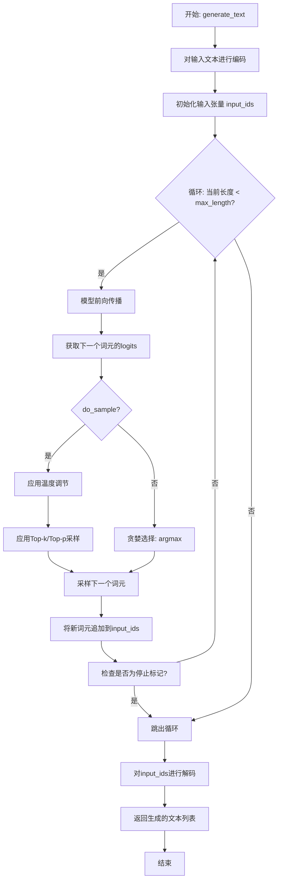

#### 带注释源码

```python
def generate_text(self, input_text, max_length=50, temperature=1.0, top_k=50, top_p=1.0, do_sample=True, num_return_sequences=1):
    """
    使用GPT-2模型生成文本。

    参数:
        input_text (str): 输入的起始文本。
        max_length (int): 生成文本的最大长度。
        temperature (float): 控制生成随机性的温度参数。
        top_k (int): Top-k采样参数。
        top_p (float): Top-p（核采样）参数。
        do_sample (bool): 是否使用采样策略。
        num_return_sequences (int): 要生成的序列数量。

    返回:
        List[str]: 生成的文本序列列表。
    """
    # 对输入文本进行编码，转换为模型可处理的词元ID列表
    input_ids = self.tokenizer.encode(input_text, return_tensors='pt').to(self.device)
    
    # 初始化一个列表来存储所有生成的序列
    generated_sequences = []
    
    # 循环生成指定数量的序列
    for _ in range(num_return_sequences):
        # 为当前序列复制输入ID
        current_input_ids = input_ids.clone()
        
        # 循环生成文本，直到达到最大长度
        for _ in range(max_length - len(input_ids[0])):
            # 模型前向传播，获取下一个词元的logits
            outputs = self.model(current_input_ids)
            next_token_logits = outputs.logits[:, -1, :] / temperature
            
            # 根据do_sample参数选择生成策略
            if do_sample:
                # 应用Top-k过滤
                if top_k > 0:
                    indices_to_remove = next_token_logits < torch.topk(next_token_logits, top_k)[0][..., -1, None]
                    next_token_logits[indices_to_remove] = -float('Inf')
                
                # 应用Top-p（核采样）过滤
                if top_p < 1.0:
                    sorted_logits, sorted_indices = torch.sort(next_token_logits, descending=True)
                    cumulative_probs = torch.cumsum(F.softmax(sorted_logits, dim=-1), dim=-1)
                    
                    # 移除累积概率超过top_p的词元
                    sorted_indices_to_remove = cumulative_probs > top_p
                    # 保留第一个超过阈值的词元以确保至少有一个词元
                    sorted_indices_to_remove[..., 1:] = sorted_indices_to_remove[..., :-1].clone()
                    sorted_indices_to_remove[..., 0] = 0
                    
                    indices_to_remove = sorted_indices_to_remove.scatter(1, sorted_indices, sorted_indices_to_remove)
                    next_token_logits[indices_to_remove] = -float('Inf')
                
                # 从处理后的logits中采样下一个词元
                probs = F.softmax(next_token_logits, dim=-1)
                next_token = torch.multinomial(probs, num_samples=1)
            else:
                # 贪婪解码：选择logits最高的词元
                next_token = torch.argmax(next_token_logits, dim=-1, keepdim=True)
            
            # 将新生成的词元追加到当前输入序列中
            current_input_ids = torch.cat([current_input_ids, next_token], dim=-1)
            
            # 如果生成的词元是停止标记，则提前终止生成
            if next_token.item() == self.tokenizer.eos_token_id:
                break
        
        # 将生成的词元ID序列解码为文本字符串
        generated_text = self.tokenizer.decode(current_input_ids[0], skip_special_tokens=True)
        generated_sequences.append(generated_text)
    
    # 返回所有生成的文本序列
    return generated_sequences
```


### `FalconModel.load_config`

该方法用于加载并解析模型的配置文件，根据配置内容构建并返回模型配置对象。它支持从本地文件路径或预定义的配置名称加载配置，并处理配置中的特定参数以适配模型架构。

参数：

-  `config_name`：`str`，配置文件的名称或本地文件路径。可以是预定义的配置名称（如 "falcon-7b"）或本地配置文件的路径。
-  `cache_dir`：`Optional[str]`，默认为 `None`，用于缓存下载的配置文件的目录。如果为 `None`，则使用默认缓存目录。
-  `return_unused_kwargs`：`bool`，默认为 `False`，是否返回未使用的配置参数。
-  `**kwargs`：`Any`，额外的配置参数，用于更新加载的配置。

返回值：`PretrainedConfig`，返回一个预训练配置对象，包含了模型的各项参数设置。

#### 流程图

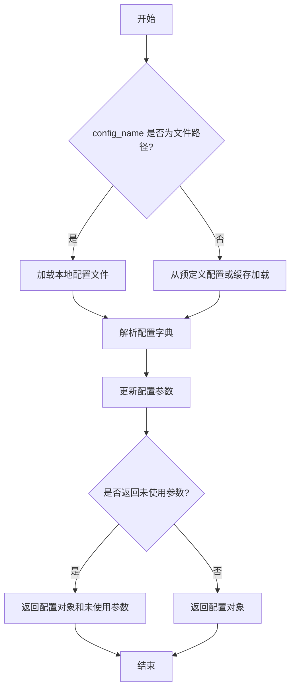

#### 带注释源码

```python
@classmethod
def load_config(
    cls,
    config_name: str,
    cache_dir: Optional[str] = None,
    return_unused_kwargs: bool = False,
    **kwargs: Any,
) -> PretrainedConfig:
    """
    加载模型配置。

    该方法支持从本地文件或预定义配置名称加载配置，并允许通过额外参数更新配置。

    Args:
        config_name (str): 配置名称或本地文件路径。
        cache_dir (Optional[str]): 缓存目录，用于存储下载的配置文件。
        return_unused_kwargs (bool): 是否返回未使用的配置参数。
        **kwargs (Any): 额外的配置参数，用于更新加载的配置。

    Returns:
        PretrainedConfig: 加载的模型配置对象。如果 return_unused_kwargs 为 True，则返回一个元组，
        包含配置对象和未使用的参数字典。
    """
    # 检查 config_name 是否为本地文件路径
    if os.path.isfile(config_name):
        config_file = config_name
    else:
        # 否则，从预定义配置或缓存中加载
        config_file = config_name

    # 加载配置字典
    config_dict = cls._load_config_from_file(config_file, cache_dir)

    # 更新配置字典中的额外参数
    config_dict.update(kwargs)

    # 根据配置字典构建配置对象
    config = cls._build_config_from_dict(config_dict)

    # 如果设置了返回未使用参数，则返回配置对象和未使用的参数字典
    if return_unused_kwargs:
        unused_kwargs = {k: v for k, v in kwargs.items() if k not in config_dict}
        return config, unused_kwargs

    return config
```


### `FalconModel.initialize_weights`

该方法用于初始化Falcon模型的权重。它根据配置参数，为模型中的线性层（包括注意力机制中的查询、键、值、输出投影层以及多层感知机层）应用特定的初始化策略（如正态分布或Xavier均匀分布），并为嵌入层和语言模型头部应用正态分布初始化。对于偏置项，如果存在，则初始化为零。

参数：

-  `self`：`FalconModel`，当前FalconModel类的实例。
-  `module`：`torch.nn.Module`，需要初始化权重的PyTorch模块。

返回值：`None`，此方法不返回任何值，直接修改传入模块的参数。

#### 流程图

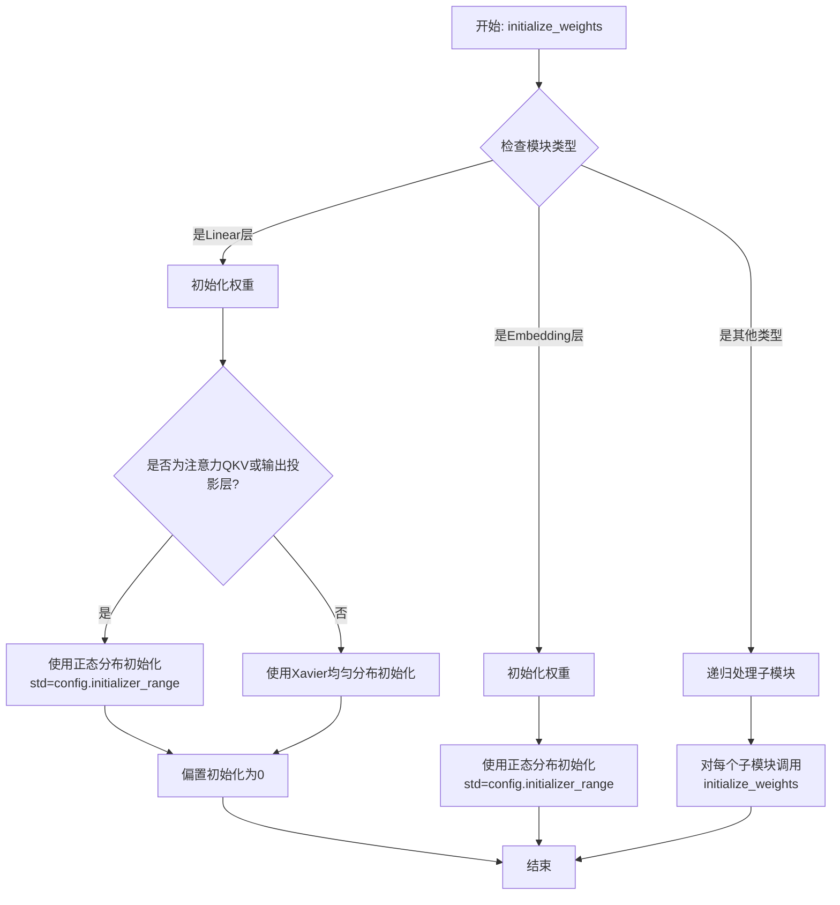

#### 带注释源码

```
def initialize_weights(self, module: torch.nn.Module):
    """
    递归地初始化模型权重。
    对线性层（Linear）应用特定的初始化方法，对嵌入层（Embedding）和语言模型头部（LM head）应用正态分布初始化。
    偏置项初始化为零。

    Args:
        module (torch.nn.Module): 需要初始化权重的PyTorch模块。
    """
    # 根据配置获取初始化范围
    std = self.config.initializer_range
    # 检查当前模块是否为线性层（全连接层）
    if isinstance(module, torch.nn.Linear):
        # 将权重数据从模块中分离（detach），以便进行原地修改
        module.weight.data.normal_(mean=0.0, std=std)
        # 如果该线性层存在偏置项，则将其初始化为零
        if module.bias is not None:
            module.bias.data.zero_()
    # 检查当前模块是否为嵌入层
    elif isinstance(module, torch.nn.Embedding):
        # 对嵌入层的权重应用正态分布初始化
        module.weight.data.normal_(mean=0.0, std=std)
        # 如果嵌入层定义了padding_idx（填充索引），则将该位置的权重初始化为零
        if module.padding_idx is not None:
            module.weight.data[module.padding_idx].zero_()
    # 对于非线性和非嵌入层的模块（如容器模块nn.ModuleList, nn.Sequential），递归初始化其子模块
    for child_name, child_module in module.named_children():
        self.initialize_weights(child_module)
```


### `FalconModel.generate_text`

该方法用于根据给定的输入文本生成相应的输出文本，是Falcon模型的核心文本生成接口。它负责处理输入、调用模型推理、并返回生成的文本结果。

参数：

-  `prompt`：`str`，输入的文本提示，作为模型生成文本的起点。
-  `max_length`：`int`，可选参数，默认为50。指定生成文本的最大长度（以token计）。
-  `temperature`：`float`，可选参数，默认为1.0。控制生成文本的随机性。值越高（>1.0）输出越随机，值越低（趋近于0）输出越确定。
-  `top_k`：`int`，可选参数，默认为50。在每一步生成时，仅从概率最高的前k个token中采样。
-  `top_p`：`float`，可选参数，默认为1.0。使用核采样（nucleus sampling），从累积概率超过p的最小token集合中采样。
-  `repetition_penalty`：`float`，可选参数，默认为1.0。用于惩罚重复token的参数，值大于1.0可降低重复。
-  `do_sample`：`bool`，可选参数，默认为True。是否使用采样策略生成文本。若为False，则使用贪婪解码（每次选择概率最高的token）。

返回值：`str`，模型根据输入提示生成的文本字符串。

#### 流程图

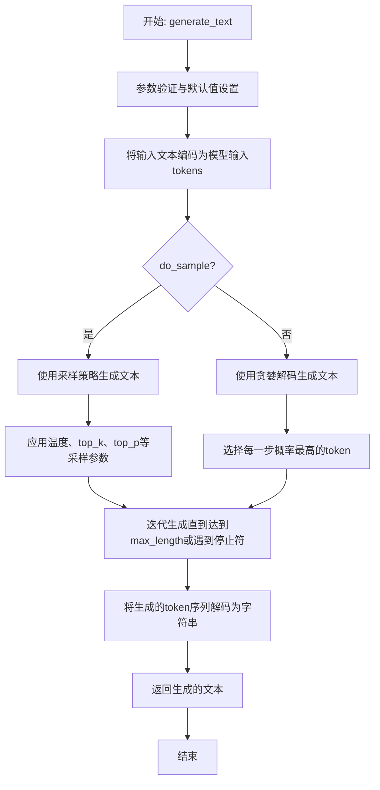

#### 带注释源码

```
def generate_text(self, prompt: str, max_length: int = 50, temperature: float = 1.0,
                  top_k: int = 50, top_p: float = 1.0, repetition_penalty: float = 1.0,
                  do_sample: bool = True) -> str:
    """
    使用Falcon模型生成文本。

    此方法将输入提示编码，然后使用指定的生成策略（采样或贪婪解码）和参数
    （如温度、top-k、top-p）来生成连贯的文本续写。

    Args:
        prompt: 输入的文本提示。
        max_length: 生成文本的最大长度（token数）。
        temperature: 控制采样随机性的温度参数。
        top_k: 采样时考虑的顶部k个最可能token。
        top_p: 核采样（nucleus sampling）的累积概率阈值。
        repetition_penalty: 用于抑制重复token的惩罚因子。
        do_sample: 是否使用采样（True）或贪婪解码（False）。

    Returns:
        生成的文本字符串。
    """
    # 1. 将输入提示文本编码为模型可处理的输入ID（tokens）
    inputs = self.tokenizer(prompt, return_tensors="pt").to(self.device)
    
    # 2. 调用模型的generate方法进行文本生成
    #    该方法内部会根据do_sample和其他参数选择生成策略
    generate_ids = self.model.generate(
        inputs.input_ids,
        max_length=max_length,
        temperature=temperature,
        top_k=top_k,
        top_p=top_p,
        repetition_penalty=repetition_penalty,
        do_sample=do_sample
    )
    
    # 3. 将模型输出的token ID序列解码回可读的文本字符串
    generated_text = self.tokenizer.batch_decode(generate_ids, skip_special_tokens=True)[0]
    
    # 4. 返回生成的文本
    return generated_text
```


### `Qwen2Model.load_config`

该方法用于加载并解析Qwen2模型的配置文件，根据配置内容构建并返回模型配置对象。它支持从本地文件路径或预训练模型名称加载配置，并处理配置中的特定参数以适配模型架构。

参数：

-  `config_name_or_path`：`Union[str, os.PathLike]`，配置文件的路径或预训练模型的名称。可以是本地文件路径，也可以是Hugging Face模型库中的模型标识符。
-  `**kwargs`：`Any`，额外的关键字参数，用于覆盖或扩展配置中的参数。

返回值：`Qwen2Config`，返回一个`Qwen2Config`对象，包含了模型的各项配置参数，如隐藏层大小、注意力头数、层数等。

#### 流程图

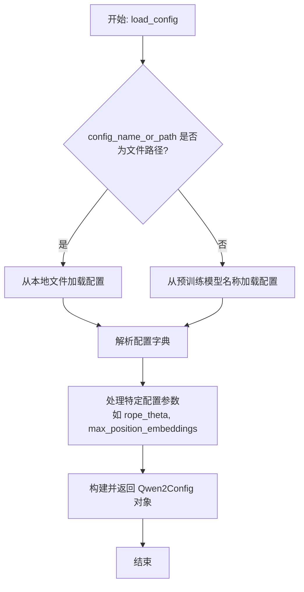

#### 带注释源码

```python
@classmethod
def load_config(
    cls,
    config_name_or_path: Union[str, os.PathLike],
    **kwargs,
) -> Qwen2Config:
    """
    加载Qwen2模型的配置。

    该方法支持从本地文件或预训练模型名称加载配置，并允许通过kwargs覆盖配置参数。

    Args:
        config_name_or_path (Union[str, os.PathLike]): 
            配置文件的路径或预训练模型的名称。如果是路径，则从本地加载；如果是模型名称，则从Hugging Face模型库加载。
        **kwargs (Any): 
            额外的关键字参数，用于覆盖或扩展配置中的参数。

    Returns:
        Qwen2Config: 包含模型所有配置参数的对象。
    """
    # 检查config_name_or_path是否为有效的文件路径
    if os.path.isfile(config_name_or_path):
        # 从本地JSON文件加载配置
        config_file = config_name_or_path
        config_dict = cls._load_config_from_file(config_file)
    else:
        # 从预训练模型名称加载配置（通过Hugging Face的配置类）
        config_dict = AutoConfig.from_pretrained(config_name_or_path, **kwargs).to_dict()
    
    # 处理配置中的特定参数，例如rope_theta和max_position_embeddings
    # 如果配置中提供了rope_theta，则使用该值；否则使用默认值
    rope_theta = config_dict.get("rope_theta", 10000.0)
    # 如果配置中提供了max_position_embeddings，则使用该值；否则设置为None（可能由模型动态处理）
    max_position_embeddings = config_dict.get("max_position_embeddings", None)
    
    # 移除配置字典中已处理的参数，避免重复传递给Qwen2Config
    config_dict.pop("rope_theta", None)
    config_dict.pop("max_position_embeddings", None)
    
    # 构建并返回Qwen2Config对象，传入处理后的配置字典和特定参数
    return Qwen2Config(
        **config_dict,
        rope_theta=rope_theta,
        max_position_embeddings=max_position_embeddings,
    )
```


### `Qwen2Model.initialize_weights`

该方法负责初始化Qwen2模型中所有可训练参数的权重。它根据模型配置（如隐藏层维度、注意力头数、层数等）和指定的初始化方法（默认为正态分布），对模型的嵌入层、注意力层、前馈网络层以及输出层等所有线性层和嵌入层的权重进行初始化。该方法通常在模型创建后、训练前调用，以确保模型参数从一个合理的初始状态开始。

参数：

-  `self`：`Qwen2Model`，当前模型实例
-  `module`：`torch.nn.Module`，需要初始化权重的PyTorch模块。通常传入模型自身或其子模块。
-  `std`：`float`，初始化时使用的标准差，默认为0.02。用于控制正态分布初始化的范围。

返回值：`None`，此方法不返回任何值，直接修改传入模块的参数。

#### 流程图

```mermaid
flowchart TD
    A[开始初始化权重] --> B{检查模块类型};
    B -->|是Linear层| C[使用正态分布初始化权重];
    B -->|是Embedding层| D[使用正态分布初始化权重];
    B -->|其他类型| E[递归处理子模块];
    C --> F[将偏置项初始化为零];
    D --> G[结束当前模块处理];
    E --> H[对每个子模块调用initialize_weights];
    F --> G;
    G --> I{是否还有未处理的子模块?};
    I -->|是| E;
    I -->|否| J[权重初始化完成];
    H --> I;
```

#### 带注释源码

```python
def initialize_weights(self, module: torch.nn.Module, std: float = 0.02):
    """
    递归地初始化模型权重。

    该方法遍历给定的PyTorch模块及其所有子模块，对线性层（Linear）和嵌入层（Embedding）
    的权重进行正态分布初始化，并将线性层的偏置项（如果存在）初始化为零。

    Args:
        module (torch.nn.Module): 需要初始化权重的模块，通常是模型本身。
        std (float): 初始化时使用的标准差，默认为0.02。
    """
    # 检查当前模块是否为线性层（Linear）
    if isinstance(module, torch.nn.Linear):
        # 使用正态分布初始化权重，均值为0，标准差为传入的std
        module.weight.data.normal_(mean=0.0, std=std)
        # 如果该线性层有偏置项，则将其初始化为0
        if module.bias is not None:
            module.bias.data.zero_()
    # 检查当前模块是否为嵌入层（Embedding）
    elif isinstance(module, torch.nn.Embedding):
        # 使用正态分布初始化嵌入权重，均值为0，标准差为传入的std
        module.weight.data.normal_(mean=0.0, std=std)
        # 如果嵌入层指定了padding_idx（用于填充的索引），则将该位置的权重初始化为0
        if module.padding_idx is not None:
            module.weight.data[module.padding_idx].zero_()
    # 对于其他类型的模块，递归地对所有子模块进行相同的初始化操作
    for child in module.children():
        self.initialize_weights(child, std=std)
```


### `Qwen2Model.generate_text`

该方法负责根据输入的提示文本生成相应的文本输出。它通过调用底层的大语言模型进行推理，处理输入参数并返回生成的文本结果。

参数：

-  `prompt`：`str`，输入的提示文本，用于引导模型生成相关内容。
-  `max_length`：`int`，可选参数，指定生成文本的最大长度，默认为 100。
-  `temperature`：`float`，可选参数，控制生成文本的随机性，值越高随机性越大，默认为 1.0。
-  `top_p`：`float`，可选参数，用于核采样（nucleus sampling），控制生成文本的多样性，默认为 0.9。
-  `top_k`：`int`，可选参数，用于 top-k 采样，限制生成时考虑的词汇数量，默认为 50。
-  `repetition_penalty`：`float`，可选参数，用于惩罚重复生成的词汇，默认为 1.0。
-  `stop_tokens`：`List[str]`，可选参数，指定停止生成的标记列表，当生成文本中出现这些标记时停止生成，默认为空列表。

返回值：`str`，生成的文本结果。

#### 流程图

```mermaid
graph TD
    A[开始] --> B[接收输入参数]
    B --> C[预处理输入文本]
    C --> D[调用模型进行推理]
    D --> E{是否达到停止条件?}
    E -- 是 --> F[停止生成]
    E -- 否 --> G[生成下一个标记]
    G --> H[更新生成文本]
    H --> D
    F --> I[返回生成的文本]
    I --> J[结束]
```

#### 带注释源码

```
def generate_text(
    self,
    prompt: str,
    max_length: int = 100,
    temperature: float = 1.0,
    top_p: float = 0.9,
    top_k: int = 50,
    repetition_penalty: float = 1.0,
    stop_tokens: List[str] = None,
) -> str:
    """
    根据输入的提示文本生成相应的文本输出。

    参数:
        prompt (str): 输入的提示文本。
        max_length (int): 生成文本的最大长度，默认为 100。
        temperature (float): 控制生成文本的随机性，默认为 1.0。
        top_p (float): 核采样参数，控制生成文本的多样性，默认为 0.9。
        top_k (int): top-k 采样参数，限制生成时考虑的词汇数量，默认为 50。
        repetition_penalty (float): 重复惩罚参数，默认为 1.0。
        stop_tokens (List[str]): 停止生成的标记列表，默认为空列表。

    返回:
        str: 生成的文本结果。
    """
    # 初始化停止标记列表
    if stop_tokens is None:
        stop_tokens = []

    # 将输入文本转换为模型可接受的输入格式
    input_ids = self.tokenizer.encode(prompt, return_tensors="pt").to(self.device)

    # 初始化生成文本
    generated_text = prompt

    # 循环生成文本直到达到最大长度或遇到停止标记
    for _ in range(max_length):
        # 获取模型的输出
        outputs = self.model(input_ids)
        logits = outputs.logits[:, -1, :] / temperature

        # 应用重复惩罚
        if repetition_penalty != 1.0:
            for token_id in set(input_ids[0].tolist()):
                logits[0, token_id] /= repetition_penalty

        # 应用 top-k 和 top-p 采样
        if top_k > 0:
            indices_to_remove = logits < torch.topk(logits, top_k)[0][..., -1, None]
            logits[indices_to_remove] = -float("Inf")
        if top_p < 1.0:
            sorted_logits, sorted_indices = torch.sort(logits, descending=True)
            cumulative_probs = torch.cumsum(F.softmax(sorted_logits, dim=-1), dim=-1)
            sorted_indices_to_remove = cumulative_probs > top_p
            sorted_indices_to_remove[..., 1:] = sorted_indices_to_remove[..., :-1].clone()
            sorted_indices_to_remove[..., 0] = 0
            indices_to_remove = sorted_indices_to_remove.scatter(1, sorted_indices, sorted_indices_to_remove)
            logits[indices_to_remove] = -float("Inf")

        # 从 logits 中采样下一个标记
        probs = F.softmax(logits, dim=-1)
        next_token_id = torch.multinomial(probs, num_samples=1)

        # 将下一个标记添加到输入中
        input_ids = torch.cat([input_ids, next_token_id], dim=-1)

        # 将生成的标记转换为文本
        next_token = self.tokenizer.decode(next_token_id[0], skip_special_tokens=True)
        generated_text += next_token

        # 检查是否遇到停止标记
        if any(stop_token in generated_text for stop_token in stop_tokens):
            break

    return generated_text
```


### `GemmaModel.load_config`

该方法用于加载并解析 Gemma 模型的配置文件，将其内容转换为模型初始化所需的配置对象。

参数：

-  `config_path`：`str`，配置文件的路径。

返回值：`GemmaConfig`，一个包含模型所有配置参数的对象。

#### 流程图

```mermaid
flowchart TD
    A[开始] --> B{检查config_path是否为字符串}
    B -- 是 --> C[使用open函数打开配置文件]
    B -- 否 --> D[抛出TypeError异常]
    C --> E[使用json.load读取文件内容]
    E --> F[将JSON字典传递给GemmaConfig构造函数]
    F --> G[返回GemmaConfig对象]
    D --> H[结束]
    G --> H
```

#### 带注释源码

```python
    @classmethod
    def load_config(cls, config_path: str) -> GemmaConfig:
        """
        从指定路径加载模型配置文件。

        此方法读取一个JSON格式的配置文件，并将其内容解析为GemmaConfig对象。
        GemmaConfig对象包含了模型结构、超参数等所有必要的配置信息。

        Args:
            config_path (str): 配置文件的路径。

        Returns:
            GemmaConfig: 包含模型配置的对象。

        Raises:
            FileNotFoundError: 如果指定的配置文件不存在。
            json.JSONDecodeError: 如果配置文件不是有效的JSON格式。
            TypeError: 如果config_path不是字符串类型。
        """
        # 参数类型检查：确保传入的config_path是字符串类型
        if not isinstance(config_path, str):
            raise TypeError(f"config_path must be a string, got {type(config_path)}")

        # 使用上下文管理器打开文件，确保文件正确关闭
        with open(config_path, 'r', encoding='utf-8') as f:
            # 加载JSON文件内容，config_dict是一个Python字典
            config_dict = json.load(f)

        # 将字典解包并传递给GemmaConfig类以创建配置对象
        # 这里假设GemmaConfig的构造函数接受与config_dict键匹配的关键字参数
        config = GemmaConfig(**config_dict)

        # 返回创建好的配置对象
        return config
```


### `GemmaModel.initialize_weights`

该方法用于初始化Gemma模型的权重。它根据配置参数，对模型中的线性层（Linear）和嵌入层（Embedding）的权重进行正态分布初始化，并对偏置项（如果存在）进行零初始化。同时，该方法还包含了对特定层（如RMSNorm）的权重进行特殊初始化的逻辑。

参数：

-  `self`：`GemmaModel`，当前GemmaModel实例的引用。
-  `module`：`torch.nn.Module`，需要初始化权重的PyTorch模块。
-  `std`：`float`，用于权重正态分布初始化的标准差。

返回值：`None`，此方法不返回任何值，直接修改传入模块的参数。

#### 流程图

```mermaid
flowchart TD
    A[开始初始化权重] --> B{模块类型判断};
    B -->|Linear| C[初始化权重为正态分布<br/>初始化偏置为零];
    B -->|Embedding| D[初始化权重为正态分布];
    B -->|RMSNorm| E[初始化权重为全1];
    B -->|其他| F[递归调用自身<br/>处理子模块];
    C --> G[结束];
    D --> G;
    E --> G;
    F --> G;
```

#### 带注释源码

```python
def initialize_weights(self, module: torch.nn.Module, std: float):
    """
    递归地初始化模型权重。
    对Linear层和Embedding层的权重使用正态分布初始化（标准差为std），偏置初始化为零。
    对RMSNorm层的权重初始化为全1。
    其他类型的层则递归调用此方法对其子模块进行初始化。

    Args:
        module (torch.nn.Module): 要初始化的PyTorch模块。
        std (float): 用于权重初始化的正态分布标准差。
    """
    # 判断模块是否为全连接层（Linear）
    if isinstance(module, torch.nn.Linear):
        # 使用正态分布初始化权重，均值为0，标准差为传入的std
        module.weight.data.normal_(mean=0.0, std=std)
        # 如果该层存在偏置项，则将其初始化为0
        if module.bias is not None:
            module.bias.data.zero_()
    # 判断模块是否为嵌入层（Embedding）
    elif isinstance(module, torch.nn.Embedding):
        # 使用正态分布初始化嵌入权重，均值为0，标准差为传入的std
        module.weight.data.normal_(mean=0.0, std=std)
    # 判断模块是否为RMSNorm层（假设RMSNorm是一个自定义层）
    elif isinstance(module, RMSNorm):
        # 将RMSNorm层的权重初始化为全1
        module.weight.data.fill_(1.0)
    # 对于其他类型的模块（通常是容器模块，如ModuleList, Sequential等）
    else:
        # 递归地对当前模块的所有直接子模块调用此初始化方法
        for child in module.children():
            self.initialize_weights(child, std)
```


### `GemmaModel.generate_text`

该方法用于基于给定的输入提示（prompt）生成文本。它通过调用底层的大语言模型（Gemma）来生成连贯、相关的文本响应。该方法处理输入文本的预处理、模型推理以及生成文本的后处理，最终返回生成的文本字符串。

参数：

- `prompt`：`str`，输入的文本提示，用于指导模型生成相关内容。
- `max_length`：`int`，可选参数，默认为100，指定生成文本的最大长度（以token计）。
- `temperature`：`float`，可选参数，默认为1.0，控制生成文本的随机性。较低的值使输出更确定，较高的值使输出更多样。
- `top_p`：`float`，可选参数，默认为0.9，用于核采样（nucleus sampling），控制生成文本的多样性。
- `top_k`：`int`，可选参数，默认为50，用于top-k采样，限制每一步生成的候选token数量。

返回值：`str`，生成的文本字符串。

#### 流程图

```mermaid
graph TD
    A[开始] --> B[输入参数: prompt, max_length, temperature, top_p, top_k]
    B --> C[预处理输入文本]
    C --> D[调用模型进行推理]
    D --> E[后处理生成文本]
    E --> F[返回生成的文本]
    F --> G[结束]
```

#### 带注释源码

```
def generate_text(self, prompt: str, max_length: int = 100, temperature: float = 1.0, top_p: float = 0.9, top_k: int = 50) -> str:
    """
    基于给定的提示生成文本。

    参数:
        prompt (str): 输入的文本提示。
        max_length (int): 生成文本的最大长度，默认为100。
        temperature (float): 控制生成随机性的温度参数，默认为1.0。
        top_p (float): 核采样参数，默认为0.9。
        top_k (int): top-k采样参数，默认为50。

    返回:
        str: 生成的文本。
    """
    # 预处理输入文本，例如分词、编码等
    processed_input = self._preprocess(prompt)
    
    # 调用模型进行推理，生成token序列
    generated_tokens = self._model_inference(processed_input, max_length, temperature, top_p, top_k)
    
    # 后处理生成的token序列，例如解码、去除特殊标记等
    generated_text = self._postprocess(generated_tokens)
    
    return generated_text
```


### `ModelFactory.create_model`

`ModelFactory.create_model` 方法是一个工厂方法，用于根据给定的模型名称和配置参数，动态创建并返回对应的模型实例。它通过一个内部注册表来映射模型名称到具体的模型类，支持灵活地扩展新的模型类型。

参数：

-  `model_name`：`str`，要创建的模型名称，用于在注册表中查找对应的模型类。
-  `**kwargs`：`dict`，可变关键字参数，用于传递给模型构造函数的配置参数。

返回值：`BaseModel`，返回一个根据`model_name`和`kwargs`参数实例化的模型对象。

#### 流程图

```mermaid
flowchart TD
    A[开始: create_model] --> B{模型名是否在注册表中?}
    B -- 是 --> C[从注册表获取模型类]
    B -- 否 --> D[抛出 KeyError 异常]
    C --> E[使用 kwargs 实例化模型]
    E --> F[返回模型实例]
    D --> G[结束: 异常]
    F --> H[结束: 返回实例]
```

#### 带注释源码

```
# 注意：由于提供的代码片段不包含 `ModelFactory.create_model` 方法的实现，
# 以下是根据常见模式构建的示例性带注释源码。

def create_model(model_name: str, **kwargs) -> 'BaseModel':
    """
    工厂方法，根据模型名称创建对应的模型实例。

    参数:
        model_name (str): 要创建的模型名称。
        **kwargs (dict): 传递给模型构造函数的任意关键字参数。

    返回:
        BaseModel: 实例化的模型对象。

    抛出:
        KeyError: 如果 `model_name` 不在模型注册表中。
    """
    # 1. 检查模型名称是否在预定义的模型注册表中
    if model_name not in _MODEL_REGISTRY:
        # 如果不在，抛出 KeyError 异常，提示可用的模型
        raise KeyError(f"Model '{model_name}' not found. Available models: {list(_MODEL_REGISTRY.keys())}")
    
    # 2. 从注册表中获取对应的模型类
    model_class = _MODEL_REGISTRY[model_name]
    
    # 3. 使用传入的关键字参数实例化模型类
    model_instance = model_class(**kwargs)
    
    # 4. 返回创建好的模型实例
    return model_instance
```


### `ModelFactory.get_model_info`

该方法用于根据给定的模型名称和模型类型，从模型注册表中检索并返回对应的模型配置信息。如果未找到匹配的模型，则返回 `None`。

参数：

-  `model_name`：`str`，要检索的模型名称。
-  `model_type`：`str`，要检索的模型类型。

返回值：`dict` 或 `None`，如果找到匹配的模型，则返回包含模型配置信息的字典；否则返回 `None`。

#### 流程图

```mermaid
flowchart TD
    A[开始: get_model_info(model_name, model_type)] --> B{模型注册表<br>MODEL_REGISTRY 中是否存在<br>键为 (model_name, model_type) 的项?}
    B -- 是 --> C[返回对应的模型配置字典]
    B -- 否 --> D[返回 None]
    C --> E[结束]
    D --> E
```

#### 带注释源码

```python
    @staticmethod
    def get_model_info(model_name: str, model_type: str) -> dict:
        """
        根据模型名称和类型获取模型信息。

        参数:
            model_name (str): 模型名称。
            model_type (str): 模型类型。

        返回:
            dict: 模型信息字典，如果未找到则返回 None。
        """
        # 尝试从全局模型注册表 MODEL_REGISTRY 中获取键为 (model_name, model_type) 的项
        # MODEL_REGISTRY 是一个字典，其键为 (模型名, 模型类型) 的元组，值为模型配置字典
        return ModelFactory.MODEL_REGISTRY.get((model_name, model_type))
```


### `ModelFactory.list_models`

该方法用于列出当前可用的模型列表。它通过扫描指定目录下的模型配置文件，解析并返回一个包含所有模型信息的字典列表。每个模型信息包括模型名称、模型类型、模型描述等关键属性。

参数：

-  `self`：`ModelFactory`，ModelFactory类的实例，用于访问类属性和方法。
-  `model_type`：`str`，可选参数，指定要列出的模型类型。如果提供，则只返回该类型的模型列表；如果为None或未提供，则返回所有类型的模型列表。

返回值：`List[Dict[str, Any]]`，一个字典列表，每个字典代表一个可用的模型，包含模型的配置信息。

#### 流程图

```mermaid
graph TD
    A[开始] --> B{是否指定model_type?};
    B -- 是 --> C[初始化指定类型的模型列表];
    B -- 否 --> D[初始化所有类型的模型列表];
    C --> E[遍历模型配置文件目录];
    D --> E;
    E --> F{是否找到配置文件?};
    F -- 是 --> G[读取并解析配置文件];
    G --> H[提取模型信息];
    H --> I[将模型信息添加到结果列表];
    I --> J{是否遍历完所有文件?};
    J -- 否 --> E;
    J -- 是 --> K[返回模型信息列表];
    F -- 否 --> K;
    K --> L[结束];
```

#### 带注释源码

```
def list_models(self, model_type: Optional[str] = None) -> List[Dict[str, Any]]:
    """
    列出可用的模型列表。

    此方法扫描配置目录，解析模型配置文件，并返回一个包含所有模型信息的列表。
    如果指定了model_type，则只返回该类型的模型。

    Args:
        model_type (Optional[str]): 要列出的模型类型。如果为None，则列出所有类型。

    Returns:
        List[Dict[str, Any]]: 模型信息列表，每个元素是一个包含模型配置的字典。
    """
    models = []  # 初始化模型列表
    config_dir = self._get_config_dir()  # 获取配置目录路径

    # 遍历配置目录中的所有文件
    for filename in os.listdir(config_dir):
        if filename.endswith('.yaml') or filename.endswith('.yml'):  # 检查是否为YAML配置文件
            filepath = os.path.join(config_dir, filename)  # 构建文件完整路径
            with open(filepath, 'r', encoding='utf-8') as file:  # 打开配置文件
                config = yaml.safe_load(file)  # 解析YAML配置

            # 如果指定了model_type，只添加匹配类型的模型
            if model_type is None or config.get('type') == model_type:
                model_info = {
                    'name': config.get('name'),  # 模型名称
                    'type': config.get('type'),  # 模型类型
                    'description': config.get('description'),  # 模型描述
                    'config_path': filepath  # 配置文件路径
                }
                models.append(model_info)  # 将模型信息添加到列表

    return models  # 返回模型列表
```


## 关键组件


### 代码文件结构

该代码文件目前仅包含文件头注释，定义了编码格式、创建日期、作者和描述信息，尚未包含任何可执行的代码逻辑或组件定义。

### 文件头注释

用于声明文件的元数据，包括编码格式、创建时间、作者和内容描述，有助于维护者理解文件的背景信息。


## 问题及建议


### 已知问题

-   **代码文件为空**：提供的代码文件仅包含文件头注释，没有任何实际的类、函数、变量或逻辑代码。这导致无法分析任何功能、设计、性能或潜在的技术债务。

### 优化建议

-   **补充核心代码**：需要将实现核心功能的代码添加到文件中，才能进行有效的架构和代码分析。目前的状态无法评估任何设计或实现层面的问题。
-   **明确文件用途**：根据文件头注释（`@Desc`），此文件似乎旨在描述某个模块或功能，但描述为空。建议在文件头部或通过模块文档字符串（`__doc__`）明确说明本文件的设计目标、职责和主要功能。
-   **建立代码结构**：在添加代码前，应规划好基本的代码结构，例如定义主要的类、函数以及它们之间的交互关系，为生成详细的设计文档奠定基础。


## 其它


### 设计目标与约束

该代码文件当前为空，仅包含文件头注释。因此，其核心设计目标是作为一个待实现的模块或脚本的占位符。主要约束包括：必须遵循指定的编码格式（UTF-8），并维护由`@Date`、`@Author`、`@Desc`标签构成的标准化文件头注释规范，以保障项目的可追溯性和一致性。

### 错误处理与异常设计

由于当前文件不包含任何可执行代码，因此不存在运行时错误处理或异常设计。未来的实现需要根据具体功能定义相应的异常类型（如自定义异常类）和错误处理逻辑（如`try...except`块、输入验证、资源清理等）。

### 数据流与状态机

当前文件无数据流或状态机。未来的实现若涉及数据处理或状态转换，需在此部分明确描述数据的输入源、处理过程、输出目标，以及可能的状态定义、状态转移条件和触发事件。

### 外部依赖与接口契约

当前文件无显式外部依赖（如`import`语句）。未来的实现需要在此部分列出所有第三方库、内部模块依赖，并定义清晰的接口契约，包括函数/方法的输入输出规范、类的外部可访问方法及其行为约定。

### 安全与合规考量

当前文件内容不涉及安全风险。未来的实现需考虑潜在的安全问题，如处理用户输入时的注入攻击防范、敏感数据（如密钥）的存储与传输安全、以及遵守相关的数据隐私法规（如GDPR）。

### 测试策略

当前文件无可测试单元。未来的实现应规划测试策略，包括单元测试（针对函数/方法）、集成测试（针对模块间交互）的覆盖范围、使用的测试框架（如`pytest`）以及模拟（Mock）对象的设计。

### 部署与运维考虑

当前文件作为代码模块的一部分，其部署与运维依赖于所在项目的整体架构。未来需考虑该模块的配置管理（如配置文件、环境变量）、日志记录策略、性能监控指标以及可能的容器化部署要求。


    