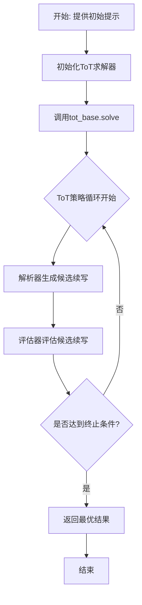
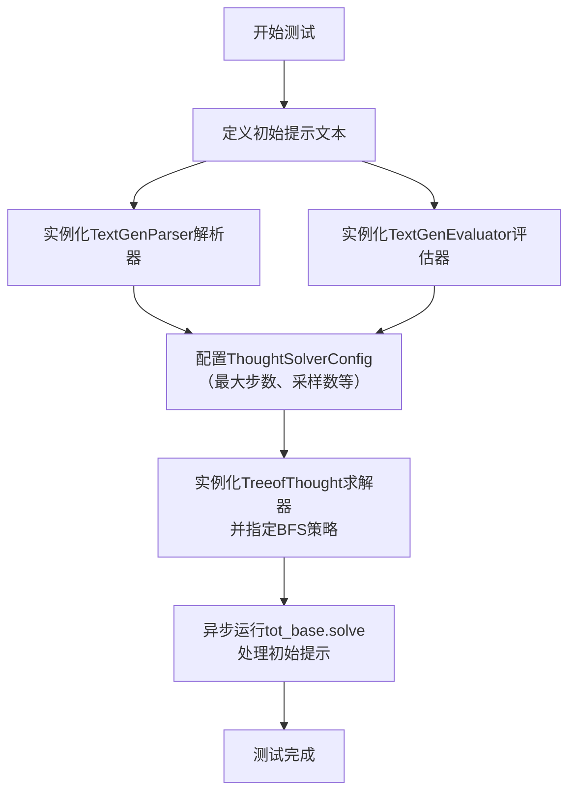
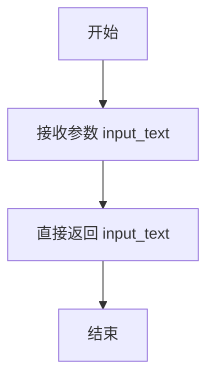
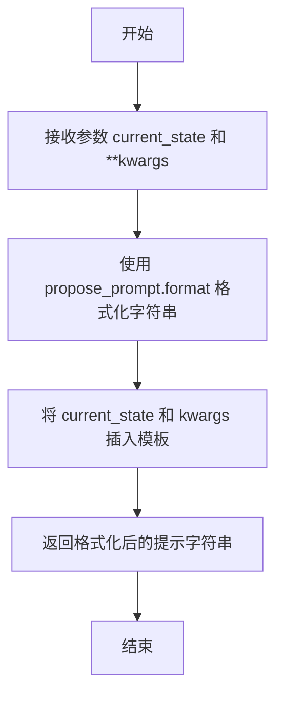
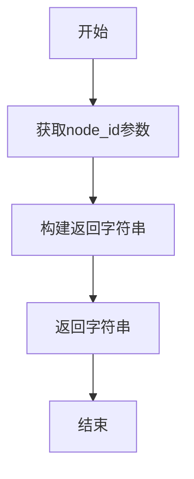
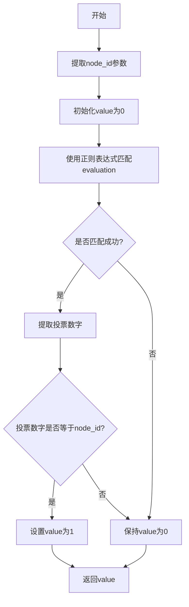
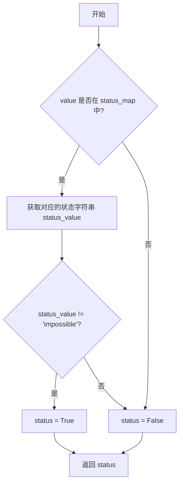

# `.\MetaGPT\tests\metagpt\strategy\examples\test_creative_writing.py` 详细设计文档

该代码实现了一个基于思维树（Tree of Thoughts, ToT）策略的创意写作测试框架。它通过自定义的文本生成解析器和评估器，对给定的初始文本提示进行多步推理和评估，以生成和选择最优的创意写作续写内容。

## 整体流程



## 类结构

```
BaseParser (抽象基类)
└── TextGenParser
BaseEvaluator (抽象基类)
└── TextGenEvaluator
TreeofThought (外部类)
ThoughtSolverConfig (外部类)
Strategy (外部枚举)
```

## 全局变量及字段


### `TextGenParser.propose_prompt`
    
用于生成新想法或步骤的提示模板字符串。

类型：`str`
    


### `TextGenParser.value_prompt`
    
用于评估想法或步骤价值的提示模板字符串。

类型：`str`
    


### `TextGenEvaluator.value_map`
    
将文本评估结果（如'impossible'）映射到数值分数的字典。

类型：`Dict[str, float]`
    


### `TextGenEvaluator.status_map`
    
将数值分数反向映射回文本评估结果的字典，用于状态验证。

类型：`Dict`
    
    

## 全局函数及方法

### `test_creative_writing`

该函数是一个测试函数，用于演示和验证基于“思维树”（Tree of Thoughts, ToT）策略的创意写作流程。它通过配置解析器、评估器和求解器，对一个给定的初始文本提示进行多步推理和评估，以生成和选择最优的文本续写方案。

参数：
- 无显式参数。

返回值：`None`，该函数不返回任何值，其主要功能是执行并打印测试过程。

#### 流程图



#### 带注释源码

```python
def test_creative_writing():
    import asyncio  # 导入异步IO库，用于运行异步函数

    # 定义创意写作的初始提示文本
    initial_prompt = """It isn't difficult to do a handstand if you just stand on your hands. It caught him off guard that space smelled of seared steak. When she didn’t like a guy who was trying to pick her up, she started using sign language. Each person who knows you has a different perception of who you are."""

    # 实例化文本生成解析器，负责生成提议和评估提示
    parser = TextGenParser()
    # 实例化文本生成评估器，负责评估生成结果的价值
    evaluator = TextGenEvaluator()

    # 配置思维求解器的参数，包括最大推理步数、生成样本数、选择样本数以及解析器和评估器实例
    config = ThoughtSolverConfig(max_step=2, n_generate_sample=1, n_select_sample=1, parser=parser, evaluator=evaluator)

    # 实例化TreeofThought求解器，采用广度优先搜索（BFS）策略
    tot_base = TreeofThought(strategy=Strategy.BFS, config=config)
    # 异步运行求解器的solve方法，处理初始提示，开始创意写作的推理和评估流程
    asyncio.run(tot_base.solve(init_prompt=initial_prompt))
```

### `TextGenParser.__call__`

该方法是一个简单的恒等转换函数，接收一个字符串输入并原样返回。它作为解析器接口的一部分，用于在思维树（Tree of Thoughts）策略中处理文本生成任务中的中间状态。

参数：

- `input_text`：`str`，需要被处理的输入文本字符串。

返回值：`str`，与输入完全相同的字符串。

#### 流程图



#### 带注释源码

```python
def __call__(self, input_text: str) -> str:
    # 该方法直接返回输入的字符串，不做任何处理。
    # 在ToT框架中，此方法用于“解析”一个状态，这里是最简单的形式。
    return input_text
```

### `TextGenParser.propose`

该方法用于生成一个提示字符串，该字符串基于给定的当前状态（`current_state`）和可选的额外关键字参数，通过格式化预定义的提议提示模板（`propose_prompt`）来构建。

参数：
- `current_state`：`str`，表示当前的文本状态或上下文，将作为输入被插入到提示模板中。
- `**kwargs`：`dict`，可选的关键字参数，用于在格式化提示模板时提供额外的变量替换。

返回值：`str`，返回格式化后的提示字符串，用于指导下一步的文本生成或思考。

#### 流程图



#### 带注释源码

```python
def propose(self, current_state: str, **kwargs) -> str:
    # 使用实例变量 propose_prompt（一个字符串模板）的 format 方法，
    # 将 current_state 作为 'input' 参数，以及其他任何通过 **kwargs 传递的参数，
    # 插入到模板中，生成并返回最终的提示字符串。
    return self.propose_prompt.format(input=current_state, **kwargs)
```

### `TextGenParser.value`

该方法用于生成一个评估提示字符串，该字符串结合了给定的输入文本和节点ID，用于后续的评估步骤。

参数：

- `input`：`str`，需要被评估的输入文本，默认为空字符串。
- `**kwargs`：`dict`，可变关键字参数，用于接收额外的配置信息，其中`node_id`键用于指定节点ID。

返回值：`str`，返回一个格式化的字符串，包含评估提示、节点ID和输入文本。

#### 流程图



#### 带注释源码

```python
def value(self, input: str = "", **kwargs) -> str:
    # 从关键字参数中获取节点ID，默认为"0"
    id = kwargs.get("node_id", "0")
    # 返回组合后的字符串，包含评估提示、节点ID和输入文本
    return self.value_prompt + f"Choice {id}:\n{input}\n"
```

### `TextGenEvaluator.__call__`

该方法用于评估文本生成任务中的投票结果，通过正则表达式匹配评估字符串中的最佳选择，并根据匹配结果和节点ID计算评估值。

参数：

- `evaluation`：`str`，包含评估信息的字符串，通常包含投票结果
- `**kwargs`：`dict`，可选关键字参数，其中可能包含`node_id`用于标识当前节点

返回值：`float`，返回评估值，如果匹配成功且投票与节点ID一致则返回1，否则返回0

#### 流程图



#### 带注释源码

```python
def __call__(self, evaluation: str, **kwargs) -> float:
    try:
        # 初始化评估值为0
        value = 0
        # 从kwargs中获取node_id参数，默认为"0"
        node_id = kwargs.get("node_id", "0")
        # 定义正则表达式模式，用于匹配"best choice is"后面的数字
        pattern = r".*best choice is .*(\d+).*"
        # 使用正则表达式匹配evaluation字符串
        match = re.match(pattern, evaluation, re.DOTALL)

        # 如果匹配成功
        if match:
            # 提取匹配到的投票数字并转换为整数
            vote = int(match.groups()[0])
            print(vote)
            # 检查投票数字是否与node_id相等
            if vote == int(node_id):
                # 如果相等，设置评估值为1
                value = 1
    except:
        # 如果发生任何异常，设置评估值为0
        value = 0
    # 返回评估值
    return value
```

### `TextGenEvaluator.status_verify`

该方法用于验证给定的评估值是否代表一个“可能”或“确定”的状态，而非“不可能”状态。它通过查询内部的状态映射字典来判断，如果值对应的状态不是“impossible”，则返回`True`，表示验证通过。

参数：
- `value`：`float`，需要验证的评估值。

返回值：`bool`，如果值对应的状态不是“impossible”则返回`True`，否则返回`False`。

#### 流程图



#### 带注释源码

```python
def status_verify(self, value):
    # 初始化状态为 False，表示验证未通过
    status = False
    # 检查传入的 value 是否存在于 status_map 字典的键中
    if value in self.status_map:
        # 如果存在，获取该值对应的状态字符串（如 'impossible', 'likely', 'sure'）
        status_value = self.status_map[value]
        # 判断获取到的状态字符串是否不等于 'impossible'
        if status_value != "impossible":
            # 如果不是 'impossible'，则将状态标记为 True，表示验证通过
            status = True
    # 返回最终的验证状态
    return status
```

## 关键组件


### TreeofThought

实现树搜索（Tree of Thought）算法的核心类，负责管理思维树的构建、节点扩展与评估，并协调不同搜索策略（如BFS）的执行流程。

### BaseParser

解析器基类，定义了如何将当前思维状态转换为模型提示（propose）以及如何为评估准备输入（value），为具体领域（如文本生成）的解析逻辑提供接口。

### TextGenParser

针对创意写作任务的解析器实现，继承自BaseParser，负责生成思维扩展的提示模板和格式化评估输入。

### BaseEvaluator

评估器基类，定义了如何评估一个思维节点的质量（通过`__call__`方法）以及如何验证节点状态是否达到目标（通过`status_verify`方法），为具体评估逻辑提供框架。

### TextGenEvaluator

针对创意写作任务的评估器实现，继承自BaseEvaluator，通过正则表达式解析模型投票结果来判断思维节点的价值。

### ThoughtSolverConfig

树搜索算法的配置类，封装了最大步数（max_step）、生成样本数（n_generate_sample）、选择样本数（n_select_sample）等关键运行参数，以及解析器（parser）和评估器（evaluator）实例。

### Strategy

枚举类，定义了树搜索可用的策略，如广度优先搜索（BFS），用于控制TreeofThought类的搜索行为。


## 问题及建议


### 已知问题

-   **硬编码的评估映射**：`TextGenEvaluator` 类中的 `value_map` 和 `status_map` 是硬编码的，将字符串状态（如“impossible”、“likely”、“sure”）映射为固定的数值。这种映射缺乏灵活性，难以适应不同任务或调整评估标准，属于一种临时的（ad-hoc）解决方案。
-   **脆弱的正则表达式匹配**：`TextGenEvaluator.__call__` 方法中使用了一个简单的正则表达式（`r".*best choice is .*(\d+).*"`）来从评估文本中提取投票结果。这种模式匹配非常脆弱，容易因评估文本的格式微调（如大小写、额外空格、措辞变化）而失败，导致评估错误。
-   **异常处理过于宽泛**：在 `TextGenEvaluator.__call__` 方法中，`try-except` 块捕获了所有异常（`except:`），并在发生任何异常时将 `value` 设为 0。这会掩盖潜在的错误（如正则表达式模式错误、类型转换错误），使得调试变得困难，并且可能将非预期的系统错误误判为评估失败。
-   **同步与异步混合**：测试函数 `test_creative_writing` 中直接使用 `asyncio.run` 调用异步的 `tot_base.solve` 方法。虽然这在测试中可行，但在生产环境或更复杂的集成场景中，这种同步调用异步函数的方式可能引发事件循环管理问题，尤其是在已存在运行中事件循环的上下文中。
-   **配置参数可能不足**：`ThoughtSolverConfig` 的实例化参数（如 `max_step=2`, `n_generate_sample=1`, `n_select_sample=1`）在测试中被固定为很小的值。这虽然能加速测试，但可能无法充分展示算法在更复杂、更真实场景下的行为和性能，限制了测试的深度和覆盖度。

### 优化建议

-   **将评估映射配置化**：将 `value_map` 从硬编码改为通过构造函数参数或配置文件传入。这样可以使 `TextGenEvaluator` 类更加通用，便于在不同任务间复用和调整评估权重。
-   **增强评估文本解析的鲁棒性**：改进 `TextGenEvaluator.__call__` 方法中的文本解析逻辑。可以考虑使用更灵活的自然语言处理技术（如关键词提取、语义相似度）或更健壮的正则表达式来理解评估内容，而不是依赖固定的句式。
-   **细化异常处理**：将 `except:` 改为捕获特定的异常类型（如 `ValueError`, `AttributeError`, `re.error` 等）。同时，可以记录异常信息或抛出更具描述性的自定义异常，以便于问题追踪和系统维护。
-   **统一异步调用模式**：将 `test_creative_writing` 函数本身定义为异步函数（`async def`），并在其内部使用 `await` 调用 `tot_base.solve`。如果需要在同步上下文中运行测试，应确保事件循环的创建和管理是正确且隔离的。
-   **扩展测试配置和场景**：在测试中引入更多样的 `ThoughtSolverConfig` 参数组合（例如更大的 `max_step`, `n_generate_sample`, `n_select_sample`），并设计不同的初始提示（`initial_prompt`）以测试算法在不同复杂度任务下的表现。这有助于更全面地评估系统的健壮性和性能。
-   **考虑引入评估缓存**：如果 `evaluator` 的调用成本较高（例如调用了大语言模型），可以考虑为相同的输入实现一个简单的缓存机制，以避免重复计算，提升系统效率。
-   **完善文档和类型注解**：为 `TextGenParser` 和 `TextGenEvaluator` 的方法添加更详细的文档字符串（docstring），说明其预期输入输出和行为。同时，确保所有函数参数和返回值都有清晰的类型注解，以提高代码的可读性和可维护性。


## 其它


### 设计目标与约束

本代码模块的核心设计目标是实现一个基于“思维树”（Tree of Thoughts, ToT）策略的文本生成与评估框架。其核心约束包括：
1.  **策略灵活性**：支持不同的搜索策略（如广度优先搜索BFS），以适应不同复杂度的问题。
2.  **组件可插拔**：通过定义`BaseParser`和`BaseEvaluator`抽象基类，允许用户自定义文本生成提示（`propose`）和评估逻辑（`value`, `status_verify`），实现算法逻辑与领域逻辑的解耦。
3.  **配置驱动**：通过`ThoughtSolverConfig`集中管理算法参数（如搜索深度`max_step`、生成样本数`n_generate_sample`等），便于实验和调优。
4.  **异步执行**：主求解接口`TreeofThought.solve`为异步方法，旨在支持可能耗时的LLM调用或复杂计算。

### 错误处理与异常设计

当前代码的错误处理较为简单，主要集中在`TextGenEvaluator.__call__`方法中：
1.  **异常捕获**：在尝试使用正则表达式匹配评估文本时，使用`try...except`块捕获所有异常。一旦发生异常，将评估值`value`设为0。这是一种防御性编程，但过于宽泛，不利于问题诊断。
2.  **默认值处理**：在`TextGenEvaluator.status_verify`中，对输入`value`的检查默认返回`False`，仅在`value`存在于`status_map`且状态不为“impossible”时才返回`True`。这隐含了对无效或异常输入的处理。
3.  **潜在风险**：`TextGenParser`的`propose`和`value`方法直接进行字符串格式化，若传入的`kwargs`不包含所需键或格式字符串不匹配，可能引发`KeyError`。目前代码未对此进行处理。

### 数据流与状态机

1.  **主数据流**：
    *   **输入**：初始提示（`initial_prompt`）作为求解起点。
    *   **处理**：
        *   `TreeofThought`根据配置的策略（如BFS）组织搜索。
        *   在搜索的每一步，使用`TextGenParser.propose`方法生成新的文本候选（思维节点）。
        *   使用`TextGenEvaluator.__call__`方法对生成的候选进行评估打分。
        *   使用`TextGenEvaluator.status_verify`方法根据分数判断节点状态（如是否可行、是否达到目标）。
    *   **输出**：搜索过程最终输出的最优或符合条件的文本序列（由`TreeofThought`算法决定）。
2.  **状态转换**：
    *   思维节点通过`evaluator`评估后获得一个数值`value`。
    *   `status_verify`方法根据`value`映射到预定义的`status_map`（如“impossible”, “likely”, “sure”），从而决定该节点的“状态”（是否继续扩展、是否作为候选解等）。这构成了一个简单的状态判断逻辑，但并非完整的状态机。

### 外部依赖与接口契约

1.  **外部依赖**：
    *   `metagpt.strategy.tot.TreeofThought`：核心算法实现类，本模块是其实例的使用者。
    *   `metagpt.strategy.tot_schema`：定义了`BaseEvaluator`、`BaseParser`、`Strategy`、`ThoughtSolverConfig`等基础数据结构和接口。本模块的`TextGenParser`和`TextGenEvaluator`是对这些接口的具体实现。
    *   `tests.metagpt.strategy.prompt_templates.creative_writing`：提供了领域特定的提示词模板（`cot_prompt`, `vote_prompt`）。这是一个测试资源依赖。
2.  **接口契约**：
    *   `BaseParser`契约：实现`__call__`、`propose`、`value`方法。`propose`负责生成扩展当前思维的提示，`value`负责为思维节点生成用于评估的提示。
    *   `BaseEvaluator`契约：实现`__call__`和`status_verify`方法。`__call__`负责解析评估结果（如LLM输出）并转化为数值分数，`status_verify`负责根据分数判断节点状态。
    *   本模块中的`TextGenParser`和`TextGenEvaluator`必须遵守上述契约，才能与`TreeofThought`算法正确协作。

    