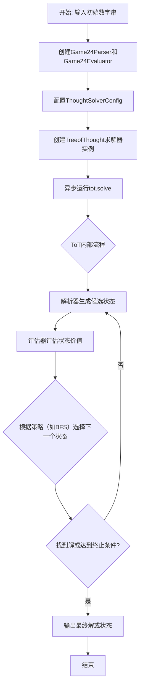
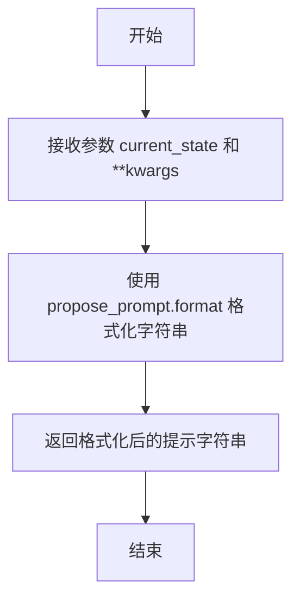
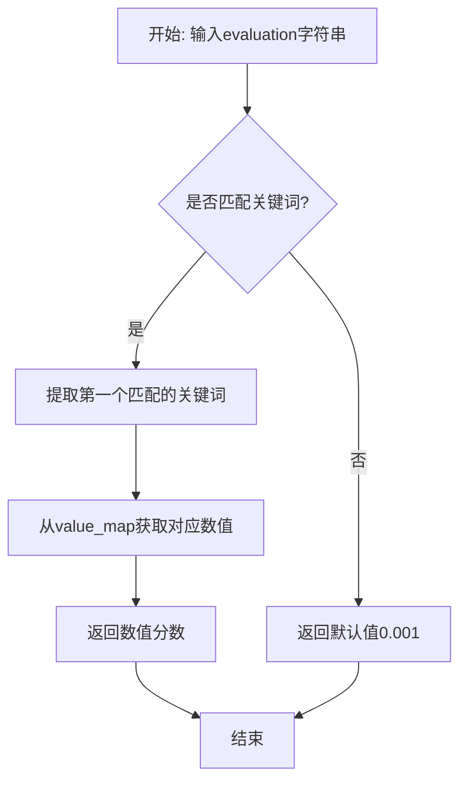

# `.\MetaGPT\tests\metagpt\strategy\examples\test_game24.py` 详细设计文档

该代码实现了一个基于思维树（Tree of Thoughts, ToT）策略的24点游戏求解器。它定义了用于解析游戏状态和评估解决方案可能性的特定组件（Game24Parser和Game24Evaluator），并通过配置这些组件与通用的TreeofThought求解器结合，以异步方式搜索并验证从给定四个数字得到24的数学表达式。

## 整体流程



## 类结构

```
BaseParser (抽象基类)
└── Game24Parser
BaseEvaluator (抽象基类)
└── Game24Evaluator
TreeofThought (主求解器类)
ThoughtSolverConfig (配置类)
Strategy (枚举类)
```

## 全局变量及字段


### `propose_prompt`
    
用于生成新状态提议的提示模板字符串。

类型：`str`
    


### `value_prompt`
    
用于评估状态价值的提示模板字符串。

类型：`str`
    


### `Game24Parser.propose_prompt`
    
用于生成新状态提议的提示模板字符串。

类型：`str`
    


### `Game24Parser.value_prompt`
    
用于评估状态价值的提示模板字符串。

类型：`str`
    


### `Game24Evaluator.value_map`
    
将评估文本映射到数值分数的字典。

类型：`Dict[str, float]`
    


### `Game24Evaluator.status_map`
    
将数值分数反向映射回评估文本的字典。

类型：`Dict[float, str]`
    


### `ThoughtSolverConfig.n_generate_sample`
    
每次生成新状态时创建的样本数量。

类型：`int`
    


### `ThoughtSolverConfig.parser`
    
用于解析和生成状态文本的解析器实例。

类型：`BaseParser`
    


### `ThoughtSolverConfig.evaluator`
    
用于评估状态价值并验证其状态的评估器实例。

类型：`BaseEvaluator`
    


### `Strategy.BFS`
    
表示广度优先搜索策略的枚举值。

类型：`Strategy`
    
    

## 全局函数及方法


### `test_game24`

该函数是用于测试“24点游戏”求解器的入口函数。它通过配置一个基于“思维树”（Tree of Thoughts, ToT）策略的求解器，并使用给定的初始数字序列（如“4 5 6 10”）来异步运行求解过程，最终输出求解结果。

参数：
- 无显式参数。

返回值：`None`，该函数不返回任何值，其主要作用是执行并打印求解过程。

#### 流程图

```mermaid
flowchart TD
    A[开始: test_game24] --> B[定义初始提示字符串<br>initial_prompt]
    B --> C[实例化解析器<br>Game24Parser]
    B --> D[实例化评估器<br>Game24Evaluator]
    C --> E[配置求解器参数<br>ThoughtSolverConfig]
    D --> E
    E --> F[实例化思维树求解器<br>TreeofThought]
    F --> G[异步运行求解器<br>asyncio.run(tot.solve)]
    G --> H[结束]
```

#### 带注释源码

```python
def test_game24():
    # 导入异步IO库，用于运行异步函数
    import asyncio

    # 定义游戏的初始状态，即四个数字：4, 5, 6, 10
    initial_prompt = """4 5 6 10"""
    
    # 实例化游戏专用的解析器，负责处理输入和生成提示
    parser = Game24Parser()
    
    # 实例化游戏专用的评估器，负责评估中间状态的价值
    evaluator = Game24Evaluator()

    # 配置思维树求解器的参数
    # n_generate_sample: 每次生成候选状态的数量
    # parser: 使用的解析器实例
    # evaluator: 使用的评估器实例
    config = ThoughtSolverConfig(n_generate_sample=5, parser=parser, evaluator=evaluator)

    # 实例化思维树求解器，指定使用广度优先搜索（BFS）策略和上述配置
    tot = TreeofThought(strategy=Strategy.BFS, config=config)
    
    # 异步运行求解器的solve方法，传入初始提示，开始求解24点游戏
    asyncio.run(tot.solve(init_prompt=initial_prompt))
```


### `Game24Parser.__call__`

该方法用于解析输入文本，提取出表示剩余数字的字符串。它通过分割输入文本的最后一行的特定部分来获取剩余数字。

参数：

- `input_text`：`str`，输入的文本字符串，通常包含游戏状态信息。

返回值：`str`，提取出的剩余数字字符串。

#### 流程图

```mermaid
graph TD
    A[开始] --> B[去除输入文本首尾空白字符]
    B --> C[按换行符分割文本]
    C --> D[取最后一行]
    D --> E[按'left: '分割最后一行]
    E --> F[取分割后的最后一部分]
    F --> G[按')'分割该部分]
    G --> H[取第一部分作为剩余数字]
    H --> I[返回剩余数字字符串]
    I --> J[结束]
```

#### 带注释源码

```python
def __call__(self, input_text: str) -> str:
    # 去除输入文本的首尾空白字符，并按换行符分割成多行
    last_line = input_text.strip().split("\n")[-1]
    # 在最后一行中查找'left: '，并取其后部分，再按')'分割，取第一部分作为剩余数字
    return last_line.split("left: ")[-1].split(")")[0]
```

### `Game24Parser.propose`

该方法用于生成一个提示字符串，该字符串基于给定的当前状态（`current_state`）和任何额外的关键字参数，旨在引导或“提议”下一步的思考或行动。它通过将`current_state`和`kwargs`格式化到预定义的提议模板（`propose_prompt`）中来实现。

参数：
- `current_state`：`str`，表示当前的游戏状态或问题描述，例如“4 5 6 10”。
- `**kwargs`：`dict`，可选的关键字参数，用于在格式化提示时提供额外的上下文或变量。

返回值：`str`，返回一个格式化后的提示字符串，用于引导下一步的思考或行动。

#### 流程图



#### 带注释源码

```python
def propose(self, current_state: str, **kwargs) -> str:
    # 使用实例的 propose_prompt 属性（一个字符串模板）和传入的 current_state 及 kwargs 进行格式化。
    # 这生成了一个针对当前状态的、用于引导下一步思考的提示字符串。
    return self.propose_prompt.format(input=current_state, **kwargs)
```

### `Game24Parser.value`

该方法用于生成评估提示模板，将解析后的节点结果（即剩余的数字）填充到预定义的评估提示模板中，以便后续的评估器（Evaluator）使用。

参数：

- `input`：`str`，输入字符串，通常为当前状态或节点信息，但在此方法中未直接使用。
- `**kwargs`：`dict`，可变关键字参数，用于接收额外的参数，在此方法中未使用。

返回值：`str`，返回一个格式化后的字符串，该字符串是评估提示模板，其中包含了从当前状态解析出的剩余数字。

#### 流程图

```mermaid
graph TD
    A[开始] --> B[调用 self(input) 解析节点结果]
    B --> C[使用 node_result 格式化 value_prompt]
    C --> D[返回格式化后的提示字符串]
    D --> E[结束]
```

#### 带注释源码

```python
def value(self, input: str = "", **kwargs) -> str:
    # 调用自身的 __call__ 方法，解析输入文本，获取节点结果（剩余的数字）
    node_result = self(input)
    # 使用解析出的 node_result 来格式化预定义的 value_prompt 模板
    # 返回格式化后的字符串，作为评估提示
    return self.value_prompt.format(input=node_result)
```

### `Game24Evaluator.__call__`

该方法用于评估游戏24点求解过程中的状态描述，将文本评估结果（如"impossible"、"likely"、"sure"）映射为对应的数值分数，以支持树搜索算法的决策。

参数：

- `evaluation`：`str`，包含评估结果的文本字符串，通常由语言模型生成，描述当前状态的可能性。
- `**kwargs`：`dict`，可变关键字参数，用于扩展性，当前方法未使用。

返回值：`float`，返回映射后的数值分数，用于量化评估结果。

#### 流程图



#### 带注释源码

```python
def __call__(self, evaluation: str, **kwargs) -> float:
    try:
        # 使用正则表达式在评估文本中查找预定义的关键词（impossible、likely、sure）
        matches = re.findall(r"\b(impossible|sure|likely)\b", evaluation)
        # 将第一个匹配的关键词映射为对应的数值分数
        value = self.value_map[matches[0]]
    except:
        # 如果匹配失败或映射出错，返回一个极低的默认分数（表示状态不可行）
        value = 0.001
    return value
```

### `Game24Evaluator.status_verify`

该方法用于验证给定的评估值是否对应一个“可能”或“肯定”的状态，而非“不可能”状态。它通过检查传入的数值是否存在于状态映射中，并判断其映射的状态值是否为“impossible”来决定返回的布尔状态。

参数：
- `value`：`float`，从评估函数`__call__`计算得到的数值化评估结果。

返回值：`bool`，如果评估值对应“likely”或“sure”状态则返回`True`，对应“impossible”状态或值不在映射中则返回`False`。

#### 流程图

```mermaid
flowchart TD
    A[开始: status_verify(value)] --> B{value 是否在<br>self.status_map 中?}
    B -- 是 --> C[获取 status_value = self.status_map[value]]
    C --> D{status_value != 'impossible'?}
    D -- 是 --> E[status = True]
    D -- 否 --> F[status = False]
    B -- 否 --> F
    E --> G[返回 status]
    F --> G
```

#### 带注释源码

```python
def status_verify(self, value):
    # 初始化状态为 False，表示默认验证不通过（即“不可能”或无效状态）
    status = False
    # 检查传入的数值评估结果是否存在于状态映射字典中
    if value in self.status_map:
        # 如果存在，获取该数值对应的状态描述字符串（如 "impossible", "likely", "sure"）
        status_value = self.status_map[value]
        # 判断获取到的状态描述是否不是 "impossible"
        if status_value != "impossible":
            # 如果不是 "impossible"，则将状态标记为 True，表示验证通过（可能或肯定）
            status = True
    # 返回最终的验证状态
    return status
```

### `TreeofThought.solve`

该方法实现了基于树搜索的思维链（Tree of Thoughts, ToT）算法，用于解决需要多步推理的问题。它通过异步方式生成候选思考、评估其价值，并根据配置的搜索策略（如广度优先搜索BFS）迭代地探索和扩展最有希望的思考路径，直到找到满足条件的解决方案或达到搜索限制。

参数：

- `init_prompt`：`str`，初始问题描述或状态，作为思维链搜索的起点。

返回值：`None`，该方法不返回任何值，但会打印出搜索过程中找到的解决方案或最终状态。

#### 流程图

```mermaid
graph TD
    A[开始: solve(init_prompt)] --> B[初始化状态: 将init_prompt作为初始节点]
    B --> C[将初始节点加入待探索节点列表]
    C --> D{待探索节点列表是否为空?}
    D -->|是| E[结束: 未找到解决方案]
    D -->|否| F[从列表中取出一个节点作为当前节点]
    F --> G[使用解析器生成当前节点的候选思考]
    G --> H[对每个候选思考进行评估]
    H --> I[根据评估值筛选出有希望的候选思考]
    I --> J[将筛选后的候选思考作为新节点加入待探索列表]
    J --> K{是否找到解决方案?}
    K -->|是| L[结束: 输出解决方案]
    K -->|否| C
```

#### 带注释源码

```python
async def solve(self, init_prompt: str):
    """
    异步执行思维链搜索算法。
    
    参数:
        init_prompt (str): 初始问题描述，作为搜索的起点。
    """
    # 初始化根节点，包含初始状态和评估值
    root = ThoughtNode(init_prompt, 0)
    # 将根节点加入待探索节点列表
    node_list = [root]
    
    # 循环直到找到解决方案或节点列表为空
    for step in range(1, self.config.max_steps + 1):
        # 打印当前步骤信息
        print(f"step {step}")
        
        # 生成当前步骤的所有候选思考
        all_candidates = []
        for node in node_list:
            # 使用解析器生成当前节点的候选思考
            candidates = await self._generate_candidates(node)
            all_candidates.extend(candidates)
        
        # 评估所有候选思考
        evaluated_candidates = []
        for candidate in all_candidates:
            # 使用评估器计算候选思考的价值
            value = await self._evaluate_candidate(candidate)
            evaluated_candidates.append((candidate, value))
        
        # 根据搜索策略选择下一步要探索的节点
        node_list = self._select_nodes(evaluated_candidates)
        
        # 检查是否找到解决方案
        for node in node_list:
            if self._is_solution(node):
                print(f"Solution found: {node.state}")
                return
        
        # 如果未找到解决方案且达到最大步数，打印提示信息
        if step == self.config.max_steps:
            print("Max steps reached. No solution found.")
```

## 关键组件


### TreeofThought

实现树搜索（Tree of Thought）算法的核心类，负责管理思维树的构建、节点扩展和搜索策略的执行。

### BaseParser

解析器基类，定义了如何解析输入文本以及生成提议（propose）和评估（value）提示模板的接口。

### Game24Parser

针对24点游戏的具体解析器实现，继承自BaseParser，负责从游戏状态中提取关键信息并生成相应的提示词。

### BaseEvaluator

评估器基类，定义了如何评估思维节点质量的接口，通常将文本评估结果转换为数值分数。

### Game24Evaluator

针对24点游戏的具体评估器实现，继承自BaseEvaluator，将文本评估（如“impossible”、“likely”、“sure”）映射为数值分数，并验证状态是否有效。

### ThoughtSolverConfig

思维求解器配置类，封装了树搜索算法运行所需的参数，如生成样本数量、解析器和评估器实例等。

### Strategy

枚举类，定义了树搜索可用的策略，例如广度优先搜索（BFS）。

### 张量索引与惰性加载

（注：在提供的代码片段中未直接体现张量索引与惰性加载机制。此组件通常与大规模模型参数的高效加载与计算相关，可能存在于代码库的其他部分或依赖项中。）

### 反量化支持

（注：在提供的代码片段中未直接体现反量化支持。此组件通常与量化模型的推理相关，用于将低精度存储的模型参数恢复为计算精度，可能存在于代码库的其他部分或依赖项中。）

### 量化策略

（注：在提供的代码片段中未直接体现量化策略。此组件通常涉及模型参数的精度降低技术以节省存储和计算资源，可能存在于代码库的其他部分或依赖项中。）


## 问题及建议


### 已知问题

-   **`Game24Evaluator` 中的 `value_map` 和 `status_map` 是硬编码的**：`value_map` 中定义的分数（0.001, 1, 20）是临时（ad hoc）设定的，缺乏理论依据或实验验证。这可能导致评估结果不准确或不稳定，影响最终解决方案的质量。
-   **`Game24Evaluator.__call__` 方法的错误处理过于简单**：当正则表达式无法匹配到预定义的评估词（`impossible`、`likely`、`sure`）时，方法直接返回一个固定的低分值（0.001）。这种静默处理可能掩盖了模型生成异常或提示词设计问题，不利于调试和系统改进。
-   **`Game24Parser.__call__` 方法对输入格式有强假设**：该方法通过固定的字符串分割（`split("left: ")` 和 `split(")")`）来提取关键信息。如果大语言模型（LLM）生成的文本格式与预期不符（例如，表述方式变化），解析将失败，导致整个流程中断。
-   **`Game24Parser` 和 `Game24Evaluator` 的提示词模板（`propose_prompt`, `value_prompt`）与类定义紧耦合**：提示词模板作为类属性直接定义，降低了灵活性。如果需要针对不同任务或调整提示策略，必须修改类代码，违反了开闭原则。
-   **测试函数 `test_game24` 中直接使用了异步运行**：虽然功能上正确，但在测试中直接调用 `asyncio.run(tot.solve(...))` 可能不是最佳实践。对于更复杂的测试场景或需要模拟（mock）的情况，使用 `pytest-asyncio` 等专用异步测试工具会更可靠和标准。

### 优化建议

-   **将 `Game24Evaluator` 的评估分数配置化或参数化**：将 `value_map` 作为构造函数的参数传入，允许从外部配置文件或根据实验数据动态调整评估权重，提高系统的适应性和可调优性。
-   **增强 `Game24Evaluator.__call__` 的错误处理与日志记录**：在捕获异常或匹配失败时，除了返回默认值，还应记录警告（logging.warning）或抛出更具体的自定义异常，包含原始评估文本，以便于问题追踪和提示词优化。
-   **提高 `Game24Parser.__call__` 的鲁棒性**：使用更健壮的解析方法，例如结合正则表达式来匹配数字模式，而不是依赖固定的分隔符。或者，在解析失败时提供更清晰的错误信息或回退机制。
-   **解耦提示词模板与具体类**：考虑将 `propose_prompt` 和 `value_prompt` 作为配置项（例如，在 `ThoughtSolverConfig` 中）传递给解析器和评估器，而不是硬编码在类内部。这样可以在不修改核心类逻辑的情况下，轻松切换不同任务的提示词。
-   **使用 `pytest.mark.asyncio` 装饰器重写测试**：将 `test_game24` 函数用 `@pytest.mark.asyncio` 装饰，并让函数本身定义为 `async def`。这样可以利用 `pytest-asyncio` 插件更好地管理异步测试的生命周期，使测试更规范，并便于集成到更大的异步测试套件中。
-   **考虑添加输入验证**：在 `Game24Parser` 和 `Game24Evaluator` 的关键方法（如 `__call__`）开始时，可以添加对输入参数的简单验证（例如，检查是否为空字符串），以尽早发现无效输入。


## 其它


### 设计目标与约束

本模块的设计目标是实现一个用于解决“24点游戏”的“思维树”（Tree of Thoughts, ToT）求解器。其核心约束包括：
1.  **可扩展性**：通过定义 `BaseParser` 和 `BaseEvaluator` 抽象基类，确保求解器的解析和评估逻辑可以替换，以适配不同的问题领域。
2.  **策略灵活性**：支持不同的搜索策略（如广度优先搜索-BFS），通过 `Strategy` 枚举进行配置。
3.  **配置化**：通过 `ThoughtSolverConfig` 集中管理生成样本数量、解析器、评估器等运行参数，使算法行为易于调整。
4.  **异步执行**：主要求解接口 `tot.solve` 为异步方法，旨在支持可能耗时的多步推理或外部API调用。

### 错误处理与异常设计

模块中的错误处理主要采用防御性编程和静默降级策略：
1.  **`Game24Evaluator.__call__` 方法**：在尝试从评估文本中提取关键词（如“impossible”）并映射为数值时，使用了 `try...except` 块。如果正则匹配失败或键不存在，则捕获异常并返回一个极低的默认值（0.001），而不是抛出异常中断流程。这确保了求解过程在遇到非预期评估输出时仍能继续。
2.  **潜在未处理异常**：`Game24Parser.__call__` 方法通过字符串分割提取“left: ”后的数字。如果输入文本格式不符合预期（例如不包含“left: ”），`split` 操作可能引发 `IndexError`，当前代码未显式处理此异常。这依赖于上游（如LLM）遵循提示模板生成规范输出。
3.  **配置验证**：`ThoughtSolverConfig` 的初始化过程未展示参数有效性校验（如 `n_generate_sample` 应为正整数）。依赖调用方传入正确配置。

### 数据流与状态机

1.  **主数据流**：
    *   **输入**：初始问题字符串（如 `"4 5 6 10"`）。
    *   **处理**：
        *   `TreeofThought` 接收初始提示，根据配置的 `Strategy`（如BFS）组织搜索。
        *   在搜索的每个节点，使用 `Game24Parser.propose` 方法构造提示，引导生成后续可能的状态（新的数字表达式）。
        *   对生成的新状态，使用 `Game24Parser` 提取核心表达式，并用 `Game24Evaluator` 进行评估打分。
        *   根据评估分数和策略决定搜索路径的扩展与剪枝。
    *   **输出**：搜索过程最终找到的解（或所有可能解），形式应为使表达式结果等于24的数学表达式字符串。

2.  **状态表示**：
    *   **问题状态**：在24点游戏中，状态是一个字符串，表示当前可用的数字和已形成的表达式（如 `"4 5 6 10"` 或 `"(10-6)*(5+4)"`）。
    *   **评估状态**：`Game24Evaluator` 内部定义了 `value_map`，将文本评估（“sure”, “likely”, “impossible”）量化为分数，并通过 `status_verify` 方法将分数反向映射为是否可行的布尔状态，用于指导搜索。

### 外部依赖与接口契约

1.  **内部依赖**：
    *   `metagpt.strategy.tot.TreeofThought`：核心算法引擎，本模块是其实例化的一个具体用例。
    *   `metagpt.strategy.tot_schema`：定义了 `BaseParser`, `BaseEvaluator`, `Strategy`, `ThoughtSolverConfig` 等关键抽象和数据结构，是本模块实现的直接规范。

2.  **外部（隐式）依赖**：
    *   **大语言模型（LLM）**：`TreeofThought` 内部会调用LLM来响应 `propose` 和 `value` 方法构造的提示。这是模块运行的前提，但代码中未显式引入，属于架构中的隐含依赖。
    *   **提示模板**：`propose_prompt` 和 `value_prompt` 从 `tests.metagpt.strategy.prompt_templates.game24` 导入。模块的功能高度依赖于这些提示词的质量和格式。

3.  **接口契约**：
    *   `Game24Parser` 必须实现 `BaseParser` 定义的 `__call__`, `propose`, `value` 接口。
    *   `Game24Evaluator` 必须实现 `BaseEvaluator` 定义的 `__call__` 接口。`status_verify` 是此类为24点游戏添加的特定方法，并非基类要求。
    *   `TreeofThought.solve` 方法期望接收一个 `init_prompt` 字符串参数。

### 测试策略与用例

1.  **单元测试**：
    *   `Game24Parser.__call__`：应测试各种格式的输入字符串，确保能正确提取“left: ”后的数字部分，并对格式错误的输入有预期行为（当前可能抛出异常）。
    *   `Game24Evaluator.__call__`：应测试包含“sure”、“likely”、“impossible”以及不包含这些关键词的评估文本，验证其返回的正确分数和默认处理逻辑。
    *   `Game24Evaluator.status_verify`：测试边界值，如输入 `20`（对应“sure”）、`1`（“likely”）、`0.001`（“impossible”）及其他数值，验证返回的布尔状态是否正确。

2.  **集成测试**：
    *   `test_game24` 函数是一个集成测试/示例，它展示了如何将各个组件（`Parser`, `Evaluator`, `Config`, `TreeofThought`）组装起来解决一个具体实例。这验证了模块的主要工作流程。

3.  **模拟（Mocking）**：
    *   在测试 `TreeofThought` 与 `Game24Parser`/`Game24Evaluator` 的集成时，应考虑模拟（Mock）LLM的调用，使测试不依赖于外部API，更快速、稳定且可预测。

    