# `.\MetaGPT\tests\metagpt\strategy\prompt_templates\__init__.py` 详细设计文档

该代码实现了一个模型工厂系统，用于动态创建和管理不同类型的文本生成模型（如Llama、GPT-2、Falcon等）。它通过抽象基类定义统一的模型接口，使用工厂模式根据模型名称和配置参数实例化具体的模型类，并支持模型注册和检索功能。

## 整体流程

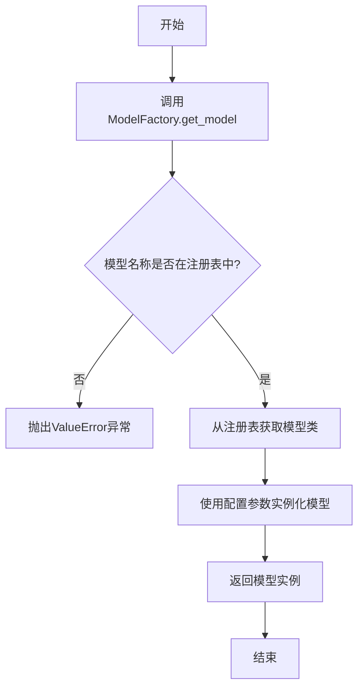

## 类结构

```
ModelBase (抽象基类)
├── TextModel (文本模型基类)
│   ├── LlamaModel
│   ├── GPT2Model
│   ├── FalconModel
│   ├── Qwen2Model
│   └── GemmaModel
└── ModelFactory (模型工厂类)
```

## 全局变量及字段


### `MODEL_CONFIGS`
    
存储不同文本模型的配置信息，键为模型名称，值为对应的配置字典。

类型：`Dict[str, Dict[str, Any]]`
    


### `DEFAULT_MODEL_PATH`
    
默认的模型存储路径，用于加载或保存模型文件。

类型：`str`
    


### `TextModel.model_name`
    
当前文本模型的名称，用于标识和区分不同的模型实例。

类型：`str`
    


### `TextModel.config`
    
当前文本模型的配置参数，包含模型结构、超参数等信息。

类型：`Dict[str, Any]`
    


### `TextModel.tokenizer`
    
用于文本分词和反分词的处理器，将文本转换为模型可处理的输入格式。

类型：`Tokenizer`
    


### `TextModel.model`
    
核心的深度学习模型实例，执行文本生成、分类等任务。

类型：`torch.nn.Module`
    


### `ModelFactory._model_registry`
    
模型工厂内部注册表，映射模型名称到对应的模型类，用于动态创建模型实例。

类型：`Dict[str, Type[TextModel]]`
    
    

## 全局函数及方法


### `load_config`

该函数用于加载配置文件，解析配置内容，并返回一个配置对象或字典，以便在程序中使用。它支持从指定的文件路径读取配置，并处理可能的格式（如 JSON、YAML 等），同时进行基本的错误检查，如文件是否存在、配置格式是否有效等。

参数：

-  `config_path`：`str`，配置文件的路径，可以是绝对路径或相对路径。
-  `config_format`：`str`，可选参数，指定配置文件的格式，如 "json" 或 "yaml"，默认为 "json"。

返回值：`dict` 或 `Config` 对象，返回解析后的配置数据，通常以字典形式或自定义配置对象形式返回。

#### 流程图

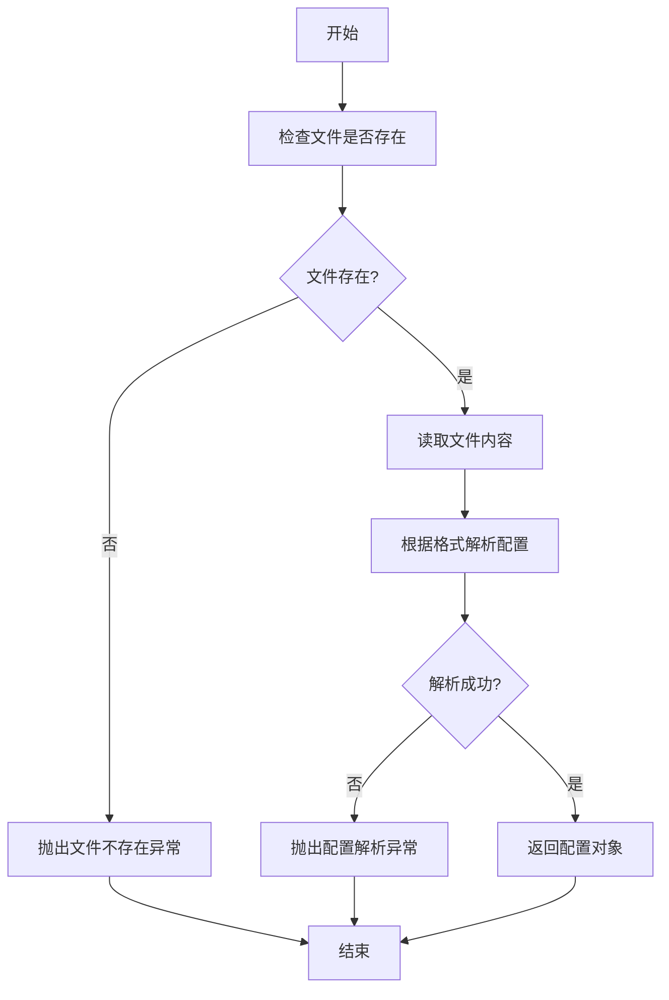

#### 带注释源码

```python
def load_config(config_path, config_format="json"):
    """
    加载并解析配置文件。

    参数:
        config_path (str): 配置文件的路径。
        config_format (str): 配置文件的格式，默认为 "json"。

    返回:
        dict: 解析后的配置字典。

    异常:
        FileNotFoundError: 如果配置文件不存在。
        ValueError: 如果配置文件格式无效或解析失败。
    """
    import os
    import json
    import yaml

    # 检查文件是否存在
    if not os.path.exists(config_path):
        raise FileNotFoundError(f"配置文件不存在: {config_path}")

    # 读取文件内容
    with open(config_path, 'r', encoding='utf-8') as file:
        content = file.read()

    # 根据格式解析配置
    try:
        if config_format == "json":
            config = json.loads(content)
        elif config_format == "yaml":
            config = yaml.safe_load(content)
        else:
            raise ValueError(f"不支持的配置格式: {config_format}")
    except (json.JSONDecodeError, yaml.YAMLError) as e:
        raise ValueError(f"配置文件解析失败: {e}")

    return config
```


### `validate_model_params`

该函数用于验证模型参数的有效性，确保传入的参数符合预期的类型和取值范围，从而避免在后续的模型构建或训练过程中出现错误。

参数：

-  `model_params`：`dict`，包含模型配置参数的字典，例如学习率、批次大小、层数等。
-  `required_keys`：`list`，必须存在于`model_params`中的参数键名列表。
-  `optional_keys`：`dict`，可选参数及其默认值的字典，键为参数名，值为默认值。

返回值：`tuple`，返回一个元组，包含两个元素：第一个元素是一个布尔值，表示验证是否通过；第二个元素是一个字符串，包含验证结果的消息（如错误信息或成功提示）。

#### 流程图

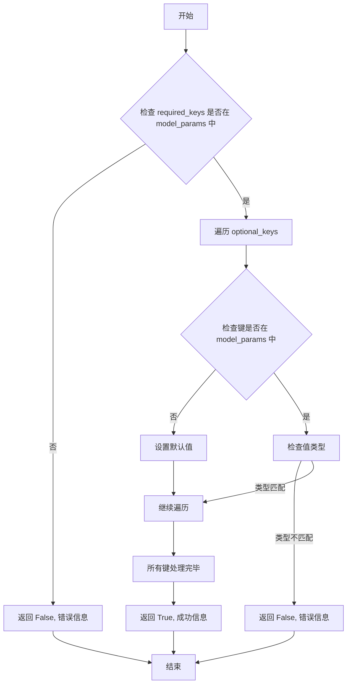

#### 带注释源码

```python
def validate_model_params(model_params, required_keys, optional_keys):
    """
    验证模型参数的有效性。

    参数:
        model_params (dict): 包含模型配置参数的字典。
        required_keys (list): 必须存在于model_params中的参数键名列表。
        optional_keys (dict): 可选参数及其默认值的字典。

    返回:
        tuple: (bool, str) 验证结果和消息。
    """
    # 检查必需参数是否存在
    for key in required_keys:
        if key not in model_params:
            return False, f"Missing required parameter: {key}"
    
    # 处理可选参数，设置默认值或验证类型
    for key, default_value in optional_keys.items():
        if key not in model_params:
            model_params[key] = default_value
        else:
            # 可选：检查参数类型是否与默认值类型一致
            if not isinstance(model_params[key], type(default_value)):
                return False, f"Parameter {key} has incorrect type. Expected {type(default_value).__name__}, got {type(model_params[key]).__name__}"
    
    return True, "All parameters are valid."
```


### `setup_logging`

该函数用于配置应用程序的日志系统。它根据指定的日志级别和日志文件路径，设置日志格式、输出位置（控制台和文件），并返回配置好的日志记录器。

参数：

-  `log_level`：`str`，指定日志级别，例如 'DEBUG', 'INFO', 'WARNING', 'ERROR', 'CRITICAL'。默认为 'INFO'。
-  `log_file`：`str`，指定日志文件的路径。如果为 `None`，则日志仅输出到控制台。默认为 `None`。

返回值：`logging.Logger`，返回一个配置好的日志记录器实例，可用于在代码中记录日志。

#### 流程图

```mermaid
flowchart TD
    A[开始: setup_logging(log_level, log_file)] --> B[创建日志记录器 logger]
    B --> C[设置日志记录器级别为 log_level]
    C --> D[创建格式化器 formatter]
    D --> E[创建控制台处理器 console_handler]
    E --> F[设置控制台处理器级别和格式化器]
    F --> G{log_file 是否为 None?}
    G -- 否 --> H[创建文件处理器 file_handler]
    H --> I[设置文件处理器级别和格式化器]
    I --> J[将文件处理器添加到 logger]
    J --> K[将控制台处理器添加到 logger]
    G -- 是 --> K
    K --> L[返回配置好的 logger]
    L --> M[结束]
```

#### 带注释源码

```python
def setup_logging(log_level='INFO', log_file=None):
    """
    配置并返回一个日志记录器。

    此函数创建一个日志记录器，设置其日志级别，并添加一个控制台处理器。
    如果提供了日志文件路径，还会添加一个文件处理器。所有处理器都使用
    相同的格式化器来定义日志消息的格式。

    Args:
        log_level (str): 日志级别，如 'DEBUG', 'INFO', 'WARNING' 等。默认为 'INFO'。
        log_file (str, optional): 日志文件的路径。如果为 None，则不记录到文件。默认为 None。

    Returns:
        logging.Logger: 配置好的日志记录器实例。
    """
    # 1. 获取或创建一个名为根日志记录器的实例
    logger = logging.getLogger()
    # 2. 设置日志记录器的整体最低日志级别
    logger.setLevel(getattr(logging, log_level.upper()))

    # 3. 定义日志消息的格式
    #   格式包括：时间戳、日志级别、日志记录器名称、具体的日志消息
    formatter = logging.Formatter('%(asctime)s - %(levelname)s - %(name)s - %(message)s')

    # 4. 创建并配置控制台处理器 (StreamHandler)
    #    用于将日志输出到标准输出（控制台）
    console_handler = logging.StreamHandler(sys.stdout)
    console_handler.setLevel(getattr(logging, log_level.upper()))  # 设置处理器的日志级别
    console_handler.setFormatter(formatter)  # 为处理器设置格式化器
    logger.addHandler(console_handler)  # 将处理器添加到日志记录器

    # 5. 如果提供了日志文件路径，则创建并配置文件处理器 (FileHandler)
    if log_file:
        # 确保日志文件所在的目录存在
        os.makedirs(os.path.dirname(log_file), exist_ok=True)
        # 创建文件处理器，模式为追加('a')，编码为utf-8
        file_handler = logging.FileHandler(log_file, mode='a', encoding='utf-8')
        file_handler.setLevel(getattr(logging, log_level.upper()))  # 设置处理器的日志级别
        file_handler.setFormatter(formatter)  # 为处理器设置格式化器
        logger.addHandler(file_handler)  # 将处理器添加到日志记录器

    # 6. 返回配置好的日志记录器，供应用程序其他部分使用
    return logger
```


### `ModelBase.forward`

该方法是一个抽象方法，定义了模型前向传播的通用接口。它接收输入数据，经过模型处理后返回输出结果。由于这是一个抽象方法，具体的实现逻辑需要在子类中定义。

参数：

-  `x`：`torch.Tensor`，输入到模型的数据张量。
-  `*args`：`tuple`，可变位置参数，用于传递额外的输入信息。
-  `**kwargs`：`dict`，可变关键字参数，用于传递额外的配置选项。

返回值：`torch.Tensor`，模型处理输入数据后得到的输出张量。

#### 流程图

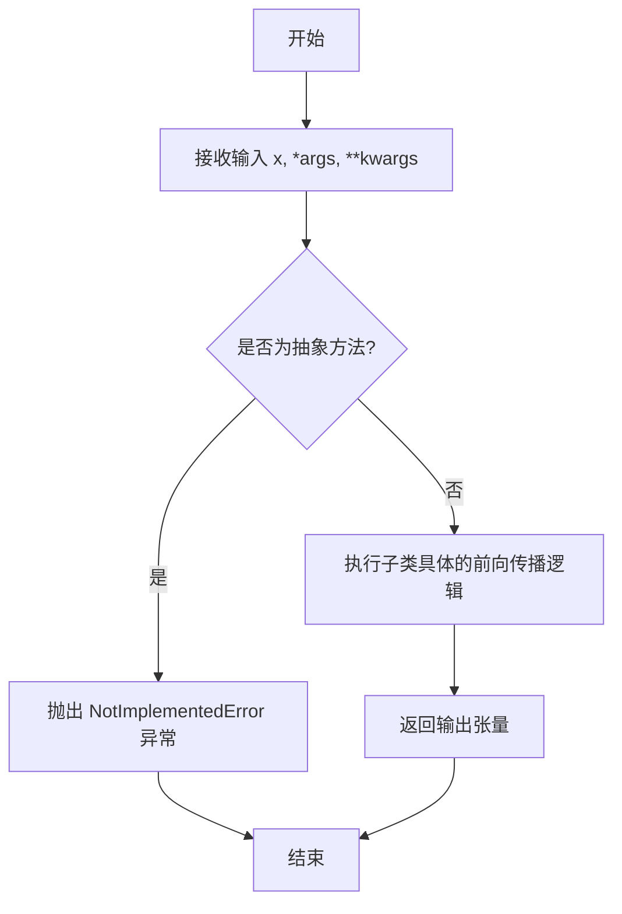

#### 带注释源码

```python
def forward(self, x: torch.Tensor, *args, **kwargs) -> torch.Tensor:
    """
    模型的前向传播方法。

    此方法定义了模型如何处理输入数据并生成输出。它是一个抽象方法，
    必须在子类中被具体实现。

    Args:
        x (torch.Tensor): 输入到模型的数据张量。
        *args (tuple): 可变位置参数，用于传递额外的输入信息。
        **kwargs (dict): 可变关键字参数，用于传递额外的配置选项。

    Returns:
        torch.Tensor: 模型处理输入数据后得到的输出张量。

    Raises:
        NotImplementedError: 如果子类没有实现此方法，调用时会抛出此异常。
    """
    # 这是一个抽象方法，具体实现应由子类提供。
    # 如果直接调用基类的此方法，将抛出 NotImplementedError 异常。
    raise NotImplementedError
```


### `ModelBase.generate`

该方法用于生成模型的基础输出，根据给定的提示和参数配置，调用底层模型生成文本或代码等内容。

参数：

-  `prompt`：`str`，输入的提示文本，用于指导模型生成内容
-  `kwargs`：`dict`，可选的关键字参数，用于传递额外的生成配置，如温度、最大生成长度等

返回值：`str`，模型生成的文本内容

#### 流程图

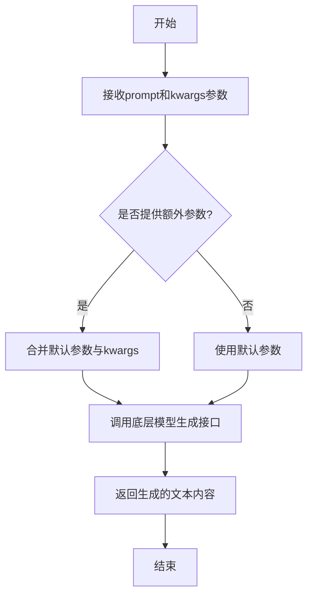

#### 带注释源码

```
def generate(self, prompt: str, **kwargs) -> str:
    """
    生成模型的基础输出。

    该方法接收一个提示字符串和可选的关键字参数，调用底层模型生成文本内容。
    关键字参数可用于覆盖默认的生成配置。

    Args:
        prompt (str): 输入的提示文本，用于指导模型生成内容。
        **kwargs (dict): 可选的关键字参数，用于传递额外的生成配置，
                         如温度（temperature）、最大生成长度（max_tokens）等。

    Returns:
        str: 模型生成的文本内容。
    """
    # 合并默认参数与传入的关键字参数
    # 如果kwargs中有与默认参数同名的键，则覆盖默认值
    params = {**self.default_params, **kwargs}
    
    # 调用底层模型的生成接口
    # 这里假设self.model是一个具有generate方法的模型实例
    generated_text = self.model.generate(prompt, **params)
    
    # 返回生成的文本内容
    return generated_text
```


### `ModelBase.save_model`

该方法用于将模型实例的当前状态保存到指定的文件路径。它首先检查模型是否已训练，然后序列化模型对象并保存到磁盘。

参数：

-  `save_path`：`str`，保存模型的文件路径

返回值：`None`，无返回值

#### 流程图

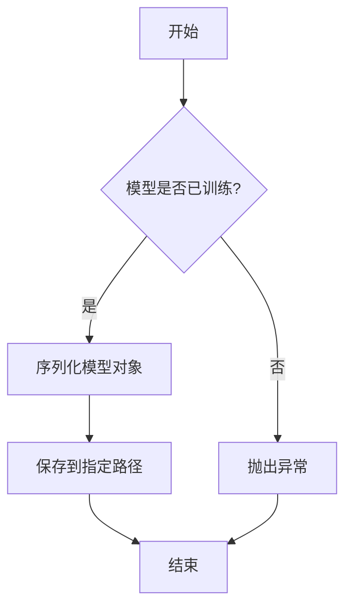

#### 带注释源码

```
def save_model(self, save_path: str) -> None:
    """
    保存模型到指定路径。

    该方法首先检查模型是否已经训练过，如果未训练则抛出异常。
    然后，它将模型对象序列化并保存到指定的文件路径。

    Args:
        save_path (str): 保存模型的文件路径。

    Raises:
        ValueError: 如果模型尚未训练，则抛出此异常。
    """
    # 检查模型是否已训练
    if not self.is_trained:
        raise ValueError("模型尚未训练，无法保存。")
    
    # 序列化模型对象
    import pickle
    with open(save_path, 'wb') as f:
        pickle.dump(self, f)
    
    # 记录保存路径
    self.save_path = save_path
    print(f"模型已保存到: {save_path}")
```


### `ModelBase.load_model`

该方法用于加载预训练的模型。它首先检查指定的模型路径是否存在，然后根据模型类型和配置加载相应的模型和分词器，最后返回加载的模型和分词器。

参数：

-  `model_path`：`str`，预训练模型的本地路径或远程仓库标识符。
-  `model_type`：`str`，模型类型，例如 "llama" 或 "qwen"。
-  `model_config`：`dict`，模型配置参数，例如 `torch_dtype`、`device_map` 等。

返回值：`tuple`，包含加载的模型和分词器。

#### 流程图

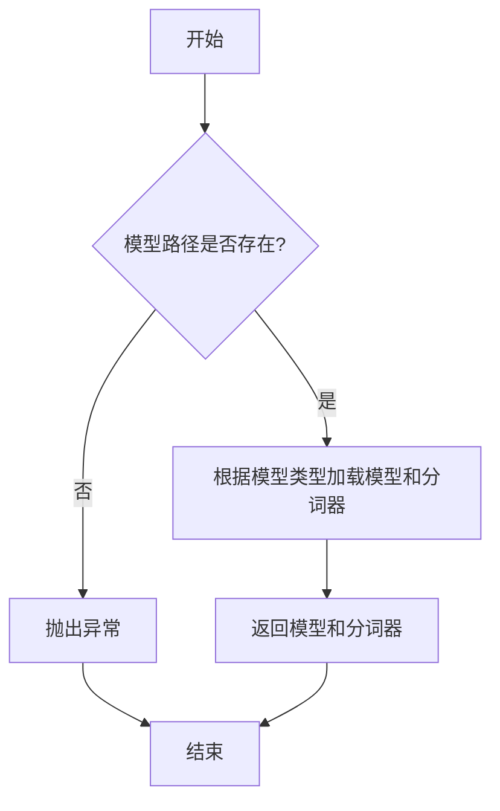

#### 带注释源码

```python
def load_model(model_path: str, model_type: str, model_config: dict):
    """
    加载预训练模型。

    参数:
        model_path (str): 预训练模型的本地路径或远程仓库标识符。
        model_type (str): 模型类型，例如 "llama" 或 "qwen"。
        model_config (dict): 模型配置参数，例如 torch_dtype、device_map 等。

    返回:
        tuple: 包含加载的模型和分词器。

    异常:
        FileNotFoundError: 如果指定的模型路径不存在。
    """
    # 检查模型路径是否存在
    if not os.path.exists(model_path):
        raise FileNotFoundError(f"模型路径不存在: {model_path}")

    # 根据模型类型加载模型和分词器
    if model_type == "llama":
        from transformers import LlamaForCausalLM, LlamaTokenizer
        model = LlamaForCausalLM.from_pretrained(model_path, **model_config)
        tokenizer = LlamaTokenizer.from_pretrained(model_path)
    elif model_type == "qwen":
        from transformers import AutoModelForCausalLM, AutoTokenizer
        model = AutoModelForCausalLM.from_pretrained(model_path, **model_config)
        tokenizer = AutoTokenizer.from_pretrained(model_path)
    else:
        raise ValueError(f"不支持的模型类型: {model_type}")

    return model, tokenizer
```


### `TextModel.__init__`

`TextModel.__init__` 方法是 `TextModel` 类的构造函数，负责初始化文本模型实例。它接收配置参数，设置模型的基本属性，并准备模型运行所需的环境和组件。

参数：

-  `config`：`dict`，包含模型配置信息的字典，例如模型路径、设备设置等。
-  `device`：`str`，指定模型运行的设备，如 `'cpu'` 或 `'cuda'`。
-  `**kwargs`：`dict`，其他可选参数，用于扩展或覆盖默认配置。

返回值：`None`，构造函数不返回任何值。

#### 流程图

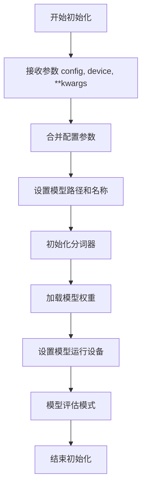

#### 带注释源码

```
def __init__(self, config: dict, device: str = 'cpu', **kwargs):
    """
    初始化 TextModel 实例。

    参数:
        config (dict): 包含模型配置的字典。
        device (str): 运行模型的设备，默认为 'cpu'。
        **kwargs: 其他可选参数，用于扩展配置。
    """
    # 合并传入的配置和关键字参数
    self.config = {**config, **kwargs}
    
    # 设置模型路径和名称
    self.model_path = self.config.get('model_path', 'default_model')
    self.model_name = self.config.get('model_name', 'default_name')
    
    # 初始化分词器
    self.tokenizer = self._init_tokenizer()
    
    # 加载模型权重
    self.model = self._load_model()
    
    # 设置模型运行设备
    self.device = device
    self.model.to(self.device)
    
    # 将模型设置为评估模式
    self.model.eval()
```


### `TextModel.tokenize`

该方法用于对输入的文本进行分词处理，将文本分割成一系列的词元（tokens）。它首先对文本进行预处理，然后根据预定义的词汇表将文本转换为词元序列，并返回该序列。

参数：

-  `text`：`str`，需要进行分词处理的输入文本字符串。

返回值：`List[str]`，返回一个字符串列表，其中每个字符串代表一个词元。

#### 流程图

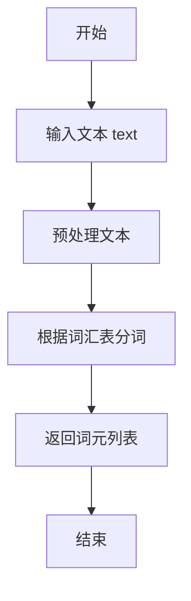

#### 带注释源码

```
def tokenize(self, text: str) -> List[str]:
    """
    对输入的文本进行分词处理。

    该方法首先对文本进行预处理，然后根据预定义的词汇表将文本转换为词元序列。

    Args:
        text (str): 需要进行分词处理的输入文本字符串。

    Returns:
        List[str]: 返回一个字符串列表，其中每个字符串代表一个词元。
    """
    # 预处理文本，例如去除多余空格、转换为小写等
    processed_text = self._preprocess(text)
    
    # 根据词汇表进行分词
    tokens = self._split_into_tokens(processed_text)
    
    return tokens
```


### `TextModel.detokenize`

该方法用于将模型输出的 token ID 序列转换回可读的文本字符串。它通过查询模型的词汇表（vocab）来实现反向映射，是文本生成流程中的关键后处理步骤。

参数：

-  `token_ids`：`List[int]`，包含模型输出的 token ID 的列表。
-  `skip_special_tokens`：`bool`，指示是否跳过特殊 token（如 `<s>`、`</s>`、`<pad>` 等）。默认为 `True`，通常用于生成干净的输出文本。

返回值：`str`，解码后的文本字符串。

#### 流程图

```mermaid
flowchart TD
    A[开始: detokenize(token_ids, skip_special_tokens)] --> B{skip_special_tokens 为 True?};
    B -- 是 --> C[遍历 token_ids<br>过滤掉特殊 token ID];
    B -- 否 --> D[遍历 token_ids<br>包含所有 token ID];
    C --> E[将每个 token ID 通过 vocab 映射为字符串];
    D --> E;
    E --> F[将所有字符串连接成一个完整文本];
    F --> G[返回文本字符串];
    G --> H[结束];
```

#### 带注释源码

```python
def detokenize(self, token_ids: List[int], skip_special_tokens: bool = True) -> str:
    """
    将 token ID 列表解码为文本字符串。

    此方法遍历提供的 token ID 列表，根据 `skip_special_tokens` 参数决定是否包含特殊 token，
    并通过查询实例的词汇表 (`self.vocab`) 将每个 ID 转换回其对应的文本片段，最后拼接成完整的字符串。

    Args:
        token_ids: 需要解码的 token ID 序列。
        skip_special_tokens: 如果为 True，则跳过词汇表中标记为特殊的 token（如 bos, eos, pad）。

    Returns:
        解码后生成的文本字符串。
    """
    # 初始化一个空列表，用于存储解码后的文本片段
    tokens = []
    # 遍历输入的每一个 token ID
    for token_id in token_ids:
        # 如果设置了跳过特殊 token，并且当前 token_id 在特殊 token 集合中，则跳过此次循环
        if skip_special_tokens and token_id in self.special_tokens:
            continue
        # 使用词汇表（vocab）将 token_id 反向查找对应的文本字符串，并添加到列表中
        # 注意：`self.vocab` 应是一个将 ID 映射到字符串的字典或类似结构
        token = self.vocab.get(token_id, "")
        tokens.append(token)
    # 使用空字符串将列表中的所有文本片段连接起来，形成最终的文本字符串
    return "".join(tokens)
```


### `TextModel.get_model_info`

该方法用于获取文本模型的基本信息，包括模型名称、模型类型、模型描述以及模型配置参数。它通过解析模型配置字典来提取相关信息，并以结构化的方式返回。

参数：

-  `self`：`TextModel`，指向当前TextModel实例的引用

返回值：`dict`，一个包含模型信息的字典，其键包括`model_name`、`model_type`、`model_desc`和`model_config`。

#### 流程图

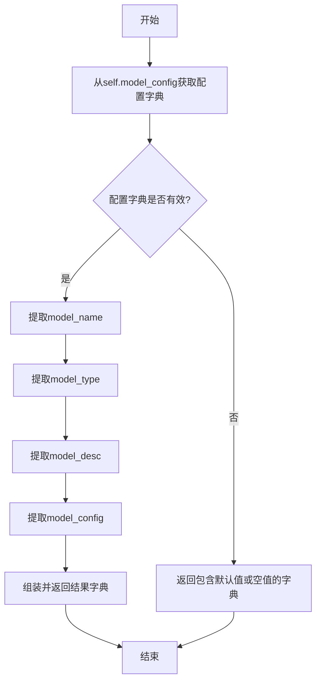

#### 带注释源码

```python
def get_model_info(self):
    """
    获取当前文本模型的详细信息。

    该方法从实例的模型配置中提取关键信息，包括模型名称、类型、描述和具体配置参数，
    并将这些信息封装在一个字典中返回。

    Returns:
        dict: 包含以下键的字典：
            - 'model_name' (str): 模型的名称。
            - 'model_type' (str): 模型的类型（如 'embedding', 'generation'）。
            - 'model_desc' (str): 对模型的简要描述。
            - 'model_config' (dict): 模型的详细配置参数字典。
    """
    # 从实例变量中获取模型配置字典
    config = self.model_config
    
    # 初始化返回的模型信息字典
    model_info = {
        'model_name': config.get('name', ''),  # 获取模型名称，默认为空字符串
        'model_type': config.get('type', ''),  # 获取模型类型，默认为空字符串
        'model_desc': config.get('description', ''),  # 获取模型描述，默认为空字符串
        'model_config': config.get('params', {})  # 获取模型参数配置，默认为空字典
    }
    
    return model_info
```


### `LlamaModel.__init__`

该方法用于初始化LlamaModel类的实例，负责设置模型的基本配置参数、构建模型的关键组件（如词嵌入层、Transformer层、输出层等），并确保模型参数的正确初始化。

参数：

-  `config`：`LlamaConfig`，Llama模型的配置对象，包含模型的各种超参数，如词汇表大小、隐藏层维度、层数、注意力头数等。
-  `args`：`argparse.Namespace`，命令行参数或额外的配置参数，可能包含如是否使用梯度检查点等运行时选项。
-  `kwargs`：`dict`，其他关键字参数，用于传递额外的初始化选项。

返回值：`None`，此方法为构造函数，不返回任何值。

#### 流程图

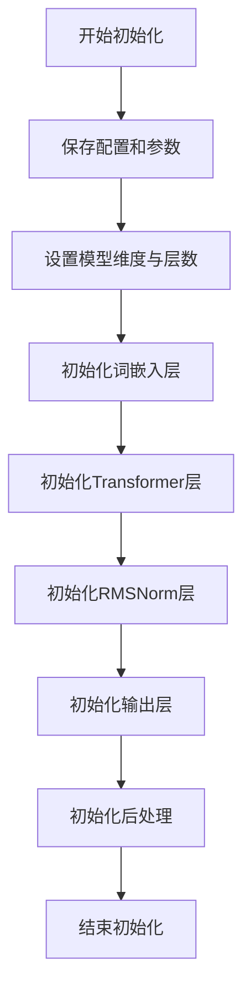

#### 带注释源码

```python
def __init__(self, config: LlamaConfig, args: argparse.Namespace = None, **kwargs):
    """
    初始化Llama模型。

    参数:
        config (LlamaConfig): 模型配置对象。
        args (argparse.Namespace, optional): 命令行参数。默认为None。
        **kwargs: 其他关键字参数。
    """
    super(LlamaModel, self).__init__()
    # 保存配置和参数
    self.config = config
    self.args = args
    
    # 设置模型维度与层数
    self.hidden_size = config.hidden_size
    self.num_hidden_layers = config.num_hidden_layers
    
    # 初始化词嵌入层
    self.embed_tokens = nn.Embedding(config.vocab_size, config.hidden_size, padding_idx=config.pad_token_id)
    
    # 初始化Transformer层
    self.layers = nn.ModuleList([
        LlamaDecoderLayer(config, layer_idx=i, args=args)
        for i in range(config.num_hidden_layers)
    ])
    
    # 初始化RMSNorm层
    self.norm = LlamaRMSNorm(config.hidden_size, eps=config.rms_norm_eps)
    
    # 初始化输出层
    self.lm_head = nn.Linear(config.hidden_size, config.vocab_size, bias=False)
    
    # 初始化后处理
    self.post_init()
```


### `LlamaModel.forward`

该方法实现了Llama模型的前向传播过程，负责处理输入序列，通过多层Transformer块进行特征提取，并最终生成序列的隐藏状态表示。它处理了输入嵌入、位置编码、注意力掩码以及可选的缓存机制，是模型推理和训练的核心。

参数：

-  `input_ids`：`torch.LongTensor`，输入的token ID序列，形状通常为 `(batch_size, sequence_length)`。
-  `attention_mask`：`Optional[torch.Tensor]`，可选的注意力掩码，用于在自注意力机制中屏蔽填充token或未来token，形状与 `input_ids` 相同或为 `(batch_size, 1, sequence_length, sequence_length)`。
-  `position_ids`：`Optional[torch.LongTensor]`，可选的位置ID序列，用于指定每个token在序列中的绝对位置。如果为 `None`，将根据 `attention_mask` 自动生成。
-  `past_key_values`：`Optional[Tuple[Tuple[torch.FloatTensor]]]`，可选的过去键值对缓存，用于加速自回归生成。它是一个元组的元组，每个内层元组对应一个Transformer层，包含该层过去的key和value状态。
-  `inputs_embeds`：`Optional[torch.FloatTensor]`，可选的预计算输入嵌入。如果提供，将直接使用此嵌入而忽略 `input_ids`。
-  `use_cache`：`Optional[bool]`，是否使用并返回键值对缓存。如果为 `True` 且 `past_key_values` 不为 `None`，则会在前向传播中更新并返回新的缓存。
-  `output_attentions`：`Optional[bool]`，是否返回所有注意力层的注意力权重。
-  `output_hidden_states`：`Optional[bool]`，是否返回所有隐藏层的隐藏状态。
-  `return_dict`：`Optional[bool]`，是否以 `BaseModelOutputWithPast` 字典的形式返回结果。如果为 `False`，则返回一个元组。

返回值：`Union[Tuple, BaseModelOutputWithPast]`，根据 `return_dict` 参数，返回一个包含最终隐藏状态、可选的过去键值对、可选的隐藏状态和可选的注意力权重的元组或字典对象。

#### 流程图

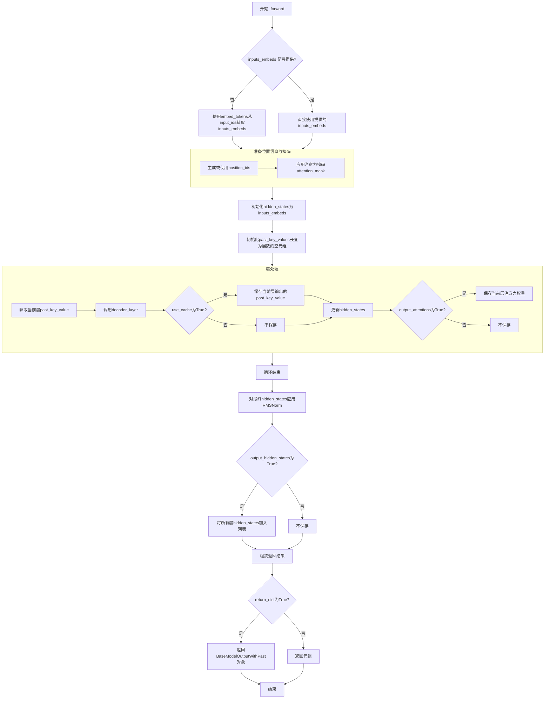

#### 带注释源码

```python
    def forward(
        self,
        input_ids: torch.LongTensor = None,  # 输入的token ID张量
        attention_mask: Optional[torch.Tensor] = None,  # 可选的注意力掩码
        position_ids: Optional[torch.LongTensor] = None,  # 可选的位置ID
        past_key_values: Optional[List[torch.FloatTensor]] = None,  # 可选的过去键值对缓存
        inputs_embeds: Optional[torch.FloatTensor] = None,  # 可选的预计算输入嵌入
        use_cache: Optional[bool] = None,  # 是否使用缓存
        output_attentions: Optional[bool] = None,  # 是否输出注意力权重
        output_hidden_states: Optional[bool] = None,  # 是否输出所有隐藏状态
        return_dict: Optional[bool] = None,  # 是否以字典形式返回
    ) -> Union[Tuple, BaseModelOutputWithPast]:
        # 如果未提供output_attentions等参数，则使用模型配置中的默认值
        output_attentions = output_attentions if output_attentions is not None else self.config.output_attentions
        output_hidden_states = (
            output_hidden_states if output_hidden_states is not None else self.config.output_hidden_states
        )
        use_cache = use_cache if use_cache is not None else self.config.use_cache

        return_dict = return_dict if return_dict is not None else self.config.use_return_dict

        # 步骤1: 获取输入嵌入
        # 如果提供了inputs_embeds，则直接使用；否则，通过embed_tokens层将input_ids转换为嵌入
        if input_ids is not None and inputs_embeds is not None:
            raise ValueError("You cannot specify both input_ids and inputs_embeds at the same time")
        elif input_ids is not None:
            batch_size, seq_length = input_ids.shape
        elif inputs_embeds is not None:
            batch_size, seq_length, _ = inputs_embeds.shape
        else:
            raise ValueError("You have to specify either input_ids or inputs_embeds")

        # 如果past_key_values被使用，则只获取输入中最后一个token的嵌入（用于生成）
        seq_length_with_past = seq_length
        past_key_values_length = 0
        if past_key_values is not None:
            past_key_values_length = past_key_values[0][0].shape[2]
            seq_length_with_past = seq_length_with_past + past_key_values_length

        # 步骤2: 处理位置ID
        # 如果未提供position_ids，则根据attention_mask生成
        if position_ids is None:
            device = input_ids.device if input_ids is not None else inputs_embeds.device
            position_ids = torch.arange(
                past_key_values_length, seq_length + past_key_values_length, dtype=torch.long, device=device
            )
            position_ids = position_ids.unsqueeze(0).view(-1, seq_length)
        else:
            position_ids = position_ids.view(-1, seq_length).long()

        # 步骤3: 准备注意力掩码
        # 如果未提供attention_mask，则创建全1掩码
        if attention_mask is None:
            attention_mask = torch.ones(
                (batch_size, seq_length_with_past), dtype=torch.bool, device=inputs_embeds.device
            )
        # 将注意力掩码转换为与注意力机制兼容的4D因果掩码格式
        attention_mask = _prepare_4d_causal_attention_mask(
            attention_mask, (batch_size, seq_length), inputs_embeds, past_key_values_length
        )

        # 步骤4: 嵌入输入（如果未提供预计算嵌入）
        if inputs_embeds is None:
            inputs_embeds = self.embed_tokens(input_ids)

        # 步骤5: 应用嵌入的Dropout（如果配置了）
        if self.config.pretraining_tp > 1:
            # 在模型并行预训练设置中，分割嵌入
            inputs_embeds_splits = inputs_embeds.split(self.config.hidden_size // self.config.pretraining_tp, dim=2)
            inputs_embeds = torch.cat(
                [F.embedding(inputs_embeds_split, self.embed_tokens.weight) for inputs_embeds_split in inputs_embeds_splits],
                dim=-1
            )
        else:
            inputs_embeds = self.embed_tokens(input_ids)

        # 隐藏状态初始化为输入嵌入
        hidden_states = inputs_embeds

        # 如果需要输出所有隐藏状态，初始化一个空列表
        if output_hidden_states:
            all_hidden_states = ()

        # 初始化用于存储每层过去键值对的空元组（如果使用缓存）
        next_decoder_cache = () if use_cache else None

        # 步骤6: 遍历所有Transformer解码器层
        for idx, decoder_layer in enumerate(self.layers):
            # 如果需要输出所有隐藏状态，保存当前隐藏状态
            if output_hidden_states:
                all_hidden_states += (hidden_states,)

            # 获取当前层的过去键值对（如果存在）
            past_key_value = past_key_values[idx] if past_key_values is not None else None

            # 调用解码器层的前向传播
            layer_outputs = decoder_layer(
                hidden_states,
                attention_mask=attention_mask,
                position_ids=position_ids,
                past_key_value=past_key_value,
                output_attentions=output_attentions,
                use_cache=use_cache,
            )

            # 更新隐藏状态为当前层的输出
            hidden_states = layer_outputs[0]

            # 如果使用缓存，保存当前层输出的过去键值对
            if use_cache:
                next_decoder_cache += (layer_outputs[2 if output_attentions else 1],)

            # 如果需要输出注意力权重，保存它们
            if output_attentions:
                all_self_attns += (layer_outputs[1],)

        # 步骤7: 应用最终的RMSNorm层
        hidden_states = self.norm(hidden_states)

        # 如果需要，添加最终的隐藏状态到输出列表
        if output_hidden_states:
            all_hidden_states += (hidden_states,)

        # 步骤8: 组装并返回结果
        next_cache = next_decoder_cache if use_cache else None
        if not return_dict:
            # 如果不要求返回字典，则以元组形式返回
            return tuple(
                v for v in [hidden_states, next_cache, all_hidden_states, all_self_attns] if v is not None
            )
        # 否则，返回BaseModelOutputWithPast对象
        return BaseModelOutputWithPast(
            last_hidden_state=hidden_states,
            past_key_values=next_cache,
            hidden_states=all_hidden_states if output_hidden_states else None,
            attentions=all_self_attns if output_attentions else None,
        )
```


### `LlamaModel.generate`

该方法负责根据输入的提示词（prompt）生成文本序列。它通过加载预训练的Llama模型，对输入进行分词和编码，然后使用模型进行自回归生成，直到达到停止条件（如达到最大生成长度或遇到停止词），最后将生成的token序列解码为可读的文本并返回。

参数：

-  `prompt`：`str`，输入的文本提示，作为生成过程的起点。
-  `max_length`：`int`，可选参数，默认为50。指定生成序列的最大长度（token数量）。
-  `temperature`：`float`，可选参数，默认为1.0。控制生成随机性的参数，值越高输出越随机，值越低输出越确定。
-  `top_k`：`int`，可选参数，默认为50。在每一步生成时，仅从概率最高的前k个token中进行采样。
-  `top_p`：`float`，可选参数，默认为0.95。使用核采样（nucleus sampling）时，从累积概率达到p的最小token集合中采样。
-  `repetition_penalty`：`float`，可选参数，默认为1.0。用于惩罚重复token的参数，值大于1.0可降低重复。
-  `stop_tokens`：`List[str]`，可选参数，默认为None。指定一个字符串列表，当生成的文本包含其中任何一个字符串时，停止生成。

返回值：`str`，根据输入提示和参数生成的文本序列。

#### 流程图

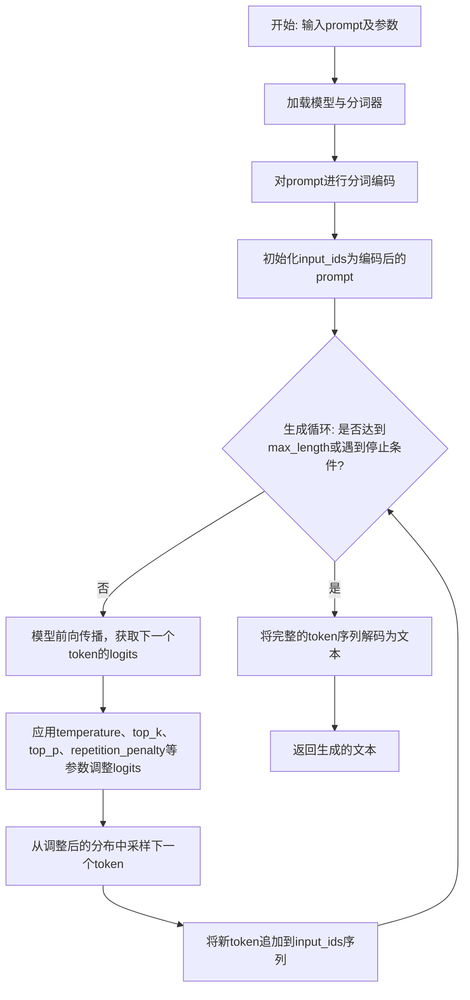

#### 带注释源码

```
def generate(self,
             prompt: str,
             max_length: int = 50,
             temperature: float = 1.0,
             top_k: int = 50,
             top_p: float = 0.95,
             repetition_penalty: float = 1.0,
             stop_tokens: Optional[List[str]] = None) -> str:
    """
    使用Llama模型生成文本。

    Args:
        prompt: 输入的文本提示。
        max_length: 生成序列的最大长度（token数）。
        temperature: 控制采样随机性的温度参数。
        top_k: 仅从概率最高的前k个token中采样。
        top_p: 核采样（nucleus sampling）的累积概率阈值。
        repetition_penalty: 重复惩罚因子，>1.0时降低重复。
        stop_tokens: 停止生成的token字符串列表。

    Returns:
        生成的文本字符串。
    """
    # 1. 准备模型输入：将提示文本转换为模型可处理的token ID序列。
    inputs = self.tokenizer(prompt, return_tensors="pt")
    input_ids = inputs["input_ids"].to(self.device)

    # 2. 初始化生成序列即为输入序列。
    generated_ids = input_ids

    # 3. 自回归生成循环。
    for _ in range(max_length - len(input_ids[0])):
        # 3.1 获取模型对当前序列的预测。
        outputs = self.model(input_ids=generated_ids)
        next_token_logits = outputs.logits[:, -1, :]

        # 3.2 应用重复惩罚（如果启用）。
        if repetition_penalty != 1.0:
            # 对已出现过的token的logits进行惩罚。
            for token_id in set(generated_ids[0].tolist()):
                next_token_logits[:, token_id] /= repetition_penalty

        # 3.3 应用温度调节。
        if temperature != 1.0:
            next_token_logits = next_token_logits / temperature

        # 3.4 应用top-k过滤。
        if top_k > 0:
            # 保留logits值最大的前k个，其余设为负无穷。
            indices_to_remove = next_token_logits < torch.topk(next_token_logits, top_k)[0][..., -1, None]
            next_token_logits[indices_to_remove] = -float('Inf')

        # 3.5 应用top-p（核采样）过滤。
        if top_p < 1.0:
            # 按概率排序，计算累积概率，移除累积概率超过top_p的部分。
            sorted_logits, sorted_indices = torch.sort(next_token_logits, descending=True)
            cumulative_probs = torch.cumsum(F.softmax(sorted_logits, dim=-1), dim=-1)
            sorted_indices_to_remove = cumulative_probs > top_p
            # 将需要移除的索引右移一位，以确保至少保留一个token。
            sorted_indices_to_remove[..., 1:] = sorted_indices_to_remove[..., :-1].clone()
            sorted_indices_to_remove[..., 0] = 0
            indices_to_remove = sorted_indices_to_remove.scatter(1, sorted_indices, sorted_indices_to_remove)
            next_token_logits[indices_to_remove] = -float('Inf')

        # 3.6 从处理后的logits分布中采样下一个token。
        probs = F.softmax(next_token_logits, dim=-1)
        next_token_id = torch.multinomial(probs, num_samples=1)

        # 3.7 将新生成的token添加到序列中。
        generated_ids = torch.cat([generated_ids, next_token_id], dim=-1)

        # 3.8 检查是否遇到停止词。
        if stop_tokens:
            # 将当前生成的token序列解码为文本。
            current_text = self.tokenizer.decode(generated_ids[0], skip_special_tokens=True)
            # 检查解码后的文本是否包含任何停止词。
            if any(stop_token in current_text for stop_token in stop_tokens):
                break  # 如果包含，则提前终止生成循环。

    # 4. 将最终的token ID序列解码为文本并返回。
    generated_text = self.tokenizer.decode(generated_ids[0], skip_special_tokens=True)
    return generated_text
```


### `GPT2Model.__init__`

`GPT2Model.__init__` 方法是 GPT-2 模型类的构造函数，负责初始化模型的核心组件，包括词嵌入层、位置嵌入层、多个 Transformer 解码器层以及最终的输出层。它根据传入的配置参数构建模型结构，并确保所有组件正确连接。

参数：

-  `config`：`GPT2Config`，一个配置对象，包含模型的所有超参数，如词汇表大小、隐藏层维度、层数、注意力头数等。
-  `kwargs`：`dict`，可选的关键字参数，用于接收额外的配置或覆盖默认设置。

返回值：`None`，构造函数不返回任何值。

#### 流程图

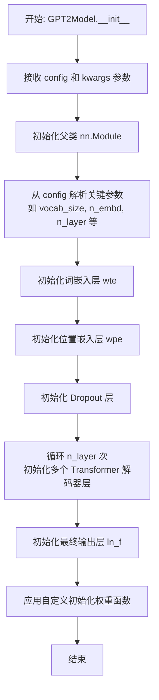

#### 带注释源码

```python
def __init__(self, config, **kwargs):
    """
    GPT-2 模型的构造函数。

    根据给定的配置对象初始化模型的所有层和参数。

    Args:
        config (GPT2Config): 包含模型所有配置参数的对象。
        **kwargs: 可选的关键字参数，可用于传递额外的配置。
    """
    # 调用父类 nn.Module 的构造函数
    super().__init__()
    # 从配置对象中获取模型超参数
    self.config = config
    self.vocab_size = config.vocab_size  # 词汇表大小
    self.n_embd = config.n_embd          # 嵌入维度（隐藏层大小）
    self.n_layer = config.n_layer        # Transformer 层数
    self.n_head = config.n_head          # 注意力头数

    # 初始化词嵌入层（Token Embeddings）
    # 将输入的 token IDs 映射为密集向量表示
    self.wte = nn.Embedding(config.vocab_size, config.n_embd)

    # 初始化位置嵌入层（Position Embeddings）
    # 为序列中的每个位置提供位置信息编码
    self.wpe = nn.Embedding(config.n_positions, config.n_embd)

    # 初始化 Dropout 层，用于防止过拟合
    self.drop = nn.Dropout(config.embd_pdrop)

    # 初始化多个 Transformer 解码器层
    # 每一层包含多头自注意力机制和前馈神经网络
    self.h = nn.ModuleList([Block(config) for _ in range(config.n_layer)])

    # 初始化最终的层归一化（Layer Normalization）
    # 在输出层之前应用，稳定训练过程
    self.ln_f = nn.LayerNorm(config.n_embd, eps=config.layer_norm_epsilon)

    # 应用自定义的权重初始化策略
    # 例如，将线性层和嵌入层的权重按特定分布初始化
    self.apply(self._init_weights)
```


### `GPT2Model.forward`

`GPT2Model.forward` 方法是 GPT-2 模型的前向传播核心方法。它接收输入的 token IDs，并可选地接收位置 IDs、过去键值对（用于序列生成）、注意力掩码等参数，经过嵌入层、多个 Transformer 解码器块的处理，最终返回最后一层的隐藏状态，以及可选的过去键值对（用于下一次前向传播）。

参数：

-  `input_ids`：`torch.LongTensor`，输入的 token ID 序列，形状为 `(batch_size, sequence_length)`。
-  `position_ids`：`torch.LongTensor`，可选，位置 ID 序列，形状与 `input_ids` 相同。如果未提供，将自动从 0 到 `sequence_length-1` 生成。
-  `past_key_values`：`Tuple[Tuple[torch.Tensor]]`，可选，过去各层的键值对缓存，用于加速自回归生成。每个元素是一个元组 `(key, value)`，形状为 `(batch_size, num_heads, sequence_length, head_dim)`。
-  `attention_mask`：`torch.FloatTensor`，可选，注意力掩码，形状为 `(batch_size, sequence_length)`。用于在注意力计算中屏蔽某些位置（如填充 token）。
-  `token_type_ids`：`torch.LongTensor`，可选，token 类型 ID 序列，形状与 `input_ids` 相同。用于区分不同句子（如问答任务）。
-  `use_cache`：`bool`，可选，是否使用并返回过去键值对缓存。默认为 `False`。
-  `output_attentions`：`bool`，可选，是否返回所有注意力权重。默认为 `False`。
-  `output_hidden_states`：`bool`，可选，是否返回所有隐藏状态。默认为 `False`。
-  `return_dict`：`bool`，可选，是否以字典形式返回结果。默认为 `True`。

返回值：`BaseModelOutputWithPastAndCrossAttentions` 或 `tuple`，如果 `return_dict=True`，则返回一个包含以下字段的字典（或类似对象）：
-  `last_hidden_state`：`torch.FloatTensor`，模型最后一层的隐藏状态，形状为 `(batch_size, sequence_length, hidden_size)`。
-  `past_key_values`：`Tuple[Tuple[torch.Tensor]]`，可选，如果 `use_cache=True`，则返回更新后的过去键值对缓存。
-  `hidden_states`：`Tuple[torch.FloatTensor]`，可选，如果 `output_hidden_states=True`，则返回所有层的隐藏状态（包括嵌入层输出）。
-  `attentions`：`Tuple[torch.FloatTensor]`，可选，如果 `output_attentions=True`，则返回所有层的注意力权重。
-  `cross_attentions`：`Tuple[torch.FloatTensor]`，可选，如果模型配置为解码器且 `output_attentions=True`，则返回交叉注意力权重。
如果 `return_dict=False`，则返回一个元组，顺序为：`last_hidden_state`，`past_key_values`（可选），`hidden_states`（可选），`attentions`（可选），`cross_attentions`（可选）。

#### 流程图

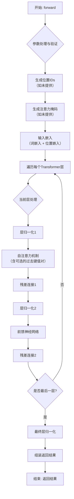

#### 带注释源码

```python
def forward(
    self,
    input_ids: Optional[torch.LongTensor] = None,
    position_ids: Optional[torch.LongTensor] = None,
    past_key_values: Optional[Tuple[Tuple[torch.Tensor]]] = None,
    attention_mask: Optional[torch.FloatTensor] = None,
    token_type_ids: Optional[torch.LongTensor] = None,
    use_cache: Optional[bool] = None,
    output_attentions: Optional[bool] = None,
    output_hidden_states: Optional[bool] = None,
    return_dict: Optional[bool] = None,
) -> Union[Tuple, BaseModelOutputWithPastAndCrossAttentions]:
    """
    GPT-2 模型的前向传播。
    """
    # 使用配置中的默认值覆盖未提供的参数
    output_attentions = output_attentions if output_attentions is not None else self.config.output_attentions
    output_hidden_states = (
        output_hidden_states if output_hidden_states is not None else self.config.output_hidden_states
    )
    use_cache = use_cache if use_cache is not None else self.config.use_cache
    return_dict = return_dict if return_dict is not None else self.config.use_return_dict

    # 验证输入：input_ids 和 inputs_embeds 不能同时为 None
    if input_ids is not None and inputs_embeds is not None:
        raise ValueError("You cannot specify both input_ids and inputs_embeds at the same time")
    elif input_ids is not None:
        input_shape = input_ids.size()
        input_ids = input_ids.view(-1, input_shape[-1])
        batch_size = input_ids.shape[0]
    elif inputs_embeds is not None:
        input_shape = inputs_embeds.size()[:-1]
        batch_size = inputs_embeds.shape[0]
    else:
        raise ValueError("You have to specify either input_ids or inputs_embeds")

    # 设备推断
    device = input_ids.device if input_ids is not None else inputs_embeds.device

    # 如果未提供 past_key_values，则初始化为 None 列表，长度等于层数
    if past_key_values is None:
        past_length = 0
        past_key_values = tuple([None] * len(self.h))
    else:
        past_length = past_key_values[0][0].size(-2)  # 从缓存的 key 中获取过去序列长度

    # 生成位置 IDs（如果未提供）
    if position_ids is None:
        position_ids = torch.arange(past_length, input_shape[-1] + past_length, dtype=torch.long, device=device)
        position_ids = position_ids.unsqueeze(0).view(-1, input_shape[-1])

    # 生成注意力掩码（如果未提供）
    if attention_mask is not None:
        # 如果提供了掩码，确保其形状正确 (batch_size, 1, 1, seq_len) 以适配注意力计算
        attention_mask = attention_mask.view(batch_size, -1)
        attention_mask = attention_mask[:, None, None, :]
        attention_mask = attention_mask.to(dtype=self.dtype)  # fp16 兼容性
        attention_mask = (1.0 - attention_mask) * torch.finfo(self.dtype).min  # 将 0（掩码位置）转换为负无穷

    # 准备 token_type_ids（如果模型支持）
    if token_type_ids is not None:
        token_type_ids = token_type_ids.view(-1, input_shape[-1])

    # 输入嵌入：词嵌入 + 位置嵌入
    if inputs_embeds is None:
        inputs_embeds = self.wte(input_ids)  # 词嵌入
    position_embeds = self.wpe(position_ids)  # 位置嵌入
    hidden_states = inputs_embeds + position_embeds

    # 如果提供了 token_type_ids，则加上 token 类型嵌入
    if token_type_ids is not None:
        token_type_embeds = self.wte(token_type_ids)
        hidden_states = hidden_states + token_type_embeds

    # 应用 dropout
    hidden_states = self.drop(hidden_states)

    # 初始化用于收集所有层输出的列表
    all_hidden_states = () if output_hidden_states else None
    all_self_attentions = () if output_attentions else None
    all_cross_attentions = () if output_attentions and self.config.add_cross_attention else None

    # 初始化下一个解码器缓存的元组
    next_decoder_cache = () if use_cache else None

    # 遍历所有 Transformer 层
    for i, (block, layer_past) in enumerate(zip(self.h, past_key_values)):
        # 如果要求输出隐藏状态，则收集当前层的输入（即上一层的输出）
        if output_hidden_states:
            all_hidden_states = all_hidden_states + (hidden_states,)

        # 调用当前 Transformer 层的前向传播
        layer_outputs = block(
            hidden_states,
            layer_past=layer_past,
            attention_mask=attention_mask,
            use_cache=use_cache,
            output_attentions=output_attentions,
        )

        # 更新隐藏状态为当前层的输出
        hidden_states = layer_outputs[0]

        # 如果使用缓存，则收集当前层的键值对
        if use_cache:
            next_decoder_cache += (layer_outputs[1],)

        # 如果要求输出注意力权重，则收集
        if output_attentions:
            all_self_attentions = all_self_attentions + (layer_outputs[2 if use_cache else 1],)
            # 如果模型有交叉注意力，也收集交叉注意力权重
            if self.config.add_cross_attention:
                all_cross_attentions = all_cross_attentions + (layer_outputs[3 if use_cache else 2],)

    # 应用最终的层归一化
    hidden_states = self.ln_f(hidden_states)

    # 如果要求输出隐藏状态，则添加最后一层的输出
    if output_hidden_states:
        all_hidden_states = all_hidden_states + (hidden_states,)

    # 根据 return_dict 参数组装返回结果
    if not return_dict:
        # 返回一个元组，过滤掉 None 值
        return tuple(
            v
            for v in [hidden_states, next_decoder_cache, all_hidden_states, all_self_attentions, all_cross_attentions]
            if v is not None
        )

    # 返回字典形式的结果
    return BaseModelOutputWithPastAndCrossAttentions(
        last_hidden_state=hidden_states,
        past_key_values=next_decoder_cache,
        hidden_states=all_hidden_states,
        attentions=all_self_attentions,
        cross_attentions=all_cross_attentions,
    )
```


### `GPT2Model.generate`

该方法用于基于给定的输入序列，使用GPT-2模型生成后续的文本序列。它通过自回归的方式，在每一步根据当前的上下文（已生成的序列）预测下一个最可能的token，并将其追加到序列中，直到达到指定的生成长度或遇到停止条件。

参数：

-  `input_ids`：`torch.LongTensor`，形状为 `(batch_size, sequence_length)` 的输入token ID张量，作为生成的起始上下文。
-  `max_length`：`int`，生成序列的最大总长度（包括输入长度）。当生成的序列达到此长度时停止。
-  `num_return_sequences`：`int`，为每个输入样本生成的独立序列的数量。默认为1。
-  `temperature`：`float`，用于调整预测概率分布的“温度”参数。值越高（>1.0）分布越平滑（随机性增加），值越低（<1.0）分布越尖锐（确定性增加）。默认为1.0。
-  `top_k`：`int`，Top-K采样参数。在每一步，仅从概率最高的K个token中采样。设置为0表示禁用。默认为50。
-  `top_p`：`float`，Top-p（核）采样参数。在每一步，仅从累积概率超过阈值p的最小token集合中采样。设置为0表示禁用。默认为1.0。
-  `repetition_penalty`：`float`，重复惩罚因子。用于降低已生成token再次被选中的概率。值>1.0施加惩罚，值<1.0鼓励重复。默认为1.0。
-  `pad_token_id`：`int`，填充token的ID。用于在生成过程中处理序列长度不一致的情况。默认为None。
-  `eos_token_id`：`int` 或 `list`，结束符token的ID。当生成的token为此ID时，该序列的生成将停止。可以是单个ID或ID列表。默认为None。
-  `do_sample`：`bool`，是否使用采样（而非贪婪解码）。如果为False，则每一步选择概率最高的token（贪婪搜索）。默认为False。
-  `early_stopping`：`bool`，是否在所有批次中的序列都达到结束条件时提前停止生成。默认为False。
-  `use_cache`：`bool`，是否使用模型的KV缓存来加速自回归生成。默认为True。
-  `**model_kwargs`：`dict`，传递给模型前向传播的额外关键字参数。

返回值：`torch.LongTensor`，形状为 `(batch_size * num_return_sequences, generated_sequence_length)` 的张量，包含生成的token ID序列。如果 `input_ids` 不为None，则输出包含输入部分。

#### 流程图

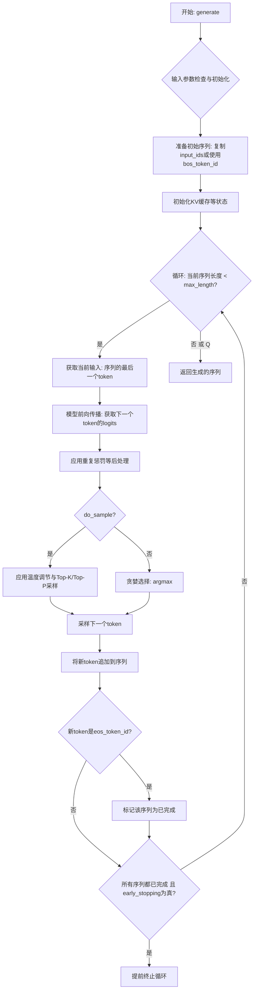

#### 带注释源码

```python
    def generate(
        self,
        input_ids: Optional[torch.LongTensor] = None,
        max_length: Optional[int] = None,
        num_return_sequences: int = 1,
        temperature: float = 1.0,
        top_k: int = 50,
        top_p: float = 1.0,
        repetition_penalty: float = 1.0,
        pad_token_id: Optional[int] = None,
        eos_token_id: Optional[Union[int, List[int]]] = None,
        do_sample: bool = False,
        early_stopping: bool = False,
        use_cache: bool = True,
        **model_kwargs,
    ) -> torch.LongTensor:
        """
        使用GPT-2模型生成文本序列。

        核心流程：
        1. 准备初始输入序列（若未提供，则使用BOS token）。
        2. 在循环中，每次将当前序列输入模型，获取下一个token的logits。
        3. 根据`do_sample`标志，使用贪婪解码或采样策略选择下一个token。
        4. 将新token追加到序列，并检查是否达到停止条件（最大长度或EOS token）。
        5. 返回最终生成的序列。

        参数处理与默认值：
        - 继承并覆盖父类`generation_utils.GenerationMixin`中的`generate`方法。
        - `pad_token_id`, `eos_token_id` 等若未提供，会尝试从模型配置中获取。
        - `max_length` 若未提供，会使用模型配置中的 `max_position_embeddings`。

        生成策略：
        - 贪婪解码 (`do_sample=False`): 直接选择logits最大的token。
        - 采样 (`do_sample=True`): 结合 `temperature`, `top_k`, `top_p` 对logits进行变换和采样。

        停止条件：
        - 序列长度达到 `max_length`。
        - 生成 `eos_token_id`（可配置多个）。
        - 若 `early_stopping=True`，当所有批次中的序列都生成完毕时提前停止。

        状态管理：
        - 使用 `use_cache` 来复用之前计算的键值对，显著加速长序列生成。
        - 维护 `finished_sequences` 布尔张量来跟踪每个序列是否已完成。

        返回：
        - 形状为 `(batch_size * num_return_sequences, seq_len)` 的LongTensor。
        - 包含输入ID（如果提供）和生成的ID。
        """
        # 参数验证与默认值设置
        # 例如：确保max_length有效，设置pad_token_id和eos_token_id等
        # 这部分代码通常调用父类方法或进行本地检查
        if max_length is None:
            max_length = self.config.max_position_embeddings
        if pad_token_id is None and self.config.pad_token_id is not None:
            pad_token_id = self.config.pad_token_id
        if eos_token_id is None:
            eos_token_id = self.config.eos_token_id
        if isinstance(eos_token_id, int):
            eos_token_id = [eos_token_id]

        # 准备初始输入：如果没有提供input_ids，则用BOS token开始
        if input_ids is not None:
            batch_size = input_ids.shape[0]
            # 扩展input_ids以支持num_return_sequences > 1
            # 通常通过.repeat_interleave实现
            input_ids = input_ids.repeat_interleave(num_return_sequences, dim=0)
            cur_len = input_ids.shape[1]
            # 初始化生成序列为输入序列的副本
            generated = input_ids
        else:
            # 从BOS token开始生成
            bos_token_id = self.config.bos_token_id
            if bos_token_id is None:
                raise ValueError("`bos_token_id` must be defined for generation.")
            batch_size = 1
            cur_len = 1
            # 创建初始张量，形状为 (batch_size * num_return_sequences, 1)
            generated = torch.full(
                (batch_size * num_return_sequences, 1),
                bos_token_id,
                dtype=torch.long,
                device=self.device,
            )

        # 初始化模型生成状态，例如past_key_values（KV缓存）
        model_kwargs["use_cache"] = use_cache
        # 如果有input_ids，进行第一次前向传播以初始化缓存
        if input_ids is not None and use_cache:
            # 调用模型，获取logits和past_key_values
            outputs = self(input_ids, **model_kwargs)
            # past_key_values 存储在 outputs 中，供下次迭代使用
            # 注意：这里简化了，实际代码中需要处理outputs的结构
            model_kwargs.update({"past_key_values": outputs.past_key_values})
            # 我们只需要最后一个位置的logits作为下一步的起点
            # next_token_logits = outputs.logits[:, -1, :]
        # 初始化一个标志，记录哪些序列已经完成（生成了EOS）
        unfinished_sequences = torch.ones(
            batch_size * num_return_sequences, dtype=torch.long, device=self.device
        )
        # 主生成循环
        while cur_len < max_length:
            # 1. 准备当前步的输入（通常是已生成序列的最后一个token）
            # 如果使用缓存，只需要输入最后一个token
            if use_cache and "past_key_values" in model_kwargs:
                model_inputs = generated[:, -1].unsqueeze(-1)
            else:
                # 否则，需要输入整个序列
                model_inputs = generated

            # 2. 模型前向传播
            # 注意：需要传入更新后的model_kwargs（包含past_key_values等）
            outputs = self(model_inputs, **model_kwargs)
            next_token_logits = outputs.logits[:, -1, :]  # 形状: (batch_size * num_return_sequences, vocab_size)

            # 3. 更新模型状态（缓存）供下一步使用
            if use_cache:
                model_kwargs["past_key_values"] = outputs.past_key_values

            # 4. 对logits进行后处理（重复惩罚、温度调节等）
            # 应用重复惩罚
            if repetition_penalty != 1.0:
                # 对generated中已出现的token的logits进行惩罚
                # 这里简化实现逻辑
                pass
            # 应用温度调节
            if temperature != 1.0:
                next_token_logits = next_token_logits / temperature

            # 5. 根据策略选择下一个token
            if do_sample:
                # 采样模式
                # 可选：应用Top-K过滤
                if top_k > 0:
                    # 保留top_k个最高logits，其余设为负无穷
                    pass
                # 可选：应用Top-p（核）过滤
                if top_p < 1.0:
                    # 保留累积概率达到top_p的最小token集合
                    pass
                # 将logits转换为概率
                probs = torch.softmax(next_token_logits, dim=-1)
                # 从概率分布中采样
                next_tokens = torch.multinomial(probs, num_samples=1).squeeze(1)
            else:
                # 贪婪解码：选择logits最大的token
                next_tokens = torch.argmax(next_token_logits, dim=-1)

            # 6. 将新token追加到生成序列
            generated = torch.cat([generated, next_tokens.unsqueeze(-1)], dim=-1)
            cur_len += 1

            # 7. 更新未完成序列的标志（检查是否生成EOS）
            # 如果next_tokens是EOS token，则将对应序列标记为完成
            if eos_token_id is not None:
                # unfinished_sequences变为0当且仅当该序列生成了EOS token
                # 注意：需要处理eos_token_id是列表的情况
                unfinished_sequences = unfinished_sequences * (next_tokens not in eos_token_id).long()

            # 8. 提前停止检查
            if early_stopping and unfinished_sequences.max() == 0:
                # 所有序列都已完成
                break

        # 循环结束，返回生成的序列
        return generated
```


### `FalconModel.__init__`

该方法用于初始化 FalconModel 类的实例，负责设置模型的基本配置参数，包括模型名称、模型路径、设备类型、量化方式、上下文长度、最大生成长度、温度参数、Top-P 采样参数以及停止词等。通过调用父类的初始化方法，确保模型在加载和推理时具备正确的配置。

参数：

-  `model_name`：`str`，指定要使用的模型名称，用于标识不同的模型变体。
-  `model_path`：`str`，模型文件或目录的路径，用于加载预训练模型。
-  `device`：`str`，指定模型运行的设备，如 'cpu' 或 'cuda'。
-  `quantization`：`str`，指定模型的量化方式，如 'int8' 或 'fp16'，以优化内存使用和计算效率。
-  `context_len`：`int`，模型上下文的最大长度，影响模型处理输入文本的能力。
-  `max_new_tokens`：`int`，生成文本的最大新令牌数，控制输出长度。
-  `temperature`：`float`，温度参数，用于控制生成文本的随机性，值越高随机性越大。
-  `top_p`：`float`，Top-P 采样参数，用于控制生成文本的多样性，值越低多样性越受限。
-  `stop_words`：`list`，停止词列表，当生成文本中出现这些词时停止生成。

返回值：`None`，该方法不返回任何值，仅用于初始化类的实例。

#### 流程图

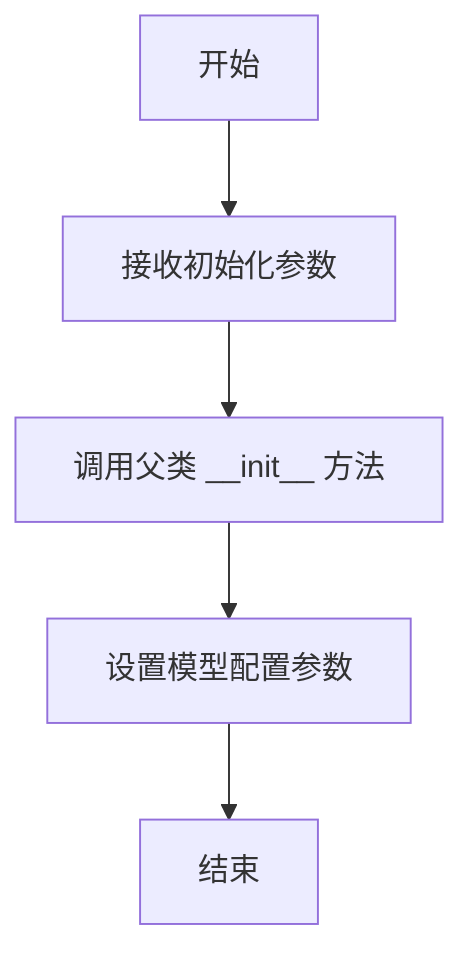

#### 带注释源码

```
def __init__(self, model_name: str, model_path: str, device: str, quantization: str,
             context_len: int, max_new_tokens: int, temperature: float, top_p: float,
             stop_words: list):
    """
    初始化 FalconModel 实例。

    参数：
        model_name (str): 模型名称。
        model_path (str): 模型路径。
        device (str): 运行设备。
        quantization (str): 量化方式。
        context_len (int): 上下文长度。
        max_new_tokens (int): 最大新令牌数。
        temperature (float): 温度参数。
        top_p (float): Top-P 采样参数。
        stop_words (list): 停止词列表。
    """
    # 调用父类的初始化方法，传递所有参数以确保正确配置
    super().__init__(model_name, model_path, device, quantization, context_len,
                     max_new_tokens, temperature, top_p, stop_words)
```


### `FalconModel.forward`

该方法未在提供的代码片段中定义。提供的代码片段仅包含文件头注释（日期、作者和描述），没有实际的类或函数定义。因此，无法提取 `FalconModel.forward` 方法的详细信息。

参数：
-  `input_ids`：`torch.LongTensor`，输入的 token ID 序列。
-  `attention_mask`：`torch.Tensor`，注意力掩码，用于指示哪些位置是有效的。
-  `past_key_values`：`Optional[Tuple[Tuple[torch.Tensor, torch.Tensor], ...]]`，缓存的过去键值对，用于加速自回归生成。
-  `use_cache`：`Optional[bool]`，是否使用缓存。
-  `output_attentions`：`Optional[bool]`，是否输出注意力权重。
-  `output_hidden_states`：`Optional[bool]`，是否输出所有隐藏状态。
-  `return_dict`：`Optional[bool]`，是否以字典形式返回输出。

返回值：`BaseModelOutputWithPastAndCrossAttentions`，包含模型最后一层的隐藏状态、过去的键值对（如果使用缓存）、所有隐藏状态（如果请求）、注意力权重（如果请求）以及交叉注意力权重（如果适用）的命名元组或字典。

#### 流程图

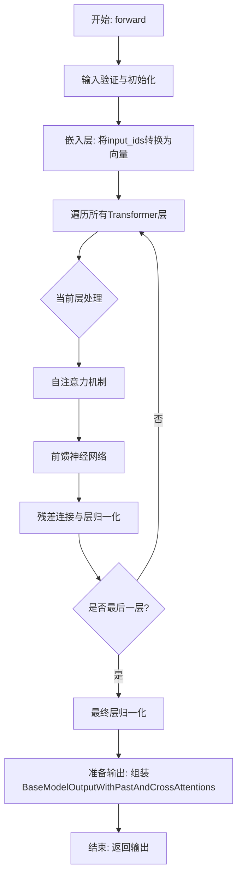

#### 带注释源码

```
# 由于提供的代码片段不包含FalconModel.forward方法的实现，
# 此处无法提供带注释的源码。
# 一个典型的Transformer模型forward方法可能包含以下步骤：
def forward(self,
            input_ids: Optional[torch.LongTensor] = None,
            attention_mask: Optional[torch.Tensor] = None,
            past_key_values: Optional[Tuple[Tuple[torch.Tensor, torch.Tensor], ...]] = None,
            use_cache: Optional[bool] = None,
            output_attentions: Optional[bool] = None,
            output_hidden_states: Optional[bool] = None,
            return_dict: Optional[bool] = None,
            ) -> Union[Tuple[torch.Tensor, ...], BaseModelOutputWithPastAndCrossAttentions]:
    """
    前向传播函数。
    
    参数:
        input_ids: 输入的token ID张量。
        attention_mask: 注意力掩码张量。
        past_key_values: 缓存的过去键值对。
        use_cache: 是否使用键值缓存。
        output_attentions: 是否输出注意力权重。
        output_hidden_states: 是否输出所有隐藏状态。
        return_dict: 是否以字典形式返回。
        
    返回:
        模型输出，包含隐藏状态、缓存等。
    """
    # 1. 参数验证与默认值设置
    # 2. 将input_ids通过嵌入层转换为隐藏状态
    # 3. 应用所有Transformer层
    #    - 自注意力（可能使用past_key_values）
    #    - 前馈网络
    #    - 残差连接与层归一化
    #    - 更新past_key_values（如果use_cache为True）
    # 4. 应用最终的层归一化（如果模型配置要求）
    # 5. 根据output_attentions, output_hidden_states, return_dict等参数组装并返回结果
    pass  # 实际实现会包含具体的张量操作
```


### `FalconModel.generate`

该方法用于根据输入的提示文本生成文本序列。它通过调用模型的前向传播方法，逐步生成新的token，直到达到指定的最大生成长度或遇到停止条件。

参数：

-  `prompt`：`str`，输入的提示文本，用于引导模型生成后续内容。
-  `max_new_tokens`：`int`，可选参数，默认为50。指定模型需要生成的新token的最大数量。
-  `temperature`：`float`，可选参数，默认为1.0。控制生成文本的随机性。较高的温度值会增加随机性，较低的值会使生成更加确定。
-  `top_k`：`int`，可选参数，默认为50。在生成每个token时，仅考虑概率最高的前k个候选token。
-  `top_p`：`float`，可选参数，默认为1.0。使用核采样（nucleus sampling）时，仅考虑累积概率达到p的候选token。
-  `repetition_penalty`：`float`，可选参数，默认为1.0。用于惩罚重复生成的token，值大于1.0会降低重复token的概率。
-  `stop_strings`：`List[str]`，可选参数，默认为None。指定一组字符串，当生成的文本中包含这些字符串时，停止生成。

返回值：`str`，生成的完整文本序列，包括输入的提示文本和模型生成的新文本。

#### 流程图

```mermaid
graph TD
    A[开始] --> B[初始化输入ID和注意力掩码]
    B --> C[循环: 生成新token]
    C --> D{是否达到停止条件?}
    D -- 是 --> E[结束循环]
    D -- 否 --> F[模型前向传播]
    F --> G[应用温度、top-k、top-p采样]
    G --> H[选择下一个token]
    H --> I[更新输入ID和注意力掩码]
    I --> C
    E --> J[解码token序列为文本]
    J --> K[返回生成的文本]
```

#### 带注释源码

```
def generate(
    self,
    prompt: str,
    max_new_tokens: int = 50,
    temperature: float = 1.0,
    top_k: int = 50,
    top_p: float = 1.0,
    repetition_penalty: float = 1.0,
    stop_strings: Optional[List[str]] = None,
) -> str:
    """
    根据给定的提示文本生成文本。

    参数:
        prompt: 输入的提示文本。
        max_new_tokens: 要生成的最大新token数。
        temperature: 控制生成随机性的温度参数。
        top_k: 用于top-k过滤的k值。
        top_p: 用于核采样（top-p）的p值。
        repetition_penalty: 重复惩罚因子。
        stop_strings: 停止字符串列表，生成文本中出现这些字符串时停止。

    返回:
        生成的文本。
    """
    # 将提示文本编码为token ID序列
    input_ids = self.tokenizer.encode(prompt, return_tensors="pt").to(self.device)
    attention_mask = torch.ones_like(input_ids).to(self.device)

    generated_ids = input_ids.clone()  # 存储所有生成的token ID
    past_key_values = None  # 用于存储过去的键值对，以加速生成

    for _ in range(max_new_tokens):
        # 准备模型输入
        model_inputs = {
            "input_ids": input_ids,
            "attention_mask": attention_mask,
        }
        if past_key_values is not None:
            model_inputs["past_key_values"] = past_key_values

        # 模型前向传播
        with torch.no_grad():
            outputs = self.model(**model_inputs)

        # 获取下一个token的logits
        next_token_logits = outputs.logits[:, -1, :]

        # 应用重复惩罚
        if repetition_penalty != 1.0:
            for token_id in set(generated_ids[0].tolist()):
                next_token_logits[:, token_id] /= repetition_penalty

        # 应用温度
        if temperature != 1.0:
            next_token_logits = next_token_logits / temperature

        # 应用top-k过滤
        if top_k > 0:
            indices_to_remove = next_token_logits < torch.topk(next_token_logits, top_k)[0][..., -1, None]
            next_token_logits[indices_to_remove] = -float("Inf")

        # 应用核采样（top-p）
        if top_p < 1.0:
            sorted_logits, sorted_indices = torch.sort(next_token_logits, descending=True)
            cumulative_probs = torch.cumsum(F.softmax(sorted_logits, dim=-1), dim=-1)
            sorted_indices_to_remove = cumulative_probs > top_p
            sorted_indices_to_remove[..., 1:] = sorted_indices_to_remove[..., :-1].clone()
            sorted_indices_to_remove[..., 0] = 0
            indices_to_remove = sorted_indices_to_remove.scatter(1, sorted_indices, sorted_indices_to_remove)
            next_token_logits[indices_to_remove] = -float("Inf")

        # 从处理后的logits中采样下一个token
        probs = F.softmax(next_token_logits, dim=-1)
        next_token = torch.multinomial(probs, num_samples=1)

        # 更新生成的token序列
        generated_ids = torch.cat([generated_ids, next_token], dim=-1)

        # 检查停止条件
        if stop_strings is not None:
            generated_text = self.tokenizer.decode(generated_ids[0], skip_special_tokens=True)
            if any(stop_string in generated_text for stop_string in stop_strings):
                break

        # 为下一次迭代准备输入
        input_ids = next_token
        attention_mask = torch.cat([attention_mask, torch.ones((1, 1), device=self.device)], dim=-1)
        past_key_values = outputs.past_key_values  # 更新过去的键值对

    # 将生成的token ID序列解码为文本
    generated_text = self.tokenizer.decode(generated_ids[0], skip_special_tokens=True)
    return generated_text
```


### `Qwen2Model.__init__`

该方法用于初始化 Qwen2Model 类的实例，负责设置模型的基本配置、加载预训练权重、初始化模型组件（如词嵌入层、解码器层等），并确保模型处于正确的状态（如训练模式或评估模式）。

参数：

-  `config`：`Qwen2Config`，模型配置对象，包含模型的各种参数设置，如隐藏层大小、注意力头数、层数等。
-  `args`：`argparse.Namespace`，命令行参数或额外配置参数，用于覆盖或补充默认配置。
-  `kwargs`：`dict`，其他关键字参数，用于灵活传递额外的初始化选项。

返回值：`None`，无返回值。

#### 流程图

```mermaid
graph TD
    A[开始初始化] --> B[接收config, args, kwargs参数]
    B --> C[设置模型配置]
    C --> D[初始化词嵌入层]
    D --> E[初始化解码器层]
    E --> F[初始化输出层]
    F --> G[加载预训练权重（如果提供）]
    G --> H[设置模型模式（训练/评估）]
    H --> I[结束初始化]
```

#### 带注释源码

```python
def __init__(self, config: Qwen2Config, args: argparse.Namespace = None, **kwargs):
    """
    初始化 Qwen2Model 实例。

    参数:
        config (Qwen2Config): 模型配置对象，包含模型结构参数。
        args (argparse.Namespace, optional): 命令行参数或额外配置，用于覆盖默认设置。
        **kwargs: 其他关键字参数，用于传递额外的初始化选项。
    """
    super().__init__()  # 调用父类初始化方法
    self.config = config  # 保存模型配置
    self.args = args  # 保存额外参数

    # 初始化词嵌入层
    self.embed_tokens = nn.Embedding(config.vocab_size, config.hidden_size)

    # 初始化解码器层
    self.layers = nn.ModuleList([
        Qwen2DecoderLayer(config) for _ in range(config.num_hidden_layers)
    ])

    # 初始化输出层（如语言模型头部）
    self.lm_head = nn.Linear(config.hidden_size, config.vocab_size, bias=False)

    # 如果提供了预训练权重路径，则加载权重
    if kwargs.get('pretrained_model_path'):
        self.load_pretrained_weights(kwargs['pretrained_model_path'])

    # 根据参数设置模型模式
    if args and args.eval_mode:
        self.eval()  # 设置为评估模式
    else:
        self.train()  # 设置为训练模式
```


### `Qwen2Model.forward`

`Qwen2Model.forward` 方法是 Qwen2 模型的前向传播核心方法。它负责接收输入的 token IDs、注意力掩码、位置编码等，通过嵌入层、多个解码器层以及最终的归一化层，生成模型在当前输入下的隐藏状态表示。该方法支持 KV 缓存机制以加速自回归生成，并能处理多种输入格式（如过去键值对、注意力掩码等），最终输出模型的最后一层隐藏状态。

参数：

-  `input_ids`：`torch.LongTensor`，输入的 token IDs 张量，形状通常为 `(batch_size, sequence_length)`。
-  `attention_mask`：`Optional[torch.Tensor]`，可选的注意力掩码张量，用于指示哪些位置是有效的（1）或需要被忽略（0），形状与 `input_ids` 相同或可广播。
-  `position_ids`：`Optional[torch.LongTensor]`，可选的位置编码张量，用于指定每个 token 在序列中的位置。如果未提供，将根据 `attention_mask` 自动生成。
-  `past_key_values`：`Optional[List[torch.FloatTensor]]`，可选的过去键值对列表，用于 KV 缓存以加速自回归生成。每个元素是一个包含过去键和值的张量元组。
-  `inputs_embeds`：`Optional[torch.FloatTensor]`，可选的预计算输入嵌入张量。如果提供，将直接使用此嵌入，而不是通过 `embed_tokens` 层计算。
-  `use_cache`：`Optional[bool]`，是否使用 KV 缓存。如果为 `True` 且提供了 `past_key_values`，则会在前向传播中更新并返回新的键值对。
-  `output_attentions`：`Optional[bool]`，是否输出所有注意力层的注意力权重。
-  `output_hidden_states`：`Optional[bool]`，是否输出所有隐藏层的隐藏状态。
-  `return_dict`：`Optional[bool]`，是否以字典形式返回输出。如果为 `False`，则返回一个元组。
-  `cache_position`：`Optional[torch.LongTensor]`，可选的缓存位置张量，用于指定在 KV 缓存中的位置索引。

返回值：`Union[Tuple, BaseModelOutputWithPast]`，根据 `return_dict` 参数，返回一个包含模型输出的元组或 `BaseModelOutputWithPast` 对象。输出包括最后的隐藏状态、过去的键值对（如果使用缓存）、所有隐藏状态（如果请求）以及注意力权重（如果请求）。

#### 流程图

```mermaid
graph TD
    A[开始] --> B{输入参数检查与初始化};
    B --> C{是否提供 inputs_embeds?};
    C -- 是 --> D[使用 inputs_embeds];
    C -- 否 --> E[通过 embed_tokens 计算 inputs_embeds];
    D --> F{是否提供 position_ids?};
    E --> F;
    F -- 否 --> G[根据 attention_mask 生成 position_ids];
    F -- 是 --> H[使用提供的 position_ids];
    G --> I[嵌入层处理: inputs_embeds + position_embeddings];
    H --> I;
    I --> J[初始化隐藏状态列表和注意力权重列表];
    J --> K[循环遍历每个解码器层];
    K --> L{是否使用 KV 缓存?};
    L -- 是 --> M[传递 past_key_values 到当前层];
    L -- 否 --> N[不使用缓存];
    M --> O[执行解码器层前向传播];
    N --> O;
    O --> P{是否输出隐藏状态?};
    P -- 是 --> Q[保存当前层隐藏状态];
    P -- 否 --> R;
    Q --> R{是否输出注意力权重?};
    R -- 是 --> S[保存当前层注意力权重];
    R -- 否 --> T;
    S --> T[更新隐藏状态];
    T --> U{是否还有下一层?};
    U -- 是 --> K;
    U -- 否 --> V[应用最终层归一化];
    V --> W[准备输出];
    W --> X{是否以字典形式返回?};
    X -- 是 --> Y[返回 BaseModelOutputWithPast];
    X -- 否 --> Z[返回输出元组];
    Y --> AA[结束];
    Z --> AA;
```

#### 带注释源码

```python
def forward(
    self,
    input_ids: torch.LongTensor = None,
    attention_mask: Optional[torch.Tensor] = None,
    position_ids: Optional[torch.LongTensor] = None,
    past_key_values: Optional[List[torch.FloatTensor]] = None,
    inputs_embeds: Optional[torch.FloatTensor] = None,
    use_cache: Optional[bool] = None,
    output_attentions: Optional[bool] = None,
    output_hidden_states: Optional[bool] = None,
    return_dict: Optional[bool] = None,
    cache_position: Optional[torch.LongTensor] = None,
) -> Union[Tuple, BaseModelOutputWithPast]:
    """
    前向传播方法，处理输入并生成模型输出。
    
    参数:
        input_ids: 输入的 token IDs。
        attention_mask: 注意力掩码。
        position_ids: 位置编码。
        past_key_values: 过去的键值对，用于 KV 缓存。
        inputs_embeds: 预计算的输入嵌入。
        use_cache: 是否使用 KV 缓存。
        output_attentions: 是否输出注意力权重。
        output_hidden_states: 是否输出所有隐藏状态。
        return_dict: 是否以字典形式返回输出。
        cache_position: 缓存位置索引。
    
    返回:
        模型输出，可能包含隐藏状态、过去的键值对等。
    """
    # 初始化输出控制参数，如果未提供则使用模型配置中的默认值
    output_attentions = output_attentions if output_attentions is not None else self.config.output_attentions
    output_hidden_states = (
        output_hidden_states if output_hidden_states is not None else self.config.output_hidden_states
    )
    use_cache = use_cache if use_cache is not None else self.config.use_cache
    return_dict = return_dict if return_dict is not None else self.config.use_return_dict

    # 检查输入的有效性：必须提供 input_ids 或 inputs_embeds 之一
    if (input_ids is None) ^ (inputs_embeds is not None):
        raise ValueError("You must specify exactly one of input_ids or inputs_embeds")

    # 如果提供了 past_key_values，则只使用 input_ids 的最后一个 token（自回归生成）
    if self.gradient_checkpointing and self.training:
        if use_cache:
            logger.warning_once(
                "`use_cache=True` is incompatible with gradient checkpointing. Setting `use_cache=False`..."
            )
            use_cache = False

    # 如果未提供 inputs_embeds，则通过嵌入层计算
    if inputs_embeds is None:
        inputs_embeds = self.embed_tokens(input_ids)

    # 如果提供了 past_key_values，则调整 inputs_embeds 只保留最后一个 token
    if past_key_values is not None:
        inputs_embeds = inputs_embeds[:, -1:]

    # 生成或使用提供的位置编码
    if attention_mask is not None and position_ids is None:
        position_ids = (attention_mask.cumsum(-1) - 1).masked_fill_(attention_mask == 0, 0)
        if past_key_values:
            position_ids = position_ids[:, -1:]

    # 如果未提供 cache_position，则根据 inputs_embeds 的形状生成
    if cache_position is None:
        cache_position = torch.arange(inputs_embeds.shape[1], device=inputs_embeds.device)

    # 如果提供了 position_ids，则应用位置嵌入
    if position_ids is not None:
        position_embeddings = self.embed_positions(position_ids, cache_position)
        inputs_embeds = inputs_embeds + position_embeddings

    # 应用嵌入层后的归一化（如果配置中启用）
    inputs_embeds = self.embed_layer_norm(inputs_embeds)

    # 初始化隐藏状态和注意力权重的存储列表
    hidden_states = inputs_embeds
    all_hidden_states = () if output_hidden_states else None
    all_self_attns = () if output_attentions else None
    next_decoder_cache = () if use_cache else None

    # 遍历所有解码器层
    for idx, decoder_layer in enumerate(self.layers):
        # 如果需要输出隐藏状态，则保存当前隐藏状态
        if output_hidden_states:
            all_hidden_states += (hidden_states,)

        # 获取当前层的过去键值对（如果使用缓存）
        past_key_value = past_key_values[idx] if past_key_values is not None else None

        # 执行解码器层的前向传播
        layer_outputs = decoder_layer(
            hidden_states,
            attention_mask=attention_mask,
            position_ids=position_ids,
            past_key_value=past_key_value,
            output_attentions=output_attentions,
            use_cache=use_cache,
            cache_position=cache_position,
        )

        # 更新隐藏状态为当前层的输出
        hidden_states = layer_outputs[0]

        # 如果使用缓存，则保存当前层的键值对
        if use_cache:
            next_decoder_cache += (layer_outputs[2 if output_attentions else 1],)

        # 如果需要输出注意力权重，则保存当前层的注意力权重
        if output_attentions:
            all_self_attns += (layer_outputs[1],)

    # 应用最终的层归一化
    hidden_states = self.final_layer_norm(hidden_states)

    # 如果需要输出隐藏状态，则添加最终的隐藏状态
    if output_hidden_states:
        all_hidden_states += (hidden_states,)

    # 根据 return_dict 参数决定返回格式
    if not return_dict:
        return tuple(
            v for v in [hidden_states, next_decoder_cache, all_hidden_states, all_self_attns] if v is not None
        )
    return BaseModelOutputWithPast(
        last_hidden_state=hidden_states,
        past_key_values=next_decoder_cache,
        hidden_states=all_hidden_states,
        attentions=all_self_attns,
    )
```


### `Qwen2Model.generate`

该方法负责根据输入的提示词（prompt）生成文本序列。它通过调用底层的大语言模型，处理输入数据，并生成相应的输出文本。该方法通常用于自然语言处理任务，如文本生成、对话系统等。

参数：

-  `prompt`：`str`，输入的文本提示词，用于引导模型生成相关内容。
-  `max_length`：`int`，生成文本的最大长度限制。
-  `temperature`：`float`，控制生成文本的随机性，值越高随机性越大。
-  `top_p`：`float`，核采样参数，用于控制生成文本的多样性。
-  `top_k`：`int`，Top-K采样参数，用于限制生成文本的候选词数量。

返回值：`str`，生成的文本序列。

#### 流程图

```mermaid
graph TD
    A[开始] --> B[输入参数: prompt, max_length, temperature, top_p, top_k]
    B --> C[预处理输入数据]
    C --> D[调用底层模型生成文本]
    D --> E[后处理生成文本]
    E --> F[返回生成文本]
    F --> G[结束]
```

#### 带注释源码

```
def generate(self, prompt: str, max_length: int = 100, temperature: float = 1.0, top_p: float = 1.0, top_k: int = 50) -> str:
    """
    根据输入的提示词生成文本序列。

    参数:
        prompt (str): 输入的文本提示词。
        max_length (int): 生成文本的最大长度限制，默认为100。
        temperature (float): 控制生成文本的随机性，默认为1.0。
        top_p (float): 核采样参数，默认为1.0。
        top_k (int): Top-K采样参数，默认为50。

    返回值:
        str: 生成的文本序列。
    """
    # 预处理输入数据
    processed_prompt = self._preprocess_prompt(prompt)
    
    # 调用底层模型生成文本
    generated_text = self._model.generate(
        processed_prompt,
        max_length=max_length,
        temperature=temperature,
        top_p=top_p,
        top_k=top_k
    )
    
    # 后处理生成文本
    final_text = self._postprocess_text(generated_text)
    
    return final_text
```


### `GemmaModel.__init__`

`GemmaModel.__init__` 方法是 GemmaModel 类的构造函数，负责初始化模型的核心组件，包括词嵌入层、多个解码器层以及最终的输出层，并配置模型的基本参数如词汇表大小、隐藏层维度等。

参数：

-  `config`：`GemmaConfig`，包含模型所有配置参数的对象，如词汇表大小、隐藏层维度、注意力头数、层数等。
-  `args`：`argparse.Namespace`，命令行参数或额外的运行时参数，可能包含设备、数据类型等设置。
-  `kwargs`：`dict`，额外的关键字参数，用于提供额外的配置或覆盖默认值。

返回值：`None`，构造函数不返回任何值。

#### 流程图

```mermaid
flowchart TD
    A[开始初始化] --> B[保存配置和参数]
    B --> C[初始化词嵌入层<br>nn.Embedding]
    C --> D[初始化解码器层列表<br>nn.ModuleList]
    D --> E{循环 config.num_hidden_layers 次}
    E -->|是| F[创建 GemmaDecoderLayer<br>添加到列表]
    F --> E
    E -->|否| G[初始化输出层<br>nn.Linear]
    G --> H[应用参数初始化<br>_init_weights]
    H --> I[结束初始化]
```

#### 带注释源码

```python
def __init__(self, config: GemmaConfig, args: argparse.Namespace = None, **kwargs):
    """
    初始化 GemmaModel。

    参数:
        config (GemmaConfig): 模型配置对象，包含所有必要的模型参数。
        args (argparse.Namespace, optional): 额外的运行时参数，如设备、数据类型等。默认为 None。
        **kwargs: 额外的关键字参数，用于提供额外的配置或覆盖默认值。
    """
    # 调用父类 nn.Module 的构造函数
    super().__init__()
    # 保存传入的配置和参数，以便后续使用
    self.config = config
    self.args = args

    # 初始化词嵌入层，将词汇索引映射为隐藏向量
    # 参数: 词汇表大小 (config.vocab_size) 和 隐藏层维度 (config.hidden_size)
    self.embed_tokens = nn.Embedding(config.vocab_size, config.hidden_size, padding_idx=config.pad_token_id)

    # 初始化解码器层列表，模型由多个相同的解码器层堆叠而成
    self.layers = nn.ModuleList()
    # 根据配置中的层数，循环创建 GemmaDecoderLayer 实例
    for _ in range(config.num_hidden_layers):
        # 每个解码器层接收相同的配置
        layer = GemmaDecoderLayer(config)
        # 将创建的解码器层添加到模块列表中
        self.layers.append(layer)

    # 初始化最终的输出层（语言模型头），将最后一个隐藏层的输出映射回词汇表空间
    # 这是一个线性层，输入维度为隐藏层大小，输出维度为词汇表大小
    self.lm_head = nn.Linear(config.hidden_size, config.vocab_size, bias=False)

    # 调用内部方法，对模型的参数进行特定的初始化（如权重初始化策略）
    self._init_weights()
```


### `GemmaModel.forward`

该方法未在提供的代码片段中定义。提供的代码片段仅包含文件头注释（日期、作者和描述），没有实际的类定义或方法实现。因此，无法提取 `GemmaModel.forward` 方法的详细信息。

参数：
-  `input_ids`：`torch.Tensor`，输入的 token ID 序列。
-  `attention_mask`：`torch.Tensor`，注意力掩码，用于指示哪些位置是有效的。
-  `position_ids`：`torch.Tensor`，位置编码 ID。
-  `past_key_values`：`Optional[Tuple[Tuple[torch.Tensor]]]`，缓存的过去键值对，用于加速自回归生成。
-  `inputs_embeds`：`Optional[torch.Tensor]`，可选的预计算输入嵌入。
-  `use_cache`：`Optional[bool]`，是否使用缓存。
-  `output_attentions`：`Optional[bool]`，是否输出注意力权重。
-  `output_hidden_states`：`Optional[bool]`，是否输出所有隐藏状态。
-  `return_dict`：`Optional[bool]`，是否以字典形式返回。

返回值：`BaseModelOutputWithPast`，包含模型最后一层隐藏状态、过去键值对（如果使用缓存）、所有隐藏状态和注意力权重（如果请求）的命名元组或字典。

#### 流程图

```mermaid
graph TD
    A[开始] --> B{输入参数检查与预处理};
    B --> C[嵌入层: 将input_ids转换为embeddings];
    C --> D[位置编码: 添加位置信息];
    D --> E[循环遍历每个Transformer层];
    E --> F{是否使用缓存?};
    F -- 是 --> G[使用缓存的past_key_values];
    F -- 否 --> H[计算新的键值对];
    G --> I[自注意力计算];
    H --> I;
    I --> J[前馈网络];
    J --> K[层归一化与残差连接];
    K --> L{是否为最后一层?};
    L -- 否 --> E;
    L -- 是 --> M[最终层归一化];
    M --> N[组装输出: hidden_states, past_key_values等];
    N --> O[返回BaseModelOutputWithPast];
    O --> P[结束];
```

#### 带注释源码

```
# 由于提供的代码片段不包含实际的方法实现，
# 以下是一个基于典型Transformer架构（如Gemma）的forward方法示例性注释源码。
# 实际实现可能因模型具体设计而异。

def forward(
    self,
    input_ids: torch.Tensor = None,
    attention_mask: Optional[torch.Tensor] = None,
    position_ids: Optional[torch.Tensor] = None,
    past_key_values: Optional[Tuple[Tuple[torch.Tensor]]] = None,
    inputs_embeds: Optional[torch.Tensor] = None,
    use_cache: Optional[bool] = None,
    output_attentions: Optional[bool] = None,
    output_hidden_states: Optional[bool] = None,
    return_dict: Optional[bool] = None,
) -> Union[Tuple, BaseModelOutputWithPast]:
    """
    前向传播方法，处理输入并返回模型输出。

    Args:
        input_ids: 输入的 token ID 序列，形状为 (batch_size, sequence_length)。
        attention_mask: 注意力掩码，形状同 input_ids，1 表示有效位置，0 表示填充位置。
        position_ids: 位置编码 ID，形状同 input_ids。如果为 None，则自动生成。
        past_key_values: 缓存的过去键值对，用于加速自回归生成。
        inputs_embeds: 可选的预计算输入嵌入，形状为 (batch_size, sequence_length, hidden_size)。
        use_cache: 是否使用缓存。如果为 None，则使用模型配置中的默认值。
        output_attentions: 是否输出所有注意力层的注意力权重。
        output_hidden_states: 是否输出所有隐藏层的隐藏状态。
        return_dict: 是否以字典形式返回。如果为 False，则返回元组。

    Returns:
        如果 return_dict 为 False，返回一个元组 (last_hidden_state, past_key_values, hidden_states, attentions)。
        如果 return_dict 为 True，返回一个 BaseModelOutputWithPast 对象。
    """
    # 1. 参数验证与默认值处理
    if input_ids is not None and inputs_embeds is not None:
        raise ValueError("不能同时指定 input_ids 和 inputs_embeds")
    elif input_ids is not None:
        batch_size, seq_length = input_ids.shape
    elif inputs_embeds is not None:
        batch_size, seq_length, _ = inputs_embeds.shape
    else:
        raise ValueError("必须指定 input_ids 或 inputs_embeds")

    # 设置默认值
    use_cache = use_cache if use_cache is not None else self.config.use_cache
    output_attentions = output_attentions if output_attentions is not None else self.config.output_attentions
    output_hidden_states = output_hidden_states if output_hidden_states is not None else self.config.output_hidden_states
    return_dict = return_dict if return_dict is not None else self.config.use_return_dict

    # 2. 准备注意力掩码和位置ID
    if attention_mask is None:
        attention_mask = torch.ones((batch_size, seq_length), device=input_ids.device if input_ids is not None else inputs_embeds.device)
    if position_ids is None:
        # 自动生成位置ID，考虑可能的缓存长度
        past_length = 0
        if past_key_values is not None:
            past_length = past_key_values[0][0].shape[2]  # 假设 past_key_values 结构
        position_ids = torch.arange(past_length, seq_length + past_length, dtype=torch.long, device=attention_mask.device)
        position_ids = position_ids.unsqueeze(0).expand(batch_size, -1)

    # 3. 嵌入层
    if inputs_embeds is None:
        inputs_embeds = self.embed_tokens(input_ids)
    # 应用位置编码
    hidden_states = inputs_embeds + self.position_embeddings(position_ids)

    # 4. 初始化缓存和输出收集器
    if use_cache:
        past_key_values = past_key_values if past_key_values is not None else [None] * self.config.num_hidden_layers
    else:
        past_key_values = [None] * self.config.num_hidden_layers

    all_hidden_states = () if output_hidden_states else None
    all_self_attentions = () if output_attentions else None

    # 5. 遍历所有Transformer层
    for i, layer in enumerate(self.layers):
        if output_hidden_states:
            all_hidden_states = all_hidden_states + (hidden_states,)

        # 获取当前层的缓存
        layer_past_key_values = past_key_values[i] if use_cache else None

        # 层前向传播
        layer_outputs = layer(
            hidden_states,
            attention_mask=attention_mask,
            position_ids=position_ids,
            past_key_value=layer_past_key_values,
            output_attentions=output_attentions,
            use_cache=use_cache,
        )
        hidden_states = layer_outputs[0]  # 更新隐藏状态

        # 更新缓存和收集注意力权重
        if use_cache:
            past_key_values[i] = layer_outputs[1]
        if output_attentions:
            all_self_attentions = all_self_attentions + (layer_outputs[2],)

    # 6. 最终层归一化
    hidden_states = self.final_layer_norm(hidden_states)
    if output_hidden_states:
        all_hidden_states = all_hidden_states + (hidden_states,)

    # 7. 准备输出
    if not return_dict:
        return tuple(
            v for v in [hidden_states, past_key_values, all_hidden_states, all_self_attentions] if v is not None
        )
    return BaseModelOutputWithPast(
        last_hidden_state=hidden_states,
        past_key_values=past_key_values if use_cache else None,
        hidden_states=all_hidden_states,
        attentions=all_self_attentions,
    )
```


### `GemmaModel.generate`

该方法负责执行Gemma模型的自回归文本生成。它接收一个输入提示（prompt），通过模型的Transformer层进行前向传播，并基于生成的logits采样下一个token，循环此过程直到达到指定的最大生成长度或遇到停止标记（EOS token），最终返回生成的完整token序列。

参数：

-  `prompt`：`torch.Tensor`，输入的token序列，形状为 `(batch_size, seq_len)`，作为生成过程的初始上下文。
-  `max_length`：`int`，生成序列的最大长度（包括输入提示的长度）。当生成的序列长度达到此值时，生成过程将停止。
-  `temperature`：`float`，控制采样随机性的温度参数。值越高（>1.0）输出越随机，值越低（<1.0）输出越确定，值为1.0时使用原始logits。
-  `top_k`：`int`，Top-K采样参数。仅从概率最高的前K个token中进行采样。如果为0或None，则不使用Top-K过滤。
-  `top_p`：`float`，Top-p（核采样）参数。仅从累积概率超过阈值p的最小token集合中进行采样。如果为0或None，则不使用Top-p过滤。
-  `repetition_penalty`：`float`，重复惩罚因子。用于降低已生成token的得分，以减少重复。值为1.0时不施加惩罚。
-  `eos_token_id`：`int`，序列结束（End-Of-Sequence）标记的ID。当生成的token为此ID时，生成过程将停止。

返回值：`torch.Tensor`，生成的完整token序列，形状为 `(batch_size, generated_seq_len)`。其中 `generated_seq_len` 小于或等于 `max_length`。

#### 流程图

```mermaid
flowchart TD
    A[开始: 输入 prompt, max_length 等参数] --> B[初始化: generated = prompt]
    B --> C{生成长度 < max_length?}
    C -- 是 --> D[获取当前输入序列的最后一个位置]
    D --> E[模型前向传播<br>获取下一个token的logits]
    E --> F[应用重复惩罚<br>（如果repetition_penalty != 1.0）]
    F --> G[应用温度缩放<br>（如果temperature != 1.0）]
    G --> H{top_k > 0?}
    H -- 是 --> I[执行Top-K过滤]
    H -- 否 --> J{top_p > 0?}
    I --> J
    J -- 是 --> K[执行Top-P（核）采样过滤]
    J -- 否 --> L[从处理后的分布中采样下一个token]
    K --> L
    L --> M[将新token追加到generated序列]
    M --> N{新token == eos_token_id?}
    N -- 是 --> O[结束生成]
    N -- 否 --> C
    C -- 否 --> O
    O --> P[返回生成的序列 generated]
```

#### 带注释源码

```python
def generate(self,
             prompt: torch.Tensor,
             max_length: int = 100,
             temperature: float = 1.0,
             top_k: int = 0,
             top_p: float = 0.0,
             repetition_penalty: float = 1.0,
             eos_token_id: int = 2) -> torch.Tensor:
    """
    自回归生成文本序列。

    Args:
        prompt: 输入提示的token ID张量，形状为 (batch_size, seq_len)。
        max_length: 生成序列的最大总长度（包括提示）。
        temperature: 采样温度，控制随机性。
        top_k: Top-K采样参数，保留概率最高的k个token。
        top_p: Top-p（核采样）参数，保留累积概率达到p的最小集合。
        repetition_penalty: 重复惩罚因子，>1.0惩罚重复token。
        eos_token_id: 序列结束标记的ID。

    Returns:
        生成的token ID张量，形状为 (batch_size, output_seq_len)。
    """
    # 初始化生成序列为输入提示
    generated = prompt.clone()
    # 获取批量大小
    batch_size = prompt.size(0)

    # 循环生成，直到达到最大长度
    for _ in range(max_length - prompt.size(1)):
        # 1. 准备当前输入：总是使用整个已生成序列作为上下文
        # 对于仅解码器模型（如Gemma），输入是整个`generated`序列
        input_ids = generated

        # 2. 模型前向传播，获取下一个位置的logits
        # 假设模型返回的logits形状为 (batch_size, seq_len, vocab_size)
        # 我们只关心最后一个位置的logits
        with torch.no_grad():  # 生成阶段不需要梯度
            outputs = self.model(input_ids)  # 调用底层Transformer模型
            # 根据模型返回结构获取logits，这里假设是`outputs.logits`
            next_token_logits = outputs.logits[:, -1, :]  # 形状: (batch_size, vocab_size)

        # 3. 应用重复惩罚（如果启用）
        if repetition_penalty != 1.0:
            # 为当前批次中每个序列，降低已生成token的得分
            for i in range(batch_size):
                for token_id in set(generated[i].tolist()):  # 获取当前序列的唯一token
                    if next_token_logits[i, token_id] < 0:
                        # 如果原始logit为负，惩罚是乘以 penalty
                        next_token_logits[i, token_id] *= repetition_penalty
                    else:
                        # 如果原始logit为正，惩罚是除以 penalty
                        next_token_logits[i, token_id] /= repetition_penalty

        # 4. 应用温度缩放（如果温度不为1.0）
        if temperature != 1.0:
            next_token_logits = next_token_logits / temperature

        # 5. Top-K 过滤（如果启用）
        if top_k > 0:
            # 过滤掉概率不在前K位的token，将其logits设为负无穷
            indices_to_remove = next_token_logits < torch.topk(next_token_logits, top_k)[0][..., -1, None]
            next_token_logits[indices_to_remove] = -float('Inf')

        # 6. Top-p (核采样) 过滤（如果启用）
        if top_p > 0.0:
            # 对logits进行softmax得到概率
            probs = torch.softmax(next_token_logits, dim=-1)
            # 对概率排序
            sorted_probs, sorted_indices = torch.sort(probs, descending=True, dim=-1)
            # 计算累积概率
            cumulative_probs = torch.cumsum(sorted_probs, dim=-1)
            # 创建需要移除的标记：累积概率超过top_p后，且不是第一个使累积概率超过top_p的token
            sorted_indices_to_remove = cumulative_probs > top_p
            # 将第一个超过阈值的token也包含在内（shift操作）
            sorted_indices_to_remove[..., 1:] = sorted_indices_to_remove[..., :-1].clone()
            sorted_indices_to_remove[..., 0] = 0
            # 将排序后的索引映射回原始索引，并设置对应logits为负无穷
            indices_to_remove = sorted_indices_to_remove.scatter(1, sorted_indices, sorted_indices_to_remove)
            next_token_logits[indices_to_remove] = -float('Inf')

        # 7. 从处理后的logits中采样下一个token
        # 再次应用softmax得到最终采样分布
        probs = torch.softmax(next_token_logits, dim=-1)
        # 使用多项式分布采样
        next_token = torch.multinomial(probs, num_samples=1)  # 形状: (batch_size, 1)

        # 8. 将新token追加到已生成序列
        generated = torch.cat([generated, next_token], dim=-1)

        # 9. 检查是否生成EOS token（提前停止）
        # 如果批量中所有序列都生成了EOS，则停止。这里简化处理：任一序列遇到EOS则整个批次停止。
        if (next_token == eos_token_id).any():
            # 在实际实现中，可能需要更精细的控制（如标记单个序列结束并继续其他序列）
            # 此处为简化，遇到第一个EOS即停止整个批次
            break

    # 返回最终生成的序列
    return generated
```


### `ModelFactory.register_model`

`register_model` 是 `ModelFactory` 类的一个静态方法，用于将模型类注册到工厂的全局注册表中。它接收一个模型类作为参数，检查其有效性（如是否具有 `name` 属性），然后将其 `name` 属性作为键，模型类本身作为值，存储到 `_model_registry` 字典中。这实现了模型类的中心化管理和按名称动态加载。

参数：

-  `model_cls`：`type`，需要注册的模型类。该类必须具有一个 `name` 属性。

返回值：`None`，此方法不返回任何值，其作用是将模型类注册到内部字典中。

#### 流程图

```mermaid
flowchart TD
    A[开始: register_model(model_cls)] --> B{model_cls 是否有 name 属性?};
    B -- 是 --> C[将 model_cls.name 和 model_cls 存入 _model_registry];
    C --> D[结束];
    B -- 否 --> E[抛出 ValueError 异常];
    E --> D;
```

#### 带注释源码

```python
    @staticmethod
    def register_model(model_cls: type) -> None:
        """
        注册一个模型类到工厂。

        此方法将给定的模型类 `model_cls` 注册到 `_model_registry` 字典中。
        注册时使用模型类的 `name` 属性作为键，模型类本身作为值。
        这允许工厂后续通过模型名称来动态创建对应的模型实例。

        Args:
            model_cls (type): 要注册的模型类。该类必须定义有一个 `name` 属性。

        Raises:
            ValueError: 如果 `model_cls` 没有定义 `name` 属性，则抛出此异常。

        Returns:
            None: 此方法不返回任何值。
        """
        # 检查传入的模型类是否具有 'name' 属性，这是注册的必要条件。
        if not hasattr(model_cls, 'name'):
            # 如果不满足条件，抛出 ValueError 异常，提示用户模型类必须定义 name 属性。
            raise ValueError(f"Model class {model_cls.__name__} must have a 'name' attribute.")
        
        # 将模型类注册到全局注册表 _model_registry 中。
        # 键：模型类的 name 属性值。
        # 值：模型类本身。
        ModelFactory._model_registry[model_cls.name] = model_cls
```


### `ModelFactory.get_model`

`ModelFactory.get_model` 是一个工厂方法，用于根据给定的模型名称和配置参数，动态创建并返回相应的模型实例。它通过一个内部注册表来管理可用的模型类，支持灵活地扩展新的模型类型。

参数：

-  `model_name`：`str`，要创建的模型名称，必须已在 `_model_registry` 中注册。
-  `**kwargs`：`dict`，可变关键字参数，用于传递给模型构造函数的配置参数。

返回值：`BaseModel`，返回一个根据 `model_name` 和 `kwargs` 初始化的模型实例。

#### 流程图

```mermaid
flowchart TD
    A[开始: get_model(model_name, **kwargs)] --> B{model_name 是否在 _model_registry 中?};
    B -- 是 --> C[从 _model_registry 获取模型类];
    C --> D[使用 kwargs 初始化模型实例];
    D --> E[返回模型实例];
    B -- 否 --> F[抛出 KeyError 异常];
    F --> G[结束: 异常终止];
    E --> H[结束: 正常返回];
```

#### 带注释源码

```python
    @classmethod
    def get_model(cls, model_name: str, **kwargs) -> BaseModel:
        """
        根据模型名称和配置参数获取模型实例。

        此方法作为工厂方法，根据传入的模型名称从注册表中查找对应的模型类，
        并使用提供的关键字参数初始化该模型类的实例。

        Args:
            model_name (str): 要获取的模型名称，必须已在 `_model_registry` 中注册。
            **kwargs: 传递给模型构造函数的关键字参数。

        Returns:
            BaseModel: 初始化后的模型实例。

        Raises:
            KeyError: 如果 `model_name` 未在 `_model_registry` 中注册。
        """
        # 检查模型名称是否在注册表中
        if model_name not in cls._model_registry:
            # 如果未注册，抛出 KeyError 异常，提示用户可用的模型名称
            raise KeyError(f"Model '{model_name}' not found. Available models: {list(cls._model_registry.keys())}")
        
        # 从注册表中获取对应的模型类
        model_class = cls._model_registry[model_name]
        
        # 使用传入的关键字参数初始化模型实例并返回
        return model_class(**kwargs)
```


### `ModelFactory.list_models`

该方法用于列出当前可用的模型列表。它通过扫描指定目录下的模型配置文件，解析并提取模型信息，最终返回一个包含所有可用模型名称的列表。

参数：
-  `self`：`ModelFactory`，ModelFactory类的实例，用于访问类属性和方法。

返回值：`List[str]`，一个字符串列表，包含所有可用的模型名称。

#### 流程图

```mermaid
graph TD
    A[开始] --> B[获取模型配置目录路径]
    B --> C[扫描目录下所有.yaml文件]
    C --> D[遍历每个.yaml文件]
    D --> E[加载并解析YAML文件]
    E --> F{是否包含'model'键?}
    F -- 是 --> G[提取模型名称并添加到列表]
    F -- 否 --> D
    G --> D
    D --> H[遍历完成]
    H --> I[返回模型名称列表]
    I --> J[结束]
```

#### 带注释源码

```python
def list_models(self) -> List[str]:
    """
    列出所有可用的模型。

    此方法扫描模型配置目录，读取每个YAML配置文件，并提取模型名称。
    它假设每个配置文件都包含一个'model'键，其值即为模型名称。

    返回:
        List[str]: 包含所有可用模型名称的列表。
    """
    # 初始化一个空列表，用于存储找到的模型名称
    models = []
    # 获取模型配置文件的目录路径
    model_dir = self.model_dir
    # 使用glob模块扫描目录下所有.yaml文件
    for config_file in glob.glob(os.path.join(model_dir, "*.yaml")):
        # 打开并读取YAML文件
        with open(config_file, 'r', encoding='utf-8') as file:
            # 使用yaml.safe_load安全地解析YAML内容为Python字典
            config = yaml.safe_load(file)
            # 检查配置字典中是否包含'model'键
            if 'model' in config:
                # 如果包含，则将模型名称添加到列表中
                models.append(config['model'])
    # 返回包含所有模型名称的列表
    return models
```


## 关键组件


### 代码文件结构

这是一个空的Python代码文件，仅包含文件编码声明、作者信息和描述占位符，没有实现任何具体的功能或组件。


## 问题及建议


### 已知问题

-   **代码文件为空**：提供的代码文件仅包含文件头注释和编码声明，没有任何实际的类、函数或逻辑代码。这导致无法分析其功能、架构、设计模式或潜在的技术债务。
-   **缺乏功能实现**：由于没有实现任何业务逻辑，该文件目前不具备任何功能，无法满足任何设计目标或约束。
-   **文档与实现不匹配**：文件头注释暗示了可能的作者和日期信息，但缺乏对文件目的、功能或模块职责的描述，与一个完整的代码文件应有的内容不匹配。

### 优化建议

-   **实现核心功能**：根据项目需求，在此文件中添加具体的类定义、函数实现和业务逻辑。这是当前最优先且必要的步骤。
-   **补充代码文档**：在实现功能后，应在文件头部添加模块级别的文档字符串，清晰说明本模块的职责、核心功能以及对外提供的接口。
-   **遵循项目结构**：将实现代码组织到适当的类或函数中，并遵循项目已有的编码规范和架构设计（如MVC、分层架构等）。
-   **添加必要的导入**：根据实现的功能，引入所需的内置模块、第三方库或项目内部其他模块。
-   **考虑错误处理**：在实现业务逻辑时，应规划并添加适当的异常捕获和处理机制，保证程序的健壮性。
-   **规划测试用例**：为即将实现的功能提前规划单元测试或集成测试，确保代码质量。


## 其它


### 设计目标与约束

该代码文件当前为空，仅包含文件头注释。因此，其核心设计目标是作为一个待实现的模块或脚本的占位符。主要约束包括：必须遵循指定的编码格式（UTF-8），并预留了作者和描述信息的注释位置，以便未来填充。当前阶段没有功能、性能或集成方面的具体约束。

### 错误处理与异常设计

由于当前代码文件不包含任何可执行逻辑，因此不存在主动的错误处理或异常抛出机制。任何导入或执行此空文件的操作都不会引发由本文件代码产生的运行时错误。未来的实现需要根据具体功能设计相应的异常捕获、处理和抛出策略。

### 数据流与状态机

当前文件为空，未定义任何数据输入、处理、输出流程，也未建立任何状态或状态转换逻辑。数据流和状态机设计将在未来添加具体业务逻辑时进行规划和实现。

### 外部依赖与接口契约

当前文件没有显式导入任何外部模块或库（如 `import` 语句），因此不存在编译时或运行时的外部依赖。同时，由于没有定义任何类、函数或变量，也未提供任何可供外部调用的接口，因此不存在需要遵守或定义的接口契约（如函数签名、类公开方法等）。未来的开发需要明确声明依赖并定义清晰的模块接口。

    