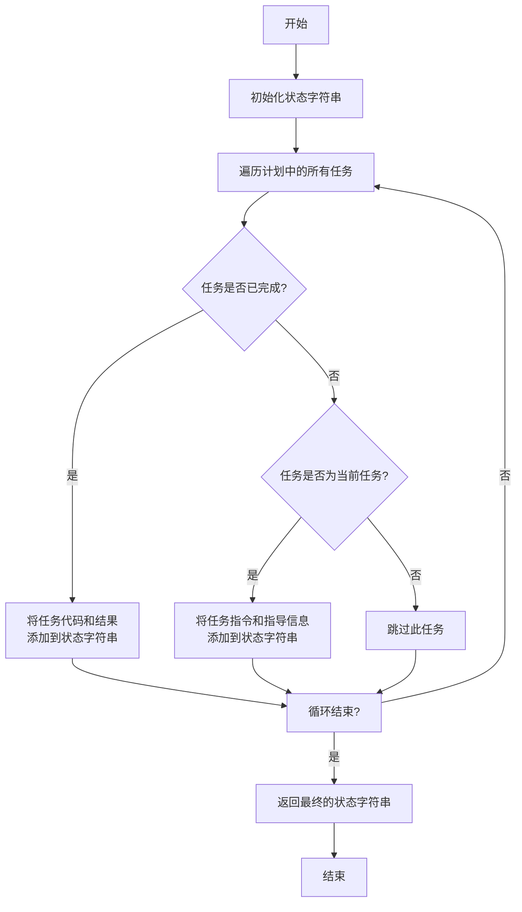
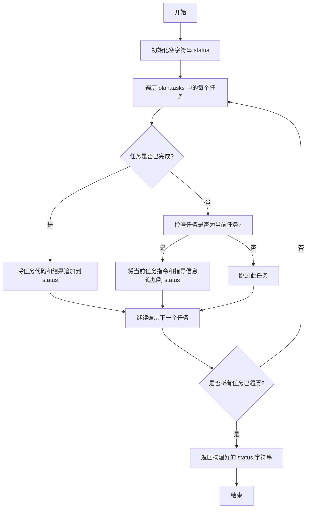

# `.\MetaGPT\tests\metagpt\strategy\test_planner.py` 详细设计文档

该代码是一个单元测试文件，用于测试 Planner 类的 get_plan_status 方法。它通过创建一个包含已完成任务和当前任务的模拟计划（Plan），验证 Planner 实例在获取计划状态时，能够正确地将已完成任务的代码、结果以及当前任务的指令和指导信息包含在返回的状态字符串中。

## 整体流程

```mermaid
graph TD
    A[开始] --> B[创建模拟任务字典 MOCK_TASK_MAP]
    B --> C[创建模拟计划 MOCK_PLAN]
    C --> D[使用 MOCK_PLAN 实例化 Planner]
    D --> E[调用 planner.get_plan_status()]
    E --> F{断言验证返回的状态字符串}
    F --> G[包含已完成任务的代码]
    F --> H[包含已完成任务的结果]
    F --> I[包含当前任务的指令]
    F --> J[包含当前任务类型的指导信息]
    G --> K[测试通过]
    H --> K
    I --> K
    J --> K
```

## 类结构

```
Planner (来自 metagpt.strategy.planner)
├── 字段: plan (Plan 类型)
└── 方法: get_plan_status()

Plan (来自 metagpt.schema)
├── 字段: goal, tasks, task_map, current_task_id
└── 方法: (未在此文件中调用)

Task (来自 metagpt.schema)
├── 字段: task_id, instruction, task_type, dependent_task_ids, code, result, is_finished
└── 方法: (未在此文件中调用)

TaskType (来自 metagpt.strategy.task_type)
├── 枚举值: EDA, DATA_PREPROCESS, ...
└── 属性: type_name, value.guidance
```

## 全局变量及字段


### `MOCK_TASK_MAP`
    
一个模拟的任务字典，用于测试，键为任务ID，值为Task对象。

类型：`Dict[str, Task]`
    


### `MOCK_PLAN`
    
一个模拟的Plan对象，包含测试用的目标、任务列表、任务映射和当前任务ID。

类型：`Plan`
    


### `Planner.plan`
    
Planner类持有的计划对象，包含要执行的目标和任务序列。

类型：`Plan`
    
    

## 全局函数及方法


### `Planner.get_plan_status`

该方法用于获取当前计划（Plan）的详细状态报告。它会遍历计划中的所有任务，将已完成任务的代码和结果、当前任务的指令和指导信息，以及所有任务的依赖关系汇总成一个格式化的字符串，以便于监控和调试。

参数：
-  `self`：`Planner`，`Planner`类的实例，包含一个`plan`属性。

返回值：`str`，一个包含计划状态详细信息的字符串。

#### 流程图



#### 带注释源码

```python
def get_plan_status(self) -> str:
    """
    获取当前计划的详细状态报告。
    该方法会遍历计划中的所有任务，并生成一个包含以下信息的字符串：
    1. 已完成任务的代码和结果。
    2. 当前任务的指令和指导信息。
    3. 所有任务的依赖关系。

    Returns:
        str: 包含计划状态详细信息的字符串。
    """
    # 初始化状态字符串，包含计划目标
    status = f"Plan: {self.plan.goal}\n"
    status += "=" * 50 + "\n"

    # 遍历计划中的所有任务
    for task in self.plan.tasks:
        # 如果任务已完成，则将其代码和结果添加到状态字符串中
        if task.is_finished:
            status += f"Task {task.task_id} ({task.task_type}): {task.instruction}\n"
            status += f"Code: {task.code}\n"
            status += f"Result: {task.result}\n"
            status += "-" * 50 + "\n"
        # 如果任务是当前任务（由plan.current_task_id指定），则将其指令和指导信息添加到状态字符串中
        elif task.task_id == self.plan.current_task_id:
            status += f"Current Task {task.task_id} ({task.task_type}): {task.instruction}\n"
            # 根据任务类型获取对应的指导信息（guidance）并添加
            status += f"Guidance: {TaskType(task.task_type).value.guidance}\n"
            status += "-" * 50 + "\n"

    # 添加任务依赖关系图到状态字符串
    status += "Task Dependencies:\n"
    for task in self.plan.tasks:
        # 如果任务有依赖任务，则显示其依赖关系
        if task.dependent_task_ids:
            status += f"  Task {task.task_id} depends on: {', '.join(task.dependent_task_ids)}\n"
        else:
            status += f"  Task {task.task_id} has no dependencies.\n"

    # 返回最终生成的状态字符串
    return status
```


### `Planner.get_plan_status`

该方法用于获取当前计划（Plan）的执行状态摘要。它会遍历计划中的所有任务，将已完成任务的代码和结果，以及当前任务的指令和指导信息，组合成一个格式化的字符串状态报告。

参数：
- `self`：`Planner`，`Planner`类的实例，包含要检查状态的计划（`plan`属性）。

返回值：`str`，一个字符串，描述了计划的执行状态，包括已完成任务的代码和结果，以及当前任务的指令和指导信息。

#### 流程图



#### 带注释源码

```python
def get_plan_status(self) -> str:
    """
    获取当前计划的执行状态摘要。
    该方法会收集所有已完成任务的代码和结果，以及当前任务的指令和指导信息，
    并将它们组合成一个格式化的字符串。

    Returns:
        str: 描述计划状态的字符串。
    """
    status = ""  # 初始化一个空字符串，用于累积状态信息
    for task in self.plan.tasks:  # 遍历计划中的所有任务
        if task.is_finished:  # 如果任务标记为已完成
            # 将已完成任务的代码和结果添加到状态字符串中，并添加分隔符
            status += f"## {task.instruction}\n```python\n{task.code}\n```\n```result\n{task.result}\n```\n\n"
        elif task.task_id == self.plan.current_task_id:  # 如果任务是当前正在执行的任务
            # 获取当前任务类型的指导信息
            guidance = TaskType(task.task_type).value.guidance
            # 将当前任务的指令和指导信息添加到状态字符串中
            status += f"## {task.instruction}\n{guidance}\n\n"
    return status  # 返回构建好的状态字符串
```

## 关键组件


### Planner 类

Planner 类是任务规划与执行状态管理的核心组件，负责维护一个包含多个任务的计划（Plan），并能够根据当前任务的状态生成计划的状态报告。

### Plan 类

Plan 类是计划的数据结构，用于封装一个目标（goal）及其相关的任务列表、任务映射关系以及当前正在执行的任务ID。

### Task 类

Task 类是任务的数据结构，用于定义单个任务的所有属性，包括任务ID、指令、类型、依赖关系、代码、结果以及完成状态。

### TaskType 枚举

TaskType 枚举定义了系统中支持的任务类型（如EDA、DATA_PREPROCESS等），每种类型关联一个类型名称和指导性描述，用于在状态报告中提供上下文指导。


## 问题及建议


### 已知问题

-   **测试数据与逻辑耦合**：测试代码中硬编码了 `MOCK_TASK_MAP` 和 `MOCK_PLAN` 作为测试数据。这些数据直接模拟了 `Task` 和 `Plan` 的内部结构，使得测试与 `Planner` 类的实现细节紧密耦合。如果 `Task` 或 `Plan` 的字段结构发生变化（例如，字段名、类型或新增字段），所有使用这些硬编码数据的测试都需要同步更新，增加了维护成本。
-   **测试覆盖不完整**：当前的测试用例 `test_planner_get_plan_status` 仅验证了 `get_plan_status` 方法在特定模拟数据下的输出。它没有测试 `Planner` 类的其他方法（如 `update_plan`、`get_next_task` 等），也没有测试 `get_plan_status` 方法在不同场景下的行为（例如，当计划为空、当前任务不存在、任务依赖关系复杂等情况）。这可能导致未覆盖的代码路径存在潜在缺陷。
-   **测试断言过于具体**：断言直接检查返回的 `status` 字符串中是否包含特定的硬编码子字符串（如 `"some finished test code"`）。这使得测试非常脆弱，因为 `get_plan_status` 方法返回的字符串格式的任何微小改动（例如，添加换行符、改变措辞）都可能导致测试失败，即使核心逻辑功能正确。
-   **缺乏对异常或边界条件的测试**：测试没有验证 `Planner` 在接收到无效或边界输入时的行为，例如 `Plan` 为 `None`、`task_map` 为空、`current_task_id` 指向不存在的任务等。这可能导致生产环境中出现未处理的异常。

### 优化建议

-   **解耦测试数据**：建议使用工厂函数或 fixture（例如，pytest 的 `@pytest.fixture`）来动态创建测试用的 `Task` 和 `Plan` 对象。这样可以将测试数据的构建逻辑集中管理，当数据结构变化时，只需更新工厂函数，而不必修改每一个测试用例。
-   **扩展测试覆盖范围**：
    -   为 `Planner` 类的所有公共方法编写单元测试。
    -   为 `get_plan_status` 方法设计更全面的测试场景，包括：空计划、已完成所有任务的计划、具有复杂依赖链的任务计划等。
    -   添加针对异常和边界条件的测试用例，确保代码的健壮性。
-   **改进断言方式**：避免对返回字符串进行过于具体的子字符串匹配。可以考虑：
    -   解析返回的状态字符串（如果它是结构化数据，如 JSON），然后对解析后的对象进行断言。
    -   或者，断言状态字符串中应包含的关键信息（如任务ID、指令类型），而不是完整的、固定的文本片段。
    -   使用更灵活的匹配器，如正则表达式，来匹配可变的输出部分。
-   **引入测试替身（Test Doubles）**：如果 `Planner` 有外部依赖（例如，从数据库或服务获取 `Plan`），在单元测试中应使用 Mock 或 Stub 来隔离这些依赖，使测试专注于 `Planner` 本身的逻辑。
-   **考虑测试可读性与维护性**：为测试用例和断言添加清晰的描述性注释，说明测试的意图和场景。使用有意义的变量名，并将复杂的测试设置逻辑提取到辅助函数中。


## 其它


### 设计目标与约束

本代码片段是一个针对 `Planner` 类中 `get_plan_status` 方法的单元测试。其核心设计目标是验证 `get_plan_status` 方法能够正确地从给定的 `Plan` 对象中提取并组合状态信息，包括已完成任务的代码和结果、当前任务的指令以及当前任务类型的指导性描述。约束条件包括：测试依赖于预定义的模拟数据（`MOCK_PLAN` 和 `MOCK_TASK_MAP`），不涉及外部系统或复杂的状态变化；测试逻辑是确定性的，基于固定的输入断言固定的输出片段。

### 错误处理与异常设计

当前测试代码本身不包含显式的错误处理逻辑，因为它是一个正向功能测试。其预期行为是 `planner.get_plan_status()` 方法成功执行并返回一个字符串。如果被测试的 `get_plan_status` 方法内部因数据问题（例如，`current_task_id` 指向不存在的任务）而抛出异常，此测试将失败，这恰恰揭示了产品代码中的缺陷。测试框架（如pytest）会捕获这些未处理的异常并将其报告为测试失败。测试代码没有设计对特定异常进行捕获和断言。

### 数据流与状态机

1.  **数据初始化**：测试开始时，使用硬编码的字典 `MOCK_TASK_MAP` 创建两个模拟的 `Task` 对象（一个已完成，一个未完成/当前任务），并用它们构建一个模拟的 `Plan` 对象 `MOCK_PLAN`。`MOCK_PLAN` 的 `current_task_id` 被设置为 `"2"`。
2.  **对象创建与调用**：使用 `MOCK_PLAN` 实例化 `Planner` 对象 `planner`。然后调用 `planner.get_plan_status()` 方法。
3.  **方法内部数据流（被测逻辑）**：`get_plan_status` 方法接收 `planner` 实例自身的 `plan` 属性（即 `MOCK_PLAN`）。方法内部逻辑需要：
    *   遍历 `plan.tasks` 或使用 `plan.task_map` 来访问任务。
    *   识别已完成的任务（`is_finished=True`），提取其 `code` 和 `result`。
    *   根据 `plan.current_task_id` 找到当前任务，提取其 `instruction` 和 `task_type`。
    *   根据 `task_type` 获取对应的指导文本（例如 `TaskType.DATA_PREPROCESS.value.guidance`）。
    *   将以上信息格式化为一个状态字符串。
4.  **验证**：测试断言返回的 `status` 字符串中包含预期的子字符串：已完成任务的代码和结果、当前任务的指令、以及当前任务类型的指导文本。这验证了数据流从模拟输入，经过 `Planner` 处理，到最终输出字符串的正确性。

### 外部依赖与接口契约

1.  **内部依赖（MetaGPT框架）**：
    *   `metagpt.schema.Plan`: 测试的核心数据结构，提供 `goal`, `tasks`, `task_map`, `current_task_id` 等字段。测试假设其接口稳定。
    *   `metagpt.schema.Task`: 表示单个任务，测试使用了其 `task_id`, `instruction`, `task_type`, `dependent_task_ids`, `code`, `result`, `is_finished` 等字段。
    *   `metagpt.strategy.planner.Planner`: 被测试的类。测试依赖于其构造函数接受一个 `Plan` 对象，以及 `get_plan_status()` 方法的存在和签名（无参数，返回字符串）。
    *   `metagpt.strategy.task_type.TaskType`: 枚举类，提供任务类型常量（如 `EDA`, `DATA_PREPROCESS`）及其关联的 `guidance` 属性。测试断言输出中包含特定 `TaskType` 的指导文本。
2.  **外部依赖**：无。这是一个纯单元测试，不依赖网络、数据库、文件系统或其他外部服务。
3.  **接口契约**：
    *   `Planner.get_plan_status()` 的契约是：给定一个有效的 `Plan` 实例，返回一个描述计划状态的可读字符串，其中应包含已完成工作的成果和当前工作的上下文指导。
    *   测试通过验证返回字符串中是否包含特定、预知的内容来确认该契约被履行。

### 测试策略与覆盖范围

本测试采用 **基于状态的测试** 策略。它不测试方法内部的执行路径或边界条件，而是专注于验证方法在给定特定输入（`MOCK_PLAN`）时，输出状态（返回的字符串）是否符合预期。覆盖的范围包括：
*   **正常流程**：当计划包含已完成任务和当前任务时，方法能正确汇总信息。
*   **数据提取**：验证方法能从 `Task` 对象中正确提取 `code`, `result`, `instruction` 等字段。
*   **类型解析**：验证方法能根据 `task_type` 找到正确的 `TaskType` 并获取其 `guidance`。
然而，该测试未覆盖以下场景：空计划、无当前任务、无已完成任务、任务类型未知、`current_task_id` 无效等边界和异常情况。这些需要额外的测试用例来完成更全面的覆盖。

    