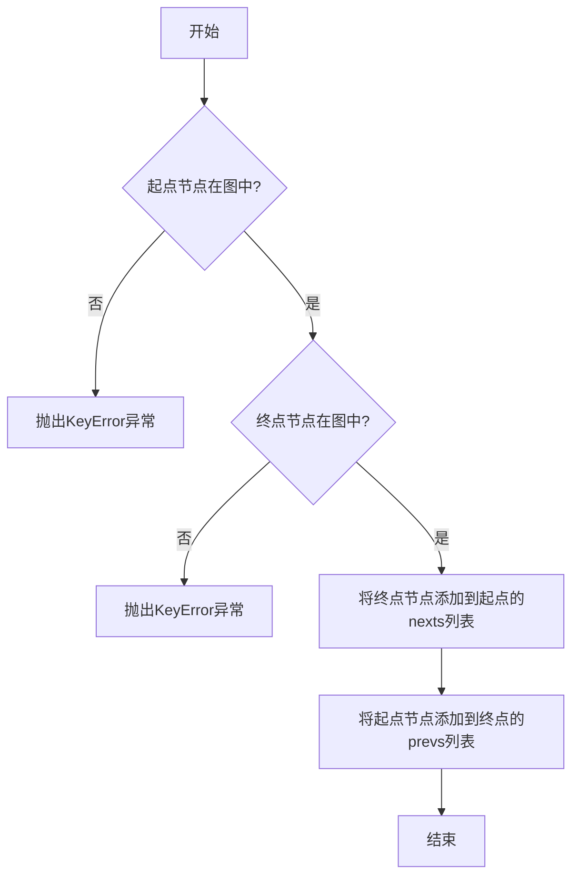
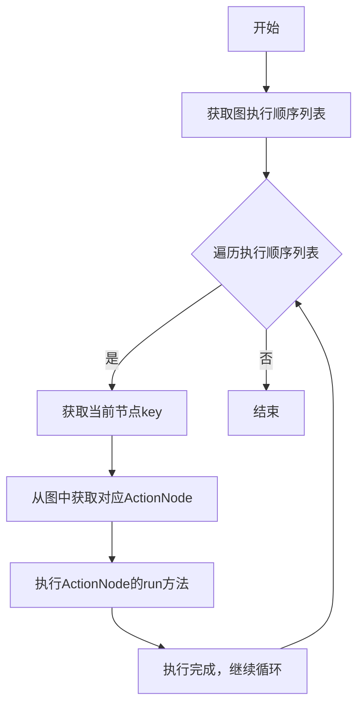

# `.\MetaGPT\tests\metagpt\strategy\test_solver.py` 详细设计文档

该代码是一个使用 pytest 框架编写的异步单元测试，用于测试 MetaGPT 框架中的 NaiveSolver 类。测试的核心功能是验证 NaiveSolver 能否根据一个预定义的动作图（ActionGraph）——该图模拟了产品需求文档（PRD）分析的关键步骤（如问题类型定义、产品目标设定、竞品分析和需求池生成）——在给定上下文（“Create a 2048 game”）下，通过调用大语言模型（LLM）和搜索空间（SearchSpace）来执行求解过程，并最终验证动作图的节点数量、执行顺序是否符合预期。

## 整体流程

```mermaid
graph TD
    A[开始测试] --> B[导入依赖与测试数据]
    B --> C[构建动作图 ActionGraph]
    C --> D[添加节点: ISSUE_TYPE, PRODUCT_GOALS, ...]
    D --> E[添加节点间依赖边]
    E --> F[初始化 SearchSpace 和 LLM]
    F --> G[创建 NaiveSolver 实例]
    G --> H[调用 solver.solve()]
    H --> I[打印并验证图节点与执行顺序]
    I --> J[断言验证: 节点数==4, 执行顺序正确]
    J --> K[测试结束]
```

## 类结构

```
测试文件: test_solver.py
├── 导入模块
│   ├── pytest
│   ├── metagpt.actions.action_graph.ActionGraph
│   ├── metagpt.llm.LLM
│   ├── metagpt.strategy.search_space.SearchSpace
│   └── metagpt.strategy.solver.NaiveSolver
└── 测试函数
    └── test_solver (async)
```

## 全局变量及字段


### `ISSUE_TYPE`
    
表示问题类型的标识符，用于在动作图中标识特定的分析节点

类型：`str`
    


### `PRODUCT_GOALS`
    
表示产品目标的标识符，用于在动作图中标识产品目标定义节点

类型：`str`
    


### `COMPETITIVE_ANALYSIS`
    
表示竞争分析的标识符，用于在动作图中标识竞争分析节点

类型：`str`
    


### `REQUIREMENT_POOL`
    
表示需求池的标识符，用于在动作图中标识需求收集节点

类型：`str`
    


### `graph`
    
动作图实例，用于管理和执行一系列相互关联的动作节点

类型：`ActionGraph`
    


### `search_space`
    
搜索空间实例，用于定义和限制问题求解的搜索范围

类型：`SearchSpace`
    


### `llm`
    
大语言模型实例，为求解器提供自然语言处理能力

类型：`LLM`
    


### `context`
    
问题上下文描述，为求解器提供具体的任务背景信息

类型：`str`
    


### `solver`
    
朴素求解器实例，用于执行基于动作图的求解流程

类型：`NaiveSolver`
    


### `ActionGraph.nodes`
    
存储动作图中所有节点的字典，键为节点标识符，值为ActionNode对象

类型：`Dict[str, ActionNode]`
    


### `ActionGraph.execution_order`
    
记录动作图中节点的执行顺序列表

类型：`List[str]`
    


### `NaiveSolver.graph`
    
求解器要处理的动作图实例

类型：`ActionGraph`
    


### `NaiveSolver.search_space`
    
求解器使用的搜索空间定义

类型：`SearchSpace`
    


### `NaiveSolver.llm`
    
求解器使用的大语言模型实例

类型：`LLM`
    


### `NaiveSolver.context`
    
求解器处理的问题上下文描述

类型：`str`
    
    

## 全局函数及方法

### `test_solver`

这是一个使用 `pytest` 框架编写的异步测试函数，用于测试 `NaiveSolver` 类在给定动作图、搜索空间、LLM 和上下文的情况下，能否正确执行并验证动作图的节点和执行顺序。

参数：
- 无显式参数。作为 `pytest` 测试函数，它通过装饰器 `@pytest.mark.asyncio` 标记为异步测试。

返回值：`None`，测试函数通常不显式返回值，其成功与否由 `assert` 语句决定。

#### 流程图

```mermaid
flowchart TD
    A[开始测试] --> B[导入必要的模块和常量]
    B --> C[创建空的ActionGraph对象]
    C --> D[向图中添加四个节点<br>ISSUE_TYPE, PRODUCT_GOALS,<br>COMPETITIVE_ANALYSIS, REQUIREMENT_POOL]
    D --> E[为节点添加有向边<br>构建执行依赖关系]
    E --> F[创建SearchSpace对象]
    F --> G[创建LLM对象]
    G --> H[定义上下文字符串<br>“Create a 2048 game”]
    H --> I[使用图、搜索空间、<br>LLM和上下文实例化NaiveSolver]
    I --> J[异步调用solver.solve()<br>执行求解过程]
    J --> K[打印图的节点信息<br>用于调试]
    K --> L{执行断言验证}
    L -->|断言1| M[验证图中节点数量为4]
    L -->|断言2| N[验证执行顺序列表长度为4]
    L -->|断言3| O[验证执行顺序与预期一致]
    M --> P[测试通过]
    N --> P
    O --> P
```

#### 带注释源码

```python
@pytest.mark.asyncio  # 标记此函数为异步测试函数
async def test_solver():
    # 从指定模块导入测试所需的动作节点常量
    from metagpt.actions.write_prd_an import (
        COMPETITIVE_ANALYSIS,
        ISSUE_TYPE,
        PRODUCT_GOALS,
        REQUIREMENT_POOL,
    )

    # 1. 构建动作图：创建一个空的动作图，并添加节点和边以定义执行流程。
    graph = ActionGraph()
    graph.add_node(ISSUE_TYPE)  # 添加“问题类型”节点
    graph.add_node(PRODUCT_GOALS)  # 添加“产品目标”节点
    graph.add_node(COMPETITIVE_ANALYSIS)  # 添加“竞品分析”节点
    graph.add_node(REQUIREMENT_POOL)  # 添加“需求池”节点
    # 定义节点间的依赖关系（执行顺序）
    graph.add_edge(ISSUE_TYPE, PRODUCT_GOALS)  # ISSUE_TYPE 在 PRODUCT_GOALS 之前执行
    graph.add_edge(PRODUCT_GOALS, COMPETITIVE_ANALYSIS)  # PRODUCT_GOALS 在 COMPETITIVE_ANALYSIS 之前执行
    graph.add_edge(PRODUCT_GOALS, REQUIREMENT_POOL)  # PRODUCT_GOALS 在 REQUIREMENT_POOL 之前执行
    graph.add_edge(COMPETITIVE_ANALYSIS, REQUIREMENT_POOL)  # COMPETITIVE_ANALYSIS 在 REQUIREMENT_POOL 之前执行

    # 2. 准备求解器所需的其他组件
    search_space = SearchSpace()  # 创建搜索空间对象（可能定义了动作的参数或选项）
    llm = LLM()  # 创建大语言模型对象，用于驱动动作的执行
    context = "Create a 2048 game"  # 定义任务上下文，这里是要创建一个2048游戏

    # 3. 实例化求解器并执行求解过程
    solver = NaiveSolver(graph, search_space, llm, context)  # 使用上述组件创建NaiveSolver实例
    await solver.solve()  # 异步调用solve方法，执行图中定义的动作流程

    # 4. 调试输出：打印图的节点及其前后关系，便于验证图结构
    print("## graph.nodes")
    print(graph.nodes)
    for k, v in graph.nodes.items():
        print(f"{v.key} | prevs: {[i.key for i in v.prevs]} | nexts: {[i.key for i in v.nexts]}")

    # 5. 断言验证：验证求解器执行后的结果是否符合预期
    assert len(graph.nodes) == 4  # 验证图中确实有4个节点
    assert len(graph.execution_order) == 4  # 验证求解器生成的执行顺序列表包含4个元素
    # 验证执行顺序是否严格按照添加边的依赖关系进行：ISSUE_TYPE -> PRODUCT_GOALS -> (COMPETITIVE_ANALYSIS, REQUIREMENT_POOL)
    # 注意：由于 PRODUCT_GOALS 到 REQUIREMENT_POOL 和 COMPETITIVE_ANALYSIS 到 REQUIREMENT_POOL 都有边，
    # 且 COMPETITIVE_ANALYSIS 依赖于 PRODUCT_GOALS，所以最终顺序是 ISSUE_TYPE, PRODUCT_GOALS, COMPETITIVE_ANALYSIS, REQUIREMENT_POOL
    assert graph.execution_order == [ISSUE_TYPE.key, PRODUCT_GOALS.key, COMPETITIVE_ANALYSIS.key, REQUIREMENT_POOL.key]
```

### `ActionGraph.add_node`

该方法用于向动作图（ActionGraph）中添加一个节点。节点代表一个动作（Action），方法会检查节点是否已存在，如果不存在则将其添加到图中，并初始化其前后关系列表。

参数：

- `node`：`Action`，要添加到图中的动作节点

返回值：`None`，无返回值

#### 流程图

```mermaid
flowchart TD
    A[开始: add_node(node)] --> B{node.key 是否在 self.nodes 中?}
    B -- 是 --> C[直接返回]
    B -- 否 --> D[初始化 node.prevs 为空列表]
    D --> E[初始化 node.nexts 为空列表]
    E --> F[将 node 存入 self.nodes<br>key: node.key, value: node]
    F --> G[结束]
```

#### 带注释源码

```python
def add_node(self, node: Action):
    """
    向图中添加一个节点。
    如果节点已存在，则不做任何操作。
    为新节点初始化其前后关系列表。
    """
    # 检查节点是否已存在于图中
    if node.key in self.nodes:
        return
    # 初始化节点的前驱节点列表
    node.prevs = []
    # 初始化节点的后继节点列表
    node.nexts = []
    # 将节点添加到图的节点字典中，以节点的key作为键
    self.nodes[node.key] = node
```

### `ActionGraph.add_edge`

该方法用于在动作图中添加一条有向边，连接两个动作节点，表示它们之间的依赖关系。它确保边的起点和终点节点都已存在于图中，并将它们添加到彼此的邻接列表中，以构建图的拓扑结构。

参数：

- `from_`：`ActionNode`，边的起点动作节点，表示依赖的发起方。
- `to`：`ActionNode`，边的终点动作节点，表示依赖的接收方。

返回值：`None`，该方法不返回任何值，仅修改图的结构。

#### 流程图



#### 带注释源码

```python
def add_edge(self, from_: ActionNode, to: ActionNode):
    """
    在图中添加一条从`from_`节点指向`to`节点的有向边。
    这表示`to`节点的执行依赖于`from_`节点的完成。
    
    参数:
        from_ (ActionNode): 边的起点节点。
        to (ActionNode): 边的终点节点。
    
    异常:
        KeyError: 如果`from_`或`to`节点不在图中。
    """
    # 检查起点节点是否存在于图中
    if from_.key not in self.nodes:
        raise KeyError(f"Node {from_.key} not in graph")
    # 检查终点节点是否存在于图中
    if to.key not in self.nodes:
        raise KeyError(f"Node {to.key} not in graph")
    
    # 将终点节点添加到起点节点的后继节点列表中
    from_.nexts.append(to)
    # 将起点节点添加到终点节点的前驱节点列表中
    to.prevs.append(from_)
```

### `NaiveSolver.solve`

该方法用于执行一个基于有向无环图（DAG）的、顺序的、无并行化的求解流程。它按照图的拓扑顺序（执行顺序）遍历每个节点（ActionNode），并依次执行每个节点对应的动作（Action）。执行过程中，会为每个动作提供上下文信息，并收集执行结果，最终完成整个图的求解。

参数：
-  `self`：`NaiveSolver`，`NaiveSolver` 类的实例。
-  无其他显式参数。

返回值：`None`，该方法不返回任何值。

#### 流程图



#### 带注释源码

```python
async def solve(self):
    """
    按照图的执行顺序，依次执行每个节点。
    这是最基础的顺序求解器，没有并行化。
    """
    # 1. 获取图的执行顺序列表，这是一个按拓扑排序排列的节点key列表
    order = self.graph.execution_order
    # 2. 遍历执行顺序列表中的每一个节点key
    for key in order:
        # 3. 根据节点key从图中获取对应的ActionNode对象
        node = self.graph.nodes[key]
        # 4. 执行该ActionNode的run方法。
        #    传入的参数包括：
        #    - llm: 大语言模型实例，用于驱动Action的执行。
        #    - context: 求解器的上下文信息，作为Action执行的初始输入。
        #    - search_space: 搜索空间，可能用于约束或指导Action的执行。
        #    该方法会执行节点对应的具体Action（如写PRD、分析竞品等），并可能更新节点状态或上下文。
        await node.run(self.llm, self.context, self.search_space)
```

## 关键组件


### ActionGraph

一个表示有向无环图（DAG）的类，用于管理和执行一系列具有依赖关系的动作（Action）节点，支持节点的添加、边的连接以及拓扑排序以确定执行顺序。

### SearchSpace

定义了动作执行过程中的搜索空间或约束条件，为求解器（Solver）提供决策边界或可选范围。

### NaiveSolver

一个简单的求解器实现，它接收一个动作图（ActionGraph）、一个搜索空间（SearchSpace）和一个大语言模型（LLM）作为输入，根据给定的上下文（context）来执行图中的动作，以解决特定问题。

### LLM

大语言模型（Large Language Model）的封装类，为系统中的其他组件（如求解器）提供自然语言处理能力。

### 动作节点（如ISSUE_TYPE, PRODUCT_GOALS等）

代表特定任务或分析步骤的原子单元，例如“问题类型分析”、“产品目标定义”、“竞品分析”和“需求池生成”。这些节点是构成ActionGraph的基本元素，并通过边定义它们之间的依赖关系。


## 问题及建议


### 已知问题

-   **测试用例与实现耦合度高**：测试用例 `test_solver` 直接导入了 `metagpt.actions.write_prd_an` 模块中的具体常量（如 `ISSUE_TYPE`）来构建 `ActionGraph`。这使得测试高度依赖于特定模块的内部实现细节。如果这些常量的定义发生变化（例如重命名、删除或移动到其他模块），该测试将立即失败，即使 `NaiveSolver` 和 `ActionGraph` 的核心逻辑没有改变。这违反了单元测试的“隔离”原则。
-   **测试断言过于具体和脆弱**：测试断言 `graph.execution_order` 必须严格等于一个预定义的列表 `[ISSUE_TYPE.key, ...]`。这假设了 `NaiveSolver.solve()` 方法内部对图的遍历算法（如拓扑排序）是确定且唯一的。任何对算法或图节点处理顺序的优化或调整都可能导致此断言失败，即使功能本身是正确的。这属于“过度指定”（over-specification）的测试，降低了测试的健壮性和对代码演进的适应性。
-   **缺乏对 `solver.solve()` 结果的验证**：测试主要验证了图的结构和执行顺序，但没有验证 `NaiveSolver.solve()` 方法执行后产生的实际业务结果。例如，没有检查 `search_space` 是否被填充，或者图中各个节点的状态（如 `ActionNode` 的 `content`）是否根据 `context` (“Create a 2048 game”) 被正确更新。这使得测试无法保证 `solve` 方法的核心功能（即驱动动作图执行并产生输出）是有效的。
-   **潜在的异步测试问题**：测试函数标记为 `@pytest.mark.asyncio` 并使用 `async/await`，但测试中创建的 `LLM()` 对象可能是一个真实的或模拟不充分的依赖。如果 `LLM` 内部进行了真实的网络调用，这会使测试变成集成测试，速度慢且不稳定。目前测试未展示对 `LLM` 的模拟（Mock）或存根（Stub），存在不确定性。

### 优化建议

-   **解耦测试与具体实现**：重构测试，使其不依赖于 `write_prd_an` 的具体常量。可以改为在测试内部动态创建一组具有唯一标识符的模拟节点（例如使用 `unittest.mock.Mock` 或创建简单的 `ActionNode` 实例）来构建 `ActionGraph`。这样测试只关注 `ActionGraph` 和 `NaiveSolver` 的公共接口行为。
-   **改进断言逻辑**：
    1.  **验证执行顺序的合理性而非精确性**：可以断言 `graph.execution_order` 的长度等于节点数，并且顺序满足图的拓扑约束（例如，对于边 `A->B`，`A` 在 `execution_order` 中的索引应小于 `B`）。这比断言一个固定列表更健壮。
    2.  **增加对业务结果的验证**：在调用 `solver.solve()` 后，应添加断言来验证求解器的输出。例如，检查 `search_space` 对象是否包含与上下文相关的条目，或者验证图中某个关键节点的 `content` 属性不为空且包含预期关键词。
-   **使用测试替身（Test Doubles）**：在测试中，应使用模拟对象（Mock）来替代 `LLM` 和可能的 `ActionNode` 依赖。这样可以：
    1.  隔离测试，确保测试失败只源于被测逻辑（`NaiveSolver`）的错误。
    2.  模拟 `LLM` 的响应，使测试用例可预测、可重复，且不依赖外部服务。
    3.  显著提升测试运行速度。
-   **拆分测试关注点**：考虑将单个 `test_solver` 测试用例拆分为多个更细粒度的测试。例如：
    -   一个测试专门验证 `NaiveSolver` 在给定图结构下能产生正确的执行顺序。
    -   另一个测试验证 `NaiveSolver` 能正确调用 `LLM` 并处理响应。
    -   再一个测试验证 `NaiveSolver` 最终能正确更新 `SearchSpace`。
    这样可以使每个测试的目的更明确，且在某个功能失败时能更快定位问题。
-   **增加异常和边界条件测试**：当前测试只覆盖了“正常路径”（Happy Path）。应补充测试用例来验证 `NaiveSolver` 在异常情况下的行为，例如：当 `ActionGraph` 为空时、当图中存在循环依赖时、当 `LLM` 调用失败时等，确保代码的鲁棒性。


## 其它


### 设计目标与约束

本测试代码的设计目标是验证 `NaiveSolver` 类与 `ActionGraph`、`SearchSpace`、`LLM` 等组件协同工作的正确性，确保在给定上下文（如“创建2048游戏”）下，能够按照预定义的行动图（Action Graph）节点顺序执行，并生成预期的执行序列。约束包括：测试环境需支持异步操作（`pytest.mark.asyncio`），依赖的外部组件（如 `LLM`）在测试中可能以模拟或简化形式存在，且测试不验证具体行动节点的内部逻辑，仅验证图的结构和求解器的流程控制。

### 错误处理与异常设计

测试代码本身主要关注正常流程的验证，未显式包含错误处理逻辑。潜在的异常可能来源于：1) 行动图节点定义错误（如重复添加节点或边）；2) 异步操作失败；3) 断言条件不满足。这些异常将由 `pytest` 框架捕获并报告。`NaiveSolver.solve()` 方法内部应包含其自身的错误处理机制（例如，处理 `LLM` 调用失败或节点执行异常），但本测试未对这些场景进行覆盖。

### 数据流与状态机

数据流起始于测试函数创建的初始上下文（`context = "Create a 2048 game"`）。该上下文被传递给 `NaiveSolver` 实例。求解器（`solver`）内部驱动行动图（`graph`）按拓扑顺序执行各个行动节点（`ISSUE_TYPE`, `PRODUCT_GOALS` 等）。每个节点的执行可能基于前驱节点的输出和共享的上下文状态，最终所有节点执行完毕，行动图更新其 `execution_order` 状态。测试通过验证 `graph.execution_order` 的最终状态是否符合预期顺序来确认数据流和控制流的正确性。状态机表现为行动图节点的执行状态变迁（从未执行到已执行）。

### 外部依赖与接口契约

1.  **`pytest` 框架**：提供测试运行、断言和异步测试支持。
2.  **`metagpt.actions.write_prd_an` 模块**：提供预定义的行动节点常量（`ISSUE_TYPE`, `PRODUCT_GOALS`, `COMPETITIVE_ANALYSIS`, `REQUIREMENT_POOL`）。测试依赖于这些常量作为有效的行动节点标识符。
3.  **`metagpt.actions.action_graph.ActionGraph` 类**：提供 `add_node`, `add_edge`, `nodes`, `execution_order` 等接口。测试假设其行为符合有向无环图（DAG）的模型，并能记录执行顺序。
4.  **`metagpt.strategy.search_space.SearchSpace` 类**：在测试中被实例化但未显式使用，表明 `NaiveSolver` 构造函数需要此参数，但其在基础流程测试中可能不活跃。
5.  **`metagpt.llm.LLM` 类**：模拟或封装大语言模型服务。测试中仅作实例化，具体调用由 `NaiveSolver` 内部管理。契约是提供必要的异步通信能力。
6.  **`metagpt.strategy.solver.NaiveSolver` 类**：核心测试对象。契约是其 `__init__` 方法接受指定的参数，且 `solve()` 方法能异步执行并驱动行动图完成。

### 测试策略与覆盖范围

本测试采用集成测试策略，聚焦于多个组件（`NaiveSolver`, `ActionGraph`, `LLM`）的交互和端到端流程。覆盖范围包括：
*   **组件集成**：验证 `NaiveSolver` 能正确初始化并与 `ActionGraph`、`SearchSpace`、`LLM` 协作。
*   **流程正确性**：验证求解器能按照行动图定义的依赖关系（边）产生正确的拓扑执行顺序。
*   **状态验证**：验证行动图在执行后包含正确数量的节点和正确的执行顺序列表。
测试未覆盖的范围包括：单个行动节点的功能正确性、`SearchSpace` 的实际作用、`LLM` 的具体交互和错误情况、`NaiveSolver` 的不同初始化参数组合、以及非理想图结构（如循环依赖）下的行为。

    