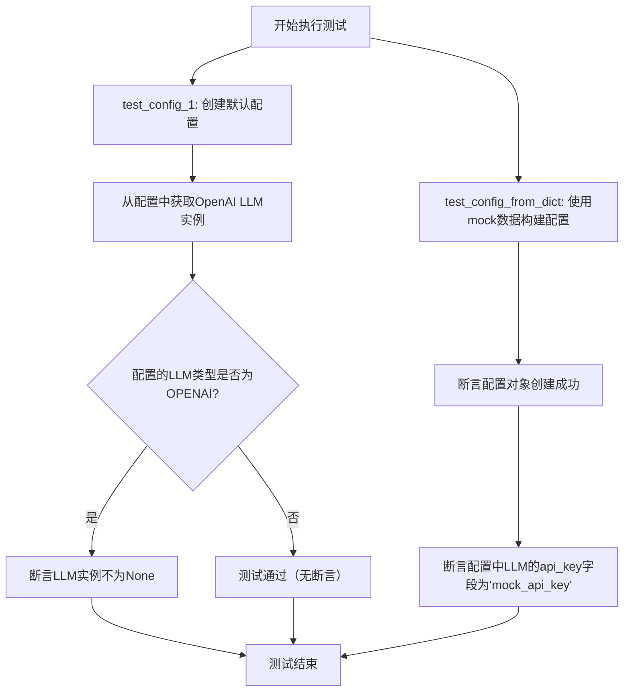
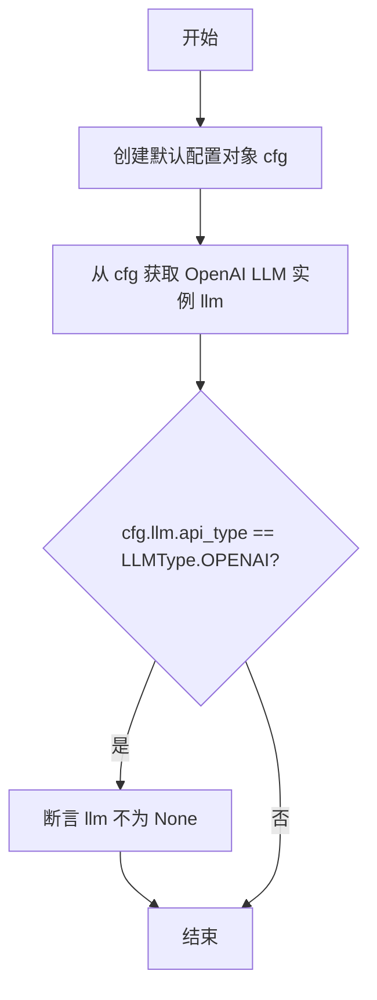
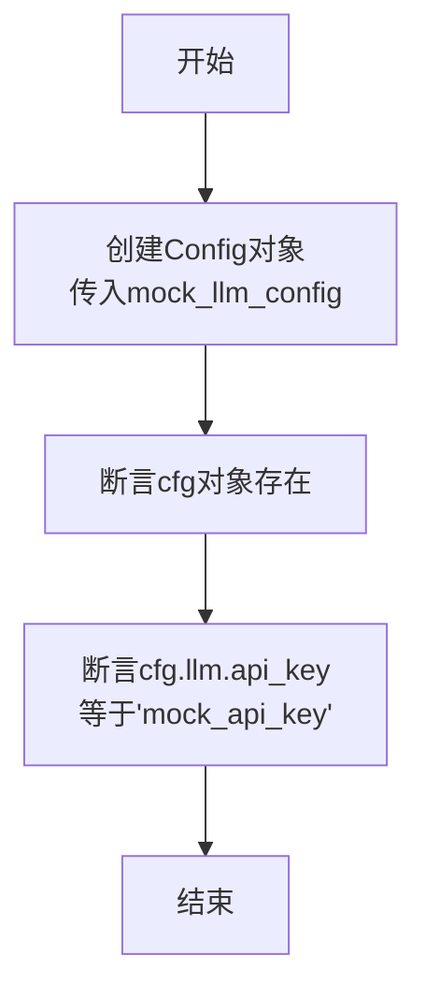

# `.\MetaGPT\tests\metagpt\test_config.py` 详细设计文档

该代码是一个单元测试文件，用于测试配置管理模块的核心功能，包括验证默认配置的创建、特定LLM（大语言模型）实例的获取，以及从字典数据正确构建配置对象的能力。

## 整体流程



## 类结构

```
外部依赖
├── Config (来自 metagpt.config2)
├── LLMType (来自 metagpt.configs.llm_config)
└── mock_llm_config (来自 tests.metagpt.provider.mock_llm_config)
```

## 全局变量及字段


### `cfg`
    
测试函数中创建的配置对象实例，用于测试配置的默认值和从字典加载功能。

类型：`Config`
    


### `llm`
    
从配置对象中获取的OpenAI大语言模型实例，用于测试其是否被正确初始化。

类型：`OpenAILLM`
    


    

## 全局函数及方法


### `test_config_1`

该函数是一个单元测试，用于验证 `Config` 类的默认配置功能，特别是测试在配置为 OpenAI 类型时，能否成功获取到对应的 LLM 实例。

参数：
- 无

返回值：`None`，该函数不返回任何值，其功能通过断言（assert）来验证。

#### 流程图



#### 带注释源码

```python
def test_config_1():
    # 步骤1：创建默认配置对象
    # 调用 Config 类的类方法 default()，获取一个使用默认配置的 Config 实例。
    cfg = Config.default()
    
    # 步骤2：获取 LLM 实例
    # 调用 Config 实例的 get_openai_llm() 方法，尝试获取一个配置好的 OpenAI LLM 实例。
    llm = cfg.get_openai_llm()
    
    # 步骤3：条件判断与断言
    # 检查当前配置的 LLM API 类型是否为 OPENAI。
    # 如果是，则断言上一步获取的 llm 对象不应为 None，以验证配置和实例化成功。
    if cfg.llm.api_type == LLMType.OPENAI:
        assert llm is not None
```


### `test_config_from_dict`

该函数是一个单元测试，用于验证 `Config` 类是否能够正确地从传入的字典（或类字典对象）中初始化其 `llm` 配置属性。它通过创建一个包含模拟LLM配置的 `Config` 对象，并断言该对象及其 `llm.api_key` 属性符合预期值来进行测试。

参数：
- 无显式参数。函数内部使用了一个全局的 `mock_llm_config` 对象。

返回值：`None`，这是一个单元测试函数，不返回业务逻辑值，其目的是通过断言（`assert`）来验证代码行为。

#### 流程图



#### 带注释源码

```python
def test_config_from_dict():
    # 使用模拟的LLM配置字典（mock_llm_config）来实例化一个Config对象。
    # 这测试了Config类的__init__方法从字典初始化配置的能力。
    cfg = Config(llm=mock_llm_config)
    
    # 断言1：验证cfg对象被成功创建（非None）。
    # 这是对对象构造过程的基本验证。
    assert cfg
    
    # 断言2：验证cfg对象内部的llm配置对象的api_key字段值
    # 是否与模拟配置中的值（"mock_api_key"）一致。
    # 这测试了配置数据的正确传递和封装。
    assert cfg.llm.api_key == "mock_api_key"
```

## 关键组件


### Config 类

Config 类是应用的核心配置管理组件，它负责集中管理所有配置项，特别是大语言模型（LLM）的配置，并提供了默认配置获取和从字典构建配置实例的能力。

### LLM 配置 (LLMConfig)

LLM 配置组件定义了与大语言模型交互所需的所有参数，如 API 类型、密钥、基础 URL 和模型名称等，支持多种 LLM 提供商（如 OpenAI），并通过 `api_type` 字段进行区分。

### 配置加载与初始化策略

该组件定义了配置的初始化流程，包括从默认设置加载（`Config.default()`）以及从外部提供的字典数据（如 `mock_llm_config`）动态构建配置实例（`Config(llm=...)`）的策略。

### 配置获取接口

该接口（如 `cfg.get_openai_llm()`）提供了根据当前配置（特别是 `api_type`）安全地获取特定类型 LLM 客户端实例的方法，确保了配置与运行时组件的正确绑定。


## 问题及建议


### 已知问题

-   **测试用例覆盖不全面**：`test_config_1` 函数仅在配置的 `llm.api_type` 为 `LLMType.OPENAI` 时才执行断言。如果配置为其他类型（如 `LLMType.ANTHROPIC` 或 `LLMType.OPEN_LLM`），则 `llm` 变量可能为 `None`，但测试不会失败，导致潜在的逻辑错误未被发现。
-   **测试数据与逻辑耦合**：`test_config_from_dict` 函数直接使用 `mock_llm_config` 作为输入。如果 `Config` 类的初始化逻辑或 `mock_llm_config` 的数据结构发生变化，此测试可能无法准确反映 `Config` 从字典构建的真实行为，降低了测试的健壮性。
-   **缺少边界和异常情况测试**：当前测试用例仅验证了正常路径。未测试 `Config` 类在传入无效或空字典、缺失关键字段（如 `llm`）、或字段类型不正确时的行为，例如是否会抛出清晰的异常或提供默认值。

### 优化建议

-   **增强测试用例的断言和条件覆盖**：在 `test_config_1` 中，应明确测试 `cfg.get_openai_llm()` 在不同 `api_type` 下的预期行为。例如，当 `api_type` 不是 `OPENAI` 时，可以断言返回 `None` 或抛出特定异常。同时，增加对 `cfg.llm` 本身是否为 `None` 的检查。
-   **解耦测试数据并增加多样性**：为 `test_config_from_dict` 创建更独立、明确的测试数据字典，而不是依赖外部的 `mock_llm_config` 对象。可以创建多个测试用例，使用不同的输入字典来验证 `Config` 的构造逻辑，包括最小有效配置、包含额外字段的配置等。
-   **补充边界和异常测试**：添加新的测试函数，例如 `test_config_with_invalid_dict`、`test_config_with_missing_llm` 等，以验证 `Config` 类在面对错误输入时的鲁棒性。这有助于确保代码在生产环境中遇到意外数据时能优雅处理。
-   **考虑使用参数化测试**：对于需要测试多种输入组合的场景（如不同的 `api_type` 和 `api_key` 组合），可以考虑使用 `pytest` 的 `@pytest.mark.parametrize` 装饰器来减少代码重复，使测试更清晰、更易于维护。


## 其它


### 设计目标与约束

该代码是一个单元测试模块，旨在验证 `metagpt.config2.Config` 类的核心功能。其设计目标是确保配置对象能够正确地从默认设置初始化，并能从提供的字典数据中构建。约束在于测试的独立性，不应依赖外部网络服务或复杂的测试环境，因此使用了模拟的 LLM 配置数据 (`mock_llm_config`)。

### 错误处理与异常设计

当前代码未显式包含错误处理逻辑。测试用例依赖于 `assert` 语句来验证预期行为，如果断言失败，测试框架（如 `pytest`）将抛出 `AssertionError` 异常。这是一种标准的单元测试错误处理方式。代码本身（被测试的 `Config` 类）应在其内部处理无效输入或缺失配置等异常情况，但测试代码未覆盖这些负面场景。

### 数据流与状态机

数据流非常简单：
1.  `test_config_1`: 调用 `Config.default()` 获取默认配置对象 -> 调用 `cfg.get_openai_llm()` 获取 LLM 实例 -> 检查配置的 `api_type` -> 断言 LLM 实例非空。
2.  `test_config_from_dict`: 使用 `mock_llm_config` 字典作为参数实例化 `Config` 对象 -> 断言对象创建成功 -> 断言对象内 `llm.api_key` 字段的值与模拟数据一致。
整个测试模块是无状态的，每个测试函数独立运行，不共享或修改全局状态。

### 外部依赖与接口契约

1.  **内部依赖**:
    *   `metagpt.config2.Config`: 被测试的主要类。
    *   `metagpt.configs.llm_config.LLMType`: 枚举，用于标识 LLM 类型。
    *   `tests.metagpt.provider.mock_llm_config.mock_llm_config`: 一个模拟的配置字典，为测试提供隔离的输入数据。
2.  **接口契约**:
    *   `Config.default()`: 应返回一个使用默认配置初始化的 `Config` 实例。
    *   `Config.__init__(llm=...)`: 应接受一个字典（或类似结构）来初始化其 `llm` 属性。
    *   `cfg.get_openai_llm()`: 当 `cfg.llm.api_type` 为 `LLMType.OPENAI` 时，应返回一个可用的 LLM 客户端实例。
    *   `cfg.llm`: 应是一个具有 `api_key` 等属性的对象。
3.  **测试框架**: 代码依赖于 Python 的 `assert` 语句，通常与 `pytest` 或 `unittest` 等测试运行器配合使用。

### 安全与合规考虑

测试代码本身不涉及生产环境密钥或敏感数据。它使用的 `mock_llm_config` 包含模拟的 API 密钥（`"mock_api_key"`），这符合安全最佳实践，避免了在测试代码中硬编码真实密钥。测试验证了配置对象能够正确存储和访问此类密钥字段，但不对密钥的有效性或安全性做任何保证，这是应用层逻辑的责任。

### 测试策略与覆盖范围

当前测试策略是**单元测试**，聚焦于 `Config` 类在特定条件下的行为。
*   **覆盖的功能点**:
    *   默认配置的加载。
    *   通过字典参数进行配置初始化。
    *   配置对象属性的访问（`llm.api_key`）。
    *   条件逻辑（根据 `api_type` 获取 LLM）。
*   **未覆盖的场景（潜在改进点）**:
    *   **负面测试**: 未测试传入无效、缺失或格式错误的字典时 `Config` 的异常处理。
    *   **边界测试**: 未测试 `LLMType` 为其他值（非 `OPENAI`）时 `get_openai_llm()` 的行为。
    *   **集成测试**: 未测试 `Config` 与真实 LLM API 的集成（这是合理的，单元测试应保持隔离）。
    *   **配置持久化**: 未测试从文件或环境变量加载配置。

    