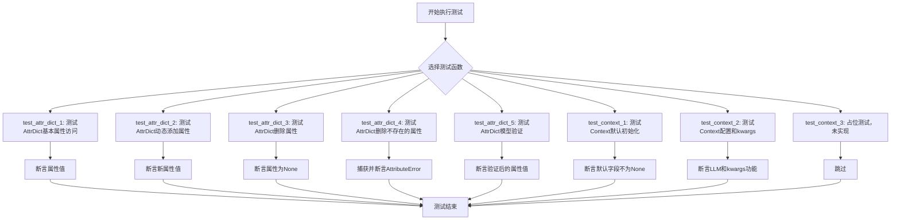
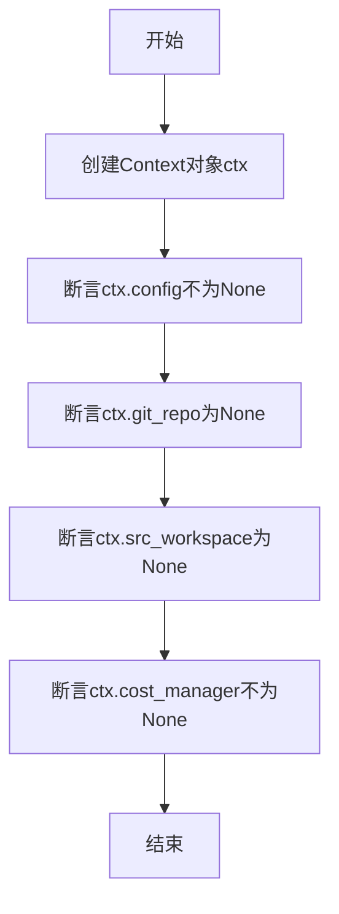
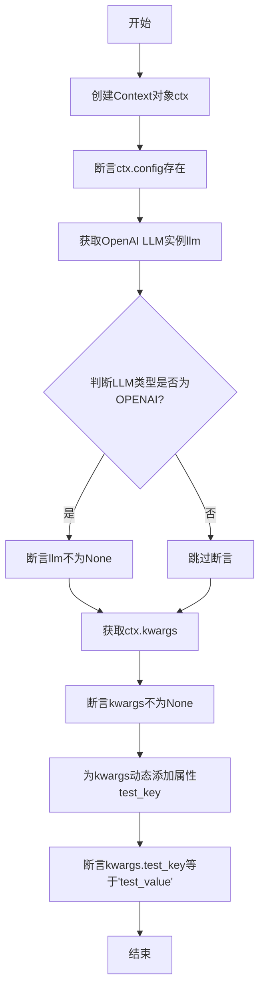
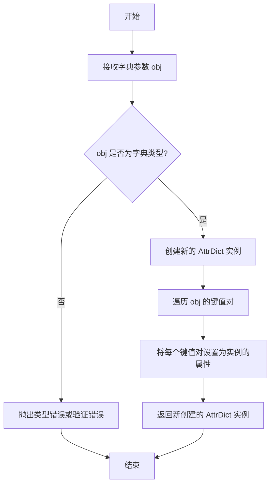
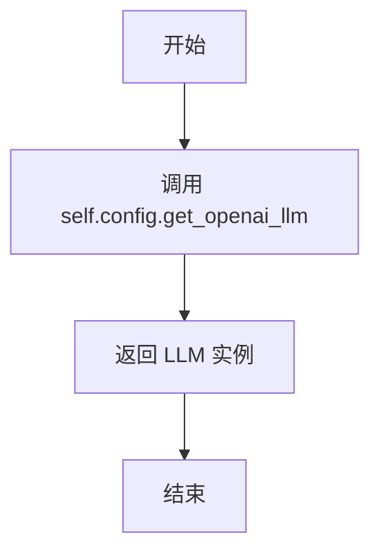

# `.\MetaGPT\tests\metagpt\test_context.py` 详细设计文档

该文件是一个单元测试文件，用于测试 `metagpt.context` 模块中的 `AttrDict` 和 `Context` 类。`AttrDict` 是一个允许通过属性方式访问字典键值的类，而 `Context` 是一个管理应用运行时上下文（如配置、成本管理器等）的类。测试用例覆盖了属性字典的创建、访问、修改、删除、验证以及上下文对象的初始化和基本功能。

## 整体流程



## 类结构

```
metagpt.context (外部模块)
├── AttrDict (属性字典类)
└── Context (上下文管理类)
```

## 全局变量及字段


### `Context.config`
    
存储应用程序的配置信息，包括LLM配置等。

类型：`Config`
    


### `Context.git_repo`
    
指向Git仓库的引用，用于版本控制操作。

类型：`Optional[GitRepo]`
    


### `Context.src_workspace`
    
源代码工作空间的路径，用于文件操作。

类型：`Optional[Path]`
    


### `Context.cost_manager`
    
管理LLM API调用成本的计算和跟踪。

类型：`CostManager`
    


### `Context._llm_config`
    
内部缓存的LLM配置，用于优化LLM实例的创建。

类型：`Optional[LLMConfig]`
    


### `Context.kwargs`
    
一个动态的属性字典，用于存储和访问临时的上下文参数。

类型：`AttrDict`
    
    

## 全局函数及方法

### `test_attr_dict_1`

该函数是一个单元测试，用于验证 `AttrDict` 类的实例化功能以及其属性的默认访问行为。它创建一个 `AttrDict` 实例，并断言其属性值符合预期，包括对未设置属性的默认值（`None`）的检查。

参数：
- 无

返回值：`None`，该函数不返回任何值，仅执行断言测试。

#### 流程图

```mermaid
flowchart TD
    A[开始] --> B[创建AttrDict实例<br>ad = AttrDict(name="John", age=30)]
    B --> C[断言 ad.name == "John"]
    C --> D[断言 ad.age == 30]
    D --> E[断言 ad.height is None]
    E --> F[结束]
```

#### 带注释源码

```python
def test_attr_dict_1():
    # 创建一个 AttrDict 实例，并初始化两个属性：name 和 age
    ad = AttrDict(name="John", age=30)
    # 断言实例的 name 属性值为 "John"
    assert ad.name == "John"
    # 断言实例的 age 属性值为 30
    assert ad.age == 30
    # 断言访问一个未设置的属性 height 时，其值为 None
    assert ad.height is None
```

### `test_attr_dict_2`

该函数是一个单元测试，用于验证 `AttrDict` 类的属性动态设置功能。它创建一个 `AttrDict` 实例，为其动态添加一个新属性，并断言该属性的值符合预期。

参数：
- 无

返回值：`None`，该函数不返回任何值，仅执行断言测试。

#### 流程图

```mermaid
flowchart TD
    A[开始] --> B[创建AttrDict实例<br>ad = AttrDict(name='John', age=30)]
    B --> C[动态设置属性<br>ad.height = 180]
    C --> D[断言验证<br>assert ad.height == 180]
    D --> E[结束]
```

#### 带注释源码

```python
def test_attr_dict_2():
    # 创建一个 AttrDict 实例，并初始化两个属性：name 和 age
    ad = AttrDict(name="John", age=30)
    # 动态地为该实例添加一个名为 'height' 的新属性，并赋值为 180
    ad.height = 180
    # 使用断言验证新添加的属性 'height' 的值是否为 180
    assert ad.height == 180
```

### `test_attr_dict_3`

该函数用于测试 `AttrDict` 类的属性删除功能。它创建一个 `AttrDict` 实例，删除其 `age` 属性，并验证删除后该属性的值为 `None`。

参数：
- 无

返回值：`None`，无返回值

#### 流程图

```mermaid
graph TD
    A[开始] --> B[创建AttrDict实例<br/>ad = AttrDict(name='John', age=30)]
    B --> C[删除属性<br/>del ad.age]
    C --> D[断言验证<br/>assert ad.age is None]
    D --> E[结束]
```

#### 带注释源码

```python
def test_attr_dict_3():
    # 创建一个 AttrDict 实例，初始化 name 和 age 属性
    ad = AttrDict(name="John", age=30)
    # 删除 age 属性
    del ad.age
    # 断言验证删除后 age 属性为 None
    assert ad.age is None
```

### `test_attr_dict_4`

该函数用于测试 `AttrDict` 类在尝试删除一个不存在的属性时的行为。它验证了当尝试删除一个不存在于 `AttrDict` 实例中的属性时，会抛出一个 `AttributeError` 异常，并且异常信息符合预期。

参数：
- 无显式参数。

返回值：`None`，该函数是一个单元测试，不返回任何值，主要通过断言来验证行为。

#### 流程图

```mermaid
flowchart TD
    A[开始] --> B[创建AttrDict实例<br>ad = AttrDict(name='John', age=30)]
    B --> C[尝试删除不存在的属性<br>del ad.weight]
    C --> D{是否抛出<br>AttributeError异常?}
    D -- 是 --> E[捕获异常e]
    E --> F[断言异常信息<br>assert str(e) == 'No such attribute: weight']
    F --> G[结束]
    D -- 否 --> H[测试失败]
    H --> G
```

#### 带注释源码

```python
def test_attr_dict_4():
    # 创建一个 AttrDict 实例，初始化属性 name 和 age
    ad = AttrDict(name="John", age=30)
    try:
        # 尝试删除一个不存在的属性 'weight'
        del ad.weight
    except AttributeError as e:
        # 捕获预期的 AttributeError 异常
        # 断言异常信息与预期完全一致
        assert str(e) == "No such attribute: weight"
```

### `test_attr_dict_5`

该函数用于测试 `AttrDict` 类的 `model_validate` 方法，验证其能否正确地将一个字典对象转换为 `AttrDict` 实例，并确保转换后的实例属性与原始字典的键值对保持一致。

参数：

-  `无`：`无`，此函数不接受任何参数。

返回值：`None`，此函数不返回任何值，仅用于执行断言测试。

#### 流程图

```mermaid
flowchart TD
    A[开始] --> B[调用 AttrDict.model_validate<br>传入字典 {'name': 'John', 'age': 30}]
    B --> C[获取返回的 AttrDict 实例 ad]
    C --> D{断言 ad.name == 'John'?}
    D -- 是 --> E{断言 ad.age == 30?}
    D -- 否 --> F[测试失败]
    E -- 是 --> G[测试通过]
    E -- 否 --> F
```

#### 带注释源码

```python
def test_attr_dict_5():
    # 调用 AttrDict 类的 model_validate 类方法，传入一个包含 'name' 和 'age' 键的字典。
    # 该方法预期返回一个 AttrDict 实例，其属性与字典的键值对对应。
    ad = AttrDict.model_validate({"name": "John", "age": 30})
    
    # 断言：验证返回的 AttrDict 实例 ad 的 'name' 属性值等于 'John'。
    # 这是为了测试 model_validate 方法是否正确地将字典的 'name' 键映射为实例属性。
    assert ad.name == "John"
    
    # 断言：验证返回的 AttrDict 实例 ad 的 'age' 属性值等于 30。
    # 这是为了测试 model_validate 方法是否正确地将字典的 'age' 键映射为实例属性。
    assert ad.age == 30
```

### `test_context_1`

该函数是一个单元测试，用于验证`Context`类实例的默认初始化状态。它创建一个`Context`对象，并断言其关键属性（如`config`、`git_repo`、`src_workspace`、`cost_manager`）在初始化后具有预期的值或状态。

参数：
- 无

返回值：`None`，该函数不返回任何值，仅执行断言测试。

#### 流程图



#### 带注释源码

```python
def test_context_1():
    # 创建一个新的Context对象实例
    ctx = Context()
    # 断言：ctx的config属性在初始化后不应为None
    assert ctx.config is not None
    # 断言：ctx的git_repo属性在初始化后应为None
    assert ctx.git_repo is None
    # 断言：ctx的src_workspace属性在初始化后应为None
    assert ctx.src_workspace is None
    # 断言：ctx的cost_manager属性在初始化后不应为None
    assert ctx.cost_manager is not None
```

### `test_context_2`

该函数用于测试`Context`类的实例化及其配置属性。它创建一个`Context`对象，验证其配置对象存在，并根据配置的LLM类型获取对应的OpenAI LLM实例。同时，它还测试了`Context`对象的`kwargs`属性，验证其可以动态添加和访问属性。

参数：
- 无显式参数。

返回值：`None`，该函数是一个单元测试，不返回任何值，主要通过断言（assert）来验证功能。

#### 流程图



#### 带注释源码

```python
def test_context_2():
    # 创建一个Context对象实例
    ctx = Context()
    # 从上下文的配置中获取一个OpenAI LLM实例
    llm = ctx.config.get_openai_llm()
    # 如果当前配置的LLM类型是OPENAI，则断言获取的llm实例不为None
    if ctx.config.llm.api_type == LLMType.OPENAI:
        assert llm is not None

    # 获取Context对象的kwargs属性（一个AttrDict实例）
    kwargs = ctx.kwargs
    # 断言kwargs不为None
    assert kwargs is not None

    # 动态地向kwargs对象添加一个名为'test_key'的属性，并赋值为'test_value'
    kwargs.test_key = "test_value"
    # 断言新添加的属性值正确
    assert kwargs.test_key == "test_value"
```

### `test_context_3`

这是一个用于测试 `Context` 类中 `use_llm` 方法和 `llm` 属性的单元测试函数。它验证了在指定 OpenAI 作为 LLM 提供商后，相关的配置是否正确设置，以及 LLM 实例是否被成功创建。

参数：
- 无

返回值：`None`，这是一个单元测试函数，不返回任何值，通过断言（assert）来验证代码行为。

#### 流程图

```mermaid
flowchart TD
    Start[开始] --> A[创建 Context 实例 ctx]
    A --> B[调用 ctx.use_llm<br>设置 provider 为 LLMType.OPENAI]
    B --> C[断言 ctx._llm_config 不为 None]
    C --> D[断言 ctx._llm_config.api_type 为 LLMType.OPENAI]
    D --> E[断言 ctx.llm() 不为 None]
    E --> F[断言 ctx.llm().model 包含 'gpt']
    F --> End[结束]
```

#### 带注释源码

```python
def test_context_3():
    # ctx = Context()  # 注释掉的代码：创建一个 Context 实例
    # ctx.use_llm(provider=LLMType.OPENAI)  # 注释掉的代码：调用 use_llm 方法，指定使用 OpenAI 作为 LLM 提供商
    # assert ctx._llm_config is not None  # 注释掉的代码：断言内部 LLM 配置对象已被创建
    # assert ctx._llm_config.api_type == LLMType.OPENAI  # 注释掉的代码：断言配置的 API 类型是 OPENAI
    # assert ctx.llm() is not None  # 注释掉的代码：断言通过 llm() 方法获取的 LLM 实例不为空
    # assert "gpt" in ctx.llm().model  # 注释掉的代码：断言 LLM 实例的模型名称包含 'gpt' 字符串
    pass  # 当前函数体为空，仅包含一个 pass 语句，表示这是一个待实现的测试
```

### `AttrDict.model_validate`

该方法是一个类方法，用于根据提供的字典数据验证并创建一个 `AttrDict` 实例。它接受一个字典作为输入，并返回一个新的 `AttrDict` 对象，该对象的属性由输入字典的键值对初始化。

参数：

- `obj`：`dict`，一个包含要用于初始化 `AttrDict` 实例的键值对的字典。

返回值：`AttrDict`，一个新的 `AttrDict` 实例，其属性由输入字典 `obj` 的键值对设置。

#### 流程图



#### 带注释源码

```python
@classmethod
def model_validate(cls, obj: dict) -> 'AttrDict':
    """
    类方法：根据提供的字典验证并创建一个 AttrDict 实例。
    
    参数:
        obj (dict): 一个字典，其键值对将用于初始化 AttrDict 的属性。
        
    返回:
        AttrDict: 一个新的 AttrDict 实例。
    """
    # 创建一个新的 AttrDict 实例
    instance = cls()
    # 遍历输入字典的所有键值对
    for key, value in obj.items():
        # 将每个键值对设置为实例的属性
        setattr(instance, key, value)
    # 返回初始化后的实例
    return instance
```

### `Context.get_openai_llm`

该方法用于从当前上下文的配置中获取一个配置好的 OpenAI 类型的大语言模型（LLM）实例。它通过调用 `config` 对象的 `get_openai_llm` 方法来实现，旨在为系统提供一个标准化的接口来获取 LLM 服务。

参数：
- `self`：`Context`，表示 `Context` 类的当前实例。

返回值：`Any`，返回一个由 `config.get_openai_llm()` 方法提供的 LLM 实例，具体类型取决于配置的实现。

#### 流程图



#### 带注释源码

```python
def get_openai_llm(self):
    # 从当前上下文（Context）的配置（config）中获取一个 OpenAI 类型的 LLM 实例。
    # 这是访问 LLM 服务的标准入口点。
    return self.config.get_openai_llm()
```

### `Context.use_llm`

该方法用于根据指定的LLM提供商类型，初始化并配置上下文中的LLM（大语言模型）实例。它通过配置对象获取对应提供商的LLM配置，并设置到上下文中，以便后续使用。

参数：

- `provider`：`LLMType`，指定要使用的LLM提供商类型（例如OPENAI、AZURE等）。

返回值：`None`，该方法不返回任何值，但会更新上下文内部的LLM配置和实例。

#### 流程图

```mermaid
flowchart TD
    A[开始: use_llm(provider)] --> B{provider 是否有效?}
    B -- 是 --> C[从 config 获取对应 provider 的 LLM 配置]
    C --> D[将配置赋值给 _llm_config]
    D --> E[基于 _llm_config 创建 LLM 实例]
    E --> F[将 LLM 实例赋值给 _llm]
    F --> G[结束]
    B -- 否 --> H[抛出异常或使用默认配置]
    H --> G
```

#### 带注释源码

```python
def use_llm(self, provider: LLMType):
    """
    根据指定的LLM提供商类型，初始化并配置上下文中的LLM实例。
    
    参数:
        provider (LLMType): 要使用的LLM提供商类型。
    
    返回值:
        None: 该方法不返回任何值，但会更新上下文内部的LLM配置和实例。
    """
    # 从配置对象中获取指定提供商的LLM配置
    self._llm_config = self.config.get_llm_config(provider)
    # 基于获取的配置创建LLM实例
    self._llm = LLM(self._llm_config)
```

### `Context.llm`

该方法用于获取或设置当前上下文中的大语言模型（LLM）实例。它首先检查内部是否已缓存了LLM实例，如果存在则直接返回。如果不存在，则根据配置创建一个新的LLM实例并缓存起来。该方法支持通过参数动态指定LLM提供者，从而在运行时切换不同的LLM服务。

参数：
-  `provider`：`LLMType`，可选参数，指定要使用的大语言模型提供者类型（如OPENAI）。如果未提供，则使用上下文配置中默认的LLM类型。

返回值：`BaseLLM`，返回一个配置好的大语言模型实例，可用于后续的文本生成、对话等任务。

#### 流程图

```mermaid
flowchart TD
    A[开始: 调用 llm(provider)] --> B{_llm 实例已存在?}
    B -- 是 --> C[返回缓存的 _llm 实例]
    B -- 否 --> D[根据 provider 或配置获取 LLM 配置]
    D --> E[使用配置创建新的 LLM 实例]
    E --> F[将新实例赋值给 self._llm]
    F --> C
    C --> G[结束: 返回 LLM 实例]
```

#### 带注释源码

```python
def llm(self, provider: LLMType = None) -> BaseLLM:
    """
    获取或设置当前上下文中的大语言模型（LLM）实例。
    如果实例已存在，则直接返回；否则根据配置创建并缓存新实例。
    
    Args:
        provider (LLMType, optional): 指定要使用的LLM提供者类型。默认为None，使用配置中的默认类型。
    
    Returns:
        BaseLLM: 配置好的大语言模型实例。
    """
    # 检查是否已存在缓存的LLM实例
    if self._llm is None:
        # 如果未提供provider，则使用配置中的默认LLM类型
        if provider is None:
            provider = self.config.llm.api_type
        # 根据provider获取对应的LLM配置
        llm_config = self.config.get_llm_config(provider)
        # 使用获取到的配置创建新的LLM实例
        self._llm = create_llm_instance(llm_config)
    # 返回LLM实例（可能是缓存的，也可能是新建的）
    return self._llm
```

## 关键组件


### AttrDict

一个动态属性字典类，允许通过点号（.）访问、设置和删除属性，并提供了对不存在的属性的安全访问（返回None）以及删除不存在的属性时的异常处理。

### Context

一个应用上下文管理类，负责管理配置、Git仓库、源代码工作空间、成本管理器等全局资源，并提供了便捷的方法来获取和配置LLM（大语言模型）实例。

### LLMType

一个枚举类，用于定义和区分不同类型的大语言模型（LLM）提供商，例如OPENAI。

### LLM配置管理

Context类中用于获取和配置大语言模型（LLM）实例的机制，支持根据配置动态选择LLM提供商。

### 动态关键字参数管理

Context类中通过`kwargs`属性（一个AttrDict实例）管理动态关键字参数的机制，允许在运行时灵活地添加和访问额外的配置或状态信息。

### 配置管理

Context类中用于管理应用程序配置的机制，包括从配置中获取特定资源（如LLM）的实例。

### 资源生命周期管理

Context类中负责初始化和管理如Git仓库、工作空间、成本管理器等核心资源的生命周期，确保它们在需要时可用。

### 异常处理与属性安全访问

AttrDict类中实现的机制，确保在访问不存在的属性时返回None，并在尝试删除不存在的属性时抛出明确的AttributeError异常。

### 数据验证与模型转换

AttrDict类通过`model_validate`方法支持从字典数据到AttrDict实例的验证和转换，便于与配置或序列化数据交互。

### 测试用例结构

代码中展示的用于验证AttrDict和Context类核心功能的单元测试结构，包括对属性操作、异常情况和资源配置的测试。


## 问题及建议


### 已知问题

-   **测试用例 `test_context_3` 被注释掉**：该测试用例被完全注释，导致一个重要的功能点（`Context.use_llm` 和 `ctx.llm()`）未被验证，降低了测试覆盖率，并可能掩盖了相关代码的潜在缺陷。
-   **`test_context_2` 中的条件断言逻辑不严谨**：该测试仅在配置为 `LLMType.OPENAI` 时才断言 `llm` 不为 `None`。如果配置了其他类型的 LLM（如 Azure, Anthropic），此测试将跳过核心断言，无法有效验证 `get_openai_llm` 方法在不同配置下的行为（例如是否会返回 `None` 或抛出异常），测试的健壮性不足。
-   **`AttrDict` 删除不存在的属性时抛出 `AttributeError`**：在 `test_attr_dict_4` 中，删除不存在的属性 `weight` 会抛出 `AttributeError`。虽然这是当前实现，但作为类似字典的数据结构，此行为与标准 Python 字典的 `del dict[key]`（会引发 `KeyError`）或 `dict.pop(key, default)` 的常见模式不一致，可能令使用者困惑，并增加错误处理成本。
-   **`test_attr_dict_1` 中对未定义属性的访问行为**：测试断言 `ad.height is None`，这表明访问一个不存在的属性会返回 `None`。此行为与 Python 默认的 `AttributeError` 不同，虽然方便，但也可能掩盖编程错误（例如拼写错误），因为静默地返回 `None` 可能将错误传播到后续逻辑中。

### 优化建议

-   **激活并完善 `test_context_3` 测试**：移除注释，让测试实际运行。这有助于确保 `Context` 类的 LLM 配置和获取功能正常工作，并提高整体测试的有效性。
-   **增强 `test_context_2` 的测试逻辑**：重构测试，使其能明确验证 `get_openai_llm` 方法在不同 `LLMType` 配置下的预期行为。例如，可以分别测试 `OPENAI` 配置下返回有效对象，以及其他配置下是否返回 `None` 或抛出明确的异常，从而使测试用例更全面、可靠。
-   **重新评估 `AttrDict` 的删除和访问语义**：
    -   对于删除操作，可以考虑使其行为更接近字典，例如在删除不存在的键时抛出 `KeyError`，或者实现一个类似 `pop` 的方法来提供更安全的操作。
    -   对于访问不存在的属性，可以提供一个选项来控制是静默返回 `None` 还是抛出 `AttributeError`，或者完全遵循 Python 的默认行为以保持一致性并帮助早期发现错误。
-   **考虑增加更多边界和异常情况测试**：例如，测试 `AttrDict` 用非法键名初始化、测试 `Context` 在配置缺失或错误时的初始化行为、测试 `kwargs` 的嵌套属性操作等，以提升代码的鲁棒性。
-   **将测试代码中的魔法数字和字符串提取为常量**：例如，测试中的 `"John"`、`30`、`180`、`"test_value"` 等可以定义为模块级常量，提高代码的可维护性和可读性。


## 其它


### 设计目标与约束

本代码模块是MetaGPT项目中的一个单元测试文件，旨在验证`metagpt.context`模块中`AttrDict`和`Context`两个核心类的功能正确性。其设计目标是确保这些基础数据结构的行为符合预期，特别是`AttrDict`的类字典属性访问、设置、删除行为，以及`Context`作为应用全局上下文容器的初始化和基本属性访问。约束在于它必须严格遵循Pytest测试框架的规范，不包含业务逻辑，仅用于验证被测试对象的行为。

### 错误处理与异常设计

代码中显式地包含了对异常情况的测试。在`test_attr_dict_4`函数中，测试了删除一个不存在的属性时，`AttrDict`类应抛出`AttributeError`异常，并且异常信息为`"No such attribute: weight"`。这明确了`AttrDict.delattr`方法的错误处理契约：对于不存在的键，应引发具有特定消息的`AttributeError`，而不是静默失败或引发其他类型的异常。其他测试函数则隐含地要求被测试代码在正常路径下不应抛出未预期的异常。

### 数据流与状态机

本测试文件不涉及复杂的数据流或状态机。每个测试函数都是独立的，它们通过创建`AttrDict`或`Context`的实例（初始状态），执行一系列操作（如赋值、删除、方法调用），然后验证实例的状态（最终状态）是否符合预期。数据流是线性的：输入（构造参数或操作） -> 对象内部处理 -> 输出（对象属性状态）。例如，`test_attr_dict_2`的数据流为：创建对象 -> 设置`height`属性 -> 断言`height`属性值。

### 外部依赖与接口契约

1.  **被测试对象**：直接依赖于`metagpt.context.AttrDict`和`metagpt.context.Context`类。测试用例定义了与这些类的公共接口（如`__init__`, `__getattr__`, `__setattr__`, `__delattr__`, `model_validate`, `config`, `git_repo`等）的预期行为契约。
2.  **配置与LLM**：`test_context_2`函数间接依赖于`metagpt.configs.llm_config.LLMType`和`ctx.config.get_openai_llm()`方法。它测试了`Context`对象在特定配置下能正确获取LLM实例，这验证了`Context`与配置管理模块之间的接口契约。
3.  **测试框架**：依赖于Pytest测试框架（通过`assert`语句和函数命名约定），但这不是业务逻辑依赖。

### 测试策略与覆盖范围

测试策略采用基于功能的单元测试，针对`AttrDict`和`Context`的各个功能点进行隔离测试。覆盖范围包括：
*   `AttrDict`：属性访问（存在/不存在）、属性设置、属性删除（存在/不存在）、以及通过Pydantic的`model_validate`方法从字典构造。
*   `Context`：默认初始化后各属性的状态（`config`, `git_repo`, `src_workspace`, `cost_manager`），通过配置获取LLM的能力，以及其`kwargs`属性的动态扩展能力。
*   存在一个被注释掉的测试（`test_context_3`），表明对`Context.use_llm`和`ctx.llm()`方法的测试尚未完成或已被禁用，这指出了当前测试覆盖的一个缺口。

### 可维护性与扩展性

当前测试结构良好，每个测试函数职责单一，命名清晰（`test_<类名>_<序号>`）。新增对`AttrDict`或`Context`新功能的测试，可以遵循相同模式添加新的测试函数。被注释的`test_context_3`是待办事项的明确标识。为了更好的可维护性，可以考虑使用`pytest.fixture`来重构`AttrDict`和`Context`测试实例的创建，以减少重复代码，但这对于当前的小规模测试并非必需。

    