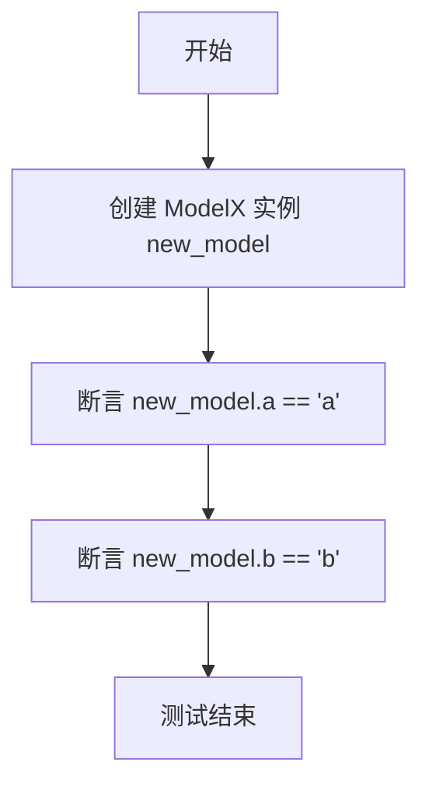

# `.\MetaGPT\tests\metagpt\test_context_mixin.py` 详细设计文档

该文件是一个测试文件，用于验证 `ContextMixin` 类的功能，特别是配置（`Config`）在多继承场景下的传播、优先级和覆盖行为。它通过创建继承自 `ContextMixin` 和 `pydantic.BaseModel` 的测试类，并模拟角色（`Role`）、动作（`Action`）和团队（`Team`）的交互，来测试配置如何从环境、角色传递到动作，以及 `override` 参数对配置设置的影响。

## 整体流程

```mermaid
graph TD
    A[开始执行测试] --> B{测试函数选择}
    B --> C[test_config_mixin_1]
    B --> D[test_config_mixin_2]
    B --> E[test_config_mixin_3_multi_inheritance_not_override_config]
    B --> F[test_config_mixin_4_multi_inheritance_override_config]
    B --> G[test_config_priority]
    C --> C1[创建 ModelX 实例]
    C1 --> C2[验证默认字段值]
    C2 --> C3[测试通过]
    D --> D1[创建两个 Config 对象 i, j]
    D1 --> D2[用 i 创建 ModelX 实例 obj]
    D2 --> D3[验证 obj.config 为 i]
    D3 --> D4[调用 obj.set_config(j)]
    D4 --> D5[验证 config 未被覆盖 (仍为 i)]
    D5 --> D6[测试通过]
    E --> E1[创建两个 Config 对象 i, j]
    E1 --> E2[用 i 创建 ModelY 实例 obj]
    E2 --> E3[验证 obj.config 为 i]
    E3 --> E4[调用 obj.set_config(j)]
    E4 --> E5[验证 config 未被覆盖 (仍为 i)]
    E5 --> E6[验证所有字段值]
    E6 --> E7[测试通过]
    F --> F1[创建两个 Config 对象 i, j]
    F1 --> F2[用 i 创建 ModelY 实例 obj]
    F2 --> F3[验证 obj.config 为 i]
    F3 --> F4[调用 obj.set_config(j, override=True)]
    F4 --> F5[验证 config 被覆盖 (变为 j)]
    F5 --> F6[验证所有字段值]
    F6 --> F7[测试通过]
    G --> G1[准备多个 Config 对象 (gpt4t, gpt35, gpt4)]
    G1 --> G2[创建三个 Action 对象 (a1, a2, a3)]
    G2 --> G3[创建三个 Role 对象 (A, B, C)]
    G3 --> G4[创建 Environment 和 Team]
    G4 --> G5[验证各 Action 的 llm.model 值]
    G5 --> G6[测试通过]
```

## 类结构

```
BaseModel (pydantic)
├── ContextMixin (metagpt.context_mixin)
│   └── ModelX (test_context_mixin.py)
│       └── ModelY (test_context_mixin.py)
└── WTFMixin (test_context_mixin.py)
    └── ModelY (test_context_mixin.py)
```

## 全局变量及字段


### `ModelX.a`
    
ModelX 类的一个字符串类型字段，默认值为 'a'。

类型：`str`
    


### `ModelX.b`
    
ModelX 类的一个字符串类型字段，默认值为 'b'。

类型：`str`
    


### `WTFMixin.c`
    
WTFMixin 类的一个字符串类型字段，默认值为 'c'。

类型：`str`
    


### `WTFMixin.d`
    
WTFMixin 类的一个字符串类型字段，默认值为 'd'。

类型：`str`
    
    

## 全局函数及方法

### `test_config_mixin_1`

该函数是一个单元测试，用于验证 `ModelX` 类在默认初始化后，其字段 `a` 和 `b` 的值是否与默认值 `"a"` 和 `"b"` 一致。它测试了 `ContextMixin` 与 `BaseModel` 组合的基本功能。

参数：无

返回值：`None`，该函数是一个测试函数，不返回任何值，其目的是通过断言来验证代码行为。

#### 流程图



#### 带注释源码

```python
def test_config_mixin_1():
    # 创建一个 ModelX 类的实例，使用其默认字段值
    new_model = ModelX()
    # 断言：检查实例的字段 a 是否等于默认值 "a"
    assert new_model.a == "a"
    # 断言：检查实例的字段 b 是否等于默认值 "b"
    assert new_model.b == "b"
```

### `test_config_mixin_2`

该函数是一个单元测试，用于验证 `ContextMixin` 的功能。它测试了当 `ModelX` 对象已经拥有一个配置对象时，调用 `set_config` 方法（且不指定 `override=True`）不会覆盖其现有的配置。

参数：

-   `无`：`无`，该函数不接受任何参数。

返回值：`None`，该函数不返回任何值，仅执行断言测试。

#### 流程图

```mermaid
flowchart TD
    A[开始] --> B[创建 Config 对象 i<br>llm=mock_llm_config]
    B --> C[创建 Config 对象 j<br>llm=mock_llm_config_proxy]
    C --> D[创建 ModelX 对象 obj<br>并传入 config=i]
    D --> E{断言 obj.config == i}
    E -->|是| F{断言 obj.config.llm == mock_llm_config}
    F -->|是| G[调用 obj.set_config(j)]
    G --> H{断言 obj.config == i<br>（配置未被覆盖）]
    H -->|是| I[结束]
    E -->|否| J[测试失败]
    F -->|否| J
    H -->|否| J
```

#### 带注释源码

```python
def test_config_mixin_2():
    # 创建两个不同的配置对象，i 和 j，分别使用不同的 LLM 配置
    i = Config(llm=mock_llm_config)
    j = Config(llm=mock_llm_config_proxy)
    
    # 使用配置 i 创建一个 ModelX 对象
    obj = ModelX(config=i)
    
    # 断言：obj 的 config 属性应该等于传入的 i
    assert obj.config == i
    # 断言：obj 的 config 中的 llm 属性应该等于 mock_llm_config
    assert obj.config.llm == mock_llm_config

    # 尝试使用 set_config 方法将配置设置为 j
    obj.set_config(j)
    # 断言：由于 obj 已经有一个配置 (i)，并且 set_config 没有指定 override=True，
    # 因此配置不会被覆盖，obj.config 应该仍然等于 i
    assert obj.config == i
```

### `test_config_mixin_3_multi_inheritance_not_override_config`

该函数是一个单元测试，用于验证`ContextMixin`在多继承场景下的配置管理行为。具体测试目标是：当一个继承自`ContextMixin`的类（`ModelY`）的实例已经通过构造函数设置了配置（`config`）后，后续调用`set_config`方法且不指定`override=True`时，原有的配置不会被覆盖。

参数：

-  `i`：`Config`，第一个配置对象，包含`mock_llm_config`作为其`llm`字段。
-  `j`：`Config`，第二个配置对象，包含`mock_llm_config_proxy`作为其`llm`字段，用于尝试设置给`obj`。

返回值：`None`，该函数是一个测试函数，不返回任何值，仅通过断言（`assert`）来验证预期行为。

#### 流程图

```mermaid
flowchart TD
    A[开始测试] --> B[创建两个Config对象 i 和 j]
    B --> C[创建ModelY实例obj<br>并传入config=i]
    C --> D[断言obj.config等于i]
    D --> E[断言obj.config.llm等于mock_llm_config]
    E --> F[调用obj.set_config(j)]
    F --> G{检查obj.config是否被覆盖?}
    G -- 否 --> H[断言obj.config仍等于i]
    H --> I[断言obj.config.llm仍等于mock_llm_config]
    I --> J[验证obj的其他字段值]
    J --> K[验证obj的__dict__包含'private_config'键]
    K --> L[测试通过]
    G -- 是 --> M[测试失败]
```

#### 带注释源码

```python
def test_config_mixin_3_multi_inheritance_not_override_config():
    """Test config mixin with multiple inheritance"""
    # 创建两个不同的配置对象，用于测试配置的“设置”与“不覆盖”行为
    i = Config(llm=mock_llm_config)
    j = Config(llm=mock_llm_config_proxy)
    
    # 实例化ModelY，并通过构造函数传入初始配置i
    obj = ModelY(config=i)
    
    # 断言1：验证实例的config属性确实被设置为传入的i
    assert obj.config == i
    # 断言2：进一步验证config内部的llm字段是预期的mock_llm_config
    assert obj.config.llm == mock_llm_config

    # 关键步骤：尝试使用set_config方法将配置设置为j，但不使用override=True参数
    obj.set_config(j)
    # 断言3：由于obj已有配置，且未指定override=True，因此配置不应被覆盖，config应仍为i
    assert obj.config == i
    # 断言4：再次确认llm配置未被改变
    assert obj.config.llm == mock_llm_config

    # 断言5-8：验证从父类继承的字段值是否正确
    assert obj.a == "a"
    assert obj.b == "b"
    assert obj.c == "c"
    assert obj.d == "d"

    # 打印对象的内部字典键，用于调试或验证内部状态
    print(obj.__dict__.keys())
    # 断言9：验证ContextMixin注入的私有配置字段`private_config`存在于实例的__dict__中
    assert "private_config" in obj.__dict__.keys()
```

### `test_config_mixin_4_multi_inheritance_override_config`

该函数是一个单元测试，用于验证 `ContextMixin` 在多继承场景下，当 `override` 参数为 `True` 时，能够成功覆盖对象已有的配置。

参数：
-  `i`：`Config`，初始配置对象，包含一个模拟的 LLM 配置。
-  `j`：`Config`，新的配置对象，包含另一个模拟的 LLM 配置。
-  `obj`：`ModelY`，一个继承自 `WTFMixin` 和 `ModelX`（后者继承自 `ContextMixin`）的测试模型实例。
-  `override`：`bool`，一个布尔标志，指示是否强制覆盖现有配置。

返回值：`None`，该函数是一个测试函数，不返回任何值，仅通过断言验证行为。

#### 流程图

```mermaid
flowchart TD
    A[开始测试] --> B[创建初始配置 i<br>（mock_llm_config）]
    B --> C[创建新配置 j<br>（mock_llm_config_zhipu）]
    C --> D[使用配置 i 创建 ModelY 实例 obj]
    D --> E{断言 obj.config 等于 i}
    E --> F{断言 obj.config.llm 等于 mock_llm_config}
    F --> G[调用 obj.set_config(j, override=True)]
    G --> H{断言 obj.config 等于 j}
    H --> I{断言 obj.config.llm 等于 mock_llm_config_zhipu}
    I --> J{断言 obj 的字段 a, b, c, d 为默认值}
    J --> K[打印 obj.__dict__.keys]
    K --> L{断言 private_config 在 obj.__dict__ 中}
    L --> M{断言 obj.config.llm.model 为 'mock_zhipu_model']
    M --> N[测试结束]
```

#### 带注释源码

```python
def test_config_mixin_4_multi_inheritance_override_config():
    """Test config mixin with multiple inheritance"""
    # 创建两个不同的配置对象，用于测试配置的覆盖
    i = Config(llm=mock_llm_config)
    j = Config(llm=mock_llm_config_zhipu)
    # 使用初始配置 i 创建一个 ModelY 实例
    obj = ModelY(config=i)
    # 验证实例创建后，其配置确实被设置为 i
    assert obj.config == i
    assert obj.config.llm == mock_llm_config

    # 关键步骤：调用 set_config 方法，并传入 override=True 参数
    # 这应该强制用新配置 j 覆盖 obj 的现有配置
    obj.set_config(j, override=True)
    # 验证配置已被成功覆盖
    assert obj.config == j
    assert obj.config.llm == mock_llm_config_zhipu

    # 验证多继承模型的字段值未被配置操作影响
    assert obj.a == "a"
    assert obj.b == "b"
    assert obj.c == "c"
    assert obj.d == "d"

    # 调试输出，检查对象的内部字典键
    print(obj.__dict__.keys())
    # 验证 ContextMixin 引入的私有配置字段存在
    assert "private_config" in obj.__dict__.keys()
    # 最终断言，验证新配置中的 LLM 模型名称是否正确
    assert obj.config.llm.model == "mock_zhipu_model"
```

### `test_config_priority`

这是一个异步测试函数，用于验证在MetaGPT框架中，`Action`（动作）对象的LLM配置优先级。其核心逻辑是：如果一个`Action`在创建时已经设置了`config`（配置），那么它将使用自己的配置；否则，它将继承其所属`Role`（角色）的配置。该测试通过创建具有不同配置状态的`Action`和`Role`实例，并检查它们最终的`llm.model`属性来验证这一优先级规则。

参数：

-   `无显式参数`：`无`，这是一个使用`pytest.mark.asyncio`装饰的测试函数，不接收显式参数。

返回值：`None`，测试函数通常不返回值，其目的是通过断言（`assert`）来验证代码行为。

#### 流程图

```mermaid
flowchart TD
    Start[开始测试] --> LoadConfig[加载或创建配置<br/>gpt4t, gpt35, gpt4]
    LoadConfig --> CreateActions[创建Action实例<br/>a1(有config), a2(无config), a3(无config)]
    CreateActions --> CreateRoles[创建Role实例<br/>A(有config, 包含a1)<br/>B(有config, 包含a2)<br/>C(有config, 包含a3)]
    CreateRoles --> InitTeam[初始化Team与环境]
    InitTeam --> CheckA1[断言 a1.llm.model]
    CheckA1 --> CheckA2[断言 a2.llm.model]
    CheckA2 --> CheckA3[断言 a3.llm.model]
    CheckA3 --> End[测试结束]
```

#### 带注释源码

```python
@pytest.mark.asyncio  # 标记此函数为异步测试，以便pytest-asyncio插件可以运行它。
async def test_config_priority():
    """If action's config is set, then its llm will be set, otherwise, it will use the role's llm"""
    # 1. 准备测试配置
    home_dir = Path.home() / CONFIG_ROOT  # 获取用户主目录下的配置根目录路径。
    gpt4t = Config.from_home("gpt-4-turbo.yaml")  # 尝试从主目录加载名为'gpt-4-turbo.yaml'的配置。
    if not home_dir.exists():  # 如果配置目录不存在，则gpt4t应为None。
        assert gpt4t is None
    gpt35 = Config.default()  # 创建默认配置实例gpt35。
    gpt35.llm.model = "gpt-4-turbo"  # 修改gpt35的LLM模型名为"gpt-4-turbo"。
    gpt4 = Config.default()  # 创建另一个默认配置实例gpt4。
    gpt4.llm.model = "gpt-4-0613"  # 修改gpt4的LLM模型名为"gpt-4-0613"。

    # 2. 创建Action实例，用于测试配置继承。
    # a1: 创建时直接传入配置gpt4t（可能为None或从文件加载）。
    a1 = Action(config=gpt4t, name="Say", instruction="Say your opinion with emotion and don't repeat it")
    # a2: 创建时不传入配置，预期后续从所属Role继承。
    a2 = Action(name="Say", instruction="Say your opinion with emotion and don't repeat it")
    # a3: 创建时不传入配置，预期后续从所属Role继承。
    a3 = Action(name="Vote", instruction="Vote for the candidate, and say why you vote for him/her")

    # 3. 创建Role实例，并将Action分配给它们，同时为Role设置配置。
    # Role A: 配置为gpt4，包含已自带配置的a1。a1的配置应保持不变（优先级最高）。
    A = Role(name="A", profile="Democratic candidate", goal="Win the election", actions=[a1], watch=[a2], config=gpt4)
    # Role B: 配置为gpt4，包含无配置的a2。a2应继承Role B的配置gpt4。
    B = Role(name="B", profile="Republican candidate", goal="Win the election", actions=[a2], watch=[a1], config=gpt4)
    # Role C: 配置为gpt35，包含无配置的a3。a3应继承Role C的配置gpt35。
    C = Role(name="C", profile="Voter", goal="Vote for the candidate", actions=[a3], watch=[a1, a2], config=gpt35)

    # 4. 初始化环境和团队（此步骤可能触发团队内部初始化逻辑，影响Action的最终配置）。
    env = Environment(desc="US election live broadcast")
    Team(investment=10.0, env=env, roles=[A, B, C])

    # 5. 进行断言，验证配置优先级逻辑。
    # 断言a1的模型：如果gpt4t配置文件存在，则使用其模型（"gpt-4-turbo"），否则应回退到其所属Role A的配置gpt4的模型（"gpt-4-0613"）。
    # 这验证了Action自带配置的最高优先级。
    assert a1.llm.model == "gpt-4-turbo" if Path(home_dir / "gpt-4-turbo.yaml").exists() else "gpt-4-0613"
    # 断言a2的模型：应继承其所属Role B的配置gpt4的模型（"gpt-4-0613"）。
    assert a2.llm.model == "gpt-4-0613"
    # 断言a3的模型：应继承其所属Role C的配置gpt35的模型（"gpt-4-turbo"）。
    assert a3.llm.model == "gpt-4-turbo"

    # 注释掉的代码：实际运行团队交互的测试轮次。在当前测试中未执行，仅用于展示完整场景。
    # history = await team.run(idea="Topic: climate change. Under 80 words per message.", send_to="a1", n_round=3)
```

### `ModelX.set_config`

该方法用于为`ModelX`实例或其子类实例设置配置对象。它遵循一个“首次设置”或“显式覆盖”的原则：如果实例已经拥有一个配置（`config`属性不为`None`），则默认情况下不会用新的配置替换它，除非调用者显式指定`override=True`参数。该方法主要用于在对象初始化后动态地注入或更新其配置依赖。

参数：

-  `config`：`Config`，要设置的新配置对象。
-  `override`：`bool`，默认为`False`。如果为`True`，则无论实例是否已有配置，都强制用新配置替换。如果为`False`，则仅在实例当前没有配置（`self.config`为`None`）时才进行设置。

返回值：`None`，该方法不返回任何值，直接修改实例的内部状态。

#### 流程图

```mermaid
flowchart TD
    A[开始: set_config(config, override=False)] --> B{实例已有config?<br>且override为False?};
    B -- 是 --> C[结束: 不进行任何操作];
    B -- 否 --> D[将实例的config属性设置为传入的config];
    D --> E[结束];
```

#### 带注释源码

```python
def set_config(self, config: Config, override: bool = False):
    """
    为当前实例设置配置。
    
    如果实例已有配置且`override`为False，则不会覆盖现有配置。
    否则，将使用提供的配置。
    
    Args:
        config (Config): 要设置的新配置对象。
        override (bool): 如果为True，则强制覆盖现有配置。默认为False。
    """
    # 检查当前实例是否已经有一个配置对象，并且调用者没有要求强制覆盖
    if self.config is not None and not override:
        # 如果条件满足，则直接返回，不执行设置操作
        return
    # 如果不满足上述条件（即没有配置或要求覆盖），则将实例的config属性设置为传入的config
    self.config = config
```

## 关键组件

### ContextMixin

一个用于为Pydantic模型提供配置管理功能的Mixin类，允许对象持有并管理一个`Config`实例，支持通过继承链传播配置，并提供了设置配置的方法，可选择是否覆盖现有配置。

### Config

一个配置管理类，用于封装和管理应用程序的配置信息，特别是大语言模型（LLM）的配置。它支持从默认设置、YAML文件或主目录中的配置文件加载配置。

### Role

一个表示智能体角色的类，包含名称、简介、目标、可执行的动作列表以及关注的其他动作。它使用`ContextMixin`来管理其配置，并可以将其配置传播给其拥有的、尚未设置配置的`Action`对象。

### Action

一个表示可执行动作的基类，包含名称和指令。它同样使用`ContextMixin`来管理其配置，其配置优先级遵循：如果自身已设置配置，则使用自身配置；否则，尝试使用其所属`Role`的配置。

### Team

一个用于管理和协调多个`Role`（智能体）在共享`Environment`（环境）中协作的类。它通过初始化`Role`来触发配置从`Role`到其`Action`的传播逻辑。

### Environment

一个表示智能体运行环境的类，包含环境描述。在团队协作场景中，为所有角色提供共享的上下文和交互空间。

## 问题及建议

### 已知问题

-   **测试用例对文件系统存在强依赖**：`test_config_priority` 测试用例依赖于用户主目录下是否存在特定的配置文件（`~/.metagpt/gpt-4-turbo.yaml`）。这导致测试结果不稳定，在没有该配置文件的机器上，断言 `a1.llm.model == "gpt-4-turbo"` 会失败，测试用例可能无法通过。
-   **`set_config` 方法的默认行为可能违反直觉**：`ContextMixin.set_config` 方法在 `override` 参数为 `False`（默认值）时，如果对象已存在配置，则不会更新。虽然这可以防止意外覆盖，但在某些调用场景下，开发者可能期望 `set_config` 总是设置新的配置，这种静默忽略的行为可能导致难以调试的配置错误。
-   **多继承场景下的配置管理复杂性**：测试展示了 `ModelY` 通过多重继承（`WTFMixin, ModelX`）获得 `ContextMixin` 功能。虽然当前测试通过，但复杂的继承链可能引入配置属性访问和初始化的歧义，增加维护和理解成本。
-   **测试断言逻辑存在条件分支**：`test_config_priority` 中关于 `a1.llm.model` 的断言是一个条件表达式，这降低了测试的明确性和可读性。测试的目的应该是验证特定逻辑，而非适应环境差异。

### 优化建议

-   **隔离测试环境依赖**：重构 `test_config_priority` 测试用例，使用临时目录或模拟（Mock）对象来替代对真实文件系统（`Path.home()`）的依赖。例如，可以临时设置 `CONFIG_ROOT` 环境变量或使用 `unittest.mock.patch` 装饰器模拟 `Config.from_home` 方法的返回值，确保测试在任何环境下行为一致。
-   **明确 `set_config` 方法的行为**：考虑修改 `ContextMixin.set_config` 方法的默认行为，或者在文档中非常明确地强调其“仅设置一次”的特性。另一种方案是提供两个方法：`init_config`（用于首次设置）和 `update_config`（用于强制更新），使意图更清晰。
-   **简化继承结构或明确混入类（Mixin）的使用规范**：对于使用 `ContextMixin` 的类，建议采用更扁平化的继承结构（例如，单一继承自 `ContextMixin` 和 `BaseModel`）。如果必须使用多重继承，应在项目文档中建立清晰的规范，说明混入类（Mixin）的放置顺序（通常在其他基类之后）和可能的冲突解决方法。
-   **拆分和强化测试用例**：将 `test_config_priority` 拆分为多个独立的测试用例。例如，一个测试验证“已配置 Action 不继承 Role 配置”，另一个测试验证“未配置 Action 继承 Role 配置”。对于文件依赖部分，可以单独创建一个测试，专门测试 `Config.from_home` 在不同场景下的行为，并使用模拟进行隔离。
-   **增强配置对象的不可变性保证**：考虑在 `Config` 类或 `ContextMixin` 中引入机制，使得一旦配置被设置（尤其是通过 `__init__` 设置），其核心部分（如 `llm` 引用）变为不可变或仅能通过显式的、带验证的方法进行更新，以防止在复杂对象图中意外修改配置。

## 其它


### 设计目标与约束

本测试代码的设计目标是验证 `ContextMixin` 类在多继承场景下的配置管理行为，特别是其 `config` 属性的设置、继承和覆盖逻辑。核心约束包括：1) 确保 `ContextMixin` 能够正确地为继承它的 Pydantic 模型注入配置管理能力；2) 在多继承链中，`config` 属性的初始化、获取和设置行为需符合预期（例如，默认不覆盖已存在的配置）；3) 验证配置优先级逻辑，即 `Action` 实例应优先使用自身配置，若无则回退到所属 `Role` 的配置。测试代码本身作为验证逻辑的载体，不承担生产功能。

### 错误处理与异常设计

当前测试代码主要使用 `assert` 语句进行验证，未显式定义或测试错误处理流程。潜在的异常场景包括：1) 当 `Config.from_home` 读取不存在的配置文件时返回 `None`，后续使用其属性可能导致 `AttributeError`，代码中通过条件判断进行了规避。2) `set_config` 方法在 `override=False`（默认）时静默忽略对已存在 `config` 的修改，这是一种设计上的“静默失败”模式，而非抛出异常。测试代码验证了这种静默行为。生产代码中，`ContextMixin` 可能需要更明确的错误提示，例如在无效配置传入时抛出 `ValueError` 或 `TypeError`。

### 数据流与状态机

测试代码中的数据流围绕 `Config` 对象的创建、传递和最终绑定展开。1) **初始化流**：`Config` 对象（如 `i`, `j`, `gpt4t`）被创建，并作为参数传递给 `ModelX`、`ModelY`、`Action`、`Role` 的构造函数。2) **配置继承/覆盖流**：通过 `set_config` 方法，测试了向已初始化对象注入新配置时，根据 `override` 参数决定是静默忽略（`False`）还是强制覆盖（`True`）。3) **优先级流**：在 `test_config_priority` 中，数据流展示了配置的查找链：`Action.llm` -> `Action.config.llm` (若 `Action` 自身未设置 `config`，则触发内部逻辑回退到 `Role.config.llm`)。测试通过断言验证了数据流终点的状态（即 `llm.model` 的值）符合预期。整个测试过程可视为一个简单的状态机：对象从“无配置”状态，通过初始化或 `set_config` 转移到“有配置”状态，且状态转移条件（是否已存在配置、`override` 标志）被严格测试。

### 外部依赖与接口契约

1.  **外部依赖**：
    *   **Pydantic (`BaseModel`)**：`ModelX` 和 `ModelY` 继承自 `BaseModel`，依赖其数据验证和序列化功能。`ContextMixin` 需要与 Pydantic 的模型初始化机制协同工作。
    *   **pytest**：用于测试框架的组织、运行和异步测试支持 (`@pytest.mark.asyncio`)。
    *   **metagpt 框架模块**：核心依赖包括 `ContextMixin`（被测试主体）、`Config`、`Action`、`Role`、`Environment`、`Team`。测试代码验证了与这些模块交互的契约。
    *   **mock_llm_config 模块**：提供测试用的模拟配置数据 (`mock_llm_config`, `mock_llm_config_proxy`, `mock_llm_config_zhipu`)，是测试数据的外部来源。

2.  **接口契约**：
    *   **`ContextMixin` 契约**：测试假设并验证了 `ContextMixin` 提供 `config` 属性和 `set_config(config, override=False)` 方法。`config` 属性应在对象初始化后可用，`set_config` 的行为（特别是 `override` 参数的作用）是测试的重点。
    *   **`Config` 类契约**：假设 `Config` 具有 `llm` 字段，且 `llm` 具有 `model` 属性。同时假设 `Config.default()` 和 `Config.from_home(...)` 等静态方法能返回有效的 `Config` 实例。
    *   **`Action`/`Role` 配置优先级契约**：测试验证了 `Action` 对象在初始化时若传入 `config`，则其内部 `llm` 应使用该配置；若未传入，则应使用其所属 `Role` 的 `config`。这是 `Action` 和 `Role` 类之间一个隐含的、被测试所确认的协作契约。

    