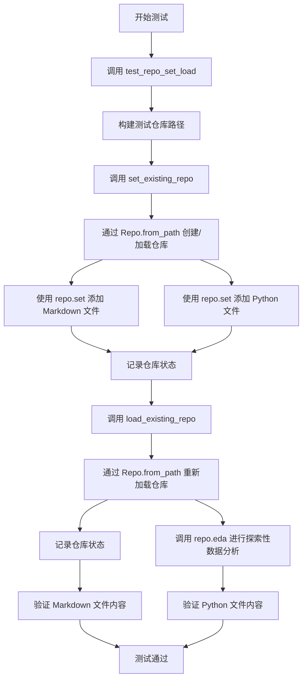
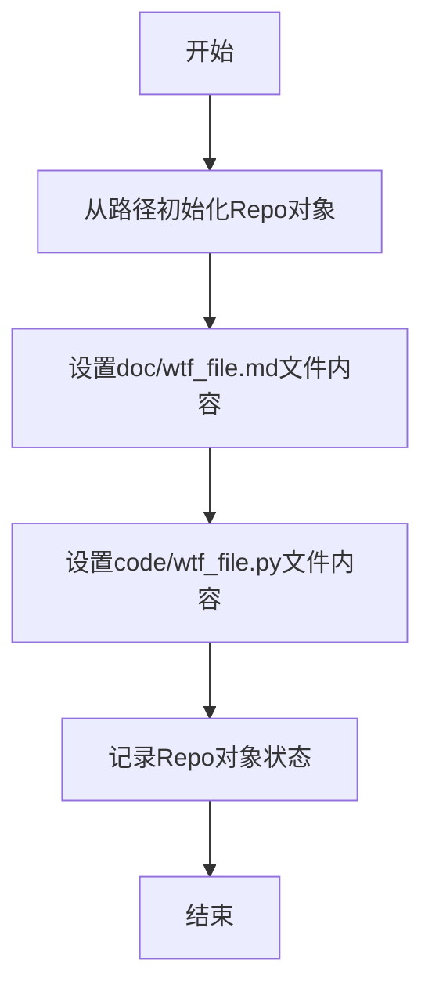
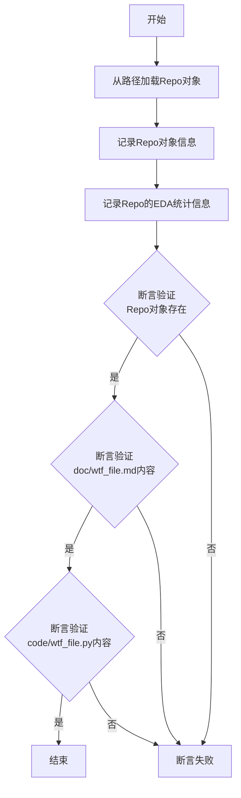
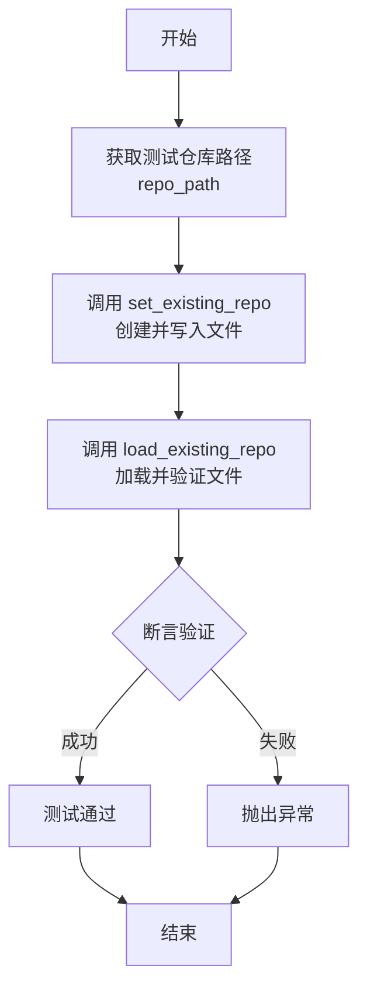
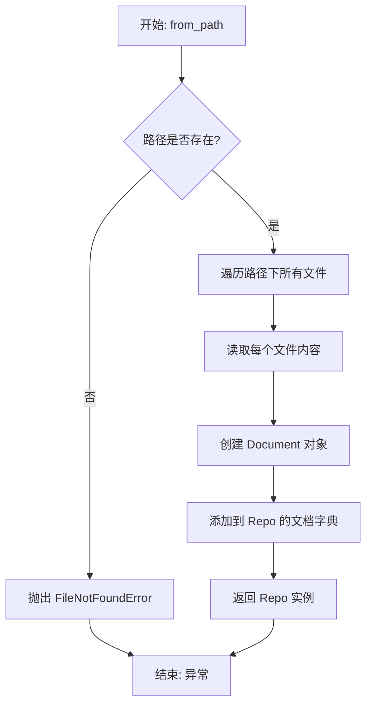
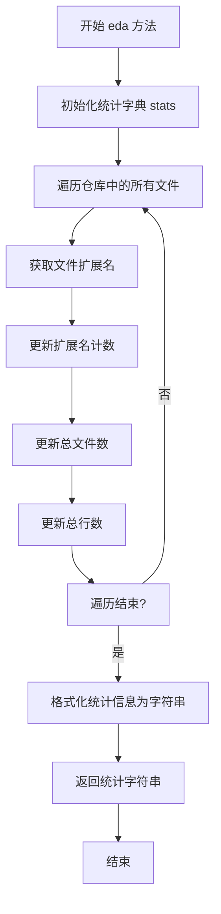
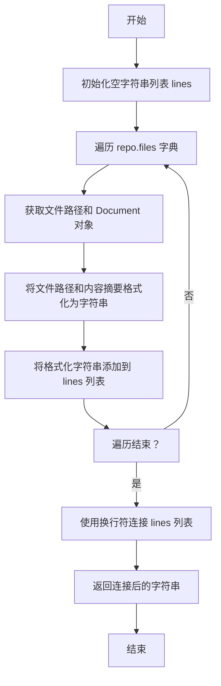

# `.\MetaGPT\tests\metagpt\test_document.py` 详细设计文档

该代码是一个测试脚本，用于验证 Repo 类的核心功能。它首先创建一个 Repo 对象，向其中添加两个文件（一个 Markdown 文档和一个 Python 代码文件），然后重新加载该 Repo 对象，并验证之前添加的文件内容是否正确。

## 整体流程



## 类结构

```
Repo (仓库管理类)
├── 字段: (代码中未直接展示，需分析 Repo 类)
└── 方法: from_path, set, get, eda, __str__
```

## 全局变量及字段


### `config`
    
全局配置对象，提供对系统配置的访问，如工作空间路径等。

类型：`metagpt.config2.Config`
    


### `logger`
    
全局日志记录器，用于在代码中记录不同级别的日志信息。

类型：`logging.Logger`
    


### `Repo.root`
    
表示代码仓库的根目录路径。

类型：`pathlib.Path`
    


### `Repo.docs`
    
存储仓库中所有文档的字典，键为文件路径，值为Document对象。

类型：`Dict[str, Document]`
    
    

## 全局函数及方法

### `set_existing_repo`

该函数用于在指定的本地仓库路径中创建并设置两个示例文件：一个Markdown文档文件和一个Python代码文件。它首先根据给定的路径初始化一个`Repo`对象，然后向该仓库中添加预定义的内容，最后记录仓库的当前状态以进行验证。

参数：

- `path`：`str` 或 `Path`，指向本地文件系统中现有仓库的路径。

返回值：`None`，该函数不返回任何值。

#### 流程图



#### 带注释源码

```python
def set_existing_repo(path):
    # 根据提供的路径创建一个Repo对象，代表一个代码仓库
    repo1 = Repo.from_path(path)
    
    # 在仓库的'doc'目录下创建（或覆盖）一个名为'wtf_file.md'的文件，并设置其内容为"wtf content"
    repo1.set("doc/wtf_file.md", "wtf content")
    
    # 在仓库的'code'目录下创建（或覆盖）一个名为'wtf_file.py'的文件，并设置其内容为一个简单的Python函数定义
    repo1.set("code/wtf_file.py", "def hello():\n    print('hello')")
    
    # 使用日志记录器输出当前仓库的状态，通常用于调试和验证文件是否已正确设置
    logger.info(repo1)  # check doc
```

### `load_existing_repo`

该函数用于从指定路径加载一个已存在的代码仓库（Repo）对象，验证其内容是否符合预期，并记录其结构和基本统计信息。

参数：
- `path`：`Path` 或 `str`，指向已存在仓库的本地文件系统路径。

返回值：`None`，该函数不返回任何值，主要用于验证和日志记录。

#### 流程图



#### 带注释源码

```python
def load_existing_repo(path):
    # 1. 从给定的文件系统路径实例化一个Repo对象
    repo = Repo.from_path(path)
    
    # 2. 记录整个Repo对象的信息，便于调试
    logger.info(repo)
    
    # 3. 记录Repo的探索性数据分析（EDA）结果，展示其结构统计信息
    logger.info(repo.eda())

    # 4. 断言验证：确保Repo对象被成功加载（非空）
    assert repo
    
    # 5. 断言验证：确保Repo中特定文档文件的内容与预期一致
    assert repo.get("doc/wtf_file.md").content == "wtf content"
    
    # 6. 断言验证：确保Repo中特定代码文件的内容与预期一致
    assert repo.get("code/wtf_file.py").content == "def hello():\n    print('hello')"
```


### `test_repo_set_load`

该函数是一个测试函数，用于验证 `Repo` 类的 `set` 和 `get` 方法以及持久化功能。它首先调用 `set_existing_repo` 函数在一个指定的仓库路径中创建并写入两个文件，然后调用 `load_existing_repo` 函数从同一路径加载仓库并验证之前写入的文件内容是否正确。

参数：

-  `无`：`无`，此函数不接受任何参数。

返回值：`None`，此函数不返回任何值，主要用于执行测试断言。

#### 流程图



#### 带注释源码

```python
def test_repo_set_load():
    # 从配置中获取工作空间路径，并拼接出测试仓库的完整路径
    repo_path = config.workspace.path / "test_repo"
    
    # 第一阶段：设置仓库。调用辅助函数，在指定路径创建仓库并写入测试文件。
    set_existing_repo(repo_path)
    
    # 第二阶段：加载并验证仓库。调用另一个辅助函数，从同一路径加载仓库，
    # 并断言之前写入的文件内容与预期一致。
    load_existing_repo(repo_path)
    # 函数本身没有显式返回值，测试的成功与否由内部的assert语句决定。
```


### `Repo.from_path`

`Repo.from_path` 是一个类方法，用于从指定的文件系统路径创建一个 `Repo` 实例。它通过扫描给定路径下的所有文件，读取其内容，并构建一个包含文件路径和内容的文档集合，从而初始化一个代码仓库的表示。

参数：
- `path`：`Union[str, Path]`，表示代码仓库在文件系统中的根目录路径。可以是字符串或 `pathlib.Path` 对象。

返回值：`Repo`，返回一个初始化好的 `Repo` 实例，其中包含了从指定路径加载的所有文档。

#### 流程图



#### 带注释源码

```python
@classmethod
def from_path(cls, path: Union[str, Path]) -> "Repo":
    """
    从指定路径创建一个 Repo 实例。
    
    遍历给定路径下的所有文件，读取内容并创建 Document 对象。
    
    Args:
        path (Union[str, Path]): 代码仓库的根目录路径。
        
    Returns:
        Repo: 包含所有加载文档的 Repo 实例。
        
    Raises:
        FileNotFoundError: 如果指定路径不存在。
    """
    # 将路径转换为 Path 对象，确保统一处理
    path = Path(path)
    
    # 检查路径是否存在，如果不存在则抛出异常
    if not path.exists():
        raise FileNotFoundError(f"路径不存在: {path}")
    
    # 初始化一个空的 Repo 实例
    repo = cls()
    
    # 遍历路径下的所有文件，包括子目录
    for file_path in path.rglob("*"):
        # 跳过目录，只处理文件
        if file_path.is_file():
            try:
                # 读取文件内容，使用 utf-8 编码，忽略解码错误
                content = file_path.read_text(encoding="utf-8", errors="ignore")
                # 将文件路径转换为相对于根路径的字符串形式
                relative_path = str(file_path.relative_to(path))
                # 创建 Document 对象并添加到 repo 的文档字典中
                repo.documents[relative_path] = Document(content=content, filename=relative_path)
            except Exception as e:
                # 如果读取文件失败，记录警告日志，但继续处理其他文件
                logger.warning(f"无法读取文件 {file_path}: {e}")
    
    # 返回初始化好的 Repo 实例
    return repo
```

### `Repo.set`

该方法用于在代码仓库（Repo）中设置或更新指定路径的文件内容。如果文件已存在，则更新其内容；如果文件不存在，则创建新文件并设置内容。同时，它会根据文件路径自动推断文件类型（如文档、代码等），并更新仓库的内部索引结构。

参数：

- `path`：`str`，文件在仓库中的相对路径（例如："doc/wtf_file.md"）。
- `content`：`str`，要写入文件的文本内容。

返回值：`None`，无返回值。

#### 流程图

```mermaid
flowchart TD
    A[开始: Repo.set(path, content)] --> B{path 是否已存在?}
    B -- 是 --> C[更新现有文件的 content]
    B -- 否 --> D[创建新文件对象]
    D --> E[根据 path 推断文件类型<br>（如文档、代码等）]
    C --> F[更新仓库的 files 字典<br>key: path, value: 文件对象]
    E --> F
    F --> G[更新仓库的索引结构<br>（如 docs, codes 等）]
    G --> H[结束]
```

#### 带注释源码

```python
def set(self, path: str, content: str):
    """
    设置或更新仓库中指定路径的文件内容。
    
    Args:
        path (str): 文件在仓库中的相对路径。
        content (str): 要写入文件的文本内容。
    """
    # 如果文件已存在，则更新其内容
    if path in self.files:
        self.files[path].content = content
    else:
        # 如果文件不存在，则创建新的文件对象
        # 根据文件路径推断文件类型（例如，通过后缀判断是文档还是代码）
        file_type = self._infer_file_type(path)
        # 创建对应的文件对象（例如 Document 或 CodeFile）
        file_obj = self._create_file_obj(path, content, file_type)
        # 将新文件对象添加到 files 字典中
        self.files[path] = file_obj
    
    # 更新仓库的索引结构，例如将文档路径添加到 docs 列表，代码路径添加到 codes 列表等
    self._update_index(path)
```

### `Repo.get`

该方法用于从代码仓库（Repo）中根据给定的文件路径获取对应的文档对象（Document）。如果文件路径不存在于仓库中，则返回 `None`。

参数：

- `path`：`str`，要获取的文档在仓库中的相对路径。

返回值：`Document | None`，如果路径存在，则返回对应的 `Document` 对象；否则返回 `None`。

#### 流程图

```mermaid
flowchart TD
    A[开始: 调用 Repo.get(path)] --> B{检查 path 是否在 self.docs 中?}
    B -- 是 --> C[返回 self.docs[path]]
    B -- 否 --> D[返回 None]
    C --> E[结束]
    D --> E
```

#### 带注释源码

```python
def get(self, path: str) -> Document | None:
    """
    根据给定的路径从仓库中获取文档。

    Args:
        path (str): 文档在仓库中的相对路径。

    Returns:
        Document | None: 如果路径存在，则返回对应的 Document 对象；否则返回 None。
    """
    # 检查传入的路径是否存在于 self.docs 字典中。
    # self.docs 是一个字典，键为文件路径，值为对应的 Document 对象。
    if path in self.docs:
        # 如果路径存在，返回对应的 Document 对象。
        return self.docs[path]
    else:
        # 如果路径不存在，返回 None。
        return None
```

### `Repo.eda`

对代码仓库进行探索性数据分析（EDA），生成关于仓库结构和内容的统计信息摘要。

参数：

-  `self`：`Repo`，当前代码仓库实例

返回值：`str`，包含仓库统计信息的格式化字符串

#### 流程图



#### 带注释源码

```python
def eda(self) -> str:
    """
    对代码仓库进行探索性数据分析（EDA），生成关于仓库结构和内容的统计信息摘要。

    该方法遍历仓库中的所有文件，统计以下信息：
    - 按文件扩展名分类的文件数量
    - 文件总数
    - 代码总行数（基于文件内容行数）

    Returns:
        str: 包含仓库统计信息的格式化字符串
    """
    # 初始化统计字典，用于存储按扩展名分类的文件计数
    stats = defaultdict(int)
    # 初始化总文件数和总行数计数器
    total_files = 0
    total_lines = 0

    # 遍历仓库中的所有文件路径
    for path in self.files:
        # 获取文件扩展名（包括点号，例如 '.py'）
        ext = os.path.splitext(path)[1]
        # 更新该扩展名的文件计数
        stats[ext] += 1
        # 总文件数加1
        total_files += 1
        # 获取文件内容并计算行数，累加到总行数
        total_lines += len(self.get(path).content.splitlines())

    # 构建并返回格式化的统计信息字符串
    result = ["Repo EDA:"]
    # 添加总文件数和总行数
    result.append(f"  Total Files: {total_files}")
    result.append(f"  Total Lines: {total_lines}")
    # 添加按扩展名统计的文件数量，按扩展名字母顺序排序
    result.append("  By Extension:")
    for ext, count in sorted(stats.items()):
        # 如果扩展名为空字符串，表示为无扩展名文件
        ext_display = ext if ext else "(no extension)"
        result.append(f"    {ext_display}: {count}")
    # 使用换行符连接所有统计信息行
    return "\n".join(result)
```

### `Repo.__str__`

该方法用于生成 `Repo` 对象的字符串表示形式，主要用于调试和日志记录。它返回一个格式化的字符串，展示仓库中所有文件的路径和内容摘要。

参数：

- `self`：`Repo` 类型，表示当前的 `Repo` 实例。

返回值：`str` 类型，返回一个格式化的字符串，包含仓库中每个文件的路径和内容摘要。

#### 流程图



#### 带注释源码

```python
def __str__(self):
    """
    生成 Repo 对象的字符串表示形式。
    返回一个字符串，其中包含仓库中每个文件的路径和内容摘要。
    """
    lines = []  # 初始化一个空列表，用于存储每个文件的格式化信息
    for path, doc in self.files.items():  # 遍历仓库中的所有文件
        # 将文件路径和内容摘要格式化为字符串，并添加到 lines 列表中
        lines.append(f"{path}:\n{doc.content[:50]}...")
    # 使用换行符连接 lines 列表中的所有字符串，并返回
    return "\n".join(lines)
```

## 关键组件


### Repo 类

Repo 类是一个文档仓库，用于管理和操作项目中的文件，支持从指定路径加载文件，并提供了设置、获取文件内容以及进行探索性数据分析（EDA）的功能。

### config.workspace.path

config.workspace.path 是一个配置项，用于指定工作空间的根目录路径，Repo 类可以基于此路径来加载和管理文件。

### logger

logger 是一个日志记录器，用于在代码执行过程中记录信息、警告和错误，帮助开发者跟踪和调试程序运行状态。

### 文件操作函数（set_existing_repo 和 load_existing_repo）

set_existing_repo 函数用于向指定路径的仓库中设置文件内容，而 load_existing_repo 函数用于从指定路径的仓库中加载文件内容并进行验证，确保文件内容的正确性。

### 测试函数（test_repo_set_load）

test_repo_set_load 函数是一个测试函数，用于验证 Repo 类的文件设置和加载功能是否正常工作，确保代码的可靠性和正确性。


## 问题及建议


### 已知问题

-   **测试代码与业务逻辑耦合**：`test_repo_set_load` 函数直接调用了 `set_existing_repo` 和 `load_existing_repo` 这两个测试辅助函数，并将它们串联成一个测试用例。这导致测试逻辑分散，且 `set_existing_repo` 和 `load_existing_repo` 本身也包含了断言和日志记录，职责不单一，既用于准备数据又用于验证，降低了测试的可读性和可维护性。
-   **硬编码的测试数据与路径**：测试数据（如文件内容 `"wtf content"`）和文件路径（如 `"doc/wtf_file.md"`）在代码中硬编码。这使得测试用例脆弱，难以扩展或修改。如果业务逻辑中文件路径或内容的格式发生变化，需要同步修改多处测试代码。
-   **缺乏隔离的测试环境**：测试用例使用 `config.workspace.path / "test_repo"` 作为仓库路径。如果多个测试并行运行，或者测试执行后未清理，可能会造成测试数据残留，导致测试间相互干扰（污染）或非幂等性（多次运行结果不一致）。
-   **断言信息不清晰**：测试中的断言（`assert repo.get(...).content == ...`）在失败时仅会抛出 `AssertionError`，没有提供自定义的错误信息，不利于快速定位失败原因（例如，是文件不存在还是内容不匹配）。
-   **潜在的资源泄漏**：代码中创建了 `Repo` 对象，但没有显式地展示资源清理（如删除测试生成的临时目录或文件）。在长期运行的测试套件中，可能积累大量垃圾文件。

### 优化建议

-   **重构测试结构，遵循单元测试最佳实践**：
    -   将 `set_existing_repo` 和 `load_existing_repo` 中的业务准备和验证逻辑分离。可以分别创建 `setup_test_repo`（仅准备数据）和 `verify_repo_contents`（仅进行断言）的纯函数。
    -   使用 `pytest` 等测试框架的 `setup`/`teardown` 机制（如 `fixture`）来管理测试生命周期，确保每个测试用例拥有独立、干净的环境，并在测试后自动清理。
    -   将硬编码的测试数据提取为模块级常量或使用 `@pytest.mark.parametrize` 进行参数化测试，提高测试的灵活性和覆盖度。
-   **使用临时目录**：利用 `tempfile.TemporaryDirectory` 或 `pytest` 的 `tmp_path` fixture 来创建临时工作目录。这可以确保测试执行后自动清理，避免环境污染，并提高测试的并行安全性。
-   **增强断言信息**：使用 `pytest` 的 `assert` 语句（它提供了更详细的差异报告），或者为原生 `assert` 添加描述性消息，例如：`assert actual == expected, f"File content mismatch for {file_path}"`。
-   **明确测试依赖**：在测试文件或项目文档中，明确说明运行此测试所需的依赖（如 `metagpt` 包的具体版本、`config` 的预期配置等），这有助于CI/CD环境的搭建和新人上手。
-   **补充负面测试用例**：当前的测试只验证了“设置-加载”的正确路径。建议增加对异常情况的测试，例如：尝试获取不存在的文件、传入无效的仓库路径等，以验证 `Repo` 类的鲁棒性和错误处理能力。


## 其它


### 设计目标与约束

本代码模块的核心设计目标是提供一个轻量级的、用于测试 `Repo` 类功能的测试套件。它旨在验证 `Repo` 类的两个核心功能：1) 从文件系统路径创建仓库对象并设置文件内容；2) 从文件系统路径加载仓库对象并验证其内容。约束条件包括：依赖 `metagpt` 框架的配置和日志系统；测试数据存储在由 `config.workspace.path` 指定的工作空间下的临时目录中；测试过程应具备幂等性，即重复运行不应因残留数据而失败。

### 错误处理与异常设计

当前代码未显式包含错误处理逻辑，主要依赖 `assert` 语句进行验证。潜在的错误场景包括：1) `config.workspace.path` 指向的路径不可访问或不存在，`Repo.from_path` 可能引发异常；2) 测试目录 `test_repo` 已存在且包含冲突内容，可能导致 `set_existing_repo` 中的 `repo1.set` 操作行为不符合预期或失败。代码依赖于 Python 的默认异常传播机制，测试失败将通过 `assert` 异常或未捕获的运行时异常体现。

### 数据流与状态机

数据流始于配置文件 (`config`)，确定工作空间根路径。`test_repo_set_load` 函数作为主控流程：首先，组合出目标仓库路径 `repo_path`；接着，调用 `set_existing_repo`，该函数创建一个 `Repo` 对象，并向其中设置两个虚拟文件的内容，最后将对象状态序列化到 `repo_path` 对应的文件系统中；然后，调用 `load_existing_repo`，该函数从相同的 `repo_path` 加载一个新的 `Repo` 对象，读取并验证之前设置的文件内容。整个流程构成一个简单的“写入-读取-验证”状态循环，无复杂的状态迁移。

### 外部依赖与接口契约

1.  **`metagpt.config2.config`**: 提供应用程序配置，特别是 `workspace.path`，用于定位测试文件的存储根目录。依赖其正确初始化。
2.  **`metagpt.document.Repo`**: 核心被测类。测试代码依赖其接口契约：`Repo.from_path(path)` 静态方法用于从路径创建/加载仓库；`repo.set(filepath, content)` 方法用于设置或更新仓库内文件内容；`repo.get(filepath)` 方法用于获取仓库内文件对象，其 `.content` 属性应返回文件内容；`repo.eda()` 方法用于生成仓库的探索性数据分析报告（本测试中仅作日志记录）。
3.  **`metagpt.logs.logger`**: 提供日志记录功能，用于输出调试和状态信息。
4.  **Python 标准库 (pathlib, os 等)** : 被 `Repo` 类内部使用，用于文件系统操作。

### 测试策略与用例覆盖

当前代码实现了一个集成测试函数 `test_repo_set_load`，它覆盖了 `Repo` 类在文件系统持久化上下文下的核心工作流：创建/设置内容和加载/验证内容。然而，测试覆盖范围有限，未包含以下场景：1) 对 `Repo` 类其他方法（如删除文件、列出文件、复杂 EDA 等）的测试；2) 异常路径测试，例如加载不存在的仓库、设置非法路径、文件内容编码问题等；3) 并发访问或大规模数据下的性能测试。测试数据是硬编码的字符串，缺乏多样性和边界值。

### 部署与运行说明

本模块是一个使用 `pytest` 风格（尽管未直接使用 `pytest` 装饰器，但遵循类似模式）的单元测试。运行前提：1) `metagpt` 框架及其依赖已正确安装；2) 配置文件已正确设置，特别是 `workspace.path` 需指向一个可读写的目录。可以直接执行此 Python 脚本，或在更大的测试套件中通过测试发现工具运行。每次运行会在 `{workspace.path}/test_repo` 下创建或覆盖测试数据。


    