# `.\MetaGPT\tests\metagpt\test_environment.py` 详细设计文档

该文件是一个测试文件，用于测试MetaGPT框架中的环境（Environment）类及其相关功能。它通过创建模拟环境（MockEnv）、添加不同角色（如产品经理、架构师等）、发布消息并运行环境来验证环境的消息传递机制、角色管理和异步处理流程。

## 整体流程

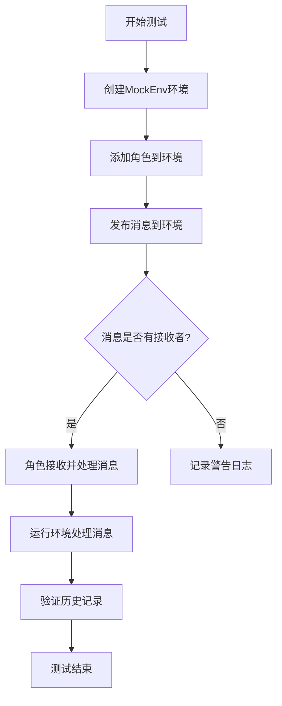

## 类结构

```
MockEnv (模拟环境类)
├── 继承自 Environment
├── 重写 publish_message 方法
└── 用于测试环境的消息传递和角色交互
```

## 全局变量及字段


### `serdeser_path`
    
用于测试序列化和反序列化的存储路径，指向项目数据目录下的serdeser_storage文件夹。

类型：`pathlib.Path`
    


### `MockEnv.member_addrs`
    
存储环境中各角色及其对应的消息接收地址的映射关系，用于消息路由。

类型：`Dict[Role, List[str]]`
    


### `MockEnv.history`
    
记录环境中所有已处理消息的历史记录，用于追踪和审计消息流。

类型：`History`
    


### `MockEnv.context`
    
环境运行的上下文对象，包含配置参数、Git仓库等共享资源。

类型：`Context`
    


### `MockEnv.is_idle`
    
指示环境当前是否处于空闲状态（无待处理消息）。

类型：`bool`
    


### `Environment.member_addrs`
    
存储环境中各角色及其对应的消息接收地址的映射关系，用于消息路由。

类型：`Dict[Role, List[str]]`
    


### `Environment.history`
    
记录环境中所有已处理消息的历史记录，用于追踪和审计消息流。

类型：`History`
    


### `Environment.context`
    
环境运行的上下文对象，包含配置参数、Git仓库等共享资源。

类型：`Context`
    


### `Environment.is_idle`
    
指示环境当前是否处于空闲状态（无待处理消息）。

类型：`bool`
    


### `Role.name`
    
角色的唯一标识名称。

类型：`str`
    


### `Role.profile`
    
角色的职业或职能描述，如'产品经理'、'工程师'。

类型：`str`
    


### `Role.goal`
    
角色在环境中的核心目标或任务。

类型：`str`
    


### `Role.constraints`
    
角色执行任务时的限制条件或约束。

类型：`str`
    


### `Role._setting`
    
角色的内部配置对象，封装了角色的元数据和行为设置。

类型：`RoleSetting`
    


### `ProductManager.name`
    
产品经理角色的唯一标识名称。

类型：`str`
    


### `ProductManager.profile`
    
产品经理的职业描述，通常为'Product Manager'。

类型：`str`
    


### `ProductManager.goal`
    
产品经理的核心目标，如'创建新产品'或'做AI Native产品'。

类型：`str`
    


### `ProductManager.constraints`
    
产品经理执行任务时的限制条件，如'资源有限'。

类型：`str`
    


### `ProductManager._setting`
    
产品经理角色的内部配置对象。

类型：`RoleSetting`
    


### `Architect.name`
    
架构师角色的唯一标识名称。

类型：`str`
    


### `Architect.profile`
    
架构师的职业描述，通常为'Architect'。

类型：`str`
    


### `Architect.goal`
    
架构师的核心目标，如'设计可用、高效、低成本的系统'。

类型：`str`
    


### `Architect.constraints`
    
架构师设计系统时的限制条件，如'资源有限，需要节省成本'。

类型：`str`
    


### `Architect._setting`
    
架构师角色的内部配置对象。

类型：`RoleSetting`
    


### `ProjectManager.name`
    
项目经理角色的唯一标识名称。

类型：`str`
    


### `ProjectManager.profile`
    
项目经理的职业描述，通常为'Project Manager'。

类型：`str`
    


### `ProjectManager.goal`
    
项目经理的核心目标，如管理项目任务和进度。

类型：`str`
    


### `ProjectManager.constraints`
    
项目经理管理项目时的限制条件。

类型：`str`
    


### `ProjectManager._setting`
    
项目经理角色的内部配置对象。

类型：`RoleSetting`
    


### `Engineer.name`
    
工程师角色的唯一标识名称。

类型：`str`
    


### `Engineer.profile`
    
工程师的职业描述，通常为'Engineer'。

类型：`str`
    


### `Engineer.goal`
    
工程师的核心目标，如'开发新产品'。

类型：`str`
    


### `Engineer.constraints`
    
工程师开发时的限制条件，如'时间紧迫'。

类型：`str`
    


### `Engineer._setting`
    
工程师角色的内部配置对象。

类型：`RoleSetting`
    


### `Engineer.n_borg`
    
工程师并行处理任务的数量或'borg'（集体智慧）的规模。

类型：`int`
    


### `Engineer.use_code_review`
    
标志位，指示工程师是否启用代码审查流程。

类型：`bool`
    


### `QaEngineer.name`
    
质量保证工程师角色的唯一标识名称。

类型：`str`
    


### `QaEngineer.profile`
    
质量保证工程师的职业描述，通常为'QA Engineer'。

类型：`str`
    


### `QaEngineer.goal`
    
质量保证工程师的核心目标，如进行软件测试。

类型：`str`
    


### `QaEngineer.constraints`
    
质量保证工程师测试时的限制条件。

类型：`str`
    


### `QaEngineer._setting`
    
质量保证工程师角色的内部配置对象。

类型：`RoleSetting`
    


### `QaEngineer.test_round_allowed`
    
允许质量保证工程师进行的测试轮次上限。

类型：`int`
    


### `Context.kwargs`
    
上下文的键值对参数存储，用于传递灵活的配置选项。

类型：`Dict[str, Any]`
    


### `Context.git_repo`
    
可选的Git仓库对象，用于版本控制和代码管理。

类型：`Optional[GitRepository]`
    


### `Context.tag`
    
上下文的标签，用于标识或分类不同的运行环境或测试场景。

类型：`Optional[str]`
    


### `Message.metadata`
    
消息的元数据，包含发送时间、发送者等附加信息。

类型：`Dict[str, Any]`
    


### `Message.content`
    
消息的核心内容或负载。

类型：`str`
    


### `Message.cause_by`
    
触发此消息的上一个动作或消息的类型标识符。

类型：`str`
    


### `Message.send_to`
    
消息的预期接收者标识符，用于定向消息路由。

类型：`Optional[str]`
    


### `UserMessage.metadata`
    
用户消息的元数据，包含发送时间、发送者等附加信息。

类型：`Dict[str, Any]`
    


### `UserMessage.content`
    
用户消息的核心内容或负载，通常为用户需求描述。

类型：`str`
    


### `UserMessage.cause_by`
    
触发此用户消息的上一个动作或消息的类型标识符，如UserRequirement。

类型：`str`
    


### `UserMessage.send_to`
    
用户消息的预期接收者标识符，用于定向消息路由。

类型：`Optional[str]`
    
    

## 全局函数及方法

### `env`

`env` 是一个 pytest fixture 函数，用于在单元测试中创建并返回一个 `MockEnv` 实例。`MockEnv` 是 `Environment` 类的子类，它重写了 `publish_message` 方法以添加日志记录和断言，便于在测试环境中验证消息发布逻辑。该 fixture 为测试函数提供了一个预配置的、隔离的环境实例。

参数：

-  `无参数`：此 fixture 函数不接受任何参数。

返回值：`MockEnv` 实例，一个用于测试的模拟环境对象。

#### 流程图

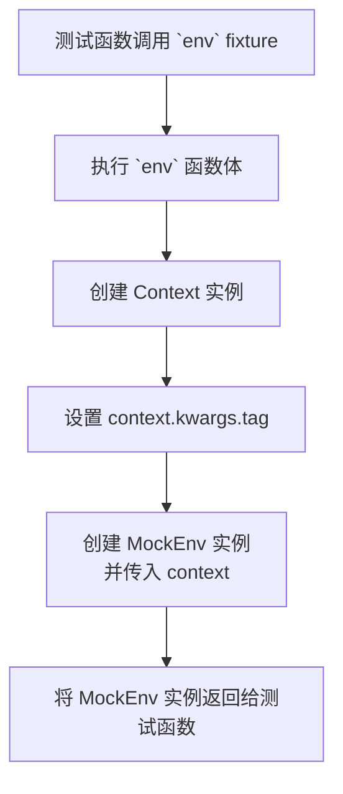

#### 带注释源码

```python
@pytest.fixture
def env():
    # 创建一个新的 Context 实例，用于配置环境上下文
    context = Context()
    # 设置上下文中的 tag 为当前文件名，通常用于日志或标识
    context.kwargs.tag = __file__
    # 创建并返回一个 MockEnv 实例，传入上面创建的 context
    # MockEnv 是 Environment 的子类，重写了 publish_message 方法用于测试
    return MockEnv(context=context)
```

### `test_add_role`

该函数是一个单元测试，用于验证 `Environment` 类的 `add_role` 方法的功能。它创建一个 `ProductManager` 角色实例，将其添加到给定的 `Environment` 实例中，然后断言该角色可以通过其设置字符串成功检索到。

参数：
- `env`：`Environment`，一个 `pytest` 夹具提供的 `Environment` 实例，作为测试的上下文环境。

返回值：`None`，该函数是一个测试函数，不返回任何值，其成功与否由 `assert` 语句决定。

#### 流程图

```mermaid
flowchart TD
    A[开始] --> B[创建 ProductManager 角色实例]
    B --> C[调用 env.add_role(role)]
    C --> D[调用 env.get_role 检索角色]
    D --> E{断言检索到的角色<br>与创建的角色相同}
    E -->|是| F[测试通过]
    E -->|否| G[测试失败]
```

#### 带注释源码

```python
def test_add_role(env: Environment):
    # 步骤 1: 创建一个 ProductManager 角色实例，并指定其属性。
    role = ProductManager(
        name="Alice", profile="product manager", goal="create a new product", constraints="limited resources"
    )
    # 步骤 2: 调用 Environment 实例的 add_role 方法，将创建的角色添加到环境中。
    env.add_role(role)
    # 步骤 3: 使用角色的设置字符串作为键，从环境中获取该角色。
    # 步骤 4: 断言获取到的角色与最初创建的角色是同一个对象，以验证 add_role 方法工作正常。
    assert env.get_role(str(role._setting)) == role
```

### `test_get_roles`

这是一个单元测试函数，用于测试 `Environment` 类的 `get_roles` 方法。它创建一个模拟环境，向其中添加两个 `Role` 实例，然后调用 `get_roles` 方法，并断言返回的角色字典与预期相符。

参数：

-   `env`：`Environment`，一个通过 `pytest.fixture` 提供的模拟环境实例。

返回值：`None`，这是一个测试函数，不返回任何值，其成功与否由内部的 `assert` 语句决定。

#### 流程图

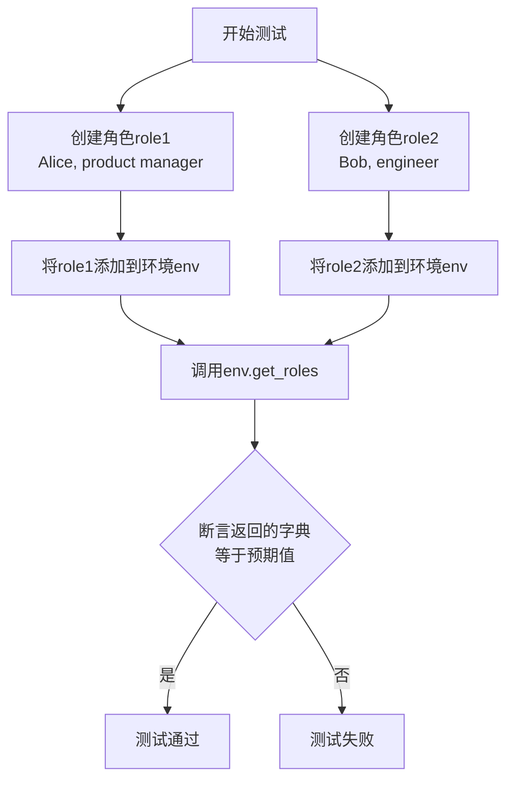

#### 带注释源码

```python
def test_get_roles(env: Environment):
    # 步骤1：创建第一个角色实例 `role1`，设定其属性。
    role1 = Role(name="Alice", profile="product manager", goal="create a new product", constraints="limited resources")
    # 步骤2：创建第二个角色实例 `role2`，设定其属性。
    role2 = Role(name="Bob", profile="engineer", goal="develop the new product", constraints="short deadline")
    # 步骤3：将 `role1` 添加到测试环境 `env` 中。
    env.add_role(role1)
    # 步骤4：将 `role2` 添加到测试环境 `env` 中。
    env.add_role(role2)
    # 步骤5：调用被测试方法 `env.get_roles()`，获取环境中的所有角色。
    roles = env.get_roles()
    # 步骤6：断言 `get_roles` 返回的字典与预期值相等。
    # 预期字典的键是角色的 `profile`，值是对应的角色对象。
    assert roles == {role1.profile: role1, role2.profile: role2}
```

### `test_publish_and_process_message`

该函数是一个异步单元测试，用于验证环境（`Environment`）中消息发布与处理的完整流程。它模拟了一个简化的产品开发场景：产品经理接收到一个用户需求消息，然后环境运行两个处理周期，验证消息能够被正确路由和处理，并最终确保历史记录为空（表明消息已被消费）。

参数：

- `env`：`Environment`，一个被`pytest.fixture`装饰器提供的`MockEnv`实例，作为测试的运行环境。

返回值：`None`，这是一个测试函数，不返回业务值，其成功与否由`assert`语句决定。

#### 流程图

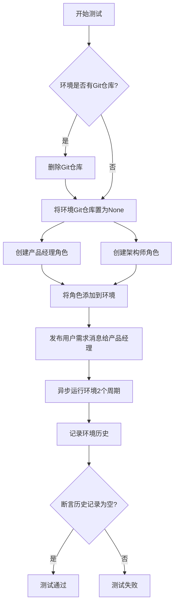

#### 带注释源码

```python
@pytest.mark.asyncio  # 标记此函数为异步测试
async def test_publish_and_process_message(env: Environment):
    # 1. 环境初始化：如果测试环境存在Git仓库，则清理它以保持测试独立性。
    if env.context.git_repo:
        env.context.git_repo.delete_repository()
        env.context.git_repo = None

    # 2. 角色创建：实例化产品经理和架构师角色，定义其基本属性。
    product_manager = ProductManager(name="Alice", profile="Product Manager", goal="做AI Native产品", constraints="资源有限")
    architect = Architect(
        name="Bob", profile="Architect", goal="设计一个可用、高效、较低成本的系统，包括数据结构与接口", constraints="资源有限，需要节省成本"
    )

    # 3. 角色注册：将创建的角色添加到测试环境中。
    env.add_roles([product_manager, architect])

    # 4. 消息发布：模拟用户发送一个需求消息，并指定接收者为产品经理。
    #    - content: 消息内容，描述需求。
    #    - cause_by: 消息的起因动作，这里是`UserRequirement`。
    #    - send_to: 消息的指定接收者。
    env.publish_message(UserMessage(content="需要一个基于LLM做总结的搜索引擎", cause_by=UserRequirement, send_to=product_manager))
    
    # 5. 环境运行：异步执行环境的处理循环，k=2表示最多运行2个周期或直到环境空闲。
    await env.run(k=2)
    
    # 6. 日志记录：打印环境的历史消息记录，用于调试。
    logger.info(f"{env.history}")
    
    # 7. 断言验证：测试的核心断言，检查环境的历史存储是否为空。
    #    如果消息被成功路由、处理并消费，历史记录应该被清空。
    assert len(env.history.storage) == 0
```

### `test_env`

这是一个参数化的异步测试函数，用于验证`MockEnv`环境在不同消息内容（`content`）和接收者（`send_to`）参数下的消息发布与处理流程。它模拟了一个包含多个角色（产品经理、架构师、项目经理、工程师、质量保证工程师）的协作环境，向指定角色发送消息，并运行环境直到所有消息处理完毕（环境空闲）。

参数：
- `content`：`str`，要发送的消息内容。
- `send_to`：`str`，消息接收者的标识符，通常是通过`any_to_str`函数转换的角色类名。

返回值：`None`，这是一个测试函数，不返回具体值，其目的是通过断言或运行流程来验证功能。

#### 流程图

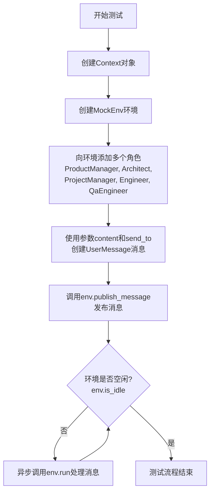

#### 带注释源码

```python
@pytest.mark.skip  # 标记此测试用例为跳过，不执行
@pytest.mark.asyncio  # 标记为异步测试
@pytest.mark.parametrize(  # 参数化测试，为以下每组参数运行一次测试
    ("content", "send_to"),
    [
        # 第一组参数：简单内容，发送给产品经理
        ("snake game", any_to_str(ProductManager)),
        # 第二组参数：详细需求，发送给产品经理
        (
            "Rewrite the PRD file of the project at '/Users/iorishinier/github/MetaGPT/workspace/snake_game', add 'moving enemy' to the original requirement",
            any_to_str(ProductManager),
        ),
        # 第三组参数：设计需求，发送给架构师
        (
            "Add 'random moving enemy, and dispears after 10 seconds' design to the project at '/Users/iorishinier/github/MetaGPT/workspace/snake_game'",
            any_to_str(Architect),
        ),
        # 第四组参数：任务重写，发送给项目经理
        (
            'Rewrite the tasks file of the project at "/Users/iorishinier/github/MetaGPT/workspace/snake_game"',
            any_to_str(ProjectManager),
        ),
        # 第五组参数：错误报告，发送给工程师
        (
            "src filename  is 'game.py', Uncaught SyntaxError: Identifier 'Position' has already been declared (at game.js:1:1), the project at '/Users/iorishinier/github/bak/MetaGPT/workspace/snake_game'",
            any_to_str(Engineer),
        ),
        # 第六组参数：测试重写，发送给质量保证工程师
        (
            "Rewrite the unit test of 'main.py' at '/Users/iorishinier/github/MetaGPT/workspace/snake_game'",
            any_to_str(QaEngineer),
        ),
    ],
)
async def test_env(content, send_to):
    # 1. 创建上下文对象
    context = Context()
    # 2. 使用该上下文创建模拟环境
    env = MockEnv(context=context)
    # 3. 向环境中添加一组预定义的角色
    env.add_roles(
        [
            ProductManager(context=context),
            Architect(context=context),
            ProjectManager(context=context),
            Engineer(n_borg=5, use_code_review=True, context=context),  # 工程师角色配置了特定参数
            QaEngineer(context=context, test_round_allowed=2),  # QA角色配置了测试轮次限制
        ]
    )
    # 4. 使用传入的测试参数创建用户消息
    msg = UserMessage(content=content, send_to=send_to)
    # 5. 将消息发布到环境中
    env.publish_message(msg)
    # 6. 循环运行环境，直到没有待处理的消息（环境空闲）
    while not env.is_idle:
        await env.run()
    pass  # 测试主体结束，流程验证通过即表示测试成功
```

### `MockEnv.publish_message`

该方法用于在模拟环境中发布消息。它会根据消息的接收者列表，将消息传递给相应的角色，并记录日志。如果没有找到接收者，会发出警告。对于特定类型的消息，会验证接收者数量是否为1。

参数：

- `message`：`Message`，要发布的消息对象
- `peekable`：`bool`，指示消息是否可被查看，默认为True

返回值：`bool`，始终返回True

#### 流程图

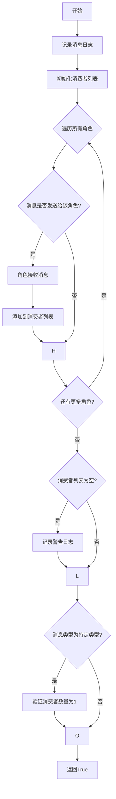

#### 带注释源码

```python
def publish_message(self, message: Message, peekable: bool = True) -> bool:
    # 记录消息的元数据和内容到日志
    logger.info(f"{message.metadata}:{message.content}")
    
    # 初始化消费者列表，用于存储接收消息的角色
    consumers = []
    
    # 遍历环境中的所有角色及其地址
    for role, addrs in self.member_addrs.items():
        # 检查消息是否应该发送给当前角色
        if is_send_to(message, addrs):
            # 角色接收消息
            role.put_message(message)
            # 将角色添加到消费者列表
            consumers.append(role)
    
    # 如果没有消费者接收消息，记录警告日志
    if not consumers:
        logger.warning(f"Message no recipients: {message.dump()}")
    
    # 如果消息是由UserRequirement或PrepareDocuments触发的，验证消费者数量为1
    if message.cause_by in [any_to_str(UserRequirement), any_to_str(PrepareDocuments)]:
        assert len(consumers) == 1
    
    # 始终返回True
    return True
```

### `MockEnv.add_role`

该方法用于向模拟环境（MockEnv）中添加一个角色（Role）实例，并建立角色与环境之间的双向关联。

参数：

- `role`：`Role`，要添加到环境中的角色实例

返回值：`None`，无返回值

#### 流程图

```mermaid
flowchart TD
    A[开始: MockEnv.add_role(role)] --> B[将role添加到self.roles字典<br>key: role.profile, value: role]
    B --> C[将role的env属性设置为self<br>即 role.env = self]
    C --> D[结束]
```

#### 带注释源码

```python
def add_role(self, role: Role):
    """
    向环境中添加一个角色。
    
    该方法执行两个关键操作：
    1. 将角色实例存储到环境的角色字典中，以角色的profile作为键。
    2. 建立角色与环境的反向引用，将角色的env属性设置为当前环境实例。
    
    参数:
        role (Role): 要添加到环境中的角色实例。
    """
    # 将角色添加到内部字典，使用角色的profile作为键以便后续查找
    self.roles[role.profile] = role
    # 建立角色到环境的引用，使角色能够感知其所属的环境
    role.env = self
```

### `MockEnv.add_roles`

该方法用于向模拟环境（MockEnv）中添加一个或多个角色（Role）实例。它继承自父类`Environment`的`add_roles`方法，用于批量注册角色到环境中，使得这些角色能够接收和处理环境中的消息。

参数：

- `roles`：`List[Role]`，一个包含要添加到环境中的`Role`实例的列表。

返回值：`None`，该方法没有返回值。

#### 流程图

```mermaid
flowchart TD
    A[开始: add_roles(roles)] --> B{检查roles是否为列表?}
    B -- 是 --> C[遍历roles列表]
    B -- 否 --> D[将单个角色包装成列表]
    D --> C
    C --> E[对每个角色调用add_role方法]
    E --> F[结束]
```

#### 带注释源码

```python
def add_roles(self, roles: List[Role]):
    """
    将多个角色添加到环境中。
    
    参数:
        roles: 一个Role实例的列表。如果传入的是单个Role实例，也会被处理。
    """
    # 如果传入的roles不是列表（即单个角色），则将其包装成列表以便统一处理。
    if not isinstance(roles, list):
        roles = [roles]
    # 遍历角色列表，对每个角色调用add_role方法将其添加到环境中。
    for role in roles:
        self.add_role(role)
```

### `MockEnv.get_role`

该方法用于根据给定的角色标识符（通常是角色的字符串表示）从环境中检索对应的角色对象。它继承自父类 `Environment` 的 `get_role` 方法，用于在模拟环境中查找并返回指定的角色实例。

参数：

- `role_desc`：`str`，角色的描述字符串，通常是通过 `str(role._setting)` 生成的唯一标识符。

返回值：`Role`，返回与给定描述匹配的角色对象；如果未找到，则返回 `None`。

#### 流程图

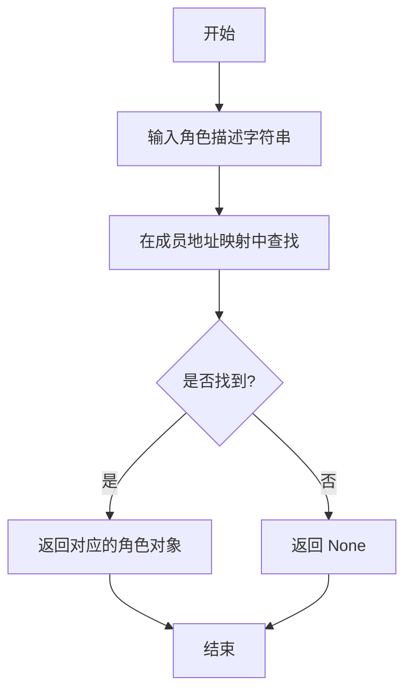

#### 带注释源码

```python
def get_role(self, role_desc: str) -> Role:
    """
    根据角色描述字符串获取对应的角色对象。

    参数:
        role_desc (str): 角色的描述字符串，通常是通过 `str(role._setting)` 生成的唯一标识符。

    返回:
        Role: 与给定描述匹配的角色对象；如果未找到，则返回 None。
    """
    # 从成员地址映射（member_addrs）中查找与角色描述匹配的键
    # 如果找到，返回对应的角色对象；否则返回 None
    return self.member_addrs.get(role_desc)
```

### `MockEnv.get_roles`

该方法用于获取当前环境中所有角色的字典，其中键为角色的`profile`属性，值为对应的`Role`对象。

参数：
- `self`：`MockEnv`，表示当前`MockEnv`类的实例。

返回值：`dict`，返回一个字典，其中键为角色的`profile`属性，值为对应的`Role`对象。

#### 流程图

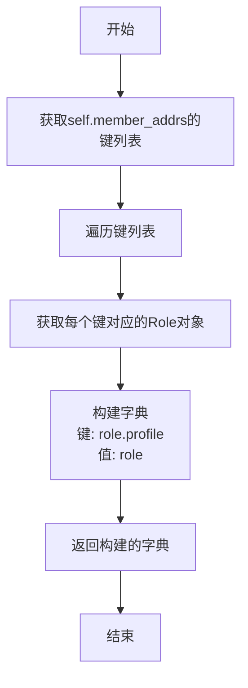

#### 带注释源码

```python
def get_roles(self):
    """
    获取当前环境中所有角色的字典。
    字典的键为角色的profile属性，值为对应的Role对象。
    
    Returns:
        dict: 包含所有角色的字典。
    """
    # 通过遍历self.member_addrs的键（即角色对象）来构建字典
    # 字典的键是角色的profile属性，值是角色对象本身
    return {role.profile: role for role in self.member_addrs}
```

### `MockEnv.run`

该方法继承自父类`Environment`的`run`方法，用于运行环境，处理消息队列中的消息，并驱动角色执行动作。它通过循环处理消息，直到达到指定的处理次数或环境空闲。

参数：
-  `self`：`MockEnv`，`MockEnv`类的实例
-  `k`：`int`，可选参数，默认为`1`。指定要处理的消息轮次数量。

返回值：`None`，无返回值

#### 流程图

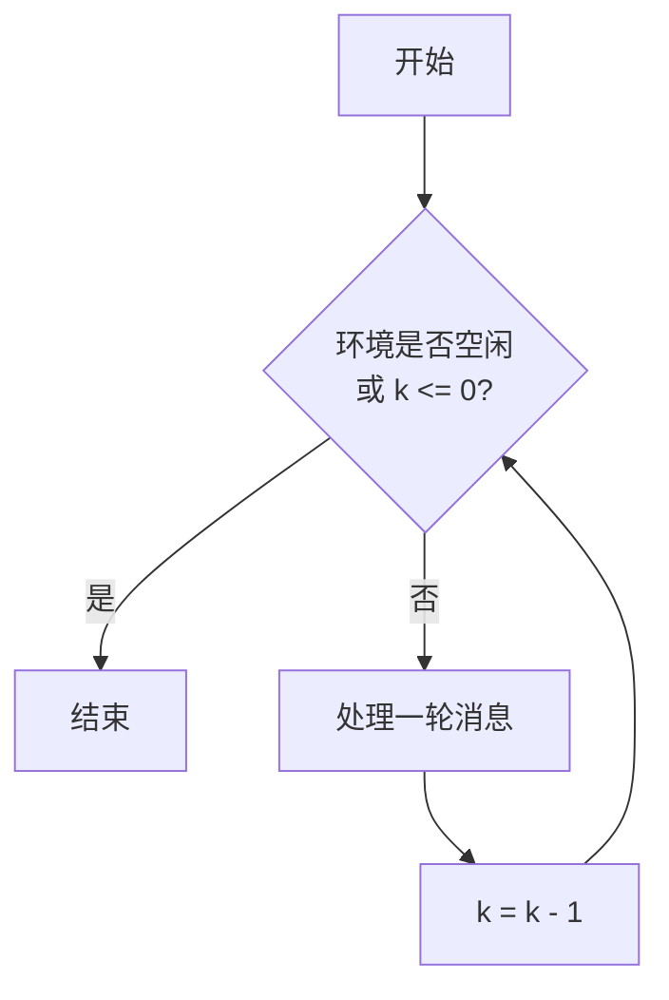

#### 带注释源码

```python
async def run(self, k=1):
    """
    运行环境，处理消息队列中的消息，并驱动角色执行动作。

    该方法会循环处理消息，直到达到指定的处理次数（k）或环境空闲。

    Args:
        k (int, optional): 要处理的消息轮次数量。默认为 1。
    """
    # 循环条件：环境不空闲且还有处理轮次（k > 0）
    while not self.is_idle and k > 0:
        # 处理一轮消息：遍历所有角色，让每个角色处理其消息
        for role in self.roles.values():
            await role._react()
        # 完成一轮处理后，轮次计数器减一
        k -= 1
```

### `MockEnv.publish_message`

该方法用于在模拟环境中发布消息。它会根据消息的接收者列表，将消息传递给对应的角色，并记录日志。如果没有找到接收者，会发出警告。对于特定类型的消息，会验证接收者数量是否为1。

参数：

- `message`：`Message`，要发布的消息对象
- `peekable`：`bool`，指示消息是否可被查看（默认为True）

返回值：`bool`，总是返回True

#### 流程图

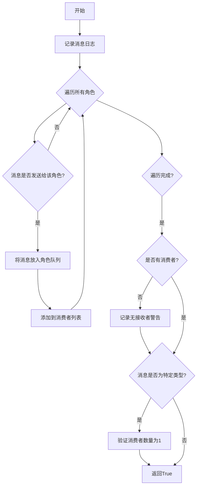

#### 带注释源码

```python
def publish_message(self, message: Message, peekable: bool = True) -> bool:
    # 记录消息的元数据和内容到日志
    logger.info(f"{message.metadata}:{message.content}")
    
    # 初始化消费者列表，用于记录哪些角色接收了消息
    consumers = []
    
    # 遍历环境中的所有角色及其地址
    for role, addrs in self.member_addrs.items():
        # 检查消息是否应该发送给当前角色
        if is_send_to(message, addrs):
            # 将消息放入角色的消息队列
            role.put_message(message)
            # 将角色添加到消费者列表
            consumers.append(role)
    
    # 如果没有找到任何接收者，记录警告
    if not consumers:
        logger.warning(f"Message no recipients: {message.dump()}")
    
    # 如果消息是由UserRequirement或PrepareDocuments触发的，验证只有一个接收者
    if message.cause_by in [any_to_str(UserRequirement), any_to_str(PrepareDocuments)]:
        assert len(consumers) == 1
    
    # 总是返回True
    return True
```

### `Environment.add_role`

该方法用于向环境（Environment）中添加一个角色（Role）实例，并将其注册到环境的成员地址映射和角色字典中，以便后续消息路由和管理。

参数：

- `role`：`Role`，要添加到环境中的角色实例

返回值：`None`，无返回值

#### 流程图

```mermaid
flowchart TD
    A[开始: add_role(role)] --> B{role 是否为 Role 实例?}
    B -- 是 --> C[将 role 添加到 self.roles 字典<br>key: role.profile<br>value: role]
    C --> D[将 role 添加到 self.member_addrs 字典<br>key: role<br>value: role.get_addresses()]
    D --> E[结束]
    B -- 否 --> F[抛出 TypeError 异常]
    F --> E
```

#### 带注释源码

```python
def add_role(self, role: Role):
    """
    向环境中添加一个角色。

    该方法执行以下操作：
    1. 检查传入的 `role` 参数是否为 `Role` 类的实例。
    2. 如果是，则将角色添加到 `self.roles` 字典中，键为角色的 `profile` 属性。
    3. 同时，将角色添加到 `self.member_addrs` 字典中，键为角色对象本身，值为角色通过 `get_addresses()` 方法获取的地址列表。
    4. 如果 `role` 不是 `Role` 实例，则抛出 `TypeError` 异常。

    参数:
        role (Role): 要添加到环境中的角色实例。

    返回:
        None: 此方法不返回任何值。

    异常:
        TypeError: 如果 `role` 不是 `Role` 类的实例。
    """
    # 参数类型检查：确保传入的 role 是 Role 类的实例
    if not isinstance(role, Role):
        raise TypeError(f"Expected a Role instance, but got {type(role)}")

    # 将角色添加到角色字典中，使用角色的 profile 作为键
    # 这便于通过角色类型（如“Product Manager”）快速查找角色
    self.roles[role.profile] = role

    # 将角色添加到成员地址映射中，键是角色对象本身，值是角色的地址列表
    # 这用于消息路由，确定哪些角色应该接收特定消息
    self.member_addrs[role] = role.get_addresses()
```

### `Environment.add_roles`

该方法用于向环境中批量添加多个角色，并建立角色与环境的双向关联。

参数：
- `roles`：`List[Role]`，需要添加到环境中的角色对象列表。

返回值：`None`，无返回值。

#### 流程图

```mermaid
flowchart TD
    A[开始: add_roles(roles)] --> B{roles 列表是否为空?}
    B -- 是 --> C[结束]
    B -- 否 --> D[遍历 roles 列表]
    D --> E[对每个角色 role<br>调用 add_role(role)]
    E --> F[结束]
```

#### 带注释源码

```python
def add_roles(self, roles: List[Role]):
    """
    批量添加角色到环境中。
    遍历传入的角色列表，对每个角色调用 add_role 方法。
    
    Args:
        roles (List[Role]): 要添加的角色列表。
    """
    # 遍历角色列表
    for role in roles:
        # 对每个角色调用 add_role 方法，将其添加到环境中
        self.add_role(role)
```

### `Environment.get_role`

该方法用于根据给定的角色标识符（通常是角色的字符串表示）从环境中检索对应的角色对象。

参数：

- `role_desc`：`str`，角色的描述字符串，通常是通过`str(role._setting)`或类似方式生成的唯一标识符。

返回值：`Optional[Role]`，如果找到匹配的角色则返回该角色对象，否则返回`None`。

#### 流程图

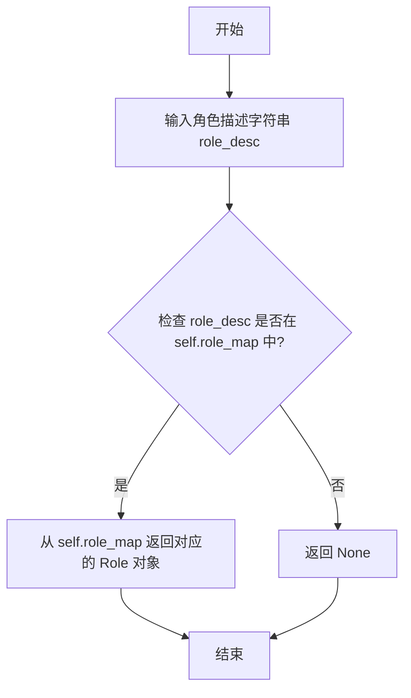

#### 带注释源码

```python
def get_role(self, role_desc: str) -> Optional[Role]:
    """
    根据角色描述字符串获取对应的角色对象。

    Args:
        role_desc (str): 角色的描述字符串，用于在角色映射中查找。

    Returns:
        Optional[Role]: 如果找到则返回对应的角色对象，否则返回 None。
    """
    # 从 self.role_map 字典中查找键为 role_desc 的值
    # 如果找不到，则返回 None
    return self.role_map.get(role_desc)
```

### `Environment.get_roles`

该方法用于获取环境中所有角色的字典，其中键为角色配置（`RoleSetting`）的字符串表示，值为对应的角色对象。

参数：
- 无

返回值：`Dict[str, Role]`，返回一个字典，键为角色配置（`RoleSetting`）的字符串表示，值为对应的角色对象。

#### 流程图

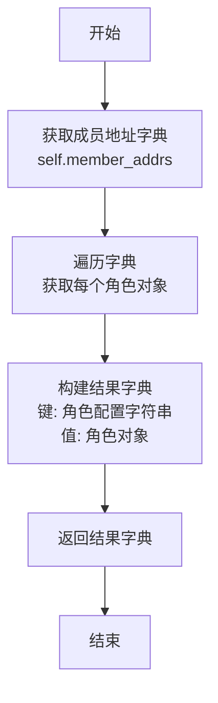

#### 带注释源码

```python
def get_roles(self) -> Dict[str, Role]:
    """
    获取环境中所有角色的字典。
    返回一个字典，其中键为角色配置（RoleSetting）的字符串表示，值为对应的角色对象。
    """
    # 返回成员地址字典，其中键为角色配置字符串，值为角色对象
    return self.member_addrs
```

### `Environment.run`

该方法用于运行环境中的角色，处理消息队列中的消息，直到达到指定的运行次数或环境空闲。

参数：

- `k`：`int`，可选参数，默认为`None`。指定运行的最大次数。如果为`None`，则运行直到环境空闲。

返回值：`None`，无返回值。

#### 流程图

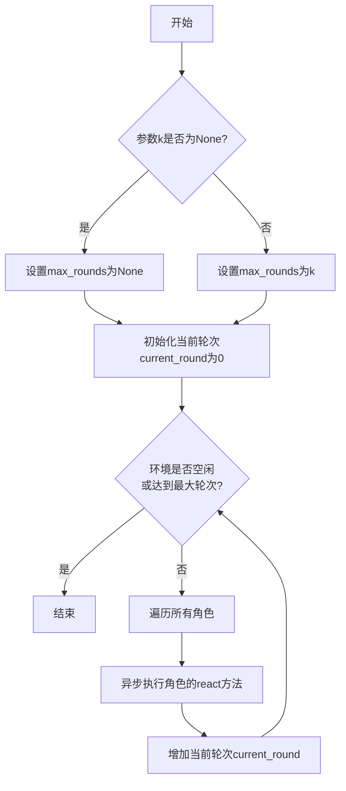

#### 带注释源码

```python
async def run(self, k: int = None):
    """
    运行环境中的角色，处理消息队列中的消息。

    参数:
        k (int, 可选): 运行的最大次数。如果为None，则运行直到环境空闲。
    """
    # 如果k不为None，则设置最大运行轮次为k，否则为None（表示无限运行直到空闲）
    max_rounds = k
    current_round = 0

    # 循环条件：环境不空闲，且（未设置最大轮次 或 当前轮次小于最大轮次）
    while not self.is_idle and (max_rounds is None or current_round < max_rounds):
        logger.debug(f"Round {current_round}")
        # 遍历环境中的所有角色
        for role in self.roles.values():
            # 异步执行每个角色的react方法，处理其消息队列
            await role.react()
        # 完成一轮处理后，轮次计数加一
        current_round += 1
```

### `Role.put_message`

该方法用于将消息放入角色的消息队列中，等待后续处理。它是角色间通信的基础，允许环境或其他角色向特定角色发送消息。

参数：

- `message`：`Message`，需要放入队列的消息对象

返回值：`None`，无返回值

#### 流程图

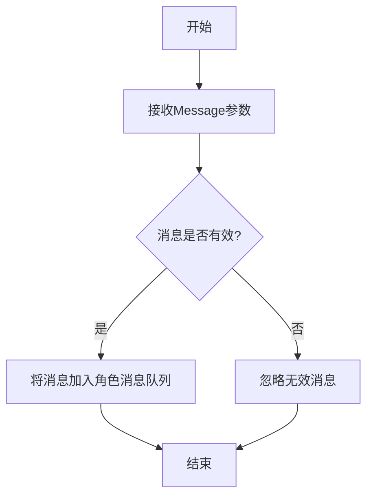

#### 带注释源码

```python
def put_message(self, message: Message):
    """
    将消息放入角色的消息队列
    
    Args:
        message: Message对象，包含消息内容和元数据
    """
    # 将消息添加到角色的消息队列中
    # 这里使用了角色的内部消息存储机制
    # 消息将在后续的react或run方法中被处理
    self._rc.memory.add(message)
```

### `ProductManager.put_message`

该方法用于将消息放入产品经理的消息队列中，等待后续处理。它接收一个 `Message` 对象，并将其添加到 `self._rc.memory` 中。

参数：

- `message`：`Message`，需要放入队列的消息对象。

返回值：`None`，无返回值。

#### 流程图

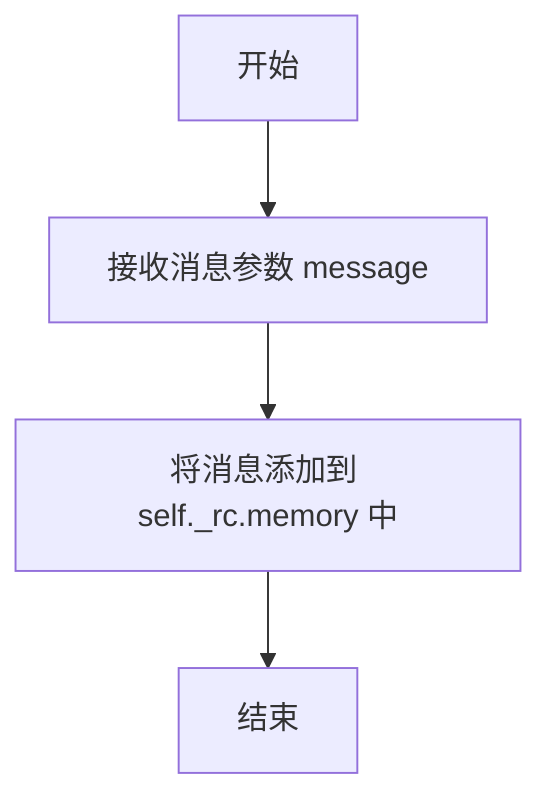

#### 带注释源码

```python
def put_message(self, message: Message):
    """
    将消息放入产品经理的消息队列中。
    
    参数:
        message (Message): 需要放入队列的消息对象。
    """
    # 将消息添加到角色上下文（RoleContext）的 memory 属性中
    self._rc.memory.add(message)
```

### `Architect.put_message`

该方法用于将消息放入架构师角色的消息队列中，以便后续处理。它是角色间通信机制的一部分，允许环境或其他角色向架构师发送消息。

参数：

- `message`：`Message`，要放入队列的消息对象，包含消息内容、元数据、发送者等信息。

返回值：`None`，无返回值。

#### 流程图

```mermaid
flowchart TD
    A[开始] --> B[接收Message参数]
    B --> C{消息是否有效?}
    C -- 是 --> D[将消息添加到<br>self.rc.memory消息队列]
    D --> E[结束]
    C -- 否 --> F[忽略或记录错误]
    F --> E
```

#### 带注释源码

```python
def put_message(self, message: Message):
    """
    将消息放入角色的消息队列。
    
    参数:
        message (Message): 要放入队列的消息对象。
    """
    # 调用角色上下文（RoleContext）中内存（memory）的add_message方法
    # 将传入的message对象添加到内部的消息存储中
    self.rc.memory.add_message(message)
```

### `ProjectManager.put_message`

该方法用于将消息放入ProjectManager角色的消息队列中，等待后续处理。

参数：
- `message`：`Message`，需要放入队列的消息对象

返回值：`None`，无返回值

#### 流程图

```mermaid
flowchart TD
    A[开始] --> B[接收Message参数]
    B --> C{消息是否有效?}
    C -->|是| D[将消息添加到<br>self.rc.memory消息队列]
    D --> E[结束]
    C -->|否| F[忽略无效消息]
    F --> E
```

#### 带注释源码

```python
def put_message(self, message: Message):
    """
    将消息放入ProjectManager的消息队列
    
    Args:
        message (Message): 需要处理的消息对象
        
    Returns:
        None: 无返回值
    """
    # 调用父类Role的put_message方法
    # 将消息添加到self.rc.memory中
    super().put_message(message)
```

**说明**：
1. 该方法继承自`Role`基类的`put_message`方法
2. 主要功能是将传入的`Message`对象存储到角色的消息队列中
3. 消息队列存储在`self.rc.memory`中，这是角色上下文的一部分
4. 该方法通常由环境(Environment)在分发消息时调用
5. 消息后续会通过角色的`_observe`方法被消费和处理

### `Engineer.put_message`

该方法用于将消息放入工程师角色的消息队列中，以便后续处理。它接收一个消息对象，并将其添加到内部的消息列表中。

参数：

- `message`：`Message`，需要放入队列的消息对象

返回值：`None`，无返回值

#### 流程图

```mermaid
flowchart TD
    A[开始] --> B[接收消息参数]
    B --> C[将消息添加到内部消息列表]
    C --> D[结束]
```

#### 带注释源码

```python
def put_message(self, message: Message):
    """
    将消息放入工程师角色的消息队列中。
    
    参数:
        message (Message): 需要放入队列的消息对象。
    """
    # 将传入的消息添加到内部的消息列表中
    self._rc.memory.add(message)
```

### `QaEngineer.put_message`

该方法用于将消息放入 QA 工程师角色的消息队列中，以便后续处理。

参数：

- `message`：`Message`，需要放入队列的消息对象

返回值：`None`，无返回值

#### 流程图

```mermaid
flowchart TD
    Start[开始] --> CheckMsg{检查消息是否有效}
    CheckMsg -->|有效| AddToQueue[将消息添加到消息队列]
    AddToQueue --> End[结束]
    CheckMsg -->|无效| LogWarning[记录警告日志]
    LogWarning --> End
```

#### 带注释源码

```python
def put_message(self, message: Message):
    """
    将消息放入 QA 工程师的消息队列中
    
    Args:
        message (Message): 需要处理的消息对象
    """
    # 检查消息是否有效
    if not message:
        logger.warning("收到空消息，忽略")
        return
    
    # 将消息添加到消息队列
    self._rc.memory.add(message)
    
    # 记录调试信息
    logger.debug(f"QA工程师 {self.name} 收到消息: {message.content[:50]}...")
```

### `Message.dump`

该方法用于将消息对象序列化为一个包含其关键信息的字典，便于日志记录或传输。

参数：

-  `self`：`Message`，消息对象实例本身

返回值：`dict`，包含消息元数据、内容、发送者、接收者、起因等关键信息的字典

#### 流程图

```mermaid
flowchart TD
    A[开始] --> B[创建空字典 result]
    B --> C[将 metadata 存入 result]
    C --> D[将 content 存入 result]
    D --> E[将 role 存入 result]
    E --> F[将 cause_by 存入 result]
    F --> G[将 sent_from 存入 result]
    G --> H[将 send_to 存入 result]
    H --> I[返回 result 字典]
    I --> J[结束]
```

#### 带注释源码

```python
def dump(self) -> dict:
    """
    将消息对象序列化为字典。
    返回一个包含消息核心字段的字典，用于调试或持久化。
    """
    return {
        "metadata": self.metadata,  # 消息的元数据，通常包含ID、时间戳等
        "content": self.content,    # 消息的实际内容
        "role": self.role,          # 发送消息的角色标识
        "cause_by": self.cause_by,  # 触发此消息的上一个动作或消息类型
        "sent_from": self.sent_from,# 消息发送者的标识
        "send_to": self.send_to,    # 消息预期接收者的标识
    }
```

### `UserMessage.dump`

该方法用于将 `UserMessage` 对象序列化为一个字典，以便于存储、传输或日志记录。它提取消息的关键属性，包括内容、原因、发送目标、指导信息以及元数据，并将它们组织成一个结构化的字典返回。

参数：
-  `self`：`UserMessage`，当前 `UserMessage` 实例

返回值：`dict`，一个包含消息核心信息的字典，键包括 `content`, `cause_by`, `send_to`, `guidance`, `metadata`。

#### 流程图

```mermaid
flowchart TD
    A[开始] --> B[获取消息内容<br>self.content]
    B --> C[获取消息原因<br>self.cause_by]
    C --> D[获取消息发送目标<br>self.send_to]
    D --> E[获取消息指导信息<br>self.guidance]
    E --> F[获取消息元数据<br>self.metadata]
    F --> G[组装字典<br>包含以上所有键值对]
    G --> H[返回字典]
    H --> I[结束]
```

#### 带注释源码

```python
def dump(self) -> dict:
    """
    将消息对象序列化为字典。
    提取消息的核心属性以便于存储或传输。
    """
    return {
        "content": self.content,  # 消息的文本内容
        "cause_by": self.cause_by,  # 触发此消息的原因或动作
        "send_to": self.send_to,  # 消息的预期接收者
        "guidance": self.guidance,  # 与消息相关的指导或上下文信息
        "metadata": self.metadata,  # 消息的附加元数据
    }
```

## 关键组件


### 环境 (Environment)

一个模拟多智能体协作环境的测试类，用于管理和协调不同角色（如产品经理、架构师）之间的消息传递与任务执行。

### 角色 (Role)

代表具有特定职责（如产品管理、架构设计）的智能体，是环境中的核心参与者，能够接收、处理和发送消息。

### 消息 (Message)

在环境中不同角色之间传递的信息单元，包含内容、发送者、接收者以及触发该消息的动作类型等元数据。

### 上下文 (Context)

为环境和角色提供共享的运行时配置与状态，例如项目存储库信息或全局标签。

### 消息路由与分发

通过`is_send_to`函数和`member_addrs`映射，实现将消息精准投递给指定接收者的机制。

### 异步任务运行循环

通过`env.run(k)`方法驱动环境中的所有角色异步处理其消息队列，模拟多智能体协作的推进过程。


## 问题及建议

### 已知问题

-   **测试用例 `test_publish_and_process_message` 的断言逻辑可能不准确**：该测试在运行环境后断言 `env.history.storage` 的长度为0。然而，`Environment` 的 `run` 方法通常会处理消息并产生新的消息，这些消息应被添加到历史记录中。断言长度为0可能意味着消息未被正确记录，或者测试的预期结果设置错误，这掩盖了环境消息处理流程可能存在的真实问题。
-   **`MockEnv.publish_message` 方法存在潜在的逻辑缺陷**：该方法在 `message.cause_by` 为特定类型时，断言 `consumers` 的长度为1。然而，如果消息的 `send_to` 字段指定了多个接收者，或者环境中的角色订阅规则（`member_addrs`）配置导致多个角色满足条件，此断言将失败，导致测试意外中断。这反映了对消息路由逻辑的假设可能过于严格，与实际设计不符。
-   **被跳过的测试 `test_env` 包含硬编码路径**：该测试用例使用 `@pytest.mark.skip` 装饰器跳过，但其参数化数据中包含了如 `‘/Users/iorishinier/github/...’` 的绝对路径。这些路径高度依赖于特定的本地开发环境，在其他机器上运行时会失败，降低了测试的可移植性和共享价值。
-   **`serdeser_path` 全局变量未被使用**：在文件顶部定义的 `serdeser_path` 变量在后续的测试代码中没有任何地方被引用或使用，属于无效的“死代码”，增加了代码的维护负担和阅读干扰。

### 优化建议

-   **修正测试断言以准确验证行为**：重新审查 `test_publish_and_process_message` 的测试目标。如果目的是验证消息被角色处理，应断言产生了特定的新消息或角色状态发生了变化，而非历史记录为空。建议将断言修改为检查是否有预期的消息产生或特定角色收到了消息。
-   **重构 `MockEnv.publish_message` 中的断言逻辑**：评估消息路由的设计意图。如果一条消息确实只应有一个接收者，应确保测试环境（`member_addrs`）和消息（`send_to`）的配置符合此前提，并将此作为明确的测试前置条件。或者，如果设计上允许多个接收者，则应移除或修改此断言，使其更健壮，例如改为 `assert len(consumers) > 0`。
-   **清理或参数化被跳过的测试**：对于 `test_env` 测试，应移除硬编码的绝对路径。可以将其改为使用相对路径、临时目录或通过配置文件获取的路径。在重新启用该测试前，确保其数据与路径无关。如果此测试仅用于历史调试且无长期价值，应考虑将其删除。
-   **移除未使用的变量和导入**：删除未使用的全局变量 `serdeser_path`。同时，使用IDE工具或`pylint`、`flake8`等检查器扫描并移除文件中其他未使用的导入（如`pathlib.Path`如果仅用于定义已删除的变量），以保持代码简洁。
-   **增强测试的隔离性与可重复性**：在 `test_publish_and_process_message` 中，直接操作 `env.context.git_repo` 并赋值为 `None` 的方式侵入性较强。建议使用 `pytest` 的 `monkeypatch` fixture 或创建独立的测试上下文（Context）来更好地隔离测试环境，避免测试间的副作用。
-   **补充关键场景的测试覆盖**：当前测试主要覆盖了添加角色、发布消息和基本运行流程。建议增加更多边界条件和异常场景的测试，例如：向不存在的角色发送消息、测试 `Environment` 的序列化/反序列化功能（这可能正是 `serdeser_path` 原本的用途）、测试环境在空闲状态（`is_idle`）下的行为等。

## 其它


### 设计目标与约束

本测试文件旨在验证`Environment`类及其子类`MockEnv`的核心功能，包括角色管理、消息发布与处理机制。设计目标包括：1) 验证环境能够正确添加和检索角色；2) 测试消息在角色间的路由与消费逻辑；3) 验证异步消息处理流程的正确性。主要约束包括：1) 使用`pytest`框架进行单元和异步测试；2) 通过`MockEnv`模拟真实环境以隔离外部依赖；3) 测试用例需覆盖正常流程和边界条件（如无接收者的消息）。

### 错误处理与异常设计

测试文件中的错误处理主要体现在：1) 当消息无接收者时，`MockEnv.publish_message`方法会记录警告日志但不会抛出异常，确保测试流程不被中断；2) 对于特定类型的消息（如`UserRequirement`、`PrepareDocuments`），通过`assert`语句验证其消费者数量必须为1，若不符合则测试失败；3) 在`test_publish_and_process_message`中，通过条件判断清理可能存在的`git_repo`资源，避免环境残留影响测试。整体设计倾向于让测试在遇到非预期行为时快速失败，便于问题定位。

### 数据流与状态机

测试中的数据流围绕`Environment`的`history`和`member_addrs`状态展开：1) 初始状态为空环境；2) 通过`add_role`或`add_roles`添加角色，更新`member_addrs`映射；3) 调用`publish_message`发布消息，根据消息的`send_to`字段和`is_send_to`逻辑确定消费者角色，并将消息存入角色的内部队列；4) 调用`run`方法触发角色处理其队列中的消息，处理后的消息可能被再次发布，形成循环，直到环境空闲（`is_idle`为True）。`test_publish_and_process_message`测试了从需求提出到多轮处理的数据流完整性。

### 外部依赖与接口契约

测试文件的外部依赖包括：1) `metagpt`模块的多个类（如`Environment`, `Context`, 各种`Role`子类, `Message`等），测试基于这些类的公开接口（如`add_role`, `publish_message`, `run`）；2) `pytest`框架，用于测试组织、异步支持和参数化；3) `pathlib.Path`，用于构建序列化/反序列化存储路径。接口契约主要体现在：测试假设`Environment`及其相关类（如`Role`）的行为符合其设计文档，例如`publish_message`会调用符合条件的角色的`put_message`方法。

### 测试策略与覆盖范围

测试策略采用分层方法：1) 单元测试（如`test_add_role`, `test_get_roles`）验证环境的基础管理功能；2) 集成测试（如`test_publish_and_process_message`）验证多个组件（环境、角色、消息）的协同工作；3) 参数化测试（`test_env`）用于覆盖多种输入场景。覆盖范围包括：角色增删查、消息路由、异步处理循环。被跳过的`test_env`测试表明存在尚未稳定或环境特定的场景。测试通过断言（`assert`）和日志输出作为验证手段。

    