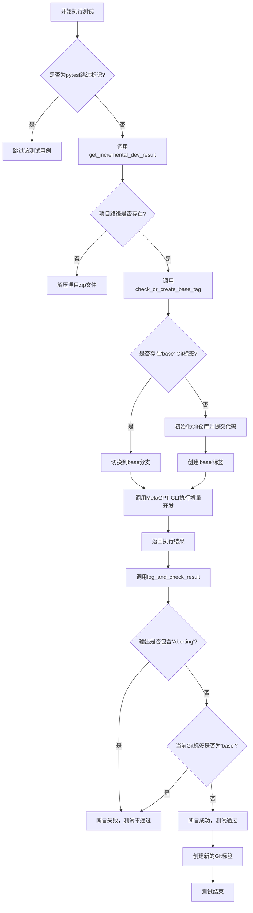
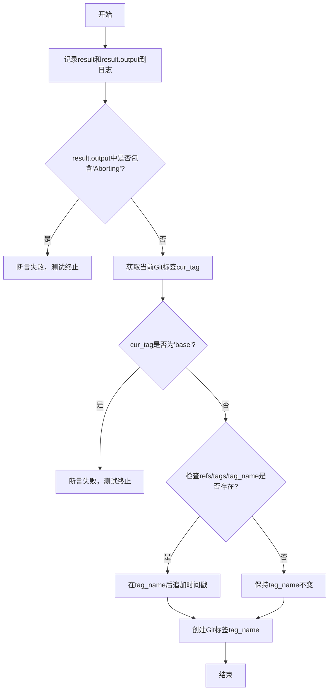
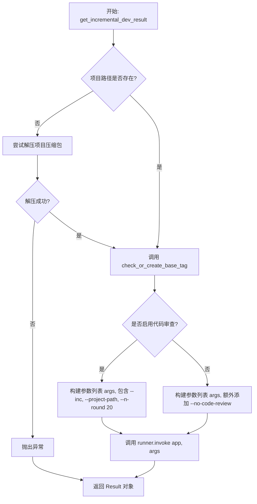
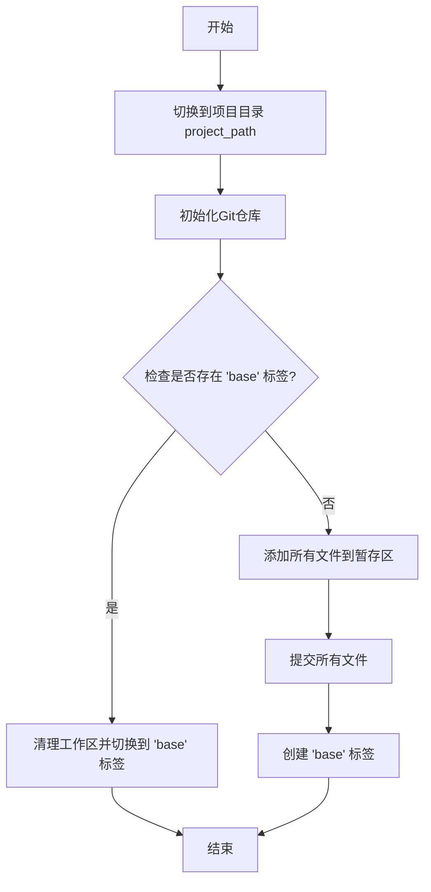

# `.\MetaGPT\tests\metagpt\test_incremental_dev.py` 详细设计文档

该代码是一个用于测试增量开发功能的Python测试脚本。它通过模拟一系列软件项目的增量需求（如为计算器添加新运算、为游戏添加图形界面等），调用MetaGPT框架的命令行接口来自动化执行代码生成、代码审查和版本控制操作。核心功能是验证在已有代码基础上，AI智能体能否正确理解新需求并生成符合预期的增量代码，同时通过Git标签管理测试状态。

## 整体流程



## 类结构

```
test_incremental_dev.py (主测试模块)
├── 全局变量: runner, IDEAS, PROJECT_NAMES
├── 测试函数: test_simple_add_calculator, test_number_guessing_game, test_word_cloud, test_gomoku, test_dice_simulator_new, test_refined_pygame_2048, test_refined_snake_game
├── 辅助函数: log_and_check_result, get_incremental_dev_result, check_or_create_base_tag
```

## 全局变量及字段


### `runner`
    
用于测试Typer CLI应用程序的命令行运行器实例

类型：`typer.testing.CliRunner`
    


### `IDEAS`
    
存储增量开发测试用例需求描述的字符串列表

类型：`List[str]`
    


### `PROJECT_NAMES`
    
存储与IDEAS对应的项目名称的字符串列表

类型：`List[str]`
    


    

## 全局函数及方法

### `test_simple_add_calculator`

这是一个使用 `pytest` 框架编写的测试函数，用于测试“简单加法计算器”项目的增量开发流程。它通过调用 `get_incremental_dev_result` 函数，传入预定义的增量开发想法和项目名称，来模拟一次增量开发过程，并对开发结果进行日志记录和验证。

参数：
-  `idea`：`str`，预定义的增量开发需求描述，用于驱动开发过程。
-  `project_name`：`str`，待进行增量开发的项目名称，用于定位项目路径。

返回值：`None`，该函数不返回任何值，其主要功能是执行测试断言。

#### 流程图

```mermaid
flowchart TD
    A[开始测试<br>test_simple_add_calculator] --> B[调用 get_incremental_dev_result<br>传入 IDEAS[0] 和 PROJECT_NAMES[0]]
    B --> C{增量开发执行成功?}
    C -- 是 --> D[调用 log_and_check_result<br>记录并检查结果]
    C -- 否 --> E[测试失败]
    D --> F{结果检查通过?}
    F -- 是 --> G[测试通过]
    F -- 否 --> E
    E --> H[测试结束]
    G --> H
```

#### 带注释源码

```python
@pytest.mark.skip  # 使用 pytest 装饰器标记此测试用例为“跳过”，在常规测试运行中不会执行。
def test_simple_add_calculator():
    # 调用 get_incremental_dev_result 函数，启动对“简单加法计算器”项目的增量开发流程。
    # 传入参数：IDEAS[0]（第一个增量想法）和 PROJECT_NAMES[0]（对应的项目名“simple_add_calculator”）。
    result = get_incremental_dev_result(IDEAS[0], PROJECT_NAMES[0])
    # 调用 log_and_check_result 函数，对增量开发的结果进行日志记录和验证。
    # 该函数会检查开发过程中是否出现“Aborting”错误，并验证Git仓库的标签状态。
    log_and_check_result(result)
```

### `test_number_guessing_game`

这是一个使用 `pytest` 框架编写的测试函数，用于测试“猜数字游戏”项目的增量开发流程。它通过调用 `get_incremental_dev_result` 函数，传入特定的需求描述和项目名称，来模拟一个增量开发过程，并最终通过 `log_and_check_result` 函数记录和验证开发结果。

参数：

- `无显式参数`：`None`，这是一个 `pytest` 测试函数，不接收外部参数。它使用模块内定义的常量 `IDEAS[1]` 和 `PROJECT_NAMES[1]` 作为内部逻辑的输入。

返回值：`None`，`pytest` 测试函数通常不显式返回值，其执行结果（成功或失败）由 `assert` 语句和 `pytest` 框架本身管理。

#### 流程图

```mermaid
flowchart TD
    A[开始测试<br>test_number_guessing_game] --> B[调用 get_incremental_dev_result<br>传入 IDEA[1] 和 PROJECT_NAMES[1]]
    B --> C{增量开发过程执行成功?}
    C -- 是 --> D[调用 log_and_check_result<br>记录并验证结果]
    C -- 否 --> E[测试失败<br>pytest 捕获异常或断言失败]
    D --> F{结果验证通过?}
    F -- 是 --> G[测试通过]
    F -- 否 --> E
```

#### 带注释源码

```python
@pytest.mark.skip  # 使用 pytest 装饰器标记此测试用例为“跳过”，执行测试套件时会忽略此函数。
def test_number_guessing_game():
    # 调用 get_incremental_dev_result 函数，启动对“猜数字游戏”项目的增量开发测试。
    # 参数 IDEAS[1] 是需求描述：“为猜数字游戏添加图形界面功能...”
    # 参数 PROJECT_NAMES[1] 是项目名称：“number_guessing_game”
    result = get_incremental_dev_result(IDEAS[1], PROJECT_NAMES[1])
    
    # 调用 log_and_check_result 函数，处理上一步返回的结果。
    # 该函数会记录日志，并根据结果内容（如是否包含“Aborting”）和 Git 仓库状态来判断测试是否通过。
    log_and_check_result(result)
```

### `test_word_cloud`

该函数是一个使用 `pytest` 框架编写的测试用例，用于测试“词云”项目的增量开发功能。它通过调用 `get_incremental_dev_result` 函数，传入特定的需求描述和项目名称，来模拟对“词云”项目进行功能增强（添加移除停用词功能）的自动化开发过程，并验证开发结果。

参数：

-  `无显式参数`：`None`，该函数是 `pytest` 测试用例，不接受外部参数。

返回值：`None`，`pytest` 测试用例通常不显式返回值，其执行结果（通过或失败）由 `pytest` 框架管理。

#### 流程图

```mermaid
flowchart TD
    A[开始测试 test_word_cloud] --> B[调用 get_incremental_dev_result<br>传入 IDEAS[2] 和 PROJECT_NAMES[2]]
    B --> C{get_incremental_dev_result 执行成功?}
    C -- 是 --> D[调用 log_and_check_result<br>传入开发结果 result]
    C -- 否 --> E[测试失败<br>抛出异常]
    D --> F{log_and_check_result 验证通过?}
    F -- 是 --> G[测试通过]
    F -- 否 --> E
    E --> H[测试结束]
    G --> H
```

#### 带注释源码

```python
@pytest.mark.skip  # 使用 pytest.mark.skip 装饰器，表示默认跳过此测试
def test_word_cloud():
    # 调用 get_incremental_dev_result 函数，启动对“词云”项目的增量开发。
    # IDEAS[2] 是需求描述：“为词云添加移除停用词功能”。
    # PROJECT_NAMES[2] 是项目名称：“word_cloud”。
    result = get_incremental_dev_result(IDEAS[2], PROJECT_NAMES[2])
    
    # 调用 log_and_check_result 函数，对开发结果进行日志记录和验证。
    # 验证内容包括：检查输出中是否包含“Aborting”（表示失败），
    # 以及检查 Git 仓库是否成功创建了新的提交和标签。
    log_and_check_result(result)
```

### `test_gomoku`

该函数是一个使用 `pytest` 框架编写的测试用例，用于测试“五子棋”项目的增量开发功能。它通过调用 `get_incremental_dev_result` 函数，传入特定的需求描述和项目名称，来模拟对现有五子棋项目进行功能增强（添加固定难度级别的AI对手）的自动化开发流程，并验证开发结果。

参数：

- `无显式参数`：`无`，这是一个 `pytest` 测试函数，不直接接受参数。它通过闭包使用全局变量 `IDEAS` 和 `PROJECT_NAMES` 中的特定索引值。

返回值：`None`，`pytest` 测试函数通常不显式返回值，其成功与否通过断言（`assert`）或异常来判定。

#### 流程图

```mermaid
flowchart TD
    A[开始测试 test_gomoku] --> B[调用 get_incremental_dev_result<br>传入 IDEA[3] 和 PROJECT_NAMES[3]]
    B --> C{get_incremental_dev_result 执行成功?}
    C -- 是 --> D[调用 log_and_check_result<br>处理并验证结果]
    C -- 否 --> E[测试失败<br>抛出异常]
    D --> F{log_and_check_result 验证通过?}
    F -- 是 --> G[测试通过]
    F -- 否 --> E
    E --> H[测试失败]
    G --> I[结束]
    H --> I
```

#### 带注释源码

```python
@pytest.mark.skip  # 使用 pytest.mark.skip 装饰器，表示默认跳过此测试，不执行。
def test_gomoku():
    # 调用 get_incremental_dev_result 函数，启动增量开发流程。
    # 参数1: IDEAS[3] -> 对应“为五子棋添加固定难度级别的AI对手”的需求描述。
    # 参数2: PROJECT_NAMES[3] -> 对应项目名称“Gomoku”。
    result = get_incremental_dev_result(IDEAS[3], PROJECT_NAMES[3])
    # 调用 log_and_check_result 函数，对增量开发的结果进行日志记录和验证。
    # 验证内容包括检查输出中是否有“Aborting”错误信息，以及检查Git仓库的标签状态。
    log_and_check_result(result)
```

### `test_dice_simulator_new`

这是一个使用 pytest 框架编写的测试函数，用于测试“骰子模拟器”项目的增量开发功能。它遍历两个不同的需求想法（IDEAS[4]和IDEAS[5]），分别对同一个项目（PROJECT_NAMES[4]和PROJECT_NAMES[5]，均为`dice_simulator_new`）执行增量开发流程，并验证结果。

参数：
-  `self`：`pytest` 测试类实例的隐式参数，类型为 `Any`，表示测试函数所属的测试类实例。
-  `i`：`int`，在内部循环中使用的迭代索引，用于生成唯一的标签名。
-  `idea`：`str`，在内部循环中从 `IDEAS` 列表获取的需求描述。
-  `project_name`：`str`，在内部循环中从 `PROJECT_NAMES` 列表获取的项目名称。

返回值：`None`，该函数不返回任何值，其目的是执行测试断言。

#### 流程图

```mermaid
flowchart TD
    A[开始测试 test_dice_simulator_new] --> B{遍历 IDEAS[4:6] 和 PROJECT_NAMES[4:6]};
    B --> C[获取当前迭代的 idea 和 project_name];
    C --> D[调用 get_incremental_dev_result<br/>执行增量开发];
    D --> E[调用 log_and_check_result<br/>记录并检查结果];
    E --> F{是否还有下一个迭代?};
    F -- 是 --> C;
    F -- 否 --> G[测试函数结束];
```

#### 带注释源码

```python
@pytest.mark.skip  # 标记此测试用例为跳过状态，执行测试套件时会忽略此函数
def test_dice_simulator_new():
    # 使用 enumerate 遍历 IDEAS 列表中索引 4 到 5（不包含6）的元素，
    # 以及 PROJECT_NAMES 列表中对应的元素。
    # start=1 使迭代索引 i 从 1 开始计数。
    for i, (idea, project_name) in enumerate(zip(IDEAS[4:6], PROJECT_NAMES[4:6]), start=1):
        # 调用 get_incremental_dev_result 函数，传入当前迭代的需求和项目名，
        # 执行具体的增量开发流程，并返回结果对象。
        result = get_incremental_dev_result(idea, project_name)
        # 调用 log_and_check_result 函数，传入结果对象和一个由 "refine_" 和
        # 当前迭代索引 i 组成的字符串作为标签名，用于记录日志和验证开发结果。
        log_and_check_result(result, "refine_" + str(i))
```

### `test_refined_pygame_2048`

该函数是一个Pytest测试函数，用于测试对`pygame_2048`项目的两次增量开发迭代。它遍历两个增量开发想法（IDEAS[6]和IDEAS[7]）及其对应的项目名称（PROJECT_NAMES[6]和PROJECT_NAMES[7]），对每个想法执行增量开发流程，并记录和检查结果。该函数被`@pytest.mark.skip`装饰器标记，因此在常规测试运行中会被跳过。

参数：
- 无显式参数。该函数是一个测试用例，不接收外部参数。

返回值：`None`，该函数不返回任何值，其主要作用是执行测试断言。

#### 流程图

```mermaid
graph TD
    A[开始 test_refined_pygame_2048] --> B{遍历 IDEAS[6:8] 和 PROJECT_NAMES[6:8]}；
    B -->|对于每一对 idea, project_name| C[调用 get_incremental_dev_result]；
    C --> D[调用 log_and_check_result]；
    D --> E{检查结果并标记Git}；
    E -->|成功| F[继续下一次迭代]；
    E -->|失败| G[断言失败]；
    F --> B；
    B -->|遍历结束| H[测试结束]；
```

#### 带注释源码

```python
@pytest.mark.skip  # 标记此测试用例在运行pytest时被跳过
def test_refined_pygame_2048():
    # 遍历两个增量开发想法和对应的项目名称
    # IDEAS[6:8] 包含两个想法：将2048目标分数改为4096并调整界面大小，以及添加历史分数记录板
    # PROJECT_NAMES[6:8] 包含两个相同的项目名：'pygame_2048'
    for i, (idea, project_name) in enumerate(zip(IDEAS[6:8], PROJECT_NAMES[6:8]), start=1):
        # 1. 执行增量开发：传入当前想法和项目名，获取开发结果
        result = get_incremental_dev_result(idea, project_name)
        # 2. 记录结果并检查：传入结果和一个标签名（如'refine_1', 'refine_2'）
        log_and_check_result(result, "refine_" + str(i))
```

### `test_refined_snake_game`

这是一个使用 `pytest` 框架编写的测试函数，用于测试贪吃蛇游戏的增量开发功能。它通过遍历两个增量开发需求（IDEAS[8:10]）和对应的项目名称（PROJECT_NAMES[8:10]），依次调用 `get_incremental_dev_result` 函数来执行增量开发流程，并使用 `log_and_check_result` 函数来记录和验证每次开发的结果。

参数：
-  `idea`：`str`，增量开发的需求描述，从 `IDEAS` 列表中获取。
-  `project_name`：`str`，对应的项目名称，从 `PROJECT_NAMES` 列表中获取。

返回值：`None`，该函数不返回任何值，其主要功能是执行测试断言。

#### 流程图

```mermaid
flowchart TD
    A[开始测试 test_refined_snake_game] --> B{遍历 IDEAS[8:10] 和 PROJECT_NAMES[8:10]};
    B --> C[获取当前 idea 和 project_name];
    C --> D[调用 get_incremental_dev_result<br/>执行增量开发];
    D --> E[调用 log_and_check_result<br/>记录并检查结果];
    E --> F{是否还有下一个 idea?};
    F -- 是 --> C;
    F -- 否 --> G[测试结束];
```

#### 带注释源码

```python
@pytest.mark.skip  # 标记此测试用例为跳过状态，不执行
def test_refined_snake_game():
    # 遍历 IDEAS 列表中索引 8 到 10（不包含10）的需求和对应的项目名称
    for i, (idea, project_name) in enumerate(zip(IDEAS[8:10], PROJECT_NAMES[8:10]), start=1):
        # 调用 get_incremental_dev_result 函数，传入当前需求和项目名，执行增量开发
        result = get_incremental_dev_result(idea, project_name)
        # 调用 log_and_check_result 函数，传入开发结果和一个标签名（如 "refine_1"），进行结果记录和验证
        log_and_check_result(result, "refine_" + str(i))
```

### `log_and_check_result`

该函数用于记录增量开发测试的结果，并检查其执行状态。它首先将结果信息（包括原始结果和输出内容）记录到日志中，然后通过分析输出内容判断是否执行失败（即是否包含“Aborting”字符串）。如果执行成功，它会检查当前Git仓库的标签状态，确保不会创建重复的标签，并在成功通过所有检查后创建一个新的Git标签。

参数：

- `result`：`CliRunner.invoke`的返回结果对象，包含命令执行的输出和状态信息。
- `tag_name`：`str`，可选参数，默认为“refine”，用于指定要创建的Git标签的名称。

返回值：`None`，该函数不返回任何值，但会在检查失败时通过`assert False`触发测试失败，或在成功时创建Git标签。

#### 流程图



#### 带注释源码

```python
def log_and_check_result(result, tag_name="refine"):
    # 记录结果对象和其输出内容到日志
    logger.info(result)
    logger.info(result.output)
    # 检查输出中是否包含“Aborting”，如果包含则测试失败
    if "Aborting" in result.output:
        assert False
    else:
        # 获取当前Git仓库的最新标签
        cur_tag = subprocess.run(["git", "describe", "--tags"], capture_output=True, text=True).stdout.strip()
        # 如果当前标签是“base”，说明未成功创建新提交，测试失败
        if cur_tag == "base":
            assert False
        else:
            # 测试通过，继续执行
            assert True
            # 检查指定的标签名是否已存在，如果存在则在其后追加时间戳以避免冲突
            if subprocess.run(["git", "show-ref", "--verify", "--quiet", f"refs/tags/{tag_name}"]).returncode == 0:
                tag_name += str(int(time.time()))
            # 尝试创建新的Git标签
            try:
                subprocess.run(["git", "tag", tag_name], check=True)
            except subprocess.CalledProcessError as e:
                # 如果创建标签失败，抛出异常
                raise e
```

### `get_incremental_dev_result`

该函数是增量开发测试框架的核心执行器。它负责准备测试环境（包括解压项目、初始化Git仓库并打上基准标签），然后调用MetaGPT的CLI工具，以指定的增量开发模式（`--inc`）和项目路径，执行一个给定的开发需求（`idea`），并返回执行结果对象。

参数：

-  `idea`：`str`，一个描述增量开发需求的字符串，例如“为计算器添加减法、乘法和除法功能”。
-  `project_name`：`str`，与`idea`对应的项目名称，用于在测试数据目录中定位项目文件。
-  `use_review`：`bool`，可选参数，默认为`True`。指示是否在增量开发过程中启用代码审查步骤。

返回值：`typer.testing.Result`，一个包含CLI命令执行结果的对象，其中封装了退出码、标准输出、标准错误等信息。

#### 流程图



#### 带注释源码

```python
def get_incremental_dev_result(idea, project_name, use_review=True):
    # 1. 构建项目完整路径，基于常量 TEST_DATA_PATH 和子目录
    project_path = TEST_DATA_PATH / "incremental_dev_project" / project_name
    # 2. 检查项目目录是否存在
    if not project_path.exists():
        # 如果不存在，则尝试从同名的 .zip 文件解压
        try:
            # 优先使用 unzip 命令
            if shutil.which("unzip"):
                subprocess.run(["unzip", f"{project_path}.zip", "-d", str(project_path.parent)], check=True)
            # 如果 unzip 不可用，则尝试使用 tar 命令
            elif shutil.which("tar"):
                subprocess.run(["tar", "-xf", f"{project_path}.zip", "-C", str(project_path.parent)], check=True)
            logger.info(f"Extracted project {project_name} successfully.")
        except FileNotFoundError as e:
            # 两个解压命令都未找到
            raise FileNotFoundError(f"Neither 'unzip' nor 'tar' command found. Error: {e}")
        except subprocess.CalledProcessError as e:
            # 解压过程本身失败
            raise Exception(f"Failed to extract project {project_name}. Error: {e}")

    # 3. 确保项目目录是一个Git仓库，并存在名为'base'的标签，用于标识增量开发的起点
    check_or_create_base_tag(project_path)
    
    # 4. 构建调用MetaGPT CLI的参数列表
    # 核心参数：增量开发模式(--inc)，项目路径，迭代轮数(--n-round 20)
    args = [idea, "--inc", "--project-path", project_path, "--n-round", "20"]
    # 根据 use_review 参数决定是否禁用代码审查
    if not use_review:
        args.append("--no-code-review")
    
    # 5. 使用 CliRunner 调用主应用 (app)，并传入构建好的参数
    result = runner.invoke(app, args)
    
    # 6. 返回执行结果
    return result
```

### `check_or_create_base_tag`

该函数用于在指定的项目路径中初始化一个Git仓库，并确保存在一个名为“base”的Git标签。如果“base”标签不存在，它会将当前目录中的所有文件提交到Git仓库并创建该标签；如果标签已存在，它会尝试清理工作区并切换到与“base”标签关联的状态。

参数：
- `project_path`：`Path`，项目根目录的路径，函数将在此目录下执行Git操作。

返回值：`None`，该函数不返回任何值，其作用是通过Git命令操作项目仓库。

#### 流程图



#### 带注释源码

```python
def check_or_create_base_tag(project_path):
    # 将当前工作目录切换到指定的项目路径
    os.chdir(project_path)

    # 初始化一个Git仓库
    subprocess.run(["git", "init"], check=True)

    # 检查.gitignore文件是否存在，如果不存在则创建并添加注释
    subprocess.run(f"echo # Ignore these files or directories > {'.gitignore'}", shell=True)

    # 检查是否存在名为'base'的Git标签
    check_base_tag_cmd = ["git", "show-ref", "--verify", "--quiet", "refs/tags/base"]
    if subprocess.run(check_base_tag_cmd).returncode == 0:
        has_base_tag = True
    else:
        has_base_tag = False

    if has_base_tag:
        logger.info("Base tag exists")
        # 如果存在'base'标签，则尝试切换到该标签对应的状态
        try:
            # 检查当前工作区状态，如果有未提交的更改则清理
            status = subprocess.run(["git", "status", "-s"], capture_output=True, text=True).stdout.strip()
            if status:
                subprocess.run(["git", "clean", "-df"])
            # 强制切换到'base'标签
            subprocess.run(["git", "checkout", "-f", "base"], check=True)
            logger.info("Switched to base branch")
        except Exception as e:
            logger.error("Failed to switch to base branch")
            raise e

    else:
        logger.info("Base tag doesn't exist.")
        # 如果不存在'base'标签，则将当前所有文件添加到Git并提交，然后创建标签
        add_cmd = ["git", "add", "."]
        try:
            subprocess.run(add_cmd, check=True)
            logger.info("Files added successfully.")
        except subprocess.CalledProcessError as e:
            logger.error(f"Failed to add files: {e}")

        commit_cmd = ["git", "commit", "-m", "Initial commit"]
        try:
            subprocess.run(commit_cmd, check=True)
            logger.info("Committed all files with the message 'Initial commit'.")
        except subprocess.CalledProcessError as e:
            logger.error(f"Failed to commit: {e.stderr}")

        # 创建名为'base'的Git标签
        add_base_tag_cmd = ["git", "tag", "base"]

        # 检查标签创建命令是否成功执行
        try:
            subprocess.run(add_base_tag_cmd, check=True)
            logger.info("Added 'base' tag.")
        except Exception as e:
            logger.error("Failed to add 'base' tag.")
            raise e
```

## 关键组件


### 增量开发测试框架

该组件是一个基于pytest的自动化测试框架，用于验证MetaGPT软件公司的增量开发能力。它通过模拟用户输入不同的功能需求（IDEAS），对一系列预定义的基础项目（PROJECT_NAMES）进行迭代式功能增强测试，并利用Git进行版本控制和状态标记，以验证系统能否在现有代码基础上正确实现新的需求。

### 项目与需求定义

该组件预定义了两组核心数据：`IDEAS`（功能需求描述列表）和`PROJECT_NAMES`（对应的基础项目名称列表）。这些数据为测试用例提供了具体的输入，覆盖了从计算器、猜数字游戏到2048、贪吃蛇等多种应用场景的增量功能需求，用于系统性地测试增量开发流程。

### 测试用例组织

该组件通过多个被`@pytest.mark.skip`装饰的测试函数（如`test_simple_add_calculator`）来组织对不同项目的测试。每个测试函数调用核心的`get_incremental_dev_result`函数来执行一次增量开发流程，并使用`log_and_check_result`函数来验证执行结果和进行Git标签管理。

### 增量开发执行器

核心函数`get_incremental_dev_result`负责执行一次完整的增量开发测试。其流程包括：1) 确保测试项目存在（必要时解压）；2) 调用`check_or_create_base_tag`确保项目处于干净的“base”状态；3) 组装命令行参数并调用MetaGPT的主应用(`app`)来执行增量开发任务。它是连接测试框架与被测系统的桥梁。

### Git基线状态管理

函数`check_or_create_base_tag`负责管理测试项目的Git仓库状态，确保每次测试都从一个已知的、干净的基线开始。如果项目没有“base”标签，它会初始化仓库、提交所有文件并打上“base”标签；如果已有“base”标签，则强制检出到该状态并清理工作区。这是保证测试可重复性的关键。

### 结果验证与标签管理

函数`log_and_check_result`负责处理增量开发命令的执行结果。它会检查输出中是否包含“Aborting”以判断执行是否失败，并通过Git命令检查当前标签状态。如果执行成功且当前不是“base”标签，则认为测试通过，并尝试为本次成功的增量开发创建一个新的唯一标签（如`refine_1`），用于标记测试产生的新的代码状态。


## 问题及建议

### 已知问题

-   **硬编码的测试数据和逻辑耦合**：`IDEAS` 和 `PROJECT_NAMES` 列表被硬编码在测试文件中，并且与具体的测试函数（如 `test_dice_simulator_new`）逻辑紧密耦合。这使得添加、删除或修改测试用例变得困难，降低了测试的可维护性和可扩展性。
-   **重复的测试逻辑**：多个测试函数（如 `test_dice_simulator_new`、`test_refined_pygame_2048`、`test_refined_snake_game`）内部都包含循环调用 `get_incremental_dev_result` 和 `log_and_check_result` 的相似代码块，违反了DRY（Don‘t Repeat Yourself）原则，增加了代码冗余和维护成本。
-   **脆弱的Git操作和状态管理**：`check_or_create_base_tag` 函数直接使用 `os.chdir` 改变当前工作目录，并执行一系列 `subprocess` Git命令。这存在风险：1) 如果进程在目录更改后异常终止，可能影响后续操作；2) 对Git命令的成功与否依赖外部环境（如Git安装、权限）和仓库状态，错误处理不够健壮；3) 函数执行后未恢复原始工作目录，可能影响调用者。
-   **资源清理不彻底**：`get_incremental_dev_result` 函数在项目路径不存在时会解压ZIP文件，但测试结束后没有自动清理这些解压出的目录。长期运行可能导致测试数据堆积，占用磁盘空间。
-   **断言逻辑可能不准确**：`log_and_check_result` 函数中，判断测试成功的条件之一是检查Git当前标签是否为“base”，如果不是则断言成功。然而，标签非“base”并不直接等同于增量开发功能成功，可能只是Git操作成功，存在误判风险。
-   **异常处理粒度较粗**：部分 `subprocess.run` 调用虽然使用了 `check=True`，但捕获异常后仅进行日志记录或简单重抛，缺乏更细致的恢复或清理步骤，可能导致测试环境处于不一致状态。
-   **测试函数全部被跳过**：所有测试函数都被 `@pytest.mark.skip` 装饰，这意味着它们不会在常规测试套件中运行。这可能是临时的，但长期存在会掩盖测试的有效性，并可能使测试代码过时。

### 优化建议

-   **将测试数据外部化**：将 `IDEAS` 和 `PROJECT_NAMES` 等测试数据移至外部配置文件（如JSON、YAML）或通过 `pytest` 的 `@pytest.mark.parametrize` 装饰器进行参数化。这能提高数据的可管理性，并方便实现数据驱动的测试。
-   **重构重复测试逻辑**：创建一个公共的测试辅助函数或使用 `pytest` 的测试夹具（fixture）来封装 `get_incremental_dev_result` 和 `log_and_check_result` 的调用逻辑。每个具体的测试用例只需提供其特定的参数（如idea和project_name的索引或列表），从而消除代码重复。
-   **改进Git操作的安全性与隔离性**：
    -   考虑使用GitPython等库替代 `subprocess` 调用，以提供更Pythonic和安全的接口。
    -   在 `check_or_create_base_tag` 中，使用 `contextlib.chdir` 上下文管理器来安全地切换工作目录，确保退出时恢复原状。
    -   为关键的Git操作（如初始化、提交、打标签）增加更完善的回滚或状态验证机制。
-   **实现测试资源生命周期管理**：使用 `pytest` 的夹具（例如 `setup_method`/`teardown_method` 或 `@pytest.fixture`）在测试开始前准备环境（如解压项目），并在测试结束后清理临时文件和目录（如删除解压的项目文件夹、重置Git仓库状态）。
-   **增强测试断言**：在 `log_and_check_result` 中，除了检查Git标签，应增加对增量开发过程核心输出的验证。例如，可以解析 `result.output`，检查是否包含预期的成功关键词（如“Successfully”、“Done”），或验证生成的新代码文件/功能是否存在。
-   **细化异常处理与状态清理**：对可能失败的操作（如文件解压、Git命令）设计更精细的异常处理流程。在捕获异常后，不仅记录日志，还应尝试将测试环境恢复到已知的干净状态，避免影响后续测试。
-   **移除或管理跳过标记**：评估所有测试被跳过的原因。如果是临时性的，应计划在合适时机移除 `@pytest.mark.skip` 装饰器。如果需要条件跳过，可使用 `@pytest.mark.skipif` 并给出明确条件。确保测试套件能够反映代码的真实可测试状态。
-   **增加日志和调试信息**：在关键步骤（如开始解压、执行增量开发命令、进行Git操作前后）增加更详细的日志输出，便于测试失败时快速定位问题。

## 其它


### 设计目标与约束

本代码是一个用于测试增量开发流程的自动化测试脚本。其核心设计目标是验证一个名为`metagpt`的AI软件公司框架，在接收到新的功能需求（增量想法）后，能否在现有代码项目的基础上，自动完成代码的修改、提交和版本标记。主要约束包括：1) 测试依赖于外部压缩的项目文件（`.zip`）作为初始代码库；2) 测试过程需要完整的Git环境来模拟版本控制操作；3) 测试执行时间可能较长（每个测试用例最多20轮迭代）；4) 测试结果的成功与否依赖于`metagpt`框架输出的内容中是否包含“Aborting”关键词以及Git标签的创建状态。

### 错误处理与异常设计

代码中包含了多处显式的错误处理逻辑，主要围绕文件操作和子进程执行。在`get_incremental_dev_result`函数中，如果项目路径不存在，会尝试使用`unzip`或`tar`命令解压对应的`.zip`文件，若命令未找到或执行失败，会抛出`FileNotFoundError`或通用的`Exception`。在`check_or_create_base_tag`函数中，对`git init`、`git add`、`git commit`、`git tag`等Git命令的执行进行了`try-except`包裹，失败时会记录错误日志并抛出异常。在`log_and_check_result`函数中，对`git tag`命令的失败也进行了捕获。整体错误处理策略是：对于关键路径上的失败（如项目初始化、基础标签创建），直接抛出异常导致测试失败；对于非关键性的警告或信息，则通过`logger`记录。

### 数据流与状态机

脚本的数据流始于预定义的`IDEAS`（需求描述）和`PROJECT_NAMES`列表。每个测试用例函数（如`test_simple_add_calculator`）选取一对“需求-项目名”，传递给`get_incremental_dev_result`函数。该函数负责准备测试环境：检查并解压项目 -> 初始化Git仓库并确保存在“base”标签 -> 切换工作目录到该项目。然后，它构造命令行参数并调用`metagpt`框架的CLI入口（`app`）来执行增量开发。`metagpt`框架的执行结果（一个`CliRunner`的`Result`对象）被返回。接着，`log_and_check_result`函数处理该结果：检查输出中是否有“Aborting”以判断框架是否异常终止，并检查Git仓库的当前标签状态，最终创建一个新的唯一标签来标记本次测试运行后的代码状态。整个流程可以视为一个简单的线性状态机：`环境准备` -> `框架执行` -> `结果验证与标记`。

### 外部依赖与接口契约

1.  **外部系统/工具依赖**:
    *   **Git**: 必须安装在系统PATH中，用于版本控制操作（`init`, `add`, `commit`, `tag`, `checkout`, `describe`等）。
    *   **解压工具**: 需要`unzip`或`tar`命令之一，用于解压初始项目文件。
    *   **Python包**:
        *   `pytest`: 测试框架。
        *   `typer`: 用于调用被测试的CLI应用。
        *   `metagpt`: 被测试的核心框架，其CLI接口（`app`）是主要的调用对象。
2.  **文件/数据依赖**:
    *   `TEST_DATA_PATH / "incremental_dev_project" / {project_name}.zip`: 每个测试项目的初始代码压缩包。这是测试的输入数据，必须预先存在。
3.  **接口契约**:
    *   与`metagpt.software_company.app`的契约：该CLI应用接受特定的参数列表（`idea`, `--inc`, `--project-path`, `--n-round`, `--no-code-review`），并返回一个`typer.testing.CliRunner`可识别的`Result`对象。测试脚本依赖于其输出内容（`result.output`）和退出码（隐式地，通过`result`对象的状态）来判断执行成功与否。
    *   与Git的契约：脚本假设在一个干净的目录中操作Git命令，并依赖标准Git命令的行为和输出格式（例如`git describe --tags`返回当前标签）。

### 安全与合规性考虑

1.  **代码执行**: 脚本通过`subprocess.run`执行外部命令（`git`, `unzip`, `tar`）。虽然当前参数是硬编码或受控的，但仍需注意防止命令注入风险。在本脚本中，参数来自内部列表或路径拼接，风险较低，但作为最佳实践，应避免使用`shell=True`（本脚本仅在创建`.gitignore`时使用了一次，且内容是固定的注释，风险可控）。
2.  **文件系统操作**: 脚本会改变当前工作目录（`os.chdir`）、删除未跟踪文件（`git clean -df`）、解压外部文件。这要求测试运行环境是隔离的、专用的，避免对生产或开发环境造成意外修改或数据丢失。
3.  **资源清理**: 测试运行后，会在项目目录中创建新的Git标签和可能提交。脚本没有包含自动清理这些测试产物的逻辑。长期运行可能导致标签泛滥或仓库膨胀，需要考虑定期清理策略。
4.  **依赖管理**: 测试的成功依赖于特定版本的外部工具（Git, unzip）和Python包（metagpt）。这应在项目文档或`requirements.txt`/`pyproject.toml`中明确声明。

### 测试策略与覆盖范围

1.  **测试类型**: 这是端到端（E2E）集成测试，它测试从需求输入到代码生成和版本控制的完整工作流。
2.  **覆盖范围**:
    *   **功能覆盖**: 覆盖了多个不同的项目类型（计算器、游戏、工具）和增量需求类型（添加功能、修改规则、增强UI）。
    *   **流程覆盖**: 覆盖了`metagpt`增量开发模式的核心流程，包括可选的代码审查环节（通过`use_review`参数控制）。
    *   **边界情况**: 通过检查“Aborting”关键词，覆盖了框架执行过程中可能发生的严重错误情况。
3.  **隔离性**: 每个测试用例理论上针对一个独立的项目目录进行操作。但是，对于同一项目的多次增量测试（如`dice_simulator_new`, `pygame_2048`, `snake_game`），它们是在同一个Git仓库上连续进行的，测试`B`依赖于测试`A`执行后的状态。这更符合“增量”的真实场景，但也意味着测试用例之间存在顺序依赖（虽然被`pytest.mark.skip`跳过，但逻辑上存在）。
4.  **断言策略**: 主要断言是“非失败即成功”。只要`metagpt`框架没有输出“Aborting”，并且成功创建了新的Git标签（或当前标签不是“base”），测试就通过。这是一种相对宽松的断言，主要验证流程的完整性而非生成代码的正确性。代码功能的正确性可能需要额外的、更具体的单元测试或验收测试来保证。

    