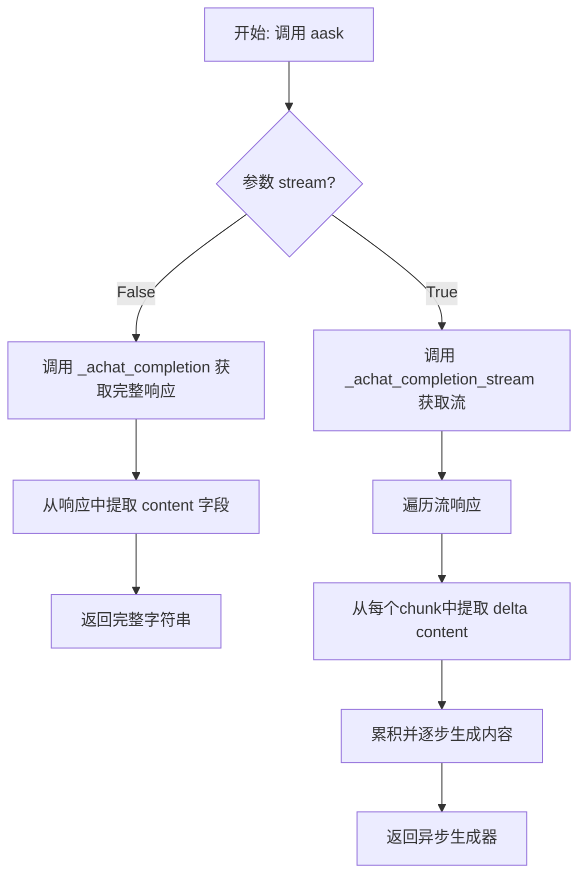
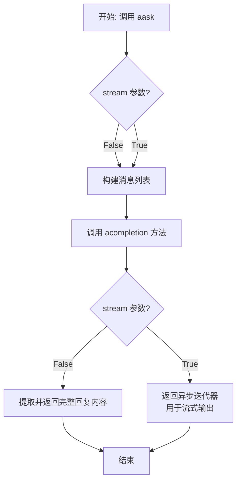
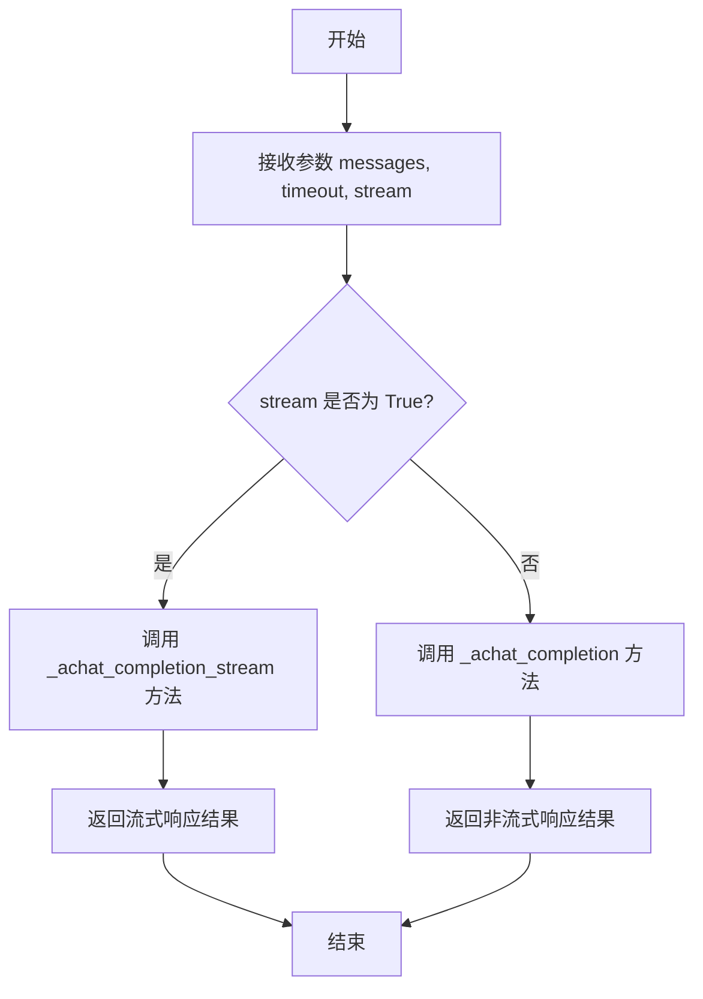

# `.\MetaGPT\tests\metagpt\test_llm.py` 详细设计文档

该文件是一个使用 pytest 框架编写的单元测试文件，用于测试 LLM（大语言模型）类的异步接口功能，包括异步问答（aask）和异步补全（acompletion）方法，验证其基本调用和流式输出的正确性。

## 整体流程

```mermaid
graph TD
    A[开始执行测试] --> B{测试函数调用}
    B --> C[test_llm_aask: 测试非流式异步问答]
    C --> D[调用 llm.aask('hello world', stream=False)]
    D --> E{断言响应长度 > 0}
    E -- 是 --> F[测试通过]
    E -- 否 --> G[测试失败]
    B --> H[test_llm_aask_stream: 测试流式异步问答]
    H --> I[调用 llm.aask('hello world', stream=True)]
    I --> J{断言响应长度 > 0}
    J -- 是 --> K[测试通过]
    J -- 否 --> L[测试失败]
    B --> M[test_llm_acompletion: 测试异步补全]
    M --> N[构造消息列表 hello_msg]
    N --> O[调用 llm.acompletion(hello_msg)]
    O --> P{断言补全消息内容长度 > 0}
    P -- 是 --> Q[测试通过]
    P -- 否 --> R[测试失败]
    F --> S[所有测试结束]
    K --> S
    Q --> S
```

## 类结构

```
test_llm.py (测试模块)
├── llm (pytest fixture)
└── LLM (被测试类，来自 metagpt.llm)
```

## 全局变量及字段


    

## 全局函数及方法

### `LLM.aask`

该方法是一个异步方法，用于向大语言模型（LLM）发送一个简单的字符串提示（prompt）并获取其文本回复。它支持流式和非流式两种响应模式。

参数：
- `prompt`：`str`，发送给LLM的文本提示。
- `stream`：`bool`，可选参数，默认为`False`。指示是否以流式方式获取响应。如果为`True`，则返回一个异步生成器，逐步产生响应内容；如果为`False`，则等待并返回完整的响应字符串。

返回值：`Union[str, AsyncGenerator]`，如果`stream=False`，则返回一个完整的响应字符串；如果`stream=True`，则返回一个异步生成器，每次产生响应的一部分（字符串）。

#### 流程图



#### 带注释源码

```python
async def aask(self, prompt: str, stream: bool = False) -> Union[str, AsyncGenerator]:
    """
    异步发送提示并获取回答。
    
    Args:
        prompt (str): 发送给LLM的提示文本。
        stream (bool, optional): 是否使用流式响应。默认为 False。
    
    Returns:
        Union[str, AsyncGenerator]: 如果 stream=False，返回完整响应字符串；
                                    如果 stream=True，返回一个异步生成器。
    """
    # 将单条字符串提示构造成LLM API所需的对话消息格式
    messages = [self._user_msg(prompt)]
    
    # 根据stream参数选择调用不同的底层方法
    if stream:
        # 调用流式响应方法，返回一个异步生成器
        return self._achat_completion_stream(messages)
    else:
        # 调用非流式响应方法，获取完整的响应对象
        rsp = await self._achat_completion(messages)
        # 从响应对象中提取出纯文本内容并返回
        return self._get_choice_text(rsp)
```


### `test_llm_aask`

这是一个使用 `pytest` 框架编写的异步单元测试函数，用于测试 `LLM` 类的 `aask` 方法。它验证了在非流式模式下，向大语言模型发送一个简单的提示（"hello world"）后，是否能够收到一个非空的响应。

参数：

-  `llm`：`LLM`，通过 `@pytest.fixture()` 装饰器提供的 `LLM` 类实例，作为测试的依赖项被注入到测试函数中。

返回值：`None`，测试函数通常不返回有意义的值，其目的是通过断言（`assert`）来验证代码行为。如果所有断言通过，则测试成功；如果任何断言失败，则测试失败并抛出 `AssertionError`。

#### 流程图

```mermaid
flowchart TD
    A[测试开始] --> B[调用 llm.aask<br/>提示: "hello world", stream=False]
    B --> C{收到响应 rsp?}
    C -- 是 --> D[断言 len(rsp) > 0]
    D --> E{断言通过?}
    E -- 是 --> F[测试通过]
    E -- 否 --> G[测试失败<br/>抛出 AssertionError]
    C -- 否/异常 --> H[测试失败<br/>抛出相应异常]
```

#### 带注释源码

```python
@pytest.mark.asyncio  # 标记此测试函数为异步函数，以便 pytest-asyncio 插件能够正确处理
async def test_llm_aask(llm):  # 定义异步测试函数，接收名为 `llm` 的 fixture 作为参数
    # 调用 LLM 实例的异步 aask 方法，传入提示字符串 "hello world"，并指定 stream=False（非流式响应）
    rsp = await llm.aask("hello world", stream=False)
    # 断言：检查返回的响应字符串 `rsp` 的长度是否大于 0，以确保收到了非空内容
    assert len(rsp) > 0
```


### `test_llm_aask_stream`

这是一个使用 `pytest` 框架编写的异步单元测试函数，用于测试 `LLM` 类的 `aask` 方法在流式输出模式下的功能。它验证了当传入一个简单的提示词（"hello world"）并启用流式输出时，`aask` 方法能够返回一个非空的响应。

参数：

- `llm`：`LLM`，一个通过 `@pytest.fixture()` 装饰器提供的 `LLM` 类实例，作为被测对象（System Under Test, SUT）注入到测试函数中。

返回值：`None`，测试函数通常不显式返回值，其成功与否由 `assert` 语句决定。如果断言失败，`pytest` 将抛出 `AssertionError`。

#### 流程图

```mermaid
flowchart TD
    A[测试开始] --> B[调用 llm.aask<br>参数: "hello world", stream=True]
    B --> C{等待异步响应}
    C --> D[收到响应 rsp]
    D --> E{断言: len(rsp) > 0}
    E -->|True| F[测试通过]
    E -->|False| G[抛出 AssertionError<br>测试失败]
```

#### 带注释源码

```python
@pytest.mark.asyncio  # 标记此测试函数为异步函数，以便 pytest-asyncio 插件能够正确处理
async def test_llm_aask_stream(llm):  # 定义异步测试函数，接收 llm fixture 作为参数
    rsp = await llm.aask("hello world", stream=True)  # 异步调用 llm 实例的 aask 方法，传入提示词并启用流式输出，等待结果
    assert len(rsp) > 0  # 断言：响应的长度必须大于0，以确保收到了有效内容
```


### `test_llm_acompletion`

这是一个使用 `pytest` 框架编写的异步单元测试函数，用于测试 `LLM` 类的 `acompletion` 方法。它验证了当向大语言模型发送一个简单的用户消息时，模型能够返回一个包含有效内容的响应。

参数：

- `llm`：`LLM`，一个通过 `@pytest.fixture()` 装饰器提供的 `LLM` 类实例，作为被测对象注入到测试函数中。

返回值：`None`，测试函数通常不显式返回值，其成功与否由内部的断言（`assert`）语句决定。

#### 流程图

```mermaid
flowchart TD
    A[测试开始] --> B[准备测试数据<br>hello_msg]
    B --> C[调用被测方法<br>llm.acompletion(hello_msg)]
    C --> D{异步等待响应}
    D --> E[收到响应 rsp]
    E --> F[断言检查<br>rsp.choices[0].message.content 长度 > 0]
    F --> G[断言通过]
    F --> H[断言失败<br>测试不通过]
    G --> I[测试结束]
    H --> I
```

#### 带注释源码

```python
@pytest.mark.asyncio  # 标记此测试函数为异步函数，以便 pytest-asyncio 插件能够正确处理
async def test_llm_acompletion(llm):  # 定义异步测试函数，接收 llm fixture 作为参数
    hello_msg = [{"role": "user", "content": "hello"}]  # 构造测试输入：一个包含用户角色的消息列表
    rsp = await llm.acompletion(hello_msg)  # 异步调用 LLM 实例的 acompletion 方法，并等待其返回响应
    assert len(rsp.choices[0].message.content) > 0  # 断言：响应的第一个选择中的消息内容长度应大于0，确保返回了非空内容
```


### `LLM.aask`

该方法是一个异步方法，用于向大型语言模型（LLM）发起一个简单的文本问答请求。它封装了底层消息构建和模型调用的细节，为用户提供了一个简洁的接口来获取模型的文本回复。方法支持流式和非流式两种响应模式。

参数：

-  `prompt`：`str`，用户输入的提示文本或问题。
-  `system_msgs`：`Optional[List[str]]`，可选的系统消息列表，用于在对话开始前设定模型的行为或角色。默认为`None`。
-  `format_msgs`：`Optional[List[Dict[str, str]]]`，可选的格式化消息列表，用于提供更复杂的对话历史或上下文。默认为`None`。
-  `stream`：`bool`，控制是否以流式方式接收响应。`True`表示流式，`False`表示非流式。默认为`False`。

返回值：`Union[str, AsyncIterator[str]]`，如果`stream=False`，则返回模型生成的完整回复字符串。如果`stream=True`，则返回一个异步迭代器（`AsyncIterator[str]`），每次迭代产生回复的一个片段（例如一个词或一个句子）。

#### 流程图



#### 带注释源码

```python
async def aask(
    self,
    prompt: str,
    system_msgs: Optional[List[str]] = None,
    format_msgs: Optional[List[Dict[str, str]]] = None,
    stream: bool = False,
) -> Union[str, AsyncIterator[str]]:
    """
    异步地向LLM发送一个提示并获取回复。
    
    Args:
        prompt: 用户的主要问题或指令。
        system_msgs: 可选的系统消息列表，用于初始化对话上下文。
        format_msgs: 可选的格式化消息列表，提供额外的对话历史或结构化输入。
        stream: 是否启用流式响应。启用后，回复会分块返回。

    Returns:
        如果stream=False，返回完整的回复字符串。
        如果stream=True，返回一个异步迭代器，用于逐步获取回复片段。
    """
    # 1. 构建消息列表：组合系统消息、格式化消息和用户提示。
    messages = self._system_msgs(system_msgs)  # 添加系统角色消息
    if format_msgs:
        messages.extend(format_msgs)  # 添加自定义的格式化消息
    messages.append({"role": "user", "content": prompt})  # 添加用户当前提示

    # 2. 调用底层的异步补全接口。
    rsp = await self.acompletion(messages, stream=stream)

    # 3. 根据流式标志处理响应。
    if stream:
        # 流式模式：返回一个异步迭代器，逐块生成回复内容。
        # 这允许调用者在回复生成过程中就处理部分结果。
        return self._get_stream_text(rsp)
    else:
        # 非流式模式：从响应对象中提取完整的文本回复并返回。
        # 这是典型的“请求-等待-完整响应”模式。
        return self._get_text(rsp)
```


### `LLM.acompletion`

该方法用于异步调用大语言模型（LLM）的聊天补全接口，发送一组消息并获取模型的回复。

参数：

- `messages`：`list[dict]`，一个字典列表，每个字典代表一条消息，通常包含"role"（角色，如"user"、"assistant"、"system"）和"content"（内容）字段。
- `timeout`：`int`，可选参数，请求超时时间（秒），默认为60。
- `stream`：`bool`，可选参数，是否启用流式响应，默认为False。

返回值：`openai.types.Completion`，OpenAI API返回的补全结果对象，包含模型生成的回复等信息。

#### 流程图



#### 带注释源码

```python
async def acompletion(self, messages: list[dict], timeout: int = 60, stream: bool = False):
    """
    异步调用LLM的聊天补全接口。
    
    Args:
        messages (list[dict]): 消息列表，每个元素是一个包含角色和内容的字典。
        timeout (int, optional): 请求超时时间（秒）。默认为60。
        stream (bool, optional): 是否启用流式响应。默认为False。
    
    Returns:
        openai.types.Completion: OpenAI API返回的补全结果对象。
    """
    # 根据stream参数选择调用流式或非流式补全方法
    if stream:
        return await self._achat_completion_stream(messages, timeout=timeout)
    return await self._achat_completion(messages, timeout=timeout)
```

## 关键组件


### LLM (Large Language Model) 类

作为与大型语言模型交互的核心抽象，封装了异步请求、流式响应和标准补全等核心功能，是上层应用与底层AI模型之间的桥梁。

### aask 方法

提供简化的单轮问答接口，支持流式与非流式两种响应模式，将用户输入的字符串转换为模型请求并返回文本响应。

### acompletion 方法

提供更灵活的低级补全接口，允许调用者直接构造包含角色和内容的消息列表，适用于多轮对话或复杂提示场景。

### pytest 测试框架

用于构建自动化单元测试，通过`@pytest.mark.asyncio`装饰器支持异步测试，`@pytest.fixture`提供测试依赖的LLM实例。


## 问题及建议


### 已知问题

-   **测试用例过于简单**：当前的测试用例仅验证了`LLM`类中`aask`和`acompletion`方法的基本调用是否成功（即返回结果长度大于0），缺乏对方法功能、边界条件、异常处理以及不同输入参数（如不同的`stream`模式、不同的消息结构）的全面验证。
-   **测试覆盖不足**：测试用例没有覆盖`LLM`类的所有公共方法，例如可能存在的同步方法`ask`或`completion`。同时，也未对类初始化参数（如不同的模型配置）进行测试。
-   **缺乏模拟（Mock）**：测试直接调用了真实的`LLM`服务（假设`LLM`类封装了真实的API调用），这会导致测试执行速度慢、依赖外部服务稳定性、可能产生费用，并且测试结果不可重复。这不是单元测试的最佳实践。
-   **测试断言薄弱**：断言仅检查响应长度，无法确保返回内容的格式、类型或业务逻辑的正确性。例如，对于`acompletion`方法，没有验证返回的`rsp`对象的结构是否符合预期（如是否包含`choices`列表）。
-   **潜在的异步测试问题**：虽然使用了`@pytest.mark.asyncio`，但如果`pytest-asyncio`插件未正确安装或配置，测试可能无法运行。此外，测试中没有处理异步操作可能抛出的异常。

### 优化建议

-   **增强测试用例的深度和广度**：
    -   为`aask`方法添加更多测试场景，例如测试空字符串输入、超长文本输入、测试`stream=True`时返回的数据是否为异步生成器（而不仅仅是检查长度）。
    -   为`acompletion`方法测试不同的消息角色（`system`, `user`, `assistant`）和复杂的消息序列。
    -   添加对`LLM`类中其他方法的测试（如果存在）。
-   **引入测试替身（Test Double）**：
    -   使用`unittest.mock`或`pytest-mock`来模拟（Mock）`LLM`类内部的API客户端（例如OpenAI客户端）。这样可以隔离外部依赖，使测试快速、稳定且免费。
    -   为模拟对象设置预期的返回值，并验证类方法是否以正确的参数调用了底层客户端。
-   **强化断言**：
    -   使用更具体的断言，例如`assert isinstance(rsp, str)`或`assert "hello" in rsp.lower()`来验证`aask`的返回内容。
    -   对于`acompletion`，可以断言`rsp.choices[0].message.role == "assistant"`。
    -   考虑使用`pytest`的参数化功能（`@pytest.mark.parametrize`）来测试多组输入和预期输出。
-   **改进测试结构**：
    -   将通用的模拟设置提取到`@pytest.fixture`中，提高代码复用性。
    -   考虑将测试分为单元测试（使用Mock）和集成测试（少量测试真实API），并明确区分。
-   **添加异常处理测试**：
    -   编写测试用例来验证当API返回错误或网络异常时，`LLM`类的方法是否按设计抛出预期的异常或进行错误处理。
-   **确保测试可重复性**：
    -   在模拟时，确保每次测试返回的模拟数据是一致的，避免因随机性导致测试间歇性失败。


## 其它


### 设计目标与约束

本测试文件的设计目标是验证 `LLM` 类的核心异步方法（`aask` 和 `acompletion`）在同步和流式输出模式下的基本功能正确性。其核心约束包括：
1.  **测试隔离性**：每个测试用例应独立运行，通过 `pytest.fixture` 确保每个测试获得一个干净的 `LLM` 实例。
2.  **异步支持**：所有测试函数均为异步函数，并使用 `@pytest.mark.asyncio` 装饰器，以正确测试 `LLM` 类的异步方法。
3.  **最小验证**：测试仅验证核心功能（如响应非空），不涉及复杂逻辑或边缘情况，旨在作为基础的冒烟测试或集成测试。
4.  **执行便捷性**：提供 `if __name__ == "__main__":` 入口，允许直接运行本文件执行测试。

### 错误处理与异常设计

当前测试文件未显式包含错误处理测试用例。其设计隐含了以下与错误处理相关的方面：
1.  **正常流验证**：测试用例仅断言在正常输入下，`LLM` 方法应返回有效响应（长度大于0）。若底层 `LLM` 类方法抛出异常（如网络错误、API密钥无效、模型调用失败），测试将失败，从而暴露出问题。
2.  **缺失的异常测试**：文档未包含针对以下情况的专门测试：
    *   `aask` 或 `acompletion` 方法传入非法参数（如空字符串、非列表消息）时的行为。
    *   网络请求超时或服务不可用时的异常处理与重试机制。
    *   `stream=True` 模式下，流处理过程中发生中断的恢复或清理机制。
3.  **测试框架处理**：依赖 `pytest` 框架来捕获和报告测试过程中发生的任何异常。

### 数据流与状态机

本测试文件的数据流相对简单直接，不涉及复杂的状态转换：
1.  **初始化阶段**：`llm` fixture 在每个测试函数执行前被调用，创建并返回一个新的 `LLM` 实例。这是数据流的起点。
2.  **输入阶段**：测试函数调用 `LLM` 实例的方法（`aask` 或 `acompletion`），并传入预定义的输入数据（如字符串 `"hello world"` 或消息列表 `hello_msg`）。
3.  **处理与输出阶段**：`LLM` 实例内部处理请求（可能涉及网络调用）。测试函数 `await` 该异步调用，获取返回结果（`rsp`）。
4.  **验证阶段**：测试函数对返回结果 `rsp` 进行断言（`assert len(rsp) > 0`），验证输出符合预期。整个过程是线性的，无分支或状态循环。

### 外部依赖与接口契约

本测试文件的核心是验证 `LLM` 类与外部组件的交互契约：
1.  **主要外部依赖**：
    *   **`metagpt.llm.LLM` 类**：这是被测试的系统（SUT）。测试依赖于其 `aask` 和 `acompletion` 方法的公共接口。
    *   **`pytest` 框架**：用于组织测试用例、管理 fixture 和运行测试。
    *   **`pytest-asyncio` 插件**：提供对异步测试函数的支持。
2.  **接口契约验证**：
    *   `aask(prompt: str, stream: bool = False) -> str`: 测试验证了当传入一个非空字符串提示时，无论 `stream` 为 `True` 或 `False`，该方法都应返回一个非空字符串。
    *   `acompletion(messages: list) -> LLMResponse`: 测试验证了当传入一个符合格式（包含 `role` 和 `content` 键）的消息列表时，该方法应返回一个 `LLMResponse` 对象，且其 `choices[0].message.content` 为非空字符串。这里隐含了对 `LLMResponse` 对象结构的依赖。
3.  **隐式外部依赖**：`LLM` 类本身可能依赖外部大语言模型API（如OpenAI API）。本测试文件的成功运行隐含要求这些底层API服务可用且配置正确，但这属于 `LLM` 类内部的依赖，而非本测试文件的直接契约。

    