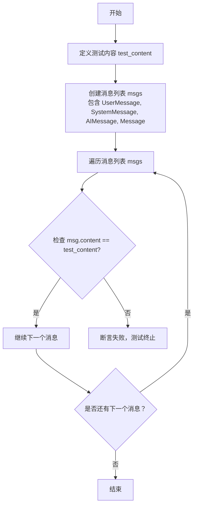
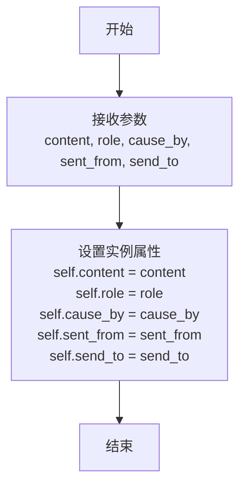
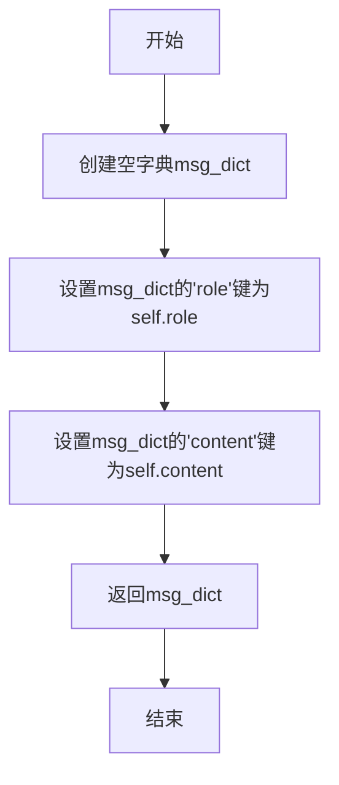
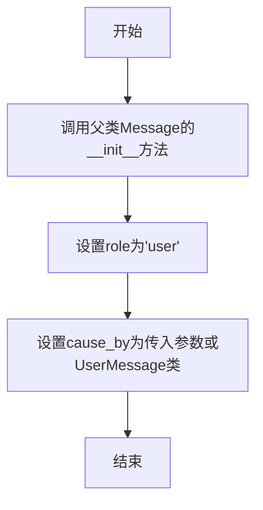
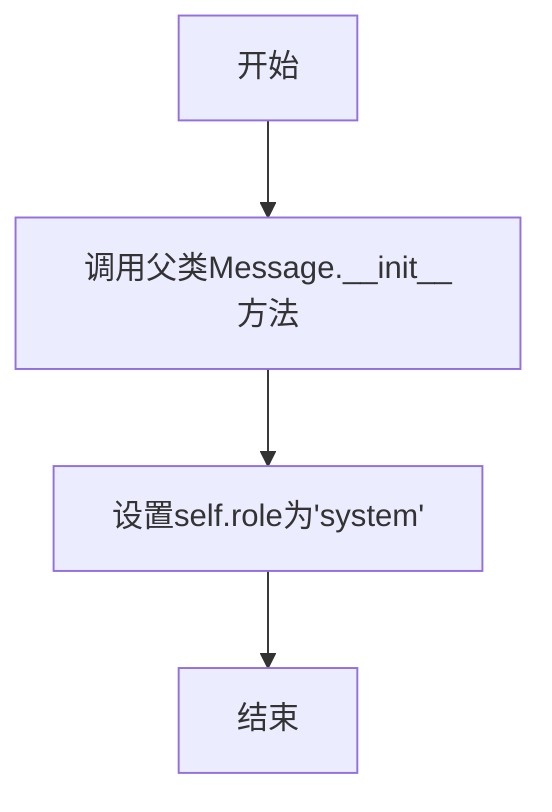
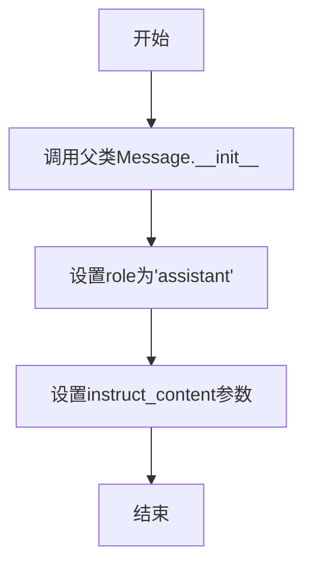

# `.\MetaGPT\tests\metagpt\test_message.py` 详细设计文档

这是一个单元测试文件，用于测试metagpt.schema模块中定义的各种消息类（Message、UserMessage、SystemMessage、AIMessage）的基本功能，包括消息的创建、属性访问、序列化（to_dict）和字符串表示（__str__）。

## 整体流程

```mermaid
graph TD
    A[开始执行测试] --> B[调用test_message函数]
    B --> C[创建Message实例]
    C --> D[断言to_dict()返回的role字段]
    D --> E[断言__str__()包含特定字符串]
    A --> F[调用test_all_messages函数]
    F --> G[创建UserMessage, SystemMessage, AIMessage, Message实例列表]
    G --> H[遍历列表]
    H --> I[断言每个实例的content属性]
    I --> J[测试完成]
```

## 类结构

```
Message (基类，来自metagpt.schema)
├── UserMessage (子类，来自metagpt.schema)
├── SystemMessage (子类，来自metagpt.schema)
└── AIMessage (子类，来自metagpt.schema)
```

## 全局变量及字段


### `Message.role`
    
消息发送者的角色标识，如'User'、'System'、'AI'等

类型：`str`
    


### `Message.content`
    
消息的实际文本内容

类型：`str`
    


### `UserMessage.role`
    
固定为'User'，表示用户角色的消息

类型：`str`
    


### `UserMessage.content`
    
用户发送的消息文本内容

类型：`str`
    


### `SystemMessage.role`
    
固定为'System'，表示系统角色的消息

类型：`str`
    


### `SystemMessage.content`
    
系统发送的消息文本内容

类型：`str`
    


### `AIMessage.role`
    
固定为'AI'，表示AI角色的消息

类型：`str`
    


### `AIMessage.content`
    
AI发送的消息文本内容

类型：`str`
    
    

## 全局函数及方法

### `test_message`

该函数用于测试`Message`类的基本功能，包括创建`Message`对象、验证其`to_dict()`方法返回的字典中`role`字段的正确性，以及验证`__str__()`方法返回的字符串中是否包含`role`信息。

参数：无

返回值：无

#### 流程图

```mermaid
flowchart TD
    A[开始] --> B[创建Message对象<br>role='User', content='WTF']
    B --> C[调用msg.to_dict()<br>获取字典]
    C --> D{字典中role字段 == 'User'?}
    D -->|是| E[断言通过]
    D -->|否| F[断言失败]
    E --> G[检查'User'是否在str(msg)中]
    G --> H{'User'在字符串中?}
    H -->|是| I[断言通过]
    H -->|否| J[断言失败]
    I --> K[结束]
    F --> K
    J --> K
```

#### 带注释源码

```python
def test_message():
    # 创建一个Message对象，指定角色为"User"，内容为"WTF"
    msg = Message(role="User", content="WTF")
    
    # 断言：调用msg.to_dict()方法返回的字典中，'role'键对应的值应为"User"
    assert msg.to_dict()["role"] == "User"
    
    # 断言：将msg对象转换为字符串后，字符串中应包含"User"
    assert "User" in str(msg)
```

### `test_all_messages`

该函数用于测试`UserMessage`、`SystemMessage`、`AIMessage`和`Message`这四个消息类，验证它们是否正确初始化并存储了给定的消息内容。

参数：

- 无显式参数。

返回值：`None`，该函数不返回任何值，仅执行断言测试。

#### 流程图



#### 带注释源码

```python
def test_all_messages():
    # 定义测试用的消息内容字符串
    test_content = "test_message"
    
    # 创建一个列表，包含四种不同类型的消息对象，均使用 test_content 初始化
    msgs = [
        UserMessage(test_content),      # 创建 UserMessage 实例
        SystemMessage(test_content),    # 创建 SystemMessage 实例
        AIMessage(test_content),        # 创建 AIMessage 实例
        Message(content=test_content, role="QA"),  # 创建通用 Message 实例，指定角色为"QA"
    ]
    
    # 遍历消息列表中的每一个消息对象
    for msg in msgs:
        # 断言：检查每个消息对象的 content 属性是否等于 test_content
        assert msg.content == test_content
```

### `Message.__init__`

初始化一个消息对象，设置消息的角色、内容、原因、发送者和接收者等属性。

参数：

- `content`：`str`，消息的内容
- `role`：`str`，消息发送者的角色，例如"User"、"System"、"AI"等
- `cause_by`：`str`，消息产生的原因，默认为`""`
- `sent_from`：`str`，消息的发送者，默认为`""`
- `send_to`：`str`，消息的接收者，默认为`""`

返回值：`None`，无返回值

#### 流程图



#### 带注释源码

```python
def __init__(self, content: str, role: str = "user", cause_by: str = "", sent_from: str = "", send_to: str = ""):
    """
    初始化消息对象。

    Args:
        content (str): 消息的内容。
        role (str): 消息发送者的角色，例如"User"、"System"、"AI"等。
        cause_by (str): 消息产生的原因，默认为空字符串。
        sent_from (str): 消息的发送者，默认为空字符串。
        send_to (str): 消息的接收者，默认为空字符串。
    """
    self.content = content  # 设置消息内容
    self.role = role  # 设置消息角色
    self.cause_by = cause_by  # 设置消息产生原因
    self.sent_from = sent_from  # 设置消息发送者
    self.send_to = send_to  # 设置消息接收者
```

### `Message.to_dict`

该方法将`Message`对象转换为一个字典，包含消息的角色和内容信息。

参数：

- `self`：`Message`，当前`Message`对象实例

返回值：`dict`，包含`"role"`和`"content"`键的字典，分别对应消息的角色和内容

#### 流程图



#### 带注释源码

```python
def to_dict(self) -> dict:
    """
    将Message对象转换为字典格式。
    
    返回:
        dict: 包含'role'和'content'键的字典
    """
    msg_dict = {"role": self.role, "content": self.content}
    return msg_dict
```

### `Message.__str__`

该方法用于将`Message`对象转换为一个可读的字符串表示形式，主要用于调试和日志记录。它通过格式化对象的`role`和`content`字段，生成一个易于理解的字符串。

参数：

- `self`：`Message`，当前`Message`对象实例

返回值：`str`，返回一个格式化的字符串，包含消息的角色和内容。

#### 流程图

```mermaid
graph TD
    A[开始] --> B[获取self.role和self.content]
    B --> C[格式化字符串: f'role: {self.role}, content: {self.content}']
    C --> D[返回格式化后的字符串]
    D --> E[结束]
```

#### 带注释源码

```python
def __str__(self):
    """
    返回Message对象的字符串表示形式。
    格式为: 'role: {role}, content: {content}'
    """
    return f"role: {self.role}, content: {self.content}"
```

### `UserMessage.__init__`

该方法用于初始化一个`UserMessage`对象，继承自`Message`类，并设置消息的角色为"user"。

参数：

- `content`：`str`，用户消息的内容
- `cause_by`：`str`，可选参数，指定消息的起因，默认为`UserMessage`类本身

返回值：`None`，无返回值

#### 流程图



#### 带注释源码

```python
def __init__(self, content: str, cause_by: str = UserMessage):
    """
    初始化UserMessage对象。
    
    参数:
        content (str): 用户消息的内容。
        cause_by (str): 可选参数，指定消息的起因，默认为UserMessage类本身。
    """
    super().__init__(content=content, role="user", cause_by=cause_by)  # 调用父类Message的初始化方法，设置角色为'user'
```

### `SystemMessage.__init__`

该方法用于初始化一个系统消息对象，继承自基类`Message`，并设置消息的角色为"system"。

参数：

- `content`：`str`，系统消息的内容
- `*args`：`tuple`，可变位置参数，传递给父类`Message`的初始化方法
- `**kwargs`：`dict`，可变关键字参数，传递给父类`Message`的初始化方法

返回值：`None`，无返回值

#### 流程图



#### 带注释源码

```python
def __init__(self, content: str, *args, **kwargs):
    """
    初始化系统消息对象。
    
    参数:
        content (str): 系统消息的内容。
        *args: 可变位置参数，传递给父类Message的初始化方法。
        **kwargs: 可变关键字参数，传递给父类Message的初始化方法。
    """
    super().__init__(content=content, *args, **kwargs)  # 调用父类Message的初始化方法
    self.role = "system"  # 设置消息角色为'system'
```

### `AIMessage.__init__`

初始化AIMessage实例，继承自Message类，用于表示AI生成的消息。

参数：

- `content`：`str`，消息的文本内容
- `instruct_content`：`Union[str, dict, list]`，可选的指令内容，可以是字符串、字典或列表
- `role`：`str`，消息发送者的角色，默认为"assistant"

返回值：`None`，无返回值

#### 流程图



#### 带注释源码

```python
def __init__(self, content: str, instruct_content: Union[str, dict, list] = None, role: str = "assistant"):
    """
    初始化AIMessage实例
    
    Args:
        content: 消息的文本内容
        instruct_content: 可选的指令内容，可以是字符串、字典或列表
        role: 消息发送者的角色，默认为"assistant"
    """
    # 调用父类Message的构造函数，传入content和role参数
    super().__init__(content=content, role=role)
    # 设置instruct_content属性
    self.instruct_content = instruct_content
```

## 关键组件


### Message 类

Message 类是消息系统的基础类，定义了消息的基本结构，包含角色（role）和内容（content）两个核心属性，并提供了将消息转换为字典格式的方法。

### UserMessage 类

UserMessage 类是 Message 类的子类，专门用于表示来自用户的消息，通常将角色固定为"user"。

### SystemMessage 类

SystemMessage 类是 Message 类的子类，专门用于表示来自系统的消息，通常将角色固定为"system"。

### AIMessage 类

AIMessage 类是 Message 类的子类，专门用于表示来自 AI 模型的消息，通常将角色固定为"assistant"。

### 消息序列化

提供了 `to_dict` 方法，用于将消息对象序列化为字典格式，便于在网络传输或存储时使用。

### 消息字符串表示

通过重写 `__str__` 方法，提供了消息对象的字符串表示形式，便于日志记录和调试。


## 问题及建议


### 已知问题

-   测试用例`test_message`中，创建`Message`对象时传入的`role`参数值为`"User"`（首字母大写），但在`Message`类的实现中，`role`可能被期望为小写（如`"user"`）。这可能导致`to_dict()`方法返回的字典中`role`字段的值与预期不符，或者与系统中其他使用小写`role`的组件不兼容，从而引发潜在的逻辑错误或断言失败。
-   测试用例`test_all_messages`中，创建了一个`Message`对象，其`role`参数被设置为`"QA"`。这个角色值`"QA"`可能不是系统预定义或支持的标准角色之一（如`"user"`, `"system"`, `"assistant"`）。使用非标准角色可能导致下游处理逻辑（如基于角色的消息路由、权限检查或显示格式化）出现未定义行为或错误。
-   测试文件`test_message.py`直接使用`pytest.main([__file__, "-s"])`来运行测试。虽然这在独立运行测试文件时有效，但它可能不是最佳实践，因为它绕过了项目可能配置的`pytest`插件、自定义参数或测试发现机制。这可能导致在特定环境或持续集成（CI）流程中测试行为不一致。

### 优化建议

-   建议统一`role`参数的命名规范。检查`Message`类及其子类（`UserMessage`, `SystemMessage`, `AIMessage`）对`role`值的期望。如果系统内部约定使用小写（如`"user"`），则应将测试中的`"User"`改为`"user"`，以确保测试与实现逻辑一致，并避免潜在的兼容性问题。
-   建议明确系统支持的角色列表。如果`"QA"`是一个有效的、需要被支持的角色，应将其添加到文档或类型定义中。如果它不是有效角色，则应考虑从测试中移除，或添加相应的测试来验证系统对无效角色的处理（例如，是否抛出异常或进行默认转换）。这有助于提高代码的健壮性和可维护性。
-   建议遵循项目的测试运行约定。通常，更推荐使用命令行直接调用`pytest`（例如`pytest path/to/test_file.py`）或通过配置的测试运行器来执行测试。这样可以确保所有项目级别的`pytest`配置（如`pytest.ini`, `conftest.py`）都能被正确加载。可以考虑移除`if __name__ == "__main__":`块中的`pytest.main`调用，或者仅将其保留为开发时的便捷选项，并明确注释其局限性。
-   考虑为`Message`类及其子类添加更全面的单元测试，例如测试`from_dict`方法（如果存在）、测试消息的序列化/反序列化、测试包含额外属性的消息等，以覆盖更多的边界情况和功能点。


## 其它


### 设计目标与约束

本模块的设计目标是提供一个轻量级、可扩展的消息类体系，用于在智能体（Agent）之间或智能体与外部系统之间传递结构化的信息。核心约束包括：
1. **类型安全**：通过定义明确的子类（如`UserMessage`、`SystemMessage`、`AIMessage`）来区分不同来源或用途的消息，避免角色（role）字符串的硬编码和拼写错误。
2. **序列化友好**：消息对象应能方便地转换为字典（`to_dict`方法）或JSON格式，以便于网络传输或持久化存储。
3. **字符串表示清晰**：`__str__`方法应提供清晰、可读的消息表示，便于日志记录和调试。
4. **向后兼容**：基础的`Message`类应允许通过`role`参数自定义角色，以支持未来可能出现的、未预定义的新消息类型。

### 错误处理与异常设计

当前代码是单元测试，主要验证功能正确性，未包含复杂的错误处理逻辑。在生产代码（即被测试的`metagpt.schema`模块）中，预期的错误处理可能包括：
1. **参数验证**：在`Message`类构造函数中，可能对`content`和`role`参数进行非空或类型检查，若无效则抛出`ValueError`或`TypeError`。
2. **序列化异常**：`to_dict`方法在将复杂内容（如无法JSON序列化的对象）转换为字典时可能失败，应妥善处理或抛出明确的异常。
3. **测试断言失败**：测试用例使用`assert`语句，断言失败时由`pytest`框架捕获并报告为测试失败，这属于正常的测试流程，而非运行时错误处理。

### 数据流与状态机

本测试文件本身不涉及复杂的数据流或状态机。它测试的`Message`类及其子类是**不可变的数据载体**（假设其字段在初始化后不变）。典型的数据流是：
1. **创建**：调用`Message`或特定子类（如`UserMessage`）的构造函数，传入`content`和可选的`role`，生成一个消息实例。
2. **使用**：消息实例在智能体间传递，其`content`被读取，`role`用于识别消息来源。
3. **序列化**：在需要传输或存储时，调用`to_dict()`方法获取字典表示。
4. **表示**：在日志或调试时，调用`str(msg)`或直接打印，触发`__str__`方法。
消息对象本身无内部状态变迁，不构成状态机。

### 外部依赖与接口契约

1. **内部依赖**：
    - `metagpt.schema`：定义了`Message`、`UserMessage`、`SystemMessage`、`AIMessage`等类。这是被测试的核心模块。
    - 测试文件与这些类之间存在**测试依赖**关系，验证其公共接口（`__init__`、`to_dict`、`__str__`、`content`属性）的行为是否符合预期。

2. **外部依赖**：
    - `pytest`：测试运行框架，用于组织、发现和运行测试用例。这是开发/测试期依赖。
    - 无其他第三方库或外部服务依赖。

3. **接口契约**：
    - `Message`类及其子类提供了一个标准化的消息构造与表示接口。测试用例确保了以下契约：
        - `to_dict()`返回的字典包含`role`和`content`键。
        - `__str__()`返回的字符串包含角色信息。
        - 所有消息子类的`content`属性与构造时传入的值相等。

    