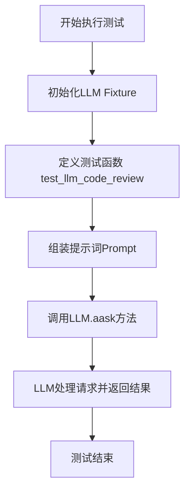

# `.\MetaGPT\tests\metagpt\test_prompt.py` 详细设计文档

该文件是一个测试脚本，用于测试LLM（大语言模型）的代码审查和代码生成能力。它通过向LLM提供不同的代码片段（如一个简单的2048游戏JavaScript类实现、一个不完整的move函数草稿、一个完整的move函数实现，以及一个将Python类转换为Mermaid类图的指令模板）和相应的提示词，来验证LLM能否理解代码上下文、完成代码补全、进行代码审查或执行特定格式转换任务。

## 整体流程



## 类结构

```
test_llm.py (测试脚本)
├── CODE_REVIEW_SMALLEST_CONTEXT (全局变量: 包含Game类代码的字符串)
├── MOVE_DRAFT (全局变量: 包含move函数草稿的字符串)
├── FUNCTION_TO_MERMAID_CLASS (全局变量: 包含转换指令和示例的字符串)
├── MOVE_FUNCTION (全局变量: 包含完整move函数实现的字符串)
├── llm (pytest fixture: 返回LLM实例)
└── test_llm_code_review (异步测试函数: 测试LLM的代码处理能力)
```

## 全局变量及字段


### `CODE_REVIEW_SMALLEST_CONTEXT`
    
包含一个简单JavaScript游戏类（Game）代码的字符串，用于代码审查测试的最小上下文示例。

类型：`str`
    


### `MOVE_DRAFT`
    
包含move函数草稿实现的字符串，仅实现了'up'方向的逻辑，其他方向留空。

类型：`str`
    


### `FUNCTION_TO_MERMAID_CLASS`
    
一个包含Python类定义（UIDesign）和格式示例的复杂提示字符串，用于指导LLM将函数代码转换为Mermaid类图。

类型：`str`
    


### `MOVE_FUNCTION`
    
包含move函数完整实现的字符串，实现了'up'、'down'、'left'、'right'四个方向的移动和合并逻辑。

类型：`str`
    


    

## 全局函数及方法


### `LLM.aask`

该方法是一个异步方法，用于向大型语言模型（LLM）发送一个提示（prompt）字符串，并获取其生成的文本响应。它是`LLM`类与底层AI模型进行交互的核心接口。

参数：
- `prompt`：`str`，发送给LLM的文本提示，用于指导模型生成回复。
- `...`：代码片段中未展示其他参数，但根据上下文，`aask`方法可能还接受其他可选参数来控制模型行为（如`temperature`, `max_tokens`等），这些参数在`LLM`类的内部实现中定义。

返回值：`str`，LLM模型根据给定`prompt`生成的文本回复。

#### 流程图

```mermaid
graph TD
    A[调用 llm.aask(prompt)] --> B[LLM内部处理: 构造API请求];
    B --> C[向外部AI模型API发送异步请求];
    C --> D{请求成功?};
    D -- 是 --> E[解析API响应，提取文本内容];
    E --> F[返回生成的文本];
    D -- 否 --> G[抛出异常或返回错误信息];
    G --> F;
```

#### 带注释源码

```python
# 注意：提供的代码片段是测试文件，并未直接展示`LLM.aask`方法的实现。
# 以下是根据上下文推断的典型实现逻辑注释。

async def aask(self, prompt: str, **kwargs) -> str:
    """
    异步方法，向配置的LLM发送提示并获取回复。
    
    Args:
        prompt (str): 发送给LLM的提示文本。
        **kwargs: 可能包含其他模型调用参数（如temperature, max_tokens等）。
        
    Returns:
        str: LLM生成的文本回复。
        
    Raises:
       可能抛出与网络请求或API调用相关的异常。
    """
    # 1. 内部可能使用`self._aask_v1`或其他私有方法进行实际调用
    # 2. 构造符合特定AI模型API（如OpenAI, Anthropic等）要求的请求体
    # 3. 发起异步HTTP请求
    # 4. 处理响应，提取文本内容
    # 5. 返回结果
    # 示例伪代码:
    #   payload = self._construct_payload(prompt, **kwargs)
    #   response = await self._async_client.post(self.api_url, json=payload)
    #   result = self._parse_response(response)
    #   return result
    pass
```


### `test_llm_code_review`

这是一个使用 `pytest` 框架编写的异步测试函数，用于测试 `LLM` 类的代码审查或代码生成能力。它通过构造不同的提示词（prompt）来模拟代码审查、代码实现或代码草稿生成的场景，并调用 `LLM` 实例的 `aask` 方法来获取大语言模型的响应。

参数：

- `llm`：`pytest.fixture` 返回的 `LLM` 实例，用于与大语言模型进行交互。

返回值：`None`，这是一个测试函数，其主要目的是执行测试逻辑并断言结果，不返回业务值。

#### 流程图

```mermaid
flowchart TD
    A[开始测试] --> B{检查 llm fixture};
    B --> C[获取 LLM 实例];
    C --> D[构造测试提示词 prompt];
    D --> E[调用 llm.aask(prompt)];
    E --> F[等待异步响应];
    F --> G[结束测试];
```

#### 带注释源码

```python
@pytest.mark.asyncio  # 标记此测试函数为异步函数，以便 pytest-asyncio 插件处理
async def test_llm_code_review(llm):  # 定义异步测试函数，接收 llm fixture 作为参数
    choices = [  # 定义一个列表，包含三种可能的用户请求（提示词后缀）
        "Please review the move function code above. Should it be refactor?",  # 选项1：请求代码审查
        "Please implement the move function",  # 选项2：请求实现函数
        "Please write a draft for the move function in order to implement it",  # 选项3：请求编写函数草稿
    ]
    # 以下被注释的代码展示了如何组合代码上下文、函数草稿和用户请求来构造提示词
    # prompt = CODE_REVIEW_SMALLEST_CONTEXT+ "\n\n" + MOVE_DRAFT + "\n\n" + choices[1]
    # rsp = await llm.aask(prompt)

    # 实际使用的提示词构造：
    # 1. 将代码审查的最小上下文（CODE_REVIEW_SMALLEST_CONTEXT）与完整的移动函数实现（MOVE_FUNCTION）组合。
    # 2. 然后附加上用户请求（choices[0]，即请求代码审查）。
    # 3. 最后，将整个提示词覆盖为另一个预定义的常量 `FUNCTION_TO_MERMAID_CLASS`。
    #    这行代码覆盖了前面构造的 prompt，意味着实际测试的是将 `FUNCTION_TO_MERMAID_CLASS` 内容发送给 LLM。
    prompt = CODE_REVIEW_SMALLEST_CONTEXT + "\n\n" + MOVE_FUNCTION + "\n\n" + choices[0]
    prompt = FUNCTION_TO_MERMAID_CLASS  # 提示词被重新赋值，实际测试的是这个常量内容

    _ = await llm.aask(prompt)  # 异步调用 LLM 实例的 aask 方法，发送提示词并等待响应。
    # 响应结果被赋值给下划线 `_`，表示在此测试中未对响应内容进行断言或进一步处理。
    # 一个完整的测试通常会对 `rsp` 进行断言，例如检查其是否包含特定关键字或符合某种结构。
```


## 关键组件


### 代码审查与重构提示

用于向LLM提交代码片段（如`game.js`中的`move`函数）并请求代码审查、重构建议或实现草案的提示模板。该组件通过组合代码上下文、待审查/实现的代码片段以及具体的指令（如“请审查上述move函数代码，是否需要重构？”）来构造完整的LLM提示。

### 函数到Mermaid类图转换提示

用于指导LLM将给定的Python类源代码（如`UIDesign`类）转换为Mermaid类图语法的结构化提示。该组件定义了输入上下文、输出格式示例、节点定义（如`ClassView`）、约束条件（如语言和输出格式）以及具体的转换动作，确保LLM的输出被严格包裹在`[CONTENT][/CONTENT]`标签内。

### LLM交互测试框架

基于`pytest`的异步测试框架，用于验证LLM对上述两种提示的响应能力。该组件通过`@pytest.mark.asyncio`装饰器和`async`测试函数`test_llm_code_review`，使用`LLM`类的`aask`方法发送构造好的提示，并等待LLM的回复，从而测试LLM的代码理解和生成功能。


## 问题及建议


### 已知问题

-   **测试用例设计不完整**：`test_llm_code_review` 测试函数仅调用了 `llm.aask` 方法，但未对返回结果进行任何断言（assert）。这使得测试无法验证 LLM 的输出是否符合预期，失去了测试的意义。
-   **测试数据与测试逻辑不匹配**：测试函数末尾将 `prompt` 变量重新赋值为 `FUNCTION_TO_MERMAID_CLASS`，覆盖了之前为测试代码审查功能而构建的 `prompt`。这导致实际发送给 LLM 的请求是关于生成类图的，而非测试代码审查或补全功能，使得测试名不副实。
-   **硬编码的测试路径**：测试中使用的 `CODE_REVIEW_SMALLEST_CONTEXT` 和 `MOVE_FUNCTION` 等数据直接以字符串形式嵌入在测试文件中。如果被测试的代码逻辑发生变化，需要同步修改这些字符串，维护成本高且容易出错。
-   **未充分利用测试固件**：虽然定义了 `llm` 固件，但测试用例对 LLM 的配置（如模型选择、API密钥、超时设置等）没有进行任何控制或模拟。在真实环境中，这可能导致测试不稳定（如网络超时、API调用次数限制）或产生不可预测的成本。
-   **代码中存在被注释掉的调试代码**：测试函数中包含被注释掉的 `pytest.main([__file__, "-s"])` 调用，这可能是开发阶段的遗留物，在正式的测试文件中应保持整洁。

### 优化建议

-   **补充测试断言**：为 `test_llm_code_review` 函数添加明确的断言，验证 `llm.aask` 返回的结果。例如，可以检查返回的字符串是否包含特定的关键词、是否符合预期的JSON结构，或者使用更复杂的逻辑验证其正确性。
-   **重构测试逻辑，确保测试目标明确**：将 `test_llm_code_review` 拆分为多个独立的测试函数，例如 `test_code_review`、`test_code_implementation` 和 `test_mermaid_generation`。每个函数应专注于一个功能点，并使用对应的、清晰的提示词（prompt）和断言。
-   **将测试数据外部化**：将 `CODE_REVIEW_SMALLEST_CONTEXT`、`MOVE_FUNCTION` 等大型字符串常量移至独立的测试数据文件（如 `test_data.py` 或 JSON 文件）中。这可以提高测试代码的可读性和可维护性。
-   **使用 Mock 或 Patch 隔离外部依赖**：在测试中使用 `unittest.mock` 来模拟 `LLM` 类的 `aask` 方法，返回预设的、确定性的响应。这可以消除对真实 LLM API 的依赖，使测试运行更快、更稳定、无副作用，并便于在 CI/CD 流水线中执行。
-   **清理注释代码**：移除文件末尾被注释掉的 `if __name__ == "__main__":` 代码块，保持代码库的整洁。
-   **考虑测试覆盖率**：当前测试仅覆盖了 `llm.aask` 的调用。建议增加测试用例，覆盖 `LLM` 类的其他方法（如初始化、错误处理等）以及不同的输入场景（如空输入、异常输入）。


## 其它


### 设计目标与约束

本代码是一个测试文件，旨在验证 `LLM` 类（大语言模型接口）的功能。其核心设计目标是：
1.  **功能验证**：测试 `LLM.aask` 方法能否处理不同类型的提示词（prompt），包括代码审查、代码实现、代码草稿生成以及将代码转换为 Mermaid 类图描述。
2.  **异步支持**：确保测试能够正确运行异步方法 (`async def test_llm_code_review`)。
3.  **可维护性**：通过 `pytest` 框架组织测试，使用 fixture (`llm`) 管理测试依赖，便于测试的隔离、执行和扩展。
4.  **灵活性**：代码中预定义了多种测试场景（`choices` 列表和不同的 `prompt` 变量），便于快速切换测试焦点，但当前仅执行了其中一个场景（将 `UIDesign` 类代码转换为 Mermaid 图）。

主要约束包括：
*   **外部依赖**：测试完全依赖于 `metagpt.llm.LLM` 类的正确实现和底层大语言模型服务的可用性与稳定性。
*   **测试范围**：当前测试用例 (`test_llm_code_review`) 仅覆盖了 `aask` 方法的单次调用，未对错误处理、边界条件、不同模型参数或复杂对话流进行测试。
*   **环境配置**：需要正确配置 `LLM` 类所需的 API 密钥、基础 URL 等环境变量或配置文件。

### 错误处理与异常设计

当前测试代码在错误处理方面较为简单：
1.  **隐式依赖 `pytest`**：测试执行过程中的失败（如断言失败、fixture 初始化失败、异步操作超时）将由 `pytest` 框架捕获并报告。
2.  **`LLM` 类内部异常**：对 `llm.aask(prompt)` 的调用可能抛出多种异常（如网络错误、API 认证失败、模型服务不可用、上下文长度超限、返回内容解析错误等）。当前测试代码**没有显式地捕获或断言这些异常**。这意味着这些异常会直接导致测试失败，这符合单元测试“快速失败”的原则，但不利于区分预期内的业务逻辑错误和意外的环境错误。
3.  **缺少针对性断言**：测试仅调用了 `aask` 方法并将结果赋值给 `_`（忽略），没有对返回值的结构、内容或格式进行任何验证。这使得测试更像是一个“冒烟测试”而非功能验证。

优化空间：可以增加更精细的异常捕获和断言，例如使用 `pytest.raises` 来测试特定错误条件，或者对 `aask` 的返回值进行解析和验证，以确保 LLM 返回的内容符合 `FUNCTION_TO_MERMAID_CLASS` 提示词中指定的 `[CONTENT][/CONTENT]` 格式。

### 数据流与状态机

本测试文件的数据流相对线性：
1.  **初始化**：`@pytest.fixture` 装饰的 `llm` 函数在测试开始前运行，创建并返回一个 `LLM` 实例。这是测试的**初始状态**。
2.  **输入准备**：在 `test_llm_code_review` 函数内，定义了一个提示词字符串 `prompt`（最终值为 `FUNCTION_TO_MERMAID_CLASS`）。这是测试的**核心输入数据**。
3.  **处理过程**：调用 `await llm.aask(prompt)`。此步骤将 `prompt` 发送给 `LLM` 实例，由其内部处理（可能包括网络请求、模型推理等），并返回一个响应。这是**状态转换过程**。
4.  **输出与终结**：响应被赋值给 `_` 变量，测试函数结束。当前设计下，没有对输出进行验证，因此**终结状态**未被明确定义。

整个流程不涉及复杂的状态机，是一个简单的“准备-执行-结束”模型。测试本身没有维持任何内部状态，每次运行都是独立的。

### 外部依赖与接口契约

1.  **`metagpt.llm.LLM` 类**：这是最主要的外部依赖。测试假设该类：
    *   提供了一个异步方法 `aask(prompt: str)`。
    *   该方法接受一个字符串提示词，并返回一个字符串响应（或可被赋值的对象）。
    *   该类的实例可以通过无参数构造函数 `LLM()` 正确初始化。
2.  **底层 LLM 服务（如 OpenAI API、本地模型等）**：`LLM` 类是对这些服务的封装。测试间接依赖于这些服务的可用性、响应时间和功能正确性。
3.  **`pytest` 框架及 `pytest-asyncio` 插件**：测试依赖于这些框架来组织用例、管理 fixture 和执行异步测试。
4.  **环境变量/配置文件**：`LLM` 类的初始化可能需要读取外部配置以获取 API 密钥等，测试依赖于这些配置的正确设置。

**接口契约**：
*   **测试函数**：`async def test_llm_code_review(llm: LLM) -> None`。它契约性地要求一个 `LLM` 类型的 fixture 输入，并执行一个异步操作，不返回具体值，但可能抛出异常。
*   **Fixture 函数**：`def llm() -> LLM`。它契约性地承诺每次测试调用时返回一个可用的 `LLM` 实例。

当前测试没有明确验证这些契约，而是依赖于 `pytest` 的运行和 `LLM` 类的实现。

    