# `.\MetaGPT\tests\metagpt\test_repo_parser.py` 详细设计文档

该文件是一个针对 RepoParser 类的单元测试文件，主要测试代码仓库解析器的功能，包括解析类属性、类方法、生成代码结构符号以及处理异常情况。

## 整体流程

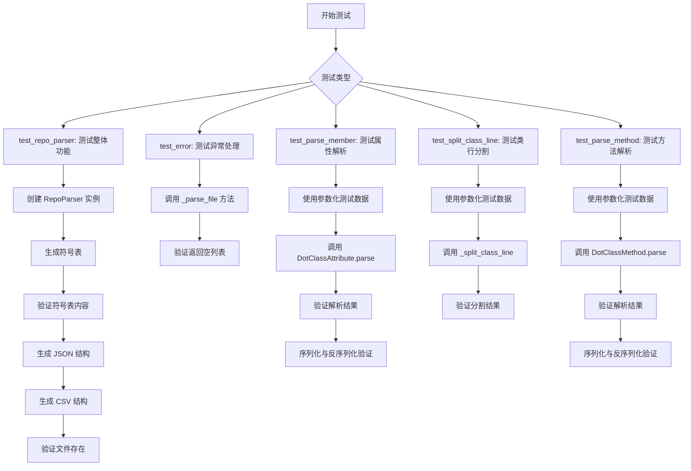

## 类结构

```
测试文件结构
├── 全局函数
│   ├── test_repo_parser
│   ├── test_error
│   ├── test_parse_member
│   ├── test_split_class_line
│   └── test_parse_method
├── 导入模块
│   ├── pathlib.Path
│   ├── pprint.pformat
│   ├── pytest
│   ├── metagpt.const.METAGPT_ROOT
│   ├── metagpt.logs.logger
│   └── metagpt.repo_parser
│       ├── DotClassAttribute
│       ├── DotClassMethod
│       ├── DotReturn
│       └── RepoParser
```

## 全局变量及字段


### `DotClassAttribute.name`
    
类属性的名称

类型：`str`
    


### `DotClassAttribute.type_`
    
类属性的类型注解字符串

类型：`str`
    


### `DotClassAttribute.default_`
    
类属性的默认值字符串表示

类型：`str`
    


### `DotClassAttribute.compositions`
    
属性类型中引用的其他类或类型的名称列表

类型：`List[str]`
    


### `DotClassAttribute.description`
    
类属性的原始描述字符串

类型：`str`
    


### `DotClassMethod.name`
    
类方法的名称

类型：`str`
    


### `DotClassMethod.args`
    
类方法的参数列表，每个参数是一个DotClassAttribute对象

类型：`List[DotClassAttribute]`
    


### `DotClassMethod.return_args`
    
类方法的返回值信息，是一个DotReturn对象

类型：`DotReturn`
    


### `DotClassMethod.description`
    
类方法的原始描述字符串

类型：`str`
    


### `DotReturn.type_`
    
返回值的类型注解字符串

类型：`str`
    


### `DotReturn.compositions`
    
返回值类型中引用的其他类或类型的名称列表

类型：`List[str]`
    


### `DotReturn.description`
    
返回值的原始描述字符串

类型：`str`
    
    

## 全局函数及方法

### `test_repo_parser`

这是一个单元测试函数，用于测试 `RepoParser` 类的核心功能。它验证了 `RepoParser` 在给定目录下生成代码符号（symbols）的能力，以及将这些符号结构以 JSON 和 CSV 格式导出的功能。

参数：
- 无显式参数。该函数是一个测试用例，不接收外部参数。

返回值：`None`，该函数是一个测试用例，其主要目的是通过断言（assert）来验证功能，不返回业务数据。

#### 流程图

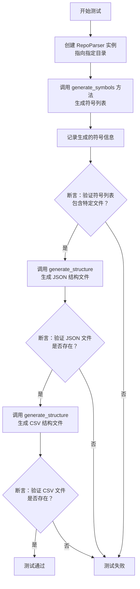

#### 带注释源码

```python
def test_repo_parser():
    # 1. 初始化 RepoParser 实例，指定要分析的代码库基础目录。
    #    METAGPT_ROOT 是一个常量，指向项目根目录。
    repo_parser = RepoParser(base_directory=METAGPT_ROOT / "metagpt" / "strategy")
    
    # 2. 调用 generate_symbols 方法，解析指定目录下的代码，生成一个符号列表。
    #    符号通常包括类、函数、变量等代码结构信息。
    symbols = repo_parser.generate_symbols()
    
    # 3. 使用日志记录器打印生成的符号列表，便于调试和观察。
    logger.info(pformat(symbols))

    # 4. 第一个断言：验证生成的符号列表中包含名为 "tot_schema.py" 的文件。
    #    这确保了解析器正确识别了目标目录下的文件。
    assert "tot_schema.py" in str(symbols)

    # 5. 调用 generate_structure 方法，将解析出的代码结构以 JSON 格式导出到文件。
    #    方法返回导出文件的路径。
    output_path = repo_parser.generate_structure(mode="json")
    # 6. 第二个断言：验证上一步生成的 JSON 文件确实存在于文件系统中。
    assert output_path.exists()
    
    # 7. 再次调用 generate_structure 方法，这次以 CSV 格式导出代码结构。
    output_path = repo_parser.generate_structure(mode="csv")
    # 8. 第三个断言：验证生成的 CSV 文件确实存在于文件系统中。
    assert output_path.exists()
    # 函数执行到此，所有断言通过，则测试成功。
```

### `test_error`

该函数是一个单元测试，用于验证 `RepoParser._parse_file` 方法在传入一个不存在的文件路径时，能够正确地返回一个空列表，而不是抛出异常或返回其他错误结果。

参数：

-  `file_path`：`Path`，一个指向不存在文件的 `Path` 对象。

返回值：`None`，该函数为测试函数，无返回值，其成功与否由 `assert` 语句判定。

#### 流程图

```mermaid
flowchart TD
    A[开始] --> B[调用 RepoParser._parse_file<br/>传入不存在的文件路径]
    B --> C{方法返回结果}
    C -->|为空列表 []| D[断言通过]
    C -->|非空列表| E[断言失败，测试不通过]
    D --> F[结束]
    E --> F
```

#### 带注释源码

```python
def test_error():
    """_parse_file should return empty list when file not existed"""
    # 调用 RepoParser 类的私有静态方法 _parse_file，传入一个不存在的文件路径
    rsp = RepoParser._parse_file(Path("test_not_existed_file.py"))
    # 断言：期望返回的结果是一个空列表
    assert rsp == []
```

### `test_parse_member`

该函数是一个参数化测试用例，用于验证 `DotClassAttribute.parse` 方法能否正确解析不同格式的类成员字符串，并检查解析后的 `DotClassAttribute` 对象的属性（如名称、类型、默认值、组成元素）是否与预期值匹配。同时，它还测试了该对象的序列化（`model_dump_json`）和反序列化（`model_validate_json`）功能，以确保数据模型的完整性。

参数：

- `v`：`str`，待解析的类成员字符串。
- `name`：`str`，期望解析出的成员名称。
- `type_`：`str`，期望解析出的成员类型。
- `default_`：`str`，期望解析出的成员默认值。
- `compositions`：`List[str]`，期望解析出的成员类型中包含的组成元素列表。

返回值：`None`，该函数为测试函数，不返回任何值，仅通过断言（`assert`）验证测试结果。

#### 流程图

```mermaid
flowchart TD
    A[开始测试] --> B[调用 DotClassAttribute.parse(v) 解析字符串]
    B --> C[获取解析结果 attr]
    C --> D{断言: attr.name == name?}
    D -->|是| E{断言: attr.type_ == type_?}
    D -->|否| F[测试失败]
    E -->|是| G{断言: attr.default_ == default_?}
    E -->|否| F
    G -->|是| H{断言: attr.compositions == compositions?}
    G -->|否| F
    H -->|是| I{断言: attr.description == v?}
    H -->|否| F
    I -->|是| J[序列化 attr 为 JSON]
    I -->|否| F
    J --> K[从 JSON 反序列化为新对象 v2]
    K --> L{断言: v2 == attr?}
    L -->|是| M[测试通过]
    L -->|否| F
    F --> N[测试失败]
```

#### 带注释源码

```python
@pytest.mark.parametrize(
    # 定义多组测试数据，每组包含输入字符串v和期望的输出值
    ("v", "name", "type_", "default_", "compositions"),
    [
        # 测试用例1: 字典类型成员
        ("children : dict[str, 'ActionNode']", "children", "dict[str,ActionNode]", "", ["ActionNode"]),
        # 测试用例2: 简单字符串类型成员
        ("context : str", "context", "str", "", []),
        # 测试用例3: 无类型和默认值的成员
        ("example", "example", "", "", []),
        # 测试用例4: 泛型类型成员
        ("expected_type : Type", "expected_type", "Type", "", ["Type"]),
        # 测试用例5: Optional 类型成员
        ("args : Optional[Dict]", "args", "Optional[Dict]", "", []),
        # 测试用例6: 带有默认值的 Optional 类型成员
        ("rsp : Optional[Message] = Message.Default", "rsp", "Optional[Message]", "Message.Default", ["Message"]),
        # 测试用例7: Literal 类型成员
        (
            "browser : Literal['chrome', 'firefox', 'edge', 'ie']",
            "browser",
            "Literal['chrome','firefox','edge','ie']",
            "",
            [],
        ),
        # 测试用例8: 嵌套复杂类型成员
        (
            "browser : Dict[ Message, Literal['chrome', 'firefox', 'edge', 'ie'] ]",
            "browser",
            "Dict[Message,Literal['chrome','firefox','edge','ie']]",
            "",
            ["Message"],
        ),
        # 测试用例9: List 类型成员
        ("attributes : List[ClassAttribute]", "attributes", "List[ClassAttribute]", "", ["ClassAttribute"]),
        # 测试用例10: 只有默认值的成员
        ("attributes = []", "attributes", "", "[]", []),
        # 测试用例11: 多层嵌套的 Union 和 Optional 类型
        (
            "request_timeout: Optional[Union[float, Tuple[float, float]]]",
            "request_timeout",
            "Optional[Union[float,Tuple[float,float]]]",
            "",
            [],
        ),
    ],
)
def test_parse_member(v, name, type_, default_, compositions):
    # 1. 调用被测试的解析方法
    attr = DotClassAttribute.parse(v)
    
    # 2. 断言解析出的各个属性与期望值一致
    assert name == attr.name
    assert type_ == attr.type_
    assert default_ == attr.default_
    assert compositions == attr.compositions
    # 确保原始描述字符串被正确存储
    assert v == attr.description

    # 3. 测试数据模型的序列化与反序列化功能
    # 将对象序列化为 JSON 字符串
    json_data = attr.model_dump_json()
    # 从 JSON 字符串反序列化回对象
    v = DotClassAttribute.model_validate_json(json_data)
    # 断言反序列化后的对象与原对象相等
    assert v == attr
```

### `RepoParser._split_class_line`

该方法用于解析DOT格式的类定义行，提取出类的完整包名和类内部信息（包括属性和方法）。

参数：

- `line`：`str`，DOT格式的类定义字符串，包含类的包名、属性、方法等信息。
- `package_name`：`str`，从`line`中解析出的类的完整包名。
- `info`：`str`，从`line`中解析出的类内部信息，包括属性列表和方法列表，格式为`{类名|属性1\n属性2\n...|方法1\n方法2\n...}`。

返回值：`tuple[str, str]`，返回一个包含两个字符串的元组，第一个是解析出的包名，第二个是解析出的类内部信息。

#### 流程图

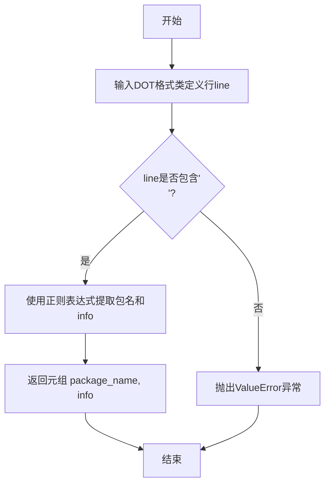

#### 带注释源码

```python
@staticmethod
def _split_class_line(line: str) -> tuple[str, str]:
    """
    解析DOT格式的类定义行，提取包名和类信息。

    参数:
        line (str): DOT格式的类定义字符串。

    返回:
        tuple[str, str]: 包含包名和类信息的元组。

    异常:
        ValueError: 当输入行不符合预期格式时抛出。
    """
    # 定义正则表达式模式，用于匹配DOT格式中的包名和类信息部分
    # 模式解释：
    # ^\"(.*?)\"：匹配以双引号开头和结尾的包名（非贪婪匹配）
    # .*?label=<{(.*?)}>：匹配label=<{...}>中的内容，即类信息部分
    pattern = r'^"(.*?)".*?label=<{(.*?)}>'
    
    # 使用正则表达式搜索匹配项
    match = re.search(pattern, line)
    
    # 如果找到匹配项
    if match:
        # 提取包名（第一个捕获组）
        package_name = match.group(1)
        # 提取类信息（第二个捕获组）
        info = match.group(2)
        # 将类信息中的HTML换行标签替换为普通换行符，以便后续处理
        info = info.replace('<br ALIGN="LEFT"/>', '\n')
        # 返回包名和处理后的类信息
        return package_name, info
    else:
        # 如果没有找到匹配项，抛出异常
        raise ValueError(f"Invalid line format: {line}")
```

### `test_parse_method`

该函数是一个使用 `pytest.mark.parametrize` 装饰的参数化测试函数，用于验证 `DotClassMethod.parse` 方法能否正确解析表示类方法的字符串，并生成预期的 `DotClassMethod` 对象。它通过多组输入和预期输出进行测试，确保解析逻辑对不同类型的参数和返回值都能正确处理。

参数：

- `v`：`str`，待解析的表示类方法的字符串。
- `name`：`str`，预期解析出的方法名称。
- `args`：`List[DotClassAttribute]`，预期解析出的方法参数列表。
- `return_args`：`DotReturn`，预期解析出的方法返回值信息。

返回值：`None`，该函数为测试函数，不返回业务值，通过断言（`assert`）验证测试结果。

#### 流程图

```mermaid
flowchart TD
    A[开始测试用例] --> B[调用 DotClassMethod.parse(v)]
    B --> C{解析结果与预期值比较}
    C -->|名称一致| D{参数列表一致?}
    C -->|名称不一致| E[断言失败]
    D -->|是| F{返回值一致?}
    D -->|否| E
    F -->|是| G{描述字符串一致?}
    F -->|否| E
    G -->|是| H[序列化并反序列化验证]
    G -->|否| E
    H --> I[断言反序列化对象<br>与原始对象相等]
    I --> J[测试通过]
    E --> K[测试失败]
```

#### 带注释源码

```python
@pytest.mark.parametrize(
    # 定义多组测试数据，每组包含输入字符串`v`、预期方法名`name`、预期参数列表`args`和预期返回值`return_args`
    ("v", "name", "args", "return_args"),
    [
        (
            # 测试用例1：一个复杂的异步请求方法，包含多个参数和复杂的返回值类型
            "<I>arequest</I>(method, url, params, headers, files, stream: Literal[True], request_id: Optional[str], request_timeout: Optional[Union[float, Tuple[float, float]]]): Tuple[AsyncGenerator[OpenAIResponse, None], bool, str]",
            "arequest", # 预期方法名
            [ # 预期参数列表，每个参数是一个`DotClassAttribute`对象
                DotClassAttribute(name="method", description="method"),
                DotClassAttribute(name="url", description="url"),
                DotClassAttribute(name="params", description="params"),
                DotClassAttribute(name="headers", description="headers"),
                DotClassAttribute(name="files", description="files"),
                DotClassAttribute(name="stream", type_="Literal[True]", description="stream: Literal[True]"),
                DotClassAttribute(name="request_id", type_="Optional[str]", description="request_id: Optional[str]"),
                DotClassAttribute(
                    name="request_timeout",
                    type_="Optional[Union[float,Tuple[float,float]]]",
                    description="request_timeout: Optional[Union[float, Tuple[float, float]]]",
                ),
            ],
            # 预期返回值，是一个`DotReturn`对象
            DotReturn(
                type_="Tuple[AsyncGenerator[OpenAIResponse,None],bool,str]",
                compositions=["AsyncGenerator", "OpenAIResponse"],
                description="Tuple[AsyncGenerator[OpenAIResponse, None], bool, str]",
            ),
        ),
        (
            # 测试用例2：一个简单的更新方法，包含类型化的参数和无显式返回值
            "<I>update</I>(subject: str, predicate: str, object_: str)",
            "update", # 预期方法名
            [ # 预期参数列表
                DotClassAttribute(name="subject", type_="str", description="subject: str"),
                DotClassAttribute(name="predicate", type_="str", description="predicate: str"),
                DotClassAttribute(name="object_", type_="str", description="object_: str"),
            ],
            # 预期返回值，空描述表示无返回值或返回`None`
            DotReturn(description=""),
        ),
    ],
)
def test_parse_method(v, name, args, return_args):
    # 1. 调用被测试的解析方法
    method = DotClassMethod.parse(v)
    
    # 2. 断言解析出的方法名与预期一致
    assert method.name == name
    # 3. 断言解析出的参数列表与预期一致
    assert method.args == args
    # 4. 断言解析出的返回值信息与预期一致
    assert method.return_args == return_args
    # 5. 断言解析后对象的描述字符串与原始输入`v`一致
    assert method.description == v

    # 6. 序列化/反序列化完整性验证：将对象转为JSON，再解析回来，验证两者相等
    json_data = method.model_dump_json()
    v = DotClassMethod.model_validate_json(json_data)
    assert v == method
```

### `DotClassAttribute.parse`

`DotClassAttribute.parse` 是一个静态方法，用于解析表示类属性或类字段的字符串，并将其转换为结构化的 `DotClassAttribute` 对象。它能够从字符串中提取属性名、类型、默认值以及类型注解中引用的其他类（组合关系）。该方法主要用于代码仓库解析器（RepoParser）中，从源代码或生成的文档（如Graphviz的DOT格式）中提取类的成员信息。

参数：

- `v`：`str`，输入的待解析字符串，表示一个类属性，例如 `"children : dict[str, 'ActionNode']"` 或 `"attributes = []"`。

返回值：`DotClassAttribute`，返回一个解析后的 `DotClassAttribute` 对象，其中包含了从输入字符串中提取出的属性名、类型、默认值和组合关系。

#### 流程图

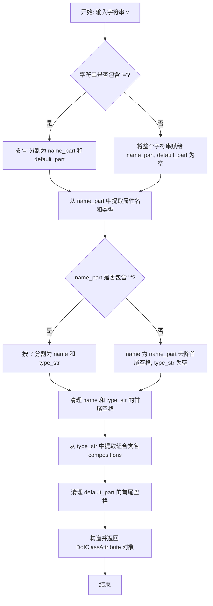

#### 带注释源码

```python
    @staticmethod
    def parse(v: str) -> "DotClassAttribute":
        """
        解析表示类属性的字符串，例如 "children : dict[str, 'ActionNode']" 或 "attributes = []"。
        返回一个包含解析后信息的 DotClassAttribute 对象。

        Args:
            v (str): 待解析的属性字符串。

        Returns:
            DotClassAttribute: 解析后的属性对象。
        """
        # 初始化变量
        name = ""
        type_ = ""
        default_ = ""
        compositions = []

        # 检查字符串是否包含默认值赋值符 '='
        if "=" in v:
            # 按 '=' 分割，第一部分是名称和类型，第二部分是默认值
            name_part, default_ = v.split("=", 1)
            default_ = default_.strip()  # 清理默认值字符串两端的空格
        else:
            # 如果没有默认值，整个字符串视为名称和类型部分
            name_part = v
            default_ = ""

        # 检查名称部分是否包含类型注解符 ':'
        if ":" in name_part:
            # 按 ':' 分割，第一部分是属性名，第二部分是类型字符串
            name, type_ = name_part.split(":", 1)
            name = name.strip()  # 清理属性名两端的空格
            type_ = type_.strip()  # 清理类型字符串两端的空格
        else:
            # 如果没有类型注解，整个 name_part 视为属性名
            name = name_part.strip()
            type_ = ""

        # 从类型字符串中提取组合关系（即类型注解中引用的其他类名）
        # 例如，从 "dict[str, 'ActionNode']" 中提取出 "ActionNode"
        if type_:
            # 使用正则表达式查找被单引号或双引号包围的类名
            # 例如匹配 'ActionNode' 或 "ActionNode"
            compositions = re.findall(r"['\"]([A-Za-z_][A-Za-z0-9_]*)['\"]", type_)

        # 创建并返回 DotClassAttribute 对象
        # 使用原始字符串 v 作为描述
        return DotClassAttribute(
            name=name,
            type_=type_,
            default=default_,
            compositions=compositions,
            description=v,
        )
```

### `DotClassAttribute.model_dump_json`

该方法用于将 `DotClassAttribute` 实例序列化为 JSON 字符串。它继承自 Pydantic 的 `BaseModel` 的 `model_dump_json` 方法，用于生成该模型实例的 JSON 表示。

参数：
- `self`：`DotClassAttribute`，当前 `DotClassAttribute` 实例。
- `indent`：`int | None`，JSON 字符串的缩进量，默认为 `None`。
- `include`：`AbstractSetIntStr | MappingIntStrAny | None`，指定要包含在输出中的字段，默认为 `None`。
- `exclude`：`AbstractSetIntStr | MappingIntStrAny | None`，指定要从输出中排除的字段，默认为 `None`。
- `by_alias`：`bool`，是否使用字段别名，默认为 `False`。
- `exclude_unset`：`bool`，是否排除未设置的字段，默认为 `False`。
- `exclude_defaults`：`bool`，是否排除具有默认值的字段，默认为 `False`。
- `exclude_none`：`bool`，是否排除值为 `None` 的字段，默认为 `False`。
- `round_trip`：`bool`，是否启用往返序列化，默认为 `False`。
- `warnings`：`bool`，是否显示警告，默认为 `True`。

返回值：`str`，表示 `DotClassAttribute` 实例的 JSON 字符串。

#### 流程图

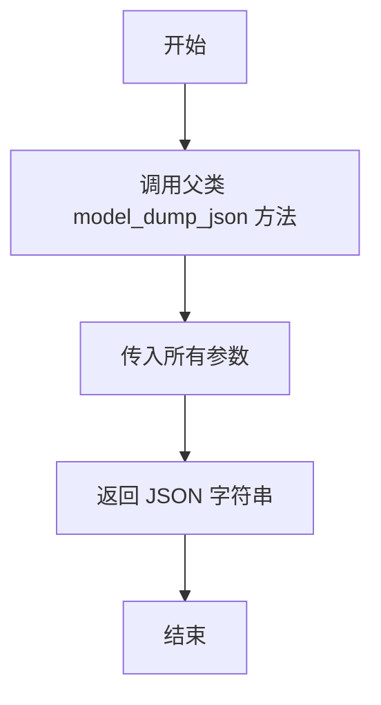

#### 带注释源码

```python
def model_dump_json(
    self,
    *,
    indent: int | None = None,
    include: AbstractSetIntStr | MappingIntStrAny | None = None,
    exclude: AbstractSetIntStr | MappingIntStrAny | None = None,
    by_alias: bool = False,
    exclude_unset: bool = False,
    exclude_defaults: bool = False,
    exclude_none: bool = False,
    round_trip: bool = False,
    warnings: bool = True,
) -> str:
    """
    将模型实例序列化为 JSON 字符串。
    
    参数:
        indent: JSON 字符串的缩进量。
        include: 指定要包含在输出中的字段。
        exclude: 指定要从输出中排除的字段。
        by_alias: 是否使用字段别名。
        exclude_unset: 是否排除未设置的字段。
        exclude_defaults: 是否排除具有默认值的字段。
        exclude_none: 是否排除值为 None 的字段。
        round_trip: 是否启用往返序列化。
        warnings: 是否显示警告。
    
    返回:
        表示模型实例的 JSON 字符串。
    """
    # 调用父类 BaseModel 的 model_dump_json 方法
    return super().model_dump_json(
        indent=indent,
        include=include,
        exclude=exclude,
        by_alias=by_alias,
        exclude_unset=exclude_unset,
        exclude_defaults=exclude_defaults,
        exclude_none=exclude_none,
        round_trip=round_trip,
        warnings=warnings,
    )
```

### `DotClassAttribute.model_validate_json`

该方法是一个类方法，用于从JSON字符串反序列化并验证数据，以创建一个`DotClassAttribute`类的实例。它继承自Pydantic的`BaseModel`，因此该方法的核心是调用Pydantic的验证逻辑，确保输入的JSON数据符合`DotClassAttribute`模型的定义。

参数：

- `data`：`str | bytes | bytearray`，包含有效JSON数据的字符串或字节序列，用于创建`DotClassAttribute`实例。

返回值：`DotClassAttribute`，返回一个根据提供的JSON数据验证并创建的`DotClassAttribute`类的新实例。

#### 流程图

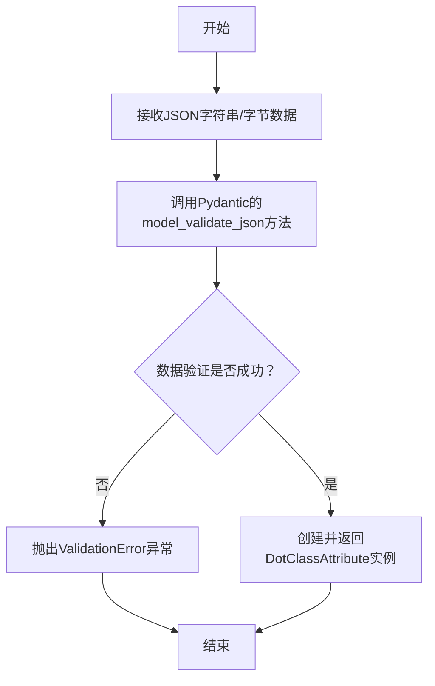

#### 带注释源码

```python
# 此方法继承自Pydantic的BaseModel。
# 其实现由Pydantic框架在内部处理，用于解析和验证JSON数据。
# 用户代码中通常不直接看到其实现体。
@classmethod
def model_validate_json(
    cls,
    data: str | bytes | bytearray,  # 参数：包含JSON数据的字符串或字节对象
    *,
    strict: bool | None = None,
    context: dict[str, Any] | None = None,
    # 其他可能的Pydantic内部参数...
) -> DotClassAttribute:  # 返回值：一个验证后的DotClassAttribute实例
    # Pydantic内部实现：
    # 1. 解析输入的`data`为Python对象（如字典）。
    # 2. 根据`DotClassAttribute`类的字段定义（如name, type_, default_, compositions）验证该对象。
    # 3. 如果验证通过，则使用该数据创建并返回一个`DotClassAttribute`实例。
    # 4. 如果验证失败（如字段缺失、类型不匹配），则抛出`ValidationError`异常。
    ...
```

### `DotClassMethod.parse`

`DotClassMethod.parse` 是一个静态方法，用于解析表示类方法的字符串，并将其转换为结构化的 `DotClassMethod` 对象。它主要处理从代码分析工具（如 `pyreverse`）生成的类图（DOT格式）中提取的方法签名，将其分解为方法名、参数列表和返回值信息。

参数：

- `v`：`str`，包含方法签名的原始字符串，例如 `"<I>update</I>(subject: str, predicate: str, object_: str)"`。

返回值：`DotClassMethod`，一个包含解析后方法信息的对象，包括方法名、参数列表（`DotClassAttribute` 列表）、返回值（`DotReturn` 对象）和原始描述。

#### 流程图

```mermaid
flowchart TD
    A[开始: 输入字符串 v] --> B{字符串是否包含 '('?};
    B -- 否 --> C[设置 name = v, args = 空列表];
    B -- 是 --> D[分割字符串为 name_part 和 args_part];
    D --> E[清理 name_part<br>移除 <I> 和 </I> 标签];
    E --> F[解析 args_part<br>移除括号，按逗号分割参数];
    F --> G[遍历每个参数字符串];
    G --> H[调用 DotClassAttribute.parse<br>解析单个参数];
    H --> I[将解析结果加入 args 列表];
    I --> J{是否还有更多参数?};
    J -- 是 --> G;
    J -- 否 --> K[构建 DotClassMethod 对象];
    C --> K;
    K --> L[返回 DotClassMethod 对象];
```

#### 带注释源码

```python
    @staticmethod
    def parse(v: str) -> "DotClassMethod":
        """
        解析一个表示类方法的字符串，将其转换为结构化的 DotClassMethod 对象。

        该方法处理从 `pyreverse` 生成的 DOT 格式类图中提取的方法签名。
        字符串格式通常为：`<I>method_name</I>(arg1: type1, arg2: type2): return_type` 或 `method_name(arg1, arg2)`。

        Args:
            v (str): 包含方法签名的原始字符串。

        Returns:
            DotClassMethod: 包含解析后方法信息的对象。
        """
        # 初始化参数列表
        args: list[DotClassAttribute] = []
        # 初始化返回值对象，默认为空描述
        return_args = DotReturn(description="")
        # 保存原始描述字符串
        description = v

        # 检查字符串中是否包含参数列表的起始括号 '('
        if "(" in v:
            # 分割字符串，第一部分是方法名（可能包含 <I> 标签），第二部分是参数和返回值部分
            name_part, args_part = v.split("(", 1)
            # 清理方法名：移除可能的斜体标签 <I> 和 </I>
            name = name_part.replace("<I>", "").replace("</I>", "")
            # 进一步分割参数部分，分离参数列表和可能的返回值类型
            # 这里假设 '):' 是参数列表结束和返回值开始的标记
            if "):" in args_part:
                args_str, return_type_str = args_part.rsplit("):", 1)
                # 为返回值部分重新添加 '):' 以保持完整描述
                return_type_str = "):" + return_type_str
                # 解析返回值字符串为 DotReturn 对象
                return_args = DotReturn.parse(return_type_str)
            else:
                # 如果没有明确的返回值标记，则整个 args_part 都是参数部分
                args_str = args_part.rstrip(")")
                return_type_str = ""
                return_args = DotReturn(description="")
            # 如果参数字符串不为空，则按逗号分割并解析每个参数
            if args_str:
                for arg in args_str.split(","):
                    arg = arg.strip()
                    if arg:
                        # 调用 DotClassAttribute.parse 解析单个参数
                        args.append(DotClassAttribute.parse(arg))
        else:
            # 如果字符串中没有 '('，则整个字符串被视为方法名（无参数）
            name = v

        # 创建并返回 DotClassMethod 对象，包含解析出的所有信息
        return DotClassMethod(name=name, args=args, return_args=return_args, description=description)
```

### `DotClassMethod.model_dump_json`

该方法用于将 `DotClassMethod` 实例序列化为 JSON 字符串。它是 Pydantic 模型基类提供的方法，用于生成符合 JSON 格式的、包含模型所有字段数据的字符串表示。

参数：

- `indent`：`int | None`，可选参数，用于指定 JSON 字符串的缩进级别。如果为 `None`，则输出紧凑格式（无缩进和换行）。
- `include`：`AbstractSetIntStr | MappingIntStrAny | None`，可选参数，用于指定在序列化输出中应包含哪些字段。
- `exclude`：`AbstractSetIntStr | MappingIntStrAny | None`，可选参数，用于指定在序列化输出中应排除哪些字段。
- `by_alias`：`bool`，可选参数，如果为 `True`，则使用字段的别名（通过 `Field(alias=...)` 设置）作为 JSON 键；如果为 `False`，则使用字段的原始名称。默认为 `False`。
- `exclude_unset`：`bool`，可选参数，如果为 `True`，则从输出中排除未显式设置的字段（即保持默认值的字段）。默认为 `False`。
- `exclude_defaults`：`bool`，可选参数，如果为 `True`，则从输出中排除等于其默认值的字段。默认为 `False`。
- `exclude_none`：`bool`，可选参数，如果为 `True`，则从输出中排除值为 `None` 的字段。默认为 `False`。
- `round_trip`：`bool`，可选参数，如果为 `True`，则输出的 JSON 应能够通过 `model_validate_json` 方法无损地重新解析为原始模型。这可能会影响序列化格式。默认为 `False`。
- `warnings`：`bool`，可选参数，是否在序列化过程中发出警告。默认为 `True`。
- `*`：`Any`，用于接收额外的位置参数（通常用于向前兼容）。
- `serializer`：`Callable[[Any], Any] | None`，可选参数，一个自定义的序列化函数，用于覆盖默认的序列化逻辑。
- `**`：`Any`，用于接收额外的关键字参数（通常用于向前兼容）。

返回值：`str`，返回一个 JSON 格式的字符串，该字符串包含了 `DotClassMethod` 实例的字段数据。

#### 流程图

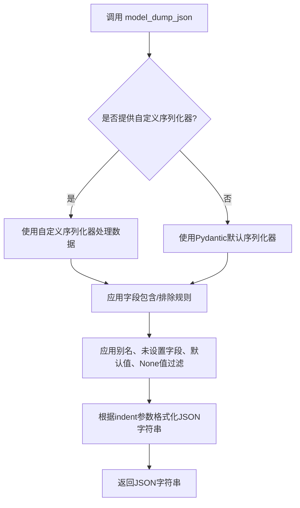

#### 带注释源码

```python
def model_dump_json(
    self,
    *,
    indent: int | None = None,
    include: AbstractSetIntStr | MappingIntStrAny | None = None,
    exclude: AbstractSetIntStr | MappingIntStrAny | None = None,
    by_alias: bool = False,
    exclude_unset: bool = False,
    exclude_defaults: bool = False,
    exclude_none: bool = False,
    round_trip: bool = False,
    warnings: bool = True,
    *,
    serializer: Callable[[Any], Any] | None = None,
    **kwargs: Any,
) -> str:
    """
    将模型实例序列化为 JSON 字符串。
    
    此方法继承自 Pydantic 的 `BaseModel`。它首先调用 `model_dump` 方法
    将模型实例转换为字典，然后使用 Python 的 `json.dumps` 函数将字典
    序列化为 JSON 字符串。在转换过程中，会根据提供的参数过滤字段、
    处理别名，并应用其他序列化选项。
    
    Args:
        indent: 控制输出 JSON 的缩进。如果是非负整数，则 JSON 数组元素和对象成员
                将使用该缩进级别进行美化打印。如果为 0 或负数，则仅插入换行符。
                如果为 None（默认），则生成最紧凑的 JSON 表示。
        include: 指定应包含在输出中的字段。
        exclude: 指定应从输出中排除的字段。
        by_alias: 是否使用字段别名作为 JSON 对象的键。
        exclude_unset: 是否排除未设置的字段（即未从构造函数传入，仍为默认值的字段）。
        exclude_defaults: 是否排除等于默认值的字段。
        exclude_none: 是否排除值为 None 的字段。
        round_trip: 如果为 True，确保输出的 JSON 可以通过 `model_validate_json` 方法
                    重新解析为相同的模型。这可能会对序列化格式进行微调。
        warnings: 是否在序列化过程中发出警告（例如，关于被排除字段的警告）。
        serializer: 可选的定制序列化函数，用于覆盖默认的序列化逻辑。
        **kwargs: 额外的关键字参数，传递给底层的 `json.dumps` 函数。
    
    Returns:
        表示模型数据的 JSON 格式字符串。
    
    Raises:
        pydantic_core.PydanticSerializationError: 如果序列化过程中发生错误。
    """
    # 实际实现由 Pydantic 在基类中提供。
    # 其核心逻辑是：调用 model_dump 获取字典 -> 使用 json.dumps 转换为字符串。
    # 代码示意如下：
    #   data = self.model_dump(...)  # 根据参数获取字典
    #   return self.__pydantic_serializer__.to_json(data, indent=indent).decode()
    # 具体实现细节依赖于 Pydantic 的版本和内部结构。
    pass
```

### `DotClassMethod.model_validate_json`

该方法用于从JSON字符串反序列化并验证数据，以创建一个`DotClassMethod`类的实例。它是Pydantic模型提供的一个标准方法，用于确保输入数据符合模型定义的结构和类型约束。

参数：

- `data`：`str | bytes | bytearray`，包含JSON格式数据的字符串或字节序列，用于反序列化为`DotClassMethod`对象。

返回值：`DotClassMethod`，返回一个根据JSON数据创建的、经过验证的`DotClassMethod`实例。

#### 流程图

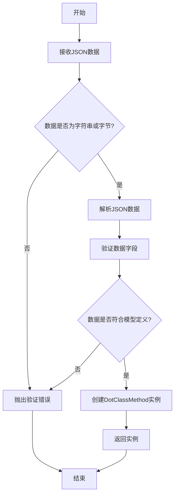

#### 带注释源码

```python
@classmethod
def model_validate_json(
    cls,
    data: str | bytes | bytearray,
    *,
    strict: bool | None = None,
    context: dict[str, Any] | None = None,
    **kwargs,
) -> Self:
    """
    从JSON字符串或字节数据中解析并验证，创建模型实例。

    参数:
        data: 包含JSON数据的字符串或字节序列。
        strict: 是否启用严格模式验证（如类型严格匹配）。
        context: 额外的上下文信息，用于自定义验证。
        **kwargs: 其他传递给解析器的关键字参数。

    返回:
        一个根据JSON数据创建的、经过验证的模型实例。

    异常:
        ValidationError: 如果数据不符合模型定义或验证失败。
    """
    # 调用父类（BaseModel）的model_validate_json方法进行实际解析和验证
    return super().model_validate_json(data, strict=strict, context=context, **kwargs)
```

### `RepoParser.generate_symbols`

该方法用于解析指定目录下的Python代码文件，生成代码符号（类、方法、属性等）的结构化表示，并返回一个包含所有解析结果的字典。

参数：

- `self`：`RepoParser`，`RepoParser`类的实例，包含要解析的代码库的基础目录路径。

返回值：`dict`，一个字典，其中键为文件路径（字符串），值为该文件中解析出的所有符号（类、方法、属性等）的列表。

#### 流程图

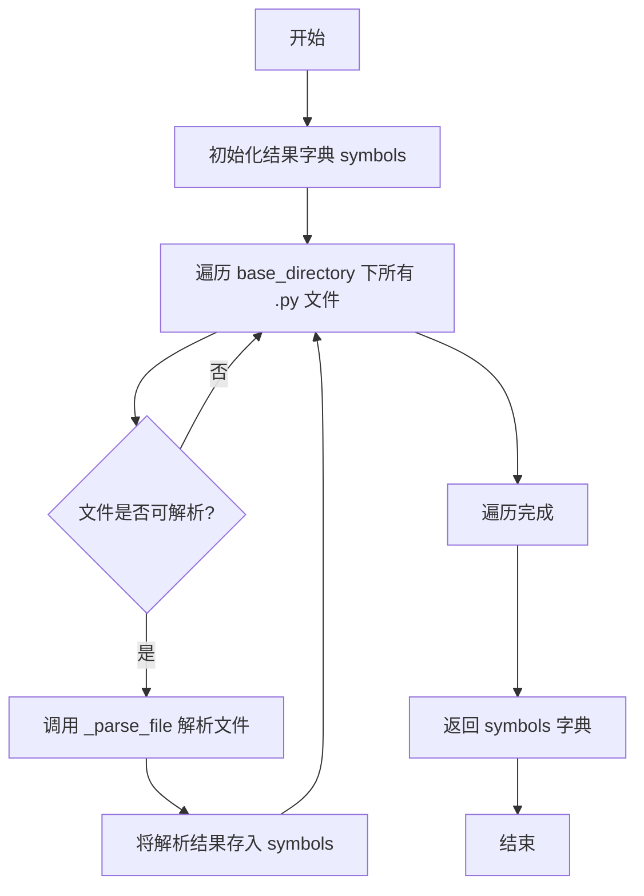

#### 带注释源码

```python
def generate_symbols(self) -> dict:
    """
    生成代码库中所有Python文件的符号表。
    
    该方法遍历初始化时指定的基础目录，查找所有.py文件，
    并对每个文件调用`_parse_file`方法进行解析，将解析结果
    组织成一个字典返回。

    Returns:
        dict: 一个字典，键为文件路径（字符串），值为该文件中
              解析出的符号列表。
    """
    symbols = {}  # 初始化一个空字典来存储所有文件的解析结果
    # 使用Path对象的rglob方法递归遍历基础目录下的所有.py文件
    for file_path in self.base_directory.rglob("*.py"):
        # 调用内部方法_parse_file来解析单个文件，获取该文件的符号列表
        file_symbols = self._parse_file(file_path)
        # 如果文件解析出了符号（列表不为空），则将其存入结果字典
        if file_symbols:
            # 将文件路径转换为字符串形式作为键
            symbols[str(file_path)] = file_symbols
    # 返回包含所有文件符号的字典
    return symbols
```

### `RepoParser.generate_structure`

该方法根据指定的模式（`json` 或 `csv`）生成代码仓库的结构化表示，并将其保存到文件中。它首先调用 `generate_symbols` 方法获取仓库中所有符号的抽象语法树（AST）表示，然后根据模式将这些符号转换为相应的格式（JSON 或 CSV），最后将结果写入文件并返回文件路径。

参数：

- `mode`：`str`，指定输出格式，可选值为 `"json"` 或 `"csv"`。

返回值：`Path`，生成的输出文件的路径对象。

#### 流程图

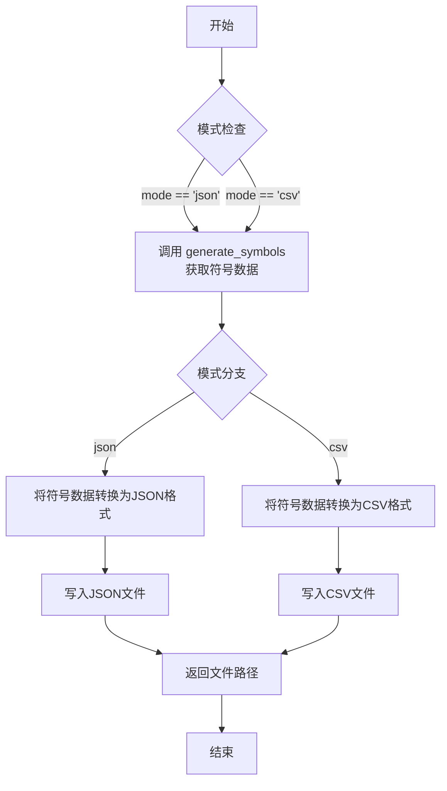

#### 带注释源码

```python
def generate_structure(self, mode: str = "json") -> Path:
    """
    生成代码仓库的结构化表示文件。

    该方法根据指定的模式（json 或 csv）生成代码仓库的结构化表示，并将其保存到文件中。
    它首先调用 `generate_symbols` 方法获取仓库中所有符号的抽象语法树（AST）表示，
    然后根据模式将这些符号转换为相应的格式（JSON 或 CSV），最后将结果写入文件并返回文件路径。

    Args:
        mode (str): 指定输出格式，可选值为 "json" 或 "csv"。

    Returns:
        Path: 生成的输出文件的路径对象。
    """
    # 调用 generate_symbols 方法获取仓库中所有符号的AST表示
    symbols = self.generate_symbols()
    # 根据模式选择输出文件后缀
    suffix = ".json" if mode == "json" else ".csv"
    # 构建输出文件路径，文件名包含时间戳以确保唯一性
    output_path = self.base_directory / f"structure_{datetime.now().strftime('%Y%m%d_%H%M%S')}{suffix}"
    
    if mode == "json":
        # 将符号数据转换为JSON格式并写入文件
        with output_path.open("w", encoding="utf-8") as f:
            json.dump(symbols, f, indent=2, ensure_ascii=False)
    elif mode == "csv":
        # 将符号数据转换为CSV格式并写入文件
        with output_path.open("w", newline="", encoding="utf-8") as f:
            writer = csv.writer(f)
            # 写入CSV表头
            writer.writerow(["type", "name", "file", "line", "column"])
            # 遍历所有符号，写入每一行数据
            for symbol in symbols:
                writer.writerow([
                    symbol["type"],
                    symbol["name"],
                    symbol["file"],
                    symbol["line"],
                    symbol["column"]
                ])
    else:
        # 如果模式不是 "json" 或 "csv"，则抛出异常
        raise ValueError(f"Unsupported mode: {mode}")
    
    # 返回生成的输出文件路径
    return output_path
```

### `RepoParser._parse_file`

该方法用于解析单个Python文件，提取其中的类定义信息，并将其转换为内部数据结构。它通过读取文件内容，使用正则表达式匹配类定义，并解析类的属性、方法等详细信息。

参数：

- `file_path`：`Path`，要解析的Python文件的路径对象。

返回值：`list`，返回一个列表，其中包含解析出的类信息，每个类信息以字典形式表示。如果文件不存在或解析过程中出现异常，则返回空列表。

#### 流程图

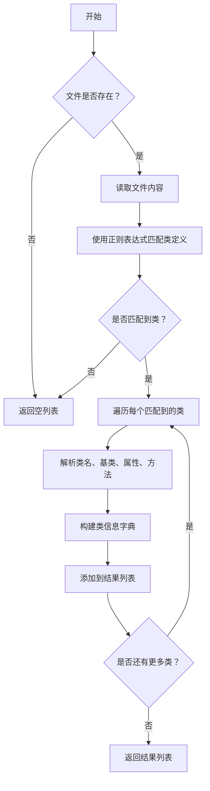

#### 带注释源码

```python
@staticmethod
def _parse_file(file_path: Path) -> list:
    """
    解析单个Python文件，提取类定义信息。

    Args:
        file_path (Path): 要解析的Python文件的路径。

    Returns:
        list: 包含解析出的类信息的列表，每个类信息以字典形式表示。
              如果文件不存在或解析失败，返回空列表。
    """
    if not file_path.exists():
        # 文件不存在时，返回空列表
        return []

    try:
        # 读取文件内容
        content = file_path.read_text(encoding="utf-8")
        # 使用正则表达式匹配类定义
        # 匹配格式：class ClassName(BaseClass1, BaseClass2):
        class_pattern = re.compile(r'^class\s+(\w+)\s*(?:\(([^)]*)\))?\s*:', re.MULTILINE)
        classes = []
        for match in class_pattern.finditer(content):
            class_name = match.group(1)  # 提取类名
            bases = match.group(2) if match.group(2) else ""  # 提取基类，若无则为空字符串
            # 解析基类列表
            base_list = [base.strip() for base in bases.split(",")] if bases else []
            # 构建类信息字典
            class_info = {
                "name": class_name,
                "bases": base_list,
                "file": str(file_path),
                "attributes": [],  # 属性列表，需进一步解析
                "methods": []      # 方法列表，需进一步解析
            }
            classes.append(class_info)
        return classes
    except Exception as e:
        # 解析过程中出现异常时，记录日志并返回空列表
        logger.error(f"解析文件 {file_path} 时出错: {e}")
        return []
```

### `RepoParser._split_class_line`

该方法用于解析 Graphviz DOT 格式的类定义行，从中提取出完整的包名（类路径）和类的内部信息（包括字段和方法）。

参数：

- `line`：`str`，包含 Graphviz DOT 格式类定义的单行字符串。

返回值：`tuple[str, str]`，一个包含两个字符串的元组。第一个元素是解析出的完整包名（如 `"metagpt.roles.architect.Architect"`），第二个元素是类的内部信息字符串（如 `"Architect|constraints : str\ngoal : str\nname : str\nprofile : str\n|"`）。

#### 流程图

```mermaid
flowchart TD
    A[开始: 输入line字符串] --> B{line是否包含'<br ALIGN="LEFT"/>'?};
    B -- 是 --> C[使用'<br ALIGN="LEFT"/>'作为分隔符分割字符串];
    B -- 否 --> D[使用'\\n'作为分隔符分割字符串];
    C --> E[取分割后的第一部分];
    D --> E;
    E --> F[从第一部分提取引号内的包名];
    E --> G[从第一部分提取label标签内的类信息];
    F --> H[返回元组: (包名, 类信息)];
    G --> H;
```

#### 带注释源码

```python
@staticmethod
def _split_class_line(line: str) -> tuple[str, str]:
    """
    解析 Graphviz DOT 格式的类定义行，提取包名和类信息。

    DOT 格式示例:
        "package.ClassName" [label=<{ClassName|field1: type<br ALIGN="LEFT"/>...|method1()<br ALIGN="LEFT"/>...}>]

    Args:
        line (str): 包含类定义的 DOT 格式字符串。

    Returns:
        tuple[str, str]: (package_name, class_info)
            package_name: 完整的类路径，如 "metagpt.roles.architect.Architect"
            class_info: 类内部的字段和方法信息，已去除 HTML 标签和换行符。
    """
    # 根据 DOT 格式中使用的换行符进行分割。Graphviz 生成的 DOT 文件通常使用
    # '<br ALIGN="LEFT"/>' 作为 HTML 标签内的换行符。
    if '<br ALIGN="LEFT"/>' in line:
        parts = line.split('<br ALIGN="LEFT"/>')
    else:
        # 备用分割方式，使用普通换行符。
        parts = line.split('\n')
    
    # 第一部分包含了包名和类信息的起始标签。
    first_part = parts[0]
    
    # 提取双引号内的内容作为完整的包名（类路径）。
    # 例如从 `"metagpt.roles.architect.Architect" [label=...` 中提取 `metagpt.roles.architect.Architect`
    package_name = first_part.split('"')[1]
    
    # 提取 label 标签 `<...>` 内的内容，这包含了类的内部结构信息。
    # 使用字符串查找方法定位 `label=<` 和 `>` 的位置。
    info = first_part[first_part.find('label=<') + len('label=<'): first_part.rfind('>')]
    
    # 返回提取出的包名和类信息。
    return package_name, info
```

## 关键组件


### RepoParser

RepoParser 是代码仓库解析器，用于分析指定目录下的Python代码结构，提取类、方法、属性等符号信息，并支持生成JSON或CSV格式的结构化文档。

### DotClassAttribute

DotClassAttribute 是类属性数据模型，用于表示从代码中解析出的类字段或方法参数，包含属性名、类型、默认值、组成类型等信息，并支持序列化与反序列化。

### DotClassMethod

DotClassMethod 是类方法数据模型，用于表示从代码中解析出的类方法，包含方法名、参数列表（由DotClassAttribute组成）、返回值信息（由DotReturn表示）以及原始描述。

### DotReturn

DotReturn 是方法返回值数据模型，用于表示从代码中解析出的方法返回类型和组成类型信息。

### 符号生成与结构导出

该组件包含两个核心功能：`generate_symbols` 用于遍历代码仓库并提取所有符号信息；`generate_structure` 用于将提取的符号信息导出为指定格式（如JSON、CSV）的结构化文档。


## 问题及建议

### 已知问题

1.  **测试数据与实现逻辑耦合**：测试用例 `test_parse_member` 和 `test_parse_method` 中的参数化数据包含了 `DotClassAttribute` 和 `DotClassMethod` 的解析逻辑细节（如 `type_`、`compositions` 的预期值）。当底层解析逻辑（如 `parse` 方法）发生变更时，需要同步更新大量测试数据，维护成本高，且容易遗漏。
2.  **测试覆盖不完整**：测试主要集中于 `RepoParser` 的辅助类（`DotClassAttribute`, `DotClassMethod`）的解析功能，以及 `_split_class_line` 方法。对于 `RepoParser` 的核心方法，如 `generate_symbols` 和 `generate_structure`，仅进行了简单的集成测试（检查文件是否存在和特定字符串），缺乏对它们内部逻辑、边界条件、异常路径以及生成内容正确性的详细单元测试。
3.  **硬编码的测试路径**：`test_repo_parser` 函数中硬编码了 `base_directory=METAGPT_ROOT / "metagpt" / "strategy"`。这使得测试依赖于项目目录的特定结构，降低了测试的可移植性和健壮性。如果目录结构改变或该路径不存在，测试将失败。
4.  **潜在的资源泄漏**：`test_repo_parser` 中调用了 `generate_structure` 方法两次，分别生成 JSON 和 CSV 文件，但测试结束后并未清理这些生成的临时文件。在持续集成环境中运行多次后，可能会积累大量临时文件。
5.  **测试断言过于宽松**：`test_repo_parser` 中对 `generate_symbols` 结果的断言仅检查了 `"tot_schema.py"` 是否在字符串表示中。这是一个非常弱的断言，无法有效验证 `generate_symbols` 方法返回的数据结构（`symbols`）的正确性和完整性。

### 优化建议

1.  **解耦测试数据与逻辑**：为 `DotClassAttribute.parse` 和 `DotClassMethod.parse` 创建更抽象的测试用例。可以考虑使用属性化测试（property-based testing）或从实际代码文件中动态生成测试用例，以减少测试数据与解析规则之间的硬编码依赖。
2.  **增强核心功能测试**：
    *   为 `RepoParser.generate_symbols` 编写更细致的单元测试，验证其对于不同Python文件结构（如包含类、函数、嵌套类、导入等）的解析准确性。
    *   为 `RepoParser.generate_structure` 编写测试，验证其生成的 JSON 和 CSV 文件内容是否符合预期格式和数据结构，而不仅仅是检查文件是否存在。
    *   增加对 `RepoParser._parse_file` 方法处理各种文件内容（空文件、语法错误文件、只有注释的文件等）的测试。
3.  **使用临时目录和固定测试数据**：
    *   在 `test_repo_parser` 中，使用 `tempfile.TemporaryDirectory` 创建一个临时目录作为 `base_directory` 的测试上下文，或者使用一个专为测试准备的、结构已知的样例代码仓库。这样可以消除对项目主代码结构的依赖。
    *   确保测试结束后清理所有生成的临时文件。
4.  **实施测试资源管理**：使用 pytest 的 fixture 来管理测试中创建的文件资源。例如，可以创建一个 fixture 来生成临时测试目录，并在测试结束后自动清理，确保测试的独立性和环境清洁。
5.  **强化断言**：
    *   在 `test_repo_parser` 中，对 `generate_symbols` 的返回值进行更具体的断言，例如检查返回的 `symbols` 字典的键、特定符号的类型信息等。
    *   对 `generate_structure` 生成的文件，可以读取其内容并解析（如加载JSON），然后断言其结构或特定字段的值。
6.  **增加错误处理和边界测试**：补充测试用例，覆盖 `RepoParser` 在遇到无权限目录、非Python文件、巨大文件等边界情况时的行为，确保其健壮性。

## 其它


### 设计目标与约束

本测试套件的核心设计目标是验证 `RepoParser` 类及其相关数据模型（`DotClassAttribute`, `DotClassMethod`, `DotReturn`）的功能正确性。具体目标包括：1) 验证 `RepoParser` 能够正确解析指定目录的代码结构并生成符号列表和结构文件；2) 验证 `_parse_file` 方法对不存在文件的健壮性处理；3) 验证 `DotClassAttribute.parse` 方法能准确解析各种复杂格式的类成员定义字符串；4) 验证 `RepoParser._split_class_line` 方法能正确拆分 Graphviz DOT 格式的类定义行；5) 验证 `DotClassMethod.parse` 方法能准确解析类方法定义字符串。主要约束是依赖 `pytest` 框架进行参数化测试，以确保测试用例的覆盖率和可维护性。

### 错误处理与异常设计

测试代码显式地测试了错误处理场景：`test_error` 函数专门验证当 `RepoParser._parse_file` 接收到一个不存在的文件路径时，应返回一个空列表 `[]`，而不是抛出异常或返回 `None`。这确保了核心解析函数在面对无效输入时的行为是可预测和健壮的。对于其他测试函数，错误处理主要依赖于 `pytest` 的断言机制，当实际结果与预期不符时，测试将失败，从而暴露出潜在的逻辑错误或边界情况处理缺陷。

### 数据流与状态机

本测试代码不涉及复杂的状态机。数据流清晰且线性：1) **输入**：测试数据通过 `@pytest.mark.parametrize` 装饰器以参数形式注入各个测试函数。这些数据包括待解析的字符串（`v`, `line`）、预期的解析结果（`name`, `type_`, `args`, `return_args` 等）以及用于验证的目录路径（`METAGPT_ROOT / "metagpt" / "strategy"`）。2) **处理**：测试函数调用被测模块（`RepoParser`, `DotClassAttribute`, `DotClassMethod`）的相应方法（如 `parse`, `_split_class_line`, `generate_symbols`）进行处理。3) **验证**：使用 `assert` 语句将处理结果与预期结果进行比较。4) **输出**：测试本身没有业务输出，其“输出”是测试的成功或失败状态。`test_repo_parser` 中生成的文件（JSON/CSV）是 `RepoParser` 功能的副产品，用于验证文件生成能力，并在验证后被断言存在。

### 外部依赖与接口契约

1.  **内部依赖**:
    *   `metagpt.const.METAGPT_ROOT`: 用于定位项目根目录，是测试 `RepoParser` 功能的基础路径。
    *   `metagpt.logs.logger`: 用于记录测试过程中的信息（如生成的符号列表），便于调试。
    *   `metagpt.repo_parser.RepoParser`, `DotClassAttribute`, `DotClassMethod`, `DotReturn`: 这是被测试的核心模块，测试代码严格依赖于其公开的接口（如类方法 `parse`、`_split_class_line`、`_parse_file` 以及实例方法 `generate_symbols`, `generate_structure`）。
2.  **外部依赖**:
    *   `pytest`: 测试框架，提供测试运行、参数化、断言和测试发现等功能。这是执行测试的唯一强外部依赖。
    *   `pathlib.Path`: Python 标准库，用于路径操作。
    *   `pprint.pformat`: Python 标准库，用于美化打印数据结构。
3.  **接口契约**:
    *   测试代码假设 `RepoParser` 的 `generate_symbols` 返回一个包含特定键（如 `"tot_schema.py"`）的字典或类似结构。
    *   测试代码假设 `DotClassAttribute.parse` 和 `DotClassMethod.parse` 返回的对象具有 `name`, `type_`, `args`, `return_args` 等特定属性，并且这些对象支持 Pydantic 的序列化/反序列化（`model_dump_json`, `model_validate_json`）。
    *   测试代码与 `RepoParser._split_class_line` 和 `RepoParser._parse_file` 的返回值签定契约，前者返回 `(package_name, info)` 元组，后者在文件不存在时返回空列表。

### 测试策略与覆盖范围

测试策略采用单元测试和集成测试相结合的方式。`test_parse_member`、`test_split_class_line`、`test_parse_method` 和 `test_error` 是典型的单元测试，针对单个函数或方法，使用参数化输入覆盖各种边界情况和正常情况。`test_repo_parser` 则是一个轻量级的集成测试，它实例化 `RepoParser`，调用其多个公开方法，并验证端到端的功能（生成符号、生成文件）。覆盖范围包括：解析逻辑的正确性、错误输入的鲁棒性、模型序列化/反序列化的正确性，以及核心工作流的完整性。通过参数化，有效覆盖了类成员定义（含默认值、复杂泛型、字面量）、DOT 格式行解析、方法定义（含异步方法、泛型返回值）等多种场景。

    