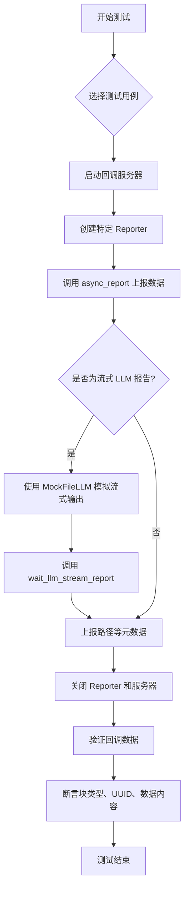
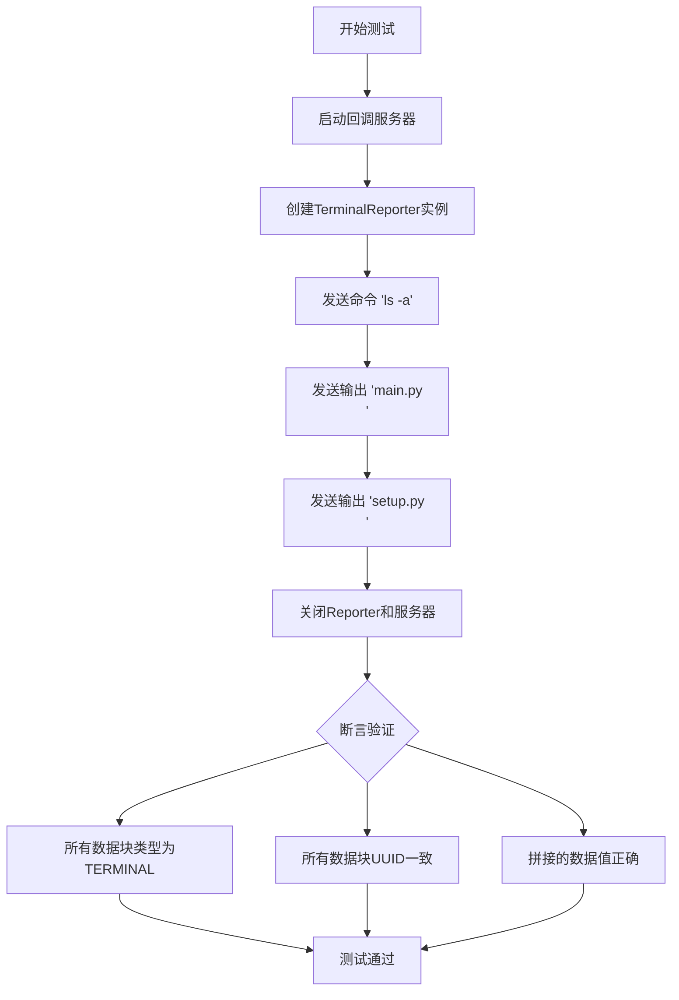
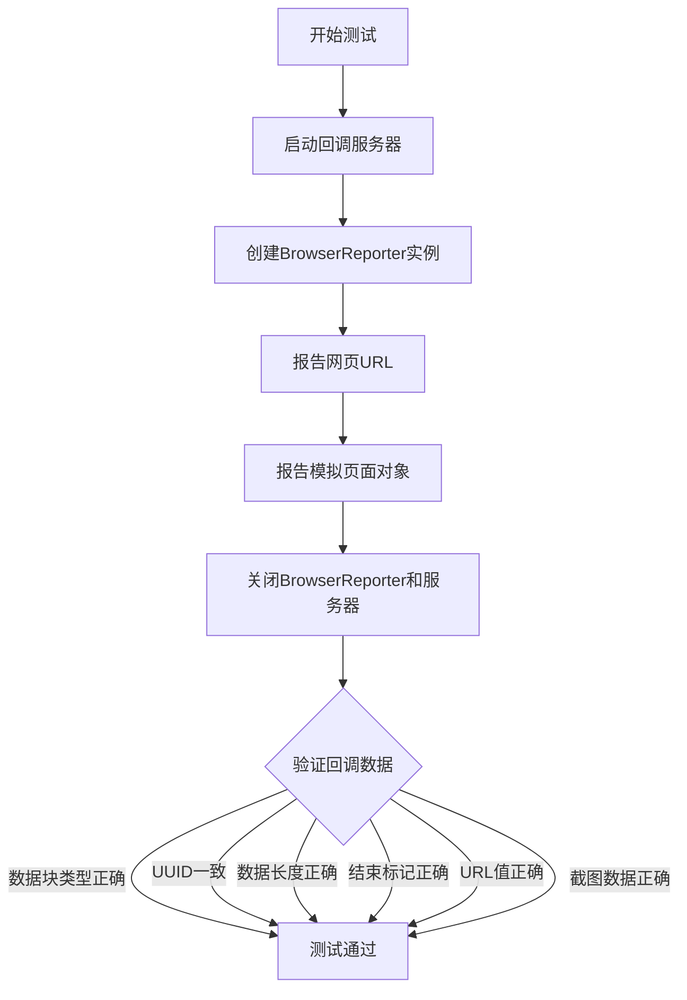
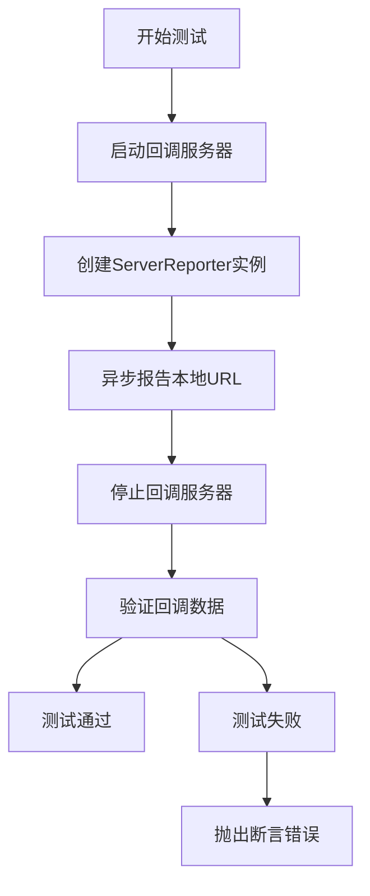
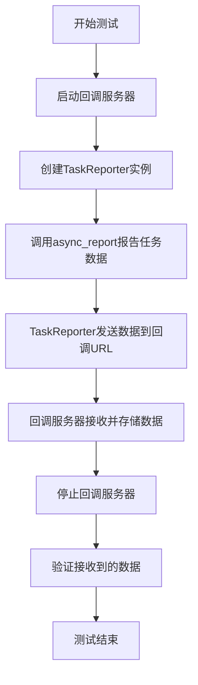
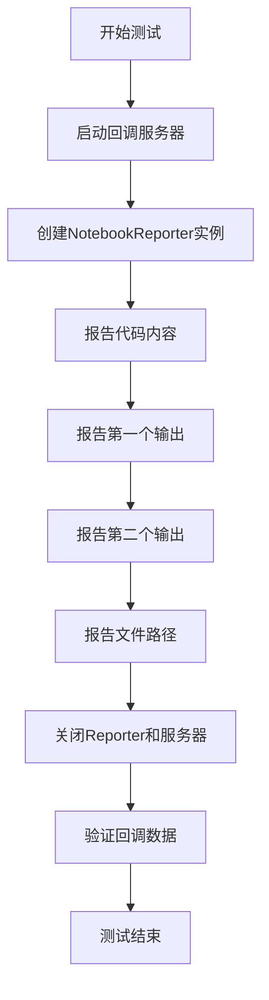
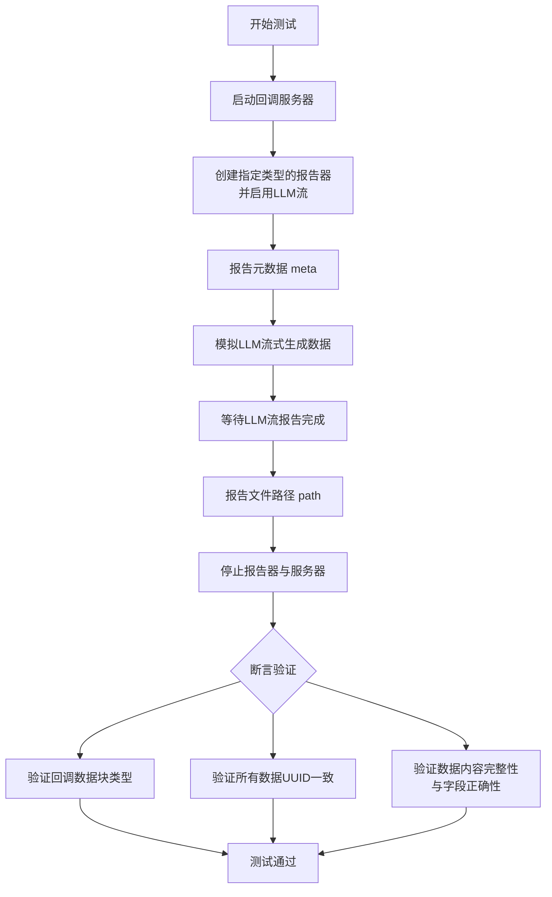
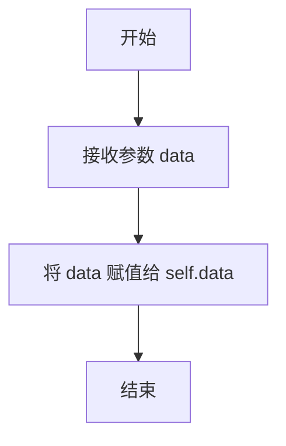
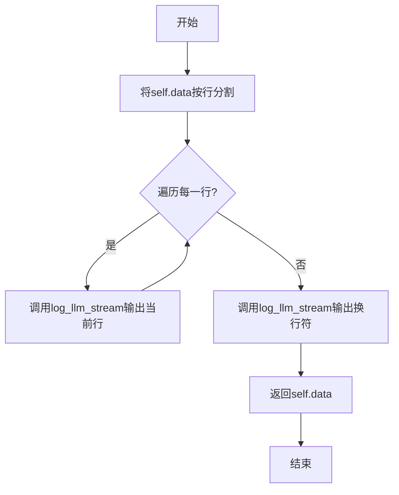

# `.\MetaGPT\tests\metagpt\test_reporter.py` 详细设计文档

该文件是一个测试套件，用于验证 MetaGPT 框架中各种 Reporter（报告器）类的功能。这些 Reporter 负责将不同类型的数据（如终端命令输出、浏览器截图、服务器状态、任务信息、Notebook 代码和输出、以及 LLM 生成的文档和代码）异步上报到一个回调服务器。测试通过模拟数据流和 HTTP 服务器来验证 Reporter 是否正确序列化数据、生成正确的块类型（BlockType）、维护一致的 UUID 以及处理流式 LLM 输出。

## 整体流程



## 类结构

```
测试文件 (test_reporters.py)
├── 模拟类 (MockFileLLM)
├── 上下文管理器 (callback_server)
└── 测试函数
    ├── test_terminal_report
    ├── test_browser_report
    ├── test_server_reporter
    ├── test_task_reporter
    ├── test_notebook_reporter
    └── test_llm_stream_reporter (参数化测试)
```

## 全局变量及字段


### `MockFileLLM.data`
    
存储用于模拟LLM响应的原始字符串数据。

类型：`str`
    
    

## 全局函数及方法

### `callback_server`

`callback_server` 是一个异步上下文管理器，用于在测试中创建一个临时的 HTTP 服务器，该服务器接收并存储通过 HTTP POST 请求发送的 JSON 数据。它主要用于模拟一个回调端点，以便测试各种 Reporter 类（如 `TerminalReporter`、`BrowserReporter` 等）是否正确地将数据发送到指定的 URL。

参数：

- `http_server`：`function`，一个异步函数，接收一个请求处理函数并返回一个包含服务器实例和 URL 的元组 `(server, url)`。该参数通常由测试框架（如 `pytest-aiohttp`）提供。

返回值：`AsyncContextManager[tuple[str, list]]`，返回一个异步上下文管理器，该管理器在进入时生成一个包含服务器 URL 和用于存储回调数据的列表的元组 `(url, callback_data)`，在退出时停止服务器。

#### 流程图

```mermaid
flowchart TD
    A[调用 callback_server<br>传入 http_server 函数] --> B[定义内部列表 callback_data<br>和请求处理函数 handler]
    B --> C[调用 http_server(handler)<br>启动服务器并获取 (server, url)]
    C --> D[yield (url, callback_data)<br>将控制权交给 with 块内部]
    D --> E[with 块内部执行测试逻辑<br>Reporter 向 url 发送数据]
    E --> F[with 块执行完毕<br>上下文管理器退出]
    F --> G[调用 await server.stop()<br>停止 HTTP 服务器]
    G --> H[结束]
```

#### 带注释源码

```python
@asynccontextmanager
async def callback_server(http_server):
    # 初始化一个空列表，用于存储所有通过 HTTP POST 请求接收到的 JSON 数据。
    callback_data = []

    # 定义一个异步请求处理函数。当服务器收到 POST 请求时，此函数被调用。
    async def handler(request):
        # 将请求的 JSON 正文解析为 Python 对象（通常是字典），并追加到 callback_data 列表中。
        callback_data.append(await request.json())
        # 返回一个空的 JSON 响应（状态码 200）。
        return aiohttp.web.json_response({})

    # 调用传入的 http_server 函数，并传入上面定义的 handler。
    # http_server 负责创建和启动一个 aiohttp 服务器实例。
    # 它返回一个元组 (server, url)，其中 server 是服务器实例，url 是服务器的访问地址。
    server, url = await http_server(handler)
    
    # 使用 yield 将控制权交还给调用者（即 async with 语句的代码块）。
    # 同时，将服务器的 URL 和数据存储列表 callback_data 作为元组提供给调用者。
    # 调用者（测试函数）可以使用这个 url 来配置 Reporter，并向其发送数据。
    yield url, callback_data
    
    # 当 async with 代码块执行完毕后，上下文管理器继续执行此处。
    # 停止 HTTP 服务器，进行清理工作。
    await server.stop()
```

### `test_terminal_report`

该函数是一个异步单元测试，用于验证 `TerminalReporter` 类的功能。它模拟了一个终端命令执行场景，通过 `TerminalReporter` 向一个模拟的 HTTP 回调服务器发送命令和输出数据，并断言发送的数据符合预期。

参数：

- `http_server`：`function`，一个 pytest fixture，用于启动一个临时的 HTTP 服务器，并返回一个用于创建该服务器的协程函数。

返回值：`None`，该函数是一个测试函数，不返回任何值，通过断言来验证测试结果。

#### 流程图



#### 带注释源码

```python
@pytest.mark.asyncio  # 标记此函数为异步测试
async def test_terminal_report(http_server):  # 定义异步测试函数，接收http_server fixture
    # 使用异步上下文管理器启动一个临时的回调服务器，并获取其URL和数据存储列表
    async with callback_server(http_server) as (url, callback_data):
        # 使用异步上下文管理器创建一个TerminalReporter实例，指向回调服务器的URL
        async with TerminalReporter(callback_url=url) as reporter:
            # 模拟报告一个终端命令
            await reporter.async_report("ls -a", "cmd")
            # 模拟报告命令的第一行输出
            await reporter.async_report("main.py\n", "output")
            # 模拟报告命令的第二行输出
            await reporter.async_report("setup.py\n", "output")
    # 断言：所有发送到回调服务器的数据块，其'block'字段都对应BlockType.TERMINAL枚举
    assert all(BlockType.TERMINAL is BlockType(i["block"]) for i in callback_data)
    # 断言：所有数据块的'uuid'字段都与第一个数据块的'uuid'相同，确保它们属于同一个报告会话
    assert all(i["uuid"] == callback_data[0]["uuid"] for i in callback_data[1:])
    # 断言：将所有非结束标记的数据块的'value'字段拼接起来，结果应等于模拟的命令和输出字符串
    assert "".join(i["value"] for i in callback_data if i["name"] != END_MARKER_NAME) == "ls -amain.py\nsetup.py\n"
```

### `test_browser_report`

这是一个异步单元测试函数，用于验证 `BrowserReporter` 类的功能。它模拟了一个浏览器操作场景：首先报告一个网页URL，然后报告一个模拟的浏览器页面对象（`AsyncPage`），并最终通过一个模拟的HTTP回调服务器验证 `BrowserReporter` 是否正确地将这些操作数据（包括URL和页面截图）发送到了指定的回调地址。

参数：

- `http_server`：`function`，一个pytest fixture函数，用于启动一个临时的异步HTTP服务器并返回服务器实例和URL。该服务器用于接收 `BrowserReporter` 发送的回调数据。

返回值：`None`，这是一个测试函数，不返回任何值，其成功与否由内部的断言（`assert`）语句决定。

#### 流程图



#### 带注释源码

```python
@pytest.mark.asyncio
async def test_browser_report(http_server):
    # 定义一个模拟的PNG图片二进制数据
    img = b"\x89PNG\r\n\x1a\n\x00\x00"
    # 定义一个测试用的网页URL
    web_url = "https://docs.deepwisdom.ai"

    # 定义一个模拟的异步页面类，其`screenshot`方法返回预定义的图片数据
    class AsyncPage:
        async def screenshot(self):
            return img

    # 使用`callback_server`上下文管理器启动一个临时的HTTP回调服务器
    # `url`是服务器的地址，`callback_data`是用于存储接收到的回调数据的列表
    async with callback_server(http_server) as (url, callback_data):
        # 创建`BrowserReporter`实例，并传入回调服务器的URL
        async with BrowserReporter(callback_url=url) as reporter:
            # 调用`async_report`方法，报告网页URL，并指定其名称为"url"
            await reporter.async_report(web_url, "url")
            # 调用`async_report`方法，报告模拟的页面对象，并指定其名称为"page"
            # `BrowserReporter`内部应调用`AsyncPage.screenshot()`来获取截图
            await reporter.async_report(AsyncPage(), "page")

    # 断言：所有回调数据块的`block`字段都应为`BlockType.BROWSER`
    assert all(BlockType.BROWSER is BlockType(i["block"]) for i in callback_data)
    # 断言：所有回调数据块的`uuid`字段都应与第一个数据块的一致（确保属于同一个报告会话）
    assert all(i["uuid"] == callback_data[0]["uuid"] for i in callback_data[1:])
    # 断言：回调数据的总数应为3（URL、页面截图、结束标记）
    assert len(callback_data) == 3
    # 断言：最后一个数据块的名称应为结束标记`END_MARKER_NAME`
    assert callback_data[-1]["name"] == END_MARKER_NAME
    # 断言：第一个数据块的名称应为"url"
    assert callback_data[0]["name"] == "url"
    # 断言：第一个数据块的值应为测试的网页URL
    assert callback_data[0]["value"] == web_url
    # 断言：第二个数据块的名称应为"page"
    assert callback_data[1]["name"] == "page"
    # 断言：第二个数据块的值（经过`ast.literal_eval`解析后）应等于模拟的图片二进制数据
    # 这里假设`BrowserReporter`将二进制数据转换为了可安全求值的字符串表示形式
    assert ast.literal_eval(callback_data[1]["value"]) == img
```

### `test_server_reporter`

该函数是一个异步单元测试，用于验证 `ServerReporter` 类的功能。它模拟一个本地服务器URL，通过 `ServerReporter` 异步报告该URL，并检查回调服务器接收到的数据是否符合预期，包括块类型、数据内容、名称以及是否为分块数据。

参数：

- `http_server`：`function`，一个异步函数，用于启动一个临时的HTTP服务器并返回服务器实例和URL。该服务器用于接收 `ServerReporter` 发送的报告数据。

返回值：`None`，该函数是一个测试函数，不返回任何值，但会通过断言（`assert`）来验证测试结果。

#### 流程图



#### 带注释源码

```python
@pytest.mark.asyncio  # 标记此函数为异步测试函数
async def test_server_reporter(http_server):
    # 定义一个本地服务器URL，用于模拟要报告的目标
    local_url = "http://127.0.0.1:8080/index.html"
    
    # 使用异步上下文管理器启动一个临时的回调服务器
    # `callback_server` 会启动一个HTTP服务器，并提供一个URL和用于存储回调数据的列表
    async with callback_server(http_server) as (url, callback_data):
        # 创建一个 ServerReporter 实例，指向回调服务器的URL
        reporter = ServerReporter(callback_url=url)
        # 异步报告本地URL。`async_report` 方法会将数据发送到回调服务器
        await reporter.async_report(local_url)
    
    # 验证回调服务器接收到的所有数据块的类型是否为 `BlockType.BROWSER_RT`
    # `BlockType.BROWSER_RT` 可能表示“浏览器实时”或类似含义的块类型
    assert all(BlockType.BROWSER_RT is BlockType(i["block"]) for i in callback_data)
    
    # 验证只接收到一个数据块
    assert len(callback_data) == 1
    
    # 验证数据块的名称是否为 "local_url"
    assert callback_data[0]["name"] == "local_url"
    
    # 验证数据块的值是否等于我们报告的本地URL
    assert callback_data[0]["value"] == local_url
    
    # 验证数据块不是分块数据（`is_chunk` 为 False）
    # 这表明整个URL值是在一个完整的消息中发送的，而不是被分割成多个小块
    assert not callback_data[0]["is_chunk"]
```

### `test_task_reporter`

这是一个异步单元测试函数，用于测试 `TaskReporter` 类。它模拟了一个HTTP回调服务器，创建一个 `TaskReporter` 实例，向其报告一个任务对象，并验证回调服务器接收到的数据是否符合预期（例如，数据类型、内容、长度等）。

参数：

- `http_server`：`function`，一个pytest fixture函数，用于启动一个临时的异步HTTP服务器。该服务器用于接收 `TaskReporter` 发送的回调数据。

返回值：`None`，这是一个测试函数，不返回任何值，其成功与否由内部的 `assert` 语句决定。

#### 流程图



#### 带注释源码

```python
@pytest.mark.asyncio
# 标记此函数为异步测试函数，以便pytest-asyncio插件能够正确处理。
async def test_task_reporter(http_server):
    # 定义一个测试用的任务数据字典。
    task = {"current_task_id": "", "tasks": []}
    # 使用 `callback_server` 上下文管理器启动一个临时的HTTP回调服务器。
    # `url` 是服务器的地址，`callback_data` 是一个列表，用于存储服务器接收到的所有请求数据。
    async with callback_server(http_server) as (url, callback_data):
        # 创建一个 TaskReporter 实例，并传入回调服务器的URL。
        reporter = TaskReporter(callback_url=url)
        # 调用 `async_report` 方法，将任务数据报告出去。
        # 该方法内部会将数据序列化并通过HTTP POST请求发送到 `callback_url`。
        await reporter.async_report(task)

    # 断言：验证回调服务器接收到的所有数据块的类型都是 `BlockType.TASK`。
    assert all(BlockType.TASK is BlockType(i["block"]) for i in callback_data)
    # 断言：验证只接收到一个数据块。
    assert len(callback_data) == 1
    # 断言：验证数据块的名称是 "object"。
    assert callback_data[0]["name"] == "object"
    # 断言：验证数据块的值与最初发送的任务数据完全相等。
    assert callback_data[0]["value"] == task
```

### `test_notebook_reporter`

该函数是一个异步单元测试，用于验证 `NotebookReporter` 类的功能。它模拟了向 `NotebookReporter` 报告笔记本代码、执行输出和文件路径的过程，并通过一个模拟的 HTTP 回调服务器来验证报告的数据格式和内容是否符合预期。

参数：

- `http_server`：`function`，一个 pytest 夹具（fixture），用于启动一个临时的 HTTP 服务器，并返回服务器实例和 URL。该服务器用于接收 `NotebookReporter` 发送的报告数据。

返回值：`None`，该函数是一个测试函数，不返回任何值，而是通过 `assert` 语句验证测试结果。

#### 流程图



#### 带注释源码

```python
@pytest.mark.asyncio
async def test_notebook_reporter(http_server):
    # 定义测试数据：一个模拟的 Jupyter Notebook 代码单元格
    code = {
        "cell_type": "code",
        "execution_count": None,
        "id": "e1841c44",
        "metadata": {},
        "outputs": [],
        "source": ["\n", "import time\n", "print('will sleep 1s.')\n", "time.sleep(1)\n", "print('end.')\n", ""],
    }
    # 定义两个模拟的代码执行输出
    output1 = {"name": "stdout", "output_type": "stream", "text": ["will sleep 1s.\n"]}
    output2 = {"name": "stdout", "output_type": "stream", "text": ["will sleep 1s.\n"]}
    # 定义模拟的文件路径
    code_path = "/data/main.ipynb"
    
    # 使用回调服务器上下文管理器，获取服务器URL和数据存储列表
    async with callback_server(http_server) as (url, callback_data):
        # 创建 NotebookReporter 实例，并进入其异步上下文管理器
        async with NotebookReporter(callback_url=url) as reporter:
            # 向 reporter 报告代码单元格内容
            await reporter.async_report(code, "content")
            # 向 reporter 报告第一个执行输出
            await reporter.async_report(output1, "content")
            # 向 reporter 报告第二个执行输出
            await reporter.async_report(output2, "content")
            # 向 reporter 报告文件路径
            await reporter.async_report(code_path, "path")
    
    # 验证所有回调数据的 block 类型都是 NOTEBOOK
    assert all(BlockType.NOTEBOOK is BlockType(i["block"]) for i in callback_data)
    # 验证回调数据的总数为5（3个content + 1个path + 1个END_MARKER）
    assert len(callback_data) == 5
    # 验证最后一条数据是结束标记
    assert callback_data[-1]["name"] == END_MARKER_NAME
    # 验证倒数第二条数据是路径，且值正确
    assert callback_data[-2]["name"] == "path"
    assert callback_data[-2]["value"] == code_path
    # 验证所有回调数据具有相同的 UUID（属于同一个报告会话）
    assert all(i["uuid"] == callback_data[0]["uuid"] for i in callback_data[1:])
    # 验证所有名为“content”的数据的值与报告的顺序和内容一致
    assert [i["value"] for i in callback_data if i["name"] == "content"] == [code, output1, output2]
```

### `test_llm_stream_reporter`

这是一个使用 `pytest` 框架编写的异步测试函数，用于测试支持 LLM 流式输出的文档或代码编辑器报告器。它通过模拟一个 LLM 流式生成数据的过程，验证报告器能否正确地将元数据、流式生成的内容块以及文件路径等信息，通过 HTTP 回调发送到测试服务器，并确保数据的完整性和格式正确性。

参数：

- `data`：`str`，模拟 LLM 流式生成的内容数据。
- `file_path`：`str`，与报告内容关联的文件路径。
- `meta`：`dict`，报告的元数据，例如 `{"type": "write_prd"}`。
- `block`：`BlockType`，期望的报告块类型枚举，用于断言验证。
- `report_cls`：`class`，要测试的报告器类，例如 `DocsReporter` 或 `EditorReporter`。
- `http_server`：`pytest fixture`，一个用于创建临时 HTTP 服务器的 pytest 夹具，用于接收报告器发送的回调数据。

返回值：`None`，这是一个测试函数，不返回业务值，其成功与否由内部的断言语句决定。

#### 流程图



#### 带注释源码

```python
@pytest.mark.asyncio
@pytest.mark.parametrize(
    # 使用参数化测试，定义两组测试数据，分别测试 DocsReporter 和 EditorReporter
    ("data", "file_path", "meta", "block", "report_cls"),
    (
        (
            "## Language\n\nen_us\n\n## Programming Language\n\nPython\n\n## Original Requirements\n\nCreate a 2048 gam...",
            "/data/prd.md",
            {"type": "write_prd"},
            BlockType.DOCS,
            DocsReporter,
        ),
        (
            "#!/usr/bin/env python\n# -*- coding: utf-8 -*-\n\nprint('Hello World')\n",
            "/data/main.py",
            {"type": "write_code"},
            BlockType.EDITOR,
            EditorReporter,
        ),
    ),
    ids=["test_docs_reporter", "test_editor_reporter"], # 为每组参数设置测试ID
)
async def test_llm_stream_reporter(data, file_path, meta, block, report_cls, http_server):
    # 1. 启动一个临时的HTTP回调服务器，用于捕获报告器发送的数据
    async with callback_server(http_server) as (url, callback_data):
        # 2. 创建指定类型的报告器实例，并启用LLM流式报告功能
        async with report_cls(callback_url=url, enable_llm_stream=True) as reporter:
            # 3. 报告元数据（例如，操作类型）
            await reporter.async_report(meta, "meta")
            # 4. 模拟LLM流式生成数据：使用MockFileLLM逐行“流式”输出data
            await MockFileLLM(data).aask("")
            # 5. 等待报告器将流式数据全部发送完毕
            await reporter.wait_llm_stream_report()
            # 6. 报告与内容关联的文件路径
            await reporter.async_report(file_path, "path")
    # 7. 断言验证阶段
    assert callback_data # 确保回调服务器收到了数据
    # 验证所有接收到的数据块的类型都与预期的block参数一致
    assert all(block is BlockType(i["block"]) for i in callback_data)
    # 验证本次测试中所有回调数据拥有相同的UUID（属于同一个报告会话）
    assert all(i["uuid"] == callback_data[0]["uuid"] for i in callback_data[1:])
    
    # 初始化变量，用于收集流式内容块和记录出现的字段名
    chunks, names = [], set()
    # 遍历所有回调数据项进行详细验证
    for i in callback_data:
        name = i["name"]
        names.add(name) # 记录出现的字段名
        if name == "meta":
            # 验证元数据内容正确
            assert i["value"] == meta
        elif name == "path":
            # 验证文件路径正确
            assert i["value"] == file_path
        elif name == END_MARKER_NAME:
            # 结束标记，无需验证值
            pass
        elif name == "content":
            # 收集流式生成的内容块
            chunks.append(i["value"])
        else:
            # 如果出现未预期的字段名，则测试失败
            raise ValueError
    # 验证所有收集的内容块拼接起来等于原始的模拟数据
    assert "".join(chunks[:-1]) == data
    # 验证回调数据中包含了所有预期的字段
    assert names == {"meta", "path", "content", END_MARKER_NAME}
```

### `MockFileLLM.__init__`

该方法用于初始化 `MockFileLLM` 类的实例，主要功能是接收一个字符串数据并将其存储在实例变量中，以便后续模拟 LLM 的异步回答行为。

参数：

- `data`：`str`，用于模拟 LLM 输出的字符串数据。

返回值：`None`，无返回值。

#### 流程图



#### 带注释源码

```python
def __init__(self, data: str):
    # 初始化方法，接收一个字符串参数 data
    self.data = data  # 将传入的 data 存储为实例变量，供后续方法使用
```

### `MockFileLLM.aask`

该方法模拟了一个异步语言模型（LLM）的响应过程。它接收一个预定义的字符串数据，逐行流式输出（通过日志记录），并最终返回完整的数据内容。主要用于测试场景，模拟LLM的流式响应行为。

参数：

-  `*args`：`Any`，可变位置参数，在此方法中未使用，仅用于保持接口兼容性。
-  `**kwargs`：`Any`，可变关键字参数，在此方法中未使用，仅用于保持接口兼容性。

返回值：`str`，返回初始化时传入的完整数据字符串 `self.data`。

#### 流程图



#### 带注释源码

```python
async def aask(self, *args, **kwargs) -> str:
    # 将预定义的数据字符串按行分割（保留行尾换行符）
    for i in self.data.splitlines(keepends=True):
        # 将每一行内容作为LLM流式输出进行日志记录
        log_llm_stream(i)
    # 在所有内容输出完毕后，记录一个换行符作为流式结束的标记
    log_llm_stream("\n")
    # 返回完整的数据字符串
    return self.data
```

## 关键组件


### 报告器（Reporter）组件

用于将不同类型的数据（如终端输出、浏览器截图、任务状态、代码等）异步报告到指定回调URL的组件，支持流式传输和分块处理。

### 块类型（BlockType）枚举

定义了不同类型报告数据块的枚举，用于标识报告内容的类型（如终端、浏览器、文档、编辑器等），确保接收方能正确解析和处理。

### 异步上下文管理器（callback_server）

用于在测试中创建临时的HTTP服务器，捕获并验证报告器发送的回调数据，支持异步请求处理和数据收集。

### 模拟LLM（MockFileLLM）

用于测试中模拟大型语言模型的响应，支持流式输出日志记录，便于验证LLM流式报告功能。

### 流式报告支持（enable_llm_stream）

报告器的配置选项，启用后支持将LLM生成的流式内容分块报告，避免大块数据传输导致的延迟。

### 数据分块与标记（END_MARKER_NAME）

报告过程中使用分块机制传输大内容，并以特殊结束标记标识数据流结束，确保接收方能完整重构原始数据。

### 异步报告接口（async_report）

所有报告器共用的核心异步方法，用于将不同类型的数据（命令、输出、URL、页面对象等）发送到回调端点。

### 测试框架集成（pytest）

使用pytest异步测试框架对各个报告器进行集成测试，验证数据发送、块类型标识、UUID一致性等关键功能。


## 问题及建议


### 已知问题

-   **测试代码与实现代码耦合**：测试文件 `test_utils_report.py` 中直接导入了多个 `Reporter` 类（如 `TerminalReporter`, `BrowserReporter` 等）的实现类。这本身是测试的正常做法，但问题在于测试代码中包含了 `MockFileLLM` 和 `callback_server` 等辅助函数，这些函数可能更适合放在一个公共的测试工具模块中，以提高代码复用性并减少当前测试文件的复杂度。
-   **硬编码的测试数据**：测试用例中包含了大量硬编码的字符串、字节数据和字典结构（如 `img = b"\x89PNG\r\n\x1a\n\x00\x00"`, `web_url = "https://docs.deepwisdom.ai"`, 以及 `code` 字典等）。这使得测试用例难以维护，当数据结构或预期值发生变化时，需要修改多处代码。
-   **异步上下文管理器使用不一致**：`TerminalReporter`, `BrowserReporter`, `NotebookReporter`, `DocsReporter`, `EditorReporter` 在测试中使用了 `async with` 语句，而 `ServerReporter` 和 `TaskReporter` 则直接实例化并调用 `async_report`。这种不一致性可能暗示着这些 `Reporter` 类的接口或生命周期管理方式存在差异，增加了使用者的认知负担。
-   **测试断言过于具体和冗长**：部分测试断言（如 `test_terminal_report` 中对拼接字符串的断言）过于关注内部数据格式的细节，而不是行为。这使得测试脆弱，对 `Reporter` 内部实现的微小调整都可能导致测试失败。
-   **潜在的资源泄漏风险**：在 `test_browser_report` 中，创建了一个 `AsyncPage` 模拟类，但其 `screenshot` 方法返回的是硬编码的字节数据。虽然当前是测试，但如果 `AsyncPage` 是一个需要清理资源的真实对象，测试中没有展示如何正确地关闭或清理它。

### 优化建议

-   **提取公共测试工具**：将 `MockFileLLM`、`callback_server` 上下文管理器以及其他测试辅助函数提取到一个独立的模块（例如 `tests/conftest.py` 或 `tests/helpers.py`）中。这可以提高代码复用性，并使主测试文件更专注于测试用例本身。
-   **使用 Fixture 管理测试数据**：利用 pytest 的 `@pytest.fixture` 来管理公共的测试数据（如示例图片字节、URL、代码字典等）。这样可以在多个测试用例间共享数据，并在一个地方统一修改。
-   **统一 Reporter 的测试模式**：审查各个 `Reporter` 类的设计，确保它们具有一致的生命周期接口（是否都支持上下文管理器协议）。在测试中，应使用统一的模式（如都使用 `async with`）来实例化和使用它们，以提供一致的范例。
-   **重构断言以关注行为而非实现**：将断言的重点从检查具体的、拼接后的字符串值，转移到验证 `Reporter` 是否按预期次数调用了回调、是否正确设置了 `block` 类型、`uuid` 是否一致等更核心的行为上。可以考虑为每个 `Reporter` 定义更抽象的预期结果进行比对。
-   **增强模拟对象的真实性**：对于 `AsyncPage` 这类模拟对象，可以将其实现为一个更完整的异步上下文管理器（如果真实对象是的话），或者在测试结束时显式调用一个模拟的清理方法，以建立更好的测试模式，预防未来集成真实对象时的资源泄漏问题。
-   **增加负面测试用例**：当前的测试均为正面测试（happy path）。建议增加对异常情况的测试，例如：当 `callback_url` 无效时、当网络请求失败时、当传入的数据格式不正确时，`Reporter` 的行为是否符合预期（例如记录错误、抛出特定异常等）。
-   **考虑测试性能**：如果 `Reporter` 需要处理大量数据流（如 `enable_llm_stream=True` 时），应考虑添加测试来验证其在长时间运行或大数据量下的性能和资源使用情况（例如，是否会有内存积累）。


## 其它


### 设计目标与约束

本模块的核心设计目标是提供一个统一、异步、可扩展的报告框架，用于将不同来源（如终端输出、浏览器截图、任务状态、文档内容、代码等）的数据，以结构化的“块”形式，通过HTTP回调的方式实时上报给外部系统。主要约束包括：1) 支持异步操作，以适应I/O密集型场景；2) 提供上下文管理器接口，简化资源（如网络连接）的生命周期管理；3) 支持流式数据（如LLM输出）的分块上报；4) 确保上报数据的结构一致性，包含块类型、UUID、名称、值等关键元数据。

### 错误处理与异常设计

当前代码中的错误处理较为隐式，主要依赖于异步上下文管理器和`aiohttp`框架的异常传播。例如，`callback_server`上下文管理器确保测试服务器在退出时被正确停止。在`async_report`方法中，如果HTTP请求失败，异常会向上抛出，由调用者处理。然而，缺乏对网络超时、服务器错误（如4xx/5xx响应）的重试或降级策略。对于生产环境，建议增加连接池管理、请求重试、熔断机制以及更详细的错误日志记录。

### 数据流与状态机

数据流是单向的：从各个`Reporter`实例流向由`callback_url`指定的外部HTTP端点。每个`Reporter`负责将特定类型的数据（通过`BlockType`枚举标识）序列化为JSON格式并发送。对于支持流式上报的`Reporter`（如`DocsReporter`, `EditorReporter`），内部维护了一个缓冲区，用于累积来自`log_llm_stream`的流式数据，直到调用`wait_llm_stream_report`方法时，将缓冲区的完整内容作为一个或多个“content”块上报。每个报告会话由一个唯一的UUID标识，确保同一会话中的所有数据块可以关联。

### 外部依赖与接口契约

1.  **内部依赖**:
    *   `metagpt.utils.report`: 依赖其中定义的`BlockType`枚举和各种`Reporter`类（`TerminalReporter`, `BrowserReporter`等）。
    *   `metagpt.logs.log_llm_stream`: 用于记录LLM流式输出，部分`Reporter`会监听此日志流。
2.  **外部依赖**:
    *   `aiohttp`: 用于发送异步HTTP POST请求到回调URL。
    *   `pytest` & `pytest-asyncio`: 用于编写和运行异步测试。
3.  **接口契约**:
    *   **回调接口**: 外部系统提供的HTTP端点必须接受POST请求，内容类型为`application/json`，请求体为`Reporter`定义的JSON结构（包含`uuid`, `block`, `name`, `value`, `is_chunk`等字段），并返回一个成功的HTTP响应（如200 OK）。
    *   **`Reporter`类接口**: 所有`Reporter`类应实现`async_report`方法用于上报数据，部分类支持异步上下文管理器协议（`__aenter__`, `__aexit__`）。支持流式上报的类还需提供`wait_llm_stream_report`方法。

### 测试策略与覆盖

提供的代码完全是测试代码，展示了模块的测试策略：1) **模拟与隔离**: 使用`MockFileLLM`模拟LLM，使用`callback_server`模拟外部HTTP回调服务器，使用`AsyncPage`模拟浏览器页面对象。2) **参数化测试**: 使用`@pytest.mark.parametrize`对`DocsReporter`和`EditorReporter`进行参数化测试，提高代码复用率。3) **异步测试**: 所有测试函数都是异步的，并使用`@pytest.mark.asyncio`装饰。4) **断言全面**: 测试验证了上报数据的类型(`BlockType`)、会话一致性(`UUID`)、数据完整性（拼接后的内容）、以及特定字段的值。这确保了各个`Reporter`的功能和上报协议的正确性。

### 配置与可扩展性

当前模块的配置主要通过`Reporter`类的构造函数参数（如`callback_url`, `enable_llm_stream`）实现。可扩展性体现在：1) **新的报告类型**: 可以通过定义新的`BlockType`枚举值和继承基类`Reporter`（或相关基类）来创建新的报告器。2) **上报目的地**: 通过更换`callback_url`，可以轻松将数据上报到不同的后端服务。3) **数据序列化**: 各`Reporter`的`async_report`方法负责将输入数据转换为可上报的`value`，如需支持新数据类型，可在此方法中扩展序列化逻辑。然而，目前缺乏一个中心化的配置机制（如配置文件）来管理所有`Reporter`的默认回调URL等通用设置。

    