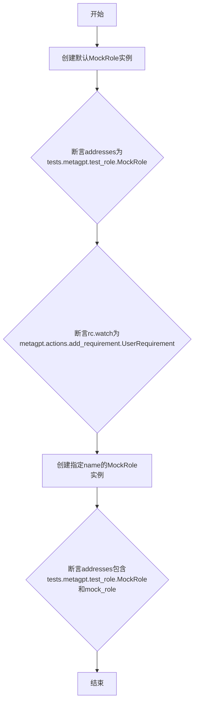
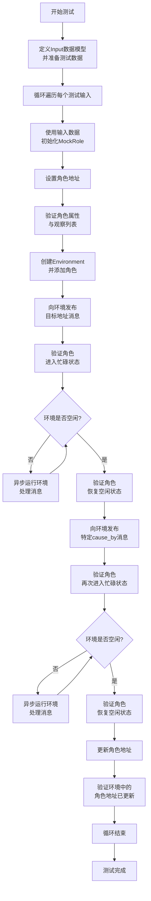
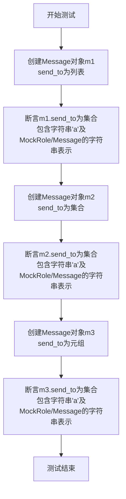
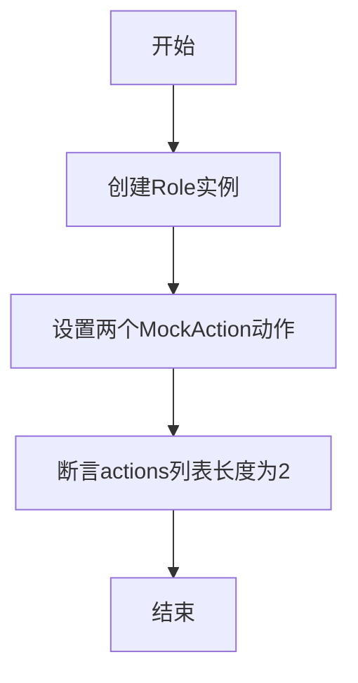
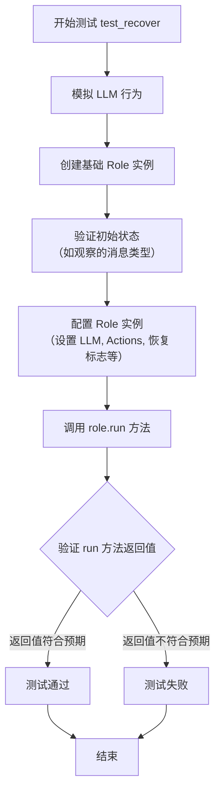
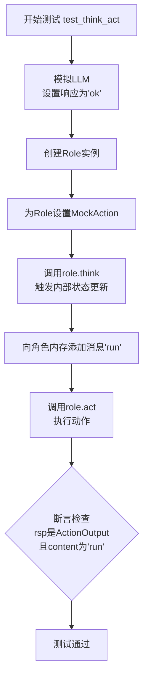
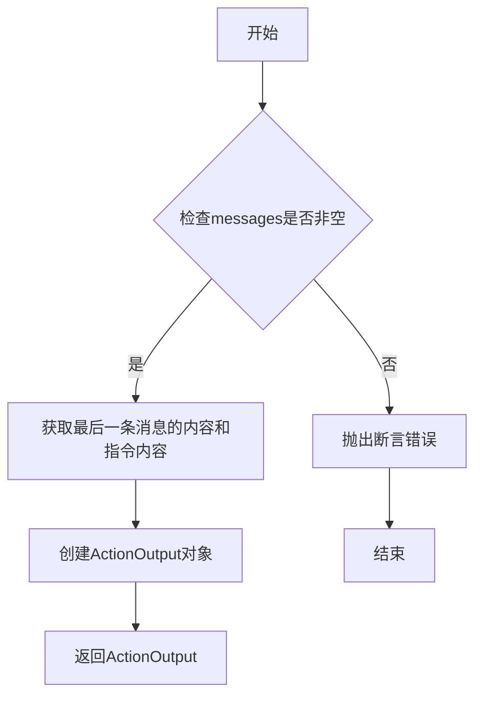
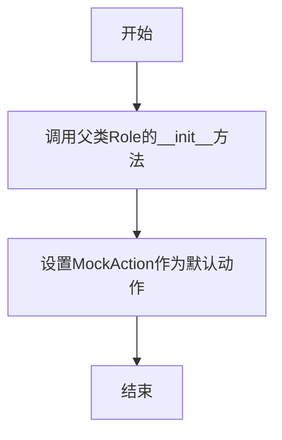

# `.\MetaGPT\tests\metagpt\test_role.py` 详细设计文档

该文件是一个单元测试文件，用于测试MetaGPT框架中Role（角色）类的核心功能，包括角色的基本属性设置、消息处理与反应机制、动作执行与恢复、以及与环境（Environment）的交互。它通过模拟Action（动作）、LLM（大语言模型）和环境，验证Role类在接收消息、触发动作、更新状态和协同工作流中的正确性。

## 整体流程

```mermaid
graph TD
    A[开始执行测试] --> B{测试类型?}
    B -- test_basic --> C[验证Role基本属性与地址]
    B -- test_react --> D[模拟环境消息传递与角色反应]
    B -- test_send_to --> E[验证Message的send_to字段处理]
    B -- test_init_action --> F[验证Role动作初始化]
    B -- test_recover --> G[模拟角色状态恢复与执行]
    B -- test_think_act --> H[验证角色思考与执行动作]
    C --> I[断言验证]
    D --> J[创建Environment与Role]
    J --> K[发布Message触发Role]
    K --> L[环境运行至空闲]
    L --> M[验证Role状态与地址]
    E --> N[验证any_to_str转换]
    F --> O[验证actions列表]
    G --> P[模拟LLM与恢复状态]
    P --> Q[执行Role.run()]
    Q --> R[验证ActionOutput]
    H --> S[模拟思考与动作执行]
    S --> T[验证记忆与输出]
    I --> U[测试结束]
    M --> U
    N --> U
    O --> U
    R --> U
    T --> U
```

## 类结构

```
BaseModel (Pydantic基类)
├── Input (测试输入模型)
Action (MetaGPT动作基类)
├── MockAction (模拟动作类)
Role (MetaGPT角色基类)
├── MockRole (模拟角色类)
Message (MetaGPT消息类)
Environment (MetaGPT环境类)
BaseLLM (LLM基类)
MagicMock (模拟对象类)
```

## 全局变量及字段


### `Input.name`
    
角色的名称标识符，用于在系统中唯一标识一个角色实例。

类型：`str`
    


### `Input.profile`
    
角色的职业或功能描述，定义角色在系统中的专业领域或职责。

类型：`str`
    


### `Input.goal`
    
角色的核心目标或任务，驱动角色在环境中执行特定行为。

类型：`str`
    


### `Input.constraints`
    
角色在执行任务时必须遵守的约束条件或限制规则。

类型：`str`
    


### `Input.desc`
    
角色的详细描述，提供关于角色背景、能力或特性的补充信息。

类型：`str`
    


### `Input.address`
    
角色在消息路由系统中的地址，用于接收和发送特定消息。

类型：`str`
    
    

## 全局函数及方法

### `test_basic`

该函数是一个单元测试，用于验证`MockRole`类在初始化时`addresses`和`rc.watch`属性的默认值，以及当指定`name`参数时`addresses`属性的变化。

参数：

- 无参数

返回值：`None`，该函数是一个测试函数，不返回任何值，仅通过断言（assert）验证代码行为。

#### 流程图



#### 带注释源码

```python
def test_basic():
    # 创建一个未指定name的MockRole实例
    mock_role = MockRole()
    # 断言其addresses属性为包含其类全名的集合
    assert mock_role.addresses == ({"tests.metagpt.test_role.MockRole"})
    # 断言其rc.watch属性为包含UserRequirement类全名的集合
    assert mock_role.rc.watch == {"metagpt.actions.add_requirement.UserRequirement"}

    # 创建一个指定name为"mock_role"的MockRole实例
    mock_role = MockRole(name="mock_role")
    # 断言其addresses属性包含其类全名和指定的name
    assert mock_role.addresses == {"tests.metagpt.test_role.MockRole", "mock_role"}
```

### `test_react`

该函数是一个异步单元测试，用于验证`MockRole`角色在`Environment`环境中的基本反应机制。它测试了角色的初始化、消息发布与处理、环境运行以及角色地址的动态更新等核心功能。

参数：

- 无显式参数，但作为`pytest`测试函数，它依赖于`pytest.mark.asyncio`装饰器来运行异步代码。

返回值：`None`，作为单元测试，其主要目的是通过断言验证功能，不返回业务值。

#### 流程图



#### 带注释源码

```python
@pytest.mark.asyncio
async def test_react():
    # 1. 定义测试输入的数据模型
    class Input(BaseModel):
        name: str
        profile: str
        goal: str
        constraints: str
        desc: str
        address: str

    # 2. 准备测试数据列表（本例中只有一个测试用例）
    inputs = [
        {
            "name": "A",
            "profile": "Tester",
            "goal": "Test",
            "constraints": "constraints",
            "desc": "desc",
            "address": "start",
        }
    ]

    # 3. 遍历所有测试输入
    for i in inputs:
        # 3.1 将字典数据转换为强类型的Input对象
        seed = Input(**i)
        # 3.2 使用输入数据初始化一个MockRole实例
        role = MockRole(
            name=seed.name, profile=seed.profile, goal=seed.goal, constraints=seed.constraints, desc=seed.desc
        )
        # 3.3 为角色设置一个唯一的地址标识
        role.set_addresses({seed.address})
        # 3.4 验证角色的基本属性、观察的消息类型是否正确
        assert role.rc.watch == {any_to_str(UserRequirement)}
        assert role.name == seed.name
        assert role.profile == seed.profile
        assert role.goal == seed.goal
        assert role.constraints == seed.constraints
        assert role.desc == seed.desc
        # 3.5 验证角色初始状态为空闲
        assert role.is_idle

        # 4. 创建环境并添加角色
        env = Environment()
        env.add_role(role)
        # 4.1 验证角色在环境中的地址注册成功
        assert env.get_addresses(role) == {seed.address}

        # 5. 测试场景一：向角色的地址发送消息
        # 5.1 发布一条目标地址为该角色的消息
        env.publish_message(Message(content="test", msg_to=seed.address))
        # 5.2 验证角色接收到消息后变为忙碌状态
        assert not role.is_idle
        # 5.3 循环运行环境，直到所有消息被处理完毕（环境空闲）
        while not env.is_idle:
            await env.run()
        # 5.4 验证角色处理完消息后恢复空闲状态
        assert role.is_idle

        # 6. 测试场景二：发送一条由该角色地址触发的消息
        # 6.1 发布一条由该角色地址`cause_by`的消息
        env.publish_message(Message(content="test", cause_by=seed.address))
        # 6.2 验证角色再次进入忙碌状态
        assert not role.is_idle
        # 6.3 循环运行环境，处理消息
        while not env.is_idle:
            await env.run()
        # 6.4 验证角色再次恢复空闲
        assert role.is_idle

        # 7. 测试角色地址的动态更新
        # 7.1 生成一个新的唯一地址标签
        tag = uuid.uuid4().hex
        # 7.2 更新角色的地址集合
        role.set_addresses({tag})
        # 7.3 验证环境中记录的该角色地址已成功更新
        assert env.get_addresses(role) == {tag}
```

### `test_send_to`

该函数是一个单元测试，用于验证`Message`类的`send_to`参数在初始化时能够正确地将不同类型的输入（字符串、类、类对象）转换为字符串集合，并确保转换结果符合预期。

参数：

- 无显式参数（作为`pytest`测试函数，它不接受外部参数，但内部会创建和测试`Message`对象）

返回值：无（`pytest`测试函数通常不返回值，通过断言验证测试结果）

#### 流程图



#### 带注释源码

```python
@pytest.mark.asyncio
async def test_send_to():
    # 测试1：send_to参数为列表，包含字符串、类、类对象
    m = Message(content="a", send_to=["a", MockRole, Message])
    # 断言：send_to应被转换为集合，包含字符串'a'以及MockRole和Message类的字符串表示
    assert m.send_to == {"a", any_to_str(MockRole), any_to_str(Message)}

    # 测试2：send_to参数为集合，同时指定cause_by参数为MockAction类
    m = Message(content="a", cause_by=MockAction, send_to={"a", MockRole, Message})
    # 断言：send_to应被转换为集合，内容同上
    assert m.send_to == {"a", any_to_str(MockRole), any_to_str(Message)}

    # 测试3：send_to参数为元组
    m = Message(content="a", send_to=("a", MockRole, Message))
    # 断言：send_to应被转换为集合，内容同上
    assert m.send_to == {"a", any_to_str(MockRole), any_to_str(Message)}
```

### `test_init_action`

该函数是一个单元测试，用于验证 `Role` 类在设置多个相同类型的 `Action` 时，能够正确初始化并存储这些 `Action` 实例。

参数：无

返回值：无

#### 流程图



#### 带注释源码

```python
def test_init_action():
    # 创建一个Role类的实例
    role = Role()
    # 为role实例设置两个MockAction动作
    role.set_actions([MockAction, MockAction])
    # 断言role实例的actions列表长度为2，验证动作被正确设置
    assert len(role.actions) == 2
```

### `test_recover`

这是一个异步单元测试函数，用于测试 `Role` 类的 `recover` 机制。它模拟了一个恢复场景，其中 `Role` 实例从之前的状态中恢复，并验证其是否能正确运行并产生预期的响应。

参数：
- 无显式参数。作为 `pytest` 测试函数，它依赖于 `pytest.mark.asyncio` 装饰器来运行异步代码。

返回值：`None`，这是一个测试函数，其主要目的是通过断言（`assert`）来验证代码行为，不返回业务值。

#### 流程图



#### 带注释源码

```python
@pytest.mark.asyncio  # 标记此函数为异步测试，以便 pytest-asyncio 插件能够运行它。
async def test_recover():
    # Mock LLM actions
    # 创建一个模拟的 BaseLLM 对象，用于替代真实的 LLM 调用。
    mock_llm = MagicMock(spec=BaseLLM)
    # 设置模拟 LLM 的 `aask` 方法的返回值。当被调用时，它返回一个包含 "1" 的列表。
    mock_llm.aask.side_effect = ["1"]

    # 创建一个基础的 Role 实例。
    role = Role()
    # 断言：验证 Role 实例默认观察（watch）的是 UserRequirement 类型的消息。
    assert role.is_watch(any_to_str(UserRequirement))
    # 调用 put_message 和 publish_message 方法，传入 None 以确保它们不会在空消息上崩溃。
    role.put_message(None)
    role.publish_message(None)

    # 将模拟的 LLM 赋值给 Role 实例。
    role.llm = mock_llm
    # 为 Role 实例设置两个 MockAction 动作。
    role.set_actions([MockAction, MockAction])
    # 将 Role 实例标记为已恢复状态，这可能会影响其内部运行逻辑（例如，跳过某些初始化步骤）。
    role.recovered = True
    # 设置 Role 实例最后观察到的消息内容为 "recover_test"。
    role.latest_observed_msg = Message(content="recover_test")
    # 将 Role 的运行时上下文（rc）状态设置为 0（通常表示初始或空闲状态）。
    role.rc.state = 0
    # 断言：验证 Role 实例当前的动作描述是 MockAction 的名称。
    assert role.action_description == any_to_name(MockAction)

    # 异步调用 Role 实例的 `run` 方法，这应该触发其反应循环。
    rsp = await role.run()
    # 断言：验证 `run` 方法返回的响应（ActionOutput）的 `cause_by` 字段被正确设置为 MockAction 的字符串表示。
    # 这确保了在恢复状态下，Role 正确地执行了预设的 Action 并记录了其来源。
    assert rsp.cause_by == any_to_str(MockAction)
```

### `test_think_act`

该函数是一个异步单元测试，用于验证`Role`类的`think`和`act`方法。它模拟了一个LLM（大语言模型）的响应，确保角色能够正确地进行思考（选择动作）和执行动作，并验证执行结果是否符合预期。

参数：

- 无显式参数，但作为`pytest`测试函数，它依赖于`pytest.mark.asyncio`装饰器来运行异步代码。

返回值：`None`，该函数是一个测试函数，不返回业务值，而是通过断言（`assert`）来验证测试结果。

#### 流程图



#### 带注释源码

```python
@pytest.mark.asyncio  # 标记此测试函数为异步函数，以便pytest-asyncio插件能够正确处理
async def test_think_act():
    # Mock LLM actions
    # 创建一个模拟的BaseLLM对象，用于替代真实的LLM调用
    mock_llm = MagicMock(spec=BaseLLM)
    # 设置模拟LLM的aask方法的返回值。当被调用时，它返回字符串"ok"。
    # 这模拟了LLM在`think`阶段可能给出的响应。
    mock_llm.aask.side_effect = ["ok"]

    # 创建一个基础的Role实例
    role = Role()
    # 为该角色设置一个动作列表，这里只包含一个MockAction。
    # MockAction是一个模拟动作，其`run`方法会返回一个包含输入消息内容的ActionOutput。
    role.set_actions([MockAction])
    # 调用角色的`think`方法。此方法内部会使用上面模拟的LLM（通过role.llm访问）
    # 来决定下一步要执行哪个动作。由于我们模拟了LLM返回"ok"，
    # 并且MockAction是唯一的动作，`think`方法应该会选择它。
    await role.think()
    # 向角色的记忆（rc.memory）中添加一条内容为"run"的消息。
    # 这条消息将作为后续`act`方法执行时，传递给动作的输入。
    role.rc.memory.add(Message("run"))
    # 断言：验证角色的记忆里确实有一条消息。
    assert len(role.get_memories()) == 1
    # 调用角色的`act`方法。此方法会执行在`think`阶段选定的动作（即MockAction）。
    # 它会将记忆中的消息（上一步添加的"run"）传递给动作的`run`方法。
    rsp = await role.act()
    # 断言：验证`act`方法的返回值rsp不为空。
    assert rsp
    # 断言：验证返回值rsp的类型是ActionOutput。
    assert isinstance(rsp, ActionOutput)
    # 断言：验证返回值rsp的content属性等于我们之前添加到记忆中的消息内容"run"。
    # 这证明了MockAction的`run`方法正确地将输入消息的内容作为输出返回。
    assert rsp.content == "run"
```

### `MockAction.run`

该方法是一个模拟动作的执行方法，用于在测试环境中模拟一个动作的运行。它接收一系列消息，并返回最后一条消息的内容和指令内容作为动作输出。

参数：

- `messages`：`List[Message]`，消息列表，包含需要处理的消息。
- `*args`：`Any`，可变位置参数，用于接收额外的位置参数。
- `**kwargs`：`Any`，可变关键字参数，用于接收额外的关键字参数。

返回值：`ActionOutput`，动作输出对象，包含最后一条消息的内容和指令内容。

#### 流程图



#### 带注释源码

```python
async def run(self, messages, *args, **kwargs):
    # 断言：确保messages列表非空
    assert messages
    # TODO: 检查instruct_content是否为Message类型
    # 返回ActionOutput对象，包含最后一条消息的内容和指令内容
    return ActionOutput(content=messages[-1].content, instruct_content=messages[-1].instruct_content)
```

### `MockRole.__init__`

初始化一个MockRole实例，继承自Role类，并设置其默认属性（名称、简介、目标、约束、描述），同时为其配置一个MockAction作为默认动作。

参数：

- `name`：`str`，角色的名称，默认为空字符串
- `profile`：`str`，角色的简介，默认为空字符串
- `goal`：`str`，角色的目标，默认为空字符串
- `constraints`：`str`，角色的约束条件，默认为空字符串
- `desc`：`str`，角色的详细描述，默认为空字符串

返回值：`None`，无返回值

#### 流程图



#### 带注释源码

```python
def __init__(self, name="", profile="", goal="", constraints="", desc=""):
    # 调用父类Role的初始化方法，传入名称、简介、目标、约束和描述参数
    super().__init__(name=name, profile=profile, goal=goal, constraints=constraints, desc=desc)
    # 为当前角色设置一个MockAction作为默认动作
    self.set_actions([MockAction()])
```

## 关键组件

### Role 类

Role 类是智能体（Agent）的核心抽象，定义了智能体的基本属性（如名称、目标、约束等）和行为模式（如观察、思考、行动），并负责在环境中与其他智能体进行基于消息的交互。

### Environment 类

Environment 类是智能体运行的环境，负责管理所有智能体、分发消息并驱动整个系统的运行流程，实现了基于地址的消息路由和异步执行机制。

### Message 类

Message 类是智能体间通信的基本单元，封装了消息内容、发送者、接收者、触发动作等元数据，并支持灵活的消息路由（通过 `send_to` 和 `cause_by` 字段）。

### Action 类

Action 类定义了智能体可执行的具体操作，是智能体能力的抽象。每个 Action 包含运行逻辑，并能产生包含结构化内容（`instruct_content`）的输出。

### 消息路由机制

消息路由机制是系统的核心通信框架，通过 `Environment.publish_message` 方法发布消息，并根据消息的 `send_to` 或 `cause_by` 字段将消息精准投递给目标地址（如特定 Role 类或实例），从而实现解耦的、基于事件的交互。

### 异步执行引擎

异步执行引擎由 `Environment.run` 方法驱动，它循环检查环境状态，并调度所有非空闲（`is_idle` 为 False）的智能体执行其 `run` 方法，直到所有智能体进入空闲状态，实现了高效的并发处理。

## 问题及建议


### 已知问题

-   **测试用例与实现逻辑耦合**：`test_react` 测试用例中，`MockRole` 的 `rc.watch` 属性被硬编码为 `{any_to_str(UserRequirement)}`。这依赖于 `Role` 基类的默认行为（监听 `UserRequirement`）。如果 `Role` 基类的默认监听行为在未来发生改变，此测试用例将失败，即使 `MockRole` 的功能本身没有变化。这增加了测试的脆弱性。
-   **测试数据构造冗余**：`test_react` 测试用例中，使用 `BaseModel` (`Input`) 来定义和验证测试输入数据，但随后又将其解包为字典传入 `MockRole` 构造函数。这种间接方式增加了代码复杂度，且 `BaseModel` 在此处并未提供比直接使用字典或命名元组更明显的优势（如数据验证在测试中并非必需）。
-   **模拟对象使用不完整**：在 `test_recover` 和 `test_think_act` 测试中，`mock_llm.aask.side_effect` 被设置为一个固定的返回值列表。虽然当前测试通过，但如果被测试的 `Role` 方法在未来对 `llm.aask` 有多次调用，此模拟可能无法提供足够的返回值，导致测试意外失败。这属于模拟配置不充分的风险。
-   **测试状态污染风险**：`test_react` 测试在一个循环中创建 `Environment` 和 `Role` 实例，并进行异步运行。虽然使用了不同的输入数据，但测试并未显式地清理或隔离每个循环迭代的环境（例如，通过创建全新的 `Environment` 实例）。在更复杂的测试场景下，可能存在状态残留的风险。
-   **TODO 注释未完成**：`MockAction.run` 方法中存在一个 `TODO` 注释（`# TODO to check instruct_content as Message`），表明对 `instruct_content` 字段的验证逻辑尚未实现。这留下了测试覆盖的缺口。

### 优化建议

-   **解耦测试与默认配置**：在 `test_react` 中，应显式地设置 `MockRole` 的 `rc.watch` 属性，而不是依赖基类的默认值。例如，可以在 `MockRole.__init__` 中或测试用例中直接调用 `role.set_watch([...])`。这使得测试意图更明确，且不受基类默认行为变更的影响。
-   **简化测试数据构造**：对于 `test_react` 中的输入数据，可以考虑直接使用字典列表或 `pytest` 的参数化功能 (`@pytest.mark.parametrize`)，避免引入不必要的 `BaseModel`，使测试代码更简洁、直接。
-   **增强模拟对象的健壮性**：为 `mock_llm.aask.side_effect` 提供一个可迭代对象（如列表）或一个返回固定值的函数，以明确处理多次调用的情况。更好的做法是，根据测试用例的预期，模拟出具体的交互逻辑，而不仅仅是返回值。
-   **确保测试隔离性**：在 `test_react` 的每个循环迭代中，或为每个参数化测试用例，创建全新的 `Environment` 实例。这可以确保测试之间完全独立，避免因共享状态导致的不可预测行为。
-   **实现 TODO 或添加跳过说明**：应实现 `MockAction.run` 方法中关于 `instruct_content` 的检查逻辑，或者如果当前无需验证，则移除该 `TODO` 注释。如果暂时不实现，应添加注释说明原因，并可能使用 `pytest.mark.skip` 或 `pytest.mark.xfail` 来标记相关的测试部分。
-   **补充边界和异常测试**：当前测试主要覆盖了正常流程。建议增加对边界条件（如空消息、无效地址）和异常情况（如 `Environment` 中角色不存在时发布消息）的测试，以提高代码的健壮性和测试覆盖率。


## 其它


### 设计目标与约束

本测试代码的设计目标是验证`Role`类及其相关组件（如`Environment`、`Message`）的核心功能，特别是消息路由、角色状态管理以及动作执行流程。约束条件包括：1) 必须与RFC 116和RFC 113中定义的消息分发与路由规范保持一致；2) 测试需覆盖同步与异步场景；3) 使用模拟对象（Mock）隔离外部依赖（如LLM），确保测试的独立性和可重复性。

### 错误处理与异常设计

测试代码本身不包含复杂的业务逻辑错误处理，其主要通过断言（`assert`）来验证预期行为。测试用例设计涵盖了多种边界和正常情况，例如：验证角色地址设置、消息发送目标格式转换、角色状态（空闲/忙碌）切换、以及从特定状态（`recovered`）恢复执行。任何未通过断言的行为都将导致测试失败，从而暴露潜在缺陷。测试框架`pytest`负责捕获和报告测试执行过程中的异常。

### 数据流与状态机

测试展示了`Role`与`Environment`之间的核心数据流和状态转换：
1.  **数据流**：`Message`对象是核心数据载体。测试验证了消息通过`Environment.publish_message`发布，根据`msg_to`或`cause_by`字段被路由到对应地址的`Role`。`Role`处理消息后，可能通过`publish_message`产生新的消息，形成处理链。
2.  **状态机**：`Role`具有`is_idle`状态。测试流程清晰地展示了状态转换：环境发布消息 -> 对应角色状态变为非空闲（`not idle`） -> 环境运行（`env.run`）驱动角色处理消息 -> 处理完毕，角色状态恢复为空闲（`idle`）。`Environment`的`is_idle`状态是所有角色状态的聚合。

### 外部依赖与接口契约

1.  **外部依赖**：
    *   `pytest` & `pytest-asyncio`：测试运行框架，用于组织异步测试用例。
    *   `unittest.mock.MagicMock`：用于创建模拟对象，替代真实的`BaseLLM`，确保测试不依赖外部AI服务。
    *   `uuid`：用于生成唯一的地址标识符。
2.  **接口契约**：
    *   `Role`类：测试依赖于其`set_actions`、`set_addresses`、`put_message`、`publish_message`、`think`、`act`、`run`等公共接口，以及`rc`、`actions`、`is_idle`等属性。
    *   `Environment`类：测试依赖于其`add_role`、`publish_message`、`run`、`get_addresses`、`is_idle`等接口。
    *   `Message`类：测试验证了其构造函数对`send_to`参数（支持`str`, `type`, `list`, `set`, `tuple`）的规范化处理，以及`cause_by`、`msg_to`等字段的用法。
    *   `Action`基类与`ActionOutput`：测试中`MockAction`实现了`run`方法，并返回`ActionOutput`，验证了动作执行的基本契约。

### 测试策略与覆盖范围

测试策略采用单元测试与集成测试结合的方式：
1.  **单元测试**：如`test_basic`、`test_send_to`、`test_init_action`，聚焦于单个类（`Role`、`Message`）的方法或属性。
2.  **集成测试**：如`test_react`、`test_recover`、`test_think_act`，验证多个组件（`Role`、`Environment`、`Action`、`Message`）协同工作的场景，特别是异步消息驱动的工作流。
覆盖范围包括：角色初始化与属性设置、地址管理、消息路由机制、角色状态管理、动作的初始化和执行、以及从中断状态恢复执行的逻辑。

### 并发与异步设计

测试代码明确标记了异步测试用例（`@pytest.mark.asyncio`）。核心测试场景`test_react`模拟了典型的异步、事件驱动的运行流程：环境异步运行（`await env.run()`），触发角色异步思考与行动。这验证了框架在并发环境下的基本行为。测试通过`Environment.is_idle`和`Role.is_idle`作为同步点，管理异步操作的完成状态。

### 配置与初始化

测试展示了`Role`对象的多种初始化方式：通过`MockRole`子类、直接使用`Role`类并后续配置动作和地址。`Environment`的初始化简单直接。测试用例（`test_react`）使用结构化的输入数据（`Input`模型）来参数化角色初始化，提高了测试的可读性和可维护性。地址的设置支持字符串、类对象等多种形式，并通过`any_to_str`等工具函数进行规范化。

    