# `.\MetaGPT\tests\metagpt\test_schema.py` 详细设计文档

该文件是MetaGPT项目中对`schema`模块的单元测试文件，主要测试了项目中定义的核心数据模型（如`Message`、`Document`、`MessageQueue`、`Plan`、`Task`、`UMLClassView`等）的序列化/反序列化、属性操作、依赖关系管理、以及特定业务逻辑（如任务排序、错误信息解析）的正确性。

## 整体流程

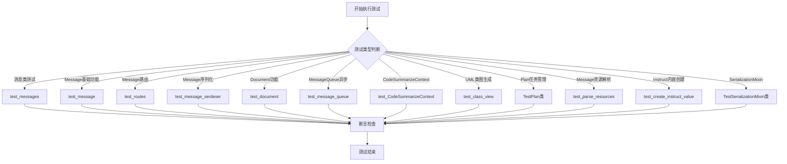

## 类结构

```
TestPlan (测试类)
TestSerializationMixin (测试类)
├── TestUserModel (内部测试模型)
└── TestUserModelWithExclude (内部测试模型)
```

## 全局变量及字段


### `SERDESER_PATH`
    
序列化和反序列化文件的存储路径，用于保存和加载对象的持久化数据。

类型：`Path`
    


### `SYSTEM_DESIGN_FILE_REPO`
    
系统设计文件的存储仓库路径，用于存放系统设计相关的文档和文件。

类型：`str`
    


### `TASK_FILE_REPO`
    
任务文件的存储仓库路径，用于存放任务相关的文档和文件。

类型：`str`
    


### `TestUserModel.name`
    
用户模型的名称字段，用于标识用户实例。

类型：`str`
    


### `TestUserModel.value`
    
用户模型的值字段，用于存储用户的数值属性。

类型：`int`
    


### `TestUserModelWithExclude.name`
    
用户模型的名称字段，用于标识用户实例。

类型：`str`
    


### `TestUserModelWithExclude.value`
    
用户模型的值字段，用于存储用户的数值属性。

类型：`int`
    


### `TestUserModelWithExclude.age`
    
用户模型的年龄字段，通过Field(exclude=True)标记为序列化时排除的字段。

类型：`int`
    
    

## 全局函数及方法

### `test_messages`

该函数是一个单元测试，用于验证`Message`类及其子类（`UserMessage`、`SystemMessage`、`AIMessage`）的字符串表示功能。它创建了包含不同角色的消息列表，并检查这些角色的标识符是否都出现在最终的字符串表示中。

参数：无

返回值：`None`，无返回值

#### 流程图

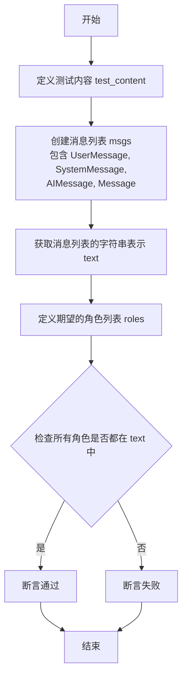

#### 带注释源码

```python
def test_messages():
    # 定义测试用的消息内容
    test_content = "test_message"
    # 创建一个包含不同角色类型消息的列表
    msgs = [
        UserMessage(content=test_content),  # 用户消息
        SystemMessage(content=test_content), # 系统消息
        AIMessage(content=test_content),     # AI助手消息
        Message(content=test_content, role="QA"), # 自定义角色消息
    ]
    # 获取整个消息列表的字符串表示
    text = str(msgs)
    # 定义期望在字符串表示中出现的角色标识符列表
    roles = ["user", "system", "assistant", "QA"]
    # 断言：检查所有期望的角色标识符是否都出现在字符串表示中
    assert all([i in text for i in roles])
```

### `test_message`

该函数是一个单元测试函数，用于测试`metagpt.schema.Message`类的序列化与反序列化功能、属性设置与获取、以及`instruct_content`的处理。它验证了`Message`对象能够正确地进行JSON格式的序列化与反序列化，并且其属性（如`content`、`role`、`cause_by`、`send_to`等）能够被正确设置和修改。此外，它还测试了当`Message`对象包含`instruct_content`（一个由`ActionNode`创建的动态Pydantic模型实例）时，序列化和反序列化的正确性。

参数：
- 无显式参数。该函数是一个测试函数，不接收外部参数。

返回值：`None`，该函数是一个测试函数，不返回任何值，主要通过断言（`assert`）来验证测试结果。

#### 流程图

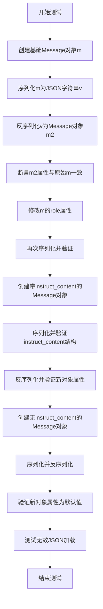

#### 带注释源码

```python
def test_message():
    # 1. 测试Message类的基本实例化
    Message("a", role="v1")

    # 2. 测试基础序列化与反序列化
    m = Message(content="a", role="v1")
    v = m.dump()  # 将Message对象序列化为JSON字符串
    d = json.loads(v)  # 将JSON字符串解析为Python字典
    assert d
    assert d.get("content") == "a"
    assert d.get("role") == "v1"

    # 3. 测试属性修改后序列化
    m.role = "v2"
    v = m.dump()
    assert v
    m = Message.load(v)  # 从JSON字符串反序列化回Message对象
    assert m.content == "a"
    assert m.role == "v2"

    # 4. 测试Message对象的各种属性设置与获取
    m = Message(content="a", role="b", cause_by="c", x="d", send_to="c")
    assert m.content == "a"
    assert m.role == "b"
    assert m.send_to == {"c"}  # send_to属性被自动转换为集合
    assert m.cause_by == "c"
    m.sent_from = "e"
    assert m.sent_from == "e"

    # 5. 测试cause_by属性可以接受字符串、类或类实例，并最终转换为字符串表示
    m.cause_by = "Message"
    assert m.cause_by == "Message"
    m.cause_by = Action  # 传入Action类
    assert m.cause_by == any_to_str(Action)  # 验证被转换为类的字符串表示
    m.cause_by = Action()  # 传入Action实例
    assert m.cause_by == any_to_str(Action)  # 验证同样被转换为类的字符串表示
    m.content = "b"
    assert m.content == "b"

    # 6. 测试包含复杂instruct_content的Message对象的序列化与反序列化
    # 使用ActionNode动态创建一个Pydantic模型类
    out_mapping = {"field3": (str, ...), "field4": (list[str], ...)}
    out_data = {"field3": "field3 value3", "field4": ["field4 value1", "field4 value2"]}
    ic_obj = ActionNode.create_model_class("code", out_mapping)

    # 创建包含instruct_content的Message对象
    message = Message(content="code", instruct_content=ic_obj(**out_data), role="engineer", cause_by=WriteCode)
    message_dict = message.model_dump()  # 将Message对象转换为字典
    # 验证序列化后的字典结构
    assert message_dict["cause_by"] == "metagpt.actions.write_code.WriteCode"
    assert message_dict["instruct_content"] == {
        "class": "code",
        "mapping": {"field3": "(<class 'str'>, Ellipsis)", "field4": "(list[str], Ellipsis)"},
        "value": {"field3": "field3 value3", "field4": ["field4 value1", "field4 value2"]},
    }
    # 从字典反序列化回Message对象
    new_message = Message.model_validate(message_dict)
    # 验证反序列化后的对象属性与原始对象一致
    assert new_message.content == message.content
    assert new_message.instruct_content.model_dump() == message.instruct_content.model_dump()
    assert new_message.instruct_content == message.instruct_content  # TODO: 此断言可能有问题，取决于__eq__实现
    assert new_message.cause_by == message.cause_by
    assert new_message.instruct_content.field3 == out_data["field3"]  # 验证动态模型字段值

    # 7. 测试不包含instruct_content的Message对象的序列化与反序列化
    message = Message(content="code")
    message_dict = message.model_dump()
    new_message = Message(**message_dict)  # 使用字典直接创建Message对象
    assert new_message.instruct_content is None  # instruct_content应为None
    assert new_message.cause_by == "metagpt.actions.add_requirement.UserRequirement"  # 验证默认的cause_by值
    assert not Message.load("{")  # 测试加载无效JSON字符串，应返回False或引发异常（取决于实现）
```

### `test_routes`

该函数是一个单元测试，用于验证`Message`类的`send_to`属性在设置不同类型值时的行为。它测试了当`send_to`被赋予字符串和集合（包含字符串和类对象）时，其值是否被正确转换和存储。

参数：

- 无显式参数。该函数是一个测试函数，不接收外部参数。

返回值：`None`，该函数是一个测试函数，不返回任何值，主要用于断言验证。

#### 流程图

```mermaid
flowchart TD
    Start[开始] --> A[创建Message对象m]
    A --> B[设置m.send_to = 'b']
    B --> C[断言m.send_to == {'b'}]
    C --> D[设置m.send_to = {'e', Action}]
    D --> E[断言m.send_to == {'e', 'metagpt.actions.Action'}]
    E --> End[结束]
```

#### 带注释源码

```python
def test_routes():
    # 创建一个Message对象，初始化内容为'a'，角色为'b'，原因由'c'引起，额外属性x为'd'，发送目标为'c'
    m = Message(content="a", role="b", cause_by="c", x="d", send_to="c")
    # 将send_to属性设置为字符串'b'
    m.send_to = "b"
    # 断言send_to属性现在是一个包含字符串'b'的集合
    assert m.send_to == {"b"}
    # 将send_to属性设置为一个集合，包含字符串'e'和Action类
    m.send_to = {"e", Action}
    # 断言send_to属性现在是一个包含字符串'e'和Action类字符串表示的集合
    # any_to_str(Action) 将Action类转换为其字符串表示形式，例如'metagpt.actions.Action'
    assert m.send_to == {"e", any_to_str(Action)}
```

### `test_message_serdeser`

该函数是一个单元测试，用于验证`Message`类的序列化（serialization）与反序列化（deserialization）功能。它测试了包含`instruct_content`（指令内容）的`Message`对象在转换为字典（dump）和从字典重建（load/validate）过程中，关键字段（如`cause_by`、`instruct_content`）是否能够正确保持其值和结构。同时，它也测试了不包含`instruct_content`的`Message`对象的默认行为。

参数：
- 无显式参数。这是一个测试函数，不接收外部参数。

返回值：`None`，这是一个测试函数，其主要目的是通过断言（assert）来验证代码逻辑，不返回业务值。

#### 流程图

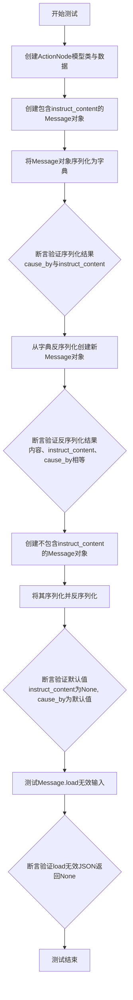

#### 带注释源码

```python
def test_message_serdeser():
    # 1. 准备测试数据：定义输出映射和对应的数据值
    out_mapping = {"field3": (str, ...), "field4": (list[str], ...)}
    out_data = {"field3": "field3 value3", "field4": ["field4 value1", "field4 value2"]}
    # 使用ActionNode动态创建一个Pydantic模型类，类名为"code"
    ic_obj = ActionNode.create_model_class("code", out_mapping)

    # 2. 测试场景1：包含instruct_content的Message
    # 创建一个Message对象，其instruct_content是上面创建的模型实例
    message = Message(content="code", instruct_content=ic_obj(**out_data), role="engineer", cause_by=WriteCode)
    # 将Message对象序列化为字典
    message_dict = message.model_dump()
    # 断言1：验证序列化后的cause_by字段是类的字符串表示
    assert message_dict["cause_by"] == "metagpt.actions.write_code.WriteCode"
    # 断言2：验证序列化后的instruct_content字段结构正确
    assert message_dict["instruct_content"] == {
        "class": "code",
        "mapping": {"field3": "(<class 'str'>, Ellipsis)", "field4": "(list[str], Ellipsis)"},
        "value": {"field3": "field3 value3", "field4": ["field4 value1", "field4 value2"]},
    }
    # 使用model_validate从字典反序列化，创建新的Message对象
    new_message = Message.model_validate(message_dict)
    # 断言3：验证反序列化后基础内容相等
    assert new_message.content == message.content
    # 断言4：验证反序列化后instruct_content的数据字典相等
    assert new_message.instruct_content.model_dump() == message.instruct_content.model_dump()
    # 断言5：验证反序列化后instruct_content对象相等（TODO：当前可能未完全实现深度相等）
    assert new_message.instruct_content == message.instruct_content  # TODO
    # 断言6：验证反序列化后cause_by相等
    assert new_message.cause_by == message.cause_by
    # 断言7：验证可以从反序列化后的对象中正确访问原始数据
    assert new_message.instruct_content.field3 == out_data["field3"]

    # 3. 测试场景2：不包含instruct_content的Message（默认行为）
    message = Message(content="code")
    message_dict = message.model_dump()
    # 使用字典解包方式反序列化
    new_message = Message(**message_dict)
    # 断言8：验证instruct_content默认为None
    assert new_message.instruct_content is None
    # 断言9：验证cause_by默认为特定字符串
    assert new_message.cause_by == "metagpt.actions.add_requirement.UserRequirement"
    # 断言10：验证Message.load方法在输入无效JSON时返回None（或空对象）
    assert not Message.load("{")
```

### `test_document`

该函数用于测试`Document`类的功能，特别是验证`Document`对象的元数据获取方法`get_meta()`是否按预期工作。它创建一个`Document`实例，然后调用`get_meta()`获取其元数据，并断言元数据中的`root_path`、`filename`与原始文档一致，且元数据的`content`字段为空字符串。

参数：

- 无显式参数。该函数是一个单元测试函数，不接收外部参数。

返回值：`None`，该函数是一个测试函数，不返回任何值，其目的是通过断言（assert）来验证代码行为。

#### 流程图

```mermaid
flowchart TD
    A[开始] --> B[创建Document实例<br>doc = Document<br>root_path='a', filename='b', content='c']
    B --> C[调用doc.get_meta()<br>获取元数据对象meta_doc]
    C --> D{断言检查}
    D --> E[断言 doc.root_path == meta_doc.root_path]
    E --> F[断言 doc.filename == meta_doc.filename]
    F --> G[断言 meta_doc.content == '']
    G --> H[测试通过]
    H --> I[结束]
```

#### 带注释源码

```python
def test_document():
    # 1. 创建一个Document对象实例，初始化其路径、文件名和内容。
    doc = Document(root_path="a", filename="b", content="c")
    
    # 2. 调用Document对象的get_meta方法，获取该文档的元数据对象。
    #    根据Document类的设计，get_meta应返回一个新的Document实例，
    #    其root_path和filename与原文档相同，但content为空字符串。
    meta_doc = doc.get_meta()
    
    # 3. 进行一系列断言，验证元数据对象的行为是否符合预期。
    #    3.1 验证元数据的根路径与原文档的根路径相同。
    assert doc.root_path == meta_doc.root_path
    #    3.2 验证元数据的文件名与原文档的文件名相同。
    assert doc.filename == meta_doc.filename
    #    3.3 验证元数据的内容为空字符串（这是get_meta方法的关键设计点）。
    assert meta_doc.content == ""
```

### `test_message_queue`

这是一个异步单元测试函数，用于测试`MessageQueue`类的序列化、反序列化以及基本的队列操作功能。它验证了队列在推送、弹出消息后，通过序列化和反序列化过程能够保持数据的一致性。

参数：
- 无显式参数。该函数是一个使用`pytest.mark.asyncio`装饰的异步测试函数，由测试框架调用。

返回值：`None`，该函数是一个测试函数，其主要目的是通过断言（`assert`）来验证代码行为，不返回业务逻辑值。

#### 流程图

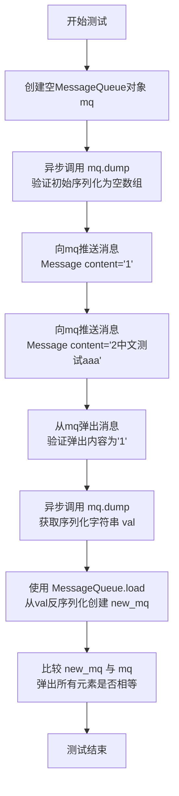

#### 带注释源码

```python
@pytest.mark.asyncio  # 标记此函数为异步测试，以便pytest-asyncio插件能够正确处理
async def test_message_queue():
    # 1. 初始化一个空的 MessageQueue 实例
    mq = MessageQueue()
    
    # 2. 测试空队列的序列化：调用异步dump方法，应返回表示空列表的JSON字符串
    val = await mq.dump()
    assert val == "[]"  # 验证序列化结果
    
    # 3. 测试队列的基本操作：推送两个消息
    mq.push(Message(content="1"))  # 推送第一个消息
    mq.push(Message(content="2中文测试aaa"))  # 推送第二个消息，包含中文字符以测试编码
    
    # 4. 测试弹出操作：弹出队列中的第一个消息，并验证其内容
    msg = mq.pop()
    assert msg.content == "1"  # 验证弹出的是最早推送的消息
    
    # 5. 测试非空队列的序列化与反序列化
    val = await mq.dump()  # 再次序列化当前队列状态（此时应包含第二个消息）
    assert val  # 验证序列化结果非空
    
    # 6. 使用静态方法 load 从序列化字符串重建队列
    new_mq = MessageQueue.load(val)
    
    # 7. 验证反序列化后的队列与原始队列在弹出所有元素后内容一致
    #    pop_all() 方法应返回列表中剩余的所有消息
    assert new_mq.pop_all() == mq.pop_all()
```

### `test_CodeSummarizeContext`

该函数是一个单元测试，用于验证`CodeSummarizeContext`类的`loads`方法。它通过参数化测试，传入一个文件路径列表，检查`loads`方法是否能正确解析并生成预期的`CodeSummarizeContext`对象。同时，它还测试了该对象能否作为字典的键。

参数：

- `file_list`：`list[str]`，包含两个文件路径的列表，分别代表系统设计文件路径和任务文件路径。
- `want`：`CodeSummarizeContext`，期望的`CodeSummarizeContext`对象，用于与函数实际生成的对象进行比较。

返回值：`None`，该函数是一个测试函数，不返回任何值，仅通过断言验证测试结果。

#### 流程图

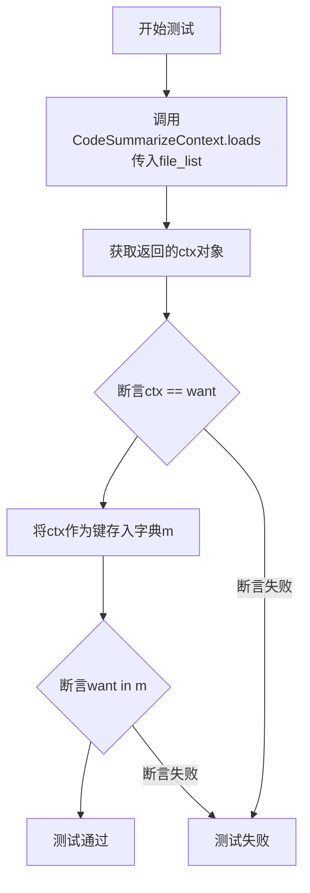

#### 带注释源码

```python
@pytest.mark.parametrize(
    ("file_list", "want"),  # 使用pytest的参数化装饰器，定义多组测试数据
    [
        (
            [f"{SYSTEM_DESIGN_FILE_REPO}/a.txt", f"{TASK_FILE_REPO}/b.txt"],  # 第一组数据：文件路径列表
            CodeSummarizeContext(  # 对应的期望结果对象
                design_filename=f"{SYSTEM_DESIGN_FILE_REPO}/a.txt", task_filename=f"{TASK_FILE_REPO}/b.txt"
            ),
        )
    ],
)
def test_CodeSummarizeContext(file_list, want):  # 测试函数定义，接收参数化的数据
    ctx = CodeSummarizeContext.loads(file_list)  # 调用被测试方法，传入文件列表
    assert ctx == want  # 断言实际生成的对象与期望对象相等
    m = {ctx: ctx}  # 创建一个字典，以ctx对象作为键和值
    assert want in m  # 断言期望的对象存在于字典的键中
```

### `test_class_view`

该函数是一个单元测试，用于验证`UMLClassView`类及其关联类（`UMLClassAttribute`和`UMLClassMethod`）的功能。它测试了这些类生成Mermaid格式UML类图字符串的能力，包括属性（字段）和方法（函数）的格式化输出。

参数：
- 无显式参数。这是一个测试函数，不接收外部参数。

返回值：`None`，这是一个测试函数，其主要目的是通过断言（assert）验证代码逻辑，不返回业务值。

#### 流程图

```mermaid
flowchart TD
    Start[开始测试] --> CreateAttrA[创建UMLClassAttribute实例attr_a]
    CreateAttrA --> AssertAttrA[断言attr_a.get_mermaid输出正确]
    AssertAttrA --> CreateAttrB[创建UMLClassAttribute实例attr_b]
    CreateAttrB --> AssertAttrB[断言attr_b.get_mermaid输出正确]
    AssertAttrB --> CreateClassView[创建UMLClassView实例class_view]
    CreateClassView --> SetAttrs[设置class_view.attributes为[attr_a, attr_b]]
    SetAttrs --> CreateMethodA[创建UMLClassMethod实例method_a]
    CreateMethodA --> AssertMethodA[断言method_a.get_mermaid输出正确]
    AssertMethodA --> CreateMethodB[创建UMLClassMethod实例method_b]
    CreateMethodB --> AssertMethodB[断言method_b.get_mermaid输出正确]
    AssertMethodB --> SetMethods[设置class_view.methods为[method_a, method_b]]
    SetMethods --> AssertClassView[断言class_view.get_mermaid输出完整类图]
    AssertClassView --> End[测试结束]
```

#### 带注释源码

```python
def test_class_view():
    # 1. 测试UMLClassAttribute（类属性/字段）
    # 创建一个公共的int类型属性`a`，默认值为0
    attr_a = UMLClassAttribute(name="a", value_type="int", default_value="0", visibility="+")
    # 断言：生成的Mermaid字符串符合预期格式（带缩进）
    assert attr_a.get_mermaid(align=1) == "\t+int a=0"
    
    # 创建一个受保护的str类型属性`b`，默认值为字符串"0"
    attr_b = UMLClassAttribute(name="b", value_type="str", default_value="0", visibility="#")
    # 断言：生成的Mermaid字符串符合预期格式（无缩进）
    assert attr_b.get_mermaid(align=0) == '#str b="0"'
    
    # 2. 测试UMLClassView（类视图）
    # 创建一个名为"A"的类视图
    class_view = UMLClassView(name="A")
    # 将上面创建的两个属性赋值给类
    class_view.attributes = [attr_a, attr_b]

    # 3. 测试UMLClassMethod（类方法）
    # 创建一个公共的无参数方法`run`
    method_a = UMLClassMethod(name="run", visibility="+")
    # 断言：生成的Mermaid字符串符合预期格式（带缩进）
    assert method_a.get_mermaid(align=1) == "\t+run()"
    
    # 创建一个受保护的方法`_test`，它接收两个参数并返回一个字符串
    method_b = UMLClassMethod(
        name="_test",
        visibility="#",
        # 定义方法参数列表
        args=[UMLClassAttribute(name="a", value_type="str"), UMLClassAttribute(name="b", value_type="int")],
        return_type="str",
    )
    # 断言：生成的Mermaid字符串符合预期格式（无缩进）
    assert method_b.get_mermaid(align=0) == "#_test(str a,int b) str"
    
    # 将上面创建的两个方法赋值给类
    class_view.methods = [method_a, method_b]
    
    # 4. 最终断言：验证整个类视图生成的完整Mermaid UML类图字符串
    # 预期字符串包含类名、所有属性（带可见性、类型、默认值）和所有方法（带可见性、参数列表、返回类型）
    assert (
        class_view.get_mermaid(align=0)
        == 'class A{\n\t+int a=0\n\t#str b="0"\n\t+run()\n\t#_test(str a,int b) str\n}\n'
    )
```

### `test_parse_resources`

这是一个异步单元测试函数，用于测试`Message`类的`parse_resources`方法。该测试验证了`parse_resources`方法能够根据给定的`key_descriptions`（键描述字典），从一段文本内容（如错误堆栈信息或自然语言指令）中，正确解析并提取出结构化的资源信息（例如文件名、行号、仓库名等）。

参数：

- `context`：`pytest` 的 `fixture` 上下文对象，类型为 `pytest.FixtureRequest` 或其自定义包装，提供测试运行时的上下文信息，如配置、LLM实例等。
- `content`：`str`，输入的文本内容，可以是错误堆栈信息或自然语言指令。
- `key_descriptions`：`Dict[str, str]`，一个字典，键为期望从`content`中提取出的字段名，值为对该字段的文本描述，用于指导LLM进行信息提取。

返回值：`None`，这是一个测试函数，不返回业务值，通过`assert`语句验证测试结果。

#### 流程图

```mermaid
flowchart TD
    A[开始测试] --> B[创建Message对象<br>msg = Message(content=content)]
    B --> C[从context获取LLM实例<br>llm = context.llm_with_cost_manager...]
    C --> D[调用msg.parse_resources<br>result = await msg.parse_resources(llm, key_descriptions)]
    D --> E{断言结果有效性<br>assert result and result.get('resources')}
    E --> F[遍历key_descriptions的键<br>for k in key_descriptions.keys()]
    F --> G{断言键存在于结果中<br>assert k in result}
    G --> H[测试通过]
    E -- 断言失败 --> I[测试失败]
    G -- 断言失败 --> I
```

#### 带注释源码

```python
# 使用pytest的parametrize装饰器，为测试函数提供多组参数化数据。
# 这里定义了两组测试数据：(content1, key_descriptions1) 和 (content2, key_descriptions2)。
@pytest.mark.parametrize(
    ("content", "key_descriptions"),
    [
        (
            # 第一组测试数据：一个Python错误堆栈跟踪信息。
            """
Traceback (most recent call last):
  File "/Users/iorishinier/github/MetaGPT/workspace/game_2048_1/game_2048/main.py", line 38, in <module>
    Main().main()
  File "/Users/iorishinier/github/MetaGPT/workspace/game_2048_1/game_2048/main.py", line 28, in main
    self.user_interface.draw()
  File "/Users/iorishinier/github/MetaGPT/workspace/game_2048_1/game_2048/user_interface.py", line 16, in draw
    if grid[i][j] != 0:
TypeError: 'Grid' object is not subscriptable
        """,
            # 对应的期望提取字段及其描述。
            {
                "filename": "the string type of the path name of the source code where the bug resides",
                "line": "the integer type of the line error occurs",
                "function_name": "the string type of the function name the error occurs in",
                "code": "the string type of the codes where the error occurs at",
                "info": "the string type of the error information",
            },
        ),
        (
            # 第二组测试数据：一段自然语言指令（中文）。
            "将代码提交到github上的iorisa/repo1的branch1分支，发起pull request ，合并到master分支。",
            # 对应的期望提取字段及其描述。
            {
                "repo_name": "the string type of github repo to create pull",
                "head": "the string type of github branch to be pushed",
                "base": "the string type of github branch to merge the changes into",
            },
        ),
    ],
)
# 定义异步测试函数，接收参数化注入的content和key_descriptions，以及pytest fixture注入的context。
async def test_parse_resources(context, content: str, key_descriptions):
    # 使用传入的content创建一个Message对象。
    msg = Message(content=content)
    # 从测试上下文context中获取配置好的LLM（大语言模型）实例，并附带成本管理器。
    llm = context.llm_with_cost_manager_from_llm_config(context.config.llm)
    # 异步调用Message对象的parse_resources方法。
    # 该方法利用LLM，根据key_descriptions的指导，从msg.content中提取结构化信息。
    result = await msg.parse_resources(llm=llm, key_descriptions=key_descriptions)
    # 断言1：结果不为空且包含'resources'键。
    assert result
    assert result.get("resources")
    # 断言2：遍历key_descriptions中的所有键，确保它们都存在于解析结果result中。
    for k in key_descriptions.keys():
        assert k in result
```

### `test_create_instruct_value`

这是一个测试函数，用于验证 `Message.create_instruct_value` 方法的功能。它通过传入不同的键值对和类名，创建相应的指令内容对象，并断言生成的对象模型转储后的字典与原始输入值相等。

参数：

- `name`：`str`，用于指定生成的指令内容对象的类名。
- `value`：`dict`，包含要传递给指令内容对象的键值对数据。

返回值：`None`，这是一个测试函数，不返回任何值，仅通过断言验证功能。

#### 流程图

```mermaid
flowchart TD
    A[开始] --> B[调用 Message.create_instruct_value<br>传入 name 和 value]
    B --> C[创建指令内容对象 obj]
    C --> D[断言 obj.model_dump() == value]
    D --> E[结束]
```

#### 带注释源码

```python
@pytest.mark.parametrize(("name", "value"), [("c1", {"age": 10, "name": "Alice"}), ("", {"path": __file__})])
def test_create_instruct_value(name, value):
    # 调用 Message 类的静态方法 create_instruct_value，传入键值对字典和类名，创建一个指令内容对象。
    obj = Message.create_instruct_value(kvs=value, class_name=name)
    # 断言：生成的对象通过 model_dump() 方法转换成的字典，应该与传入的原始 value 字典完全相等。
    assert obj.model_dump() == value
```

### `TestPlan.test_add_tasks_ordering`

该方法用于测试 `Plan` 类的 `add_tasks` 方法在添加一组具有依赖关系的任务时，能否正确地对任务进行排序。它创建了一个包含三个任务的列表，这些任务之间存在依赖关系（任务2 -> 任务3 -> 任务1），然后验证 `Plan` 对象内部的任务列表是否按照正确的执行顺序（2, 3, 1）进行排列。

参数：
- `self`：`TestPlan`，指向当前测试类实例的引用。

返回值：`None`，此方法为单元测试，不返回任何值，通过断言（`assert`）来验证测试结果。

#### 流程图

```mermaid
flowchart TD
    A[开始测试] --> B[创建空的Plan对象]
    B --> C[创建任务列表tasks<br>任务1依赖2和3<br>任务3依赖2]
    C --> D[调用plan.add_tasks(tasks)]
    D --> E[获取plan.tasks中的任务ID列表]
    E --> F{断言列表顺序为['2', '3', '1']?}
    F -->|是| G[测试通过]
    F -->|否| H[测试失败，抛出AssertionError]
    G --> I[结束]
    H --> I
```

#### 带注释源码

```python
def test_add_tasks_ordering(self):
    # 1. 创建一个目标为空的Plan对象
    plan = Plan(goal="")

    # 2. 定义一个包含三个任务的列表。
    #    任务ID为"1"的任务依赖于任务"2"和"3"。
    #    任务ID为"3"的任务依赖于任务"2"。
    #    因此，正确的执行顺序应为：2 -> 3 -> 1
    tasks = [
        Task(task_id="1", dependent_task_ids=["2", "3"], instruction="Third"),
        Task(task_id="2", instruction="First"),
        Task(task_id="3", dependent_task_ids=["2"], instruction="Second"),
    ]  # 2 -> 3 -> 1

    # 3. 将任务列表添加到Plan对象中。
    #    Plan.add_tasks() 方法内部应解析这些依赖关系并对任务进行拓扑排序。
    plan.add_tasks(tasks)

    # 4. 断言：验证Plan对象内部的任务列表（plan.tasks）中，
    #    任务的ID顺序是否与预期的执行顺序（["2", "3", "1"]）一致。
    #    这是测试的核心，用于验证排序逻辑的正确性。
    assert [task.task_id for task in plan.tasks] == ["2", "3", "1"]
```

### `TestPlan.test_add_tasks_to_existing_no_common_prefix`

该方法用于测试在向现有计划（Plan）中添加新任务（Task）时，当新任务与现有任务没有共同前缀（即没有重叠的已完成任务链）时的行为。具体来说，它验证了当添加一个与现有任务ID相同但状态不同的新任务时，计划会正确地用新任务替换旧任务，并确保新任务的状态（如`is_finished`）被正确设置。

参数：

- `self`：`TestPlan`，当前测试类的实例，用于访问测试方法。

返回值：`None`，测试方法通常不返回值，而是通过断言（assert）来验证预期行为。

#### 流程图

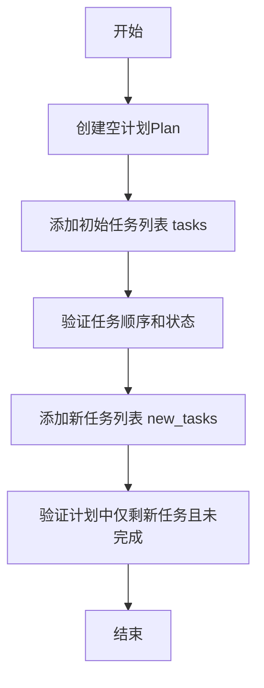

#### 带注释源码

```python
def test_add_tasks_to_existing_no_common_prefix(self):
    # 创建一个目标为空的计划实例
    plan = Plan(goal="")

    # 定义初始任务列表，包含三个任务，形成依赖链：2 -> 3 -> 1
    # 任务3被标记为已完成（is_finished=True）
    tasks = [
        Task(task_id="1", dependent_task_ids=["2", "3"], instruction="Third"),
        Task(task_id="2", instruction="First"),
        Task(task_id="3", dependent_task_ids=["2"], instruction="Second", is_finished=True),
    ]
    # 将初始任务添加到计划中
    plan.add_tasks(tasks)

    # 定义新任务列表，仅包含一个任务，其ID与初始任务中的任务3相同
    new_tasks = [Task(task_id="3", instruction="")]
    # 将新任务添加到计划中
    plan.add_tasks(new_tasks)

    # 断言：计划中应仅包含新添加的任务（ID为"3"）
    assert [task.task_id for task in plan.tasks] == ["3"]
    # 断言：该任务的状态应为未完成（is_finished=False）
    assert not plan.tasks[0].is_finished  # must be the new unfinished task
```

### `TestPlan.test_add_tasks_to_existing_with_common_prefix`

该方法用于测试在已有任务计划中添加新任务时，当新任务序列与现有任务序列存在公共前缀时的处理逻辑。具体验证新任务中的公共前缀部分是否能够正确复用现有任务的状态（如完成状态），并确保任务顺序和当前任务ID的正确更新。

参数：

-  `self`：`TestPlan`，测试类实例
-  无其他显式参数

返回值：`None`，无返回值

#### 流程图

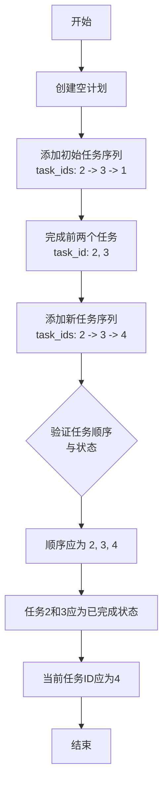

#### 带注释源码

```python
def test_add_tasks_to_existing_with_common_prefix(self):
    # 1. 创建一个空的计划对象，目标为空字符串
    plan = Plan(goal="")

    # 2. 定义初始任务序列：任务2是第一个，任务3依赖任务2，任务1依赖任务2和3。
    #    因此，正确的执行顺序是：2 -> 3 -> 1
    tasks = [
        Task(task_id="1", dependent_task_ids=["2", "3"], instruction="Third"),
        Task(task_id="2", instruction="First"),
        Task(task_id="3", dependent_task_ids=["2"], instruction="Second"),
    ]
    # 将初始任务序列添加到计划中。`add_tasks`方法会处理依赖关系并进行拓扑排序。
    plan.add_tasks(tasks)
    # 3. 模拟执行过程：标记当前任务（任务2）为完成，并推进到下一个任务（任务3）。
    plan.finish_current_task()  # finish 2
    # 再次标记当前任务（任务3）为完成。
    plan.finish_current_task()  # finish 3
    # 此时，计划中的任务状态为：任务2（完成），任务3（完成），任务1（待执行，当前任务）。

    # 4. 定义一组新的任务序列：任务2是第一个，任务3依赖任务2，任务4依赖任务3。
    #    因此，正确的执行顺序是：2 -> 3 -> 4。
    #    新序列与现有序列的公共前缀是：2 -> 3。
    new_tasks = [
        Task(task_id="4", dependent_task_ids=["3"], instruction="Third"),
        Task(task_id="2", instruction="First"),
        Task(task_id="3", dependent_task_ids=["2"], instruction="Second"),
    ]
    # 将新任务序列添加到现有计划中。
    # 预期的行为是：公共前缀（任务2和任务3）应复用现有任务对象及其状态（已完成），
    # 新任务（任务4）被追加到序列末尾。整个计划的任务顺序应更新为：2 -> 3 -> 4。
    plan.add_tasks(new_tasks)

    # 5. 断言验证
    # 5.1 验证最终的任务顺序是否为 ["2", "3", "4"]
    assert [task.task_id for task in plan.tasks] == ["2", "3", "4"]
    # 5.2 验证公共前缀任务（2和3）的状态是否为已完成。
    #     它们应该是之前`finish_current_task`调用中标记为完成的任务，而不是新创建的任务实例。
    assert (
        plan.tasks[0].is_finished and plan.tasks[1].is_finished
    )  # "2" and "3" should be the original finished one
    # 5.3 验证当前待执行的任务ID是 "4"。
    assert plan.current_task_id == "4"
```

### `TestPlan.test_current_task`

该方法用于测试`Plan`类的`current_task`属性，验证在添加任务后，当前任务是否正确指向第一个待执行的任务（即没有依赖或依赖已满足的任务）。

参数：

- `self`：`TestPlan`实例，表示测试类本身，用于调用测试方法。

返回值：`None`，该方法是一个单元测试，不返回任何值，通过断言验证预期行为。

#### 流程图

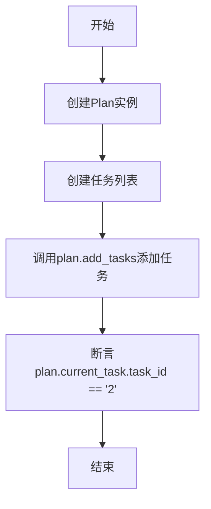

#### 带注释源码

```python
def test_current_task(self):
    # 创建一个目标为空的Plan实例
    plan = Plan(goal="")
    # 定义两个任务，任务"1"依赖于任务"2"，任务"2"没有依赖
    tasks = [
        Task(task_id="1", dependent_task_ids=["2"], instruction="Second"),
        Task(task_id="2", instruction="First"),
    ]
    # 将任务列表添加到Plan中，Plan会根据依赖关系对任务进行排序
    plan.add_tasks(tasks)
    # 断言当前任务的ID为"2"，因为"2"没有依赖，应首先执行
    assert plan.current_task.task_id == "2"
```

### `TestPlan.test_finish_task`

该方法用于测试 `Plan` 类的 `finish_current_task` 方法，验证在任务计划中完成当前任务后，当前任务是否正确切换到下一个任务。

参数：

-  `self`：`TestPlan` 实例，测试类实例本身，用于调用测试方法。

返回值：`None`，无返回值。

#### 流程图

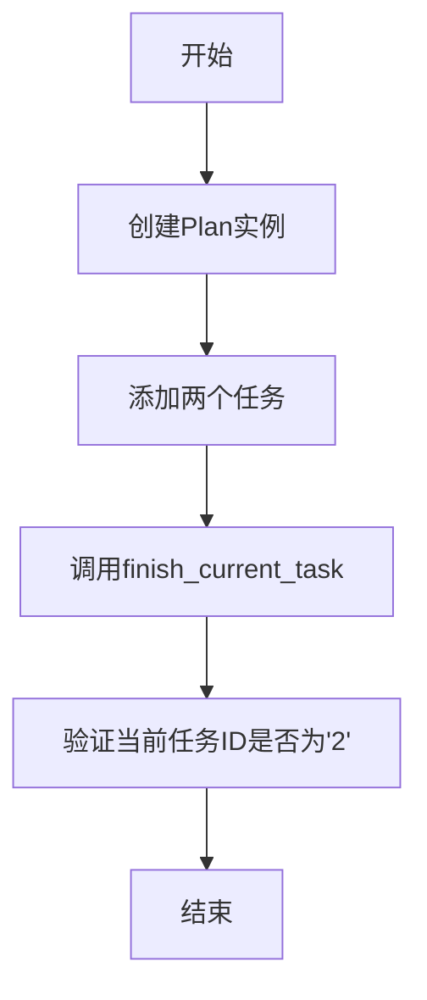

#### 带注释源码

```python
def test_finish_task(self):
    # 创建一个目标为空的Plan实例
    plan = Plan(goal="")
    # 定义两个任务：任务1（无依赖）和任务2（依赖任务1）
    tasks = [
        Task(task_id="1", instruction="First"),
        Task(task_id="2", dependent_task_ids=["1"], instruction="Second"),
    ]
    # 将任务添加到计划中
    plan.add_tasks(tasks)
    # 完成当前任务（任务1）
    plan.finish_current_task()
    # 断言当前任务ID应为'2'，验证任务切换逻辑
    assert plan.current_task.task_id == "2"
```

### `TestPlan.test_finished_tasks`

该方法用于测试`Plan`类的`get_finished_tasks`方法，验证其能否正确返回已完成的任务列表。具体测试场景为：创建一个包含两个任务的计划，其中第一个任务已完成，第二个任务依赖于第一个任务。测试验证`get_finished_tasks`返回的列表长度是否为1，且已完成任务的ID是否为"1"。

参数：

-  `self`：`TestPlan`，测试类实例，用于访问测试方法。

返回值：`None`，无返回值。

#### 流程图

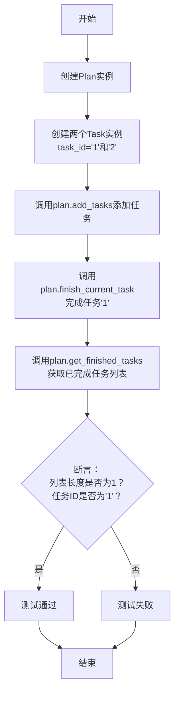

#### 带注释源码

```python
def test_finished_tasks(self):
    # 创建一个目标为空的计划实例
    plan = Plan(goal="")
    # 定义两个任务：任务1（无依赖）和任务2（依赖任务1）
    tasks = [
        Task(task_id="1", instruction="First"),
        Task(task_id="2", dependent_task_ids=["1"], instruction="Second"),
    ]
    # 将任务添加到计划中
    plan.add_tasks(tasks)
    # 标记当前任务（任务1）为已完成
    plan.finish_current_task()
    # 获取所有已完成的任务列表
    finished_tasks = plan.get_finished_tasks()
    # 断言：已完成任务列表应只包含一个任务
    assert len(finished_tasks) == 1
    # 断言：该已完成任务的ID应为"1"
    assert finished_tasks[0].task_id == "1"
```

### `TestPlan.test_reset_task_existing`

该方法用于重置计划中指定任务的状态，将其代码、结果和完成状态清空，使其恢复到未完成状态。

参数：

- `self`：`TestPlan`，测试类实例
- `plan`：`Plan`，计划对象
- `task_id`：`str`，要重置的任务ID

返回值：`None`，无返回值

#### 流程图

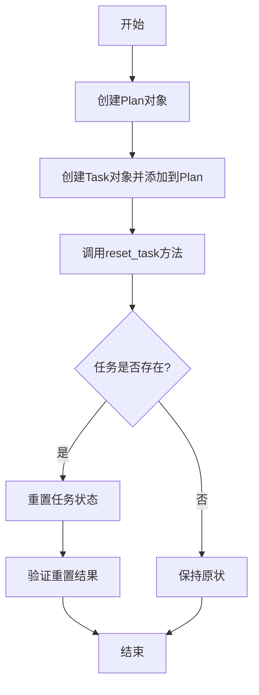

#### 带注释源码

```python
def test_reset_task_existing(self):
    # 创建一个Plan对象，目标为空字符串
    plan = Plan(goal="")
    
    # 创建一个Task对象，设置任务ID为"1"，指令为"Do something"，
    # 代码为"print('Hello')"，结果为"Hello"，并标记为已完成
    task = Task(task_id="1", instruction="Do something", code="print('Hello')", result="Hello", finished=True)
    
    # 将任务添加到Plan中
    plan.add_tasks([task])
    
    # 调用reset_task方法，重置ID为"1"的任务
    plan.reset_task("1")
    
    # 从Plan的任务映射中获取重置后的任务
    reset_task = plan.task_map["1"]
    
    # 断言：重置后任务的代码应为空字符串
    assert reset_task.code == ""
    
    # 断言：重置后任务的结果应为空字符串
    assert reset_task.result == ""
    
    # 断言：重置后任务的完成状态应为False
    assert not reset_task.is_finished
```

### `TestPlan.test_reset_task_non_existing`

该方法用于测试当尝试重置一个不存在的任务时，`Plan` 类的 `reset_task` 方法的行为。具体来说，它验证了当传入一个不存在于计划中的任务ID时，`reset_task` 方法不会修改现有的任务映射，也不会创建新的任务。

参数：

- `self`：`TestPlan` 实例，表示当前测试类实例。
- 无其他显式参数。

返回值：`None`，无返回值。

#### 流程图

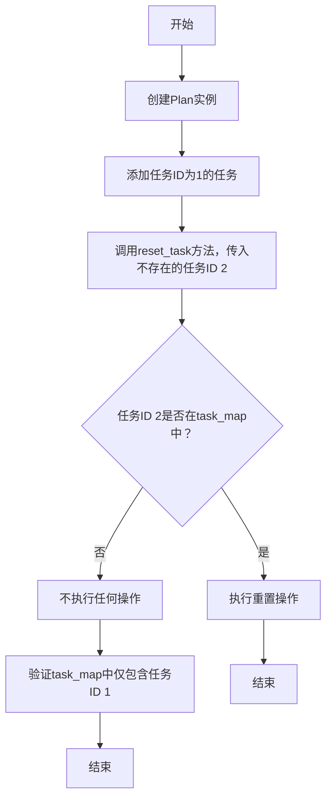

#### 带注释源码

```python
def test_reset_task_non_existing(self):
    # 创建一个Plan实例，目标为空字符串
    plan = Plan(goal="")
    
    # 创建一个任务实例，任务ID为1，包含指令、代码、结果，并标记为已完成
    task = Task(task_id="1", instruction="Do something", code="print('Hello')", result="Hello", finished=True)
    
    # 将任务添加到计划中
    plan.add_tasks([task])
    
    # 尝试重置一个不存在的任务（任务ID为2）
    plan.reset_task("2")  # Task with ID 2 does not exist
    
    # 验证任务ID 1仍然存在于task_map中
    assert "1" in plan.task_map
    
    # 验证任务ID 2不存在于task_map中
    assert "2" not in plan.task_map
```

### `TestPlan.test_replace_task_with_dependents`

该方法用于测试 `Plan` 类的 `replace_task` 方法。具体场景是：当替换一个已有任务时，其所有依赖该任务的后继任务（即依赖于此任务的任务）的状态应该被重置（例如，将 `is_finished` 设为 `False`，并清空 `code` 和 `result` 字段），以确保任务依赖关系的正确性和一致性。

参数：

-  `self`：`TestPlan` 实例，表示当前测试类实例。

返回值：`None`，无返回值。

#### 流程图

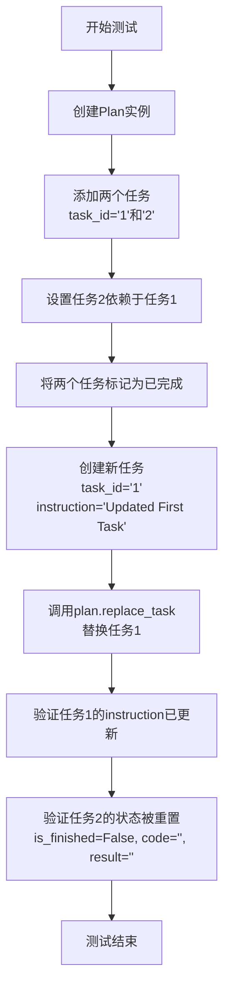

#### 带注释源码

```python
def test_replace_task_with_dependents(self):
    # 创建一个新的Plan实例，目标为空字符串
    plan = Plan(goal="")
    # 定义两个任务：任务1（无依赖，已完成）和任务2（依赖任务1，已完成）
    tasks = [
        Task(task_id="1", instruction="First Task", finished=True),
        Task(task_id="2", instruction="Second Task", dependent_task_ids=["1"], finished=True),
    ]
    # 将任务列表添加到Plan中
    plan.add_tasks(tasks)
    # 创建一个新的任务实例，用于替换原有的任务1（相同的task_id）
    new_task = Task(task_id="1", instruction="Updated First Task")
    # 调用replace_task方法，用new_task替换plan中task_id为"1"的任务
    plan.replace_task(new_task)
    # 断言：替换后，plan中task_id为"1"的任务的instruction应更新为"Updated First Task"
    assert plan.task_map["1"].instruction == "Updated First Task"
    # 断言：由于任务2依赖于任务1，且任务1被替换（状态重置），任务2的is_finished应被重置为False
    assert not plan.task_map["2"].is_finished  # Dependent task should be reset
    # 断言：任务2的code字段应被清空
    assert plan.task_map["2"].code == ""
    # 断言：任务2的result字段应被清空
    assert plan.task_map["2"].result == ""
```

### `TestPlan.test_replace_task_non_existing`

该方法用于测试当尝试替换一个不存在于计划中的任务时，`Plan.replace_task` 方法是否会抛出 `AssertionError` 异常，并确保计划中的任务映射保持不变。

参数：

- `self`：`TestPlan` 实例，测试类实例
- 无其他显式参数

返回值：`None`，无返回值

#### 流程图

```mermaid
flowchart TD
    A[开始] --> B[创建 Plan 实例]
    B --> C[添加任务 ID 为 '1' 的任务]
    C --> D[尝试替换任务 ID 为 '2' 的任务]
    D --> E{是否抛出 AssertionError?}
    E -->|是| F[验证任务映射中 '1' 存在]
    F --> G[验证任务映射中 '2' 不存在]
    G --> H[结束]
    E -->|否| I[测试失败]
    I --> H
```

#### 带注释源码

```python
def test_replace_task_non_existing(self):
    # 创建一个新的 Plan 实例，目标为空字符串
    plan = Plan(goal="")
    
    # 创建一个任务，任务ID为 '1'，指令为 'First Task'
    task = Task(task_id="1", instruction="First Task")
    
    # 将任务添加到计划中
    plan.add_tasks([task])
    
    # 创建一个新的任务，任务ID为 '2'，指令为 'New Task'
    new_task = Task(task_id="2", instruction="New Task")
    
    # 尝试替换任务ID为 '2' 的任务，预期会抛出 AssertionError 异常
    with pytest.raises(AssertionError):
        plan.replace_task(new_task)  # Task with ID 2 does not exist in plan
    
    # 验证任务映射中仍然包含任务ID为 '1' 的任务
    assert "1" in plan.task_map
    
    # 验证任务映射中不包含任务ID为 '2' 的任务
    assert "2" not in plan.task_map
```

### `TestPlan.test_append_task_with_valid_dependencies`

该方法用于测试 `Plan.append_task` 方法在传入具有有效依赖关系的新任务时的行为。具体来说，它验证了当新任务的依赖任务已存在于计划中时，新任务能够被成功追加到任务列表的末尾，并且任务映射中包含了新任务。

参数：

- `self`：`TestPlan` 实例，测试类实例
- 无其他显式参数

返回值：`None`，无返回值

#### 流程图

```mermaid
flowchart TD
    A[开始] --> B[创建Plan实例]
    B --> C[添加现有任务 task_id='1']
    C --> D[创建新任务 task_id='2'<br>依赖任务为 '1']
    D --> E[调用plan.append_task<br>传入新任务]
    E --> F{新任务是否成功追加?}
    F -->|是| G[验证tasks列表最后一个元素为task_id='2']
    G --> H[验证task_map包含task_id='2'的映射]
    H --> I[结束]
    F -->|否| J[测试失败]
    J --> I
```

#### 带注释源码

```python
def test_append_task_with_valid_dependencies(self):
    # 创建一个目标为"Test"的Plan实例
    plan = Plan(goal="Test")
    # 创建一个现有任务列表，包含一个task_id为"1"的任务
    existing_task = [Task(task_id="1")]
    # 将现有任务添加到计划中
    plan.add_tasks(existing_task)
    # 创建一个新任务，其task_id为"2"，并依赖于task_id为"1"的任务
    new_task = Task(task_id="2", dependent_task_ids=["1"])
    # 调用append_task方法，将新任务追加到计划中
    plan.append_task(new_task)
    # 断言：计划的任务列表中最后一个任务的task_id应为"2"
    assert plan.tasks[-1].task_id == "2"
    # 断言：计划的任务映射中应包含task_id为"2"的任务，且其值等于新创建的任务对象
    assert plan.task_map["2"] == new_task
```

### `TestPlan.test_append_task_with_invalid_dependencies`

该方法用于测试当向计划（Plan）中追加一个具有无效依赖关系的新任务时，计划是否会正确地抛出断言错误（AssertionError）。无效依赖指的是新任务所依赖的任务ID在当前计划的任务映射（task_map）中不存在。

参数：

- `self`：`TestPlan`，测试类实例，用于访问测试方法。
- 无其他显式参数。

返回值：`None`，无返回值。测试方法通过断言（assert）或异常捕获来验证代码行为。

#### 流程图

```mermaid
graph TD
    A[开始测试] --> B[创建新任务 new_task<br/>task_id='2', dependent_task_ids=['3']]
    B --> C[创建计划实例 plan<br/>goal='Test']
    C --> D[调用 plan.append_task(new_task)]
    D --> E{是否抛出 AssertionError?}
    E -->|是| F[测试通过]
    E -->|否| G[测试失败]
    F --> H[结束]
    G --> H
```

#### 带注释源码

```python
def test_append_task_with_invalid_dependencies(self):
    # 创建一个新任务，其ID为'2'，并声明它依赖于一个ID为'3'的任务。
    # 此时，计划中尚未添加任何任务，因此ID为'3'的任务不存在于计划中。
    new_task = Task(task_id="2", dependent_task_ids=["3"])
    
    # 创建一个新的计划实例，目标为"Test"。
    plan = Plan(goal="Test")
    
    # 使用pytest的raises上下文管理器来断言：当尝试将new_task追加到plan时，
    # 由于new_task依赖的任务ID'3'在plan.task_map中不存在，append_task方法应抛出AssertionError。
    with pytest.raises(AssertionError):
        plan.append_task(new_task)
```

### `TestPlan.test_append_task_without_dependencies`

该方法用于测试`Plan`类的`append_task`方法在添加一个没有依赖关系的任务时的行为。具体来说，它验证了当向一个已包含任务的计划中添加一个没有依赖的新任务时，新任务会被正确追加到任务列表末尾，并且当前任务ID保持不变。

参数：

- `self`：`TestPlan`，测试类实例，用于调用测试方法。

返回值：`None`，无返回值。

#### 流程图

```mermaid
flowchart TD
    A[开始] --> B[创建Plan实例]
    B --> C[添加初始任务task_id='1']
    C --> D[创建新任务task_id='2'<br>无依赖]
    D --> E[调用plan.append_task<br>添加新任务]
    E --> F[验证任务列表长度是否为2]
    F --> G[验证当前任务ID是否为'1']
    G --> H[结束]
```

#### 带注释源码

```python
def test_append_task_without_dependencies(self):
    # 创建一个新的Plan实例，目标为"Test"
    plan = Plan(goal="Test")
    # 创建一个初始任务列表，包含一个任务ID为'1'的任务
    existing_task = [Task(task_id="1")]
    # 将初始任务添加到计划中
    plan.add_tasks(existing_task)

    # 创建一个新的任务，任务ID为'2'，没有指定依赖关系
    new_task = Task(task_id="2")
    # 调用append_task方法将新任务添加到计划中
    plan.append_task(new_task)

    # 断言：验证计划中的任务列表长度是否为2（初始任务+新任务）
    assert len(plan.tasks) == 2
    # 断言：验证当前任务ID是否为'1'（即初始任务，因为新任务没有依赖且被追加到末尾）
    assert plan.current_task_id == "1"
```

### `TestPlan.test_append_task_updates_current_task`

该方法用于测试在计划（Plan）中追加新任务（Task）时，当前任务（current_task）是否正确更新。具体场景是：当计划中已有一个已完成的任务，追加一个新任务后，当前任务应更新为新任务。

参数：

- `self`：`TestPlan`，测试类实例，用于调用测试方法
- 无其他显式参数

返回值：`None`，无返回值

#### 流程图

```mermaid
graph TD
    A[开始] --> B[创建已完成任务 finished_task]
    B --> C[创建新任务 new_task]
    C --> D[创建计划 plan，包含 finished_task]
    D --> E[调用 plan.append_task(new_task)]
    E --> F[断言 plan.current_task_id == '2']
    F --> G[结束]
```

#### 带注释源码

```python
def test_append_task_updates_current_task(self):
    # 创建一个已完成的任务，任务ID为"1"
    finished_task = Task(task_id="1", is_finished=True)
    # 创建一个新任务，任务ID为"2"
    new_task = Task(task_id="2")
    # 创建一个计划，初始任务列表包含已完成的任务finished_task
    plan = Plan(goal="Test", tasks=[finished_task])
    # 向计划中追加新任务new_task
    plan.append_task(new_task)
    # 断言当前任务ID更新为新任务的ID"2"
    assert plan.current_task_id == "2"
```

### `TestPlan.test_update_current_task`

该方法用于测试`Plan`类的`_update_current_task`方法，验证在给定任务列表后，`Plan`对象能否正确更新其当前任务ID为第一个未完成的任务。

参数：

- `self`：`TestPlan`，测试类实例自身

返回值：`None`，无返回值

#### 流程图

```mermaid
flowchart TD
    A[开始] --> B[创建任务列表<br>task1: 已完成, task2: 未完成]
    B --> C[创建Plan对象<br>goal='Test', tasks=任务列表]
    C --> D[调用plan._update_current_task]
    D --> E[断言plan.current_task_id == '2']
    E --> F[结束]
```

#### 带注释源码

```python
def test_update_current_task(self):
    # 创建两个任务：task1标记为已完成，task2未标记（默认未完成）
    task1 = Task(task_id="1", is_finished=True)
    task2 = Task(task_id="2")
    # 使用这两个任务初始化一个Plan对象，目标为"Test"
    plan = Plan(goal="Test", tasks=[task1, task2])
    # 调用Plan的内部方法_update_current_task来更新当前任务ID
    plan._update_current_task()
    # 断言当前任务ID应为"2"，因为它是第一个未完成的任务
    assert plan.current_task_id == "2"
```

### `TestSerializationMixin.test_serialize`

该方法用于测试 `SerializationMixin` 的 `serialize` 功能，验证模型实例能否正确序列化并保存到指定文件路径。

参数：

- `self`：`TestSerializationMixin`，测试类实例
- `mock_write_json_file`：`MagicMock`，模拟的 `write_json_file` 函数，用于验证文件写入调用
- `mock_user_model`：`TestUserModel`，模拟的用户模型实例，用于测试序列化

返回值：`None`，无返回值，仅用于断言验证

#### 流程图

```mermaid
flowchart TD
    A[开始] --> B[调用 mock_user_model.serialize<br>传入 file_path]
    B --> C[内部调用 write_json_file<br>传入 file_path 和 model_dump 数据]
    C --> D[验证 write_json_file 被调用一次<br>且参数正确]
    D --> E[结束]
```

#### 带注释源码

```python
def test_serialize(self, mock_write_json_file, mock_user_model):
    # 定义测试文件路径
    file_path = "test.json"

    # 调用被测方法：序列化模型到文件
    mock_user_model.serialize(file_path)

    # 验证：确保 write_json_file 被调用一次，且参数正确
    mock_write_json_file.assert_called_once_with(file_path, mock_user_model.model_dump())
```

### `TestSerializationMixin.test_deserialize`

该方法用于测试 `SerializationMixin` 的 `deserialize` 功能，通过模拟读取 JSON 文件并验证反序列化后的对象与预期数据一致。

参数：

- `mock_read_json_file`：`MagicMock`，模拟的 `read_json_file` 函数，用于返回预定义的 JSON 数据。
- `file_path`：`str`，测试用的 JSON 文件路径。
- `data`：`dict`，模拟的 JSON 数据，包含 `name` 和 `value` 字段。
- `model`：`TestUserModel`，反序列化后得到的对象。

返回值：`None`，无返回值，仅用于断言验证。

#### 流程图

```mermaid
graph TD
    A[开始] --> B[模拟 read_json_file 返回数据]
    B --> C[调用 TestUserModel.deserialize]
    C --> D[验证反序列化结果]
    D --> E[结束]
```

#### 带注释源码

```python
def test_deserialize(self, mock_read_json_file):
    # 定义测试文件路径
    file_path = "test.json"
    # 模拟的 JSON 数据
    data = {"name": "test", "value": 42}
    # 设置模拟函数返回预定义的数据
    mock_read_json_file.return_value = data

    # 调用反序列化方法
    model = TestUserModel.deserialize(file_path)

    # 验证模拟函数被正确调用
    mock_read_json_file.assert_called_once_with(file_path)
    # 验证反序列化后的对象与预期数据一致
    assert model == TestUserModel(**data)
```

### `TestSerializationMixin.test_serialize_with_exclude`

该方法用于测试 `SerializationMixin` 的序列化功能，特别是当模型类中包含使用 `Field(exclude=True)` 标记的字段时，确保这些字段在序列化过程中被正确排除。

参数：

- `self`：`TestSerializationMixin` 实例，测试类实例
- `mock_write_json_file`：`MagicMock`，模拟的 `write_json_file` 函数，用于验证序列化时是否调用了正确的写入函数

返回值：`None`，无返回值

#### 流程图

```mermaid
flowchart TD
    A[开始] --> B[创建 TestUserModelWithExclude 实例]
    B --> C[调用 serialize 方法]
    C --> D[构建预期数据<br>排除 age 字段]
    D --> E[验证 mock_write_json_file 被调用]
    E --> F[验证调用参数与预期数据一致]
    F --> G[结束]
```

#### 带注释源码

```python
def test_serialize_with_exclude(self, mock_write_json_file):
    # 创建一个 TestUserModelWithExclude 实例，其中 age 字段被标记为 exclude=True
    model = TestUserModelWithExclude(name="test", value=42, age=10)
    file_path = "test.json"

    # 调用序列化方法
    model.serialize(file_path)

    # 构建预期的序列化数据，注意 age 字段被排除，同时添加了 __module_class_name 用于反序列化
    expected_data = {
        "name": "test",
        "value": 42,
        "__module_class_name": "tests.metagpt.test_schema.TestUserModelWithExclude",
    }

    # 验证 mock_write_json_file 被调用了一次，且参数与预期数据一致
    mock_write_json_file.assert_called_once_with(file_path, expected_data)
```

### `TestSerializationMixin.test_get_serialization_path`

该方法用于测试 `SerializationMixin` 类中的 `get_serialization_path` 静态方法，验证其是否能正确生成序列化文件的默认路径。该路径基于 `SERDESER_PATH` 常量与类名构建。

参数：

-  `self`：`TestSerializationMixin`，测试类实例，用于调用测试方法。

返回值：`None`，无返回值，仅执行断言验证。

#### 流程图

```mermaid
graph TD
    A[开始] --> B[调用 TestUserModel.get_serialization_path]
    B --> C[生成预期路径 SERDESER_PATH/TestUserModel.json]
    C --> D[断言实际路径等于预期路径]
    D --> E[结束]
```

#### 带注释源码

```python
def test_get_serialization_path(self):
    # 生成预期的序列化文件路径，基于 SERDESER_PATH 常量和类名 "TestUserModel"
    expected_path = str(SERDESER_PATH / "TestUserModel.json")

    # 调用被测试的静态方法，获取实际生成的路径
    # 使用断言验证实际路径与预期路径是否一致
    assert TestUserModel.get_serialization_path() == expected_path
```

## 关键组件

### Message 类

作为消息传递系统的核心数据载体，封装了消息内容、发送者、接收者、触发原因等元数据，并支持序列化/反序列化、结构化指令内容解析等高级功能，是系统中不同角色（如用户、AI助手、系统）间通信的基础单元。

### SerializationMixin 类

一个混入类，为 Pydantic 数据模型提供便捷的序列化与反序列化能力，支持将模型实例保存到 JSON 文件以及从 JSON 文件加载，并自动处理类名信息以实现正确的类型还原。

### MessageQueue 类

一个简单的消息队列实现，用于在异步环境中存储和传递 `Message` 对象。它支持基本的入队、出队操作以及整个队列的序列化和反序列化，用于管理消息流。

### Plan 和 Task 类

用于表示和管理一个由多个任务组成的计划。`Task` 定义了单个任务，包含任务ID、指令、依赖关系、状态和结果。`Plan` 管理一个任务列表，负责维护任务间的依赖顺序、跟踪当前任务、完成任务以及处理任务间的重置和替换逻辑。

### UMLClassView, UMLClassAttribute, UMLClassMethod 类

一组用于表示 UML 类图的类。`UMLClassView` 代表一个类，包含其属性和方法。`UMLClassAttribute` 和 `UMLClassMethod` 分别表示类的属性和方法，并能够生成符合 Mermaid 语法的字符串，用于可视化。

### CodeSummarizeContext 类

一个用于代码总结的上下文数据类，封装了与代码总结相关的关键文件路径信息（如设计文件、任务文件），并可作为字典的键使用。

### ActionNode 的动态模型创建

通过 `ActionNode.create_model_class` 方法，能够根据给定的输出字段映射动态创建 Pydantic 模型类。这种机制用于在运行时定义和验证结构化指令内容（`instruct_content`）的格式。

## 问题及建议


### 已知问题

-   **测试代码与实现代码耦合度高**：测试文件 `test_schema.py` 中直接导入了大量实现模块（如 `metagpt.schema` 中的类），并直接测试了这些类的内部方法。这导致测试对实现细节高度敏感，一旦实现类的接口或内部逻辑发生变化，测试很容易失败，增加了维护成本。
-   **测试用例覆盖不完整**：测试主要集中在 `Message`、`Plan`、`Task` 等核心类的正向路径和部分边界条件，但对于一些复杂场景（如 `MessageQueue` 在并发环境下的行为、`SerializationMixin` 处理循环引用或复杂嵌套对象）的测试可能不足。
-   **存在硬编码的测试数据**：部分测试用例（如 `test_CodeSummarizeContext`、`test_parse_resources`）中使用了硬编码的路径或字符串，这降低了测试的灵活性和可维护性。如果相关常量（如 `SYSTEM_DESIGN_FILE_REPO`）的定义发生变化，测试可能会失败。
-   **异步测试的潜在问题**：`test_message_queue` 和 `test_parse_resources` 使用了异步测试，但测试框架和运行环境对异步的支持可能存在差异，可能导致测试在某些环境下不稳定或失败。
-   **序列化/反序列化的健壮性测试不足**：`test_message_serdeser` 测试了 `Message` 对象的序列化和反序列化，但对于异常情况（如无效的 JSON 字符串、缺失的必填字段）的测试覆盖不够全面，可能隐藏潜在的数据一致性问题。
-   **`Message` 类 `instruct_content` 比较的 TODO**：在 `test_message_serdeser` 中有一个注释为 `# TODO` 的断言 `assert new_message.instruct_content == message.instruct_content`，表明当前实现中两个反序列化后的 `instruct_content` 对象可能无法正确比较相等，这暗示了序列化逻辑可能存在缺陷或比较方法需要重载。

### 优化建议

-   **解耦测试与实现**：考虑使用模拟（Mock）或存根（Stub）来隔离测试对象与复杂的依赖项。例如，测试 `Message.parse_resources` 方法时，可以模拟 `llm` 参数，而不是依赖一个真实的外部 LLM 配置，使测试更快速、稳定。
-   **提高测试覆盖率**：补充边界条件和异常场景的测试用例。例如，为 `Plan` 类添加更多关于任务依赖循环、无效任务状态转换的测试；为 `SerializationMixin` 添加处理特殊数据类型（如日期时间、自定义对象）的序列化测试。
-   **使用参数化和夹具（Fixture）**：将硬编码的测试数据提取为 `@pytest.fixture` 或使用 `@pytest.mark.parametrize` 进行参数化，使测试数据更清晰、易于管理，并便于添加新的测试用例。
-   **确保异步测试的可靠性**：明确标记异步测试（使用 `@pytest.mark.asyncio`），并确保测试运行环境正确配置了异步事件循环。考虑在 CI/CD 流水线中验证异步测试的稳定性。
-   **加强序列化/反序列化的异常处理测试**：为 `Message.load`、`SerializationMixin.deserialize` 等方法添加针对畸形输入（如空字符串、格式错误的 JSON、类型不匹配）的测试，确保系统能优雅地处理错误，而不是意外崩溃。
-   **修复 `instruct_content` 比较问题**：调查并解决 `test_message_serdeser` 中关于 `instruct_content` 对象比较的 TODO 项。可能需要检查 `ActionNode` 创建的动态模型的 `__eq__` 方法实现，或确保序列化/反序列化过程是幂等的。
-   **引入属性化测试（Property-based Testing）**：对于 `Plan` 类的任务排序、`Message` 的序列化等复杂逻辑，可以考虑使用类似 `hypothesis` 的库进行属性化测试，自动生成大量随机输入来验证代码是否始终满足某些不变性（invariants），从而发现潜在边缘情况下的 bug。
-   **代码重构以提高可测试性**：审视 `Message`、`Plan` 等类的设计，看是否可以通过依赖注入、接口抽象等方式降低内部状态管理的复杂度，使单元测试更容易编写和维护。


## 其它


### 设计目标与约束

本测试文件 `test_schema.py` 的核心设计目标是验证 `metagpt.schema` 模块中定义的核心数据模型（如 `Message`、`Document`、`Plan`、`Task` 等）的功能正确性、序列化/反序列化能力以及与其他组件的交互逻辑。约束包括：1) 必须与 Pydantic 模型兼容，以支持类型检查和数据验证；2) 序列化格式需支持 JSON，便于持久化和网络传输；3) 部分类（如 `Message`）需支持动态字段扩展和指令内容（`instruct_content`）的复杂类型处理；4) 测试需覆盖正向功能、边界条件及异常场景。

### 错误处理与异常设计

测试代码中通过 `pytest.raises` 显式验证了特定方法在非法输入时应抛出断言错误（`AssertionError`），例如 `Plan.replace_task` 在替换不存在的任务时。对于 `Message.load` 方法，测试验证了其处理无效 JSON 字符串的健壮性（返回 `None` 或空对象）。整体上，错误处理主要依赖于 Pydantic 的输入验证和自定义的业务逻辑断言，未广泛使用 try-except 块，符合单元测试的焦点——验证预期行为而非实现容错。

### 数据流与状态机

测试清晰地展示了多个核心类的状态转换和数据流：
1.  **Message/MessageQueue**: 测试了消息的创建、属性修改、序列化/反序列化、以及通过 `MessageQueue` 的入队（`push`）、出队（`pop`）、持久化（`dump`）和恢复（`load`）流程。数据流从对象实例到 JSON 字符串再到恢复后的对象。
2.  **Plan/Task**: 重点测试了任务计划的状态机逻辑。通过 `add_tasks`、`finish_current_task`、`reset_task`、`replace_task` 等方法，验证了任务依赖关系的解析（拓扑排序）、任务状态的转换（未完成->完成）、以及状态变化（如重置或替换父任务）如何级联影响依赖子任务的状态（如将子任务重置为未完成）。
3.  **SerializationMixin**: 测试了序列化（对象到文件）和反序列化（文件到对象）的数据流，包括对带有排除字段（`Field(exclude=True)`）的模型的特殊处理。

### 外部依赖与接口契约

1.  **Pydantic**: 作为基础依赖，所有核心数据模型均继承自 `BaseModel`。测试验证了模型字段的类型约束、默认值以及 `model_dump`、`model_validate` 等方法的使用。
2.  **pytest**: 作为测试框架，用于组织测试用例、参数化测试（`@pytest.mark.parametrize`）和异步测试（`@pytest.mark.asyncio`）。
3.  **metagpt.actions.ActionNode**: 在 `test_message_serdeser` 中，`Message` 的 `instruct_content` 字段被设置为一个由 `ActionNode.create_model_class` 动态创建的 Pydantic 模型实例。这测试了 `Message` 与 `ActionNode` 模块之间的接口契约，即 `Message` 必须能正确序列化和反序列化这种动态类型的指令内容。
4.  **metagpt.utils.common.any_to_str**: 被 `Message` 类内部使用，用于将类或实例转换为其字符串表示形式（如 `"metagpt.actions.write_code.WriteCode"`）。测试验证了 `cause_by` 和 `send_to` 字段在设置类或实例时的正确转换行为。
5.  **LLM (Large Language Model)**: 在 `test_parse_resources` 异步测试中，`Message.parse_resources` 方法接受一个 `llm` 参数。这表明 `Message` 类定义了一个与外部 LLM 服务交互的接口契约，用于从自然语言内容中解析结构化资源信息。测试通过模拟的 `llm` 上下文验证了这一功能。

### 测试策略与覆盖范围

1.  **单元测试**: 每个测试函数专注于一个类或一个特定功能点（如 `test_message`, `test_document`, `test_class_view`）。
2.  **集成测试**: `test_message_serdeser` 和 `test_parse_resources` 测试了多个组件（`Message`, `ActionNode`, `LLM`）的协同工作。
3.  **状态与副作用测试**: 对 `Plan` 和 `Task` 的测试大量涉及对象状态变更（如 `is_finished`）及其引发的副作用（如依赖任务重置）。
4.  **边界与异常测试**: 包括测试空消息队列、无效 JSON 反序列化、不存在的任务 ID 操作等。
5.  **异步支持**: 使用 `pytest.mark.asyncio` 装饰器测试 `MessageQueue.dump` 和 `Message.parse_resources` 等异步方法。

    