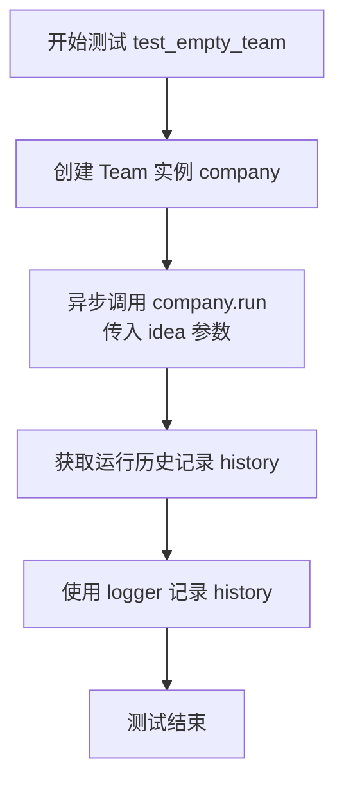
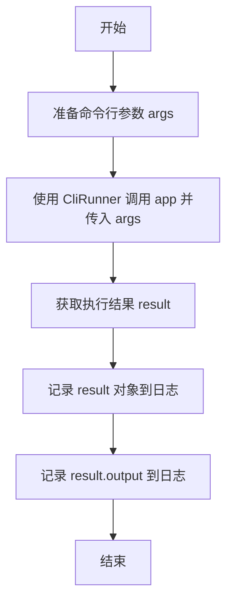
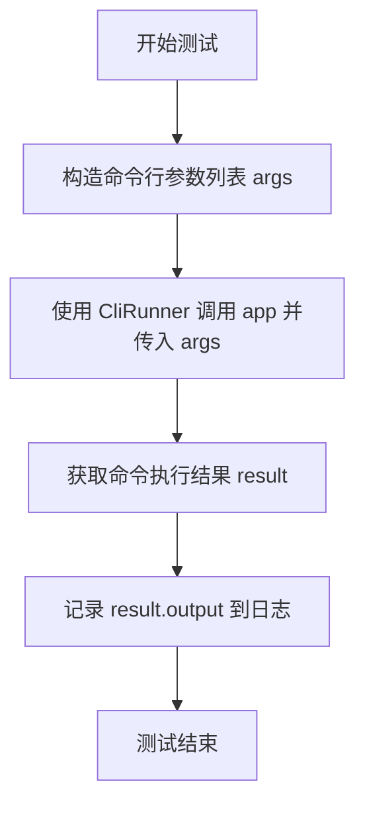
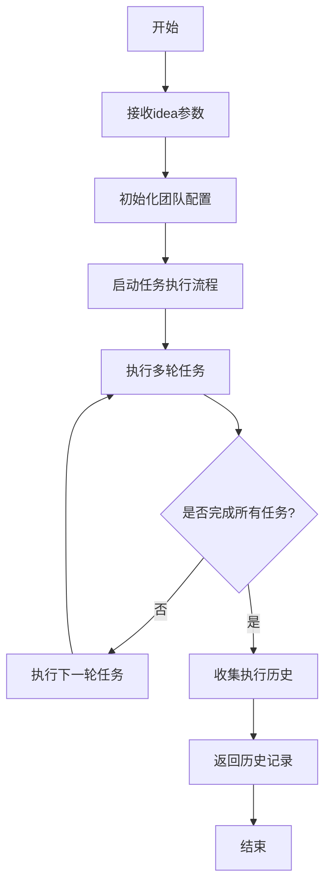

# `.\MetaGPT\tests\metagpt\test_software_company.py` 详细设计文档

该文件是一个测试脚本，用于验证 MetaGPT 软件公司框架的核心功能。它包含两个主要测试：1) 测试空团队（Team）对象能否基于一个想法（idea）运行并生成历史记录；2) 测试通过命令行接口（CLI）启动软件公司应用，根据用户指令（如“制作一个命令行贪吃蛇游戏”）自动生成代码，并可选择是否运行测试。

## 整体流程

```mermaid
graph TD
    A[开始执行测试] --> B{测试类型?}
    B -- 异步测试空团队 --> C[创建空Team对象]
    C --> D[调用company.run(idea)]
    D --> E[获取并记录运行历史]
    B -- 测试CLI应用 --> F[使用CliRunner构造参数]
    F --> G[调用app执行命令]
    G --> H[记录并检查输出结果]
    B -- 测试带测试的CLI --> I[构造带--run-tests等参数的指令]
    I --> J[调用app执行命令]
    J --> K[记录输出并断言包含测试信息]
```

## 类结构

```
test_software_company.py (测试模块)
├── 全局变量: runner
├── 全局函数: test_empty_team, test_software_company, test_software_company_with_run_tests
└── 外部依赖类: Team, app (来自metagpt)
```

## 全局变量及字段


### `runner`
    
用于测试Typer CLI应用程序的测试运行器，提供调用命令行接口并捕获输出的功能。

类型：`typer.testing.CliRunner`
    


    

## 全局函数及方法

### `test_empty_team`

这是一个使用 `pytest` 框架编写的异步测试函数，用于测试 `Team` 类在接收一个初始想法（idea）后，其 `run` 方法能否正常执行并返回历史记录。该测试旨在验证团队协作流程的基本功能。

参数：
- `new_filename`：`pytest fixture`，一个由 `conftest.py` 或其他地方定义的 `pytest fixture`，通常用于在测试前后设置和清理临时文件或环境。其具体类型和功能取决于 `fixture` 的定义。

返回值：`None`，测试函数通常不显式返回值，其成功与否由 `pytest` 通过断言或异常来判断。

#### 流程图



#### 带注释源码

```python
@pytest.mark.asyncio  # 使用 pytest 的 asyncio 插件标记此函数为异步测试
async def test_empty_team(new_filename):  # 定义异步测试函数，接收 new_filename fixture
    # FIXME: we're now using "metagpt" cli, so the entrance should be replaced instead.
    # 注释：这是一个待修复项，指出当前测试直接使用 Team 类，但项目入口已改为 CLI 工具，未来可能需要调整。
    
    company = Team()  # 实例化一个 Team 对象
    # 异步调用 Team 实例的 run 方法，传入一个初始想法（idea）。
    # run 方法会根据这个想法驱动团队（可能包含多个角色）进行协作，并返回整个交互过程的历史记录。
    history = await company.run(idea="Build a simple search system. I will upload my files later.")
    
    logger.info(history)  # 使用项目定义的 logger 将运行历史记录输出到日志，便于调试和验证。
```

### `test_software_company`

该函数是一个单元测试函数，用于测试`software_company`模块的CLI应用功能。它通过模拟命令行输入，触发一个生成命令行贪吃蛇游戏的任务，并记录执行结果和输出。

参数：

- `new_filename`：`pytest fixture`，一个pytest fixture，用于提供一个新的临时文件名，通常用于测试文件操作，确保测试隔离性。

返回值：`None`，该函数没有返回值，主要用于执行测试和记录日志。

#### 流程图



#### 带注释源码

```python
def test_software_company(new_filename):
    # 准备命令行参数，模拟用户输入“Make a cli snake game”
    args = ["Make a cli snake game"]
    # 使用 CliRunner 模拟调用 CLI 应用 `app`，并传入准备好的参数
    result = runner.invoke(app, args)
    # 将整个结果对象记录到日志中，便于调试
    logger.info(result)
    # 将 CLI 命令执行的标准输出记录到日志中，用于验证功能
    logger.info(result.output)
```

### `test_software_company_with_run_tests`

这是一个使用 `typer.testing.CliRunner` 来测试 `metagpt.software_company` 模块中CLI应用的函数。它模拟用户通过命令行输入一个需求（“Make a cli snake game”）并附带 `--run-tests` 和 `--n-round=8` 参数来运行软件公司流程，并验证其输出。

参数：
-  `self`：`pytest` 测试函数上下文，用于组织测试用例。
-  无显式参数：此函数不接受任何用户定义的参数。它内部构造了 `args` 列表来模拟命令行输入。

返回值：`None`，这是一个测试函数，其主要目的是执行断言或验证行为，不返回业务逻辑值。

#### 流程图



#### 带注释源码

```python
def test_software_company_with_run_tests():
    # 构造模拟命令行输入的参数列表。
    # 第一个元素是主要需求“Make a cli snake game”。
    # `--run-tests` 参数指示运行测试。
    # `--n-round=8` 参数设置运行轮数为8。
    args = ["Make a cli snake game", "--run-tests", "--n-round=8"]
    
    # 使用 CliRunner 实例 `runner` 来调用CLI应用 `app`，并传入模拟的参数 `args`。
    # 这模拟了在终端执行 `metagpt "Make a cli snake game" --run-tests --n-round=8` 命令。
    result = runner.invoke(app, args)
    
    # 将命令执行的输出（result.output）记录到日志中，便于调试和验证。
    logger.info(result.output)
    
    # 这里有一行被注释掉的断言，原本用于检查输出中是否包含测试框架（如unittest或pytest）的标识。
    # 这可能是为了验证 `--run-tests` 参数是否真正触发了测试流程。
    # assert "unittest" in result.output.lower() or "pytest" in result.output.lower()
```

### `Team.run`

该方法用于运行团队项目，根据给定的想法（idea）启动并执行一系列任务，最终返回执行历史记录。

参数：

- `idea`：`str`，项目的核心想法或需求描述

返回值：`str`，执行过程中的历史记录

#### 流程图



#### 带注释源码

```python
async def run(self, idea: str) -> str:
    """
    运行团队项目的主方法。
    
    该方法接收一个项目想法，初始化团队配置，启动任务执行流程，
    并返回执行过程中的历史记录。
    
    Args:
        idea (str): 项目的核心想法或需求描述
        
    Returns:
        str: 执行过程中的历史记录
    """
    # 初始化团队配置
    self.initialize_team(idea)
    
    # 启动任务执行流程
    await self.start_execution()
    
    # 执行多轮任务直到完成
    while not self.all_tasks_completed():
        await self.execute_next_round()
    
    # 收集并返回执行历史
    history = self.collect_execution_history()
    return history
```

## 关键组件


### 测试框架 (pytest)

用于编写和执行单元测试及异步测试的Python测试框架，支持命令行参数化测试。

### 命令行界面测试工具 (CliRunner)

来自typer库的工具，用于模拟和测试命令行应用程序的调用和输出。

### 日志系统 (logger)

用于记录测试执行过程中的信息和结果，便于调试和追踪。

### 软件公司模拟系统 (Team)

核心业务逻辑组件，模拟一个软件公司团队根据给定的需求（idea）运行并生成开发历史。

### 命令行应用程序 (app)

基于typer构建的CLI入口点，接收用户需求（如"Make a cli snake game"）和运行参数（如`--run-tests`），并驱动`Team`执行任务。

### 测试参数化 (new_filename)

一个pytest fixture，用于为测试用例提供新的文件名，可能用于管理测试环境或资源。

### 异步测试支持 (@pytest.mark.asyncio)

装饰器，标记异步测试函数，允许在测试中运行异步代码（如`await company.run(...)`）。

### 测试断言与验证

代码中包含了对命令行输出结果的验证逻辑（如检查输出中是否包含"unittest"或"pytest"），用于确认功能是否符合预期。


## 问题及建议


### 已知问题

-   **测试入口不一致**：`test_empty_team` 函数使用 `Team` 类的 `run` 方法直接进行测试，而 `test_software_company` 和 `test_software_company_with_run_tests` 函数则通过调用 `metagpt` CLI 应用进行测试。这导致了测试策略的不统一，可能掩盖了 CLI 入口或直接 API 调用中存在的特定问题。
-   **测试断言被注释**：在 `test_software_company_with_run_tests` 函数中，用于验证测试是否成功运行的断言语句（`assert "unittest" in result.output.lower() or "pytest" in result.output.lower()`）被注释掉了。这使得该测试用例失去了其核心的验证目的，仅作为演示流程存在，无法有效保证 `--run-tests` 参数的功能正确性。
-   **硬编码的测试参数**：测试用例中直接使用了固定的参数值（如 `"Make a cli snake game"`、`--n-round=8`）。这使得测试用例的灵活性和可复用性较差，难以适应不同的测试场景或需求。
-   **资源清理不明确**：测试代码中创建了 `Team` 实例并运行了任务，但未展示或执行任何资源清理（如停止异步任务、释放内存等）的步骤。在长期运行的测试套件中，这可能存在资源泄漏的风险。

### 优化建议

-   **统一测试策略**：建议统一测试入口。要么将所有测试改为通过 CLI 进行（以测试最终用户界面），要么改为直接调用核心 API（以进行更细粒度的单元测试）。如果两者都需要，应明确区分集成测试和单元测试，并分别放置在不同的测试文件或模块中。
-   **启用并完善断言**：应取消 `test_software_company_with_run_tests` 函数中关键断言的注释，并根据 `software_company` 模块的实际行为，设计更精确、健壮的断言条件，以确保 `--run-tests` 参数确实触发了测试运行并产生了预期结果。
-   **参数化测试用例**：使用 `pytest` 的 `@pytest.mark.parametrize` 装饰器对测试函数进行参数化。将测试想法（`idea`）、命令行参数等作为参数传入，这样可以轻松扩展测试场景，提高代码复用率，并使测试报告更清晰。
-   **明确资源管理**：对于涉及异步操作或外部资源（如文件、网络）的测试，应确保在每个测试用例的结束阶段（例如在 `teardown` 方法或使用 `pytest.fixture` 的清理逻辑中）进行妥善的资源释放和状态重置。对于 `Team` 或类似可能启动后台任务的对象，应提供并调用明确的 `stop` 或 `cleanup` 方法。
-   **增强测试隔离性**：`test_empty_team` 函数使用了 `new_filename` fixture，但其他测试函数没有。应检查所有测试是否都具备良好的隔离性，确保测试之间不会因为共享状态（如全局变量、临时文件、数据库）而相互干扰。考虑使用 `pytest` 的 fixture 来管理测试依赖和隔离环境。
-   **补充错误路径测试**：当前的测试主要覆盖了正常路径（Happy Path）。建议补充对异常或边界情况的测试，例如传入空的 idea 字符串、无效的命令行参数等，以验证系统的鲁棒性和错误处理能力。


## 其它


### 设计目标与约束

本测试文件的设计目标是验证 `metagpt.software_company` 模块的核心功能，特别是其命令行接口（CLI）和异步团队协作流程的正确性。主要约束包括：
1.  **测试隔离性**：每个测试用例应独立运行，不依赖外部状态或持久化数据。`new_filename` fixture 的使用体现了对临时文件管理的需求。
2.  **异步支持**：代码需要正确测试异步的 `Team.run` 方法，因此使用了 `@pytest.mark.asyncio` 装饰器。
3.  **CLI 集成测试**：通过 `typer.testing.CliRunner` 模拟命令行调用，验证 `app` 对象对参数解析、命令执行和输出的处理。
4.  **功能覆盖**：测试需覆盖基本运行（`test_software_company`）、带特定运行参数（`--run-tests`, `--n-round`）的运行（`test_software_company_with_run_tests`）以及团队初始化的边界情况（`test_empty_team`）。

### 错误处理与异常设计

测试文件本身不包含业务逻辑的错误处理，但其设计反映了对被测系统（SUT）异常情况的验证考虑：
1.  **隐式断言**：测试主要依赖运行是否成功（不抛出异常）以及输出日志是否包含预期内容（如被注释掉的 `assert "unittest"`）来进行验证。这是一种相对宽松的检查。
2.  **边界条件测试**：`test_empty_team` 函数测试了 `Team` 对象在初始化后（可能未完全配置）执行 `run` 方法的行为，这有助于发现初始化或流程中的潜在问题。
3.  **CLI 错误流**：虽然当前测试未显式测试错误输入，但使用 `CliRunner.invoke` 的方式可以扩展用于测试无效参数、缺失参数等情况，并检查其退出码和错误信息输出。
4.  **测试自身的健壮性**：通过 `pytest` 框架管理测试生命周期和异常，确保单个测试失败不影响其他测试执行。

### 数据流与状态机

本测试文件涉及的数据流和状态相对简单：
1.  **输入数据流**：
    *   **测试用例参数**：如 `"Build a simple search system..."` 和 `"Make a cli snake game"` 作为 `idea` 参数或 CLI 参数注入系统。
    *   **CLI 参数**：通过 `args` 列表模拟命令行输入，如 `["Make a cli snake game", "--run-tests", "--n-round=8"]`。
2.  **输出数据流**：
    *   **日志输出**：所有测试都将关键信息（如 `result`, `result.output`, `history`）通过 `logger.info` 记录，这是主要的验证和调试信息输出。
    *   **控制台输出**：CLI 测试中，`result.output` 捕获了 `app` 执行后的标准输出和错误流。
3.  **状态变迁**：
    *   **Team 对象状态**：在 `test_empty_team` 中，`Company` (Team) 对象从初始状态，经过 `run` 方法异步执行，最终产生 `history`。测试验证了这个过程能顺利完成而不崩溃。
    *   **CLI 执行状态**：`CliRunner.invoke` 触发一个独立的子进程（或模拟环境）执行 CLI 命令，该过程包含启动、执行、结束的状态变迁，并以 `result` 对象封装最终状态（退出码、输出等）。

### 外部依赖与接口契约

测试文件明确依赖以下外部组件，并隐含了相应的接口契约：
1.  **pytest 框架**：依赖其测试发现、夹具（fixture）管理（如 `new_filename`）、异步测试支持（`pytest.mark.asyncio`）和断言机制。契约是遵循 pytest 的测试函数命名和结构约定。
2.  **typer.testing.CliRunner**：用于测试 Typer 应用的 CLI。契约是 `app` 对象必须是一个兼容 Typer 的 CLI 应用实例，`runner.invoke(app, args)` 能正确触发其执行。
3.  **metagpt 模块**：这是核心的被测依赖。
    *   `from metagpt.software_company import app`：契约是 `software_company` 模块需导出一个名为 `app` 的 Typer 应用实例。
    *   `from metagpt.team import Team`：契约是 `team` 模块需导出一个 `Team` 类，且该类拥有异步的 `run(idea)` 方法。
    *   `from metagpt.logs import logger`：契约是 `logs` 模块需导出一个配置好的 `logger` 实例用于记录。
4.  **隐式依赖**：`Team.run` 和 `app` 的执行可能内部依赖更多模块（如 LLM 接口、文件操作等），但这些依赖的细节和契约由被测系统内部管理，测试文件仅关注其公开接口（`run` 方法和 CLI）。

### 测试策略与范围

1.  **测试类型**：本文件包含集成测试和组件测试。`test_software_company` 和 `test_software_company_with_run_tests` 是 CLI 级别的集成测试。`test_empty_team` 是对 `Team` 类核心方法的组件测试。
2.  **覆盖范围**：
    *   **正面路径**：测试了正常输入下 CLI 和 `Team.run` 的基本功能。
    *   **参数化路径**：测试了带额外标志（`--run-tests`, `--n-round`）的 CLI 执行路径。
    *   **边界/初始化路径**：测试了 `Team` 对象的最小化初始化运行场景。
3.  **验证点**：
    *   流程能执行完成，不抛出未处理异常。
    *   CLI 能接收参数并执行（通过检查 `result.output` 非空或包含特定关键词，如被注释的 `unittest` 检查）。
    *   异步操作能正确执行和返回。
4.  **不足与扩展**：当前测试缺乏对错误输入、异常路径、具体输出内容结构的严格断言，以及性能、并发等方面的测试。可以扩展更多参数化测试用例和更精确的断言。


    