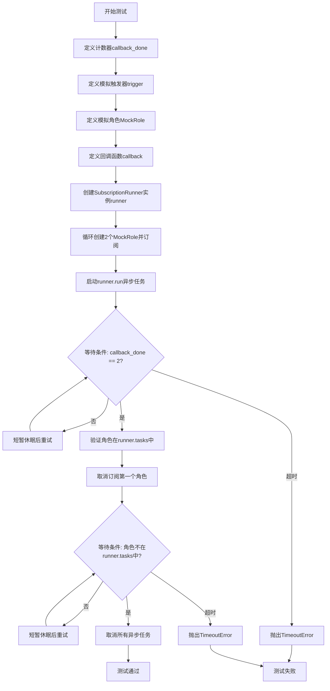
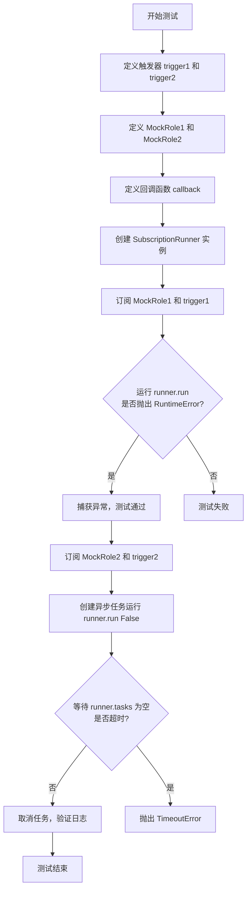
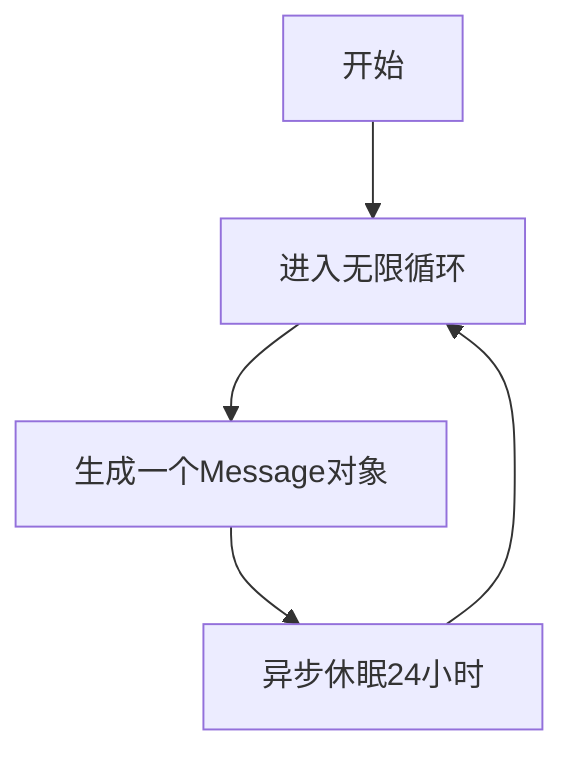
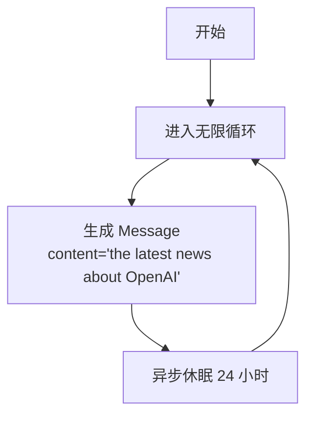
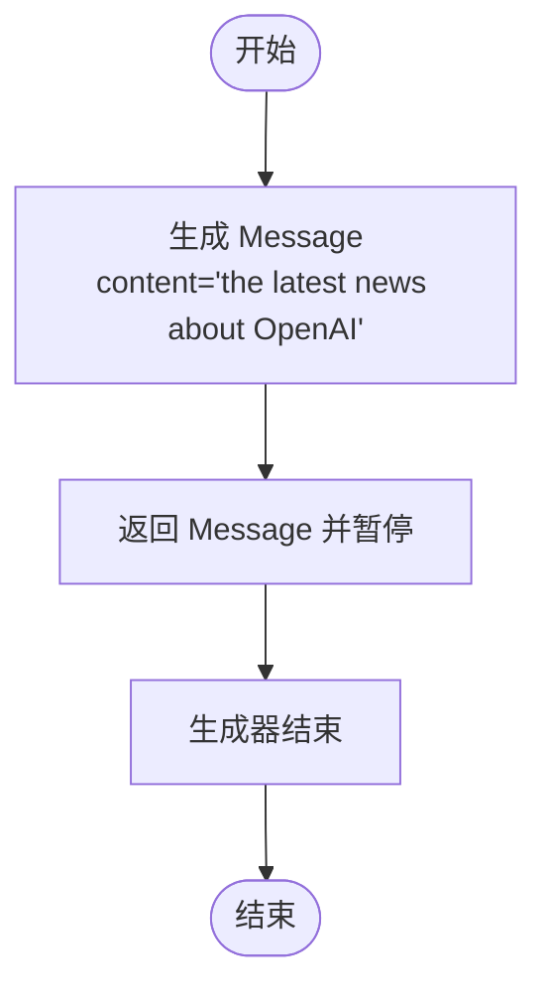
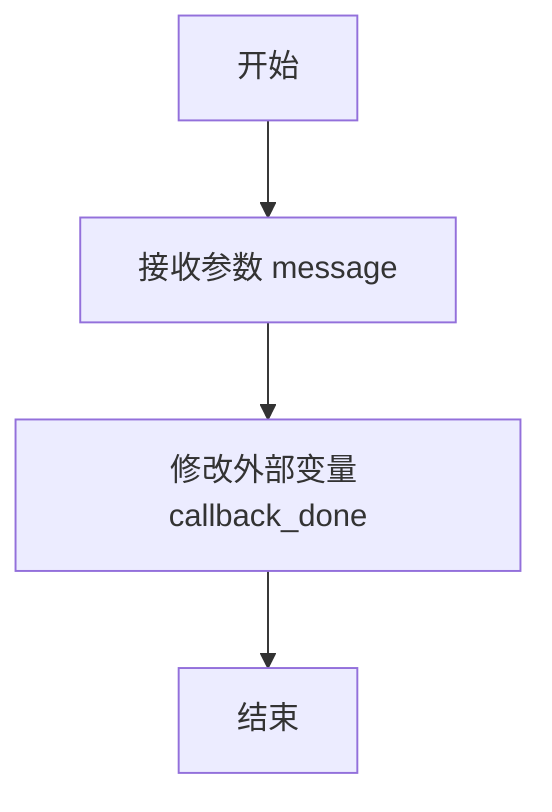
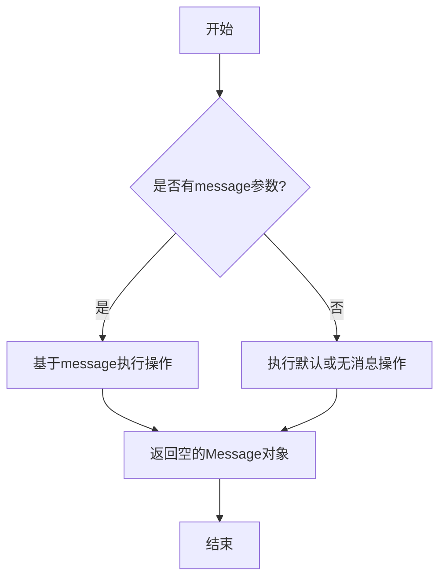
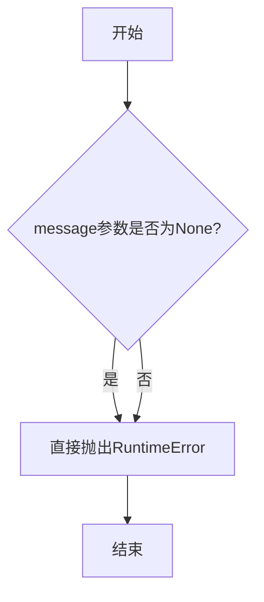
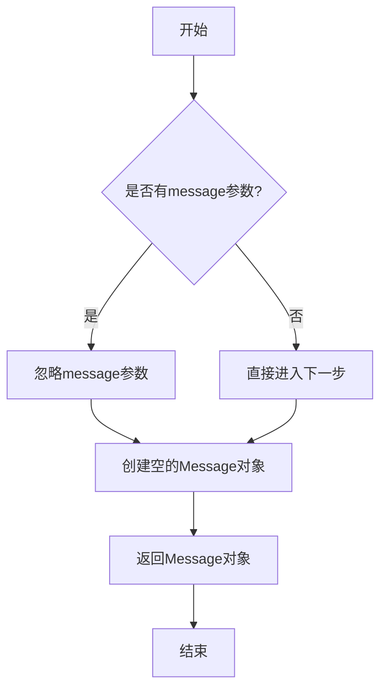

# `.\MetaGPT\tests\metagpt\test_subscription.py` 详细设计文档

该代码是一个使用 pytest 框架编写的异步单元测试文件，用于测试 `SubscriptionRunner` 类的核心功能。`SubscriptionRunner` 是一个订阅运行器，它允许将多个 `Role`（角色）实例与异步生成器 `trigger`（触发器）和回调函数 `callback` 绑定。当触发器产生新消息时，运行器会驱动对应的角色执行 `run` 方法，并将结果传递给回调函数。测试主要验证了订阅、取消订阅、并发执行以及错误处理等关键流程的正确性。

## 整体流程

```mermaid
graph TD
    A[开始测试] --> B[创建 SubscriptionRunner 实例]
    B --> C[定义 MockRole 和异步触发器]
    C --> D[调用 runner.subscribe 进行订阅]
    D --> E[创建异步任务运行 runner.run]
    E --> F{等待触发器产生消息?}
    F -- 是 --> G[驱动对应 Role 执行 run 方法]
    G --> H[调用注册的 callback 函数]
    H --> I{验证回调执行次数?}
    I -- 成功 --> J[调用 runner.unsubscribe 取消订阅]
    I -- 失败/超时 --> K[抛出 TimeoutError]
    J --> L{验证角色是否从任务列表移除?}
    L -- 成功 --> M[取消所有异步任务]
    L -- 失败/超时 --> N[抛出 TimeoutError]
    M --> O[测试结束]
    
    P[开始错误处理测试] --> Q[订阅一个会抛出 RuntimeError 的 MockRole]
    Q --> R[运行 runner.run，预期捕获 RuntimeError]
    R --> S[订阅一个正常的 MockRole]
    S --> T[创建异步任务运行 runner.run(False)]
    T --> U{等待 runner.tasks 清空?}
    U -- 是 --> V[取消任务，检查日志]
    U -- 否/超时 --> W[抛出 TimeoutError]
    V --> X[验证日志包含特定错误信息]
    X --> Y[错误处理测试结束]
```

## 类结构

```
测试文件 (test_subscription.py)
├── 全局函数
│   ├── test_subscription_run (异步测试函数)
│   └── test_subscription_run_error (异步测试函数)
└── 内部类定义
    ├── MockRole (继承自 Role，用于测试)
    ├── MockRole1 (继承自 Role，run 方法抛出 RuntimeError)
    └── MockRole2 (继承自 Role，run 方法正常返回)
```

## 全局变量及字段


### `callback_done`
    
用于跟踪回调函数被调用次数的计数器，用于测试验证

类型：`int`
    


### `runner`
    
订阅运行器实例，负责管理角色订阅和消息分发

类型：`SubscriptionRunner`
    


### `roles`
    
测试中创建的模拟角色对象列表，用于验证订阅和取消订阅功能

类型：`List[MockRole]`
    


### `task`
    
异步任务对象，用于运行SubscriptionRunner并允许测试代码控制其生命周期

类型：`asyncio.Task`
    


### `loguru_caplog`
    
pytest的日志捕获装置，用于在测试中捕获和验证日志输出

类型：`pytest.LogCaptureFixture`
    


    

## 全局函数及方法

### `test_subscription_run`

该函数是一个异步单元测试，用于验证`SubscriptionRunner`的核心功能：订阅角色（Role）到触发器（trigger），当触发器产生消息时，异步执行角色的`run`方法并调用回调函数（callback）。测试涵盖了订阅、消息触发、回调执行、取消订阅以及异常处理等完整流程。

参数：
- 无显式参数。作为`pytest`测试函数，它依赖于`pytest`框架提供的测试上下文。

返回值：`None`，这是一个测试函数，其主要目的是通过断言（assert）验证功能，不返回业务值。

#### 流程图



#### 带注释源码

```python
@pytest.mark.asyncio  # 标记此函数为异步测试函数
async def test_subscription_run():
    # 定义一个计数器，用于验证回调函数被调用的次数
    callback_done = 0

    # 定义一个模拟的异步生成器作为触发器，它周期性地产生消息
    async def trigger():
        while True:
            # 产生一个模拟的新闻消息
            yield Message(content="the latest news about OpenAI")
            # 模拟长间隔，在实际测试中会被快速轮询绕过
            await asyncio.sleep(3600 * 24)

    # 定义一个模拟角色，其run方法返回一个空消息
    class MockRole(Role):
        async def run(self, message=None):
            return Message(content="")

    # 定义回调函数，当角色处理完消息后被调用，递增计数器
    async def callback(message):
        nonlocal callback_done  # 允许修改外部函数的变量
        callback_done += 1

    # 创建订阅运行器实例
    runner = SubscriptionRunner()

    # 准备一个列表用于存储创建的角色，便于后续验证和操作
    roles = []
    # 创建并订阅2个模拟角色
    for _ in range(2):
        role = MockRole()
        roles.append(role)
        # 将角色、触发器和回调函数订阅到运行器
        await runner.subscribe(role, trigger(), callback)

    # 在事件循环中创建并启动运行器的主任务
    task = asyncio.get_running_loop().create_task(runner.run())

    # 等待条件：两个角色的回调函数都应被至少调用一次（计数器为2）
    # 通过有限次循环和短暂休眠来轮询，避免永久阻塞
    for _ in range(10):
        if callback_done == 2:
            break
        await asyncio.sleep(0)  # 让出控制权，允许其他异步任务运行
    else:
        # 如果循环结束仍未满足条件，则抛出超时错误
        raise TimeoutError("callback not call")

    # 验证第一个角色确实在运行器的任务字典中
    role = roles[0]
    assert role in runner.tasks
    # 取消订阅第一个角色
    await runner.unsubscribe(roles[0])

    # 等待条件：确保第一个角色已从运行器的任务字典中移除
    for _ in range(10):
        if role not in runner.tasks:
            break
        await asyncio.sleep(0)
    else:
        raise TimeoutError("callback not call")

    # 测试完毕，清理：取消主任务和所有剩余的角色任务
    task.cancel()
    for i in runner.tasks.values():
        i.cancel()
```

### `test_subscription_run_error`

该函数是一个异步单元测试，用于验证 `SubscriptionRunner` 在运行过程中遇到错误时的行为。它测试了当订阅的角色（Role）在执行 `run` 方法时抛出异常，以及当触发器（trigger）正常完成时，`SubscriptionRunner` 是否能正确处理错误、记录日志，并确保任务能够正常结束。

参数：

- `loguru_caplog`：`pytest.fixture`，用于捕获 `loguru` 日志记录器的日志输出，以便在测试中验证日志内容。

返回值：`None`，该函数是一个测试函数，不返回任何值。

#### 流程图



#### 带注释源码

```python
@pytest.mark.asyncio
async def test_subscription_run_error(loguru_caplog):
    # 定义一个无限循环的触发器，每隔24小时返回一条消息
    async def trigger1():
        while True:
            yield Message(content="the latest news about OpenAI")
            await asyncio.sleep(3600 * 24)

    # 定义一个只返回一条消息的触发器
    async def trigger2():
        yield Message(content="the latest news about OpenAI")

    # 模拟角色1，其 run 方法会抛出 RuntimeError
    class MockRole1(Role):
        async def run(self, message=None):
            raise RuntimeError

    # 模拟角色2，其 run 方法正常返回一个空消息
    class MockRole2(Role):
        async def run(self, message=None):
            return Message(content="")

    # 回调函数，简单打印接收到的消息
    async def callback(msg: Message):
        print(msg)

    # 创建 SubscriptionRunner 实例
    runner = SubscriptionRunner()
    # 订阅 MockRole1 和 trigger1，预期会抛出 RuntimeError
    await runner.subscribe(MockRole1(), trigger1(), callback)
    with pytest.raises(RuntimeError):
        await runner.run()

    # 订阅 MockRole2 和 trigger2，触发器只会产生一条消息
    await runner.subscribe(MockRole2(), trigger2(), callback)
    # 创建异步任务运行 runner.run，参数 False 表示不等待任务完成
    task = asyncio.get_running_loop().create_task(runner.run(False))

    # 等待 runner.tasks 变为空，即所有任务完成
    for _ in range(10):
        if not runner.tasks:
            break
        await asyncio.sleep(0)
    else:
        raise TimeoutError("wait runner tasks empty timeout")

    # 取消任务，清理资源
    task.cancel()
    for i in runner.tasks.values():
        i.cancel()
    # 验证日志中是否包含预期的错误信息和完成信息
    assert len(loguru_caplog.records) >= 2
    logs = "".join(loguru_caplog.messages)
    assert "run error" in logs
    assert "has completed" in logs
```

### `trigger`

这是一个异步生成器函数，用于模拟一个持续产生消息的触发器。它在一个无限循环中，周期性地生成包含特定内容的消息，模拟一个持续的消息源，例如定时获取新闻。

参数：
- 无显式参数。

返回值：`AsyncGenerator[Message, None]`，一个异步生成器，每次迭代产生一个`Message`对象，其内容为"the latest news about OpenAI"。

#### 流程图



#### 带注释源码

```python
async def trigger():
    # 定义一个异步生成器函数
    while True:
        # 无限循环，持续产生消息
        yield Message(content="the latest news about OpenAI")
        # 每次生成消息后，异步休眠24小时（3600秒 * 24）
        await asyncio.sleep(3600 * 24)
```

### `trigger1`

`trigger1` 是一个异步生成器函数，用于模拟一个持续产生消息的触发器。它无限循环地生成包含特定内容的 `Message` 对象，并在每次生成后休眠24小时，以模拟定期触发事件。

参数：
- 无参数

返回值：`AsyncGenerator[Message, None]`，一个异步生成器，每次迭代返回一个 `Message` 对象，内容为 "the latest news about OpenAI"。

#### 流程图



#### 带注释源码

```python
async def trigger1():
    # 无限循环，持续生成消息
    while True:
        # 生成一个 Message 对象，内容为固定的新闻标题
        yield Message(content="the latest news about OpenAI")
        # 异步休眠24小时，模拟每天触发一次
        await asyncio.sleep(3600 * 24)
```

### `trigger2`

这是一个异步生成器函数，用于模拟一个数据源触发器。它生成一个包含特定内容的消息后立即结束，用于测试订阅运行器在触发器快速结束（而非持续运行）情况下的行为。

参数：
- 无

返回值：`AsyncGenerator[Message, None]`，一个异步生成器，每次迭代返回一个`Message`对象。

#### 流程图



#### 带注释源码

```python
async def trigger2():
    # 生成一个 Message 对象，内容为 "the latest news about OpenAI"
    yield Message(content="the latest news about OpenAI")
    # 函数执行完毕，异步生成器自然结束，不会进入循环或等待。
```

### `callback`

这是一个异步回调函数，用于处理由触发器（trigger）生成的消息。在测试中，它通过修改外部作用域的计数器 `callback_done` 来追踪被调用的次数，以验证订阅机制是否按预期工作。

参数：
- `message`：`Message`，由触发器生成的消息对象，包含需要处理的内容。

返回值：`None`，此函数不返回任何值。

#### 流程图



#### 带注释源码

```python
async def callback(message):
    # 声明使用外部作用域的变量 callback_done
    nonlocal callback_done
    # 将外部计数器 callback_done 的值加1，用于追踪此回调函数被调用的次数
    callback_done += 1
```

### `MockRole.run`

该方法是一个模拟角色（MockRole）的异步运行方法，继承自基类Role。它接收一个可选的消息参数，并返回一个空的Message对象。主要用于测试场景，模拟角色执行任务但不进行实际处理。

参数：

- `message`：`Message | None`，可选参数，表示传入的消息对象。如果提供，角色会基于此消息执行操作；如果为None，则角色可能执行默认或无消息的操作。

返回值：`Message`，返回一个内容为空的Message对象，表示执行结果。

#### 流程图



#### 带注释源码

```python
async def run(self, message=None):
    # 该方法模拟角色的运行逻辑。
    # 参数message是可选的，如果提供，角色会处理该消息；
    # 如果不提供，角色可能执行默认行为。
    # 返回一个内容为空的Message对象，表示执行完成。
    return Message(content="")
```

### `MockRole1.run`

该方法是一个模拟角色（MockRole1）的异步运行方法，用于在测试中模拟角色执行时抛出运行时错误（RuntimeError），以测试订阅运行器（SubscriptionRunner）的错误处理机制。

参数：

- `self`：`MockRole1`，MockRole1类的实例
- `message`：`Optional[Message]`，可选的消息参数，默认为None，表示传递给角色的消息

返回值：`None`，该方法不返回任何值，而是直接抛出RuntimeError异常

#### 流程图



#### 带注释源码

```python
async def run(self, message=None):
    # 该方法直接抛出RuntimeError异常，用于测试错误处理
    raise RuntimeError
```

### `MockRole2.run`

该方法是一个模拟角色（MockRole2）的异步运行方法，继承自基类`Role`。它接收一个可选的消息参数，并返回一个空的`Message`对象。主要用于测试场景，模拟角色执行任务但不进行实际处理。

参数：

- `message`：`Message | None`，可选参数，表示传入的消息对象。默认为`None`。

返回值：`Message`，返回一个内容为空的`Message`对象。

#### 流程图



#### 带注释源码

```python
async def run(self, message=None):
    # 该方法模拟角色的运行逻辑，不进行实际处理
    # 参数message为可选，即使传入也会被忽略
    # 返回一个内容为空的Message对象，用于测试
    return Message(content="")
```

## 关键组件


### SubscriptionRunner

SubscriptionRunner 是管理异步订阅任务的核心组件，它负责订阅角色（Role）到触发器（trigger），并在触发器产生消息时，异步执行角色的 `run` 方法和用户定义的回调函数（callback）。

### 触发器（Trigger）

触发器是一个异步生成器（async generator），它持续地或一次性地产生消息（Message），作为驱动订阅任务执行的源头。在测试中，它模拟了定期（如每小时）或一次性的事件源。

### 角色（Role）

角色是执行具体业务逻辑的抽象实体。它必须实现一个异步的 `run` 方法，该方法接收来自触发器的消息并返回一个消息。在测试中，使用 `MockRole` 来模拟成功执行和抛出异常两种场景。

### 回调函数（Callback）

回调函数是一个用户定义的异步函数，在角色的 `run` 方法成功执行后，被 SubscriptionRunner 调用，用于处理 `run` 方法返回的消息，实现额外的业务逻辑或状态更新。

### 异步任务管理

SubscriptionRunner 内部使用 `asyncio.Task` 来管理每个订阅的并发执行。它提供了 `subscribe` 和 `unsubscribe` 方法来动态地添加和移除订阅任务，并确保在取消或出错时能正确地清理资源。


## 问题及建议


### 已知问题

-   **测试用例中的异步等待逻辑脆弱**：测试用例使用 `for _ in range(10): ... await asyncio.sleep(0)` 的循环来等待异步操作完成。这种方式依赖于事件循环的调度，在系统负载高或不同Python版本/实现下可能导致测试不稳定（Flaky Test），如出现 `TimeoutError`。
-   **资源清理可能不完整**：在测试结束或取消任务时，代码通过 `task.cancel()` 和遍历 `runner.tasks.values()` 来取消任务。如果 `runner.tasks` 在取消过程中被并发修改，可能引发异常或导致部分任务未被正确清理。
-   **错误处理测试对日志内容有强依赖**：`test_subscription_run_error` 测试断言特定的日志字符串（如 `"run error"`, `"has completed"`）必须出现。当日志格式或内容改变时，此测试会失败，降低了测试的健壮性。
-   **模拟角色（MockRole）行为过于简单**：`MockRole.run` 方法直接返回一个空 `Message` 或抛出异常，未能充分模拟真实角色可能出现的复杂状态变化或交互，可能掩盖了 `SubscriptionRunner` 在处理这些情况时的潜在问题。

### 优化建议

-   **使用更可靠的异步等待机制**：建议使用 `asyncio.wait_for` 配合一个明确的 `asyncio.Event` 或 `asyncio.Condition` 信号来同步测试状态。例如，在回调函数中设置 `event.set()`，在测试中使用 `await asyncio.wait_for(event.wait(), timeout=1.0)`。这比忙等待（busy-waiting）更清晰、更可靠。
-   **改进任务取消和资源管理**：考虑在 `SubscriptionRunner` 类中提供一个 `stop` 或 `shutdown` 方法，该方法能安全地取消所有内部任务并等待它们完成（使用 `asyncio.gather(*tasks, return_exceptions=True)`），确保测试结束时资源被妥善释放。
-   **降低测试对日志实现的耦合**：对于错误处理测试，建议直接断言预期的异常被抛出或特定的函数被调用，而不是依赖日志文本内容。如果必须检查日志，可以使用 `caplog` 的 `record.levelname` 或 `record.exc_info` 等更稳定的属性进行断言。
-   **增强模拟对象的真实性**：可以创建更复杂的 Mock 或 Fake 对象来模拟 `Role` 的行为，例如模拟网络延迟、返回特定格式的消息、或模拟部分失败场景。这有助于更全面地测试 `SubscriptionRunner` 的鲁棒性和逻辑正确性。
-   **添加更多边界和并发测试**：当前测试覆盖了基本订阅、取消和错误流程。建议添加测试用例来验证：并发订阅/取消操作、触发器（trigger）快速产生大量消息、角色回调函数执行缓慢等边界情况，以确保系统在压力下的行为符合预期。


## 其它


### 设计目标与约束

本代码是一个针对 `SubscriptionRunner` 类的单元测试文件。其核心设计目标是验证 `SubscriptionRunner` 在异步订阅/发布模式下的核心功能，包括：订阅角色、触发消息生成、异步执行角色任务、处理回调、取消订阅以及异常处理。约束条件包括：必须使用 `pytest` 和 `asyncio` 框架进行异步测试；测试需要模拟 `Role` 和消息触发器 (`trigger`)；测试用例需要覆盖正常流程和异常流程，并验证日志输出。

### 错误处理与异常设计

测试代码显式地设计和验证了多种错误处理场景：
1.  **超时处理**：在等待异步回调完成或任务取消时，使用循环检查配合 `asyncio.sleep(0)` 进行让步，并设置超时机制（通过 `for-else` 结构抛出 `TimeoutError`），防止测试无限期挂起。
2.  **角色执行异常**：在 `test_subscription_run_error` 中，`MockRole1` 的 `run` 方法会抛出 `RuntimeError`。测试验证了当 `runner.run()` 被直接 `await` 调用时，此异常会向上传播并被 `pytest.raises(RuntimeError)` 捕获。
3.  **任务取消与资源清理**：每个测试用例结束时，都会显式地取消由 `runner.run()` 创建的主任务 (`task`) 以及 `runner.tasks` 字典中所有子任务，确保测试环境干净，避免后台任务泄露影响其他测试。
4.  **日志验证**：`test_subscription_run_error` 测试利用 `loguru_caplog` fixture 捕获并断言了 `SubscriptionRunner` 内部在处理错误（`"run error"`）和任务正常完成（`"has completed"`）时产生的特定日志消息，这是验证非异常错误路径（如日志记录）的重要手段。

### 数据流与状态机

测试代码清晰地展示了 `SubscriptionRunner` 模块预期的核心数据流和状态变迁：
1.  **数据流**：
    *   **触发流**：`trigger()` 异步生成器产生 `Message` 对象。
    *   **执行流**：`Message` 被传递给已订阅 `Role` 的 `run` 方法。
    *   **回调流**：`Role.run` 执行后（或同时），`callback` 函数被调用，并接收相关的 `Message`。
    *   **控制流**：通过 `runner.subscribe` 建立上述流，通过 `runner.unsubscribe` 中断流向特定角色的分支。
2.  **状态机（测试视角）**：
    *   **初始状态**：`runner.tasks` 为空。
    *   **订阅后状态**：`runner.subscribe` 为每个 `Role` 创建后台任务，`Role` 对象作为键出现在 `runner.tasks` 中。
    *   **运行中状态**：`runner.run()` 启动后，`trigger` 激活，`Role.run` 和 `callback` 被异步调用。
    *   **取消订阅后状态**：`runner.unsubscribe(role)` 调用后，对应的任务被取消并从 `runner.tasks` 中移除。
    *   **结束状态**：所有任务被取消 (`task.cancel()`)，`runner.tasks` 可能为空或包含待清理的已取消任务。

### 外部依赖与接口契约

测试代码定义了其成功运行所依赖的外部组件及其预期接口：
1.  **`metagpt.subscription.SubscriptionRunner`**：被测主类。测试依赖其 `subscribe`, `unsubscribe`, `run` 方法及 `tasks` 属性。契约包括：`subscribe` 接受 `Role`, 异步生成器 (`trigger`) 和回调函数 (`callback`)；`run` 可异步运行并管理任务生命周期；`tasks` 是一个将 `Role` 映射到 `asyncio.Task` 的字典。
2.  **`metagpt.roles.Role`**：基类。测试通过创建 `MockRole` 来模拟，要求其实现异步 `run` 方法，接受可选的 `message` 参数并返回 `Message` 对象。
3.  **`metagpt.schema.Message`**：数据载体。测试中用于构建触发消息和角色响应。
4.  **`pytest` & `pytest-asyncio`**：测试框架。依赖 `@pytest.mark.asyncio` 装饰器来运行异步测试函数，依赖 `pytest.raises` 进行异常断言，依赖 `loguru_caplog` fixture（假设由类似 `pytest-loguru` 的插件提供）进行日志捕获。
5.  **`asyncio`**：异步运行时。依赖其创建任务 (`create_task`)、睡眠 (`sleep`)、取消任务 (`cancel`) 以及事件循环管理功能。

    