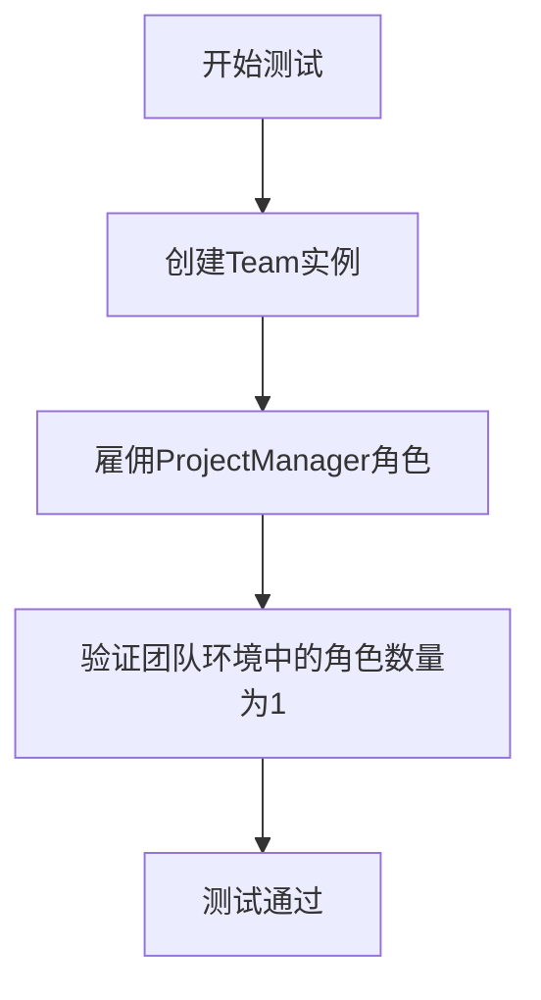
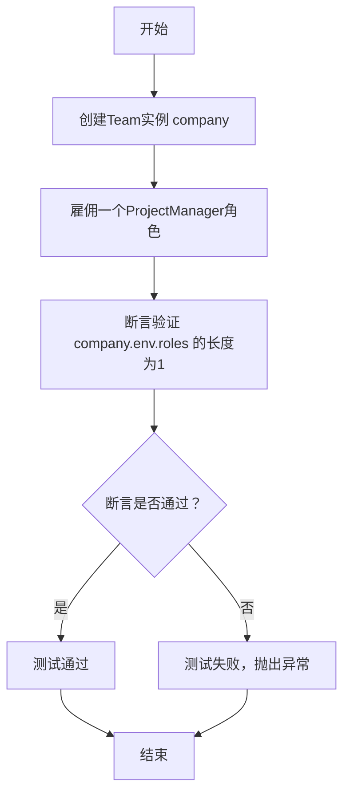

# `.\MetaGPT\tests\metagpt\test_team.py` 详细设计文档

该代码是一个单元测试文件，用于测试Team类的核心功能，即创建团队、雇佣角色（如项目经理）并验证团队环境中的角色数量是否正确。

## 整体流程



## 类结构

```
Team (团队类)
├── hire (雇佣方法)
└── env (环境属性)
ProjectManager (项目经理角色类)
├── 继承自Role基类
└── 包含项目管理相关方法
```

## 全局变量及字段


### `company`
    
一个Team类的实例，代表一个团队或公司实体，用于组织和管理多个角色（如项目经理）。

类型：`Team`
    


### `Team.env`
    
Team实例的环境对象，用于管理团队内的角色、消息和资源等运行时上下文。

类型：`Environment`
    
    

## 全局函数及方法


### `test_team`

这是一个单元测试函数，用于测试 `Team` 类的核心功能：创建团队并雇佣角色。它验证了在雇佣一个 `ProjectManager` 角色后，团队环境中的角色数量是否正确。

参数：无

返回值：`None`，此函数不返回任何值，其主要目的是执行断言测试。

#### 流程图



#### 带注释源码

```python
def test_team():
    # 1. 创建一个Team类的实例，命名为company。
    company = Team()
    
    # 2. 调用company的hire方法，传入一个包含新创建的ProjectManager角色的列表。
    #    这模拟了团队雇佣一个项目经理的过程。
    company.hire([ProjectManager()])

    # 3. 使用assert语句进行验证。
    #    检查company实例的内部环境（env）中，角色列表（roles）的长度是否为1。
    #    如果长度等于1，说明雇佣操作成功，测试通过。
    #    如果长度不等于1，assert会抛出AssertionError，表明测试失败。
    assert len(company.env.roles) == 1
```


### `Team.hire`

该方法用于向团队（Team）中雇佣（添加）一个或多个角色（Role）。它会将传入的角色列表中的每个角色添加到团队的环境（Environment）中，并建立角色与环境的双向关联。

参数：

-  `roles`：`list[Role]`，需要雇佣的角色对象列表。

返回值：`None`，无返回值。

#### 流程图

```mermaid
flowchart TD
    A[开始: hire(roles)] --> B{遍历 roles 列表};
    B --> C[获取当前角色 role];
    C --> D[将 role 添加到 self.env.roles 列表];
    D --> E[设置 role 的所属环境<br>role.set_env(self.env)];
    E --> F{是否还有下一个角色?};
    F -- 是 --> B;
    F -- 否 --> G[结束];
```

#### 带注释源码

```python
def hire(self, roles: list[Role]):
    """
    雇佣（添加）角色到团队中。
    将每个角色添加到团队环境，并建立角色与环境的关联。
    Args:
        roles (list[Role]): 要添加的角色列表。
    """
    # 遍历传入的角色列表
    for role in roles:
        # 将当前角色添加到团队环境（self.env）的角色列表中
        self.env.roles.append(role)
        # 设置当前角色的环境属性为团队环境，建立双向关联
        role.set_env(self.env)
```


## 关键组件


### Team

Team类是团队协作的核心容器，负责管理环境、雇佣角色并协调团队运行。

### ProjectManager

ProjectManager角色是团队中的项目管理专家，负责规划、协调和推进项目任务。

### Environment

Environment是团队运行的环境上下文，用于管理所有角色、消息队列和共享状态。

### Role

Role是所有团队角色的基类，定义了角色的基本行为、观察、思考和行动模式。


## 问题及建议


### 已知问题

-   **测试覆盖不完整**：当前单元测试仅验证了`Team`对象在雇佣（`hire`）一个`ProjectManager`角色后，其内部环境（`env`）中的角色数量是否为1。这仅测试了`Team.hire`方法的一个非常基础的场景，未覆盖其他重要功能，如雇佣多个角色、雇佣不同类型的角色、角色间的交互、团队运行（`run`）逻辑、以及`Team`类的初始化和资源管理等。
-   **测试数据与断言过于简单**：测试用例缺乏对`Team`和`ProjectManager`对象内部状态的深入验证。例如，没有检查被雇佣的`ProjectManager`角色是否正确设置了团队环境、目标或技能，也没有验证`company.env`的具体结构或内容是否符合预期。
-   **缺乏对异常或边界条件的测试**：测试未考虑潜在的异常情况，例如向`hire`方法传入空列表、非角色对象列表，或在团队已存在特定角色时进行雇佣等边界条件。这可能导致代码在异常处理方面存在隐藏缺陷。
-   **测试与实现细节可能耦合**：测试直接断言`company.env.roles`的长度，这依赖于`Team`和`Environment`类的内部实现细节（如`env`属性的存在性和`roles`的结构）。如果未来这些内部数据结构发生变化，即使`Team`的功能逻辑正确，此测试也会失败，降低了测试的健壮性。
-   **测试名称与范围不匹配**：函数名`test_team`暗示对`Team`类的全面测试，但实际只测试了`hire`方法的一个简单用例，容易造成误解。

### 优化建议

-   **扩展测试用例以覆盖核心功能**：
    -   添加测试验证`Team`可以雇佣多个角色（列表）。
    -   添加测试验证可以雇佣不同类型的角色（如`Engineer`, `Architect`等）。
    -   添加测试验证`Team.run`方法（如果存在）的基本流程或模拟交互。
    -   添加测试验证`Team`的初始化（如是否成功创建了`Environment`实例）。
-   **增强断言，验证对象状态而不仅是数量**：
    -   在雇佣后，不仅检查角色数量，还应验证`company.env.roles`列表中包含的确实是传入的`ProjectManager`实例（例如，检查其`name`, `profile`等属性）。
    -   可以考虑验证`ProjectManager`角色的`_env`或`_team`属性是否被正确设置为`company.env`或`company`。
-   **补充异常和边界测试**：
    -   添加测试用例，当`hire`方法接收空列表`[]`时，团队角色数量不应增加。
    -   添加测试用例，尝试雇佣一个非`Role`对象（如字符串、整数），应抛出适当的异常（如`TypeError`）。
    -   添加测试用例，重复雇佣同一个角色实例，检查团队角色的唯一性或数量处理逻辑。
-   **改进测试设计，降低与内部实现的耦合**：
    -   考虑通过公共接口或行为来验证功能，而不是直接访问内部属性`env.roles`。例如，可以添加一个`get_roles`或类似的方法到`Team`类中，测试通过该方法来验证。如果无法修改生产代码，应意识到当前测试的脆弱性。
    -   使用`unittest.mock`来隔离测试，例如模拟`Environment`的行为，使测试更专注于`Team`的逻辑。
-   **重命名测试函数以更准确反映其内容**：
    -   将`test_team`更名为更具体的名称，如`test_team_hire_single_role`，以清晰表明其测试范围。
-   **遵循测试最佳实践**：
    -   使用`setUp`方法（如果使用`unittest.TestCase`）来初始化通用的测试数据，避免重复代码。
    -   确保测试是独立的，不依赖于外部状态或其他测试的执行顺序。


## 其它


### 设计目标与约束

本代码片段是一个单元测试，旨在验证 `Team` 类和 `ProjectManager` 角色的基本功能。其核心设计目标是确保 `Team` 能够正确实例化，并能通过 `hire` 方法将角色（如 `ProjectManager`）成功添加到其内部环境（`env`）的角色列表中。约束条件包括：测试应简洁、独立，不依赖外部系统；断言应聚焦于核心状态验证（即角色数量）；代码需符合项目的单元测试规范和导入约定。

### 错误处理与异常设计

当前测试代码未显式包含错误处理逻辑。其正确性依赖于被测试的 `Team` 和 `ProjectManager` 类的实现。如果 `Team()` 实例化失败、`hire` 方法调用异常，或者 `company.env.roles` 属性访问出错，测试将因未捕获的异常而失败，这符合单元测试通过异常暴露问题的设计。测试本身不处理业务异常，而是期望被测代码在正常输入下无异常抛出。

### 数据流与状态机

1.  **初始化数据流**：执行 `Team()` 创建 `company` 对象，初始化其内部状态（如 `env`）。
2.  **状态转换（雇佣）**：调用 `company.hire([ProjectManager()])`。输入为一个包含 `ProjectManager` 实例的列表。此操作预期触发 `Team` 内部状态变更，将新角色对象添加到 `company.env.roles` 集合中。
3.  **状态验证**：通过 `assert len(company.env.roles) == 1` 验证状态转换结果。数据流终点是断言的成功或失败，验证了“雇佣一个角色后，团队环境中的角色数量为1”这一状态变迁。

### 外部依赖与接口契约

1.  **外部依赖**：
    *   `metagpt.team.Team` 类：提供团队上下文和雇佣功能。
    *   `metagpt.roles.project_manager.ProjectManager` 类：作为可被雇佣的角色类型。
    *   `Team.hire` 方法：预期接受一个角色对象列表作为参数。
    *   `Team.env` 属性：预期为一个具有 `roles` 属性的对象，`roles` 预期为一个可获取长度的集合（如列表）。
2.  **接口契约**：
    *   `Team.hire(roles: List[Role]) -> None`：契约要求方法能正确处理传入的角色列表，并将其纳入团队管理。
    *   `len(company.env.roles) -> int`：契约要求通过此方式能准确获取当前环境中的角色数量。
    测试的成功运行即验证了这些接口契约在当前场景下得到满足。

    