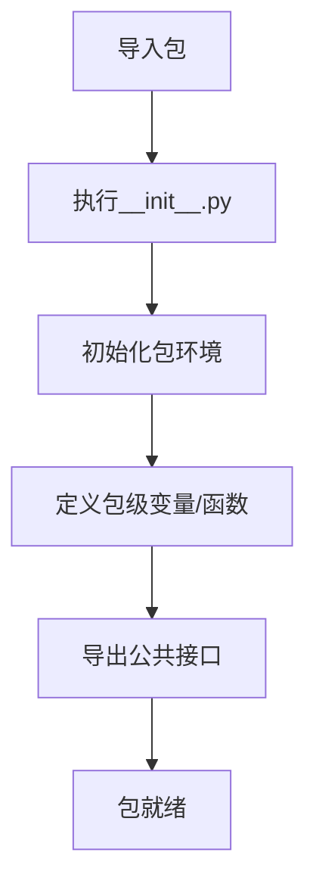

# `.\MetaGPT\tests\metagpt\tools\__init__.py` 详细设计文档

这是一个Python包的初始化文件，用于定义包的公共接口和初始化逻辑。当前文件为空，仅包含文件头注释，表明这是一个包的入口点，但尚未定义任何具体的功能、类或变量。

## 整体流程



## 类结构

```
无类层次结构
```

## 全局变量及字段


    

## 全局函数及方法


## 关键组件


### 初始化模块

此文件是一个Python包的初始化模块（`__init__.py`），用于定义包的公共接口和初始化行为。当前代码为空，表明该包默认不导出任何特定模块或对象，依赖于Python的隐式命名空间包行为或待后续填充。


## 问题及建议


### 已知问题

-   **空文件问题**：当前 `__init__.py` 文件为空，仅包含元数据注释。这可能导致该包在导入时无法正确初始化其子模块或公开必要的接口，影响代码的可维护性和使用便利性。
-   **缺乏明确导出**：文件没有使用 `__all__` 列表来明确声明哪些模块、类或函数应从包中公开导出。这可能导致导入时出现命名空间污染或导入不明确的问题。
-   **元数据注释不完整**：虽然提供了作者和时间信息，但缺少对模块或包功能的简要描述，这降低了代码文档的完整性。

### 优化建议

-   **添加包初始化逻辑**：如果该包包含需要初始化的子模块或全局配置，应在 `__init__.py` 中添加相应的导入或初始化代码。
-   **定义 `__all__` 列表**：明确列出应从该包中导出的公共接口（如类、函数、变量），以控制导入行为并提高代码的清晰度。
-   **补充模块文档字符串**：在文件顶部添加一个多行文档字符串，简要描述该包的功能、主要组件和使用示例，以提升代码的可读性和可维护性。
-   **考虑版本管理**：如果适用，可以在 `__init__.py` 中定义 `__version__` 变量，便于跟踪包的版本信息。


## 其它


### 设计目标与约束

该代码文件是一个包的初始化文件（`__init__.py`），其主要设计目标是定义Python包的公共接口和初始化逻辑。当前文件内容为空，表明该包可能仅作为模块的容器或命名空间，尚未定义任何具体的公共类、函数或变量。约束包括遵循Python的包导入机制，确保该文件的存在以标识目录为一个Python包，并可能在未来用于控制包的导入行为（如定义`__all__`列表）。

### 错误处理与异常设计

由于当前`__init__.py`文件内容为空，没有定义任何可能引发异常的逻辑。因此，错误处理与异常设计在此阶段不适用。未来若在此文件中添加代码（如导入子模块、初始化配置等），则需要考虑相应的异常捕获和处理机制，例如处理导入错误（`ImportError`）或初始化过程中的自定义异常。

### 数据流与状态机

当前文件不涉及任何数据处理或状态管理，因此没有数据流或状态机设计。该文件仅作为包结构的标识符，不参与程序运行时的数据流转或状态变更。

### 外部依赖与接口契约

该`__init__.py`文件本身没有显式的外部依赖（如导入其他第三方库）。其核心依赖是Python解释器对包结构的识别机制。作为包的入口，它隐式地定义了包的“接口契约”，即允许外部代码通过`import`语句导入该包。当前空的文件意味着包的所有内容（位于子模块中）默认都是可导入的。未来可以通过定义`__all__`变量来显式声明包的公共接口，限制外部可见的内容。

### 安全与权限考虑

鉴于文件当前为空，没有涉及敏感操作、数据访问或权限控制，因此暂无特定的安全与权限考虑。如果未来在此文件中添加代码（例如，初始化涉及网络、文件系统或环境变量的操作），则需要评估相应的安全风险，如避免硬编码敏感信息、验证输入数据、管理文件访问权限等。

### 测试策略

对于空的`__init__.py`文件，直接的单元测试可能没有意义，因为其没有可测试的行为。测试重点应放在确保包能够被正确导入，以及包内定义的公共接口（如果未来添加）符合预期。这通常通过更上层的集成测试或导入测试来覆盖。例如，可以编写测试用例验证`import`该包不会引发异常，并且预期的子模块或属性是可访问的。

### 部署与运维考量

该文件作为Python标准包结构的一部分，部署时需确保其随项目代码一起发布。运维方面无特殊要求。如果未来在此文件中添加初始化逻辑（如环境检查、配置加载），则需考虑这些逻辑在不同部署环境（开发、测试、生产）下的行为一致性，并确保其不会导致包导入失败或产生副作用。

### 扩展性与维护性

当前空文件具有很高的扩展性，可以方便地添加包级别的`__all__`定义、版本信息（`__version__`）、文档字符串或共享的常量/函数，以改善包的可用性和维护性。为了保持良好的维护性，建议在添加任何逻辑时都附带清晰的注释和文档，并遵循项目的代码风格指南。

    