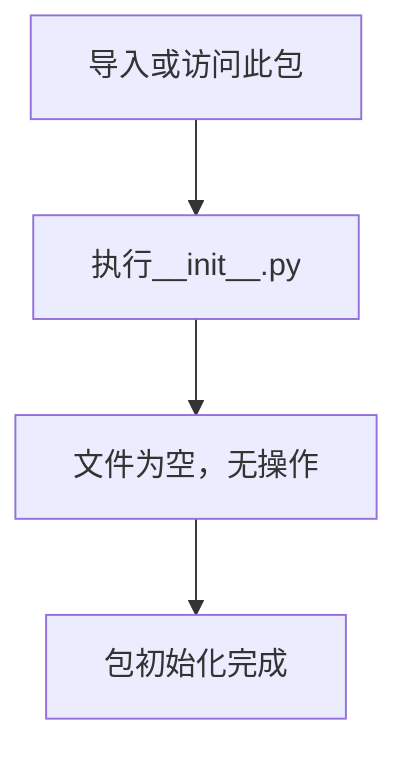

# `.\MetaGPT\tests\metagpt\tools\libs\__init__.py` 详细设计文档

这是一个空的Python包初始化文件，当前不包含任何功能代码，仅作为包的标识和占位符。

## 整体流程



## 类结构

```
无类结构
```

## 全局变量及字段


    

## 全局函数及方法


## 关键组件


### 文件初始化模块

此文件是一个Python包的初始化文件（`__init__.py`），用于标记其所在目录为一个Python包，并可在其中定义包的公共接口、执行初始化代码或设置`__all__`变量以控制包的导入行为。


## 问题及建议


### 已知问题

-   **空文件无实际功能**：当前 `__init__.py` 文件仅包含文件头注释和元信息，未定义任何类、函数、变量或执行逻辑，无法提供任何实际功能。
-   **缺少模块导出定义**：作为包的初始化文件，未使用 `__all__` 列表明确声明该包对外公开的模块、类或函数，可能导致导入行为不明确。
-   **注释信息不完整**：`@Desc` 注释字段为空，未提供任何关于此包或模块的功能描述，降低了代码的可读性和可维护性。

### 优化建议

-   **明确包的功能与导出项**：在 `__init__.py` 文件中，根据包的实际用途，添加 `__all__` 列表来定义公开接口。例如，`__all__ = [‘MyClass', ‘my_function']`。
-   **补充包级文档字符串**：在文件顶部添加一个详细的多行文档字符串（`""" ... """`），描述此Python包的核心目的、主要功能模块以及基本用法示例。
-   **实现具体功能或保持最小化**：如果此包目录下包含其他模块，可以考虑在 `__init__.py` 中进行便捷导入（例如 `from .module import MyClass`），以简化用户的使用方式。如果无需特殊初始化，可考虑将其保持为空文件或仅包含 `__version__` 等元信息。
-   **移除或利用时间戳注释**：`@Time` 这类注释通常由IDE自动生成，对于版本控制而言并非必要。可以考虑移除，或将其替换为更有意义的版本信息（如 `__version__ = ‘1.0.0'`）。


## 其它


### 设计目标与约束

该代码文件是一个Python包的初始化文件（`__init__.py`），其主要设计目标是定义当前目录为一个Python包，并可能用于初始化包的命名空间、暴露公共接口或执行包的初始化逻辑。当前文件内容为空，表明这是一个最小化的包定义，仅满足Python识别包结构的基本要求。约束包括必须遵循Python的包结构规范，且文件内容需与包的整体设计目标一致。

### 错误处理与异常设计

由于当前`__init__.py`文件为空，未包含任何可执行代码，因此不存在运行时错误处理或异常设计。任何与该包相关的错误（如导入失败）将由Python解释器根据标准导入机制抛出内置异常（如`ImportError`）。未来若添加初始化代码，需考虑相应的异常捕获和处理逻辑。

### 数据流与状态机

当前文件不涉及任何数据处理或状态管理，因此没有数据流或状态机设计。它仅作为包的结构性标记文件存在。

### 外部依赖与接口契约

该文件本身没有显式的外部依赖（如`import`语句）。作为包的入口点，它隐式地定义了包的公共接口契约，即通过`from package import *`或显式导入时，哪些模块、类或函数会被暴露。当前空文件意味着不主动暴露任何内容，外部模块需通过显式导入子模块来访问功能。

### 安全考虑

鉴于文件内容为空，不存在特定的安全风险（如代码注入、敏感信息泄露）。然而，作为包的一部分，应确保未来添加的代码遵循安全最佳实践，如避免执行不可信输入、保护敏感配置等。

### 测试策略

由于没有实现逻辑，无需为当前文件编写单元测试。但包内的其他模块应有相应的测试覆盖。包的集成测试可验证其作为整体被正确导入和使用。

### 部署与运维

该文件是源代码的一部分，随包一起分发。部署时需确保其位于正确的目录结构中。无特殊的运维需求或配置。

### 扩展性与维护性

当前设计具有高扩展性，允许未来在`__init__.py`中添加包级别的初始化代码、定义`__all__`列表以控制公开接口，或实现包资源的懒加载。维护性方面，保持文件简洁有助于降低复杂度，但需注意随着功能增加，避免使其变得臃肿。

### 性能考量

空文件对性能无影响。若未来添加初始化代码，应评估其执行时间，确保不会显著增加包导入的开销，特别是对于大型包或频繁导入的场景。

### 兼容性说明

作为标准的Python包初始化文件，兼容所有支持Python包机制的Python版本（通常为Python 2.7+和Python 3.x）。无特定平台或环境依赖。

    