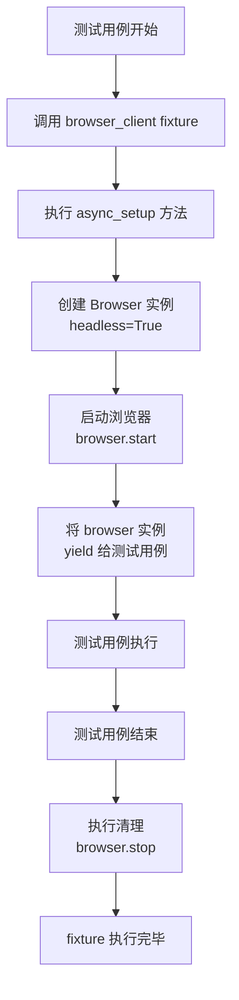
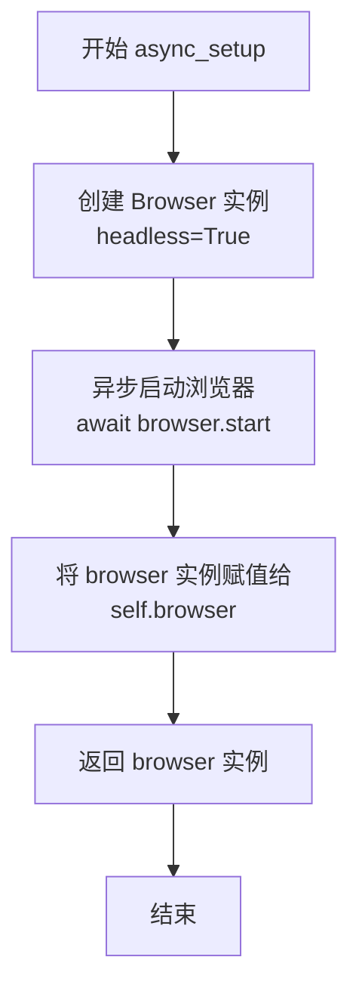
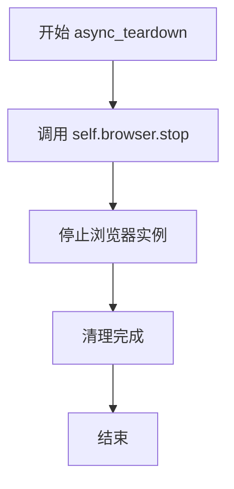
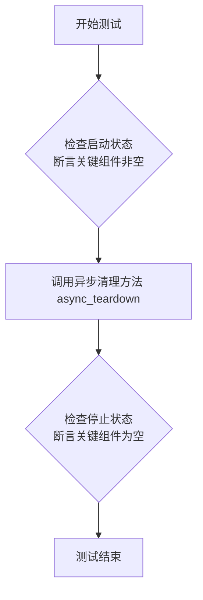
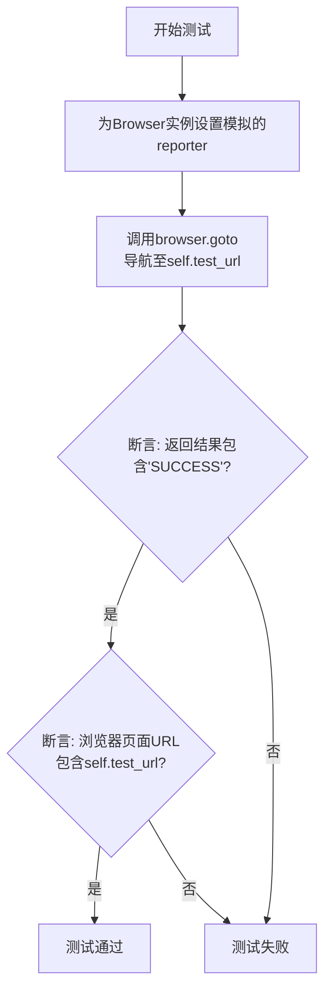
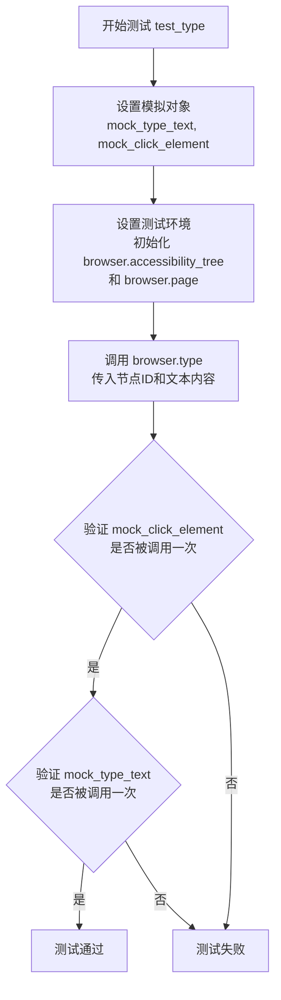
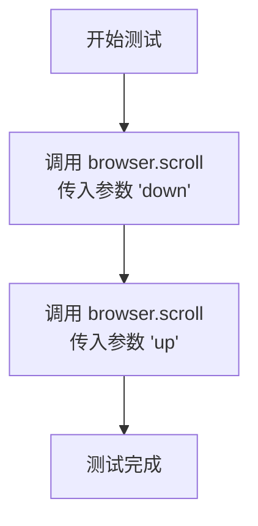
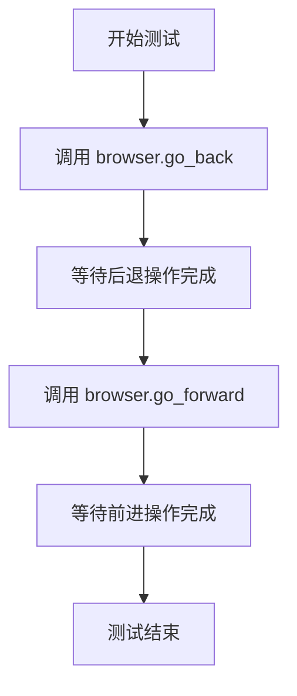
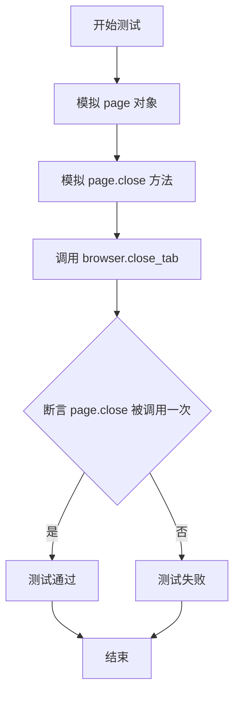

# `.\MetaGPT\tests\metagpt\tools\libs\test_browser.py` 详细设计文档

该文件是一个使用 pytest 和 pytest-asyncio 编写的异步单元测试文件，用于测试 `metagpt.tools.libs.browser.Browser` 类的核心功能，包括浏览器的启动/停止、页面导航、元素交互（点击、输入、悬停、按键）、页面滚动、历史导航以及标签页管理等。测试通过模拟（Mock）外部依赖来隔离测试环境，确保测试的可靠性和可重复性。

## 整体流程

```mermaid
graph TD
    A[开始执行测试] --> B{是否为异步测试类?}
    B -- 是 --> C[执行 `browser_client` fixture]
    C --> D[调用 `async_setup` 创建 Browser 实例]
    D --> E[执行具体的测试方法 (如 `test_goto`)]
    E --> F{测试方法是否使用 Mock?}
    F -- 是 --> G[通过 patch 替换外部函数]
    F -- 否 --> H[直接调用 Browser 实例方法]
    G --> I[执行测试断言]
    H --> I
    I --> J[测试方法结束]
    J --> K[执行 `async_teardown` 清理资源]
    K --> L[测试结束]
```

## 类结构

```
TestBrowser (pytest 测试类)
├── 类字段: test_url
├── 类方法:
│   ├── browser_client (fixture)
│   ├── async_setup
│   ├── async_teardown
│   ├── test_start_and_stop
│   ├── test_goto
│   ├── test_click
│   ├── test_type
│   ├── test_hover_press
│   ├── test_scroll
│   ├── test_go_back_and_forward
│   ├── test_tab_focus
│   └── test_close_tab
```

## 全局变量及字段


### `TEST_URL`
    
一个用于测试的常量URL，指向DeepWisdom文档的快速入门页面。

类型：`str`
    


### `TEST_SCREENSHOT_PATH`
    
一个指向测试截图文件存储路径的常量。

类型：`pathlib.Path`
    


### `TestBrowser.test_url`
    
测试类内部定义的测试URL，指向掘金网站首页。

类型：`str`
    
    

## 全局函数及方法

### `TestBrowser.browser_client`

`TestBrowser.browser_client` 是一个 `pytest_asyncio` 夹具（fixture），用于为 `TestBrowser` 测试类中的每个异步测试方法提供初始化和清理服务。它的核心功能是在每个测试用例执行前，异步地启动一个无头（headless）浏览器实例，并在测试用例执行后，异步地关闭该浏览器实例，从而确保测试环境的隔离性和一致性。

参数：

-  `self`：`TestBrowser` 类型，指向当前测试类实例。

返回值：`AsyncGenerator[Browser, None]`，一个异步生成器，在测试执行期间生成一个可用的 `Browser` 实例。

#### 流程图



#### 带注释源码

```python
@pytest_asyncio.fixture(autouse=True)  # 装饰器：声明这是一个自动使用的异步夹具
async def browser_client(self):
    """Setup before each test case."""  # 文档字符串：说明此方法在每个测试用例前的设置作用
    print("browser_client")  # 调试信息：打印日志，标识夹具开始执行
    browser = await self.async_setup()  # 调用 async_setup 方法，异步初始化并获取 Browser 实例
    yield browser  # 关键：将准备好的 browser 实例提供给测试用例使用，并在此暂停
    await self.browser.stop()  # 清理：在测试用例执行完毕后，异步停止浏览器实例
```

### `TestBrowser.async_setup`

该方法是一个异步的测试夹具（fixture）设置函数，用于在`TestBrowser`类的每个测试用例执行前，初始化并启动一个无头（headless）模式的`Browser`实例。它负责创建浏览器对象并启动浏览器进程，为后续的测试方法提供可用的浏览器环境。

参数：
-  `self`：`TestBrowser`，当前测试类的实例，用于访问和设置实例属性。

返回值：`Browser`，返回一个已启动的、配置为无头模式的`Browser`实例，供测试用例使用。

#### 流程图



#### 带注释源码

```python
async def async_setup(self):
    # 1. 实例化 Browser 类，并配置为无头模式（不显示GUI界面）
    self.browser = Browser(headless=True)
    # 2. 异步启动浏览器进程，建立 Playwright 连接
    await self.browser.start()
    # 3. 返回已启动的浏览器实例，供测试夹具或测试方法使用
    return self.browser
```

### `TestBrowser.async_teardown`

该方法用于在每个测试用例执行完毕后，执行清理操作，主要是停止浏览器实例以释放资源。

参数：
- `self`：`TestBrowser`，当前测试类的实例。

返回值：`None`，无返回值。

#### 流程图



#### 带注释源码

```python
async def async_teardown(self):
    """Teardown after each test case."""
    await self.browser.stop()  # 调用Browser实例的stop方法，停止浏览器并清理相关资源
```

### `TestBrowser.test_start_and_stop`

该方法是一个异步单元测试，用于验证 `Browser` 类的启动和停止功能。它检查在启动后，`Browser` 实例的关键组件（如 Playwright 对象、浏览器实例、上下文和页面）是否已正确初始化；在停止后，这些组件是否被正确清理（置为 `None`）。

参数：
-  `self`：`TestBrowser`，当前测试类的实例。

返回值：`None`，这是一个测试方法，不返回业务值，仅通过断言（`assert`）来验证功能。

#### 流程图



#### 带注释源码

```python
async def test_start_and_stop(self):
    """Test browser start and stop functionality."""
    # 断言：在测试夹具 `browser_client` 执行后，`Browser` 实例应已成功启动。
    # 检查 Playwright 对象是否存在。
    assert self.browser.playwright is not None
    # 检查浏览器实例（如 Chromium, Firefox）是否存在。
    assert self.browser.browser_instance is not None
    # 检查浏览器上下文（隔离的会话环境）是否存在。
    assert self.browser.browser_ctx is not None
    # 检查页面（Page）对象是否存在。
    assert self.browser.page is not None

    # 执行停止操作，清理浏览器资源。
    await self.async_teardown()

    # 断言：停止操作后，`Browser` 实例的关键组件应被置空，确保资源释放。
    # 检查 Playwright 对象是否已被清理。
    assert self.browser.playwright is None
    # 检查浏览器实例是否已被清理。
    assert self.browser.browser_instance is None
    # 检查浏览器上下文是否已被清理。
    assert self.browser.browser_ctx is None
    # 注意：此处未断言 `self.browser.page is None`，可能是一个遗漏或设计如此。
    # 根据 `async_teardown` 方法（`await self.browser.stop()`）的实现，
    # `Browser.stop()` 方法通常也会清理 `page` 属性。
```

### `TestBrowser.test_goto`

这是一个异步单元测试方法，用于测试 `Browser` 类的 `goto` 方法。它模拟了浏览器导航到一个指定URL的过程，并验证导航是否成功以及页面URL是否正确更新。

参数：

-  `self`：`TestBrowser`，当前测试类的实例，用于访问测试夹具（如 `self.browser`）和测试数据（如 `self.test_url`）。

返回值：`None`，这是一个测试方法，不返回业务值，而是通过断言（`assert`）来验证测试结果。

#### 流程图



#### 带注释源码

```python
async def test_goto(self):
    """Test navigating to a URL."""
    # 创建一个异步模拟对象，用于模拟Browser.reporter
    mock_reporter = AsyncMock()
    # 将模拟的reporter赋值给测试夹具中的browser实例
    self.browser.reporter = mock_reporter

    # 调用被测方法：让浏览器导航到预设的测试URL
    result = await self.browser.goto(self.test_url)
    # 断言1：验证导航操作的返回结果中包含“SUCCESS”字符串
    assert "SUCCESS" in result
    # 断言2：验证浏览器当前页面的URL确实包含了我们导航的目标URL
    assert self.test_url in self.browser.page.url
```

### `TestBrowser.test_click`

这是一个使用 `pytest` 和 `pytest_asyncio` 编写的异步单元测试方法，用于测试 `Browser` 类的 `click` 方法。它通过 `unittest.mock.patch` 模拟了 `click_element` 函数，以验证当调用 `browser.click` 时，底层的 `click_element` 函数是否被正确调用，而无需实际启动浏览器或执行真实的点击操作。

参数：

- `mock_click_element`：`unittest.mock.AsyncMock`，被 `@patch` 装饰器注入的模拟对象，用于模拟 `metagpt.tools.libs.browser.click_element` 函数。

返回值：`None`，这是一个测试方法，其主要目的是进行断言验证，不返回业务值。

#### 流程图

```mermaid
flowchart TD
    A[开始测试 test_click] --> B[使用 patch 装饰器<br>模拟 click_element 函数]
    B --> C[设置 browser.accessibility_tree<br>模拟可访问性树数据]
    C --> D[设置 browser.page 为 AsyncMock 对象]
    D --> E[调用 browser.click(1)]
    E --> F[断言 mock_click_element<br>被调用了一次]
    F --> G[测试结束]
```

#### 带注释源码

```python
# 使用 patch 装饰器模拟 `metagpt.tools.libs.browser.click_element` 函数。
# 模拟对象 `mock_click_element` 会被自动注入为方法的第一个参数。
@patch("metagpt.tools.libs.browser.click_element", new_callable=AsyncMock)
async def test_click(self, mock_click_element):
    """Test clicking on an element."""
    # 1. 准备测试数据：模拟 Browser 实例的可访问性树。
    #    这是一个列表，包含代表页面元素的字典，每个元素有 nodeId 等属性。
    self.browser.accessibility_tree = [
        {"nodeId": "1", "backendDOMNodeId": 101, "name": "Button"},
        {"nodeId": "2", "backendDOMNodeId": 102, "name": "Input"},
    ]
    # 2. 准备测试环境：将 browser.page 属性替换为一个 AsyncMock 对象。
    #    这样在测试中调用 page 的方法时不会执行真实操作。
    self.browser.page = AsyncMock()

    # 3. 执行测试：调用被测试的 Browser.click 方法，并传入 nodeId 为 1。
    #    根据测试数据，这应该对应可访问性树中第一个元素（"Button"）。
    await self.browser.click(1)

    # 4. 验证结果：断言模拟的 `click_element` 函数被调用了一次。
    #    这验证了 `browser.click` 方法成功委托给了 `click_element` 函数。
    mock_click_element.assert_called_once()
```

### `TestBrowser.test_type`

该方法用于测试 `Browser` 类的 `type` 方法，验证其能否正确地在指定的输入字段中键入文本。测试通过模拟 `click_element` 和 `type_text` 函数来确保 `Browser.type` 方法按预期调用这些底层操作。

参数：

-  `mock_type_text`：`AsyncMock`，用于模拟 `type_text` 函数的 Mock 对象。
-  `mock_click_element`：`AsyncMock`，用于模拟 `click_element` 函数的 Mock 对象。

返回值：`None`，这是一个测试方法，不返回具体值，而是通过断言来验证行为。

#### 流程图



#### 带注释源码

```python
    @patch("metagpt.tools.libs.browser.click_element", new_callable=AsyncMock) # 装饰器：模拟 `click_element` 函数，返回一个 AsyncMock 对象
    @patch("metagpt.tools.libs.browser.type_text", new_callable=AsyncMock) # 装饰器：模拟 `type_text` 函数，返回一个 AsyncMock 对象
    async def test_type(self, mock_type_text, mock_click_element): # 异步测试方法，接收两个模拟对象作为参数
        """Test typing text into an input field.""" # 方法描述：测试在输入字段中键入文本
        content = "Hello, world!" # 定义要输入的测试文本内容
        self.browser.accessibility_tree = [ # 为 browser 对象设置一个模拟的无障碍树
            {"nodeId": "1", "backendDOMNodeId": 101, "name": "Button"}, # 节点1，代表一个按钮
            {"nodeId": "2", "backendDOMNodeId": 102, "name": "Input"}, # 节点2，代表一个输入框
        ]
        self.browser.page = AsyncMock() # 将 browser.page 属性设置为一个 AsyncMock 对象

        await self.browser.type(1, content) # 调用被测试的 browser.type 方法，传入节点ID `1` 和文本 `content`

        mock_click_element.assert_called_once() # 断言：验证模拟的 `click_element` 函数被调用了一次
        mock_type_text.assert_called_once_with(self.browser.page, content) # 断言：验证模拟的 `type_text` 函数被调用了一次，并且参数是 `self.browser.page` 和 `content`
```

### `TestBrowser.test_hover_press`

这是一个异步单元测试方法，用于测试 `Browser` 类的 `hover` 和 `press` 方法。它通过模拟（Mock）外部依赖来验证当调用 `hover` 方法时，正确的模拟函数被调用了一次；当调用 `press` 方法时，另一个正确的模拟函数也被调用了一次，并且传入了预期的参数。

参数：

-  `mock_hover_element`：`AsyncMock`，用于模拟 `hover_element` 函数的模拟对象。
-  `mock_key_press`：`AsyncMock`，用于模拟 `key_press` 函数的模拟对象。

返回值：`None`，这是一个测试方法，不返回业务值，其目的是通过断言验证代码行为。

#### 流程图

```mermaid
graph TD
    A[开始测试 test_hover_press] --> B[设置浏览器可访问性树和模拟页面]
    B --> C[调用 browser.hover(1)]
    C --> D[mock_hover_element 被调用一次]
    D --> E[调用 browser.press('Enter')]
    E --> F[mock_key_press 被调用一次，参数为 page 和 'Enter']
    F --> G[测试结束]
```

#### 带注释源码

```python
    @patch("metagpt.tools.libs.browser.key_press", new_callable=AsyncMock) # 装饰器：模拟 key_press 函数
    @patch("metagpt.tools.libs.browser.hover_element", new_callable=AsyncMock) # 装饰器：模拟 hover_element 函数
    async def test_hover_press(self, mock_hover_element, mock_key_press):
        """Test Hover and press key""" # 方法描述：测试悬停和按键功能
        # 设置测试前置条件：模拟浏览器的可访问性树和页面对象
        self.browser.accessibility_tree = [
            {"nodeId": "1", "backendDOMNodeId": 101, "name": "Button"},
            {"nodeId": "2", "backendDOMNodeId": 102, "name": "Input"},
        ]
        self.browser.page = AsyncMock() # 将 browser.page 替换为一个模拟对象

        key_comb = "Enter" # 定义要按下的按键
        # 执行测试：调用 browser 实例的 hover 方法，参数为节点ID 1
        await self.browser.hover(1)
        # 执行测试：调用 browser 实例的 press 方法，参数为按键组合 'Enter'
        await self.browser.press(key_comb)
        # 验证：断言模拟的 hover_element 函数被调用了一次
        mock_hover_element.assert_called_once()
        # 验证：断言模拟的 key_press 函数被调用了一次，并且参数是模拟的 page 对象和 'Enter'
        mock_key_press.assert_called_once_with(self.browser.page, key_comb)
```

### `TestBrowser.test_scroll`

该方法用于测试 `Browser` 类的 `scroll` 功能，通过调用 `scroll` 方法并传入方向参数（"down" 和 "up"），模拟页面的向下和向上滚动操作，以验证滚动功能是否正常工作。

参数：

-  `self`：`TestBrowser`，当前测试类的实例，用于访问测试环境中的 `browser` 对象。

返回值：`None`，该方法不返回任何值，仅用于执行测试断言。

#### 流程图



#### 带注释源码

```python
async def test_scroll(self):
    """Scroll the page up or down."""
    # 调用 browser 对象的 scroll 方法，传入参数 "down"，模拟页面向下滚动
    await self.browser.scroll("down")
    # 调用 browser 对象的 scroll 方法，传入参数 "up"，模拟页面向上滚动
    await self.browser.scroll("up")
```


### `TestBrowser.test_go_back_and_forward`

该方法是一个异步单元测试，用于验证 `Browser` 类的 `go_back`（后退）和 `go_forward`（前进）导航功能是否正常工作。它通过调用被测对象的方法并等待其完成来执行测试，不包含复杂的断言逻辑，主要目的是确保这些基础导航操作能够被成功调用而不引发异常。

参数：
-  `self`：`TestBrowser`，当前测试类的实例，用于访问测试夹具（如 `self.browser`）。

返回值：`None`，该测试方法不返回任何值，其成功与否由测试运行器根据是否抛出异常来判断。

#### 流程图



#### 带注释源码

```
async def test_go_back_and_forward(self):
    # 调用Browser实例的go_back方法，模拟浏览器后退导航
    await self.browser.go_back()
    # 调用Browser实例的go_forward方法，模拟浏览器前进导航
    await self.browser.go_forward()
```


### `TestBrowser.test_tab_focus`

该方法用于测试 `Browser` 类的 `tab_focus` 功能，验证其能否正确地将焦点切换到指定的浏览器标签页。

参数：
- `self`：`TestBrowser`，当前测试类的实例。

返回值：`None`，无返回值。

#### 流程图

```mermaid
flowchart TD
    A[开始] --> B[调用 browser.tab_focus(0)]
    B --> C[验证 tab_focus 方法被调用]
    C --> D[结束]
```

#### 带注释源码

```python
async def test_tab_focus(self):
    # 调用 Browser 实例的 tab_focus 方法，传入参数 0，表示切换到第一个标签页
    await self.browser.tab_focus(0)
```

### `TestBrowser.test_close_tab`

该方法用于测试 `Browser` 类的 `close_tab` 功能。它通过模拟 `Browser` 实例的 `page` 属性及其 `close` 方法，验证调用 `close_tab` 方法时，内部的 `page.close` 方法是否被正确调用一次。

参数：
-  `self`：`TestBrowser`，当前测试类的实例。

返回值：`None`，无返回值。

#### 流程图



#### 带注释源码

```python
async def test_close_tab(self):
    """Test closing a tab."""
    # 创建一个异步模拟对象，用于模拟 page.close 方法
    mock_close = AsyncMock()
    # 将 browser 的 page 属性设置为一个异步模拟对象
    self.browser.page = AsyncMock()
    # 将模拟的 page 对象的 close 方法替换为我们创建的 mock_close
    self.browser.page.close = mock_close

    # 调用待测试的 browser.close_tab 方法
    await self.browser.close_tab()

    # 断言：验证 mock_close（即 page.close）被调用了一次
    mock_close.assert_called_once()
```

## 关键组件


### Browser 类

Browser 类是浏览器自动化工具的核心组件，封装了 Playwright 库的功能，提供了启动、导航、页面交互（如点击、输入、滚动）以及标签页管理等高级操作。

### 测试框架与 Mock 机制

代码使用了 pytest 和 pytest_asyncio 作为异步测试框架，并大量运用 unittest.mock 的 AsyncMock 和 patch 来模拟外部依赖（如 click_element, type_text 等函数），确保测试的隔离性和可靠性。

### 可访问性树 (Accessibility Tree)

Browser 类维护了一个 `accessibility_tree` 字段，它是一个包含页面元素节点信息的列表。这个数据结构被用于 `click`, `type`, `hover` 等方法，通过节点ID来定位和操作具体的 DOM 元素，是实现基于语义（如元素名称）进行自动化操作的关键。

### 页面交互函数库

代码中通过 patch 引用了多个外部交互函数（如 `click_element`, `type_text`, `key_press`, `hover_element`）。这些函数构成了浏览器底层交互操作的抽象层，Browser 类的方法（如 `click`, `type`）通过调用这些函数来完成具体的页面操作。

### 测试生命周期管理

通过 `@pytest_asyncio.fixture(autouse=True)` 装饰的 `browser_client` 方法，为每个测试用例自动管理 Browser 实例的生命周期（setup 和 teardown），确保了测试环境的独立性和资源（如浏览器进程）的正确释放。


## 问题及建议


### 已知问题

-   **测试数据路径硬编码**：`TEST_SCREENSHOT_PATH` 变量指向一个固定的文件路径 `TEST_DATA_PATH / "screenshot.png"`，但在整个测试类中并未被使用。这可能导致维护者困惑，并可能在未来引入错误（例如，如果该文件被意外删除或移动）。
-   **测试用例间潜在的状态污染**：`TestBrowser` 类使用了 `@pytest_asyncio.fixture(autouse=True)` 装饰的 `browser_client` 方法作为每个测试用例的 `setup` 和 `teardown`。然而，`async_setup` 方法将 `self.browser` 设置为实例属性。如果某个测试用例修改了 `self.browser` 的状态（例如，更改了 `self.browser.page` 或 `self.browser.accessibility_tree`），这个状态可能会意外地泄漏到后续的测试用例中，导致测试结果不可靠。
-   **`async_teardown` 方法存在冗余调用风险**：`test_start_and_stop` 测试用例中显式调用了 `await self.async_teardown()`。由于 `browser_client` fixture 在测试结束后会自动执行 `await self.browser.stop()`，这可能导致 `async_teardown` 方法被调用两次（一次在测试中，一次在 fixture 的 `yield` 之后）。虽然 `Browser.stop()` 方法可能被设计为幂等的，但这仍然是不必要的重复操作，并且可能掩盖了 `stop` 方法非幂等时的潜在问题。
-   **测试用例 `test_goto` 的断言可能不健壮**：该测试断言 `"SUCCESS" in result`。如果 `Browser.goto` 方法返回的字符串格式发生变化（例如，改为小写 `"success"` 或返回一个状态码对象），此测试将失败。这种对特定字符串格式的硬编码依赖降低了测试的鲁棒性。
-   **模拟对象设置存在不一致性**：在 `test_click`, `test_type`, `test_hover_press` 等测试中，`self.browser.page` 被设置为一个 `AsyncMock` 对象。然而，在 `test_goto` 测试中，`self.browser.page` 是真实的浏览器页面对象。这种不一致性虽然服务于不同的测试目的，但可能表明测试设计上对 `Browser` 类的内部状态管理（如 `page` 属性何时被初始化/重置）缺乏清晰的约定。

### 优化建议

-   **清理未使用的测试变量**：移除未使用的 `TEST_SCREENSHOT_PATH` 变量，或者如果计划在未来使用，添加一个 `TODO` 注释说明其用途。
-   **改进测试隔离性**：确保每个测试用例都是独立的。可以考虑在 `browser_client` fixture 中，每次 `yield` 之前都调用 `async_setup` 来创建一个全新的 `Browser` 实例，而不是依赖于类实例属性。或者，更推荐的做法是遵循 `pytest` 的最佳实践，让 fixture 返回一个新的 `Browser` 实例，测试用例通过参数接收它，而不是通过 `self` 访问。
-   **移除冗余的 `teardown` 调用**：从 `test_start_and_stop` 测试用例中移除 `await self.async_teardown()` 的显式调用。测试 `stop` 功能可以通过在 fixture 的 `teardown` 部分执行后，断言浏览器资源已被正确释放来完成（正如当前测试所做的那样）。
-   **增强 `test_goto` 断言的健壮性**：修改 `test_goto` 的断言，使其不依赖于具体的字符串格式。例如，可以检查 `result` 是否包含预期的 URL，或者如果 `Browser.goto` 方法返回一个字典或对象，则检查其 `status` 字段。更好的做法是让 `Browser.goto` 方法返回一个枚举值或布尔值来表示成功/失败。
-   **统一和明确模拟策略**：审查所有测试用例，确保对 `Browser` 实例内部状态（如 `page`, `accessibility_tree`）的模拟或设置是一致的，并且符合 `Browser` 类的实际生命周期。考虑为需要模拟 `page` 的测试用例创建一个专门的 fixture 或辅助函数来设置这些模拟状态，以提高代码的可读性和可维护性。
-   **考虑添加更多边界和错误场景测试**：当前的测试主要覆盖了“快乐路径”。建议添加测试用例来验证错误处理，例如：导航到无效 URL、点击不存在的元素、在页面未加载完成时执行操作等。这有助于提高 `Browser` 类的健壮性。
-   **使用 `pytest.mark.parametrize` 进行参数化测试**：对于 `test_scroll` 这样的方法，可以使用 `@pytest.mark.parametrize` 来测试 `"up"` 和 `"down"` 两种参数，使测试更简洁。


## 其它


### 设计目标与约束

本测试套件的设计目标是验证 `Browser` 类（位于 `metagpt.tools.libs.browser`）的核心功能，包括浏览器实例的生命周期管理（启动/停止）、页面导航、DOM元素交互（点击、输入、悬停、按键）、页面控制（滚动、前进/后退）以及标签页管理。设计约束包括：1) 使用 `pytest` 和 `pytest-asyncio` 框架编写异步测试；2) 通过 `unittest.mock` 对关键外部依赖（如 `click_element`, `type_text`）进行模拟，以确保测试的隔离性和可重复性；3) 每个测试方法应专注于验证 `Browser` 类的一个特定行为。

### 错误处理与异常设计

测试代码本身不包含业务逻辑的错误处理，其目的是验证 `Browser` 类在正常和异常情况下的行为是否符合预期。当前的测试用例主要覆盖了正常的功能路径。为了更完善，测试套件应补充针对异常场景的测试，例如：1) 导航到无效URL时 `goto` 方法的行为；2) 对不存在的节点ID执行 `click`、`type` 等操作时是否抛出预期异常；3) 在浏览器未启动状态下调用其他方法时的错误处理。这些测试应使用 `pytest.raises` 来断言特定的异常被抛出。

### 数据流与状态机

测试套件中的数据流主要围绕 `Browser` 实例的状态变化展开。关键状态包括：`playwright`, `browser_instance`, `browser_ctx`, `page` 是否为 `None`，以及 `accessibility_tree` 的内容。`browser_client` fixture 和 `async_setup`/`async_teardown` 方法管理着 `Browser` 实例从初始化、启动到停止的完整生命周期状态机。每个测试方法在执行前，fixture 会提供一个已启动的 `Browser` 实例（特定状态）。测试方法通过调用 `Browser` 的API，驱动其内部状态变化（如页面URL改变、`accessibility_tree` 更新），并通过断言来验证这些变化是否符合预期。

### 外部依赖与接口契约

测试套件明确依赖并模拟了以下外部组件，这些构成了 `Browser` 类的关键接口契约：
1.  **Playwright**：通过 `Browser` 类的 `playwright`、`browser_instance`、`browser_ctx`、`page` 属性进行交互，测试验证了这些对象在启动和停止后的状态。
2.  **`metagpt.tools.libs.browser` 模块中的辅助函数**：如 `click_element`, `type_text`, `key_press`, `hover_element`。测试使用 `@patch` 装饰器模拟这些函数，并验证 `Browser.click`, `Browser.type`, `Browser.press`, `Browser.hover` 方法是否正确调用了它们，并传递了正确的参数（如 `page` 对象、文本内容、按键组合）。
3.  **文件系统路径**：`TEST_DATA_PATH` 常量用于定义测试数据目录，但当前测试中未实际使用 `TEST_SCREENSHOT_PATH` 进行截图验证。

    