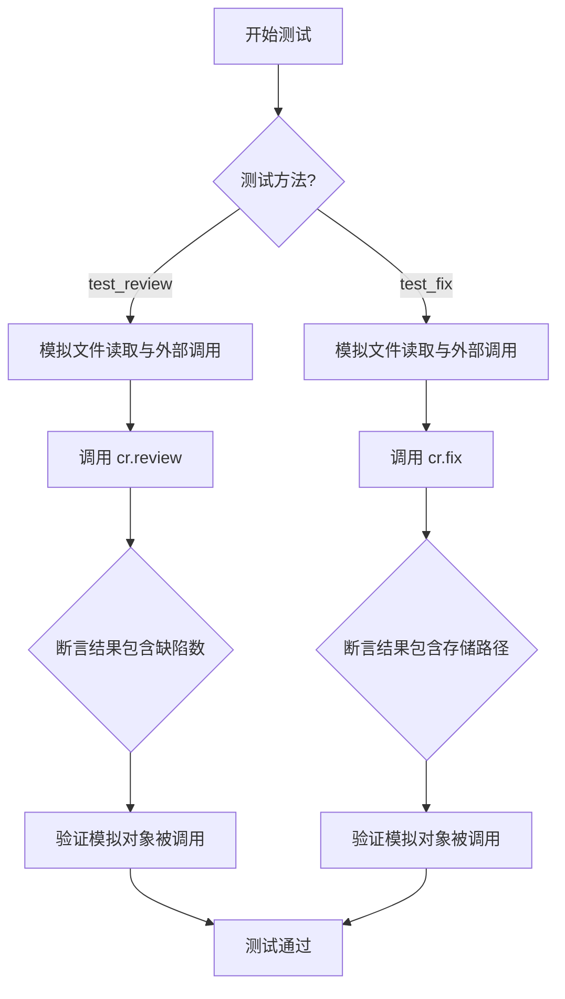
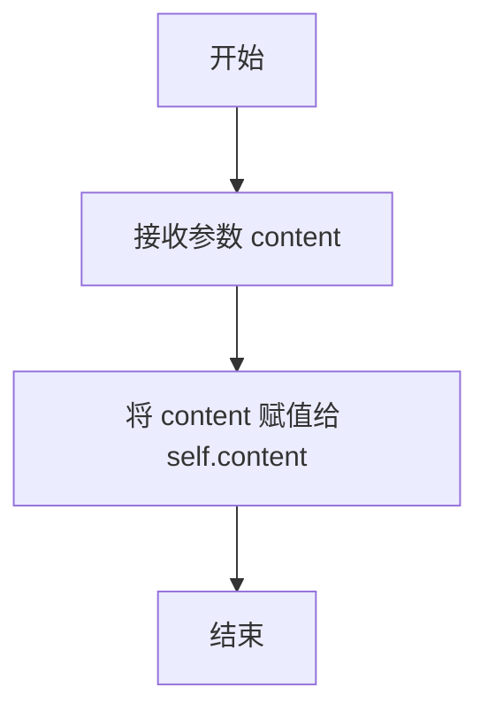
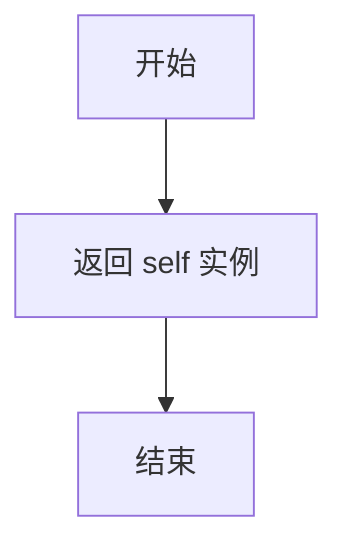
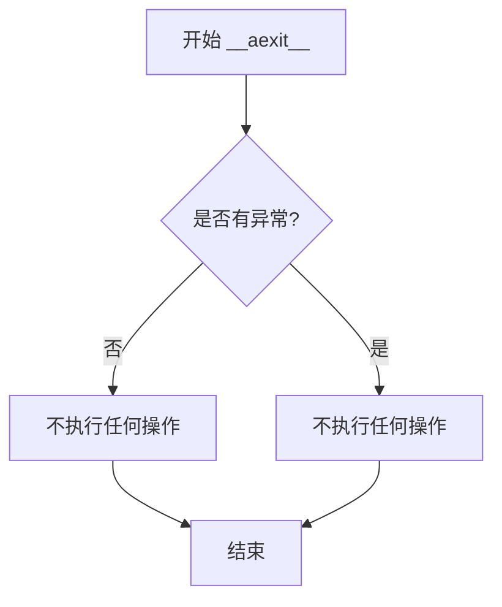
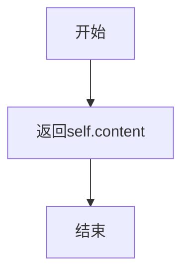
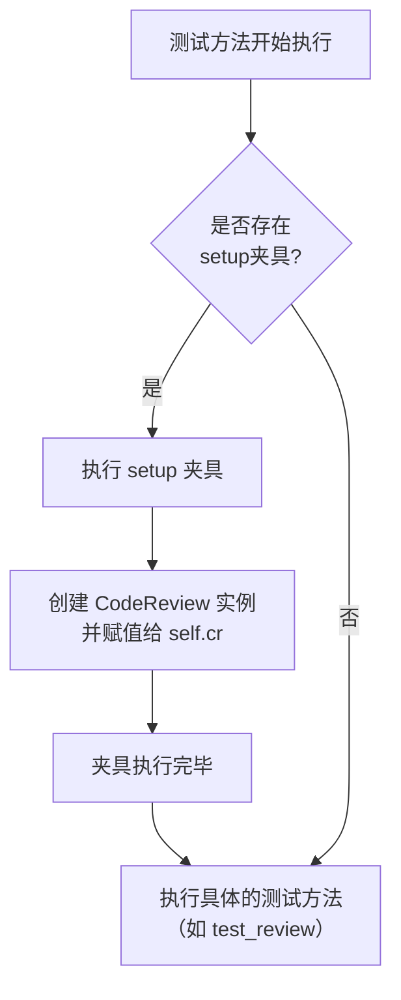
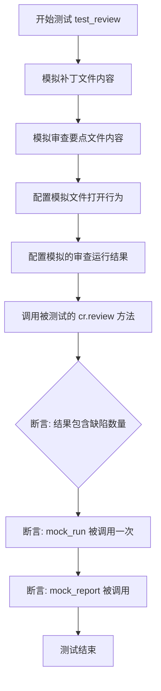
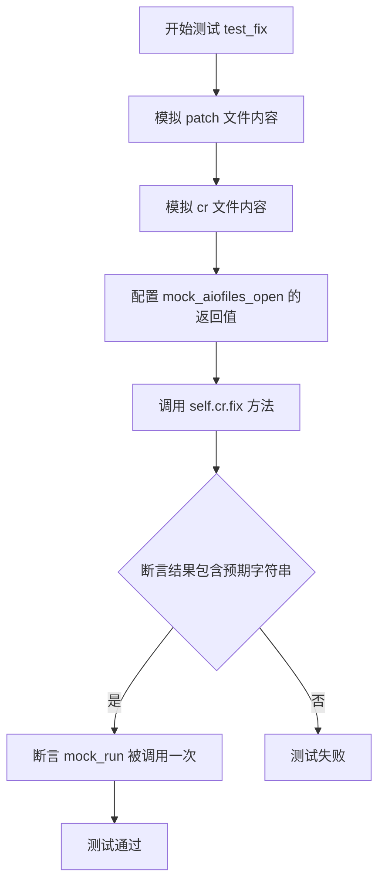

# `.\MetaGPT\tests\metagpt\tools\libs\test_cr.py` 详细设计文档

该文件是一个使用 pytest 和 pytest-asyncio 编写的异步单元测试文件，用于测试 `metagpt.tools.libs.cr.CodeReview` 类的 `review` 和 `fix` 方法。它通过模拟（Mock）文件读取和外部依赖（如 `aiofiles.open` 和 `metagpt` 内部模块的方法）来验证代码审查和修复功能的核心逻辑，确保在给定补丁文件和审查点文件时，能够正确调用底层服务并返回预期的结果。

## 整体流程



## 类结构

```
TestCodeReview (测试类)
├── MockFile (模拟文件类)
│   ├── __init__
│   ├── __aenter__
│   ├── __aexit__
│   └── read
├── setup (fixture)
├── test_review (测试方法)
└── test_fix (测试方法)
```

## 全局变量及字段


### `MockFile.content`
    
存储模拟文件内容的字符串。

类型：`str`
    


### `TestCodeReview.cr`
    
测试类中用于测试的CodeReview实例。

类型：`CodeReview`
    
    

## 全局函数及方法

### `MockFile.__init__`

`MockFile.__init__` 是 `MockFile` 类的构造函数，用于初始化一个模拟文件对象。它接收一个字符串参数作为文件内容，并将其存储在实例属性中，以便后续的异步读取操作。

参数：

- `content`：`str`，模拟文件的内容字符串。

返回值：`None`，构造函数不返回任何值。

#### 流程图



#### 带注释源码

```python
def __init__(self, content):
    # 将传入的 content 参数赋值给实例变量 self.content
    # 这个 content 代表了模拟文件的内容
    self.content = content
```

### `MockFile.__aenter__`

该方法实现了异步上下文管理器的入口协议，允许 `MockFile` 实例在 `async with` 语句中使用。它简单地返回实例自身，以便在异步上下文中进行后续操作。

参数：

-  `self`：`MockFile`，`MockFile` 类的实例

返回值：`MockFile`，返回 `MockFile` 实例自身

#### 流程图



#### 带注释源码

```python
async def __aenter__(self):
    # 异步上下文管理器的入口方法
    # 返回实例自身，以便在 `async with` 块中使用
    return self
```

### `MockFile.__aexit__`

该方法是一个异步上下文管理器的退出方法，用于在退出`async with`块时执行清理操作。在当前实现中，它不执行任何操作，仅用于满足异步上下文管理器协议。

参数：

- `exc_type`：`type`，引发的异常类型，如果没有异常则为`None`
- `exc_val`：`Exception`，引发的异常实例，如果没有异常则为`None`
- `exc_tb`：`traceback`，异常的追溯信息，如果没有异常则为`None`

返回值：`None`，无返回值

#### 流程图



#### 带注释源码

```python
async def __aexit__(self, exc_type, exc_val, exc_tb):
    # 这是一个异步上下文管理器的退出方法
    # 参数 exc_type, exc_val, exc_tb 分别表示异常类型、异常值和追溯信息
    # 当前实现为空，不执行任何清理操作
    pass
```

### `MockFile.read`

该方法用于异步读取MockFile对象中存储的内容。

参数：无

返回值：`str`，返回MockFile对象初始化时传入的content字符串内容。

#### 流程图



#### 带注释源码

```python
async def read(self):
    # 直接返回初始化时传入的content内容
    return self.content
```


### `TestCodeReview.setup`

这是一个使用 `pytest_asyncio` 框架定义的异步测试夹具（fixture）。它的核心功能是在 `TestCodeReview` 测试类的每个测试方法执行之前，自动初始化一个 `CodeReview` 类的实例，并将其赋值给测试实例的 `cr` 属性，为后续的测试方法提供准备好的测试对象。

参数：
-  `self`：`TestCodeReview`，指向当前测试类实例的引用。

返回值：`None`，此夹具不返回任何值，其作用是为测试实例设置状态。

#### 流程图



#### 带注释源码

```python
    @pytest_asyncio.fixture(autouse=True)  # 使用pytest_asyncio的fixture装饰器，autouse=True表示自动应用于类中的所有测试方法
    async def setup(self):
        """Fixture to initialize the CodeReview instance."""  # 文档字符串：说明此夹具用于初始化CodeReview实例
        self.cr = CodeReview()  # 核心操作：创建一个CodeReview对象，并将其赋值给当前测试实例的`cr`属性
```


### `TestCodeReview.test_review`

这是一个单元测试方法，用于测试 `CodeReview` 类的 `review` 方法。它通过模拟（Mock）外部依赖（如文件读取和异步操作）来验证 `review` 方法在给定一个补丁文件路径时，能够正确调用核心的代码审查逻辑，生成审查报告，并返回包含缺陷数量的结果字符串。

参数：

- `self`：`TestCodeReview`，测试类实例的引用。
- `mock_run`：`AsyncMock`，模拟 `metagpt.ext.cr.actions.code_review.CodeReview.run` 方法的对象。
- `mock_report`：`AsyncMock`，模拟 `metagpt.utils.report.EditorReporter.async_report` 方法的对象。
- `mock_aiofiles_open`：`MagicMock`，模拟 `aiofiles.open` 函数的对象。

返回值：`None`，这是一个测试方法，不直接返回值，但包含断言（assert）来验证测试结果。

#### 流程图



#### 带注释源码

```python
    @patch("aiofiles.open", new_callable=MagicMock) # 装饰器1：模拟异步文件打开函数 aiofiles.open
    @patch("metagpt.utils.report.EditorReporter.async_report", new_callable=AsyncMock) # 装饰器2：模拟异步报告函数 EditorReporter.async_report
    @patch("metagpt.ext.cr.actions.code_review.CodeReview.run", new_callable=AsyncMock) # 装饰器3：模拟核心的代码审查运行函数 CodeReview.run
    async def test_review(self, mock_run, mock_report, mock_aiofiles_open): # 定义异步测试方法，参数对应装饰器模拟的对象（顺序从下至上）
        """Test the review method with a local patch file.""" # 测试方法文档字符串：测试使用本地补丁文件的review方法
        # mock patch_content # 注释：模拟补丁文件内容
        patch_content = """diff --git a/test.py b/test.py
index 1234567..89abcde 100644
--- a/test.py
+++ b/test.py
@@ -1,3 +1,3 @@
 def foo():
-    print("Hello")
+    print("World")
-    print("Another line")
+    print("Another modified line")""" # 定义一个模拟的Git补丁字符串，描述了对test.py文件的修改

        # mock point file content # 注释：模拟审查要点文件内容
        point_file_content = json.dumps([{"id": 1, "description": "Test point"}]) # 创建一个JSON字符串，模拟包含审查要点的文件内容

        mock_patch_file = MockFile(patch_content) # 使用自定义的MockFile类创建模拟的补丁文件对象
        mock_point_file = MockFile(point_file_content) # 使用自定义的MockFile类创建模拟的要点文件对象
        mock_aiofiles_open.side_effect = [mock_patch_file, mock_point_file] # 配置mock_aiofiles_open的side_effect，使其在连续调用时依次返回两个模拟文件对象

        mock_run.return_value = [{"comment": "Fix this line"}] # 配置mock_run的返回值，模拟一次代码审查发现了一个问题

        # run # 注释：执行测试
        result = await self.cr.review(patch_path="test.patch", output_file="output.json") # 异步调用被测试的CodeReview实例的review方法

        # assert # 注释：断言验证
        assert "The number of defects: 1" in result # 断言1：审查结果字符串中包含缺陷数量为1的信息
        mock_run.assert_called_once() # 断言2：验证模拟的run方法被调用了一次
        mock_report.assert_called() # 断言3：验证模拟的report方法被调用了（至少一次）
```

### `TestCodeReview.test_fix`

这是一个单元测试方法，用于测试 `CodeReview` 类的 `fix` 方法。它通过模拟文件读取和 `ModifyCode.run` 方法的调用，验证 `fix` 方法在给定补丁文件和代码审查文件时，能够正确执行并返回预期的结果。

参数：

- `mock_run`：`AsyncMock`，模拟的 `metagpt.ext.cr.actions.modify_code.ModifyCode.run` 方法，用于验证其是否被正确调用。
- `mock_aiofiles_open`：`MagicMock`，模拟的 `aiofiles.open` 函数，用于控制测试中文件读取的行为。

返回值：`None`，这是一个测试方法，不返回业务值，其成功与否由内部的断言决定。

#### 流程图



#### 带注释源码

```python
    @patch("aiofiles.open", new_callable=MagicMock) # 装饰器1：模拟 aiofiles.open 函数
    @patch("metagpt.ext.cr.actions.modify_code.ModifyCode.run", new_callable=AsyncMock) # 装饰器2：模拟 ModifyCode.run 方法
    async def test_fix(self, mock_run, mock_aiofiles_open):
        """Test the fix method."""
        # 准备模拟的补丁文件内容
        patch_content = """diff --git a/test.py b/test.py
index 1234567..89abcde 100644
--- a/test.py
+++ b/test.py
@@ -1,3 +1,3 @@
 def foo():
-    print("Hello")
+    print("World")
-    print("Another line")
+    print("Another modified line")"""

        # 准备模拟的代码审查结果文件内容（JSON格式）
        cr_file_content = json.dumps([{"comment": "Fix this line"}])

        # 创建模拟的文件对象
        mock_path_file = MockFile(patch_content)
        mock_cr_file = MockFile(cr_file_content)
        # 设置 mock_aiofiles_open 的 side_effect，使其在连续调用时返回不同的模拟文件对象
        mock_aiofiles_open.side_effect = [mock_path_file, mock_cr_file]

        # 执行被测试的 fix 方法
        result = await self.cr.fix(patch_path="test.patch", cr_file="cr.json", output_dir="output")

        # 断言：验证返回结果中包含预期的成功信息
        assert "The fixed patch files store in output" in result
        # 断言：验证模拟的 ModifyCode.run 方法被调用了一次
        mock_run.assert_called_once()
```

## 关键组件


### CodeReview 类

代码审查功能的核心类，负责协调审查和修复流程。

### MockFile 类

一个模拟的异步文件对象，用于在单元测试中模拟文件读取操作。

### 测试框架 (pytest)

用于组织和执行单元测试的框架，支持异步测试和模拟。

### 模拟与打桩 (unittest.mock)

用于在测试中模拟外部依赖（如文件I/O、异步函数调用）的库，确保测试的隔离性和可重复性。

### 异步文件操作 (aiofiles)

在测试中被模拟的库，用于在真实场景中进行异步文件读写操作。

### 报告系统 (EditorReporter)

用于生成和输出代码审查报告的组件，在测试中被模拟。

### 代码审查执行模块 (CodeReview.run)

执行具体代码审查逻辑的异步方法，在测试中被模拟以验证调用。

### 代码修复执行模块 (ModifyCode.run)

执行具体代码修复逻辑的异步方法，在测试中被模拟以验证调用。

### JSON 数据格式

用于存储和传输代码审查点（points）和审查结果（comments）的结构化数据格式。


## 问题及建议


### 已知问题

-   **测试用例对实现细节耦合度过高**：`test_review` 和 `test_fix` 方法通过 `@patch` 装饰器直接模拟了 `CodeReview.run` 和 `ModifyCode.run` 等内部方法。这使得测试变得脆弱，一旦被测试类（`CodeReview`）的内部实现（如调用的方法名或模块路径）发生改变，即使其对外接口和行为不变，测试也会失败。这违反了单元测试应关注行为而非实现的原则。
-   **Mock对象构造复杂且重复**：测试中手动创建了 `MockFile` 类来模拟异步文件对象，并在多个测试中重复了相似的 `patch_content` 字符串和 Mock 设置逻辑。这增加了测试代码的维护成本，并可能因复制粘贴导致错误。
-   **测试覆盖不完整**：当前测试主要覆盖了“正常路径”（happy path）。缺少对异常情况的测试，例如当输入文件不存在、文件内容格式错误、或依赖的 `run` 方法抛出异常时，`review` 和 `fix` 方法的行为是否符合预期（如是否妥善处理异常、是否进行错误报告）。
-   **测试断言过于笼统**：断言 `assert "The number of defects: 1" in result` 和 `assert "The fixed patch files store in output" in result` 仅检查了返回字符串中是否包含特定子串。这种断言方式不够精确，无法确保返回结果的完整性和正确格式，容易因返回信息的微小调整（如措辞变化）而导致测试失败，也可能掩盖更深层次的逻辑错误。

### 优化建议

-   **重构测试以减少实现耦合**：建议采用更黑盒的测试方式。例如，可以模拟 `aiofiles.open` 来提供不同的文件内容，然后验证 `CodeReview.review` 和 `CodeReview.fix` 方法的最终输出结果或产生的副作用（如是否以正确的参数调用了报告功能），而不是模拟其内部调用的具体 `Action` 类的方法。如果必须验证某些交互，可以考虑使用 `unittest.mock.ANY` 或更宽松的匹配器来降低对具体调用细节的敏感度。
-   **提取公共测试工具函数和测试数据**：将 `MockFile` 类、常见的 `patch_content` 字符串、以及设置 `mock_aiofiles_open.side_effect` 的逻辑抽取为模块级的工具函数或 `pytest fixture`。这能显著减少代码重复，提高测试的可读性和可维护性。
-   **补充边界和异常测试用例**：增加针对以下场景的测试：
    -   传入不存在的 `patch_path` 或 `cr_file`。
    -   `patch` 文件内容为空或非标准 diff 格式。
    -   `cr.json` 文件内容不是有效的 JSON，或 JSON 结构不符合预期。
    -   被模拟的 `run` 方法抛出异常。
    -   验证在这些情况下，方法是否抛出预期的异常、返回特定的错误信息或安全地处理了错误。
-   **强化测试断言**：将基于字符串包含的断言替换为更精确的断言。例如，对于 `review` 方法，可以解析其返回的 JSON 或结构化数据，直接断言缺陷数量、缺陷内容等。对于 `fix` 方法，可以断言其返回的路径字符串是否确实以指定的 `output_dir` 开头，或者模拟检查是否在正确的路径下生成了预期的文件。这会使测试对实现变化的容忍度更高，同时对功能正确性的验证更强。


## 其它


### 设计目标与约束

本代码是一个针对 `CodeReview` 类的单元测试套件，其核心设计目标是验证 `CodeReview` 类的 `review` 和 `fix` 方法在模拟环境下的功能正确性。主要约束包括：1) 完全依赖模拟（Mock）对象来隔离外部依赖（如文件I/O、网络调用、其他类的方法），确保测试的独立性和可重复性；2) 使用 `pytest` 和 `pytest_asyncio` 框架来支持异步测试；3) 测试数据（如补丁内容、评审点）以内联字符串形式硬编码，以简化测试用例。

### 错误处理与异常设计

当前测试代码本身不包含显式的错误处理逻辑，其设计依赖于 `pytest` 框架来捕获和报告测试失败（断言错误）或未处理的异常。测试方法通过 `assert` 语句验证预期结果，如果断言失败，`pytest` 会将其标记为测试失败。对于被测试的 `CodeReview` 类可能抛出的异常，本测试套件未设置专门的异常捕获和验证场景，这依赖于 `CodeReview` 类自身的错误处理。模拟对象（如 `MockFile`, `AsyncMock`）被配置为正常执行，不模拟异常情况。

### 数据流与状态机

测试数据流是线性的、预设的。每个测试方法 (`test_review`, `test_fix`) 遵循相同的模式：1) **准备阶段**：定义模拟的输入数据（`patch_content`, `point_file_content`/`cr_file_content`）并配置模拟对象（`mock_aiofiles_open.side_effect`, `mock_run.return_value`）的行为。2) **执行阶段**：调用被测试的 `CodeReview` 实例方法 (`review`, `fix`)。3) **验证阶段**：使用 `assert` 检查方法返回的字符串结果是否包含预期关键字，并验证相关的模拟方法（`mock_run`, `mock_report`）是否被按预期调用。测试本身不涉及复杂的状态转换，主要验证在给定输入下，输出和交互是否符合预期。

### 外部依赖与接口契约

本测试代码通过 `unittest.mock.patch` 装饰器显式地模拟了所有外部依赖，清晰地定义了测试的边界和接口契约：
1.  **文件系统I/O**：通过 `@patch("aiofiles.open", ...)` 模拟异步文件打开操作，使其返回自定义的 `MockFile` 对象，从而避免真实的磁盘读写。
2.  **下游业务逻辑**：
    *   `@patch("metagpt.ext.cr.actions.code_review.CodeReview.run", ...)`：模拟 `review` 方法内部调用的核心评审逻辑，约定其返回一个包含评论的列表。
    *   `@patch("metagpt.ext.cr.actions.modify_code.ModifyCode.run", ...)`：模拟 `fix` 方法内部调用的代码修复逻辑。
    *   `@patch("metagpt.utils.report.EditorReporter.async_report", ...)`：模拟 `review` 方法中可能涉及的报告生成逻辑。
3.  **被测试类 (`CodeReview`)**：测试假设 `CodeReview` 类提供了异步的 `review(patch_path, output_file)` 和 `fix(patch_path, cr_file, output_dir)` 方法，并约定它们返回描述性的字符串。测试通过实例化 `self.cr = CodeReview()` 来获取被测对象。

    