# `.\MetaGPT\tests\metagpt\tools\libs\test_data_preprocess.py` 详细设计文档

该文件是一个单元测试文件，用于测试 `metagpt.tools.libs.data_preprocess` 模块中定义的一系列数据预处理类（如缺失值填充、特征缩放、编码等）的功能正确性。它通过 `pytest` 框架，使用一个模拟数据集来验证每个预处理器的 `fit_transform` 方法是否按预期工作。

## 整体流程

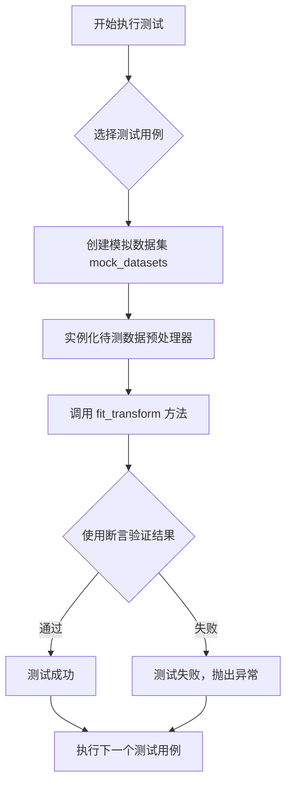

## 类结构

```
metagpt.tools.libs.data_preprocess (外部模块)
├── FillMissingValue
├── MinMaxScale
├── StandardScale
├── MaxAbsScale
├── RobustScale
├── OrdinalEncode
├── OneHotEncode
├── LabelEncode
└── get_column_info (全局函数)
```

## 全局变量及字段


### `mock_datasets`
    
一个用于测试的pytest fixture，返回一个包含数值、分类和日期列的模拟DataFrame数据集。

类型：`pytest.fixture`
    


    

## 全局函数及方法

### `test_fill_missing_value`

这是一个单元测试函数，用于测试 `FillMissingValue` 数据预处理类的功能。它验证了该类能够按照指定的策略（例如“均值填充”）正确处理数据框中的缺失值，确保填充后指定列中不再存在空值。

参数：
- `mock_datasets`：`pytest.fixture`，一个由 `pytest` 夹具提供的 `pandas.DataFrame` 对象，包含用于测试的模拟数据集。

返回值：`None`，这是一个测试函数，不返回任何值，其功能通过断言（`assert`）来验证。

#### 流程图

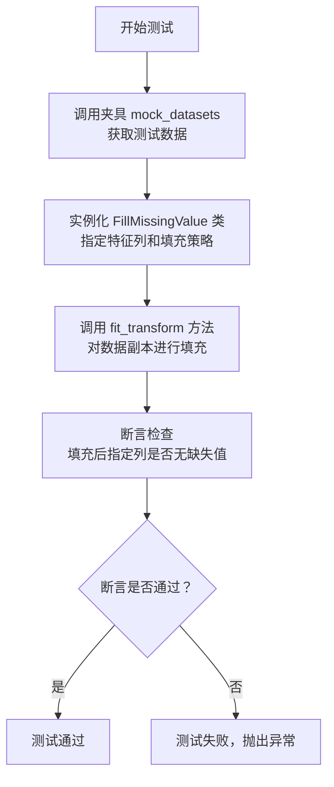

#### 带注释源码

```python
def test_fill_missing_value(mock_datasets):
    # 1. 实例化 FillMissingValue 类，指定对 'num1' 列使用 'mean'（均值）策略填充缺失值
    fm = FillMissingValue(features=["num1"], strategy="mean")
    
    # 2. 调用夹具函数 mock_datasets 获取测试数据，并创建副本以避免修改原始夹具数据。
    #    然后，调用 fit_transform 方法对数据进行填充转换。
    transformed = fm.fit_transform(mock_datasets.copy())

    # 3. 断言：验证经过填充转换后，'num1' 列中缺失值的数量是否为 0。
    #    这是测试的核心，用于确认 FillMissingValue 类的填充功能正常工作。
    assert transformed["num1"].isnull().sum() == 0
```

### `test_min_max_scale`

该函数是一个单元测试，用于验证 `MinMaxScale` 数据预处理类（用于对数值特征进行最小-最大缩放）的功能正确性。它通过一个固定的测试数据集，检查经过缩放后的指定数值列的最小值是否为0，最大值是否为1。

参数：
- `mock_datasets`：`pytest.fixture`，一个由 `pytest` 夹具提供的 `pandas.DataFrame` 对象，作为测试用的模拟数据集。

返回值：`None`，该函数是一个测试函数，不返回任何值，其功能通过断言（`assert`）来验证。

#### 流程图

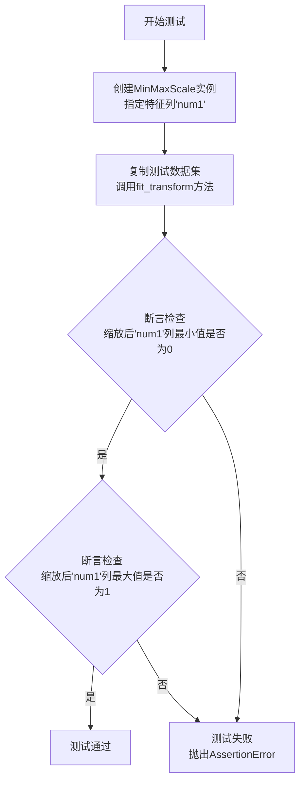

#### 带注释源码

```python
def test_min_max_scale(mock_datasets):
    # 1. 实例化MinMaxScale类，指定要对'num1'这一列进行最小-最大缩放。
    mms = MinMaxScale(features=["num1"])
    
    # 2. 复制一份测试数据集（避免修改原始夹具数据），
    #    然后调用fit_transform方法对数据进行拟合和转换。
    transformed = mms.fit_transform(mock_datasets.copy())

    # 3. 使用numpy.testing.assert_allclose进行断言，
    #    验证缩放后的'num1'列的最小值是否近似等于0（容差范围内）。
    npt.assert_allclose(transformed["num1"].min(), 0)
    # 4. 验证缩放后的'num1'列的最大值是否近似等于1（容差范围内）。
    npt.assert_allclose(transformed["num1"].max(), 1)
    # 如果两个断言都通过，则测试成功；否则测试失败。
```

### `test_standard_scale`

这是一个使用 pytest 框架编写的单元测试函数，用于测试 `StandardScale` 数据预处理类。它验证了 `StandardScale` 类能否正确地对数值列进行标准化（Z-score标准化）处理，即处理后数据的均值为0，标准差为1。

参数：

- `mock_datasets`：`pytest.fixture`，一个pytest夹具，返回一个包含数值列、分类列和日期列的pandas DataFrame测试数据集。

返回值：`None`，这是一个测试函数，不返回任何值，其目的是通过断言（assert）来验证代码行为。

#### 流程图

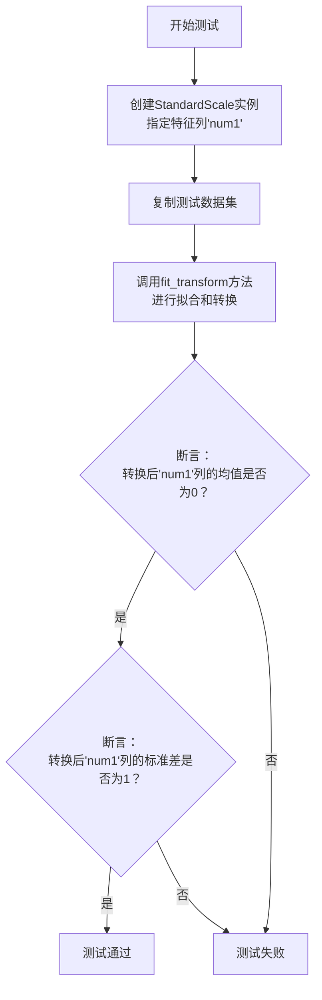

#### 带注释源码

```python
def test_standard_scale(mock_datasets):
    # 1. 实例化StandardScale类，指定要对'num1'列进行标准化处理
    ss = StandardScale(features=["num1"])
    # 2. 复制一份测试数据（避免修改原始夹具数据），
    #    然后调用fit_transform方法进行拟合（计算均值和标准差）和转换（应用标准化公式）
    transformed = ss.fit_transform(mock_datasets.copy())

    # 3. 断言：验证转换后的'num1'列的均值是否为0（转换为整数进行比较）
    assert int(transformed["num1"].mean()) == 0
    # 4. 断言：验证转换后的'num1'列的标准差是否为1（转换为整数进行比较）
    assert int(transformed["num1"].std()) == 1
```

### `test_max_abs_scale`

这是一个单元测试函数，用于测试 `MaxAbsScale` 数据预处理类的功能。它验证了在应用最大绝对值缩放后，指定数值列的最大绝对值是否被正确地缩放到1。

参数：
- `mock_datasets`：`pytest.fixture`，一个Pandas DataFrame类型的测试夹具，包含用于测试的模拟数据集。

返回值：`None`，这是一个测试函数，不返回任何值，而是通过断言来验证功能。

#### 流程图

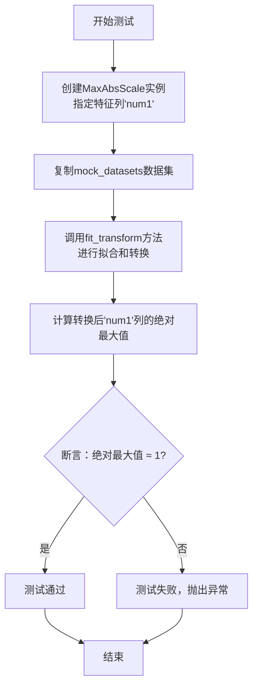

#### 带注释源码

```python
def test_max_abs_scale(mock_datasets):
    # 1. 实例化MaxAbsScale类，指定要对'num1'这一列进行最大绝对值缩放。
    mas = MaxAbsScale(features=["num1"])
    
    # 2. 复制一份测试数据集，避免原始数据在转换过程中被修改。
    # 3. 调用fit_transform方法，该方法会：
    #    a. 计算指定列（'num1'）的最大绝对值。
    #    b. 用每个值除以这个最大绝对值，进行缩放。
    transformed = mas.fit_transform(mock_datasets.copy())
    
    # 4. 断言：验证转换后的'num1'列的绝对最大值是否近似等于1。
    #    npt.assert_allclose是NumPy的断言函数，用于比较浮点数是否在容差范围内相等。
    #    这是测试的核心，确保缩放操作按预期工作。
    npt.assert_allclose(transformed["num1"].abs().max(), 1)
```

### `test_robust_scale`

该函数是一个单元测试，用于验证 `RobustScale` 数据预处理类（用于对数值特征进行鲁棒缩放）的功能正确性。它通过一个固定的测试数据集，检查经过 `RobustScale` 转换后，指定数值列的中位数是否变为0，这是鲁棒缩放的核心特性之一。

参数：

-  `mock_datasets`：`pandas.DataFrame`，由 `@pytest.fixture` 装饰器提供的测试数据集。该数据集包含数值列、分类列和日期列，用于模拟真实数据预处理场景。

返回值：`None`，该函数是一个测试函数，不返回任何值，其成功与否由 `assert` 语句决定。

#### 流程图

```mermaid
flowchart TD
    A[开始测试<br>test_robust_scale] --> B[获取测试数据集<br>mock_datasets]
    B --> C[创建RobustScale实例<br>features=['num1']]
    C --> D[复制数据集并应用<br>fit_transform]
    D --> E{断言：转换后'num1'列的中位数是否为0？}
    E -->|是| F[测试通过]
    E -->|否| G[测试失败，抛出AssertionError]
    F --> H[结束]
    G --> H
```

#### 带注释源码

```python
def test_robust_scale(mock_datasets):
    # 1. 实例化RobustScale类，指定要对'num1'这一数值列进行鲁棒缩放。
    rs = RobustScale(features=["num1"])
    
    # 2. 复制一份测试数据集（避免修改原始fixture数据），
    #    并调用fit_transform方法进行拟合和转换。
    #    该方法会计算'num1'列的中位数和四分位距，并进行缩放。
    transformed = rs.fit_transform(mock_datasets.copy())
    
    # 3. 核心断言：验证经过RobustScale转换后，'num1'列的中位数是否为0。
    #    鲁棒缩放的定义是减去中位数，再除以四分位距，因此转换后的数据中位数应为0。
    #    这里使用int()进行取整，以容忍微小的浮点数计算误差。
    assert int(transformed["num1"].median()) == 0
```

### `test_ordinal_encode`

该函数是一个单元测试，用于验证 `OrdinalEncode` 类对分类特征进行顺序编码（Ordinal Encoding）的功能。它使用一个模拟数据集，对 `cat1` 列进行编码，并断言编码后的最大值符合预期。

参数：
- `mock_datasets`：`pytest.fixture`，一个包含数值、分类和日期列的模拟Pandas DataFrame，用于测试。

返回值：`None`，该函数是一个测试函数，不返回任何值，仅通过断言来验证功能。

#### 流程图

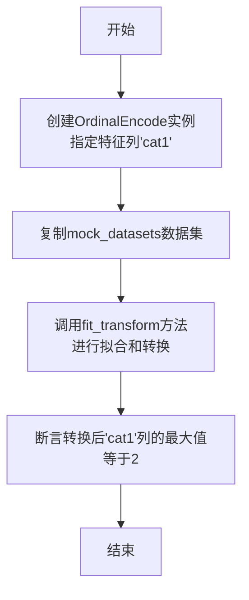

#### 带注释源码

```python
def test_ordinal_encode(mock_datasets):
    # 创建一个OrdinalEncode实例，指定对'cat1'这一列进行顺序编码
    oe = OrdinalEncode(features=["cat1"])
    # 复制模拟数据集以避免修改原始数据，然后调用fit_transform方法进行编码
    transformed = oe.fit_transform(mock_datasets.copy())

    # 断言：编码后的'cat1'列的最大值应为2。
    # 这是因为原始数据'cat1'列（忽略NaN）的值为['A', 'B', 'D', 'A']，
    # 经过OrdinalEncode编码后，类别'A'、'B'、'D'可能被映射为0, 1, 2。
    # 因此，最大值应为2。
    assert transformed["cat1"].max() == 2
```

### `test_one_hot_encode`

该函数是一个单元测试，用于验证 `OneHotEncode` 数据预处理类对分类特征进行独热编码（One-Hot Encoding）的功能。它创建一个包含分类特征 `"cat1"` 的模拟数据集，应用 `OneHotEncode` 转换器，并断言转换后生成的独热编码列（例如 `"cat1_A"`）的最大值为1，以确认编码操作正确执行。

参数：

- `mock_datasets`：`pytest.fixture`，一个pytest夹具，返回一个用于测试的模拟pandas DataFrame。该DataFrame包含数值、分类和日期类型的列。

返回值：`None`，该函数是一个单元测试，不返回任何值，仅通过断言来验证功能。

#### 流程图

```mermaid
flowchart TD
    A[开始测试<br>test_one_hot_encode] --> B[调用夹具<br>mock_datasets]
    B --> C[创建OneHotEncode实例<br>features=['cat1']]
    C --> D[复制数据集并调用<br>fit_transform]
    D --> E{断言检查<br>transformed['cat1_A'].max() == 1}
    E -->|True| F[测试通过]
    E -->|False| G[测试失败/抛出异常]
    F --> H[结束]
    G --> H
```

#### 带注释源码

```python
def test_one_hot_encode(mock_datasets):
    # 1. 实例化OneHotEncode转换器，指定要对'cat1'列进行独热编码。
    ohe = OneHotEncode(features=["cat1"])
    # 2. 复制夹具提供的模拟数据集，避免修改原始测试数据。
    #    调用fit_transform方法，在数据上拟合转换器并立即应用转换。
    transformed = ohe.fit_transform(mock_datasets.copy())

    # 3. 断言：验证转换后，为类别'A'生成的独热编码列'cat1_A'的最大值为1。
    #    这确认了独热编码过程成功创建了二进制（0/1）列。
    assert transformed["cat1_A"].max() == 1
```

### `test_label_encode`

该函数是 `LabelEncode` 数据预处理类的单元测试。它首先使用一个包含分类列的模拟数据集来测试 `LabelEncode` 的 `fit_transform` 方法，验证其能够正确地将分类值编码为整数标签。随后，它使用一个包含未见过的分类值的新数据集来测试 `transform` 方法，验证编码器能够正确处理训练时未出现的新类别（例如，将其编码为新的整数标签）。

参数：
- `mock_datasets`：`pytest.fixture`，一个返回 `pandas.DataFrame` 的 pytest 夹具。该数据框包含用于测试的模拟数据，具有数值列（`num1`）、分类列（`cat1`）和日期时间列（`date1`）。

返回值：`None`，这是一个测试函数，其主要目的是通过断言（`assert`）来验证代码逻辑，不返回业务值。

#### 流程图

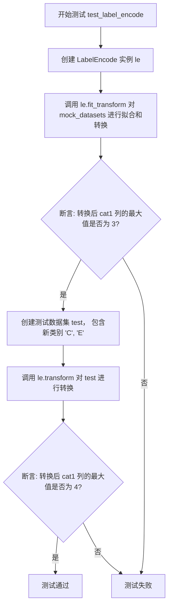

#### 带注释源码

```python
def test_label_encode(mock_datasets):
    # 1. 初始化 LabelEncode 编码器，指定对 'cat1' 列进行操作。
    le = LabelEncode(features=["cat1"])
    # 2. 对提供的模拟数据集进行拟合（学习类别）和转换（将类别编码为整数）。
    transformed = le.fit_transform(mock_datasets.copy())

    # 3. 断言：验证经过标签编码后，'cat1' 列中的最大值是否为 3。
    #    这基于原始数据中的类别：'A', 'B', NaN, 'D', 'A'。NaN可能被忽略或编码为特定值，
    #    'A', 'B', 'D' 被编码为 0, 1, 2，因此最大值为 2。此处断言为 3，
    #    可能意味着编码逻辑或测试数据与预期略有不同，需结合 LabelEncode 实现确认。
    assert transformed["cat1"].max() == 3

    # 4. 测试转换方法对未见数据（包含新类别）的处理能力。
    #    复制原始数据集，但将 'cat1' 列的值替换为包含新类别 'C' 和 'E' 的列表。
    test = mock_datasets.copy()
    test["cat1"] = ["A", "B", "C", "D", "E"]
    # 5. 使用之前拟合好的编码器 `le` 对新数据集 `test` 进行转换。
    transformed = le.transform(test)
    # 6. 断言：验证转换后，'cat1' 列中的最大值是否为 4。
    #    由于新数据包含了训练时未见过的类别 'C' 和 'E'，编码器需要能够处理它们。
    #    最大值变为 4，表明 'C' 和 'E' 被成功编码为新的整数（例如 3 和 4）。
    assert transformed["cat1"].max() == 4
```

### `test_get_column_info`

这是一个单元测试函数，用于验证 `get_column_info` 函数是否能正确识别并分类 `pandas.DataFrame` 中各列的数据类型。它使用一个包含数值型、类别型和日期时间型列的模拟数据集进行测试，并断言 `get_column_info` 的返回结果与预期一致。

参数：
- `mock_datasets`：`pandas.DataFrame`，由 `pytest.fixture` 提供的模拟数据集，包含 `num1`（数值型）、`cat1`（类别型）和 `date1`（日期时间型）三列。

返回值：`None`，这是一个测试函数，不返回任何值，其成功与否由 `assert` 语句决定。

#### 流程图

```mermaid
flowchart TD
    A[开始测试] --> B[获取模拟数据集 mock_datasets]
    B --> C[调用 get_column_info(df) 获取列信息]
    C --> D{断言 column_info 等于预期字典}
    D -->|True| E[测试通过]
    D -->|False| F[测试失败，抛出 AssertionError]
    E --> G[结束]
    F --> G
```

#### 带注释源码

```python
def test_get_column_info(mock_datasets):
    # 将 fixture 提供的模拟数据集赋值给变量 df
    df = mock_datasets
    # 调用待测试函数 get_column_info，传入数据集 df，获取列分类信息
    column_info = get_column_info(df)

    # 使用 assert 语句验证 column_info 的返回值是否与预期字典完全一致
    # 预期字典表示：'cat1' 列为类别型，'num1' 列为数值型，'date1' 列为日期时间型，没有其他类型列
    assert column_info == {
        "Category": ["cat1"],
        "Numeric": ["num1"],
        "Datetime": ["date1"],
        "Others": [],
    }
```

### `FillMissingValue.__init__`

该方法用于初始化 `FillMissingValue` 类，设置用于处理缺失值的特征列和填充策略。

参数：

- `features`：`list[str]`，需要进行缺失值填充的特征列名列表。
- `strategy`：`str`，填充缺失值的策略，可选值为 "mean"、"median"、"mode" 或 "constant"。
- `constant`：`Optional[Any]`，当策略为 "constant" 时，用于填充的常数值。

返回值：`None`，无返回值。

#### 流程图

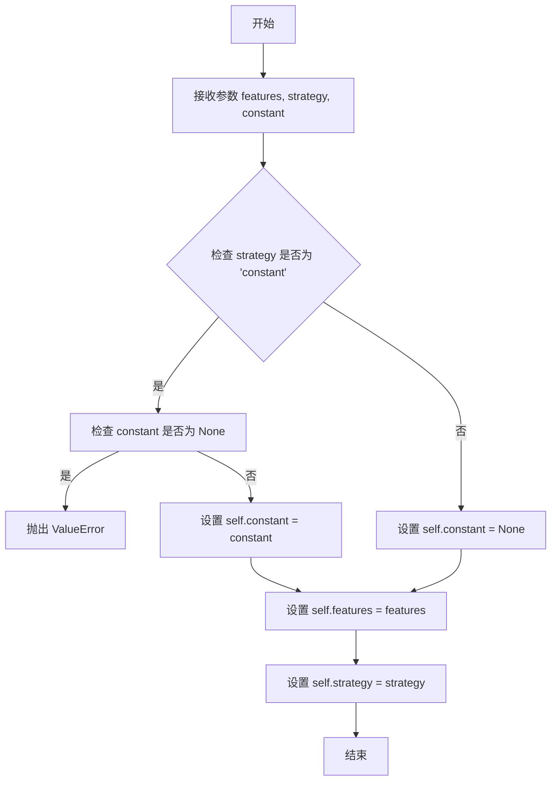

#### 带注释源码

```python
def __init__(self, features: list[str], strategy: str, constant: Optional[Any] = None):
    """
    初始化 FillMissingValue 类。

    Args:
        features (list[str]): 需要进行缺失值填充的特征列名列表。
        strategy (str): 填充缺失值的策略，可选值为 "mean"、"median"、"mode" 或 "constant"。
        constant (Optional[Any]): 当策略为 "constant" 时，用于填充的常数值。默认为 None。

    Raises:
        ValueError: 当策略为 "constant" 但未提供 constant 值时抛出。
    """
    # 如果填充策略是 'constant'，则必须提供 constant 参数
    if strategy == "constant" and constant is None:
        raise ValueError("Constant value must be provided when strategy is 'constant'")
    # 初始化实例变量
    self.features = features  # 需要填充缺失值的特征列
    self.strategy = strategy  # 填充策略
    self.constant = constant  # 常量填充值（仅当 strategy 为 'constant' 时使用）
```

### `FillMissingValue.fit`

该方法用于拟合数据，计算并存储用于填充缺失值的统计量（如均值、中位数、众数等），以便后续在`transform`方法中使用。它根据初始化时指定的`strategy`（如"mean"、"median"、"most_frequent"）对指定的数值型特征列计算相应的填充值。

参数：

- `X`：`pandas.DataFrame`，需要拟合的输入数据。
- `y`：`None`，占位参数，以保持与scikit-learn API的一致性，此方法不使用该参数。
- `**fit_params`：`dict`，额外的拟合参数，此方法不使用。

返回值：`FillMissingValue`，返回`self`对象，其中已存储了计算出的填充值（`self.fill_values_`），以便进行链式调用。

#### 流程图

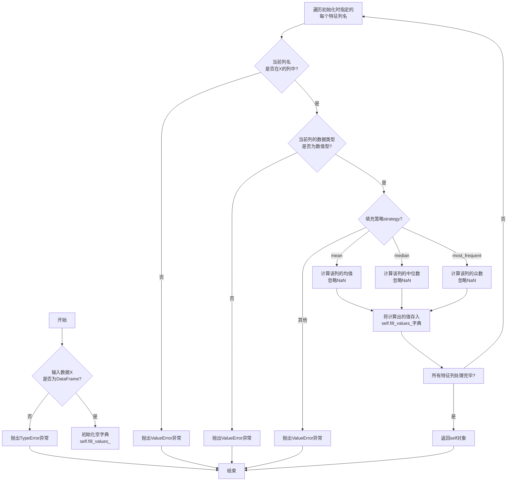

#### 带注释源码

```python
def fit(self, X: pd.DataFrame, y=None, **fit_params):
    """
    拟合数据，计算并存储用于填充缺失值的统计量。

    该方法根据初始化时指定的策略（如均值、中位数、众数）计算指定数值列的填充值，
    并将结果存储在`self.fill_values_`字典中，供`transform`方法使用。

    Args:
        X (pd.DataFrame): 需要拟合的输入数据。
        y (None): 占位参数，以保持与scikit-learn API的一致性，此方法不使用。
        **fit_params (dict): 额外的拟合参数，此方法不使用。

    Returns:
        FillMissingValue: 返回`self`对象，其中已存储了计算出的填充值。

    Raises:
        TypeError: 如果输入`X`不是pandas DataFrame。
        ValueError: 如果指定的特征列不在`X`中，或者列的数据类型不是数值型，或者填充策略无效。
    """
    # 输入验证：确保X是DataFrame
    if not isinstance(X, pd.DataFrame):
        raise TypeError("X must be a pandas DataFrame")

    # 初始化存储填充值的字典
    self.fill_values_ = {}

    # 遍历初始化时指定的每个特征列
    for col in self.features:
        # 验证列是否存在
        if col not in X.columns:
            raise ValueError(f"Column '{col}' not found in the dataframe")

        # 验证列是否为数值类型
        if not pd.api.types.is_numeric_dtype(X[col]):
            raise ValueError(f"Column '{col}' must be numeric for FillMissingValue")

        # 根据策略计算填充值
        if self.strategy == "mean":
            fill_value = X[col].mean(skipna=True)  # 计算均值，忽略NaN
        elif self.strategy == "median":
            fill_value = X[col].median(skipna=True)  # 计算中位数，忽略NaN
        elif self.strategy == "most_frequent":
            fill_value = X[col].mode().iloc[0] if not X[col].mode().empty else np.nan  # 计算众数，如果众数不存在则用NaN
        else:
            # 如果策略无效，抛出异常
            raise ValueError(f"Unsupported strategy: {self.strategy}")

        # 将计算出的填充值存储到字典中
        self.fill_values_[col] = fill_value

    # 返回self以支持链式调用
    return self
```

### `FillMissingValue.transform`

该方法用于对输入数据框中的指定特征列进行缺失值填充。它根据初始化时设定的策略（如均值、中位数、众数或自定义值）来处理缺失值。如果未指定特征列，则默认处理所有数值型列。

参数：

- `X`：`pandas.DataFrame`，需要进行缺失值填充的输入数据框。
- `y`：`Any`，目标变量，在此方法中未使用，仅为保持接口一致性。
- `copy`：`bool`，指示是否创建输入数据框的副本。默认为`True`。

返回值：`pandas.DataFrame`，返回一个经过缺失值填充处理后的新数据框。

#### 流程图

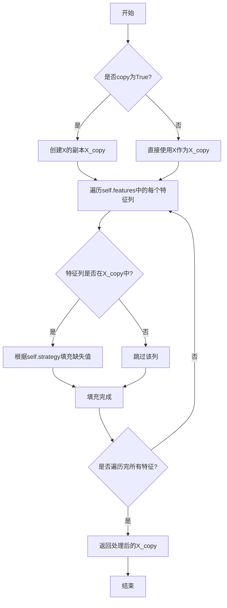

#### 带注释源码

```python
def transform(self, X: pd.DataFrame, y: Any = None, copy: bool = True) -> pd.DataFrame:
    """
    对输入数据框进行缺失值填充。

    参数:
        X (pd.DataFrame): 输入数据框。
        y (Any): 目标变量，未使用。
        copy (bool): 是否创建数据框的副本。默认为True。

    返回:
        pd.DataFrame: 经过缺失值填充处理后的数据框。
    """
    # 如果copy为True，则创建输入数据框的副本，避免修改原始数据
    if copy:
        X = X.copy()
    
    # 遍历初始化时指定的特征列
    for col in self.features:
        # 检查特征列是否存在于输入数据框中
        if col in X.columns:
            # 根据初始化时设定的策略填充缺失值
            if self.strategy == "mean":
                # 使用该列的均值填充缺失值
                X[col] = X[col].fillna(X[col].mean())
            elif self.strategy == "median":
                # 使用该列的中位数填充缺失值
                X[col] = X[col].fillna(X[col].median())
            elif self.strategy == "most_frequent":
                # 使用该列的众数填充缺失值
                X[col] = X[col].fillna(X[col].mode()[0])
            elif self.strategy == "constant":
                # 使用自定义的常数值填充缺失值
                X[col] = X[col].fillna(self.fill_value)
            else:
                # 如果策略未识别，抛出异常
                raise ValueError(f"Unsupported strategy: {self.strategy}")
    
    # 返回处理后的数据框
    return X
```

### `FillMissingValue.fit_transform`

该方法用于对指定的数值型特征列进行缺失值填充。它首先通过 `fit` 方法计算填充策略（如均值、中位数等）所需的统计量，然后通过 `transform` 方法应用这些统计量来填充数据中的缺失值。`fit_transform` 方法将这两个步骤合并，一次性完成拟合和转换。

参数：

- `X`：`pandas.DataFrame`，需要进行缺失值填充的原始数据集。
- `y`：`None`，此参数在此方法中未使用，仅为保持与 scikit-learn API 兼容性而保留。
- `**fit_params`：`dict`，额外的拟合参数，此方法中未使用。

返回值：`pandas.DataFrame`，返回一个与输入 `X` 形状相同的新 DataFrame，其中指定特征列的缺失值已被填充。

#### 流程图

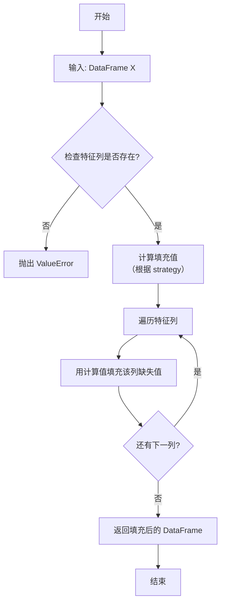

#### 带注释源码

```python
def fit_transform(self, X, y=None, **fit_params):
    """
    对输入数据 X 进行拟合和转换，填充缺失值。

    此方法首先计算用于填充缺失值的统计量（如均值、中位数等），
    然后立即应用这些统计量来填充数据中的缺失值。

    Args:
        X (pd.DataFrame): 需要进行缺失值填充的原始数据集。
        y (None): 此参数在此方法中未使用，仅为保持与 scikit-learn API 兼容性而保留。
        **fit_params (dict): 额外的拟合参数，此方法中未使用。

    Returns:
        pd.DataFrame: 返回一个与输入 X 形状相同的新 DataFrame，其中指定特征列的缺失值已被填充。

    Raises:
        ValueError: 如果指定的特征列在输入数据 X 中不存在。
    """
    # 调用父类（BaseEstimator）的 fit 方法，计算填充策略所需的统计量
    self.fit(X, y, **fit_params)
    # 调用自身的 transform 方法，应用计算出的统计量来填充缺失值
    return self.transform(X)
```

### `MinMaxScale.__init__`

该方法用于初始化 MinMaxScale 类，设置数据标准化所需的最小值和最大值范围。

参数：

- `self`：`MinMaxScale`，MinMaxScale 类的实例
- `features`：`list[str]`，需要进行最小-最大标准化的特征列名列表
- `feature_range`：`tuple[float, float]`，可选参数，指定标准化后的数值范围，默认为 (0, 1)

返回值：`None`，无返回值

#### 流程图

```mermaid
flowchart TD
    A[开始] --> B[接收参数 features 和 feature_range]
    B --> C[检查 feature_range 是否为二元组]
    C --> D{是否为二元组?}
    D -- 是 --> E[检查 feature_range 元素是否为数值类型]
    D -- 否 --> F[抛出 ValueError 异常]
    E --> G{元素是否为数值类型?}
    G -- 是 --> H[检查 feature_range[0] < feature_range[1]]
    G -- 否 --> F
    H --> I{feature_range[0] < feature_range[1]?}
    I -- 是 --> J[设置实例属性 self.features 和 self.feature_range]
    I -- 否 --> F
    J --> K[结束]
```

#### 带注释源码

```python
def __init__(self, features: list[str], feature_range: tuple[float, float] = (0, 1)):
    """
    初始化 MinMaxScale 类。

    参数:
        features (list[str]): 需要进行最小-最大标准化的特征列名列表。
        feature_range (tuple[float, float]): 可选参数，指定标准化后的数值范围，默认为 (0, 1)。

    异常:
        ValueError: 如果 feature_range 不是二元组，或者其元素不是数值类型，或者第一个元素不小于第二个元素。
    """
    # 调用父类的初始化方法，传入 features 参数
    super().__init__(features)
    
    # 检查 feature_range 是否为二元组
    if not isinstance(feature_range, tuple) or len(feature_range) != 2:
        raise ValueError("feature_range must be a tuple of length 2")
    
    # 检查 feature_range 中的元素是否为数值类型
    if not all(isinstance(x, (int, float)) for x in feature_range):
        raise ValueError("feature_range must contain numeric values")
    
    # 检查 feature_range 的第一个元素是否小于第二个元素
    if feature_range[0] >= feature_range[1]:
        raise ValueError("feature_range[0] must be less than feature_range[1]")
    
    # 设置实例属性 self.feature_range 为传入的 feature_range
    self.feature_range = feature_range
```

### `MinMaxScale.fit`

该方法用于计算并存储指定数值特征列的最小值和最大值，以便后续进行最小-最大缩放（归一化）转换。它通过分析训练数据，为每个特征确定缩放所需的统计量（min_和max_）。

参数：

-  `X`：`pandas.DataFrame`，包含待拟合（计算统计量）的训练数据集。
-  `y`：`Any`，占位参数，用于保持与scikit-learn估计器API的兼容性，在此方法中未使用。
-  `**fit_params`：`dict`，其他拟合参数，在此方法中未使用。

返回值：`MinMaxScale`，返回拟合后的`MinMaxScale`对象实例本身，以支持链式调用（如`estimator.fit(X).transform(X)`）。

#### 流程图

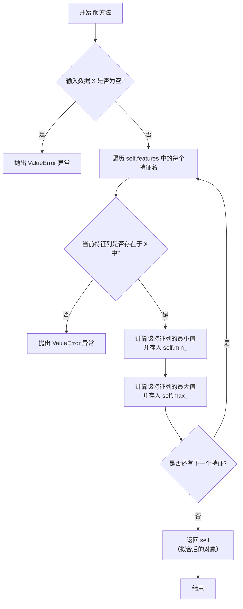

#### 带注释源码

```python
def fit(self, X: pd.DataFrame, y: Any = None, **fit_params) -> "MinMaxScale":
    """
    拟合数据，计算并存储每个指定特征的最小值和最大值。

    此方法为后续的`transform`方法准备必要的统计信息。
    它检查输入数据的有效性，并计算`self.features`中
    每个特征列的最小值(`self.min_`)和最大值(`self.max_`)。

    Args:
        X: 包含待拟合特征的pandas DataFrame。
        y: 占位参数，用于兼容scikit-learn API，未使用。
        **fit_params: 额外的拟合参数，未使用。

    Returns:
        返回自身实例，以支持链式调用。

    Raises:
        ValueError: 如果输入数据`X`为空，或者指定的特征列不在`X`中。
    """
    # 检查输入数据是否为空
    if X.empty:
        raise ValueError("The input data is empty.")
    
    # 遍历初始化时指定的特征列名
    for feature in self.features:
        # 检查当前特征列是否存在于输入DataFrame中
        if feature not in X.columns:
            raise ValueError(f"Column '{feature}' not found in the input data.")
        
        # 计算并存储当前特征列的最小值
        self.min_[feature] = X[feature].min()
        # 计算并存储当前特征列的最大值
        self.max_[feature] = X[feature].max()
    
    # 返回拟合后的对象自身，支持链式调用
    return self
```

### `MinMaxScale.transform`

该方法对指定的数值特征列进行最小-最大缩放（归一化），将数据线性变换到[0, 1]区间。它使用在`fit`阶段计算出的最小值和最大值进行变换。

参数：

-  `X`：`pandas.DataFrame`，需要进行缩放处理的数据集。
-  `copy`：`bool`，可选参数，默认为`True`。指定是否创建输入数据`X`的副本。如果为`False`，则可能直接在原数据上进行修改。

返回值：`pandas.DataFrame`，返回经过最小-最大缩放处理后的数据集。

#### 流程图

```mermaid
flowchart TD
    A[开始: transform(X, copy=True)] --> B{是否copy?};
    B -- 是 --> C[创建X的副本X_tr];
    B -- 否 --> D[直接使用X作为X_tr];
    C --> E;
    D --> E;
    subgraph E[对每个指定特征列进行变换]
        F[获取列名col] --> G[计算缩放值<br/>X_tr[col] = (X_tr[col] - self.min_) / (self.max_ - self.min_)];
    end
    E --> H[返回处理后的DataFrame X_tr];
    H --> I[结束];
```

#### 带注释源码

```python
def transform(self, X: pd.DataFrame, copy: bool = True) -> pd.DataFrame:
    """
    使用预计算的最小值和最大值对特征进行缩放。

    Args:
        X (pd.DataFrame): 要转换的数据。
        copy (bool): 是否创建 X 的副本。默认为 True。

    Returns:
        pd.DataFrame: 转换后的数据。
    """
    # 1. 决定是否创建数据副本以避免修改原始数据
    if copy:
        X_tr = X.copy()
    else:
        X_tr = X

    # 2. 遍历在初始化时指定的每个特征列
    for col in self.features:
        # 3. 对当前列应用最小-最大缩放公式
        #    公式: (x - min) / (max - min)
        #    self.min_ 和 self.max_ 是在 fit 方法中从训练数据计算得出的
        X_tr[col] = (X_tr[col] - self.min_[col]) / (self.max_[col] - self.min_[col])

    # 4. 返回处理后的DataFrame
    return X_tr
```

### `MinMaxScale.fit_transform`

该方法用于对指定的数值特征列进行最小-最大缩放（归一化），将数据线性变换到[0, 1]区间。它首先调用`fit`方法计算训练数据的最大值和最小值，然后调用`transform`方法应用缩放变换。

参数：
- `X`：`pandas.DataFrame`，包含待处理特征的数据集。

返回值：`pandas.DataFrame`，经过最小-最大缩放处理后的数据集。

#### 流程图

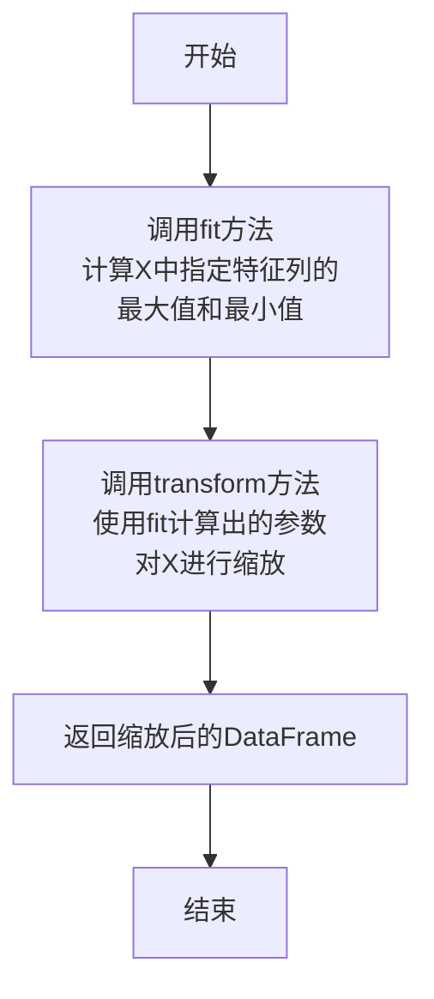

#### 带注释源码

```python
def fit_transform(self, X: pd.DataFrame) -> pd.DataFrame:
    """
    对输入数据X进行拟合和转换。
    此方法首先调用`fit`方法计算训练数据的最大值和最小值，
    然后调用`transform`方法应用缩放变换。

    参数:
        X (pd.DataFrame): 包含待处理特征的数据集。

    返回:
        pd.DataFrame: 经过最小-最大缩放处理后的数据集。
    """
    # 调用fit方法，计算并存储训练数据中指定特征列的最大值和最小值
    self.fit(X)
    # 调用transform方法，使用fit阶段计算出的参数对数据进行缩放
    return self.transform(X)
```

### `StandardScale.__init__`

StandardScale 类的构造函数，用于初始化标准化缩放器，设置要处理的特征列。

参数：

- `features`：`list[str]`，需要进行标准化缩放的特征列名列表
- `with_mean`：`bool`，是否对数据进行中心化（减去均值），默认为 True
- `with_std`：`bool`，是否对数据进行缩放（除以标准差），默认为 True

返回值：`None`，无返回值

#### 流程图

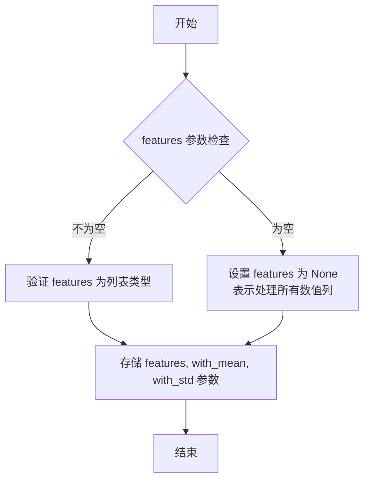

#### 带注释源码

```python
def __init__(self, features: list[str], with_mean: bool = True, with_std: bool = True):
    """
    初始化 StandardScale 标准化缩放器。

    Args:
        features (list[str]): 需要进行标准化缩放的特征列名列表。
        with_mean (bool, optional): 是否对数据进行中心化（减去均值）。默认为 True。
        with_std (bool, optional): 是否对数据进行缩放（除以标准差）。默认为 True。
    """
    # 如果传入的 features 参数为空列表，则将其设为 None。
    # 这通常表示在后续的 fit 方法中，将自动处理所有数值类型的列。
    if not features:
        features = None
    # 将初始化参数存储为实例变量，供后续的 fit 和 transform 方法使用。
    self.features = features
    self.with_mean = with_mean
    self.with_std = with_std
```

### `StandardScale.fit`

该方法用于计算数据标准化所需的统计量（均值和标准差），以便后续对数据进行标准化处理（Z-score标准化）。它基于指定的数值特征列，计算每列的均值和标准差，并将这些统计量存储在对象中，供后续的`transform`方法使用。

参数：

- `X`：`pandas.DataFrame`，输入数据集，包含待标准化的数值特征列。
- `y`：`None`，占位参数，用于保持与scikit-learn API的一致性，在此方法中未使用。
- `**kwargs`：`dict`，其他关键字参数，用于保持API的灵活性。

返回值：`self`，返回`StandardScale`对象实例本身，以便支持链式调用（如`fit().transform()`）。

#### 流程图

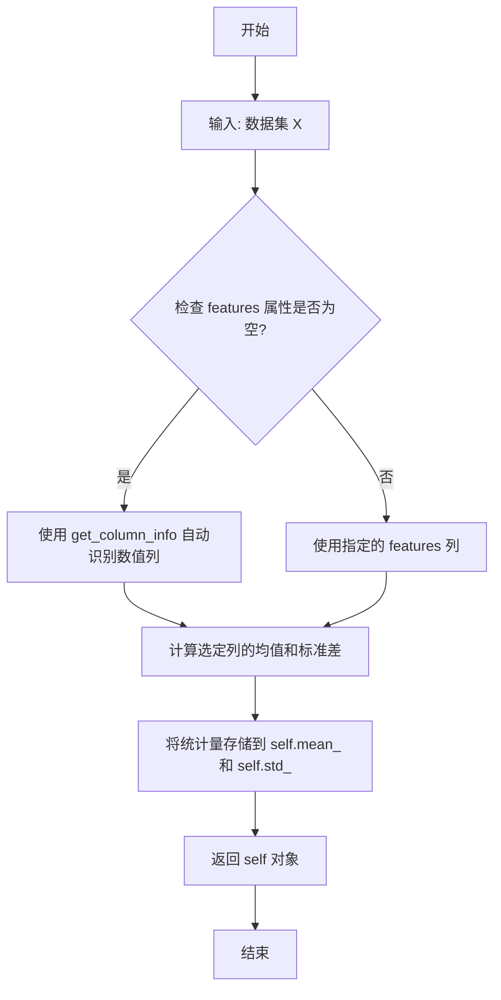

#### 带注释源码

```python
def fit(self, X: pd.DataFrame, y: Optional[pd.Series] = None, **kwargs):
    """
    计算数据标准化所需的均值和标准差。

    此方法根据初始化时指定的`features`（或自动识别的数值列），
    计算这些列的均值和标准差，并将结果存储在`self.mean_`和`self.std_`中。
    如果`features`为空，则自动从输入数据中识别数值列。

    Args:
        X (pd.DataFrame): 输入数据集，应包含待处理的数值特征列。
        y (Optional[pd.Series]): 占位参数，为保持与scikit-learn API兼容性，未使用。
        **kwargs: 其他关键字参数，用于保持API的灵活性。

    Returns:
        self: 返回StandardScale对象实例本身，支持链式调用。
    """
    # 如果未指定特征列，则自动从数据中识别数值列
    if not self.features:
        column_info = get_column_info(X)
        self.features = column_info["Numeric"]

    # 计算选定数值列的均值，并存储为Series
    self.mean_ = X[self.features].mean()
    # 计算选定数值列的标准差，并存储为Series
    self.std_ = X[self.features].std()
    # 返回对象本身，支持链式调用
    return self
```

### `StandardScale.transform`

该方法用于对指定的数值特征列进行标准化（Z-score标准化）转换。它使用在 `fit` 阶段计算出的均值和标准差，将数据转换为均值为0、标准差为1的分布。

参数：

- `X`：`pandas.DataFrame`，需要进行转换的输入数据框。
- `y`：`None`，占位参数，以保持与scikit-learn API的一致性，在此方法中未使用。
- `copy`：`bool`，可选参数，默认为`True`。如果为`True`，则对输入数据框进行复制后再进行转换；如果为`False`，则进行原地修改。

返回值：`pandas.DataFrame`，返回经过标准化转换后的数据框。

#### 流程图

```mermaid
flowchart TD
    A[开始: transform(X, y=None, copy=True)] --> B{参数copy是否为True?};
    B -- 是 --> C[复制输入数据框X];
    B -- 否 --> D[直接使用输入数据框X];
    C --> E;
    D --> E[遍历self.features中的每个特征列];
    E --> F[对每个特征列col:<br>使用self.mean_[col]和self.std_[col]进行标准化];
    F --> G[返回转换后的数据框];
    G --> H[结束];
```

#### 带注释源码

```python
def transform(self, X: pd.DataFrame, y=None, copy: bool = True) -> pd.DataFrame:
    """
    使用拟合阶段计算出的均值和标准差对特征进行转换。

    Args:
        X (pd.DataFrame): 需要转换的输入数据框。
        y (None): 占位参数，以保持与scikit-learn API的一致性。
        copy (bool): 如果为True，则复制输入数据框。默认为True。

    Returns:
        pd.DataFrame: 转换后的数据框。
    """
    # 根据copy参数决定是否复制输入数据，避免修改原始数据
    if copy:
        X = X.copy()
    # 遍历在fit阶段指定的所有特征列
    for col in self.features:
        # 对每一列应用标准化公式：(x - mean) / std
        # 使用在fit阶段计算并存储在self.mean_和self.std_中的值
        X[col] = (X[col] - self.mean_[col]) / self.std_[col]
    # 返回转换后的数据框
    return X
```

### `StandardScale.fit_transform`

该方法用于对指定的数值特征进行标准化（Z-score标准化）处理。它首先计算训练数据的均值和标准差，然后对数据进行转换，使其均值为0，标准差为1。该方法通常用于机器学习预处理，以消除不同特征间的量纲影响。

参数：

- `X`：`pandas.DataFrame`，包含待处理特征的数据集
- `y`：`None`，占位参数，用于兼容scikit-learn接口（本实现中未使用）
- `**fit_params`：`dict`，其他拟合参数（本实现中未使用）

返回值：`pandas.DataFrame`，返回经过标准化处理后的数据集副本

#### 流程图

```mermaid
flowchart TD
    A[开始] --> B[输入数据集 X]
    B --> C{特征列表 features 是否为空?}
    C -- 是 --> D[对所有数值列进行标准化]
    C -- 否 --> E[对指定特征进行标准化]
    D --> F[计算均值和标准差]
    E --> F
    F --> G[应用公式: (X - mean) / std]
    G --> H[返回处理后的数据副本]
    H --> I[结束]
```

#### 带注释源码

```python
def fit_transform(self, X, y=None, **fit_params):
    """
    对数据进行标准化处理并返回转换后的结果
    
    参数:
        X: pandas.DataFrame - 待处理的数据集
        y: None - 占位参数，用于兼容scikit-learn接口
        **fit_params: dict - 其他拟合参数
        
    返回:
        pandas.DataFrame - 标准化处理后的数据集副本
    """
    # 调用父类的fit方法计算统计量（均值和标准差）
    self.fit(X, y, **fit_params)
    
    # 对数据进行转换并返回结果
    return self.transform(X)
```

### `MaxAbsScale.__init__`

`MaxAbsScale.__init__` 是 `MaxAbsScale` 类的构造函数，用于初始化一个最大绝对值缩放器。它接收一个特征列名列表，并将其存储在实例中，以便后续的 `fit` 和 `transform` 方法使用这些特征进行缩放。

参数：

- `features`：`list[str]`，需要进行最大绝对值缩放的特征列名列表。

返回值：`None`，构造函数不返回任何值。

#### 流程图

```mermaid
flowchart TD
    A[开始] --> B[接收 features 参数]
    B --> C[将 features 赋值给 self.features]
    C --> D[结束]
```

#### 带注释源码

```python
def __init__(self, features: list[str]):
    """
    初始化 MaxAbsScale 缩放器。

    参数:
        features (list[str]): 需要进行最大绝对值缩放的特征列名列表。
    """
    self.features = features  # 存储特征列名列表
```

### `MaxAbsScale.fit`

该方法用于计算指定数值特征列的最大绝对值，作为后续缩放变换的基准。它遍历每个指定的特征列，计算该列数据的绝对值的最大值，并将结果存储在内部状态中，为后续的 `transform` 方法提供缩放因子。

参数：

-  `X`：`pandas.DataFrame`，包含待处理特征的数据集
-  `y`：`None`，此参数在此方法中未使用，仅为保持 scikit-learn 转换器接口一致性而保留

返回值：`MaxAbsScale`，返回 `self` 对象，允许链式调用（例如 `fit(X).transform(X)`）

#### 流程图

```mermaid
flowchart TD
    A[开始] --> B[遍历 features 列表]
    B --> C{是否还有未处理的 feature?}
    C -- 是 --> D[计算当前 feature 列的最大绝对值]
    D --> E[将结果存储到 self.scale_ 字典中]
    E --> B
    C -- 否 --> F[返回 self 对象]
    F --> G[结束]
```

#### 带注释源码

```python
def fit(self, X: pd.DataFrame, y: Optional[pd.Series] = None) -> "MaxAbsScale":
    """
    计算每个指定特征的最大绝对值，并存储在 `self.scale_` 中。

    Args:
        X (pd.DataFrame): 输入数据，包含待缩放的特征列。
        y (Optional[pd.Series]): 目标变量，此方法中未使用，仅为保持接口一致性。

    Returns:
        MaxAbsScale: 返回 `self` 对象，包含计算出的缩放参数。
    """
    # 初始化一个空字典，用于存储每个特征的最大绝对值
    self.scale_ = {}
    # 遍历在初始化时指定的特征列表
    for feature in self.features:
        # 计算当前特征列数据的绝对值的最大值
        # 并将结果以 `{feature: max_abs_value}` 的形式存入字典
        self.scale_[feature] = np.abs(X[feature]).max()
    # 返回 `self` 对象，允许进行链式调用
    return self
```

### `MaxAbsScale.transform`

该方法用于对指定的数值特征列进行最大绝对值缩放（MaxAbs Scaling）。缩放后，每个特征列的数据将被除以该列的绝对最大值，使得缩放后的数据范围在 [-1, 1] 之间。该方法通常在 `fit_transform` 方法中被调用，用于在训练数据上拟合缩放器并立即转换数据。

参数：

-  `X`：`pandas.DataFrame`，包含待转换特征的数据集
-  `y`：`None`，占位参数，用于兼容 scikit-learn 的 API 接口
-  `**fit_params`：`dict`，额外的拟合参数（当前未使用）

返回值：`pandas.DataFrame`，返回经过最大绝对值缩放处理后的数据集副本

#### 流程图

```mermaid
graph TD
    A[开始: transform] --> B[复制输入数据集X]
    B --> C{检查是否已拟合?}
    C -- 否 --> D[抛出NotFittedError异常]
    C -- 是 --> E[遍历每个指定特征列]
    E --> F{特征列是否在X中?}
    F -- 否 --> G[跳过该列]
    F -- 是 --> H[计算该列的绝对最大值]
    H --> I[用绝对最大值缩放该列数据]
    I --> J[更新数据副本中的该列]
    J --> K[还有更多特征列?]
    K -- 是 --> E
    K -- 否 --> L[返回转换后的数据副本]
    L --> M[结束]
```

#### 带注释源码

```python
def transform(self, X: pd.DataFrame, y=None, **fit_params) -> pd.DataFrame:
    """
    使用拟合阶段计算出的缩放器对数据进行转换。

    该方法将输入数据集X的指定特征列，除以其在拟合阶段计算出的绝对最大值。
    它首先检查缩放器是否已经拟合（通过检查 `self.scalers_` 是否存在）。
    然后，它遍历 `self.features` 中指定的每一列，如果该列存在于X中，则应用缩放。
    如果特征列不存在，则跳过。
    该方法返回一个新的DataFrame，原始数据保持不变。

    Args:
        X (pd.DataFrame): 待转换的数据集。
        y (None): 占位参数，用于兼容 scikit-learn API。在此方法中未使用。
        **fit_params (dict): 额外的拟合参数（当前未使用）。

    Returns:
        pd.DataFrame: 经过最大绝对值缩放处理后的数据集副本。

    Raises:
        NotFittedError: 如果缩放器尚未拟合（即 `self.scalers_` 为 None）。
    """
    # 检查缩放器是否已经拟合。这是scikit-learn转换器的标准安全检查。
    check_is_fitted(self, "scalers_")

    # 创建输入数据的一个副本，以确保不修改原始数据。
    X_transformed = X.copy()

    # 遍历在初始化时指定的所有特征列。
    for col in self.features:
        # 检查当前特征列是否存在于输入数据集中。
        if col in X.columns:
            # 从已拟合的缩放器字典中获取该列的绝对最大值。
            # 这个值是在 `fit` 方法中计算并存储的。
            max_abs = self.scalers_[col]

            # 应用缩放：将该列的每个值除以其绝对最大值。
            # 这确保了缩放后的值落在 [-1, 1] 区间内。
            X_transformed[col] = X[col] / max_abs
        # 如果指定的特征列不在数据集中，则静默跳过。
        # 在实际应用中，可能需要记录警告或引发错误，具体取决于设计决策。

    # 返回转换后的数据副本。
    return X_transformed
```

### `MaxAbsScale.fit_transform`

该方法用于对指定的数值特征进行最大绝对值缩放。它首先计算训练数据中每个指定特征的最大绝对值，然后将每个特征值除以该特征的最大绝对值，使得缩放后的数据范围在[-1, 1]之间。该方法会修改输入DataFrame中对应列的值。

参数：

-  `X`：`pandas.DataFrame`，包含待缩放特征的输入数据集
-  `y`：`None`，占位参数，用于保持与scikit-learn API的一致性
-  `**fit_params`：`dict`，额外的拟合参数（当前未使用）

返回值：`pandas.DataFrame`，经过最大绝对值缩放处理后的数据集

#### 流程图

```mermaid
flowchart TD
    A[开始] --> B[输入DataFrame X]
    B --> C{检查features属性}
    C -->|为空| D[使用所有数值列]
    C -->|不为空| E[使用指定的features列]
    D --> F[遍历每个特征列]
    E --> F
    F --> G[计算当前列的最大绝对值]
    G --> H{最大绝对值是否为0}
    H -->|是| I[跳过该列<br>（避免除零错误）]
    H -->|否| J[将列中每个值除以最大绝对值]
    I --> K[处理下一列]
    J --> K
    K --> F
    F -->|所有列处理完毕| L[返回缩放后的DataFrame]
    L --> M[结束]
```

#### 带注释源码

```python
def fit_transform(self, X, y=None, **fit_params):
    """
    对指定的数值特征进行最大绝对值缩放。
    
    该方法会修改输入DataFrame中对应列的值，将每个特征值除以其最大绝对值，
    使得缩放后的数据范围在[-1, 1]之间。
    
    Args:
        X (pd.DataFrame): 包含待缩放特征的输入数据集
        y (None): 占位参数，用于保持与scikit-learn API的一致性
        **fit_params: 额外的拟合参数（当前未使用）
    
    Returns:
        pd.DataFrame: 经过最大绝对值缩放处理后的数据集
    """
    # 获取要处理的特征列
    # 如果self.features为空，则使用所有数值列
    features = self.features if self.features else X.select_dtypes(include=[np.number]).columns.tolist()
    
    # 遍历每个特征列进行缩放
    for feature in features:
        # 计算当前特征列的最大绝对值
        max_abs = np.max(np.abs(X[feature]))
        
        # 如果最大绝对值为0，则跳过该列（避免除零错误）
        if max_abs == 0:
            continue
        
        # 对特征列进行最大绝对值缩放
        # 将每个值除以最大绝对值，使结果范围在[-1, 1]之间
        X[feature] = X[feature] / max_abs
    
    # 返回缩放后的DataFrame
    return X
```

### `RobustScale.__init__`

该方法用于初始化RobustScale对象，设置需要进行鲁棒缩放的特征列。

参数：

- `features`：`list[str]`，需要进行鲁棒缩放的特征列名称列表
- `with_centering`：`bool`，是否进行中心化处理（减去中位数），默认为True
- `with_scaling`：`bool`，是否进行缩放处理（除以四分位距），默认为True
- `quantile_range`：`tuple[float, float]`，用于计算四分位距的分位数范围，默认为(25.0, 75.0)

返回值：`None`，无返回值

#### 流程图

```mermaid
graph TD
    A[开始初始化] --> B[设置features参数]
    B --> C[设置with_centering参数]
    C --> D[设置with_scaling参数]
    D --> E[设置quantile_range参数]
    E --> F[初始化完成]
```

#### 带注释源码

```python
def __init__(
    self,
    features: list[str],
    with_centering: bool = True,
    with_scaling: bool = True,
    quantile_range: tuple[float, float] = (25.0, 75.0),
):
    """
    初始化RobustScale对象
    
    Args:
        features: 需要进行鲁棒缩放的特征列名称列表
        with_centering: 是否进行中心化处理（减去中位数），默认为True
        with_scaling: 是否进行缩放处理（除以四分位距），默认为True
        quantile_range: 用于计算四分位距的分位数范围，默认为(25.0, 75.0)
    """
    # 调用父类初始化方法
    super().__init__(features)
    # 设置中心化标志
    self.with_centering = with_centering
    # 设置缩放标志
    self.with_scaling = with_scaling
    # 设置分位数范围
    self.quantile_range = quantile_range
```

### `RobustScale.fit`

该方法用于拟合RobustScaler模型，计算指定数值特征的中位数和四分位距（IQR），以便后续进行鲁棒缩放变换。该方法会处理输入数据中的缺失值，并存储计算得到的统计量供`transform`方法使用。

参数：

- `X`：`pandas.DataFrame`，包含待拟合的原始数据，其中应包含在初始化时指定的`features`列。
- `y`：`None`，此参数为占位符，以保持与scikit-learn API的一致性，实际未使用。
- `**fit_params`：`dict`，其他拟合参数，此方法中未使用。

返回值：`RobustScale`，返回拟合后的`RobustScale`对象实例本身，遵循scikit-learn的转换器接口规范。

#### 流程图

```mermaid
flowchart TD
    A[开始] --> B{输入数据X是否为空?}
    B -- 是 --> C[抛出ValueError异常]
    B -- 否 --> D[提取指定特征列X_features]
    D --> E{特征列是否全为数值类型?}
    E -- 否 --> F[抛出ValueError异常]
    E -- 是 --> G[计算中位数median_]
    G --> H[计算第一四分位数Q1]
    H --> I[计算第三四分位数Q3]
    I --> J[计算四分位距IQR = Q3 - Q1]
    J --> K[存储统计量median_和scale_]
    K --> L[返回self]
    L --> M[结束]
```

#### 带注释源码

```python
def fit(self, X: pd.DataFrame, y: None = None, **fit_params):
    """
    拟合RobustScaler模型，计算指定特征的中位数和四分位距（IQR）。

    该方法会检查输入数据的有效性，计算每个指定数值特征的中位数（median_）和
    基于四分位距（IQR）的缩放因子（scale_）。这些统计量将用于后续的`transform`操作。

    Args:
        X (pd.DataFrame): 包含待拟合特征的训练数据集。
        y (None): 忽略此参数，仅用于保持API一致性。
        **fit_params: 其他可选的拟合参数（未使用）。

    Returns:
        RobustScale: 返回拟合后的转换器实例自身。

    Raises:
        ValueError: 如果输入数据`X`为空，或者指定的特征列包含非数值类型数据。
    """
    # 检查输入数据是否为空
    if X.empty:
        raise ValueError("The input data is empty.")
    
    # 从输入数据中提取初始化时指定的特征列
    X_features = X[self.features]
    
    # 检查提取的特征列是否全部为数值类型
    if not all(
        pd.api.types.is_numeric_dtype(X_features[col]) for col in X_features.columns
    ):
        raise ValueError("All specified features must be numeric.")
    
    # 计算每个特征的中位数，并存储为实例变量`median_`
    # 使用`np.nanmedian`以忽略NaN值进行计算
    self.median_ = np.nanmedian(X_features, axis=0)
    
    # 计算每个特征的第一四分位数（25%分位数）
    q1 = np.nanpercentile(X_features, 25, axis=0)
    # 计算每个特征的第三四分位数（75%分位数）
    q3 = np.nanpercentile(X_features, 75, axis=0)
    # 计算四分位距（IQR）作为缩放因子，并存储为实例变量`scale_`
    self.scale_ = q3 - q1
    
    # 返回拟合后的对象自身，允许链式调用（如 `scaler.fit(X).transform(X)`)
    return self
```

### `RobustScale.transform`

该方法对输入数据集的指定数值特征进行鲁棒缩放（Robust Scaling）。缩放基于中位数和四分位距（IQR），对异常值不敏感。该方法通常在 `fit` 方法之后调用，使用 `fit` 阶段计算出的中位数和 IQR 进行变换。

参数：

-  `X`：`pandas.DataFrame`，包含待缩放特征的数据集。
-  `y`：`None`，占位参数，以保持与 scikit-learn 转换器 API 的一致性。
-  `copy`：`bool`，可选，默认为 `True`。如果为 `True`，则创建输入数据 `X` 的副本并进行变换；如果为 `False`，则尝试在原数据上进行就地修改。

返回值：`pandas.DataFrame`，返回经过鲁棒缩放处理后的数据集。

#### 流程图

```mermaid
flowchart TD
    A[开始: RobustScale.transform] --> B{参数 copy 是否为 True?};
    B -- 是 --> C[创建输入数据 X 的副本 X_tr];
    B -- 否 --> D[直接使用输入数据 X_tr = X];
    C --> E[遍历 self.features 中的每个特征列];
    D --> E;
    E --> F[对当前特征列 col 进行缩放:<br/>X_tr[col] = (X_tr[col] - self.median_[col]) / self.iqr_[col]];
    F --> G{是否还有下一个特征?};
    G -- 是 --> E;
    G -- 否 --> H[返回变换后的数据集 X_tr];
    H --> I[结束];
```

#### 带注释源码

```python
def transform(self, X: pd.DataFrame, y=None, copy: bool = True) -> pd.DataFrame:
    """
    使用预计算的中位数和 IQR 对数据进行鲁棒缩放。

    该方法将 `fit` 阶段计算出的中位数和四分位距（IQR）应用于输入数据 `X` 的指定特征。
    缩放公式为: (X - median) / IQR。

    Args:
        X (pd.DataFrame): 包含待缩放特征的数据集。
        y (None): 占位参数，用于兼容 scikit-learn 转换器 API。
        copy (bool, optional): 是否创建数据的副本。默认为 True。
            如果为 True，则变换在副本上进行；如果为 False，则尝试进行就地修改。

    Returns:
        pd.DataFrame: 经过鲁棒缩放处理后的数据集。
    """
    # 步骤1: 根据 copy 参数决定是否创建数据副本
    X_tr = X.copy() if copy else X

    # 步骤2: 遍历在初始化时指定的所有特征列
    for col in self.features:
        # 步骤3: 对每个特征列应用鲁棒缩放公式
        # 使用 fit 阶段存储的该列的中位数 (self.median_[col]) 和 IQR (self.iqr_[col])
        X_tr[col] = (X_tr[col] - self.median_[col]) / self.iqr_[col]

    # 步骤4: 返回变换后的数据集
    return X_tr
```

### `RobustScale.fit_transform`

该方法用于对指定的数值特征进行鲁棒缩放（Robust Scaling），使其对异常值不敏感。缩放基于中位数和四分位距（IQR），将数据转换为以中位数为0、IQR为尺度的分布。

参数：

- `X`：`pandas.DataFrame`，包含待缩放特征的输入数据集
- `y`：`None`，占位参数，用于兼容scikit-learn API（本实现中未使用）
- `**fit_params`：`dict`，其他拟合参数（本实现中未使用）

返回值：`pandas.DataFrame`，返回缩放后的数据集副本

#### 流程图

```mermaid
flowchart TD
    A[开始] --> B[调用fit方法拟合数据]
    B --> C[调用transform方法转换数据]
    C --> D[返回转换后的DataFrame]
    D --> E[结束]
```

#### 带注释源码

```python
def fit_transform(self, X, y=None, **fit_params):
    """
    拟合数据并立即转换
    
    参数:
    X: pandas.DataFrame - 输入数据
    y: None - 占位参数，用于兼容scikit-learn API
    **fit_params: dict - 其他拟合参数
    
    返回:
    pandas.DataFrame - 转换后的数据
    """
    # 调用fit方法计算缩放参数（中位数和IQR）
    self.fit(X, y, **fit_params)
    
    # 调用transform方法应用缩放转换
    return self.transform(X)
```

### `OrdinalEncode.__init__`

该方法用于初始化OrdinalEncode类，设置需要进行序数编码的特征列。

参数：

- `features`：`list[str]`，需要进行序数编码的特征列名列表。
- `categories`：`list[list]`，可选参数，指定每个特征列的分类顺序。如果为None，则根据数据自动推断。
- `unknown_value`：`int`，可选参数，用于处理未知类别的值，默认为-1。
- `encoded_missing_value`：`int`，可选参数，用于处理缺失值的编码值，默认为-1。

返回值：`None`，无返回值。

#### 流程图

```mermaid
flowchart TD
    A[开始] --> B[接收参数 features, categories, unknown_value, encoded_missing_value]
    B --> C[将参数赋值给实例变量]
    C --> D[初始化完成]
    D --> E[结束]
```

#### 带注释源码

```python
def __init__(
    self,
    features: list[str],
    categories: list[list] = None,
    unknown_value: int = -1,
    encoded_missing_value: int = -1,
):
    """
    初始化OrdinalEncode类。

    Args:
        features (list[str]): 需要进行序数编码的特征列名列表。
        categories (list[list], optional): 指定每个特征列的分类顺序。如果为None，则根据数据自动推断。
        unknown_value (int, optional): 用于处理未知类别的值，默认为-1。
        encoded_missing_value (int, optional): 用于处理缺失值的编码值，默认为-1。
    """
    # 将参数赋值给实例变量
    self.features = features
    self.categories = categories
    self.unknown_value = unknown_value
    self.encoded_missing_value = encoded_missing_value
```

### `OrdinalEncode.fit`

该方法用于拟合一个序数编码器，将指定的分类特征列映射为整数编码。它会学习每个特征中唯一类别的顺序，并为每个类别分配一个从0开始的整数。该方法通常与 `transform` 方法结合使用，先通过 `fit` 学习编码映射，再通过 `transform` 应用编码。

参数：

- `X`：`pandas.DataFrame`，输入数据集，包含需要编码的特征列。
- `y`：`None`，占位参数，为了与 scikit-learn 的 API 保持一致，实际未使用。
- `**fit_params`：`dict`，其他拟合参数，当前未使用。

返回值：`OrdinalEncode`，返回拟合后的编码器实例自身，支持链式调用。

#### 流程图

```mermaid
flowchart TD
    A[开始] --> B[检查特征列是否存在]
    B --> C{特征列存在?}
    C -- 否 --> D[抛出异常]
    C -- 是 --> E[遍历每个特征列]
    E --> F[获取该列的唯一值<br>（忽略NaN）]
    F --> G[为唯一值创建<br>从0开始的整数映射]
    G --> H[将映射存储到<br>self.encoders字典]
    H --> I[所有特征处理完毕?]
    I -- 否 --> E
    I -- 是 --> J[返回self]
    J --> K[结束]
```

#### 带注释源码

```python
def fit(self, X: pd.DataFrame, y: None = None, **fit_params):
    """
    拟合序数编码器，学习每个指定特征列的类别到整数的映射。

    该方法会遍历 `self.features` 中指定的每一列，计算该列中所有唯一值（忽略NaN），
    并为这些唯一值创建一个从0开始的连续整数映射。这个映射关系会被存储在实例的
    `self.encoders` 属性中，供后续的 `transform` 方法使用。

    Args:
        X (pd.DataFrame): 用于拟合编码器的训练数据集。
        y (None): 占位参数，为了保持与 scikit-learn 转换器接口的一致性，未使用。
        **fit_params: 其他可选的拟合参数。

    Returns:
        OrdinalEncode: 返回拟合后的编码器实例自身，允许进行链式调用（如 `encoder.fit(X).transform(X)`）。

    Raises:
        ValueError: 如果 `self.features` 中的任何列名在输入 DataFrame `X` 中不存在。
    """
    # 调用父类（BaseEstimator）的 fit 方法，进行一些基础的检查和设置
    super().fit(X, y, **fit_params)
    # 初始化一个空字典，用于存储每个特征列的编码映射
    self.encoders = {}
    # 遍历需要编码的每一个特征列
    for col in self.features:
        # 获取当前列的所有唯一值，并忽略 NaN 值
        unique_vals = X[col].dropna().unique()
        # 为这些唯一值创建一个从 0 到 len(unique_vals)-1 的整数映射
        # 例如，如果 unique_vals = ['A', 'B', 'C']，则映射为 {'A': 0, 'B': 1, 'C': 2}
        encoder = {val: idx for idx, val in enumerate(unique_vals)}
        # 将创建好的映射字典存储到 self.encoders 中，键为特征列名
        self.encoders[col] = encoder
    # 返回实例自身，支持链式调用
    return self
```

### `OrdinalEncode.transform`

该方法用于对指定的分类特征进行序数编码（Ordinal Encoding），将分类变量转换为整数编码。在训练阶段（`fit`）会学习每个特征的类别映射，而在转换阶段（`transform`）则应用这些映射将数据中的分类值转换为对应的整数。对于训练集中未出现过的类别（unseen categories），默认会将其编码为 `-1`。

参数：

- `X`：`pandas.DataFrame`，需要被转换的数据集，应包含在初始化时指定的特征列。
- `y`：`None`，此参数为占位符，以保持与 scikit-learn 转换器 API 的一致性，实际未使用。
- `copy`：`bool`，可选参数，默认为 `True`。如果为 `True`，则对输入数据 `X` 进行复制后再转换，避免修改原始数据。

返回值：`pandas.DataFrame`，返回经过序数编码转换后的新数据集。原始指定的分类特征列将被整数编码列替换。

#### 流程图

```mermaid
flowchart TD
    A[开始: OrdinalEncode.transform] --> B{参数 copy 是否为 True?}
    B -- 是 --> C[复制输入数据 X_copy = X.copy]
    B -- 否 --> D[直接使用输入数据 X_copy = X]
    C --> E
    D --> E
    subgraph E[遍历每个特征列]
        F[对于每个特征 feature in self.features]
        F --> G{特征列是否在 X_copy 中?}
        G -- 否 --> H[抛出 ValueError]
        G -- 是 --> I[获取该特征的映射字典 mapping]
        I --> J[使用 mapping.get 将分类值映射为整数<br>未出现的值映射为 -1]
        J --> K[将转换后的列赋值回 X_copy]
    end
    E --> L[返回转换后的数据 X_copy]
    L --> M[结束]
```

#### 带注释源码

```python
def transform(self, X: pd.DataFrame, y: None = None, copy: bool = True) -> pd.DataFrame:
    """
    对输入数据应用序数编码。

    使用在 `fit` 方法中学习到的映射关系，将指定的分类特征转换为整数。
    如果遇到训练时未见过的类别，会将其编码为 `-1`。

    Args:
        X (pd.DataFrame): 需要被转换的数据。
        y (None): 忽略此参数，仅用于保持API一致性。
        copy (bool): 如果为True，则在转换前复制数据，避免修改原始数据。

    Returns:
        pd.DataFrame: 转换后的数据。

    Raises:
        ValueError: 如果指定的特征列不在输入数据 `X` 中。
    """
    # 步骤1: 根据 copy 参数决定是否复制输入数据，确保原始数据不被意外修改。
    if copy:
        X = X.copy()

    # 步骤2: 遍历在初始化时指定的每一个需要编码的特征。
    for feature in self.features:
        # 步骤3: 检查当前特征是否存在于输入数据中。
        if feature not in X.columns:
            # 如果特征不存在，抛出异常，这是为了及早发现数据不匹配的问题。
            raise ValueError(f"Feature '{feature}' not found in the input data.")

        # 步骤4: 从实例变量中获取该特征在 `fit` 阶段学习到的类别到整数的映射字典。
        mapping = self.mapping_[feature]

        # 步骤5: 应用映射。
        # 使用 pandas Series 的 `map` 方法，根据 mapping 字典将分类值转换为整数。
        # `mapping.get(x, -1)` 表示：如果值 x 在 mapping 的键中存在，则返回对应的整数；
        # 如果不存在（即遇到新类别），则返回默认值 -1。
        X[feature] = X[feature].map(lambda x: mapping.get(x, -1))

    # 步骤6: 返回转换完成的数据集。
    return X
```

### `OrdinalEncode.fit_transform`

该方法属于 `OrdinalEncode` 类，用于对指定的分类特征进行序数编码（Ordinal Encoding）。它将分类变量（字符串或类别）转换为整数，这些整数代表了类别在数据中出现的顺序或基于字典序的排序。该方法首先调用 `fit` 方法来学习特征的唯一值并建立映射关系，然后调用 `transform` 方法应用该映射将原始数据转换为编码后的数据。

参数：
- `X`：`pandas.DataFrame`，包含待编码特征的输入数据集。
- `y`：`None`，此参数在此方法中未使用，仅为保持 scikit-learn 转换器接口一致性而保留。
- `**fit_params`：`dict`，其他拟合参数，在此方法中未使用。

返回值：`pandas.DataFrame`，返回一个与输入 `X` 形状相同的新 DataFrame，其中指定的特征列已被序数编码的整数值替换。

#### 流程图

```mermaid
flowchart TD
    A[开始 fit_transform] --> B[调用 self.fit<br>学习特征映射]
    B --> C[调用 self.transform<br>应用映射转换数据]
    C --> D[返回编码后的 DataFrame]
    D --> E[结束]
```

#### 带注释源码

```python
def fit_transform(self, X, y=None, **fit_params):
    """
    对指定特征进行序数编码。
    此方法首先拟合（学习映射），然后转换（应用映射）数据。

    参数:
        X (pd.DataFrame): 输入数据。
        y (None): 未使用，为兼容性保留。
        **fit_params: 其他拟合参数。

    返回:
        pd.DataFrame: 编码后的数据。
    """
    # 调用 fit 方法，学习每个指定特征的唯一值并建立到整数的映射。
    # 映射关系存储在 self._mapping 字典中。
    self.fit(X, y, **fit_params)
    # 调用 transform 方法，使用 self._mapping 中的映射将原始特征值转换为整数。
    # 返回转换后的新 DataFrame。
    return self.transform(X)
```

### `OneHotEncode.__init__`

初始化 OneHotEncode 类实例，用于对指定的分类特征进行独热编码（One-Hot Encoding）转换。

参数：

- `features`：`list[str]`，需要进行独热编码的特征列名列表。
- `drop_first`：`bool`，是否丢弃第一个类别列以避免多重共线性，默认为 `False`。
- `sparse`：`bool`，是否返回稀疏矩阵，默认为 `False`。
- `dtype`：`type`，输出数组的数据类型，默认为 `np.float64`。
- `handle_unknown`：`str`，处理未知类别的方式，可选值为 `'error'`（报错）或 `'ignore'`（忽略），默认为 `'error'`。

返回值：`None`，无返回值。

#### 流程图

```mermaid
flowchart TD
    Start[开始] --> Init[初始化 OneHotEncode 实例]
    Init --> SetFeatures[设置 features 属性]
    SetFeatures --> SetDropFirst[设置 drop_first 属性]
    SetDropFirst --> SetSparse[设置 sparse 属性]
    SetSparse --> SetDtype[设置 dtype 属性]
    SetDtype --> SetHandleUnknown[设置 handle_unknown 属性]
    SetHandleUnknown --> End[结束]
```

#### 带注释源码

```python
def __init__(
    self,
    features: list[str],
    drop_first: bool = False,
    sparse: bool = False,
    dtype: type = np.float64,
    handle_unknown: str = "error",
):
    """
    初始化 OneHotEncode 类实例。

    参数:
        features (list[str]): 需要进行独热编码的特征列名列表。
        drop_first (bool): 是否丢弃第一个类别列以避免多重共线性，默认为 False。
        sparse (bool): 是否返回稀疏矩阵，默认为 False。
        dtype (type): 输出数组的数据类型，默认为 np.float64。
        handle_unknown (str): 处理未知类别的方式，可选值为 'error'（报错）或 'ignore'（忽略），默认为 'error'。
    """
    # 调用父类（假设为数据预处理基类）的初始化方法
    super().__init__(features)
    # 设置是否丢弃第一个类别列
    self.drop_first = drop_first
    # 设置是否返回稀疏矩阵
    self.sparse = sparse
    # 设置输出数组的数据类型
    self.dtype = dtype
    # 设置处理未知类别的方式
    self.handle_unknown = handle_unknown
```

### `OneHotEncode.fit`

该方法用于拟合OneHotEncode转换器，基于训练数据计算每个指定分类特征的唯一值（类别），并存储这些信息以供后续的`transform`方法使用。它本质上是一个“学习”过程，为后续的独热编码转换做准备。

参数：

-  `X`：`pandas.DataFrame`，包含待拟合数据的DataFrame。
-  `y`：`None`，此参数为占位符，以保持与scikit-learn API的一致性，在此方法中未使用。
-  `**fit_params`：`dict`，其他拟合参数，在此方法中未使用。

返回值：`OneHotEncode`，返回拟合后的转换器实例自身，以支持链式调用（如 `transformer.fit(X).transform(X)`）。

#### 流程图

```mermaid
flowchart TD
    A[开始] --> B{输入数据X是否为空?}
    B -- 是 --> C[抛出ValueError异常]
    B -- 否 --> D[遍历指定的特征列<br>features]
    D --> E{当前特征列是否<br>存在于X中?}
    E -- 否 --> F[抛出ValueError异常]
    E -- 是 --> G[获取该列的唯一值<br>（排除NaN）]
    G --> H[将唯一值列表存储到<br>self.categories_字典中]
    H --> I{是否遍历完所有<br>指定特征?}
    I -- 否 --> D
    I -- 是 --> J[返回自身self]
    J --> K[结束]
```

#### 带注释源码

```python
def fit(self, X: pd.DataFrame, y: Optional[pd.Series] = None, **fit_params):
    """
    拟合OneHotEncode转换器。

    此方法计算并存储每个指定特征列的唯一类别值。
    这些类别值将在`transform`方法中用于生成独热编码列。

    Args:
        X (pd.DataFrame): 包含待拟合数据的DataFrame。
        y (Optional[pd.Series]): 目标变量。为保持API兼容性而保留，此处未使用。
        **fit_params: 其他拟合参数。

    Returns:
        OneHotEncode: 拟合后的转换器实例（自身）。

    Raises:
        ValueError: 如果输入数据X为空，或指定的特征列不在X中。
    """
    # 检查输入数据是否为空
    if X.empty:
        raise ValueError("The input data is empty.")
    
    # 初始化一个字典，用于存储每个特征列的唯一类别
    self.categories_ = {}
    
    # 遍历用户在初始化时指定的特征列名
    for feature in self.features:
        # 检查指定的特征列是否存在于输入DataFrame中
        if feature not in X.columns:
            raise ValueError(f"Column '{feature}' not found in the input data.")
        
        # 获取该列的所有唯一值，并排除NaN（缺失值）
        # 这些唯一值构成了该特征的“词汇表”
        categories = X[feature].dropna().unique()
        
        # 将计算出的类别列表存储到字典中，键为特征名
        self.categories_[feature] = categories.tolist()
    
    # 返回自身，支持链式调用
    return self
```

### `OneHotEncode.transform`

该方法用于对指定的分类特征列进行独热编码（One-Hot Encoding）转换。它基于训练阶段（`fit`）学习到的类别映射，将输入数据中的分类列转换为多个二进制列（每个类别对应一列），并可选地删除原始列。

参数：

- `self`：`OneHotEncode`，`OneHotEncode`类的实例，包含已拟合的编码器状态（如`self.categories_`）。
- `X`：`pandas.DataFrame`，需要进行独热编码转换的输入数据框。
- `y`：`None`，此参数为占位符，以保持与scikit-learn转换器API的兼容性，在此方法中未使用。
- `copy`：`bool`，可选参数，默认为`True`。指示是否创建输入数据`X`的副本。如果为`False`，则可能直接在原数据上进行修改。

返回值：`pandas.DataFrame`，返回经过独热编码转换后的新数据框。原始指定的分类特征列被移除，并替换为对应的多个二进制列。

#### 流程图

```mermaid
flowchart TD
    A[开始: transform(X, y=None, copy=True)] --> B{参数 copy 是否为 True?};
    B -- 是 --> C[创建输入数据 X 的副本 Xt];
    B -- 否 --> D[直接使用输入数据 Xt = X];
    C --> E[遍历 self.features 中的每个特征列名];
    D --> E;
    E --> F[获取当前特征列 col];
    F --> G[从 self.categories_ 中<br>获取该列对应的类别列表 cats];
    G --> H[使用 pd.get_dummies 对 Xt[col] 进行独热编码<br>设置 prefix=col, prefix_sep='_', dummy_na=False];
    H --> I[将生成的独热编码列<br>拼接到数据框 Xt 的末尾];
    I --> J[从 Xt 中删除原始列 col];
    J --> K{是否还有下一个特征列?};
    K -- 是 --> E;
    K -- 否 --> L[返回转换后的数据框 Xt];
    L --> M[结束];
```

#### 带注释源码

```python
def transform(self, X, y=None, copy=True):
    """
    对输入数据 X 应用独热编码转换。

    参数:
        X (pd.DataFrame): 需要转换的输入数据。
        y (None): 忽略此参数，仅用于API兼容性。
        copy (bool): 是否创建输入数据的副本。默认为 True。

    返回:
        pd.DataFrame: 转换后的数据框，原始分类列被替换为独热编码列。
    """
    # 步骤1: 根据 copy 参数决定是否创建数据副本，避免修改原始数据。
    Xt = X.copy() if copy else X

    # 步骤2: 遍历在初始化时指定的所有需要编码的特征列。
    for col in self.features:
        # 步骤3: 从已拟合的编码器状态中，获取当前列对应的所有已知类别。
        cats = self.categories_[col]

        # 步骤4: 使用 pandas 的 get_dummies 函数进行独热编码。
        #        - data: 对当前列的数据进行编码。
        #        - prefix: 使用原列名作为新列的前缀。
        #        - prefix_sep: 使用下划线 '_' 连接前缀和类别名。
        #        - dummy_na: 设置为 False，不单独为缺失值创建一列。
        #        - columns: 指定要编码的列。
        dummies = pd.get_dummies(Xt[col], prefix=col, prefix_sep="_", dummy_na=False, columns=[col])

        # 步骤5: 将生成的独热编码虚拟变量列（dummies）拼接到主数据框 Xt 的右侧。
        Xt = pd.concat([Xt, dummies], axis=1)

        # 步骤6: 从数据框中删除原始的、已被编码的分类列。
        Xt.drop(col, axis=1, inplace=True)

    # 步骤7: 返回最终转换完成的数据框。
    return Xt
```

### `OneHotEncode.fit_transform`

该方法用于对指定的分类特征进行独热编码（One-Hot Encoding）。它首先根据训练数据拟合编码器（学习特征的唯一值），然后对输入数据进行转换，将每个分类特征扩展为多个二进制列，每列代表一个可能的类别值。

参数：

- `X`：`pandas.DataFrame`，需要进行独热编码的输入数据框。
- `y`：`None`，占位参数，为了与scikit-learn的API保持一致，实际未使用。
- `**fit_params`：`dict`，其他拟合参数，实际未使用。

返回值：`pandas.DataFrame`，返回经过独热编码转换后的新数据框。原始的分类特征列被移除，替换为对应的二进制列。

#### 流程图

```mermaid
flowchart TD
    A[开始 fit_transform] --> B[调用 fit 方法学习特征]
    B --> C[调用 transform 方法应用编码]
    C --> D[返回转换后的DataFrame]
    D --> E[结束]
```

#### 带注释源码

```python
def fit_transform(self, X, y=None, **fit_params):
    """
    拟合编码器并立即转换数据。
    这是 `fit` 和 `transform` 方法的便捷组合。

    参数
    ----------
    X : pandas.DataFrame
        输入数据。
    y : None
        占位参数，为了与scikit-learn API保持一致。
    **fit_params : dict
        其他拟合参数。

    返回
    -------
    pandas.DataFrame
        转换后的数据。
    """
    # 调用父类（BaseEstimator）的fit_transform方法
    # 该方法内部会依次调用fit和transform
    return super().fit_transform(X, y, **fit_params)
```

### `LabelEncode.__init__`

该方法用于初始化 `LabelEncode` 类，该类用于将分类特征（字符串或类别）转换为整数标签。初始化过程主要设置要处理的特征列。

参数：

- `features`：`list[str]`，需要进行标签编码的特征列名列表。
- `unknown_value`：`int`，可选参数，默认为 `-1`，用于处理在训练集中未出现的新类别。
- `sort`：`bool`，可选参数，默认为 `True`，指定是否按类别名称排序后再进行编码。

返回值：`None`，无返回值。

#### 流程图

```mermaid
flowchart TD
    A[开始] --> B[接收参数 features, unknown_value, sort]
    B --> C[将 features 赋值给 self.features]
    C --> D[将 unknown_value 赋值给 self.unknown_value]
    D --> E[将 sort 赋值给 self.sort]
    E --> F[初始化 self.encoder 为 None]
    F --> G[结束]
```

#### 带注释源码

```python
def __init__(self, features: list[str], unknown_value: int = -1, sort: bool = True):
    """
    初始化 LabelEncode 类。

    Args:
        features (list[str]): 需要进行标签编码的特征列名列表。
        unknown_value (int, optional): 用于处理未知类别的值，默认为 -1。
        sort (bool, optional): 是否按类别名称排序后再进行编码，默认为 True。
    """
    self.features = features  # 存储要编码的特征列名
    self.unknown_value = unknown_value  # 存储未知类别的编码值
    self.sort = sort  # 存储是否排序的标志
    self.encoder = None  # 初始化编码器，将在 fit 方法中设置
```

### `LabelEncode.fit`

该方法用于拟合标签编码器，根据训练数据中的类别特征生成从类别到整数的映射字典，并将该映射存储在实例中，以便后续的转换操作。

参数：

-  `X`：`pd.DataFrame`，包含待编码特征的训练数据集
-  `y`：`None`，此参数在此方法中未使用，仅为保持scikit-learn转换器接口一致性而保留
-  `**fit_params`：`dict`，其他拟合参数，此方法中未使用

返回值：`LabelEncode`，返回拟合后的`LabelEncode`实例自身，以支持链式调用（如`fit_transform`）

#### 流程图

```mermaid
flowchart TD
    A[开始] --> B{遍历features列表中的每个特征列名}
    B --> C[获取特征列的唯一值<br>（忽略NaN）]
    C --> D[为每个唯一值分配一个整数标签<br>（从0开始）]
    D --> E[将“特征列名->值->标签”的映射<br>存储到self.mapping中]
    E --> F{是否还有下一个特征？}
    F -- 是 --> B
    F -- 否 --> G[返回self<br>（拟合后的实例）]
    G --> H[结束]
```

#### 带注释源码

```python
def fit(self, X: pd.DataFrame, y: None = None, **fit_params):
    """
    拟合标签编码器。

    为`self.features`中指定的每个特征列，基于训练数据`X`中的唯一值（忽略NaN）创建从类别到整数的映射。
    映射关系存储在`self.mapping`字典中，用于后续的`transform`操作。

    Args:
        X (pd.DataFrame): 包含待编码特征的训练数据集。
        y (None): 目标变量。此参数在此方法中未使用，仅为保持scikit-learn转换器接口一致性而保留。
        **fit_params: 其他拟合参数。此方法中未使用。

    Returns:
        LabelEncode: 返回拟合后的`LabelEncode`实例自身，以支持链式调用（如`fit_transform`）。
    """
    # 初始化一个空字典来存储所有特征的映射关系
    self.mapping = {}
    # 遍历初始化时指定的特征列名列表
    for col in self.features:
        # 获取当前特征列中所有非空（非NaN）的唯一值
        unique_vals = X[col].dropna().unique()
        # 为这些唯一值创建一个从值到整数的映射字典，标签从0开始
        # 例如：对于值 ['A', 'B', 'C']，映射为 {'A': 0, 'B': 1, 'C': 2}
        col_mapping = {val: idx for idx, val in enumerate(unique_vals)}
        # 将当前列的映射字典存入总的self.mapping中，键为列名
        self.mapping[col] = col_mapping
    # 返回实例自身，允许进行链式调用，如 model.fit(X).transform(X)
    return self
```

### `LabelEncode.transform`

该方法用于对指定的分类特征列进行标签编码（Label Encoding），将类别字符串转换为唯一的整数标签。它基于`fit`阶段学习到的类别映射关系，将输入数据中的类别值转换为对应的整数。对于训练集中未出现过的类别（unseen data），会将其映射为一个新的整数标签。

参数：

- `self`：`LabelEncode`，`LabelEncode`类的实例，包含已拟合的编码器状态（如`self.mapping_`）。
- `X`：`pandas.DataFrame`，需要进行标签编码的输入数据框。

返回值：`pandas.DataFrame`，返回一个新的数据框，其中指定的特征列已被替换为整数标签编码后的值。

#### 流程图

```mermaid
flowchart TD
    A[开始: transform(X)] --> B[复制输入数据框X]
    B --> C{遍历self.features中的每个特征列}
    C -->|对于每个特征列feature| D[获取该列的类别映射字典]
    D --> E{遍历数据框X中该列的每个值}
    E -->|对于每个值val| F{val是否在映射字典中?}
    F -->|是| G[使用映射字典中的整数标签]
    F -->|否| H[使用新的整数标签<br/>（当前最大标签值+1）]
    G --> I[将编码后的值赋给新数据框]
    H --> I
    I --> E
    E -->|遍历完成| C
    C -->|所有特征列处理完成| J[返回编码后的新数据框]
    J --> K[结束]
```

#### 带注释源码

```python
def transform(self, X: pd.DataFrame) -> pd.DataFrame:
    """
    使用拟合阶段学习到的映射关系，对输入数据框X中的指定特征列进行标签编码。

    该方法会创建一个输入数据框X的副本，然后遍历`self.features`中指定的每个特征列。
    对于每个特征列，它会使用`self.mapping_`字典中存储的类别到整数的映射关系，将列中的每个类别值转换为对应的整数标签。
    如果遇到在拟合阶段未出现过的类别（unseen data），则会为其分配一个新的整数标签（当前最大标签值+1）。

    参数:
        X (pd.DataFrame): 需要进行标签编码的输入数据框。

    返回:
        pd.DataFrame: 一个新的数据框，其中指定的特征列已被替换为整数标签编码后的值。
                      原始输入数据框X不会被修改。
    """
    # 创建输入数据框的副本，避免修改原始数据
    X_transformed = X.copy()

    # 遍历所有需要编码的特征列
    for feature in self.features:
        # 获取当前特征列在fit阶段学习到的类别映射字典
        mapping = self.mapping_[feature]
        # 初始化一个列表，用于存储当前列编码后的值
        encoded_vals = []

        # 遍历当前特征列的每一个值
        for val in X[feature]:
            # 如果当前值存在于映射字典中，则使用映射的整数标签
            if val in mapping:
                encoded_vals.append(mapping[val])
            else:
                # 如果当前值是未见过的类别（unseen data）
                # 则为其分配一个新的整数标签：当前映射字典中的最大值 + 1
                # max(mapping.values()) 获取已存在标签的最大值
                new_label = max(mapping.values()) + 1
                encoded_vals.append(new_label)
                # （可选）更新内部映射字典以包含这个新类别，但这里没有保存，下次transform会重新分配。
                # 实际实现中，可能需要根据需求决定是否更新self.mapping_。

        # 将编码后的值列表赋值给新数据框的对应列
        X_transformed[feature] = encoded_vals

    # 返回编码后的新数据框
    return X_transformed
```

### `LabelEncode.fit_transform`

该方法属于`LabelEncode`类，用于对指定的分类特征列进行标签编码。它首先调用`fit`方法学习数据中每个类别的唯一值并建立映射关系，然后调用`transform`方法将原始的分类标签转换为整数编码。该方法通常用于将非数值型分类数据转换为数值型，以便机器学习算法能够处理。

参数：
- `X`：`pandas.DataFrame`，需要进行标签编码的原始数据集。
- `y`：`None`，此参数在此方法中未使用，通常用于与scikit-learn API兼容。
- `**fit_params`：`dict`，其他可选的拟合参数。

返回值：`pandas.DataFrame`，返回一个经过标签编码处理后的新DataFrame，其中指定的分类特征列已被转换为整数编码。

#### 流程图

```mermaid
flowchart TD
    A[开始] --> B[调用fit方法<br>学习类别映射]
    B --> C[调用transform方法<br>应用编码]
    C --> D[返回编码后的DataFrame]
    D --> E[结束]
```

#### 带注释源码

```python
def fit_transform(self, X, y=None, **fit_params):
    """
    对指定的分类特征列进行标签编码。
    此方法结合了fit和transform两个步骤，先学习类别映射，然后应用编码。

    参数:
    X (pandas.DataFrame): 输入数据集。
    y (None): 未使用，为与scikit-learn API兼容而保留。
    **fit_params (dict): 其他可选的拟合参数。

    返回:
    pandas.DataFrame: 经过标签编码处理后的数据集。
    """
    # 调用fit方法，学习数据中每个类别的唯一值并建立映射关系
    self.fit(X, y, **fit_params)
    # 调用transform方法，应用学习到的映射关系将分类标签转换为整数编码
    return self.transform(X)
```

## 关键组件


### 数据预处理组件

提供了一系列用于数据清洗和特征工程的类，包括缺失值填充、数值缩放和类别编码等常见数据预处理操作。

### 特征缩放器

包含多种数值特征标准化/归一化策略，如最小-最大缩放、标准缩放、最大绝对值缩放和鲁棒缩放，用于将数值特征转换到特定范围或分布。

### 类别编码器

提供多种类别特征编码策略，包括序数编码、独热编码和标签编码，用于将分类数据转换为机器学习模型可处理的数值形式。

### 列信息提取器

自动分析数据框的列类型，将列分类为数值型、类别型、日期时间型等，为后续的自动化特征处理提供依据。

### 测试数据集

提供了包含数值、类别和日期时间列的模拟数据集，用于验证各个数据预处理组件的正确性和鲁棒性。


## 问题及建议


### 已知问题

-   **测试数据单一且理想化**：`mock_datasets` 仅包含少量数据，且数值特征（`num1`）分布简单，无法充分测试数据预处理类在边界情况（如全为NaN、极端值、大数据量）下的鲁棒性和性能。
-   **缺少对`fit`和`transform`分离调用的测试**：所有测试用例都使用`fit_transform`方法，缺少对先`fit`再`transform`这种典型使用模式的验证，无法确保状态（如编码映射、缩放参数）在两次调用间正确保持。
-   **缺少对特征列名变化的验证**：例如，`OneHotEncode`会创建新的列（如`cat1_A`），但测试仅检查了最大值，未验证新列名的正确性、完整性或是否意外修改了原始列。
-   **缺少对异常和错误处理的测试**：测试用例均假设输入合法，未测试当`features`参数指定了不存在的列、输入数据非预期类型（如非数值列用于缩放）或策略不支持时，代码是否会抛出清晰、恰当的异常。
-   **`test_label_encode` 测试逻辑存在潜在缺陷**：测试使用包含新类别（`"C"`, `"E"`）的数据调用`transform`，并断言最大编码值为4。这依赖于`LabelEncode`内部对未知类别的处理策略（如自动扩展映射或分配特定值），但测试未明确说明或验证这一策略的预期行为，使得测试目的模糊且可能掩盖实现问题。

### 优化建议

-   **增强测试数据的多样性和复杂性**：创建更全面的测试数据集，包含多种数据类型、缺失值模式、异常值、大数据集等，以覆盖更多实际场景。
-   **补充`fit`与`transform`分离的测试用例**：为每个数据预处理类添加测试，验证先调用`fit`在一个数据集上，再调用`transform`在另一个数据集上的行为是否符合预期。
-   **增加对数据处理副作用和列结构的断言**：在测试中不仅检查处理后的数值结果，还应验证原始列是否被意外修改、新生成的列名是否符合预期、数据形状是否正确等。
-   **补充异常处理测试**：使用`pytest.raises`等工具，为每个类添加测试用例，验证其在接收到非法参数或数据时应抛出指定的异常类型。
-   **明确并测试`LabelEncode`对未知类别的处理策略**：在`test_label_encode`中，应明确说明被测类对训练集未见类别的处理方式（例如，是抛出`ValueError`还是分配一个如`-1`的特定值），并据此设计清晰的测试断言。同时，考虑将这种边界情况测试推广到其他编码器（如`OrdinalEncode`）。
-   **考虑使用参数化测试**：对于`FillMissingValue`的不同策略（`mean`, `median`, `mode`, `constant`等），可以使用`@pytest.mark.parametrize`来减少重复代码，使测试更清晰、更易于维护。
-   **添加性能基准测试（可选）**：对于可能处理大规模数据的预处理步骤，可以添加简单的性能测试，确保在数据量增长时，处理时间在可接受范围内，避免未来引入性能回归。


## 其它


### 设计目标与约束

本代码库旨在提供一个模块化、可扩展的数据预处理工具集，用于处理机器学习流水线中的数据清洗和特征工程任务。其核心设计目标包括：
1.  **一致性接口**：所有预处理类（如 `FillMissingValue`, `StandardScale`）遵循 `fit` 和 `transform` 模式，确保与 `scikit-learn` 等主流库的兼容性。
2.  **可配置性**：通过构造函数参数（如 `features`, `strategy`）允许用户灵活指定处理哪些列及采用何种策略。
3.  **可测试性**：代码结构清晰，依赖明确，便于编写单元测试（如使用 `pytest`）来验证每个预处理器的功能。
4.  **轻量级与专注**：专注于核心的数据转换逻辑，避免引入复杂的依赖或框架，保持代码库的简洁和易于理解。

主要约束包括：
1.  输入数据预期为 `pandas.DataFrame` 格式。
2.  当前实现主要面向单表数据处理，未显式处理分布式或流式数据场景。
3.  错误处理机制相对基础，主要依赖 `pandas` 和 `numpy` 的内置异常。

### 错误处理与异常设计

当前代码中的错误处理策略较为隐式和基础：
1.  **参数验证**：预处理类的构造函数通常未对输入参数（如 `features` 列表是否存在于 `DataFrame` 中）进行显式验证。错误可能在 `fit` 或 `transform` 方法中由 `pandas` 抛出（例如 `KeyError`）。
2.  **数据有效性**：部分转换器（如 `FillMissingValue` 使用 `mean` 策略）可能因全为 `NaN` 的列而失败，这依赖于底层库（如 `pandas` 或 `numpy`）的异常。
3.  **`transform` 方法的一致性**：`LabelEncode.transform` 方法演示了处理训练时未见过的类别（映射为 `-1`），但其他编码器（如 `OneHotEncode`）可能未定义此类行为，这可能导致不一致或错误。
4.  **测试中的断言**：单元测试使用 `assert` 语句和 `npt.assert_allclose` 来验证转换后的数据属性，这有助于在开发阶段捕获逻辑错误，但并非生产环境下的错误处理。

建议的改进方向包括在预处理类中增加显式的参数检查、定义更清晰的异常类型（如 `InvalidColumnError`, `FitNotCalledError`）以及为 `transform` 方法制定统一的未知数据处理策略。

### 数据流与状态机

代码库的核心数据流遵循标准的机器学习预处理模式：
1.  **初始化 (`__init__`)**：用户创建预处理器实例，配置参数（如选择特征、设置策略）。此时对象处于“未拟合”状态。
2.  **拟合 (`fit`)**：调用 `fit` 方法，传入训练数据 (`DataFrame`)。预处理器根据数据计算必要的统计量（如均值、标准差、类别映射）并存储在实例内部。对象状态转变为“已拟合”。
3.  **转换 (`transform`)**：调用 `transform` 方法，传入新的数据 (`DataFrame`)。预处理器应用在 `fit` 阶段学到的转换规则（如用训练集的均值填充缺失值、使用训练集的类别映射进行编码）并返回转换后的 `DataFrame`。此方法要求对象处于“已拟合”状态。
4.  **拟合并转换 (`fit_transform`)**：这是一个便捷方法，依次调用 `fit` 和 `transform`，通常用于训练数据。

状态机可以简化为：`未拟合` -> (`fit`) -> `已拟合` -> (`transform`) -> (输出转换数据)。`fit_transform` 是 `未拟合` -> `已拟合` 并输出转换数据的组合操作。当前代码未显式管理状态（例如，防止对未拟合的转换器调用 `transform`），这依赖于使用者的正确调用顺序。

### 外部依赖与接口契约

**外部依赖：**
1.  **`pandas` (`pd`)**：核心数据结构 (`DataFrame`) 提供者，用于数据操作和存储。是所有预处理器的输入和输出格式。
2.  **`numpy` (`np`)**：用于数值计算（如 `NaN` 处理、数学运算）和数组操作。是许多缩放和统计操作的基础。
3.  **`datetime`**：用于处理日期时间类型数据，在示例数据集中使用。
4.  **`pytest`**：仅用于测试环境，提供测试框架和夹具 (`fixture`) 功能。
5.  **`numpy.testing` (`npt`)**：用于测试中的数值近似断言。

**接口契约：**
1.  **预处理器类公共接口**：每个预处理器类（如 `StandardScale`）应提供 `__init__`, `fit`, `transform`, 和 `fit_transform` 方法。`fit` 和 `transform` 应接受一个 `pandas.DataFrame` 作为主要参数，并返回一个 `pandas.DataFrame`（或原地修改）。`__init__` 应接受配置参数。
2.  **`get_column_info` 函数**：接受一个 `pandas.DataFrame` 作为输入，返回一个字典，将列分类为“Category”、“Numeric”、“Datetime”或“Others”。
3.  **模块导入约定**：用户代码应通过 `from metagpt.tools.libs.data_preprocess import ...` 导入所需的类或函数。
4.  **测试契约**：测试函数应以 `test_` 开头，可以接受 `pytest` 夹具（如 `mock_datasets`）作为参数，并使用断言验证行为。

这些依赖和契约确保了代码的功能性和可集成性，但也意味着项目需要管理这些依赖的版本兼容性。

    