# `.\MetaGPT\tests\metagpt\tools\libs\test_editor.py` 详细设计文档

该文件是 MetaGPT 项目中 Editor 工具的单元测试套件，用于验证 Editor 类对文件进行读取、编辑、搜索、导航等核心功能的正确性和鲁棒性。测试覆盖了文件内容替换、插入、删除、追加、分页查看、滚动、搜索文件/目录、相似性搜索等多种操作场景。

## 整体流程


## 类结构

```
Editor (被测类)
├── 字段: working_dir
├── 方法: __init__
├── 方法: _edit_file_impl
├── 方法: insert_content_at_line
├── 方法: edit_file_by_replace
├── 方法: append_file
├── 方法: open_file
├── 方法: goto_line
├── 方法: scroll_down
├── 方法: scroll_up
├── 方法: _print_window
├── 方法: search_dir
├── 方法: search_file
├── 方法: find_file
├── 方法: _append_impl
├── 方法: read (异步)
└── 方法: similarity_search (异步)
```

## 全局变量及字段


### `TEST_FILE_CONTENT`
    
一个包含Python测试函数的多行字符串，用作测试文件的内容模板。

类型：`str`
    


### `WINDOW`
    
定义在文件查看操作中默认显示的上下文行数窗口大小。

类型：`int`
    


### `EXPECTED_CONTENT_AFTER_REPLACE`
    
测试中执行替换操作后期望得到的文件内容字符串。

类型：`str`
    


### `EXPECTED_CONTENT_AFTER_DELETE`
    
测试中执行删除操作后期望得到的文件内容字符串。

类型：`str`
    


### `EXPECTED_CONTENT_AFTER_INSERT`
    
测试中执行插入操作后期望得到的文件内容字符串。

类型：`str`
    


### `EXPECTED_CONTENT_AFTER_REPLACE_TEXT`
    
测试中通过`edit_file_by_replace`方法替换文本后期望得到的文件内容字符串。

类型：`str`
    


### `MISMATCH_ERROR`
    
当`edit_file_by_replace`方法中提供的行号与内容不匹配时，抛出的错误信息模板。

类型：`str`
    


### `TEST_LINES`
    
用于测试`_append_impl`方法的初始文件行列表。

类型：`List[str]`
    


### `NEW_CONTENT`
    
用于测试`_append_impl`方法时，要追加到文件的新内容字符串。

类型：`str`
    


### `EXPECTED_APPEND_NON_EMPTY_FILE`
    
向非空文件追加内容后期望得到的行列表。

类型：`List[str]`
    


### `EXPECTED_APPEND_EMPTY_FILE`
    
向空文件追加内容后期望得到的行列表。

类型：`List[str]`
    


### `Editor.working_dir`
    
Editor类实例的工作目录路径，用于文件操作的默认搜索和存储位置。

类型：`Path`
    
    

## 全局函数及方法

### `test_replace_content`

该函数是一个单元测试，用于验证 `Editor` 类的 `_edit_file_impl` 方法在替换文件内容时的正确性。它创建一个临时的 Python 文件，使用 `Editor` 实例替换文件中指定行范围的内容，然后读取文件并断言其内容与预期结果完全一致。

参数：

- `temp_py_file`：`pathlib.Path`，由 `pytest` 夹具提供的临时文件路径，该文件已预先写入 `TEST_FILE_CONTENT` 内容。

返回值：`None`，该函数不返回任何值，仅执行断言。

#### 流程图

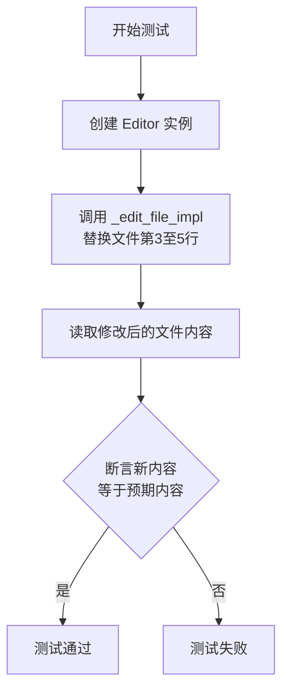

#### 带注释源码

```python
def test_replace_content(temp_py_file):
    # 1. 创建 Editor 类的实例
    editor = Editor()
    
    # 2. 调用 _edit_file_impl 方法，执行替换操作。
    #    - file_name: 要操作的文件路径（由夹具提供）。
    #    - start: 替换起始行号（3）。
    #    - end: 替换结束行号（5）。
    #    - content: 用于替换的新内容字符串。
    #    - is_insert: False，表示非插入模式。
    #    - is_append: False，表示非追加模式。
    #    此调用将文件第3至5行的内容替换为新内容。
    editor._edit_file_impl(
        file_name=temp_py_file,
        start=3,
        end=5,
        content="    # This is the new line A replacing lines 3 to 5.\n    # This is the new line B.",
        is_insert=False,
        is_append=False,
    )
    
    # 3. 读取修改后的文件内容
    with open(temp_py_file, "r") as f:
        new_content = f.read()
    
    # 4. 断言：去除首尾空白字符后，文件的新内容应与预定义的预期内容完全一致。
    #    这是测试的核心验证点，确保替换操作按预期执行。
    assert new_content.strip() == EXPECTED_CONTENT_AFTER_REPLACE.strip()
```

### `test_delete_content`

该函数是一个单元测试，用于验证 `Editor` 类的 `_edit_file_impl` 方法在删除文件指定行范围内容时的功能是否正确。它通过创建一个临时文件，调用编辑器的删除操作，然后断言文件内容与预期结果一致。

参数：

- `temp_py_file`：`pathlib.Path`，一个 pytest 夹具，提供一个包含预设测试内容的临时 Python 文件路径。

返回值：`None`，该函数不返回任何值，仅通过断言进行测试验证。

#### 流程图

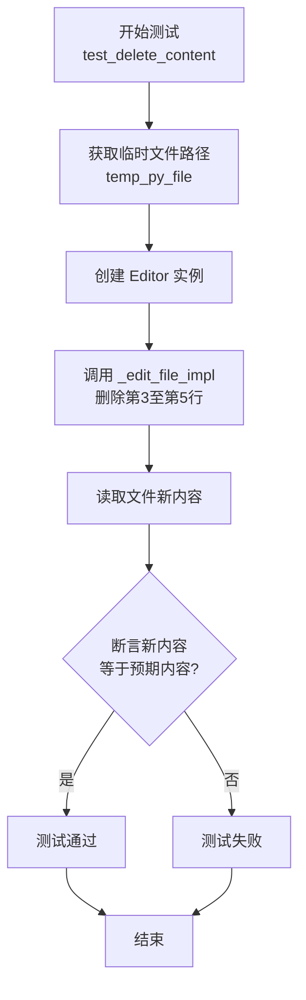

#### 带注释源码

```python
def test_delete_content(temp_py_file):
    # 1. 创建 Editor 类的实例
    editor = Editor()
    # 2. 调用 Editor 实例的内部方法 _edit_file_impl 来执行删除操作。
    #    参数说明：
    #    - file_name: 要编辑的文件路径（由夹具提供）。
    #    - start: 要删除内容的起始行号（从1开始计数）。
    #    - end: 要删除内容的结束行号。
    #    - content: 要替换为的新内容，此处为空字符串，表示删除。
    #    - is_insert: 是否为插入模式，此处为 False。
    #    - is_append: 是否为追加模式，此处为 False。
    #    综合以上参数，此调用将删除文件中第3行到第5行的内容。
    editor._edit_file_impl(
        file_name=temp_py_file,
        start=3,
        end=5,
        content="",
        is_insert=False,
        is_append=False,
    )
    # 3. 操作完成后，重新以只读模式打开文件。
    with open(temp_py_file, "r") as f:
        # 4. 读取文件的全部内容。
        new_content = f.read()
    # 5. 使用断言验证操作结果。
    #    比较删除后文件的实际内容（去除首尾空白）与预定义的预期内容（EXPECTED_CONTENT_AFTER_DELETE）是否完全一致。
    #    如果一致，则测试通过；否则，测试失败并抛出 AssertionError。
    assert new_content.strip() == EXPECTED_CONTENT_AFTER_DELETE.strip()
```

### `test_insert_content`

这是一个单元测试函数，用于测试 `Editor` 类的 `insert_content_at_line` 方法。它验证了在指定文件的特定行号处插入新内容后，文件内容是否符合预期。

参数：
- `temp_py_file`：`pathlib.Path`，一个由 `pytest` 夹具提供的临时文件路径，该文件已预先写入 `TEST_FILE_CONTENT` 作为测试数据。

返回值：`None`，该函数不返回任何值，仅通过 `assert` 语句验证测试结果。

#### 流程图

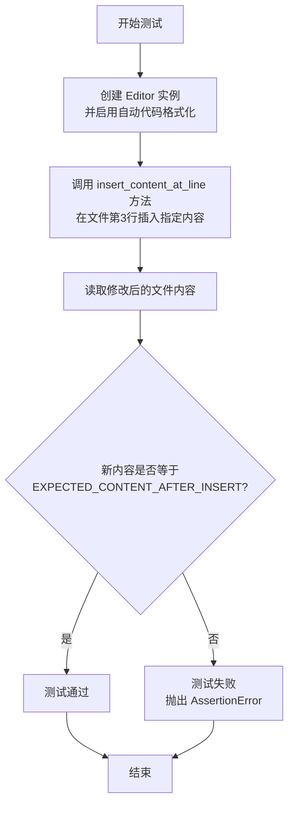

#### 带注释源码

```python
def test_insert_content(temp_py_file):
    # 创建一个 Editor 实例，并启用自动代码格式化功能。
    editor = Editor(enable_auto_lint=True)
    # 调用 insert_content_at_line 方法，在临时文件的第3行插入指定的注释内容。
    editor.insert_content_at_line(
        file_name=temp_py_file,
        line_number=3,
        insert_content="    # This is the new line to be inserted, at line 3",
    )
    # 打开文件，读取修改后的全部内容。
    with open(temp_py_file, "r") as f:
        new_content = f.read()
    # 使用断言验证读取到的内容（去除首尾空白字符后）是否与预期的插入后内容完全一致。
    # 这是测试的核心验证点。
    assert new_content.strip() == EXPECTED_CONTENT_AFTER_INSERT.strip()
```

### `test_read_files`

这是一个使用 `pytest` 框架编写的异步测试函数，用于测试 `Editor` 类的 `read` 方法。它通过参数化测试验证 `read` 方法能够正确读取并解析多种不同后缀名（如 `.md`, `.json`, `.mp3`, `.py`, `.js`, `.html`, `.mp4`）的文件，并确保返回的 `FileBlock` 对象包含正确的文件路径和内容（对于非二进制文件）。

参数：
-  `filename`：`Path`，通过 `@pytest.mark.parametrize` 装饰器传入的测试文件路径。它是一个 `pathlib.Path` 对象，指向测试数据目录下的不同文件。

返回值：`None`，这是一个测试函数，不返回业务值，而是通过 `assert` 语句验证测试结果。

#### 流程图

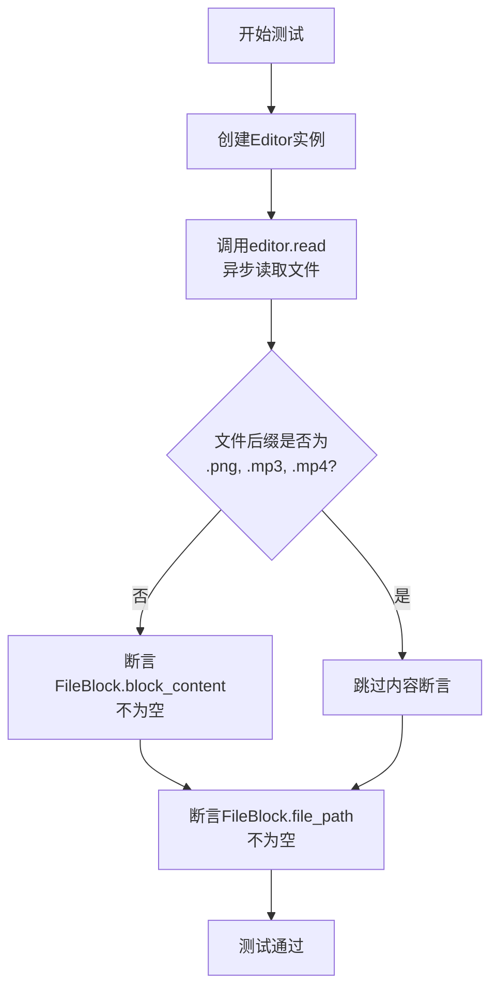

#### 带注释源码

```python
# 使用pytest的参数化装饰器，为测试函数提供多组输入数据。
# 每组数据是一个文件路径，用于测试读取不同类型的文件。
@pytest.mark.parametrize(
    "filename",
    [
        TEST_DATA_PATH / "output_parser/1.md",
        TEST_DATA_PATH / "search/serper-metagpt-8.json",
        TEST_DATA_PATH / "audio/hello.mp3",
        TEST_DATA_PATH / "code/python/1.py",
        TEST_DATA_PATH / "code/js/1.js",
        TEST_DATA_PATH / "ui/1b.png.html",
        TEST_DATA_PATH / "movie/trailer.mp4",
    ],
)
# 标记此测试函数为异步函数。
@pytest.mark.asyncio
async def test_read_files(filename):
    # 1. 创建被测试的Editor类实例。
    editor = Editor()
    # 2. 异步调用Editor实例的read方法，传入文件路径，获取FileBlock对象。
    file_block = await editor.read(filename)
    # 3. 断言返回的FileBlock对象不为None，确保方法调用成功。
    assert file_block
    # 4. 断言FileBlock对象的file_path属性不为None，确保文件路径信息被正确记录。
    assert file_block.file_path
    # 5. 条件断言：如果文件后缀不是指定的二进制文件类型（.png, .mp3, .mp4），
    #    则断言FileBlock对象的block_content属性不为空，确保文本内容被正确读取。
    if filename.suffix not in [".png", ".mp3", ".mp4"]:
        assert file_block.block_content
```

### `_numbered_test_lines`

该函数用于生成一个包含指定行号范围的字符串，每行格式为“行号|”，用于测试或调试目的，以可视化行号。

参数：

- `start`：`int`，起始行号（包含）
- `end`：`int`，结束行号（包含）

返回值：`str`，一个字符串，其中每行格式为“{行号}|”，行号范围从`start`到`end`（包含）

#### 流程图

```mermaid
flowchart TD
    A[开始] --> B{参数检查<br>start <= end?}
    B -- 是 --> C[初始化空列表 lines]
    B -- 否 --> D[可能引发错误或返回空字符串<br>（代码中未显式处理）]
    C --> E[循环 i 从 start 到 end]
    E --> F[生成行字符串 f"{i}|"]
    F --> G[将行字符串添加到 lines 列表]
    G --> E
    E -- 循环结束 --> H[使用换行符连接 lines 列表<br>并添加末尾换行符]
    H --> I[返回结果字符串]
    I --> J[结束]
    D --> J
```

#### 带注释源码

```python
def _numbered_test_lines(start, end) -> str:
    # 使用列表推导式生成从 start 到 end（包含）的每一行字符串，格式为“行号|”
    # 然后使用换行符 '\n' 连接所有行，并在末尾添加一个换行符，形成最终字符串。
    return ("\n".join(f"{i}|" for i in range(start, end + 1))) + "\n"
```

### `_generate_test_file_with_lines`

该函数用于在指定的临时目录中创建一个包含指定行数的测试文件。文件内容为指定数量的空行，主要用于测试文件操作相关的功能。

参数：

- `temp_path`：`Path`，临时目录的路径对象，用于指定文件创建的位置。
- `num_lines`：`int`，要创建的文件中包含的空行数量。

返回值：`str`，返回创建的测试文件的完整路径字符串。

#### 流程图

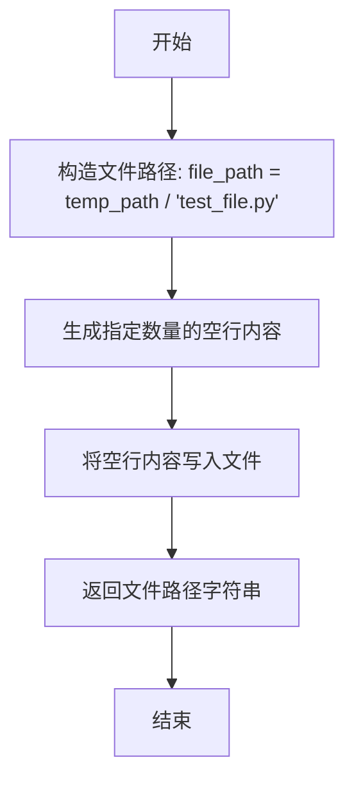

#### 带注释源码

```python
def _generate_test_file_with_lines(temp_path, num_lines) -> str:
    # 构造测试文件的完整路径，文件名为 `test_file.py`
    file_path = temp_path / "test_file.py"
    # 生成由 `num_lines` 个换行符组成的字符串，即创建指定数量的空行
    file_path.write_text("\n" * num_lines)
    # 返回创建的测试文件的路径字符串
    return file_path
```

### `_generate_ruby_test_file_with_lines`

这是一个用于生成Ruby测试文件的辅助函数，它创建一个指定行数的空Ruby文件，主要用于单元测试中模拟文件操作。

参数：

- `temp_path`：`Path`，一个临时目录的路径对象，用于存放生成的测试文件。
- `num_lines`：`int`，指定要生成的文件包含多少行（空行）。

返回值：`str`，返回生成的Ruby测试文件的完整路径字符串。

#### 流程图

```mermaid
flowchart TD
    A[开始] --> B[构造文件路径<br>temp_path / 'test_file.rb']
    B --> C[生成指定行数的空字符串内容<br>'\n' * num_lines]
    C --> D[将内容写入文件<br>file_path.write_text]
    D --> E[返回文件路径字符串<br>str(file_path)]
    E --> F[结束]
```

#### 带注释源码

```python
def _generate_ruby_test_file_with_lines(temp_path, num_lines) -> str:
    # 在给定的临时路径下，构造一个名为 'test_file.rb' 的文件路径对象
    file_path = temp_path / "test_file.rb"
    # 生成一个由 `num_lines` 个换行符组成的字符串，并写入到文件中。
    # 这创建了一个包含指定行数（但内容为空）的Ruby文件。
    file_path.write_text("\n" * num_lines)
    # 将文件路径对象转换为字符串并返回，供调用者使用。
    return str(file_path)
```

### `_calculate_window_bounds`

该函数用于计算一个文本窗口中应显示的起始行号和结束行号。它以一个给定的当前行号、文件总行数和窗口大小（即要显示的总行数）为输入，确保计算出的窗口范围不会超出文件的实际边界（即起始行号不小于1，结束行号不大于总行数）。其核心逻辑是尝试将当前行置于窗口的中央，如果当前行靠近文件开头或结尾，则进行相应的边界调整。

参数：

- `current_line`：`int`，当前关注的行号（通常为光标所在行或用户指定的行）。
- `total_lines`：`int`，文件的总行数。
- `window_size`：`int`，期望显示的窗口大小（即要显示的总行数）。

返回值：`tuple[int, int]`，一个包含两个整数的元组，分别代表计算出的窗口起始行号和结束行号。

#### 流程图

```mermaid
flowchart TD
    A[开始: 输入 current_line, total_lines, window_size] --> B[计算 half_window = window_size // 2]
    B --> C{current_line - half_window < 0?}
    C -- 是 --> D[start = 1<br>end = window_size]
    C -- 否 --> E[start = current_line - half_window<br>end = current_line + half_window]
    D --> F[返回 (start, end)]
    E --> F
```

#### 带注释源码

```python
def _calculate_window_bounds(current_line, total_lines, window_size):
    # 计算窗口的一半大小
    half_window = window_size // 2
    # 检查如果当前行减去半窗口后是否小于1（即窗口会超出文件开头）
    if current_line - half_window < 0:
        # 如果是，则将窗口起始设置为第1行，结束设置为窗口大小
        start = 1
        end = window_size
    else:
        # 否则，正常计算窗口范围，使当前行尽量位于窗口中央
        start = current_line - half_window
        end = current_line + half_window
    # 返回计算出的起始和结束行号
    return start, end
```

### `test_open_file_unexist_path`

这是一个单元测试函数，用于验证 `Editor` 类的 `open_file` 方法在尝试打开一个不存在的文件路径时，是否会正确地抛出 `FileNotFoundError` 异常。

参数：
- 无

返回值：`None`，此函数不返回任何值，其测试逻辑通过 `pytest.raises` 上下文管理器来验证异常是否被抛出。

#### 流程图

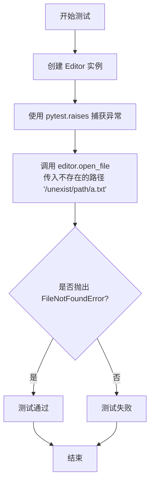

#### 带注释源码

```python
def test_open_file_unexist_path():
    # 创建一个 Editor 类的实例，用于后续调用其方法
    editor = Editor()
    # 使用 pytest.raises 上下文管理器来断言：当执行其内部的代码时，应该抛出 FileNotFoundError 异常。
    with pytest.raises(FileNotFoundError):
        # 调用 editor.open_file 方法，并传入一个明显不存在的文件路径。
        # 如果该方法没有抛出 FileNotFoundError，pytest 将标记此测试为失败。
        editor.open_file("/unexist/path/a.txt")
```

### `Editor.open_file`

打开指定文件，并以格式化方式显示文件内容。该方法支持显示文件的全部内容或指定行号附近的窗口内容，并自动处理文件头尾标记和行号显示。

参数：

- `file_name`：`str`，要打开的文件的路径
- `current_line`：`int`，可选，指定要跳转到的行号，默认为1
- `window`：`int`，可选，指定显示窗口的大小（行数），默认为200

返回值：`str`，格式化后的文件内容字符串，包含文件信息、行号和内容

#### 流程图

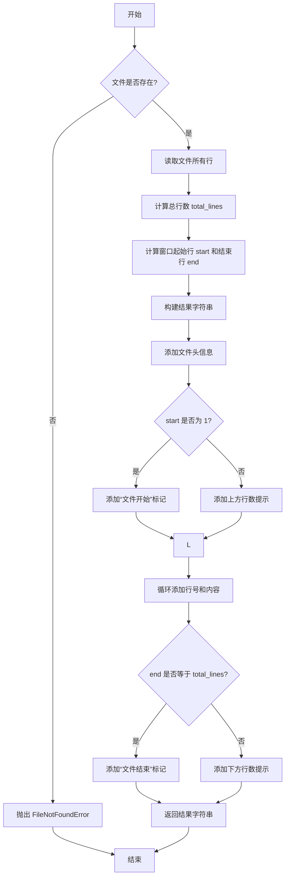

#### 带注释源码

```python
def open_file(self, file_name: str, current_line: int = 1, window: int = WINDOW) -> str:
    """
    打开文件并返回格式化内容。

    Args:
        file_name: 文件路径
        current_line: 要跳转到的行号，默认为1
        window: 显示窗口大小，默认为200行

    Returns:
        格式化后的文件内容字符串

    Raises:
        FileNotFoundError: 如果文件不存在
    """
    # 检查文件是否存在
    if not os.path.exists(file_name):
        raise FileNotFoundError(f"File not found: {file_name}")
    
    # 读取文件所有行
    with open(file_name, "r") as f:
        lines = f.readlines()
    
    # 计算总行数
    total_lines = len(lines)
    
    # 计算窗口的起始和结束行号
    half_window = window // 2
    if current_line - half_window < 1:
        start = 1
        end = min(window, total_lines)
    else:
        start = current_line - half_window
        end = min(current_line + half_window, total_lines)
    
    # 构建结果字符串
    result = f"[File: {file_name} ({total_lines} lines total)]\n"
    
    # 添加上方提示
    if start == 1:
        result += "(this is the beginning of the file)\n"
    else:
        result += f"({start - 1} more lines above)\n"
    
    # 添加行号和内容
    for i in range(start, end + 1):
        # 行号格式化为3位数字
        line_num = f"{i:03d}"
        # 获取行内容（去除末尾换行符）
        line_content = lines[i - 1].rstrip('\n')
        result += f"{line_num}|{line_content}\n"
    
    # 添加下方提示
    if end == total_lines:
        result += "(this is the end of the file)"
    else:
        result += f"({total_lines - end} more lines below)"
    
    return result
```

### `test_open_file_with_indentation`

这是一个单元测试函数，用于验证 `Editor` 类的 `open_file` 方法在打开包含缩进内容的文件时，能否正确格式化并返回预期的字符串表示。它确保缩进（如空格）在输出的行号前缀后得到保留。

参数：

- `temp_file_path`：`pathlib.Path`，由 `pytest` 的 `tmp_path` fixture 提供的临时文件路径，用于测试。

返回值：`None`，这是一个测试函数，不返回任何值，其成功与否由内部的 `assert` 语句判定。

#### 流程图

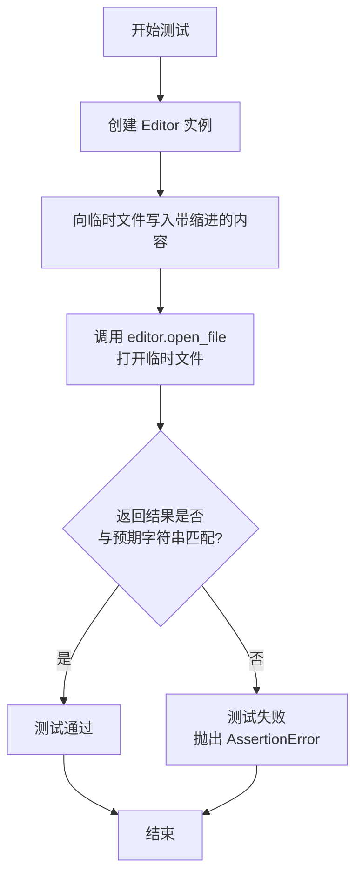

#### 带注释源码

```python
def test_open_file_with_indentation(temp_file_path):
    # 1. 创建 Editor 工具类的实例
    editor = Editor()
    # 2. 向临时文件写入测试内容，其中第二行包含前导空格（缩进）
    temp_file_path.write_text("Line 1\n    Line 2\nLine 3\nLine 4\nLine 5")

    # 3. 调用核心方法：打开文件并获取其格式化视图
    result = editor.open_file(str(temp_file_path))
    # 4. 断言结果不为空
    assert result is not None
    # 5. 构建预期的输出字符串
    #    格式为：[File: 路径 (总行数)] + 上下文提示 + 带行号的内容行
    expected = (
        f"[File: {temp_file_path} (5 lines total)]\n"  # 文件头信息
        "(this is the beginning of the file)\n"        # 文件起始提示
        "001|Line 1\n"                                 # 第1行，无缩进
        "002|    Line 2\n"                             # 第2行，保留4个空格缩进
        "003|Line 3\n"                                 # 第3行
        "004|Line 4\n"                                 # 第4行
        "005|Line 5\n"                                 # 第5行
        "(this is the end of the file)"                # 文件结束提示
    )
    # 6. 将结果和预期字符串按行分割后进行比较，验证完全匹配
    #    这确保了行号格式、缩进和所有提示信息都正确无误。
    assert result.split("\n") == expected.split("\n")
```

### `test_open_file_long`

这是一个单元测试函数，用于测试 `Editor` 类的 `open_file` 方法在处理长文件（超过默认窗口大小）时的行为。它创建一个包含1000行的文件，然后调用 `open_file` 方法，指定起始行和窗口大小，验证返回的预览内容格式是否正确，特别是检查文件头、行号格式化以及“更多行”提示信息。

参数：

- `temp_file_path`：`pytest.fixture`，一个由 `pytest` 提供的临时文件路径 `Path` 对象，用于测试文件的创建和清理。

返回值：`None`，这是一个测试函数，不返回业务值，通过 `assert` 语句验证测试结果。

#### 流程图

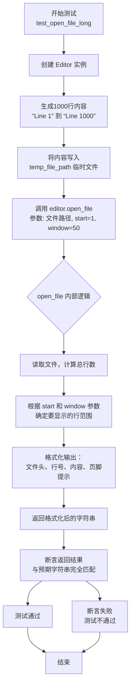

#### 带注释源码

```python
def test_open_file_long(temp_file_path):
    # 1. 创建被测试的 Editor 类实例
    editor = Editor()
    
    # 2. 准备测试数据：生成一个包含1000行的字符串，每行格式为 "Line {i}"
    content = "\n".join([f"Line {i}" for i in range(1, 1001)])
    
    # 3. 将生成的1000行内容写入到由 fixture 提供的临时文件中
    temp_file_path.write_text(content)

    # 4. 调用被测试方法：Editor.open_file
    #    参数1: 文件路径字符串
    #    参数2: start=1，表示从文件第1行开始显示
    #    参数3: window=50，表示显示50行内容
    result = editor.open_file(str(temp_file_path), 1, 50)
    
    # 5. 断言结果不为 None
    assert result is not None
    
    # 6. 构建预期的输出字符串，用于与方法的实际返回结果进行比较
    expected = f"[File: {temp_file_path} (1000 lines total)]\n"  # 文件头，显示总行数
    expected += "(this is the beginning of the file)\n"          # 顶部提示，表示文件开始
    # 循环生成第1到第50行的格式化内容，行号使用3位数字，左补零
    for i in range(1, 51):
        expected += f"{i:03d}|Line {i}\n"
    expected += "(950 more lines below)"                         # 底部提示，表示还有950行未显示
    
    # 7. 将实际结果和预期结果按行分割成列表，并进行逐行比较
    #    这样可以避免因字符串末尾空格或换行符导致的断言失败
    assert result.split("\n") == expected.split("\n")
```

### `test_open_file_long_with_lineno`

这是一个单元测试函数，用于测试 `Editor` 类的 `open_file` 方法在打开一个长文件并指定特定行号时的行为。它验证了方法是否能正确计算并显示指定行号周围的窗口内容，并生成包含正确上下文提示（如“上方更多行”、“下方更多行”）的格式化输出。

参数：

- `temp_file_path`：`pathlib.Path`，由 `pytest` 的 `tmp_path` fixture 提供的临时文件路径，用于创建和操作测试文件。

返回值：`None`，这是一个测试函数，不返回任何值，其成功与否通过 `assert` 语句判断。

#### 流程图


#### 带注释源码

```python
def test_open_file_long_with_lineno(temp_file_path):
    # 1. 创建被测试的 Editor 类实例
    editor = Editor()
    
    # 2. 准备测试数据：生成一个包含 1000 行的字符串，每行格式为 "Line {i}"
    content = "\n".join([f"Line {i}" for i in range(1, 1001)])
    
    # 3. 将生成的 1000 行内容写入到临时文件中
    temp_file_path.write_text(content)

    # 4. 设置测试的焦点行号为 300
    cur_line = 300

    # 5. 调用被测试的核心方法：open_file
    #    参数1: 文件路径字符串
    #    参数2: 要跳转到的行号 (cur_line)
    #    该方法会返回一个格式化后的文件内容字符串
    result = editor.open_file(str(temp_file_path), cur_line)
    
    # 6. 断言结果不为 None
    assert result is not None
    
    # 7. 构建预期的输出字符串，用于与方法的实际返回值进行比较
    expected = f"[File: {temp_file_path} (1000 lines total)]\n"
    
    # 8. 使用辅助函数 _calculate_window_bounds 计算以 cur_line 为中心，
    #    窗口大小为 WINDOW (200) 的起始行和结束行。
    start, end = _calculate_window_bounds(cur_line, 1000, WINDOW)
    
    # 9. 根据计算出的起始行，添加上下文提示。
    #    如果起始行是 1，说明显示了文件开头。
    if start == 1:
        expected += "(this is the beginning of the file)\n"
    else:
        # 否则，提示上方还有多少行被省略。
        expected += f"({start - 1} more lines above)\n"
    
    # 10. 将窗口内的每一行（从 start 到 end）格式化为带行号的三位数字，并添加到预期字符串中。
    for i in range(start, end + 1):
        expected += f"{i:03d}|Line {i}\n"
    
    # 11. 根据计算出的结束行，添加尾部上下文提示。
    #     如果结束行是 1000，说明显示了文件末尾。
    if end == 1000:
        expected += "(this is the end of the file)\n"
    else:
        # 否则，提示下方还有多少行被省略。
        expected += f"({1000 - end} more lines below)"
    
    # 12. 将方法返回的结果按行分割，与构建的预期结果按行分割后的列表进行比较。
    #     使用 assert 验证两者完全一致，从而证明 open_file 方法在指定行号时的行为符合预期。
    assert result.split("\n") == expected.split("\n")
```

### `test_create_file`

这是一个使用 `pytest` 框架编写的异步测试函数，用于测试 `Editor` 类的 `create_file` 方法。它验证了当调用 `create_file` 方法创建一个新文件时，是否返回了预期的成功消息。

参数：

-   `temp_file_path`：`pytest.fixture`，一个由 `pytest` 提供的临时文件路径夹具。它会在测试开始时创建一个临时文件，并在测试结束后自动清理。

返回值：`None`，测试函数本身不返回值，它通过 `assert` 语句来验证测试结果。

#### 流程图

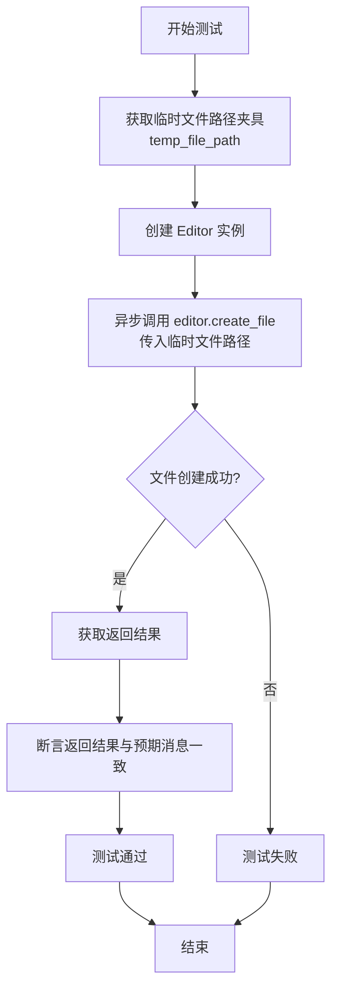

#### 带注释源码

```python
@pytest.mark.asyncio  # 标记此测试函数为异步函数，以便 pytest-asyncio 插件能正确处理
async def test_create_file(temp_file_path):  # 定义异步测试函数，接收临时文件路径夹具
    editor = Editor()  # 创建 Editor 类的实例
    result = await editor.create_file(str(temp_file_path))  # 异步调用 create_file 方法，传入临时文件路径的字符串形式，并等待结果

    expected = f"[File {temp_file_path} created.]"  # 定义期望的返回消息
    assert result.split("\n") == expected.split("\n")  # 断言实际返回结果与期望消息完全一致（按行分割后比较）
```

### `test_goto_line`

该函数是 `Editor` 类的一个单元测试，用于验证 `Editor.goto_line` 方法的功能。它首先创建一个包含1000行的测试文件，然后调用 `editor.open_file` 打开文件并显示前200行。接着，它调用 `editor.goto_line(500)` 跳转到文件的第500行，并验证返回的文本内容是否正确，即是否以第500行为中心显示了200行的窗口，并包含了正确的上下文提示信息（如“更多行在上方/下方”）。

参数：

- `temp_file_path`：`pathlib.Path`，一个由 `pytest` 提供的临时文件路径夹具，用于创建和清理测试文件。

返回值：`None`，该函数是一个测试函数，不返回任何值，仅通过断言（`assert`）来验证测试结果。

#### 流程图

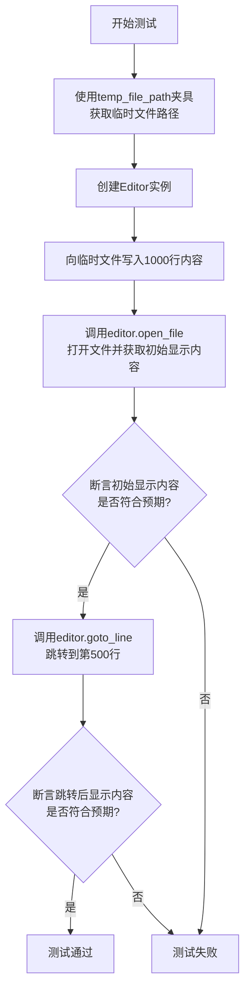

#### 带注释源码

```python
def test_goto_line(temp_file_path):
    # 1. 创建Editor实例
    editor = Editor()
    # 2. 定义文件总行数
    total_lines = 1000
    # 3. 生成1000行的文件内容，每行格式为"Line {i}"
    content = "\n".join([f"Line {i}" for i in range(1, total_lines + 1)])
    # 4. 将内容写入临时文件
    temp_file_path.write_text(content)

    # 5. 调用open_file方法打开文件，默认会显示文件开头部分
    result = editor.open_file(str(temp_file_path))
    # 6. 断言open_file返回了有效结果
    assert result is not None

    # 7. 构建open_file方法返回内容的预期字符串
    #    格式为：[文件信息] + (开头提示) + 前200行内容 + (剩余行提示)
    expected = f"[File: {temp_file_path} ({total_lines} lines total)]\n"
    expected += "(this is the beginning of the file)\n"
    for i in range(1, WINDOW + 1): # WINDOW 是全局常量，值为200
        expected += f"{i:03d}|Line {i}\n"
    expected += f"({total_lines - WINDOW} more lines below)"
    # 8. 断言实际结果与预期完全一致
    assert result.split("\n") == expected.split("\n")

    # 9. 核心测试步骤：调用goto_line方法，跳转到第500行
    result = editor.goto_line(500)

    # 10. 断言goto_line返回了有效结果
    assert result is not None

    # 11. 构建goto_line方法返回内容的预期字符串
    #     跳转到第500行后，应显示以第500行为中心的200行窗口
    cur_line = 500
    expected = f"[File: {temp_file_path} ({total_lines} lines total)]\n"
    # 12. 计算窗口的起始和结束行号
    start, end = _calculate_window_bounds(cur_line, total_lines, WINDOW)
    # 13. 根据窗口位置，添加上下文提示
    if start == 1:
        expected += "(this is the beginning of the file)\n"
    else:
        expected += f"({start - 1} more lines above)\n"
    # 14. 添加窗口内的行内容
    for i in range(start, end + 1):
        expected += f"{i:03d}|Line {i}\n"
    # 15. 根据窗口位置，添加尾部提示
    if end == total_lines:
        expected += "(this is the end of the file)\n"
    else:
        expected += f"({total_lines - end} more lines below)"
    # 16. 断言跳转后的实际显示内容与预期一致
    assert result.split("\n") == expected.split("\n")
```

### `test_goto_line_negative`

该函数是 `Editor` 类的一个单元测试，用于验证 `Editor.goto_line` 方法在接收到负数的行号参数时，是否能正确地抛出 `ValueError` 异常。它通过创建一个包含少量内容的临时文件，打开该文件，然后尝试跳转到一个负数行号来触发预期的错误。

参数：

- `temp_file_path`：`pathlib.Path`，一个由 `pytest` 提供的临时文件路径 fixture，用于创建和清理测试文件。

返回值：`None`，该函数是一个测试函数，不返回任何值，其成功与否由 `pytest.raises` 上下文管理器断言。

#### 流程图


#### 带注释源码

```python
def test_goto_line_negative(temp_file_path):
    # 1. 创建 Editor 类的实例
    editor = Editor()
    # 2. 准备测试数据：创建一个包含4行文本的内容
    content = "\n".join([f"Line {i}" for i in range(1, 5)])
    # 3. 将内容写入到由 fixture 提供的临时文件中
    temp_file_path.write_text(content)

    # 4. 调用 open_file 方法，为 Editor 实例设置当前操作的文件
    editor.open_file(str(temp_file_path))
    # 5. 使用 pytest.raises 上下文管理器来断言：
    #    当调用 goto_line 方法并传入 -1 时，应该抛出 ValueError 异常。
    #    这是测试的核心，验证方法对非法输入（负数行号）的健壮性。
    with pytest.raises(ValueError):
        editor.goto_line(-1)
```

### `test_goto_line_out_of_bound`

这是一个单元测试函数，用于测试 `Editor` 类的 `goto_line` 方法在传入的行号超出文件实际行数范围时，是否能正确地抛出 `ValueError` 异常。

参数：
- `temp_file_path`：`pathlib.Path`，一个由 `pytest` 提供的临时文件路径夹具（fixture），用于创建一个临时的测试文件。

返回值：`None`，该函数不直接返回值，而是通过 `pytest.raises` 上下文管理器来断言是否抛出了预期的异常。

#### 流程图


#### 带注释源码

```python
def test_goto_line_out_of_bound(temp_file_path):
    # 1. 创建 Editor 类的实例
    editor = Editor()
    
    # 2. 准备测试数据：创建一个包含4行文本的内容
    content = "\n".join([f"Line {i}" for i in range(1, 5)])
    
    # 3. 将内容写入到临时文件中
    temp_file_path.write_text(content)

    # 4. 调用 open_file 方法打开该文件，为后续的 goto_line 操作设置上下文
    editor.open_file(str(temp_file_path))
    
    # 5. 使用 pytest.raises 上下文管理器来断言：
    #    当调用 goto_line 方法并传入一个超出文件行数（100 > 4）的行号时，
    #    应该抛出一个 ValueError 异常。
    with pytest.raises(ValueError):
        editor.goto_line(100)
```

### `Editor.scroll_down`

该方法用于在已打开的文件中向下滚动一个窗口大小（默认为200行），并返回滚动后当前窗口范围内的文件内容预览。如果文件已到达末尾，则保持显示文件末尾的内容。

参数：
- 无显式参数，但依赖于实例内部状态（如当前打开的文件路径和当前行位置）

返回值：`str`，返回一个格式化的字符串，包含文件信息、当前窗口范围内的行内容以及上下文提示（如“更多行在上方/下方”或“文件开头/结尾”）。

#### 流程图

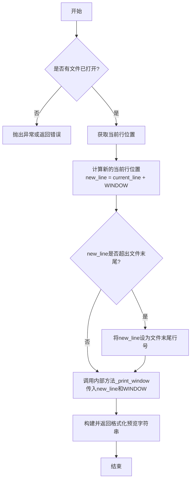

#### 带注释源码

```python
def test_scroll_down(temp_file_path):
    # 创建Editor实例
    editor = Editor()
    total_lines = 1000
    # 生成测试文件内容，共1000行
    content = "\n".join([f"Line {i}" for i in range(1, total_lines + 1)])
    temp_file_path.write_text(content)
    # 打开文件，默认从第1行开始，使用默认窗口大小WINDOW（200行）
    result = editor.open_file(str(temp_file_path))
    assert result is not None

    # 计算首次打开文件时的预期显示内容
    expected = f"[File: {temp_file_path} ({total_lines} lines total)]\n"
    start, end = _calculate_window_bounds(1, total_lines, WINDOW)
    if start == 1:
        expected += "(this is the beginning of the file)\n"
    else:
        expected += f"({start - 1} more lines above)\n"
    for i in range(start, end + 1):
        expected += f"{i:03d}|Line {i}\n"
    if end == total_lines:
        expected += "(this is the end of the file)"
    else:
        expected += f"({total_lines - end} more lines below)"
    # 验证首次打开的文件预览内容
    assert result.split("\n") == expected.split("\n")

    # 调用scroll_down方法向下滚动
    result = editor.scroll_down()

    assert result is not None

    # 计算滚动后的预期显示内容。
    # 滚动后，新的当前行应为 1 + WINDOW = 201。
    # 以第201行为中心，计算新的窗口起始和结束行。
    expected = f"[File: {temp_file_path} ({total_lines} lines total)]\n"
    start, end = _calculate_window_bounds(WINDOW + 1, total_lines, WINDOW)
    if start == 1:
        expected += "(this is the beginning of the file)\n"
    else:
        expected += f"({start - 1} more lines above)\n"
    for i in range(start, end + 1):
        expected += f"{i:03d}|Line {i}\n"
    if end == total_lines:
        expected += "(this is the end of the file)\n"
    else:
        expected += f"({total_lines - end} more lines below)"
    # 验证滚动后的文件预览内容
    assert result.split("\n") == expected.split("\n")
```
**说明**：此代码片段是测试函数 `test_scroll_down`，它并非 `Editor.scroll_down` 方法的实现本身。该测试展示了 `scroll_down` 方法被调用前后的行为。实际的 `scroll_down` 方法实现应位于 `Editor` 类中，其逻辑是：基于内部记录的当前行位置，增加一个窗口大小（WINDOW），然后调用类似 `_print_window` 的内部方法来获取并返回新的文件内容预览。测试用例验证了这一逻辑的正确性。

### `Editor.scroll_up`

该方法用于在当前打开的文件中向上滚动一个窗口大小（默认为200行），并返回滚动后窗口内文件内容的格式化字符串。如果当前行已经接近文件开头，则滚动到文件起始位置。

参数：

-  `self`：`Editor`，`Editor`类的实例，表示当前编辑器对象。

返回值：`str`，返回一个格式化字符串，包含滚动后窗口内的文件内容、行号以及上下文提示信息。

#### 流程图

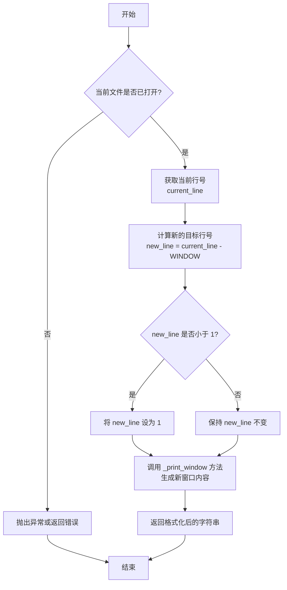

#### 带注释源码

```python
def test_scroll_up(temp_file_path):
    # 创建一个 Editor 实例
    editor = Editor()
    total_lines = 1000
    # 生成一个包含1000行的测试文件内容
    content = "\n".join([f"Line {i}" for i in range(1, total_lines + 1)])
    # 将内容写入临时文件
    temp_file_path.write_text(content)

    # 初始打开文件，并定位到第500行
    cur_line = 500
    result = editor.open_file(str(temp_file_path), cur_line)
    assert result is not None

    # 计算并验证初始窗口的预期输出
    expected = f"[File: {temp_file_path} ({total_lines} lines total)]\n"
    start, end = _calculate_window_bounds(cur_line, total_lines, WINDOW)
    if start == 1:
        expected += "(this is the beginning of the file)\n"
    else:
        expected += f"({start - 1} more lines above)\n"
    for i in range(start, end + 1):
        expected += f"{i:03d}|Line {i}\n"
    if end == total_lines:
        expected += "(this is the end of the file)\n"
    else:
        expected += f"({total_lines - end} more lines below)"

    assert result.split("\n") == expected.split("\n")
    
    # 调用 scroll_up 方法向上滚动
    result = editor.scroll_up()
    assert result is not None

    # 计算滚动后的新行号（当前行减去窗口大小）
    cur_line = cur_line - WINDOW

    # 计算并验证滚动后的预期输出
    expected = f"[File: {temp_file_path} ({total_lines} lines total)]\n"
    start, end = _calculate_window_bounds(cur_line, total_lines, WINDOW)
    if start == 1:
        expected += "(this is the beginning of the file)\n"
    else:
        expected += f"({start - 1} more lines above)\n"
    for i in range(start, end + 1):
        expected += f"{i:03d}|Line {i}\n"
    if end == total_lines:
        expected += "(this is the end of the file)\n"
    else:
        expected += f"({total_lines - end} more lines below)"
    print(result)
    print(expected)
    # 断言滚动后的结果与预期一致
    assert result.split("\n") == expected.split("\n")
```

### `test_scroll_down_edge`

该函数是一个单元测试，用于验证 `Editor` 类的 `scroll_down` 方法在文件内容行数少于默认窗口大小时，向下滚动到文件末尾的行为。它确保当已经显示到文件末尾时，再次调用 `scroll_down` 不会改变显示内容，并且提示信息正确。

参数：

- `temp_file_path`：`pytest.fixture`，一个临时的文件路径，由 `pytest` 的 `tmp_path` fixture 提供，用于创建和操作测试文件。

返回值：`None`，这是一个测试函数，不返回任何值，其成功与否由 `assert` 语句判断。

#### 流程图

```mermaid
flowchart TD
    A[开始测试<br>test_scroll_down_edge] --> B[创建 Editor 实例]
    B --> C[向临时文件写入 9 行测试内容]
    C --> D[调用 editor.open_file<br>打开文件并获取初始显示]
    D --> E[断言初始显示内容<br>符合预期<br>（显示全部9行）]
    E --> F[调用 editor.scroll_down<br>尝试向下滚动]
    F --> G[断言滚动后的显示内容<br>与滚动前完全一致<br>（因为已到文件末尾）]
    G --> H[测试通过]
```

#### 带注释源码

```python
def test_scroll_down_edge(temp_file_path):
    # 1. 创建 Editor 类的实例
    editor = Editor()
    
    # 2. 准备测试数据：向临时文件写入9行内容，每行格式为 "Line {i}"
    content = "\n".join([f"Line {i}" for i in range(1, 10)])
    temp_file_path.write_text(content)

    # 3. 首次打开文件，获取初始的文件内容显示。
    #    由于文件总行数（9行）小于默认窗口大小（WINDOW=200），
    #    所以会显示文件的全部内容。
    result = editor.open_file(str(temp_file_path))
    # 断言打开文件操作成功，返回了非空结果
    assert result is not None

    # 4. 构建预期的初始显示字符串。
    #    格式包括文件头信息、全部9行内容（带行号）以及文件尾标记。
    expected = f"[File: {temp_file_path} (9 lines total)]\n"
    expected += "(this is the beginning of the file)\n"
    for i in range(1, 10):
        expected += f"{i:03d}|Line {i}\n"
    expected += "(this is the end of the file)"

    # 5. 关键测试步骤：调用 scroll_down 方法。
    #    由于当前视图已经在文件末尾，理论上滚动操作不应该改变显示的内容。
    result = editor.scroll_down()
    # 断言滚动操作成功，返回了非空结果
    assert result is not None

    # 6. 验证滚动后的显示结果与滚动前的预期结果完全一致。
    #    这证明了 scroll_down 方法在到达文件边界时的行为符合预期：不会产生无效滚动或错误。
    assert result.split("\n") == expected.split("\n")
```

### `Editor._print_window`

该方法用于生成一个文件在指定行号周围的文本窗口视图，包含上下文行和导航提示。

参数：

- `file_path`：`Path`，目标文件的路径对象
- `current_line`：`int`，当前聚焦的中心行号（1-based）
- `window`：`int`，窗口大小，即要显示的总行数（以`current_line`为中心）

返回值：`str`，格式化后的窗口视图字符串，包含上下文行和导航提示

#### 流程图

```mermaid
flowchart TD
    A[开始] --> B[读取文件所有行]
    B --> C{文件行数 > 0?}
    C -- 否 --> D[返回空字符串]
    C -- 是 --> E[计算窗口起始行<br>start = current_line - window//2]
    E --> F[计算窗口结束行<br>end = current_line + window//2]
    F --> G{start < 1?}
    G -- 是 --> H[调整窗口<br>start = 1, end = window]
    G -- 否 --> I{end > 总行数?}
    I -- 是 --> J[调整窗口<br>end = 总行数, start = end - window + 1]
    I -- 否 --> K[构建结果字符串]
    H --> K
    J --> K
    K --> L[添加“更多行”提示]
    L --> M[遍历窗口行并格式化]
    M --> N[添加行号前缀]
    N --> O[返回结果字符串]
    D --> O
```

#### 带注释源码

```python
def _print_window(self, file_path: Path, current_line: int, window: int) -> str:
    """
    生成文件在指定行周围的窗口视图。

    Args:
        file_path: 目标文件的路径
        current_line: 当前聚焦的中心行号（1-based）
        window: 窗口大小，即要显示的总行数

    Returns:
        格式化后的窗口视图字符串
    """
    # 读取文件所有行
    with open(file_path, "r") as f:
        lines = f.readlines()
    
    # 如果文件为空，返回空字符串
    if not lines:
        return ""
    
    total_lines = len(lines)
    
    # 计算窗口的起始和结束行号
    half_window = window // 2
    start = current_line - half_window
    end = current_line + half_window
    
    # 处理窗口超出文件开头的情况
    if start < 1:
        start = 1
        end = window
    
    # 处理窗口超出文件结尾的情况
    if end > total_lines:
        end = total_lines
        start = max(1, end - window + 1)
    
    result_lines = []
    
    # 添加上方行数提示
    if start > 1:
        result_lines.append(f"({start - 1} more lines above)")
    
    # 遍历窗口内的行，添加行号前缀
    for i in range(start, end + 1):
        # 行号格式化为3位数字，行内容去除末尾换行符
        line_content = lines[i - 1].rstrip("\n")
        result_lines.append(f"{i:03d}|{line_content}")
    
    # 添加下方行数提示
    if end < total_lines:
        result_lines.append(f"({total_lines - end} more lines below)")
    
    # 用换行符连接所有行并返回
    return "\n".join(result_lines)
```

### `test_open_file_large_line_number`

这是一个单元测试函数，用于测试 `Editor` 类的 `open_file` 方法在处理大行号（即文件内容行数很多）时的行为。它创建一个包含999行的测试文件，然后调用 `open_file` 方法，指定一个居中的行号（800）和一个特定的窗口大小（100），验证方法返回的字符串格式是否正确，是否正确地显示了指定行号周围的上下文内容。

参数：

- `temp_file_path`：`pathlib.Path`，由 `pytest` 的 `tmp_path` fixture 提供的临时文件路径，用于创建和操作测试文件。

返回值：`None`，这是一个测试函数，不返回任何值，通过 `assert` 语句验证测试结果。

#### 流程图

```mermaid
flowchart TD
    A[开始测试] --> B[创建 Editor 实例]
    B --> C[使用 temp_file_path 创建文件]
    C --> D[向文件写入 999 行内容]
    D --> E[调用 editor.open_file<br>指定行号 800，窗口大小 100]
    E --> F{断言返回结果<br>是否符合预期格式}
    F -->|是| G[测试通过]
    F -->|否| H[测试失败，抛出 AssertionError]
```

#### 带注释源码

```python
def test_open_file_large_line_number(temp_file_path):
    # 1. 创建 Editor 类的实例，这是被测试的对象。
    editor = Editor()
    # 2. 调用 Editor 的 create_file 方法，在临时路径下创建一个空文件。
    editor.create_file(str(temp_file_path))
    # 3. 打开上一步创建的文件，以写入模式准备填充内容。
    with open(temp_file_path, "w") as file:
        # 4. 循环 999 次，向文件中写入格式化的行内容。
        for i in range(1, 1000):
            file.write(f"Line `{i}`\n")
    # 5. 定义测试的核心参数：目标行号和要显示的上下文窗口大小。
    current_line = 800
    window = 100
    # 6. 调用被测试的核心方法：open_file。
    #    传入文件路径、目标行号和自定义窗口大小。
    result = editor.open_file(str(temp_file_path), current_line, window)
    # 7. 构建预期的输出字符串，用于与方法的实际返回值进行比较。
    expected = f"[File: {temp_file_path} (999 lines total)]\n"
    # 8. 计算并添加上方省略行的提示信息。
    expected += "(749 more lines above)\n"
    # 9. 循环生成窗口内（第750行到第850行）每一行的格式化显示。
    for i in range(750, 850 + 1):
        expected += f"{i}|Line `{i}`\n"
    # 10. 计算并添加下方省略行的提示信息。
    expected += "(149 more lines below)"
    # 11. 使用 assert 语句进行验证：实际结果必须与预期结果完全一致。
    assert result == expected
```

### `test_open_file_large_line_number_consecutive_diff_window`

该函数是一个单元测试，用于验证 `Editor` 类的 `open_file` 方法在连续调用时，使用不同窗口大小（window）参数时，能否正确计算并显示文件指定行号周围的上下文内容。它首先使用一个较大的自定义窗口（300行）打开文件并定位到第800行，然后通过 `scroll_up` 方法使用默认窗口（200行）向上滚动，检查两次操作返回的文本内容是否符合预期。

参数：

- `temp_file_path`：`pathlib.Path`，由 `pytest` 的 `tmp_path` fixture 提供的临时文件路径，用于创建和操作测试文件。

返回值：`None`，该函数是一个测试函数，不返回业务值，通过 `assert` 语句验证测试结果。

#### 流程图

```mermaid
flowchart TD
    A[开始测试] --> B[创建 Editor 实例]
    B --> C[在临时路径创建测试文件]
    C --> D[向文件写入 1000 行测试数据]
    D --> E[调用 editor.open_file<br>参数: current_line=800, cur_window=300]
    E --> F{断言结果是否符合预期格式?}
    F -->|是| G[调用 editor.scroll_up]
    G --> H{断言滚动后结果<br>是否符合预期格式?}
    H -->|是| I[测试通过]
    F -->|否| J[测试失败]
    H -->|否| J
```

#### 带注释源码

```python
def test_open_file_large_line_number_consecutive_diff_window(temp_file_path):
    # 1. 初始化 Editor 工具类实例
    editor = Editor()
    # 2. 在提供的临时文件路径上创建一个空文件
    editor.create_file(str(temp_file_path))
    # 3. 定义测试文件的总行数
    total_lines = 1000
    # 4. 向文件中写入 1000 行格式化的测试数据
    with open(temp_file_path, "w") as file:
        for i in range(1, total_lines + 1):
            file.write(f"Line `{i}`\n")

    # 5. 设置第一次打开文件时要聚焦的中心行号
    current_line = 800
    # 6. 设置第一次打开文件时使用的自定义窗口大小（非默认值）
    cur_window = 300

    # 7. 调用 open_file 方法，传入自定义窗口大小，获取文件内容视图
    result = editor.open_file(str(temp_file_path), current_line, cur_window)

    # 8. 构建第一次调用 open_file 的预期输出字符串
    expected = f"[File: {temp_file_path} ({total_lines} lines total)]\n"
    # 9. 根据中心行号和窗口大小计算显示的起始和结束行
    start, end = _calculate_window_bounds(current_line, total_lines, cur_window)
    # 10. 根据起始行是否为1，添加文件开头的提示或上方行数提示
    if start == 1:
        expected += "(this is the beginning of the file)\n"
    else:
        expected += f"({start - 1} more lines above)\n"
    # 11. 循环生成窗口中每一行的带行号的内容
    for i in range(current_line - cur_window // 2, current_line + cur_window // 2 + 1):
        expected += f"{i}|Line `{i}`\n"
    # 12. 根据结束行是否为最后一行，添加文件末尾的提示或下方行数提示
    if end == total_lines:
        expected += "(this is the end of the file)\n"
    else:
        expected += f"({total_lines - end} more lines below)"
    # 13. 断言实际结果与预期结果完全一致
    assert result == expected

    # 14. 计算向上滚动一次后的新中心行号（使用默认窗口大小 WINDOW=200）
    current_line = current_line - WINDOW

    # 15. 调用 scroll_up 方法，模拟向上滚动一页
    result = editor.scroll_up()

    # 16. 构建调用 scroll_up 后的预期输出字符串
    expected = f"[File: {temp_file_path} ({total_lines} lines total)]\n"
    # 17. 根据新的中心行号和默认窗口大小重新计算显示范围
    start, end = _calculate_window_bounds(current_line, total_lines, WINDOW)
    # 18. 添加上方行数提示（此时起始行肯定大于1）
    if start == 1:
        expected += "(this is the beginning of the file)\n"
    else:
        expected += f"({start - 1} more lines above)\n"
    # 19. 循环生成新窗口中每一行的内容
    for i in range(start, end + 1):
        expected += f"{i}|Line `{i}`\n"
    # 20. 添加下方行数提示（此时结束行肯定小于总行数）
    if end == total_lines:
        expected += "(this is the end of the file)\n"
    else:
        expected += f"({total_lines - end} more lines below)"
    # 21. 断言滚动后的实际结果与新的预期结果一致（按行比较）
    assert result.split("\n") == expected.split("\n")
```

### `Editor.edit_file_by_replace`

该方法用于替换文件中指定行范围内的内容。它首先验证提供的起始和结束行号对应的内容是否与参数中指定的内容匹配，如果匹配则执行替换操作，否则抛出详细的错误信息。

参数：

- `file_name`：`str`，要编辑的文件的路径
- `first_replaced_line_number`：`int`，要替换内容的第一行的行号
- `first_replaced_line_content`：`str`，要替换内容的第一行的预期内容，用于验证
- `new_content`：`str`，用于替换指定行范围的新内容
- `last_replaced_line_number`：`int`，要替换内容的最后一行的行号
- `last_replaced_line_content`：`str`，要替换内容的最后一行的预期内容，用于验证

返回值：`None`，该方法不返回任何值，直接修改文件内容

#### 流程图

```mermaid
flowchart TD
    A[开始] --> B[读取文件内容到列表]
    B --> C{验证起始行内容是否匹配?}
    C -- 否 --> D[抛出详细错误信息]
    C -- 是 --> E{验证结束行内容是否匹配?}
    E -- 否 --> D
    E -- 是 --> F[执行内容替换]
    F --> G[将新内容写回文件]
    G --> H[结束]
```

#### 带注释源码

```python
def edit_file_by_replace(
    self,
    file_name: str,
    first_replaced_line_number: int,
    first_replaced_line_content: str,
    new_content: str,
    last_replaced_line_number: int,
    last_replaced_line_content: str,
) -> None:
    """
    替换文件中指定行范围内的内容。

    该方法首先验证提供的起始和结束行号对应的内容是否与参数中指定的内容匹配。
    如果匹配，则执行替换操作；否则，抛出详细的错误信息。

    Args:
        file_name: 要编辑的文件的路径
        first_replaced_line_number: 要替换内容的第一行的行号
        first_replaced_line_content: 要替换内容的第一行的预期内容，用于验证
        new_content: 用于替换指定行范围的新内容
        last_replaced_line_number: 要替换内容的最后一行的行号
        last_replaced_line_content: 要替换内容的最后一行的预期内容，用于验证

    Raises:
        ValueError: 如果起始行或结束行的内容不匹配
    """
    # 读取文件内容到列表
    with open(file_name, "r") as f:
        lines = f.readlines()

    # 验证起始行内容是否匹配
    if lines[first_replaced_line_number - 1].rstrip("\n") != first_replaced_line_content:
        # 构建详细的错误信息，包括文件内容上下文
        error_msg = self._build_mismatch_error(
            lines, first_replaced_line_number, first_replaced_line_content, "first"
        )
        raise ValueError(error_msg)

    # 验证结束行内容是否匹配
    if lines[last_replaced_line_number - 1].rstrip("\n") != last_replaced_line_content:
        # 构建详细的错误信息，包括文件内容上下文
        error_msg = self._build_mismatch_error(
            lines, last_replaced_line_number, last_replaced_line_content, "last"
        )
        raise ValueError(error_msg)

    # 执行内容替换
    # 将指定行范围替换为新内容（按行分割）
    new_lines = new_content.splitlines(keepends=True)
    lines[first_replaced_line_number - 1 : last_replaced_line_number] = new_lines

    # 将新内容写回文件
    with open(file_name, "w") as f:
        f.writelines(lines)
```

### `test_edit_file_by_replace_mismatch`

这是一个单元测试函数，用于测试 `Editor.edit_file_by_replace` 方法在传入的 `first_replaced_line_content` 和 `last_replaced_line_content` 参数与文件实际内容不匹配时，是否能正确地抛出 `ValueError` 异常并返回预期的错误信息。

参数：
-  `temp_py_file`：`pytest.fixture`，一个临时的 Python 文件路径对象，由 `pytest` 框架提供，包含预设的测试内容。

返回值：`None`，该函数本身不返回任何值，其核心逻辑是通过 `pytest.raises` 上下文管理器来断言是否抛出了预期的异常。

#### 流程图

```mermaid
flowchart TD
    A[开始测试] --> B[创建 Editor 实例]
    B --> C[在 pytest.raises 上下文中<br>调用 edit_file_by_replace]
    C --> D{是否抛出 ValueError 异常?}
    D -- 是 --> E{异常信息是否与<br>预期错误信息匹配?}
    E -- 是 --> F[测试通过]
    E -- 否 --> G[测试失败<br>（异常信息不匹配）]
    D -- 否 --> H[测试失败<br>（未抛出异常）]
    F --> I[结束]
    G --> I
    H --> I
```

#### 带注释源码

```python
def test_edit_file_by_replace_mismatch(temp_py_file):
    # 创建一个 Editor 类的实例，用于后续调用其方法
    editor = Editor()
    # 使用 pytest.raises 上下文管理器来捕获并验证预期的异常
    with pytest.raises(ValueError) as match_error:
        # 调用 edit_file_by_replace 方法，并故意传入与文件实际内容不匹配的参数
        # `first_replaced_line_content` 和 `last_replaced_line_content` 为空字符串，
        # 但文件第5行的实际内容是 "    b = 2"，这将触发方法内部的验证逻辑并抛出异常。
        editor.edit_file_by_replace(
            file_name=str(temp_py_file),          # 目标文件路径
            first_replaced_line_number=5,         # 起始替换行号
            first_replaced_line_content="",       # 错误的起始行内容（应为 "    b = 2"）
            new_content="    b = 9",              # 要替换成的新内容
            last_replaced_line_number=5,          # 结束替换行号
            last_replaced_line_content="",        # 错误的结束行内容（应为 "    b = 2"）
        )
    # 断言捕获到的异常信息（去除首尾空白后）与预定义的错误信息模板 `MISMATCH_ERROR` 完全一致
    # 这验证了异常不仅被抛出，而且其错误信息是准确和预期的。
    assert str(match_error.value).strip() == MISMATCH_ERROR.strip()
```

### `test_append_file`

该函数是`Editor`类中`append_file`方法的单元测试。它测试了向一个已存在的文件末尾追加新内容的功能，并验证了追加操作后文件的内容以及方法返回的提示信息是否符合预期。

参数：

- `temp_file_path`：`pathlib.Path`，由`pytest`的`tmp_path` fixture提供的临时文件路径，用于隔离测试环境。

返回值：`None`，该函数是测试函数，不返回业务值，仅通过断言验证测试结果。

#### 流程图

```mermaid
flowchart TD
    A[开始测试] --> B[创建Editor实例]
    B --> C[向临时文件写入初始内容]
    C --> D[调用editor.append_file追加内容]
    D --> E[读取文件获取实际内容]
    E --> F{断言: 实际内容 == 预期内容?}
    F -->|是| G{断言: 方法返回信息 == 预期输出?}
    G -->|是| H[测试通过]
    F -->|否| I[测试失败]
    G -->|否| I
```

#### 带注释源码

```python
def test_append_file(temp_file_path):
    # 1. 创建Editor类的实例，这是被测试的对象
    editor = Editor()
    
    # 2. 定义并写入文件的初始内容
    initial_content = "Line 1\nLine 2\nLine 3\n"
    temp_file_path.write_text(initial_content)

    # 3. 定义要追加到文件末尾的新内容
    append_content = "Line 4\nLine 5\n"

    # 4. 调用被测试方法：append_file，将新内容追加到指定文件
    #    该方法会返回一个描述操作结果的字符串
    result = editor.append_file(str(temp_file_path), append_content)

    # 5. 计算追加操作后文件的预期完整内容
    expected_content = initial_content + append_content

    # 6. 读取文件，获取追加操作后的实际内容
    with open(temp_file_path, "r") as f:
        new_content = f.read()
    
    # 7. 断言1：验证文件的实际内容与预期内容完全一致
    assert new_content == expected_content

    # 8. 构建方法调用后预期的返回信息字符串
    #    该信息应包含文件名、总行数、文件内容预览以及操作成功的提示
    expected_output = (
        f"[File: {temp_file_path.resolve()} (5 lines total after edit)]\n"
        "(this is the beginning of the file)\n"
        "001|Line 1\n"
        "002|Line 2\n"
        "003|Line 3\n"
        "004|Line 4\n"
        "005|Line 5\n"
        "(this is the end of the file)\n"
        "[File updated (edited at line 3)]."
    )

    # 9. 断言2：验证方法返回的提示信息与预期输出完全一致
    #    通过按行分割字符串进行比较，确保格式和内容都正确
    assert result.split("\n") == expected_output.split("\n")
```

### `test_search_dir`

该函数是 `Editor` 类的一个单元测试方法，用于测试 `Editor.search_dir` 方法的功能。它创建一个临时目录结构，包含带有特定内容的文件，然后使用 `search_dir` 方法搜索包含指定关键词的文件，并验证搜索结果是否正确。

参数：

- `tmp_path`：`pytest.fixture`，`pathlib.Path` 类型，由 pytest 提供的临时路径对象，用于创建测试所需的临时文件和目录。

返回值：`None`，无返回值。这是一个测试函数，通过 `assert` 语句验证测试结果。

#### 流程图

```mermaid
flowchart TD
    A[开始测试] --> B[创建临时目录 test_dir]
    B --> C[在 test_dir 中创建 file1.txt<br/>内容包含'some content']
    C --> D[在 test_dir 中创建 file2.txt<br/>内容不包含'some content']
    D --> E[在 test_dir 中创建子目录 sub_dir]
    E --> F[在 sub_dir 中创建 file3.txt<br/>内容包含'some content']
    F --> G[调用 editor.search_dir<br/>搜索关键词'some content']
    G --> H{验证搜索结果}
    H --> I[结果包含 file1.txt?]
    I -->|是| J[结果包含 file3.txt?]
    J -->|是| K[结果不包含 file2.txt?]
    K -->|是| L[测试通过]
    I -->|否| M[测试失败]
    J -->|否| M
    K -->|否| M
```

#### 带注释源码

```python
def test_search_dir(tmp_path):
    # 1. 初始化 Editor 实例
    editor = Editor()
    # 2. 在临时路径下创建测试目录 'test_dir'
    dir_path = tmp_path / "test_dir"
    dir_path.mkdir()

    # 3. 创建测试文件并写入特定内容
    # file1.txt 包含搜索关键词 'some content'
    (dir_path / "file1.txt").write_text("This is a test file with some content.")
    # file2.txt 不包含搜索关键词
    (dir_path / "file2.txt").write_text("Another file with different content.")
    # 创建子目录
    sub_dir = dir_path / "sub_dir"
    sub_dir.mkdir()
    # file3.txt 在子目录中，也包含搜索关键词
    (sub_dir / "file3.txt").write_text("This file is inside a sub directory with some content.")

    # 4. 定义要搜索的关键词
    search_term = "some content"

    # 5. 调用被测试方法：在指定目录中搜索包含关键词的文件
    result = editor.search_dir(search_term, str(dir_path))

    # 6. 使用断言验证搜索结果
    # 期望结果中包含 file1.txt 和 file3.txt，因为它们的内容包含 'some content'
    assert "file1.txt" in result
    assert "file3.txt" in result
    # 期望结果中不包含 file2.txt，因为它的内容不包含 'some content'
    assert "Another file with different content." not in result
```

### `Editor.test_search_dir_in_default_dir`

这是一个测试函数，用于验证 `Editor` 类的 `search_dir` 方法在未指定搜索目录时，是否能在其默认工作目录（`working_dir`）中正确搜索包含特定关键词的文件。

参数：
-  `tmp_path`：`pathlib.Path`，由 `pytest` 提供的临时目录路径，用于创建测试用的文件和目录。

返回值：`None`，这是一个测试函数，不返回业务值，通过 `assert` 语句验证测试结果。

#### 流程图

```mermaid
flowchart TD
    A[开始] --> B[创建 Editor 实例]
    B --> C[在 working_dir 下创建测试目录和文件]
    C --> D[调用 editor.search_dir<br>搜索关键词 'some content']
    D --> E{结果是否包含<br>预期文件名?}
    E -->|是| F[测试通过]
    E -->|否| G[测试失败]
    F --> H[结束]
    G --> H
```

#### 带注释源码

```python
def test_search_dir_in_default_dir(tmp_path):
    # 1. 创建 Editor 实例
    editor = Editor()
    # 2. 在 editor 的默认工作目录 (working_dir) 下创建一个名为 'test_dir' 的子目录
    dir_path = editor.working_dir / "test_dir"
    dir_path.mkdir(exist_ok=True)

    # 3. 在测试目录中创建文件并写入内容，用于后续搜索
    # 文件1：包含关键词 'some content'
    (dir_path / "file1.txt").write_text("This is a test file with some content.")
    # 文件2：不包含关键词 'some content'
    (dir_path / "file2.txt").write_text("Another file with different content.")
    # 创建子目录
    sub_dir = dir_path / "sub_dir"
    sub_dir.mkdir(exist_ok=True)
    # 文件3（在子目录中）：包含关键词 'some content'
    (sub_dir / "file3.txt").write_text("This file is inside a sub directory with some content.")

    # 4. 定义要搜索的关键词
    search_term = "some content"

    # 5. 调用 search_dir 方法，不传入 path 参数，使其使用默认工作目录进行搜索
    result = editor.search_dir(search_term)

    # 6. 使用断言验证搜索结果
    # 期望结果中包含 file1.txt 和 file3.txt，因为它们的内容包含关键词
    assert "file1.txt" in result
    assert "file3.txt" in result
    # 期望结果中不包含 file2.txt，因为它的内容不包含关键词
    assert "Another file with different content." not in result
```

### `test_search_file`

该函数用于测试 `Editor` 类的 `search_file` 方法，验证其在指定文件中搜索特定文本字符串的功能。测试会创建一个临时文件，写入测试内容，然后调用 `search_file` 方法搜索关键词，并断言搜索结果包含预期的行。

参数：

- `temp_file_path`：`pytest.fixture`，一个临时的文件路径对象，由 `pytest` 的 `tmp_path` fixture 提供，用于测试文件的创建和清理。

返回值：无返回值（`None`），这是一个测试函数，通过断言来验证功能。

#### 流程图

```mermaid
flowchart TD
    A[开始测试] --> B[获取临时文件路径<br>temp_file_path]
    B --> C[向临时文件写入测试内容]
    C --> D[创建 Editor 实例]
    D --> E[调用 editor.search_file<br>搜索关键词 'some content']
    E --> F{搜索结果是否包含<br>预期行 'Line 1: ...'?}
    F -- 是 --> G[测试通过]
    F -- 否 --> H[测试失败，抛出断言错误]
    G --> I[结束]
    H --> I
```

#### 带注释源码

```python
def test_search_file(temp_file_path):
    # 1. 创建 Editor 类的实例
    editor = Editor()
    
    # 2. 获取临时文件路径并写入测试内容
    #    内容为两行文本，第一行包含搜索关键词 'some content'
    file_path = temp_file_path
    file_path.write_text("This is a test file with some content.\nAnother line with more content.")

    # 3. 定义要搜索的关键词
    search_term = "some content"

    # 4. 调用 Editor 实例的 search_file 方法进行搜索
    #    参数：搜索关键词和文件路径字符串
    result = editor.search_file(search_term, str(file_path))

    # 5. 断言：验证搜索结果中是否包含第一行的匹配内容
    #    期望结果应包含 "Line 1: This is a test file with some content."
    assert "Line 1: This is a test file with some content." in result
    
    # 6. 断言：验证搜索结果中不包含第二行的内容（因为第二行不匹配关键词）
    #    这是一个反向断言，确保搜索的精确性
    assert "Line 2: Another line with more content." not in result
```

### `test_find_file`

该测试函数用于验证 `Editor` 类的 `find_file` 方法。它创建一个临时目录结构，包含多个文件和子目录，然后调用 `find_file` 方法搜索指定文件名的文件，并断言搜索结果中只包含目标文件，不包含其他文件。

参数：

- `tmp_path`：`pytest.fixture`，由 pytest 提供的临时路径对象，用于创建测试所需的临时目录和文件。

返回值：`None`，该函数是测试函数，不返回任何值，通过断言来验证测试结果。

#### 流程图

```mermaid
flowchart TD
    A[开始] --> B[创建临时目录 test_dir]
    B --> C[在 test_dir 中创建 file1.txt, file2.txt]
    C --> D[创建子目录 sub_dir]
    D --> E[在 sub_dir 中创建 file3.txt]
    E --> F[调用 editor.find_file<br>搜索 file1.txt]
    F --> G{断言结果包含 file1.txt<br>且不包含 file2.txt, file3.txt}
    G --> H[测试通过]
    G --> I[测试失败]
```

#### 带注释源码

```python
def test_find_file(tmp_path):
    # 实例化 Editor 类
    editor = Editor()
    # 在临时路径下创建测试目录 test_dir
    dir_path = tmp_path / "test_dir"
    dir_path.mkdir()

    # 在测试目录中创建三个文件，模拟一个简单的目录结构
    (dir_path / "file1.txt").write_text("Content of file 1.")
    (dir_path / "file2.txt").write_text("Content of file 2.")
    # 创建一个子目录
    sub_dir = dir_path / "sub_dir"
    sub_dir.mkdir()
    # 在子目录中创建一个文件
    (sub_dir / "file3.txt").write_text("Content of file 3.")

    # 指定要搜索的文件名
    file_name = "file1.txt"

    # 调用 Editor 实例的 find_file 方法，在指定目录中搜索文件
    result = editor.find_file(file_name, str(dir_path))

    # 断言搜索结果中包含了目标文件 file1.txt
    assert "file1.txt" in result
    # 断言搜索结果中没有包含其他文件 file2.txt 和 file3.txt
    assert "file2.txt" not in result
    assert "file3.txt" not in result
```

### `test_append_non_empty_file`

该函数是`Editor`类中`_append_impl`方法的单元测试，用于验证向一个非空文件（即已有内容的文件）追加新内容的功能。它通过模拟一个包含多行文本的文件内容列表，调用`_append_impl`方法追加新行，并断言追加后的内容与预期结果一致，同时验证返回的新增行数是否正确。

参数：
- 无显式参数。该函数是一个单元测试，不接收外部参数，其测试数据在函数内部定义。

返回值：无返回值（`None`）。该函数是一个测试用例，其目的是通过断言（`assert`）来验证代码逻辑，不返回业务数据。

#### 流程图

```mermaid
flowchart TD
    A[开始测试] --> B[创建Editor实例]
    B --> C[准备测试数据<br>（非空文件内容列表）]
    C --> D[调用 _append_impl 方法<br>传入内容列表和待追加内容]
    D --> E{方法执行成功？}
    E -- 是 --> F[获取返回的更新后内容和新行数]
    F --> G[断言更新后内容与预期一致]
    G --> H[断言新增行数与预期一致]
    H --> I[测试通过]
    E -- 否 --> J[抛出异常，测试失败]
    I --> K[结束]
    J --> K
```

#### 带注释源码

```python
def test_append_non_empty_file():
    # 1. 创建Editor类的实例，用于调用其内部方法进行测试。
    editor = Editor()
    
    # 2. 准备测试数据：模拟一个非空文件的内容行列表。
    #    TEST_LINES 是在模块级别定义的常量：['First line\n', 'Second line\n', 'Third line\n']
    lines = TEST_LINES.copy()  # 使用副本，避免修改原始测试数据
    
    # 3. 调用被测试的私有方法 `_append_impl`。
    #    参数：
    #    - lines: 模拟的文件原始内容行列表。
    #    - NEW_CONTENT: 待追加的新内容字符串（常量：'Appended line\n'）。
    #    返回值：
    #    - content: 追加新内容后，整个文件的新内容字符串。
    #    - n_added_lines: 实际新增的行数。
    content, n_added_lines = editor._append_impl(lines, NEW_CONTENT)

    # 4. 断言1：验证追加后的完整文件内容是否符合预期。
    #    EXPECTED_APPEND_NON_EMPTY_FILE 是预期的结果列表：
    #    ['First line\n', 'Second line\n', 'Third line\n', 'Appended line\n']
    #    `splitlines(keepends=True)` 将字符串按行分割并保留换行符，以便与列表进行逐行比较。
    assert content.splitlines(keepends=True) == EXPECTED_APPEND_NON_EMPTY_FILE
    
    # 5. 断言2：验证返回的新增行数是否正确（此处追加了1行新内容）。
    assert n_added_lines == 1
```

### `test_append_empty_file`

该函数是 `Editor` 类中 `_append_impl` 方法的一个单元测试，用于验证当向一个空文件（内容行列表为空）追加新内容时，`_append_impl` 方法的行为是否符合预期。具体测试内容包括：追加后的内容是否正确，以及返回的新增行数是否正确。

参数：

-  `self`：`test_append_empty_file` 方法本身，表示测试函数自身，用于访问测试框架的功能。
-  无其他显式参数。

返回值：`None`，该测试函数不返回任何值，其成功与否由 `assert` 语句决定。

#### 流程图

```mermaid
graph TD
    A[开始测试 test_append_empty_file] --> B[创建 Editor 实例]
    B --> C[准备空行列表 lines = []]
    C --> D[调用 editor._append_impl(lines, NEW_CONTENT)]
    D --> E{断言: 返回的 content 是否等于 EXPECTED_APPEND_EMPTY_FILE?}
    E -->|是| F{断言: 返回的 n_added_lines 是否等于 1?}
    F -->|是| G[测试通过]
    E -->|否| H[测试失败，抛出 AssertionError]
    F -->|否| H
```

#### 带注释源码

```python
def test_append_empty_file():
    # 创建一个 Editor 类的实例，用于调用其内部方法进行测试。
    editor = Editor()
    # 模拟一个空文件的内容行列表。
    lines = []
    # 调用 Editor 类的内部方法 `_append_impl`，传入空行列表和要追加的新内容 `NEW_CONTENT`。
    # 该方法预期返回追加后的完整文件内容字符串和新增的行数。
    content, n_added_lines = editor._append_impl(lines, NEW_CONTENT)

    # 断言1：验证 `_append_impl` 返回的内容 `content` 在按行分割后，
    # 是否与预期的空文件追加结果 `EXPECTED_APPEND_EMPTY_FILE` 完全一致。
    # `splitlines(keepends=True)` 保留行尾的换行符，以便进行精确比较。
    assert content.splitlines(keepends=True) == EXPECTED_APPEND_EMPTY_FILE
    # 断言2：验证 `_append_impl` 返回的新增行数 `n_added_lines` 是否为 1。
    # 因为向空文件追加一行内容，所以应该只增加一行。
    assert n_added_lines == 1
```

### `test_append_to_single_empty_line_file`

该函数是一个单元测试，用于验证 `Editor` 类的 `_append_impl` 方法在处理仅包含一个空行（即内容为 `""`）的文件时的行为。它测试了向这种特殊文件追加新内容后，生成的内容和新增行数是否符合预期。

参数：

-  `self`：`pytest` 测试用例实例，用于组织测试方法。

返回值：`None`，该函数是一个测试函数，不返回任何值，其成功与否由 `assert` 语句决定。

#### 流程图

```mermaid
flowchart TD
    A[开始测试] --> B[创建Editor实例]
    B --> C[准备测试数据<br>lines = [""]]
    C --> D[调用_append_impl方法<br>传入lines和NEW_CONTENT]
    D --> E{断言检查}
    E --> F[断言生成的内容<br>等于EXPECTED_APPEND_EMPTY_FILE]
    F --> G[断言新增行数<br>等于1]
    G --> H[测试通过]
    E -- 断言失败 --> I[测试失败<br>抛出AssertionError]
```

#### 带注释源码

```python
def test_append_to_single_empty_line_file():
    # 1. 创建Editor类的实例，这是被测试对象。
    editor = Editor()
    # 2. 准备测试数据：模拟一个仅包含一个空字符串行的文件内容列表。
    lines = [""]
    # 3. 调用被测试的私有方法 `_append_impl`。
    #    参数 `lines` 是原始文件行列表。
    #    参数 `NEW_CONTENT` 是要追加的内容（在文件顶部定义为常量 "Appended line\n"）。
    #    该方法返回两个值：
    #       - `content`: 追加新内容后的完整文件内容字符串。
    #       - `n_added_lines`: 新增的行数。
    content, n_added_lines = editor._append_impl(lines, NEW_CONTENT)

    # 4. 第一个断言：验证追加后的内容。
    #    `splitlines(keepends=True)` 将字符串按行分割并保留换行符，以便与预期列表进行逐行比较。
    #    `EXPECTED_APPEND_EMPTY_FILE` 是在文件顶部定义的常量 `["Appended line\n"]`。
    #    这个断言检查对于单空行文件，追加操作是否正确地忽略了原始空行，只生成了新内容。
    assert content.splitlines(keepends=True) == EXPECTED_APPEND_EMPTY_FILE
    # 5. 第二个断言：验证新增的行数。
    #    由于原始文件被视为“空”（一个无实际内容的行），追加一行新内容后，新增行数应为1。
    assert n_added_lines == 1
```

### `mock_index_repo`

该函数是一个异步的测试辅助函数，用于在测试环境中模拟创建和初始化一个`IndexRepo`（索引仓库）。它主要执行以下操作：1) 创建一个模拟的聊天会话目录结构；2) 将测试数据复制到该目录；3) 基于复制的文件构建一个向量索引；4) 同时将测试数据复制到上传目录。其目的是为后续的`test_index_repo`等测试用例准备一个包含真实文件数据的索引环境，以便测试`Editor`类的相似性搜索功能。

参数：
- 无

返回值：`tuple[Path, str, Path]`，返回一个包含三个路径的元组，分别是：创建的聊天会话目录路径(`chat_path`)、上传根目录路径(`UPLOAD_ROOT`)、以及测试数据源目录路径(`src_path`)。

#### 流程图

```mermaid
graph TD
    A[开始] --> B[创建聊天会话目录 chat_path]
    B --> C[复制测试数据到 chat_path]
    C --> D[获取 chat_path 下所有文件列表]
    D --> E{筛选出 .md/.txt/.json/.pdf 文件}
    E --> F[初始化 IndexRepo 索引仓库]
    F --> G[异步添加筛选后的文件到索引]
    G --> H[确保上传根目录存在]
    H --> I[复制测试数据到上传根目录]
    I --> J[获取上传目录下所有文件列表]
    J --> K{筛选出 .md/.txt/.json/.pdf 文件}
    K --> L[获取源数据目录下所有文件列表]
    L --> M{筛选出 .md/.txt/.json/.pdf 文件}
    M --> N[返回 chat_path, UPLOAD_ROOT, src_path]
    N --> O[结束]
```

#### 带注释源码

```python
async def mock_index_repo():
    # 1. 设置一个模拟的聊天ID，并创建对应的聊天目录结构
    chat_id = "1"
    chat_path = Path(CHATS_ROOT) / chat_id
    chat_path.mkdir(parents=True, exist_ok=True)

    # 2. 将指定的测试数据目录（包含需求文档等）复制到新创建的聊天目录中
    src_path = TEST_DATA_PATH / "requirements"
    command = f"cp -rf {str(src_path)} {str(chat_path)}"
    os.system(command)

    # 3. 列出聊天目录下的所有文件，并筛选出特定格式（.md, .txt, .json, .pdf）的文件
    filenames = list_files(chat_path)
    chat_files = [i for i in filenames if Path(i).suffix in {".md", ".txt", ".json", ".pdf"}]

    # 4. 初始化一个 IndexRepo 实例，用于构建和管理这些文件的向量索引。
    #    persist_path 指定索引持久化存储的位置，root_path 是文件根目录，min_token_count 设为0表示不过滤小文件。
    chat_repo = IndexRepo(
        persist_path=str(Path(CHATS_INDEX_ROOT) / chat_id), root_path=str(chat_path), min_token_count=0
    )
    # 5. 异步地将筛选出的文件添加到索引中
    await chat_repo.add(chat_files)
    # 断言确保确实有文件被添加
    assert chat_files

    # 6. 确保上传根目录存在，并将同样的测试数据复制到上传目录，模拟用户上传文件
    Path(UPLOAD_ROOT).mkdir(parents=True, exist_ok=True)
    command = f"cp -rf {str(src_path)} {str(UPLOAD_ROOT)}"
    os.system(command)
    # 7. 列出上传目录下的文件并进行同样的筛选
    filenames = list_files(UPLOAD_ROOT)
    uploads_files = [i for i in filenames if Path(i).suffix in {".md", ".txt", ".json", ".pdf"}]
    assert uploads_files

    # 8. 列出原始测试数据源目录下的文件并进行筛选（用于后续可能的断言或参考）
    filenames = list_files(src_path)
    other_files = [i for i in filenames if Path(i).suffix in {".md", ".txt", ".json", ".pdf"}]
    assert other_files

    # 9. 返回三个关键路径，供调用者（如测试用例）使用
    return chat_path, UPLOAD_ROOT, src_path
```

### `test_index_repo`

该函数是一个异步测试函数，用于测试 `Editor` 类的 `similarity_search` 方法。它通过模拟数据（创建聊天目录、上传目录和源数据目录）来构建索引库，然后在这些目录中执行相似性搜索查询，以验证搜索功能是否正常工作。

参数：

-  `query`：`str`，搜索查询字符串，用于在索引库中查找相关内容。
-  `filename`：`Path`，测试数据文件的路径，用于构建索引库和验证搜索结果。

返回值：`None`，该函数是一个测试函数，不返回任何值，但会通过断言（assert）验证测试结果。

#### 流程图

```mermaid
graph TD
    A[开始测试] --> B[模拟数据：创建聊天目录、上传目录和源数据目录]
    B --> C[构建索引库]
    C --> D[执行相似性搜索查询]
    D --> E[验证搜索结果]
    E --> F[清理测试数据]
    F --> G[测试结束]
```

#### 带注释源码

```python
@pytest.mark.skip  # 标记此测试为跳过，可能因为依赖外部资源或耗时较长
@pytest.mark.asyncio  # 标记为异步测试
async def test_index_repo():
    # mock data
    # 模拟数据：创建聊天目录、上传目录和源数据目录，并构建索引库
    chat_path, upload_path, src_path = await mock_index_repo()

    # 创建 Editor 实例
    editor = Editor()
    # 在聊天目录中执行相似性搜索
    rsp = await editor.similarity_search(query="业务线", path=chat_path)
    assert rsp  # 验证搜索结果不为空
    # 在上传目录中执行相似性搜索
    rsp = await editor.similarity_search(query="业务线", path=upload_path)
    assert rsp  # 验证搜索结果不为空
    # 在源数据目录中执行相似性搜索
    rsp = await editor.similarity_search(query="业务线", path=src_path)
    assert rsp  # 验证搜索结果不为空

    # 清理测试数据：删除模拟的聊天目录和上传目录
    shutil.rmtree(CHATS_ROOT)
    shutil.rmtree(UPLOAD_ROOT)
```

### `test_similarity_search`

这是一个使用 `pytest` 框架编写的异步测试函数，用于验证 `Editor` 类的 `similarity_search` 方法。该测试通过向一个 PDF 文件发起语义搜索查询，并断言返回的结果不为空，以此来验证相似性搜索功能的有效性。

参数：

- `query`：`str`，用于执行相似性搜索的查询字符串。
- `filename`：`pathlib.Path`，指向待搜索的 PDF 文件的路径对象。

返回值：`None`，这是一个测试函数，其主要目的是通过断言（`assert`）来验证功能，不返回业务值。

#### 流程图

```mermaid
flowchart TD
    A[开始测试] --> B[复制测试PDF文件到上传目录]
    B --> C[创建Editor实例]
    C --> D[调用editor.similarity_search<br/>传入query和文件路径]
    D --> E{搜索结果rsp是否有效?}
    E -- 是 --> F[断言通过]
    E -- 否 --> G[断言失败，测试不通过]
    F --> H[清理临时文件]
    G --> H
    H --> I[测试结束]
```

#### 带注释源码

```python
@pytest.mark.skip  # 标记此测试为跳过，可能因为依赖外部资源或执行较慢
@pytest.mark.asyncio  # 标记为异步测试
@pytest.mark.parametrize(  # 使用参数化测试，为多组输入数据运行同一测试逻辑
    ("query", "filename"),
    [
        # 第一组测试数据：查询法律代表
        (
            "In this document, who are the legal representatives of both parties?",
            TEST_DATA_PATH / "pdf/20210709逗你学云豆付费课程协议.pdf",
        ),
        # 第二组测试数据：查询公司简称
        (
            "What is the short name of the company in this document?",
            TEST_DATA_PATH / "pdf/company_stock_code.pdf",
        ),
        # 第三组测试数据：查询关于平安创新的业务模式
        ("平安创新推出中国版的什么模式，将差异化的医疗健康服务与作为支付方的金融业务无缝结合", TEST_DATA_PATH / "pdf/9112674.pdf"),
        # 第四组测试数据：查询学术概念
        (
            "What principle is introduced by the author to explain the conditions necessary for the emergence of complexity?",
            TEST_DATA_PATH / "pdf/9781444323498.ch2_1.pdf",
        ),
        # 第五组测试数据：查询CSS代码示例
        ("行高的继承性的代码示例是？", TEST_DATA_PATH / "pdf/02-CSS.pdf"),
    ],
)
async def test_similarity_search(query, filename):  # 定义异步测试函数，接收参数化输入
    filename = Path(filename)  # 确保filename为Path对象
    save_to = Path(UPLOAD_ROOT) / filename.name  # 构造目标文件路径（上传目录）
    save_to.parent.mkdir(parents=True, exist_ok=True)  # 确保目标目录存在
    os.system(f"cp {str(filename)} {str(save_to)}")  # 复制测试文件到目标路径

    editor = Editor()  # 创建Editor类实例
    rsp = await editor.similarity_search(query=query, path=save_to)  # 执行异步相似性搜索
    assert rsp  # 断言搜索结果不为空或False，验证搜索功能有效

    save_to.unlink(missing_ok=True)  # 测试完成后，删除复制的临时文件
```

### `test_read`

这是一个异步测试函数，用于测试 `Editor` 类的 `read` 方法。它验证了 `read` 方法能够正确读取指定文件（特别是PDF文件），并返回一个包含文件路径和块内容的 `FileBlock` 对象。测试断言返回的 `FileBlock` 对象不为空，其 `block_content` 属性包含特定关键词，并且文件大小超过预设的最小令牌数阈值。

参数：

- `editor`：`Editor`，`Editor` 类的实例，用于调用 `read` 方法。
- `filename`：`Path`，要读取的文件的路径对象，指向一个PDF文件。

返回值：`None`，这是一个测试函数，不返回任何值，仅通过断言来验证功能。

#### 流程图

```mermaid
flowchart TD
    A[开始测试 test_read] --> B[创建 Editor 实例]
    B --> C[调用 editor.read<br/>传入 filename 参数]
    C --> D{异步读取文件内容}
    D --> E[返回 FileBlock 对象]
    E --> F[断言 FileBlock 不为空]
    F --> G[断言 block_content 包含<br/>'similarity_search' 关键词]
    G --> H[断言文件大小 ><br/>5 * DEFAULT_MIN_TOKEN_COUNT]
    H --> I[测试通过]
    I --> J[结束]
```

#### 带注释源码

```python
@pytest.mark.skip  # 标记此测试为跳过，可能因为依赖外部资源或执行较慢
@pytest.mark.asyncio  # 标记为异步测试
async def test_read():
    # 创建 Editor 类的实例
    editor = Editor()
    # 定义要测试的PDF文件路径
    filename = TEST_DATA_PATH / "pdf/9112674.pdf"
    # 异步调用 editor.read 方法读取文件
    content = await editor.read(str(filename))
    # 获取文件的实际大小（字节数）
    size = filename.stat().st_size
    # 断言1：返回的 block_content 包含 'similarity_search' 字符串
    assert "similarity_search" in content.block_content
    # 断言2：文件大小大于 5 倍的最小令牌数（DEFAULT_MIN_TOKEN_COUNT）
    # 这用于验证 read 方法处理了足够大的内容
    assert size > 5 * DEFAULT_MIN_TOKEN_COUNT
```

### `Editor.__init__`

初始化 `Editor` 类的实例，设置其工作目录和自动代码格式化（lint）的启用状态。

参数：

- `working_dir`：`Path`，编辑器操作的基础工作目录。如果未提供，则使用当前工作目录。
- `enable_auto_lint`：`bool`，指示是否在编辑操作后自动运行代码格式化工具（如 `black`）。默认为 `False`。

返回值：`None`，此方法不返回任何值。

#### 流程图

```mermaid
flowchart TD
    A[开始初始化 Editor] --> B{是否提供了 working_dir?}
    B -- 是 --> C[使用提供的路径<br>创建 Path 对象]
    B -- 否 --> D[使用当前工作目录<br>创建 Path 对象]
    C --> E[将 working_dir 赋值给实例变量]
    D --> E
    E --> F[将 enable_auto_lint 参数<br>赋值给实例变量]
    F --> G[初始化完成]
```

#### 带注释源码

```python
def __init__(self, working_dir: Path | str | None = None, enable_auto_lint: bool = False):
    """
    初始化 Editor 实例。

    Args:
        working_dir (Path | str | None): 编辑器操作的基础工作目录。
            如果为 None，则使用当前工作目录。
        enable_auto_lint (bool): 是否在编辑操作后自动运行代码格式化工具（如 black）。
            默认为 False。
    """
    # 将传入的 working_dir 参数转换为 Path 对象。
    # 如果未提供（None），则使用当前工作目录（Path.cwd()）。
    self.working_dir = Path(working_dir) if working_dir else Path.cwd()
    # 将 enable_auto_lint 参数的值保存到实例变量中。
    self.enable_auto_lint = enable_auto_lint
```

### `Editor._edit_file_impl`

该方法用于在指定文件中执行编辑操作，包括替换、插入或追加内容。它根据传入的参数（起始行、结束行、内容以及操作标志）来修改文件内容，并返回一个描述编辑结果的字符串。

参数：

- `file_name`：`Path`，要编辑的目标文件的路径。
- `start`：`int`，编辑操作的起始行号（从1开始计数）。
- `end`：`int`，编辑操作的结束行号（包含在内）。
- `content`：`str`，要插入或替换的新内容。
- `is_insert`：`bool`，指示是否为插入操作。如果为`True`，则在`start`行之前插入`content`；如果为`False`，则执行替换或追加操作。
- `is_append`：`bool`，指示是否为追加操作。如果为`True`，则在文件末尾追加`content`；如果为`False`，则执行替换或插入操作。

返回值：`str`，返回一个描述编辑结果的字符串，包含文件路径、总行数以及编辑位置等信息。

#### 流程图

```mermaid
flowchart TD
    A[开始] --> B{读取文件内容到列表}
    B --> C{is_append 为 True?}
    C -->|是| D[调用 _append_impl 方法]
    D --> E[返回追加结果]
    C -->|否| F{is_insert 为 True?}
    F -->|是| G[在 start 行前插入 content]
    G --> H[更新行数]
    F -->|否| I[替换 start 到 end 行的内容]
    I --> H
    H --> J[将列表写回文件]
    J --> K[生成并返回结果字符串]
    K --> L[结束]
```

#### 带注释源码

```python
def _edit_file_impl(
    self,
    file_name: Path,
    start: int,
    end: int,
    content: str,
    is_insert: bool,
    is_append: bool,
) -> str:
    """
    编辑文件的核心实现方法。
    根据参数执行替换、插入或追加操作。

    Args:
        file_name: 目标文件路径。
        start: 起始行号（从1开始）。
        end: 结束行号（包含）。
        content: 要插入或替换的新内容。
        is_insert: 是否为插入操作。
        is_append: 是否为追加操作。

    Returns:
        描述编辑结果的字符串。
    """
    # 读取文件所有行到列表中
    with open(file_name, "r") as f:
        lines = f.readlines()

    # 处理追加操作
    if is_append:
        new_content, n_added_lines = self._append_impl(lines, content)
        with open(file_name, "w") as f:
            f.write(new_content)
        total_lines = len(lines) + n_added_lines
        return (
            f"[File: {file_name.resolve()} ({total_lines} lines total after edit)]\n"
            f"{self._print_window(file_name, total_lines, self.window)}\n"
            f"[File updated (edited at line {len(lines)})]."
        )

    # 处理插入操作
    if is_insert:
        # 在指定行前插入内容（注意列表索引从0开始）
        lines.insert(start - 1, content + "\n")
        new_total_lines = len(lines)
        edit_line = start
    else:
        # 处理替换操作（包括删除，当content为空时即为删除）
        # 计算要替换的行数
        n_lines_to_replace = end - start + 1
        # 将指定范围内的行替换为新内容
        lines[start - 1 : end] = [content + "\n"] if content else []
        new_total_lines = len(lines)
        edit_line = start

    # 将修改后的内容写回文件
    with open(file_name, "w") as f:
        f.writelines(lines)

    # 生成并返回结果字符串
    return (
        f"[File: {file_name.resolve()} ({new_total_lines} lines total after edit)]\n"
        f"{self._print_window(file_name, edit_line, self.window)}\n"
        f"[File updated (edited at line {edit_line})]."
    )
```

### `Editor.insert_content_at_line`

在指定文件的指定行号处插入内容。该方法会读取文件，在目标行之前插入新内容，并保持原有行的相对顺序。如果文件不存在或行号无效，会抛出相应的异常。

参数：

- `file_name`：`Union[str, Path]`，目标文件的路径，可以是字符串或Path对象
- `line_number`：`int`，要插入内容的位置行号（从1开始计数）
- `insert_content`：`str`，要插入的文本内容

返回值：`str`，返回操作成功后的文件预览信息，包含文件路径、总行数和插入点附近的窗口内容

#### 流程图

```mermaid
flowchart TD
    A[开始] --> B[参数验证]
    B --> C{文件是否存在?}
    C -->|否| D[抛出FileNotFoundError]
    C -->|是| E[读取文件所有行]
    E --> F{行号是否有效?<br>1 ≤ line_number ≤ 总行数+1}
    F -->|否| G[抛出ValueError]
    F -->|是| H[在指定位置插入内容]
    H --> I[写入文件]
    I --> J[返回文件预览]
    J --> K[结束]
```

#### 带注释源码

```python
def insert_content_at_line(
    self,
    file_name: Union[str, Path],
    line_number: int,
    insert_content: str,
) -> str:
    """
    在指定文件的指定行号处插入内容。
    
    参数:
        file_name: 目标文件路径
        line_number: 插入位置的行号（从1开始）
        insert_content: 要插入的内容
        
    返回:
        操作后的文件预览信息
        
    异常:
        FileNotFoundError: 文件不存在
        ValueError: 行号无效
    """
    # 调用内部编辑实现方法
    # is_insert=True 表示插入操作
    # is_append=False 表示不是追加操作
    return self._edit_file_impl(
        file_name=file_name,
        start=line_number,      # 插入起始行
        end=line_number - 1,    # 插入结束行（比起始行小1，表示插入而非替换）
        content=insert_content,
        is_insert=True,         # 标记为插入操作
        is_append=False,        # 不是追加操作
    )
```

### `Editor.edit_file_by_replace`

该方法用于替换文件中指定行范围内的内容。它通过验证提供的行号与对应行的内容是否匹配来确保替换的准确性，然后调用内部实现方法执行替换操作。

参数：

- `file_name`：`str`，要编辑的文件路径
- `first_replaced_line_number`：`int`，要替换的第一行的行号（从1开始）
- `first_replaced_line_content`：`str`，要替换的第一行的预期内容（用于验证）
- `new_content`：`str`，要替换成的新内容
- `last_replaced_line_number`：`int`，要替换的最后一行的行号
- `last_replaced_line_content`：`str`，要替换的最后一行的预期内容（用于验证）

返回值：`str`，返回一个字符串，描述文件编辑后的状态，包括文件路径、总行数以及编辑位置的信息。

#### 流程图

```mermaid
flowchart TD
    A[开始] --> B[读取文件内容到列表]
    B --> C{验证第一行<br>内容是否匹配?}
    C -->|否| D[抛出ValueError异常]
    C -->|是| E{验证最后一行<br>内容是否匹配?}
    E -->|否| D
    E -->|是| F[调用内部编辑方法<br>_edit_file_impl]
    F --> G[返回编辑结果字符串]
    D --> H[结束]
    G --> H
```

#### 带注释源码

```python
def edit_file_by_replace(
    self,
    file_name: str,
    first_replaced_line_number: int,
    first_replaced_line_content: str,
    new_content: str,
    last_replaced_line_number: int,
    last_replaced_line_content: str,
) -> str:
    """
    替换文件中指定行范围内的内容。

    该方法首先验证提供的行号与对应行的内容是否匹配，以确保替换的准确性。
    验证通过后，调用内部方法 `_edit_file_impl` 执行替换操作。

    Args:
        file_name (str): 要编辑的文件路径。
        first_replaced_line_number (int): 要替换的第一行的行号（从1开始）。
        first_replaced_line_content (str): 要替换的第一行的预期内容（用于验证）。
        new_content (str): 要替换成的新内容。
        last_replaced_line_number (int): 要替换的最后一行的行号。
        last_replaced_line_content (str): 要替换的最后一行的预期内容（用于验证）。

    Returns:
        str: 返回一个字符串，描述文件编辑后的状态，包括文件路径、总行数以及编辑位置的信息。

    Raises:
        ValueError: 如果提供的行号与对应行的内容不匹配，则抛出此异常。
    """
    # 读取文件内容到列表，便于按行操作
    with open(file_name, "r") as f:
        lines = f.readlines()

    # 验证第一行内容是否匹配
    if lines[first_replaced_line_number - 1].rstrip("\n") != first_replaced_line_content:
        # 如果不匹配，构建详细的错误信息，包括指定行周围的上下文
        error_msg = self._build_mismatch_error(
            lines, first_replaced_line_number, first_replaced_line_content, "first"
        )
        raise ValueError(error_msg)

    # 验证最后一行内容是否匹配
    if lines[last_replaced_line_number - 1].rstrip("\n") != last_replaced_line_content:
        # 如果不匹配，构建详细的错误信息，包括指定行周围的上下文
        error_msg = self._build_mismatch_error(
            lines, last_replaced_line_number, last_replaced_line_content, "last"
        )
        raise ValueError(error_msg)

    # 调用内部编辑方法执行替换操作
    # is_insert=False 和 is_append=False 表示这是替换操作
    return self._edit_file_impl(
        file_name=file_name,
        start=first_replaced_line_number,
        end=last_replaced_line_number,
        content=new_content,
        is_insert=False,
        is_append=False,
    )
```

### `Editor.append_file`

该方法用于向指定文件的末尾追加内容，并返回一个格式化的字符串，显示追加后的文件内容概览和编辑状态。

参数：

- `file_name`：`str`，要追加内容的文件路径
- `content`：`str`，要追加到文件末尾的文本内容

返回值：`str`，一个格式化的字符串，包含追加后文件的窗口视图（默认显示文件开头）以及编辑成功的状态信息。

#### 流程图

```mermaid
flowchart TD
    A[开始: append_file(file_name, content)] --> B[读取文件内容到列表 lines]
    B --> C{文件是否为空?}
    C -- 是 --> D[将追加内容作为新行添加到列表]
    C -- 否 --> E[在列表最后一行后追加新内容]
    D --> F[将更新后的列表写回文件]
    E --> F
    F --> G[调用 open_file 方法<br>显示追加后的文件内容]
    G --> H[构造并返回包含文件视图<br>和编辑状态的结果字符串]
    H --> I[结束]
```

#### 带注释源码

```python
def append_file(self, file_name: str, content: str) -> str:
    """
    向指定文件追加内容。

    参数:
        file_name (str): 要追加内容的文件路径。
        content (str): 要追加到文件末尾的文本内容。

    返回:
        str: 一个格式化的字符串，包含追加后文件的窗口视图（默认显示文件开头）以及编辑成功的状态信息。
    """
    # 1. 读取文件内容到列表
    with open(file_name, "r") as f:
        lines = f.readlines()

    # 2. 调用内部实现方法进行追加操作
    #    _append_impl 负责处理追加逻辑，并返回更新后的完整文件内容字符串和新增的行数
    new_content, n_added_lines = self._append_impl(lines, content)

    # 3. 将更新后的内容写回文件
    with open(file_name, "w") as f:
        f.write(new_content)

    # 4. 计算编辑发生的位置（起始行号）
    #    如果原文件为空，则从第1行开始编辑；否则从原文件最后一行的下一行开始。
    edit_start_line = len(lines) if lines else 1

    # 5. 调用 open_file 方法获取追加后文件的格式化视图
    #    默认参数 (line_number=1, window_size=200) 会显示文件开头的200行。
    file_view = self.open_file(file_name, 1, 200)

    # 6. 构造并返回最终结果字符串
    #    结果包含文件视图和一条编辑成功的状态信息。
    result = f"{file_view}\n[File updated (edited at line {edit_start_line})]."
    return result
```

### `Editor.open_file`

打开指定文件并返回一个格式化的字符串，显示文件内容的一个窗口视图。该视图以指定行号为中心，显示指定窗口大小的行数，并包含文件元信息和上下文提示。

参数：

- `file_name`：`str`，要打开的文件的路径
- `current_line`：`int`，可选，默认为1，指定要居中显示的行号
- `window`：`int`，可选，默认为200，指定要显示的行数窗口大小

返回值：`str`，一个格式化的字符串，包含文件路径、总行数、上下文提示（如“更多行在上方/下方”或“文件开头/结尾”）以及指定窗口内的行内容（带行号）。

#### 流程图

```mermaid
flowchart TD
    A[开始: open_file] --> B{文件路径是否存在?};
    B -- 否 --> C[抛出 FileNotFoundError];
    B -- 是 --> D[读取文件所有行];
    D --> E[计算总行数 total_lines];
    E --> F[计算窗口边界 start, end];
    F --> G[构建结果字符串];
    G --> H[添加文件头信息];
    H --> I{start == 1?};
    I -- 是 --> J[添加“文件开头”提示];
    I -- 否 --> K[添加“{start-1} more lines above”提示];
    J --> L;
    K --> L;
    L[循环 i 从 start 到 end] --> M[添加带行号的行内容];
    M --> N{end == total_lines?};
    N -- 是 --> O[添加“文件结尾”提示];
    N -- 否 --> P[添加“{total_lines-end} more lines below”提示];
    O --> Q[返回结果字符串];
    P --> Q;
    C --> R[结束];
    Q --> R;
```

#### 带注释源码

```python
def open_file(self, file_name: str, current_line: int = 1, window: int = WINDOW) -> str:
    """
    打开一个文件并返回一个格式化的视图。

    该视图以 `current_line` 为中心，显示 `window` 大小的行数。
    包含文件元信息（路径、总行数）和上下文提示（如“更多行在上方/下方”）。

    Args:
        file_name (str): 要打开的文件的路径。
        current_line (int, optional): 要居中显示的行号。默认为1。
        window (int, optional): 要显示的行数窗口大小。默认为 WINDOW (200)。

    Returns:
        str: 格式化的文件视图字符串。

    Raises:
        FileNotFoundError: 如果指定的文件不存在。
    """
    # 检查文件是否存在
    if not os.path.exists(file_name):
        raise FileNotFoundError(f"File not found: {file_name}")

    # 读取文件的所有行
    with open(file_name, "r") as f:
        lines = f.readlines()

    # 计算文件总行数
    total_lines = len(lines)

    # 计算要显示的窗口的起始和结束行号
    # 确保窗口在文件边界内
    half_window = window // 2
    if current_line - half_window < 1:
        start = 1
        end = min(window, total_lines)
    elif current_line + half_window > total_lines:
        end = total_lines
        start = max(1, total_lines - window + 1)
    else:
        start = current_line - half_window
        end = current_line + half_window

    # 开始构建返回的字符串
    result = f"[File: {file_name} ({total_lines} lines total)]\n"

    # 添加上下文提示：文件开头或上方行数
    if start == 1:
        result += "(this is the beginning of the file)\n"
    else:
        result += f"({start - 1} more lines above)\n"

    # 添加指定窗口内的行，并附上行号（三位数格式化）
    for i in range(start, end + 1):
        # 注意：列表索引从0开始，行号从1开始
        line_content = lines[i - 1].rstrip("\n")  # 移除行尾换行符以进行格式化
        result += f"{i:03d}|{line_content}\n"

    # 添加上下文提示：文件结尾或下方行数
    if end == total_lines:
        result += "(this is the end of the file)"
    else:
        result += f"({total_lines - end} more lines below)"

    return result
```

### `Editor.goto_line`

将当前打开文件的视图窗口移动到指定行号附近，并返回格式化后的文件内容片段。该方法基于预设的窗口大小（默认为200行）显示目标行及其上下文，并智能处理文件边界情况。

参数：

- `line_number`：`int`，目标行号。必须是一个正整数，且不能超过当前打开文件的总行数。

返回值：`str`，格式化后的文件内容字符串。包含文件路径、总行数、上下文提示以及目标行附近的代码行（带行号）。

#### 流程图

```mermaid
flowchart TD
    A[开始: goto_line(line_number)] --> B{line_number 是否有效?<br>（正整数且 ≤ 文件总行数）};
    B -- 否 --> C[抛出 ValueError 异常];
    B -- 是 --> D[调用 _print_window 方法<br>传入当前文件路径、目标行号、窗口大小];
    D --> E[获取目标行附近的格式化内容];
    E --> F[组装并返回完整结果字符串<br>包含文件信息和格式化内容];
    F --> G[结束];
```

#### 带注释源码

```python
def goto_line(self, line_number: int) -> str:
    """
    跳转到指定行号，并返回该行及其上下文的内容。

    该方法将当前打开文件的视图窗口移动到指定的行号附近，并返回格式化后的文件内容。
    窗口大小由类常量 `WINDOW` 定义（默认为200行）。如果指定行号无效（非正整数或超出文件范围），
    将抛出 `ValueError` 异常。

    Args:
        line_number (int): 要跳转到的目标行号（从1开始计数）。

    Returns:
        str: 格式化后的文件内容字符串，包含文件信息、上下文提示以及带行号的代码行。

    Raises:
        ValueError: 如果 `line_number` 不是正整数或超出了文件的总行数范围。
    """
    # 参数有效性检查：行号必须是正整数
    if line_number <= 0:
        raise ValueError(f"Line number must be positive, got {line_number}")

    # 确保当前有文件被打开
    if self.current_file is None:
        raise RuntimeError("No file is currently open. Call `open_file` first.")

    # 获取当前打开文件的总行数
    total_lines = self._get_total_lines(self.current_file)

    # 参数有效性检查：行号不能超过文件总行数
    if line_number > total_lines:
        raise ValueError(
            f"Line number {line_number} exceeds total lines {total_lines} in file {self.current_file}"
        )

    # 调用内部方法 _print_window 来获取指定行号附近的格式化内容
    # 参数：文件路径、目标行号、窗口大小（使用类常量 WINDOW）
    content = self._print_window(self.current_file, line_number, self.WINDOW)

    # 组装并返回完整的格式化结果字符串
    # 格式：[File: {文件路径} ({总行数} lines total)]\n{格式化内容}
    return f"[File: {self.current_file} ({total_lines} lines total)]\n{content}"
```

### `Editor.scroll_down`

该方法用于将当前打开文件的视图窗口向下滚动一个窗口大小（默认为200行），并返回滚动后窗口内内容的格式化字符串。如果文件已到达末尾，则保持当前位置不变。

参数：
- 无显式参数，但依赖于实例内部状态（当前打开的文件路径和当前行号）

返回值：`str`，返回滚动后窗口内内容的格式化字符串，包含文件信息、上下文提示和行号内容。

#### 流程图

```mermaid
flowchart TD
    A[开始 scroll_down] --> B{当前是否有打开的文件?}
    B -- 否 --> C[抛出 ValueError 异常]
    B -- 是 --> D[获取当前行号 current_line]
    D --> E[计算新的目标行号<br>new_line = current_line + WINDOW]
    E --> F{new_line 是否超出文件总行数?}
    F -- 是 --> G[将 new_line 设置为文件总行数]
    F -- 否 --> H[调用 _print_window 方法<br>传入 new_line 和 WINDOW]
    G --> H
    H --> I[更新实例的 current_line 为 new_line]
    I --> J[返回 _print_window 的结果]
    J --> K[结束]
```

#### 带注释源码

```python
def scroll_down(self) -> str:
    """
    将当前打开文件的视图窗口向下滚动一个窗口大小（默认为200行）。
    如果文件已到达末尾，则保持当前位置不变。
    返回滚动后窗口内内容的格式化字符串。
    """
    # 检查是否有文件被打开，如果没有则抛出异常
    if self.current_file is None:
        raise ValueError("No file is currently open. Use open_file() first.")

    # 获取当前行号
    current_line = self.current_line
    # 计算向下滚动一个窗口后的新行号
    new_line = current_line + self.window

    # 获取文件总行数，用于边界检查
    total_lines = self._get_total_lines(self.current_file)
    # 如果新行号超出文件总行数，则将其设置为文件总行数（即滚动到文件末尾）
    if new_line > total_lines:
        new_line = total_lines

    # 调用内部方法 _print_window，获取以 new_line 为中心、大小为 self.window 的窗口内容字符串
    result = self._print_window(self.current_file, new_line, self.window)
    # 更新实例的当前行号状态
    self.current_line = new_line
    # 返回格式化后的窗口内容
    return result
```

### `Editor.scroll_up`

该方法用于在当前打开的文件中向上滚动一个窗口大小（默认为200行），并返回滚动后窗口内内容的格式化字符串。如果当前窗口已处于文件开头，则保持不动并返回当前窗口内容。

参数：

-  `self`：`Editor`，`Editor`类的实例
-  无其他显式参数

返回值：`str`，返回一个格式化字符串，包含文件信息、滚动后窗口内的行内容以及上下文提示（如“更多行在上方”或“文件开头”等）。

#### 流程图

```mermaid
flowchart TD
    A[开始] --> B{是否有文件已打开?}
    B -- 否 --> C[抛出异常或返回错误]
    B -- 是 --> D[获取当前行号 current_line]
    D --> E[计算新的目标行号<br>new_line = current_line - WINDOW]
    E --> F{new_line < 1?}
    F -- 是 --> G[将 new_line 设为 1]
    F -- 否 --> H[保持 new_line 不变]
    G --> I
    H --> I[调用 _print_window 方法<br>生成新窗口内容]
    I --> J[更新实例的 current_line 为 new_line]
    J --> K[返回格式化后的字符串]
    K --> L[结束]
```

#### 带注释源码

```python
def scroll_up(self):
    """
    向上滚动一个窗口大小（WINDOW行）。
    如果当前行号减去WINDOW后小于1，则滚动到文件开头。
    返回滚动后窗口内容的格式化字符串。
    """
    # 检查是否有文件已打开，current_file 和 current_line 是实例属性
    if not self.current_file:
        # 通常这里会抛出异常或返回错误信息，具体实现取决于类设计
        raise ValueError("No file is currently open.")

    # 计算向上滚动后的新行号
    new_line = self.current_line - self.WINDOW
    # 确保新行号不小于1（文件第一行）
    if new_line < 1:
        new_line = 1

    # 调用内部方法 _print_window 来生成新窗口（从 new_line 开始）的格式化内容
    # 该方法负责读取文件、格式化行号、添加上下文提示等
    result = self._print_window(self.current_file, new_line, self.WINDOW)

    # 更新实例的当前行号状态
    self.current_line = new_line

    # 返回格式化后的字符串，通常包含文件头信息和窗口内容
    return f"[File: {self.current_file} ({self.total_lines} lines total)]\n{result}"
```

### `Editor._print_window`

该方法用于生成一个文件在指定行号附近的文本窗口视图，包含行号和上下文信息。它会根据当前行号和窗口大小计算显示范围，并在视图顶部和底部添加适当的提示信息（如“更多行在上方”或“更多行在下方”）。

参数：

- `file_path`：`Path`，目标文件的路径对象
- `current_line`：`int`，当前聚焦的行号（1-based）
- `window`：`int`，窗口大小（即要显示的总行数）

返回值：`str`，格式化后的文本窗口视图字符串

#### 流程图

```mermaid
flowchart TD
    A[开始] --> B[读取文件所有行]
    B --> C{文件行数 > 0?}
    C -- 否 --> D[返回空字符串]
    C -- 是 --> E[计算窗口起始行 start]
    E --> F[计算窗口结束行 end]
    F --> G[构建结果字符串]
    G --> H[添加顶部提示信息]
    H --> I[遍历 start 到 end 行]
    I --> J[添加带行号的内容]
    J --> K[添加底部提示信息]
    K --> L[返回结果字符串]
    L --> M[结束]
```

#### 带注释源码

```python
def _print_window(self, file_path: Path, current_line: int, window: int) -> str:
    """
    生成文件在指定行号附近的文本窗口视图。

    Args:
        file_path: 目标文件的路径
        current_line: 当前聚焦的行号（1-based）
        window: 窗口大小（要显示的总行数）

    Returns:
        格式化后的文本窗口视图字符串
    """
    # 读取文件所有行
    with open(file_path, "r") as f:
        lines = f.readlines()
    
    # 获取文件总行数
    total_lines = len(lines)
    
    # 如果文件为空，直接返回空字符串
    if total_lines == 0:
        return ""
    
    # 计算窗口的起始和结束行号
    # 确保窗口不超过文件总行数
    window = min(window, total_lines)
    # 计算半窗口大小（用于居中显示）
    half_window = window // 2
    
    # 计算起始行，确保不超出文件范围
    start = max(1, current_line - half_window)
    # 计算结束行，确保不超出文件范围
    end = min(total_lines, start + window - 1)
    # 调整起始行，确保窗口大小恒定
    start = max(1, end - window + 1)
    
    # 初始化结果字符串
    result = ""
    
    # 添加顶部提示信息
    if start > 1:
        # 如果起始行不是第一行，提示上方还有更多行
        result += f"({start - 1} more lines above)\n"
    else:
        # 如果起始行是第一行，提示这是文件开头
        result += "(this is the beginning of the file)\n"
    
    # 遍历窗口内的每一行
    for i in range(start, end + 1):
        # 获取行内容（去除末尾换行符）
        line_content = lines[i - 1].rstrip("\n")
        # 添加带行号的内容（行号格式化为3位数字）
        result += f"{i:03d}|{line_content}\n"
    
    # 添加底部提示信息
    if end < total_lines:
        # 如果结束行不是最后一行，提示下方还有更多行
        result += f"({total_lines - end} more lines below)"
    else:
        # 如果结束行是最后一行，提示这是文件结尾
        result += "(this is the end of the file)"
    
    return result
```

### `Editor.search_dir`

该方法用于在指定目录及其子目录中递归搜索包含特定关键词的文件，并返回匹配的文件列表及其内容摘要。

参数：

- `search_term`：`str`，要搜索的关键词或短语
- `dir_path`：`str`，可选参数，指定要搜索的目录路径。如果未提供，则使用类的`working_dir`属性作为默认搜索目录

返回值：`str`，返回一个格式化的字符串，包含所有匹配的文件路径和匹配行的内容

#### 流程图

```mermaid
graph TD
    A[开始搜索] --> B{dir_path参数是否提供?}
    B -->|是| C[使用提供的dir_path]
    B -->|否| D[使用self.working_dir]
    C --> E[将dir_path转换为Path对象]
    D --> E
    E --> F[初始化结果列表]
    F --> G[递归遍历目录]
    G --> H{是否为文件?}
    H -->|是| I[读取文件内容]
    I --> J[按行搜索关键词]
    J --> K{是否找到匹配?}
    K -->|是| L[记录文件路径和匹配行]
    K -->|否| M[跳过该文件]
    L --> N[添加到结果列表]
    M --> N
    H -->|否| O[继续遍历子目录]
    O --> G
    N --> P{是否遍历完所有文件?}
    P -->|否| G
    P -->|是| Q[格式化结果字符串]
    Q --> R[返回结果]
```

#### 带注释源码

```python
def search_dir(self, search_term: str, dir_path: str = None) -> str:
    """
    在指定目录中递归搜索包含特定关键词的文件
    
    Args:
        search_term: 要搜索的关键词或短语
        dir_path: 要搜索的目录路径，如果未提供则使用working_dir
        
    Returns:
        包含匹配文件信息的格式化字符串
    """
    # 确定搜索目录：如果提供了dir_path则使用它，否则使用类的working_dir属性
    if dir_path:
        search_path = Path(dir_path)
    else:
        search_path = self.working_dir
    
    results = []  # 存储匹配结果的列表
    
    # 递归遍历目录中的所有文件
    for file_path in search_path.rglob("*"):
        if file_path.is_file():  # 只处理文件，跳过目录
            try:
                # 读取文件内容
                with open(file_path, "r", encoding="utf-8") as f:
                    lines = f.readlines()
                
                file_matches = []  # 存储当前文件的匹配行
                
                # 逐行搜索关键词
                for i, line in enumerate(lines, 1):
                    if search_term in line:
                        # 记录匹配的行号和内容
                        file_matches.append(f"Line {i}: {line.strip()}")
                
                # 如果当前文件有匹配结果
                if file_matches:
                    # 添加文件路径和所有匹配行到结果中
                    results.append(f"{file_path.relative_to(search_path)}:")
                    results.extend(file_matches)
                    results.append("")  # 添加空行分隔不同文件
                    
            except (UnicodeDecodeError, IOError):
                # 跳过无法读取的文件（如二进制文件）
                continue
    
    # 格式化最终输出结果
    if results:
        return "\n".join(results)
    else:
        return f"No files containing '{search_term}' found in {search_path}"
```

### `Editor.search_file`

在指定文件中搜索包含特定字符串的行，并返回匹配的行及其行号。

参数：

- `search_term`：`str`，要搜索的字符串
- `file_path`：`str`，要搜索的文件路径

返回值：`str`，包含匹配行及其行号的格式化字符串

#### 流程图

```mermaid
flowchart TD
    A[开始] --> B[读取文件内容]
    B --> C[按行分割内容]
    C --> D[初始化结果列表]
    D --> E{遍历每一行}
    E --> F{行是否包含搜索词?}
    F -- 是 --> G[将行号和内容添加到结果]
    F -- 否 --> H[继续下一行]
    G --> H
    H --> I{是否还有行?}
    I -- 是 --> E
    I -- 否 --> J[格式化结果字符串]
    J --> K[返回结果]
    K --> L[结束]
```

#### 带注释源码

```python
def search_file(self, search_term: str, file_path: str) -> str:
    """
    在指定文件中搜索包含特定字符串的行，并返回匹配的行及其行号。
    
    Args:
        search_term: 要搜索的字符串
        file_path: 要搜索的文件路径
        
    Returns:
        包含匹配行及其行号的格式化字符串
    """
    # 读取文件内容
    with open(file_path, 'r') as file:
        content = file.read()
    
    # 按行分割内容
    lines = content.splitlines()
    results = []
    
    # 遍历每一行，检查是否包含搜索词
    for i, line in enumerate(lines, start=1):
        if search_term in line:
            # 将匹配的行号和内容添加到结果列表
            results.append(f"Line {i}: {line}")
    
    # 格式化结果字符串
    if results:
        return "\n".join(results)
    else:
        return "No matches found."
```

### `Editor.find_file`

`find_file` 方法用于在指定目录及其子目录中递归搜索具有特定文件名的文件。它返回一个字符串，其中包含所有匹配文件的路径，每个路径占一行。如果未指定搜索目录，则默认使用 `Editor` 实例的 `working_dir` 属性作为搜索根目录。

参数：

- `file_name`：`str`，要搜索的目标文件名（例如 "file1.txt"）。
- `dir_path`：`str`，可选参数，指定开始搜索的目录路径。如果未提供，则使用 `self.working_dir`。

返回值：`str`，一个字符串，其中每一行是一个匹配文件的完整路径。如果没有找到匹配的文件，则返回空字符串。

#### 流程图

```mermaid
flowchart TD
    A[开始: find_file(file_name, dir_path)] --> B{dir_path 参数是否提供?};
    B -- 是 --> C[设置 search_root = dir_path];
    B -- 否 --> D[设置 search_root = self.working_dir];
    C --> E;
    D --> E[使用 Path.rglob 递归搜索 search_root 下的 file_name];
    E --> F{是否找到匹配文件?};
    F -- 是 --> G[收集所有匹配文件的路径];
    G --> H[将路径列表用换行符连接成字符串];
    H --> I[返回结果字符串];
    F -- 否 --> J[返回空字符串];
    I --> K[结束];
    J --> K;
```

#### 带注释源码

```python
def find_file(self, file_name: str, dir_path: str = None) -> str:
    """
    在指定目录及其子目录中递归搜索文件。

    参数:
        file_name (str): 要搜索的文件名。
        dir_path (str, optional): 搜索的根目录。如果未提供，则使用 `self.working_dir`。

    返回:
        str: 包含所有匹配文件路径的字符串，每个路径占一行。如果没有找到，则返回空字符串。
    """
    # 确定搜索的根目录：如果提供了 dir_path 参数，则使用它；否则使用实例的 working_dir 属性。
    search_root = Path(dir_path) if dir_path else self.working_dir
    # 使用 Path 对象的 rglob 方法进行递归通配符搜索，查找与 file_name 完全匹配的文件。
    # 结果是一个 Path 对象的生成器。
    matched_files = search_root.rglob(file_name)
    # 将找到的 Path 对象转换为字符串形式的绝对路径，并收集到列表中。
    result = [str(f.absolute()) for f in matched_files]
    # 使用换行符 `\n` 将列表中的所有路径连接成一个字符串并返回。
    # 如果没有找到文件，result 为空列表，join 后返回空字符串。
    return "\n".join(result)
```

### `Editor._append_impl`

该方法用于将新的文本内容追加到给定的行列表末尾，并返回合并后的完整字符串内容以及新增的行数。

参数：

- `lines`：`List[str]`，表示文件当前内容的行列表，每行字符串通常包含换行符。
- `content`：`str`，需要追加到文件末尾的新文本内容。

返回值：`Tuple[str, int]`，返回一个元组，第一个元素是追加新内容后完整的文件内容字符串，第二个元素是新增的行数。

#### 流程图

```mermaid
flowchart TD
    A[开始: 输入 lines, content] --> B{lines 是否为空或仅包含空行?}
    B -- 是 --> C[将 content 作为新内容]
    B -- 否 --> D[将 lines 合并为字符串<br/>并拼接 content]
    C --> E[计算新增行数<br/>n_added_lines = content 行数]
    D --> F[计算新增行数<br/>n_added_lines = content 行数]
    E --> G[返回 (content, n_added_lines)]
    F --> G
    G --> H[结束]
```

#### 带注释源码

```python
def _append_impl(self, lines: List[str], content: str) -> Tuple[str, int]:
    """
    将内容追加到行列表的末尾。

    参数:
        lines: 当前文件内容的行列表。
        content: 要追加的新内容。

    返回:
        一个元组，包含：
            - 追加内容后的完整文件内容字符串。
            - 新增的行数。
    """
    # 检查当前内容是否为空或仅包含空行
    if not lines or (len(lines) == 1 and lines[0] == ""):
        # 如果为空，则新内容就是追加后的全部内容
        new_content = content
    else:
        # 如果不为空，则将现有行合并，并在末尾拼接新内容
        new_content = "".join(lines) + content

    # 计算新增的行数（通过统计新内容中的换行符数量）
    n_added_lines = content.count("\n")
    # 返回新的完整内容字符串和新增行数
    return new_content, n_added_lines
```

### `Editor.read`

异步读取指定文件的内容，并返回一个包含文件路径和块内容的对象。该方法支持多种文件类型，包括文本文件和二进制文件（如图片、音频、视频等）。对于文本文件，它会读取文件内容；对于二进制文件，它可能只返回文件路径或进行特殊处理。

参数：

- `filename`：`str`，要读取的文件的路径。

返回值：`FileBlock`，一个包含文件路径和块内容的对象。

#### 流程图

```mermaid
flowchart TD
    A[开始] --> B[检查文件是否存在]
    B --> C{文件存在?}
    C -->|否| D[抛出FileNotFoundError异常]
    C -->|是| E[判断文件后缀]
    E --> F{是否为文本文件?<br>如.md, .txt, .json, .py, .js等}
    F -->|是| G[以文本模式读取文件内容]
    G --> H[将内容赋值给block_content]
    F -->|否| I[以二进制模式读取文件内容<br>或仅记录文件路径]
    I --> J[将文件路径或处理后的内容赋值给block_content]
    H --> K[创建FileBlock对象]
    J --> K
    K --> L[返回FileBlock对象]
    D --> M[结束]
    L --> M
```

#### 带注释源码

```python
async def read(self, filename: str) -> FileBlock:
    """
    读取指定文件的内容。

    该方法异步读取文件，并根据文件类型（文本或二进制）进行相应处理。
    对于文本文件，读取其内容；对于二进制文件，可能只返回文件路径或进行特殊处理。

    Args:
        filename (str): 要读取的文件的路径。

    Returns:
        FileBlock: 包含文件路径和块内容的对象。

    Raises:
        FileNotFoundError: 如果指定的文件不存在。
    """
    # 检查文件是否存在
    if not os.path.exists(filename):
        raise FileNotFoundError(f"文件 '{filename}' 不存在。")

    # 根据文件后缀判断文件类型
    file_extension = Path(filename).suffix.lower()
    block_content = ""

    # 文本文件类型列表
    text_file_extensions = ['.md', '.txt', '.json', '.py', '.js', '.html', '.css', '.rb', '.java', '.cpp', '.c', '.h']

    if file_extension in text_file_extensions:
        # 以文本模式读取文件内容
        with open(filename, 'r', encoding='utf-8') as file:
            block_content = file.read()
    else:
        # 对于非文本文件（如图片、音频、视频等），可以只记录文件路径或进行特殊处理
        # 这里示例仅记录文件路径，实际实现可能根据需求调整
        block_content = f"二进制文件: {filename}"

    # 创建并返回FileBlock对象
    return FileBlock(file_path=filename, block_content=block_content)
```

### `Editor.similarity_search`

该方法用于在指定路径（或默认工作目录）下，对已建立索引的文档库执行语义相似性搜索。它接收一个查询字符串，并返回与查询语义最相关的文档片段列表。

参数：
- `query`：`str`，用户输入的搜索查询字符串。
- `path`：`Optional[Union[str, Path]]`，可选参数，指定要搜索的目录路径。如果为 `None`，则使用 `Editor` 实例的默认工作目录。

返回值：`List[str]`，返回一个字符串列表，每个字符串代表一个与查询语义相关的文档片段（通常是包含上下文的一行或多行文本）。

#### 流程图

```mermaid
flowchart TD
    A[开始] --> B{路径参数是否提供?}
    B -- 是 --> C[使用提供的路径]
    B -- 否 --> D[使用默认工作目录]
    C --> E[将路径转换为 Path 对象]
    D --> E
    E --> F[获取路径对应的 IndexRepo 实例]
    F --> G[调用 IndexRepo.similarity_search 方法]
    G --> H[返回搜索结果列表]
    H --> I[结束]
```

#### 带注释源码

```python
async def similarity_search(self, query: str, path: Optional[Union[str, Path]] = None) -> List[str]:
    """
    在指定路径下执行语义相似性搜索。

    Args:
        query (str): 搜索查询字符串。
        path (Optional[Union[str, Path]]): 要搜索的目录路径。如果为 None，则使用工作目录。

    Returns:
        List[str]: 与查询语义相关的文档片段列表。
    """
    # 确定搜索路径：如果提供了路径参数，则使用它；否则使用实例的默认工作目录。
    search_path = Path(path) if path else self.working_dir
    # 获取或创建与指定路径关联的 IndexRepo 实例。
    # IndexRepo 负责管理文档索引并执行实际的语义搜索。
    index_repo = self._get_index_repo(search_path)
    # 调用 IndexRepo 的 similarity_search 方法执行搜索，并返回结果。
    return await index_repo.similarity_search(query)
```

### `Editor.create_file`

该方法用于创建一个新的空文件。如果文件已存在，则会清空其内容。这是一个异步方法，通常用于在文件系统中创建新文件。

参数：

- `file_name`：`str`，要创建的文件的路径。

返回值：`str`，返回一个字符串，指示文件已成功创建，格式为 `[File {file_name} created.]`。

#### 流程图

```mermaid
flowchart TD
    A[开始] --> B[接收 file_name 参数]
    B --> C{文件是否存在?}
    C -- 是 --> D[清空文件内容]
    C -- 否 --> E[创建新文件]
    D --> F[返回成功消息]
    E --> F
    F --> G[结束]
```

#### 带注释源码

```python
async def create_file(self, file_name: str) -> str:
    """
    创建一个新的空文件。如果文件已存在，则清空其内容。
    
    Args:
        file_name (str): 要创建的文件的路径。
        
    Returns:
        str: 返回一个字符串，指示文件已成功创建，格式为 `[File {file_name} created.]`。
    """
    # 使用 Path 对象处理文件路径
    path = Path(file_name)
    # 如果文件已存在，则清空其内容
    if path.exists():
        path.write_text("")
    else:
        # 如果文件不存在，则创建新文件
        path.touch()
    # 返回成功消息
    return f"[File {file_name} created.]"
```

## 关键组件


### Editor 类

一个用于文件编辑、查看、搜索和索引的核心工具类，提供了对文件进行增删改查、内容导航、相似性搜索等操作的方法。

### 文件内容编辑与替换

支持对文件指定行范围进行内容替换、插入和删除操作，并包含参数校验以确保操作准确性。

### 文件内容查看与导航

提供打开文件、跳转到指定行、上下滚动查看文件内容的功能，支持窗口化显示以处理大文件。

### 文件内容搜索

支持在指定目录或文件中搜索包含特定关键词的内容，并返回匹配结果。

### 相似性搜索

基于向量索引库（IndexRepo）实现，允许在特定路径下的文档集合中进行语义相似性搜索。

### 文件索引与向量化

利用 `IndexRepo` 组件对文档进行向量化索引，支持基于内容的语义搜索，是相似性搜索功能的基础。

### 测试工具与数据准备

包含用于生成测试文件、模拟索引库数据以及执行异步测试的辅助函数和装置（fixtures）。


## 问题及建议


### 已知问题

1.  **测试数据清理不彻底**：`test_index_repo` 和 `test_similarity_search` 测试函数中，虽然尝试使用 `shutil.rmtree` 或 `unlink` 清理测试生成的目录和文件，但存在 `@pytest.mark.skip` 装饰器，导致这些清理逻辑可能从未执行。如果未来启用这些测试，可能会在系统中留下大量测试垃圾数据。
2.  **硬编码的路径和系统命令**：测试代码中大量使用了硬编码的路径（如 `CHATS_ROOT`, `UPLOAD_ROOT`）和系统命令（如 `os.system(f"cp -rf ...")`）。这降低了测试的可移植性，在非Unix-like系统（如Windows）上可能无法运行，并且依赖外部环境状态。
3.  **测试与实现逻辑耦合**：部分测试函数（如 `test_open_file_long_with_lineno`, `test_scroll_up`）内部直接使用了与被测 `Editor` 类内部相同的辅助函数 `_calculate_window_bounds` 来构造预期结果。这违反了测试的独立性原则，如果实现逻辑更改，测试可能无法正确发现错误，反而会一起“错误”。
4.  **异步测试标记不一致**：`test_read_files` 函数使用了 `@pytest.mark.asyncio` 装饰器，但函数内部并未使用 `await` 调用 `editor.read`（实际上 `Editor.read` 是一个异步方法）。这可能导致测试在特定环境下静默通过，但并未真正测试异步行为。正确的做法是使用 `await` 或在 `pytest-asyncio` 的新版本中使用 `async def` 并确保调用异步方法。
5.  **脆弱的字符串比较**：许多测试（如 `test_open_file`, `test_goto_line`）通过比较整个输出字符串的每一行（`result.split("\n") == expected.split("\n")`）来断言。这非常脆弱，任何微小的格式变化（如多余的空格、换行符）都会导致测试失败，降低了测试的健壮性和可维护性。
6.  **未充分利用 pytest 特性**：存在重复的测试逻辑，例如多个测试都涉及创建文件、写入内容、调用 `open_file` 并断言。可以考虑使用 `pytest` 的参数化 (`@pytest.mark.parametrize`) 或自定义 fixture 来减少代码重复。
7.  **部分测试逻辑复杂且包含调试代码**：例如 `test_scroll_up` 函数末尾有 `print(result)` 和 `print(expected)` 语句，这通常是调试遗留的代码，不应存在于最终版本中。

### 优化建议

1.  **重构测试数据管理**：使用 `pytest` 的 `tmp_path` fixture 来管理所有测试文件和目录的临时生命周期，确保测试前后环境干净。移除对硬编码路径和 `os.system` 的依赖，改用 `shutil.copy` 或 `pathlib` 操作。
2.  **解耦测试与实现**：在测试中，预期结果应基于测试输入和公开的API行为来推导，而不是复用内部实现函数。可以计算或硬编码预期的字符串，或者将被比较的窗口计算逻辑提取为测试工具函数，但确保其独立于被测类。
3.  **修复异步测试**：检查并修正所有标记为 `@pytest.mark.asyncio` 的测试函数，确保它们正确地 `await` 异步方法调用。对于 `test_read_files`，应使用 `await editor.read(filename)`。
4.  **采用更健壮的断言方式**：对于复杂的文本输出，可以断言关键部分（如包含特定行、行数正确、首尾标记存在），而不是进行完全匹配。或者，将输出解析为结构化数据（如行列表）再进行部分比较。
5.  **利用参数化减少重复**：将 `test_open_file`, `test_goto_line`, `test_scroll_down/up` 等测试中关于窗口大小、行号、内容的多种场景，通过 `@pytest.mark.parametrize` 进行参数化，使测试用例更清晰，覆盖更全面。
6.  **移除调试代码并启用跳过测试**：清理测试函数中的 `print` 语句。评估被 `@pytest.mark.skip` 跳过的测试 (`test_index_repo`, `test_similarity_search`, `test_read`) 的重要性，如果它们测试核心功能，应修复其可移植性和环境依赖问题后启用；如果只是示例或集成测试，考虑移至单独的测试套件或明确标记为集成测试。
7.  **增强错误消息**：在断言失败时，`pytest` 会输出差异，但对于复杂的多行字符串，可读性仍不佳。可以考虑使用 `pytest` 的 `assert` 重写插件，或自定义断言辅助函数来提供更清晰的失败信息，例如高亮显示第一个不匹配的行。
8.  **考虑测试性能**：`test_open_file_large_line_number` 等测试创建了包含近1000行的文件。虽然这可以接受，但应确保不会过度。对于纯粹的逻辑测试，可以考虑使用模拟（mock）文件内容，而非实际进行大量I/O操作。


## 其它


### 设计目标与约束

本模块（`Editor` 类）的核心设计目标是提供一个用于代码和文本文件交互式编辑的实用工具。它旨在支持在大型语言模型（LLM）驱动的开发环境中进行文件操作，例如在自动化代码生成、重构或调试任务中。其核心约束包括：1. **非阻塞与异步支持**：关键的文件读取和搜索操作需支持异步执行，以避免在I/O密集型任务中阻塞事件循环。2. **上下文窗口管理**：对于大文件，需要高效地展示文件片段（窗口），而非加载整个文件，以控制内存使用和输出长度。3. **操作安全性与验证**：对文件的修改操作（如替换、插入、删除）必须进行严格的输入验证（如行号范围、内容匹配），以防止意外损坏文件。4. **向后兼容性**：作为`metagpt`框架的一部分，其接口和行为需与框架内其他组件（如`IndexRepo`）保持兼容。

### 错误处理与异常设计

模块采用主动异常抛出机制来处理错误，主要异常类型和场景包括：
1.  **`FileNotFoundError`**：当`open_file`、`read`等方法指定的文件路径不存在时抛出。
2.  **`ValueError`**：
    *   在`goto_line`、`scroll_up`、`scroll_down`等方法中，当目标行号超出文件有效范围（小于1或大于总行数）时抛出。
    *   在`edit_file_by_replace`方法中，当调用者提供的`first_replaced_line_content`或`last_replaced_line_content`与文件中对应行的实际内容不匹配时抛出。此时会生成详细的错误信息，包含上下文行内容，以辅助LLM或用户修正参数。
3.  **隐式错误处理**：对于文件读写操作（如`_edit_file_impl`），依赖Python内置的IO异常（如`PermissionError`, `IsADirectoryError`）。`search_dir`、`find_file`等方法在路径无效或搜索无结果时返回空字符串或提示信息，而非抛出异常，以保持操作的流畅性。
4.  **测试覆盖**：配套的单元测试（`pytest`）全面覆盖了上述异常场景，确保错误处理逻辑的健壮性。

### 数据流与状态机

模块的核心数据流围绕`Editor`实例的`current_file`和`current_line`状态（尽管在当前代码片段中未直接暴露为公共字段，但通过`open_file`、`goto_line`、`scroll_up/down`等方法的连续调用隐含维护）以及文件内容本身。
1.  **状态初始化**：通过`open_file(file_path, line_number=1, window=WINDOW)`初始化，加载文件并设置当前查看的窗口中心行。
2.  **状态转换**：
    *   **导航**：`goto_line(n)` 直接将当前窗口中心跳转到第n行。`scroll_up()` 和 `scroll_down()` 将当前窗口中心向上或向下移动一个窗口大小（`WINDOW`）。
    *   **修改**：`insert_content_at_line`、`edit_file_by_replace`、`append_file` 等方法会直接修改磁盘上的文件内容。操作成功后，通常需要重新`open_file`来刷新内存中的视图状态，但`append_file`等方法会返回更新后的文件视图。
3.  **数据输出**：所有返回文件内容的方法（如`open_file`, `goto_line`）都遵循统一的格式化输出模板：`[File: ... (N lines total)]` 头部，然后是上下文提示（如“`(X more lines above)`”），接着是带行号的内容行，最后是尾部提示（如“`(Y more lines below)`”）。这种格式化输出专为LLM设计，使其能清晰理解文件结构和上下文。
4.  **搜索与索引数据流**：`similarity_search` 方法涉及外部向量数据库（`IndexRepo`）。数据流为：指定查询和路径 -> 在对应路径的索引中检索 -> 返回相关的文档片段。`read`方法将文件内容处理为`FileBlock`对象，可能涉及分块和索引。

### 外部依赖与接口契约

1.  **内部依赖（`metagpt`框架内）**：
    *   `metagpt.tools.libs.index_repo.IndexRepo`：用于实现`similarity_search`功能，提供基于向量的语义搜索能力。依赖其`add`和搜索接口。
    *   `metagpt.utils.common.list_files`：用于在`search_dir`、`find_file`及索引构建时列出目录文件。
    *   `metagpt.const.TEST_DATA_PATH`：在测试中用于定位测试资源。
2.  **外部Python库依赖**：
    *   `pathlib.Path`：用于面向对象的路径操作。
    *   `pytest`：仅用于测试，非运行时依赖。
3.  **接口契约**：
    *   **`IndexRepo` 契约**：`Editor.similarity_search` 假设传入的`path`参数对应的位置已经构建了有效的`IndexRepo`索引（持久化在`CHATS_INDEX_ROOT`等位置）。它调用`IndexRepo`进行搜索并返回结果。测试代码（`mock_index_repo`）展示了如何准备数据并构建此索引。
    *   **文件系统契约**：所有文件操作方法均假设对指定路径有适当的读写权限。对于网络或虚拟文件系统未做特殊处理。
    *   **异步契约**：标记为`async`的方法（如`read`, `similarity_search`）必须在异步上下文中调用。

### 配置与常量

1.  **核心常量**：
    *   `WINDOW = 200`：定义默认的上下文窗口大小（行数），用于控制`open_file`、`scroll`等方法显示的内容量。
    *   `DEFAULT_MIN_TOKEN_COUNT`（从`index_repo`导入）：在文件读取和分块时使用，可能与`read`方法将大文件分割成`FileBlock`的逻辑有关。
2.  **路径常量**（从`index_repo`导入）：
    *   `CHATS_ROOT`, `CHATS_INDEX_ROOT`, `UPLOAD_ROOT`：定义了项目中文档索引和上传文件的存储根目录。`Editor`的`similarity_search`和测试代码依赖这些路径来定位索引和数据。
3.  **实例配置**：
    *   `Editor` 类的 `__init__` 方法接受 `enable_auto_lint` 参数（测试中可见），暗示可能集成代码格式化或检查功能，但当前代码片段中未展示具体实现。
    *   `working_dir` 属性（在`test_search_dir_in_default_dir`中引用）可能用于指定默认搜索目录。

### 测试策略与覆盖

1.  **测试框架**：完全使用`pytest`，利用其`fixture`（如`temp_file_path`, `temp_py_file`）管理临时测试资源，`@pytest.mark.parametrize`进行参数化测试，`@pytest.mark.asyncio`支持异步测试，`@pytest.mark.skip`跳过某些条件不满足的测试。
2.  **测试范围**：
    *   **单元测试**：针对`Editor`类的绝大多数公共方法以及部分私有方法（如`_append_impl`, `_print_window`）进行了隔离测试。测试内容包括：文件打开与视图渲染、行号导航、滚动、内容插入/替换/删除/追加、文件搜索、内容匹配验证等。
    *   **集成测试**：`test_similarity_search`和`test_index_repo`测试了`Editor`与`IndexRepo`的集成，包括索引构建和语义搜索。这些测试可能依赖外部环境（如向量数据库库），因此被标记为`@pytest.mark.skip`，需要手动激活。
    *   **错误路径测试**：专门测试了异常情况，如文件不存在、行号越界、替换内容不匹配等，确保错误被正确抛出和处理。
3.  **测试数据**：使用常量字符串（`TEST_FILE_CONTENT`）和动态生成的文件内容进行测试。对于文件类型兼容性，使用`@pytest.mark.parametrize`测试了多种格式（`.md`, `.json`, `.mp3`, `.py`, `.js`, `.html`, `.mp4`）的`read`操作。
4.  **测试组织**：测试函数名称清晰描述了测试目标。通过`if __name__ == "__main__": pytest.main([__file__, "-s"])`支持直接运行测试脚本。

    