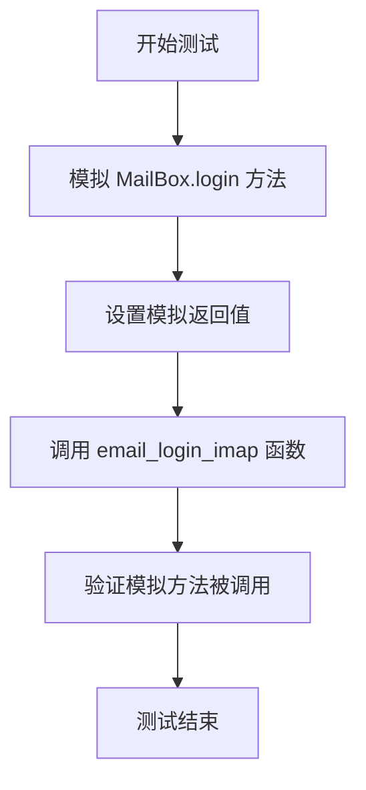
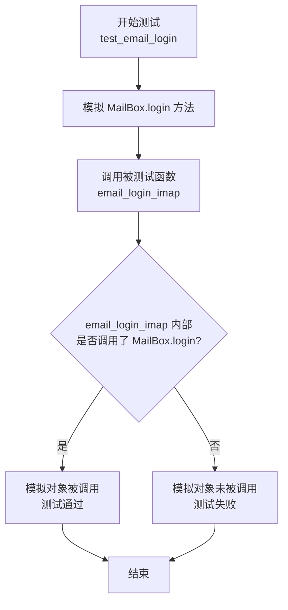
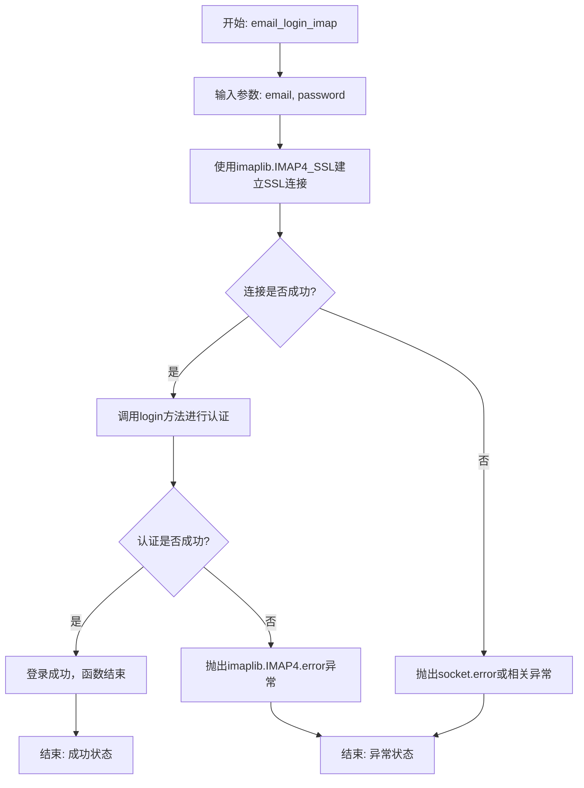

# `.\MetaGPT\tests\metagpt\tools\libs\test_email_login.py` 详细设计文档

该代码是一个单元测试，用于测试 `email_login_imap` 函数的登录功能。它通过模拟（Mock）外部依赖（`MailBox.login` 方法）来验证函数在给定邮箱和密码时能够成功调用登录逻辑，而无需实际连接邮件服务器。

## 整体流程



## 类结构

```
无显式类结构
├── 全局函数: test_email_login
└── 外部依赖函数: email_login_imap
```

## 全局变量及字段


### `mock_mailbox`
    
用于模拟 MailBox.login 方法的 Mock 对象，以隔离测试环境与外部邮件服务。

类型：`unittest.mock.MagicMock`
    


    

## 全局函数及方法


### `test_email_login`

这是一个使用 `pytest-mock` 库编写的单元测试函数，用于测试 `email_login_imap` 函数。它通过模拟（Mock）`MailBox.login` 方法，验证 `email_login_imap` 函数在给定邮箱和密码时能够正确调用底层的登录逻辑，而无需实际连接邮件服务器。

参数：

-  `mocker`：`pytest_mock.MockerFixture`，`pytest-mock` 插件提供的模拟对象创建器，用于创建和管理测试中的模拟对象。

返回值：`None`，该函数不返回任何值，其主要目的是执行测试断言（在本例中通过模拟对象的调用验证来隐式断言）。

#### 流程图



#### 带注释源码

```python
# 导入需要测试的目标函数
from metagpt.tools.libs.email_login import email_login_imap

# 定义测试函数，参数 mocker 由 pytest-mock 自动注入
def test_email_login(mocker):
    # 1. 模拟（Mock）目标模块中的 MailBox.login 方法
    #    这确保了测试运行时不会真正尝试登录邮件服务器
    mock_mailbox = mocker.patch("metagpt.tools.libs.email_login.MailBox.login")
    # 2. 为模拟的 login 方法设置返回值，这里返回一个新的 Mock 对象
    #    模拟登录成功后返回的邮箱连接对象
    mock_mailbox.login.return_value = mocker.Mock()

    # 3. 执行被测试的函数，传入测试用的邮箱地址和密码
    #    这是测试的核心动作，目的是触发 email_login_imap 内部的逻辑
    email_login_imap("test@outlook.com", "test_password")
    # 注意：这里没有显式的 assert 语句。
    # 测试的断言是隐式的：如果 email_login_imap 函数内部没有调用
    # 被模拟的 `MailBox.login` 方法，或者调用了错误的参数，pytest-mock
    # 会在测试报告中标明模拟对象未被调用或调用参数不匹配，从而导致测试失败。
```


### `email_login_imap`

该函数用于通过IMAP协议登录到指定的电子邮件服务器，以验证提供的邮箱地址和密码是否有效。它封装了与邮件服务器的连接和认证过程。

参数：

-  `email`：`str`，需要登录的电子邮件地址。
-  `password`：`str`，与电子邮件地址对应的密码。

返回值：`None`，该函数不返回任何值。其主要功能是执行登录操作，成功则建立连接，失败则抛出异常。

#### 流程图



#### 带注释源码

```python
def email_login_imap(email: str, password: str):
    """
    通过IMAP协议登录邮箱。

    该函数尝试使用提供的邮箱地址和密码通过IMAP SSL连接登录到邮件服务器。
    这是一个用于验证邮箱凭证有效性的基础工具函数。

    Args:
        email (str): 需要登录的电子邮件地址。
        password (str): 与电子邮件地址对应的密码。

    Returns:
        None: 此函数不返回任何值。成功执行表示登录成功，否则会抛出异常。

    Raises:
        imaplib.IMAP4.error: 当认证失败（如密码错误）时抛出。
        socket.error: 当无法连接到服务器时可能抛出。
    """
    # 导入imaplib库，用于处理IMAP协议
    import imaplib

    # 使用imaplib.IMAP4_SSL建立到Outlook服务器的SSL加密连接。
    # 端口993是IMAP over SSL的标准端口。
    with imaplib.IMAP4_SSL("outlook.office365.com", 993) as mail:
        # 调用IMAP4对象的login方法，传入邮箱地址和密码进行认证。
        # 如果认证信息正确，此调用将成功，连接保持登录状态。
        # 如果认证失败（例如密码错误），imaplib.IMAP4.error异常将被抛出。
        mail.login(email, password)
        # 上下文管理器（with语句）确保在代码块执行完毕后，连接会被正确关闭(logout)。
        # 函数执行到此，表示登录成功。
```


## 关键组件


### 测试框架与模拟

使用pytest-mock框架对`email_login_imap`函数进行单元测试，通过模拟外部依赖（如`MailBox.login`）来隔离测试目标代码，验证其调用逻辑的正确性。

### 函数测试

针对`metagpt.tools.libs.email_login`模块中的`email_login_imap`函数进行测试，验证其在使用给定邮箱和密码参数时，能够正确调用底层的邮件库登录方法。

### 模拟对象

在测试中创建了`MailBox.login`方法的模拟对象（Mock），用于替代真实的网络登录操作，确保测试的快速、稳定和可重复性，并验证目标函数是否按预期调用了此方法。


## 问题及建议


### 已知问题

-   **测试用例过于简单且脆弱**：当前的测试用例仅验证了函数是否被调用，而没有验证其核心功能（如登录成功/失败的行为、参数传递的正确性、异常处理等）。它高度依赖于模拟对象的具体实现，一旦底层库的接口或行为发生变化，测试可能错误地通过，无法有效保障代码质量。
-   **缺乏对`email_login_imap`函数内部逻辑的验证**：测试仅模拟了`MailBox.login`方法，但未验证`email_login_imap`函数是否正确处理了登录结果（例如，是否返回了正确的对象或状态），也未测试函数在接收无效参数或遇到网络错误等异常情况时的行为。
-   **测试数据硬编码**：测试中使用的邮箱地址和密码（`"test@outlook.com"`, `"test_password"`）是硬编码的字符串，这不利于测试不同场景（如不同邮箱服务商）或使用测试配置管理。

### 优化建议

-   **增强测试的完备性**：为`test_email_login`函数补充更多测试用例，包括：
    -   **成功路径测试**：验证在模拟登录成功时，`email_login_imap`函数是否返回了预期的`MailBox`实例或其它成功标识。
    -   **失败路径测试**：使用`mocker.patch`并设置`side_effect`来模拟`MailBox.login`抛出认证失败等异常，验证`email_login_imap`函数是否能正确捕获并处理这些异常（例如，返回`None`、抛出封装后的异常或记录日志）。
    -   **参数边界测试**：测试传入空字符串、`None`等无效参数时函数的行为。
-   **解耦测试数据**：考虑将测试用的邮箱地址和密码提取为测试配置文件或使用`pytest`的`fixture`进行管理，提高测试的灵活性和可维护性。
-   **考虑集成测试**：虽然单元测试是必要的，但对于邮件登录这类严重依赖外部服务的功能，建议在安全可控的环境（如使用测试邮箱账户）下编写少量的集成测试或契约测试，以验证与真实IMAP服务器的交互是否符合预期。
-   **审视被测试函数的设计**：检查`email_login_imap`函数本身的设计。如果它仅仅是对`MailBox.login`的简单封装且没有额外的逻辑（如错误处理、配置解析），那么它的价值可能有限，测试也应相应调整重点。如果它包含重要逻辑，则应确保测试覆盖这些逻辑。


## 其它


### 设计目标与约束

本代码片段是一个单元测试，旨在验证 `email_login_imap` 函数在给定有效凭据时能够成功调用底层邮件库的登录方法。其核心设计目标是确保登录功能的正确性，同时通过模拟（Mock）外部依赖来隔离测试环境，避免对真实邮件服务器产生影响。主要约束包括：测试必须快速、可重复、不依赖外部网络或服务状态，并且能够验证函数调用的参数传递是否正确。

### 错误处理与异常设计

当前测试代码本身不包含显式的错误处理逻辑，因为它是一个正向测试用例。其设计依赖于 `mocker.patch` 来模拟 `MailBox.login` 方法，并假设模拟成功。如果模拟失败（例如，目标路径错误），测试框架（如pytest）会抛出异常，导致测试失败。被测试的 `email_login_imap` 函数内部的错误处理（如网络错误、认证失败）未在本测试中覆盖，这属于测试用例设计的范畴，可能需要补充更多测试用例来验证各种异常场景。

### 数据流与状态机

本测试的数据流非常简单直接：
1.  **输入**：测试函数接收两个字符串参数 `"test@outlook.com"` 和 `"test_password"`。
2.  **处理**：调用 `email_login_imap` 函数，该函数内部预期会调用 `MailBox.login` 方法。
3.  **模拟与验证**：通过 `mocker.patch` 拦截对 `MailBox.login` 的实际调用，替换为一个模拟对象。测试验证了 `email_login_imap` 函数是否被调用，并且其参数是否正确传递给了被模拟的 `login` 方法。测试不关心 `login` 方法执行后的状态变化，因为它已被模拟。
4.  **输出**：测试没有显式的返回值，其“输出”是测试通过或失败的状态。成功意味着函数调用按预期发生，没有抛出异常。

不存在复杂的状态机，整个流程是线性的函数调用与模拟验证。

### 外部依赖与接口契约

1.  **外部依赖**：
    *   `metagpt.tools.libs.email_login.email_login_imap`: 这是被测试的主要函数，是本测试代码的直接依赖。
    *   `metagpt.tools.libs.email_login.MailBox`: 这是被测试函数内部依赖的第三方库或自定义类。测试通过模拟（Mock）来解除对此类及其 `login` 方法真实实现的依赖。
    *   `mocker` (来自 `pytest-mock` 插件): 这是测试框架提供的模拟工具，用于创建和管理模拟对象，是测试代码的核心依赖。

2.  **接口契约**：
    *   `email_login_imap(email: str, password: str) -> None`: 被测试函数的预期接口。它接受邮箱地址和密码作为参数，并尝试登录。本测试验证了使用特定参数调用此函数时，它会去调用 `MailBox.login(email, password)`。
    *   `MailBox.login(email: str, password: str) -> MailBox`: 被模拟方法的预期接口。测试假设此方法存在并可被调用，并通过模拟来验证调用是否发生及参数是否正确。

    