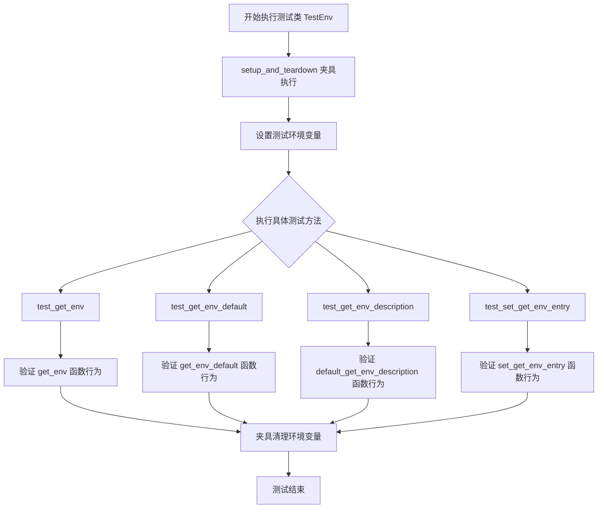
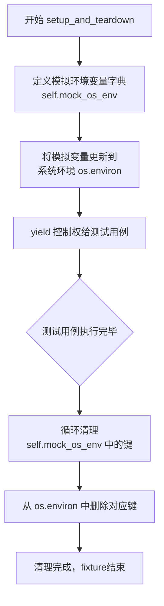
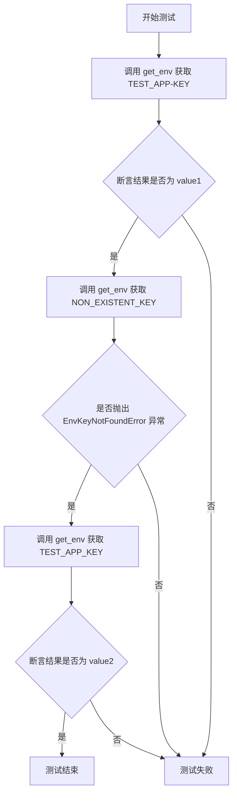
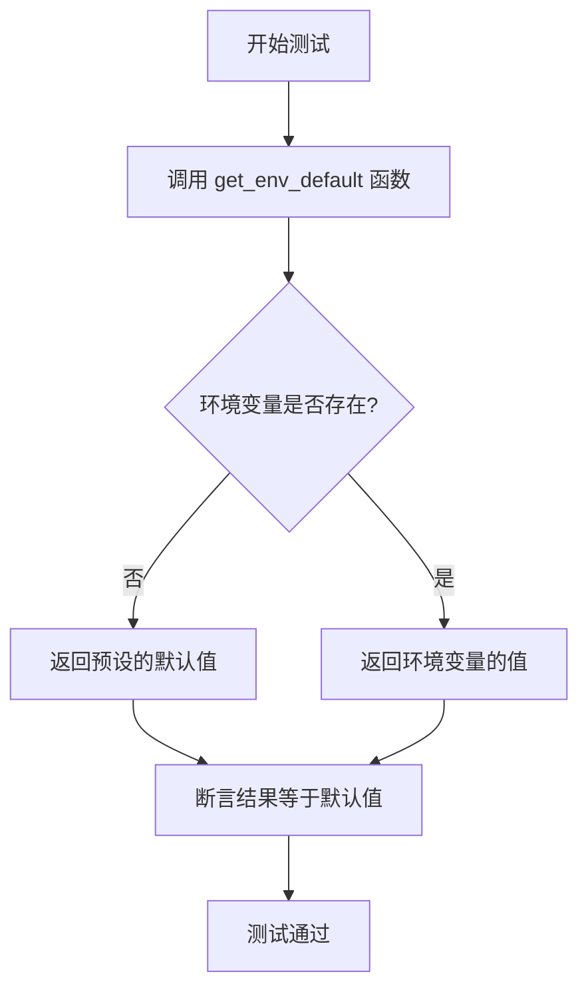
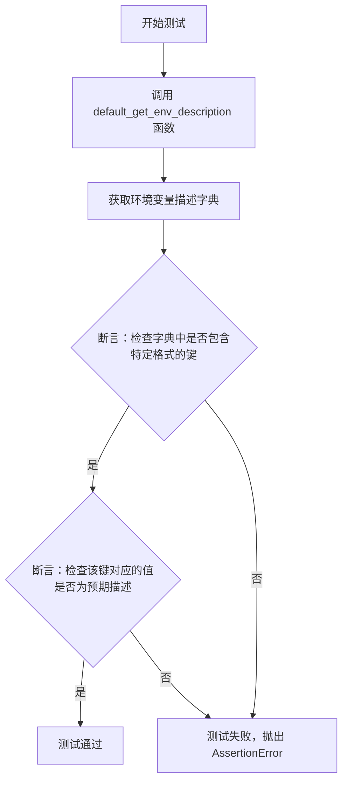
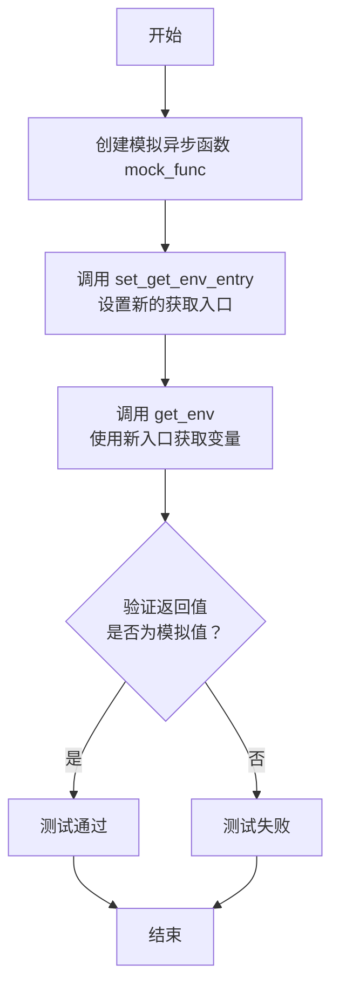

# `.\MetaGPT\tests\metagpt\tools\libs\test_env.py` 详细设计文档

该文件是一个使用 pytest 框架编写的异步单元测试模块，用于测试 `metagpt.tools.libs.env` 模块中环境变量管理相关的功能，包括获取环境变量、获取带默认值的环境变量、获取环境变量描述以及动态设置获取环境变量的入口函数。

## 整体流程



## 类结构

```
TestEnv (pytest 测试类)
├── setup_and_teardown (夹具方法)
├── test_get_env (测试方法)
├── test_get_env_default (测试方法)
├── test_get_env_description (测试方法)
└── test_set_get_env_entry (测试方法)
```

## 全局变量及字段


### `TestEnv.mock_os_env`
    
一个字典，用于在测试期间模拟和存储环境变量及其对应的值。

类型：`dict[str, str]`
    
    

## 全局函数及方法

### `TestEnv.setup_and_teardown`

这是一个pytest fixture方法，用于为测试类`TestEnv`中的测试方法提供环境变量的设置与清理。它在每个测试方法执行前，将预定义的模拟环境变量注入到系统的`os.environ`中，并在测试方法执行后清理这些变量，确保测试环境的隔离性。

参数：

-  `self`：`TestEnv`，`TestEnv`类的实例，用于访问实例属性和方法。

返回值：`Generator[None, None, None]`，一个生成器，在`yield`前执行设置逻辑，在`yield`后执行清理逻辑。

#### 流程图



#### 带注释源码

```python
@pytest.fixture(autouse=True)  # 装饰器，声明这是一个自动使用的pytest fixture
def setup_and_teardown(self):
    """Setup and teardown for environment variables."""  # 文档字符串：说明此方法用于环境变量的设置与清理
    # 定义模拟环境变量字典，包含两个测试用的键值对
    self.mock_os_env = {
        "TEST_APP-KEY": "value1",
        "TEST_APP_KEY": "value2",
    }
    # 将模拟环境变量更新到当前进程的系统环境变量中
    os.environ.update(self.mock_os_env)
    # 使用yield将fixture分为设置和清理两部分
    # yield之前的部分在每个测试开始前执行（设置）
    yield
    # yield之后的部分在每个测试结束后执行（清理）
    # 循环遍历模拟环境变量字典中的所有键
    for key in self.mock_os_env.keys():
        # 从系统环境变量中删除对应的键，以恢复测试前的环境状态
        del os.environ[key]
```

### `TestEnv.test_get_env`

该方法用于测试 `get_env` 函数，验证其在不同场景下（如指定应用名、不指定应用名、查询不存在的键）是否能正确地从环境变量中检索值。

参数：

- `self`：`TestEnv` 实例，表示当前测试类的实例。

返回值：`None`，此方法为测试方法，不返回业务值，仅通过断言验证测试结果。

#### 流程图



#### 带注释源码

```python
async def test_get_env(self):
    """Test retrieving an environment variable."""
    # 测试场景1：指定应用名 `TEST_APP` 和键 `KEY`。
    # 预期行为：`get_env` 函数会尝试查找环境变量 `TEST_APP-KEY`。
    # 根据 `setup_and_teardown` 中设置的环境变量，其值应为 `"value1"`。
    result = await get_env("KEY", app_name="TEST_APP")
    # 断言：验证返回结果是否等于预期值 `"value1"`。
    assert result == "value1"

    # 测试场景2：尝试获取一个不存在的环境变量 `NON_EXISTENT_KEY`。
    # 预期行为：`get_env` 函数应抛出 `EnvKeyNotFoundError` 异常。
    with pytest.raises(EnvKeyNotFoundError):
        await get_env("NON_EXISTENT_KEY")

    # 测试场景3：不指定应用名，直接获取键为 `TEST_APP_KEY` 的环境变量。
    # 预期行为：`get_env` 函数会直接查找环境变量 `TEST_APP_KEY`。
    # 根据 `setup_and_teardown` 中设置的环境变量，其值应为 `"value2"`。
    result = await get_env("TEST_APP_KEY")
    # 断言：验证返回结果是否等于预期值 `"value2"`。
    assert result == "value2"
```

### `TestEnv.test_get_env_default`

该方法用于测试 `get_env_default` 函数，验证当指定的环境变量不存在时，该函数能够正确返回预设的默认值。

参数：

- `self`：`TestEnv` 实例，表示当前测试类的实例。

返回值：`None`，该测试方法不返回任何值，仅通过断言验证测试结果。

#### 流程图



#### 带注释源码

```python
async def test_get_env_default(self):
    """Test retrieving environment variable with default value."""
    # 调用 get_env_default 函数，传入一个不存在的环境变量键、应用名称和默认值
    result = await get_env_default("NON_EXISTENT_KEY", app_name="TEST_APP", default_value="default")
    # 断言函数返回的结果等于预设的默认值
    assert result == "default"
```

### `TestEnv.test_get_env_description`

这是一个异步单元测试方法，用于测试 `default_get_env_description` 函数的功能。它验证该函数是否能正确返回环境变量的描述信息，特别是检查描述字典中是否包含预期的键（即调用 `get_env` 的示例字符串）以及对应的描述值是否正确。

参数：
- `self`：`TestEnv`，当前测试类的实例，用于访问测试夹具设置的环境变量。

返回值：`None`，此测试方法不返回任何值，仅通过断言（assert）来验证测试结果。

#### 流程图



#### 带注释源码

```python
async def test_get_env_description(self):
    """Test retrieving descriptions for environment variables."""
    # 调用 default_get_env_description 函数，获取所有环境变量的描述信息。
    descriptions = await default_get_env_description()

    # 断言：检查返回的描述字典中是否包含一个特定的键。
    # 这个键是一个示例字符串，展示了如何调用 `get_env` 函数来获取 `TEST_APP-KEY` 这个环境变量。
    assert 'await get_env(key="KEY", app_name="TEST_APP")' in descriptions
    # 断言：检查上一步找到的键所对应的值（即描述文本）是否符合预期。
    # 预期的描述应说明该调用会返回环境变量 `TEST_APP-KEY` 的值。
    assert (
        descriptions['await get_env(key="KEY", app_name="TEST_APP")']
        == "Return the value of environment variable `TEST_APP-KEY`."
    )
```

### `TestEnv.test_set_get_env_entry`

该方法用于测试 `set_get_env_entry` 函数的功能，该函数允许覆盖 `get_env` 的默认行为。测试中，它设置了一个模拟的异步函数作为新的环境变量获取入口，然后调用 `get_env` 来验证其返回的是模拟值，而非实际的环境变量值。

参数：
- `self`：`TestEnv`，测试类实例的引用。

返回值：`None`，无返回值。

#### 流程图



#### 带注释源码

```python
async def test_set_get_env_entry(self):
    """Test overriding get_env functionality."""
    # 1. 创建一个模拟的异步函数，该函数固定返回一个字符串 "mocked_value"
    mock_get_env_value = "mocked_value"
    mock_func = AsyncMock(return_value=mock_get_env_value)

    # 2. 调用 set_get_env_entry 函数，将上一步创建的模拟函数设置为新的环境变量获取入口。
    #    同时，将默认的描述生成函数 default_get_env_description 也传入，以保持描述功能。
    set_get_env_entry(mock_func, default_get_env_description)

    # 3. 调用 get_env 函数，并传入一个任意的键（如 "set_get_env"）。
    #    由于上一步已经将获取入口替换为模拟函数，因此这里将调用 mock_func 并返回其预设值。
    result = await get_env("set_get_env")

    # 4. 断言：验证 get_env 返回的结果是否等于模拟函数预设的返回值 "mocked_value"。
    #    如果相等，则证明 set_get_env_entry 成功覆盖了默认的获取逻辑。
    assert result == mock_get_env_value
```

## 关键组件


### 环境变量获取与解析

提供了一套用于从操作系统环境变量中安全、灵活地获取配置值的工具函数，支持应用名前缀、默认值回退和功能描述生成。

### 环境变量键名构建策略

定义了如何根据应用名（`app_name`）和键名（`key`）动态构建最终的环境变量键名，支持带连字符（`{app_name}-{key}`）和不带应用名（直接使用`key`）两种模式。

### 惰性/动态函数注入机制

允许在运行时动态替换核心的`get_env`函数实现及其对应的描述生成函数，提供了高度的可测试性和运行时配置灵活性。

### 环境变量描述生成器

自动为通过`get_env`函数可访问的环境变量生成描述性文档，将函数调用映射为对实际环境变量用途的说明。


## 问题及建议


### 已知问题

-   **测试隔离不彻底**：`setup_and_teardown` 夹具在测试执行前向全局的 `os.environ` 添加环境变量，并在测试后删除。然而，如果测试并行运行或其它测试也修改了 `os.environ`，可能会导致测试间的状态污染，产生不可预测的结果。
-   **硬编码的测试数据**：测试用例中使用的环境变量键（如 `"KEY"`, `"TEST_APP_KEY"`）和期望值（如 `"value1"`, `"value2"`）是硬编码的。这使得测试用例与 `setup_and_teardown` 中定义的 `mock_os_env` 字典紧密耦合，降低了测试的可读性和可维护性。一旦 `mock_os_env` 的键值发生变化，所有相关的断言都需要同步更新。
-   **对全局状态的隐式依赖**：`test_set_get_env_entry` 测试函数通过 `set_get_env_entry` 修改了全局的 `get_env` 函数入口。这会影响后续所有调用 `get_env` 的测试（如果它们在同一测试会话中运行且顺序不当），破坏了测试的独立性和幂等性。
-   **缺少对异常场景的全面覆盖**：测试用例主要覆盖了正常路径和基本的异常路径（如 `EnvKeyNotFoundError`）。但可能缺少对边界条件、特殊字符、空值、`app_name` 参数的各种组合等场景的测试。

### 优化建议

-   **使用 `monkeypatch` 夹具管理环境变量**：建议使用 pytest 内置的 `monkeypatch` 夹具来临时设置和清理环境变量。`monkeypatch.setenv` 和 `monkeypatch.delenv` 能更安全、更清晰地管理测试环境，自动处理清理工作，避免状态泄漏。
-   **将测试数据提取为常量或夹具**：将 `mock_os_env` 字典以及测试中使用的键和期望值提取为模块级常量或通过夹具注入。这样可以提高代码复用性，使测试逻辑与测试数据分离，便于统一管理和修改。
-   **隔离全局函数修改测试**：对于 `test_set_get_env_entry` 这类会修改全局函数行为的测试，应将其放在独立的测试类中，并使用 `pytest.mark.isolate` 或类似的标记。更好的做法是，在每个此类测试的开始前备份原始函数，在测试结束后恢复，或者使用 `monkeypatch` 来临时替换函数，以确保不影响其他测试。
-   **补充更全面的测试用例**：增加测试用例以覆盖更多边界和异常情况，例如：
    -   测试 `app_name` 为空字符串或 `None` 时的行为。
    -   测试环境变量键包含特殊字符或空格的情况。
    -   测试 `default_get_env_description` 返回的描述字典的完整性和准确性。
    -   测试 `set_get_env_entry` 传入 `None` 或无效参数时的行为。
-   **考虑使用参数化测试**：对于 `test_get_env` 和 `test_get_env_default`，可以使用 `@pytest.mark.parametrize` 来参数化不同的输入组合和期望结果，减少重复代码，使测试更清晰、更易于扩展。


## 其它


### 设计目标与约束

本模块的设计目标是提供一个统一、异步、可扩展的环境变量管理接口，用于在应用程序中安全、便捷地获取和描述环境变量。其核心约束包括：
1.  **异步优先**：所有核心函数均设计为异步，以兼容异步应用架构。
2.  **命名空间隔离**：通过 `app_name` 参数支持基于应用名称的环境变量命名空间，避免键名冲突。
3.  **可插拔架构**：通过 `set_get_env_entry` 函数允许运行时替换环境变量获取逻辑和描述逻辑，便于测试和扩展。
4.  **清晰的错误处理**：定义专用的 `EnvKeyNotFoundError` 异常，明确指示环境变量缺失的错误情况。
5.  **自描述性**：提供 `default_get_env_description` 函数，能生成环境变量使用方式的描述，增强代码可读性和可维护性。

### 错误处理与异常设计

模块的错误处理主要围绕环境变量缺失这一核心场景进行设计：
1.  **专用异常类**：定义了 `EnvKeyNotFoundError` 异常。当调用 `get_env` 函数且未找到指定环境变量，也未提供默认值时，抛出此异常。这使调用方能明确区分“变量未找到”与其他类型的错误。
2.  **默认值降级**：`get_env_default` 函数提供了安全的降级机制。当目标环境变量不存在时，直接返回调用者提供的 `default_value`，避免程序因配置缺失而中断。
3.  **测试覆盖**：在单元测试中，明确验证了在键不存在时 `get_env` 会抛出 `EnvKeyNotFoundError`，以及 `get_env_default` 能正确返回默认值，确保了错误处理逻辑的可靠性。

### 数据流与状态机

模块的数据流相对简单直接，不涉及复杂的状态转换：
1.  **数据输入**：主要输入是环境变量键名 (`key`)、可选的应用程序名前缀 (`app_name`) 以及可选的默认值 (`default_value`)。
2.  **数据处理**：
    *   `get_env`: 根据 `app_name` 和 `key` 构造完整的系统环境变量名（格式为 `{app_name}-{key}`），然后查询 `os.environ`。找到则返回值，否则抛出异常。
    *   `get_env_default`: 逻辑与 `get_env` 类似，但在未找到变量时返回 `default_value` 而非抛出异常。
    *   `default_get_env_description`: 遍历当前 `get_env` 的查询逻辑（可能是被 `set_get_env_entry` 覆盖后的），为每个可能的调用生成描述性字符串。
3.  **数据输出**：环境变量的字符串值、默认值、或描述信息字典。
4.  **状态变更点**：`set_get_env_entry` 函数是唯一的状态变更点，它会修改模块内部用于获取环境变量和生成描述的两个全局函数引用。此操作影响后续所有 `get_env` 和 `default_get_env_description` 调用的行为。

### 外部依赖与接口契约

1.  **外部依赖**：
    *   `os` 模块：用于直接访问和操作系统的环境变量 (`os.environ`)。
    *   `pytest` 和 `unittest.mock.AsyncMock`：仅用于测试代码，生产代码不依赖。
2.  **接口契约**：
    *   `get_env(key: str, app_name: str = "") -> Awaitable[str]`: 契约承诺返回指定环境变量的值，否则抛出 `EnvKeyNotFoundError`。
    *   `get_env_default(key: str, app_name: str = "", default_value: str = "") -> Awaitable[str]`: 契约承诺返回环境变量值或提供的默认值，永不抛出 `EnvKeyNotFoundError`。
    *   `default_get_env_description() -> Awaitable[dict]`: 契约承诺返回一个字典，其中键为描述如何调用 `get_env` 的字符串，值为对该环境变量用途的文本描述。
    *   `set_get_env_entry(get_env_func: Callable, get_env_description_func: Callable) -> None`: 契约承诺将后续的 `get_env` 和 `default_get_env_description` 调用委托给传入的函数。传入的函数必须符合对应的异步调用签名。
    *   `EnvKeyNotFoundError` 异常：是模块公开接口的一部分，调用方应准备捕获此异常。

### 测试策略与覆盖

测试类 `TestEnv` 展示了模块的测试策略：
1.  **环境隔离**：使用 `pytest.fixture` 进行测试环境的搭建 (`setup`) 与清理 (`teardown`)，确保测试不会污染或受其他测试影响系统环境。
2.  **核心功能测试**：
    *   `test_get_env`: 验证正常获取、键缺失异常、以及无 `app_name` 的获取场景。
    *   `test_get_env_default`: 验证默认值回退机制。
3.  **描述功能测试**：`test_get_env_description` 验证描述生成功能的正确性。
4.  **可扩展性测试**：`test_set_get_env_entry` 验证 `set_get_env_entry` 能否正确替换核心逻辑，这是测试依赖注入和模拟 (Mock) 的关键。
5.  **异步支持**：所有测试方法均为 `async`，并使用 `@pytest.mark.asyncio` 装饰，确保异步功能被正确测试。

    