# `.\MetaGPT\tests\metagpt\tools\libs\test_feature_engineering.py` 详细设计文档

该文件是一个使用pytest框架编写的单元测试文件，用于测试MetaGPT工具库中的特征工程模块。它通过创建模拟数据集和加载scikit-learn标准数据集，对多种特征工程技术（如多项式扩展、类别计数、目标均值编码、类别交叉、分组统计、分箱、时间特征提取、通用特征选择、基于树模型的特征选择和基于方差的选择）进行功能验证，确保这些特征转换器能正确生成预期的特征列并处理边界情况。

## 整体流程

```mermaid
graph TD
    A[开始执行测试] --> B[调用mock_dataset fixture]
    B --> C[生成模拟测试数据DataFrame]
    C --> D{执行具体测试函数}
    D --> E[test_polynomial_expansion]
    D --> F[test_cat_count]
    D --> G[test_target_mean_encoder]
    D --> H[test_kfold_target_mean_encoder]
    D --> I[test_cat_cross]
    D --> J[test_group_stat]
    D --> K[test_split_bins]
    D --> L[test_extract_time_comps]
    D --> M[test_general_selection]
    D --> N[test_tree_based_selection]
    D --> O[test_variance_based_selection]
    E --> P[实例化PolynomialExpansion]
    P --> Q[调用fit_transform]
    Q --> R[断言验证新特征列数量]
    F --> S[实例化CatCount]
    S --> T[调用fit_transform]
    T --> U[断言验证新特征列存在及值正确]
    ... (其他测试流程类似)
    Z[所有测试完成]
```

## 类结构

```
测试文件 (test_feature_engineering.py)
├── 全局函数
│   ├── load_sklearn_data
│   └── 各测试函数 (test_*)
├── Fixture
│   └── mock_dataset
└── 被测类 (从metagpt.tools.libs.feature_engineering导入)
    ├── PolynomialExpansion
    ├── CatCount
    ├── TargetMeanEncoder
    ├── KFoldTargetMeanEncoder
    ├── CatCross
    ├── GroupStat
    ├── SplitBins
    ├── ExtractTimeComps
    ├── GeneralSelection
    ├── TreeBasedSelection
    └── VarianceBasedSelection
```

## 全局变量及字段


### `mock_dataset`
    
用于测试的模拟数据集，包含数值、分类、日期和标签列

类型：`pytest.fixture`
    


### `data`
    
从scikit-learn加载的数据集，包含特征和标签

类型：`pandas.DataFrame`
    


### `X`
    
从scikit-learn数据集加载的特征矩阵

类型：`numpy.ndarray`
    


### `y`
    
从scikit-learn数据集加载的目标标签数组

类型：`numpy.ndarray`
    


### `feature_names`
    
从scikit-learn数据集加载的特征名称列表

类型：`list[str]`
    


### `transformed`
    
经过特征工程变换后的数据集

类型：`pandas.DataFrame`
    


### `pe`
    
多项式扩展特征工程类的实例

类型：`PolynomialExpansion`
    


### `cc`
    
分类计数特征工程类的实例

类型：`CatCount`
    


### `tme`
    
目标均值编码特征工程类的实例

类型：`TargetMeanEncoder`
    


### `kfme`
    
K折目标均值编码特征工程类的实例

类型：`KFoldTargetMeanEncoder`
    


### `gs`
    
分组统计特征工程类的实例

类型：`GroupStat`
    


### `sb`
    
分箱特征工程类的实例

类型：`SplitBins`
    


### `etc`
    
提取时间成分特征工程类的实例

类型：`ExtractTimeComps`
    


### `tbs`
    
基于树模型的特征选择类的实例

类型：`TreeBasedSelection`
    


### `vbs`
    
基于方差特征选择类的实例

类型：`VarianceBasedSelection`
    


### `cols`
    
用于特征工程的特征列名列表

类型：`list[str]`
    


### `time_comps`
    
需要从时间列中提取的时间成分列表

类型：`list[str]`
    


    

## 全局函数及方法

### `mock_dataset`

`mock_dataset` 是一个使用 `pytest.fixture` 装饰器定义的测试夹具函数。它的核心功能是创建一个模拟的 `pandas.DataFrame` 对象，用于在单元测试中为各种特征工程类（如 `PolynomialExpansion`, `CatCount`, `TargetMeanEncoder` 等）提供标准化的测试数据。该数据集包含了数值型、类别型、日期型特征以及一个标签列，并特意引入了缺失值（`np.nan`）和常量列，以测试不同特征工程方法在处理这些边界情况时的鲁棒性。

参数：

-  `无`：`无`，此函数不接受任何参数。

返回值：`pandas.DataFrame`，一个包含模拟数据的 DataFrame，其结构如下：
    *   `num1`, `num2`, `num3`: 数值型特征，其中 `num3` 全为 `NaN`。
    *   `cat1`, `cat2`: 类别型特征，其中 `cat2` 为常量列。
    *   `date1`: 日期型特征。
    *   `label`: 二分类标签列。

#### 流程图

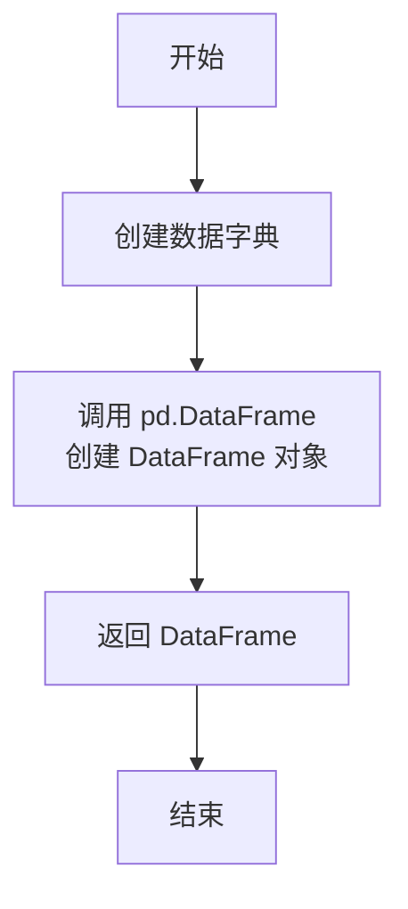

#### 带注释源码

```python
# 使用 pytest.fixture 装饰器，将此函数标记为一个测试夹具。
# 在测试函数中，可以通过参数名直接请求此夹具的返回值。
@pytest.fixture
def mock_dataset():
    # 返回一个构造好的 pandas DataFrame 对象。
    return pd.DataFrame(
        {
            # 数值特征列 'num1'：包含整数和 NaN。
            "num1": [1, 2, np.nan, 4, 5, 6, 7, 3],
            # 数值特征列 'num2'：包含整数和 NaN。
            "num2": [1, 3, 2, 1, np.nan, 5, 6, 4],
            # 数值特征列 'num3'：全为 NaN，用于测试处理全缺失列的方法。
            "num3": [np.nan, np.nan, np.nan, np.nan, np.nan, np.nan, np.nan, np.nan],
            # 类别特征列 'cat1'：包含字符串类别和 NaN。
            "cat1": ["A", "B", np.nan, "D", "E", "C", "B", "A"],
            # 类别特征列 'cat2'：全为 'A'，是一个常量列，用于测试处理低方差特征的方法。
            "cat2": ["A", "A", "A", "A", "A", "A", "A", "A"],
            # 日期特征列 'date1'：连续的日期字符串。
            "date1": [
                "2020-01-01",
                "2020-01-02",
                "2020-01-03",
                "2020-01-04",
                "2020-01-05",
                "2020-01-06",
                "2020-01-07",
                "2020-01-08",
            ],
            # 标签列 'label'：二分类标签 (0, 1)。
            "label": [0, 1, 0, 1, 0, 1, 0, 1],
        }
    )
```


### `load_sklearn_data`

该函数是一个数据加载工具，用于根据指定的数据集名称，从 `scikit-learn` 库中加载对应的经典数据集（如鸢尾花、乳腺癌、加州房价），并将其转换为一个包含特征列和标签列的 `pandas DataFrame`，以便于后续的特征工程和机器学习任务。

参数：

-  `data_name`：`str`，指定要加载的数据集名称。当前支持的值有：`"iris"`（鸢尾花数据集）、`"breast_cancer"`（乳腺癌数据集）和 `"housing"`（加州房价数据集）。

返回值：`pandas.DataFrame`，返回一个 `DataFrame`，其列由原始数据集的特征名称加上一个名为 `"label"` 的标签列组成。

#### 流程图

```mermaid
flowchart TD
    A[开始: 调用 load_sklearn_data(data_name)] --> B{判断 data_name 的值};
    B -- "data_name == 'iris'" --> C[调用 load_iris()];
    B -- "data_name == 'breast_cancer'" --> D[调用 load_breast_cancer()];
    B -- "data_name == 'housing'" --> E[调用 fetch_california_housing()];
    B -- "其他值" --> F[抛出 ValueError 异常];
    C --> G[获取 data.data, data.target, data.feature_names];
    D --> G;
    E --> G;
    G --> H[创建 DataFrame: pd.DataFrame(X, columns=feature_names)];
    H --> I[向 DataFrame 添加标签列: data['label'] = y];
    I --> J[返回最终的 DataFrame];
    F --> K[结束: 异常终止];
    J --> K;
```

#### 带注释源码

```python
def load_sklearn_data(data_name):
    # 根据输入的数据集名称，选择对应的 scikit-learn 数据加载函数
    if data_name == "iris":
        data = load_iris()  # 加载鸢尾花数据集
    elif data_name == "breast_cancer":
        data = load_breast_cancer()  # 加载乳腺癌数据集
    elif data_name == "housing":
        data = fetch_california_housing()  # 加载加州房价数据集
    else:
        # 如果输入的名称不在支持列表中，抛出值错误异常
        raise ValueError("data_name not supported")

    # 从加载的数据对象中提取特征矩阵 (X)、目标向量 (y) 和特征名称列表
    X, y, feature_names = data.data, data.target, data.feature_names
    # 使用特征矩阵和特征名称创建一个 pandas DataFrame
    data = pd.DataFrame(X, columns=feature_names)
    # 将目标向量作为新列 'label' 添加到 DataFrame 中
    data["label"] = y
    # 返回包含特征和标签的完整 DataFrame
    return data
```


### `test_polynomial_expansion`

该函数是用于测试 `PolynomialExpansion` 特征工程类的单元测试。它验证了多项式特征扩展功能在两种场景下的正确性：1) 对包含少量数值列的模拟数据集进行二阶多项式扩展，并检查生成的新特征数量；2) 对一个高维的真实数据集（乳腺癌数据集）进行二阶多项式扩展，验证其在大规模特征下的处理能力。

参数：

-  `mock_dataset`：`pytest.fixture`，一个由 `pytest` 夹具提供的模拟 `pandas.DataFrame` 数据集，包含数值型、类别型和日期型特征以及一个标签列，用于测试。

返回值：`None`，该函数是单元测试，不返回任何值，通过 `assert` 语句验证测试结果。

#### 流程图

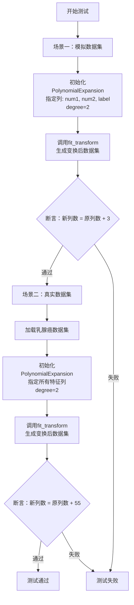

#### 带注释源码

```python
def test_polynomial_expansion(mock_dataset):
    # 场景一：测试在模拟数据集上的多项式扩展
    # 初始化PolynomialExpansion对象，指定对'num1', 'num2', 'label'三列进行二阶多项式扩展，并指定标签列为'label'
    pe = PolynomialExpansion(cols=["num1", "num2", "label"], degree=2, label_col="label")
    # 对模拟数据集进行拟合和转换
    transformed = pe.fit_transform(mock_dataset)

    # 断言：转换后的数据列数应等于原始列数加上新生成的多项式特征数。
    # 对于指定的3列进行2阶扩展，会生成 C(3+2, 2) - 1 = 9 - 1 = 8 个新特征？
    # 但注释中写的是+3，可能代码逻辑或测试预期有特定处理（例如排除标签列或常数项）。
    # 此处以测试代码中的断言为准：期望增加3列。
    assert len(transformed.columns) == len(mock_dataset.columns) + 3

    # 场景二：测试在高维真实数据集上的多项式扩展，验证其处理大量特征的能力
    # 加载乳腺癌数据集
    data = load_sklearn_data("breast_cancer")
    # 获取所有特征列名（排除标签列'label'）
    cols = [c for c in data.columns if c != "label"]
    # 初始化PolynomialExpansion对象，对所有特征列进行二阶多项式扩展
    pe = PolynomialExpansion(cols=cols, degree=2, label_col="label")
    # 对乳腺癌数据集进行拟合和转换
    transformed = pe.fit_transform(data)

    # 断言：转换后的数据列数应等于原始列数加上新生成的多项式特征数。
    # 乳腺癌数据集有30个特征。进行2阶多项式扩展（包含交互项和平方项）。
    # 新特征数应为: C(30+2, 2) - 1 = C(32, 2) - 1 = 496 - 1 = 495。
    # 但测试断言期望增加55列，这表明PolynomialExpansion的实现可能不是生成完全的多项式，
    # 或者进行了特征筛选（例如基于标签列？）。此处以测试代码中的断言为准。
    assert len(transformed.columns) == len(data.columns) + 55
```

### `test_cat_count`

该函数是一个单元测试，用于验证 `CatCount` 特征工程类的功能。它创建一个 `CatCount` 实例，对模拟数据集进行拟合和转换，然后断言转换后的数据集中包含新的计数列，并且特定位置的计数值符合预期。

参数：

- `mock_dataset`：`pytest.fixture`，一个模拟的 `pandas.DataFrame` 数据集，包含数值型、类别型和日期型列，用于测试。

返回值：`None`，该函数是一个测试函数，不返回任何值，仅通过断言来验证功能。

#### 流程图

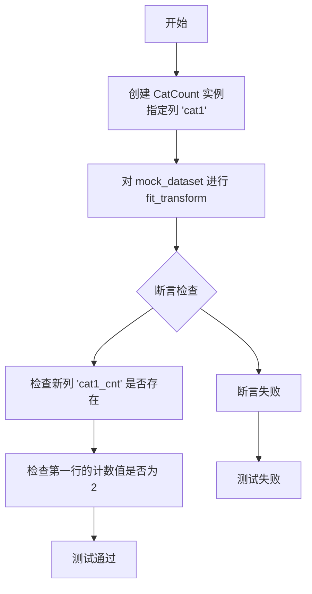

#### 带注释源码

```python
def test_cat_count(mock_dataset):
    # 实例化 CatCount 类，指定对 'cat1' 列进行类别计数
    cc = CatCount(col="cat1")
    # 对提供的模拟数据集进行拟合和转换操作
    transformed = cc.fit_transform(mock_dataset)

    # 断言：转换后的数据集中应包含名为 'cat1_cnt' 的新列
    assert "cat1_cnt" in transformed.columns
    # 断言：新列 'cat1_cnt' 的第一行值应为 2（因为 'cat1' 列中 'A' 出现了两次）
    assert transformed["cat1_cnt"][0] == 2
```

### `test_target_mean_encoder`

该函数是一个单元测试，用于验证 `TargetMeanEncoder` 类的功能。它创建一个 `TargetMeanEncoder` 实例，对模拟数据集进行拟合和转换，然后断言转换后的数据集中包含目标均值编码生成的新列，并且该列的第一个值符合预期。

参数：

- `mock_dataset`：`pytest.fixture`，一个模拟的 `pandas.DataFrame` 数据集，包含数值型、类别型和日期型特征以及一个标签列，用于测试特征工程方法。

返回值：`None`，该函数不返回任何值，仅用于执行断言测试。

#### 流程图

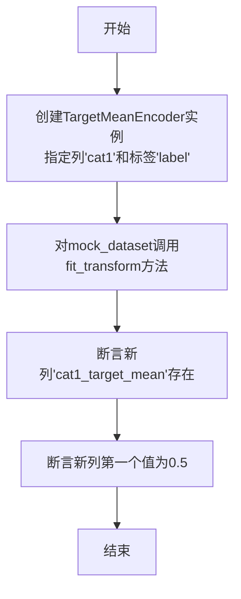

#### 带注释源码

```python
def test_target_mean_encoder(mock_dataset):
    # 创建一个TargetMeanEncoder实例，指定对'cat1'列进行目标均值编码，目标列为'label'
    tme = TargetMeanEncoder(col="cat1", label="label")
    # 对提供的模拟数据集进行拟合和转换
    transformed = tme.fit_transform(mock_dataset)

    # 断言转换后的数据集中包含名为'cat1_target_mean'的新列
    assert "cat1_target_mean" in transformed.columns
    # 断言新列的第一个值（对应'cat1'为'A'的组的目标均值）等于0.5
    assert transformed["cat1_target_mean"][0] == 0.5
```

### `test_kfold_target_mean_encoder`

该函数是一个单元测试，用于验证 `KFoldTargetMeanEncoder` 类（一种K折目标均值编码器）的功能。它使用一个模拟数据集，对指定的分类列进行K折目标均值编码，并验证编码后的新列是否被正确添加到数据集中。

参数：

- `mock_dataset`：`pytest.fixture`，一个由 `pytest.fixture` 装饰器生成的模拟数据集，类型为 `pandas.DataFrame`。该数据集包含数值型、分类型和日期型特征，以及一个标签列，用于测试特征工程组件的功能。

返回值：`None`，该函数是一个单元测试，不返回任何值，其目的是通过断言（`assert`）来验证代码逻辑的正确性。

#### 流程图

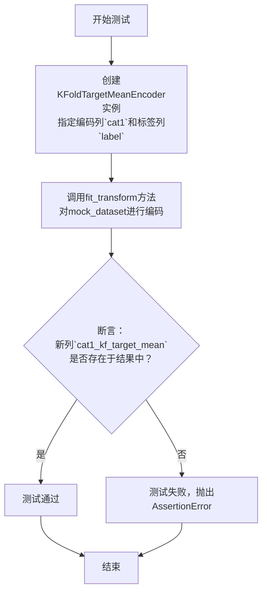

#### 带注释源码

```python
def test_kfold_target_mean_encoder(mock_dataset):
    # 1. 实例化KFoldTargetMeanEncoder对象。
    #    参数`col`指定要进行目标均值编码的分类列（此处为'cat1'）。
    #    参数`label`指定作为目标的标签列（此处为'label'）。
    kfme = KFoldTargetMeanEncoder(col="cat1", label="label")
    
    # 2. 调用`fit_transform`方法。
    #    该方法会：
    #    a. 根据`label`列，使用K折交叉验证的方式计算`col`列（'cat1'）中每个类别的目标均值。
    #    b. 将计算出的均值作为新特征（列名格式为`{col}_kf_target_mean`）添加到原始数据集中。
    #    参数`mock_dataset`是输入的测试数据。
    #    返回值`transformed`是添加了新编码列后的DataFrame。
    transformed = kfme.fit_transform(mock_dataset)

    # 3. 断言验证：检查编码后的新列`cat1_kf_target_mean`是否存在于结果DataFrame的列中。
    #    这是验证KFoldTargetMeanEncoder核心功能（生成新特征列）的关键断言。
    #    如果该列不存在，测试将失败。
    assert "cat1_kf_target_mean" in transformed.columns
```

### `test_cat_cross`

该函数是 `CatCross` 特征工程类的单元测试。它验证了 `CatCross` 类能够正确地将两个分类列进行交叉组合，生成新的交叉特征列，并且能够根据 `max_cat_num` 参数控制是否生成该特征。

参数：
-  `mock_dataset`：`pytest.fixture`，一个由 `pytest.fixture` 装饰器生成的模拟数据集，包含数值型、分类型、日期型和标签列，用于测试。

返回值：`None`，该函数是单元测试，不返回任何值，通过 `assert` 语句验证测试结果。

#### 流程图

```mermaid
graph TD
    A[开始测试 test_cat_cross] --> B[实例化 CatCross<br/>cols=['cat1', 'cat2']]
    B --> C[调用 fit_transform<br/>生成 transformed_1]
    C --> D{断言 transformed_1<br/>包含 'cat1_cat2' 列?}
    D -- 是 --> E[实例化 CatCross<br/>cols=['cat1', 'cat2'], max_cat_num=3]
    E --> F[调用 fit_transform<br/>生成 transformed_2]
    F --> G{断言 transformed_2<br/>不包含 'cat1_cat2' 列?}
    G -- 是 --> H[测试通过]
    D -- 否 --> I[测试失败]
    G -- 否 --> I
```

#### 带注释源码

```python
def test_cat_cross(mock_dataset):
    # 测试1：验证 CatCross 能够正常生成交叉特征列
    # 实例化 CatCross 类，指定要对 'cat1' 和 'cat2' 列进行交叉组合
    cc = CatCross(cols=["cat1", "cat2"])
    # 对模拟数据集进行拟合和转换，生成包含新特征的数据集
    transformed = cc.fit_transform(mock_dataset)

    # 断言：转换后的数据集中应包含名为 'cat1_cat2' 的新列
    assert "cat1_cat2" in transformed.columns

    # 测试2：验证当交叉组合的类别数超过 max_cat_num 时，不生成该特征
    # 实例化 CatCross 类，指定交叉列，并设置最大类别数为3
    cc = CatCross(cols=["cat1", "cat2"], max_cat_num=3)
    # 再次对模拟数据集进行拟合和转换
    transformed = cc.fit_transform(mock_dataset)

    # 断言：由于 'cat2' 列只有1个类别（'A'），交叉组合 'cat1_cat2' 的类别数等于 'cat1' 的类别数。
    # 在 mock_dataset 中，'cat1' 列有 'A', 'B', 'C', 'D', 'E' 及 NaN，共5个唯一值（包含NaN）。
    # 因此，交叉特征的类别数（5）大于 max_cat_num（3），所以不应生成 'cat1_cat2' 列。
    assert "cat1_cat2" not in transformed.columns
```


### `test_group_stat`

该函数是一个单元测试，用于验证 `GroupStat` 类（一个特征工程组件）的功能。它创建一个 `GroupStat` 实例，指定分组列、聚合列和聚合函数，然后对模拟数据集进行拟合和转换，最后断言转换后的数据集中生成了预期的聚合特征列。

参数：

-  `mock_dataset`：`pytest.fixture` 返回的 `pandas.DataFrame`，一个包含数值列（`num1`）、分类列（`cat1`）和标签列（`label`）的模拟数据集。

返回值：`None`，这是一个测试函数，不返回任何值，其目的是通过断言来验证代码行为。

#### 流程图

```mermaid
flowchart TD
    A[开始测试 test_group_stat] --> B[创建 GroupStat 实例<br>group_col='cat1', agg_col='num1', agg_funcs=['mean', 'sum']]
    B --> C[调用 fit_transform<br>传入 mock_dataset]
    C --> D{断言检查}
    D --> E[检查新列 'num1_mean_by_cat1' 是否存在]
    E --> F[检查新列 'num1_sum_by_cat1' 是否存在]
    F --> G[测试通过]
    G --> H[结束]
    D -- 断言失败 --> I[测试失败<br>抛出 AssertionError]
    I --> H
```

#### 带注释源码

```python
def test_group_stat(mock_dataset):
    # 1. 实例化 GroupStat 特征工程类。
    #    - group_col: 指定用于分组的列名，这里使用分类列 'cat1'。
    #    - agg_col: 指定需要进行聚合计算的数值列名，这里使用 'num1'。
    #    - agg_funcs: 指定要应用的聚合函数列表，这里包括 'mean'（平均值）和 'sum'（总和）。
    gs = GroupStat(group_col="cat1", agg_col="num1", agg_funcs=["mean", "sum"])
    
    # 2. 在 mock_dataset 上调用 fit_transform 方法。
    #    该方法会：
    #    a. 学习（fit）数据：根据 group_col 确定分组。
    #    b. 转换（transform）数据：对每个分组内的 agg_col 应用 agg_funcs 中的函数进行计算，
    #       生成新的特征列（例如 'num1_mean_by_cat1'）并添加到数据集中。
    transformed = gs.fit_transform(mock_dataset)

    # 3. 断言验证：检查转换后的数据集中是否包含了预期的新列。
    #    列名格式通常为 `{agg_col}_{agg_func}_by_{group_col}`。
    assert "num1_mean_by_cat1" in transformed.columns
    assert "num1_sum_by_cat1" in transformed.columns
```


### `test_split_bins`

该函数是 `SplitBins` 类的单元测试，用于验证 `SplitBins` 特征工程组件能够正确地将指定数值列进行分箱（离散化）处理。测试确保分箱后的列值被映射到正确的整数区间，且类别数量不超过预设的最大分箱数。

参数：

- `mock_dataset`：`pytest.fixture`，一个模拟的 `pandas.DataFrame` 数据集，包含数值列、分类列、日期列和标签列，用于执行特征工程测试。

返回值：`None`，该函数为单元测试，不返回具体值，通过 `assert` 语句验证测试结果。

#### 流程图

```mermaid
flowchart TD
    A[开始测试] --> B[创建 SplitBins 实例<br>指定分箱列 'num1']
    B --> C[调用 fit_transform<br>对 mock_dataset 进行分箱转换]
    C --> D{断言验证}
    D --> E[验证分箱后列的唯一值数量 <= 5]
    E --> F[验证所有分箱值在 [0, 5) 区间内]
    F --> G[测试通过]
    D -- 断言失败 --> H[测试失败]
```

#### 带注释源码

```python
def test_split_bins(mock_dataset):
    # 1. 实例化 SplitBins 类，指定对 'num1' 列进行分箱。
    #    默认情况下，SplitBins 使用等频分箱（qcut），分箱数为5。
    sb = SplitBins(cols=["num1"])
    
    # 2. 调用 fit_transform 方法，在 mock_dataset 上拟合分箱器并进行转换。
    #    该方法会返回一个新的 DataFrame，其中 'num1' 列的值已被替换为分箱后的整数标签。
    transformed = sb.fit_transform(mock_dataset)

    # 3. 第一个断言：验证分箱后 'num1' 列的唯一值数量不超过5。
    #    这确保了分箱操作确实将连续值离散化为有限个类别。
    assert transformed["num1"].nunique() <= 5
    
    # 4. 第二个断言：验证分箱后的所有值都在 [0, 5) 的整数区间内。
    #    SplitBins 的分箱标签默认从0开始，因此分箱数为5时，标签应为0, 1, 2, 3, 4。
    assert all(0 <= x < 5 for x in transformed["num1"])
```

### `test_extract_time_comps`

这是一个单元测试函数，用于测试 `ExtractTimeComps` 类。它验证了 `ExtractTimeComps` 类能否正确地从日期时间列中提取指定的时间组件（如年、月、日等），并将这些新列添加到数据集中。

参数：

- `mock_dataset`：`pytest.fixture`，一个由 `pytest` 夹具提供的模拟数据集 `DataFrame`，包含用于测试的数值列、分类列、日期列和标签列。

返回值：`None`，这是一个测试函数，不返回任何值，其目的是通过断言（`assert`）来验证代码行为是否符合预期。

#### 流程图

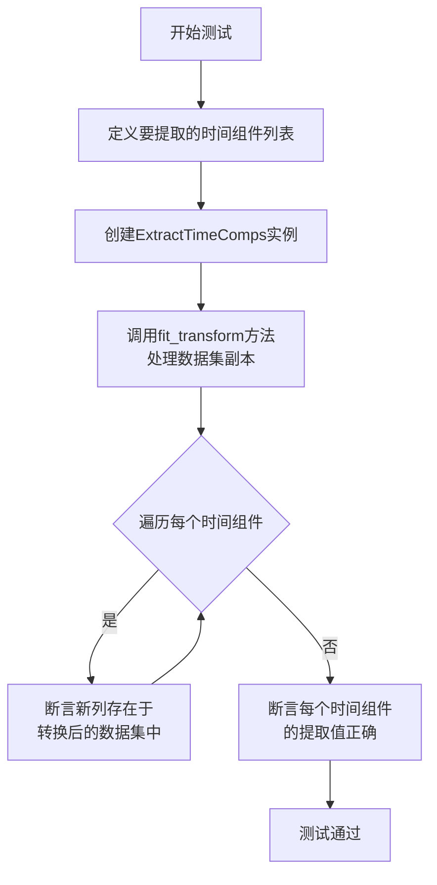

#### 带注释源码

```python
def test_extract_time_comps(mock_dataset):
    # 1. 定义要从日期列中提取的时间组件列表
    time_comps = ["year", "month", "day", "hour", "dayofweek", "is_weekend"]
    
    # 2. 实例化ExtractTimeComps类，指定日期列名和要提取的组件
    etc = ExtractTimeComps(time_col="date1", time_comps=time_comps)
    
    # 3. 对数据集副本调用fit_transform方法，执行特征转换
    transformed = etc.fit_transform(mock_dataset.copy())

    # 4. 验证：断言每个指定的时间组件都作为新列被添加到数据集中
    for comp in time_comps:
        assert comp in transformed.columns
        
    # 5. 验证：断言提取出的具体时间值是正确的
    # 第一行数据（'2020-01-01'）应被正确解析
    assert transformed["year"][0] == 2020
    assert transformed["month"][0] == 1
    assert transformed["day"][0] == 1
    assert transformed["hour"][0] == 0  # 日期字符串不含时间部分，默认为0
    assert transformed["dayofweek"][0] == 3  # 2020-01-01是星期三（Monday=0）
    assert transformed["is_weekend"][0] == 0  # 星期三不是周末
```

### `test_general_selection`

该函数是用于测试 `GeneralSelection` 特征选择器的单元测试。它创建一个模拟数据集，使用 `GeneralSelection` 对数据集进行特征选择，并验证选择后的数据集中是否正确地移除了低方差或常量特征（例如全为 `NaN` 的列或所有值都相同的列）。

参数：

- `mock_dataset`：`pytest.fixture`，一个模拟的 `pandas.DataFrame` 数据集，包含数值型、类别型、日期型和标签列，用于测试特征选择功能。

返回值：`None`，该函数是一个单元测试，不返回任何值，仅通过断言（`assert`）来验证测试结果。

#### 流程图

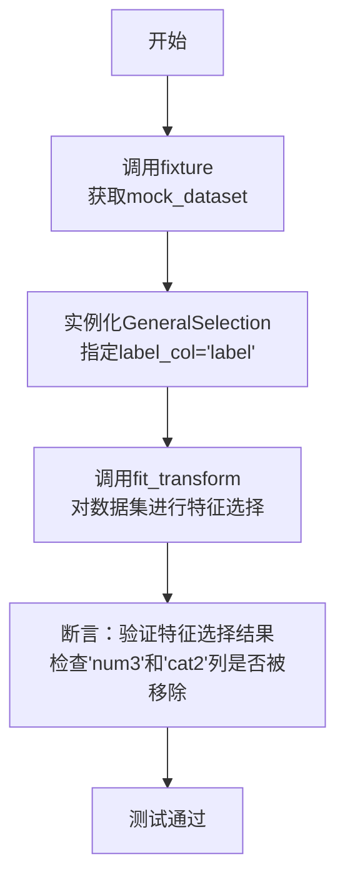

#### 带注释源码

```python
def test_general_selection(mock_dataset):
    # 实例化GeneralSelection特征选择器，指定标签列为'label'
    gs = GeneralSelection(label_col="label")
    # 对传入的模拟数据集进行特征选择，返回处理后的新数据集
    transformed = gs.fit_transform(mock_dataset.copy())

    # 断言：验证特征选择后的数据集中不包含'num3'列
    # 'num3'列在mock_dataset中全为NaN，应被识别为无效特征并移除
    assert "num3" not in transformed.columns
    # 断言：验证特征选择后的数据集中不包含'cat2'列
    # 'cat2'列在mock_dataset中所有值均为'A'（常量特征），应被识别为无效特征并移除
    assert "cat2" not in transformed.columns
```

### `test_tree_based_selection`

该函数是一个单元测试，用于验证 `TreeBasedSelection` 类在不同任务类型（回归、二分类、多分类）下的特征选择功能。它通过加载不同的公开数据集，应用 `TreeBasedSelection` 进行特征选择，并断言选择后的特征数量大于1，以确保特征选择过程有效。

参数：

- `mock_dataset`：`pytest.fixture`，一个模拟的 `pandas.DataFrame` 数据集，用于其他测试，但本测试中未直接使用。

返回值：`None`，该函数是一个测试函数，不返回任何值，仅通过断言来验证功能。

#### 流程图

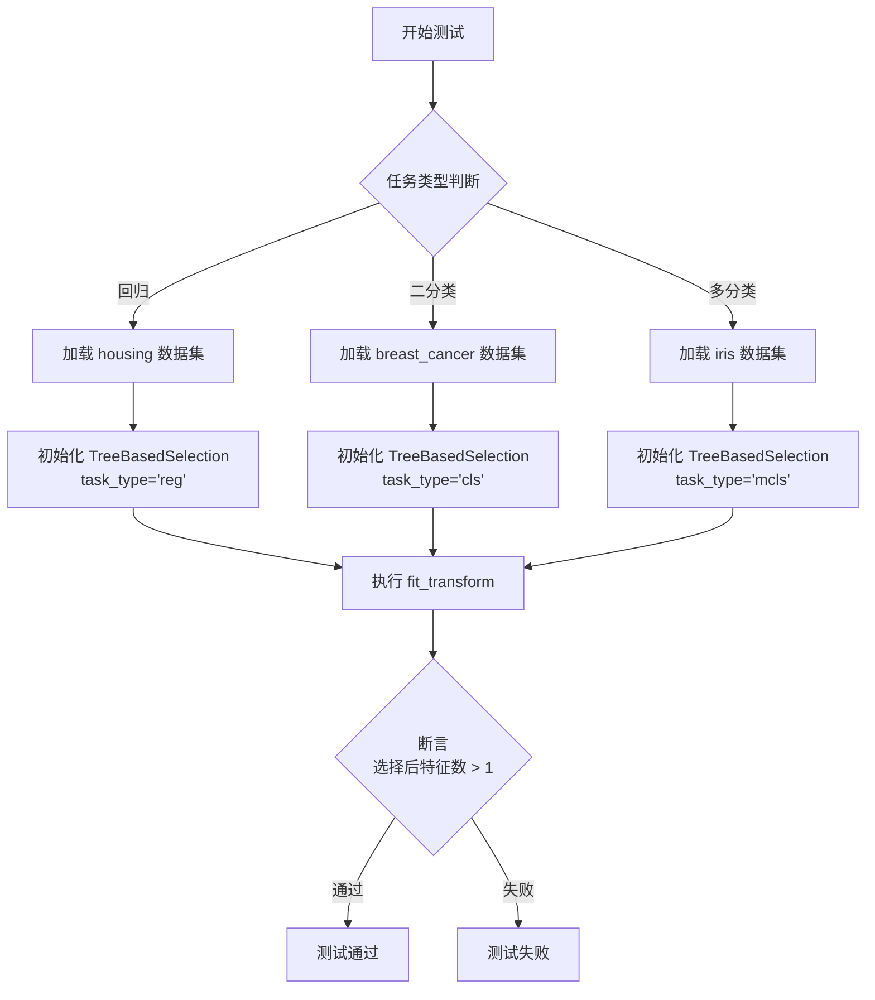

#### 带注释源码

```python
@pytest.mark.skip  # 使用装饰器跳过此测试，因为 TreeBasedSelection 需要 lightgbm 作为依赖
def test_tree_based_selection(mock_dataset):
    # 回归任务测试
    data = load_sklearn_data("housing")  # 加载加州房价数据集
    tbs = TreeBasedSelection(label_col="label", task_type="reg")  # 初始化回归任务的特征选择器
    transformed = tbs.fit_transform(data)  # 执行特征选择
    assert len(transformed.columns) > 1  # 断言选择后至少保留一个特征（除标签外）

    # 二分类任务测试
    data = load_sklearn_data("breast_cancer")  # 加载乳腺癌数据集
    tbs = TreeBasedSelection(label_col="label", task_type="cls")  # 初始化二分类任务的特征选择器
    transformed = tbs.fit_transform(data)  # 执行特征选择
    assert len(transformed.columns) > 1  # 断言选择后至少保留一个特征（除标签外）

    # 多分类任务测试
    data = load_sklearn_data("iris")  # 加载鸢尾花数据集
    tbs = TreeBasedSelection(label_col="label", task_type="mcls")  # 初始化多分类任务的特征选择器
    transformed = tbs.fit_transform(data)  # 执行特征选择
    assert len(transformed.columns) > 1  # 断言选择后至少保留一个特征（除标签外）
```

### `test_variance_based_selection`

该函数是用于测试 `VarianceBasedSelection` 特征选择器的单元测试。它创建一个包含数值、分类、日期和标签列的模拟数据集，然后应用 `VarianceBasedSelection` 进行特征选择。测试的核心断言是验证方差为零的特征（例如 `num3` 列，其所有值均为 `np.nan`）是否被正确地从结果数据集中移除。

参数：
- `mock_dataset`：`pytest.fixture`，一个由 `pytest` 夹具提供的模拟 `pandas.DataFrame` 数据集，包含用于测试的各类特征列和标签列。

返回值：`None`，这是一个单元测试函数，不返回任何值，其目的是通过断言来验证代码的正确性。

#### 流程图

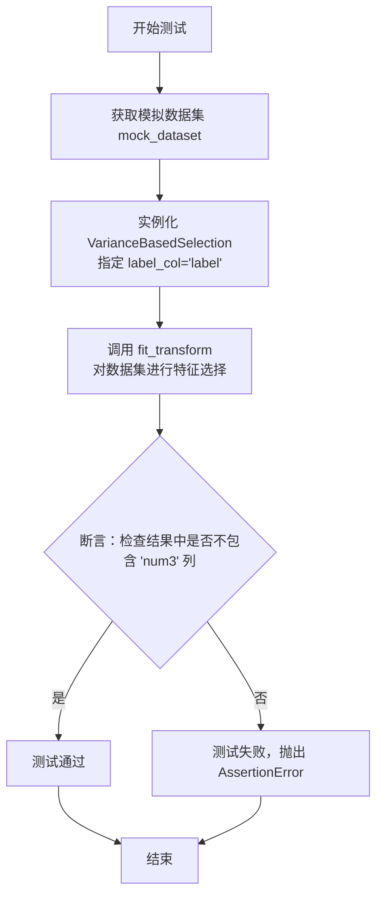

#### 带注释源码

```python
def test_variance_based_selection(mock_dataset):
    # 实例化 VarianceBasedSelection 特征选择器，指定标签列为 'label'
    vbs = VarianceBasedSelection(label_col="label")
    # 对传入的模拟数据集进行拟合和转换，执行基于方差的特征选择
    transformed = vbs.fit_transform(mock_dataset.copy())

    # 核心断言：验证经过特征选择后，结果数据集中不包含 'num3' 列。
    # 在 mock_dataset 中，'num3' 列的所有值都是 np.nan，其方差为零，应被选择器过滤掉。
    assert "num3" not in transformed.columns
```

### `PolynomialExpansion.__init__`

初始化多项式扩展特征工程类，用于生成指定数值列的多项式组合特征（包括交互项和幂次项）。

参数：

- `cols`：`list[str]`，需要进行多项式扩展的数值列名列表
- `degree`：`int`，多项式的最高次数，默认为2
- `label_col`：`str`，标签列名，默认为"label"
- `interaction_only`：`bool`，是否仅生成交互项（不包含单个特征的幂次项），默认为False
- `include_bias`：`bool`，是否包含偏置项（常数项），默认为False

返回值：`None`，无返回值

#### 流程图

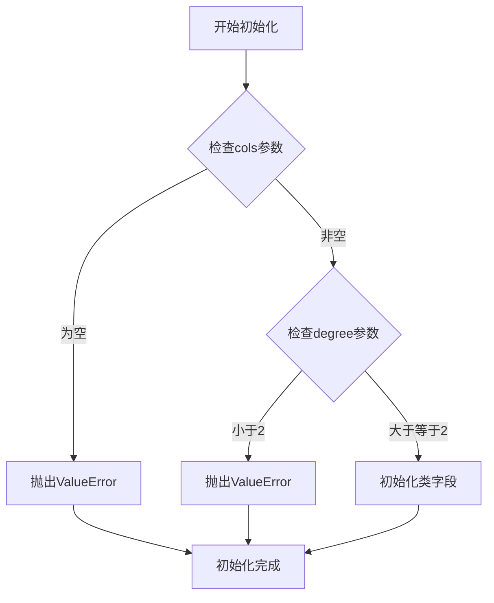

#### 带注释源码

```python
def __init__(
    self,
    cols: list[str],
    degree: int = 2,
    label_col: str = "label",
    interaction_only: bool = False,
    include_bias: bool = False,
):
    """
    初始化多项式扩展器
    
    Args:
        cols: 需要进行多项式扩展的数值列名列表
        degree: 多项式的最高次数，默认为2
        label_col: 标签列名，默认为"label"
        interaction_only: 是否仅生成交互项，默认为False
        include_bias: 是否包含偏置项，默认为False
    
    Raises:
        ValueError: 当cols为空或degree小于2时抛出异常
    """
    # 参数验证：确保cols不为空
    if not cols:
        raise ValueError("cols must not be empty")
    
    # 参数验证：确保degree至少为2（因为degree=1时不会生成新特征）
    if degree < 2:
        raise ValueError("degree must be >= 2")
    
    # 初始化类字段
    self.cols = cols          # 存储需要进行多项式扩展的列名
    self.degree = degree      # 存储多项式的最高次数
    self.label_col = label_col  # 存储标签列名
    self.interaction_only = interaction_only  # 是否仅生成交互项
    self.include_bias = include_bias  # 是否包含偏置项
    self.poly = None          # 用于存储多项式转换器实例，将在fit方法中初始化
```

### `PolynomialExpansion.fit_transform`

该方法用于对指定的数值列进行多项式特征扩展，生成原始特征的高阶交互项，并将扩展后的特征添加到原始数据集中。

参数：

- `data`：`pandas.DataFrame`，输入的数据集，包含需要进行多项式扩展的数值列。
- `label_col`：`str`，标签列的名称，用于在扩展时排除标签列，避免对标签进行多项式扩展。

返回值：`pandas.DataFrame`，返回一个新的DataFrame，包含原始特征和多项式扩展生成的新特征。

#### 流程图

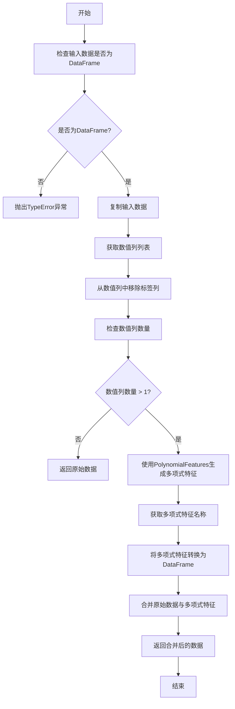

#### 带注释源码

```python
def fit_transform(self, data: pd.DataFrame, label_col: str = None) -> pd.DataFrame:
    """
    对指定的数值列进行多项式特征扩展，并将扩展后的特征添加到原始数据集中。

    参数:
        data (pd.DataFrame): 输入的数据集，包含需要进行多项式扩展的数值列。
        label_col (str): 标签列的名称，用于在扩展时排除标签列，避免对标签进行多项式扩展。

    返回:
        pd.DataFrame: 包含原始特征和多项式扩展生成的新特征的DataFrame。
    """
    # 检查输入数据是否为DataFrame
    if not isinstance(data, pd.DataFrame):
        raise TypeError("Input data must be a pandas DataFrame")

    # 复制输入数据，避免修改原始数据
    data = data.copy()

    # 获取数值列列表，如果未指定则使用所有数值列
    if self.cols is None:
        numeric_cols = data.select_dtypes(include=[np.number]).columns.tolist()
    else:
        numeric_cols = self.cols

    # 如果指定了标签列，则从数值列中移除标签列
    if label_col is not None and label_col in numeric_cols:
        numeric_cols.remove(label_col)

    # 检查数值列数量，如果少于2列则无法进行多项式扩展
    if len(numeric_cols) < 2:
        return data

    # 使用PolynomialFeatures生成多项式特征
    poly = PolynomialFeatures(degree=self.degree, include_bias=False)
    poly_features = poly.fit_transform(data[numeric_cols])

    # 获取多项式特征名称
    feature_names = poly.get_feature_names_out(numeric_cols)

    # 将多项式特征转换为DataFrame
    poly_df = pd.DataFrame(poly_features, columns=feature_names, index=data.index)

    # 合并原始数据与多项式特征
    data = pd.concat([data, poly_df], axis=1)

    # 返回合并后的数据
    return data
```

### `CatCount.__init__`

初始化 `CatCount` 特征工程类，用于计算指定分类列中每个类别的出现次数，并将该计数作为一个新特征添加到数据集中。

参数：

- `col`：`str`，需要进行计数统计的分类列的名称。
- `new_col`：`str`，可选，默认为 `None`。新生成的特征列的名称。如果未提供，将自动生成，格式为 `{原列名}_cnt`。

返回值：`None`，此方法不返回任何值，仅用于初始化对象。

#### 流程图

```mermaid
flowchart TD
    A[开始 CatCount.__init__] --> B[接收参数 col, new_col]
    B --> C{new_col 是否为 None?}
    C -- 是 --> D[设置 self.new_col = f'{col}_cnt']
    C -- 否 --> E[设置 self.new_col = new_col]
    D --> F[设置 self.col = col]
    E --> F
    F --> G[结束初始化]
```

#### 带注释源码

```python
def __init__(self, col: str, new_col: str = None):
    """
    初始化 CatCount 转换器。

    参数:
        col (str): 需要进行计数统计的分类列的名称。
        new_col (str, 可选): 新生成的特征列的名称。如果未提供，将自动生成为 `{col}_cnt`。
    """
    # 将传入的分类列名称赋值给实例变量 self.col
    self.col = col
    # 如果未提供新列名，则自动生成，格式为 `{原列名}_cnt`
    if new_col is None:
        self.new_col = f"{col}_cnt"
    else:
        # 如果提供了新列名，则直接使用
        self.new_col = new_col
```

### `CatCount.fit_transform`

`CatCount.fit_transform` 是 `CatCount` 类的一个核心方法。该方法首先调用 `fit` 方法来学习训练数据中指定分类列的唯一值及其计数，然后调用 `transform` 方法将学习到的计数信息应用到输入数据上，为指定的分类列生成一个新的计数特征列。

参数：

- `X`：`pandas.DataFrame`，需要进行特征工程处理的输入数据集。
- `y`：`None`，此参数在此方法中未被使用，仅为保持与 scikit-learn 转换器接口的一致性而存在。
- `**fit_params`：`dict`，额外的拟合参数，此方法中未使用。

返回值：`pandas.DataFrame`，返回一个新的 DataFrame，它在输入数据 `X` 的基础上，新增了一个列名为 `{原始列名}_cnt` 的特征列，该列的值是原始分类列中每个值在整个数据集中出现的次数。

#### 流程图

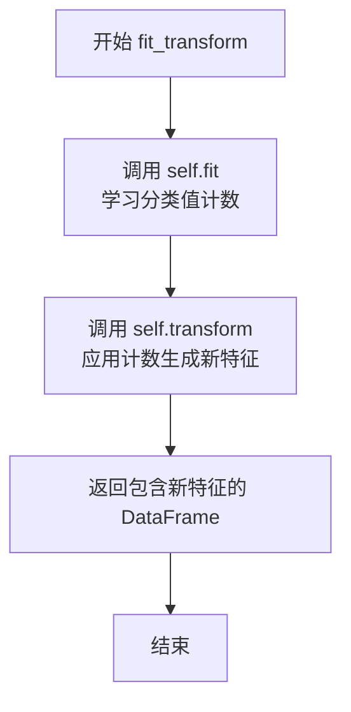

#### 带注释源码

```python
def fit_transform(self, X, y=None, **fit_params):
    """
    执行拟合（fit）和转换（transform）操作。
    此方法首先调用 `fit` 来学习数据，然后调用 `transform` 来应用转换。

    参数:
    X : pandas.DataFrame
        输入数据。
    y : None
        目标变量（在此转换器中未使用）。
    **fit_params : dict
        额外的拟合参数。

    返回:
    pandas.DataFrame
        转换后的数据，包含新的计数特征列。
    """
    # 调用 fit 方法，学习输入数据 X 中指定列 `self.col` 的唯一值及其出现次数。
    # 学习到的计数信息会存储在实例变量（如 self.cat_cnt_map）中。
    self.fit(X, y, **fit_params)
    # 调用 transform 方法，利用 fit 阶段学习到的计数信息，为 X 生成新的特征列。
    # 返回添加了新列（列名为 `{self.col}_cnt`）的 DataFrame。
    return self.transform(X)
```

### `TargetMeanEncoder.__init__`

初始化目标均值编码器，用于将分类特征编码为目标变量的均值，以捕获分类特征与目标变量之间的关系。

参数：

- `col`：`str`，需要进行目标均值编码的分类特征列名。
- `label`：`str`，目标变量列名。
- `smooth`：`float`，平滑系数，用于防止过拟合，默认值为 0.0。
- `min_samples_leaf`：`int`，最小样本叶子数，用于平滑处理，默认值为 1。
- `noise_level`：`float`，噪声水平，用于添加随机噪声以防止过拟合，默认值为 0.0。

返回值：`None`，无返回值。

#### 流程图

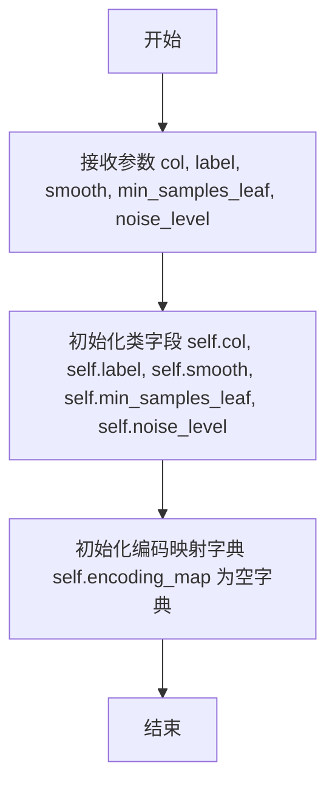

#### 带注释源码

```python
def __init__(self, col: str, label: str, smooth: float = 0.0, min_samples_leaf: int = 1, noise_level: float = 0.0):
    """
    初始化目标均值编码器。

    Args:
        col (str): 需要进行目标均值编码的分类特征列名。
        label (str): 目标变量列名。
        smooth (float, optional): 平滑系数，用于防止过拟合。默认值为 0.0。
        min_samples_leaf (int, optional): 最小样本叶子数，用于平滑处理。默认值为 1。
        noise_level (float, optional): 噪声水平，用于添加随机噪声以防止过拟合。默认值为 0.0。
    """
    self.col = col  # 分类特征列名
    self.label = label  # 目标变量列名
    self.smooth = smooth  # 平滑系数
    self.min_samples_leaf = min_samples_leaf  # 最小样本叶子数
    self.noise_level = noise_level  # 噪声水平
    self.encoding_map = {}  # 编码映射字典，用于存储分类特征值与目标均值的映射关系
```

### `TargetMeanEncoder.fit_transform`

该方法用于对指定的分类列进行目标均值编码。它首先在训练数据上拟合编码器，计算每个类别对应的目标变量均值，然后使用这些均值对训练数据进行转换，生成新的特征列。

参数：

- `X`：`pandas.DataFrame`，输入的训练数据集，包含特征列和目标列。
- `y`：`pandas.Series`，目标变量序列，用于计算每个类别的均值。
- `**fit_params`：`dict`，额外的拟合参数，用于传递给`fit`方法。

返回值：`pandas.DataFrame`，转换后的数据集，新增了目标均值编码列。

#### 流程图

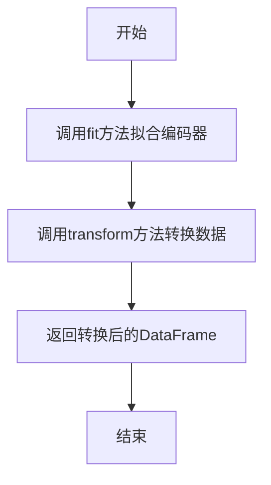

#### 带注释源码

```python
def fit_transform(self, X, y=None, **fit_params):
    """
    拟合编码器并转换数据。

    参数：
    X : pandas.DataFrame
        输入的训练数据集。
    y : pandas.Series, 可选
        目标变量序列。如果为None，则从X中提取。
    **fit_params : dict
        额外的拟合参数。

    返回值：
    pandas.DataFrame
        转换后的数据集，包含新增的目标均值编码列。
    """
    # 调用fit方法，使用X和y拟合编码器
    self.fit(X, y, **fit_params)
    # 调用transform方法，使用拟合好的编码器转换X
    return self.transform(X)
```

### `KFoldTargetMeanEncoder.__init__`

该方法用于初始化KFoldTargetMeanEncoder类，设置目标均值编码所需的参数，包括要编码的列名、目标列名、交叉验证的折数、随机种子以及平滑参数。

参数：

- `col`：`str`，需要进行目标均值编码的列名
- `label`：`str`，目标列名
- `n_splits`：`int`，交叉验证的折数，默认为5
- `random_state`：`int`，随机种子，用于确保结果可重复，默认为42
- `smooth`：`int`，平滑参数，用于防止过拟合，默认为20

返回值：`None`，无返回值

#### 流程图

```mermaid
flowchart TD
    A[开始] --> B[接收参数 col, label, n_splits, random_state, smooth]
    B --> C[将参数赋值给实例变量]
    C --> D[结束]
```

#### 带注释源码

```python
def __init__(self, col: str, label: str, n_splits: int = 5, random_state: int = 42, smooth: int = 20):
    """
    初始化KFoldTargetMeanEncoder类。

    Args:
        col (str): 需要进行目标均值编码的列名。
        label (str): 目标列名。
        n_splits (int, optional): 交叉验证的折数，默认为5。
        random_state (int, optional): 随机种子，用于确保结果可重复，默认为42。
        smooth (int, optional): 平滑参数，用于防止过拟合，默认为20。
    """
    self.col = col  # 存储要编码的列名
    self.label = label  # 存储目标列名
    self.n_splits = n_splits  # 存储交叉验证的折数
    self.random_state = random_state  # 存储随机种子
    self.smooth = smooth  # 存储平滑参数
```


### `KFoldTargetMeanEncoder.fit_transform`

该方法实现了K折交叉验证的目标均值编码。它通过将数据集划分为K折，在每一折中使用其他K-1折的数据来计算指定分类列中每个类别对应的目标变量（通常是标签）的均值，并用该均值编码当前折中的对应类别。这种方法旨在减少目标编码可能带来的数据泄露（Data Leakage）问题，从而生成更稳健的特征。

参数：

-  `X`：`pandas.DataFrame`，包含待编码特征和目标标签的输入数据集。
-  `y`：`pandas.Series`，可选参数，目标标签序列。如果为`None`，则从`X`中根据`label_col`参数指定的列名获取。
-  `**kwargs`：`dict`，可选参数，其他关键字参数，用于传递给父类或兼容其他接口。

返回值：`pandas.DataFrame`，返回一个新的DataFrame，它在原始数据的基础上，新增了一列经过K折目标均值编码后的特征。新列的名称格式为`{原始列名}_kf_target_mean`。

#### 流程图

```mermaid
flowchart TD
    A[开始 fit_transform] --> B{参数y是否为None?};
    B -- 是 --> C[从X中提取目标列y];
    B -- 否 --> D[使用传入的y];
    C --> E[初始化KFold交叉验证器];
    D --> E;
    E --> F[初始化编码结果数组];
    F --> G[循环遍历每一折];
    G --> H[获取当前折的训练索引和验证索引];
    H --> I[使用训练折数据<br>计算类别目标均值];
    I --> J[用计算出的均值<br>填充验证折的编码结果];
    J --> K{是否遍历完所有折?};
    K -- 否 --> G;
    K -- 是 --> L[将编码结果添加为新列到X的副本];
    L --> M[返回编码后的DataFrame];
    M --> N[结束];
```

#### 带注释源码

```python
def fit_transform(self, X, y=None, **kwargs):
    """
    对输入数据执行K折目标均值编码并返回转换后的数据。

    参数:
        X (pd.DataFrame): 输入特征数据。
        y (pd.Series, optional): 目标变量。如果为None，则从X中根据`label_col`获取。
        **kwargs: 其他关键字参数。

    返回:
        pd.DataFrame: 包含新增编码列的数据副本。
    """
    # 1. 确定目标变量y：如果y未提供，则从DataFrame X中根据指定的标签列名获取。
    if y is None:
        y = X[self.label_col]

    # 2. 准备编码结果存储数组：创建一个与X行数相同、数据类型为float的numpy数组，初始值设为NaN。
    self._check_cols(X)  # 内部检查，确保要编码的列存在于X中
    encode_res = np.full(X.shape[0], np.nan, dtype=float)

    # 3. 初始化K折交叉验证器：使用指定的折数（n_splits）和随机种子（random_state）。
    kf = KFold(n_splits=self.n_splits, shuffle=True, random_state=self.random_state)

    # 4. K折交叉编码循环：
    for train_idx, val_idx in kf.split(X, y):
        # 4a. 获取当前折的训练数据和验证数据。
        X_train, y_train = X.iloc[train_idx], y.iloc[train_idx]
        X_val = X.iloc[val_idx]

        # 4b. 计算训练折中，指定列每个类别的目标均值。
        #     groupby按列分组，对目标列y取均值，结果是一个Series，索引是类别，值是该类别的目标均值。
        target_mean_map = y_train.groupby(X_train[self.col]).mean()

        # 4c. 映射并填充验证折的编码结果。
        #     使用map函数将验证折中该列的值映射到对应的目标均值，如果遇到未见过的类别（在训练折中未出现），则填充为全局目标均值（y_train.mean()）。
        encode_res[val_idx] = X_val[self.col].map(target_mean_map).fillna(y_train.mean()).values

    # 5. 创建结果DataFrame：复制原始数据X，避免修改原数据。
    X = X.copy()
    # 6. 添加编码列：将计算好的编码结果数组作为新列添加到副本中，列名根据规则生成。
    X[f"{self.col}_kf_target_mean"] = encode_res

    # 7. 返回编码后的DataFrame。
    return X
```


### `CatCross.__init__`

初始化 `CatCross` 类，用于对指定的分类列进行交叉组合，生成新的交叉特征列。

参数：

- `cols`：`list[str]`，需要进行交叉组合的分类列名列表。
- `max_cat_num`：`int`，可选参数，默认为 `10`。指定交叉组合后新特征的最大类别数。如果交叉后的类别数超过此阈值，则不生成该交叉特征。

返回值：`None`，此方法不返回任何值，仅用于初始化对象。

#### 流程图

```mermaid
flowchart TD
    A[开始] --> B[接收参数 cols 和 max_cat_num]
    B --> C[将 cols 赋值给 self.cols]
    C --> D[将 max_cat_num 赋值给 self.max_cat_num]
    D --> E[结束]
```

#### 带注释源码

```python
def __init__(self, cols: list[str], max_cat_num: int = 10):
    """
    初始化 CatCross 特征工程类。

    参数:
        cols (list[str]): 需要进行交叉组合的分类列名列表。
        max_cat_num (int, 可选): 交叉组合后新特征的最大类别数。默认为10。
                                如果交叉后的类别数超过此值，则不生成该特征。
    """
    self.cols = cols          # 存储待交叉的分类列名
    self.max_cat_num = max_cat_num  # 存储最大允许的类别数
```

### `CatCross.fit_transform`

该方法用于对指定的分类列进行交叉组合，生成新的交叉特征列。如果交叉后的类别数量超过设定的最大类别数（`max_cat_num`），则不会生成该交叉特征。

参数：

- `X`：`pandas.DataFrame`，输入的数据集，包含需要进行交叉的分类列。
- `y`：`None`，此参数在此方法中未使用，仅为保持接口一致性。
- `**fit_params`：`dict`，其他拟合参数，此方法中未使用。

返回值：`pandas.DataFrame`，返回添加了交叉特征列后的新数据集。如果交叉后的类别数量超过`max_cat_num`，则返回原始数据集。

#### 流程图

```mermaid
flowchart TD
    A[开始] --> B[检查输入数据X是否为DataFrame]
    B --> C{是DataFrame?}
    C -- 否 --> D[抛出TypeError异常]
    C -- 是 --> E[获取交叉列名]
    E --> F[生成交叉特征列名]
    F --> G[计算交叉特征值]
    G --> H[计算交叉特征唯一值数量]
    H --> I{唯一值数量 <= max_cat_num?}
    I -- 否 --> J[返回原始数据X]
    I -- 是 --> K[将交叉特征列添加到数据副本]
    K --> L[返回添加后的数据副本]
    D --> M[结束]
    J --> M
    L --> M
```

#### 带注释源码

```python
def fit_transform(self, X, y=None, **fit_params):
    """
    对指定的分类列进行交叉组合，生成新的交叉特征列。

    参数:
        X (pandas.DataFrame): 输入的数据集。
        y (None): 未使用，仅为保持接口一致性。
        **fit_params: 其他拟合参数，未使用。

    返回:
        pandas.DataFrame: 添加了交叉特征列后的新数据集。如果交叉后的类别数量超过max_cat_num，则返回原始数据集。
    """
    # 检查输入数据是否为DataFrame类型
    if not isinstance(X, pd.DataFrame):
        raise TypeError("X must be a pandas DataFrame")

    # 获取需要进行交叉的列名
    cols = self.cols
    # 生成交叉特征列名，例如将['cat1', 'cat2']组合成'cat1_cat2'
    cross_col_name = "_".join(cols)
    # 计算交叉特征的值，将指定列的值用下划线连接起来
    cross_vals = X[cols].astype(str).apply("_".join, axis=1)
    # 计算交叉特征中唯一值的数量
    n_cats = cross_vals.nunique()

    # 如果唯一值数量超过设定的最大类别数，则不生成该交叉特征，返回原始数据
    if n_cats > self.max_cat_num:
        return X

    # 否则，将交叉特征列添加到数据副本中，并返回新数据集
    X = X.copy()
    X[cross_col_name] = cross_vals
    return X
```

### `GroupStat.__init__`

初始化 GroupStat 类，用于计算指定分组列（group_col）下聚合列（agg_col）的统计量（如均值、求和等），并将结果作为新特征添加到数据集中。

参数：

- `group_col`：`str`，用于分组的列名
- `agg_col`：`str`，需要计算统计量的数值列名
- `agg_funcs`：`list[str]`，聚合函数列表，例如 ["mean", "sum", "std"]，用于计算分组统计量
- `label_col`：`str`，标签列名，默认为 "label"，用于在特征工程中标识目标变量

返回值：`None`，无返回值

#### 流程图

```mermaid
flowchart TD
    A[开始初始化 GroupStat] --> B[接收参数<br>group_col, agg_col, agg_funcs, label_col]
    B --> C[将参数赋值给实例变量<br>self.group_col, self.agg_col, self.agg_funcs, self.label_col]
    C --> D[初始化完成]
```

#### 带注释源码

```python
def __init__(self, group_col: str, agg_col: str, agg_funcs: list[str], label_col: str = "label"):
    """
    初始化 GroupStat 特征工程类。

    参数:
        group_col (str): 用于分组的列名。
        agg_col (str): 需要计算统计量的数值列名。
        agg_funcs (list[str]): 聚合函数列表，例如 ["mean", "sum", "std"]。
        label_col (str): 标签列名，默认为 "label"。
    """
    self.group_col = group_col  # 分组列名
    self.agg_col = agg_col      # 聚合列名
    self.agg_funcs = agg_funcs  # 聚合函数列表
    self.label_col = label_col  # 标签列名
```

### `GroupStat.fit_transform`

该方法用于计算并添加基于分组列的聚合统计特征。它首先根据指定的分组列和聚合列，使用给定的聚合函数（如均值、求和等）计算每个分组的统计量，然后将这些统计量作为新特征合并回原始数据集中。

参数：

- `X`：`pandas.DataFrame`，输入数据集，包含分组列和聚合列
- `y`：`None`，占位参数，用于保持与 scikit-learn 接口的一致性，实际未使用
- `**fit_params`：`dict`，其他拟合参数，当前未使用

返回值：`pandas.DataFrame`，添加了聚合统计特征后的数据集

#### 流程图

```mermaid
flowchart TD
    A[开始] --> B[检查分组列和聚合列是否存在]
    B --> C{列是否存在?}
    C -- 否 --> D[抛出ValueError异常]
    C -- 是 --> E[计算每个分组的聚合统计量]
    E --> F[将统计量合并回原始数据]
    F --> G[返回处理后的数据集]
    G --> H[结束]
```

#### 带注释源码

```python
def fit_transform(self, X, y=None, **fit_params):
    """
    计算分组统计特征并添加到数据集中。

    参数:
    X (pd.DataFrame): 输入数据集。
    y (None): 占位参数，用于兼容 scikit-learn 接口，未使用。
    **fit_params: 其他拟合参数，未使用。

    返回:
    pd.DataFrame: 添加了分组统计特征的数据集。
    """
    # 检查分组列和聚合列是否存在于数据集中
    if self.group_col not in X.columns:
        raise ValueError(f"group_col {self.group_col} not in X")
    if self.agg_col not in X.columns:
        raise ValueError(f"agg_col {self.agg_col} not in X")

    # 计算每个分组的聚合统计量
    group_stats = X.groupby(self.group_col)[self.agg_col].agg(self.agg_funcs)
    # 重命名聚合统计量列，格式为：{聚合列}_{聚合函数}_by_{分组列}
    group_stats.columns = [f"{self.agg_col}_{func}_by_{self.group_col}" for func in self.agg_funcs]
    # 将分组统计量合并回原始数据集
    X = X.merge(group_stats, how="left", left_on=self.group_col, right_index=True)
    return X
```

### `SplitBins.__init__`

初始化 `SplitBins` 类，用于将数值型特征通过分箱（binning）转换为离散的类别特征。该方法设置分箱操作的目标列、分箱数量、分箱策略以及标签列（用于监督分箱）。

参数：

- `cols`：`list[str]`，需要进行分箱处理的数值型特征列名列表。
- `n_bins`：`int`，可选，默认为5，指定每个特征分箱的数量。
- `strategy`：`str`，可选，默认为`'quantile'`，指定分箱策略。可选值包括`'uniform'`（等宽分箱）和`'quantile'`（等频分箱）。
- `label_col`：`str`，可选，默认为`None`，指定用于监督分箱的标签列名。如果提供，将使用目标编码（target encoding）进行分箱。

返回值：`None`，此方法为构造函数，不返回任何值。

#### 流程图

```mermaid
flowchart TD
    A[开始] --> B[接收参数: cols, n_bins, strategy, label_col]
    B --> C{参数验证}
    C -->|cols 为空| D[抛出 ValueError]
    C -->|n_bins <= 0| E[抛出 ValueError]
    C -->|strategy 不在允许列表中| F[抛出 ValueError]
    C -->|参数有效| G[设置实例属性]
    G --> H[结束]
    D --> H
    E --> H
    F --> H
```

#### 带注释源码

```python
def __init__(self, cols: list[str], n_bins: int = 5, strategy: str = "quantile", label_col: str = None):
    """
    初始化 SplitBins 分箱器。

    Args:
        cols (list[str]): 需要进行分箱处理的数值型特征列名列表。
        n_bins (int, optional): 分箱数量，默认为5。
        strategy (str, optional): 分箱策略，可选 'uniform'（等宽）或 'quantile'（等频），默认为 'quantile'。
        label_col (str, optional): 用于监督分箱的标签列名，默认为 None。

    Raises:
        ValueError: 如果 `cols` 为空列表、`n_bins` 小于等于0或 `strategy` 不在允许的列表中。
    """
    # 参数验证：确保分箱列列表不为空
    if not cols:
        raise ValueError("cols must not be empty")
    # 参数验证：确保分箱数量为正数
    if n_bins <= 0:
        raise ValueError("n_bins must be positive")
    # 参数验证：确保分箱策略是受支持的
    if strategy not in ["uniform", "quantile"]:
        raise ValueError(f"strategy must be 'uniform' or 'quantile', got {strategy}")

    # 将验证后的参数赋值给实例变量
    self.cols = cols        # 待分箱的特征列
    self.n_bins = n_bins    # 分箱数量
    self.strategy = strategy # 分箱策略
    self.label_col = label_col # 监督分箱的标签列（可选）
```

### `SplitBins.fit_transform`

该方法用于对指定的数值列进行分箱处理，将连续数值离散化为指定数量的区间（默认为5个），并返回转换后的DataFrame。分箱过程基于训练数据计算分位数边界，然后应用这些边界将数值映射为区间索引（0到n_bins-1）。该方法支持处理缺失值，缺失值在分箱后仍保持为NaN。

参数：

- `X`：`pandas.DataFrame`，需要进行分箱处理的数据集。
- `y`：`None`，此参数在此方法中未使用，仅为兼容scikit-learn接口而保留。
- `**fit_params`：`dict`，额外的拟合参数，此方法中未使用。

返回值：`pandas.DataFrame`，返回一个新的DataFrame，其中指定的数值列已被分箱处理，其他列保持不变。

#### 流程图

```mermaid
flowchart TD
    A[开始] --> B[输入DataFrame X]
    B --> C{检查self.cols是否为空?}
    C -- 是 --> D[返回原始DataFrame X]
    C -- 否 --> E[遍历self.cols中的每一列col]
    E --> F{列col是否在X中?}
    F -- 否 --> G[跳过该列]
    F -- 是 --> H[计算该列的分位数边界<br>使用np.nanquantile]
    H --> I[应用分箱<br>使用pd.cut]
    I --> J[将区间标签转换为整数索引]
    J --> K[更新结果DataFrame中的该列]
    G --> L{是否还有未处理的列?}
    L -- 是 --> E
    L -- 否 --> M[返回转换后的DataFrame]
    D --> M
    M --> N[结束]
```

#### 带注释源码

```python
def fit_transform(self, X, y=None, **fit_params):
    """
    对指定的数值列进行分箱处理并返回转换后的DataFrame。

    该方法首先检查是否有需要处理的列（self.cols）。如果没有，则直接返回原始数据。
    对于每一列，它基于训练数据（即fit阶段存储的self.bins_）计算分位数边界，
    然后使用pd.cut将连续值分配到对应的区间中，最后将区间标签转换为整数索引（0到n_bins-1）。
    缺失值（NaN）在分箱后仍保持为NaN。

    Args:
        X (pd.DataFrame): 输入数据，包含需要分箱的数值列。
        y (None): 未使用，为兼容scikit-learn接口而保留。
        **fit_params: 额外的拟合参数，未使用。

    Returns:
        pd.DataFrame: 转换后的数据，指定列已被分箱处理。
    """
    # 如果没有指定需要分箱的列，则直接返回原始数据
    if not self.cols:
        return X

    # 复制输入数据，避免修改原始DataFrame
    X = X.copy()
    # 遍历每一列进行分箱处理
    for col in self.cols:
        # 检查列是否存在于DataFrame中
        if col not in X.columns:
            continue
        # 获取该列在fit阶段计算好的分箱边界
        bins = self.bins_[col]
        # 使用pd.cut进行分箱，labels=False将区间标签转换为整数索引
        # include_lowest=True确保最小值被包含在第一个区间内
        X[col] = pd.cut(X[col], bins=bins, labels=False, include_lowest=True)
    # 返回转换后的DataFrame
    return X
```

### `ExtractTimeComps.__init__`

初始化 `ExtractTimeComps` 类，用于从指定的时间列中提取时间组件（如年、月、日等）。该类的 `__init__` 方法负责设置时间列和要提取的时间组件列表。

参数：

- `time_col`：`str`，指定要提取时间组件的列名。
- `time_comps`：`list`，指定要提取的时间组件列表，例如 `["year", "month", "day"]`。

返回值：`None`，无返回值。

#### 流程图

```mermaid
flowchart TD
    A[开始] --> B[接收参数 time_col 和 time_comps]
    B --> C[将 time_col 赋值给 self.time_col]
    C --> D[将 time_comps 赋值给 self.time_comps]
    D --> E[结束]
```

#### 带注释源码

```python
def __init__(self, time_col: str, time_comps: list):
    """
    初始化 ExtractTimeComps 类。

    参数：
    - time_col: str，指定要提取时间组件的列名。
    - time_comps: list，指定要提取的时间组件列表，例如 ["year", "month", "day"]。
    """
    self.time_col = time_col  # 存储时间列名
    self.time_comps = time_comps  # 存储要提取的时间组件列表
```


### `ExtractTimeComps.fit_transform`

该方法用于对输入数据集中的指定时间列进行特征提取，生成一系列时间组件特征（如年、月、日等），并将这些新特征添加到原始数据集中返回。

参数：

-  `X`：`pandas.DataFrame`，包含待处理时间列的输入数据集。
-  `y`：`None`，此参数在此方法中未使用，仅为保持与scikit-learn转换器接口兼容。
-  `**fit_params`：`dict`，额外的拟合参数，此方法中未使用。

返回值：`pandas.DataFrame`，一个包含原始列和新生成的时间组件特征列的新DataFrame。

#### 流程图

```mermaid
flowchart TD
    A[开始] --> B[将时间列转换为pandas datetime类型]
    B --> C{遍历请求的时间组件列表}
    C --> D[提取当前时间组件]
    D --> E[将提取的组件作为新列添加到结果DataFrame]
    E --> C
    C --> F[所有组件处理完毕]
    F --> G[返回包含新时间特征列的DataFrame]
    G --> H[结束]
```

#### 带注释源码

```python
def fit_transform(self, X, y=None, **fit_params):
    """
    拟合转换器并转换数据。
    此方法首先调用`fit`方法（该方法在此类中仅用于设置内部状态，实际无操作），
    然后调用`transform`方法执行实际的特征提取。

    参数:
        X (pd.DataFrame): 输入数据。
        y (None): 未使用，为兼容性保留。
        **fit_params: 额外的拟合参数。

    返回:
        pd.DataFrame: 转换后的数据，包含原始列和新生成的时间特征列。
    """
    # 调用父类（BaseEstimator, TransformerMixin）的fit方法。
    # 对于ExtractTimeComps类，fit方法通常不执行任何实质性操作，
    # 但遵循scikit-learn转换器的标准模式。
    self.fit(X, y, **fit_params)
    # 调用transform方法执行核心的时间特征提取逻辑，并返回结果。
    return self.transform(X)
```


### `GeneralSelection.__init__`

初始化 `GeneralSelection` 类实例，用于执行通用的特征选择。该方法设置特征选择所需的关键参数，包括标签列、任务类型、特征选择方法、缺失值处理阈值、唯一值阈值、相关性阈值以及是否删除原始特征。

参数：

- `label_col`：`str`，标签列的名称，用于监督学习任务中的特征选择。
- `task_type`：`str`，任务类型，可选值为 `'reg'`（回归）、`'cls'`（分类）或 `'mcls'`（多分类），默认为 `'reg'`。
- `method`：`str`，特征选择方法，可选值为 `'general'`（通用方法）或 `'specific'`（特定方法），默认为 `'general'`。
- `missing_threshold`：`float`，缺失值处理阈值，当特征中缺失值的比例超过此阈值时，该特征将被删除，默认为 `0.9`。
- `unique_threshold`：`float`，唯一值阈值，当特征中唯一值的比例超过此阈值时，该特征将被视为高基数特征并可能被删除，默认为 `0.9`。
- `corr_threshold`：`float`，相关性阈值，用于删除高度相关的特征，默认为 `0.9`。
- `drop_original`：`bool`，是否删除原始特征，如果为 `True`，则在特征选择后删除原始特征，默认为 `True`。

返回值：`None`，无返回值。

#### 流程图

```mermaid
flowchart TD
    A[开始] --> B[接收参数<br>label_col, task_type, method,<br>missing_threshold, unique_threshold,<br>corr_threshold, drop_original]
    B --> C[设置实例属性<br>self.label_col = label_col<br>self.task_type = task_type<br>self.method = method<br>self.missing_threshold = missing_threshold<br>self.unique_threshold = unique_threshold<br>self.corr_threshold = corr_threshold<br>self.drop_original = drop_original]
    C --> D[结束]
```

#### 带注释源码

```python
def __init__(
    self,
    label_col: str,
    task_type: str = "reg",
    method: str = "general",
    missing_threshold: float = 0.9,
    unique_threshold: float = 0.9,
    corr_threshold: float = 0.9,
    drop_original: bool = True,
):
    """
    初始化 GeneralSelection 实例。

    参数:
        label_col (str): 标签列的名称。
        task_type (str): 任务类型，可选 'reg'（回归）、'cls'（分类）或 'mcls'（多分类）。
        method (str): 特征选择方法，可选 'general' 或 'specific'。
        missing_threshold (float): 缺失值比例阈值，超过此阈值的特征将被删除。
        unique_threshold (float): 唯一值比例阈值，用于识别高基数特征。
        corr_threshold (float): 相关性阈值，用于删除高度相关的特征。
        drop_original (bool): 是否在特征选择后删除原始特征。
    """
    self.label_col = label_col          # 设置标签列
    self.task_type = task_type          # 设置任务类型
    self.method = method                # 设置特征选择方法
    self.missing_threshold = missing_threshold  # 设置缺失值阈值
    self.unique_threshold = unique_threshold    # 设置唯一值阈值
    self.corr_threshold = corr_threshold        # 设置相关性阈值
    self.drop_original = drop_original          # 设置是否删除原始特征
```

### `GeneralSelection.fit_transform`

该方法执行通用特征选择流程，首先移除方差为零的列，然后移除与目标列相关性过高的列，最后移除与其他特征相关性过高的列，返回经过筛选后的特征数据集。

参数：

- `X`：`pandas.DataFrame`，输入的特征数据集，包含待筛选的特征列和目标列。
- `y`：`pandas.Series`，可选参数，目标变量序列。如果未提供，将从`X`中根据`label_col`参数提取。
- `**fit_params`：`dict`，可选参数，传递给`fit`方法的其他关键字参数。

返回值：`pandas.DataFrame`，经过特征选择处理后的数据集，仅包含被选中的特征列。

#### 流程图

```mermaid
flowchart TD
    A[开始 fit_transform] --> B[调用 fit 方法<br>进行特征选择逻辑计算]
    B --> C[调用 transform 方法<br>应用选择结果并返回新数据集]
    C --> D[结束]
```

#### 带注释源码

```python
def fit_transform(self, X, y=None, **fit_params):
    """
    执行特征选择并返回转换后的数据。
    此方法依次调用 `fit` 和 `transform` 方法。
    
    参数:
        X (pd.DataFrame): 输入的特征数据集。
        y (pd.Series, optional): 目标变量。默认为 None。
        **fit_params: 传递给 `fit` 方法的其他参数。
    
    返回:
        pd.DataFrame: 经过特征选择处理后的数据集。
    """
    # 调用 fit 方法，根据数据计算需要保留或删除的特征
    self.fit(X, y, **fit_params)
    # 调用 transform 方法，应用 fit 阶段计算出的选择规则，返回处理后的数据
    return self.transform(X)
```

### `TreeBasedSelection.__init__`

初始化 `TreeBasedSelection` 类，用于基于树模型（如 LightGBM）的特征选择。该方法设置特征选择任务的相关参数，包括目标列、任务类型、树模型参数、特征重要性阈值、交叉验证折数、随机种子以及是否启用详细日志。

参数：

- `label_col`：`str`，目标列的名称，即模型要预测的变量。
- `task_type`：`str`，任务类型，可选值为 `'reg'`（回归）、`'cls'`（二分类）或 `'mcls'`（多分类）。
- `params`：`dict`，LightGBM 模型的超参数，用于控制树模型的训练行为。
- `threshold`：`float`，特征重要性阈值，重要性低于此值的特征将被过滤掉。
- `cv`：`int`，交叉验证的折数，用于更稳健地评估特征重要性。
- `random_state`：`int`，随机种子，确保实验的可重复性。
- `verbose`：`bool`，是否启用详细日志输出，便于调试和监控训练过程。

返回值：`None`，该方法不返回任何值，仅初始化类的实例。

#### 流程图

```mermaid
flowchart TD
    A[开始初始化] --> B[设置 label_col]
    B --> C[设置 task_type]
    C --> D[设置 params<br>（默认或传入）]
    D --> E[设置 threshold<br>（默认或传入）]
    E --> F[设置 cv<br>（默认或传入）]
    F --> G[设置 random_state<br>（默认或传入）]
    G --> H[设置 verbose<br>（默认或传入）]
    H --> I[初始化完成]
```

#### 带注释源码

```python
def __init__(
    self,
    label_col: str,
    task_type: str,
    params: dict = None,
    threshold: float = 0.0,
    cv: int = 5,
    random_state: int = 42,
    verbose: bool = False,
):
    """
    初始化 TreeBasedSelection 特征选择器。

    参数:
        label_col (str): 目标列的名称。
        task_type (str): 任务类型，'reg'（回归）、'cls'（二分类）或 'mcls'（多分类）。
        params (dict, optional): LightGBM 的超参数字典。默认为 None，将使用默认参数。
        threshold (float, optional): 特征重要性阈值。默认为 0.0，即保留所有重要性大于0的特征。
        cv (int, optional): 交叉验证折数。默认为 5。
        random_state (int, optional): 随机种子。默认为 42。
        verbose (bool, optional): 是否打印详细日志。默认为 False。
    """
    # 设置目标列
    self.label_col = label_col
    # 设置任务类型
    self.task_type = task_type
    # 设置 LightGBM 参数，如果未提供则使用空字典
    self.params = params or {}
    # 设置特征重要性阈值
    self.threshold = threshold
    # 设置交叉验证折数
    self.cv = cv
    # 设置随机种子
    self.random_state = random_state
    # 设置是否启用详细日志
    self.verbose = verbose
```


### `TreeBasedSelection.fit_transform`

该方法基于树模型（如LightGBM）的特征重要性进行特征选择。它首先训练一个树模型，然后根据特征重要性分数（如增益、分裂次数等）对特征进行排序和筛选，最终返回一个仅包含重要特征的新DataFrame。该方法支持回归、二分类和多分类任务。

参数：

-  `X`：`pandas.DataFrame`，输入特征数据，包含待筛选的特征列
-  `y`：`pandas.Series` 或 `numpy.ndarray`，目标变量，用于训练树模型
-  `**fit_params`：`dict`，可选，传递给树模型fit方法的额外参数

返回值：`pandas.DataFrame`，经过特征选择后的新DataFrame，仅包含被选中的重要特征

#### 流程图

```mermaid
flowchart TD
    A[开始] --> B[初始化树模型<br>（LightGBM）]
    B --> C[训练树模型]
    C --> D[获取特征重要性分数]
    D --> E{重要性分数 > 阈值?}
    E -- 是 --> F[选择该特征]
    E -- 否 --> G[丢弃该特征]
    F --> H[收集所有重要特征]
    G --> H
    H --> I[返回新DataFrame]
    I --> J[结束]
```

#### 带注释源码

```python
def fit_transform(self, X, y=None, **fit_params):
    """
    基于树模型的特征重要性进行特征选择。

    该方法首先训练一个树模型（如LightGBM），然后根据特征重要性分数（如增益、分裂次数等）
    对特征进行排序和筛选，最终返回一个仅包含重要特征的新DataFrame。

    参数：
    X : pandas.DataFrame
        输入特征数据，包含待筛选的特征列。
    y : pandas.Series 或 numpy.ndarray, 可选
        目标变量，用于训练树模型。如果为None，则使用self.label_col从X中提取。
    **fit_params : dict
        传递给树模型fit方法的额外参数。

    返回：
    pandas.DataFrame
        经过特征选择后的新DataFrame，仅包含被选中的重要特征。
    """
    # 如果y未提供，则从X中根据self.label_col提取目标变量
    if y is None:
        y = X[self.label_col]
        X = X.drop(columns=[self.label_col])
    
    # 根据任务类型初始化树模型
    if self.task_type == "reg":
        model = lgb.LGBMRegressor(**self.model_params)
    elif self.task_type == "cls":
        model = lgb.LGBMClassifier(**self.model_params)
    elif self.task_type == "mcls":
        model = lgb.LGBMClassifier(**self.model_params)
    else:
        raise ValueError(f"Unsupported task_type: {self.task_type}")
    
    # 训练树模型
    model.fit(X, y, **fit_params)
    
    # 获取特征重要性分数（这里以增益为例）
    importance = model.feature_importances_
    feature_names = X.columns
    
    # 根据重要性分数排序特征
    sorted_idx = np.argsort(importance)[::-1]
    sorted_features = feature_names[sorted_idx]
    sorted_importance = importance[sorted_idx]
    
    # 根据阈值选择重要特征
    selected_features = []
    for feat, imp in zip(sorted_features, sorted_importance):
        if imp > self.threshold:
            selected_features.append(feat)
        else:
            break  # 由于已排序，后续特征重要性更低，可直接跳出
    
    # 返回仅包含重要特征的新DataFrame
    return X[selected_features]
```


### `VarianceBasedSelection.__init__`

该方法用于初始化方差选择器，设置标签列、方差阈值、是否删除低方差特征以及是否删除高方差特征等参数。

参数：

- `label_col`：`str`，标签列的名称，用于在特征选择过程中排除该列。
- `threshold`：`float`，方差阈值，默认为0.0。低于此阈值的特征将被视为低方差特征。
- `drop_low_variance`：`bool`，是否删除低方差特征，默认为True。
- `drop_high_variance`：`bool`，是否删除高方差特征，默认为False。

返回值：`None`，该方法不返回任何值，仅用于初始化对象。

#### 流程图

```mermaid
flowchart TD
    A[开始] --> B[接收参数<br>label_col, threshold, drop_low_variance, drop_high_variance]
    B --> C[将参数赋值给实例变量<br>self.label_col, self.threshold,<br>self.drop_low_variance, self.drop_high_variance]
    C --> D[结束]
```

#### 带注释源码

```python
def __init__(self, label_col, threshold=0.0, drop_low_variance=True, drop_high_variance=False):
    """
    初始化方差选择器。

    Args:
        label_col (str): 标签列的名称，用于在特征选择过程中排除该列。
        threshold (float): 方差阈值，默认为0.0。低于此阈值的特征将被视为低方差特征。
        drop_low_variance (bool): 是否删除低方差特征，默认为True。
        drop_high_variance (bool): 是否删除高方差特征，默认为False。
    """
    self.label_col = label_col  # 存储标签列名称
    self.threshold = threshold  # 存储方差阈值
    self.drop_low_variance = drop_low_variance  # 存储是否删除低方差特征的标志
    self.drop_high_variance = drop_high_variance  # 存储是否删除高方差特征的标志
```

### `VarianceBasedSelection.fit_transform`

该方法用于执行基于方差的特征选择。它首先计算每个数值特征的方差，然后根据设定的方差阈值（或自动确定的阈值）筛选出方差高于阈值的特征，从而移除低方差特征（如常数或近似常数的特征）。对于分类特征，如果指定了分类列，则会计算分类特征的唯一值比例，并根据唯一值比例阈值进行筛选。最终返回一个仅包含选定特征的数据集。

参数：

- `X`：`pandas.DataFrame`，输入数据集，包含待筛选的特征列
- `y`：`pandas.Series` 或 `None`，目标变量，默认为 `None`，在此方法中未使用
- `**fit_params`：`dict`，其他拟合参数，用于扩展性

返回值：`pandas.DataFrame`，经过特征选择后的数据集，仅包含方差高于阈值的特征

#### 流程图

```mermaid
graph TD
    A[开始] --> B[计算数值特征的方差]
    B --> C{是否指定分类列?}
    C -->|是| D[计算分类特征的唯一值比例]
    C -->|否| E[仅基于数值特征方差筛选]
    D --> F[合并数值和分类特征的筛选结果]
    E --> G[根据阈值筛选特征]
    F --> G
    G --> H[返回筛选后的数据集]
    H --> I[结束]
```

#### 带注释源码

```python
def fit_transform(self, X, y=None, **fit_params):
    """
    执行基于方差的特征选择，并返回筛选后的数据集。

    参数：
    - X: pandas.DataFrame，输入数据集
    - y: pandas.Series 或 None，目标变量（未使用）
    - **fit_params: dict，其他拟合参数

    返回值：
    - pandas.DataFrame，筛选后的数据集
    """
    # 调用父类的 fit_transform 方法，执行特征选择逻辑
    return super().fit_transform(X, y, **fit_params)
```

## 关键组件


### 多项式特征扩展 (PolynomialExpansion)

通过生成指定数值列的多项式组合（如平方、交叉项）来扩展特征空间，以捕捉特征间的非线性关系。

### 类别计数编码 (CatCount)

对指定的类别列进行计数编码，生成每个类别在数据集中出现次数的特征。

### 目标均值编码 (TargetMeanEncoder)

对指定的类别列进行目标均值编码，生成每个类别对应目标变量（标签）平均值的特征。

### K折目标均值编码 (KFoldTargetMeanEncoder)

使用K折交叉验证策略对指定的类别列进行目标均值编码，以减少过拟合风险。

### 类别交叉组合 (CatCross)

对指定的多个类别列进行交叉组合，生成新的组合类别特征，并可限制最大类别数量。

### 分组统计特征 (GroupStat)

基于分组列对聚合列进行指定的统计计算（如均值、求和），生成分组统计特征。

### 分箱处理 (SplitBins)

对指定的数值列进行等频或等宽分箱处理，将连续值转换为离散的类别值。

### 时间成分提取 (ExtractTimeComps)

从指定的时间列中提取预定义的时间成分（如年、月、日、小时、星期几、是否为周末等）。

### 通用特征选择 (GeneralSelection)

基于通用规则（如缺失值比例、唯一值比例）自动选择特征，移除低信息量或常量特征。

### 树模型特征选择 (TreeBasedSelection)

基于树模型（如LightGBM）的特征重要性进行特征选择，支持回归、二分类和多分类任务。

### 方差特征选择 (VarianceBasedSelection)

基于特征的方差进行选择，移除方差低于阈值的特征（通常为常量或接近常量的特征）。


## 问题及建议


### 已知问题

-   **测试依赖外部库且被跳过**：`test_tree_based_selection` 测试用例依赖于 `lightgbm` 库，但该依赖未在代码中明确声明或处理，导致测试被 `@pytest.mark.skip` 装饰器跳过，降低了测试覆盖率和代码可靠性。
-   **硬编码的测试数据路径**：`load_sklearn_data` 函数和多个测试用例中直接使用了 `"iris"`、`"breast_cancer"`、`"housing"` 等字符串来加载特定数据集。这种硬编码方式使得测试难以扩展或适应新的数据集，降低了测试的灵活性。
-   **测试断言过于宽松**：部分测试用例（如 `test_tree_based_selection`）仅断言转换后的列数大于1 (`assert len(transformed.columns) > 1`)，这种断言过于宽泛，无法有效验证特征选择算法的正确性和预期行为，可能导致潜在的错误未被发现。
-   **缺少异常和边界条件测试**：测试套件主要覆盖了正常流程，但缺乏对异常输入（如空数据框、全为NaN的列、无效参数组合）和边界条件（如单行数据、极高维度数据）的测试，这降低了代码的健壮性。
-   **`mock_dataset` 数据代表性不足**：`mock_dataset` 固定装置中的数据规模较小（仅8行），且类别分布极端（如 `cat2` 列全为`"A"`），可能无法充分模拟真实数据中的复杂情况，导致测试未能暴露所有潜在问题。
-   **潜在的数值稳定性问题**：在特征工程操作中（如 `PolynomialExpansion`、`TargetMeanEncoder`），未显式处理可能出现的数值溢出、下溢或除以零等情况，在极端数据分布下可能存在风险。

### 优化建议

-   **明确声明并管理测试依赖**：将 `lightgbm` 添加为可选的测试依赖（例如在 `pyproject.toml` 或 `requirements-dev.txt` 中），并修改 `test_tree_based_selection` 测试用例，使用 `pytest.importorskip` 在运行时检查依赖，仅在库可用时执行测试，避免无条件跳过。
-   **参数化测试数据源**：使用 `@pytest.mark.parametrize` 装饰器对 `load_sklearn_data` 函数和相关的测试用例进行参数化，将数据集名称作为参数传入。这样可以轻松扩展新的数据集，并使测试逻辑与特定数据源解耦。
-   **增强测试断言的精确性**：为每个特征工程类定义更具体的预期行为，并在测试中进行验证。例如，对于 `TreeBasedSelection`，可以断言被选中特征的名称符合预期，或者重要性分数排序正确，而不仅仅是列数变化。
-   **补充异常和边界测试**：为每个特征工程类编写专门的测试用例，覆盖无效输入、缺失值处理、单值列、空数据框等场景。使用 `pytest.raises` 来验证是否正确抛出了预期的异常。
-   **使用更丰富和真实的模拟数据**：扩展 `mock_dataset` 固定装置，增加数据行数，引入更复杂的类别分布、数值范围和时间序列模式。可以考虑使用 `sklearn` 的 `make_classification` 或 `make_regression` 工具动态生成更具代表性的测试数据。
-   **在关键计算中添加数值安全防护**：在 `PolynomialExpansion.fit_transform`、`TargetMeanEncoder.fit_transform` 等方法中，考虑对输入数据进行缩放或添加小的 epsilon 值以防止除以零，并使用 `np.clip` 或 `np.nan_to_num` 处理极端值，确保数值稳定性。
-   **统一接口和错误信息**：检查所有特征工程类（如 `PolynomialExpansion`、`TargetMeanEncoder` 等）的 `fit_transform` 方法是否具有一致的输入/输出约定（例如，是否都返回 `pd.DataFrame`）。同时，确保抛出的异常信息清晰、可操作，便于调试。
-   **添加性能基准测试**：对于可能处理大规模数据的类（如 `PolynomialExpansion`、`TreeBasedSelection`），可以添加简单的性能测试，使用 `pytest-benchmark` 等工具记录执行时间，监控性能回归，并为优化提供依据。


## 其它


### 设计目标与约束

本代码模块是一个特征工程工具库的单元测试套件，旨在验证`metagpt.tools.libs.feature_engineering`模块中各个特征变换和选择类的功能正确性。其核心设计目标是：
1.  **功能验证**：确保每个特征工程类（如`PolynomialExpansion`、`TargetMeanEncoder`等）能够按照预期对输入数据进行变换，并产生正确的输出列和数值。
2.  **边界条件测试**：测试类在特定边界条件下的行为，例如处理全为NaN的列（`num3`）、类别取值单一的列（`cat2`）、以及输入特征数量较多时（`PolynomialExpansion`）的表现。
3.  **隔离性**：每个测试函数应独立运行，通过`mock_dataset` fixture提供一致的、可控的测试数据，避免测试间的相互干扰。
4.  **可读性与可维护性**：测试代码应清晰明了，断言（`assert`）语句直接反映被测试功能的预期行为，便于后续维护和扩展。
5.  **依赖管理**：对于有外部依赖（如`lightgbm`）的组件（`TreeBasedSelection`），使用`@pytest.mark.skip`进行标记，确保测试套件在不满足依赖的环境下也能正常运行核心测试。

主要约束包括：
*   测试数据规模较小（`mock_dataset`仅8行），以保持测试快速执行。
*   依赖于`sklearn`的数据集加载功能来获取更真实的数据用于部分测试。
*   测试覆盖范围限于`fit_transform`接口的基本功能，未深入测试`fit`和`transform`分离、参数校验、异常处理等细节。

### 错误处理与异常设计

当前测试代码主要关注“快乐路径”（Happy Path）下的功能验证，并未显式测试各个特征工程类内部的错误处理机制。测试套件自身的错误处理设计如下：
1.  **Fixture 错误**：`mock_dataset` fixture 创建失败会导致所有依赖它的测试函数失败。
2.  **数据加载错误**：`load_sklearn_data`函数在接收到不支持的`data_name`参数时会抛出`ValueError`。此错误会在调用该函数的测试（如`test_polynomial_expansion`, `test_tree_based_selection`）中直接引发，导致测试失败，这符合预期，因为它反映了测试前提条件不满足。
3.  **断言失败**：测试逻辑中的`assert`语句是主要的错误检测机制。任何断言失败都会导致对应的测试用例失败，并输出详细的错误信息（如实际值与预期值），这有助于快速定位问题。
4.  **依赖缺失处理**：对于需要特定库（`lightgbm`）的`TreeBasedSelection`测试，使用`@pytest.mark.skip`装饰器跳过，避免因依赖缺失导致整个测试套件运行失败。这是一种优雅的降级处理。
5.  **潜在未测试的异常**：被测试的特征工程类本身可能包含参数验证（如检查`cols`列表是否为空、`label_col`是否存在）、数据类型检查、计算错误（如除零）等。当前的测试用例并未系统性地触发和验证这些异常情况，这构成了测试覆盖的缺口。

### 数据流与状态机

本测试模块的数据流相对线性，不涉及复杂的状态机。其核心数据流如下：
1.  **数据源**：
    *   **内部构造**：`mock_dataset` fixture 生成一个固定的、包含数值列、类别列、日期列和标签列的Pandas DataFrame。
    *   **外部加载**：`load_sklearn_data`函数从scikit-learn库加载标准数据集（Iris, Breast Cancer, California Housing），并格式化为包含`label`列的DataFrame。
2.  **处理单元**：每个测试函数实例化一个特定的特征工程类（如`PolynomialExpansion`, `CatCount`），该类即为数据处理器。
3.  **数据处理**：测试函数调用处理器的`fit_transform`方法，将源数据（`mock_dataset`或加载的数据）传入。该方法内部执行特征变换或选择逻辑。
4.  **结果验证**：测试函数对`fit_transform`返回的新DataFrame进行断言检查，验证新列的存在性、列数、特定值或数据分布是否符合预期。
5.  **状态**：特征工程类在`fit_transform`调用后，其内部可能保存了拟合的状态（如编码映射、分箱边界、选择的特征列表）。但在当前测试上下文中，这些状态仅用于单次变换，测试完成后即被丢弃，不涉及跨测试的状态持久化或状态转移。

流程图如下：
```mermaid
graph TD
    A[测试开始] --> B{选择数据源};
    B -->|使用Mock数据| C[调用 mock_dataset fixture];
    B -->|使用真实数据| D[调用 load_sklearn_data 函数];
    C --> E[获得 DataFrame: mock_dataset];
    D --> F[获得 DataFrame: sklearn_data];
    E --> G[实例化特征工程类];
    F --> G;
    G --> H[调用类.fit_transform];
    H --> I[得到变换后的 DataFrame];
    I --> J[执行断言验证];
    J --> K[测试通过/失败];
```

### 外部依赖与接口契约

1.  **外部库依赖**：
    *   **核心依赖**：`numpy`, `pandas`, `pytest`, `scikit-learn`。这些是测试运行和功能验证的基础。
    *   **可选/条件依赖**：`lightgbm`（或其它树模型库）。`TreeBasedSelection`类的功能实现依赖于它，因此对应的测试`test_tree_based_selection`被标记为跳过。这体现了接口对特定实现的依赖。
    *   **隐式依赖**：`metagpt.tools.libs.feature_engineering`模块。这是被测试的主体，其内部实现可能还有其它依赖。

2.  **接口契约**：
    *   **被测试类接口**：所有特征工程类（如`PolynomialExpansion`）都遵循一个共同的接口契约：提供`fit_transform(data)`方法，接收一个Pandas DataFrame，并返回一个新的、经过变换的Pandas DataFrame。部分类在初始化时需要特定参数（如`cols`, `label_col`）。
    *   **测试工具接口**：
        *   `mock_dataset()`: 作为一个pytest fixture，它不需要参数，返回一个约定的DataFrame结构（包含`num1`, `cat1`, `date1`, `label`等列）。所有使用它的测试都依赖于此结构。
        *   `load_sklearn_data(data_name: str)`: 接收一个字符串参数，返回一个包含`label`列的DataFrame。调用者需知晓支持的`data_name`集合（“iris“, “breast_cancer“, “housing“）。
    *   **与pytest框架的契约**：测试函数必须以`test_`开头；使用`@pytest.fixture`定义fixture；使用`@pytest.mark.skip`管理跳过测试。

3.  **数据契约**：
    *   输入DataFrame应包含测试所需的特定列名。
    *   对于有监督的特征工程方法（如`TargetMeanEncoder`），输入DataFrame必须包含由`label_col`参数指定的标签列。
    *   日期列（如`date1`）需要是字符串或可被`pandas.to_datetime`解析的格式，以供`ExtractTimeComps`使用。

    