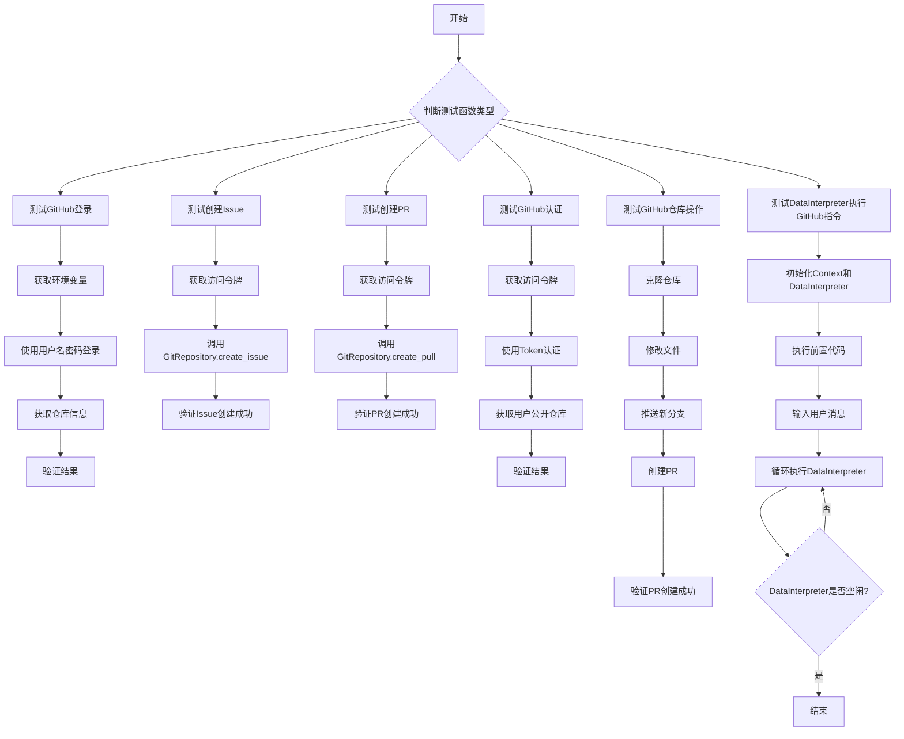
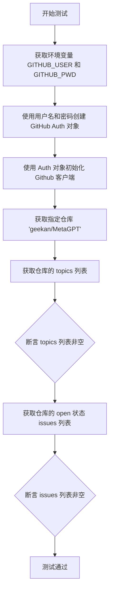
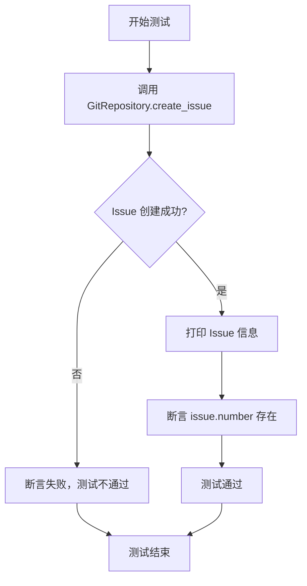
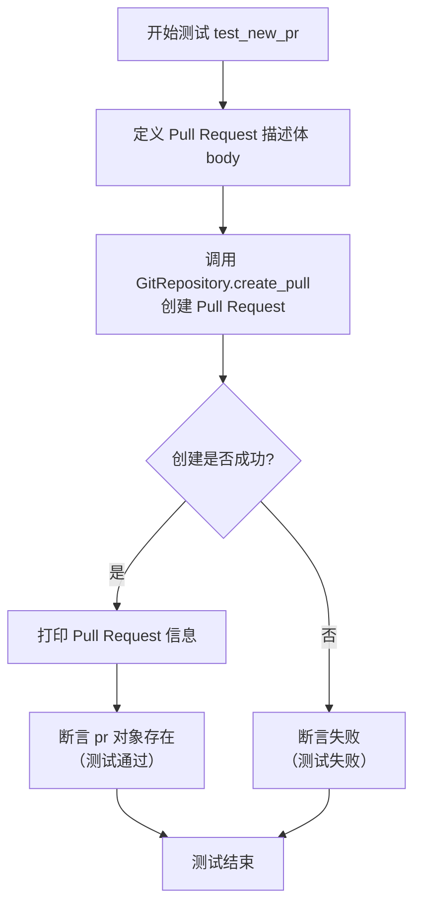
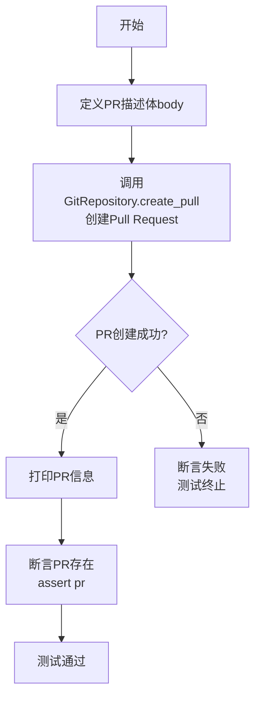
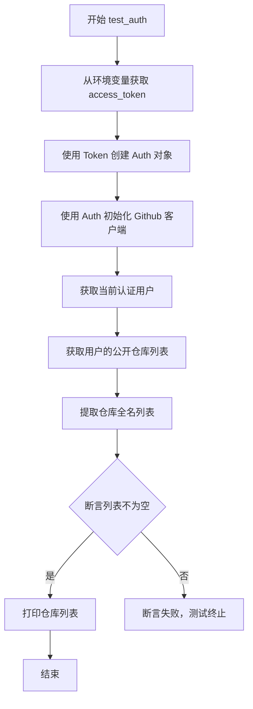
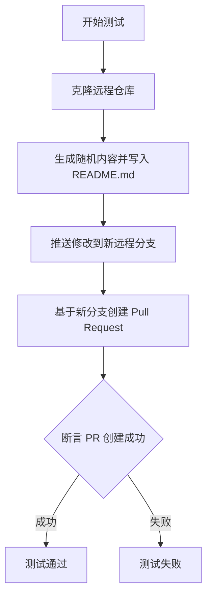
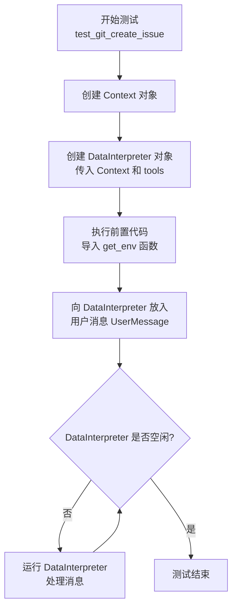

# `.\MetaGPT\tests\metagpt\tools\libs\test_git.py` 详细设计文档

该代码文件是一个测试脚本，主要用于测试与GitHub仓库相关的自动化操作，包括创建Issue、创建Pull Request、克隆仓库、提交代码等。它通过集成MetaGPT框架的DataInterpreter角色，能够根据自然语言指令自动执行GitHub操作，并验证操作结果。

## 整体流程



## 类结构

```
BaseModel (Pydantic基类)
├── SWEBenchItem
├── Context (MetaGPT)
├── DataInterpreter (MetaGPT)
├── UserMessage (MetaGPT)
└── GitRepository (MetaGPT)
```

## 全局变量及字段


### `SWEBenchItem.base_commit`
    
表示SWEBench基准测试项的基础提交哈希值，用于标识代码库的特定版本。

类型：`str`
    


### `SWEBenchItem.repo`
    
表示SWEBench基准测试项对应的GitHub仓库名称或URL，用于定位测试的代码库。

类型：`str`
    
    

## 全局函数及方法

### `get_env`

该函数是一个异步工具函数，用于从操作系统的环境变量中获取指定键的值。它接受一个可选的应用程序名称参数，但当前实现中并未使用该参数，仅根据键名返回对应的环境变量值。

参数：
- `key`：`str`，要获取的环境变量的键名。
- `app_name`：`str`，应用程序名称（当前实现中未使用，保留参数）。

返回值：`str | None`，返回环境变量中对应键的值。如果键不存在，则返回 `None`。

#### 流程图

```mermaid
flowchart TD
    A[开始: get_env(key, app_name)] --> B{环境变量中<br>是否存在 key?}
    B -- 是 --> C[返回 os.environ.get(key)]
    B -- 否 --> D[返回 None]
    C --> E[结束]
    D --> E
```

#### 带注释源码

```python
async def get_env(key: str, app_name: str = ""):
    # 从 os.environ 字典中获取指定 key 对应的环境变量值。
    # 如果 key 不存在，则返回 None。
    # 参数 app_name 在当前实现中未被使用，可能为未来扩展预留。
    return os.environ.get(key)
```

### `test_login`

这是一个使用 pytest 框架编写的异步测试函数，用于测试通过用户名和密码登录 GitHub API 并验证基本功能是否正常。

参数：
- 无显式参数。该函数是一个测试用例，由 pytest 框架调用。

返回值：`None`，该函数是一个测试用例，不返回业务值，而是通过 `assert` 语句验证测试结果。

#### 流程图



#### 带注释源码

```python
@pytest.mark.skip  # 标记此测试用例为跳过，不执行
@pytest.mark.asyncio  # 标记此测试用例为异步函数
async def test_login():
    # 1. 从环境变量中获取 GitHub 用户名和密码
    auth = Auth.Login(await get_env("GITHUB_USER"), await get_env("GITHUB_PWD"))
    # 2. 使用获取到的认证信息创建 GitHub API 客户端
    g = Github(auth=auth)
    # 3. 使用客户端获取指定的远程仓库对象
    repo = g.get_repo("geekan/MetaGPT")
    # 4. 获取该仓库的 topics 列表
    topics = repo.get_topics()
    # 5. 断言 topics 列表不为空，验证基础信息获取功能
    assert topics
    # 6. 获取该仓库所有状态为 'open' 的 issues
    open_issues = repo.get_issues(state="open")
    # 7. 将迭代器转换为列表
    issues = [i for i in open_issues]
    # 8. 断言 issues 列表不为空，验证问题查询功能
    assert issues
```

### `test_new_issue`

这是一个使用 `pytest` 框架编写的异步测试函数，用于测试 `GitRepository.create_issue` 方法的功能。该函数会在指定的 GitHub 仓库中创建一个新的 Issue，并验证创建是否成功。

参数：
- 无显式参数。该函数是一个测试用例，不接收外部参数。

返回值：`None`，该函数是一个测试用例，不返回业务值，仅通过 `assert` 语句验证测试结果。

#### 流程图



#### 带注释源码

```python
@pytest.mark.skip  # 标记此测试用例为跳过状态，执行测试时会忽略它
@pytest.mark.asyncio  # 标记此测试函数为异步函数，需要 asyncio 事件循环
async def test_new_issue():
    # 调用 GitRepository 类的 create_issue 异步方法，在指定仓库创建一个新的 Issue。
    # 参数说明：
    # repo_name: 目标仓库的名称，格式为 "用户名/仓库名"。
    # title: Issue 的标题。
    # body: Issue 的详细内容。
    # access_token: 用于 GitHub API 认证的访问令牌，通过 get_env 函数从环境变量获取。
    issue = await GitRepository.create_issue(
        repo_name="iorisa/MetaGPT",
        title="This is a new issue",
        body="This is the issue body",
        access_token=await get_env(key="access_token", app_name="github"),
    )
    # 打印创建的 Issue 对象信息，便于调试。
    print(issue)
    # 使用 assert 断言验证创建的 Issue 对象是否包含有效的 number 属性。
    # 如果 issue.number 存在且不为 None 或 0，则断言通过，否则测试失败。
    assert issue.number
    # 空语句，无实际作用，通常用于标记代码块结束或满足语法要求。
    pass
```

### `test_new_pr`

这是一个使用 `pytest` 框架编写的异步测试函数，用于测试 `GitRepository.create_pull` 方法的功能。该函数模拟创建一个从 `fixbug/gbk` 分支到 `send18` 分支的 Pull Request。

参数：

-   `无显式参数`：`无`，这是一个测试函数，不接收外部参数。它通过 `pytest.mark.asyncio` 装饰器被异步调用。

返回值：`None`，这是一个测试函数，其主要目的是通过断言（`assert`）来验证功能，不返回业务值。测试框架会根据断言结果判断测试是否通过。

#### 流程图



#### 带注释源码

```python
@pytest.mark.skip  # 标记此测试用例为跳过，执行测试时会忽略此函数
@pytest.mark.asyncio  # 标记此测试函数为异步函数，以便 pytest-asyncio 插件处理
async def test_new_pr():
    # 定义 Pull Request 的详细描述正文，通常包含变更摘要和测试清单
    body = """
    >>> SUMMARY
    >>> Change HTTP library used to send requests
    >>>
    >>> TESTS
    >>>   - [x] Send 'GET' request
    >>>   - [x] Send 'POST' request with/without body
    """
    # 调用 GitRepository 类的异步方法 create_pull 来创建 Pull Request
    # 参数说明：
    # base_repo_name: 目标仓库（base）的名称，格式为 "用户名/仓库名"
    # base: 目标分支名，Pull Request 将被合并到此分支
    # head: 源分支名，包含要合并的更改的分支
    # title: Pull Request 的标题
    # body: Pull Request 的详细描述正文
    # access_token: 用于 GitHub API 认证的访问令牌，通过 get_env 函数从环境变量获取
    pr = await GitRepository.create_pull(
        base_repo_name="iorisa/MetaGPT",
        base="send18",
        head="fixbug/gbk",
        title="Test pr",
        body=body,
        access_token=await get_env(key="access_token", app_name="github"),
    )
    # 打印返回的 Pull Request 对象信息，便于调试
    print(pr)
    # 断言：验证 create_pull 方法返回了一个非空/真值对象。
    # 如果 pr 为 None 或空值，断言失败，测试不通过。
    assert pr
```

### `test_new_pr1`

这是一个使用 `pytest` 框架编写的异步测试函数，用于测试 `GitRepository.create_pull` 方法。它模拟创建一个从 `iorisa/MetaGPT` 仓库的 `fixbug/vscode` 分支到 `send18/MetaGPT` 仓库的 `dev` 分支的 Pull Request。

参数：
- 无显式参数。该函数是一个 `pytest` 测试用例，不接收用户定义的参数。

返回值：`None`，该函数是一个测试用例，其主要目的是通过断言（`assert`）来验证功能，不返回业务值。

#### 流程图



#### 带注释源码

```python
@pytest.mark.skip  # 标记此测试用例为跳过，执行测试时会忽略它
@pytest.mark.asyncio  # 标记此测试用例为异步函数
async def test_new_pr1():
    # 定义Pull Request的描述体，包含SUMMARY和TESTS部分
    body = """
    >>> SUMMARY
    >>> Change HTTP library used to send requests
    >>>
    >>> TESTS
    >>>   - [x] Send 'GET' request
    >>>   - [x] Send 'POST' request with/without body
    """
    # 调用GitRepository的create_pull异步方法创建Pull Request
    pr = await GitRepository.create_pull(
        head_repo_name="iorisa/MetaGPT",  # 源仓库名称
        head="fixbug/vscode",             # 源分支名称
        base_repo_name="send18/MetaGPT",  # 目标仓库名称
        base="dev",                       # 目标分支名称
        title="Test pr",                  # PR标题
        body=body,                        # PR详细描述
        # 从环境变量获取GitHub访问令牌
        access_token=await get_env(key="access_token", app_name="github"),
    )
    print(pr)  # 打印创建的PR对象信息，用于调试
    assert pr  # 断言：确认pr对象被成功创建（非None或非空）
```

### `test_auth`

该函数是一个异步的单元测试，用于验证使用GitHub个人访问令牌（Token）进行身份认证的有效性。它从环境变量中获取访问令牌，使用该令牌创建一个GitHub认证对象，然后获取当前认证用户的公开仓库列表，并断言该列表不为空，最后打印出仓库名称列表。

参数：
- 无显式参数。该函数是一个`pytest`测试用例，不接收自定义参数。

返回值：`None`，该函数是一个测试用例，其主要目的是执行断言（`assert`）以验证功能，不返回业务逻辑值。

#### 流程图



#### 带注释源码

```python
@pytest.mark.skip  # 标记此测试用例为跳过，执行测试时会忽略
@pytest.mark.asyncio  # 标记此测试用例为异步函数
async def test_auth():
    # 从环境变量中获取名为'access_token'、应用名为'github'的访问令牌
    access_token = await get_env(key="access_token", app_name="github")
    # 使用获取到的访问令牌创建一个GitHub Token认证对象
    auth = Auth.Token(access_token)
    # 使用上一步创建的认证对象初始化一个GitHub API客户端
    g = Github(auth=auth)
    # 通过客户端获取当前认证的用户对象
    u = g.get_user()
    # 获取该用户所有可见性为“公开（public）”的仓库
    v = u.get_repos(visibility="public")
    # 使用列表推导式，从仓库对象中提取出完整的仓库名称（格式：`owner/repo`）
    a = [i.full_name for i in v]
    # 断言：确保获取到的公开仓库列表不为空。如果为空，测试将失败。
    assert a
    # 打印出获取到的公开仓库名称列表
    print(a)
    pass  # 函数结束，无实际作用
```

### `test_github`

这是一个使用 `pytest` 框架编写的异步测试函数，用于测试与 GitHub 仓库交互的完整工作流。它首先克隆一个远程仓库，然后在本地修改文件，将修改推送到一个新的远程分支，最后基于这个新分支创建一个 Pull Request。

参数：

- `context`：`Context`，测试执行所需的上下文对象，通常包含配置信息和运行时状态。

返回值：`None`，这是一个测试函数，不返回具体值，通过 `assert` 语句验证测试结果。

#### 流程图



#### 带注释源码

```python
@pytest.mark.skip  # 标记此测试为跳过，不执行
@pytest.mark.asyncio  # 标记此测试为异步函数
async def test_github(context):
    # 1. 克隆指定的远程 Git 仓库到本地
    repo = await GitRepository.clone_from(url="https://github.com/iorisa/snake-game.git")
    
    # 2. 生成一个随机的十六进制字符串作为新内容
    content = uuid.uuid4().hex
    
    # 3. 将生成的内容写入到克隆仓库工作目录下的 README.md 文件中
    await awrite(filename=repo.workdir / "README.md", data=content)
    
    # 4. 将本地修改推送到远程仓库，创建一个以 'feature/' 开头的新分支
    #    使用从环境变量获取的 GitHub 访问令牌进行认证
    branch = await repo.push(
        new_branch=f"feature/{content[0:8]}",  # 新分支名取内容的前8个字符
        access_token=await get_env(key="access_token", app_name="github")
    )
    
    # 5. 基于上一步创建的新分支，向指定的基础仓库发起一个 Pull Request
    pr = await GitRepository.create_pull(
        base=branch.base,  # PR 的目标基础分支
        head=branch.head,  # PR 的源分支（即新创建的分支）
        base_repo_name=branch.repo_name,  # 目标仓库名
        title=f"new pull {content[0:8]}",  # PR 标题
        access_token=await get_env(key="access_token", app_name="github")  # 认证令牌
    )
    
    # 6. 断言 Pull Request 对象被成功创建（非空）
    assert pr
```

### `test_git_create_issue`

这是一个使用 `pytest` 框架编写的异步测试函数，用于测试 `DataInterpreter` 角色（数据解释器）处理与 GitHub 仓库操作相关的自然语言指令的能力。具体来说，它模拟用户输入一个描述 GitHub 操作（如创建 Issue 或解决 Issue 并创建 Pull Request）的指令，然后启动 `DataInterpreter` 来解析和执行该指令，验证其端到端的工作流程。

参数：

- `content`：`str`，一个描述 GitHub 仓库操作任务的字符串。例如，可以是“在仓库 'iorisa/snake-game' 中创建一个新 Issue：'蛇在吃东西后没有变长'”或“解决 GitHub 仓库 https://github.com/iorisa/snake-game.git 中的 Issue #1 '蛇在吃东西后没有变长'，并为此创建一个新的 Pull Request”。

返回值：`None`，这是一个测试函数，其主要目的是通过断言（assert）来验证功能，不返回业务值。如果测试通过，则无异常；如果失败，则抛出 `AssertionError`。

#### 流程图



#### 带注释源码

```python
@pytest.mark.skip  # 标记此测试用例为跳过，执行测试时会忽略
@pytest.mark.asyncio  # 标记此测试函数为异步函数
@pytest.mark.parametrize(  # 参数化测试，可以为同一个测试函数提供多组输入数据
    "content",  # 参数名称
    [  # 参数值列表，这里提供了两个测试用例（第二个被注释掉了）
        # "create a new issue to github repo 'iorisa/snake-game' :'The snake did not grow longer after eating'",
        "Resolve the issue #1 'Snake not growing longer after eating' in the GitHub repository https://github.com/iorisa/snake-game.git', and create a new pull request about the issue"
    ],
)
async def test_git_create_issue(content: str):  # 异步测试函数定义，接收一个字符串参数 content
    context = Context()  # 创建一个空的上下文对象，用于管理运行环境状态
    # 创建一个 DataInterpreter 角色实例
    # context: 传入上一步创建的上下文
    # tools: 指定工具列表为 ["<all>"]，通常表示允许使用所有已注册的工具
    di = DataInterpreter(context=context, tools=["<all>"])

    # 定义一段需要在 DataInterpreter 环境中执行的前置 Python 代码
    # 目的是导入 `get_env` 函数，该函数可能被后续工具调用以获取环境变量（如 GitHub Token）
    prerequisite = "from metagpt.tools.libs import get_env"
    # 在 DataInterpreter 的代码执行环境中运行上述导入语句
    await di.execute_code.run(code=prerequisite, language="python")
    
    # 将用户输入的内容包装成一个 UserMessage 对象，并放入 DataInterpreter 的消息队列中
    di.put_message(UserMessage(content=content))
    
    # 进入一个循环，只要 DataInterpreter 不处于空闲状态（即还有任务要处理），就继续运行
    while not di.is_idle:
        # 执行 DataInterpreter 的主循环，让其处理消息队列、规划动作、执行工具调用等
        await di.run()
    # 循环结束，意味着 DataInterpreter 已处理完所有任务并进入空闲状态，测试函数也随之结束。
    # 此测试函数没有显式的 assert 语句，其成功与否依赖于：
    # 1. DataInterpreter 内部执行过程中没有抛出未捕获的异常。
    # 2. DataInterpreter 成功解析了自然语言指令，并正确调用了相应的工具（如 GitRepository.create_issue, create_pull 等）来完成 GitHub 操作。
    # 如果这些底层操作失败（例如，因为网络问题或权限问题），相关的工具函数可能会抛出异常，从而导致测试失败。
```

## 关键组件

### SWEBenchItem

一个用于表示SWEBench基准测试项的数据模型，包含仓库的基本提交哈希和仓库名称。

### GitRepository

一个封装了Git仓库操作的类，提供了克隆仓库、创建Issue、创建Pull Request等高级功能。

### DataInterpreter

一个数据解释器角色，能够执行代码并使用工具来处理用户消息，实现自动化任务执行。

### Context

上下文管理类，用于维护和管理DataInterpreter等组件运行时的环境状态和配置。

### Github API 集成

通过PyGithub库与GitHub REST API进行交互，实现认证、仓库信息获取、Issue和PR管理等操作。

### 异步测试框架

使用pytest-asyncio进行异步测试，支持对GitHub操作和DataInterpreter任务执行流程的自动化测试。

## 问题及建议

### 已知问题

-   **硬编码的凭据管理**：代码中多处使用 `await get_env(key="access_token", app_name="github")` 来获取GitHub访问令牌。这种方式将敏感信息的管理分散在多个测试函数中，增加了安全风险和维护成本。如果密钥名称或存储位置需要变更，需要修改多处代码。
-   **重复的测试逻辑**：`test_new_pr` 和 `test_new_pr1` 两个测试函数功能高度相似，都是创建Pull Request，只是参数略有不同。这造成了代码冗余，违反了DRY（Don‘t Repeat Yourself）原则，增加了维护负担。
-   **缺乏错误处理**：测试函数（如 `test_login`, `test_new_issue`）在调用外部API（GitHub API）时，没有包含任何错误处理逻辑（如网络异常、认证失败、API限制等）。一旦操作失败，测试会直接抛出异常，不利于问题诊断和测试的健壮性。
-   **测试数据耦合**：测试用例（如 `test_github`）依赖于特定的外部仓库（`"https://github.com/iorisa/snake-game.git"`）和特定的操作（写入随机内容）。这使测试不具备独立性和可重复性，如果外部仓库状态改变或权限变更，测试将失败。
-   **异步环境变量获取**：`get_env` 函数被定义为 `async`，但内部仅调用了同步的 `os.environ.get`。这引入了不必要的异步开销，可能造成误导，并且所有调用方都需要使用 `await`。
-   **被跳过的测试**：所有测试函数均被 `@pytest.mark.skip` 装饰，这意味着它们不会在常规测试套件中运行。虽然这可能是为了避免对外部服务的依赖，但也导致这些测试逻辑无法得到持续验证，可能随着项目演进而过时。

### 优化建议

-   **集中化凭据管理**：创建一个专门的配置管理类或模块（如 `GitHubConfig`），统一管理GitHub认证所需的所有环境变量（如 `GITHUB_ACCESS_TOKEN`）。在测试的setup或fixture中初始化该配置，并在各个测试函数中注入使用，提高安全性和可维护性。
-   **重构重复测试**：将 `test_new_pr` 和 `test_new_pr1` 合并，或使用 `@pytest.mark.parametrize` 为创建PR的不同场景（如同仓库分支间、跨仓库分支间）提供多组测试数据，消除代码重复。
-   **增强错误处理与断言**：在测试函数中包裹外部API调用，使用 `try-except` 捕获特定异常，并利用 `pytest.raises` 来测试异常情况。同时，对API返回的对象进行更详尽的断言，验证其关键属性，而不仅仅是存在性。
-   **使用测试夹具和模拟**：
    -   为依赖外部GitHub仓库的测试（如 `test_github`, `test_git_create_issue`）创建临时测试仓库或使用 `pytest` 的 `tmp_path` fixture来模拟本地仓库操作。
    -   使用 `unittest.mock` 或 `pytest-mock` 来模拟 `Github` 客户端、`GitRepository` 类的方法，避免真实的网络调用，使测试更快、更稳定、更独立。
-   **简化 `get_env` 函数**：将 `get_env` 函数改为同步函数，除非未来需要支持从异步源（如远程配置服务）获取配置。当前实现应改为 `def get_env(key: str, app_name: str = "") -> str:`。
-   **建立可控的集成测试策略**：
    -   移除 `@pytest.mark.skip`，但通过环境变量（如 `RUN_INTEGRATION_TESTS`）或pytest标记（如 `@pytest.mark.integration`）来控制这些对外部服务有依赖的测试的执行。可以配置CI/CD管道在特定条件（如定时任务、发布前）下运行集成测试。
    -   为 `test_git_create_issue` 这类复杂工作流测试，考虑将其分解为更小、更专注的单元测试（测试DataInterpreter的规划、代码执行等）和少量高价值的集成测试。

## 其它


### 设计目标与约束

本代码是一个用于测试GitHub API操作和DataInterpreter功能的集成测试脚本。其设计目标包括：1) 验证与GitHub API（包括认证、仓库操作、Issue和PR管理）的交互功能；2) 测试`GitRepository`工具类的核心方法；3) 验证`DataInterpreter`角色能够理解自然语言指令并调用正确的工具链（包括GitHub操作工具）来完成任务。主要约束包括：1) 所有测试均依赖于外部GitHub服务，需要有效的认证凭据；2) 为避免对生产仓库造成影响，测试应使用特定的测试仓库或妥善清理；3) 测试执行是异步的，需要兼容`asyncio`框架。

### 错误处理与异常设计

代码中的错误处理主要依赖于`pytest`的断言机制来验证操作结果。对于可能失败的外部API调用（如`GitRepository.clone_from`, `create_issue`, `create_pull`），代码通过`assert`语句检查返回对象的关键属性（如`issue.number`, `pr`对象）来隐式验证操作成功。若API调用失败（如网络错误、认证失败、权限不足），相关的库（如`PyGithub`）会抛出异常，导致测试用例失败。`get_env`函数在环境变量不存在时会返回`None`，这可能导致后续操作因缺少必要参数而失败。整体上，错误处理策略是“快速失败”，依赖测试框架来报告异常，缺乏对特定异常类型的捕获和定制化错误恢复逻辑。

### 数据流与状态机

数据流主要围绕GitHub仓库和DataInterpreter的交互。在`test_git_create_issue`中，流程为：1) 用户输入自然语言指令（`content`参数） -> 2) `DataInterpreter`接收指令并解析 -> 3) `DataInterpreter`调用其工具链（包括通过`get_env`获取密钥，调用`GitRepository`相关方法） -> 4) 工具执行结果反馈给`DataInterpreter` -> 5) `DataInterpreter`根据反馈决定下一步行动，循环直至任务完成（`is_idle`为`True`）。`DataInterpreter`内部维护一个任务执行的状态机，从“接收指令”到“规划”、“执行代码/工具”、“观察结果”，再到“判断是否完成”的循环。测试数据（如仓库URL、issue内容、分支名）通过参数化或硬编码方式注入。

### 外部依赖与接口契约

1.  **GitHub API (通过PyGithub库)**：核心外部依赖。代码通过`github.Github`和`Auth`类进行认证和客户端初始化。`GitRepository`类封装了具体的仓库操作（clone, push, create_issue, create_pull）。接口契约包括需要有效的访问令牌（`access_token`）或用户名密码、遵循GitHub的REST API速率限制和操作语义。
2.  **MetaGPT框架**：代码重度依赖MetaGPT框架的多个组件。
    *   `Context`：提供运行时上下文。
    *   `DataInterpreter`：核心AI角色，负责解析指令和调度工具。
    *   `GitRepository`：工具类，封装Git和GitHub操作。
    *   `UserMessage`：消息格式。
    *   `awrite`：工具函数。
3.  **Pydantic**：用于数据验证和序列化，定义了`SWEBenchItem`数据模型。
4.  **Pytest**：测试框架，用于组织测试用例、跳过测试(`@pytest.mark.skip`)、参数化测试(`@pytest.mark.parametrize`)和异步测试支持(`@pytest.mark.asyncio`)。
5.  **环境变量**：所有GitHub操作所需的认证信息（如`GITHUB_USER`, `GITHUB_PWD`, `access_token`）均通过`get_env`函数从环境变量中读取，这是关键的配置依赖。

    