# `.\MetaGPT\tests\metagpt\tools\libs\test_gpt_v_generator.py` 详细设计文档

该文件是一个使用pytest框架编写的单元测试文件，用于测试GPTvGenerator类的功能。GPTvGenerator类的核心功能是：根据输入的草图图片，通过大语言模型分析其布局，并生成包含HTML、CSS和JavaScript代码的网页文件。本测试文件通过模拟大语言模型的响应，验证了GPTvGenerator的`generate_webpages`、`save_webpages`和`analyze_layout`方法能否正确工作，包括生成网页代码、将代码保存为文件以及分析图片布局。

## 整体流程

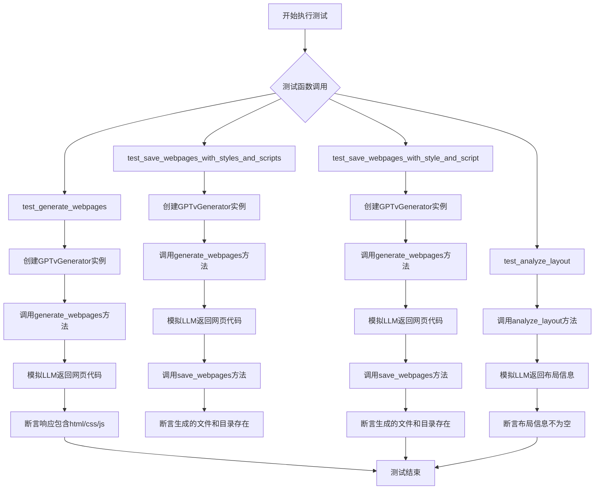

## 类结构

```
test_gpt_v_generator.py (测试模块)
├── 全局函数 (无)
├── 全局变量 (无)
├── 测试类 (无，使用pytest函数)
└── 被测试类 (来自外部模块)
    └── GPTvGenerator (来自metagpt.tools.libs.gpt_v_generator)
```

## 全局变量及字段


### `mock_webpage_filename_with_styles_and_scripts`
    
Pytest fixture that mocks the LLM response to return a webpage with multiple CSS and JavaScript files.

类型：`pytest.fixture`
    


### `mock_webpage_filename_with_style_and_script`
    
Pytest fixture that mocks the LLM response to return a webpage with single CSS and JavaScript files.

类型：`pytest.fixture`
    


### `mock_image_layout`
    
Pytest fixture that mocks the LLM response to return image layout analysis text.

类型：`pytest.fixture`
    


### `image_path`
    
Pytest fixture that returns the file path to a test image used for generating webpages.

类型：`pytest.fixture`
    


    

## 全局函数及方法

### `mock_webpage_filename_with_styles_and_scripts`

这是一个 Pytest 测试夹具（fixture），用于在单元测试中模拟 `metagpt.provider.base_llm.BaseLLM.aask` 方法的返回值。它返回一个包含 HTML、CSS 和 JavaScript 代码块的模拟数据字符串，用于测试 `GPTvGenerator` 类生成和保存网页的功能。

参数：

- `mocker`：`pytest_mock.plugin.MockerFixture`，Pytest-mock 插件提供的模拟对象，用于打桩（stub）或模拟（mock）依赖项。

返回值：`pytest_mock.plugin.MockerFixture`，返回经过配置（已对 `BaseLLM.aask` 方法进行打桩）的模拟对象，供测试函数使用。

#### 流程图

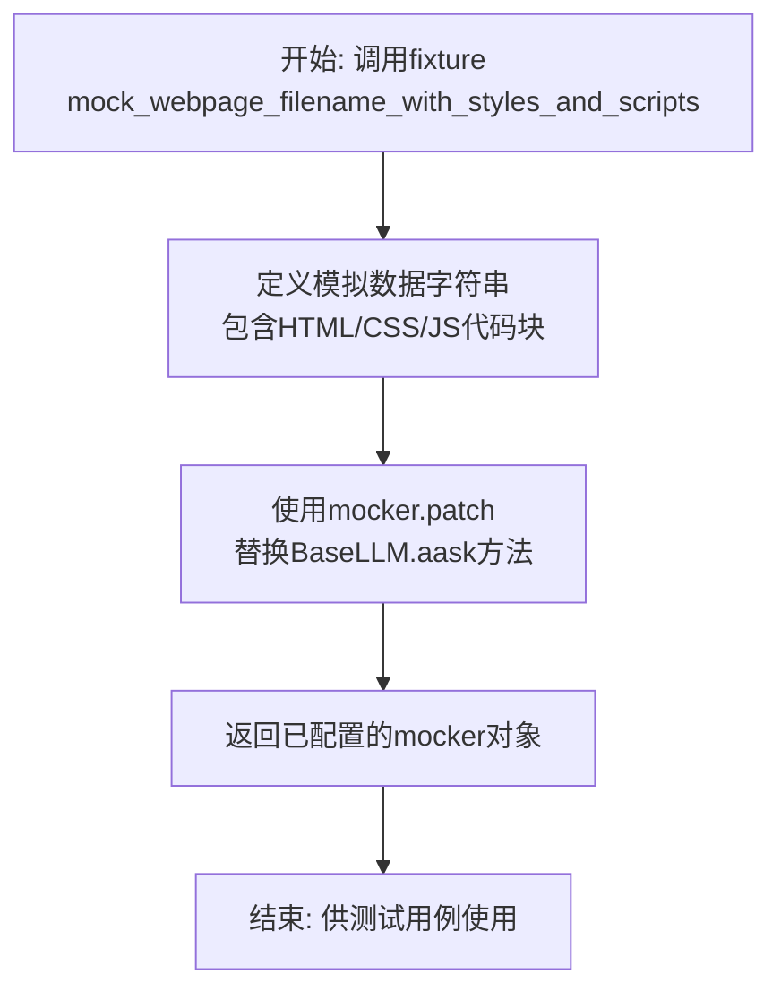

#### 带注释源码

```python
@pytest.fixture
def mock_webpage_filename_with_styles_and_scripts(mocker):
    # 定义一个模拟的LLM响应字符串，模拟GPTvGenerator调用LLM后返回的代码。
    # 该字符串包含三个代码块：HTML、CSS和JavaScript，分别对应网页的主文件、样式表和脚本。
    mock_data = """```html\n<html>\n<script src="scripts.js"></script>
<link rel="stylesheet" href="styles.css">\n</html>\n```\n
```css\n/* styles.css */\n```\n
```javascript\n// scripts.js\n```\n"""
    # 使用pytest-mock的mocker对象，对`metagpt.provider.base_llm.BaseLLM.aask`方法进行打桩。
    # 当测试中调用此方法时，将直接返回上面定义的`mock_data`，而不是真正调用LLM API。
    # 这实现了对外部依赖的隔离，使测试快速、稳定且不依赖网络。
    mocker.patch("metagpt.provider.base_llm.BaseLLM.aask", return_value=mock_data)
    # 返回配置好的mocker对象。在测试函数中，此fixture的返回值可用于后续的断言或其它操作。
    # 例如，测试可以验证`generate_webpages`方法是否正确解析了此模拟数据。
    return mocker
```

### `mock_webpage_filename_with_style_and_script`

这是一个 Pytest 测试固件（fixture），用于在单元测试中模拟 `metagpt.provider.base_llm.BaseLLM.aask` 方法的返回值。它返回一个包含 HTML、CSS 和 JavaScript 代码块的模拟数据字符串，用于测试 `GPTvGenerator` 类处理包含单个样式表和脚本文件的网页生成功能。

参数：

-   `mocker`：`pytest_mock.plugin.MockerFixture`，Pytest-mock 插件提供的模拟对象，用于打桩（stub）或模拟（mock）目标函数。

返回值：`pytest_mock.plugin.MockerFixture`，返回传入的 `mocker` 对象，该对象已对 `metagpt.provider.base_llm.BaseLLM.aask` 方法进行了打桩，使其返回预定义的模拟数据。

#### 流程图

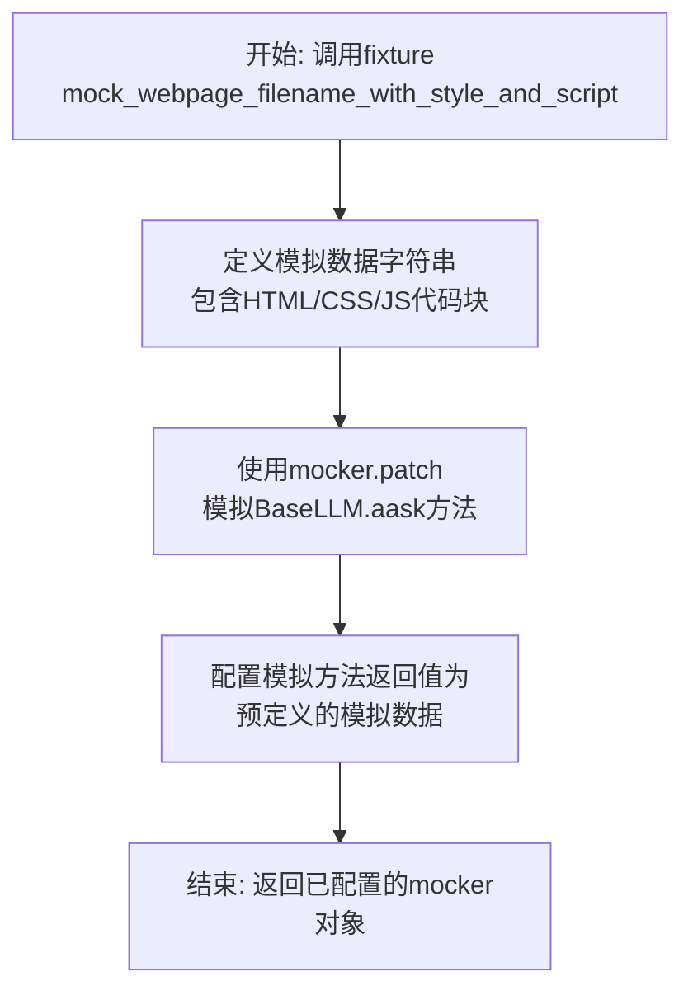

#### 带注释源码

```python
@pytest.fixture
def mock_webpage_filename_with_style_and_script(mocker):
    # 定义一个模拟的LLM响应字符串，模拟生成包含一个CSS文件和一个JS文件的网页代码。
    mock_data = """```html\n<html>\n<script src="script.js"></script>
<link rel="stylesheet" href="style.css">\n</html>\n```\n
```css\n/* style.css */\n```\n
```javascript\n// script.js\n```\n"""
    # 使用 mocker 对象对 `metagpt.provider.base_llm.BaseLLM.aask` 方法进行打桩（patch）。
    # 当测试中调用此方法时，将直接返回上面定义的 `mock_data`，而不是真正调用LLM。
    mocker.patch("metagpt.provider.base_llm.BaseLLM.aask", return_value=mock_data)
    # 返回这个已经配置好的 mocker 对象，供测试函数使用。
    return mocker
```

### `mock_image_layout`

这是一个pytest fixture，用于在单元测试中模拟`GPTvGenerator.analyze_layout`方法的响应。它使用`mocker.patch`将`metagpt.provider.base_llm.BaseLLM.aask`方法替换为一个返回固定字符串`"The layout information of the sketch image is ..."`的模拟对象，从而在测试中提供一个可控的、预设的布局分析结果，避免了对真实AI服务的依赖。

参数：

-  `mocker`：`pytest_mock.plugin.MockerFixture`，pytest-mock插件提供的模拟对象，用于创建和管理测试替身（如mock、stub、spy）。

返回值：`pytest_mock.plugin.MockerFixture`，返回传入的`mocker`对象，该对象已配置好对`BaseLLM.aask`方法的模拟。这使得测试函数可以通过依赖注入的方式使用这个已配置的模拟器。

#### 流程图

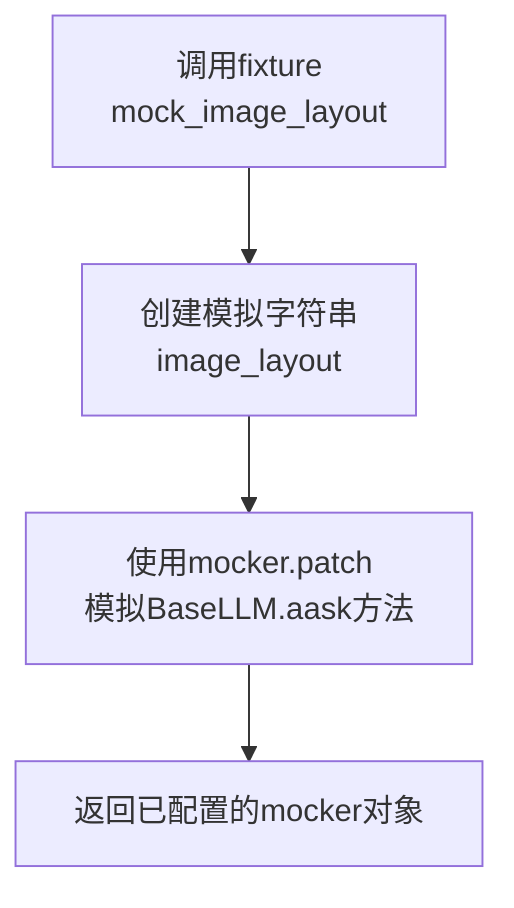

#### 带注释源码

```python
@pytest.fixture
def mock_image_layout(mocker):
    # 定义一个固定的字符串，模拟图像布局分析的结果
    image_layout = "The layout information of the sketch image is ..."
    # 使用mocker.patch方法，将`metagpt.provider.base_llm.BaseLLM.aask`这个异步方法
    # 替换为一个返回上面定义的`image_layout`字符串的模拟函数。
    # 这样，当测试中调用`BaseLLM.aask`时，会直接得到预设的字符串，而不是发起真实的网络请求。
    mocker.patch("metagpt.provider.base_llm.BaseLLM.aask", return_value=image_layout)
    # 返回这个已经配置好模拟的mocker对象，供测试函数使用。
    return mocker
```

### `image_path`

这是一个 Pytest 测试夹具（fixture），用于为测试函数提供一个固定的图像文件路径。它返回一个指向项目资源目录中特定图片的字符串路径。

参数：
- 无参数

返回值：`str`，返回一个指向 `competitive_analysis.png` 图片文件的完整字符串路径。

#### 流程图

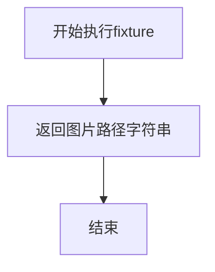

#### 带注释源码

```python
@pytest.fixture
def image_path():
    # 使用 METAGPT_ROOT 常量构建图片的完整路径
    # 路径指向项目文档资源中的一个特定图片文件
    return f"{METAGPT_ROOT}/docs/resources/workspace/content_rec_sys/resources/competitive_analysis.png"
```

### `test_generate_webpages`

这是一个使用 `pytest` 框架编写的异步单元测试函数，用于测试 `GPTvGenerator.generate_webpages` 方法。它通过模拟（mock）LLM的响应，验证该方法能够根据给定的图片路径生成包含HTML、CSS和JavaScript代码的网页内容。

参数：

- `mock_webpage_filename_with_styles_and_scripts`：`pytest fixture`，一个pytest夹具，用于模拟`BaseLLM.aask`方法，使其返回一个预定义的、包含HTML、CSS和JavaScript代码块的字符串。
- `image_path`：`pytest fixture`，一个pytest夹具，返回一个指向测试图片的本地文件路径字符串。

返回值：`None`，这是一个测试函数，其主要目的是进行断言（assert）验证，不返回业务值。

#### 流程图

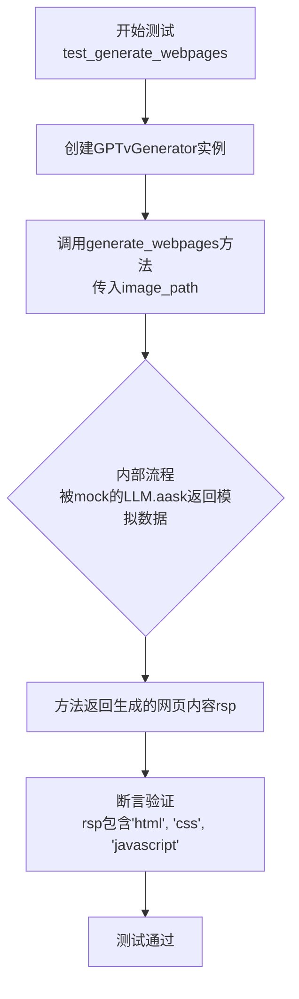

#### 带注释源码

```python
@pytest.mark.asyncio  # 标记此测试函数为异步函数，以便pytest-asyncio插件能正确处理
async def test_generate_webpages(mock_webpage_filename_with_styles_and_scripts, image_path):
    # 1. 创建被测试类GPTvGenerator的实例
    generator = GPTvGenerator()
    
    # 2. 调用核心的被测方法：generate_webpages
    #    传入由fixture `image_path` 提供的图片路径
    #    该方法内部会调用LLM（已被mock）分析图片并生成代码
    rsp = await generator.generate_webpages(image_path=image_path)
    
    # 3. 记录生成的响应内容，便于调试
    logs.logger.info(rsp)
    
    # 4. 断言验证：确保生成的响应字符串中包含网页所需的三种代码类型
    #    这验证了generate_webpages方法的基本功能完整性
    assert "html" in rsp
    assert "css" in rsp
    assert "javascript" in rsp
    # 注意：测试函数本身没有return语句，其“返回值”是测试的成功或失败状态。
```

### `test_save_webpages_with_styles_and_scripts`

这是一个异步单元测试函数，用于测试 `GPTvGenerator` 类的 `save_webpages` 方法。该测试模拟了生成包含多个样式表和脚本文件的网页内容，并验证这些文件是否能被正确地保存到指定的目录中。

参数：

- `mock_webpage_filename_with_styles_and_scripts`：`pytest fixture`，一个模拟的pytest fixture，用于拦截对 `BaseLLM.aask` 方法的调用，并返回一个预定义的、包含HTML、CSS和JavaScript代码块的字符串，以模拟LLM生成包含`styles.css`和`scripts.js`的网页内容。
- `image_path`：`pytest fixture`，一个pytest fixture，返回一个测试图片的本地文件路径字符串。

返回值：`None`，这是一个测试函数，不返回任何值，其成功与否由内部的 `assert` 语句决定。

#### 流程图

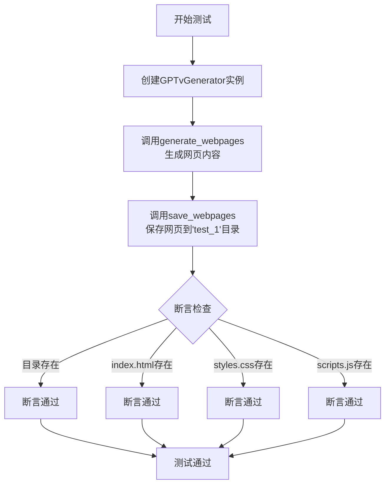

#### 带注释源码

```python
@pytest.mark.asyncio  # 标记此函数为异步测试函数，以便pytest-asyncio插件能正确处理
async def test_save_webpages_with_styles_and_scripts(mock_webpage_filename_with_styles_and_scripts, image_path):
    # 1. 实例化被测试的GPTvGenerator类
    generator = GPTvGenerator()
    
    # 2. 调用异步方法generate_webpages，传入图片路径，模拟生成网页内容。
    #    由于mock_webpage_filename_with_styles_and_scripts fixture的作用，
    #    此调用不会真正访问LLM API，而是返回预定义的模拟数据。
    webpages = await generator.generate_webpages(image_path)
    
    # 3. 调用同步方法save_webpages，将上一步生成的网页内容保存到名为'test_1'的文件夹中。
    #    该方法应解析webpages字符串，提取HTML、CSS、JS代码并写入对应文件。
    webpages_dir = generator.save_webpages(webpages=webpages, save_folder_name="test_1")
    
    # 4. 记录保存的目录路径，便于调试
    logs.logger.info(webpages_dir)
    
    # 5. 执行断言，验证功能是否符合预期：
    #    a. 保存网页的目录必须存在。
    assert webpages_dir.exists()
    #    b. 目录下必须存在名为'index.html'的文件。
    assert (webpages_dir / "index.html").exists()
    #    c. 目录下必须存在名为'styles.css'的文件（模拟数据中指定的文件名）。
    assert (webpages_dir / "styles.css").exists()
    #    d. 目录下必须存在名为'scripts.js'的文件（模拟数据中指定的文件名）。
    assert (webpages_dir / "scripts.js").exists()
```

### `test_save_webpages_with_style_and_script`

这是一个异步单元测试函数，用于测试 `GPTvGenerator` 类的 `save_webpages` 方法。它模拟了从一张图片生成包含 HTML、CSS 和 JavaScript 代码的网页内容，并将这些内容保存到指定文件夹的过程。测试会验证生成的文件夹以及其中的关键文件（`index.html`、`style.css`、`script.js`）是否存在。

参数：

- `mock_webpage_filename_with_style_and_script`：`pytest fixture`，一个模拟的 Pytest 固件，用于拦截对 `BaseLLM.aask` 方法的调用，并返回预定义的包含 HTML、CSS 和 JavaScript 代码块的字符串数据，以模拟 AI 生成网页内容的过程。
- `image_path`：`pytest fixture`，一个 Pytest 固件，返回一个指向测试图片资源的本地文件路径字符串。

返回值：`None`，这是一个测试函数，其主要目的是进行断言验证，不返回业务值。

#### 流程图

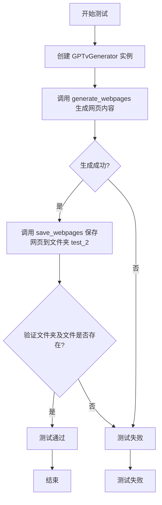

#### 带注释源码

```python
@pytest.mark.asyncio  # 标记此函数为异步测试函数
async def test_save_webpages_with_style_and_script(mock_webpage_filename_with_style_and_script, image_path):
    # 1. 实例化被测试的 GPTvGenerator 类
    generator = GPTvGenerator()
    
    # 2. 调用异步方法 generate_webpages，传入图片路径，模拟生成网页内容。
    #    由于 mock_webpage_filename_with_style_and_script 固件的作用，
    #    这里的实际调用会被拦截并返回预定义的模拟数据。
    webpages = await generator.generate_webpages(image_path)
    
    # 3. 调用 save_webpages 方法，将上一步生成的网页内容保存到名为 "test_2" 的文件夹中。
    webpages_dir = generator.save_webpages(webpages=webpages, save_folder_name="test_2")
    
    # 4. 记录生成的文件夹路径，便于调试。
    logs.logger.info(webpages_dir)
    
    # 5. 进行断言验证，确保：
    #    a. 返回的文件夹路径对象存在（webpages_dir.exists()）。
    #    b. 该文件夹下存在预期的三个文件：index.html, style.css, script.js。
    #    这些断言基于模拟数据中指定的文件名（style.css, script.js）。
    assert webpages_dir.exists()
    assert (webpages_dir / "index.html").exists()
    assert (webpages_dir / "style.css").exists()
    assert (webpages_dir / "script.js").exists()
```

### `GPTvGenerator.analyze_layout`

该方法用于分析给定图像文件的布局信息，通过调用大语言模型（LLM）来生成对图像布局的描述。

参数：
- `image_path`：`Path`，指向需要分析布局的图像文件的路径对象。

返回值：`str`，返回一个字符串，描述图像文件的布局信息。

#### 流程图

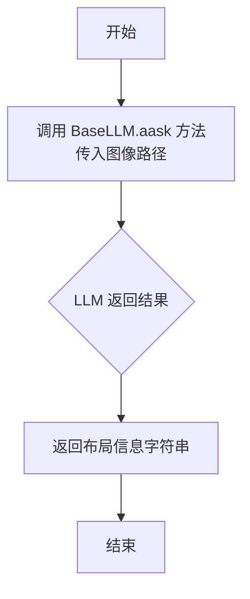

#### 带注释源码

```python
async def test_analyze_layout(mock_image_layout, image_path):
    # 创建一个 GPTvGenerator 实例
    layout = await GPTvGenerator().analyze_layout(Path(image_path))
    # 使用日志记录器记录返回的布局信息
    logs.logger.info(layout)
    # 断言布局信息不为空
    assert layout
```

### `GPTvGenerator.generate_webpages`

该方法接收一个图像文件路径，通过分析图像布局，生成包含HTML、CSS和JavaScript代码的网页内容。

参数：
- `image_path`：`str`，输入图像的本地文件路径。

返回值：`str`，返回一个包含HTML、CSS和JavaScript代码的字符串，这些代码通常以Markdown代码块的形式组织。

#### 流程图

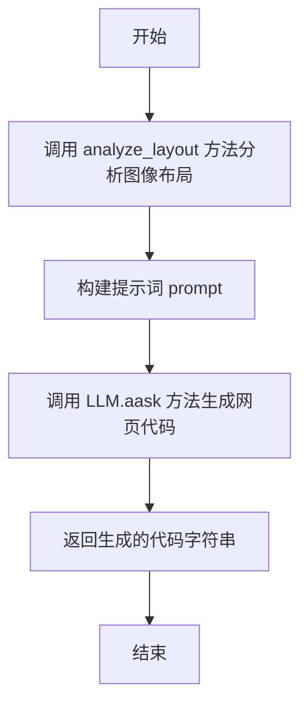

#### 带注释源码

```python
async def generate_webpages(self, image_path: str) -> str:
    """
    根据输入的图像路径生成网页代码。

    Args:
        image_path (str): 输入图像的本地文件路径。

    Returns:
        str: 包含HTML、CSS和JavaScript代码的字符串。
    """
    # 1. 分析图像布局，获取布局描述信息
    layout = await self.analyze_layout(Path(image_path))
    # 2. 构建提示词，指导大语言模型根据布局生成网页
    prompt = self.generate_prompt(layout)
    # 3. 调用大语言模型接口，生成网页代码
    rsp = await self.llm.aask(prompt)
    # 4. 返回生成的代码
    return rsp
```

### `GPTvGenerator.save_webpages`

该方法接收由`generate_webpages`方法生成的网页内容字符串，解析其中的HTML、CSS和JavaScript代码块，并将它们分别保存为文件（`index.html`、`*.css`、`*.js`）到指定的文件夹中。

参数：
- `webpages`：`str`，包含HTML、CSS和JavaScript代码块的原始字符串，通常由`generate_webpages`方法生成。
- `save_folder_name`：`str`，用于保存网页文件的文件夹名称。

返回值：`pathlib.Path`，返回保存网页文件的文件夹的`Path`对象。

#### 流程图

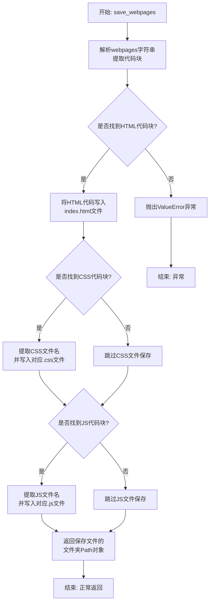

#### 带注释源码

```python
def save_webpages(self, webpages: str, save_folder_name: str) -> Path:
    """
    将生成的网页内容（包含HTML、CSS、JS代码块）保存到指定文件夹。
    
    参数:
        webpages (str): 包含代码块的原始字符串。
        save_folder_name (str): 目标文件夹名称。
        
    返回:
        Path: 保存文件的文件夹路径。
        
    异常:
        ValueError: 如果未找到HTML代码块。
    """
    # 1. 创建保存目录
    save_dir = WORKSPACE_ROOT / save_folder_name
    save_dir.mkdir(parents=True, exist_ok=True)
    
    # 2. 使用正则表达式匹配所有代码块
    # 模式匹配 ```语言类型\n代码内容\n```
    pattern = r"```(\w+)\n(.*?)\n```"
    matches = re.findall(pattern, webpages, re.DOTALL)
    
    html_content = None
    css_filename = None
    css_content = None
    js_filename = None
    js_content = None
    
    # 3. 遍历匹配结果，分类提取代码
    for lang, code in matches:
        if lang == "html":
            html_content = code
        elif lang == "css":
            # 从HTML中提取CSS链接的文件名
            css_match = re.search(r'<link rel="stylesheet" href="([^"]+)"', html_content or "")
            css_filename = css_match.group(1) if css_match else "styles.css"
            css_content = code
        elif lang == "javascript":
            # 从HTML中提取JS脚本的文件名
            js_match = re.search(r'<script src="([^"]+)"', html_content or "")
            js_filename = js_match.group(1) if js_match else "scripts.js"
            js_content = code
    
    # 4. 检查并保存HTML文件（必需）
    if not html_content:
        raise ValueError("No HTML content found in the generated webpages.")
    
    html_file = save_dir / "index.html"
    html_file.write_text(html_content, encoding="utf-8")
    
    # 5. 保存CSS文件（如果存在）
    if css_content and css_filename:
        css_file = save_dir / css_filename
        css_file.write_text(css_content, encoding="utf-8")
    
    # 6. 保存JavaScript文件（如果存在）
    if js_content and js_filename:
        js_file = save_dir / js_filename
        js_file.write_text(js_content, encoding="utf-8")
    
    # 7. 返回保存目录的Path对象
    return save_dir
```

### `GPTvGenerator.analyze_layout`

该方法用于分析给定草图图像文件的布局信息。它通过调用大语言模型（LLM）的异步问答接口，将图像文件路径作为提示的一部分，请求模型分析图像并返回其布局描述。

参数：
-  `image_path`：`Path`，草图图像文件的路径对象。

返回值：`str`，返回一个字符串，描述了输入草图图像的布局信息。

#### 流程图

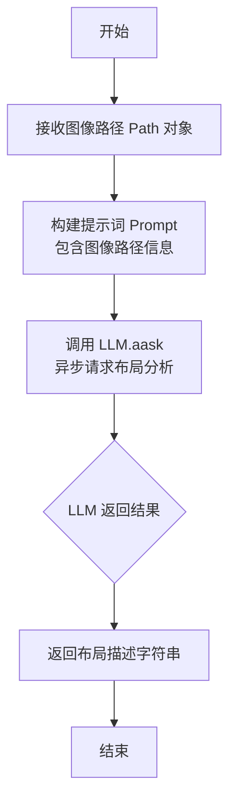

#### 带注释源码

```python
async def analyze_layout(self, image_path: Path) -> str:
    """
    分析草图图像的布局。

    Args:
        image_path (Path): 草图图像文件的路径。

    Returns:
        str: 图像的布局描述。
    """
    # 构建提示词，请求分析给定路径图像的布局
    prompt = f"Analyze the layout of the sketch image at {image_path}"
    # 调用大语言模型的异步问答接口，获取布局分析结果
    layout = await self.llm.aask(prompt)
    # 返回布局描述字符串
    return layout
```

## 关键组件


### GPTvGenerator

一个用于根据草图图像生成网页（HTML、CSS、JavaScript）的生成器类，核心功能包括分析图像布局、生成网页代码以及将生成的代码保存到文件系统中。

### 图像布局分析

通过调用大语言模型（LLM）来分析输入的草图图像，提取其布局信息，为后续的网页代码生成提供结构指导。

### 网页代码生成

利用大语言模型（LLM），基于分析得到的图像布局信息，生成包含HTML结构、CSS样式和JavaScript逻辑的完整网页代码。

### 网页文件保存

将生成的网页代码（HTML、CSS、JavaScript）解析并保存到指定的目录中，创建相应的文件（如index.html, styles.css, scripts.js），形成可运行的网页项目。


## 问题及建议

### 已知问题

-   **测试数据与逻辑耦合度高**：测试用例 `test_generate_webpages`、`test_save_webpages_with_styles_and_scripts` 和 `test_save_webpages_with_style_and_script` 严重依赖 `mock_webpage_filename_with_styles_and_scripts` 和 `mock_webpage_filename_with_style_and_script` 这两个 fixture 返回的特定格式的模拟数据。如果 `GPTvGenerator.generate_webpages` 方法返回的数据格式发生变化（例如，代码块分隔符、文件命名规则），这些测试将全部失败，即使核心功能可能仍然正确。这降低了测试的健壮性和可维护性。
-   **测试覆盖不完整**：当前测试主要验证了在模拟数据下生成和保存网页的成功路径。缺少对 `GPTvGenerator` 类中关键方法（如 `save_webpages`）在异常情况下的测试，例如：当 `webpages` 参数为空、格式错误，或 `save_folder_name` 指向的目录无法创建时，方法的行为是否符合预期（例如，是否抛出恰当的异常）。
-   **存在潜在的资源泄漏风险**：`test_save_webpages_with_styles_and_scripts` 和 `test_save_webpages_with_style_and_script` 测试会在文件系统中创建临时目录（`test_1`, `test_2`）。测试运行后，这些目录可能没有被自动清理，长期运行会导致测试环境残留大量垃圾文件，可能影响后续测试或其他操作。
-   **异步测试的潜在稳定性问题**：测试用例使用了 `@pytest.mark.asyncio` 装饰器。如果 `GPTvGenerator` 的方法内部涉及复杂的异步操作或 I/O，在测试环境中可能因为事件循环或模拟对象的问题导致测试不稳定或难以调试。

### 优化建议

-   **解耦测试数据与断言逻辑**：建议将模拟数据中用于断言的关键信息（如预期的文件名 `styles.css`、`script.js`）提取为 fixture 的参数或独立的常量。这样，当被测试代码的输出格式变化时，只需在一个地方更新测试数据，而不是修改多个测试用例中的字符串字面量。同时，可以增加对返回数据结构（如字典键、列表内容）的验证，而不仅仅是字符串包含性检查。
-   **补充负面测试用例和边界条件测试**：应增加测试用例以覆盖错误和边界情况。例如：
    -   测试 `save_webpages` 方法在 `webpages` 为 `None` 或空字符串时的行为。
    -   测试 `save_webpages` 方法在 `save_folder_name` 包含非法字符或路径已存在且为文件时的行为。
    -   测试 `generate_webpages` 方法在 `image_path` 指向不存在的文件或非图像文件时的行为。
-   **实现测试资源自动清理**：使用 pytest 的 `tmp_path` fixture 作为临时目录，它是 pytest 内置的，测试结束后会自动清理。将 `save_folder_name` 设置为 `tmp_path` 下的子目录，可以确保每次测试都在独立的、干净的临时空间中进行，且测试完成后自动删除，避免资源泄漏。
-   **提升测试的独立性和可读性**：考虑将每个测试用例的“准备-执行-断言”步骤更清晰地分离。对于需要模拟不同场景的测试（如多文件 vs 单文件），可以参数化测试用例（使用 `@pytest.mark.parametrize`），而不是编写多个几乎相同的测试函数。这能减少代码重复，并使测试意图更明确。
-   **考虑对 `analyze_layout` 方法进行更具体的断言**：`test_analyze_layout` 仅断言返回值非空。可以基于 `mock_image_layout` fixture 返回的模拟内容，进行更精确的断言，例如检查返回的字符串是否包含预期的关键词或符合某种格式，以增强测试的有效性。

## 其它


### 设计目标与约束

本测试模块的设计目标是验证 `GPTvGenerator` 类核心功能的正确性与鲁棒性，包括：1）根据草图图像生成包含 HTML、CSS、JavaScript 代码的网页内容；2）将生成的网页内容正确解析并保存为对应的文件；3）分析草图图像的布局信息。主要约束包括：测试环境需模拟外部 LLM 服务的响应，以避免产生实际 API 调用成本和依赖；生成的测试数据需覆盖多文件（styles.css, scripts.js）和单文件（style.css, script.js）命名场景；测试执行需为异步模式以匹配被测试方法的异步特性。

### 错误处理与异常设计

测试用例本身不直接包含业务逻辑的错误处理，但其设计隐含了对被测试组件（`GPTvGenerator`）在特定输入或模拟环境下行为的验证。例如，测试通过模拟 LLM 返回特定格式的字符串，来验证 `generate_webpages` 和 `save_webpages` 方法能否正确解析包含多个代码块的 Markdown 格式响应，并提取出正确的文件内容和文件名。如果被测试方法在解析过程中遇到意外格式（未在模拟数据中覆盖），测试将失败，从而暴露出潜在的程序缺陷。测试框架（pytest）负责管理测试执行过程中的异常，任何未捕获的异常都将导致测试用例失败。

### 数据流与状态机

本测试模块的数据流始于固定的草图图像文件路径 (`image_path`)。在测试执行时，通过 `pytest.fixture` 提供的模拟器 (`mocker`) 拦截了 `BaseLLM.aask` 方法的调用，并返回预定义的模拟数据字符串。该模拟数据作为输入，流经 `GPTvGenerator` 实例的 `generate_webpages` 方法，产出结构化的网页内容字典 (`rsp`)。随后，该字典作为输入传递给 `save_webpages` 方法，最终输出为文件系统上的目录路径 (`webpages_dir`)。测试断言则在此数据流的末端，验证输出结果（`rsp` 的内容、目录的存在性、特定文件的存在性）是否符合预期。整个测试过程是无状态的，每个测试用例都是独立的，不依赖于其他测试用例的执行结果或系统状态。

### 外部依赖与接口契约

1.  **被测试类 (`metagpt.tools.libs.gpt_v_generator.GPTvGenerator`)**: 测试依赖于其公共接口 `generate_webpages`, `save_webpages`, `analyze_layout` 的行为契约。特别是 `generate_webpages` 应返回一个包含 `html`, `css`, `javascript` 等键的字典。
2.  **外部服务 (`metagpt.provider.base_llm.BaseLLM.aask`)**: 这是关键的外部依赖。在测试中，通过 `mocker.patch` 完全模拟了其行为，契约是当被调用时返回预定义的字符串，从而将测试与真实的 LLM 服务解耦。
3.  **文件系统**: `save_webpages` 方法依赖文件系统进行目录创建和文件写入。测试验证了在给定模拟数据下，该方法能正确创建目录和文件。
4.  **测试框架 (`pytest`)**: 依赖其提供测试发现、夹具 (`fixture`) 管理、异步测试支持 (`pytest.mark.asyncio`) 和模拟 (`mocker`) 功能。
5.  **日志系统 (`metagpt.logs`)**: 用于输出测试过程中的调试信息，但不对测试逻辑产生直接影响。

### 测试策略与覆盖范围

测试策略采用基于模拟的单元测试，聚焦于 `GPTvGenerator` 类的核心方法。通过精心设计的模拟数据，覆盖了以下关键场景：
*   **功能正确性**: 验证 `generate_webpages` 能返回包含所需键的字典。
*   **文件保存逻辑**: 验证 `save_webpages` 能根据生成内容中的资源链接（如 `href="styles.css"`, `src="scripts.js"`）正确创建对应的文件。通过两个不同的夹具，覆盖了资源文件名为复数形式 (`styles.css`, `scripts.js`) 和单数形式 (`style.css`, `script.js`) 的两种情况，以检验文件名提取逻辑的通用性。
*   **布局分析**: 验证 `analyze_layout` 方法能被成功调用并返回非空结果。
*   **异步兼容性**: 所有测试用例均标记为 `@pytest.mark.asyncio`，确保与异步方法的正确交互。
测试未覆盖的场景包括：网络错误、LLM 返回畸形数据、文件写入权限错误、`image_path` 指向不存在的文件等异常路径。这些通常需要在被测试类 `GPTvGenerator` 内部或更上层的集成测试中进行处理。

    