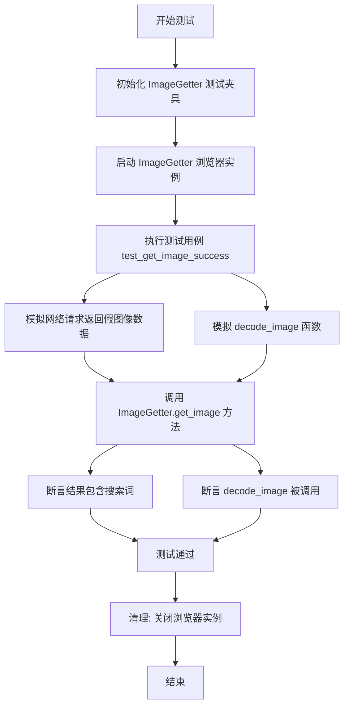
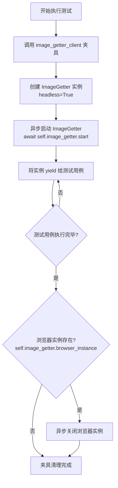
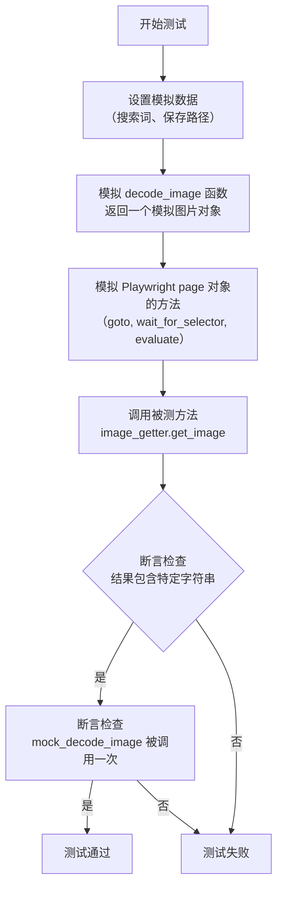

# `.\MetaGPT\tests\metagpt\tools\libs\test_image_getter.py` 详细设计文档

该文件是一个使用 pytest 和 pytest-asyncio 编写的异步单元测试文件，用于测试 ImageGetter 类从网络获取、解码并保存图像的核心功能。测试通过模拟（Mock）外部依赖（如网络请求和图像解码）来验证 ImageGetter 在成功场景下的行为。

## 整体流程



## 类结构

```
TestImageGetter (测试类)
├── image_getter_client (异步夹具方法)
└── test_get_image_success (异步测试方法)
```

## 全局变量及字段


### `TestImageGetter.image_getter`
    
用于测试的ImageGetter实例，提供图像获取功能。

类型：`ImageGetter`
    
    

## 全局函数及方法

### `TestImageGetter.image_getter_client`

这是一个 pytest 异步测试夹具，用于在 `TestImageGetter` 测试类中初始化和清理 `ImageGetter` 实例。它确保每个测试方法运行前都有一个已启动的 `ImageGetter` 实例可用，并在测试结束后正确关闭其浏览器实例。

参数：
- 无显式参数。此夹具使用 `autouse=True` 装饰，会自动应用于 `TestImageGetter` 类中的所有测试方法。

返回值：`AsyncGenerator[ImageGetter, None]`，在测试执行期间生成一个已启动的 `ImageGetter` 实例。

#### 流程图



#### 带注释源码

```python
@pytest_asyncio.fixture(autouse=True)  # 装饰器：将此函数标记为 pytest 异步夹具，`autouse=True` 使其自动应用于类中的所有测试
async def image_getter_client(self):  # 定义异步夹具函数，`self` 指代测试类实例
    """Fixture to initialize the ImageGetter."""  # 文档字符串：说明此夹具用于初始化 ImageGetter
    self.image_getter = ImageGetter(headless=True)  # 创建 ImageGetter 实例，设置为无头模式
    await self.image_getter.start()  # 异步启动 ImageGetter 实例（例如，启动浏览器）
    yield self.image_getter  # 将实例提供给测试用例使用，测试执行在此处暂停
    if self.image_getter.browser_instance:  # 测试执行完毕后，检查浏览器实例是否存在
        await self.image_getter.browser_instance.close()  # 如果存在，则异步关闭浏览器实例以清理资源
```

### `TestImageGetter.test_get_image_success`

该方法是一个单元测试，用于验证 `ImageGetter.get_image` 方法在成功获取并保存图片时的行为。它通过模拟（Mock）外部依赖（如网络请求和图片解码）来确保测试的隔离性和可重复性。

参数：

- `self`：`TestImageGetter`，测试类实例的引用。
- `mock_decode_image`：`unittest.mock.MagicMock`，被 `@patch` 装饰器注入的模拟对象，用于替换 `metagpt.tools.libs.image_getter.decode_image` 函数。

返回值：`None`，测试方法通常不返回值，其成功与否由断言（`assert`）决定。

#### 流程图



#### 带注释源码

```python
    @patch("metagpt.tools.libs.image_getter.decode_image") # 使用patch装饰器模拟`decode_image`函数，避免测试时进行实际的图片解码
    async def test_get_image_success(self, mock_decode_image): # 定义异步测试方法，`mock_decode_image`是注入的模拟对象
        """Test successfully retrieving and saving an image.""" # 测试方法的文档字符串：测试成功检索和保存图片
        search_term = "nature" # 定义测试用的搜索关键词
        image_save_path = Path.cwd() / "test_image_getter.jpg" # 构造测试用的图片保存路径

        # Mock the decode_image to avoid actual image decoding
        mock_image = AsyncMock() # 创建一个异步模拟对象，作为模拟的图片
        mock_decode_image.return_value = mock_image # 设置模拟的`decode_image`函数返回这个模拟图片对象

        # Mock the Playwright page evaluation result to return a dummy base64 image string
        self.image_getter.page.goto = AsyncMock() # 将`image_getter`内部page对象的`goto`方法替换为异步模拟对象
        self.image_getter.page.wait_for_selector = AsyncMock() # 将`wait_for_selector`方法替换为异步模拟对象
        self.image_getter.page.evaluate = AsyncMock(return_value="data:image/png;base64,FAKEBASE64STRING") # 将`evaluate`方法替换为异步模拟对象，并预设其返回一个伪造的base64图片数据字符串

        result = await self.image_getter.get_image(search_term, str(image_save_path)) # 调用被测试的`get_image`方法，传入搜索词和保存路径，并等待其返回结果

        assert f"{search_term} found." in result # 断言：检查返回的结果字符串中是否包含“{search_term} found.”，以验证成功逻辑
        mock_decode_image.assert_called_once() # 断言：检查模拟的`decode_image`函数是否被调用了一次，验证了图片解码流程被触发
```

## 关键组件


### ImageGetter

ImageGetter 是一个用于自动化网页图像获取的工具类，它通过浏览器自动化技术（如 Playwright）导航到搜索引擎，执行图像搜索，并下载指定的图像。

### 浏览器自动化与页面交互

该组件负责启动和控制一个无头浏览器实例，加载特定页面（如 Google 图片搜索），执行 JavaScript 代码以获取图像数据，并管理浏览器的生命周期。

### 图像解码与保存

该组件负责处理从网页获取的 Base64 编码图像数据，将其解码为图像对象，并保存到指定的本地文件路径。

### 异步操作与并发控制

整个工具被设计为异步操作，以适应网络请求和浏览器交互的 I/O 密集型特性，确保在高并发场景下的效率和资源管理。

### 单元测试与模拟

通过使用 `pytest` 和 `unittest.mock` 库，该组件包含了完整的单元测试，用于验证核心功能（如图像获取和保存）的正确性，同时通过模拟（Mock）外部依赖（如网络请求和图像解码）来确保测试的独立性和可靠性。


## 问题及建议


### 已知问题

-   **测试覆盖不完整**：当前测试用例仅覆盖了成功的场景 (`test_get_image_success`)，缺少对异常路径的测试，例如网络请求失败、页面元素未找到、图片解码失败、文件保存失败等情况。这可能导致生产环境中未预期的错误。
-   **测试数据硬编码**：测试中使用的模拟数据（如 `"data:image/png;base64,FAKEBASE64STRING"`）是硬编码的，虽然简单，但未能验证 `ImageGetter` 与 `decode_image` 函数之间复杂的数据交互逻辑，例如不同图片格式（jpeg, webp）或损坏的 base64 字符串的处理。
-   **资源清理依赖 Fixture**：浏览器实例的关闭依赖于 `image_getter_client` fixture 的 `yield` 机制。如果测试方法中在 `ImageGetter` 初始化后但 `yield` 前发生异常，或者测试方法直接创建了新的 `ImageGetter` 实例，可能导致浏览器资源未被正确清理，存在资源泄漏风险。
-   **Mock 对象作用域模糊**：测试中 Mock 了 `self.image_getter.page` 的多个方法（`goto`, `wait_for_selector`, `evaluate`）。这些 Mock 被应用于整个测试类的 `image_getter` 实例，可能无意中影响其他测试方法（如果存在的话），降低了测试的隔离性。
-   **路径处理依赖当前工作目录**：测试中构造的 `image_save_path` 依赖于 `Path.cwd()`，这使测试结果受执行时的工作目录影响，可能导致跨环境（如不同开发机、CI/CD 流水线）的不一致行为或文件写入到非预期位置。

### 优化建议

-   **补充异常场景测试**：增加测试用例，使用 `pytest.raises` 或检查错误返回值/日志，来验证 `ImageGetter.get_image` 方法在输入无效、网络错误、页面加载超时、选择器未找到、解码失败、文件权限错误等情况下的行为是否符合预期。
-   **增强 Mock 数据的真实性和多样性**：可以创建更真实的模拟 base64 字符串（例如，一个微小的有效 PNG 的 base64），或者使用 `pytest` 的参数化功能 (`@pytest.mark.parametrize`) 来测试多种图片格式和边界情况的数据。
-   **显式资源管理**：考虑在每个测试方法的 `async def teardown_method(self)` 中显式检查并关闭浏览器实例，作为 Fixture 清理的补充，确保即使测试中途失败也能释放资源。或者，确保测试方法不绕过 Fixture 创建额外实例。
-   **使用更精确的 Mock 作用域**：将 `self.image_getter.page` 相关方法的 Mock 移到具体的测试方法内部，或者使用 `patch.object` 在方法级别进行 Mock，避免 Mock 状态在测试间泄露。确保每个测试方法都从一个干净、确定的状态开始。
-   **使用临时目录进行文件操作**：利用 `pytest` 的 `tmp_path` fixture 来创建和管理临时文件与目录。将 `image_save_path` 设置为 `tmp_path / "test_image.jpg"`，这样可以确保文件被隔离在临时区域，测试后自动清理，且路径确定，不受运行环境干扰。
-   **考虑添加集成测试**：在单元测试确保逻辑正确的基础上，可以添加少量集成测试（标记为 `@pytest.mark.integration` 并可能通过 CI 条件执行），使用真实的、可公开访问的搜索词和沙箱环境，验证 `ImageGetter` 与真实浏览器的端到端集成是否基本可用。


## 其它


### 设计目标与约束

本测试代码的设计目标是验证 `ImageGetter` 类中 `get_image` 方法的核心功能，即根据搜索词获取图片并保存到指定路径。主要约束包括：
1.  **隔离性**：测试必须与外部网络和真实的浏览器环境隔离，通过 Mock 和 Patch 技术模拟所有外部依赖。
2.  **异步支持**：被测方法 `get_image` 是异步的，因此测试框架需使用 `pytest.mark.asyncio` 和 `pytest_asyncio.fixture` 来支持异步测试。
3.  **资源管理**：测试夹具 (`image_getter_client`) 需要确保 `ImageGetter` 实例及其底层的浏览器实例在测试前后被正确地初始化和清理，防止资源泄漏。
4.  **可重复性**：测试不应依赖不稳定的外部服务（如真实的搜索引擎图片结果），所有交互都应通过 Mock 对象控制，确保测试结果稳定。

### 错误处理与异常设计

当前测试代码主要关注“成功路径”的验证 (`test_get_image_success`)。从代码结构推断，`ImageGetter.get_image` 方法可能涉及以下需要处理的异常场景，但本测试用例未覆盖：
1.  **网络或页面加载失败**：`page.goto` 可能失败。测试中通过 `AsyncMock` 模拟了成功调用，但未测试超时、404等异常情况。
2.  **元素查找失败**：`page.wait_for_selector` 可能超时。测试中同样通过 Mock 规避了此问题。
3.  **图片数据获取失败**：`page.evaluate` 可能返回空字符串、无效的 Base64 数据或非图片数据。测试中固定返回一个伪造的 Base64 字符串。
4.  **图片解码或保存失败**：`decode_image` 函数可能因数据格式错误、磁盘权限不足或路径无效而失败。测试中通过 Mock 规避了实际的解码和保存操作。
5.  **浏览器实例异常**：`browser_instance` 可能在操作过程中意外关闭。夹具的清理逻辑 (`yield` 之后) 尝试关闭浏览器实例，但假设了 `browser_instance` 存在且状态正常。

测试套件应补充针对上述异常场景的测试用例，以验证 `ImageGetter` 的错误处理逻辑（例如，是否抛出自定义异常、返回错误信息或进行重试）。

### 数据流与状态机

本测试模拟了 `ImageGetter.get_image` 方法执行过程中的核心数据流：
1.  **输入**：测试用例提供 `search_term` ("nature") 和 `image_save_path` (一个临时文件路径)。
2.  **模拟请求与响应**：
    *   `self.image_getter.page.goto` 被 Mock，模拟导航到某个搜索页面（具体 URL 由 `ImageGetter` 内部逻辑决定，测试不关心）。
    *   `self.image_getter.page.wait_for_selector` 被 Mock，模拟等待图片元素出现。
    *   `self.image_getter.page.evaluate` 被 Mock，返回一个固定的伪造 Base64 图片数据字符串 (`"data:image/png;base64,FAKEBASE64STRING"`)。
3.  **数据处理**：Mock 的 `decode_image` 函数接收上一步伪造的 Base64 字符串，并返回一个 Mock 的图片对象 (`mock_image`)。
4.  **输出验证**：断言 `get_image` 方法的返回结果字符串中包含 `"{search_term} found."`，并验证 `mock_decode_image` 被调用了一次。

**状态机**：测试夹具 `image_getter_client` 定义了 `ImageGetter` 实例的生命周期状态：
*   **初始状态**：`ImageGetter` 未初始化，浏览器未启动。
*   **准备状态** (`yield` 前)：创建 `ImageGetter` 实例并调用 `start()`，浏览器启动，`page` 对象就绪。
*   **测试执行状态** (`yield` 后)：测试函数在此状态下运行，使用已初始化的 `image_getter` 实例。
*   **清理状态** (`yield` 后)：测试函数执行完毕，检查并关闭 `browser_instance`，资源释放，回到初始状态。

### 外部依赖与接口契约

测试代码通过 Mock 和 Patch 显式地定义并隔离了以下外部依赖的接口契约：

1.  **`metagpt.tools.libs.image_getter.decode_image` 函数**：
    *   **契约**：接受一个参数（推测为 Base64 字符串或图片数据），返回一个可操作的图片对象（在测试中被 `AsyncMock` 实例替代）。
    *   **测试中的模拟**：使用 `@patch` 装饰器替换为 Mock 对象 (`mock_decode_image`)，并预设其返回值为一个 `AsyncMock` 实例。

2.  **Playwright Page 对象 (`self.image_getter.page`)**：
    *   **`goto(url)` 方法契约**：异步导航到指定 URL。
    *   **`wait_for_selector(selector)` 方法契约**：异步等待指定 CSS 选择器的元素出现在页面中。
    *   **`evaluate(script)` 方法契约**：在浏览器上下文中执行 JavaScript 代码并返回结果。在本测试上下文中，`script` 预计会提取图片的 Base64 数据。
    *   **测试中的模拟**：这三个方法都被替换为 `AsyncMock` 对象。`evaluate` 的返回值被预设为一个伪造的 Base64 数据 URI 字符串。

3.  **文件系统 (`Path`)**：
    *   **契约**：`image_save_path` 指向的位置可写。
    *   **测试中的处理**：使用 `Path.cwd()` 生成一个当前工作目录下的路径。由于 `decode_image` 被 Mock，实际的写文件操作并未发生，因此该路径的有效性未被严格测试。

4.  **`ImageGetter` 类本身（被测对象）**：
    *   **`__init__(headless: bool)`**：测试中指定 `headless=True`。
    *   **`start()` 方法契约**：异步方法，启动浏览器并初始化 `page` 等属性。由测试夹具调用。
    *   **`get_image(search_term: str, save_path: str) -> str` 方法契约**：核心被测方法。接受搜索词和保存路径，返回一个描述性的结果字符串。其内部实现依赖于上述 Playwright Page 对象的方法和 `decode_image` 函数。

    