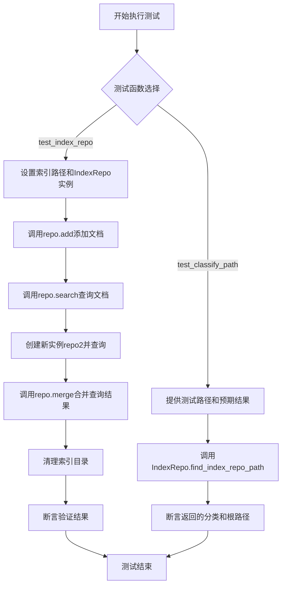
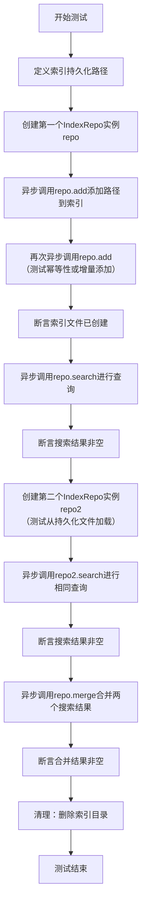
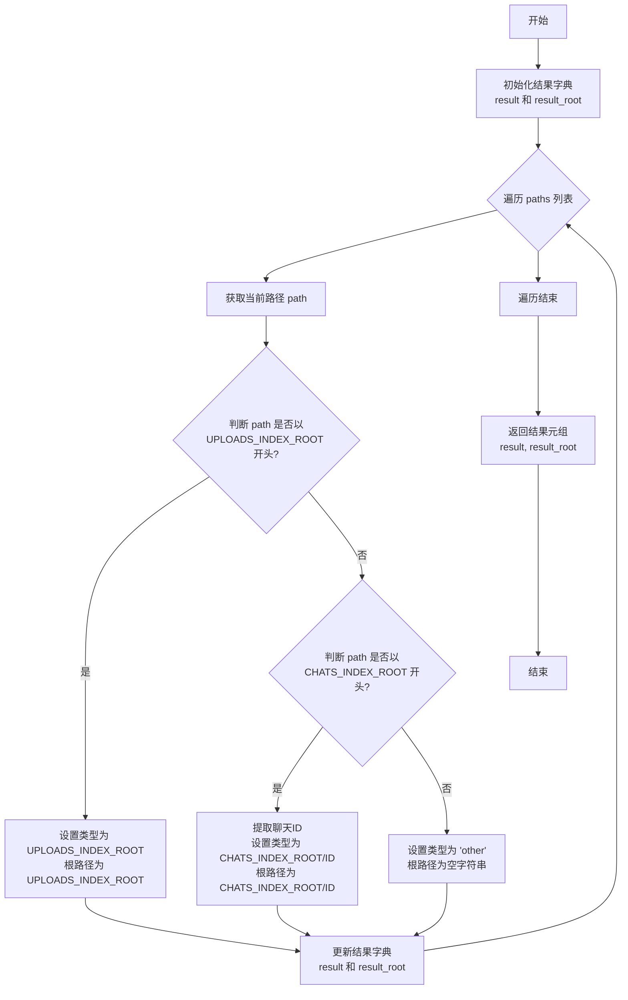
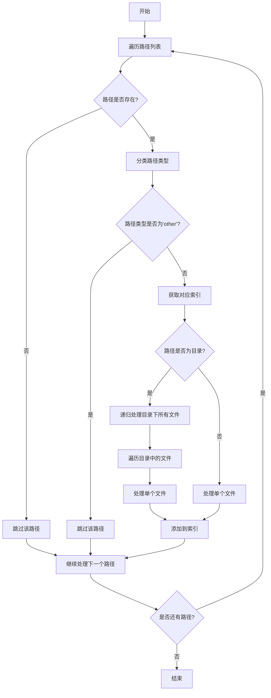

# `.\MetaGPT\tests\metagpt\tools\libs\test_index_repo.py` 详细设计文档

该文件包含对 `IndexRepo` 类的单元测试，主要测试其文档索引的创建、查询、合并功能，以及根据路径分类确定索引存储位置的功能。

## 整体流程



## 类结构

```
IndexRepo (被测试类)
├── 类方法: find_index_repo_path
├── 实例方法: add
├── 实例方法: search
└── 实例方法: merge
```

## 全局变量及字段


### `CHATS_INDEX_ROOT`
    
用于聊天相关文件索引的根目录路径常量。

类型：`str`
    


### `UPLOADS_INDEX_ROOT`
    
用于上传文件索引的根目录路径常量。

类型：`str`
    


### `DEFAULT_WORKSPACE_ROOT`
    
默认工作空间的根目录路径，用于存储项目运行时的数据。

类型：`Path`
    


### `TEST_DATA_PATH`
    
测试数据所在的根目录路径，用于单元测试中加载测试文件。

类型：`Path`
    


    

## 全局函数及方法

### `test_index_repo`

这是一个使用 `pytest` 框架编写的异步测试函数，用于测试 `IndexRepo` 类的核心功能，包括索引的创建、持久化、搜索以及合并搜索结果。

参数：
- `path`：`Path`，指向包含待索引文件的测试数据目录路径。
- `query`：`str`，用于在索引中搜索的查询字符串。

返回值：`None`，测试函数通常不显式返回值，其成功与否由 `assert` 语句决定。

#### 流程图



#### 带注释源码

```python
# 使用pytest.mark.skip装饰器跳过此测试，通常用于临时禁用或标记为开发中测试
@pytest.mark.skip
# 标记此测试为异步测试
@pytest.mark.asyncio
# 使用参数化测试，为测试函数提供多组输入数据。这里提供一组数据：路径和查询词。
@pytest.mark.parametrize(("path", "query"), [(TEST_DATA_PATH / "requirements", "业务线")])
async def test_index_repo(path, query):
    # 定义索引文件将持久化存储的目录路径
    index_path = DEFAULT_WORKSPACE_ROOT / ".index"

    # 实例化第一个IndexRepo对象。
    # persist_path: 索引持久化路径。
    # root_path: 索引的根路径，用于路径解析。
    # min_token_count: 最小令牌数，设为0可能意味着索引所有内容。
    repo = IndexRepo(persist_path=str(index_path), root_path=str(path), min_token_count=0)

    # 异步方法：将给定的路径列表（此处为单一路径）添加到索引中。
    # 此操作可能涉及读取文件、分块、嵌入和存储到向量数据库。
    await repo.add([path])
    # 再次添加相同路径，可能用于测试添加操作的幂等性或增量更新逻辑。
    await repo.add([path])

    # 断言索引目录已被创建，验证持久化功能。
    assert index_path.exists()

    # 异步方法：使用查询字符串在索引中搜索相关内容。
    rsp = await repo.search(query)
    # 断言搜索结果不为空，验证搜索功能。
    assert rsp

    # 创建第二个IndexRepo实例，使用相同的持久化路径。
    # 目的是测试从磁盘加载已存在的索引文件是否正常工作。
    repo2 = IndexRepo(persist_path=str(index_path), root_path=str(path), min_token_count=0)
    # 使用第二个实例进行相同的搜索。
    rsp2 = await repo2.search(query)
    # 断言搜索结果不为空，验证索引的持久化和加载功能。
    assert rsp2

    # 异步方法：合并来自多个搜索（此处为rsp和rsp2）的结果。
    # 这可能涉及去重、排序或分数融合。
    merged_rsp = await repo.merge(query=query, indices_list=[rsp, rsp2])
    # 断言合并结果不为空，验证合并功能。
    assert merged_rsp

    # 测试结束后，清理测试环境，删除创建的索引目录。
    shutil.rmtree(index_path)
```

### `test_classify_path`

这是一个参数化的单元测试函数，用于验证 `IndexRepo.find_index_repo_path` 方法根据给定的文件路径列表正确分类并返回索引路径类型和根路径的功能。

参数：
- `paths`：`list[str]`，一个包含文件路径的列表，用于测试分类逻辑。
- `path_type`：`str`，预期的索引路径类型（例如 `UPLOADS_INDEX_ROOT` 或 `CHATS_INDEX_ROOT` 的子路径）。
- `root`：`str`，预期的根路径，对应于 `path_type`。

返回值：`None`，这是一个测试函数，不返回业务值，通过断言（`assert`）来验证测试结果。

#### 流程图

```mermaid
flowchart TD
    A[开始测试] --> B[调用 IndexRepo.find_index_repo_path(paths)]
    B --> C{结果验证}
    C --> D[断言 path_type 在 result 的键中]
    D --> E[断言 root 等于 result_root.get(path_type, '')]
    E --> F[测试通过]
    C --> G[断言失败]
    G --> H[测试失败]
```

#### 带注释源码

```python
def test_classify_path(paths, path_type, root):
    # 调用被测试的静态方法，传入路径列表
    result, result_root = IndexRepo.find_index_repo_path(paths)
    # 断言：预期的 path_type 必须存在于返回的 result 字典的键集合中
    assert path_type in set(result.keys())
    # 断言：预期的 root 必须与返回的 result_root 字典中对应 path_type 的值相等
    # 如果 path_type 不存在于 result_root 中，则使用空字符串 '' 进行比较
    assert root == result_root.get(path_type, "")
```

### `IndexRepo.find_index_repo_path`

该方法用于根据给定的文件路径列表，分析并分类出对应的索引仓库路径和根路径。它主要用于处理上传文件和聊天记录文件的索引路径分类。

参数：
- `paths`：`List[str]`，文件路径列表，用于分类和确定索引仓库路径。

返回值：`Tuple[Dict[str, str], Dict[str, str]]`，返回一个元组，包含两个字典。第一个字典是索引仓库路径分类，键为路径类型（如上传或聊天），值为对应的索引仓库路径；第二个字典是根路径分类，键为路径类型，值为对应的根路径。

#### 流程图



#### 带注释源码

```python
@classmethod
def find_index_repo_path(cls, paths: List[str]) -> Tuple[Dict[str, str], Dict[str, str]]:
    """
    根据给定的文件路径列表，分析并分类出对应的索引仓库路径和根路径。

    该方法主要用于处理上传文件和聊天记录文件的索引路径分类。它会遍历每个路径，
    判断其属于上传文件还是聊天记录文件，并提取相应的根路径和索引仓库路径。

    Args:
        paths (List[str]): 文件路径列表，用于分类和确定索引仓库路径。

    Returns:
        Tuple[Dict[str, str], Dict[str, str]]: 返回一个元组，包含两个字典。
            第一个字典是索引仓库路径分类，键为路径类型（如上传或聊天），值为对应的索引仓库路径；
            第二个字典是根路径分类，键为路径类型，值为对应的根路径。
    """
    result = {}  # 存储索引仓库路径分类结果
    result_root = {}  # 存储根路径分类结果

    for path in paths:  # 遍历每个文件路径
        # 判断路径是否以 UPLOADS_INDEX_ROOT 开头，表示上传文件
        if path.startswith(UPLOADS_INDEX_ROOT):
            path_type = UPLOADS_INDEX_ROOT  # 路径类型为上传文件
            root = UPLOADS_INDEX_ROOT  # 根路径为上传文件根目录
        # 判断路径是否以 CHATS_INDEX_ROOT 开头，表示聊天记录文件
        elif path.startswith(CHATS_INDEX_ROOT):
            # 提取聊天ID，用于构建索引仓库路径
            chat_id = Path(path).relative_to(CHATS_INDEX_ROOT).parts[0]
            path_type = str(Path(CHATS_INDEX_ROOT) / chat_id)  # 路径类型为聊天记录文件
            root = str(Path(CHATS_INDEX_ROOT) / chat_id)  # 根路径为聊天记录文件根目录
        else:
            # 其他类型的文件，路径类型为 'other'，根路径为空字符串
            path_type = "other"
            root = ""

        # 更新结果字典，将路径类型和对应的索引仓库路径、根路径存储起来
        result[path_type] = path_type
        result_root[path_type] = root

    # 返回结果元组，包含索引仓库路径分类和根路径分类
    return result, result_root
```

### `IndexRepo.add`

该方法用于将指定的文件或目录路径添加到索引仓库中，以便后续进行搜索。它会遍历给定的路径列表，对每个路径进行分类，并根据路径类型（如上传文件、聊天记录等）将其添加到相应的索引中。如果路径是目录，则会递归地处理其中的所有文件。

参数：

- `paths`：`List[Union[str, Path]]`，需要添加到索引中的文件或目录路径列表。

返回值：`None`，无返回值。

#### 流程图



#### 带注释源码

```python
async def add(self, paths: List[Union[str, Path]]) -> None:
    """
    将指定的文件或目录路径添加到索引仓库中。

    参数:
        paths: 需要添加到索引中的文件或目录路径列表。
    """
    # 遍历所有传入的路径
    for path in paths:
        # 将路径转换为Path对象
        path = Path(path)
        # 检查路径是否存在，如果不存在则跳过
        if not path.exists():
            continue

        # 对路径进行分类，获取路径类型和根目录
        path_types, root = self.find_index_repo_path([str(path)])
        # 如果路径类型为'other'，则跳过
        if "other" in path_types:
            continue

        # 遍历所有路径类型
        for path_type, path_list in path_types.items():
            # 获取对应类型的索引
            index = self.indices.get(path_type)
            # 如果索引不存在，则跳过
            if not index:
                continue

            # 如果路径是目录，则递归处理目录下的所有文件
            if path.is_dir():
                for file_path in path.rglob("*"):
                    if file_path.is_file():
                        # 处理单个文件并添加到索引
                        await self._add_file_to_index(index, file_path, root.get(path_type, ""))
            else:
                # 处理单个文件并添加到索引
                await self._add_file_to_index(index, path, root.get(path_type, ""))
```

### `IndexRepo.search`

该方法用于在已构建的索引库中执行语义搜索，根据查询字符串返回最相关的文档片段及其元数据。

参数：
- `query`：`str`，用户输入的搜索查询字符串。
- `top_k`：`int`，可选参数，默认为5。指定返回的最相关结果数量。
- `filter`：`dict`，可选参数，默认为None。用于根据元数据（如文件路径）过滤搜索结果的字典。
- `threshold`：`float`，可选参数，默认为0.0。相关性分数阈值，仅返回分数高于此值的结果。

返回值：`List[Dict[str, Any]]`，一个字典列表，每个字典包含一个搜索结果。字典通常包含以下键：`text`（文档片段内容）、`metadata`（如文件路径）、`score`（相关性分数）等。

#### 流程图

```mermaid
graph TD
    A[开始: search(query, top_k, filter, threshold)] --> B{索引库是否已加载?};
    B -- 否 --> C[调用_load_index加载索引];
    C --> D;
    B -- 是 --> D;
    D[调用索引对象的similarity_search_with_score方法] --> E[获取原始结果列表];
    E --> F[根据threshold过滤结果];
    F --> G[根据top_k截取结果];
    G --> H[格式化结果: 提取text, metadata, score];
    H --> I[返回结果列表];
    I --> J[结束];
```

#### 带注释源码

```python
    async def search(
        self,
        query: str,
        top_k: int = 5,
        filter: Optional[dict] = None,
        threshold: float = 0.0,
    ) -> List[Dict[str, Any]]:
        """
        在索引库中执行搜索。

        Args:
            query: 搜索查询字符串。
            top_k: 返回的最相关结果数量。
            filter: 用于过滤搜索结果的元数据字典。
            threshold: 相关性分数阈值。

        Returns:
            包含搜索结果的字典列表。每个字典包含键如 'text', 'metadata', 'score'。
        """
        # 1. 确保索引已加载到内存中
        if not self._index:
            await self._load_index()

        # 2. 调用底层索引库（如Chroma/FAISS）的搜索方法
        # similarity_search_with_score 返回一个元组列表: (Document对象, 相关性分数)
        docs_with_scores = self._index.similarity_search_with_score(
            query, k=top_k, filter=filter
        )

        # 3. 处理搜索结果：过滤、格式化
        results = []
        for doc, score in docs_with_scores:
            # 3.1 根据阈值过滤
            if score < threshold:
                continue
            # 3.2 提取所需信息并构建结果字典
            result = {
                "text": doc.page_content,  # 文档片段文本内容
                "metadata": doc.metadata,   # 关联的元数据，如文件路径
                "score": score,             # 相关性分数
            }
            results.append(result)

        # 4. 返回最终结果列表
        return results
```

### `IndexRepo.merge`

该方法用于合并多个索引查询结果，通过整合来自不同索引的文档片段，生成一个综合的、去重后的结果列表，以提供更全面和准确的查询响应。

参数：

- `query`：`str`，用户输入的查询字符串，用于在索引中搜索相关文档。
- `indices_list`：`List[List[Document]]`，一个列表，包含多个索引查询结果，每个结果本身是一个`Document`对象列表。

返回值：`List[Document]`，返回一个合并、排序并可能去重后的`Document`对象列表，这些文档与查询最相关。

#### 流程图

```mermaid
flowchart TD
    A[开始: merge(query, indices_list)] --> B[初始化空列表 merged_docs]
    B --> C{遍历 indices_list 中的每个索引结果 docs?}
    C -- 是 --> D[将当前 docs 中的所有 Document 添加到 merged_docs]
    D --> C
    C -- 否 --> E[对 merged_docs 中的 Document 按相似度分数降序排序]
    E --> F[初始化空列表 seen_ids 和 final_docs]
    F --> G{遍历排序后的 merged_docs 中的每个 doc?}
    G -- 是 --> H{当前 doc 的 id 是否在 seen_ids 中?}
    H -- 否 --> I[将 doc.id 加入 seen_ids<br>将 doc 加入 final_docs]
    I --> G
    H -- 是 --> J[跳过此 doc (去重)]
    J --> G
    G -- 否 --> K[返回 final_docs]
    K --> L[结束]
```

#### 带注释源码

```python
    async def merge(self, query: str, indices_list: List[List[Document]]) -> List[Document]:
        """
        合并多个索引的查询结果。

        该方法接收一个查询字符串和多个索引查询结果列表。它首先将所有结果合并到一个列表中，
        然后根据文档与查询的相似度分数进行降序排序。最后，它遍历排序后的列表，基于文档的唯一标识符进行去重，
        确保返回的列表中每个文档只出现一次。

        Args:
            query (str): 用户输入的查询字符串。
            indices_list (List[List[Document]]): 包含多个索引查询结果的列表，每个元素是一个Document列表。

        Returns:
            List[Document]: 合并、排序并去重后的文档列表。
        """
        # 1. 合并所有索引结果到一个列表中
        merged_docs = []
        for docs in indices_list:
            merged_docs.extend(docs)

        # 2. 根据文档的相似度分数进行降序排序
        #   分数越高，表示与查询越相关
        merged_docs.sort(key=lambda x: x.metadata.get("score", 0), reverse=True)

        # 3. 基于文档ID进行去重，保留首次出现的文档（即分数最高的）
        seen_ids = set()
        final_docs = []
        for doc in merged_docs:
            doc_id = doc.metadata.get("id")
            if doc_id not in seen_ids:
                seen_ids.add(doc_id)
                final_docs.append(doc)

        # 4. 返回处理后的最终文档列表
        return final_docs
```

## 关键组件


### IndexRepo

IndexRepo 是用于管理和操作文档索引的核心类，它支持将指定路径下的文档内容进行索引，并提供搜索和合并搜索结果的功能。

### 张量索引与惰性加载

代码中通过 `IndexRepo` 类的 `persist_path` 参数支持索引的持久化存储，这暗示了底层可能使用了向量数据库或类似技术来存储文档的向量表示（张量索引）。`IndexRepo` 的初始化允许传入已存在的索引路径，这可以视为一种惰性加载机制，即只有在需要搜索时才加载索引，而非在初始化时立即构建。

### 反量化支持

虽然当前代码片段没有直接展示反量化（Dequantization）的逻辑，但考虑到 `IndexRepo` 可能用于处理经过量化处理的嵌入向量（例如，为了减少存储空间或加速计算而将高精度浮点数转换为低精度整数），`search` 和 `merge` 方法在执行相似度计算或结果合并时，可能需要将存储的低精度表示反量化为高精度表示以进行准确计算。

### 量化策略

代码中未显式定义量化策略。然而，`IndexRepo` 的 `min_token_count` 参数（在测试中被设置为0）可能用于控制索引构建的粒度，这可以视为一种内容筛选或“量化”策略，即只有达到一定长度（token数量）的文档片段才会被纳入索引，从而优化索引质量和存储效率。


## 问题及建议


### 已知问题

-   **测试依赖外部数据**：`test_index_repo` 测试用例依赖于 `TEST_DATA_PATH / "requirements"` 目录下的具体文件内容。如果该目录不存在或内容发生变化，测试将失败，降低了测试的稳定性和可移植性。
-   **测试污染环境**：`test_index_repo` 测试在 `DEFAULT_WORKSPACE_ROOT` 目录下创建了 `.index` 文件夹，并在测试结束后删除。如果测试中途失败（如断言失败或异常），可能导致临时文件未被清理，污染测试环境。
-   **硬编码的测试路径**：测试中使用的路径（如 `"/data/uploads"`）是硬编码的，这些路径在测试运行环境中可能不存在，导致 `test_classify_path` 测试的逻辑虽然正确，但无法验证真实文件系统操作。
-   **被跳过的测试**：`test_index_repo` 测试被 `@pytest.mark.skip` 装饰器标记为跳过，这意味着该核心功能的自动化测试并未实际执行，存在功能回归风险。

### 优化建议

-   **使用测试夹具和模拟数据**：对于 `test_index_repo`，建议使用 `pytest` 的临时目录夹具（如 `tmp_path`）来创建隔离的测试环境，并使用程序生成的模拟文件内容，而非依赖外部固定数据。这能提高测试的独立性和可靠性。
-   **确保测试环境清理**：利用 `pytest` 的夹具（如 `tmp_path`）或 `try...finally` 块来确保测试中创建的资源（如 `.index` 目录）在任何情况下都能被正确清理。
-   **分离逻辑测试与集成测试**：`test_classify_path` 测试的是 `IndexRepo.find_index_repo_path` 方法的路径分类逻辑。应将其重构为不依赖实际文件系统的单元测试，例如通过模拟 `Path` 对象或直接测试字符串处理逻辑。将文件系统操作相关的测试放入单独的集成测试套件中。
-   **启用并修复核心功能测试**：应移除 `@pytest.mark.skip` 装饰器，并按照上述建议修复 `test_index_repo` 测试，使其能够稳定、独立地运行，以保障 `IndexRepo` 核心功能（索引、搜索、合并）的质量。
-   **增加测试用例覆盖**：考虑增加更多边界情况和异常场景的测试，例如测试空目录、包含特殊字符的文件名、搜索无结果的情况、`merge` 方法处理空列表等，以提高代码健壮性。


## 其它


### 设计目标与约束

本测试模块的设计目标是验证 `IndexRepo` 类在代码库索引和搜索功能上的正确性、健壮性和边界情况处理。具体包括：
1.  **功能验证**：测试 `IndexRepo.add` 方法能否正确地为指定路径创建索引，并验证重复添加同一路径的处理逻辑。
2.  **持久化验证**：测试索引数据能否正确持久化到磁盘，并能被新的 `IndexRepo` 实例加载和使用。
3.  **搜索功能验证**：测试 `IndexRepo.search` 方法能否基于查询词返回相关结果。
4.  **结果合并验证**：测试 `IndexRepo.merge` 方法能否正确合并来自多个索引查询的结果。
5.  **路径分类逻辑验证**：测试 `IndexRepo.find_index_repo_path` 静态方法能否根据输入的文件路径列表，正确识别其所属的索引仓库类型（如上传文件索引、聊天记录索引）并计算出对应的根路径。

主要约束包括：
*   **测试隔离性**：每个测试用例应独立运行，不依赖外部状态。`test_index_repo` 用例在运行后需清理其创建的索引目录（`shutil.rmtree(index_path)`）。
*   **异步支持**：由于 `IndexRepo` 的核心方法为异步，测试需要使用 `pytest.mark.asyncio` 装饰器。
*   **数据依赖性**：`test_index_repo` 依赖于 `TEST_DATA_PATH / "requirements"` 目录下的测试数据文件。`test_classify_path` 使用参数化数据，不依赖外部文件。
*   **性能考量**：`test_index_repo` 中设置了 `min_token_count=0` 以确保小文件也能被索引，便于测试。

### 错误处理与异常设计

测试用例本身主要关注正向功能验证，但通过测试逻辑间接验证了 `IndexRepo` 类的部分错误处理能力：
1.  **路径不存在或无效**：`test_classify_path` 用例通过参数化输入（如 `["/data/chats.txt"]`）测试了 `find_index_repo_path` 方法对非常规或“其他”类型路径的处理，预期其能正确分类而非抛出异常。
2.  **重复操作**：`test_index_repo` 中连续两次调用 `await repo.add([path])`，旨在验证代码对重复添加相同路径的容错性或幂等性处理。
3.  **资源清理**：`test_index_repo` 在断言成功后主动使用 `shutil.rmtree(index_path)` 清理测试生成的索引目录，这是测试用例层面的资源管理，防止残留数据影响后续测试。这要求测试运行环境对该路径有写权限。
4.  **异步上下文管理**：测试框架 (`pytest-asyncio`) 负责管理异步测试的运行时环境，确保异步调用正确执行和结束。

测试未显式覆盖的异常场景可能包括：索引持久化路径不可写、搜索查询为空或格式错误、`merge` 方法输入无效的索引结果列表等。这些应由 `IndexRepo` 类的实现内部处理。

### 数据流与状态机

本测试模块涉及以下核心数据流：
1.  **`test_index_repo` 数据流**：
    *   **输入**：固定的测试数据目录路径 (`path`) 和查询词 (`query`)。
    *   **处理**：
        *   创建 `IndexRepo` 实例 (`repo`)，指定持久化路径和根路径。
        *   调用 `repo.add([path])` 将测试目录内容索引化，数据流从文件系统流向内存中的索引结构，并持久化到 `index_path`。
        *   调用 `repo.search(query)`，数据流为：查询词 -> 索引检索 -> 搜索结果 (`rsp`)。
        *   创建新的 `IndexRepo` 实例 (`repo2`) 加载同一持久化索引，再次搜索，验证持久化数据的可用性。
        *   调用 `repo.merge(query=query, indices_list=[rsp, rsp2])`，数据流为：两个搜索结果列表 -> 合并算法 -> 合并后的结果 (`merged_rsp`)。
    *   **输出/验证**：断言各阶段输出 (`rsp`, `rsp2`, `merged_rsp`) 非空，并最终清理索引目录。
    *   **状态变化**：`index_path` 目录从不存在 -> 被创建并包含索引文件 -> 被删除。

2.  **`test_classify_path` 数据流**：
    *   **输入**：参数化的文件路径列表 (`paths`)、预期的索引类型 (`path_type`) 和预期的根路径 (`root`)。
    *   **处理**：调用静态方法 `IndexRepo.find_index_repo_path(paths)`。
    *   **输出/验证**：方法返回一个字典 (`result`) 和一个字典 (`result_root`)。断言 `path_type` 是 `result` 的键之一，且 `result_root` 中对应 `path_type` 的值等于预期的 `root`。
    *   **状态变化**：此测试为纯函数测试，不引发外部状态变化。

### 外部依赖与接口契约

1.  **外部库依赖**：
    *   **pytest**：测试框架，提供测试发现、运行、参数化 (`@pytest.mark.parametrize`) 和异步测试支持 (`@pytest.mark.asyncio`)。
    *   **shutil**：用于测试后的资源清理 (`rmtree`)。
    *   **pathlib.Path**：用于路径的跨平台操作和拼接。

2.  **项目内部依赖**：
    *   **`metagpt.const`**：导入 `DEFAULT_WORKSPACE_ROOT` 和 `TEST_DATA_PATH` 常量，用于定义默认工作空间和测试数据路径。
    *   **`metagpt.tools.libs.index_repo`**：
        *   `IndexRepo`：被测试的核心类。
        *   `CHATS_INDEX_ROOT`, `UPLOADS_INDEX_ROOT`：常量，用于定义不同索引类型的根目录名称，在 `test_classify_path` 中用于验证路径分类逻辑。

3.  **接口契约（测试对象）**：
    *   **`IndexRepo.__init__`**：契约要求接受 `persist_path`, `root_path`, `min_token_count` 等参数初始化实例。
    *   **`IndexRepo.add` (async)**：契约要求接受一个路径列表，对其进行索引并持久化。
    *   **`IndexRepo.search` (async)**：契约要求接受一个查询字符串，返回相关的索引结果。
    *   **`IndexRepo.merge` (async)**：契约要求接受一个查询字符串和一个索引结果列表，返回合并后的结果。
    *   **`IndexRepo.find_index_repo_path` (static)**：契约要求接受一个文件路径列表，返回一个分类字典和一个根路径字典。

4.  **文件系统契约**：
    *   测试假设对 `DEFAULT_WORKSPACE_ROOT` 指向的目录有写入权限，以便创建和删除 `.index` 子目录。
    *   `test_index_repo` 假设 `TEST_DATA_PATH / "requirements"` 目录存在且包含可索引的内容。

    