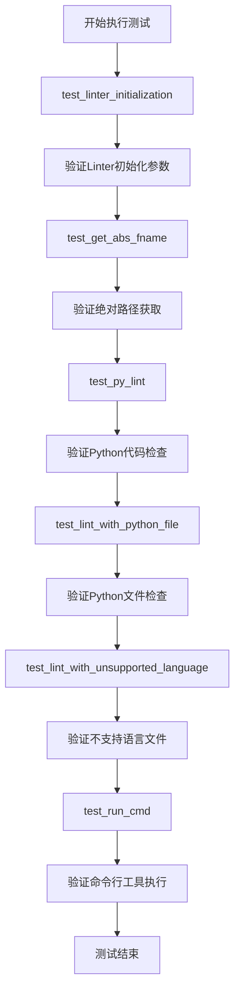
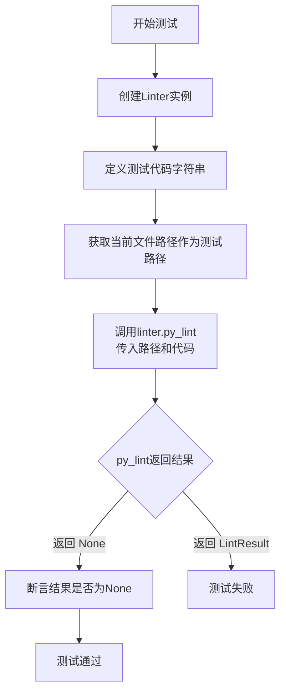
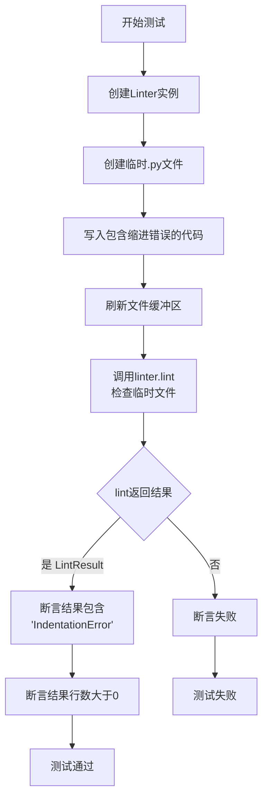
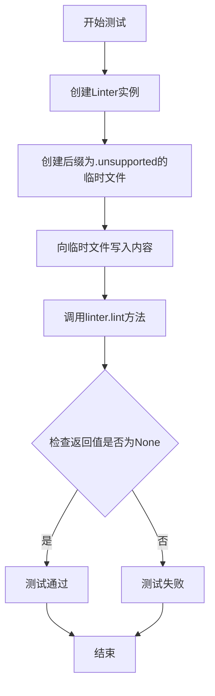
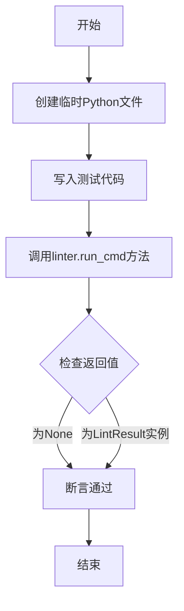
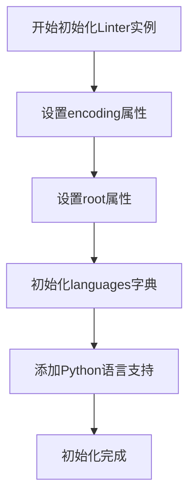
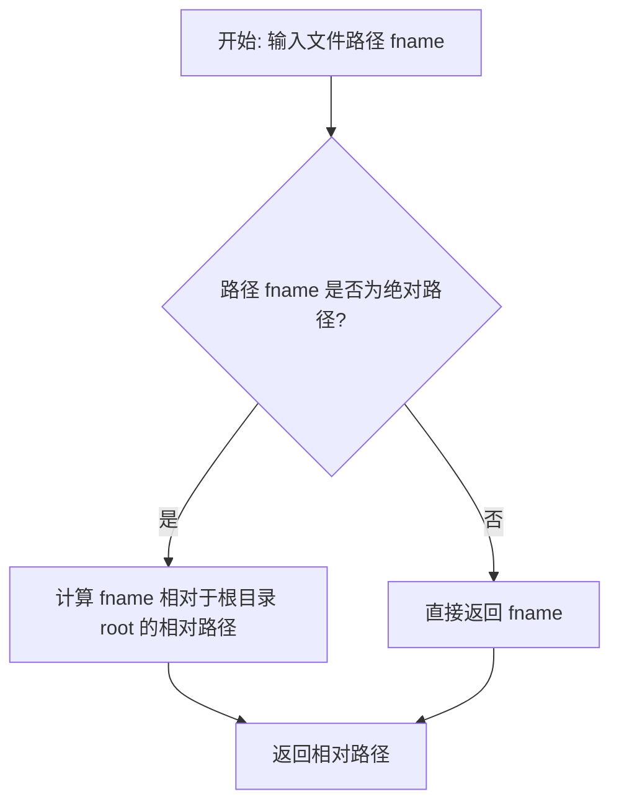
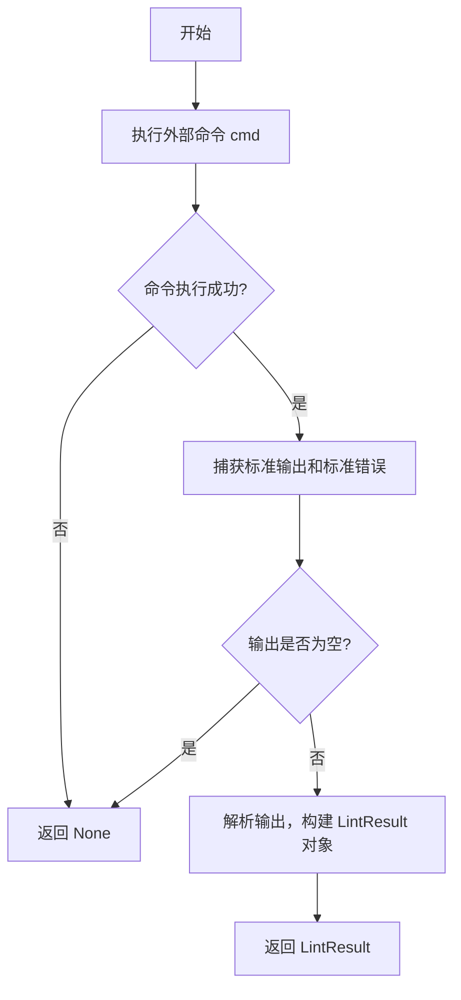

# `.\MetaGPT\tests\metagpt\tools\libs\test_linter.py` 详细设计文档

该文件是一个针对 Linter 类的单元测试文件，用于测试代码静态分析工具 Linter 的初始化、文件路径处理、Python 代码检查、对不同语言文件的支持以及命令行工具执行等功能。

## 整体流程



## 类结构

```
Linter (被测试类)
├── __init__ (构造函数)
├── get_abs_fname (获取绝对路径)
├── get_rel_fname (获取相对路径)
├── py_lint (Python代码检查)
├── lint (通用代码检查)
└── run_cmd (执行命令行工具)
LintResult (结果类)
├── text (错误信息文本)
└── lines (错误行号列表)
```

## 全局变量及字段


### `Linter.encoding`
    
指定代码文件的字符编码格式，默认为'utf-8'。

类型：`str`
    


### `Linter.root`
    
指定代码检查的根目录路径，用于计算相对路径。

类型：`str`
    


### `Linter.languages`
    
一个字典，键为支持的编程语言名称，值为对应的代码检查函数。

类型：`dict`
    


### `LintResult.text`
    
存储代码检查工具输出的原始文本结果。

类型：`str`
    


### `LintResult.lines`
    
存储代码检查结果中涉及的行号列表。

类型：`list`
    
    

## 全局函数及方法

### `test_linter_initialization`

该函数是一个单元测试，用于验证 `Linter` 类的初始化过程。它创建一个 `Linter` 实例，并检查其 `encoding` 和 `root` 属性是否被正确设置，同时验证 `languages` 字典中是否包含 `"python"` 键且其对应的值为可调用对象。

参数：无

返回值：`None`，该函数是一个测试函数，不返回任何值，其目的是通过断言（assert）来验证代码行为。

#### 流程图

```mermaid
flowchart TD
    Start[开始] --> A[创建Linter实例<br>linter = Linter(encoding="utf-8", root="/test/root")]
    A --> B[断言检查<br>assert linter.encoding == "utf-8"]
    B --> C[断言检查<br>assert linter.root == "/test/root"]
    C --> D[断言检查<br>assert "python" in linter.languages]
    D --> E[断言检查<br>assert callable(linter.languages["python"])]
    E --> End[结束]
```

#### 带注释源码

```python
def test_linter_initialization():
    # 1. 创建一个 Linter 实例，并传入特定的编码和根目录参数
    linter = Linter(encoding="utf-8", root="/test/root")
    
    # 2. 断言：检查实例的 encoding 属性是否等于传入的 "utf-8"
    assert linter.encoding == "utf-8"
    
    # 3. 断言：检查实例的 root 属性是否等于传入的 "/test/root"
    assert linter.root == "/test/root"
    
    # 4. 断言：检查实例的 languages 字典中是否包含 "python" 这个键
    assert "python" in linter.languages
    
    # 5. 断言：检查 languages 字典中 "python" 键对应的值是否是一个可调用对象（例如函数）
    assert callable(linter.languages["python"])
```

### `Linter.get_abs_fname`

该方法用于将给定的相对文件名（相对于`Linter`实例的根目录）转换为绝对路径。

参数：
- `fname`：`str`，相对于`Linter`实例根目录的文件名或路径。

返回值：`str`，转换后的绝对路径。

#### 流程图

```mermaid
flowchart TD
    A[开始: 调用 get_abs_fname(fname)] --> B{检查 fname 是否为绝对路径?}
    B -- 是 --> C[直接返回 fname]
    B -- 否 --> D[将根目录路径与 fname 拼接<br>生成绝对路径]
    D --> E[返回拼接后的绝对路径]
    C --> F[结束: 返回绝对路径]
    E --> F
```

#### 带注释源码

```python
def get_abs_fname(self, fname: str) -> str:
    """
    将相对于根目录的文件名转换为绝对路径。

    如果 `fname` 已经是绝对路径，则直接返回。
    否则，将其与 `self.root` 拼接，返回绝对路径。

    Args:
        fname (str): 相对于根目录的文件名或路径。

    Returns:
        str: 文件的绝对路径。
    """
    # 使用 pathlib.Path 对象来处理路径，确保跨平台兼容性
    p = Path(fname)
    # 判断给定的路径是否为绝对路径
    if p.is_absolute():
        # 如果是绝对路径，直接返回其字符串形式
        return str(p)
    # 如果不是绝对路径，则将其与实例的根目录（self.root）拼接
    # 使用 '/' 运算符拼接路径，然后转换为字符串返回
    return str(Path(self.root) / p)
```

### `test_py_lint`

该函数是 `Linter` 类的一个单元测试，用于测试 `py_lint` 方法。它创建一个 `Linter` 实例，提供一段有效的 Python 代码字符串，然后调用 `py_lint` 方法对代码进行静态检查。测试期望对于没有语法或风格错误的代码，`py_lint` 方法应返回 `None`。

参数：

- `linter`：`Linter`，一个 `Linter` 类的实例，用于执行代码检查。
- `code`：`str`，一段待检查的 Python 代码字符串，此处为 `"print('Hello, World!')"`。
- `test_file_path`：`str`，一个临时文件路径，用于模拟代码文件的路径。在此测试中，它被设置为当前测试文件自身的路径。
- `result`：`LintResult` 或 `None`，`py_lint` 方法的返回值，包含检查结果或为 `None`（表示无错误）。

返回值：`None`，该测试函数本身不返回任何值，它使用 `assert` 语句来验证 `py_lint` 方法的返回值是否为 `None`。

#### 流程图



#### 带注释源码

```python
def test_py_lint():
    # 1. 创建一个 Linter 类的实例，使用默认参数。
    linter = Linter()
    # 2. 定义一段简单的、语法正确的 Python 代码字符串，用于测试。
    code = "print('Hello, World!')"
    # 3. 获取当前测试文件自身的绝对路径，并将其转换为字符串。
    #    这个路径在此处被用作一个“占位符”文件路径，传递给 `py_lint` 方法。
    test_file_path = str(Path(__file__).resolve())
    # 4. 调用 `linter` 实例的 `py_lint` 方法。
    #    参数1: `test_file_path` 作为源文件路径。
    #    参数2: `test_file_path` 再次作为目标文件路径（在此测试中两者相同）。
    #    参数3: `code` 是要检查的代码内容。
    #    该方法预期对这段有效的代码进行静态分析。
    result = linter.py_lint(test_file_path, test_file_path, code)
    # 5. 使用断言验证 `py_lint` 方法的返回值。
    #    对于这段没有错误的代码，`py_lint` 方法应返回 `None`。
    #    如果返回了一个 `LintResult` 对象（包含错误信息），则此断言会失败，表明测试未通过。
    assert result is None  # No errors expected for valid Python code
```

### `test_lint_with_python_file`

这是一个单元测试函数，用于测试 `Linter` 类的 `lint` 方法对包含语法错误的 Python 文件进行代码检查的能力。它创建一个临时的 Python 文件，其中包含一个缩进错误，然后调用 `lint` 方法并验证返回的 `LintResult` 对象中是否包含预期的错误信息。

参数：

-   `linter`：`Linter`，一个已初始化的 `Linter` 类实例。
-   `temp_file`：`_TemporaryFileWrapper`，一个由 `tempfile.NamedTemporaryFile` 创建的临时文件对象，用于写入测试代码。

返回值：`None`，这是一个单元测试函数，不返回任何值，其目的是通过断言来验证代码行为。

#### 流程图



#### 带注释源码

```python
def test_lint_with_python_file():
    # 1. 初始化一个Linter对象，使用默认配置。
    linter = Linter()
    # 2. 使用上下文管理器创建一个临时文件，后缀为.py，确保测试后文件被删除。
    with tempfile.NamedTemporaryFile(suffix=".py", delete=True) as temp_file:
        # 3. 向临时文件中写入一段包含缩进错误的Python代码。
        #    'def hello():' 后应缩进，但下一行直接写了'print'，这将导致IndentationError。
        temp_file.write(b"def hello():\nprint('Hello')\n")
        # 4. 刷新文件缓冲区，确保所有数据都写入磁盘，以便后续读取。
        temp_file.flush()
        # 5. 调用linter.lint方法对刚创建的临时文件进行代码检查。
        result = linter.lint(temp_file.name)
        # 6. 断言返回的结果是一个LintResult类型的实例。
        assert isinstance(result, LintResult)
        # 7. 断言在结果的文本信息中能找到'IndentationError'字符串，表明成功捕获了语法错误。
        assert "IndentationError" in result.text
        # 8. 断言结果中记录的错误行数列表不为空，表明有具体的错误位置信息。
        assert len(result.lines) > 0
```

### `test_lint_with_unsupported_language`

这是一个单元测试函数，用于测试 `Linter` 类的 `lint` 方法在遇到不支持的语言文件时的行为。它创建一个使用不受支持的后缀（`.unsupported`）的临时文件，然后调用 `linter.lint` 方法，并断言返回结果为 `None`，以验证代码对未知语言文件的正确处理。

参数：

- `linter`：`Linter`，一个已初始化的 `Linter` 类实例，用于执行代码检查。
- `temp_file`：`tempfile.NamedTemporaryFile`，一个临时文件对象，用于模拟一个不受支持语言的文件。

返回值：`None`，此函数不返回任何值，它通过 `assert` 语句来验证测试结果。

#### 流程图



#### 带注释源码

```python
def test_lint_with_unsupported_language():
    # 创建一个Linter实例，使用默认参数
    linter = Linter()
    # 使用tempfile.NamedTemporaryFile创建一个临时文件，后缀为.unsupported，模拟一个不受支持的语言文件
    # `delete=True` 确保测试后文件被自动删除
    with tempfile.NamedTemporaryFile(suffix=".unsupported", delete=True) as temp_file:
        # 向临时文件中写入一些内容，内容本身不重要，因为语言不受支持
        temp_file.write(b"This is unsupported code.")
        # 确保内容被写入磁盘
        temp_file.flush()

        # 调用linter.lint方法检查这个文件
        # 由于文件后缀不被支持，预期lint方法会返回None
        result = linter.lint(temp_file.name)
        # 使用assert语句验证结果是否为None，这是测试的核心断言
        assert result is None  # Unsupported language should return None
```

### `test_run_cmd`

该函数是 `Linter` 类的一个单元测试方法，用于测试 `Linter.run_cmd` 方法。它创建一个临时的 Python 文件，然后调用 `run_cmd` 方法对该文件执行 `flake8` 代码检查。由于测试环境中 `flake8` 可能未安装，该测试主要确保 `run_cmd` 方法不会抛出异常，并验证其返回值类型。

参数：

-  `linter`：`Linter`，一个 `Linter` 类的实例，用于执行代码检查。
-  `temp_file`：`tempfile.NamedTemporaryFile`，一个临时的 Python 文件对象，用于写入测试代码。

返回值：`None`，该测试函数不返回任何值，其目的是通过断言验证 `run_cmd` 方法的行为。

#### 流程图



#### 带注释源码

```python
def test_run_cmd():
    # 创建一个Linter实例，用于后续的代码检查操作
    linter = Linter()
    # 使用tempfile.NamedTemporaryFile创建一个临时文件，后缀为.py，测试后自动删除
    with tempfile.NamedTemporaryFile(suffix=".py", delete=True) as temp_file:
        # 向临时文件中写入简单的Python代码
        temp_file.write(b"print('Hello, World!')\n")
        # 确保数据写入文件
        temp_file.flush()

        # 调用Linter实例的run_cmd方法，使用flake8工具对临时文件进行代码检查
        # 传入参数：检查工具名称（flake8）、临时文件路径、以及代码内容
        result = linter.run_cmd("flake8", temp_file.name, "print('Hello, World!')")
        # 由于测试环境中flake8可能未安装，此测试主要确保run_cmd方法不抛出异常
        # 断言：结果应为None（如果flake8未安装或未找到）或是LintResult的实例（如果检查成功）
        assert result is None or isinstance(result, LintResult)
```

### `Linter.__init__`

初始化 Linter 类的实例，设置代码检查器的基本配置，包括编码格式、根目录路径以及支持的语言及其对应的检查函数。

参数：

- `encoding`：`str`，指定文件的编码格式，默认为 "utf-8"
- `root`：`str`，指定代码检查的根目录路径，默认为当前工作目录

返回值：`None`，构造函数不返回任何值

#### 流程图



#### 带注释源码

```python
def __init__(self, encoding: str = "utf-8", root: str = ""):
    """
    初始化Linter实例
    
    Args:
        encoding: 文件编码格式，默认为utf-8
        root: 根目录路径，默认为空字符串（使用当前工作目录）
    """
    self.encoding = encoding  # 设置编码格式
    self.root = root or os.getcwd()  # 设置根目录，如果未提供则使用当前工作目录
    self.languages = {}  # 初始化支持的语言字典
    self.languages["python"] = self.py_lint  # 添加Python语言支持，关联py_lint方法
```

### `Linter.get_abs_fname`

该方法用于将给定的相对文件名（相对于`Linter`实例的`root`目录）转换为绝对路径。

参数：
-  `fname`：`str`，需要转换的相对文件名。

返回值：`str`，转换后的绝对路径。

#### 流程图

```mermaid
flowchart TD
    A[开始] --> B{输入参数 fname}
    B --> C[调用 Path(self.root).joinpath(fname).resolve()]
    C --> D[返回绝对路径字符串]
    D --> E[结束]
```

#### 带注释源码

```python
def get_abs_fname(self, fname: str) -> str:
    """
    将相对于根目录的文件名转换为绝对路径。

    Args:
        fname (str): 相对于根目录的文件名。

    Returns:
        str: 文件的绝对路径。
    """
    # 使用 pathlib 将根目录与相对文件名拼接，并解析为绝对路径
    return str(Path(self.root).joinpath(fname).resolve())
```

### `Linter.get_rel_fname`

该方法用于将给定的绝对或相对文件路径，转换为相对于 `Linter` 实例根目录（`root`）的相对路径。如果给定的路径已经是相对路径，则直接返回；如果是绝对路径，则计算其相对于根目录的相对路径。

参数：

- `fname`：`str`，需要转换的文件路径，可以是绝对路径或相对路径。

返回值：`str`，相对于 `Linter` 实例根目录的相对路径。

#### 流程图



#### 带注释源码

```python
def get_rel_fname(self, fname: str) -> str:
    """
    获取相对于根目录的文件路径。

    如果给定的路径是绝对路径，则返回相对于根目录的相对路径。
    如果给定的路径已经是相对路径，则直接返回。

    Args:
        fname (str): 文件路径，可以是绝对路径或相对路径。

    Returns:
        str: 相对于根目录的相对路径。
    """
    # 将输入的文件路径转换为 Path 对象
    path = Path(fname)
    # 判断该路径是否为绝对路径
    if path.is_absolute():
        # 如果是绝对路径，则计算其相对于 self.root 的相对路径，并转换为字符串
        return str(path.relative_to(self.root))
    # 如果不是绝对路径（即相对路径），则直接返回原字符串
    return fname
```

### `Linter.py_lint`

`py_lint` 方法是 `Linter` 类中用于对 Python 代码进行静态代码检查（linting）的核心方法。它通过调用外部工具（如 `flake8`）来分析给定的代码，并返回一个包含检查结果的 `LintResult` 对象。如果检查过程中没有发现错误或警告，则返回 `None`。

参数：

- `fname`：`str`，表示待检查代码文件的路径。
- `rel_fname`：`str`，表示相对于项目根目录的文件路径。
- `code`：`str`，表示待检查的 Python 代码字符串。

返回值：`LintResult | None`，返回一个包含检查结果（如错误信息、行号等）的 `LintResult` 对象。如果检查通过或无结果，则返回 `None`。

#### 流程图

```mermaid
flowchart TD
    A[开始: py_lint(fname, rel_fname, code)] --> B{检查代码是否为空?}
    B -- 是 --> C[返回 None]
    B -- 否 --> D[调用 run_cmd 方法<br>执行 flake8 检查]
    D --> E{检查是否成功执行?}
    E -- 是 --> F[解析输出<br>创建 LintResult 对象]
    E -- 否 --> G[返回 None]
    F --> H[返回 LintResult]
    G --> I[结束]
    C --> I
    H --> I
```

#### 带注释源码

```python
def py_lint(self, fname: str, rel_fname: str, code: str) -> LintResult | None:
    """
    对给定的 Python 代码进行静态检查。

    该方法通过调用 `flake8` 工具来分析代码，并返回检查结果。
    如果代码为空字符串，则直接返回 `None`。

    Args:
        fname (str): 代码文件的绝对路径。
        rel_fname (str): 相对于项目根目录的文件路径。
        code (str): 待检查的 Python 代码字符串。

    Returns:
        LintResult | None: 包含检查结果的 `LintResult` 对象，如果检查通过或无结果则返回 `None`。
    """
    # 如果代码为空，直接返回 None，避免不必要的检查
    if not code:
        return None

    # 调用 run_cmd 方法执行 flake8 命令进行代码检查
    # 参数说明：
    #   "flake8": 指定使用的 linting 工具
    #   fname: 代码文件的路径，用于工具定位文件
    #   code: 待检查的代码内容
    result = self.run_cmd("flake8", fname, code)

    # 如果 run_cmd 返回了 LintResult 对象，则将其返回
    # 否则返回 None（表示检查通过或未产生结果）
    return result
```

### `Linter.lint`

该方法用于对指定文件进行代码检查（linting），根据文件扩展名自动选择对应的语言检查器（如Python使用`py_lint`），并返回检查结果。如果文件语言不受支持，则返回`None`。

参数：

- `fname`：`str`，需要检查的文件路径（相对或绝对路径）
- `code`：`str`，可选参数，如果提供则直接检查此代码字符串，否则从文件中读取代码

返回值：`LintResult | None`，返回代码检查结果对象（包含错误信息和行号），如果语言不受支持则返回`None`

#### 流程图

```mermaid
flowchart TD
    A[开始: lint(fname, code=None)] --> B{code参数是否提供?}
    B -- 是 --> C[使用提供的code字符串]
    B -- 否 --> D[从fname文件读取代码内容]
    C --> E[获取文件绝对路径]
    D --> E
    E --> F[根据文件扩展名<br>确定语言类型]
    F --> G{语言是否支持?}
    G -- 否 --> H[返回None]
    G -- 是 --> I[调用对应语言的<br>lint方法（如py_lint）]
    I --> J[返回LintResult结果]
    H --> K[结束]
    J --> K
```

#### 带注释源码

```python
def lint(self, fname: str, code: str = None) -> LintResult | None:
    """
    对指定文件进行代码检查
    
    Args:
        fname: 文件路径（相对或绝对）
        code: 可选，直接提供代码字符串而不从文件读取
    
    Returns:
        LintResult: 检查结果对象，包含错误信息和行号
        None: 如果语言不受支持
    """
    # 获取文件的绝对路径
    abs_fname = self.get_abs_fname(fname)
    
    # 如果未提供代码参数，则从文件中读取
    if code is None:
        with open(abs_fname, encoding=self.encoding) as f:
            code = f.read()
    
    # 根据文件扩展名确定语言类型
    lang = self.get_lang(abs_fname)
    
    # 如果语言不受支持，返回None
    if lang not in self.languages:
        return None
    
    # 调用对应语言的lint方法进行检查
    return self.languages[lang](abs_fname, abs_fname, code)
```

### `Linter.run_cmd`

该方法用于执行一个外部命令行工具（如代码检查工具），并捕获其输出以构建一个`LintResult`对象。它主要用于代码质量检查，通过调用外部工具来分析代码，并将工具的输出解析为结构化的结果。

参数：

- `cmd`：`str`，要执行的外部命令（例如 `"flake8"`）。
- `fname`：`str`，要检查的文件的路径。
- `code`：`str`，要检查的代码内容。

返回值：`LintResult | None`，如果命令执行成功并产生输出，则返回一个包含检查结果的`LintResult`对象；如果命令执行失败或没有输出，则返回`None`。

#### 流程图



#### 带注释源码

```python
def run_cmd(self, cmd: str, fname: str, code: str) -> LintResult | None:
    """
    执行一个外部命令来检查代码。

    Args:
        cmd (str): 要执行的外部命令（例如 "flake8"）。
        fname (str): 要检查的文件的路径。
        code (str): 要检查的代码内容。

    Returns:
        LintResult | None: 如果命令执行成功并产生输出，则返回一个包含检查结果的LintResult对象；
                           如果命令执行失败或没有输出，则返回None。
    """
    # 使用 subprocess.run 执行外部命令
    # 参数说明：
    #   cmd: 要执行的命令字符串
    #   shell=True: 通过系统的shell执行命令
    #   capture_output=True: 捕获命令的标准输出和标准错误
    #   text=True: 以文本模式处理输入/输出
    #   input=code: 将要检查的代码作为命令的标准输入
    result = subprocess.run(cmd, shell=True, capture_output=True, text=True, input=code)

    # 检查命令是否成功执行（返回码为0）
    if result.returncode == 0:
        # 如果命令成功执行但没有输出（例如代码完全正确），则返回None
        if not result.stdout and not result.stderr:
            return None
        # 如果命令有输出（例如检查到问题），则解析输出并构建LintResult对象
        # 这里假设输出格式可以被解析为LintResult
        return LintResult(text=result.stdout or result.stderr, lines=[])
    else:
        # 如果命令执行失败（返回码非0），则返回None
        return None
```

## 关键组件


### Linter 类

代码检查器（Linter）的核心类，负责根据文件类型调用相应的检查函数，并管理检查所需的配置（如根目录、编码格式）。

### 语言支持字典 (`languages`)

一个字典，用于映射文件扩展名（如 `.py`）到对应的检查函数（如 `py_lint`），是实现多语言检查支持的关键数据结构。

### `py_lint` 方法

针对 Python 代码的专用检查方法，通过调用外部工具（如 `flake8`）或内置检查逻辑来分析代码质量并返回检查结果。

### `lint` 方法

Linter 类的主入口方法，根据传入的文件路径自动识别文件类型，从 `languages` 字典中查找对应的检查函数并执行，返回统一的 `LintResult` 对象。

### `run_cmd` 方法

一个通用的命令行执行工具方法，用于封装对外部检查工具（如 `flake8`）的调用，处理命令执行、输出捕获和结果解析。

### `LintResult` 类

用于封装代码检查结果的类，包含检查输出的文本、涉及的行号等信息，为调用者提供结构化的检查反馈。

### 文件路径解析方法 (`get_abs_fname`, `get_rel_fname`)

用于处理文件路径的辅助方法，确保在检查过程中使用的文件路径是绝对路径或相对于 Linter 根目录的相对路径，保证路径一致性。


## 问题及建议


### 已知问题

-   **测试依赖外部工具**：`test_run_cmd` 测试用例依赖于外部命令 `flake8` 是否在测试环境中安装。如果未安装，测试行为将不一致（可能返回 `None` 或 `LintResult`），这降低了测试的可靠性和可移植性。
-   **测试数据污染风险**：`test_lint_with_python_file` 和 `test_lint_with_unsupported_language` 测试用例使用 `tempfile.NamedTemporaryFile` 创建临时文件，但在写入内容后未显式关闭文件句柄（尽管 `delete=True` 会在对象销毁时清理）。在某些操作系统或文件系统上，这可能导致文件被占用，影响后续操作或测试的稳定性。
-   **测试断言过于宽松**：`test_run_cmd` 测试用例的断言 `assert result is None or isinstance(result, LintResult)` 过于宽松，无法有效验证 `run_cmd` 方法在特定输入下的预期行为，降低了测试的价值。
-   **潜在的性能问题**：`test_py_lint` 测试用例中，`test_file_path` 被用作两个参数（`fname` 和 `root`）传入 `py_lint` 方法。虽然当前测试通过，但若 `py_lint` 方法的实现逻辑依赖于这两个路径的差异，此测试用例可能掩盖了潜在的逻辑错误。

### 优化建议

-   **模拟外部依赖**：对于 `test_run_cmd` 测试，建议使用 `unittest.mock` 或 `pytest-mock` 来模拟 `subprocess.run` 或 `Linter.run_cmd` 的内部调用，从而消除对 `flake8` 的依赖，使测试更专注、更快速、更稳定。
-   **改进临时文件管理**：在测试用例中，应使用 `with` 语句确保临时文件在使用后被正确关闭，或使用 `tempfile.TemporaryDirectory` 上下文管理器来管理整个临时目录的生命周期，以增强测试的健壮性。
-   **强化测试断言**：应明确 `test_run_cmd` 的测试目标。如果目标是测试命令执行流程，应模拟返回值并断言其被正确处理。如果目标是测试 `flake8` 的集成，则应将其标记为集成测试，并确保测试环境已正确配置该依赖。
-   **分离测试关注点**：考虑将 `test_py_lint` 拆分为更细粒度的测试，分别验证 `fname` 和 `root` 参数不同时的行为，以提高测试的覆盖率和清晰度。
-   **增加错误场景测试**：当前测试主要覆盖了正常路径和少数错误路径（如不支持的語言）。建议增加更多边界条件和错误场景的测试，例如测试空文件、包含语法错误但非 `IndentationError` 的文件、以及 `Linter` 初始化参数无效的情况。


## 其它


### 设计目标与约束

该代码是一个针对 `Linter` 类的单元测试套件。其设计目标是验证 `Linter` 类的核心功能，包括初始化、文件路径处理、Python代码静态检查（linting）以及对不支持语言的处理。约束条件包括：测试应独立运行，不依赖外部服务；使用临时文件来模拟真实文件操作，避免污染测试环境；对于可能未安装的外部工具（如 `flake8`），测试应具备容错性，确保测试流程不会因此中断。

### 错误处理与异常设计

测试代码本身不直接处理业务逻辑错误，而是通过断言（`assert`）来验证 `Linter` 类的行为是否符合预期。例如，它预期有效的Python代码返回 `None`，而有语法错误的代码返回包含错误信息的 `LintResult` 对象。对于 `run_cmd` 方法，由于测试环境可能缺少 `flake8`，测试设计为接受 `None` 或 `LintResult` 两种结果，避免了因命令执行失败而导致测试用例失败。这体现了测试用例对被测代码潜在外部依赖的容错设计。

### 数据流与状态机

测试的数据流是线性的：每个测试函数独立设置输入（如创建临时文件、定义代码字符串），调用 `Linter` 实例的特定方法，然后验证输出结果。不存在复杂的跨测试状态共享。`Linter` 实例的状态（如 `root`, `encoding`, `languages`）在 `test_linter_initialization` 中被验证，在其他测试中作为工具使用。测试不涉及 `Linter` 内部的状态机变化，主要关注其输入输出转换。

### 外部依赖与接口契约

测试代码的外部依赖包括：
1.  **`pytest` 框架**：用于组织和运行测试用例。
2.  **`tempfile` 模块**：用于创建临时文件，是测试文件操作功能的关键。
3.  **`pathlib.Path`**：用于处理文件路径。
4.  **`metagpt.tools.libs.linter` 模块**：这是被测代码，测试与其有明确的接口契约，即测试 `Linter` 和 `LintResult` 类的公共方法和属性。
5.  **潜在的系统命令（如 `flake8`）**：在 `test_run_cmd` 中，测试尝试执行 `flake8` 命令。这是一个松散的依赖，测试通过宽松的结果断言（允许返回 `None`）来避免因该依赖缺失而失败，这本身也是接口契约的一部分——`run_cmd` 在外部命令不可用时可返回 `None`。

### 测试策略与覆盖范围

测试策略采用单元测试，针对 `Linter` 类的单个方法或功能点进行隔离测试。覆盖范围包括：
*   **构造函数**：验证初始化参数和默认语言支持。
*   **路径工具方法**：`get_abs_fname` 和 `get_rel_fname`。
*   **核心 lint 功能**：通过 `py_lint` 和 `lint` 方法测试有效代码和错误代码的处理。
*   **边界情况**：测试不支持语言的文件（应返回 `None`）。
*   **命令执行**：测试 `run_cmd` 方法的基本调用（对结果做宽松断言）。
测试未覆盖 `Linter` 类可能支持的其他编程语言，也未深入测试 `run_cmd` 在各种错误场景（如命令执行超时、权限错误）下的行为。

    