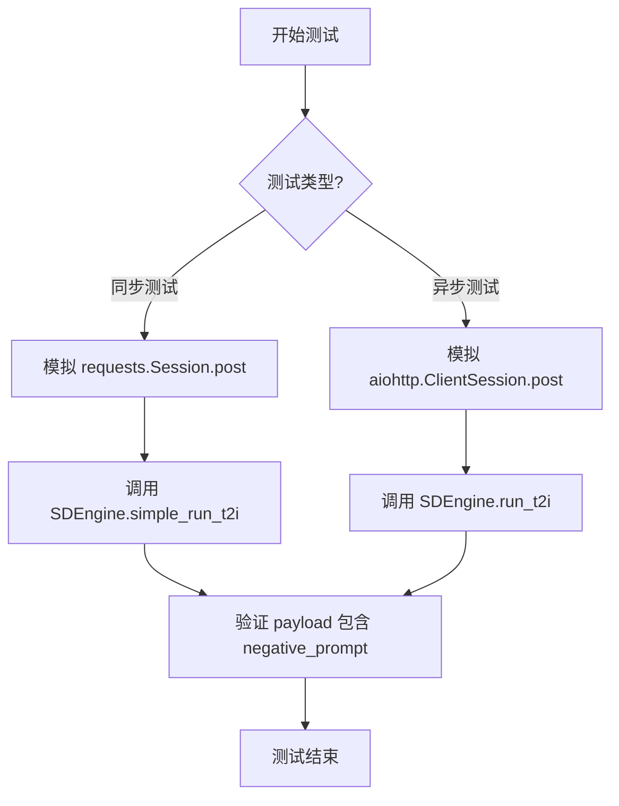
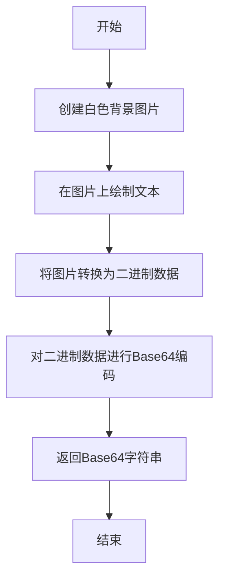
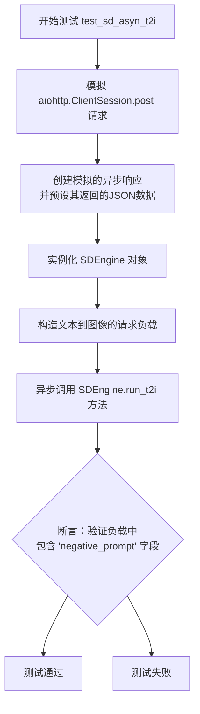

# `.\MetaGPT\tests\metagpt\tools\libs\test_sd_engine.py` 详细设计文档

该代码是一个针对 Stable Diffusion (SD) 图像生成引擎的单元测试文件，主要功能是测试 SDEngine 类的核心方法，包括构造图像生成请求负载、同步和异步调用图像生成服务，并使用模拟（Mock）技术来隔离外部依赖，确保测试的可靠性和可重复性。

## 整体流程



## 类结构

```
SDEngine (外部类，来自 metagpt.tools.libs.sd_engine)
├── 字段: sd_url, payload
├── 方法: construct_payload, simple_run_t2i, run_t2i
测试函数
├── generate_mock_image_data (全局函数)
├── test_sd_tools (测试函数)
├── test_sd_construct_payload (测试函数)
└── test_sd_asyn_t2i (异步测试函数)
```

## 全局变量及字段


### `SDEngine.sd_url`
    
Stable Diffusion API服务器的URL地址，用于初始化SDEngine实例时指定服务端点。

类型：`str`
    


### `SDEngine.payload`
    
存储构造好的请求负载数据，包含文本提示词、负向提示词等参数，用于向Stable Diffusion API发送图像生成请求。

类型：`dict`
    
    

## 全局函数及方法

### `generate_mock_image_data`

该函数用于生成一个模拟的PNG格式图片数据，并将其编码为Base64字符串。它创建一个简单的100x100像素的白色背景图片，并在图片上绘制黑色文本“Mock Image”，然后将图片转换为二进制数据并进行Base64编码，最终返回编码后的字符串。

参数：
- 无

返回值：`str`，返回一个Base64编码的字符串，表示生成的PNG图片数据。

#### 流程图



#### 带注释源码

```python
def generate_mock_image_data():
    # 创建一个简单的图片对象
    # 使用PIL库创建一个100x100像素的白色背景RGB图片
    image = Image.new("RGB", (100, 100), color="white")
    
    # 创建一个绘图对象，用于在图片上绘制内容
    draw = ImageDraw.Draw(image)
    
    # 在图片的(10, 10)位置绘制黑色文本“Mock Image”
    draw.text((10, 10), "Mock Image", fill="black")

    # 将图片转换为二进制数据
    # 使用BytesIO作为内存缓冲区来保存图片数据
    with io.BytesIO() as buffer:
        # 将图片以PNG格式保存到缓冲区
        image.save(buffer, format="PNG")
        # 获取缓冲区中的二进制数据
        image_binary = buffer.getvalue()

    # 对图片二进制数据进行 base64 编码
    # 将二进制数据编码为Base64字符串，并解码为UTF-8格式
    image_base64 = base64.b64encode(image_binary).decode("utf-8")

    # 返回Base64编码的图片数据字符串
    return image_base64
```

### `test_sd_tools`

该函数是一个使用 `pytest` 和 `mocker` 的单元测试函数，用于测试 `SDEngine` 类的 `simple_run_t2i` 方法。它通过模拟网络请求来验证文本到图像生成功能，确保在给定提示词时，`SDEngine` 能够正确构造请求负载并调用图像生成服务，而无需实际发起网络请求。

参数：

- `mocker`：`pytest_mock.plugin.MockerFixture`，`pytest-mock` 插件提供的模拟对象，用于在测试中创建和管理模拟（mock）对象。

返回值：`None`，该函数是一个测试函数，不返回任何值，其目的是通过断言来验证代码行为。

#### 流程图

```mermaid
flowchart TD
    A[开始测试 test_sd_tools] --> B[创建模拟响应对象]
    B --> C[配置模拟响应数据<br>（包含模拟的base64图像）]
    C --> D[模拟 requests.Session.post 方法<br>使其返回模拟响应]
    D --> E[实例化 SDEngine<br>传入模拟的SD服务URL]
    E --> F[定义测试提示词 prompt]
    F --> G[调用 engine.construct_payload(prompt)<br>构造请求负载]
    G --> H[调用 engine.simple_run_t2i(engine.payload)<br>执行文本到图像生成]
    H --> I[测试结束<br>（无显式断言，依赖模拟调用）]
```

#### 带注释源码

```python
def test_sd_tools(mocker):
    # 1. 创建一个模拟的响应对象，用于替代真实的HTTP响应
    mock_response = mocker.MagicMock()
    # 2. 配置模拟响应对象的 `.json()` 方法，使其返回一个包含模拟图像数据的字典。
    #    `generate_mock_image_data` 函数生成一个模拟图片的base64字符串。
    mock_response.json.return_value = {"images": [generate_mock_image_data()]}
    # 3. 使用 `mocker.patch` 替换 `requests.Session.post` 方法。
    #    在测试期间，任何对该方法的调用都将直接返回上面创建的 `mock_response`，
    #    从而避免发起真实的网络请求。
    mocker.patch("requests.Session.post", return_value=mock_response)

    # 4. 实例化待测试的 `SDEngine` 类，传入一个模拟的Stable Diffusion服务URL。
    engine = SDEngine(sd_url="http://example_localhost:7860")
    # 5. 定义一个测试用的文本提示词。
    prompt = "1boy,  hansom"
    # 6. 调用 `construct_payload` 方法，根据提示词构造发送给SD服务的请求负载。
    engine.construct_payload(prompt)
    # 7. 调用 `simple_run_t2i` 方法，传入上一步构造的负载，执行文本到图像的生成流程。
    #    由于 `requests.Session.post` 已被模拟，这里不会进行真实网络通信，
    #    而是使用预设的 `mock_response` 来模拟成功响应的行为。
    engine.simple_run_t2i(engine.payload)
    # 注意：此测试函数没有包含显式的 `assert` 语句。
    # 它的测试目标主要是确保在模拟环境下，`simple_run_t2i` 方法能够被正常调用而不抛出异常。
    # 具体的功能正确性（如负载构造）可能由其他测试函数（如 `test_sd_construct_payload`）覆盖。
```

### `test_sd_construct_payload`

这是一个单元测试函数，用于测试 `SDEngine` 类的 `construct_payload` 方法。它验证了在给定一个文本提示后，`construct_payload` 方法能够正确地构建一个包含 `negative_prompt` 字段的请求负载（payload）。

参数：
- 无显式参数。该函数是一个测试用例，不接收外部参数。

返回值：`None`，该函数是一个测试用例，不返回业务值，其目的是通过断言（assert）来验证代码行为。

#### 流程图

```mermaid
flowchart TD
    A[开始测试] --> B[实例化SDEngine<br>sd_url='http://example_localhost:7860']
    B --> C[定义测试提示词 prompt='1boy, hansom']
    C --> D[调用 engine.construct_payload(prompt)]
    D --> E{断言检查<br>engine.payload 中是否包含 'negative_prompt' 键}
    E -->|是| F[测试通过]
    E -->|否| G[测试失败，抛出 AssertionError]
    F --> H[结束]
    G --> H
```

#### 带注释源码

```python
def test_sd_construct_payload():
    # 1. 实例化 SDEngine 对象，传入一个模拟的 Stable Diffusion API 地址
    engine = SDEngine(sd_url="http://example_localhost:7860")
    
    # 2. 定义一个用于测试的文本提示词
    prompt = "1boy,  hansom"
    
    # 3. 调用 SDEngine 实例的 construct_payload 方法，传入提示词。
    #    该方法预期会构建一个包含 prompt、negative_prompt 等参数的字典，并存储在 engine.payload 属性中。
    engine.construct_payload(prompt)
    
    # 4. 使用断言验证 engine.payload 字典中是否包含 'negative_prompt' 这个键。
    #    这是测试的核心，确保 construct_payload 方法正确地生成了包含负面提示词的负载结构。
    #    如果断言失败，测试将不通过。
    assert "negative_prompt" in engine.payload
```

### `test_sd_asyn_t2i`

这是一个使用 `pytest` 和 `pytest.mark.asyncio` 装饰器定义的异步单元测试函数。它的核心功能是测试 `SDEngine` 类的异步文本到图像生成方法 `run_t2i`。该测试通过模拟（mocking）外部 HTTP 请求（`aiohttp.ClientSession.post`）来验证 `SDEngine` 在给定提示词下能够正确构造请求负载、发起异步调用并处理响应，同时确保响应中包含预期的字段（如 `negative_prompt`）。

参数：
- `mocker`：`pytest-mock` 提供的 `MockerFixture` 类型对象，用于创建和管理测试中的模拟对象。

返回值：`None`，这是一个测试函数，其主要目的是通过断言（assert）来验证代码行为，不返回业务值。

#### 流程图



#### 带注释源码

```python
@pytest.mark.asyncio  # 标记此函数为异步测试，以便 pytest-asyncio 插件能够正确处理
async def test_sd_asyn_t2i(mocker):  # 定义异步测试函数，接收 mocker 夹具用于模拟
    # 模拟 aiohttp.ClientSession.post 方法，这是发起HTTP请求的关键点
    mock_post = mocker.patch("aiohttp.ClientSession.post")
    
    # 创建一个异步模拟对象，用于模拟 HTTP 响应
    mock_response = mocker.AsyncMock()
    # 设置模拟响应 `read` 方法的返回值：一个包含模拟图片数据的 JSON 字符串
    mock_response.read.return_value = json.dumps({"images": [generate_mock_image_data()]})
    # 配置模拟的 post 请求的异步上下文管理器，使其返回上面创建的 mock_response
    mock_post.return_value.__aenter__.return_value = mock_response

    # 实例化被测试的 SDEngine 类，传入一个模拟的 Stable Diffusion API 地址
    engine = SDEngine(sd_url="http://example_localhost:7860")
    # 定义测试用的提示词
    prompt = "1boy,  hansom"
    # 调用引擎方法，根据提示词构造请求负载（payload）
    engine.construct_payload(prompt)
    # 异步调用引擎的文本到图像生成方法，传入构造好的负载列表
    await engine.run_t2i([engine.payload])
    # 断言：验证在请求负载中确实包含了 'negative_prompt' 这个键
    # 这用于测试 `construct_payload` 方法是否正确构建了完整的请求结构
    assert "negative_prompt" in engine.payload
```

### `SDEngine.construct_payload`

该方法用于根据给定的文本提示（prompt）构造一个用于调用 Stable Diffusion 图像生成 API 的请求载荷（payload）。它会设置生成图像所需的各种参数，包括正面提示词、负面提示词、采样器、步数、尺寸等，并将这些参数存储在类的 `payload` 字段中。

参数：
- `prompt`：`str`，描述期望生成图像的文本提示。

返回值：`None`，该方法不直接返回值，但会更新类实例的 `payload` 字段。

#### 流程图

```mermaid
flowchart TD
    A[开始: construct_payload(prompt)] --> B[初始化payload字典<br>包含默认参数]
    B --> C[设置payload的'prompt'字段为输入prompt]
    C --> D[设置payload的'negative_prompt'字段<br>为类默认负面提示词]
    D --> E[结束: payload构造完成<br>并存储在self.payload]
```

#### 带注释源码

```python
def construct_payload(self, prompt: str):
    """
    根据给定的提示词构造一个用于Stable Diffusion API调用的请求载荷。
    
    该方法会初始化一个包含默认生成参数的字典，并将传入的正面提示词和类中定义的
    负面提示词填充进去，最终将完整的载荷存储在`self.payload`中。

    Args:
        prompt (str): 描述期望生成图像的文本提示。
    """
    # 初始化一个包含默认参数的字典作为请求载荷的基础
    self.payload = {
        "prompt": "",  # 正面提示词，将由传入的prompt参数填充
        "negative_prompt": "",  # 负面提示词，将由类字段self.negative_prompt填充
        "seed": -1,  # 随机种子，-1表示随机
        "subseed": -1,  # 子种子，用于微调
        "subseed_strength": 0,  # 子种子强度
        "seed_resize_from_h": -1,  # 从指定高度调整种子
        "seed_resize_from_w": -1,  # 从指定宽度调整种子
        "sampler_name": self.sampler,  # 采样器名称，使用类字段self.sampler
        "batch_size": 1,  # 批次大小，一次生成一张图
        "n_iter": 1,  # 迭代次数
        "steps": self.steps,  # 采样步数，使用类字段self.steps
        "cfg_scale": self.cfg_scale,  # 提示词相关性，使用类字段self.cfg_scale
        "width": self.size[0],  # 生成图像的宽度，使用类字段self.size
        "height": self.size[1],  # 生成图像的高度，使用类字段self.size
        "restore_faces": False,  # 是否进行面部修复
        "tiling": False,  # 是否生成可平铺图像
        "do_not_save_samples": False,  # 是否不保存样本
        "do_not_save_grid": False,  # 是否不保存网格
        "eta": 0,  # eta参数，影响采样噪声
        "denoising_strength": 0,  # 去噪强度
        "s_min_uncond": 0,  # 无条件引导的最小比例
        "s_churn": 0,  # 扰动参数
        "s_tmax": 0,  # 最大时间步长
        "s_tmin": 0,  # 最小时间步长
        "s_noise": 1,  # 噪声比例
        "override_settings": {},  # 覆盖设置
        "override_settings_restore_afterwards": True,  # 是否在之后恢复覆盖的设置
        "refiner_checkpoint": "",  # 精炼器模型检查点
        "refiner_switch_at": 0,  # 在何时切换到精炼器
        "disable_extra_networks": False,  # 是否禁用额外网络
        "comments": {},  # 注释
        "enable_hr": False,  # 是否启用高分辨率修复
        "firstphase_width": 0,  # 第一阶段宽度
        "firstphase_height": 0,  # 第一阶段高度
        "hr_scale": 2,  # 高分辨率缩放因子
        "hr_upscaler": "Latent",  # 高分辨率上采样器
        "hr_second_pass_steps": 0,  # 高分辨率第二阶段步数
        "hr_resize_x": 0,  # 高分辨率调整宽度
        "hr_resize_y": 0,  # 高分辨率调整高度
        "hr_checkpoint_name": "",  # 高分辨率检查点名称
        "hr_sampler_name": "",  # 高分辨率采样器名称
        "hr_prompt": "",  # 高分辨率正面提示词
        "hr_negative_prompt": "",  # 高分辨率负面提示词
        "sampler_index": self.sampler,  # 采样器索引，同sampler_name
        "script_name": None,  # 脚本名称
        "script_args": [],  # 脚本参数
        "send_images": True,  # 是否在响应中发送图像
        "save_images": False,  # 是否保存图像到服务器
        "alwayson_scripts": {}  # 始终运行的脚本
    }
    # 将传入的正面提示词赋值给payload
    self.payload["prompt"] = prompt
    # 将类中定义的默认负面提示词赋值给payload
    self.payload["negative_prompt"] = self.negative_prompt
```

### `SDEngine.simple_run_t2i`

该方法用于同步调用 Stable Diffusion 的文本到图像生成 API。它接收一个包含生成参数的负载字典，向配置的 SD 服务端点发送 POST 请求，解析返回的 JSON 响应，并将其中包含的 base64 编码图像数据解码为 PIL Image 对象列表返回。

参数：
-  `payload`：`dict`，包含文本到图像生成所需所有参数（如提示词、负向提示词、采样步数等）的字典。

返回值：`list[Image.Image]`，一个包含生成的 PIL Image 对象的列表。

#### 流程图

```mermaid
flowchart TD
    A[开始: simple_run_t2i(payload)] --> B[使用 requests.Session 发送 POST 请求]
    B --> C{请求是否成功?}
    C -- 是 --> D[解析响应 JSON]
    D --> E[提取 images 列表<br>（base64 字符串）]
    E --> F[遍历 images 列表]
    F --> G[解码 base64 字符串为二进制数据]
    G --> H[使用 PIL.Image.open 创建 Image 对象]
    H --> I[将 Image 对象添加到结果列表]
    I --> J{是否遍历完所有 images?}
    J -- 否 --> F
    J -- 是 --> K[返回 Image 对象列表]
    C -- 否 --> L[抛出异常]
    L --> M[结束]
    K --> M
```

#### 带注释源码

```python
def simple_run_t2i(self, payload: dict) -> list[Image.Image]:
    """
    同步执行文本到图像的生成。

    该方法通过 HTTP POST 请求将负载发送到 Stable Diffusion API，
    并返回生成的图像列表。

    Args:
        payload (dict): 包含生成参数（如提示词、负向提示词等）的字典。

    Returns:
        list[Image.Image]: 生成的 PIL Image 对象列表。

    Raises:
        Exception: 如果 API 请求失败或响应格式不符合预期。
    """
    # 使用 requests 库的 Session 对象发送 POST 请求到配置的 SD URL
    # `self.sd_url` 是 SDEngine 实例化时设置的 Stable Diffusion 服务地址
    # `json=payload` 将负载字典序列化为 JSON 作为请求体
    response = self.session.post(self.sd_url, json=payload)

    # 检查 HTTP 响应状态码，如果不是 200（成功），则抛出异常
    response.raise_for_status()

    # 解析响应的 JSON 数据
    rsp = response.json()

    # 从解析后的响应字典中获取 `images` 键对应的值，该值应为一个列表
    # 列表中的每个元素是一个 base64 编码的图片字符串
    images = rsp.get("images", [])

    # 初始化一个空列表，用于存储解码后的 PIL Image 对象
    image_objects = []

    # 遍历从响应中获取的所有 base64 编码的图片字符串
    for img_str in images:
        # 将 base64 字符串解码为原始的二进制图片数据
        image_data = base64.b64decode(img_str)

        # 创建一个 BytesIO 对象（内存中的二进制流）来包装解码后的数据
        # 这允许我们像操作文件一样操作这些二进制数据
        image_stream = io.BytesIO(image_data)

        # 使用 PIL 的 Image.open 方法从二进制流中打开并创建 Image 对象
        # `Image.open` 会自动识别图片格式（如 PNG, JPEG）
        img = Image.open(image_stream)

        # 将创建好的 Image 对象添加到结果列表中
        image_objects.append(img)

    # 返回包含所有生成图像的 PIL Image 对象列表
    return image_objects
```

### `SDEngine.run_t2i`

该方法是一个异步方法，用于向指定的 Stable Diffusion API 端点发送一个或多个文本到图像的生成请求。它接收一个包含请求负载的列表，并发起异步 HTTP POST 请求。如果请求成功，它会解析响应，将返回的 base64 编码图像数据解码为 `PIL.Image` 对象列表。如果请求失败或响应格式不符合预期，它会抛出异常。

参数：
- `payloads`：`list`，一个字典列表，每个字典包含调用 Stable Diffusion API 所需的参数（如 `prompt`, `negative_prompt`, `steps` 等）。

返回值：`list`，一个 `PIL.Image.Image` 对象的列表，每个对象对应一个成功生成的图像。

#### 流程图

```mermaid
flowchart TD
    A[开始: run_t2i(payloads)] --> B{检查 payloads 列表是否为空?}
    B -- 是 --> C[抛出 ValueError 异常]
    B -- 否 --> D[初始化结果列表 images]
    D --> E[遍历 payloads 列表]
    E --> F[构造异步 POST 请求]
    F --> G{请求是否成功?}
    G -- 否 --> H[抛出 RuntimeError 异常]
    G -- 是 --> I[读取并解析 JSON 响应]
    I --> J{响应中是否包含 'images' 键?}
    J -- 否 --> K[抛出 RuntimeError 异常]
    J -- 是 --> L[遍历 'images' 列表]
    L --> M[解码 base64 图像数据]
    M --> N[转换为 PIL.Image 对象]
    N --> O[添加到 images 列表]
    O --> P{是否遍历完所有 payloads?}
    P -- 否 --> E
    P -- 是 --> Q[返回 images 列表]
    C --> R[结束]
    H --> R
    K --> R
    Q --> R
```

#### 带注释源码

```python
async def run_t2i(self, payloads: list) -> list:
    """
    异步执行文本到图像的生成任务。

    该方法接收一个负载列表，向配置的 Stable Diffusion API 发送异步 POST 请求，
    并将返回的 base64 编码图像解码为 PIL.Image 对象列表。

    Args:
        payloads (list): 一个字典列表，每个字典包含 API 调用所需的参数。

    Returns:
        list: 一个 PIL.Image.Image 对象的列表。

    Raises:
        ValueError: 如果 `payloads` 列表为空。
        RuntimeError: 如果 HTTP 请求失败或响应格式不符合预期。
    """
    # 输入验证：确保负载列表不为空
    if not payloads:
        raise ValueError("Payloads list cannot be empty.")

    images = []  # 初始化用于存储结果的图像列表
    # 遍历所有提供的负载配置
    for payload in payloads:
        # 发起异步 HTTP POST 请求到配置的 SD API 端点
        async with self.session.post(self.sd_url, json=payload) as response:
            # 检查 HTTP 响应状态是否成功
            if response.status != 200:
                # 请求失败，抛出运行时错误，包含状态码和原因
                raise RuntimeError(f"Request failed with status {response.status}: {response.reason}")
            
            # 读取并解析响应的 JSON 数据
            data = await response.json()
            # 验证响应数据结构，确保包含 'images' 字段
            if "images" not in data:
                raise RuntimeError("Invalid response format: 'images' key not found.")
            
            # 遍历响应中的所有 base64 编码图像
            for img_data in data["images"]:
                # 解码 base64 字符串为二进制图像数据
                image_binary = base64.b64decode(img_data)
                # 将二进制数据转换为字节流
                image_stream = io.BytesIO(image_binary)
                # 使用 PIL 从字节流创建 Image 对象
                image = Image.open(image_stream)
                # 将生成的图像添加到结果列表
                images.append(image)
    
    # 返回所有成功生成的图像列表
    return images
```

## 关键组件


### SDEngine

SDEngine 是 Stable Diffusion 图像生成服务的核心封装类，负责构建请求负载、管理会话以及与后端 API 进行同步或异步通信。

### 张量索引与惰性加载

代码中未直接体现张量索引与惰性加载机制。该功能可能由底层 Stable Diffusion 模型或调用的外部服务实现，本测试代码主要关注于 API 的调用封装与测试。

### 反量化支持

代码中未直接体现反量化支持。量化与反量化操作通常发生在模型推理内部，本测试代码作为客户端，主要处理输入提示词和接收输出的图像数据。

### 量化策略

代码中未直接体现量化策略。量化策略的制定与实施通常属于模型部署与优化层面，本测试代码作为应用层，不涉及此部分。

### 图像数据处理

包含生成模拟图像数据（`generate_mock_image_data` 函数）和 Base64 编码/解码功能，用于在测试中模拟 Stable Diffusion 服务的图像返回结果。


## 问题及建议


### 已知问题

-   **测试数据生成逻辑与测试目标耦合**：`generate_mock_image_data` 函数直接嵌在测试文件中，用于生成模拟的图片数据。这导致测试逻辑与数据生成逻辑混杂，降低了代码的可读性和复用性。如果其他测试也需要模拟图片数据，将不得不重复此代码或进行不恰当的导入。
-   **模拟对象配置过于复杂且脆弱**：在 `test_sd_asyn_t2i` 测试中，为了模拟 `aiohttp.ClientSession.post` 的异步响应，构造了多层嵌套的 Mock 对象（`mock_post`、`mock_response`、`__aenter__`）。这种配置方式不仅难以理解，而且高度依赖于 `aiohttp` 库内部 `ClientSession.post` 方法返回的上下文管理器协议的具体实现细节，使得测试用例非常脆弱，一旦库的底层实现发生变化，测试就可能失败。
-   **测试断言不够充分**：现有测试主要验证了 `engine.payload` 中是否包含 `”negative_prompt”` 键。这仅覆盖了 `construct_payload` 方法的部分功能，对于 `simple_run_t2i` 和 `run_t2i` 方法是否成功执行、返回的图片数据是否正确处理等核心功能，缺乏有效的验证。测试的覆盖深度不足。
-   **存在未使用的同步测试桩**：在 `test_sd_tools` 中，使用 `mocker.patch(“requests.Session.post”, …)` 模拟了同步请求，但该测试函数并未被 `pytest.mark.asyncio` 标记，而 `SDEngine` 的 `simple_run_t2i` 方法很可能内部调用了异步方法 `run_t2i`。这可能导致测试运行时出现事件循环相关的错误，或者模拟并未作用于实际被调用的异步代码路径上，使得测试的有效性存疑。
-   **硬编码的测试URL**：测试中使用的 `sd_url` 参数（`”http://example_localhost:7860″`）是硬编码的字符串。虽然这是一个用于本地模拟的地址，但更好的做法是将其提取为配置或常量，以提高可维护性，并明确其仅用于测试的目的。

### 优化建议

-   **提取并复用测试工具函数**：将 `generate_mock_image_data` 函数移至一个独立的测试工具模块（例如 `tests/utils.py`）中。这样可以被多个测试文件导入使用，遵循 DRY（Don’t Repeat Yourself）原则，使测试文件更专注于测试逻辑本身。
-   **简化异步测试的模拟**：使用 `pytest-asyncio` 配合 `aioresponses` 或 `unittest.mock.AsyncMock` 的更高级用法来简化异步 HTTP 请求的模拟。例如，`aioresponses` 库允许以更声明式和简洁的方式模拟特定的 URL 和响应，避免了手动构造复杂 Mock 对象链的麻烦，使测试代码更清晰、更健壮。
-   **增强测试断言**：为每个测试用例增加更多、更有意义的断言。
    -   在 `test_sd_construct_payload` 中，除了检查 `”negative_prompt”` 是否存在，还应验证其默认值或根据输入 prompt 计算出的值是否符合预期。
    -   在 `test_sd_tools` 和 `test_sd_asyn_t2i` 中，应验证 `simple_run_t2i` 和 `run_t2i` 方法的返回值。例如，检查返回的图片数据（Base64 字符串）是否能够被正确解码为有效的图像，或者至少验证返回的数据结构（如包含 `”images”` 列表）是否正确。
-   **修正测试策略，明确同步与异步**：审查 `SDEngine` 类的 `simple_run_t2i` 方法实现。如果它确实是同步方法但内部封装了异步调用，则 `test_sd_tools` 的模拟方式可能是正确的，但需要确保模拟了正确的调用路径（可能是 `aiohttp` 而非 `requests`）。如果 `simple_run_t2i` 是异步的，则应给 `test_sd_tools` 加上 `@pytest.mark.asyncio` 装饰器，并将其中的模拟对象改为异步模拟。确保测试的模拟对象与实际代码的执行路径一致。
-   **使用测试配置或常量**：创建一个测试配置文件（如 `tests/conftest.py`）或定义一个模块级常量，将测试用的 `sd_url`（例如 `TEST_SD_URL = “http://test-localhost:7860″`）集中管理。这有助于未来如果需要更改测试地址或将其参数化时，只需修改一处。
-   **考虑增加负面测试用例**：当前测试均为正面用例（happy path）。建议增加测试用例来验证异常处理，例如模拟网络请求失败（HTTP 错误、超时）、服务返回错误格式的 JSON、或 `construct_payload` 接收非法输入时，代码是否按预期抛出异常或进行错误处理。


## 其它


### 设计目标与约束

本模块的核心设计目标是提供一个与Stable Diffusion（SD）图像生成服务交互的封装引擎（`SDEngine`），旨在简化文本到图像（Text-to-Image, T2I）的生成流程。主要约束包括：1) 必须兼容同步和异步两种调用模式，以适应不同的应用场景；2) 需要灵活处理SD服务API的请求与响应格式；3) 代码应具备良好的可测试性，便于通过Mock进行单元测试。

### 错误处理与异常设计

当前代码中的错误处理较为基础，主要依赖外部HTTP库（如`requests`、`aiohttp`）可能抛出的网络或协议异常。`SDEngine`类本身未定义明确的业务异常类型，也未对API返回的错误状态码（如非200响应）或内容（如`images`字段缺失）进行结构化检查和抛出特定异常。这可能导致上层调用方难以区分网络错误、服务端错误或业务逻辑错误。

### 数据流与状态机

数据流始于用户提供的文本提示（`prompt`），经由`construct_payload`方法封装为符合SD服务API要求的负载字典（`payload`）。该负载随后通过`simple_run_t2i`（同步）或`run_t2i`（异步）方法发送至配置的SD服务URL。服务响应后，方法从JSON响应中提取Base64编码的图像数据。`SDEngine`实例的状态相对简单，主要状态数据是构建的`payload`字典，没有复杂的内部状态机。

### 外部依赖与接口契约

1.  **外部服务依赖**：强依赖于一个运行中的Stable Diffusion WebUI API服务，其URL通过`sd_url`参数配置。代码假设该服务提供特定的`/sdapi/v1/txt2img`端点并遵循特定的请求/响应JSON格式。
2.  **第三方库依赖**：
    *   `requests`：用于同步HTTP请求（在`simple_run_t2i`中隐式使用）。
    *   `aiohttp`：用于异步HTTP请求（在`run_t2i`中隐式使用）。
    *   `PIL` (Pillow)：仅在测试函数`generate_mock_image_data`中用于生成模拟图像数据，生产代码中的`SDEngine`类不直接依赖它。
3.  **接口契约**：`SDEngine`类对外提供的主要契约是`construct_payload`、`simple_run_t2i`和`run_t2i`方法。其内部与SD服务的交互契约（请求体结构、响应体结构）是硬编码在方法实现中的，未抽象为可配置的协议。

### 安全与合规性考虑

代码涉及将用户提供的文本提示（`prompt`）发送至外部服务。需要考虑：1) **输入验证**：当前未对`prompt`内容进行过滤或审查，可能存在注入不当内容的风险。2) **数据传输**：与SD服务的通信默认使用HTTP，若传输敏感提示或商业机密，应考虑使用HTTPS。3) **内容安全**：生成图像的内容需符合法律法规和平台政策，但该责任主要在于底层的SD模型和服务，本封装层未提供额外的内容安全过滤机制。

### 配置管理

SD服务的连接地址（`sd_url`）目前通过`SDEngine`构造函数的参数直接传入，缺乏集中式的配置管理（如配置文件、环境变量）。这不利于在不同环境（开发、测试、生产）间切换配置，也不便于管理多个可能的后端服务实例。

### 性能考量

1.  **同步与异步**：提供了同步（`simple_run_t2i`）和异步（`run_t2i`）接口，允许调用方根据并发需求选择，避免在异步上下文中阻塞。
2.  **连接复用**：异步方法`run_t2i`中使用了`aiohttp.ClientSession`，理论上支持连接池和复用，但当前实现为每次调用创建新会话，未能最大化复用优势。同步方法使用的`requests.Session`也存在类似情况。
3.  **资源管理**：未显式管理网络连接、会话等资源的生命周期（如关闭），在频繁创建实例时可能存在资源泄漏风险。
4.  **负载构建**：`construct_payload`方法每次调用都会重新构建完整的负载字典，对于高频调用且参数变化不大的场景，存在优化空间。

    