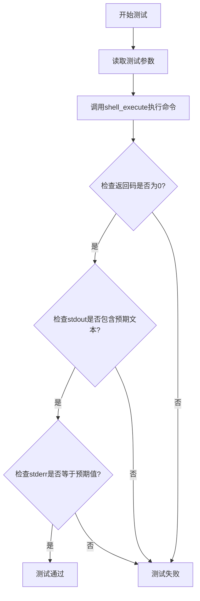
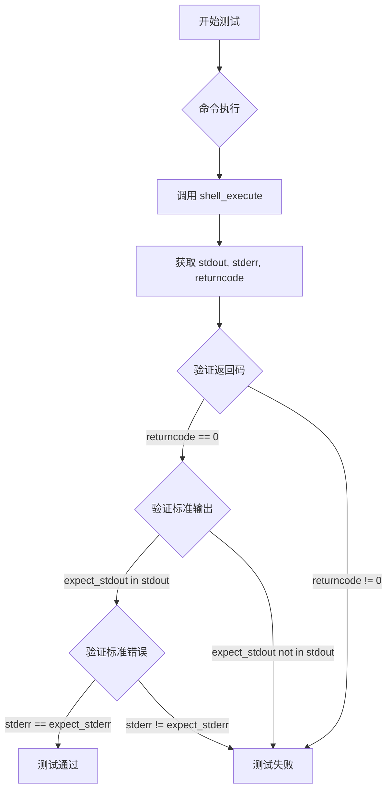

# `.\MetaGPT\tests\metagpt\tools\libs\test_shell.py` 详细设计文档

该代码是一个使用pytest框架编写的异步单元测试，用于测试`shell_execute`函数的功能。它通过提供不同的命令输入（列表形式和字符串形式），验证函数能否正确执行shell命令，并检查其标准输出、标准错误和返回码是否符合预期。

## 整体流程



## 类结构

```
无显式类定义
├── 全局函数: test_shell (异步测试函数)
└── 外部依赖: shell_execute (被测试函数)
```

## 全局变量及字段


### `__file__`
    
当前Python脚本文件的路径

类型：`str`
    


### `command`
    
要执行的shell命令，可以是字符串或字符串列表

类型：`Union[List[str], str]`
    


### `expect_stdout`
    
期望的标准输出中包含的字符串

类型：`str`
    


### `expect_stderr`
    
期望的标准错误输出

类型：`str`
    


### `stdout`
    
shell命令执行后的标准输出

类型：`str`
    


### `stderr`
    
shell命令执行后的标准错误输出

类型：`str`
    


### `returncode`
    
shell命令执行后的返回码

类型：`int`
    


    

## 全局函数及方法

### `test_shell`

这是一个使用 `pytest` 框架编写的异步测试函数，用于测试 `shell_execute` 函数执行 shell 命令的功能。它通过参数化测试验证命令以列表或字符串形式输入时，是否能正确执行并返回预期的标准输出和标准错误。

参数：
- `command`：`Union[List[str], str]`，要执行的 shell 命令，可以是字符串或字符串列表。
- `expect_stdout`：`str`，期望出现在命令标准输出中的字符串。
- `expect_stderr`：`str`，期望的命令标准错误输出。

返回值：`None`，这是一个测试函数，不直接返回值，而是通过断言（assert）来验证测试结果。

#### 流程图



#### 带注释源码

```python
# 使用 pytest 的异步支持和参数化装饰器
@pytest.mark.asyncio
@pytest.mark.parametrize(
    # 定义参数化测试的参数名
    ["command", "expect_stdout", "expect_stderr"],
    # 提供两组测试数据
    [
        # 第一组：命令以列表形式给出，期望 stdout 包含特定文本，stderr 为空
        (["file", f"{__file__}"], "Python script text executable, ASCII text", ""),
        # 第二组：命令以字符串形式给出，期望同上
        (f"file {__file__}", "Python script text executable, ASCII text", ""),
    ],
)
# 异步测试函数定义
async def test_shell(command, expect_stdout, expect_stderr):
    # 调用被测试的异步函数 shell_execute 执行命令
    stdout, stderr, returncode = await shell_execute(command)
    # 断言1：命令执行成功，返回码应为0
    assert returncode == 0
    # 断言2：期望的文本应出现在标准输出中
    assert expect_stdout in stdout
    # 断言3：标准错误输出应与期望值完全匹配
    assert stderr == expect_stderr
```

## 关键组件


### shell_execute 函数

一个用于异步执行 shell 命令的工具函数，它接受命令（可以是字符串或列表形式），执行后返回标准输出、标准错误和返回码。

### pytest 测试框架

一个用于编写和运行单元测试的 Python 框架，在本代码中用于定义和执行对 `shell_execute` 函数的异步测试用例。

### 参数化测试用例

通过 `@pytest.mark.parametrize` 装饰器定义多组测试数据，使得同一个测试函数 `test_shell` 能够使用不同的输入参数（命令、期望的标准输出、期望的标准错误）重复运行，以验证函数在不同场景下的行为。


## 问题及建议


### 已知问题

-   **测试用例覆盖不足**：当前测试仅验证了 `shell_execute` 函数在成功执行 `file` 命令时的行为。它没有测试命令执行失败（返回非零退出码）、命令执行超时、处理包含特殊字符或空格的复杂命令、以及处理大量输出（可能涉及缓冲区限制）等边界和异常情况。
-   **测试数据硬编码**：测试用例中期望的 `stdout` 字符串 `"Python script text executable, ASCII text"` 是硬编码的。这个字符串可能因操作系统、`file` 命令版本或文件编码不同而有所变化（例如，在某些系统上可能输出 `"Python script, ASCII text executable"`），导致测试在不兼容的环境下失败，降低了测试的健壮性和可移植性。
-   **缺乏对异步行为的深度测试**：测试使用了 `@pytest.mark.asyncio` 装饰器，但并未测试 `shell_execute` 在并发执行、取消任务或遇到异步超时等场景下的行为。
-   **测试文件直接执行逻辑冗余**：`if __name__ == "__main__":` 块中的 `pytest.main([__file__, "-s"])` 允许文件直接运行。然而，这通常不是运行测试的最佳实践，并且 `-s` 选项（用于禁用输出捕获）可能会在 CI/CD 流水线中产生不必要的输出。测试应该主要通过标准的 `pytest` 命令来执行。

### 优化建议

-   **补充测试用例**：增加测试用例以覆盖更全面的场景。
    -   添加测试验证命令执行失败（例如，执行一个不存在的命令 `invalid_cmd`），检查 `returncode` 不为 0 以及 `stderr` 不为空。
    -   添加测试验证命令执行超时（如果 `shell_execute` 支持超时参数）。
    -   添加测试处理带空格或特殊字符的参数的命令（例如，`echo "hello world"`）。
    -   添加测试验证大输出流的处理。
-   **提高测试数据的健壮性**：修改对 `stdout` 的断言，使其不依赖于具体的、可能变化的文本字符串。可以改为检查 `stdout` 是否包含某些关键词（如 `"Python"`），或者使用正则表达式进行更灵活的匹配。更好的方法是，如果测试目标不是 `file` 命令本身，可以考虑使用一个输出稳定、跨平台的命令（如 `echo`）进行测试。
-   **增强异步测试**：考虑添加测试来验证 `shell_execute` 在并发环境下的行为（例如，使用 `asyncio.gather` 同时执行多个命令），以及测试任务取消的响应。
-   **移除直接执行逻辑或使其更规范**：考虑移除 `if __name__ == "__main__":` 块，或者至少移除 `-s` 参数，以遵循通过 `pytest` 命令运行测试的通用实践。如果保留，可以添加注释说明其用途（例如，用于本地调试）。
-   **考虑添加对 `shell_execute` 函数签名的测试**：虽然当前测试了列表和字符串两种命令输入形式，但可以更明确地测试函数对不同输入类型的处理，并验证其返回类型始终是预期的三元组 `(str, str, int)`。


## 其它


### 设计目标与约束

本代码是一个针对 `shell_execute` 函数的单元测试模块。其核心设计目标是验证该函数在不同输入形式（列表或字符串形式的命令）下，能否正确执行 shell 命令并返回预期的标准输出、标准错误和退出码。主要约束包括：1) 必须使用 `pytest` 框架进行异步测试；2) 测试用例应覆盖命令的两种常见输入格式；3) 测试环境需支持 `file` 命令的执行。

### 错误处理与异常设计

测试本身不包含复杂的业务逻辑错误处理，其设计旨在捕获 `shell_execute` 函数可能抛出的异常或返回非预期的结果。测试用例通过 `assert` 语句来验证：1) 命令执行成功（`returncode == 0`）；2) 标准输出包含预期的文本片段；3) 标准错误与预期完全一致。如果任何一项断言失败，`pytest` 将报告测试失败，从而指示 `shell_execute` 函数存在缺陷或测试环境不匹配。

### 数据流与状态机

本测试模块的数据流是线性的：
1.  **输入**：测试参数化提供了输入数据，即 `command`（命令）、`expect_stdout`（预期标准输出片段）、`expect_stderr`（预期标准错误）。
2.  **处理**：`test_shell` 函数异步调用 `shell_execute(command)`。
3.  **输出/验证**：接收 `shell_execute` 返回的 `(stdout, stderr, returncode)` 三元组，并与预期值进行比对断言。
该过程不涉及复杂的状态转换，是一个单纯的“输入-执行-验证”流程。

### 外部依赖与接口契约

1.  **外部依赖**：
    *   `pytest` 和 `pytest-asyncio`：测试框架及其异步支持插件。
    *   `metagpt.tools.libs.shell.shell_execute`：被测试的核心异步函数，需实现指定的接口契约。
    *   系统 Shell 环境：测试中执行的命令（如 `file`）依赖于操作系统的 Shell 环境及其可用命令。
2.  **接口契约**：
    *   `shell_execute(command: str | List[str]) -> Tuple[str, str, int]`：该函数应接受字符串或字符串列表形式的命令，异步执行后返回一个包含标准输出字符串、标准错误字符串和退出码的元组。本测试用例的成功执行即验证了该契约的部分行为。

### 测试策略与用例设计

1.  **测试策略**：采用参数化测试，针对同一测试逻辑注入多组输入数据进行验证，提高代码覆盖率和测试效率。
2.  **用例设计**：
    *   **用例1**：验证当 `command` 参数为字符串列表 `["file", f"{__file__}"]` 时，函数能正确执行，返回码为0，标准输出包含特定文本，标准错误为空。
    *   **用例2**：验证当 `command` 参数为字符串 `f"file {__file__}"` 时，函数行为与用例1一致。此用例旨在测试函数对字符串格式命令的解析和处理能力。
3.  **覆盖范围**：当前用例覆盖了正常场景下两种命令输入格式的成功执行路径。未覆盖错误场景（如命令不存在、无执行权限等）、超时处理、以及大量输出时的缓冲区处理等。

### 环境与配置要求

1.  **运行时环境**：需要 Python 环境，并安装 `pytest`, `pytest-asyncio` 以及 `metagpt` 包。
2.  **系统环境**：需要操作系统支持 `file` 命令（通常在 Linux 或 macOS 上可用）。测试文件自身（`__file__`）作为 `file` 命令的输入对象。
3.  **执行配置**：通过 `if __name__ == "__main__":` 块支持直接运行脚本执行测试，使用 `-s` 参数禁止输出捕获，便于调试。

    