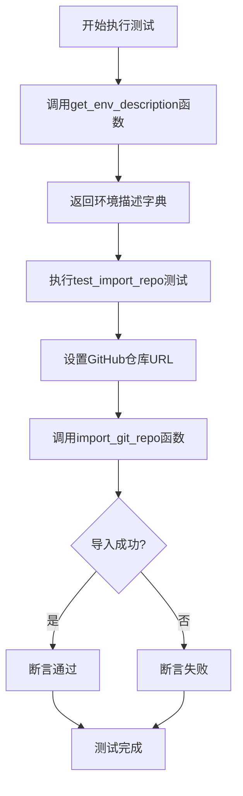
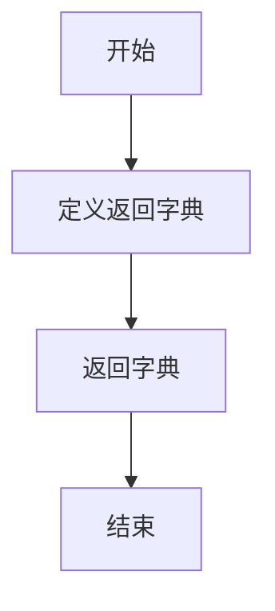
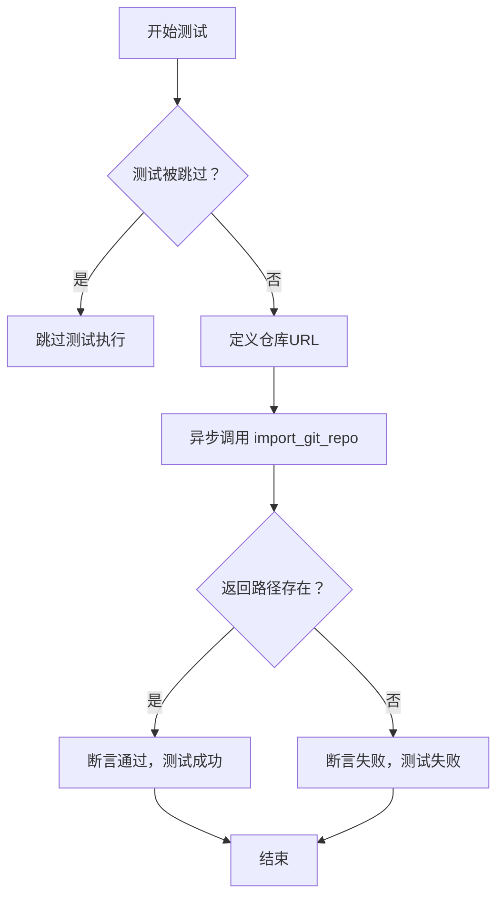

# `.\MetaGPT\tests\metagpt\tools\libs\test_software_development.py` 详细设计文档

该代码是一个测试文件，主要功能是测试从GitHub导入Git仓库的功能。它包含一个异步函数用于获取环境描述信息，以及一个使用pytest框架编写的异步测试函数，用于验证import_git_repo函数能否成功从指定的GitHub仓库URL克隆代码到本地。

## 整体流程



## 类结构

```
测试文件结构
├── 全局函数: get_env_description
└── 测试函数: test_import_repo
```

## 全局变量及字段


### `url`
    
存储要导入的Git仓库的URL地址。

类型：`str`
    


    

## 全局函数及方法

### `get_env_description`

该函数是一个异步函数，用于获取环境描述信息。它返回一个字典，其中包含一个键值对，描述了如何通过调用 `get_env` 函数来获取 GitHub 认证所需的访问令牌。

参数：
- 无参数

返回值：`Dict[str, str]`，返回一个字典，键为字符串，值为字符串。该字典描述了获取环境变量的方法及其用途。

#### 流程图



#### 带注释源码

```python
async def get_env_description() -> Dict[str, str]:
    # 返回一个字典，描述如何获取 GitHub 认证的访问令牌
    return {'await get_env(key="access_token", app_name="github")': "get the access token for github authentication."}
```


### `test_import_repo`

这是一个使用 `pytest` 框架编写的异步测试函数，用于测试 `import_git_repo` 函数的功能。该测试会尝试克隆一个指定的 Git 仓库，并验证克隆操作是否成功（即返回的路径不为空）。由于使用了 `@pytest.mark.skip` 装饰器，该测试默认会被跳过，不参与常规测试执行。

参数：
-  `url`：`str`，要克隆的 Git 仓库的 URL 地址。

返回值：`None`，测试函数通常不显式返回值，其成功与否由 `assert` 语句决定。

#### 流程图



#### 带注释源码

```python
# 使用 pytest.mark.skip 装饰器标记此测试，执行测试时会跳过它
@pytest.mark.skip
# 使用 pytest.mark.asyncio 装饰器标记此测试为异步测试
@pytest.mark.asyncio
# 定义异步测试函数 test_import_repo
async def test_import_repo():
    # 定义要测试的 Git 仓库 URL
    url = "https://github.com/spec-first/connexion.git"
    # 异步调用 import_git_repo 函数，传入 URL，等待其返回克隆到本地的路径
    path = await import_git_repo(url)
    # 使用 assert 语句验证返回的路径 path 是否为真（非空、非None等），
    # 如果为假，则测试失败
    assert path
```


## 关键组件


### 测试框架与异步测试支持

使用pytest框架进行异步单元测试，支持异步函数测试和条件跳过。

### 环境变量管理

通过`get_env_description`函数定义测试环境所需的认证信息（如GitHub访问令牌）的描述，用于模拟或配置测试环境。

### Git仓库导入功能

通过`import_git_repo`函数实现从指定URL克隆Git仓库到本地，并返回本地路径，用于软件开发的初始代码获取。

### 测试用例组织与执行

通过`pytest.main`在脚本直接运行时执行测试，提供了测试的入口点和执行方式。


## 问题及建议


### 已知问题

-   **测试被跳过**: 测试函数 `test_import_repo` 使用了 `@pytest.mark.skip` 装饰器，这意味着该测试在默认情况下不会执行。这可能导致代码库中隐藏的回归问题未被发现，特别是当 `import_git_repo` 函数或其依赖项发生变更时。
-   **硬编码的测试数据**: 测试中使用的 Git 仓库 URL (`"https://github.com/spec-first/connexion.git"`) 是硬编码的。如果该仓库被删除、设为私有或更改结构，测试将失败，但这种失败与 `import_git_repo` 函数的核心逻辑无关，降低了测试的稳定性和可靠性。
-   **缺乏断言细节**: 测试仅断言 `path` 变量为真（`assert path`）。这虽然验证了函数没有返回 `None` 或空值，但并未验证返回的路径是否有效、是否包含预期的文件结构，或者克隆操作是否完全成功，测试覆盖不够充分。
-   **未使用的辅助函数**: `get_env_description` 函数在当前的测试模块中被定义但未被 `test_import_repo` 或其他测试调用。它可能是一个残留的、计划用于未来测试的代码，目前造成了“死代码”，增加了维护的认知负担。
-   **潜在的异步执行问题**: 测试标记为 `@pytest.mark.asyncio` 并使用了 `pytest.main` 执行。虽然这通常是正确的，但需要确保测试运行环境（如 CI/CD 管道）已正确配置为支持异步测试，否则可能导致测试执行失败。

### 优化建议

-   **启用并完善测试**: 移除 `@pytest.mark.skip` 装饰器，让测试在持续集成流程中运行。同时，增强测试断言，例如检查返回的路径是否为一个存在的目录，或者是否包含预期的 `.git` 文件夹。
-   **参数化测试数据**: 使用 `@pytest.mark.parametrize` 为测试函数提供多个测试用例，包括不同的公开仓库 URL。可以考虑使用一个更稳定、长期存在的官方示例仓库（如 `https://github.com/githubtraining/hellogitworld.git`）作为主要测试数据，并添加一个参数来测试错误处理（如无效URL）。
-   **明确测试清理**: 如果 `import_git_repo` 函数会在本地创建临时目录，建议在测试中添加清理逻辑（例如使用 `pytest` 的 `tmp_path` fixture），确保测试不会在文件系统中残留数据，避免影响后续测试或系统状态。
-   **移除或利用死代码**: 如果 `get_env_description` 函数在当前模块中确实无用，应将其删除以保持代码简洁。如果它旨在描述测试环境或用于生成文档，应考虑将其移至更合适的位置（如 `conftest.py` 或文档字符串中），或在测试中显式调用它以验证其功能。
-   **提升测试隔离性**: 确保测试不依赖于外部网络状态（尽管克隆操作本身需要网络）。可以通过模拟（mocking）网络请求或使用一个本地的小型 Git 服务器来减少对外部服务的依赖，使测试更快速、稳定。
-   **添加错误处理测试**: 创建额外的测试用例来验证 `import_git_repo` 函数在面对无效 URL、无权限仓库或网络超时等情况时的行为是否符合预期（例如是否抛出恰当的异常）。


## 其它


### 设计目标与约束

本代码是一个测试模块，其核心设计目标是验证 `import_git_repo` 函数的功能正确性。主要约束包括：
1.  **测试隔离性**：测试用例 `test_import_repo` 被标记为跳过 (`@pytest.mark.skip`)，表明它可能是一个集成测试或需要特定环境（如网络、认证），不应在常规单元测试套件中运行，以避免对外部系统的依赖和不可预测的测试结果。
2.  **异步支持**：代码使用 `asyncio` 和 `async/await` 语法，要求测试运行环境支持异步操作，并确保被测试的 `import_git_repo` 函数是异步的。
3.  **环境配置**：`get_env_description` 函数暗示了测试或被测功能可能依赖于外部环境变量（如 GitHub 访问令牌），这构成了一个环境配置约束。

### 错误处理与异常设计

1.  **测试断言**：`test_import_repo` 函数使用 `assert path` 作为主要验证手段。这仅能检查 `import_git_repo` 是否返回了一个非 `None` 或非假值，但无法验证返回路径的有效性、内容的正确性或克隆过程的完整性。错误处理较为基础。
2.  **异常传播**：测试框架 `pytest` 会捕获并报告测试函数中未处理的异常（例如，`import_git_repo` 可能抛出的网络错误、认证错误、Git 命令执行错误等），测试本身没有显式的 `try-except` 块来处理特定异常。
3.  **环境依赖错误**：`get_env_description` 函数返回的描述信息暗示了环境变量缺失可能导致功能失败，但测试代码本身没有包含获取或验证这些环境变量的逻辑。

### 数据流与状态机

1.  **主要数据流**：
    *   **输入**：硬编码的 Git 仓库 URL (`"https://github.com/spec-first/connexion.git"`)。
    *   **处理**：调用 `import_git_repo(url)`，该函数预期执行 Git 克隆操作。
    *   **输出**：函数返回一个表示本地克隆目录路径的字符串 (`path`)。
    *   **验证**：断言 `path` 为真。
2.  **状态变化**：测试执行会导致外部状态变化——在运行测试的机器上创建或更新一个本地目录（克隆的仓库）。这是一个有副作用的操作。
3.  **无复杂状态机**：代码逻辑简单，不涉及多状态转换。

### 外部依赖与接口契约

1.  **外部依赖**：
    *   **`pytest` 框架**：用于测试发现、执行和报告。
    *   **`metagpt.tools.libs.software_development.import_git_repo` 函数**：这是被测试的核心依赖，其接口契约是：接受一个字符串类型的 Git 仓库 URL，异步返回一个字符串类型的本地文件系统路径。
    *   **Git 命令行工具或库**：`import_git_repo` 函数的实现必然依赖 Git 来执行克隆操作。
    *   **网络连接**：访问远程 Git 仓库（GitHub）需要网络。
    *   **可能的认证服务**：根据 `get_env_description`，访问私有仓库可能需要 GitHub 访问令牌。
2.  **接口契约**：
    *   `get_env_description() -> Dict[str, str]`：返回一个字典，描述函数运行所需的环境变量。键是获取环境变量的调用描述，值是对其用途的描述。此函数当前未被 `test_import_repo` 调用，可能用于文档或其它工具。
    *   `test_import_repo()`：是一个异步测试函数，无参数，无返回值（通过或抛出异常）。
    *   `if __name__ == "__main__":` 块：允许脚本直接运行，调用 `pytest.main` 执行本模块中的测试。

### 安全与合规考虑

1.  **敏感信息**：`get_env_description` 函数提到了 `access_token`，这属于敏感信息。测试代码本身没有硬编码令牌，但提示了功能需要它。最佳实践是通过安全的方式（如环境变量、密钥管理服务）传递，而非写在代码中。
2.  **仓库来源**：测试克隆的是一个公开仓库 (`spec-first/connexion`)，避免了无意中泄露私有代码的风险。
3.  **系统影响**：克隆操作会占用磁盘空间。如果测试频繁运行或克隆大型仓库，需考虑磁盘清理策略，以避免填满磁盘。

### 部署与运维

1.  **执行方式**：可通过命令行直接运行脚本 (`python test_file.py`)，或通过 `pytest` 命令运行。
2.  **环境准备**：运行未被跳过的测试前，需要确保：
    *   Python 环境安装有 `pytest`、`pytest-asyncio`（用于异步测试）和 `metagpt` 包。
    *   系统已安装 Git 并可正常执行 `git clone` 命令。
    *   网络可访问 `github.com`。
    *   （如需测试私有仓库功能）正确配置了 GitHub 访问令牌。
3.  **测试分类**：由于使用了 `@pytest.mark.skip`，该测试不会在默认的 `pytest` 执行中运行。可能需要特定的命令或配置来运行此类“集成”或“需要外部资源”的测试。

    