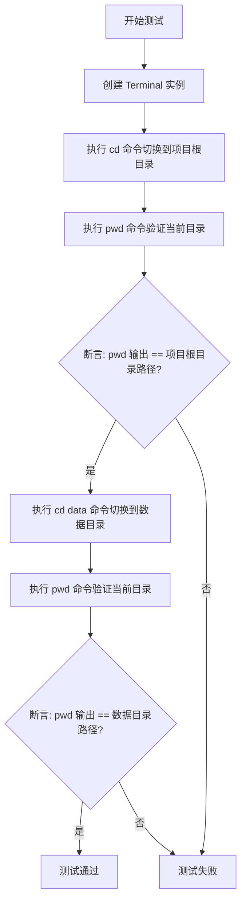
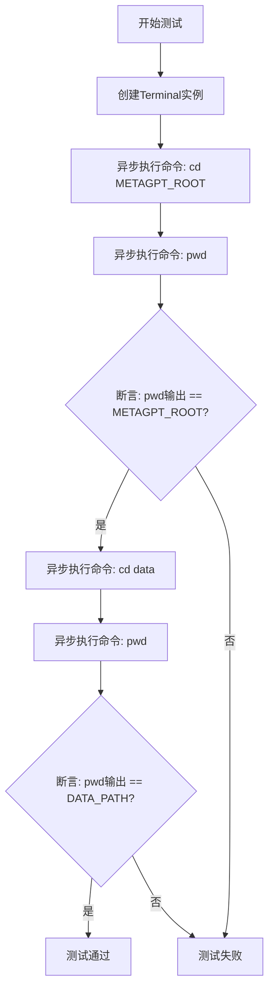
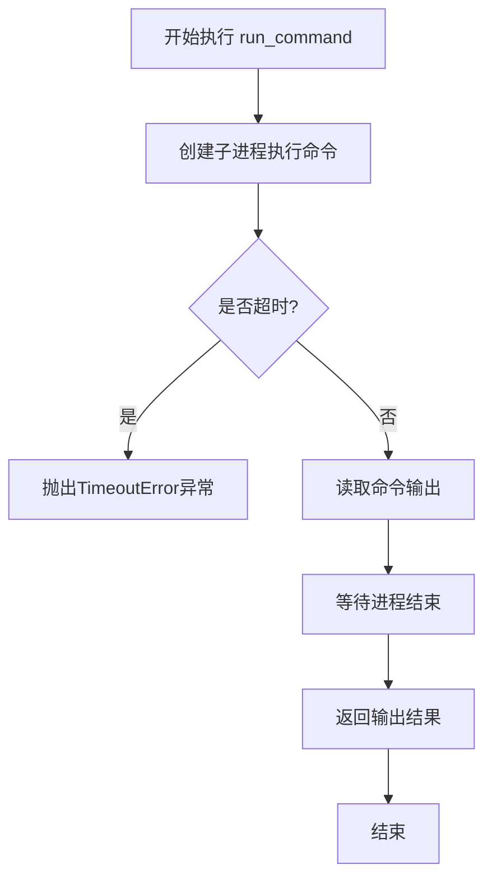

# `.\MetaGPT\tests\metagpt\tools\libs\test_terminal.py` 详细设计文档

该代码是一个使用 pytest 框架编写的异步单元测试，用于测试 Terminal 类的功能。核心功能是验证 Terminal 类能够正确执行基本的 shell 命令（如 cd 和 pwd），并确保工作目录的切换和路径验证符合预期。

## 整体流程



## 类结构

```
测试文件 (test_terminal.py)
├── 全局导入 (pytest, const, Terminal)
├── 测试函数 (test_terminal)
└── 主入口 (__main__)
```

## 全局变量及字段


### `DATA_PATH`
    
项目数据目录的路径常量，通常指向项目根目录下的 'data' 文件夹。

类型：`Path`
    


### `METAGPT_ROOT`
    
MetaGPT 项目根目录的路径常量，用于定位项目的主目录。

类型：`Path`
    


    

## 全局函数及方法


### `test_terminal`

这是一个使用 `pytest` 框架编写的异步单元测试函数，用于测试 `Terminal` 类的 `run_command` 方法。它验证了在终端中执行 `cd` 和 `pwd` 命令后，当前工作目录是否正确变更。

参数：
- 无显式参数。`pytest` 框架会自动发现并运行此函数。

返回值：`None`，测试函数通常不显式返回值，其成功与否由 `assert` 语句决定。

#### 流程图



#### 带注释源码

```python
# 导入pytest测试框架
import pytest

# 从项目常量中导入DATA_PATH和METAGPT_ROOT路径
from metagpt.const import DATA_PATH, METAGPT_ROOT
# 导入要测试的Terminal类
from metagpt.tools.libs.terminal import Terminal

# 使用pytest装饰器标记此函数为异步测试函数
@pytest.mark.asyncio
async def test_terminal():
    # 步骤1: 实例化Terminal对象
    terminal = Terminal()

    # 步骤2: 测试切换到项目根目录
    # 异步执行命令：改变当前工作目录到METAGPT_ROOT
    await terminal.run_command(f"cd {METAGPT_ROOT}")
    # 异步执行命令：获取当前工作目录
    output = await terminal.run_command("pwd")
    # 断言：获取的目录应与METAGPT_ROOT常量一致
    assert output.strip() == str(METAGPT_ROOT)

    # 步骤3: 测试从项目根目录切换到data子目录
    # 注意：此时终端的工作目录已经是METAGPT_ROOT
    # 异步执行命令：改变当前工作目录到“data”子目录
    await terminal.run_command("cd data")
    # 异步执行命令：再次获取当前工作目录
    output = await terminal.run_command("pwd")
    # 断言：获取的目录应与DATA_PATH常量一致
    assert output.strip() == str(DATA_PATH)

# 允许直接运行此脚本进行测试
if __name__ == "__main__":
    # 使用pytest运行当前文件，-s参数允许输出打印信息
    pytest.main([__file__, "-s"])
```


### `Terminal.run_command`

该方法用于在终端中异步执行指定的命令，并返回命令的标准输出结果。它通过创建一个子进程来执行命令，并处理命令执行过程中的输入/输出流，确保命令能够正确执行并捕获其输出。

参数：

-  `command`：`str`，要执行的终端命令字符串
-  `timeout`：`int`，命令执行的超时时间（秒），默认为30秒

返回值：`str`，命令执行后的标准输出内容

#### 流程图



#### 带注释源码

```python
async def run_command(self, command: str, timeout: int = 30) -> str:
    """
    异步执行终端命令并返回输出
    
    Args:
        command: 要执行的命令字符串
        timeout: 命令执行超时时间（秒）
    
    Returns:
        命令的标准输出内容
        
    Raises:
        TimeoutError: 命令执行超时
        subprocess.CalledProcessError: 命令执行失败
    """
    # 创建子进程执行命令，捕获标准输出和标准错误
    process = await asyncio.create_subprocess_shell(
        command,
        stdout=asyncio.subprocess.PIPE,
        stderr=asyncio.subprocess.PIPE,
        shell=True
    )
    
    try:
        # 等待命令执行完成，设置超时限制
        stdout, stderr = await asyncio.wait_for(
            process.communicate(),
            timeout=timeout
        )
    except asyncio.TimeoutError:
        # 如果超时，终止进程并抛出异常
        process.kill()
        await process.wait()
        raise TimeoutError(f"Command '{command}' timed out after {timeout} seconds")
    
    # 检查命令执行是否成功
    if process.returncode != 0:
        # 如果命令执行失败，抛出包含错误信息的异常
        error_msg = stderr.decode().strip() if stderr else "Unknown error"
        raise subprocess.CalledProcessError(
            process.returncode,
            command,
            output=stdout,
            stderr=stderr
        )
    
    # 返回命令的标准输出，解码为字符串
    return stdout.decode().strip()
```


## 关键组件


### Terminal 类

一个用于执行终端命令的异步工具类，封装了子进程操作，允许在代码中运行系统命令并获取输出。

### 异步命令执行

通过 `run_command` 方法异步执行系统命令，并返回命令的标准输出结果，支持在异步上下文中进行文件系统操作和命令交互。

### 路径常量管理

利用 `METAGPT_ROOT` 和 `DATA_PATH` 常量来管理项目根目录和数据目录的路径，确保测试中目录切换的准确性。

### 测试框架集成

使用 `pytest` 框架及其 `asyncio` 标记来编写和运行异步单元测试，验证 `Terminal` 类的功能是否符合预期。


## 问题及建议


### 已知问题

-   **测试用例对环境的强依赖**：测试用例依赖于特定的环境变量 `METAGPT_ROOT` 和 `DATA_PATH`。如果这些路径不存在、权限不足或在不同操作系统上表现不一致（例如路径分隔符），测试可能会失败，降低了测试的健壮性和可移植性。
-   **缺乏对异步命令执行失败的测试**：当前测试只验证了命令成功执行的情况，没有覆盖 `terminal.run_command` 方法在命令执行失败（例如，命令不存在、权限错误）时的行为，测试覆盖不全面。
-   **潜在的竞态条件**：测试中连续执行了多个 `await terminal.run_command` 调用。虽然 `asyncio` 在单个事件循环中是顺序的，但如果 `Terminal` 类的实现内部涉及共享状态或资源（例如，一个全局的、可重用的 shell 进程），在并发测试场景下可能存在竞态条件风险。
-   **测试逻辑与实现细节耦合**：测试通过 `cd` 和 `pwd` 命令来验证工作目录的切换，这间接测试了 `Terminal` 类的状态保持能力。如果 `Terminal` 未来的实现方式改变（例如，不再保持一个持久化的 shell 会话），此测试可能会失效，表明测试与实现细节耦合较高。

### 优化建议

-   **使用临时目录或模拟文件系统**：建议在测试中使用 `tempfile.TemporaryDirectory` 创建临时目录作为测试的上下文，或者使用如 `pytest-mock` 的 `mocker` 来模拟 `os` 相关操作。这样可以消除对固定环境路径的依赖，使测试更加自包含和可靠。
-   **补充异常和错误路径的测试用例**：应增加测试用例来验证 `terminal.run_command` 在接收到无效命令、无权限命令或超时等情况时，是否按预期抛出异常或返回错误信息。例如，使用 `pytest.raises` 来断言异常。
-   **明确 Terminal 实例的生命周期和隔离性**：在测试的 `setup` 和 `teardown` 阶段（例如使用 `pytest.fixture`）明确创建和清理 `Terminal` 实例。这可以确保每个测试都是独立的，避免测试间因共享实例状态而产生意外干扰，也有助于澄清 `Terminal` 类的设计意图（是否应为有状态）。
-   **提升测试的抽象层次**：考虑测试 `Terminal` 类更核心的契约，而不仅仅是 `cd/pwd` 的组合。例如，可以测试“执行一个命令并返回输出”这一基本功能，以及“连续执行多个命令时，环境是否按预期隔离或继承”。这可以使测试对内部实现的变化更具弹性。
-   **添加对跨平台兼容性的考虑**：如果 `Terminal` 类旨在跨平台工作，测试中应考虑不同操作系统（Windows, Linux, macOS）下命令的差异。可以使用条件判断或抽象出一个“命令适配层”来进行测试，确保核心逻辑在不同平台下行为一致。


## 其它


### 设计目标与约束

本代码是一个针对 `Terminal` 类的异步单元测试。其设计目标是验证 `Terminal` 类的 `run_command` 方法能够正确执行基本的 shell 命令（如 `cd` 和 `pwd`），并确保命令执行后的工作目录状态符合预期。主要约束包括：1) 测试环境必须支持异步操作；2) 测试依赖于 `METAGPT_ROOT` 和 `DATA_PATH` 这两个预定义的、有效的文件系统路径常量；3) 测试假设 `Terminal` 类能够正确模拟或封装一个终端会话，并保持命令间的状态（如工作目录）。

### 错误处理与异常设计

当前测试代码本身不包含显式的错误处理逻辑。它依赖于 `pytest` 框架来捕获测试过程中的断言失败（`AssertionError`）或执行命令时可能抛出的异常。如果 `Terminal.run_command` 方法内部发生异常（例如，执行了无效命令或遇到权限问题），该异常将向上传播，导致测试用例失败。这是一种“快速失败”的策略，符合单元测试的预期。然而，测试用例并未设计针对特定异常场景（如路径不存在）的验证。

### 数据流与状态机

数据流相对简单：
1.  **输入**：测试用例向 `Terminal` 实例发送两条命令序列：`cd {METAGPT_ROOT}` -> `pwd`，然后 `cd data` -> `pwd`。
2.  **处理**：`Terminal` 实例接收命令，在某个执行环境中（可能是子进程、模拟环境）运行它们，并捕获标准输出。
3.  **输出**：`Terminal` 实例将命令的标准输出作为字符串返回给测试用例。
4.  **状态**：`Terminal` 实例内部维护着一个关键状态——**当前工作目录**。`cd` 命令会改变这个状态，而 `pwd` 命令的输出则反映了这个状态。测试用例通过断言验证状态变化是否符合预期，从而验证了 `Terminal` 类状态机（工作目录）的正确性。

### 外部依赖与接口契约

1.  **`pytest` 框架**：用于组织和运行测试，提供 `@pytest.mark.asyncio` 装饰器以支持异步测试函数。
2.  **`metagpt.const` 模块**：提供 `DATA_PATH` 和 `METAGPT_ROOT` 两个路径常量。测试的成功执行强烈依赖于这两个常量指向真实、可访问的目录。这是测试环境的一个关键外部配置。
3.  **`metagpt.tools.libs.terminal.Terminal` 类**：这是被测试的主体。测试与它的接口契约是：其实例的 `run_command` 方法接受一个字符串参数（命令），异步执行后返回一个字符串（命令输出），并且连续的命令调用会共享同一个终端会话状态（特别是工作目录）。
4.  **异步运行时环境**：测试函数被标记为 `async`，并使用了 `await`，因此需要一个兼容的异步事件循环（由 `pytest-asyncio` 插件提供）。

### 测试策略与覆盖范围

本测试采用**集成测试**策略，因为它测试的是 `Terminal` 类与底层命令执行环境（如操作系统Shell）的集成效果，而不仅仅是类的内部逻辑。覆盖的功能点包括：
1.  `Terminal.run_command` 方法的基本调用与返回。
2.  命令序列的执行及状态（工作目录）的保持。
3.  对 `cd` 和 `pwd` 这两个特定命令的交互验证。
覆盖范围有限，未测试错误输入、复杂命令、超时处理、并发执行、标准错误流处理、以及 `Terminal` 类的其他潜在方法或属性。

    