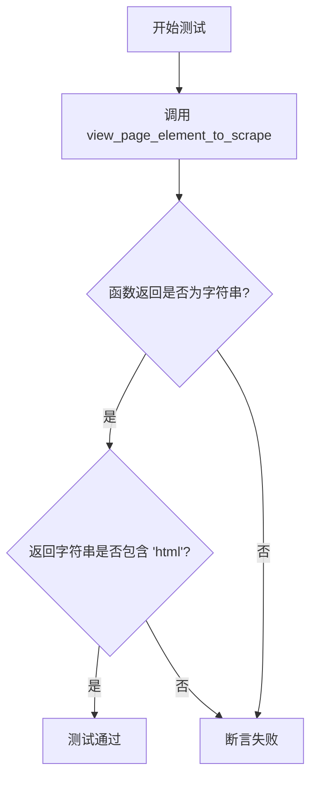
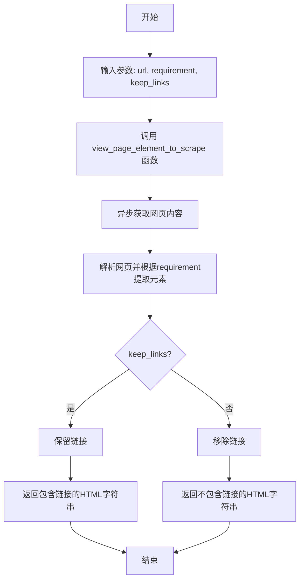

# `.\MetaGPT\tests\metagpt\tools\libs\test_web_scraping.py` 详细设计文档

该文件是一个使用 pytest 框架编写的异步单元测试，用于测试 `view_page_element_to_scrape` 函数。该函数的核心功能是根据给定的 URL 和需求描述，从网页中抓取并返回指定的 HTML 元素内容。测试用例验证了函数返回一个包含 'html' 的字符串。

## 整体流程



## 类结构

```
无显式类定义
├── 全局函数: test_view_page_element_to_scrape (异步测试函数)
```

## 全局变量及字段


### `test_url`
    
测试目标网页的URL地址。

类型：`str`
    


### `test_requirement`
    
描述需要从网页中抓取什么内容的文本要求。

类型：`str`
    


### `test_keep_links`
    
一个布尔标志，指示在抓取过程中是否保留HTML链接。

类型：`bool`
    


### `test_page`
    
存储`view_page_element_to_scrape`函数返回的抓取结果的变量。

类型：`str`
    


    

## 全局函数及方法

### `view_page_element_to_scrape`

该函数是一个用于网页抓取的工具函数，它根据给定的URL和抓取需求，从网页中提取指定的HTML元素内容，并可以选择是否保留链接。函数通过异步方式执行，返回一个包含目标元素HTML内容的字符串。

参数：

- `url`：`str`，要抓取的网页URL地址。
- `requirement`：`str`，描述需要抓取的网页元素或内容的需求文本。
- `keep_links`：`bool`，指示是否在提取的内容中保留超链接。默认为`True`。

返回值：`str`，返回一个字符串，其中包含根据需求提取的网页元素的HTML内容。

#### 流程图



#### 带注释源码

```python
async def view_page_element_to_scrape(url: str, requirement: str, keep_links: bool = True) -> str:
    """
    根据给定的URL和抓取需求，异步抓取并返回指定网页元素的HTML内容。

    参数:
        url (str): 要抓取的网页URL。
        requirement (str): 描述需要抓取内容的文本需求。
        keep_links (bool): 是否在结果中保留超链接。默认为True。

    返回:
        str: 包含目标元素HTML内容的字符串。
    """
    # 函数实现细节（此处为示意，实际代码可能包含网络请求和HTML解析逻辑）
    # 1. 异步获取url对应的网页内容
    # 2. 解析HTML，根据requirement定位目标元素
    # 3. 根据keep_links参数决定是否过滤掉链接
    # 4. 返回处理后的HTML字符串
    pass
```

## 关键组件


### `view_page_element_to_scrape` 函数

这是一个用于网页抓取的核心工具函数，它根据给定的URL、内容提取需求以及是否保留链接的配置，异步地获取并处理网页内容，最终返回一个包含指定元素的HTML字符串。

### `pytest` 测试框架

用于自动化测试的框架，在本代码中用于定义和执行对 `view_page_element_to_scrape` 函数的异步单元测试，验证其返回类型和内容是否符合预期。

### `asyncio` 异步支持

Python的异步I/O框架，用于支持 `view_page_element_to_scrape` 函数的异步执行，使其能够在等待网络请求（网页抓取）时高效地处理其他任务，提升性能。


## 问题及建议


### 已知问题

-   **测试用例过于简单且脆弱**：当前测试仅验证了函数返回一个字符串且字符串中包含“html”字样。这无法充分验证函数的核心功能（即根据特定需求抓取页面元素）。如果函数返回一个包含“html”但内容完全错误或不符合`test_requirement`的字符串，测试也会通过，导致测试覆盖率不足。
-   **缺乏对异步函数异常的测试**：测试用例没有包含对`view_page_element_to_scrape`函数可能抛出的各种异常（如网络错误、URL无效、解析错误等）的测试场景。这降低了代码的健壮性验证。
-   **测试数据硬编码且不可配置**：测试URL、需求描述和参数直接硬编码在测试函数中。这使得测试难以适应不同的环境（如测试、预发布、生产）或进行参数化测试以覆盖更多边界情况。
-   **断言条件过于宽泛**：断言`"html" in test_page`过于宽松。函数可能返回错误信息、非HTML内容但恰好包含“html”子串，或者返回的HTML结构不符合预期，此断言都无法有效捕获这些问题。
-   **缺少对`keep_links`参数功能的验证**：测试虽然传入了`test_keep_links=True`，但后续的断言并没有检查返回的字符串中是否确实保留了链接（例如包含`<a>`标签）。该参数的功能是否生效未被验证。

### 优化建议

-   **增强测试断言，验证核心功能**：在断言中，除了检查返回类型和基本内容外，应增加对`test_requirement`（“Retrieve all paragraph texts”）的验证。例如，可以解析返回的HTML/文本，检查是否包含预期的段落（`<p>`标签）内容，或者检查返回的文本结构是否符合“段落文本”的特征。
-   **补充异常处理测试用例**：使用`pytest.raises`或`pytest.mark.parametrize`为可能出现的异常（如`TimeoutError`, `ConnectionError`, `ValueError`等）添加测试用例，确保函数在异常情况下行为符合预期（例如抛出特定类型的异常）。
-   **使用测试配置或参数化**：将测试数据（URL、需求、参数）提取到配置文件、环境变量或使用`@pytest.mark.parametrize`装饰器进行参数化。这样可以轻松扩展测试场景，覆盖更多用例（如不同的URL、不同的`requirement`、`keep_links`的True/False情况）。
-   **细化断言条件**：将`"html" in test_page`替换为更精确的检查。例如，可以使用`BeautifulSoup`等库解析返回的字符串，验证其是否为有效的HTML文档，或者检查是否包含特定的、预期的DOM元素。
-   **验证`keep_links`参数效果**：添加明确的断言来验证`keep_links`参数。当`keep_links=True`时，检查返回内容中是否包含链接元素（如`href`属性）；当`keep_links=False`时，检查链接是否已被移除或处理。
-   **考虑添加集成测试标记**：由于此测试涉及网络请求（访问外部URL `https://docs.deepwisdom.ai`），它本质上是一个集成测试或网络依赖测试。建议使用`@pytest.mark.integration`或`@pytest.mark.network`等自定义标记将其归类，以便在不需要或无法访问网络的环境中（如CI/CD的某些阶段）可以跳过这些测试。
-   **引入Mock以避免外部依赖**：为了创建更稳定、快速的单元测试，可以考虑使用`unittest.mock`或`pytest-mock`来模拟`view_page_element_to_scrape`函数内部的网络请求和页面获取逻辑，从而在不实际访问外部网站的情况下测试函数的处理逻辑。


## 其它


### 设计目标与约束

本代码是一个针对 `metagpt.tools.libs.web_scraping` 模块中 `view_page_element_to_scrape` 函数的异步单元测试。其主要设计目标是：
1.  **功能验证**：验证 `view_page_element_to_scrape` 函数能够根据给定的URL、抓取需求（requirement）和链接保留标志（keep_links）成功执行网页抓取，并返回预期的字符串格式结果。
2.  **接口契约测试**：确保函数返回类型为字符串，且返回内容包含预期的“html”关键字，这隐式地验证了函数的基本输出格式和内容特征。
3.  **异步支持**：测试用例本身被设计为异步函数，并使用 `pytest.mark.asyncio` 装饰器，以正确测试被测试函数的异步行为。
4.  **隔离性与可重复性**：测试使用固定的输入参数（测试URL、需求描述），旨在每次运行时产生一致的行为，便于在持续集成环境中验证功能的稳定性。

主要约束包括：
*   **外部依赖**：测试的成功执行完全依赖于外部网站（`https://docs.deepwisdom.ai`）的可访问性、网络稳定性以及其页面结构在测试时刻的保持不变。这是一个脆弱的测试点。
*   **测试范围有限**：当前测试仅验证了返回类型和内容中是否包含“html”字符串，对于函数内部复杂的HTML解析逻辑、错误处理、边界条件（如无效URL、无法满足的需求等）均未覆盖。

### 错误处理与异常设计

当前测试代码本身不包含显式的错误处理逻辑。其错误处理完全依赖于 `pytest` 框架和 `view_page_element_to_scrape` 函数的实现：
1.  **测试失败断言**：如果 `assert isinstance(test_page, str)` 或 `assert "html" in test_page` 失败，`pytest` 将标记测试用例为失败，并输出相应的断言错误信息。这是测试逻辑的主要“错误”反馈机制。
2.  **被测试函数的异常**：如果 `view_page_element_to_scrape` 函数在执行过程中抛出任何异常（例如网络错误、解析错误、无效参数错误等），该异常将直接向上传播，导致异步测试协程失败，`pytest` 会捕获并报告此异常。
3.  **缺乏预期的异常测试**：测试用例目前只测试了“快乐路径”（即正常执行路径）。一个健壮的测试套件还应包含针对预期异常情况的测试（例如，使用 `pytest.raises` 来验证传入无效URL时是否会抛出特定的异常），但本代码中未体现。

### 数据流与状态机

本测试用例的数据流相对简单直接，不涉及复杂的状态转换：
1.  **输入数据**：测试用例定义了三个输入常量：`test_url`（目标网页地址）、`test_requirement`（抓取需求描述）、`test_keep_links`（是否保留链接的标志）。这些数据作为参数流入被测试函数。
2.  **处理过程**：数据流的核心是调用 `await view_page_element_to_scrape(test_url, test_requirement, test_keep_links)`。此调用将输入数据传递给被测试函数，并等待其异步执行完成。函数内部可能涉及网络请求、HTML下载、根据`requirement`进行元素解析和过滤、根据`keep_links`决定输出格式等复杂过程，但这些对于本测试用例来说是黑盒。
3.  **输出验证**：函数执行后返回的结果 `test_page` 成为数据流的输出。测试逻辑随后对 `test_page` 进行两项验证：类型是否为 `str`，以及内容是否包含子串 `"html"`。验证结果（通过或失败）即为测试的最终输出。

由于是单元测试，不涉及跨越多个函数或组件的状态机。测试本身是无状态的，每次运行都从头开始。

### 外部依赖与接口契约

1.  **外部依赖**：
    *   **`pytest` 框架**：用于组织和运行测试用例，提供断言、测试标记（如 `@pytest.mark.asyncio`）、测试发现和报告功能。
    *   **`metagpt.tools.libs.web_scraping.view_page_element_to_scrape` 函数**：这是被测试的核心对象，是测试用例存在的前提。测试的成功依赖于该函数接口的稳定性和实现的正确性。
    *   **外部网络服务 (`https://docs.deepwisdom.ai`)**：测试用例硬编码了一个具体的URL。测试的执行依赖于该网站的可达性、响应时间以及页面内容的结构。这是最大的外部依赖，也是测试不稳定的主要来源。

2.  **接口契约**：
    *   **被测试函数接口**：基于测试调用，可以推断 `view_page_element_to_scrape` 函数的接口契约如下：
        *   **名称**: `view_page_element_to_scrape`
        *   **参数**:
            *   `url` (类型推断为 `str`): 要抓取的网页URL。
            *   `requirement` (类型推断为 `str`): 描述需要抓取页面中哪些元素的文本要求。
            *   `keep_links` (类型推断为 `bool`): 一个布尔标志，指示在输出中是否应保留HTML链接。
        *   **返回值** (根据断言推断): 返回一个 `str` 类型的对象。测试期望此字符串包含“html”字样，暗示返回值可能是HTML片段、包含HTML标签的文本或某种标记。
        *   **行为**: 函数是异步的 (`async`)，需要在一个异步上下文中 `await`。
    *   **测试用例与框架的契约**：测试函数遵循 `pytest` 的约定：函数名以 `test_` 开头；使用 `@pytest.mark.asyncio` 装饰器以支持异步测试；使用 `assert` 语句进行验证。


    