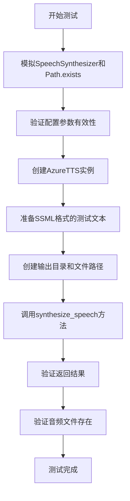
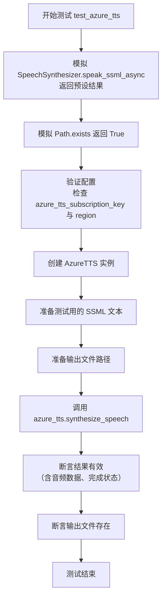
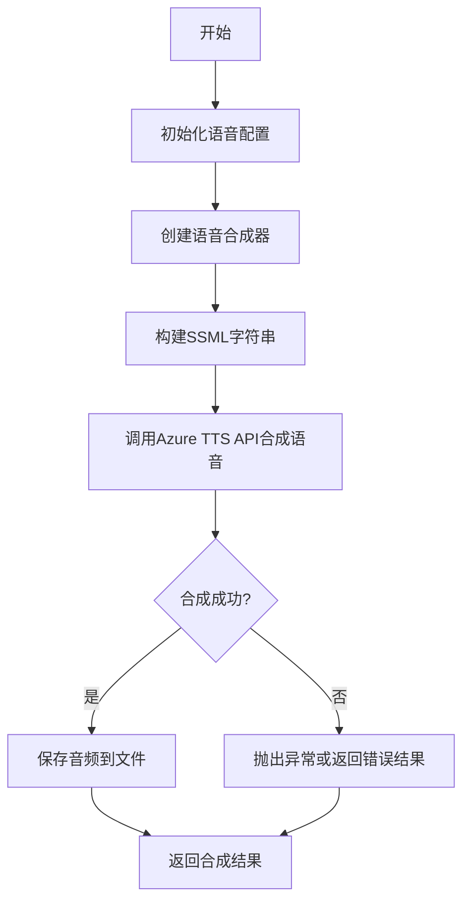

# `.\MetaGPT\tests\metagpt\tools\test_azure_tts.py` 详细设计文档

这是一个使用pytest框架编写的单元测试文件，用于测试AzureTTS类的语音合成功能。它通过模拟(mocking)Azure Cognitive Services的SpeechSynthesizer来验证文本到语音转换的正确性，包括SSML格式文本的处理、音频文件的生成以及合成结果的验证。

## 整体流程



## 类结构

```
测试文件结构
├── 全局导入
├── 测试函数: test_azure_tts
└── 主程序入口
```

## 全局变量及字段


### `config`
    
全局配置对象，包含Azure TTS服务的订阅密钥、区域和工作空间路径等配置信息

类型：`metagpt.config2.Config`
    


### `mock_result`
    
模拟的语音合成结果对象，包含音频数据和合成状态

类型：`unittest.mock.Mock`
    


### `mock_data`
    
模拟的异步操作返回对象，用于包装mock_result

类型：`unittest.mock.Mock`
    


### `azure_tts`
    
Azure TTS服务客户端实例，用于执行文本转语音操作

类型：`metagpt.tools.azure_tts.AzureTTS`
    


### `text`
    
包含SSML标记的测试文本，用于测试多角色语音合成功能

类型：`str`
    


### `path`
    
音频文件输出目录路径对象

类型：`pathlib.Path`
    


### `filename`
    
生成的音频文件路径对象

类型：`pathlib.Path`
    


### `result`
    
语音合成操作的实际结果对象，包含音频数据和状态信息

类型：`azure.cognitiveservices.speech.SpeechSynthesisResult`
    


    

## 全局函数及方法

### `test_azure_tts`

这是一个使用 `pytest` 框架编写的异步单元测试函数，用于测试 `AzureTTS` 类的 `synthesize_speech` 方法。它通过模拟（Mock）外部依赖来验证语音合成功能的核心逻辑，包括配置验证、SSML文本处理、音频文件生成以及结果断言。

参数：

-   `mocker`：`pytest-mock` 提供的 `MockerFixture` 类型对象，用于创建和管理测试中的模拟对象。

返回值：`None`，测试函数通常不显式返回值，其成功与否由断言决定。

#### 流程图



#### 带注释源码

```python
@pytest.mark.asyncio  # 标记此函数为异步测试
async def test_azure_tts(mocker):  # 定义异步测试函数，接收 mocker 参数用于模拟
    # mock
    # 创建模拟的音频结果对象
    mock_result = mocker.Mock()
    mock_result.audio_data = b"mock audio data"  # 模拟音频二进制数据
    mock_result.reason = ResultReason.SynthesizingAudioCompleted  # 模拟合成成功状态
    # 创建模拟的异步操作结果对象
    mock_data = mocker.Mock()
    mock_data.get.return_value = mock_result  # 模拟 `get()` 方法返回上述结果
    # 模拟 `SpeechSynthesizer.speak_ssml_async` 方法，使其返回预设的模拟结果
    mocker.patch.object(SpeechSynthesizer, "speak_ssml_async", return_value=mock_data)
    # 模拟 `Path.exists` 方法，使其始终返回 True，表示文件存在
    mocker.patch.object(Path, "exists", return_value=True)

    # Prerequisites
    # 断言：检查配置中的 API 密钥和区域是否已正确设置（非默认值）
    assert config.azure_tts_subscription_key and config.azure_tts_subscription_key != "YOUR_API_KEY"
    assert config.azure_tts_region

    # 使用配置中的密钥和区域创建 AzureTTS 实例
    azure_tts = AzureTTS(subscription_key=config.azure_tts_subscription_key, region=config.azure_tts_region)
    # 定义测试用的 SSML 文本，包含不同角色和风格的语音表达标签
    text = """
        女儿看见父亲走了进来，问道：
            <mstts:express-as role="YoungAdultFemale" style="calm">
                “您来的挺快的，怎么过来的？”
            </mstts:express-as>
            父亲放下手提包，说：
            <mstts:express-as role="OlderAdultMale" style="calm">
                “Writing a binary file in Python is similar to writing a regular text file, but you'll work with bytes instead of strings.”
            </mstts:express-as>
        """
    # 构建输出目录路径
    path = config.workspace.path / "tts"
    path.mkdir(exist_ok=True, parents=True)  # 创建目录（如果不存在）
    # 构建输出文件路径
    filename = path / "girl.wav"
    filename.unlink(missing_ok=True)  # 删除已存在的文件（如果存在），确保测试从干净状态开始
    # 调用被测试的异步方法：合成语音
    result = await azure_tts.synthesize_speech(
        lang="zh-CN", voice="zh-CN-XiaomoNeural", text=text, output_file=str(filename)
    )
    print(result)  # 打印结果对象（便于调试）
    # 断言：结果对象不为空
    assert result
    # 断言：结果中包含音频数据
    assert result.audio_data
    # 断言：合成原因为“完成”
    assert result.reason == ResultReason.SynthesizingAudioCompleted
    # 断言：输出文件已创建
    assert filename.exists()
```

### `AzureTTS.synthesize_speech`

该方法使用Azure认知服务的文本转语音（TTS）功能，将给定的文本合成为语音音频，并保存到指定的输出文件中。它支持通过SSML（语音合成标记语言）进行高级语音控制，如指定语音角色和风格。

参数：

- `lang`：`str`，指定语音的语言代码，例如："zh-CN"。
- `voice`：`str`，指定要使用的语音模型，例如："zh-CN-XiaomoNeural"。
- `text`：`str`，要转换为语音的文本内容，可以包含SSML标签以控制语音表达。
- `output_file`：`str`，合成音频的输出文件路径。

返回值：`SpeechSynthesisResult`，Azure TTS服务返回的合成结果对象，包含音频数据、合成状态等信息。

#### 流程图



#### 带注释源码

```python
async def synthesize_speech(self, lang: str, voice: str, text: str, output_file: str) -> SpeechSynthesisResult:
    """
    使用Azure TTS服务将文本合成为语音并保存到文件。

    Args:
        lang (str): 语言代码，如'zh-CN'。
        voice (str): 语音模型名称，如'zh-CN-XiaomoNeural'。
        text (str): 要合成的文本，可包含SSML标签。
        output_file (str): 输出音频文件的路径。

    Returns:
        SpeechSynthesisResult: Azure TTS服务返回的合成结果。
    """
    # 初始化语音配置，设置订阅密钥和区域
    speech_config = speechsdk.SpeechConfig(subscription=self.subscription_key, region=self.region)
    
    # 创建音频输出配置，指定输出文件
    audio_config = speechsdk.audio.AudioOutputConfig(filename=output_file)
    
    # 创建语音合成器实例
    synthesizer = speechsdk.SpeechSynthesizer(speech_config=speech_config, audio_config=audio_config)
    
    # 构建SSML字符串，包含语言、语音模型和文本内容
    ssml_string = f"""
    <speak version='1.0' xml:lang='{lang}'>
        <voice name='{voice}'>
            {text}
        </voice>
    </speak>
    """
    
    # 调用Azure TTS API进行语音合成
    result = await synthesizer.speak_ssml_async(ssml_string)
    
    # 检查合成结果状态
    if result.reason == speechsdk.ResultReason.SynthesizingAudioCompleted:
        # 合成成功，返回结果
        return result
    elif result.reason == speechsdk.ResultReason.Canceled:
        # 合成被取消，获取取消详情并抛出异常
        cancellation_details = result.cancellation_details
        raise Exception(f"Speech synthesis canceled: {cancellation_details.reason}")
    else:
        # 其他错误情况，抛出异常
        raise Exception(f"Speech synthesis failed with reason: {result.reason}")
```

## 关键组件


### AzureTTS 类

封装了 Azure 认知服务文本转语音功能的客户端类，用于将文本合成为语音并保存为音频文件。

### SpeechSynthesizer

Azure 认知服务 SDK 中的核心语音合成器类，负责接收 SSML 格式的文本并执行实际的语音合成操作。

### SSML (Speech Synthesis Markup Language)

用于控制语音合成输出的 XML 标记语言，允许开发者指定语音、语调、语速、角色扮演等高级语音特性。

### 异步语音合成

通过 `speak_ssml_async` 方法实现的非阻塞语音合成调用，允许主程序在等待合成结果时执行其他任务，提高了程序的响应性和资源利用率。

### 语音合成结果处理

通过 `ResultReason` 枚举和返回的合成结果对象来处理合成状态，确保能够区分合成成功、失败或取消等不同情况，并进行相应的错误处理或数据提取。


## 问题及建议


### 已知问题

-   **测试用例对真实外部服务存在依赖**：测试用例`test_azure_tts`在执行前会检查`config`中的`azure_tts_subscription_key`和`azure_tts_region`配置，这导致测试无法在未配置有效Azure密钥的环境中独立运行，违反了单元测试的隔离性原则。
-   **测试数据清理不彻底**：测试中虽然尝试删除可能已存在的输出文件（`filename.unlink(missing_ok=True)`），但如果测试因断言失败或异常而提前终止，可能会在测试目录中残留生成的`.wav`文件，长期运行可能积累大量垃圾文件。
-   **硬编码的测试路径和文件名**：测试中使用的输出路径（`config.workspace.path / "tts"`）和文件名（`"girl.wav"`）是硬编码的。这缺乏灵活性，并且在并行测试或特定环境（如CI/CD管道）中可能导致路径冲突或权限问题。
-   **Mock对象构造过于简化**：Mock对象`mock_result`仅设置了测试通过所需的最少属性（`audio_data`和`reason`）。如果被测试的`AzureTTS.synthesize_speech`方法或其依赖的Azure SDK在未来版本中访问了其他属性或方法，此Mock可能不足，导致测试失败或掩盖潜在问题。

### 优化建议

-   **完全Mock外部依赖**：重构测试，使用`mocker.patch`完全模拟`AzureTTS`的初始化及其对`SpeechSynthesizer`的调用，移除对真实`config`中API密钥的检查。测试应专注于`AzureTTS`类逻辑的正确性，而非Azure服务的连通性。
-   **使用临时目录进行文件操作**：利用`pytest`的`tmp_path` fixture来为每次测试创建一个唯一的临时目录，用于存放生成的音频文件。这可以确保测试间的隔离，并在测试结束后自动清理文件，避免残留。
-   **参数化测试数据**：考虑使用`@pytest.mark.parametrize`对不同的输入文本、语言、语音参数进行测试，以提高测试覆盖率和代码健壮性。同时，将输出文件名作为变量或从参数中派生。
-   **增强Mock对象的真实性**：构建更完整的Mock对象来模拟`SpeechSynthesizer.speak_ssml_async`的返回结果，例如模拟一个更真实的`SpeechSynthesisResult`对象。这可以使测试对代码变更更具弹性。
-   **补充异常和边界条件测试**：当前测试只覆盖了成功路径。应增加测试用例来验证当Azure服务返回错误（如`ResultReason.Canceled`）、输入文本无效、或文件写入失败时，代码的行为是否符合预期。


## 其它


### 设计目标与约束

该代码是一个针对Azure TTS（文本转语音）服务的单元测试。主要设计目标是验证`AzureTTS`类与Azure Cognitive Services Speech SDK的集成功能，特别是`speak_ssml_async`方法。它通过模拟（Mock）外部API调用来确保测试的独立性和可重复性，不依赖于真实的网络连接和Azure服务。约束包括：必须正确配置`subscription_key`和`region`；测试需要处理SSML格式的文本输入；输出为WAV格式的音频文件；测试执行后应清理生成的临时文件。

### 错误处理与异常设计

测试代码本身主要关注正向路径的验证，错误处理逻辑内嵌在被测试的`AzureTTS`类中。本测试通过断言（`assert`）来验证关键行为：1) 配置项存在且非默认值；2) `synthesize_speech`方法调用成功并返回有效结果（包含音频数据且原因为`SynthesizingAudioCompleted`）；3) 指定的输出文件被成功创建。如果这些断言失败，测试将不通过，从而指示集成或功能问题。测试框架`pytest`会捕获并报告这些失败。代码使用`filename.unlink(missing_ok=True)`来确保每次测试从一个干净的状态开始。

### 数据流与状态机

1.  **初始化流**：测试开始，检查全局配置`config`中是否包含有效的Azure TTS密钥和区域。
2.  **模拟设置流**：使用`mocker`框架模拟`SpeechSynthesizer.speak_ssml_async`方法，使其返回一个包含模拟音频数据和成功状态的`mock_result`。同时模拟`Path.exists`返回`True`，模拟文件已存在。
3.  **测试执行流**：
    *   实例化`AzureTTS`对象。
    *   准备包含SSML标签的多角色对话文本。
    *   创建输出目录和定义输出文件路径，并删除可能已存在的旧文件。
    *   调用`azure_tts.synthesize_speech`方法，传入语言、声音、文本和文件路径参数。**注意**：由于`speak_ssml_async`已被模拟，实际不会发生网络调用，而是直接返回预设的`mock_result`。
    *   接收返回的`result`对象。
4.  **验证流**：
    *   断言`result`对象不为空。
    *   断言`result.audio_data`（模拟数据）存在。
    *   断言`result.reason`等于预期的成功状态`ResultReason.SynthesizingAudioCompleted`。
    *   断言输出文件`filename`存在（此断言依赖于之前对`Path.exists`的模拟返回`True`）。

### 外部依赖与接口契约

1.  **Azure Cognitive Services Speech SDK (`azure.cognitiveservices.speech`)**：核心外部依赖。测试模拟了其`SpeechSynthesizer`类的`speak_ssml_async`方法。契约要求该方法接受SSML字符串并异步返回一个包含`audio_data`（字节流）和`reason`（合成状态）的结果对象。
2.  **`metagpt.config2.config`**：项目配置对象。依赖其提供`azure_tts_subscription_key`、`azure_tts_region`和`workspace.path`属性。契约要求这些配置项在运行测试前必须被正确设置。
3.  **`metagpt.tools.azure_tts.AzureTTS`**：被测试的类。契约要求其初始化需要`subscription_key`和`region`参数，并且其`synthesize_speech`方法能够接收语言、声音、文本和输出文件路径参数，调用SDK并返回合成结果。
4.  **`pytest` 及 `pytest-mock` (mocker)**：测试框架和模拟工具。用于组织测试用例、模拟外部依赖、执行断言。
5.  **`pathlib.Path`**：Python标准库，用于文件和路径操作。测试中用于创建目录、删除文件和检查文件存在性。

### 测试策略与范围

这是一个**单元测试**，但更准确地说是针对`AzureTTS`类与外部SDK交互的**集成单元测试**或**契约测试**。策略是**完全模拟（Mock）** 所有外部服务（Azure API）和部分文件IO操作，使测试专注于`AzureTTS.synthesize_speech`方法的逻辑流程和与模拟SDK的交互是否正确。测试范围包括：对象初始化、参数传递、对SDK方法的调用、以及对返回结果的正确处理。它**不测试**真实的网络通信、音频编码质量、Azure服务的可用性或错误响应处理（如认证失败、网络超时等），这些应由其他类型的测试（如集成测试、端到端测试）覆盖。

    