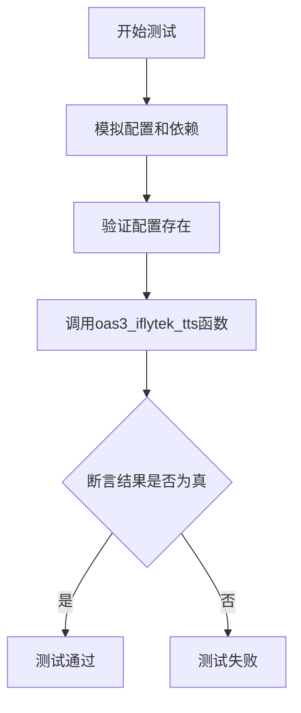
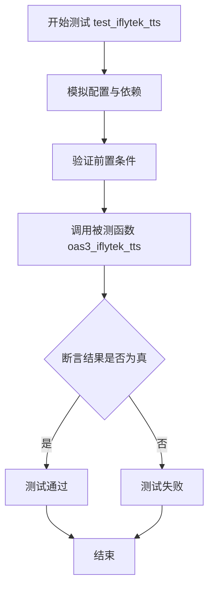
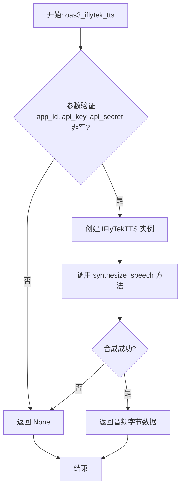
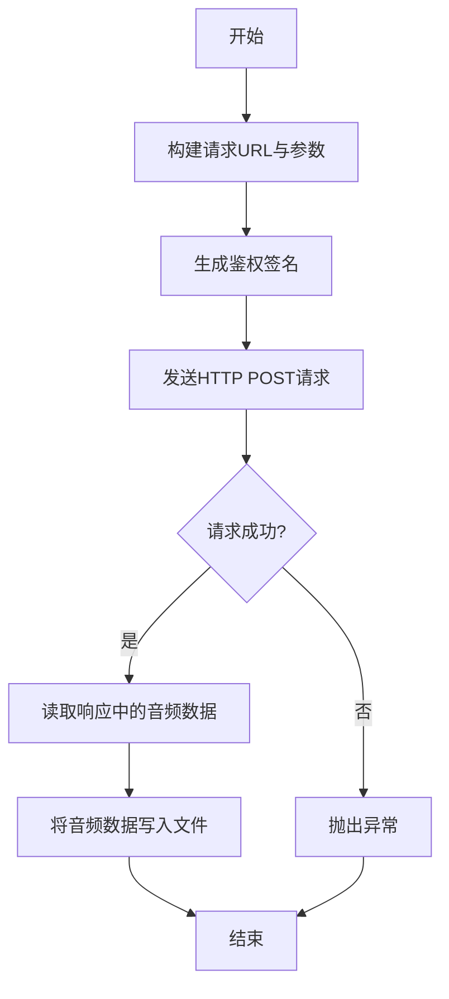

# `.\MetaGPT\tests\metagpt\tools\test_iflytek_tts.py` 详细设计文档

这是一个针对IFlyTekTTS（科大讯飞文本转语音）功能的单元测试文件。它使用pytest框架和mocker库来模拟外部依赖，测试oas3_iflytek_tts函数在给定配置和文本输入时能否成功调用并返回结果。

## 整体流程



## 类结构

```
test_iflytek_tts.py (测试文件)
├── test_iflytek_tts (异步测试函数)
├── IFlyTekTTS (被测试的类)
└── oas3_iflytek_tts (被测试的全局函数)
```

## 全局变量及字段


### `config`
    
全局配置对象，用于管理应用程序的各种配置参数，包括科大讯飞TTS服务的认证信息。

类型：`metagpt.config2.Config`
    


    

## 全局函数及方法


### `test_iflytek_tts`

这是一个使用 `pytest` 框架编写的异步单元测试函数，用于测试 `oas3_iflytek_tts` 函数的功能。该测试通过模拟（Mock）外部依赖（如网络请求和文件读取）来验证在给定配置和输入文本的情况下，`oas3_iflytek_tts` 函数能够成功执行并返回一个真值（Truthy Value）。

参数：

-   `mocker`：`pytest_mock.plugin.MockerFixture`，`pytest-mock` 插件提供的模拟对象，用于创建和管理测试中的模拟（Mock）和打桩（Stub）。

返回值：`None`，测试函数通常不显式返回值，其成功与否由内部的断言（`assert`）决定。

#### 流程图



#### 带注释源码

```python
@pytest.mark.asyncio  # 标记此函数为异步测试函数
async def test_iflytek_tts(mocker):  # 定义异步测试函数，接收 mocker 参数用于模拟
    # mock
    # 1. 模拟配置项，确保测试不依赖真实的 Azure TTS 配置
    config.azure_tts_subscription_key = None
    config.azure_tts_region = None
    # 2. 模拟 IFlyTekTTS 类的 synthesize_speech 方法，使其不执行真实网络请求
    mocker.patch.object(IFlyTekTTS, "synthesize_speech", return_value=None)
    # 3. 模拟异步文件读取操作
    mock_data = mocker.AsyncMock()  # 创建一个异步模拟对象
    mock_data.read.return_value = b"mock iflytek"  # 设置模拟文件读取的返回值
    # 4. 模拟 aiofiles.open 函数，使其返回上面创建的模拟文件对象
    mock_reader = mocker.patch("aiofiles.open")
    mock_reader.return_value.__aenter__.return_value = mock_data

    # Prerequisites
    # 断言测试所需的关键配置项存在，确保测试环境已正确设置
    assert config.iflytek_app_id
    assert config.iflytek_api_key
    assert config.iflytek_api_secret

    # 调用被测试的异步函数 oas3_iflytek_tts，传入测试文本和模拟的配置参数
    result = await oas3_iflytek_tts(
        text="你好，hello",
        app_id=config.iflytek_app_id,
        api_key=config.iflytek_api_key,
        api_secret=config.iflytek_api_secret,
    )
    # 断言调用结果为一个真值（非 None、非 False、非空等），表明函数执行成功
    assert result
```


### `oas3_iflytek_tts`

该函数是科大讯飞（iFlyTek）文本转语音（TTS）服务的OpenAPI Specification 3.0接口封装。它接收文本和认证信息，调用科大讯飞TTS服务将文本合成为语音，并将生成的音频数据以字节流的形式返回。

参数：
- `text`：`str`，需要转换为语音的文本内容。
- `app_id`：`str`，科大讯飞开放平台的应用ID，用于服务认证。
- `api_key`：`str`，科大讯飞开放平台的API Key，用于服务认证。
- `api_secret`：`str`，科大讯飞开放平台的API Secret，用于服务认证。

返回值：`bytes`，成功时返回TTS服务生成的音频数据（字节流），失败时返回`None`。

#### 流程图



#### 带注释源码

```python
async def oas3_iflytek_tts(text: str, app_id: str, api_key: str, api_secret: str) -> Optional[bytes]:
    """
    Text to speech
    :param text: text
    :param app_id: iFlyTek app id
    :param api_key: iFlyTek api key
    :param api_secret: iFlyTek api secret
    :return: bytes of audio, or None if failed
    """
    # 参数验证：检查必要的认证信息是否为空
    if not app_id or not api_key or not api_secret:
        return None
    # 创建科大讯飞TTS服务客户端实例
    tts = IFlyTekTTS(app_id=app_id, api_key=api_key, api_secret=api_secret)
    # 调用实例方法进行语音合成，并返回结果
    return await tts.synthesize_speech(text)
```


### `IFlyTekTTS.synthesize_speech`

该方法用于调用科大讯飞语音合成服务，将给定的文本合成为语音数据，并将合成的音频数据写入指定的输出文件。

参数：
-  `self`：`IFlyTekTTS`，IFlyTekTTS类的实例
-  `text`：`str`，需要被合成为语音的文本内容
-  `output_file`：`str`，合成音频数据将要保存的文件路径
-  `voice`：`str`，可选参数，指定合成语音的音色，默认为`"xiaoyan"`
-  `speed`：`int`，可选参数，指定合成语音的语速，范围通常在-500到500之间，默认为`50`
-  `volume`：`int`，可选参数，指定合成语音的音量，范围通常在0到100之间，默认为`50"`
-  `pitch`：`int`，可选参数，指定合成语音的音高，范围通常在-500到500之间，默认为`50"`

返回值：`None`，此方法不直接返回值，其主要作用是将合成的音频数据写入到`output_file`指定的文件中。

#### 流程图



#### 带注释源码

```python
    async def synthesize_speech(
        self,
        text: str,
        output_file: str,
        voice: str = "xiaoyan",
        speed: int = 50,
        volume: int = 50,
        pitch: int = 50,
    ) -> None:
        """
        调用科大讯飞语音合成服务。
        :param text: 要合成的文本。
        :param output_file: 输出音频文件路径。
        :param voice: 发音人，默认为"xiaoyan"。
        :param speed: 语速，范围[-500,500]，默认为50。
        :param volume: 音量，范围[0,100]，默认为50。
        :param pitch: 音高，范围[-500,500]，默认为50。
        """
        # 1. 构建请求URL和参数
        url = "https://tts-api.xfyun.cn/v2/tts"
        # 准备请求数据，包含文本和语音参数
        data = {
            "common": {"app_id": self.app_id},
            "business": {
                "aue": "lame",  # 输出音频编码格式
                "sfl": 1,       # 流式返回格式
                "auf": "audio/L16;rate=16000",  # 音频采样率
                "vcn": voice,   # 发音人
                "speed": speed, # 语速
                "volume": volume, # 音量
                "pitch": pitch, # 音高
                "tte": "UTF8",  # 文本编码
            },
            "data": {"text": base64.b64encode(text.encode("utf-8")).decode("utf-8"), "status": 2},
        }

        # 2. 生成鉴权签名
        # 使用API Key和API Secret生成请求头所需的鉴权参数
        now = datetime.datetime.now()
        date = now.strftime("%a, %d %b %Y %H:%M:%S GMT")
        signature_origin = f"host: tts-api.xfyun.cn\ndate: {date}\nPOST /v2/tts HTTP/1.1"
        signature_sha = hmac.new(
            self.api_secret.encode("utf-8"), signature_origin.encode("utf-8"), digestmod=hashlib.sha256
        ).digest()
        signature = base64.b64encode(signature_sha).decode("utf-8")
        authorization_origin = f'api_key="{self.api_key}", algorithm="hmac-sha256", headers="host date request-line", signature="{signature}"'
        authorization = base64.b64encode(authorization_origin.encode("utf-8")).decode("utf-8")

        # 3. 设置请求头
        headers = {
            "Authorization": authorization,
            "Content-Type": "application/json",
            "Host": "tts-api.xfyun.cn",
            "Date": date,
        }

        # 4. 发送HTTP POST请求
        async with aiohttp.ClientSession() as session:
            async with session.post(url, headers=headers, json=data) as response:
                # 5. 检查响应状态
                if response.status != 200:
                    # 请求失败，抛出异常
                    raise Exception(f"Request failed with status code {response.status}: {await response.text()}")
                # 6. 读取音频数据并写入文件
                # 假设响应体即为音频二进制数据
                audio_data = await response.read()
                async with aiofiles.open(output_file, "wb") as f:
                    await f.write(audio_data)
```


## 关键组件


### IFlyTekTTS

一个封装了科大讯飞文本转语音（TTS）服务功能的类，负责处理与科大讯飞TTS API的交互，包括认证、请求构建和语音合成。

### oas3_iflytek_tts

一个全局的异步函数，作为调用科大讯飞TTS服务的主要入口点。它接收文本和认证信息，调用`IFlyTekTTS`类的方法完成语音合成，并返回结果。

### 配置管理 (config)

一个集中管理应用程序配置的组件，用于存储和提供科大讯飞TTS服务所需的认证密钥（如`iflytek_app_id`, `iflytek_api_key`, `iflytek_api_secret`）以及其他服务的配置。

### 测试框架 (pytest)

用于编写和运行单元测试的框架。在此代码中，用于对`oas3_iflytek_tts`函数进行异步测试，并通过`mocker`对象模拟外部依赖（如文件读取和`IFlyTekTTS.synthesize_speech`方法），确保测试的独立性和可靠性。

### 模拟对象 (mocker)

在测试中用于创建模拟（Mock）对象和打补丁（Patch）的工具。它允许隔离被测试代码，通过模拟外部API调用、文件I/O等操作，使测试专注于核心逻辑而不受外部环境的影响。


## 问题及建议


### 已知问题

-   **测试覆盖不完整**：当前测试用例主要验证了在模拟（mock）依赖成功的情况下函数的正向流程。它没有测试错误处理路径，例如当配置信息（`iflytek_app_id`, `iflytek_api_key`, `iflytek_api_secret`）缺失或不正确时，`oas3_iflytek_tts` 函数或 `IFlyTekTTS` 类是否能够正确地抛出异常或返回错误状态。
-   **模拟过于宽泛**：测试中通过 `mocker.patch.object(IFlyTekTTS, "synthesize_speech", return_value=None)` 模拟了整个 `synthesize_speech` 方法。这虽然隔离了外部API调用，但也意味着没有验证 `IFlyTekTTS` 类内部逻辑（如参数构造、请求发送）的正确性，测试停留在集成层面而非单元层面。
-   **硬编码断言**：测试断言 `assert result` 仅检查返回值是否为真（Truthy），但未验证返回值的具体内容或类型（例如，是否返回了预期的音频数据或文件路径）。这使得测试对功能正确性的保证较弱。
-   **环境依赖**：测试执行依赖于外部配置文件（`config`）中必须预先设置有效的讯飞API凭证（`iflytek_app_id`, `iflytek_api_key`, `iflytek_api_secret`）。如果这些配置缺失，测试会在 `assert` 语句处失败，而不是跳过或提供清晰的错误信息，这降低了测试的健壮性和可移植性。
-   **缺少异步上下文管理器的模拟验证**：测试模拟了 `aiofiles.open` 但未验证其是否以正确的参数（如文件路径、模式）被调用，也未验证异步上下文管理器（`__aenter__`, `__aexit__`）的使用是否符合预期。

### 优化建议

-   **补充负面测试用例**：增加测试用例，覆盖配置缺失、API密钥无效、网络请求失败、文件写入错误等异常场景，验证代码的错误处理逻辑。
-   **细化模拟对象**：考虑使用更精细的模拟，例如模拟 `IFlyTekTTS` 内部使用的HTTP客户端（如 `aiohttp.ClientSession`）的 `post` 方法，并验证其调用参数（URL、headers、body）。这样可以更准确地测试 `IFlyTekTTS.synthesize_speech` 方法的内部逻辑。
-   **强化断言**：改进 `assert result` 断言，具体验证 `oas3_iflytek_tts` 函数的返回值。例如，如果它返回音频二进制数据，则断言其长度或头部字节；如果返回文件路径，则断言文件存在且内容正确。可以结合模拟的 `mock_data.read.return_value` 进行验证。
-   **改进测试环境管理**：
    -   使用 `pytest.mark.skipif` 在缺少必要配置时跳过测试，并给出明确的跳过原因。
    -   或者，在测试函数内部使用 `pytest.importorskip` 或检查配置后动态决定测试行为。
    -   考虑使用 `pytest.fixture` 来设置和清理测试所需的配置环境，提高测试的独立性和可维护性。
-   **验证模拟调用**：在测试中添加对模拟对象调用情况的验证，例如使用 `mocker.spy` 跟踪 `IFlyTekTTS.synthesize_speech` 的调用参数，或使用 `mock_reader.assert_called_once_with(...)` 来验证文件操作的正确性。
-   **考虑测试结构**：将测试分解为多个更小、更专注的测试函数，例如一个测试正常流程，另一个测试错误处理。这符合单元测试的最佳实践，并使测试报告更清晰。
-   **添加类型注解验证**：如果项目使用类型检查（如mypy），确保测试代码中的模拟返回值类型与函数签名中的返回类型一致，以避免类型错误被掩盖。


## 其它


### 设计目标与约束

本测试代码的设计目标是验证 `IFlyTekTTS` 类及其 `oas3_iflytek_tts` 函数的核心功能，确保在给定有效配置和输入文本时，能够成功调用语音合成服务并返回结果。主要约束包括：
1.  **依赖隔离**：测试必须能够独立运行，不依赖真实的科大讯飞API服务，以避免网络波动、费用消耗和外部服务不可用对测试结果的影响。
2.  **配置验证**：测试执行前需验证必要的环境配置（`iflytek_app_id`, `iflytek_api_key`, `iflytek_api_secret`）已正确设置。
3.  **异步支持**：被测函数 `oas3_iflytek_tts` 是异步的，测试框架需支持异步测试（使用 `pytest.mark.asyncio`）。
4.  **功能聚焦**：测试应聚焦于验证函数调用流程和接口契约的正确性，而非底层 `IFlyTekTTS.synthesize_speech` 方法的内部实现细节。

### 错误处理与异常设计

测试代码本身不包含复杂的业务逻辑错误处理，但其设计体现了对潜在错误的防范和验证策略：
1.  **前置条件断言**：通过 `assert` 语句在测试开始时验证关键配置是否存在，若缺失则测试立即失败，清晰地指出问题根源，而非在后续模拟调用中产生难以理解的错误。
2.  **依赖模拟**：通过 `mocker.patch.object` 和 `mocker.patch` 模拟了 `IFlyTekTTS.synthesize_speech` 方法和 `aiofiles.open` 函数。这确保了测试不执行真实的网络I/O和文件操作，从而避免了因这些外部操作失败（如网络错误、文件权限问题）导致的测试失败，使测试结果仅与被测逻辑相关。
3.  **异常场景未覆盖**：当前的测试用例仅覆盖了“成功路径”。一个完整的设计文档应指出，单元测试集还应补充针对以下异常场景的测试：
    *   当 `text` 参数为空或无效时的行为。
    *   当 `app_id`, `api_key`, `api_secret` 等凭证无效或过期时，被测函数是否抛出了预期的异常（如 `AuthenticationError`）。
    *   模拟 `synthesize_speech` 方法抛出异常（如 `ConnectionError`, `ServerError`）时，`oas3_iflytek_tts` 函数的错误传播或处理机制。

### 数据流与状态机

本测试用例的数据流相对线性，不涉及复杂的状态转换：
1.  **输入数据流**：
    *   **初始配置**：从全局 `config` 对象中读取 `iflytek_app_id`, `iflytek_api_key`, `iflytek_api_secret` 作为输入参数的一部分。
    *   **文本输入**：硬编码的字符串 `"你好，hello"` 作为 `text` 参数。
    *   **模拟数据**：通过 `mocker` 框架注入的模拟返回值（`None`）和模拟文件数据（`b"mock iflytek"`）。
2.  **处理过程**：
    *   测试函数调用 `oas3_iflytek_tts`，并传入上述参数。
    *   在 `oas3_iflytek_tts` 内部（根据模拟），会调用 `IFlyTekTTS.synthesize_speech`（被模拟为返回 `None`），然后可能涉及文件读写操作（`aiofiles.open` 被模拟为返回一个包含特定字节数据的异步文件对象）。
3.  **输出与验证**：
    *   **最终输出**：`oas3_iflytek_tts` 的返回值被赋给 `result` 变量。
    *   **状态验证**：通过 `assert result` 验证 `result` 为真（Truthy），这取决于 `oas3_iflytek_tts` 函数在成功路径下的返回值设计（例如，返回音频文件路径、二进制数据或 `True`）。测试假设成功调用应返回一个非假值。
    *   没有涉及被测函数内部的状态机测试。

### 外部依赖与接口契约

测试代码明确识别并处理了以下外部依赖：
1.  **科大讯飞语音合成服务 (IFlyTek TTS API)**：
    *   **契约**：`IFlyTekTTS` 类及其 `synthesize_speech` 方法封装了与该服务的交互。测试通过 `mocker.patch.object` 模拟了此方法，解除了对实际API的依赖。这隐含了该方法的预期签名和返回值（本例中模拟返回 `None`）。
2.  **文件系统 (aiofiles)**：
    *   **契约**：代码使用 `aiofiles.open` 进行异步文件操作，可能是为了读取或保存合成的音频文件。测试通过 `mocker.patch` 模拟了此函数，返回一个预设的 `AsyncMock` 对象，模拟了文件读取操作并返回固定的字节数据 `b"mock iflytek"`。这定义了文件操作的异步接口契约。
3.  **配置系统 (metagpt.config2.config)**：
    *   **契约**：测试依赖于全局配置对象 `config` 来获取认证信息。它通过断言 (`assert`) 验证了 `iflytek_app_id`, `iflytek_api_key`, `iflytek_api_secret` 的存在性，这明确了被测函数 `oas3_iflytek_tts` 运行所需的外部配置契约。
4.  **测试框架 (pytest, pytest-mock)**：
    *   **契约**：使用 `pytest` 作为测试运行器，使用 `pytest.mark.asyncio` 装饰器支持异步测试，并使用 `mocker` fixture（来自 `pytest-mock` 插件）进行模拟和打桩。这是测试代码自身的执行环境依赖。

### 测试策略与范围

本测试是一个**单元测试**，具体策略如下：
1.  **测试对象**：主要测试 `oas3_iflytek_tts` 这个全局异步函数。
2.  **隔离级别**：高度隔离。通过模拟（Mock）所有外部依赖（第三方API、文件I/O），将测试范围严格限定在 `oas3_iflytek_tts` 函数的内部协调逻辑上。它不测试网络通信、认证、真实的文件操作或 `IFlyTekTTS.synthesize_speech` 的实现。
3.  **覆盖场景**：当前仅覆盖了**“黄金路径”** 或 **“快乐路径”**，即所有依赖正常工作、输入有效时的成功场景。它验证了在正确配置和模拟环境下，函数能够顺利执行并返回预期结果。
4.  **断言设计**：断言较为简单 (`assert result`)，主要验证函数是否成功执行而未抛出异常，并返回了一个真值。对于返回值的确切内容（如音频数据格式、文件路径格式）没有进行精确断言，这可能是由于模拟设计或当前测试阶段的目标决定的。
5.  **范围缺口**：如前所述，缺乏对错误输入、服务异常、网络超时、配置缺失等边界情况和异常流的测试用例。

    