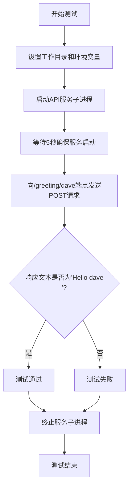
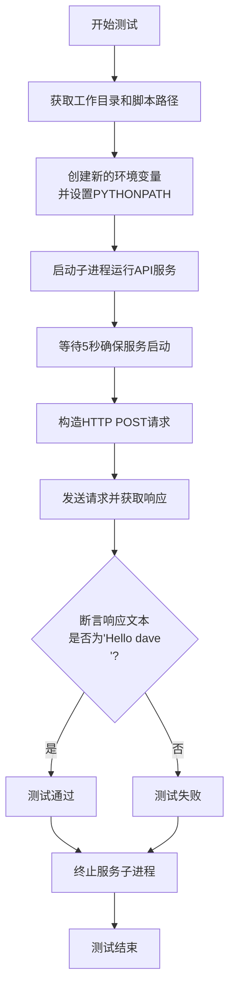

# `.\MetaGPT\tests\metagpt\tools\test_metagpt_oas3_api_svc.py` 详细设计文档

该代码是一个使用pytest框架编写的异步测试脚本，用于测试MetaGPT项目中的OAS3 API服务。它通过启动一个独立的Python子进程来运行API服务，然后向该服务的特定端点发送HTTP POST请求，验证服务是否正常运行并返回预期的响应。

## 整体流程



## 类结构

```
该文件不包含类定义，仅包含一个测试函数。
```

## 全局变量及字段


### `workdir`
    
项目根目录的路径对象，用于定位脚本文件和设置工作目录。

类型：`pathlib.Path`
    


### `script_pathname`
    
要测试的Python脚本的完整路径，指向metagpt_oas3_api_svc.py文件。

类型：`pathlib.Path`
    


### `env`
    
环境变量字典，用于设置子进程的PYTHONPATH，确保模块导入正确。

类型：`dict`
    


### `process`
    
子进程对象，代表启动的metagpt_oas3_api_svc.py服务进程。

类型：`subprocess.Popen`
    


### `url`
    
测试请求的API端点URL，指向本地服务的greeting接口。

类型：`str`
    


### `headers`
    
HTTP请求头，指定接受和内容类型为JSON。

类型：`dict`
    


### `data`
    
发送给API的请求数据体，当前为空字典。

类型：`dict`
    


### `response`
    
HTTP响应对象，包含API返回的状态码和内容。

类型：`requests.Response`
    


    

## 全局函数及方法

### `test_oas2_svc`

这是一个使用 `pytest` 框架编写的异步测试函数，用于测试一个基于 OpenAPI 3.0 规范的 API 服务。该函数会启动一个后台服务进程，然后向该服务发送一个 HTTP POST 请求，验证其响应是否符合预期。

参数：
- `context`：`pytest` 的 `fixture` 对象，用于获取测试上下文环境，特别是用于创建新的环境变量字典。

返回值：`None`，该函数不显式返回值，其核心功能是通过 `assert` 语句进行断言测试。

#### 流程图



#### 带注释源码

```python
@pytest.mark.asyncio  # 标记此函数为异步测试函数
async def test_oas2_svc(context):
    # 1. 准备工作：计算工作目录和待测试的API服务脚本路径
    workdir = Path(__file__).parent.parent.parent.parent
    script_pathname = workdir / "metagpt/tools/metagpt_oas3_api_svc.py"

    # 2. 环境配置：从测试上下文中获取环境变量，并添加项目根目录到PYTHONPATH
    env = context.new_environ()
    env["PYTHONPATH"] = str(workdir) + ":" + env.get("PYTHONPATH", "")

    # 3. 启动服务：以子进程方式在后台运行指定的Python API服务脚本
    process = subprocess.Popen(["python", str(script_pathname)], cwd=str(workdir), env=env)
    # 等待一段时间，确保后台服务进程完全启动
    await asyncio.sleep(5)

    try:
        # 4. 构造并发送测试请求
        url = "http://localhost:8080/openapi/greeting/dave"
        headers = {"accept": "text/plain", "Content-Type": "application/json"}
        data = {}
        # 向启动的服务发送一个POST请求
        response = requests.post(url, headers=headers, json=data)
        # 5. 断言验证：检查响应内容是否符合预期
        assert response.text == "Hello dave\n"
    finally:
        # 6. 清理工作：无论测试成功与否，都终止后台服务进程，避免资源泄漏
        process.terminate()
```

## 关键组件


### 测试框架与异步执行

使用pytest框架和asyncio库进行异步单元测试，验证OAS3 API服务的功能。

### 子进程管理

通过subprocess.Popen启动独立的Python进程来运行目标API服务脚本，实现测试环境与服务的隔离。

### 环境变量配置

在子进程中动态设置PYTHONPATH环境变量，确保服务脚本能够正确导入项目模块。

### HTTP客户端请求

使用requests库向本地启动的API服务端点发送HTTP POST请求，并验证响应内容是否符合预期。

### 资源清理与进程终止

在测试用例的finally块中终止子进程，确保测试执行后清理资源，避免进程泄漏。


## 问题及建议


### 已知问题

-   **硬编码的等待时间**：测试中使用 `await asyncio.sleep(5)` 来等待服务启动，这是一种不可靠的同步方式。如果服务启动时间超过5秒，测试将失败；如果服务启动更快，则会不必要地延长测试执行时间。
-   **硬编码的服务地址和端口**：测试中直接使用 `http://localhost:8080` 作为服务地址。如果该端口被占用或服务配置变更，测试将无法连接，缺乏灵活性。
-   **潜在的资源泄漏**：测试通过 `subprocess.Popen` 启动子进程，并在 `finally` 块中调用 `process.terminate()`。虽然这通常有效，但在某些情况下（如进程产生子进程）可能无法完全清理所有资源，存在资源未释放的风险。
-   **脆弱的断言**：断言 `assert response.text == "Hello dave\n"` 依赖于服务返回的精确文本格式（包括换行符 `\n`）。如果服务端的响应格式发生微小变化（例如去除换行符），测试将失败，降低了测试的健壮性。
-   **缺少服务启动验证**：测试在等待固定时间后直接发起请求，没有验证服务是否已成功启动并处于就绪状态（例如，通过健康检查端点），可能导致在服务未就绪时发起请求，造成测试失败。
-   **同步请求阻塞异步测试**：在 `@pytest.mark.asyncio` 标记的异步测试函数中，使用了同步的 `requests.post` 进行HTTP调用。这会阻塞事件循环，可能影响测试性能，尤其是在并发测试场景下。

### 优化建议

-   **实现动态等待机制**：将固定的 `asyncio.sleep` 替换为轮询机制，定期检查服务健康端点（如 `/health`）或尝试建立TCP连接，直到服务就绪或超时。这可以提高测试的可靠性和执行速度。
-   **外部化配置**：将服务的主机名、端口、端点路径等配置信息提取到配置文件、环境变量或 `pytest` 的 `fixture` 中。这提高了测试的灵活性和可维护性，便于在不同环境（如开发、CI）中运行。
-   **改进进程管理**：考虑使用 `asyncio.create_subprocess_exec` 来启动子进程，以便更好地集成到异步上下文中。确保在测试结束时（包括异常情况）能更可靠地终止进程树，例如使用 `process.kill()` 或平台特定的进程组管理。
-   **使用更健壮的断言**：将精确字符串匹配改为检查响应文本是否包含关键内容（如 `"Hello dave"`），或者解析响应JSON（如果适用）并检查特定字段。这使测试对无关的格式变化不敏感。
-   **添加服务就绪检查**：在发起业务请求前，先向服务的健康检查端点发送请求，确认服务已完全启动。这可以作为动态等待机制的一部分。
-   **使用异步HTTP客户端**：将同步的 `requests` 库调用替换为异步HTTP客户端（如 `aiohttp` 或 `httpx`）。这能更好地与 `asyncio` 测试框架配合，避免阻塞事件循环，提升测试效率。
-   **考虑使用测试专用工具**：对于启动外部服务的集成测试，可以考虑使用 `pytest` 插件（如 `pytest-docker` 或自定义 `fixture`）来管理服务的生命周期（启动、停止），使测试代码更简洁、专注。
-   **增强错误处理和日志**：在测试的关键步骤（如启动进程、发送请求）添加更详细的异常捕获和日志输出。这有助于在测试失败时快速定位问题根源。


## 其它


### 设计目标与约束

本代码是一个针对 `metagpt_oas3_api_svc.py` 脚本的集成测试用例。其主要设计目标是验证该脚本启动的HTTP服务能够正确响应一个特定的API端点（`/openapi/greeting/dave`），并返回预期的结果（`"Hello dave\n"`）。约束包括：测试需要在独立的子进程中启动服务，确保测试环境与主测试进程隔离；测试执行有时间限制（等待服务启动的5秒）；测试完成后必须清理资源（终止子进程）。

### 错误处理与异常设计

代码中的错误处理主要通过 `try...finally` 块实现，确保无论测试断言是否通过，都会执行 `process.terminate()` 来终止启动的服务子进程，防止资源泄漏。如果 `requests.post` 调用失败（如连接拒绝、超时），会抛出 `requests.exceptions.RequestException`，导致测试失败。`subprocess.Popen` 启动失败会抛出 `OSError` 或 `subprocess.SubprocessError`。代码本身没有捕获这些异常，而是交由 `pytest` 框架处理，测试失败会提供相应的错误堆栈。

### 数据流与状态机

1.  **初始化阶段**：计算工作目录 (`workdir`)，构建脚本路径 (`script_pathname`)，准备环境变量 (`env`)。
2.  **服务启动阶段**：通过 `subprocess.Popen` 异步启动目标Python脚本作为子进程。主测试协程通过 `await asyncio.sleep(5)` 等待，模拟服务启动和初始化时间。
3.  **测试执行阶段**：向 `http://localhost:8080/openapi/greeting/dave` 发送一个携带空JSON body的POST请求。
4.  **验证阶段**：断言HTTP响应的文本内容等于 `"Hello dave\n"`。
5.  **清理阶段**：无论测试成功与否，在 `finally` 块中调用 `process.terminate()` 发送终止信号给子进程。

状态简单：`准备` -> `服务运行中` -> `测试完成/失败` -> `服务已终止`。

### 外部依赖与接口契约

1.  **外部依赖**：
    *   `pytest` & `pytest-asyncio`: 测试框架及异步支持。
    *   `requests`: 用于发送HTTP请求。
    *   被测试脚本 `metagpt/tools/metagpt_oas3_api_svc.py`: 核心测试目标，预期它启动一个监听 `8080` 端口的HTTP服务。
    *   `asyncio`, `subprocess`: Python标准库，用于异步等待和进程管理。

2.  **接口契约**：
    *   **与子进程的契约**：通过命令行 `python {script_pathname}` 启动服务，预期其在 `localhost:8080` 提供HTTP服务。
    *   **与HTTP服务的契约**：服务必须实现 `POST /openapi/greeting/dave` 接口。请求头需包含 `accept: text/plain` 和 `Content-Type: application/json`。请求体可为空JSON对象 `{}`。响应状态码应为200，响应体内容应为纯文本 `"Hello dave\n"`。
    *   **与测试框架(pytest)的契约**：函数 `test_oas2_svc` 是一个异步测试用例，接收 `context` fixture（推测提供 `new_environ` 方法）。测试通过则静默退出，失败则抛出 `AssertionError` 或其他异常。

### 安全与合规考虑

1.  **硬编码地址与端口**：测试中硬编码了 `localhost:8080`。如果该端口被占用，会导致服务启动失败或连接到错误的服务，测试将不稳定。应考虑使用动态分配端口或更健壮的端口检查/重试机制。
2.  **固定等待时间**：使用固定的5秒等待服务启动 (`await asyncio.sleep(5)`) 是一种脆弱的设计。服务启动时间可能因环境而异，导致测试间歇性失败。理想情况下应实现轮询检查，直到服务就绪或超时。
3.  **进程终止**：使用 `process.terminate()` 发送SIGTERM信号。如果被测试服务没有正确处理该信号进行优雅关闭，可能导致资源未完全释放。对于更复杂的服务，可能需要更强的终止手段(`kill`)或更长的等待时间。
4.  **环境变量传递**：测试修改了 `PYTHONPATH` 以确保子进程能正确导入模块。这依赖于对项目结构的了解，如果项目结构发生变化，测试可能需要更新。

    