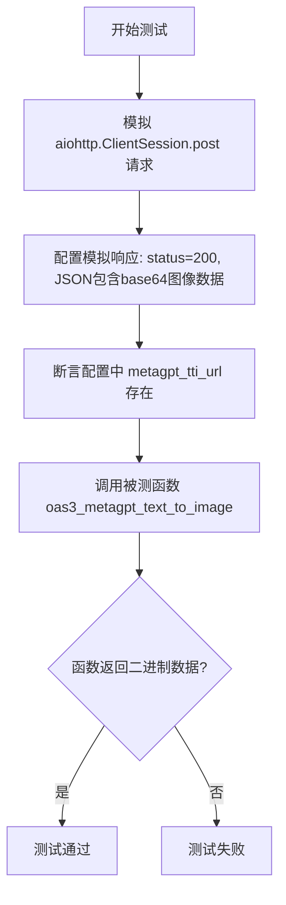
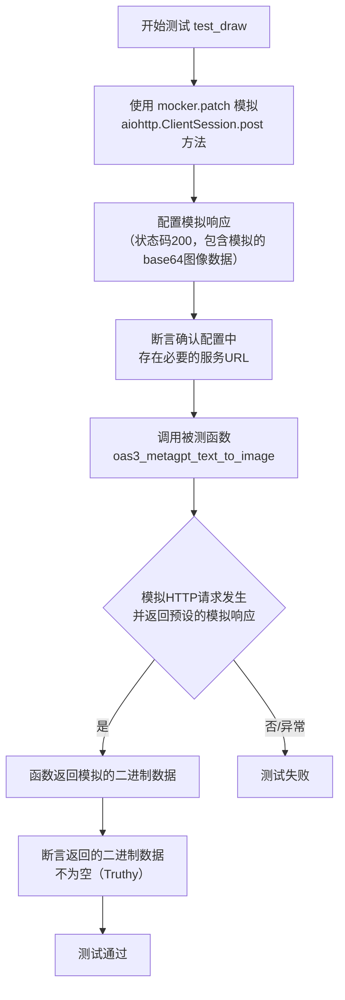
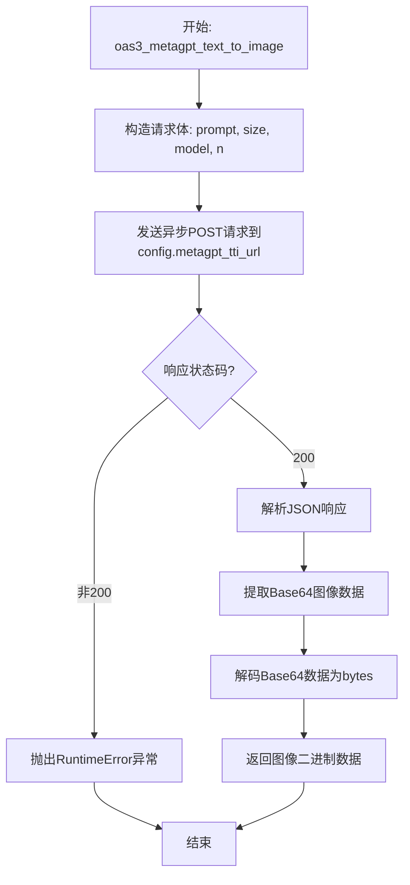

# `.\MetaGPT\tests\metagpt\tools\test_metagpt_text_to_image.py` 详细设计文档

这是一个单元测试文件，用于测试 `metagpt.tools.metagpt_text_to_image` 模块中的 `oas3_metagpt_text_to_image` 函数。该函数的核心功能是向一个配置好的 MetaGPT 文本转图像服务端点发送异步 HTTP POST 请求，将文本描述（如“Panda emoji”）转换为图像数据。测试用例通过模拟（Mock）网络请求来验证函数在收到成功响应时能正确返回二进制图像数据。

## 整体流程



## 类结构

```
本文件不包含自定义类。它是一个测试脚本，主要包含：
├── 全局导入语句
├── 一个异步测试函数: test_draw
└── 一个脚本入口点
```

## 全局变量及字段


### `config`
    
全局配置对象，用于访问和管理应用程序的配置信息，包括外部服务URL等设置。

类型：`metagpt.config2.Config`
    


    

## 全局函数及方法


### `test_draw`

这是一个使用 `pytest` 框架编写的异步单元测试函数，用于测试 `metagpt.tools.metagpt_text_to_image` 模块中的 `oas3_metagpt_text_to_image` 函数。该测试通过模拟（Mock）HTTP POST 请求，验证在给定文本提示词（如“Panda emoji”）的情况下，函数能够成功调用外部文本转图像服务并返回预期的二进制图像数据。

参数：

- `mocker`：`pytest_mock.plugin.MockerFixture`，pytest-mock 插件提供的 Mock 夹具，用于创建和管理测试中的模拟对象。

返回值：`None`，单元测试函数通常不显式返回值，其成功与否由断言（assert）语句决定。

#### 流程图



#### 带注释源码

```python
@pytest.mark.asyncio  # 标记此测试函数为异步函数，需要异步测试环境
async def test_draw(mocker):  # 定义异步测试函数，接收 mocker 夹具
    # mock
    # 使用 mocker.patch 模拟 'aiohttp.ClientSession.post' 方法，
    # 这是为了在测试中避免真实的网络调用。
    mock_post = mocker.patch("aiohttp.ClientSession.post")
    
    # 创建一个异步模拟对象，用于模拟 HTTP 响应。
    mock_response = AsyncMock()
    mock_response.status = 200  # 设置模拟响应的状态码为 200（成功）
    # 设置模拟响应 json() 方法的返回值，模拟服务返回的数据结构。
    # 其中 'images' 字段包含一个经过 base64 编码的字符串（模拟图像数据）。
    mock_response.json.return_value = {"images": [base64.b64encode(b"success")], "parameters": {"size": 1110}}
    
    # 配置模拟的 post 方法，使其异步上下文管理器返回上面创建的 mock_response。
    # `__aenter__` 是异步上下文管理器的入口方法。
    mock_post.return_value.__aenter__.return_value = mock_response

    # Prerequisites
    # 测试前提条件：断言全局配置对象 config 中的 metagpt_tti_url 属性存在且为真。
    # 这是被测函数正常运行所依赖的外部配置。
    assert config.metagpt_tti_url

    # 调用被测的异步函数 oas3_metagpt_text_to_image，传入文本提示 "Panda emoji"。
    # 由于上面的 Mock，这里不会发出真实网络请求，而是使用预设的 mock_response。
    binary_data = await oas3_metagpt_text_to_image("Panda emoji")
    
    # 断言：验证函数返回的 binary_data 不为空（即 Truthy），表明函数执行成功并返回了数据。
    assert binary_data


if __name__ == "__main__":
    # 如果直接运行此脚本，则使用 pytest 执行当前文件，并带有 `-s` 参数（允许控制台输出）。
    pytest.main([__file__, "-s"])
```


### `oas3_metagpt_text_to_image`

该函数是一个异步函数，用于向指定的MetaGPT文本转图像服务端点发送HTTP POST请求，将输入的文本描述转换为图像。它接收一个文本提示词，构造包含该提示词和配置参数的JSON请求体，发送到配置的URL，并处理响应。如果响应状态码为200，它会解析返回的JSON数据，提取Base64编码的图像数据，将其解码为二进制数据并返回。如果响应状态码不是200，则会引发一个包含错误信息的`RuntimeError`异常。

参数：
- `prompt`：`str`，描述所需图像的文本提示词。

返回值：`bytes`，解码后的图像二进制数据。

#### 流程图



#### 带注释源码

```python
async def oas3_metagpt_text_to_image(prompt: str) -> bytes:
    """
    Asynchronously generates an image from a text prompt using the configured MetaGPT TTI service.

    Args:
        prompt (str): The text description of the desired image.

    Returns:
        bytes: The binary image data.

    Raises:
        RuntimeError: If the HTTP request fails or returns a non-200 status code.
    """
    # 导入必要的模块
    import aiohttp
    import base64

    # 从全局配置中获取文本转图像服务的URL
    url = config.metagpt_tti_url
    # 构造请求负载，包含提示词、图像大小、模型和生成数量等参数
    payload = {
        "prompt": prompt,          # 用户输入的文本提示
        "size": "1024x1024",       # 请求生成的图像尺寸
        "model": "dall-e-3",       # 指定使用的模型
        "n": 1,                    # 请求生成的图像数量
    }
    # 创建异步HTTP客户端会话
    async with aiohttp.ClientSession() as session:
        # 发送异步POST请求到指定的URL，并附带JSON格式的负载
        async with session.post(url, json=payload) as response:
            # 检查HTTP响应状态码是否为200 (成功)
            if response.status == 200:
                # 解析响应的JSON数据
                data = await response.json()
                # 从响应数据中提取Base64编码的图像字符串
                # 假设响应结构为 {"images": ["base64_string"], ...}
                b64_data = data["images"][0]
                # 将Base64字符串解码为二进制图像数据
                image_data = base64.b64decode(b64_data)
                # 返回解码后的图像二进制数据
                return image_data
            else:
                # 如果响应状态码不是200，则抛出运行时异常，包含状态码和错误文本
                error_text = await response.text()
                raise RuntimeError(f"Request failed with status {response.status}: {error_text}")
```

## 关键组件


### 测试框架与模拟

使用pytest框架和unittest.mock库进行异步单元测试，模拟外部HTTP API调用以验证文本转图像功能。

### 配置管理

通过metagpt.config2.config对象获取外部服务URL配置，确保测试环境具有正确的服务端点。

### 文本转图像服务接口

oas3_metagpt_text_to_image函数作为核心服务接口，接收文本描述并返回图像二进制数据，封装了与外部图像生成服务的交互逻辑。

### HTTP客户端模拟

使用aiohttp.ClientSession.post的模拟对象来拦截对外部服务的HTTP POST请求，并返回预定义的模拟响应，避免测试中对真实服务的依赖。

### 异步测试支持

通过@pytest.mark.asyncio装饰器支持异步测试函数的执行，确保能够正确测试异步服务调用。

### 响应数据处理

测试验证服务返回的响应数据，包括状态码检查、JSON数据解析以及Base64编码图像数据的解码处理。


## 问题及建议


### 已知问题

-   **测试用例覆盖不完整**：当前测试用例仅验证了API调用成功（HTTP 200）并返回有效数据的情况。未对网络错误（如连接超时、连接拒绝）、HTTP错误状态码（如4xx客户端错误、5xx服务器错误）、API响应格式异常（如缺少`images`字段、`images`列表为空、`images`字段非列表类型）以及`base64`解码失败等边界和异常场景进行测试。这可能导致生产环境中遇到此类问题时，代码行为不符合预期或缺乏有效的错误处理。
-   **Mock对象配置过于具体且脆弱**：测试中Mock了`aiohttp.ClientSession.post`的完整调用链（`__aenter__`）并预设了固定的返回值结构（`{"images": [base64.b64encode(b"success")], "parameters": {"size": 1110}}`）。这种Mock方式与`oas3_metagpt_text_to_image`函数内部实现细节（如使用`aiohttp`、特定的响应键名）紧密耦合。一旦被测试函数内部实现变更（例如更换HTTP库、调整响应数据结构解析逻辑），即使其外部契约不变，此测试也可能因Mock不匹配而失败，降低了测试的稳定性和维护性。
-   **依赖全局配置且缺乏隔离**：测试用例直接依赖并断言全局对象`config.metagpt_tti_url`的存在。这引入了测试与全局状态的耦合。如果其他测试或代码修改了`config`，或者运行测试时未正确初始化该配置，可能导致本测试意外失败，影响测试的独立性和可重复性。
-   **未验证核心业务逻辑**：测试仅断言了函数返回了非`None`的`binary_data`，但没有验证返回的数据内容是否与请求的描述（`"Panda emoji"`）在业务逻辑上相关，也没有验证返回的二进制数据确实是有效的图像数据。这削弱了测试对功能正确性的保障能力。

### 优化建议

-   **补充异常和边界测试用例**：应增加多个测试用例，使用`pytest.mark.parametrize`或独立的`async def test_...`函数，分别模拟和断言各种失败场景。例如：模拟`post`抛出`TimeoutError`或`ClientError`；模拟`response.status`为404、500等；模拟`response.json()`返回缺少关键字段、字段类型错误、空列表或`None`等数据。确保`oas3_metagpt_text_to_image`函数在这些情况下能妥善处理（如抛出恰当的异常、返回`None`或默认值）。
-   **重构Mock策略，提升抽象层级**：考虑使用更抽象的Mock方式，例如使用`pytest-mock`的`mocker`对`oas3_metagpt_text_to_image`函数内部调用的一个更抽象的依赖（如果存在）进行Mock，或者使用测试替身（Test Double）如Fake来模拟整个图像生成服务。如果难以抽象，至少应将Mock的响应数据定义为模块级常量或通过工厂函数生成，减少Mock配置的重复和硬编码，使测试意图更清晰。
-   **隔离测试环境，注入配置依赖**：修改`oas3_metagpt_text_to_image`函数的设计，使其接受`metagpt_tti_url`等配置作为参数（或通过一个可注入的客户端对象），而不是在内部直接读取全局`config`。在测试中，可以传入一个测试专用的URL或Mock对象。如果当前无法修改函数签名，可以在测试的`setup`阶段临时设置`config.metagpt_tti_url`，并在`teardown`阶段恢复，以确保测试隔离。
-   **增强结果验证**：在Mock成功响应的测试中，除了断言返回值非空，还可以进一步断言返回的`binary_data`等于Mock中编码的特定字节串（如`b"success"`），以确认函数正确解析并返回了响应中的图像数据。如果业务上可行，甚至可以加入对解码后数据基本属性的简单检查（例如，对于PNG/JPG头部字节的校验）。这能更有效地验证函数的数据处理逻辑是否正确。
-   **添加集成测试（可选但建议）**：在单元测试之外，考虑建立一个轻量的集成测试，在可控的测试环境下调用真实或临时的MetaGPT文本转图像服务端点。这可以验证整个从请求到响应的链条（包括网络、序列化/反序列化）是否正常工作，作为单元测试的补充。


## 其它


### 设计目标与约束

本测试代码的设计目标是验证 `oas3_metagpt_text_to_image` 函数能够正确调用外部文本转图像服务并处理其响应。主要约束包括：1) 测试必须异步执行以匹配被测试函数的异步特性；2) 测试不应依赖真实的外部服务，需通过模拟（Mock）来隔离外部依赖；3) 测试需验证函数在收到成功响应时能正确返回二进制图像数据。

### 错误处理与异常设计

测试代码本身不包含复杂的错误处理逻辑，其目的是验证被测试函数在正常路径下的行为。测试通过模拟（Mock）构造了一个成功的HTTP响应（状态码200），并断言函数返回非空数据。若被测试函数 `oas3_metagpt_text_to_image` 内部存在错误处理（如处理非200状态码、响应体解析异常等），本测试并未覆盖这些异常路径。测试框架 `pytest` 会捕获并报告测试执行过程中抛出的任何异常。

### 数据流与状态机

1.  **测试启动**：`pytest` 框架调用 `test_draw` 函数。
2.  **模拟设置**：使用 `mocker.patch` 模拟 `aiohttp.ClientSession.post` 方法，使其返回一个预定义的异步模拟响应对象。该响应对象的状态码为200，并包含一个模拟的JSON响应体。
3.  **前置条件检查**：断言全局配置 `config.metagpt_tti_url` 存在（非空），确保被测试函数有有效的服务端点。
4.  **函数调用**：异步调用被测试函数 `oas3_metagpt_text_to_image("Panda emoji")`。
5.  **模拟交互**：被测试函数内部会调用被模拟的 `post` 方法，并接收到预设的模拟响应。
6.  **结果验证**：断言函数返回的 `binary_data` 不为空（`assert binary_data`）。
7.  **测试结束**：测试通过或失败。

### 外部依赖与接口契约

1.  **被测试函数**：`metagpt.tools.metagpt_text_to_image.oas3_metagpt_text_to_image`。测试依赖于该函数的签名和行为：接收一个字符串参数，异步返回二进制数据。
2.  **配置依赖**：`metagpt.config2.config.metagpt_tti_url`。测试假设该配置项已正确设置，指向一个有效的服务URL。
3.  **外部服务接口契约（模拟部分）**：测试模拟了外部文本转图像服务的HTTP响应。模拟的响应体结构为 `{"images": [base64_encoded_string], "parameters": {"size": 1110}}`，这定义了被测试函数期望从成功调用中获得的JSON数据结构。被测试函数应能正确解析此结构并提取 `images` 列表中的第一个Base64编码字符串，将其解码为二进制数据返回。
4.  **第三方库**：`pytest`, `pytest-asyncio` (通过 `@pytest.mark.asyncio` 体现), `aiohttp` (被模拟的对象), `unittest.mock` 的 `AsyncMock`。

    