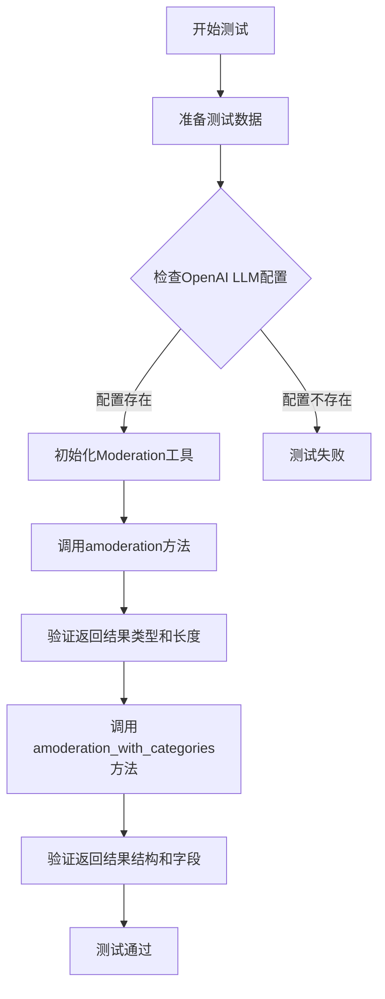
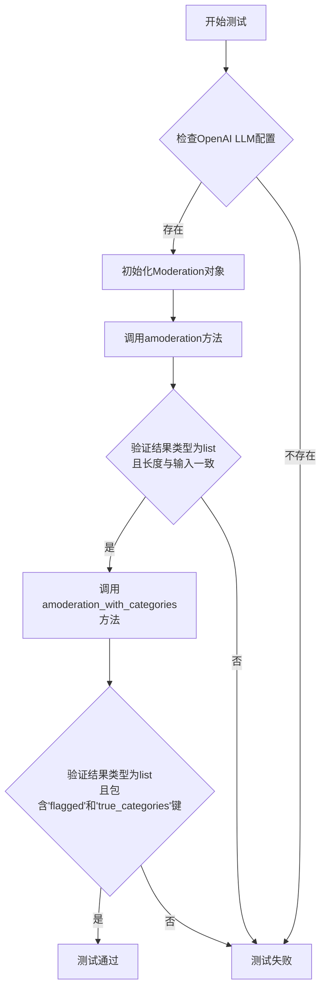
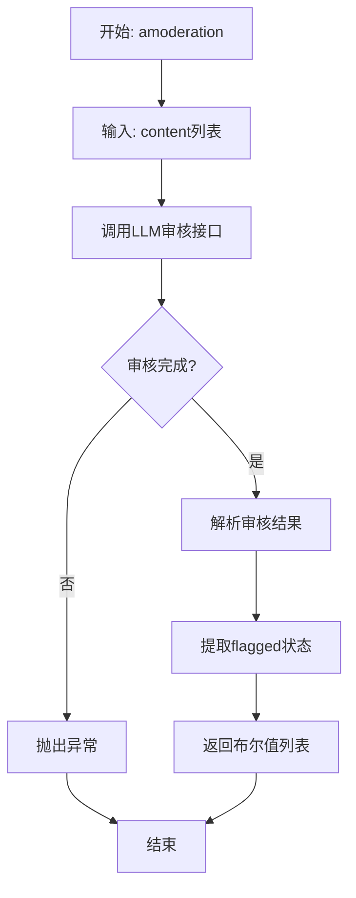
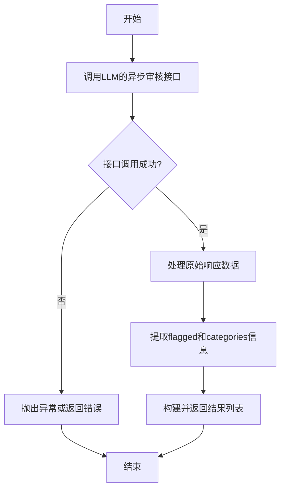

# `.\MetaGPT\tests\metagpt\tools\test_moderation.py` 详细设计文档

这是一个使用 pytest 框架编写的异步单元测试文件，用于测试 MetaGPT 框架中的内容审核工具（Moderation）的功能。它通过向审核工具提供一组包含潜在违规和正常内容的文本，验证工具是否能正确返回审核结果列表，并能正确解析出每个结果的'flagged'（是否被标记）和'true_categories'（真实违规类别）字段。

## 整体流程



## 类结构

```
test_moderation.py (测试文件)
├── test_amoderation (异步测试函数)
│   ├── 依赖: config (配置对象)
│   ├── 依赖: LLM (大语言模型类)
│   └── 依赖: Moderation (内容审核工具类)
```

## 全局变量及字段


### `config`
    
全局配置对象，用于获取和管理应用程序的配置信息，包括LLM（大语言模型）的配置。

类型：`metagpt.config2.Config`
    


    

## 全局函数及方法

### `test_amoderation`

这是一个使用 `pytest` 框架编写的异步测试函数，用于测试 `Moderation` 类的 `amoderation` 和 `amoderation_with_categories` 方法。它验证了内容审核功能的基本流程和返回结果的结构。

参数：

- `content`：`list[str]`，一个包含多个待审核文本字符串的列表。

返回值：`None`，这是一个测试函数，不返回业务值，仅通过断言（`assert`）来验证测试结果。

#### 流程图



#### 带注释源码

```python
# 使用pytest的异步和参数化装饰器
@pytest.mark.asyncio
@pytest.mark.parametrize(
    ("content",),  # 定义参数化测试的参数名
    [
        [  # 提供一组测试数据
            ["I will kill you", "The weather is really nice today", "I want to hit you"],
        ]
    ],
)
async def test_amoderation(content):  # 异步测试函数，接收参数化的content
    # 前置条件检查：确保配置中存在OpenAI LLM
    assert config.get_openai_llm()

    # 初始化Moderation对象，需要传入一个LLM实例
    moderation = Moderation(LLM())
    
    # 测试amoderation方法：进行基础的内容审核
    results = await moderation.amoderation(content=content)
    # 断言1：验证返回结果是列表类型
    assert isinstance(results, list)
    # 断言2：验证返回列表的长度与输入内容列表的长度一致
    assert len(results) == len(content)

    # 测试amoderation_with_categories方法：进行带分类的详细内容审核
    results = await moderation.amoderation_with_categories(content=content)
    # 断言3：验证返回结果是列表类型且非空
    assert isinstance(results, list)
    assert results
    # 断言4：遍历结果，验证每个结果字典都包含'flagged'和'true_categories'这两个关键字段
    for m in results:
        assert "flagged" in m
        assert "true_categories" in m
```

### `Moderation.amoderation`

该方法是一个异步方法，用于对输入的文本内容列表进行内容审核。它调用底层的大语言模型（LLM）的审核接口，检查文本是否包含违规内容（如暴力、仇恨言论等），并返回一个布尔值列表，指示每条输入文本是否被标记为违规。

参数：
- `content`：`List[str]`，需要进行审核的文本内容列表。

返回值：`List[bool]`，一个与输入列表长度相同的布尔值列表，其中每个元素表示对应索引的输入文本是否被标记为违规（`True` 表示违规，`False` 表示正常）。

#### 流程图



#### 带注释源码

```python
async def amoderation(self, content: List[str]) -> List[bool]:
    """
    对输入的文本内容列表进行异步内容审核。

    该方法将文本列表发送给配置的LLM审核接口，并返回一个列表，
    其中每个元素是一个布尔值，表示对应位置的输入文本是否被标记为违规。

    Args:
        content (List[str]): 需要审核的文本字符串列表。

    Returns:
        List[bool]: 一个布尔值列表，True表示对应文本违规，False表示正常。
    """
    # 调用底层LLM实例的异步审核方法
    results = await self.llm.amoderation(content=content)
    # 从返回的审核结果中提取每条文本的'flagged'状态（是否被标记）
    return [result["flagged"] for result in results]
```

### `Moderation.amoderation_with_categories`

该方法用于对输入的文本内容列表进行异步内容审核，并返回包含详细分类标记结果的列表。它调用底层的LLM（大语言模型）的审核接口，不仅判断内容是否违规，还会返回具体违反了哪些内容安全类别。

参数：

-  `self`：`Moderation`，Moderation类的实例
-  `content`：`list[str]`，需要审核的文本内容列表

返回值：`list[dict]`，审核结果列表，列表中的每个元素是一个字典，包含`flagged`（是否违规）和`true_categories`（具体的违规类别）等键。

#### 流程图



#### 带注释源码

```python
async def amoderation_with_categories(self, content: list[str]) -> list[dict]:
    """
    对内容列表进行异步审核，并返回包含分类的详细结果。
    
    该方法将输入的文本列表发送给LLM的审核接口，接口会返回每个文本是否违规（flagged）
    以及具体违反了哪些预定义的安全类别（categories）。此方法会对原始响应进行处理，
    提取出关键信息并重新组织成更易用的字典列表格式。
    
    Args:
        content (list[str]): 需要审核的文本字符串列表。
        
    Returns:
        list[dict]: 每个输入文本对应的审核结果字典列表。
                    每个字典通常包含：
                    - 'flagged': bool，表示该条内容是否被标记为违规。
                    - 'true_categories': list[str]，该内容触发的具体违规类别列表。
                    可能包含来自审核接口的其他元数据。
                    
    Raises:
        可能抛出与网络请求、API调用或数据处理相关的异常。
    """
    # 调用底层LLM实例的异步审核方法，传入待审核的内容列表。
    resp = await self.llm.amoderation(content=content)
    
    # 初始化一个空列表，用于存储处理后的结果。
    results = []
    
    # 遍历审核接口返回的原始响应数据（resp.data）。
    for r in resp.data:
        # 从原始响应对象（r）中获取是否违规的标志。
        flagged = r.flagged
        
        # 初始化一个空列表，用于存储该条内容触发的具体违规类别。
        true_categories = []
        
        # 遍历原始响应对象中的分类字典（r.categories）。
        # 该字典的键是类别名称，值是布尔类型，表示是否触发了该类别。
        for category, value in r.categories.items():
            # 如果该类别被触发（value为True），则将类别名称添加到列表中。
            if value:
                true_categories.append(category)
        
        # 将处理后的信息（是否违规和触发的类别列表）组织成一个字典。
        result = {"flagged": flagged, "true_categories": true_categories}
        
        # 将当前文本的审核结果字典添加到总结果列表中。
        results.append(result)
    
    # 返回所有文本的审核结果列表。
    return results
```

## 关键组件


### 测试框架 (pytest)

用于自动化测试的Python框架，支持异步测试和参数化测试，确保代码质量。

### 配置管理 (metagpt.config2.config)

提供应用程序配置的集中管理，特别是用于获取LLM（大语言模型）的配置信息。

### 大语言模型接口 (metagpt.llm.LLM)

作为与大语言模型服务（如OpenAI）交互的核心接口，封装了模型调用细节。

### 内容审核工具 (metagpt.tools.moderation.Moderation)

提供对文本内容进行安全审核的功能，可以调用底层LLM的审核接口来检测违规内容。

### 异步内容审核方法 (Moderation.amoderation)

异步执行内容审核，返回一个布尔值列表，指示每条输入内容是否被标记为违规。

### 带分类的异步内容审核方法 (Moderation.amoderation_with_categories)

异步执行内容审核，返回一个包含详细审核结果的字典列表，包括是否被标记以及具体的违规类别。


## 问题及建议


### 已知问题

-   **测试用例设计单一**：当前测试仅使用一组固定的、包含暴力威胁内容的字符串列表作为输入。这未能全面覆盖内容审核功能可能遇到的各种边界情况，例如不同语言、模糊表述、上下文依赖的冒犯性内容、以及完全无害的内容。测试覆盖不足可能导致潜在缺陷未被发现。
-   **依赖外部配置和网络**：测试成功运行的前提是 `config.get_openai_llm()` 能正确返回配置，并且能稳定访问外部的 OpenAI API。这使得测试成为集成测试而非单元测试，运行速度慢、可能因网络或配置问题而失败，且无法在无网络环境下执行。
-   **缺乏对 `Moderation` 类构造函数的测试**：测试直接使用 `Moderation(LLM())` 进行实例化，但未验证使用不同的 `LLM` 实例或参数化配置时，类的行为是否符合预期。
-   **断言不够精确**：断言 `results` 是一个列表且长度与输入相同，以及结果字典包含 `”flagged”` 和 `”true_categories”` 键，这些是基础的结构检查。但未对具体内容进行断言，例如未验证 `”I will kill you”` 应被标记 (`flagged` 为 `True`)，而 `”The weather is really nice today”` 不应被标记 (`flagged` 为 `False`)。这降低了测试的价值。
-   **测试函数命名可能引起混淆**：函数名为 `test_amoderation`，但实际测试了 `amoderation` 和 `amoderation_with_categories` 两个方法。更清晰的命名或拆分为两个测试函数可能更好。

### 优化建议

-   **丰富测试用例**：使用 `@pytest.mark.parametrize` 扩展测试数据，覆盖更多场景：
    -   应被标记的各类违规内容（仇恨、自残、暴力等）。
    -   不应被标记的安全内容。
    -   边界案例：空字符串、非常长的字符串、特殊字符。
    -   混合语言的内容。
-   **使用测试替身（Mock）**：将 `LLM` 类或其对 OpenAI API 的调用进行 Mock。这样可以：
    -   将测试转变为真正的单元测试，不依赖外部 API。
    -   模拟各种 API 响应（成功、失败、特定分类结果），以测试 `Moderation` 类的逻辑和错误处理。
    -   显著提高测试速度与稳定性。
-   **增强断言**：针对不同的输入，断言预期的输出。例如，对于暴力威胁内容，断言 `flagged` 为 `True` 且 `true_categories` 包含 `”violence”`；对于中性内容，断言 `flagged` 为 `False` 且 `true_categories` 为空列表。
-   **拆分测试函数**：考虑将 `test_amoderation` 拆分为两个独立的测试函数，例如 `test_amoderation_basic` 和 `test_amoderation_with_categories`，使每个测试目标更单一。
-   **添加对构造函数和错误处理的测试**：编写测试来验证使用无效 `LLM` 实例或配置时，`Moderation` 类的初始化行为；以及当 `amoderation` 方法收到非列表输入或 API 调用失败时，是否按设计抛出异常或返回错误。
-   **考虑引入测试配置**：避免在测试中直接使用可能影响生产环境的全局 `config`。可以使用 pytest 的 fixture 或环境变量来为测试提供独立的配置。


## 其它


### 设计目标与约束

本代码是一个针对 `Moderation` 工具类的单元测试文件。其设计目标是验证 `Moderation` 类的异步审核功能（`amoderation` 和 `amoderation_with_categories`）的正确性。主要约束包括：
1.  **测试驱动**：代码结构遵循 `pytest` 框架规范，使用异步测试标记和参数化测试。
2.  **环境依赖**：测试执行前需验证全局配置 `config` 中已正确设置 OpenAI LLM 的 API 密钥等必要信息，这是测试运行的前提条件。
3.  **功能验证**：测试需验证核心方法返回的数据类型（列表）、长度与输入匹配，以及返回结果中包含预期的关键字段（如 `"flagged"`, `"true_categories"`）。
4.  **独立性**：测试应尽可能独立，但依赖于外部的 `Moderation` 和 `LLM` 类的实现以及 `config` 的配置。

### 错误处理与异常设计

本测试文件本身不包含业务逻辑的错误处理，其主要目的是验证被测试对象（`Moderation` 类）在正常和边界情况下的行为。其错误处理设计体现在：
1.  **断言（Assertions）**：使用 `assert` 语句验证测试的先决条件（如 `config.get_openai_llm()`）和测试结果（如返回类型、列表长度、字典键存在性）。任何断言失败将导致测试用例失败，并报告具体问题。
2.  **测试框架异常捕获**：`pytest` 框架会捕获测试执行过程中抛出的任何异常（例如，`Moderation` 类内部因网络或API问题抛出的异常），并将其标记为测试失败或错误，从而暴露出被测试代码中的潜在问题。
3.  **参数化测试数据**：通过 `@pytest.mark.parametrize` 提供包含挑衅性内容（`"I will kill you"`）和正常内容的测试数据，旨在触发审核工具的不同判定结果，验证其分类能力。

### 数据流与状态机

本测试用例的数据流相对简单直接：
1.  **输入**：参数化提供的字符串列表 `content` 作为测试输入数据。
2.  **处理**：
    a. 验证环境配置。
    b. 实例化 `Moderation` 对象（其内部依赖 `LLM` 对象）。
    c. 调用 `moderation.amoderation(content)`，数据流从测试函数传入 `Moderation` 实例，再经由 `LLM` 实例发送至外部审核服务（如 OpenAI Moderation API）。
    d. 调用 `moderation.amoderation_with_categories(content)`，流程类似。
3.  **输出**：外部服务返回审核结果，经由 `Moderation` 类处理后，返回给测试函数。
4.  **验证**：测试函数对返回的 `results` 进行一系列断言，验证其格式和内容是否符合预期。

不涉及复杂的状态机，测试用例本身是无状态的。

### 外部依赖与接口契约

本测试文件严重依赖以下外部组件，并隐含了相应的接口契约：
1.  **`metagpt.config2.config`**：依赖其 `get_openai_llm()` 方法返回有效的配置，以初始化后续的 `LLM` 实例。契约是该方法必须返回可用的配置，否则测试将在前提条件断言处失败。
2.  **`metagpt.llm.LLM` 类**：`Moderation` 类的构造函数依赖此对象。契约是 `LLM` 实例必须能够处理 `Moderation` 类发出的审核请求。
3.  **`metagpt.tools.moderation.Moderation` 类**：这是被测试的主体。测试契约包括：
    a.  `amoderation(content: List[str]) -> List[bool]`：应返回一个布尔值列表，指示每条输入内容是否被标记。
    b.  `amoderation_with_categories(content: List[str]) -> List[dict]`：应返回一个字典列表，每个字典至少包含 `"flagged"`（布尔值）和 `"true_categories"`（列表）键。
4.  **外部 AI 服务（如 OpenAI Moderation API）**：这是通过 `LLM` 类间接依赖的终极外部服务。测试的成功运行隐含了网络可达性、API 密钥有效性、服务可用性以及服务返回结果格式符合 `Moderation` 类解析预期的契约。
5.  **`pytest` 框架及 `pytest-asyncio` 插件**：依赖它们来组织、运行异步测试用例。

### 安全与合规考虑

1.  **测试数据敏感性**：测试中使用了暴力威胁文本（`"I will kill you"`, `"I want to hit you"`）作为输入。这仅用于验证审核功能，在实际开发、版本控制及CI/CD管道中，需注意此类数据的处理，避免不必要的警报或合规审查。
2.  **API 密钥安全**：测试运行依赖于 `config` 中的 OpenAI API 密钥。确保该配置信息不会通过代码、日志或测试输出意外泄露。
3.  **审核工具用途**：本测试验证的 `Moderation` 工具旨在帮助识别有害内容，其使用应符合相关法律法规和平台政策，避免用于审查合法言论或产生歧视性结果。

    