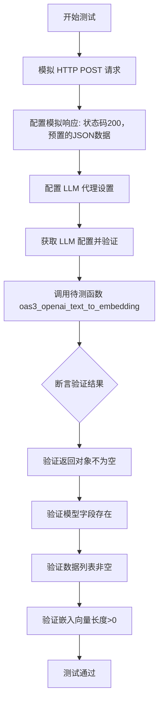

# `.\MetaGPT\tests\metagpt\tools\test_openai_text_to_embedding.py` 详细设计文档

这是一个使用 pytest 框架编写的异步单元测试文件，用于测试 OpenAI 文本嵌入（text-to-embedding）功能。它通过模拟（mock）HTTP 请求来验证 `oas3_openai_text_to_embedding` 函数能否正确调用 OpenAI 的嵌入 API 并解析返回的嵌入向量数据，而无需实际调用外部 API。

## 整体流程



## 类结构

```
test_openai_text_to_embedding.py (测试模块)
├── 全局函数: test_embedding (异步测试函数)
├── 被测试函数: oas3_openai_text_to_embedding (来自 metagpt.tools.openai_text_to_embedding)
├── 配置类: config (来自 metagpt.config2)
└── 工具函数: aread (来自 metagpt.utils.common)
```

## 全局变量及字段


### `config`
    
全局配置对象，用于获取和管理应用程序的配置信息，特别是OpenAI LLM的配置。

类型：`metagpt.config2.config`
    


### `mocker`
    
Pytest的mock fixture，用于在测试中创建和管理模拟对象。

类型：`pytest_mock.plugin.MockerFixture`
    


### `mock_post`
    
模拟的aiohttp.ClientSession.post方法，用于拦截HTTP POST请求。

类型：`unittest.mock.MagicMock`
    


### `mock_response`
    
模拟的异步HTTP响应对象，用于返回预定义的响应数据。

类型：`unittest.mock.AsyncMock`
    


### `data`
    
从文件中读取的JSON字符串，包含模拟的OpenAI embedding API响应数据。

类型：`str`
    


### `llm_config`
    
从全局配置中获取的OpenAI LLM配置对象，包含API密钥和代理设置。

类型：`metagpt.config2.OpenAIConfig`
    


### `result`
    
调用oas3_openai_text_to_embedding函数后返回的embedding结果对象。

类型：`metagpt.tools.openai_text_to_embedding.EmbeddingResult`
    


    

## 全局函数及方法

### `test_embedding`

这是一个使用 `pytest` 和 `mocker` 编写的异步单元测试函数，用于测试 `oas3_openai_text_to_embedding` 函数。它通过模拟 HTTP 响应来验证 OpenAI 文本嵌入功能的正确性，包括检查返回的模型信息、数据列表以及嵌入向量的长度。

参数：

-   `mocker`：`pytest_mock.plugin.MockerFixture`，pytest-mock 插件提供的模拟对象，用于创建和管理测试中的模拟（mock）和打桩（stub）。

返回值：`None`，测试函数通常不返回有意义的值，其目的是通过断言（assert）来验证代码行为。

#### 流程图

```mermaid
flowchart TD
    A[开始测试 test_embedding] --> B[模拟 aiohttp.ClientSession.post 请求]
    B --> C[配置模拟响应<br>状态码200， JSON数据]
    C --> D[配置 config.get_openai_llm().proxy 属性]
    D --> E[获取 LLM 配置并验证]
    E --> F[调用被测函数<br>oas3_openai_text_to_embedding]
    F --> G{断言验证结果<br>1. 结果非空<br>2. 模型信息存在<br>3. 数据列表非空<br>4. 嵌入向量长度>0}
    G --> H[测试通过]
    G --> I[测试失败]
```

#### 带注释源码

```python
@pytest.mark.asyncio  # 标记此函数为异步测试函数
async def test_embedding(mocker):  # 定义异步测试函数，接收 mocker 夹具
    # mock
    # 模拟 aiohttp 库的 ClientSession.post 方法，防止真实网络调用
    mock_post = mocker.patch("aiohttp.ClientSession.post")
    # 创建一个异步模拟对象作为 HTTP 响应
    mock_response = mocker.AsyncMock()
    mock_response.status = 200  # 设置模拟响应的状态码为 200 (成功)
    # 读取预存的 OpenAI 嵌入响应 JSON 文件
    data = await aread(Path(__file__).parent / "../../data/openai/embedding.json")
    # 设置模拟响应的 json 方法返回解析后的 JSON 数据
    mock_response.json.return_value = json.loads(data)
    # 设置 post 方法返回的上下文管理器进入时返回模拟的响应对象
    mock_post.return_value.__aenter__.return_value = mock_response
    # 模拟配置对象中 LLM 代理（proxy）的属性，返回一个模拟的代理地址
    type(config.get_openai_llm()).proxy = mocker.PropertyMock(return_value="http://mock.proxy")

    # Prerequisites
    # 获取 OpenAI LLM 配置
    llm_config = config.get_openai_llm()
    # 断言配置存在
    assert llm_config
    # 断言代理配置存在（已被模拟）
    assert llm_config.proxy

    # 调用被测试的函数：oas3_openai_text_to_embedding
    # 传入文本 "Panda emoji" 以及从配置中获取的 API Key 和代理
    result = await oas3_openai_text_to_embedding(
        "Panda emoji", openai_api_key=llm_config.api_key, proxy=llm_config.proxy
    )
    # 验证测试结果
    assert result  # 断言返回结果对象不为空
    assert result.model  # 断言结果中包含模型信息
    assert len(result.data) > 0  # 断言嵌入数据列表不为空
    assert len(result.data[0].embedding) > 0  # 断言第一个数据项的嵌入向量长度大于0
```

## 关键组件


### OpenAI文本嵌入生成组件

该组件通过调用OpenAI的Embedding API，将输入的文本字符串转换为高维向量表示（嵌入向量），用于后续的语义分析、相似度计算等任务。

### 异步HTTP客户端组件

该组件使用aiohttp库的异步HTTP客户端，以非阻塞的方式向远程API服务器发送POST请求并接收响应，提高了在高并发场景下的I/O效率。

### 配置管理组件

该组件负责从统一的配置系统中获取OpenAI LLM相关的配置信息，包括API密钥和代理服务器地址，确保服务调用的可配置性和安全性。

### 测试数据加载组件

该组件从本地文件系统读取预定义的JSON格式测试数据，用于在单元测试中模拟OpenAI API的响应，实现测试的隔离性和可重复性。

### 模拟与桩组件

该组件利用pytest-mock库创建模拟对象（Mock）和异步模拟对象（AsyncMock），用于在测试中替代真实的网络请求和外部依赖，验证代码在特定响应下的行为。


## 问题及建议


### 已知问题

-   **测试数据路径硬编码**：测试数据文件路径使用了相对路径 `"../../data/openai/embedding.json"`。这种硬编码方式使得测试文件的可移植性变差，如果项目结构发生变化或测试文件被移动，测试可能会失败。
-   **Mock对象配置繁琐**：测试中需要手动创建和配置多个Mock对象（如`mock_post`、`mock_response`及其方法`json.return_value`、`__aenter__.return_value`），代码显得冗长且不易于维护。对`config.get_openai_llm().proxy`的Mock方式（`mocker.PropertyMock`）也较为复杂。
-   **直接依赖外部配置**：测试用例的执行依赖于全局配置对象`config`及其方法`get_openai_llm()`来获取`llm_config`。这引入了不必要的依赖，使得测试不是完全独立的单元测试，可能受到环境配置的影响。
-   **测试断言不够精确**：断言`assert len(result.data) > 0`和`assert len(result.data[0].embedding) > 0`仅检查了数据的存在性和非空性，但没有验证返回的嵌入向量数据的具体内容或结构是否符合预期（例如，维度是否正确），测试覆盖不够充分。
-   **缺少错误和边界情况测试**：当前测试只覆盖了成功的API调用路径。缺少对网络错误、API返回错误状态码（如4xx, 5xx）、空输入文本、超长输入文本等边界情况和异常路径的测试。

### 优化建议

-   **使用测试夹具管理测试数据**：建议使用`pytest`的`fixture`来加载测试数据文件。可以创建一个`conftest.py`文件，定义如`embedding_json_data`的fixture，使用`Path(__file__).parent`结合一个更稳定或可配置的基准路径来定位数据文件，提高路径处理的健壮性。
-   **简化Mock使用**：考虑使用更高级的Mock库或模式来简化HTTP请求的模拟。例如，可以使用`responses`库（针对`requests`）或`aioresponses`库（针对`aiohttp`）来更简洁地模拟HTTP响应，避免手动设置`__aenter__`等魔术方法。
-   **解耦测试与全局配置**：重构测试函数，使其不直接依赖全局的`config`。可以将必要的配置（如`api_key`、`proxy`）作为测试函数的参数或通过fixture注入，或者在被测函数`oas3_openai_text_to_embedding`内部提供更灵活的配置方式，便于测试时注入模拟值。
-   **增强断言检查**：在断言中，除了检查数据存在，还应验证数据的结构。例如，可以检查`result.data[0].embedding`的长度是否等于一个预期的向量维度（如1536对于OpenAI的某些嵌入模型），或者与测试数据文件中的预期值进行对比，使测试更具验证力。
-   **补充负面和边界测试用例**：增加新的测试函数，使用`@pytest.mark.parametrize`来测试各种边界情况和错误场景。例如，模拟HTTP 500响应、网络超时、传入空字符串或非常长的文本，并断言函数抛出了预期的异常或返回了合理的错误结果。
-   **考虑使用临时配置文件或环境变量**：对于需要不同配置的测试场景（如测试不同的代理或模型），可以使用`pytest`的`monkeypatch` fixture临时修改环境变量或配置文件，确保测试的隔离性。


## 其它


### 设计目标与约束

本测试代码的设计目标是验证 `oas3_openai_text_to_embedding` 函数能够正确调用 OpenAI 的 Embedding API，并成功解析返回的嵌入向量数据。主要约束包括：1) 测试环境需要模拟网络请求，以避免对真实 API 的依赖和产生费用；2) 测试需要异步执行以匹配被测试函数的异步特性；3) 测试数据需从本地文件加载，确保测试的可重复性和一致性。

### 错误处理与异常设计

测试代码通过模拟 HTTP 响应状态码（200）来验证正常流程。对于错误处理，本测试用例未显式覆盖，但潜在的异常测试点应包括：模拟 API 返回非 200 状态码（如 401、429、500）时函数的行为，网络请求超时或连接失败时的异常处理，以及返回的 JSON 数据格式不符合预期时的解析错误处理。这些应通过额外的测试用例进行验证。

### 数据流与状态机

1.  **初始化**：准备模拟对象（`mock_post`, `mock_response`），加载预期的 API 响应数据（`embedding.json`）。
2.  **配置获取**：从全局配置 `config` 中获取 OpenAI LLM 配置，并断言其存在且包含代理设置。
3.  **函数调用**：调用被测函数 `oas3_openai_text_to_embedding`，传入文本和从配置中获取的密钥与代理。
4.  **模拟请求**：函数内部发起网络请求，被 `mock_post` 拦截，返回预设的模拟响应。
5.  **结果验证**：函数返回结果后，测试断言结果对象及其内部字段（`model`, `data`, `embedding`）符合预期，验证了从发起请求到解析响应的完整数据流。

### 外部依赖与接口契约

1.  **外部依赖**：
    *   `pytest` & `pytest-asyncio`：测试框架，用于组织测试用例和处理异步测试。
    *   `mocker` (来自 `pytest-mock`)：用于模拟外部 HTTP 请求。
    *   `metagpt.config2.config`：用于获取应用配置（如 API Key 和代理）。
    *   `metagpt.tools.openai_text_to_embedding.oas3_openai_text_to_embedding`：被测函数，是测试的核心焦点。
    *   `metagpt.utils.common.aread`：用于异步读取本地测试数据文件。
    *   `aiohttp.ClientSession`：被模拟的对象，代表发起网络请求的接口。
2.  **接口契约**：
    *   被测函数 `oas3_openai_text_to_embedding` 的契约：接受文本、`openai_api_key` 和 `proxy` 参数，返回一个包含模型信息、数据列表（其中包含嵌入向量）的对象。
    *   模拟响应契约：必须是一个异步上下文管理器，其 `__aenter__` 方法返回一个具有 `status` 属性和 `json` 异步方法的响应对象。`json` 方法返回的数据结构需与 `embedding.json` 文件内容一致，符合 OpenAI Embedding API 的响应格式。
    *   配置文件契约：`config.get_openai_llm()` 应返回一个包含 `api_key` 和 `proxy` 属性的对象。

### 测试策略与覆盖范围

本测试采用**单元测试**策略，通过模拟（Mocking）将被测函数与外部服务（OpenAI API）和网络隔离。覆盖范围包括：
*   **正面路径**：模拟 API 成功返回有效嵌入数据，验证函数能正确调用、接收并解析响应。
*   **配置验证**：确保测试执行前必要的配置（API Key, Proxy）已就绪。
*   **数据结构验证**：断言返回的结果对象包含预期的字段（`model`, `data`, `embedding`）且其值非空，验证了函数输出结构的基本完整性。
*   **未覆盖范围**：错误处理路径（如网络错误、API 错误、无效响应格式）、边界情况（如空文本输入、超长文本输入）、以及不同模型参数下的行为。这些需要补充测试用例。

### 环境与配置依赖

1.  **测试环境**：需要安装 `pytest`, `pytest-asyncio`, `pytest-mock` 等测试依赖包。
2.  **配置文件**：依赖 `metagpt.config2.config` 的全局配置，测试中通过 Mock 设置了 `proxy` 属性。实际运行可能依赖外部的配置文件或环境变量来初始化 `config`。
3.  **测试数据文件**：依赖位于 `../../data/openai/embedding.json` 的相对路径下的数据文件，该文件提供了 API 响应的“黄金标准”数据，用于模拟和断言。
4.  **网络隔离**：通过 Mock 实现了网络隔离，测试不依赖真实的网络连接或 OpenAI 服务可用性。

    