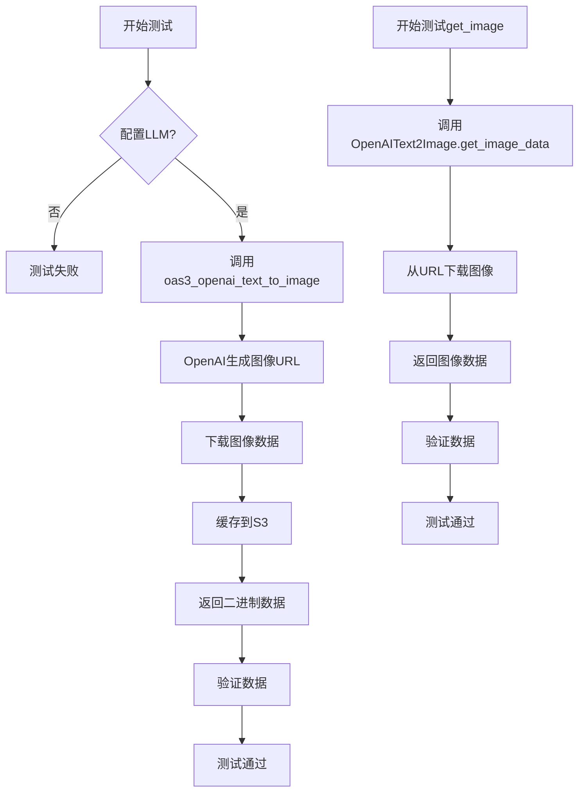
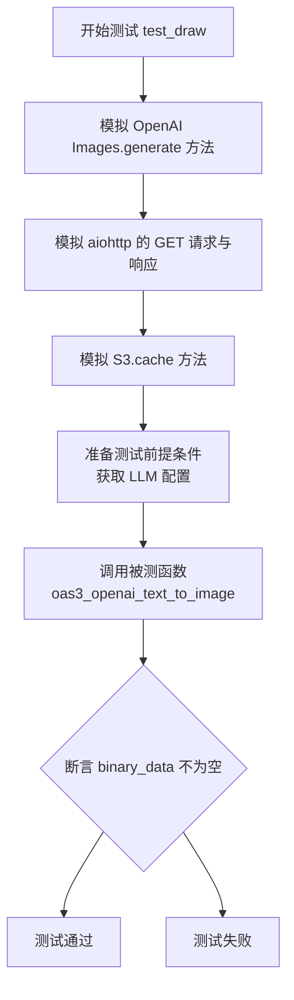

# `.\MetaGPT\tests\metagpt\tools\test_openai_text_to_image.py` 详细设计文档

这是一个测试文件，用于验证OpenAI文本转图像功能的核心流程。它包含两个异步测试函数：第一个函数测试完整的文本到图像的生成流程，包括调用OpenAI API生成图像URL、下载图像数据以及将图像缓存到S3存储；第二个函数测试从指定URL获取图像数据的功能。测试使用了pytest框架和mock技术来模拟外部依赖，确保测试的独立性和可靠性。

## 整体流程



## 类结构

```
BaseModel (pydantic)
├── _MockData (测试内部类)
OpenAIText2Image (外部类)
LLM (外部类)
S3 (外部类)
```

## 全局变量及字段


### `_MockData.data`
    
存储OpenAI图像生成API返回的URL列表的字段。

类型：`list`
    
    

## 全局函数及方法


### `test_draw`

这是一个使用 `pytest` 和 `mocker` 编写的异步单元测试函数，用于测试 `oas3_openai_text_to_image` 函数的功能。该测试通过模拟（mock）所有外部依赖（如 OpenAI API 调用、HTTP 请求和 S3 存储操作）来验证函数在给定文本提示和 LLM 配置时，能够成功生成并返回图像数据。

参数：

-  `mocker`：`pytest_mock.plugin.MockerFixture`，pytest-mock 插件提供的模拟对象，用于创建和管理测试中的模拟（mock）和打桩（stub）。

返回值：`None`，测试函数通常不显式返回值，其成功与否由内部的断言（`assert`）决定。

#### 流程图



#### 带注释源码

```python
@pytest.mark.asyncio  # 标记此函数为异步测试函数
async def test_draw(mocker):  # 定义异步测试函数，接收 mocker 参数用于模拟
    # mock
    # 1. 模拟 OpenAI API 的响应
    mock_url = mocker.Mock()  # 创建一个模拟的 URL 对象
    mock_url.url.return_value = "http://mock.com/0.png"  # 设置模拟对象的 url 方法返回一个假 URL

    class _MockData(BaseModel):  # 定义一个 Pydantic 模型来模拟 OpenAI 返回的数据结构
        data: list  # 模拟的 data 字段，是一个列表

    mock_data = _MockData(data=[mock_url])  # 创建模拟数据实例，data 列表包含上面模拟的 URL 对象
    # 将 openai.resources.images.AsyncImages 类的 generate 方法替换为返回模拟数据的函数
    mocker.patch.object(openai.resources.images.AsyncImages, "generate", return_value=mock_data)

    # 2. 模拟 aiohttp 的 HTTP GET 请求（用于下载图像）
    mock_post = mocker.patch("aiohttp.ClientSession.get")  # 打桩 aiohttp 的 get 方法
    mock_response = mocker.AsyncMock()  # 创建一个异步模拟对象作为响应
    mock_response.status = 200  # 设置响应状态码为 200 (成功)
    mock_response.read.return_value = base64.b64encode(b"success")  # 设置读取响应体时返回模拟的 base64 编码数据
    # 设置异步上下文管理器（__aenter__）的返回值为模拟的响应对象
    mock_post.return_value.__aenter__.return_value = mock_response

    # 3. 模拟 S3 存储的缓存操作
    mocker.patch.object(S3, "cache", return_value="http://mock.s3.com/0.png")  # 将 S3.cache 方法替换为返回假 S3 URL 的函数

    # Prerequisites
    # 准备测试的前提条件：获取 OpenAI LLM 配置
    llm_config = config.get_openai_llm()
    assert llm_config  # 断言配置获取成功

    # 调用被测试的核心函数 oas3_openai_text_to_image
    # 参数1: 文本提示 "Panda emoji"
    # 参数2: 使用上面获取的配置创建的 LLM 实例
    binary_data = await oas3_openai_text_to_image("Panda emoji", llm=LLM(llm_config=llm_config))
    # 核心断言：验证函数调用成功并返回了非空的二进制图像数据
    assert binary_data
```


### `OpenAIText2Image.get_image_data`

这是一个异步类方法，用于从指定的URL下载图像数据。它通过HTTP GET请求获取图像，并返回图像的二进制数据。

参数：

-  `url`：`str`，要下载的图像资源的URL地址。

返回值：`bytes`，成功下载的图像二进制数据。

#### 流程图

```mermaid
flowchart TD
    A[开始: get_image_data(url)] --> B[发起异步HTTP GET请求到url]
    B --> C{请求状态码是否为200?}
    C -- 是 --> D[读取响应体数据]
    D --> E[返回二进制数据]
    C -- 否 --> F[抛出异常或返回None]
    F --> G[结束]
    E --> G
```

#### 带注释源码

```python
    @classmethod
    async def get_image_data(cls, url: str) -> bytes:
        """
        从给定的URL下载图像数据。
        Args:
            url (str): 图像资源的URL。
        Returns:
            bytes: 图像的二进制数据。
        """
        # 导入异步HTTP客户端
        import aiohttp

        # 创建一个异步HTTP客户端会话
        async with aiohttp.ClientSession() as session:
            # 发起异步GET请求到指定的URL
            async with session.get(url) as response:
                # 检查HTTP响应状态码是否为200（成功）
                if response.status == 200:
                    # 读取响应体并返回二进制数据
                    data = await response.read()
                    return data
                # 如果状态码不是200，可以选择抛出异常或返回None
                # 这里根据上下文，测试用例期望返回非空数据，因此失败时可能返回None或抛出异常
                # 实际实现中应考虑更完善的错误处理
                return None
```


## 关键组件


### OpenAIText2Image

封装了调用OpenAI DALL-E模型生成图像的核心功能，包括图像生成请求的发起和生成图像数据的获取。

### oas3_openai_text_to_image

一个全局函数，作为OpenAI文本转图像功能的主要对外接口，接收文本提示词和LLM配置，协调调用OpenAIText2Image组件生成图像并返回二进制数据。

### S3 (外部依赖)

用于图像生成后的存储与缓存，将生成的图像数据上传至S3对象存储并返回可访问的URL，实现资源的持久化和高效分发。

### 异步HTTP客户端 (aiohttp)

作为底层网络通信组件，用于从OpenAI服务或指定的URL异步获取生成的图像二进制数据。

### 配置管理 (config.get_openai_llm)

负责获取和提供调用OpenAI服务所需的配置信息，如API密钥、模型参数等，是连接业务逻辑与外部服务的桥梁。

### 模拟测试框架 (pytest/mocker)

用于构建单元测试环境，通过模拟（Mock）外部API调用（如OpenAI生成接口、S3上传、HTTP请求）来验证核心业务逻辑的正确性，确保测试的独立性和可靠性。


## 问题及建议


### 已知问题

-   **测试用例对第三方服务（OpenAI API、S3）和网络请求进行了大量模拟（Mock）**：这导致测试主要验证了代码的流程和结构，但未能有效测试与真实外部服务的集成、网络异常处理、API响应格式变化等关键环节。测试的覆盖深度和可靠性不足。
-   **测试用例`test_draw`的模拟设置过于复杂且脆弱**：该测试模拟了`openai.resources.images.AsyncImages.generate`、`aiohttp.ClientSession.get`以及`S3.cache`等多个对象和方法。这种深度模拟使得测试代码与被测实现高度耦合，一旦`oas3_openai_text_to_image`的内部调用逻辑发生改变（例如更换HTTP客户端库或调整调用顺序），测试就容易失败，维护成本高。
-   **缺少对`OpenAIText2Image.get_image_data`方法的异常和边界情况测试**：`test_get_image`测试用例仅使用了一个固定的、有效的百度图片URL进行测试。它没有覆盖诸如无效URL、网络超时、服务器返回非200状态码、响应内容非图片等常见异常场景，无法保证该方法的鲁棒性。
-   **测试用例`test_draw`的断言过于简单**：仅断言`binary_data`不为空，没有验证其内容（例如，是否与模拟的Base64编码数据`"success"`匹配）或格式，测试的验证点不够充分。
-   **存在潜在的资源泄露风险**：在`OpenAIText2Image.get_image_data`方法中（虽然未在提供代码中展示，但根据其功能推断），使用`aiohttp.ClientSession.get`获取网络资源后，必须确保正确关闭响应流。如果实现中未使用`async with`上下文管理器或未手动调用`response.release()`，可能导致连接未正确关闭。

### 优化建议

-   **引入集成测试或契约测试**：为`oas3_openai_text_to_image`和`OpenAIText2Image`等核心功能补充少量集成测试，在可控的测试环境中使用真实的配置（或测试专用的API Key和S3 Bucket）调用真实服务。这可以验证端到端的流程是否畅通，并作为服务契约的保障。同时，保留并简化现有的单元测试，使其专注于核心业务逻辑而非外部调用。
-   **重构并简化单元测试的模拟逻辑**：考虑为`OpenAIText2Image`类或其依赖项创建更高级别的测试替身（Test Double），例如一个简单的Fake类，而不是针对每个底层方法进行逐个模拟。这可以降低测试与实现的耦合度，使测试更专注于功能行为而非实现细节。
-   **补充异常和边界测试用例**：为`OpenAIText2Image.get_image_data`方法增加测试用例，覆盖以下场景：
    -   无效的URL格式。
    -   目标服务器返回404、500等错误状态码。
    -   网络请求超时。
    -   服务器返回的内容类型（Content-Type）不是图像。
    -   响应体为空。
-   **增强测试断言**：在`test_draw`中，除了检查返回值不为空，还应验证返回的`binary_data`是否与模拟中设置的Base64编码数据`b"success"`解码后的内容一致，以确保证据链的正确性。
-   **审查并确保资源安全释放**：检查`OpenAIText2Image.get_image_data`方法的实现代码，确保所有异步HTTP响应都通过`async with`上下文管理器或`try...finally`块确保被正确关闭，避免资源泄露。
-   **考虑将S3缓存功能抽象为可配置的接口**：当前测试中直接模拟了`S3.cache`。在生产代码中，可以考虑将“缓存”或“存储”抽象为一个接口（例如`ImageStorage`），这样在测试时可以轻松替换为内存存储或其他Fake实现，使测试更纯粹，也提高了代码的可测试性和可扩展性。


## 其它


### 设计目标与约束

1. **设计目标**：
   - 提供一个基于 OpenAI DALL·E 模型的文本转图像生成功能。
   - 实现图像数据的异步获取和本地缓存（通过 S3 服务）。
   - 提供易于集成的接口，供上层应用调用。
   - 确保代码具有良好的可测试性，通过模拟（mocking）外部依赖进行单元测试。

2. **设计约束**：
   - 依赖 OpenAI API，需要有效的 API 密钥和网络连接。
   - 依赖 `aiohttp` 库进行异步 HTTP 请求。
   - 依赖 `metagpt.utils.s3.S3` 类进行图像缓存，需要配置 S3 或兼容的对象存储服务。
   - 遵循 `pytest` 框架进行异步测试。

### 错误处理与异常设计

1. **OpenAI API 调用错误**：
   - 在 `oas3_openai_text_to_image` 函数中，如果 OpenAI API 调用失败（如网络错误、认证失败、额度不足），`openai.resources.images.AsyncImages.generate` 方法会抛出 `openai.APIError` 或其子类异常。调用者需要捕获并处理这些异常。

2. **图像下载错误**：
   - 在 `OpenAIText2Image.get_image_data` 方法中，使用 `aiohttp` 下载图像。如果 HTTP 请求失败（如非 200 状态码、网络超时），会抛出 `aiohttp.ClientError` 异常。方法内部应进行适当的错误处理或向上抛出。

3. **缓存写入错误**：
   - 在 `oas3_openai_text_to_image` 函数中，调用 `S3.cache` 方法时，如果 S3 服务不可用或写入失败，可能会抛出异常。当前测试代码通过 Mock 规避了此问题，但生产代码需要考虑此处的错误处理。

4. **输入验证**：
   - 当前代码对输入参数（如 `prompt`）缺乏显式的验证（如非空检查、长度限制）。应在函数入口处添加参数验证，并抛出 `ValueError` 等异常。

### 数据流与状态机

1. **文本到图像生成流程（`oas3_openai_text_to_image`）**：
   - **输入**：用户提供的文本提示（`prompt`）和配置好的 `LLM` 实例。
   - **步骤 1**：调用 `OpenAIText2Image.get_image_data` 方法，内部使用 OpenAI API 生成图像并返回图像的二进制数据。
   - **步骤 2**：将二进制数据传递给 `S3.cache` 方法进行缓存，并返回缓存后的 URL。
   - **输出**：图像的二进制数据。
   - **状态**：此流程是无状态的，每次调用独立完成。

2. **图像数据获取流程（`OpenAIText2Image.get_image_data`）**：
   - **输入**：图像 URL。
   - **步骤 1**：使用 `aiohttp` 异步发起 GET 请求获取图像数据。
   - **步骤 2**：检查 HTTP 响应状态码，若非 200 则处理错误。
   - **步骤 3**：读取响应体并返回二进制数据。
   - **输出**：图像的二进制数据。
   - **状态**：此方法是无状态的。

### 外部依赖与接口契约

1. **外部依赖**：
   - **OpenAI Python SDK (`openai`)**：用于调用 DALL·E 图像生成 API。版本需兼容异步调用。
   - **aiohttp**：用于异步下载生成的图像。版本需支持异步上下文管理器。
   - **pydantic**：用于数据验证和设置。在测试中用于构建 Mock 数据结构。
   - **pytest & pytest-asyncio**：用于编写和运行异步测试。
   - **metagpt.config2.config**：用于获取应用配置（如 OpenAI API 密钥）。
   - **metagpt.utils.s3.S3**：提供对象存储缓存服务。需要实现 `cache` 方法，接收二进制数据并返回一个 URL。

2. **接口契约**：
   - **`oas3_openai_text_to_image(prompt: str, llm: LLM, size: str = "1024x1024") -> bytes`**：
     - 契约：接收文本提示和 LLM 配置，调用 OpenAI 生成图像，缓存后返回图像二进制数据。
     - 前置条件：`llm` 参数必须包含有效的 OpenAI 配置；需要有网络连接。
     - 后置条件：返回有效的图像二进制数据，或抛出异常。
   - **`OpenAIText2Image.get_image_data(url: str) -> bytes`**：
     - 契约：从给定的 URL 异步下载图像数据。
     - 前置条件：`url` 必须是有效的、可访问的图像 URL。
     - 后置条件：返回图像的二进制数据，或抛出 `aiohttp.ClientError`。
   - **`S3.cache(data: bytes, ...) -> str`**：
     - 契约：将二进制数据缓存到对象存储，并返回一个可访问的 URL。
     - 前置条件：S3 客户端必须正确配置；需要有网络连接和写入权限。
     - 后置条件：返回一个有效的 HTTP/HTTPS URL 指向缓存的数据。

### 安全考虑

1. **API 密钥管理**：OpenAI API 密钥通过 `metagpt.config2.config` 管理，应确保其不在代码库中明文存储，而是通过环境变量或安全的配置服务获取。
2. **输入净化**：传递给 OpenAI API 的 `prompt` 应进行适当的净化，防止注入攻击（尽管对于图像生成 API 风险较低，但仍是良好实践）。
3. **URL 验证**：在 `get_image_data` 方法中，应对输入的 `url` 进行基本验证（如格式检查），避免 SSRF（服务器端请求伪造）攻击。当前实现未包含此验证。
4. **缓存数据安全**：缓存到 S3 的图像数据应考虑访问权限控制（如私有存储桶加预签名 URL），避免未授权访问。

### 性能考量

1. **异步操作**：核心的图像生成和下载操作均设计为异步，适合在异步 Web 框架或应用中使用，避免阻塞事件循环。
2. **缓存策略**：通过 S3 缓存生成的图像，可以避免对相同提示词重复调用昂贵的 OpenAI API，提升响应速度并降低成本。缓存键的设计（当前由 `S3.cache` 内部处理）应考虑提示词、图像尺寸等因素。
3. **网络超时与重试**：对 OpenAI API 和图像下载的 HTTP 请求应配置合理的超时时间，并考虑实现重试机制（尤其是对于可重试的错误，如网络抖动）。当前代码未显式设置超时或重试。
4. **二进制数据处理**：直接处理图像二进制数据在内存中进行，对于大图像需注意内存占用。当前场景（1024x1024）通常可接受。

### 可测试性设计

1. **依赖注入**：`oas3_openai_text_to_image` 函数接收 `llm: LLM` 参数，而不是在内部硬性创建，这便于在测试中注入 Mock 对象。
2. **模块化设计**：将图像下载功能分离到 `OpenAIText2Image.get_image_data` 静态方法中，使得这部分逻辑可以独立测试。
3. **广泛的 Mocking**：如测试代码所示，通过 `pytest-mock` 对 `openai` API、`aiohttp` 请求以及 `S3.cache` 方法进行了完整的 Mock，实现了单元测试的隔离，不依赖外部服务。
4. **异步测试支持**：使用 `pytest.mark.asyncio` 装饰器支持异步测试函数的执行。

    