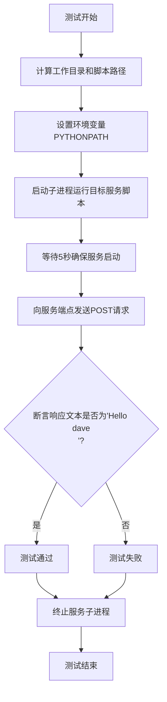
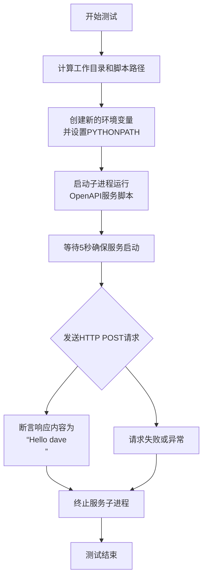

# `.\MetaGPT\tests\metagpt\tools\test_openapi_v3_hello.py` 详细设计文档

这是一个使用 pytest 框架编写的异步集成测试脚本，用于测试一个名为 `openapi_v3_hello.py` 的 OpenAPI v3 服务。其核心功能是：启动一个本地服务进程，等待其就绪后，向该服务的特定端点（`/openapi/greeting/dave`）发送一个 POST 请求，并验证返回的响应内容是否为预期的问候语 'Hello dave\n'，最后确保测试结束后终止服务进程。

## 整体流程



## 类结构

```
本文件不包含自定义类。它是一个包含单个测试函数的脚本。
```

## 全局变量及字段


### `workdir`
    
表示项目根目录的Path对象，用于定位脚本文件和设置工作目录。

类型：`pathlib.Path`
    


### `script_pathname`
    
表示要测试的OpenAPI v3脚本的完整路径。

类型：`pathlib.Path`
    


### `env`
    
包含环境变量的字典，用于设置子进程的执行环境，特别是PYTHONPATH。

类型：`dict`
    


### `process`
    
表示启动的Python子进程对象，用于运行OpenAPI v3脚本。

类型：`subprocess.Popen`
    


### `url`
    
测试请求的目标URL，指向本地运行的OpenAPI服务的greeting端点。

类型：`str`
    


### `headers`
    
HTTP请求头字典，包含accept和Content-Type字段，用于指定请求和响应的格式。

类型：`dict`
    


### `data`
    
HTTP请求的JSON数据负载，在此测试中为空字典。

类型：`dict`
    


### `response`
    
表示对OpenAPI服务发送POST请求后返回的HTTP响应对象。

类型：`requests.Response`
    


    

## 全局函数及方法


### `test_hello`

这是一个使用 `pytest` 框架编写的异步测试函数。它的核心功能是启动一个本地的 OpenAPI 服务进程，然后向该服务发送一个 HTTP POST 请求，并验证返回的响应内容是否符合预期（即返回 "Hello dave\n"）。测试完成后，无论成功与否，都会终止之前启动的服务进程。

参数：

-  `context`：`pytest` 的 `fixture` 对象，用于获取测试上下文环境，特别是用于创建新的环境变量字典。

返回值：`None`，`pytest` 测试函数通常不显式返回值，其成功与否由断言（`assert`）决定。

#### 流程图



#### 带注释源码

```python
@pytest.mark.asyncio  # 标记此函数为异步测试函数，以便pytest-asyncio插件处理
async def test_hello(context):  # 定义异步测试函数，接收context fixture
    # 计算项目根目录作为工作目录（脚本所在文件的父目录的父目录的父目录的父目录）
    workdir = Path(__file__).parent.parent.parent.parent
    # 构建要测试的OpenAPI服务脚本的完整路径
    script_pathname = workdir / "metagpt/tools/openapi_v3_hello.py"

    # 从测试上下文中获取一个新的环境变量字典副本，避免污染原环境
    env = context.new_environ()
    # 将项目根目录添加到PYTHONPATH环境变量中，确保脚本能正确导入模块
    env["PYTHONPATH"] = str(workdir) + ":" + env.get("PYTHONPATH", "")

    # 使用subprocess.Popen在后台启动Python进程运行目标脚本
    # cwd: 将工作目录设置为项目根目录
    # env: 使用上面配置好的环境变量
    process = subprocess.Popen(["python", str(script_pathname)], cwd=workdir, env=env)
    # 异步等待5秒，给予服务足够的启动时间
    await asyncio.sleep(5)

    try:
        # 定义要请求的URL（向名为'dave'的用户发送问候）
        url = "http://localhost:8082/openapi/greeting/dave"
        # 设置HTTP请求头，指定接受纯文本，并发送JSON格式数据（虽然data为空）
        headers = {"accept": "text/plain", "Content-Type": "application/json"}
        data = {}  # 请求体数据，此处为空字典
        # 使用requests库发送POST请求
        response = requests.post(url, headers=headers, json=data)
        # 断言：响应的文本内容必须严格等于"Hello dave\n"
        assert response.text == "Hello dave\n"
    finally:
        # 无论try块中的代码是否成功（断言通过或失败）或发生异常，
        # 都执行此finally块，确保启动的服务进程被终止，避免残留进程。
        process.terminate()
```


## 关键组件


### 测试框架与异步执行

使用pytest框架组织异步测试用例，通过asyncio管理并发，验证OpenAPI服务接口的功能正确性。

### 子进程管理

通过subprocess模块启动独立的Python进程运行目标服务脚本，实现测试环境与待测服务的隔离。

### 环境变量配置

动态构建测试环境变量，特别是PYTHONPATH的设置，确保子进程能够正确导入项目模块。

### HTTP接口测试

使用requests库向本地启动的OpenAPI服务发送POST请求，验证接口的请求响应行为与数据格式。

### 资源清理与异常处理

通过try-finally结构确保测试执行后（无论成功或失败）正确终止子进程，避免资源泄漏。


## 问题及建议


### 已知问题

-   **硬编码的等待时间**：测试中使用 `await asyncio.sleep(5)` 等待服务启动，这是一个脆弱的假设。如果服务启动时间超过5秒（例如在资源受限的机器上），测试将失败；如果服务启动更快，则浪费了测试时间。
-   **潜在的僵尸进程**：测试在 `finally` 块中调用了 `process.terminate()`，但如果进程在终止信号后没有正常退出，可能会留下僵尸进程。代码没有等待进程完全结束。
-   **端口冲突风险**：测试假设端口 `8082` 始终可用。如果该端口已被占用，子进程将启动失败，导致测试失败。
-   **脆弱的断言**：断言 `assert response.text == "Hello dave\n"` 依赖于服务返回的精确格式（包括换行符 `\n`）。如果服务端的响应格式发生微小变化（例如去掉换行符），即使核心功能正确，测试也会失败。
-   **缺少服务健康检查**：测试在发送请求前，没有验证服务是否已真正启动并准备好接收请求，仅依赖于固定的睡眠时间。
-   **环境变量污染**：测试通过修改 `env["PYTHONPATH"]` 来设置环境，这可能会意外地影响子进程或测试框架本身的行为，尤其是在并行测试时。
-   **同步请求阻塞异步测试**：在标记为 `@pytest.mark.asyncio` 的异步测试函数中，使用了同步的 `requests.post` 进行HTTP调用。这会阻塞整个事件循环，违背了异步测试的初衷，可能影响测试性能或在复杂场景下导致问题。

### 优化建议

-   **实现动态服务等待**：使用轮询机制（例如，尝试连接服务端口或调用一个健康检查端点）来确认服务已就绪，代替固定的 `sleep`。可以设置一个合理的超时时间。
-   **完善进程管理**：在 `finally` 块中，先使用 `process.terminate()`，然后调用 `process.wait()` 或 `process.communicate()` 来确保进程资源被正确回收。
-   **使用动态或可配置端口**：让测试服务使用随机可用端口（例如端口0，让系统分配），或者从配置文件/环境变量中读取端口号，以减少冲突。
-   **使用更健壮的断言**：断言可以检查响应的状态码（如 `assert response.status_code == 200`）和响应内容的核心部分（如 `assert "Hello dave" in response.text`），而不是完全匹配整个字符串。
-   **添加服务健康检查**：在发送正式请求前，先向服务的根路径或特定的健康检查端点发送一个 `GET` 请求，确保服务已正常运行。
-   **隔离测试环境**：考虑使用 `pytest` 的 `monkeypatch` 或 `tmp_path` 等夹具来更安全地管理测试环境变量和工作目录，避免污染全局环境。
-   **使用异步HTTP客户端**：将同步的 `requests` 调用替换为异步HTTP客户端库（如 `aiohttp` 或 `httpx`），使整个测试流程保持异步，提高效率并符合测试函数的异步设计。
-   **考虑使用测试夹具管理服务生命周期**：可以将服务的启动、健康检查和停止逻辑封装到一个 `pytest` 夹具中（例如 `session` 或 `module` 作用域的夹具），这样可以被多个测试用例复用，并使测试函数更简洁、专注于业务逻辑验证。


## 其它


### 设计目标与约束

本测试代码的设计目标是验证一个基于OpenAPI v3规范的简单HTTP服务（`openapi_v3_hello.py`）的核心功能是否正常工作。主要约束包括：1) 测试环境需要能够启动外部Python进程并运行指定脚本；2) 测试需要等待服务启动完成（通过固定延时实现）；3) 测试完成后必须确保清理启动的外部进程，避免资源泄漏。

### 错误处理与异常设计

代码中的错误处理主要通过`try...finally`块实现，确保无论测试断言是否通过，都会执行`process.terminate()`来终止启动的子进程。这防止了测试失败后后台进程继续运行。然而，当前设计对子进程启动失败、服务启动超时或HTTP请求失败（如连接拒绝）等异常情况没有显式的捕获和处理，这些错误可能导致测试报告不够清晰或进程清理不彻底。

### 数据流与状态机

1.  **初始化阶段**：设置工作目录、脚本路径和环境变量（特别是`PYTHONPATH`）。
2.  **服务启动阶段**：通过`subprocess.Popen`异步启动目标服务脚本。进入一个5秒的等待状态（`await asyncio.sleep(5)`），这是一个简单的、假设服务已就绪的延时。
3.  **测试执行阶段**：向服务的特定端点（`/openapi/greeting/dave`）发起HTTP POST请求，并验证响应内容是否为`"Hello dave\n"`。
4.  **清理阶段**：无论测试成功与否，在`finally`块中终止启动的子进程。

状态转换简单：`初始化 -> 启动中 -> 测试中 -> 清理`。缺少对“服务就绪”状态的明确检查。

### 外部依赖与接口契约

1.  **外部依赖**：
    *   `pytest` & `pytest-asyncio`：测试框架，用于组织异步测试用例。
    *   `requests`：用于向被测服务发起HTTP请求。
    *   被测服务 (`metagpt/tools/openapi_v3_hello.py`)：这是一个外部Python脚本，预期启动一个监听`localhost:8082`的HTTP服务，并提供符合特定OpenAPI规范的`/openapi/greeting/{name}`端点。
2.  **接口契约**：
    *   **服务接口**：测试假设服务在`localhost:8082`上可用，`POST /openapi/greeting/dave` 请求（携带指定的headers和空JSON body）应返回状态码200及文本内容`"Hello dave\n"`。
    *   **测试框架接口**：测试函数`test_hello`接收一个`context` fixture（具体类型和来源由上层测试配置决定），主要利用其`new_environ`方法获取环境变量副本。
    *   **进程接口**：通过`subprocess.Popen`与子进程交互，仅使用了启动和终止功能。

### 安全考虑

1.  **进程管理**：代码确保了测试后终止子进程，避免了孤儿进程。但固定5秒等待可能在某些慢速环境下不足，导致请求失败；或在快速环境下浪费测试时间。
2.  **网络请求**：测试向本地回环地址(`localhost`)发送请求，不涉及外部网络风险。
3.  **依赖注入**：通过`context.new_environ()`获取环境变量，避免了直接修改全局环境，提供了较好的测试隔离性。
4.  **硬编码**：服务URL、端口和预期响应在代码中硬编码，降低了配置灵活性，但鉴于这是单元测试，尚可接受。

### 可测试性设计

1.  **隔离性**：测试在一个独立的子进程中启动服务，并通过`finally`块保证清理，与主测试进程隔离。
2.  **确定性尝试**：通过固定延时等待服务启动，但这不是一个健壮的就绪检查机制。更优的做法是轮询服务健康端点或检查端口直到可用。
3.  **断言明确**：断言直接检查HTTP响应体的文本内容，清晰明确。
4.  **可改进点**：测试用例对服务的启动时间、资源占用、多请求并发等非功能性方面没有覆盖。服务的主机名、端口、预期响应等可考虑参数化以提高灵活性。

    