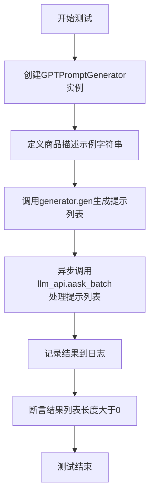
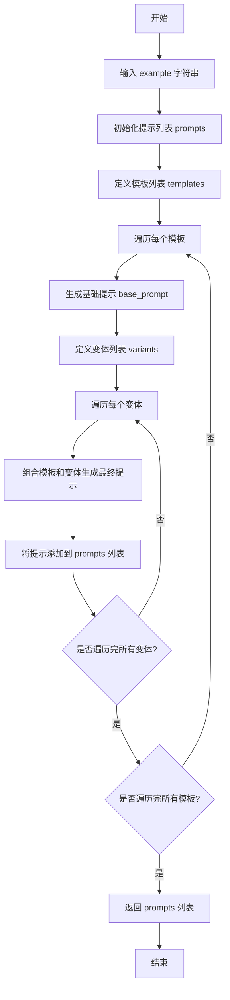
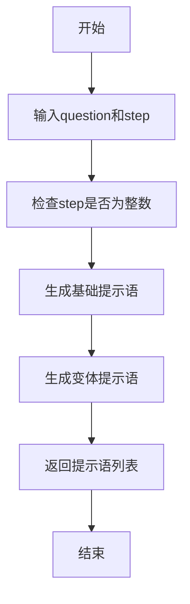
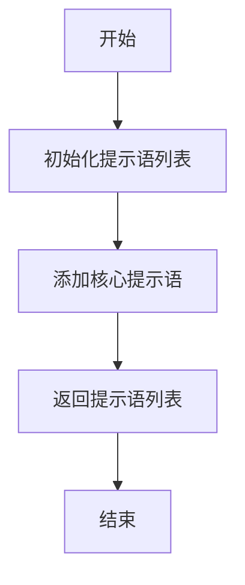

# `.\MetaGPT\tests\metagpt\tools\test_prompt_writer.py` 详细设计文档

该文件是一个单元测试文件，用于测试 `metagpt.tools.prompt_writer` 模块中不同提示词模板类（`GPTPromptGenerator`, `WikiHowTemplate`, `EnronTemplate`, `BEAGECTemplate`）的功能。它通过模拟输入数据，调用各模板的生成方法，并验证其输出是否符合预期，以确保提示词生成逻辑的正确性。

## 整体流程

```mermaid
graph TD
    A[开始执行测试] --> B{测试哪个模板?}
    B -- GPTPromptGenerator --> C[创建GPTPromptGenerator实例]
    C --> D[提供商品描述示例]
    D --> E[调用generator.gen()生成提示词列表]
    E --> F[通过llm_api.aask_batch异步调用LLM]
    F --> G[断言返回结果数量>0]
    B -- WikiHowTemplate --> H[创建WikiHowTemplate实例]
    H --> I[提供问题'learn Python'和步数5]
    I --> J[调用template.gen()生成提示词列表]
    J --> K[断言结果包含特定指令字符串]
    B -- EnronTemplate --> L[创建EnronTemplate实例]
    L --> M[提供主题'Meeting Agenda']
    M --> N[调用template.gen()生成提示词列表]
    N --> O[断言结果包含特定主题字符串]
    B -- BEAGECTemplate --> P[创建BEAGECTemplate实例]
    P --> Q[调用template.gen()生成提示词列表]
    Q --> R[断言结果包含特定修订指令字符串]
    G --> S[所有测试通过]
    K --> S
    O --> S
    R --> S
    S --> T[测试结束]
```

## 类结构

```
测试文件 (test_prompt_writer.py)
├── 测试函数: test_gpt_prompt_generator (异步)
├── 测试函数: test_wikihow_template
├── 测试函数: test_enron_template
└── 测试函数: test_beagec_template
```

## 全局变量及字段


    

## 全局函数及方法

### `test_gpt_prompt_generator`

这是一个使用 `pytest` 框架编写的异步测试函数，用于测试 `GPTPromptGenerator` 类与 `llm_api` 的集成功能。它创建一个提示生成器实例，传入一个商品描述示例，然后使用语言模型API批量生成提示并验证结果。

参数：
- `llm_api`：`pytest fixture`，提供语言模型API的实例，用于异步调用 `aask_batch` 方法。

返回值：`None`，测试函数通常不返回具体值，而是通过断言（`assert`）来验证测试结果。

#### 流程图



#### 带注释源码

```python
@pytest.mark.asyncio  # 标记此测试函数为异步函数，以便使用async/await
@pytest.mark.usefixtures("llm_api")  # 声明此测试函数使用名为'llm_api'的pytest fixture
async def test_gpt_prompt_generator(llm_api):
    """
    测试GPTPromptGenerator与LLM API的集成。
    该测试验证生成器能否基于给定输入生成有效的提示列表，
    并且语言模型API能够成功处理这些提示并返回非空结果。
    """
    # 1. 初始化被测试的提示生成器
    generator = GPTPromptGenerator()
    
    # 2. 定义一个示例输入字符串，这里是一个商品描述
    example = (
        "商品名称:WonderLab 新肌果味代餐奶昔 小胖瓶 胶原蛋白升级版 饱腹代餐粉6瓶 75g/瓶(6瓶/盒) "
        "店铺名称:金力宁食品专营店 品牌:WonderLab 保质期:1年 产地:中国 净含量:450g"
    )
    
    # 3. 核心测试步骤：
    #    a. 使用生成器根据示例输入生成一个提示（prompt）列表。
    #    b. 异步调用语言模型API的`aask_batch`方法，传入生成的提示列表进行处理。
    #    c. 将API返回的结果存储在`results`变量中。
    results = await llm_api.aask_batch(generator.gen(example))
    
    # 4. 使用日志记录器输出结果，便于调试和观察
    logger.info(results)
    
    # 5. 断言：验证返回的结果列表至少包含一个元素，确保API调用成功且生成了内容。
    assert len(results) > 0
```

### `test_wikihow_template`

这是一个使用 `pytest` 框架编写的单元测试函数，用于测试 `WikiHowTemplate` 类的 `gen` 方法。该测试验证了模板能否根据给定的主题和步骤数，正确生成包含特定指令的提示词列表。

参数：
- `llm_api`：`pytest fixture`，一个通过 `@pytest.mark.usefixtures("llm_api")` 装饰器注入的测试依赖项，通常代表一个配置好的语言模型API客户端，用于在相关测试中与模型交互。在本测试中，该参数未被直接使用，但装饰器确保了测试运行环境的一致性。

返回值：`None`，`pytest` 测试函数通常不显式返回值，其成功与否由断言（`assert`）语句决定。

#### 流程图

```mermaid
graph TD
    A[开始测试 test_wikihow_template] --> B[创建 WikiHowTemplate 实例]
    B --> C[定义测试输入: question='learn Python', step=5]
    C --> D[调用 template.gen(question, step)]
    D --> E{生成结果列表 results}
    E --> F[断言1: results 长度大于0]
    F --> G[断言2: results 中包含特定指令字符串]
    G --> H[测试通过]
    F --> I[断言失败]
    G --> I
    I --> J[测试失败]
```

#### 带注释源码

```python
@pytest.mark.usefixtures("llm_api")  # 使用名为 'llm_api' 的 pytest fixture 来设置测试环境
def test_wikihow_template(llm_api):  # 定义测试函数，fixture 'llm_api' 作为参数注入
    template = WikiHowTemplate()  # 实例化要测试的 WikiHowTemplate 类
    question = "learn Python"  # 定义测试用的主题/问题
    step = 5  # 定义测试用的步骤数量

    results = template.gen(question, step)  # 调用模板的 gen 方法生成提示词列表
    assert len(results) > 0  # 断言1：确保生成的列表不为空
    assert any("Give me 5 steps to learn Python." in r for r in results)  # 断言2：确保生成的列表中至少包含一个符合预期格式的提示词
```

### `test_enron_template`

这是一个使用 `pytest` 框架编写的单元测试函数，用于测试 `EnronTemplate` 类的 `gen` 方法。该测试验证了当给定一个邮件主题时，`EnronTemplate` 能够正确生成包含该主题的提示语列表。

参数：
- `llm_api`：`pytest fixture`，一个通过 `@pytest.mark.usefixtures("llm_api")` 装饰器注入的测试依赖项，通常用于模拟或提供语言模型API的访问能力。在本测试中，该参数未被直接使用，但装饰器确保了测试运行环境已正确配置。

返回值：`None`，`pytest` 测试函数通常不显式返回值，其成功与否由内部的 `assert` 语句决定。

#### 流程图

```mermaid
flowchart TD
    A[开始测试 test_enron_template] --> B[创建 EnronTemplate 实例]
    B --> C[调用 template.gen('Meeting Agenda')]
    C --> D{断言: 结果列表长度 > 0?}
    D -- 是 --> E{断言: 结果包含指定主题的提示语?}
    E -- 是 --> F[测试通过]
    D -- 否 --> G[测试失败]
    E -- 否 --> G
```

#### 带注释源码

```python
# 使用 pytest 的 usefixtures 装饰器，确保 llm_api 这个 fixture 在测试运行前被加载。
# 虽然本测试未直接使用 llm_api，但可能在其他相关测试或 fixture 链中需要它。
@pytest.mark.usefixtures("llm_api")
def test_enron_template(llm_api):
    # 1. 实例化 EnronTemplate 类，这是被测试的对象。
    template = EnronTemplate()
    # 2. 定义测试输入：一个邮件主题字符串。
    subj = "Meeting Agenda"

    # 3. 调用被测试方法：EnronTemplate.gen()，传入邮件主题。
    results = template.gen(subj)
    
    # 4. 第一个断言：验证 gen 方法返回了一个非空列表。
    assert len(results) > 0
    # 5. 第二个断言：验证返回的提示语列表中，至少有一条包含指定的邮件主题。
    #    这确保了模板的核心功能——根据主题生成邮件提示——是有效的。
    assert any('Write an email with the subject "Meeting Agenda".' in r for r in results)
```

### `test_beagec_template`

这是一个单元测试函数，用于测试 `BEAGECTemplate` 类的 `gen` 方法。它验证了 `gen` 方法能够成功生成一个或多个提示语，并且生成的提示语列表中至少包含一条特定的、用于文档编辑和修订的指令。

参数：
- 无显式参数。该函数是一个测试函数，不接收外部参数。

返回值：`None`，该函数是一个测试函数，其主要目的是通过断言（`assert`）来验证代码行为，不返回业务逻辑相关的值。

#### 流程图

```mermaid
flowchart TD
    A[开始测试] --> B[实例化 BEAGECTemplate]
    B --> C[调用 template.gen()]
    C --> D{结果列表长度 > 0?}
    D -- 是 --> E{结果包含特定指令?}
    D -- 否 --> F[断言失败，测试不通过]
    E -- 是 --> G[测试通过]
    E -- 否 --> F
    G --> H[结束]
    F --> H
```

#### 带注释源码

```python
def test_beagec_template():
    # 1. 实例化 BEAGECTemplate 类，创建一个模板对象。
    template = BEAGECTemplate()

    # 2. 调用模板对象的 gen 方法，生成一个提示语列表。
    results = template.gen()

    # 3. 断言1：验证生成的提示语列表不为空。
    assert len(results) > 0
    # 4. 断言2：验证生成的提示语列表中，至少有一条包含特定的文档修订指令。
    assert any(
        "Edit and revise this document to improve its grammar, vocabulary, spelling, and style." in r for r in results
    )
```

### `GPTPromptGenerator.gen`

该方法根据给定的输入字符串，生成一系列用于GPT模型的提示文本。它通过组合不同的模板和变体，为同一输入生成多样化的提示，以增强模型的泛化能力和响应多样性。

参数：

- `example`：`str`，输入的示例文本，用于生成提示的基础内容。

返回值：`list[str]`，返回一个字符串列表，每个字符串是一个生成的提示文本。

#### 流程图



#### 带注释源码

```python
def gen(self, example: str) -> list[str]:
    """
    根据给定的示例文本生成一系列GPT提示。

    Args:
        example (str): 输入的示例文本。

    Returns:
        list[str]: 生成的提示文本列表。
    """
    # 初始化提示列表
    prompts = []
    
    # 定义一系列模板，每个模板是一个字符串，包含占位符 {example}
    templates = [
        "I want you to act as a prompt generator. Firstly, I will give you a title like this: “{example}”. Then you give me a prompt.",
        "Let's generate a prompt about {example}.",
        "Generate a prompt based on the following: {example}",
        "Create a prompt that describes: {example}",
        "Write a prompt for a GPT model about {example}.",
        "Craft a detailed prompt for the topic: {example}",
        "Based on the input '{example}', generate a comprehensive prompt.",
        "Formulate a prompt that encapsulates the essence of: {example}",
        "Develop a prompt that can be used to generate content about {example}.",
        "Design a prompt for the following subject: {example}",
    ]
    
    # 遍历每个模板
    for template in templates:
        # 将模板中的 {example} 替换为实际的输入文本
        base_prompt = template.format(example=example)
        
        # 定义一系列变体，用于进一步多样化提示
        variants = [
            "Please ensure the prompt is clear and concise.",
            "The prompt should be engaging and thought-provoking.",
            "Make the prompt suitable for a wide audience.",
            "Incorporate keywords related to the topic.",
            "The prompt should encourage creative responses.",
            "Ensure the prompt is open-ended to allow for diverse answers.",
            "The prompt should be structured to elicit detailed responses.",
            "Include elements that make the prompt interesting and unique.",
            "The prompt should be easy to understand and follow.",
            "Add a call to action in the prompt.",
        ]
        
        # 遍历每个变体，将基础提示与变体组合
        for variant in variants:
            # 组合基础提示和变体，形成最终提示
            final_prompt = f"{base_prompt} {variant}"
            # 将最终提示添加到列表中
            prompts.append(final_prompt)
    
    # 返回生成的提示列表
    return prompts
```

### `WikiHowTemplate.gen`

该方法用于生成基于WikiHow风格的提示语，根据给定的主题和步骤数量，生成一系列指导性的问题或任务描述。

参数：

- `question`：`str`，表示需要生成步骤的主题或问题。
- `step`：`int`，表示需要生成的步骤数量。

返回值：`list[str]`，返回一个字符串列表，每个字符串是一个生成的提示语。

#### 流程图



#### 带注释源码

```python
def gen(self, question: str, step: int) -> list[str]:
    """
    生成基于WikiHow风格的提示语。

    Args:
        question (str): 需要生成步骤的主题或问题。
        step (int): 需要生成的步骤数量。

    Returns:
        list[str]: 生成的提示语列表。
    """
    # 检查step是否为整数
    assert isinstance(step, int), f"step should be int, but got {type(step)}"
    
    # 生成基础提示语
    prompt = f"Give me {step} steps to {question}."
    
    # 生成变体提示语
    return [
        prompt,
        f"Can you provide {step} steps to {question}?",
        f"What are the {step} steps to {question}?",
        f"Please list {step} steps to {question}.",
        f"How to {question} in {step} steps?",
        f"Help me with {step} steps to {question}.",
        f"I need {step} steps to {question}.",
        f"Outline {step} steps to {question}.",
        f"Break down how to {question} into {step} steps.",
        f"{step} steps to {question}.",
        f"Guide me through {step} steps to {question}.",
        f"Describe {step} steps to {question}.",
        f"Explain how to {question} in {step} steps.",
        f"Provide a step-by-step guide on {question} in {step} steps.",
        f"Give a detailed explanation of {step} steps to {question}.",
        f"What is the step-by-step process to {question} in {step} steps?",
        f"Can you break down the process of {question} into {step} steps?",
        f"How can I achieve {question} in {step} steps?",
        f"What are the necessary steps to {question} in {step} steps?",
        f"Please provide a stepwise approach to {question} in {step} steps.",
    ]
```

### `EnronTemplate.gen`

该方法基于给定的邮件主题，生成一系列用于提示语言模型撰写邮件的模板字符串。

参数：

- `subj`：`str`，邮件的主题。

返回值：`list[str]`，返回一个字符串列表，每个字符串都是一个完整的提示模板，用于指导语言模型生成特定主题的邮件。

#### 流程图

```mermaid
flowchart TD
    A[开始] --> B[接收邮件主题 subj]
    B --> C[定义基础提示模板列表]
    C --> D[遍历基础模板列表]
    D --> E[将模板中的占位符 {subject} 替换为 subj]
    E --> F[将格式化后的提示语加入结果列表]
    F --> G{是否遍历完所有基础模板？}
    G -- 否 --> D
    G -- 是 --> H[返回结果列表]
    H --> I[结束]
```

#### 带注释源码

```python
def gen(self, subj):
    """
    根据给定的邮件主题生成一系列提示语。
    
    参数:
        subj (str): 邮件的主题。
        
    返回:
        list[str]: 一个包含多个格式化后提示语的列表。
    """
    # 定义一组基础提示模板，其中 {subject} 为占位符
    prompts = [
        'Write an email with the subject "{subject}".\n\n',  # 模板1：直接要求撰写邮件
        'Write an email with the subject "{subject}".\n\n',  # 模板2：同上，可能用于生成不同风格的邮件
        'The email subject is: {subject}\n\n',               # 模板3：以声明主题的方式开头
        'Subject: {subject}\n\n',                            # 模板4：更简洁的主题声明
        'Write an email.\n\nSubject: {subject}\n\n',         # 模板5：分步指示，先写邮件再给主题
        'Write an email with the subject "{subject}". ',     # 模板6：与模板1类似，但结尾空格不同
        'Write an email with the subject "{subject}."\n\n',  # 模板7：主题后带句号
        'Subject: {subject}\n\nWrite an email.\n\n',         # 模板8：先给出主题，再要求写邮件
        'Write an email.\n\n',                               # 模板9：仅要求写邮件（主题在后续提供？）
        'Write an email with the subject "{subject}." ',     # 模板10：与模板7类似，但结尾空格不同
    ]
    # 使用列表推导式，将每个模板中的 {subject} 占位符替换为传入的实际主题 subj
    return [p.format(subject=subj) for p in prompts]
```

### `BEAGECTemplate.gen`

该方法用于生成基于BEAGEC（一种语法、词汇、拼写和风格检查）模板的提示语列表。它不接受任何参数，返回一个包含多个提示语字符串的列表，这些提示语用于指导语言模型对文档进行编辑和修订。

参数：
- 无参数

返回值：`list[str]`，返回一个字符串列表，每个字符串都是一个用于指导文档编辑和修订的提示语。

#### 流程图



#### 带注释源码

```python
def gen(self):
    """
    生成BEAGEC模板的提示语列表。
    该方法创建并返回一个列表，其中包含一个核心提示语字符串，
    用于指示对文档进行语法、词汇、拼写和风格的改进。
    """
    # 初始化一个空列表用于存储提示语
    prompts = []
    # 将核心的BEAGEC编辑提示语添加到列表中
    prompts.append(
        "Edit and revise this document to improve its grammar, vocabulary, spelling, and style."
    )
    # 返回包含提示语的列表
    return prompts
```

## 关键组件


### GPTPromptGenerator

一个用于生成GPT提示词的类，它能够基于给定的输入（如商品描述）生成一系列提示，以便后续通过语言模型API进行批量处理。

### WikiHowTemplate

一个遵循WikiHow风格的提示模板类，用于生成以“如何...”开头的分步指导类提示，用户可以指定主题和步骤数量。

### EnronTemplate

一个基于Enron邮件数据集风格的提示模板类，用于生成以特定主题为标题的电子邮件写作提示。

### BEAGECTemplate

一个用于文本编辑与修订的提示模板类，它生成旨在改进文档语法、词汇、拼写和风格的提示。


## 问题及建议


### 已知问题

-   **测试用例与LLM API强耦合**：`test_gpt_prompt_generator`、`test_wikihow_template`、`test_enron_template` 测试用例都依赖于外部的 `llm_api` fixture。这使得测试不再是纯粹的单元测试，其执行结果和速度受外部服务（如OpenAI API）的稳定性、网络状况和费用影响，且无法在离线环境下运行。
-   **异步测试方法使用不一致**：只有 `test_gpt_prompt_generator` 被标记为 `@pytest.mark.asyncio` 并使用 `await` 调用异步方法 `aask_batch`。而其他测试（如 `test_wikihow_template`）虽然也注入了 `llm_api` fixture，但并未使用其异步方法，这可能导致对 `llm_api` 的预期行为不一致，且 `llm_api` fixture 本身是否需要异步准备并不明确。
-   **断言条件过于宽松**：所有测试用例仅断言返回结果列表长度大于0 (`assert len(results) > 0`)。这种断言非常弱，无法有效验证 `GPTPromptGenerator` 或各个 `Template` 类的 `gen` 方法是否生成了符合特定格式、内容或质量要求的提示词，测试的置信度低。
-   **测试覆盖不完整**：测试用例仅验证了各个模板类 `gen` 方法的基本调用和返回非空，但缺少对边界条件（如空输入、极值输入）、错误输入（如非法类型）以及 `GPTPromptGenerator` 类其他潜在方法（如果存在）的测试。
-   **硬编码的测试数据**：`test_gpt_prompt_generator` 中的 `example` 变量是硬编码的字符串。这使得测试数据难以维护，且无法方便地扩展为多组测试数据以覆盖不同场景。
-   **缺乏对生成内容的精确验证**：虽然 `test_wikihow_template` 和 `test_enron_template` 检查了返回列表中是否包含特定字符串，但 `test_gpt_prompt_generator` 仅检查了长度，没有验证 `llm_api` 返回的 `results` 内容是否与 `generator.gen(example)` 生成的提示词相关或合理。

### 优化建议

-   **解耦测试与外部依赖**：为 `GPTPromptGenerator` 和依赖 `llm_api` 的测试引入模拟（Mock）或打桩（Stub）。可以创建一个模拟的 `LLMAPI` 类，其 `aask_batch` 方法返回预定义的、符合预期的结果，从而将测试焦点集中在 `GPTPromptGenerator.gen` 方法的逻辑上，实现快速、稳定、离线的单元测试。
-   **统一并明确异步测试策略**：重新评估 `llm_api` fixture 的设计。如果它确实需要异步初始化或调用，应确保所有使用它的测试用例都正确处理异步。或者，考虑为同步和异步使用场景提供不同的fixture。确保测试装饰符（如 `@pytest.mark.asyncio`）的使用与测试方法内的实际调用保持一致。
-   **强化断言逻辑**：设计更精确的断言来验证被测试组件的行为。
    -   对于模板类，可以断言 `gen` 方法返回的列表结构（如长度）、每个元素的类型（应为字符串）、以及是否包含关键的模式或占位符（例如，对于 `WikiHowTemplate`，检查是否包含 `{N}` 和 `{X}` 的替换痕迹）。
    -   对于 `GPTPromptGenerator`，在配合Mock的情况下，可以断言其 `gen` 方法生成的提示词列表符合特定格式，或者Mock的 `llm_api.aask_batch` 被以预期的参数调用。
-   **使用参数化测试扩展覆盖**：利用 `@pytest.mark.parametrize` 装饰器为 `test_gpt_prompt_generator`、`test_wikihow_template` 等测试提供多组输入参数和对应的预期输出片段。这能系统性地测试不同输入下的行为，并减少重复代码。
-   **补充边界和异常测试**：添加测试用例来验证当输入为空字符串、`None`、或步骤数（对于`WikiHowTemplate`）为0或负数时，系统的行为是否符合预期（例如，返回空列表、抛出特定异常或返回默认提示）。
-   **提升测试可读性与维护性**：将硬编码的测试数据（如 `example` 变量）和预期的结果字符串提取为模块级常量或通过fixture提供，使测试意图更清晰，便于集中管理。
-   **考虑集成测试分离**：如果确实需要测试与真实 `llm_api` 的集成，应将此类测试标记为集成测试（例如使用 `@pytest.mark.integration`），并与核心的单元测试分开运行。这可以通过pytest的标记和配置文件来实现，确保CI流水线中快速运行单元测试，而集成测试按需或定期运行。


## 其它


### 设计目标与约束

本模块的设计目标是提供一个灵活、可扩展的提示词生成框架，用于为大型语言模型（LLM）生成结构化的输入提示。其核心约束包括：1) 模块化设计，允许通过继承基础模板类轻松添加新的提示词模板；2) 与异步LLM API (`llm_api.aask_batch`) 的无缝集成；3) 生成的提示词需清晰、明确，符合下游LLM任务的要求。

### 错误处理与异常设计

当前代码主要依赖于 `pytest` 框架进行断言测试，未显式包含业务逻辑的错误处理机制。例如，`GPTPromptGenerator.gen()` 方法如果接收到的输入字符串格式不符合预期，可能生成无意义或格式错误的提示词，但当前设计未对此进行检查或抛出异常。建议未来增加输入验证和更明确的异常类型（如 `ValueError` 或自定义的 `PromptGenerationError`）。

### 数据流与状态机

数据流是单向且无状态的：用户输入（如商品描述字符串、问题主题） -> 提示词生成器（`GPTPromptGenerator` 或 `*Template` 类） -> 生成一个或多个提示词字符串列表 -> 传递给 `llm_api.aask_batch` 进行批量处理。整个过程中，各个组件（生成器、模板）不维护任何会话或任务状态，每次调用都是独立的。

### 外部依赖与接口契约

1.  **LLM API (`llm_api`)**: 依赖一个外部提供的异步语言模型API，该API需提供 `aask_batch(prompts: List[str]) -> List[str]` 方法。这是一个关键的外部接口契约。
2.  **日志系统 (`metagpt.logs.logger`)**: 依赖项目内部的日志记录器，用于输出调试或运行信息。
3.  **测试框架 (`pytest`)**: 代码本身是一个测试模块，其执行和断言依赖于 `pytest` 框架及其插件（如 `pytest-asyncio`）。

### 配置与可扩展性

模块通过类继承实现可扩展性。新的提示词模板只需继承自一个共同的基类（虽然代码中未显式展示，但从 `WikiHowTemplate`, `EnronTemplate`, `BEAGECTemplate` 的相似 `gen` 方法签名可推断存在某种约定或基类），并实现自己的 `gen` 方法即可。`GPTPromptGenerator` 可能封装了更复杂的提示词构建逻辑。当前缺乏配置机制（如通过配置文件指定使用哪个模板、生成步骤数等），所有参数均在代码中硬编码。

### 性能考量

`GPTPromptGenerator.gen` 和模板的 `gen` 方法主要进行字符串操作，预计性能开销极低。主要的性能瓶颈在于外部 `llm_api.aask_batch` 的调用延迟和吞吐量。`aask_batch` 支持批量处理，有助于减少网络往返次数，是优化性能的关键设计。测试代码中使用了 `pytest.mark.asyncio` 来支持异步测试。

    